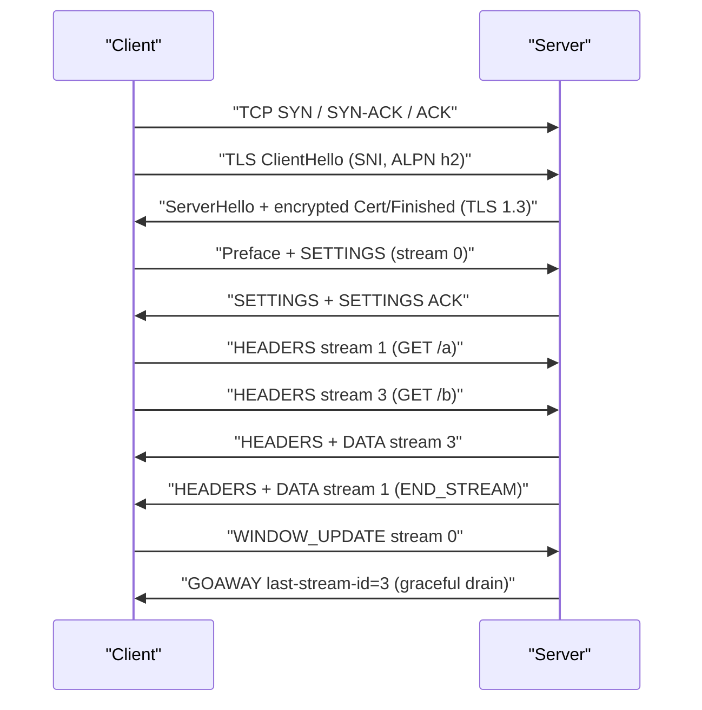
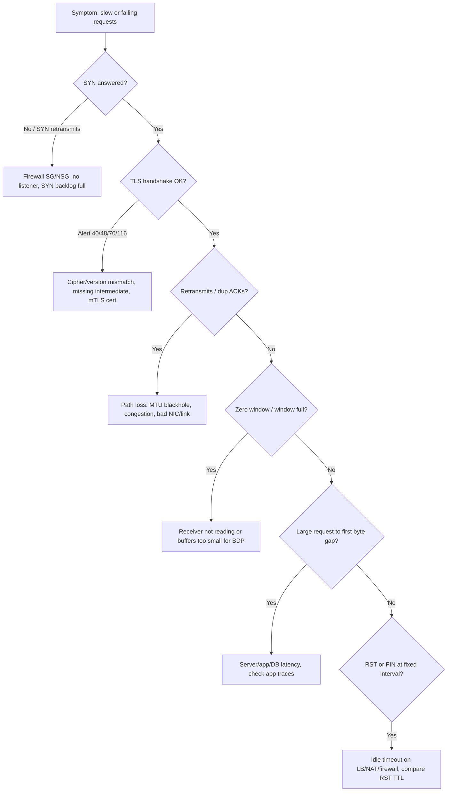

# F8 Analyzing Protocols with Wireshark
> Last verified: 2026-10 · Audience: senior/staff DevOps, SRE, AI eng, NetEng, DevSecOps, architects

## TL;DR
- **Capture filters (BPF)** decide what gets written, so they keep files small. Use them at the source (`tcpdump -i eth0 'tcp port 443'`). **Display filters** (`tcp.analysis.flags && ip.addr==10.0.0.5`) only hide packets during analysis. The two use **different syntaxes**, which is a classic interview trap.
- When triaging a TCP problem, look for **retransmissions, dup ACKs, fast retransmits, zero window, window full, RST, and long gaps in `tcp.time_delta`**. Then decide which case you have: **network loss** (retransmits), a **slow receiver** (zero window), a **slow server** (a big gap between the request and the first response byte, with clean ACKs), or a **policy kill** (RST from a middlebox, or a TTL that does not match the server's).
- **UDP has no handshake, ACKs or retransmits**, so Wireshark can only show datagrams and ICMP port-unreachable. Reliability and ordering are the application's job (DNS retries, QUIC).
- **TLS 1.3 encrypts everything after ServerHello**, including the certificate. Decrypt with the **key log (`SSLKEYLOGFILE`)**. The RSA private key method does not work with (EC)DHE or TLS 1.3. `editcap --inject-secrets` embeds the keys in the pcapng so others can decrypt it.
- **HTTP/2** runs one TCP connection with many **streams** (client stream IDs are odd, server IDs are even) and frames: HEADERS, DATA, SETTINGS, WINDOW_UPDATE, RST_STREAM, GOAWAY, PING. Streams remove HTTP-level head-of-line (HOL) blocking but **not TCP-level HOL**, which is what HTTP/3 over QUIC fixes.
- **MongoDB** listens on 27017, every message has a 16-byte header, and modern traffic is all **OP_MSG (opcode 2013)**. Legacy opcodes (OP_QUERY and others) were **removed in 5.1**, except OP_QUERY `hello`/`isMaster` during the handshake.
- **SSE** is a long-lived HTTP response with `Content-Type: text/event-stream`. It is server-to-client only, auto-reconnects and resumes with `Last-Event-ID`. **WebSockets** are full duplex after a `101 Switching Protocols` upgrade. **Long polling** means repeated hanging requests.
- **Cloud capture:** AWS **VPC Traffic Mirroring** sends a VXLAN copy (UDP 4789) of ENI traffic. Azure **virtual network TAP is (again) in public preview** in selected regions. **Network Watcher packet capture** is Azure's on-demand capture through a VM extension. In Kubernetes, use `kubectl debug` with an ephemeral container that shares the pod's network namespace.

## F8.1 Wiresharking UDP
- **How it works:**
  - The header is 8 bytes: source port, destination port, length and checksum. The checksum is optional in IPv4 and mandatory in IPv6. There is no connection state, so Wireshark's "UDP stream" is just the 5-tuple (`udp.stream`).
  - Typical things to capture are DNS (53), QUIC/HTTP3 (443/udp), NTP, syslog, VXLAN (4789), DHCP (67/68) and Kubernetes overlays.
  - Wireshark picks a dissector by port heuristics. Use **Decode As** to force one, for example UDP 4789 → VXLAN, which Wireshark then decodes into the inner Ethernet/IP frame.
- **What to look for:**
  - **ICMP type 3 code 3 (port unreachable)** right after a datagram means nothing is listening. Filter: `icmp.type==3 && icmp.code==3`.
  - **Request without a response**, for example DNS. Use `dns.flags.response==0 && !dns.response_in` and `dns.time > 0.5` to find slow answers.
  - **IP fragmentation** (`ip.flags.mf==1 || ip.frag_offset>0`) often shows up with large DNS responses or EDNS. Lost fragments mean the whole datagram is lost. Firewalls often drop non-first fragments. See [F6 MTU](F6-network-performance.md).
  - **Checksum errors on outbound packets** usually come from **checksum offload**: the NIC computes the checksum after the capture point. They are not real errors. Turn off validation (the default is already off).
  - **QUIC** shows only `quic` Initial packets in clear text, plus the SNI in the encrypted-but-decodable Initial. Everything else needs the key log.
- **Trade-offs / when to use:** UDP gives you no loss signal in the capture. To confirm loss, capture on **both ends** and compare counts, or check `netstat -su` / `nstat` for `UdpRcvbufErrors` (socket buffer overflow).
- **Interview angles:**
  - "UDP packets vanish, how do you debug?" → Capture at the client, the server and any middlebox. Check `UdpRcvbufErrors` / `UdpInErrors`, ICMP unreachables, fragmentation, and conntrack timeouts on NAT (UDP NAT entries expire after about 30–180 s).
  - Pitfall: treating a dropped datagram as a "retransmission". UDP has none at L4.

## F8.2 Wiresharking TCP/HTTP
### Handshake, teardown, and the timing you should read
- **3-way handshake:** SYN → SYN-ACK → ACK. The **SYN→SYN-ACK delta is roughly the network RTT** (the kernel answers it, not the app). Read the **MSS, window scale, SACK-permitted and timestamps** options from the SYN. If the window scale is missing (for example, the capture started mid-stream), Wireshark shows wrong window sizes.
- **Teardown:** FIN/ACK in each direction (4-way, often 3 packets). An **RST** means an abortive close.
- **Request→first response byte gap** is server processing time (TTFB). Compare it with the handshake RTT to tell "slow network" from "slow app".
- Use **Statistics → Conversations / Flow Graph / TCP Stream Graphs (Stevens, tcptrace, throughput, window scaling)** and **Expert Information**.

### What to look for (display filters)
| Symptom | Filter | Meaning / next step |
|---|---|---|
| Any anomaly | `tcp.analysis.flags && !tcp.analysis.window_update` | Umbrella expert flag |
| Retransmission | `tcp.analysis.retransmission` | Next expected seq > this seq, so data is resent. **RTO** retransmits mean a timeout (min RTO is about 200 ms on Linux) |
| Fast retransmit | `tcp.analysis.fast_retransmission` | Sent after **3 dup ACKs**, a sign of loss in the path |
| Spurious retransmit | `tcp.analysis.spurious_retransmission` | The data was already ACKed, so RTO is too aggressive or the ACK was lost or delayed |
| Duplicate ACK | `tcp.analysis.duplicate_ack` | Receiver saw a gap. Check SACK blocks (`tcp.options.sack_le`) |
| Lost segment | `tcp.analysis.lost_segment` | Gap in seq. It can also be **capture drop**, so check the `ifconfig`/pcap drop counters |
| ACKed unseen segment | `tcp.analysis.ack_lost_segment` | Capture point missed packets (SPAN or mirror oversubscription) |
| Out of order | `tcp.analysis.out_of_order` | Multipath, ECMP or LAG reordering |
| Zero window | `tcp.analysis.zero_window` | **Receiver app is not reading** (socket buffer full). The fix is in the app or in the buffer sizes, not the network |
| Zero-window probe | `tcp.analysis.zero_window_probe` | Sender is probing. Probes going on for a long time point to a stuck consumer |
| Window full | `tcp.analysis.window_full` | Sender is limited by rwnd. On a long fat network (high bandwidth-delay product, BDP) a small window caps throughput (throughput ≤ rwnd/RTT) |
| RST | `tcp.flags.reset==1` | Closed port, app abort (`SO_LINGER 0`), idle-timeout kill by an LB/NAT/firewall, or an IPS. **Compare the RST's IP TTL/ID with the server's**: a different TTL means a middlebox injected it |
| SYN with no SYN-ACK | `tcp.flags.syn==1 && tcp.flags.ack==0 && tcp.analysis.retransmission` | Filtered by an SG/NSG/firewall, or the SYN backlog is full |
| Keep-alive | `tcp.analysis.keep_alive` | Normal. Check that the interval is below the LB idle timeout (ALB 60 s, Azure LB 4 min default) |

### HTTP/1.1 specifics
- Filters: `http.request`, `http.response.code >= 500`, and `http.time > 1` (the time from request to response). Use **Follow → HTTP/TCP Stream** to see the conversation.
- **Keep-alive and pipelining:** responses must come back in order, which is HTTP-level HOL. Browsers open about **6 connections per origin**.
- `Connection: close`, `Transfer-Encoding: chunked` and `Content-Length` mismatches are the root of **request-smuggling** issues.
- **Interview angles:**
  - "The app is slow. Is it the network?" → Compare the handshake RTT, retransmission rate, zero-window events and server TTFB. Retransmits point to the network. Zero window points to the receiver. A large TTFB with clean TCP points to the app or DB.
  - "Intermittent connection resets after idle" → An LB/NAT idle timeout is shorter than the client pool's idle time. Fix it with TCP keepalive or a shorter pool idle time. Cross-link: [H2 Troubleshooting](../H-full-stack-troubleshooting/H2-troubleshooting-your-network.md), [F4 TCP](F4-transmission-control-protocol.md).
  - Pitfall: capturing on the host while **TSO/GRO** is on gives you 64 KB "packets" larger than the MTU. That is offload, not jumbo frames.

## F8.3 Wiresharking HTTP/2 (Decrypting TLS)
### Decrypting TLS
- **Key log method (preferred):** set `SSLKEYLOGFILE=/path/keys.log` for a client that supports it: Firefox, Chrome, curl (OpenSSL/BoringSSL/NSS builds), Node (`--tls-keylog`), Java (agents such as jSSLKeyLog / extract-tls-secrets). **OpenSSL 3.5+** honours `SSLKEYLOGFILE` directly, but only when it is built with `enable-sslkeylog`.
- In Wireshark, set it under **Preferences → Protocols → TLS → (Pre)-Master-Secret log filename**. In tshark use `-o tls.keylog_file:keys.log`.
- **RSA private-key decryption** works only for TLS ≤1.2 with RSA key exchange. It is useless for ECDHE (forward secrecy) and **for all of TLS 1.3**.
- **Embed secrets** with `editcap --inject-secrets tls,keys.log in.pcap out.pcapng` (this adds a Decryption Secrets Block), so you can share one file. Treat that file as sensitive.
- **Security:** key logs and decrypted pcaps are secrets. Never enable `SSLKEYLOGFILE` in prod images. Using it in prod is a DevSecOps red flag.
- **Server-side alternatives:** terminate TLS at a proxy you control and capture behind it, use eBPF uprobes on SSL_read/SSL_write (as some observability tools do), or rely on service-mesh access logs.

### TLS things to read even without decryption
- **ClientHello:** SNI (`tls.handshake.extensions_server_name`), **ALPN** (`h2`, `http/1.1`), supported versions, and cipher suites. With **ECH** (Encrypted Client Hello) the real SNI is hidden in the inner ClientHello.
- **TLS 1.3 handshake:** after ServerHello the rest (EncryptedExtensions, Certificate, CertificateVerify, Finished) is encrypted, so you **cannot see the server cert without keys**. In TLS 1.2 it is in clear text.
- **Alerts:** `tls.alert_message`. Common descriptions are **40 handshake_failure** (no shared cipher or version), **42 bad_certificate**, **46 certificate_unknown**, **48 unknown_ca** (missing intermediate or untrusted CA), **45 certificate_expired**, **70 protocol_version**, **112 unrecognized_name** (SNI) and **116 certificate_required** (mTLS, TLS 1.3). In TLS 1.3 alerts after the handshake are encrypted, so you see only an "Encrypted Alert" record.
- Useful filters: `tls.handshake.type==1` (ClientHello), `tls.record.content_type==21` (alert).
- Cross-link: [H4 TLS](../H-full-stack-troubleshooting/H4-transport-layer-security.md), [I2 TLS and certificates](../I-dns-tls-acceleration-gaps/I2-tls-and-certificates.md).

### HTTP/2 on the wire (RFC 9113)
- **Negotiation:** ALPN `h2` over TLS. Cleartext **h2c Upgrade is deprecated** in RFC 9113. Prior-knowledge h2c (used by gRPC in-cluster) starts with the preface `PRI * HTTP/2.0\r\n\r\nSM\r\n\r\n` followed by SETTINGS.
- **Frame header** is 9 bytes: a 24-bit length, type, flags, and a 31-bit stream ID. **Stream 0** carries connection-level frames.
- **Frame types:** DATA 0x0, HEADERS 0x1, PRIORITY 0x2 (deprecated, see RFC 9218), RST_STREAM 0x3, SETTINGS 0x4, PUSH_PROMISE 0x5 (push is effectively dead, since Chrome removed it), PING 0x6, GOAWAY 0x7, WINDOW_UPDATE 0x8, CONTINUATION 0x9.
- **Defaults:** HEADER_TABLE_SIZE 4096, **INITIAL_WINDOW_SIZE 65,535**, MAX_FRAME_SIZE 16,384, MAX_CONCURRENT_STREAMS unlimited until advertised (servers typically send 100–250).
- **Streams:** client streams are odd, server streams are even. States are idle → open → half-closed → closed. **HPACK** compresses headers, so you see `:method`, `:path`, `:authority` and `:status` pseudo-headers only after decryption.
- **What to look for:**
  - `http2.type==3` (RST_STREAM): look at the error code, for example **CANCEL (0x8)**, **REFUSED_STREAM (0x7)** (safe to retry), **ENHANCE_YOUR_CALM (0xb)**, PROTOCOL_ERROR (0x1) or FLOW_CONTROL_ERROR (0x3).
  - `http2.type==7` (GOAWAY): last-stream-id plus an error code. This is a graceful drain, and clients must retry streams above that ID on a new connection. It is common in LB/ingress deploys.
  - Starved `WINDOW_UPDATE`s with DATA stalled mean a slow consumer under HTTP/2 flow control. The default 64 KB window throttles large gRPC messages on high-RTT links.
  - **Rapid Reset (CVE-2023-44487):** a flood of HEADERS followed immediately by RST_STREAM.
- **Trade-offs:** multiplexing ends HTTP-level HOL, but **one lost TCP segment stalls all streams**. HTTP/3/QUIC does per-stream loss recovery over UDP.
- **Interview angles:**
  - "gRPC calls fail during deploys" → GOAWAY handling and connection draining, plus keepalive pings blocked by `ENHANCE_YOUR_CALM`.
  - "Why does one long-lived HTTP/2 connection break L4 load balancing?" → All RPCs pin to one backend. Use L7 (per-request) balancing. See [C2](../C-large-scale-architecture/C2-scalability.md) and [H6](../H-full-stack-troubleshooting/H6-web-application-architecture.md).



## F8.4 Wiresharking MongoDB
- **How it works:**
  - TCP **27017** for both mongod and mongos. All integers are **little-endian**. The standard **16-byte MsgHeader** holds `messageLength`, `requestID`, `responseTo` and `opCode`. A reply's `responseTo` equals the request's `requestID`, which is how you pair them (`mongo.response_to`).
  - **OP_MSG = 2013** is used for every command and reply. It has `flagBits`, sections and an optional CRC-32C.
    - Flags: **bit 0 checksumPresent**, **bit 1 moreToCome** (the sender will not wait for a reply, as in unacknowledged writes or exhaust streams), **bit 16 exhaustAllowed**.
    - Section **kind 0** is the BSON body (for example `{find: "users", filter: {...}, $db: "app"}`). **Kind 1** is a document sequence (bulk `documents` for insert). Kind 2 is internal.
  - **OP_COMPRESSED = 2012** wraps other messages with snappy (1), zlib (2) or zstd (3). Wireshark can decompress snappy and zlib only if the build supports them.
  - **Legacy opcodes** (OP_REPLY 1, OP_UPDATE 2001, OP_INSERT 2002, OP_QUERY 2004, OP_GET_MORE 2005, OP_DELETE 2006, OP_KILL_CURSORS 2007) were deprecated in 5.0 and **removed in 5.1**. OP_QUERY survives only for the initial `hello`/`isMaster` handshake.
  - Checksums are skipped over TLS. In production, Mongo should be **TLS**, so you need the key log or capture on a test cluster.
- **What to look for:**
  - The connection **handshake** (`hello` with client metadata, driver and app name), then **SCRAM-SHA-256 `saslStart`/`saslContinue`** for auth.
  - The time between a command and its reply is server latency. `getMore` loops reveal cursor batch sizes (101 docs for the first batch by default, then 16 MiB batches).
  - Many short connections per request indicates a **missing driver connection pool**.
  - `moreToCome` streams come from the **streaming `hello`** (exhaust) used by drivers for server monitoring.
  - Filters: `mongo`, `mongo.opcode == 2013`, `tcp.port == 27017`. Use Decode As for non-standard ports.
- **Interview angles:**
  - "Mongo p99 spikes" → Check the capture for server reply delay (DB) versus TCP retransmits (network) versus connection storms (pool or auth cost, since SCRAM is CPU-heavy).
  - Pitfall: assuming you can read queries in prod traffic. TLS plus OP_COMPRESSED hides them, so use the profiler or `$currentOp` instead. See [B11 cursors](../B-database-engineering/B11-database-cursors.md) and [B12 security](../B-database-engineering/B12-database-security.md).

## F8.5 Wiresharking Server Sent Events
- **How it works (WHATWG HTML spec):**
  - The client `EventSource` sends `GET` with `Accept: text/event-stream`. The server answers 200 with **`Content-Type: text/event-stream`** (always UTF-8) and keeps the response open. Over HTTP/1.1 it is usually chunked.
  - Events are blocks of `field: value` lines ended by a blank line. The fields are **`event`** (default type `message`), **`data`** (several lines are joined with `\n`), **`id`** and **`retry`** (reconnect delay in ms). Lines that start with `:` are **comments**, used as heartbeats against proxy idle timeouts.
  - On disconnect the browser reconnects automatically and sends **`Last-Event-ID`**, so the server can replay what was missed. An **HTTP 204** stops reconnection.
  - In Wireshark, one HTTP response grows forever. Look at **Follow TCP/HTTP Stream**, or for HTTP/2 a single stream with many DATA frames and no END_STREAM. LLM token streaming (OpenAI/Anthropic-style APIs) uses SSE, so this is directly relevant to [K4 LLM serving](../K-ai-infra-llm/K4-llm-serving-inference.md).
- **What to look for:**
  - **Proxy buffering:** events arrive in bursts, or only when the stream closes. The fix is to disable buffering (nginx `proxy_buffering off` / `X-Accel-Buffering: no`) and compression.
  - **Idle cuts:** a FIN or RST at exactly 60 s (ALB default idle timeout) or 4 min (Azure LB). Fix with comment heartbeats every 15–30 s.
  - **HTTP/1.1 limit of 6 connections per origin:** too many tabs means SSE starves other requests. HTTP/2 multiplexes, which solves this.

### SSE vs WebSockets vs long polling
| | Long polling | SSE | WebSockets (RFC 6455) |
|---|---|---|---|
| Direction | Server→client, one response per request | Server→client stream | Full duplex |
| Transport | Plain HTTP request/response loop | One long HTTP response, works over HTTP/2 | `GET` + `Upgrade: websocket` → **101 Switching Protocols**, then WS frames (opcodes text 0x1, binary 0x2, close 0x8, ping 0x9, pong 0xA; **client→server frames masked**). HTTP/2 via RFC 8441 Extended CONNECT |
| Reconnect/resume | App-defined | **Built in** (`retry`, `Last-Event-ID`) | App-defined |
| Data | Any | UTF-8 text only | Text or binary |
| Proxies/LBs | Easiest | Friendly (plain HTTP), but watch buffering | Needs upgrade support and sticky long-lived connections. Idle timeouts apply |
| Wireshark view | Repeated request→delayed response pairs | One endless response or stream | `websocket` dissector. Payloads are unmasked automatically |
| Best for | Legacy or firewall-hostile clients | Notifications, feeds, **LLM token streaming** | Chat, games, collaborative editing, bidirectional RPC |

- **Interview angles:**
  - "Stream LLM tokens to a browser" → SSE. It is simple, HTTP-native, survives proxies and HTTP/2, and resumes. Use WebSockets only when you need client→server messages mid-stream (for example voice or realtime APIs).
  - Scaling note: each SSE or WS client holds a connection. Plan for file descriptors, memory and LB connection limits, and use pub/sub fan-out (Redis or Kafka) behind stateless edge nodes.

## Diagrams


## Cloud mapping: AWS vs Azure
| Capability | AWS | Azure | Role it plays | Key differences | Alternatives |
|---|---|---|---|---|---|
| Continuous packet mirroring (out-of-band copy) | **VPC Traffic Mirroring** (ENI source → ENI / NLB / GWLB endpoint target, VXLAN UDP 4789) | **Virtual network TAP** (NIC → NIC or internal LB, VXLAN). **Public preview in selected regions** as of 2026 | Feeds IDS/NDR, packet brokers, Wireshark sensors | AWS is GA with mature quotas. Azure vTAP is preview only, with no v6 VM SKUs, a deallocate/start once per source VM, up to 60 s of downtime when adding or removing a source, and no live migration | Gigamon, Keysight, Corelight, Zeek/Suricata sensors, Cilium/Hubble flow visibility |
| On-demand packet capture | No managed equivalent. Run `tcpdump` via **SSM Run Command / Session Manager**, or a short-lived Traffic Mirroring session | **Network Watcher packet capture** (`AzureNetworkWatcherExtension` on a VM/VMSS, 5-tuple filters, saved to local disk or blob). **Continuous (ring buffer) capture is in preview** | Ad-hoc pcap of a single VM | Azure is a turnkey API/portal action, triggerable from alerts. On AWS you script it yourself | eBPF tools (Retina, Inspektor Gadget), `ksniff` |
| Flow metadata (not packets) | **VPC Flow Logs** (they do *not* capture mirrored traffic) | **VNet flow logs** (NSG flow logs are being retired) and Traffic Analytics | Who talked to whom, accept or reject | Neither has payloads | Cloudflare logs, Cilium Hubble |
| Pod/container capture | EKS: `kubectl debug` ephemeral container or `kubectl debug node/...` | AKS: same, plus **Retina** captures (Microsoft's open-source eBPF observability tool) | Capture inside the pod netns | Same Kubernetes primitives. Managed-node SSH access differs | `nsenter -t <pid> -n tcpdump` on the node |

- **AWS Traffic Mirroring facts:**
  - **Quotas:** 3 sessions per source ENI (not adjustable), 10,000 sessions, targets and filters per account, and 10 rules per filter.
  - **Sources per target:** 10, or 100 on large instance sizes.
  - **Supported instances:** Nitro v2–v4. **Not supported on Nitro v5/v6 instances** per the EC2 Nitro instance list, so check this before you pick a sensor or source fleet.
  - **Size overhead:** encapsulation adds 54 B (IPv4) or 74 B (IPv6). The maximum MTU without truncation is **8947**. The GWLB endpoint MTU is 8500, so packets up to 8446 B arrive whole.
  - **Not mirrored:** ARP, DHCP, IMDS, NTP and Windows activation traffic. Also not supported for IPv6-only subnets.
  - **Bandwidth:** mirrored traffic **counts toward instance bandwidth** and is **dropped first** under congestion, so a mirror session cannot hurt production.
  - **Routing and security:** the target's security group must allow UDP 4789. NLB targets need a UDP 4789 listener (without it, mirroring fails silently). Prefer **NLB/GWLB targets for HA**, accepting that packets may arrive out of order.
- **Azure vTAP:**
  - It was first previewed in 2019, then closed to new customers for years, and **re-opened as a public preview** (Learn page updated in 2025–26) with a partner ecosystem (Gigamon, Keysight, Corelight, Vectra, Darktrace, and others).
  - Limitations: sources must be VM NICs only, with no IPv6 and no vWAN peering (direct peering only). VNets with encryption enabled are excluded, and so are VMs behind a Basic LB.
  - Treat it as preview, not something to build a production SLA on.
- **Azure Network Watcher packet capture:**
  - Session default is 18,000 s (5 h). Up to **10,000 parallel sessions per region per subscription**.
  - Set `bytes per packet = 34` to keep only the IPv4 header.
  - Continuous capture (preview) runs up to 7 days, with up to 10,000 files of up to 4 GB each.
  - It needs storage **key access** (it uses SAS), otherwise captures can only go to local disk.
- **Kubernetes:**
  - `kubectl debug -it pod/x --image=nicolaka/netshoot --target=app --profile=netadmin` adds an **ephemeral container** that shares the pod's network namespace (and the target container's process namespace).
  - Ephemeral containers cannot have ports or resources and **cannot be removed** until the pod is deleted.
  - Use `kubectl debug node/n -it --image=...` for host-level captures (`cni0`/`eth0`, and VXLAN or Geneve overlays).
- **Alternatives:** Cloudflare Magic Network Monitoring or Logpush (flow and HTTP logs), and GCP Packet Mirroring (GA, the canonical third option).
- See [G5 Traffic monitoring & troubleshooting](../G-cloud-network-architecture/G5-traffic-monitoring-troubleshooting.md).

## Hands-on (optional)
```bash
# --- Capture (BPF capture filters) ---
sudo tcpdump -i any -nn -s 0 -w /tmp/web.pcap 'tcp port 443 and host 10.0.1.20'
# Ring buffer: 10 files x 100 MB, drop privileges, for long-running intermittent issues
sudo tcpdump -i eth0 -nn -C 100 -W 10 -Z tcpdump -w /tmp/ring.pcap 'port 27017'
# Only SYN/RST packets (cheap way to catch connect failures and resets)
sudo tcpdump -i eth0 -nn 'tcp[tcpflags] & (tcp-syn|tcp-rst) != 0'
# Decap AWS mirror traffic on the target: VXLAN arrives on UDP 4789
sudo tcpdump -i eth0 -nn -w /tmp/mirror.pcap 'udp port 4789'

# --- Analyze with tshark (display filters, -Y) ---
tshark -r web.pcap -q -z expert                                   # expert info summary
tshark -r web.pcap -Y 'tcp.analysis.retransmission' -T fields -e frame.time_relative -e ip.src -e tcp.stream | head
tshark -r web.pcap -Y 'tcp.analysis.zero_window || tcp.flags.reset==1' -T fields -e tcp.stream -e ip.src -e ip.ttl
tshark -r web.pcap -q -z conv,tcp                                 # per-conversation bytes/duration
tshark -r web.pcap -q -z io,stat,1,'tcp.analysis.retransmission'  # retransmits per second
tshark -r web.pcap -Y 'tls.alert_message' -T fields -e ip.src -e tls.alert_message.desc

# --- Decrypt TLS / inspect HTTP/2 ---
SSLKEYLOGFILE=/tmp/keys.log curl -s --http2 https://example.com -o /dev/null
tshark -r web.pcap -o tls.keylog_file:/tmp/keys.log -Y 'http2' -T fields -e http2.streamid -e http2.type -e http2.header.value
editcap --inject-secrets tls,/tmp/keys.log web.pcap web-dsb.pcapng   # share one self-decrypting file
tshark -r web.pcap -o tls.keylog_file:/tmp/keys.log -Y 'http2.type==3 || http2.type==7' -V | grep -E 'Stream|Error'

# --- MongoDB and SSE ---
tshark -r mongo.pcap -d tcp.port==27018,mongo -Y 'mongo.opcode==2013' -T fields -e mongo.request_id -e mongo.response_to
curl -N -H 'Accept: text/event-stream' https://api.example.com/stream   # -N disables curl buffering

# --- Kubernetes pod capture via ephemeral container ---
kubectl debug -it pod/api-7d9f --image=nicolaka/netshoot --target=api --profile=netadmin -- \
  tcpdump -i any -nn -w /tmp/pod.pcap 'port 8080'
kubectl cp default/api-7d9f:/tmp/pod.pcap ./pod.pcap -c <ephemeral-container-name>
# Or from the node: enter the pod's netns
PID=$(crictl inspect --output go-template --template '{{.info.pid}}' <container-id>)
sudo nsenter -t "$PID" -n tcpdump -i eth0 -nn -w /tmp/pod.pcap
```

Capture vs display filter quick contrast:
| Goal | Capture filter (BPF: tcpdump, `-f`) | Display filter (Wireshark, `tshark -Y`) |
|---|---|---|
| Host | `host 10.0.0.5` | `ip.addr == 10.0.0.5` |
| Port | `tcp port 443` | `tcp.port == 443` |
| Several ports | `port 80 or port 443` | `tcp.port in {80, 443}` |
| RST | `tcp[tcpflags] & tcp-rst != 0` | `tcp.flags.reset == 1` |
| HTTP 5xx | not practical | `http.response.code >= 500` |
| Text match | not practical | `http.host contains "api"` / `matches "(?i)api"` |

## Cross-links
- [F4 Transmission Control Protocol](F4-transmission-control-protocol.md) · [F3 UDP](F3-user-datagram-protocol.md) · [F5 Popular networking protocols](F5-popular-networking-protocols.md) · [F6 Network performance](F6-network-performance.md)
- [F2 Internet Protocol (diagnostic tools)](F2-internet-protocol.md)
- [H1 Linux network diagnostics](../H-full-stack-troubleshooting/H1-linux-network-diagnostics.md) · [H2 Troubleshooting your network](../H-full-stack-troubleshooting/H2-troubleshooting-your-network.md) · [H4 TLS](../H-full-stack-troubleshooting/H4-transport-layer-security.md) · [H5 Network performance deep dive](../H-full-stack-troubleshooting/H5-network-performance-deep-dive.md)
- [G5 Traffic monitoring & troubleshooting](../G-cloud-network-architecture/G5-traffic-monitoring-troubleshooting.md)
- [I2 TLS and certificates](../I-dns-tls-acceleration-gaps/I2-tls-and-certificates.md) · [K4 LLM serving (SSE streaming)](../K-ai-infra-llm/K4-llm-serving-inference.md)

## Sources
- https://www.wireshark.org/docs/wsug_html_chunked/ChAdvTCPAnalysis.html
- https://www.wireshark.org/docs/man-pages/wireshark-filter.html
- https://wiki.wireshark.org/TLS
- https://docs.openssl.org/3.5/man7/openssl-env/
- https://www.rfc-editor.org/rfc/rfc9113.html
- https://www.mongodb.com/docs/manual/reference/mongodb-wire-protocol/
- https://html.spec.whatwg.org/multipage/server-sent-events.html
- https://docs.aws.amazon.com/vpc/latest/mirroring/traffic-mirroring-quotas.html
- https://docs.aws.amazon.com/vpc/latest/mirroring/traffic-mirroring-network-limitations.html
- https://docs.aws.amazon.com/vpc/latest/mirroring/traffic-mirroring-considerations.html
- https://docs.aws.amazon.com/ec2/latest/instancetypes/ec2-nitro-instances.html
- https://learn.microsoft.com/en-us/azure/virtual-network/virtual-network-tap-overview
- https://learn.microsoft.com/en-us/azure/network-watcher/packet-capture-overview
- https://kubernetes.io/docs/tasks/debug/debug-application/debug-running-pod/
