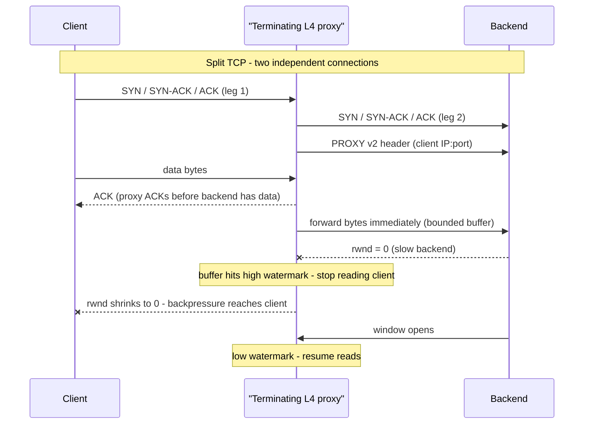
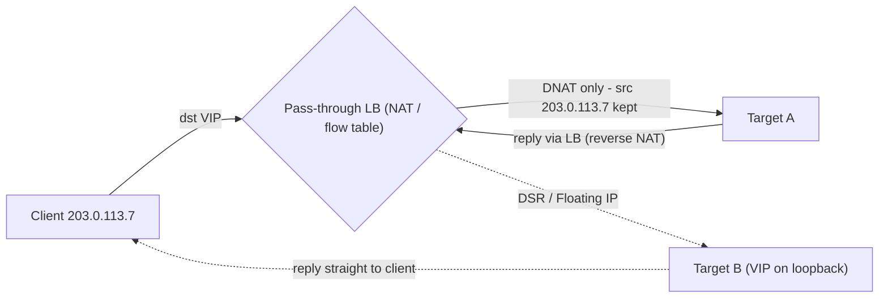
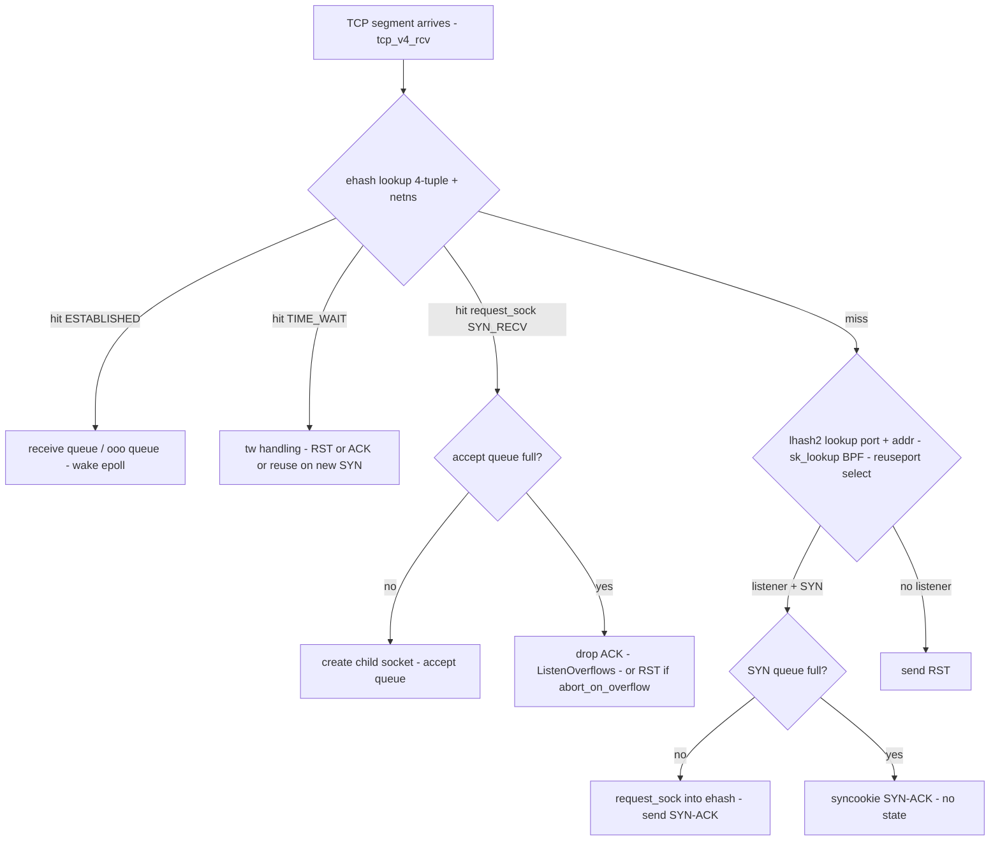

# F9 Answering your Questions
> Last verified: 2026-10 · Audience: senior/staff DevOps, SRE, AI eng, NetEng, DevSecOps, architects

## TL;DR
- TCP is a **byte stream**: a proxy never really "buffers segments". The kernel reassembles segments into the socket receive buffer. The real question is whether the proxy **forwards bytes as they arrive (streaming)** or **waits for a full message (store-and-forward)**. An L4 proxy should stream through a **small, bounded buffer** and should not wait for whole messages, because it doesn't know where messages begin and end.
- There are two kinds of L4 load balancers. A **pass-through (NAT/DSR)** LB rewrites or forwards packets with **no TCP state of its own and no buffering**, e.g. AWS NLB TCP listeners and Azure Load Balancer. A **terminating proxy** runs two separate TCP connections ("split TCP") with a buffer between them, e.g. HAProxy `mode tcp`, Envoy `tcp_proxy`, Azure App Gateway TCP/TLS listeners, NLB TLS listeners.
- Bounded buffers plus **read-disable at a high watermark** give you **backpressure**. A slow side shrinks its TCP window, and that propagates back to the fast side. Unbounded buffering leads to OOM and lets slow-reader attacks work.
- **Zero-copy** on Linux uses `splice()` through a pipe (HAProxy `option splice-*`, which is off by default), `sendfile()`, or kTLS. Data stays in kernel pages and is never copied to userspace. You can't splice if you need to inspect or modify bytes, or if TLS runs in userspace.
- **Client IP preservation:** a pass-through LB keeps the source IP. A terminating proxy loses it, so you pass it on with **PROXY protocol v1/v2** for any TCP traffic, or with **X-Forwarded-For** for HTTP only.
- **Kernel connection management:** an incoming segment is matched first against the **established hash (ehash, 4-tuple + netns)**, which also holds TIME_WAIT and request sockets. If nothing matches, it is matched against the **listener hash (lhash2)**. `bind()` uses **bhash/bhash2**. Each listener has a **SYN queue** (`tcp_max_syn_backlog`, syncookies) and an **accept queue** (`min(backlog, somaxconn)`, default somaxconn 4096 since 5.4).
- **SO_REUSEPORT** gives N listeners with N accept queues, chosen by a hash of the 4-tuple (or by BPF). This avoids accept-lock contention. Pitfall: when one listener closes, its queued connections are reset unless `tcp_migrate_req=1`.

---

## F9.1 Should Layer 4 Proxies buffer segments?

### How it works
- **Pass-through / NAT-style L4 LB** (data-plane forwarder)
  - The LB picks a backend per **flow** by hashing the 5-tuple. AWS NLB's flow hash also includes the TCP sequence number (unverified wording). Azure LB uses a 5-tuple hash by default, with 2- or 3-tuple session persistence as options.
  - It rewrites the destination address (DNAT), and sometimes the source too. Otherwise it forwards packets **one by one**. It **never ACKs on the backend's behalf**, never reassembles, and never buffers. The TCP handshake and window are **end-to-end** between client and server.
  - It keeps per-flow **connection-tracking state** that ages out on an idle timeout:
    - NLB TCP: default **350 s**, configurable **60–6000 s**. TLS listeners are fixed at 350 s.
    - Azure LB: default **4 min**, range 4–100 min for LB rules. Optional **bidirectional TCP RST on idle** (`tcp reset`). Without it, idle flows are **silently dropped**.
  - **DSR (Direct Server Return)**: replies go straight from backend to client and skip the LB. Azure LB **Floating IP** works this way: the guest OS puts the frontend IP on loopback and uses the weak-host model. Return traffic doesn't need the LB, which cuts cost and latency and supports asymmetric bandwidth.
- **Terminating L4 proxy** (HAProxy `mode tcp`, Envoy `tcp_proxy`, NGINX `stream`, App Gateway TCP/TLS listener)
  - The proxy `accept()`s the client and `connect()`s to the backend, so there are **two TCP connections**. Each has its own sequence numbers, window, congestion control, MSS, and retransmissions.
  - A loop moves bytes: `read(client) → user buffer → write(server)`, or the zero-copy path `splice(client → pipe) → splice(pipe → server)`.
  - **Bytes are forwarded as soon as they are readable.** The proxy doesn't know application message boundaries, so waiting for a "complete message" has no meaning at L4.
  - Buffers are **bounded per connection**:
    - HAProxy `tune.bufsize`, typically 16 KB.
    - Envoy `per_connection_buffer_limit_bytes`, default 1 MiB. Envoy's edge best practice is 32 KiB (unverified exact figure).
- **Backpressure chain** (the key interview point)
  1. The backend reads slowly, so its rwnd fills and the proxy's `write()` returns EAGAIN.
  2. The proxy-side send buffer and user buffer reach the **high watermark**.
  3. The proxy **stops reading** from the client (Envoy `readDisable`, HAProxy stops polling for reads).
  4. The client-side receive buffer fills and the advertised window drops to 0.
  5. The client gets EAGAIN or blocks.
  - Reading resumes at the **low watermark**. This is end-to-end flow control rebuilt across the split.
- **Zero-copy options (Linux)**
  - `splice()`: one end must be a **pipe**. Pages move by **reference count** and are not copied. Flags are `SPLICE_F_MOVE`, `SPLICE_F_NONBLOCK`, and `SPLICE_F_MORE` (a hint that more data is coming). HAProxy: `option splice-auto | splice-request | splice-response`, **off by default**, tuned with `tune.pipesize` / `maxpipes`.
  - `sendfile()` (file → socket), `MSG_ZEROCOPY` (send side, ≥ ~10 KB writes worth it), **kTLS** (record encryption moves into the kernel or NIC so splice/sendfile still works with TLS), and **io_uring** zero-copy send/receive in newer kernels.
  - **When you can't use zero-copy:** userspace TLS termination, any byte inspection or rewriting (PROXY header injection happens once before splicing starts, so that's fine), and small or interactive flows, where the syscall overhead outweighs the copy saved.
- **TCP options that matter in proxies**
  - Set **TCP_NODELAY** on both legs. Otherwise Nagle plus delayed ACK adds stalls of up to 40–200 ms to request/response traffic.
  - `TCP_NOTSENT_LOWAT` caps unsent bytes in the kernel, which keeps latency and memory down.
  - Half-close: a FIN from one side must become `shutdown(SHUT_WR)` toward the other side, not a full close. RST should be propagated as an abortive close.

### Pass-through vs terminating

| Aspect | Pass-through (NAT/DSR) | Terminating L4 proxy (split TCP) |
|---|---|---|
| TCP state on LB | Flow table only | Full sockets ×2 |
| Buffering | None (per-packet) | Bounded per-connection buffers |
| Client IP at backend | Preserved natively | Lost, so needs PROXY protocol |
| Backpressure | End-to-end TCP window | Rebuilt by watermarks and read-disable |
| Latency / CPU | Lowest (µs, kernel or hardware) | +1 user/kernel hop, copies unless splice |
| TLS termination, mTLS, retries to another backend on connect failure | No | Yes |
| Shields backend from SYN floods / slowloris | No (backend sees handshakes) | Yes (proxy absorbs them) |
| Per-leg TCP tuning (WAN-optimized client leg, DC-tuned server leg) | No | Yes |
| Long-lived flows through LB scaling or failover | State loss means RST/blackhole | Proxy restart drops connections unless hot restart or socket handoff is used |
| Examples | AWS NLB (TCP/UDP), Azure LB, GWLB, Maglev, Katran, IPVS | HAProxy, Envoy, NGINX stream, NLB TLS listener, App Gateway L4, Cloudflare Spectrum |

### Trade-offs / when to use
- **Use pass-through** when:
  - you need raw throughput, UDP, or non-TCP protocols;
  - you need very long-lived flows (gaming, MQTT, DB) and true end-to-end TCP semantics;
  - the client IP must be visible to the kernel, e.g. for security groups/NSGs and iptables.
- **Use a terminating proxy** when you need any of these:
  - TLS offload or mTLS
  - connection-level observability (bytes, durations, per-connection logs)
  - connect retries and outlier ejection
  - protection against slow clients
  - backend connection limits
  - different MSS or congestion control per leg, e.g. BBR on the internet leg
- **Buffer size trade-off:**
  - Larger buffers absorb bursts and fill high-BDP links (buffer ≥ BDP = bandwidth × RTT; 1 Gb/s × 50 ms ≈ 6.25 MB).
  - But memory = conns × buffers × 2 directions. 1 M connections × 2 × 16 KB ≈ 32 GB.
  - Larger buffers also add queueing latency (bufferbloat) and hide backpressure.
- **Split-TCP side effects:**
  - The proxy **ACKs data the backend may never get**, so end-to-end delivery isn't guaranteed. Applications need their own acknowledgements.
  - TCP keepalives refresh only one leg. Azure docs recommend **application-layer keepalives when a proxy is in the path**.

### Client IP preservation options

| Mechanism | Layer | How | Notes |
|---|---|---|---|
| **Pass-through source IP** | L3/L4 | LB doesn't SNAT | Return path must go back via the LB or DSR. NLB: hairpin (NAT loopback) fails when a target calls its own NLB. |
| **PROXY protocol v1** | L4 (any TCP) | Text line `PROXY TCP4 src dst sport dport\r\n` before data | Max 107 bytes. App Gateway L4 sends **v1**. |
| **PROXY protocol v2** | L4 (TCP/UDP) | Binary. 12-byte signature `\r\n\r\n\0\r\nQUIT\n` + ver/cmd + family + length + addresses + **TLVs** | AWS NLB, AWS PrivateLink (TLV `0xEA` = VPCE ID), Azure Private Link Service (TLV `0xEE` = LINKID), HAProxy `send-proxy-v2`/`accept-proxy`. Receiver must **require** it, never auto-detect, or anyone can spoof it. |
| **X-Forwarded-For / Forwarded (RFC 7239)** | L7 (HTTP) | Proxy appends the client IP to a header | AWS ALB, App Gateway (`x-forwarded-for` as `IP:port`), Front Door. Trust only the **right-most N hops** you control. |
| **TOA / TCP option, IPv6 extension** | L4 | Client IP stored in a TCP option | Niche (LVS/Alibaba). Needs a kernel module. |

### Interview angles
- **"Should an L4 proxy buffer segments?"** No to store-and-forward, yes to a small bounded streaming buffer. The kernel already reassembles segments. Forward bytes immediately. Cap the buffer per connection and stop reading at a high watermark so the TCP window propagates backpressure. Buffering whole requests is an **L7** decision, e.g. to protect slow backends from slow uploads (NGINX `proxy_request_buffering`).
- **"Why not buffer more to be fast?"** Memory blowup and bufferbloat latency. It also hides overload: the client keeps sending while the backend is drowning, which makes things worse.
- **"NLB vs ALB, which preserves the client IP?"**
  - NLB with instance targets: yes, preserved natively.
  - NLB with IP targets on TCP/TLS: **off by default** (UDP/QUIC: always on).
  - PrivateLink traffic: the source is always the NLB's private IP, so use PPv2.
  - ALB terminates, so the client IP is in **X-Forwarded-For** only.
- **Pitfall: enabling PPv2 on the LB before the backend can parse it.** Health checks fail (HTTP 400), because NLB also sends the PP header on health checks. Roll the backend first, with `accept-proxy` required only on that listener.
- **Pitfall: double PROXY headers.** NLB and App Gateway don't strip incoming PROXY headers, so chained proxies can produce two.
- **Pitfall: idle timeouts.** Silent drops (Azure without TCP reset, conntrack expiry) cause "connection reset / broken pipe" on the first write after idle. Fix with keepalive interval < smallest idle timeout in the path, or enable TCP RST on idle.
- **Pitfall: SNAT port exhaustion.**
  - NLB without client IP preservation supports ~**55,000** simultaneous connections per unique target (IP:port).
  - Azure LB outbound SNAT has the same class of problem.
  - Mitigate with more target IPs/ports, connection reuse, or NAT Gateway.
- **Follow-up: "how does an LB fail over without killing flows?"**
  - Consistent hashing / Maglev so that every LB node picks the same backend.
  - Conntrack sync between nodes.
  - For proxies: hot restart (Envoy) or listener socket handoff (`SCM_RIGHTS`, HAProxy `expose-fd listeners`).





---

## F9.2 How does the Kernel manage TCP connections?

### How it works
- **Socket lookup tables** (Linux `inet_hashinfo`)
  - **ehash (established hash)**
    - Keyed by **{saddr, daddr, sport, dport, netns}**.
    - Holds ESTABLISHED sockets, **TIME_WAIT mini-sockets** (`inet_timewait_sock`, which are cheaper than full sockets) and **request sockets** (SYN_RECV, kept in ehash since kernel 4.4, which made the listener lockless).
    - Size is set at boot (`thash_entries=`) and shown in `net.ipv4.tcp_ehash_entries`. Per-netns size comes from `tcp_child_ehash_entries` (6.1+, power of 2 up to 2^24, set before `unshare()`/`clone()`).
  - **lhash2 (listening hash):** keyed by **{port, addr}**. It is consulted only when ehash misses. Wildcard (`0.0.0.0`) and specific-address listeners are scored, and the more specific match wins.
  - **bhash / bhash2:** bind hash of local port (bhash2 adds the address, 6.1+). Used by `bind()` and ephemeral port selection (`ip_local_port_range`, default **32768–60999**, so ~28k ports per {src IP, dst IP, dst port}).
  - Extension hooks: **BPF `sk_lookup`** (5.9+) can steer a packet to any socket, e.g. one socket serving many ports or IPs, as at Cloudflare. **`SO_REUSEPORT` BPF** (`SO_ATTACH_REUSEPORT_EBPF`) picks within a reuseport group.
- **Passive open path**
  1. A SYN misses ehash, hits a listener in lhash2, and a **request_sock** is created in the **SYN queue**. Its limit is `tcp_max_syn_backlog`, which is per listener and scales with RAM, min 128.
  2. The SYN-ACK is sent and retransmitted up to `tcp_synack_retries` (default **5**, ~63 s total).
  3. When the SYN queue overflows, **syncookies** are used (`tcp_syncookies=1` default, used only on overflow). The state is encoded in the ISN, so no queue memory is used, at the cost of losing some TCP options. Timestamps can recover window scaling and SACK.
  4. The final ACK arrives and the child socket moves to the **accept queue**. Its limit is **min(listen backlog, `net.core.somaxconn`)**. somaxconn defaults to **4096 since 5.4**; it was 128 before.
  5. **Accept queue full:** the kernel **drops the ACK** and the client retransmits. The client thinks it's connected, so the first request stalls. Counters: `ListenOverflows` / `ListenDrops`. `tcp_abort_on_overflow=1` sends RST instead, which fails fast but is harsh.
  6. `accept()` dequeues the socket and the app gets an fd. The app then does `epoll`/`io_uring` readiness on it.
- **Per-socket data structures:** each socket has a receive queue plus out-of-order queue (`tcp_rmem` default 131072, autotuned up to ~6 MB–32 MB depending on RAM) and a send/retransmit queue (`tcp_wmem` default 16 KB). Each also has timers (RTO, delayed ACK, keepalive, TIME_WAIT 60 s fixed), plus congestion-control state.
- **Teardown:**
  - TIME_WAIT lasts **2·MSL = 60 s on Linux (hard-coded)**. The cap is `tcp_max_tw_buckets`.
  - `tcp_tw_reuse` (default **2** = loopback only) lets outbound connects reuse TIME_WAIT. `tcp_tw_recycle` was **removed in 4.12** because it broke NAT.
  - Orphans (closed by the app, FIN not yet done) are capped by `tcp_max_orphans`, ~64 KB each. FIN_WAIT_2 orphans time out after `tcp_fin_timeout` (60 s).
- **Multi-core listener scaling**
  - **One listener shared by many threads:** all threads use one accept queue. This means lock contention, and with epoll a **thundering herd** (mitigated by `EPOLLEXCLUSIVE`, 4.5+). Load also ends up uneven, with the busiest worker accepting most connections.
  - **SO_REUSEPORT** (3.9+, all sockets must have the same effective UID):
    - N sockets bind the same ip:port, and the kernel picks one per new connection by hashing the 4-tuple.
    - Each socket has **its own SYN/accept queue**, so there's no shared lock. NGINX `reuseport`, Envoy (default on Linux), and HAProxy (one listener per thread) use this.
    - `SO_INCOMING_CPU` / BPF can match listener to RX-queue CPU for cache/NUMA locality.
  - **Reuseport pitfall:**
    - When a process closes its reuseport socket (reload or scale-down), connections sitting in *its* accept queue are **reset**.
    - Fix: `net.ipv4.tcp_migrate_req=1` (5.14+, default 0) migrates them to a sibling listener.
    - A hash also can't see per-worker load, so one blocked worker still gets 1/N of new connections.
- **Packet receive path to the socket:** NIC → RSS (hash to RX queue/CPU) → NAPI/GRO (merges segments into larger SKBs) → IP → `tcp_v4_rcv` → **socket lookup (ehash → lhash2)** → if the socket is owned by a user, the SKB goes to the backlog; otherwise it is processed → receive queue → wake epoll waiter. Related: **RPS/RFS** for software steering, **XDP** below the stack for L4 LB dataplanes such as Katran.



### Trade-offs / when to use
- **Large backlog vs fail-fast.** A huge accept queue hides a slow app and inflates tail latency, because connections wait unseen. A small one drops quickly so LB health checks and retries reroute. Size it for burst × accept latency, and alert on `ListenOverflows`.
- **Syncookies vs SYN queue size.** Keep syncookies on (it is the DDoS safety valve). On edge proxies, raise `tcp_max_syn_backlog` and `somaxconn` together. The app's `listen(backlog)` must also be raised, because the kernel uses the **min** of the two.
- **SO_REUSEPORT vs a single shared listener.** Reuseport scales accept() linearly across cores, but it's hash-based and blind to load, and reloads are tricky. A shared queue balances better for very uneven request costs.
- **Hash table size.** A too-small ehash means long bucket chains, and lookup cost shows up in softirq CPU at millions of connections. Many containers/netns sharing one global ehash was the motivation for `tcp_child_ehash_entries`.

### Interview angles
- **"Client says connected but request hangs, server shows nothing."** The accept queue is full and the final ACK was dropped. Check `ss -lnt`: for a LISTEN socket, Recv-Q = current accept queue and Send-Q = backlog limit. Check `nstat -az TcpExtListenOverflows`. The usual cause is a slow `accept()` loop, a blocked event loop, or backlog left at the app default (e.g. 511/128).
- **"Explain SYN vs accept queue."** The SYN queue holds half-open connections (SYN_RECV, request socks, protected by syncookies). The accept queue holds fully established connections waiting for `accept()`. `listen(backlog)` limits the **accept** queue (since Linux 2.2).
- **"How does the kernel find the socket for a packet?"** Hash lookup in ehash on the 4-tuple. On a miss it falls back to the listener table with best-match scoring, then reuseport selection, optionally via BPF sk_lookup.
- **"Why are there so many TIME_WAIT sockets on the proxy, and is it a problem?"**
  - The proxy is the **active closer** toward backends, so TIME_WAIT accumulates on its side.
  - TIME_WAIT costs little memory. The real risk is **ephemeral port exhaustion** per (src IP, dst IP:port).
  - Fixes: reuse connections (keepalive pools), add source IPs or backend ports, `tcp_tw_reuse=1` for outbound. Never `tcp_tw_recycle`, which no longer exists.
- **"Why did my deploy cause RSTs with reuseport?"** Accept queue orphaning on listener close. Use `tcp_migrate_req`, drain before close, or do socket handoff.
- Cross-links:
  - [A7 Socket management](../A-operating-systems/A7-socket-management.md) (A7.1, queues and sockets)
  - [F4 TCP](./F4-transmission-control-protocol.md) (F4.9 state machine, handshake)
  - [H6 Web application architecture](../H-full-stack-troubleshooting/H6-web-application-architecture.md) (H6.5–H6.7)

---

## Cloud mapping: AWS vs Azure

| Capability | AWS | Azure | Role it plays | Key differences | Alternatives |
|---|---|---|---|---|---|
| Pass-through L4 LB | **NLB** (TCP/UDP/TCP_UDP/QUIC listeners) | **Azure Load Balancer Standard** | Flow-hash forwarding, client IP preserved, no buffering | NLB: static IP per AZ, PPv2, idle 350 s (60–6000), cross-zone **off** by default. Azure LB: zone-redundant frontend, **Floating IP/DSR**, HA ports, idle 4–100 min + optional TCP RST. Basic SKU **retired 30 Sep 2025**. | IPVS, Katran/XDP, MetalLB, GCP passthrough NLB, Maglev |
| Terminating L4 (TLS) proxy | **NLB TLS listener** (terminates TLS, re-originates TCP/TLS) | **Application Gateway v2 TCP/TLS listeners** (L4 terminating proxy, autoscale up to 125 instances) | TLS offload, central certs for non-HTTP traffic | NLB TLS: idle fixed 350 s, PPv2 to targets. App GW L4: **SNATs**, PROXY **v1** (`EnableClientIpPreservation`), drain fixed 30 s, **no WAF inspection** on TCP/TLS listeners, AGIC not supported | HAProxy, Envoy, NGINX stream, Cloudflare Spectrum |
| L7 terminating proxy | **ALB** | **Application Gateway v2** / **Application Gateway for Containers** (AKS) / **Front Door** (global) | HTTP routing, WAF, XFF | ALB: XFF append/preserve/remove modes, idle 60 s default. App GW adds `x-forwarded-for` (IP:port), `x-forwarded-proto/port`, `x-original-host`, `x-appgw-trace-id` | Envoy/Istio gateway, NGINX, Cloudflare |
| Inline appliance insertion | **Gateway Load Balancer** (GENEVE, UDP 6081) | **Gateway Load Balancer** (VXLAN, chained to Standard LB / public IP) | Transparent bump-in-wire for NVAs, flow-symmetric | Both preserve the original packet. AWS uses GWLB endpoints. Azure chains by frontend reference | Palo Alto/Fortinet with own HA |
| Provider-side client identity over private link | **PrivateLink** (NLB) + PPv2 TLV `0xEA` (VPCE ID) | **Private Link Service** + PPv2 TLV `0xEE` (LINKID) | Identify consumer behind provider-side NAT | Both SNAT, so PPv2 is the only way to get the consumer IP/endpoint | Service mesh mTLS identity |

- **AWS NLB**
  - Runs on Hyperplane. Without client IP preservation it SNATs, with ~55k connections per target IP:port.
  - **Client IP preservation defaults:**
    - instance targets: on;
    - IP targets on TCP/TLS: off;
    - UDP/QUIC: always on.
  - Preservation doesn't apply to PrivateLink, Transit Gateway, or GWLB-inspected paths. It breaks **hairpin** (target → own NLB).
  - Draining: deregistration delay default **300 s**. `connection_termination` on unhealthy targets is on by default.
  - Gotcha: if you raise the idle timeout above 350 s, also align the EC2 ENI conntrack `TcpEstablishedTimeout` (Nitro v6+ default 350 s).
- **Azure Load Balancer**
  - A true pass-through device. Microsoft docs contrast it with App Gateway as a "terminating load balancer".
  - NSGs see the real client IP, and the backend replies directly (DSR semantics on return).
  - **Floating IP** is required when several rules reuse the same backend port, e.g. SQL AG listeners or NVAs. It needs loopback configuration in the guest. Outbound must then use the primary IP config.
  - No PROXY protocol, because there is no termination to recover from.
- **Azure Application Gateway**
  - Always a full proxy (L7, and L4 TCP/TLS). Backends see the instance IP.
  - Client IP comes via XFF at L7 or PROXY v1 at L4.
  - Note: **AWS ALB** and Azure **"ALB" = Application Gateway for Containers** are different products. Don't mix them up in interviews.
- **Envoy / HAProxy as alternatives (self-managed or in Kubernetes)**
  - Envoy `tcp_proxy` + `proxy_protocol` listener filter + `upstream_proxy_protocol` transport socket. Flow control via `per_connection_buffer_limit_bytes`.
  - HAProxy `mode tcp`, `send-proxy-v2`, `accept-proxy`, `option splice-auto`.
  - **Kubernetes:** `Service type=LoadBalancer` with `externalTrafficPolicy: Local` keeps the client IP. It avoids the kube-proxy SNAT hop but can lead to uneven spreading.
  - **Cloudflare Spectrum** offers PROXY v1/v2 for L4.

---

## Hands-on (optional)

```bash
# Accept queue health: for LISTEN sockets Recv-Q = queued, Send-Q = backlog limit
ss -ltn 'sport = :443'
nstat -az TcpExtListenOverflows TcpExtListenDrops TcpExtSyncookiesSent
# Kernel limits relevant to F9.2
sysctl net.core.somaxconn net.ipv4.tcp_max_syn_backlog net.ipv4.tcp_syncookies \
       net.ipv4.tcp_abort_on_overflow net.ipv4.tcp_migrate_req net.ipv4.tcp_ehash_entries \
       net.ipv4.ip_local_port_range net.ipv4.tcp_tw_reuse
# TIME_WAIT pressure on a proxy (active closer toward backends)
ss -tan state time-wait | wc -l
# Socket memory / windows per connection (rcv_space, cwnd, notsent)
ss -tmi dst 10.0.1.20
```

```hcl
# NLB target group: keep client IP for in-VPC targets, add PPv2 for PrivateLink consumers
resource "aws_lb_target_group" "tcp" {
  name                   = "app-tcp"
  port                   = 443
  protocol               = "TCP"
  target_type            = "ip"
  vpc_id                 = var.vpc_id
  preserve_client_ip     = "true"
  proxy_protocol_v2      = true      # backend MUST require PROXY v2 (health checks carry it too)
  deregistration_delay   = 120
  connection_termination = true
}

# Azure LB rule with DSR-style Floating IP and RST on idle
resource "azurerm_lb_rule" "tcp" {
  name                           = "tcp-443"
  loadbalancer_id                = azurerm_lb.this.id
  protocol                       = "Tcp"
  frontend_port                  = 443
  backend_port                   = 443
  frontend_ip_configuration_name = "fe"
  backend_address_pool_ids       = [azurerm_lb_backend_address_pool.this.id]
  probe_id                       = azurerm_lb_probe.this.id
  floating_ip_enabled            = true
  tcp_reset_enabled              = true
  idle_timeout_in_minutes        = 15
}
```

## Cross-links
- [F4 Transmission Control Protocol](./F4-transmission-control-protocol.md) (F4.9 sockets/queues; handshake, windows)
- [F6 Network performance](./F6-network-performance.md) (F6.8, F6.9 L4 vs L7 proxies)
- [A7 Socket management](../A-operating-systems/A7-socket-management.md) (A7.1 SYN/accept queues)
- [C2 Scalability](../C-large-scale-architecture/C2-scalability.md) (C2.26 load balancing)
- [D1 System design basics](../D-system-design/D1-system-design-basics.md) (D1.3–D1.5 load balancers, proxies)
- [H6 Web application architecture](../H-full-stack-troubleshooting/H6-web-application-architecture.md) (H6.5–H6.7 L4/L7, sockets)
- [G14 Service-to-service networking](../G-cloud-network-architecture/G14-service-to-service-networking.md) and [G7 Service endpoints / Private Link](../G-cloud-network-architecture/G7-service-endpoints-private-link.md) (PrivateLink + PPv2)
- [I2 TLS and certificates](../I-dns-tls-acceleration-gaps/I2-tls-and-certificates.md) (TLS termination at the proxy)

## Sources
- https://docs.aws.amazon.com/elasticloadbalancing/latest/network/edit-target-group-attributes.html
- https://docs.aws.amazon.com/elasticloadbalancing/latest/network/update-idle-timeout.html
- https://learn.microsoft.com/en-us/azure/load-balancer/load-balancer-overview
- https://learn.microsoft.com/en-us/azure/load-balancer/load-balancer-floating-ip
- https://learn.microsoft.com/en-us/azure/load-balancer/load-balancer-tcp-reset
- https://learn.microsoft.com/en-us/azure/application-gateway/how-application-gateway-works
- https://learn.microsoft.com/en-us/azure/application-gateway/tcp-tls-proxy-overview
- https://learn.microsoft.com/en-us/azure/application-gateway/proxy-protocol-header
- https://learn.microsoft.com/en-us/azure/private-link/private-link-service-overview
- https://man7.org/linux/man-pages/man2/splice.2.html
- https://man7.org/linux/man-pages/man7/socket.7.html
- https://www.kernel.org/doc/html/latest/networking/ip-sysctl.html
- https://docs.haproxy.org/3.2/configuration.html
- https://www.haproxy.org/download/1.8/doc/proxy-protocol.txt
- https://www.envoyproxy.io/docs/envoy/latest/faq/configuration/flow_control
