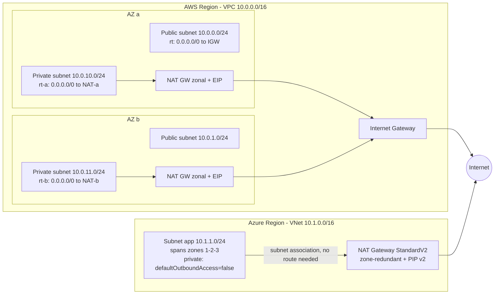

# G1 Virtual Network Fundamentals
> Last verified: 2026-10 · Audience: senior/staff DevOps, SRE, AI eng, NetEng, DevSecOps, architects

## TL;DR
- A **virtual network** (AWS **VPC**, Azure **VNet**) is a software-defined, logically isolated L3 network in **one region**. AWS **subnets are bound to one AZ**. Azure **subnets span all AZs** in the region. This one difference drives most of the HA designs that differ between the two clouds.
- Sizing: AWS VPC/subnet CIDR **/16–/28**. Azure subnet **/29–/2**, IPv6 subnets exactly **/64**. Both clouds **reserve 5 IPs per subnet** (first 4 + last). Never overlap CIDRs with anything you might later peer, transit or connect to on-prem.
- Routing: AWS has **explicit route tables** (main + custom, `local` route, 0.0.0.0/0 → IGW makes a subnet *public*). Azure has **system routes** that you override with **UDRs**. Selection is longest-prefix match, then **UDR > BGP > system**. 0.0.0.0/0 → Internet already exists by default in Azure.
- Internet: AWS needs an attached **Internet Gateway** plus a route. Azure has no IGW resource. Internet is a system-route next hop, and egress must now be **explicit**: new VNets get **private subnets by default** (API versions after **31 Mar 2026**, `defaultOutboundAccess=false`). Use a NAT Gateway, a public IP, LB outbound rules or a firewall/NVA.
- Filtering: **Security Group** (stateful, allow-only, ENI-level) ↔ **NSG** (stateful, allow+deny, priority 100–4096, attached to a subnet and/or NIC) + **ASG** for grouping. **NACL** (stateless, subnet-level, numbered allow/deny) has **no direct Azure equivalent**. The nearest options are a subnet NSG, which is stateful, or **AVNM security admin rules**.
- NAT: an AWS NAT GW is **zonal**, so for HA you deploy **one per AZ with per-AZ route tables**. Since **Nov 2025** a **regional NAT gateway** (availability mode `regional`) spans AZs automatically, needs no public subnet, but does **not do private NAT**. Azure NAT GW **Standard is zonal**. **StandardV2 is zone-redundant**, does 100 Gbps and IPv6, and needs StandardV2 public IPs.
- Self-managed NAT (**NAT instance** / NVA) is a cost or feature hack. You own HA, bandwidth and patching. The AWS NAT AMI is EOL, so build your own on AL2023 and disable **source/dest check**. On Azure, enable **IP forwarding** and route 0.0.0.0/0 to the VirtualAppliance next hop.



## G1.1 What is a virtual network?
- **How it works:**
  - A tenant-isolated **overlay network** implemented in the hypervisor/SDN layer. AWS uses the Nitro mapping service and Azure uses the VFP / SDN host agent. Packets are encapsulated between hosts, and you never see the underlay.
  - **No broadcast/multicast, no ARP spoofing, no L2.** The platform answers ARP and routes everything at L3. Azure also blocks GRE, IP-in-IP and customer DHCP. AWS supports multicast only via **Transit Gateway multicast**.
  - Each NIC (AWS **ENI**, Azure **NIC**) gets a private IP from its subnet via platform DHCP. Source/destination checking drops forwarded traffic unless you disable it (AWS) or turn on IP forwarding (Azure).
  - Free: VPC/VNet, subnets, route tables, SG/NSG and NACLs cost nothing. You pay for gateways (NAT, VPN, TGW), public IPv4, data processing and cross-AZ/region transfer.
- **Trade-offs / when to use:**
  - One network or many? Use **one per environment/app boundary**, joined by a transit hub ([G8](G8-transit-hub.md)). Avoid one giant shared VNet unless you use **AWS VPC sharing (RAM)** or Azure subnet delegation and RBAC carefully.
- **Interview angles:**
  - "Why can't I run keepalived/VRRP with a floating IP?" → no L2 or gratuitous ARP. Use secondary IP reassignment via the API, an LB, or Route 53 / Azure Traffic Manager.
  - Mention it is a **blast-radius and IAM boundary**, not only an IP space.

## G1.2 Scope of a virtual network: account, region, availability zone
| Construct | AWS | Azure |
|---|---|---|
| Container | Account → Region → **VPC** | Tenant → Subscription → Resource group → **VNet** (in one region) |
| Network scope | **Regional** (spans all AZs) | **Regional** (spans all AZs) |
| Subnet scope | **One AZ** (`us-east-1a` maps to an AZ ID like `use1-az1` differently per account) | **Regional, spans all zones**. The *resource* (VM, zonal NAT, zonal PIP) chooses its zone |
| Cross-account/subscription use | **VPC sharing** via AWS RAM (owner shares subnets with participants, up to 100 accounts per VPC by default) | Deploy across subscriptions via **peering**. A VNet belongs to one subscription, but RBAC lets other principals deploy into its subnets |
| Cross-region | Not possible. Use peering/TGW/Cloud WAN ([G6](G6-private-connectivity-peering.md), [G8](G8-transit-hub.md)) | Not possible. Use global VNet peering / Virtual WAN |
- **How it works:**
  - AWS AZ names are **shuffled per account**, so use **AZ IDs** when you coordinate across accounts (shared VPC, PrivateLink, RAM).
  - Azure zones are logical zones `1/2/3` and are likewise mapped per subscription.
- **Trade-offs:**
  - Because AWS subnets are AZ-scoped, the subnet layout *is* the AZ layout: one public + one private (+ data) subnet **per AZ**.
  - In Azure one subnet serves all zones, but zonal resources (Standard NAT GW, zonal PIPs) then create **hidden zonal SPOFs** for a cross-zone subnet.
- **Interview angles:**
  - "How many subnets for a 3-AZ, 3-tier app on AWS?" → 9 minimum (3 tiers × 3 AZs). On Azure → 3 (one per tier), with zone-redundant dependencies.
  - Pitfall: cross-AZ data transfer is charged on AWS (about $0.01/GB each way; verify current pricing). Keep chatty paths zonally affine. Azure inter-zone data transfer charges were announced and later waived (verify current state, unverified).

## G1.3 Building blocks: CIDR, subnets, route tables, internet gateway, firewalls, DNS
| Block | AWS | Azure |
|---|---|---|
| Address space | VPC primary + secondary IPv4 CIDRs, IPv6 CIDRs, optional **IPAM** | VNet address space (multiple prefixes), IPv6 prefixes, optional **AVNM IPAM** |
| Subnet | AZ-scoped subnet | Region-wide subnet (can be **delegated** to PaaS) |
| Routing | Route tables (main/custom/gateway), `local` route | System routes + **route table (UDR)**, BGP routes from gateways/Route Server |
| Internet edge | **Internet Gateway** (IPv4+IPv6), **Egress-only IGW** (IPv6 outbound only) | Implicit Internet next hop. Inbound via public IP/LB/App GW. Outbound via explicit methods |
| Instance firewall | **Security Group** | **NSG** (+ **ASG**) |
| Subnet firewall | **Network ACL** | NSG on subnet (stateful). Central policy via **AVNM security admin rules** |
| DNS | Route 53 Resolver at **VPC base + 2** / 169.254.169.253, DHCP option sets | **Azure-provided DNS at 168.63.129.16**, custom DNS servers per VNet, Private DNS zones, DNS Private Resolver |
- Details of DNS/DHCP are in [G3](G3-network-dns-and-dhcp.md). Flow logs, mirroring and Reachability Analyzer / Network Watcher are in [G5](G5-traffic-monitoring-troubleshooting.md).
- **Interview angles:**
  - Walk a packet: ENI → SG (out) → subnet route table → NACL (out) → IGW (1:1 NAT for the public IPv4) → internet. The return path goes NACL (in, stateless, so **ephemeral ports must be allowed**) → SG (stateful, auto-allowed).

## G1.4 Addressing (CIDR)
- **How it works (AWS):**
  - VPC IPv4 block **/16 (65,536) to /28 (16)**. Associate up to **5 IPv4 CIDRs per VPC by default (adjustable to 50)**. You **can't resize** a block, only add or remove secondaries, and the primary can't be removed.
  - Forbidden ranges: 0.0.0.0/8, 127/8, 169.254/16, 224/4. Mixing RFC 1918 families has restrictions (e.g. a 10/8 VPC can't add 172.16/12 or 192.168/16). **100.64.0.0/10** (CGNAT) and non-RFC1918 public space are allowed as secondaries. A common trick is extending an EKS pod IP space via a 100.64/10 secondary CIDR.
  - Avoid **172.17.0.0/16** (Docker bridge; also used by SageMaker and Cloud9).
  - Subnet **/16–/28**. **5 reserved IPs**: `.0` network, `.1` VPC router, `.2` DNS (Route 53 Resolver, VPC base+2), `.3` future use, last = broadcast (broadcast itself isn't supported). A /28 therefore yields only 11 usable IPs.
  - IPv6: Amazon-provided **/56** per VPC (you can't choose it), or **/44–/60** from IPAM/BYOIP. Up to 5 IPv6 CIDRs. Subnets **/44–/64** in /4 steps. The same 5 addresses are reserved per IPv6 subnet.
  - **Network Address Usage (NAU)** quota: 64,000 per VPC by default (up to 256,000), and 128,000 including intra-region peers.
- **How it works (Azure):**
  - Recommended: RFC 1918 + RFC 6598 (100.64/10). 224/4, 255.255.255.255/32, 127/8, 169.254/16 and 168.63.129.16/32 are unusable.
  - Subnet **smallest /29, largest /2**. IPv6 subnets **must be /64**. Azure does not publish a /16-style cap on VNet size, so /8 address spaces are accepted. The practical bound is the subnet rules (/2 max) and peering/IPAM hygiene.
  - **5 reserved IPs per subnet**: `.0` network, `.1` default gateway, `.2` and `.3` map Azure DNS into the VNet space, last = broadcast.
  - Address space can be **added/resized on a live VNet**, including peered VNets, after which you **sync the peering**. A subnet can't be resized while it has resources in it.
  - Some services need dedicated or minimum-size subnets: **GatewaySubnet** (/27 or larger recommended), **AzureFirewallSubnet /26**, **AzureBastionSubnet /26**, **RouteServerSubnet /27**, plus delegated subnets (e.g. SQL MI, App Service integration).
- **Trade-offs:**
  - Big VPCs/VNets waste RFC 1918 space and collide in M&A or hybrid. Small ones run out under Kubernetes (VPC CNI / Azure CNI give pods real IPs). Use central **IPAM** (AWS VPC IPAM, Azure AVNM IPAM) with non-overlapping pools per region/env.
- **Interview angles:**
  - "Design addressing for 50 VPCs across 3 regions plus on-prem" → a hierarchical summarizable plan, e.g. 10.R.E.0/… per region and env, summarized at TGW/vWAN. Reserve 100.64/10 for pods. No overlap anywhere you might route (see [F2](../F-network-engineering/F2-internet-protocol.md)).
  - Pitfall: overlapping CIDRs block peering. The workarounds are **private NAT GW** (AWS), PrivateLink, or a NAT NVA.

## G1.5 Route tables
- **How it works (AWS):**
  - Every VPC has a **main route table**. Subnets without an explicit association use it. A subnet has **exactly one** route table, and a table can serve many subnets.
  - The **`local` route** (VPC CIDRs → local) exists in every table and can't be deleted. Its target **can be replaced** with an ENI or GWLB endpoint for middlebox inspection, and **more-specific-than-local** routes to an appliance are allowed.
  - Targets: IGW, egress-only IGW, NAT GW, ENI/instance, VPC peering, TGW, VGW, gateway VPC endpoints (S3/DynamoDB prefix lists), GWLB endpoint, Cloud WAN core network, local gateway, carrier gateway.
  - **Gateway route tables** (edge association with an IGW or VGW) enable *ingress routing*: send inbound traffic to a firewall before it reaches subnets.
  - Priority: **longest prefix** → static over propagated (VGW BGP) → prefix-list routes → propagated. The `local` route beats propagated routes even when they are more specific.
  - Quotas: **200 route tables per VPC**, **500 non-propagated routes per table (max 1,000)**, **100 propagated routes (hard limit)**. If you need more propagated prefixes, advertise a default route.
- **How it works (Azure):**
  - Each subnet gets **system routes**: the VNet prefixes → `VirtualNetwork`, **0.0.0.0/0 → `Internet`**, and RFC1918/100.64/10 → `None` (blackhole until used). Optional system routes appear for peering, gateway (BGP) and service endpoints (`VirtualNetworkServiceEndpoint`).
  - **UDR route table**: zero or one per subnet, and the table must be in the same region and subscription. Next hops: `VirtualAppliance` (IP of an NVA or ILB), `VirtualNetworkGateway` (**VPN gateway only**, not ExpressRoute), `VnetLocal`, `Internet`, `None`. You can't target peering or service endpoints.
  - Selection: **longest prefix**, then **UDR > BGP > system** on ties. Service-endpoint routes can't be overridden.
  - Limits: **400 UDRs per table** (1,000 via AVNM routing config). **Service tags** can be used as UDR prefixes (≤25 per table).
  - **Disable gateway route propagation** on spoke tables when forcing traffic through a firewall. Never disable it on GatewaySubnet, and don't put 0.0.0.0/0 on GatewaySubnet.
- **Trade-offs:**
  - AWS forces you to be explicit, so isolation is the default.
  - Azure is "everything routes within the VNet and to the internet unless overridden". Forced tunneling (0.0.0.0/0 → NVA/firewall) also sends **Azure PaaS public-IP traffic** through the NVA unless you use service endpoints or private endpoints ([G7](G7-service-endpoints-private-link.md)).
- **Interview angles:**
  - "Make a subnet isolated" → AWS: a route table with only `local`. Azure: UDR 0.0.0.0/0 → `None`, or a private subnet with no explicit egress, plus NSG deny-Internet.
  - "Why is traffic asymmetric through my NVA?" → the return path doesn't traverse the same appliance. Fix with symmetric UDRs on both sides, SNAT on the NVA, or GWLB/ILB HA ports with flow stickiness.
  - Azure gotcha: the NVA must be in a **different subnet** from the workloads it inspects, or you get routing loops.

## G1.6 IP addresses: IPv4 vs IPv6, private vs public vs static public IP
| Type | AWS | Azure |
|---|---|---|
| Private IPv4 | Primary + secondary private IPs on an ENI. Persists for the ENI's lifetime | Private IP on a NIC ipconfig, dynamic or static (both persist until deallocation/deletion) |
| Ephemeral public IPv4 | **Auto-assigned public IP** (subnet attribute `MapPublicIpOnLaunch`). Released on stop/start | Standard PIP is **always static**. Basic SKU (dynamic) **retired 30 Sep 2025** |
| Static public IPv4 | **Elastic IP** (regional, 5 per region by default), remappable. **BYOIP**, **IPAM pools** | **Public IP Standard** (static, zone-redundant by default in AZ regions), **Public IP Prefix** (contiguous block), **Standard v2** (zone-redundant only, currently only usable with NAT GW StandardV2), Global tier for cross-region LB |
| Public IPv4 cost | **$0.005/IP-hour for all public IPv4** (in-use or idle) since Feb 2024 | Nominal hourly charge. Public IPv6 is free |
| IPv6 | Globally unique GUA, **no NAT**. Public reachability is controlled by **route (IGW vs egress-only IGW) + SG**. **IPv6-only subnets** supported. NAT64/DNS64 via NAT GW + Route 53 Resolver | Dual-stack only: **every NIC needs an IPv4 config, no IPv6-only VMs**. IPv6 /64 subnets. VPN gateways are not supported in IPv6-enabled VNets. NAT64 on NAT GW StandardV2 (BYO DNS64) |
- **How it works:**
  - An AWS public IPv4 is never configured on the instance. The **IGW performs 1:1 NAT**, so the OS only sees the private IP. Azure is the same: the platform does the translation for an instance-level PIP.
  - An Azure Standard PIP is **secure by default**: inbound is closed unless an NSG allows it.
- **Trade-offs:**
  - IPv6 avoids NAT cost and IPv4 charges, but SaaS/partner IPv4-only endpoints still need NAT64. On Azure you still pay for IPv4 on every NIC.
  - EIP/static PIP allowlisting is brittle. Prefer egress through a NAT GW with a known IP set / **public IP prefix**.
- **Interview angles:**
  - "Partner needs to allowlist our egress IPs" → NAT GW with EIPs (AWS) or NAT GW + Public IP Prefix (Azure). With an AWS regional NAT GW in **manual mode**, you pin which EIPs are used per AZ.
  - "Cut the AWS IPv4 bill" → remove auto-assign public IPs, put things behind ALB/NLB, use EC2 Instance Connect Endpoint / SSM instead of bastions with EIPs, and adopt dual-stack or IPv6-only subnets.

## G1.7 Instance-level stateful firewall rules
- **How it works (AWS Security Group):**
  - **Stateful** and **allow-only**. All rules are evaluated (a union of allows, no ordering). Attached to an **ENI**.
  - **60 inbound + 60 outbound rules per SG** (counted separately for IPv4 and IPv6). **5 SGs per ENI (up to 16)**. rules × SGs ≤ 1,000.
  - Sources/destinations can be a CIDR, a **prefix list** (counts as its max entries), or **another SG ID** (*SG referencing*, works across peering in the same region and via TGW with SG-referencing support).
  - The default SG allows all inbound from members of the same SG and all outbound.
  - Can be **associated with multiple VPCs** in the same region and shared via AWS Organizations.
  - Doesn't filter Route 53 Resolver, DHCP, IMDS, Time Sync or Windows activation.
  - Removing a rule doesn't always kill existing **tracked** connections. Flows allowed by 0.0.0.0/0 rules can be **untracked**, which matters in incident response.
- **How it works (Azure NSG + ASG):**
  - **Stateful** 5-tuple rules with **Allow and Deny**, **priority 100–4096** (lowest number wins, first match stops). Default rules at **65000/65001/65500**: AllowVnetInBound, AllowAzureLoadBalancerInBound, DenyAllInbound, and outbound AllowVnetOutBound, AllowInternetOutBound, DenyAllOutBound. The defaults can't be deleted, only overridden.
  - Attached to a **subnet and/or NIC**. Inbound is evaluated subnet NSG → NIC NSG. Outbound is NIC NSG → subnet NSG. **Both must allow.** NSGs also filter **intra-subnet** traffic.
  - **Service tags** (`Internet`, `VirtualNetwork`, `Storage.WestEurope`, `AzureLoadBalancer`, …) and **augmented rules** (many IPs/ports per rule).
  - **Application Security Groups** group NICs the way SG referencing does in AWS. All NICs in an ASG, and all ASGs in a rule, must be in the **same VNet**.
  - Rule changes only affect **new** flows.
  - Platform IPs **168.63.129.16** and **169.254.169.254** aren't filtered unless you target the AzurePlatformDNS/IMDS/LKM tags.
  - **NSG flow logs retire 30 Sep 2027** (no new ones can be created). Use **VNet flow logs**.
- **Trade-offs:**
  - AWS SG referencing is a clean identity-ish micro-segmentation tool but doesn't express explicit deny. You need a NACL, Network Firewall or VPC Block Public Access for that.
  - An NSG can deny, but priority-number sprawl gets hard to audit. Use AVNM security admin rules for org-wide guardrails, which are evaluated **before** NSGs.
- **Interview angles:**
  - "SG vs NACL?" → stateful vs stateless; ENI vs subnet; allow-only vs allow+deny; all rules evaluated vs ordered first-match; return traffic automatic vs ephemeral ports needed.
  - Overlap with general firewall theory: [C4 Security](../C-large-scale-architecture/C4-security.md), [H2 Troubleshooting](../H-full-stack-troubleshooting/H2-troubleshooting-your-network.md).

## G1.8 Subnet-level stateless network ACLs
- **How it works (AWS NACL):**
  - **Stateless**, **numbered rules 1–32766**, evaluated lowest first, first match wins, with a final `*` deny.
  - The **default NACL allows all**. A **custom NACL denies all** until you add rules. One NACL per subnet, and one NACL can serve many subnets.
  - **20 rules per direction by default, max 40 in + 40 out** (performance may degrade).
  - Evaluated only when traffic **enters or leaves the subnet**, not within it.
  - Return traffic needs **ephemeral ports**: Linux 32768–60999, Windows 49152–65535, **NAT GW 1024–65535**, ELB 1024–65535. The safe range is 1024–65535.
  - Can't block Route 53 Resolver (VPC+2), IMDS, DHCP or Time Sync. Use **Route 53 Resolver DNS Firewall** for DNS.
- **Azure equivalent:** **none that is stateless.**
  - Options are a **subnet-level NSG** (stateful, but it can deny and is subnet-wide) and **AVNM security admin rules** (Allow / Always Allow / Deny, evaluated before NSGs, applied across VNets and subscriptions; the closest analogue to "a central deny layer").
  - **Azure Firewall** or an NVA for L3–L7.
- **Trade-offs:**
  - NACLs are good for **coarse explicit denies**: block a known-bad CIDR fast, or keep a data subnet from ever reaching the internet even if an SG is misconfigured.
  - Bad for app policy: the rule limits are small, there are no SG references, and they are statelessness-error-prone. **Use SGs for app policy and NACLs as guardrails.**
- **Interview angles:**
  - "Instance can reach the internet via NAT but responses never arrive" → the NACL on the private subnet (or the NAT subnet) is missing inbound 1024–65535.
  - "Block one attacker IP on AWS quickly" → a NACL deny rule with a low number (SGs can't deny), or AWS WAF at the edge.

## G1.9 Default virtual network
- **How it works (AWS):**
  - A **default VPC in every region**: **172.31.0.0/16**, a **/20 default subnet per AZ** (all public, `MapPublicIpOnLaunch=true`), an attached IGW, the main route table with 0.0.0.0/0 → IGW, the default SG, a default NACL (allow all), the default DHCP option set, and DNS resolution + hostnames enabled.
  - Can be deleted and **recreated** (`aws ec2 create-default-vpc`).
- **How it works (Azure):**
  - **No default VNet.** The portal VM wizard creates one on the fly (typically 10.x.0.0/16 with a `default` subnet). As of 2026 those subnets are **private by default** and must have explicit outbound.
- **Trade-offs:**
  - The default VPC is convenient for tutorials but has **every subnet public**, and 172.31/16 is identical in every account and region, so peering collides.
- **Interview angles:**
  - Enterprise baseline: **delete default VPCs in all regions** via an Organizations account-vending pipeline, add SCPs to block IGW creation outside network accounts, and turn on **VPC Block Public Access** (Nov 2024) for account-level internet blocks with exclusions.

## G1.10 Public vs private subnets
- **AWS definitions:**
  - **Public subnet** = its route table has **0.0.0.0/0 (or ::/0) → IGW**. An instance still needs a public IPv4/EIP (or IPv6 GUA) to be reachable.
  - **Private subnet** = no route to the IGW. Egress goes via a NAT GW, or there is none.
  - **VPN-only subnet** = routes only to a VGW/TGW.
  - **Isolated subnet** = `local` only.
- **Azure definitions:**
  - "Public" isn't a subnet property. A VM is internet-facing if it has a **public IP** (or sits behind a public LB/App GW) **and** the NSG allows the traffic.
  - **Private subnet** is a real subnet property now: `defaultOutboundAccess=false`, the **default for new VNets on APIs after 31 Mar 2026** (the portal already did this).
  - Existing VNets are unchanged. VMs keep getting Microsoft-owned **default outbound IPs** unless the subnet is made private **and VMs are stopped/deallocated**.
  - Private-subnet gotchas: Windows activation/updates need explicit egress. UDRs with next hop `Internet` (e.g. service-tag bypass routes) **break**. Same-region Storage still works.
  - Default outbound IPs can change, don't support ICMP or fragments, and aren't owned by you.
- **Pattern:**
  - Only LBs, NAT GWs and (if you must) bastions in public subnets. Workloads go in private subnets. Data in isolated subnets reached via **endpoints** ([G7](G7-service-endpoints-private-link.md)).
- **Interview angles:**
  - "Is a subnet with a NAT GW route public?" → No. Public means a route to the **IGW**. A NAT GW lives in a public subnet so that it can reach the IGW (except the regional NAT GW, which needs no public subnet).
  - Azure: "Our new Terraform VNet VMs can't reach the internet" → private-by-default subnets (newer API / provider default). Add a NAT GW, or set `default_outbound_access_enabled` deliberately.

## G1.11 Managed NAT gateway
- **How it works (AWS NAT GW):**
  - **Public** type: sits in a public subnet with an EIP and routes via the IGW. **Private** type: no EIP, used to NAT to TGW/VGW for overlapping CIDRs.
  - TCP/UDP/ICMP. **5 Gbps scaling to 100 Gbps**. **1M scaling to 10M pps** (beyond that it drops). **55,000 simultaneous connections per IP per unique destination** (dst IP + port + proto). Up to **8 IPs** (zonal; EIPs per NAT default 2, adjustable). MTU 8500.
  - Can't have an SG (use NACLs and the instances' SGs). **350 s idle timeout**, after which it sends RST.
  - Can't be used *through* VPC peering or a VGW (client → peering → NAT isn't supported). Via TGW it works, which is the centralized egress pattern.
  - Supports **NAT64** with Route 53 Resolver DNS64.
  - Key metric: **`ErrorPortAllocation`** (port exhaustion). Pricing is per hour + **per GB processed**.
- **How it works (Azure NAT GW):**
  - Associated **to subnets** (one NAT GW per subnet, many subnets per NAT GW, single VNet). **No UDR needed**: it replaces the default Internet egress.
  - **Precedence:** UDR to NVA/VNet GW > NAT GW > instance PIP > LB outbound rules > default outbound.
  - Up to **16 public IPs** (or prefixes) at **64,512 SNAT ports per IP** with dynamic, on-demand port allocation. **Standard 50 Gbps / StandardV2 100 Gbps**.
  - TCP idle timeout **4–120 min** (default 4). UDP is fixed at 4 min, with a 65 s port reuse hold-down.
  - Outbound only. Can't go in GatewaySubnet or a SQL MI subnet. Incompatible with Basic LB/PIP. Same price for Standard and StandardV2 (per hour + per GB).
  - **NAT GW on AzureFirewallSubnet** for hub egress scale (firewall SNAT ports × NAT IPs).
- **Trade-offs:**
  - Managed NAT is expensive at high GB (e.g. ~$0.045/GB processed in us-east-1 on AWS, verify current pricing). Push S3/DynamoDB through **gateway endpoints** (free), and other AWS/Azure PaaS through PrivateLink / private endpoints or service endpoints.
  - Centralized egress via TGW/hub saves per-VPC NAT hours but adds TGW data processing and becomes a shared blast radius.
- **Interview angles:**
  - "Intermittent outbound timeouts at scale" → SNAT/port exhaustion to one hot destination. Add IPs, spread destinations, use connection pooling/keepalive, and check `ErrorPortAllocation` / NAT GW SNAT metrics.
  - "Long-lived idle connections drop" → idle timeout (AWS 350 s, Azure 4 min default). Use TCP keepalives below the timeout.

## G1.12 NAT gateway high availability
- **How it works (AWS, zonal mode):**
  - A NAT GW is redundant **within one AZ only**. Shared across AZs it is a single point of failure, so if AZ-a dies, AZ-b loses egress. It also adds cross-AZ data charges.
  - **Best practice: one NAT GW per AZ, with a per-AZ private route table pointing to the same-AZ NAT GW** (zonal affinity).
- **How it works (Azure):**
  - **Standard NAT GW is zonal** (or "no zone", meaning Azure picks a zone and you get no zone guarantee). It can't span zones, and a subnet can only have one NAT GW.
  - HA for Standard therefore means **zonal stacks**: per-zone subnets + a zonal NAT GW + zonal PIP + VMs pinned to that zone.
  - **StandardV2** is **zone-redundant** (survives a single zone failure), needs StandardV2 PIPs/prefixes, and has **no in-place upgrade** (create a new one and swap; swapping can interrupt existing flows).
  - StandardV2 is not available in some regions (e.g. Canada East, West India, India South Central, Sweden South as of 2026-09).
  - Known issue: IPv6 via LB outbound rules is disrupted when a StandardV2 NAT is attached.
- **Trade-offs:**
  - Per-AZ NAT on AWS costs N × hourly but removes the cross-AZ SPOF and charges.
  - Azure zonal stacks fight Azure's region-wide subnet model, which is why StandardV2 exists.
- **Interview angles:**
  - "Design HA egress for 3 AZs" → AWS: 3 zonal NAT GWs + 3 route tables, or a single **regional NAT GW** (G1.14). Azure: StandardV2 NAT GW on each workload subnet, or a zone-redundant Azure Firewall + NAT GW in the hub.

## G1.13 Self-managed NAT instance
- **How it works (AWS):**
  - An EC2 instance in a public subnet with a public IP/EIP, **source/destination check disabled**, `ip_forward=1` + iptables MASQUERADE. The private route table sends 0.0.0.0/0 → instance/ENI.
  - The official **NAT AMI is based on Amazon Linux 2018.03 (EOL Dec 2023)**. Build your own on AL2023 or use a maintained community image (e.g. fck-nat; check its support status).
- **How it works (Azure):**
  - An **NVA** VM with **IP forwarding enabled on the NIC** (and in the OS). A UDR 0.0.0.0/0 → `VirtualAppliance` (NVA IP or **ILB HA-ports** frontend). The NVA needs its own public IP or NAT GW.
- **Trade-offs:**

| | Managed NAT GW | NAT instance / NVA |
|---|---|---|
| HA | Built in (zonal/regional) | DIY: ASG + route-swap script, GWLB (AWS), ILB HA ports (Azure) |
| Bandwidth | 100 Gbps auto | Instance-type bound |
| SG / NSG | AWS: none on NAT GW | Yes, plus port forwarding and bastion use |
| Cost | Hourly + per-GB | Instance only. Can be far cheaper for heavy dev/test egress |
| Ops | None | Patching, scaling, monitoring, conntrack tables |
| Extras | — | Inspection, DPI, egress FQDN filtering (or use AWS Network Firewall / Azure Firewall) |
- **Interview angles:**
  - "When would you choose NAT instances?" → cost-sensitive non-prod with high GB, a need for port forwarding/inspection, or exotic protocols. Otherwise managed NAT, or a firewall that does egress filtering.

## G1.14 Regional (multi-zone) NAT gateway
- **How it works (AWS regional NAT GW, GA 19 Nov 2025):**
  - `availability_mode = regional`. Created against a **VPC, not a subnet**, so **no public subnet is needed**. It still needs an IGW and gets an **AWS-managed route table** with 0.0.0.0/0 → IGW. You can add routes to Network Firewall/GWLB endpoints or a TGW for inspection or return paths.
  - Detects ENIs in an AZ and **auto-expands/contracts** per AZ. Expansion takes about 15–20 min on average and **up to 60 min**, and traffic is served cross-AZ until then.
  - **Auto mode** (AWS manages EIPs, or IPAM-policy BYOIP) vs **manual mode** (you assign EIPs per AZ and manage expansion).
  - **Up to 32 IPs per AZ** (vs 8 for zonal), 55k connections each per destination.
  - **One NAT ID** shared by every private route table, which keeps route tables simple.
  - **Not supported:** **private NAT** (use zonal), constrained AZs, GovCloud/China.
  - Converting from zonal resets connections. To keep the same EIPs you must delete the zonal NATs first, so do it in a maintenance window.
- **Azure equivalent:** **NAT GW StandardV2** (zone-redundant, attached to subnets, no routes needed). There is no "expand-on-ENI" concept because it is always in all zones.
- **Trade-offs:**
  - Pros: simpler IaC, no public subnets (smaller attack surface; pairs well with VPC Block Public Access), HA by default.
  - Cons: no private NAT, expansion lag after a new AZ is used, and auto mode makes egress IPs less predictable (use manual mode or IPAM pools for allowlisting).
- **Interview angles:**
  - "Has NAT GW HA changed recently?" → yes, regional NAT GW (Nov 2025). Explain the trade-off vs per-AZ zonal NATs, and that **private NAT for overlapping CIDRs still requires zonal**.

## Cloud mapping: AWS vs Azure
| Capability | AWS | Azure | Role it plays | Key differences | Alternatives |
|---|---|---|---|---|---|
| Virtual network | VPC | Virtual Network (VNet) | Isolated regional L3 network | Both regional. AWS lives in an account, Azure in a subscription/RG | GCP VPC (**global**), K8s CNI overlays |
| Subnet | Subnet (**AZ-scoped**) | Subnet (**region-wide, spans zones**) | IP segment + policy attachment point | AWS: one subnet per AZ per tier. Azure: delegation, service-specific subnets | — |
| CIDR size | VPC/subnet /16–/28, 5 reserved | Subnet /29–/2, IPv6 /64, 5 reserved | Address planning | Azure can resize the address space live. AWS adds secondary CIDRs only | VPC IPAM ↔ AVNM IPAM, Infoblox |
| Routing | Route tables (main/custom/gateway), `local` route | System routes + Route table (UDR) + BGP | Next-hop selection | AWS explicit. Azure implicit defaults with overrides. Azure tie-break UDR>BGP>system | AWS VPC Route Server ↔ Azure Route Server |
| Internet edge | Internet Gateway, Egress-only IGW (IPv6) | Implicit `Internet` next hop. No IGW resource | Path to/from the internet | AWS needs IGW + route. Azure private subnets by default since Mar 2026 | Cloudflare (Tunnel/Magic WAN) |
| Default internet egress | None without IGW/NAT | *Default outbound access* (legacy). Retiring for new VNets → explicit egress required | Egress for VMs without public IPs | Azure default IP is Microsoft-owned, changes, no ICMP | — |
| Static public IP | Elastic IP, BYOIP, IPAM pools | Public IP Standard / Standard v2, Public IP Prefix | Stable ingress/egress identity | AWS charges all public IPv4. Azure Basic SKU retired Sep 2025 | Global Accelerator ↔ cross-region LB (Global tier) |
| IPv6 | Dual-stack and **IPv6-only** subnets, EIGW, NAT64/DNS64 | Dual-stack only (no IPv6-only VMs), NAT64 on NAT GW V2 | Address exhaustion relief, no NAT | AWS more complete. Azure: no VPN GW in IPv6 VNets | — |
| Instance firewall | Security Group (stateful, allow-only) | NSG (stateful, allow+deny, priority) + ASG | Micro-segmentation | SG referencing ↔ ASG (same VNet only). NSG can sit on subnet and NIC | Cilium/Calico NetworkPolicy, Illumio |
| Subnet firewall | Network ACL (stateless) | No stateless equivalent: subnet NSG / AVNM security admin rules | Coarse guardrail / explicit deny | AVNM admin rules are central and evaluated before NSGs | AWS Network Firewall ↔ Azure Firewall |
| Default network | Default VPC per region (172.31/16) | None | Quick start | Delete AWS default VPCs in enterprises | — |
| Managed NAT (zonal) | NAT gateway (zonal, public/private) | NAT Gateway Standard (zonal / no-zone) | Outbound SNAT | AWS needs a route + public subnet. Azure attaches to subnets. AWS 55k conns/IP/dest vs Azure 64,512 ports/IP | Centralized egress via TGW/vWAN + firewall |
| Managed NAT (multi-AZ) | **Regional NAT gateway** (Nov 2025) | **NAT Gateway StandardV2** (zone-redundant) | HA egress without per-zone plumbing | AWS: no private NAT, expansion lag. Azure: needs V2 PIPs, no upgrade path | — |
| Self-managed NAT | NAT instance (src/dst check off) | NVA with IP forwarding + UDR | Cheap / feature-rich NAT | Both DIY HA (GWLB ↔ ILB HA ports) | fck-nat, pfSense, Palo Alto/Fortinet NVAs |
| Platform DNS | Route 53 Resolver (VPC+2) | Azure DNS 168.63.129.16 | Name resolution | See [G3](G3-network-dns-and-dhcp.md) | CoreDNS, Infoblox |
- **Role notes:**
  - The **VPC/VNet** is the isolation and policy boundary.
  - **Route tables/UDRs** steer traffic to gateways and appliances.
  - The **IGW** (AWS) is a horizontally scaled, AZ-redundant 1:1 NAT + routing target with no bandwidth limit.
  - The **NAT GW** gives many private hosts outbound-only internet behind a few IPs.
- **Scope gotchas:**
  - AWS subnet = AZ, so HA plumbing is per-AZ (NAT, route tables).
  - Azure subnet = region, so zonal resources attached to a subnet become zonal SPOFs (Standard NAT GW). Hence StandardV2.
- **Security model:**
  - AWS separates stateful SG (ENI) from stateless NACL (subnet).
  - Azure has one stateful NSG construct at two attachment points, plus AVNM admin rules for central guardrails.
- **Egress defaults:**
  - AWS was always "no internet unless IGW+route".
  - Azure historically gave implicit outbound. Retirement means private subnets are the default for new VNets (the date moved from **30 Sep 2025 to 31 Mar 2026**). Existing VNets are unaffected.
- **Pricing shape:**
  - Both bill NAT per hour + per GB processed and charge for public IPv4. AWS also charges cross-AZ transfer, which shapes "NAT per AZ".
  - Azure Standard and StandardV2 NAT cost the same.
- **Alternatives:**
  - **GCP** VPCs are global with regional subnets, and Cloud NAT is regional and software-defined.
  - **Kubernetes** CNIs (AWS VPC CNI, Azure CNI Overlay/Cilium) consume or overlay VNet IPs, which drives CIDR sizing.
  - **Cloudflare** Tunnel / Magic WAN can remove inbound public IPs altogether.

## Hands-on (optional)
AWS: VPC with 2 public + 2 private subnets, an IGW, and one NAT GW per AZ (zonal HA). A regional NAT alternative is in the comment.
```hcl
locals { azs = ["us-east-1a", "us-east-1b"] }

resource "aws_vpc" "main" {
  cidr_block           = "10.0.0.0/16"
  enable_dns_support   = true
  enable_dns_hostnames = true
}

resource "aws_internet_gateway" "igw" { vpc_id = aws_vpc.main.id }

resource "aws_subnet" "public" {
  count                   = length(local.azs)
  vpc_id                  = aws_vpc.main.id
  availability_zone       = local.azs[count.index]
  cidr_block              = cidrsubnet(aws_vpc.main.cidr_block, 8, count.index)      # 10.0.0.0/24, 10.0.1.0/24
  map_public_ip_on_launch = false # prefer LBs; avoid public IPv4 charges
}

resource "aws_subnet" "private" {
  count             = length(local.azs)
  vpc_id            = aws_vpc.main.id
  availability_zone = local.azs[count.index]
  cidr_block        = cidrsubnet(aws_vpc.main.cidr_block, 8, count.index + 10)       # 10.0.10.0/24, 10.0.11.0/24
}

resource "aws_route_table" "public" {
  vpc_id = aws_vpc.main.id
  route {
    cidr_block = "0.0.0.0/0"
    gateway_id = aws_internet_gateway.igw.id
  }
}

resource "aws_route_table_association" "public" {
  count          = length(local.azs)
  subnet_id      = aws_subnet.public[count.index].id
  route_table_id = aws_route_table.public.id
}

resource "aws_eip" "nat" {
  count  = length(local.azs)
  domain = "vpc"
}

resource "aws_nat_gateway" "nat" {           # zonal: one per AZ
  count         = length(local.azs)
  allocation_id = aws_eip.nat[count.index].id
  subnet_id     = aws_subnet.public[count.index].id
  depends_on    = [aws_internet_gateway.igw]
}

resource "aws_route_table" "private" {       # per-AZ table -> same-AZ NAT
  count  = length(local.azs)
  vpc_id = aws_vpc.main.id
  route {
    cidr_block     = "0.0.0.0/0"
    nat_gateway_id = aws_nat_gateway.nat[count.index].id
  }
}

resource "aws_route_table_association" "private" {
  count          = length(local.azs)
  subnet_id      = aws_subnet.private[count.index].id
  route_table_id = aws_route_table.private[count.index].id
}

# Regional NAT alternative (AWS provider with availability_mode support; check provider version):
# resource "aws_nat_gateway" "regional" {
#   vpc_id            = aws_vpc.main.id
#   availability_mode = "regional"   # no subnet_id, no public subnet needed; one route table for all private subnets
# }
```

Azure: VNet with a private app subnet, an NSG, and a NAT gateway (Standard zonal shown; for zone redundancy use StandardV2 with StandardV2 PIPs where your azurerm version supports it, unverified).
```hcl
resource "azurerm_virtual_network" "vnet" {
  name                = "vnet-app"
  location            = var.location
  resource_group_name = var.rg
  address_space       = ["10.1.0.0/16"]
}

resource "azurerm_subnet" "app" {
  name                            = "snet-app"
  resource_group_name             = var.rg
  virtual_network_name            = azurerm_virtual_network.vnet.name
  address_prefixes                = ["10.1.1.0/24"]
  default_outbound_access_enabled = false   # private subnet: explicit egress only
}

resource "azurerm_public_ip" "nat" {
  name                = "pip-nat"
  location            = var.location
  resource_group_name = var.rg
  sku                 = "Standard"
  allocation_method   = "Static"
  zones               = ["1"]               # must match a zonal NAT GW
}

resource "azurerm_nat_gateway" "nat" {
  name                    = "ng-app"
  location                = var.location
  resource_group_name     = var.rg
  sku_name                = "Standard"
  zones                   = ["1"]
  idle_timeout_in_minutes = 10
}

resource "azurerm_nat_gateway_public_ip_association" "nat" {
  nat_gateway_id       = azurerm_nat_gateway.nat.id
  public_ip_address_id = azurerm_public_ip.nat.id
}

resource "azurerm_subnet_nat_gateway_association" "app" {   # no UDR needed
  subnet_id      = azurerm_subnet.app.id
  nat_gateway_id = azurerm_nat_gateway.nat.id
}

resource "azurerm_network_security_group" "app" {
  name                = "nsg-app"
  location            = var.location
  resource_group_name = var.rg
  security_rule {
    name                       = "allow-https-from-vnet"
    priority                   = 100
    direction                  = "Inbound"
    access                     = "Allow"
    protocol                   = "Tcp"
    source_port_range          = "*"
    destination_port_range     = "443"
    source_address_prefix      = "VirtualNetwork"
    destination_address_prefix = "*"
  }
}

resource "azurerm_subnet_network_security_group_association" "app" {
  subnet_id                 = azurerm_subnet.app.id
  network_security_group_id = azurerm_network_security_group.app.id
}
```

Quick checks:
```bash
# AWS: find NAT port exhaustion and verify the effective route for a subnet
aws cloudwatch get-metric-statistics --namespace AWS/NATGateway --metric-name ErrorPortAllocation \
  --dimensions Name=NatGatewayId,Value=nat-0123 --start-time "$(date -u -d '-1 hour' +%FT%TZ)" \
  --end-time "$(date -u +%FT%TZ)" --period 300 --statistics Sum
aws ec2 describe-route-tables --filters Name=association.subnet-id,Values=subnet-0abc

# Azure: effective routes and NSG rules actually applied to a NIC
az network nic show-effective-route-table -g rg -n vm1-nic -o table
az network nic list-effective-nsg -g rg -n vm1-nic
```

## Related
- [G2 Additional virtual network features](G2-additional-virtual-network-features.md) · [G3 DNS and DHCP](G3-network-dns-and-dhcp.md) · [G5 Monitoring/troubleshooting](G5-traffic-monitoring-troubleshooting.md) · [G6 Peering](G6-private-connectivity-peering.md) · [G7 Endpoints/Private Link](G7-service-endpoints-private-link.md) · [G8 Transit hub](G8-transit-hub.md)
- [F2 Internet Protocol (CIDR/subnetting)](../F-network-engineering/F2-internet-protocol.md) · [F7 Routing](../F-network-engineering/F7-network-routing.md) · [C4 Security (firewalls/ACLs)](../C-large-scale-architecture/C4-security.md) · [H2 Troubleshooting your network](../H-full-stack-troubleshooting/H2-troubleshooting-your-network.md)

## Sources
- https://docs.aws.amazon.com/vpc/latest/userguide/vpc-cidr-blocks.html
- https://docs.aws.amazon.com/vpc/latest/userguide/subnet-sizing.html
- https://docs.aws.amazon.com/vpc/latest/userguide/VPC_Route_Tables.html
- https://docs.aws.amazon.com/vpc/latest/userguide/route-tables-priority.html
- https://docs.aws.amazon.com/vpc/latest/userguide/vpc-security-groups.html
- https://docs.aws.amazon.com/vpc/latest/userguide/vpc-network-acls.html
- https://docs.aws.amazon.com/vpc/latest/userguide/amazon-vpc-limits.html
- https://docs.aws.amazon.com/vpc/latest/userguide/default-vpc.html
- https://docs.aws.amazon.com/vpc/latest/userguide/vpc-nat-gateway.html
- https://docs.aws.amazon.com/vpc/latest/userguide/nat-gateway-basics.html
- https://docs.aws.amazon.com/vpc/latest/userguide/nat-gateways-regional.html
- https://docs.aws.amazon.com/vpc/latest/userguide/VPC_NAT_Instance.html
- https://aws.amazon.com/about-aws/whats-new/2025/11/aws-nat-gateway-regional-availability
- https://aws.amazon.com/blogs/networking-and-content-delivery/introducing-amazon-vpc-regional-nat-gateway
- https://learn.microsoft.com/en-us/azure/virtual-network/virtual-networks-faq
- https://learn.microsoft.com/en-us/azure/virtual-network/virtual-networks-udr-overview
- https://learn.microsoft.com/en-us/azure/virtual-network/network-security-groups-overview
- https://learn.microsoft.com/en-us/azure/virtual-network/ip-services/public-ip-addresses
- https://learn.microsoft.com/en-us/azure/virtual-network/ip-services/default-outbound-access
- https://learn.microsoft.com/en-us/azure/nat-gateway/nat-overview
