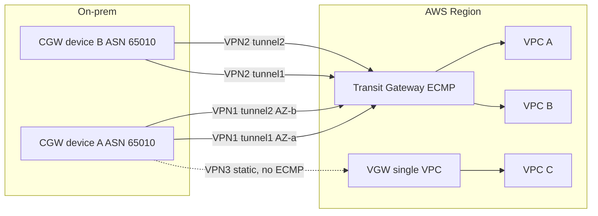
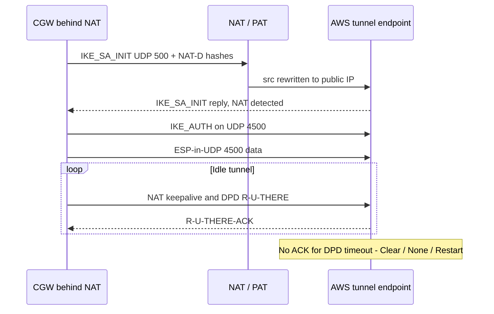
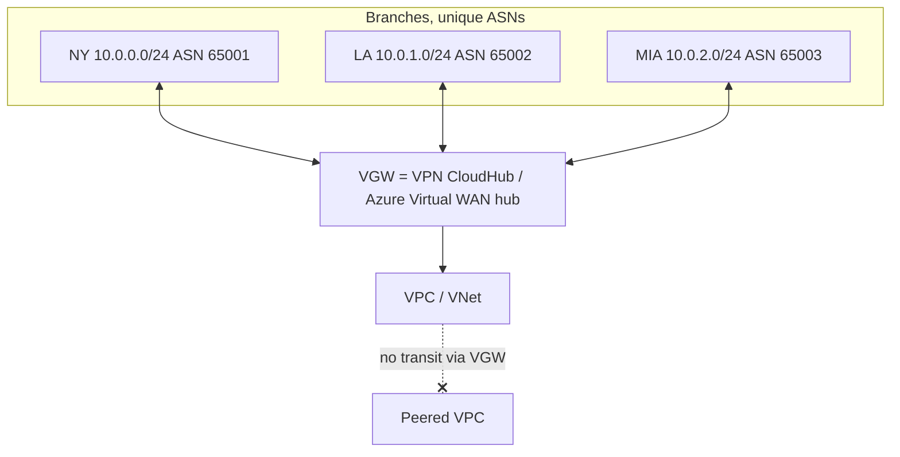

# G10 Site-to-Site VPN
> Last verified: 2026-10 · Audience: senior/staff DevOps, SRE, AI eng, NetEng, DevSecOps, architects

## TL;DR
- **Managed S2S VPN = IPsec (IKEv1/IKEv2) between a cloud-managed gateway and your on-prem device.** AWS: **Customer Gateway (CGW)** object + **VPN connection** terminated on a **Virtual Private Gateway (VGW)** (one VPC), **Transit Gateway (TGW)** or **Cloud WAN**. Azure: **Local Network Gateway (LNG)** + **Connection** on a **VPN Gateway** (in `GatewaySubnet`) or a **Virtual WAN hub** VPN gateway.
- **AWS always gives 2 tunnels per connection, in different AZs, each up to 1.25 Gbps / 140k PPS.** **Large Bandwidth Tunnels** go up to **5 Gbps / 400k PPS per tunnel**, but only on TGW or Cloud WAN. To go past that, run **ECMP** over BGP on TGW (static routing and VGW can't do ECMP). MTU is **1446 / MSS 1406**, with no PMTUD and no jumbo frames.
- **Azure throughput depends on the SKU, not the tunnel.** VpnGw1AZ through VpnGw5AZ give 650 Mbps → 10 Gbps aggregate, with **up to 30 or 100 S2S tunnels**. Since **2025-11-01 you can't create new non-AZ VpnGw1-5**, and the old SKUs are slated for deprecation after Sept 2026. Basic is legacy-ish: 10 tunnels, no BGP, no IPv6, not for production. You need more than 100 tunnels → **Virtual WAN** (1,000 branch connections, 20 Gbps per hub).
- **Use BGP unless the device can't.** AWS VGW tie-break order: longest prefix → **DX BGP > static VPN > BGP VPN** → shortest AS_PATH → lowest MED. **Static routes can't do ECMP or fast failover.**
- **A VGW is not a transit router.** On-prem can't reach peered VPCs, the IGW, a NAT GW or gateway endpoints through a VGW (no edge-to-edge routing). The one exception is **VPN CloudHub**, which does branch↔branch through one VGW. Azure is different: **gateway transit over VNet peering** lets spokes share the hub's VPN gateway.
- **Expect asymmetric routing.** AWS egresses on one tunnel it picks (on a VGW, one tunnel across *all* connections), while on-prem may send on both. On-prem stateful firewalls must allow it, or you pin a tunnel with **AS-path prepend / local-pref**. Azure active-active doesn't guarantee symmetry either.
- **DPD detects a dead peer.** AWS: timeout of at least 30 s (docs default 40 s), with action **Clear (default) / None / Restart**. Azure: default **45 s**, range 9–3600 s. **NAT-T** wraps ESP in **UDP 4500** when IKE (UDP 500) detects a NAT. It's required for **Accelerated VPN**, which runs over Global Accelerator, is TGW only, and is set only when you create the connection.
- **Monitor it:** AWS CloudWatch **`TunnelState`** (0 to 1, fractional means partly down), `TunnelDataIn/Out`, plus VPN tunnel and **BGP logs** to CloudWatch Logs. Azure: `BgpPeerStatus`, `TunnelAverageBandwidth`, TS-mismatch drop counters, diagnostic logs (IKE, Tunnel, Route), Network Watcher **VPN troubleshoot / Connection Monitor**.

## G10.1 Managed site-to-site VPN components
- **How it works (AWS):**
  - **Customer Gateway (CGW):** an AWS *resource* that describes your device: public IP (or certificate ARN for a dynamic IP) and BGP ASN. The **customer gateway device** is the physical or virtual router itself.
  - **Target gateway:**
    - **VGW:** attaches to exactly 1 VPC. Quota is 5 per Region and 10 VPN connections per VGW. No ECMP, no IPv6, no acceleration, no Large Bandwidth Tunnels.
    - **TGW VPN attachment:** gets ECMP, IPv6 inner and outer, acceleration, LBT, and it counts toward TGW attachment quotas.
    - **Cloud WAN:** core network attachment.
  - **VPN connection** (`type = ipsec.1`): **2 tunnels**, each with a unique AWS public IP, ending in **different AZs**. Inside addresses are a **/30 from 169.254.0.0/16** per tunnel. These are reserved: 169.254.0.0/30 through 169.254.5.0/30, and 169.254.169.252/30.
  - **Per-tunnel capacity:**

    | Tunnel type | Max bandwidth | Max PPS |
    |---|---|---|
    | Standard | 1.25 Gbps | 140,000 |
    | Large Bandwidth Tunnel (TGW/Cloud WAN only) | 5 Gbps | 400,000 |
    | VPN Concentrator | 100 Mbps | 10,000 |

    - LBT: both tunnels must match, no acceleration, the CGW needs a fixed IP, and it isn't available in a few Regions (for example eu-central-2 and me-central-1).
  - **Route quotas** (none adjustable):
    - VGW: 100 routes in from the CGW (BGP or static), 1,000 routes out.
    - TGW: 1,000 in, 5,000 out.
  - **Tunnel options** and their defaults:
    - IKE versions: v1 and v2.
    - Phase 1 lifetime: 28,800 s (range 900–28,800).
    - Phase 2 lifetime: 3,600 s (range 900–3,600).
    - Rekey margin: 270 s per AWS docs (the Terraform docs say 540).
    - Rekey fuzz: 100 %. Replay window: 1,024.
    - DH groups: 2 and 14–24 (phase 2 also allows 5).
    - Ciphers: AES128/256 and their GCM-16 variants. Integrity: SHA1 and SHA2-256/384/512.
    - **Startup action:** Add (the CGW starts IKE) or Start (AWS starts it).
    - The PSK can be stored in **Secrets Manager**.
    - **Tunnel endpoint lifecycle control** lets you schedule AWS endpoint replacements.
  - **AWS is route-based only.** The local/remote network CIDRs (default 0.0.0.0/0) are just IKE phase-2 proposals. Policy-based VPNs aren't supported, so use one SA pair with 0.0.0.0/0 selectors.
  - **Private IP VPN:** `outside_ip_address_type = PrivateIpv4` runs the IPsec over Direct Connect, using a TGW and a DX gateway transport attachment. Use it to encrypt DX traffic. See G12.
  - **VPN Concentrator** (new in 2025–26): TGW only, for **25+ low-bandwidth sites**. Each site gets 100 Mbps, the concentrator has 5 Gbps aggregate, it's BGP only, takes up to 100 sites, and uses a single TGW attachment.
- **How it works (Azure):**
  - **Local Network Gateway** is the CGW equivalent: on-prem public IP or FQDN, address prefixes, BGP ASN and peer IP.
  - **Virtual network gateway** (type VPN):
    - Lives in a **GatewaySubnet** (/27 or larger recommended).
    - Takes 30–45 min to deploy *(unverified)*.
    - Active-standby by default, or **active-active** with 2 public IPs.
  - **Connection** (type IPsec) joins the gateway and the LNG, and holds the PSK, IPsec policy, DPD timeout and NAT rules.
  - **SKUs (Generation 2 AZ, new deployments):**

    | SKU | Aggregate throughput | Max S2S tunnels |
    |---|---|---|
    | VpnGw2AZ | 1.25 Gbps | 30 |
    | VpnGw3AZ | 2.5 Gbps | 30 |
    | VpnGw4AZ | 5 Gbps | 100 |
    | VpnGw5AZ | 10 Gbps | 100 |
    | VpnGw1AZ (Gen1) | 650 Mbps | 30 |
    | Basic | 100 Mbps | 10 |

    - Basic has no BGP, no IPv6, no RADIUS, and can only be created with PowerShell or CLI.
  - **Per-tunnel throughput is much lower than the aggregate.** Benchmarks show roughly 650–700 Mbps per tunnel with GCMAES256, and about 140 Mbps with weaker ciphers.
  - **SKU consolidation:**
    - Non-AZ VpnGw1-5 can't be created since **2025-11-01**.
    - The migration window ran **Sept 2025 to Sept 2026**.
    - Upgrading in the same family has no downtime.
    - Basic is **not** being retired.
- **Trade-offs / when to use:**
  - VGW is cheap and simple for **1 VPC + a few sites**.
  - TGW suits **many VPCs**, ECMP, IPv6, acceleration or LBT.
  - On Azure, a VPN Gateway works for at most a few dozen tunnels. Virtual WAN is for branch scale or any-to-any.
- **Interview angles:**
  - "Single point of failure?" → Say both clouds are redundant on their side: AWS has 2 AZ-diverse tunnels, Azure has zone-redundant AZ SKUs. The usual SPOF is the **single on-prem device or ISP**. Fix it with **2 CGWs × 2 connections = 4 tunnels**, or Azure active-active with 2 LNGs.
  - Pitfall: a VGW connected by itself does nothing. You must also **enable route propagation or add routes** in the subnet route tables.

## G10.2 IPv4 and IPv6 traffic over VPN
- **How it works:**
  - AWS supports four combinations of outer tunnel and inner traffic:

    | Outer | Inner | Where supported |
    |---|---|---|
    | IPv4 | IPv4 | Everywhere, including VGW |
    | IPv4 | IPv6 | TGW and Cloud WAN only |
    | IPv6 | IPv6 | TGW and Cloud WAN only |
    | IPv6 | IPv4 | TGW and Cloud WAN only |

  - **VGWs don't support IPv6 at all.**
  - **One connection carries IPv4 *or* IPv6 inner traffic, not both.** Dual-stack therefore means **2 VPN connections** (4 tunnels).
  - IPv6 can't be turned on for an existing connection. You recreate it.
  - IPv6 inside tunnels get a **/126 from fd00::/8**, plus the IPv4 /30. Private IP VPN can't use IPv6 outer addresses.
  - IPv6 VPNs have the **same throughput, PPS, MTU and route limits** as IPv4.
- **Azure:**
  - The VPN Gateway supports **dual-stack S2S**: IPv4 and IPv6 inner traffic on a route-based, non-Basic gateway. The outer tunnel stays IPv4 *(unverified for 2026)*.
  - Virtual WAN IPv6 S2S support is limited *(unverified)*.
- **Trade-offs:**
  - The IPv6 outer tunnel matters for IPv6-only branches or carrier CGNAT.
  - IPv6 inner traffic means you need a TGW, not a VGW, which is a design driver for IPv6 VPCs.
- **Interview angles:**
  - "Dual-stack VPC needs on-prem reachability over VPN" → Say TGW with **two VPN connections** (`tunnel_inside_ip_version = ipv6` on one), BGP for both, and a VGW won't work.

## G10.3 Accelerated site-to-site VPN (anycast edge)
- **How it works:**
  - **Accelerated VPN** puts **AWS Global Accelerator** in front of the tunnels. AWS creates **2 accelerators, one per tunnel**, which you can't see or manage.
  - The tunnel IPs are anycast and come from separate network zones. CGW traffic enters the **nearest AWS edge POP** and then crosses the AWS backbone.
- **Rules:**
  - **TGW only** (no VGW). Quota is 10 per Region (adjustable).
  - **You can't toggle it on an existing connection**, so you create a new one and cut over.
  - **NAT-T is required** (UDP 4500, on by default).
  - **The CGW must initiate IKE.** Use startup action `add`, and a DPD action that doesn't rely on AWS initiating.
  - It doesn't work with a DX public VIF, and it's **not compatible with Large Bandwidth Tunnels**.
  - With cert-based auth the CGW must support **IKE fragmentation**, because Global Accelerator handles fragmentation poorly.
  - Pricing adds an hourly acceleration fee and a Global Accelerator data-transfer premium.
- **Azure equivalent:**
  - There's no toggle. Azure public IPs default to the **Microsoft network routing preference**, a "cold potato" model: traffic enters the Microsoft WAN at the POP closest to the user.
  - In practice Azure VPN already gets edge ingress. The "Internet" routing preference opts out.
  - For global branch fan-in, use **Virtual WAN** hubs in several regions.
- **Interview angles:**
  - "Branches in APAC, VPC in us-east-1, jittery tunnels" → Say accelerated VPN on TGW. Then add: it's a new connection with a new IP pair, NAT-T, and the CGW initiates. If that's still not enough, consider SD-WAN with TGW Connect, or DX.

## G10.4 VPN NAT traversal (NAT-T)
- **How it works:**
  - IKE runs on **UDP 500** and the data plane is **ESP (IP protocol 50)**.
  - ESP has no ports, so a NAT/PAT device can't track it.
  - During IKE_SA_INIT the peers exchange **NAT-detection hashes** (RFC 3947, RFC 7296). If they don't match, both sides float to **UDP 4500** and wrap ESP in UDP (RFC 3948).
  - Peers send **NAT keepalives** (usually every 20 s) to hold the NAT mapping open.
- **AWS:**
  - The CGW resource gets the **public IP of the NAT device**. The device itself can have a private IP. Its IKE identity or local ID may need to be set to the public IP.
  - Firewalls must allow UDP 500, UDP 4500 and ESP to the two AWS tunnel IPs.
  - LBT doesn't allow changing the NAT-T port while the tunnel is up.
- **Azure:**
  - NAT-T is supported. **The on-prem device must initiate.**
  - Azure doesn't NAT inner packets unless you configure **VPN Gateway NAT rules**. That's a separate feature, covered in G10.6.
- **Trade-offs:** UDP 4500 adds **8 bytes** of overhead, which reduces effective MTU and MSS. Clamp MSS to 1379 or lower per AWS best practice for the chosen ciphers *(exact value depends on the algorithm)*.
- **Interview angles:**
  - "Tunnel comes up and then no traffic" → Suspect ESP being blocked or NAT-T not negotiated: IKE on 500 works but data on proto 50 is dropped. Fix: allow 4500 and force NAT-T.
  - Also check the MTU black hole: there's no PMTUD over AWS VPN, so clamp MSS. See [G4 MTU](G4-network-performance-and-optimization.md#g41-basics-of-network-performance-bandwidth-latency-jitter-throughput-pps-mtu).

## G10.5 VPN route propagation (static vs dynamic)
- **How it works (AWS VGW):**
  - Static means you enter on-prem prefixes on the VPN connection, up to 100. Dynamic means **BGP** inside each tunnel, using the 169.254 /30 peers.
  - Setting **route propagation** on a VPC route table auto-installs VPN routes, both static and BGP, targeting the VGW.
  - **Route priority** in the VPC route table:
    1. Longest prefix wins.
    2. The **local route always wins**, even against more-specific propagated routes.
    3. For identical prefixes, static routes (IGW, NAT, ENI, peering, TGW…) beat propagated routes.
  - **Route priority inside the VGW** for identical prefixes:
    1. **DX BGP**
    2. **Static VPN**
    3. **BGP VPN**
    4. Then the shortest **AS_PATH**
    5. Then the lowest **MED**
  - **Tunnel health beats every routing attribute.**
  - **Blackhole routes aren't advertised** to the CGW.
- **TGW:**
  - The VPN attachment **associates** with one TGW route table and **propagates** BGP routes into any number of them. Static routes to a VPN attachment are added in the TGW route table.
  - **ECMP** needs BGP and `vpn_ecmp_support = enable`.
  - TGW evaluation order for the same prefix: static → prefix-list → VPC-propagated → DX-GW-propagated → Connect-propagated → **VPN-propagated** *(order from TGW docs; verify before quoting)*.
- **Azure:**
  - Static means the LNG address prefixes. Dynamic means **BGP**.
    - The Azure default ASN is **65515**.
    - Reserved ASNs are 65515 and 65517–65520, plus some Microsoft-reserved public ASNs.
  - The gateway's BGP peer IP comes from the GatewaySubnet. With an **APIPA** on-prem peer, you set an Azure APIPA BGP IP from **169.254.21.0–169.254.22.255**. **The on-prem side must then initiate BGP.**
  - Learned routes reach VNet NICs, and reach peered spokes when **gateway transit / "use remote gateways"** is on.
  - **Turn off "Propagate gateway routes"** on a route table to block BGP routes, for example in forced-firewall subnets.
- **Trade-offs:**

  | | Static | BGP |
  |---|---|---|
  | Failover speed | DPD (≥30–45 s) | BGP hold timer (AWS ~30 s; Azure 60/180 s *(unverified)*) + DPD |
  | ECMP on TGW | No | Yes |
  | Route scale | 100 on VGW | 100 / 1,000 |
  | Device needs | Any IPsec device | BGP support |
  | Traffic engineering | No | AS-path, MED, local-pref |

- **Interview angles:**
  - "VPN and DX both advertise 10.0.0.0/16" → On a VGW, **DX wins** for the same prefix. To prefer VPN, advertise a **more specific** prefix over the VPN.
  - Pitfall: static and BGP can't be mixed on one AWS connection.
  - Pitfall: on a VGW, VPN BGP routes count against the **100-route** CGW→AWS limit. Too many prefixes and the session goes down, so summarize.

## G10.6 VPN transitive routing scenarios
- **How it works (AWS VGW, no edge-to-edge routing):**
  - On-prem traffic that arrives through a VGW can reach only the VPC's own CIDRs.
  - It **can't** transit to:
    - **peered VPCs**
    - the **IGW** (no internet egress for on-prem through the VPC)
    - a **NAT GW**
    - **gateway endpoints** (S3 and DynamoDB)
    - another VPN or DX attached to a different VGW
  - The same is true in reverse. The VGW only routes to prefixes it knows from BGP or static entries, plus the attached VPC CIDR.
- **Ways to get transit:**
  - **TGW**, the hub router, which can do VPN↔VPC, VPN↔VPN and VPN↔DX through route tables.
  - **Cloud WAN.**
  - **VPN CloudHub** on one VGW for site↔site (G10.11).
  - An **NVA or proxy in the VPC** (G10.12).
  - **Interface endpoints** (PrivateLink), which *are* reachable from on-prem because they're ENIs in the VPC, unlike gateway endpoints.
- **Azure:**
  - **VNet peering + gateway transit** lets spoke VNets use the hub's VPN gateway: "Allow gateway transit" on the hub, "Use remote gateways" on the spoke. This works and is the standard hub-and-spoke design.
  - **Spoke↔spoke still isn't transitive.** It needs Azure Firewall, an NVA with UDRs, or Virtual WAN.
  - **On-prem↔on-prem transit through one VPN gateway** works with **BGP**, a multi-site setup.
  - **Virtual WAN Standard** gives any-to-any (branch↔branch, branch↔VNet, VNet↔VNet).
  - **Overlapping on-prem and VNet ranges** → **VPN Gateway NAT rules**:
    - Static 1:1 or dynamic.
    - **IngressSNAT** translates the on-prem space. **EgressSNAT** translates the VNet space.
    - Supported on VpnGw2–5 and their AZ versions, route-based only, up to 500 rules.
    - Not supported with APIPA BGP peers.
    - The dynamic NAT external pool can be at most /26.
    - Turn on "BGP route translation" so advertised and learned prefixes are rewritten.
- **Interview angles:**
  - "On-prem needs S3 privately via VPN" → A gateway endpoint won't work. Use an **S3 interface endpoint**, or route through TGW to an inspection VPC.
  - "On-prem needs internet via the cloud" → Not possible through a VGW. Use TGW → egress VPC with a NAT GW. Azure: forced-tunnel setup or Virtual WAN secured hub.
  - Follow-up on the clouds' different approaches → **AWS VGW = 1 VPC, non-transitive**. **Azure gateway transit = shared hub gateway.** Both clouds' real answer is a hub router (TGW / Virtual WAN). See [G8 Transit hub](G8-transit-hub.md).

## G10.7 VPN tunnels: active/active vs active/passive
- **How it works (AWS):**
  - Both tunnels are always up, and on-prem may send on either (ingress to AWS is ECMP-friendly).
  - **AWS egress uses one tunnel**, chosen by AWS and shown by the **MED** value for BGP. On a VGW, **one tunnel across all VPN connections** on that gateway is used.
  - The choice can change during **tunnel endpoint replacements**, which are AWS maintenance.
  - True active/active egress requires **TGW + BGP + ECMP**. Aggregate is up to 2 × 1.25 Gbps per connection, ×N connections, or LBT at 5 Gbps per tunnel.
    - ECMP hashes per flow on the 5-tuple, so **one flow ≤ one tunnel**.
- **Asymmetric routing:**
  - Return traffic can come back on the other tunnel. **Stateful on-prem firewalls drop it** unless they allow asymmetric routing (for example zone-based "TCP state bypass") or both tunnel interfaces share one zone.
  - AWS recommends devices that **support asymmetric routing**. With those, **don't prepend**, so the AWS-set MED decides.
  - Devices that need symmetry can make the paths **active/passive**: **AS-path prepend** on the backup tunnel's outbound advertisements, and **local-pref** on inbound.
- **Azure:**
  - **Active-standby** (default) means 1 public IP. Failover after planned maintenance takes about **10–15 s**; unplanned takes about **1–3 min** *(unverified)*.
  - **Active-active** means 2 instances and 2 public IPs, and needs a route-based, non-Basic SKU. There's no extra charge except the second public IP.
  - The on-prem device builds a tunnel to *each* instance. With 2 on-prem devices that's a full mesh of 4 tunnels ("dual redundancy").
  - Azure tries to keep one flow on one tunnel but **doesn't guarantee symmetric return**.
  - **Virtual WAN VPN gateways are always active-active.**
- **Trade-offs:**
  - Active/active gives more bandwidth and faster convergence, but needs ECMP or asymmetric-tolerant devices.
  - Active/passive is easier to debug, behind a stateful firewall, and only uses half the capacity.
- **Interview angles:**
  - "Intermittent drops after AWS maintenance" → AWS moved egress to tunnel 2, and the on-prem firewall dropped asymmetric return traffic, or tunnel 2 was never configured. **Always configure both tunnels.**
  - "Need 4 Gbps from on-prem to AWS" → Options:
    - LBT (5 Gbps per tunnel, TGW).
    - Or ≥2 connections × 2 tunnels with ECMP, keeping in mind the per-flow limit.
    - Or DX with the VPN as backup.

## G10.8 Dead Peer Detection (DPD)
- **How it works:**
  - **RFC 3706** IKE keepalive: an R-U-THERE / R-U-THERE-ACK exchange that is only sent when the tunnel is idle or traffic is one-way.
  - After the **timeout** the peer is declared dead, and the SAs and routes are withdrawn.
- **AWS:**
  - DPD timeout must be **≥30 s**. The current AWS docs say the default is **40 s**; the Terraform provider docs still say 30.
  - DPD timeout action:

    | Action | What AWS does |
    |---|---|
    | **Clear** (default) | Ends the IKE session and tears down the tunnel plus its routes. The CGW must re-initiate. |
    | **None** | Nothing. |
    | **Restart** | AWS restarts IKE. Use it with startup action `start`, and only if the CGW has a static IP. |

  - With **accelerated VPN**, initiation must come from the CGW, so pair it with `add` and a non-restart action.
  - Enable DPD on the CGW too, with a matching interval and retries. **Keep traffic or SLA probes flowing** so idle tunnels don't flap.
- **Azure:**
  - DPD default **45 s**, configurable **9–3,600 s** per connection.
  - Short values cause aggressive rekeys and "disconnects" on lossy or long-haul links.
  - Policy-based gateways tear down idle tunnels after about 5 min, and traffic re-establishes them.
- **Trade-offs:** A low DPD timeout means faster failover with static routing, but more false positives. **BGP hold timers usually give the faster, deterministic routing failover.**
- **Interview angles:**
  - "Tunnel down for minutes after an outage" → The DPD action is `clear` and the CGW isn't re-initiating, because it has no traffic or no auto-initiation. Fix: **startup action Start + DPD Restart** on AWS, or make the CGW always-on with SLA monitors.

## G10.9 VPN monitoring
- **AWS:**
  - **CloudWatch metrics** (`AWS/VPN`, dimensions `VpnId` and `TunnelIpAddress`):
    - **`TunnelState`**: 1 means UP (static) or ESTABLISHED (BGP). 0 means down. **Fractional values per connection mean one tunnel is down.** Alarm on `< 1` (redundancy lost) and `== 0` (outage).
    - **`TunnelDataIn` / `TunnelDataOut`**: bytes counted after decryption / before encryption. They can be non-zero even with the tunnel down, because of health checks.
    - `ConcentratorBandwidthUsage` for VPN Concentrators.
  - **Site-to-Site VPN logs** to CloudWatch Logs: IKE, IPsec and DPD events, plus separate **BGP logs** (state changes, route updates), in JSON or text.
  - **AWS Health / EventBridge** sends **tunnel endpoint replacement** notifications.
  - **TGW Flow Logs and Network Manager** (route analyzer, events).
  - **VPC Flow Logs** for traffic that reaches the ENIs.
- **Azure:**
  - **Metrics:**
    - `TunnelAverageBandwidth`, `TunnelEgress/IngressBytes` and packets.
    - **`TunnelEgress/IngressPacketDropTSMismatch`**, for traffic-selector mismatches.
    - `TunnelNatPacketDrop`, `BgpPeerStatus`, `BgpRoutesLearned/Advertised`.
    - `AverageBandwidth` for the gateway S2S total, and the MMSA/QMSA counts.
  - **Diagnostic logs:** `GatewayDiagnosticLog`, `TunnelDiagnosticLog`, `RouteDiagnosticLog`, `IKEDiagnosticLog`, `P2SDiagnosticLog`. Send them to Log Analytics.
  - **Network Watcher:**
    - **VPN troubleshoot** collects gateway and connection logs and checks health.
    - **Connection Monitor** runs synthetic TCP/ICMP probes VM↔on-prem for latency and loss.
  - Also **Resource Health** and the connection's `connectionStatus`.
- **Interview angles:**
  - "How do you know you've lost redundancy before an outage?" → Alarm on **`TunnelState < 1`** or the per-tunnel state. On BGP, alarm on BGP down, because a tunnel can be IPsec-UP while BGP is down.
  - Add **synthetic probes** for end-to-end health, since tunnel-up isn't the same as the app path working. See [G5 Monitoring](G5-traffic-monitoring-troubleshooting.md).

## G10.10 Site-to-site VPN architectures
- **Patterns:**
  1. **Single VPC:** VGW, 1 CGW, 2 tunnels.
  2. **Redundant CGW:** 2 devices, or 2 ISPs → 2 connections → 4 tunnels, with BGP.
  3. **Multi-VPC hub:** TGW with VPN attachments and ECMP, plus route-table segmentation. See G8.
  4. **VPN as DX backup:** BGP everywhere. The VGW prefers DX for the same prefix. On a TGW, DX-GW-propagated routes beat VPN-propagated ones, and you can steer with more-specific prefixes.
  5. **Private IP VPN over DX:** IPsec over a transit VIF for encryption-in-transit compliance. MACsec is the L2 alternative.
  6. **SD-WAN:** TGW Connect (GRE + BGP) or Cloud WAN. On Azure: Virtual WAN NVA-in-hub, or Route Server.
- **Azure equivalents:**
  1. VPN Gateway with one LNG.
  2. Active-active with 2 LNGs.
  3. Hub VNet with gateway transit, or **Virtual WAN**.
  4. **ExpressRoute + VPN coexistence**: ER is preferred, and the VPN is backup, with the GatewaySubnet ≥ /27.
  5. **IPsec over ExpressRoute private peering** (Virtual WAN, or VPN Gateway with private IPs).
- **Interview angles:**
  - "Design hybrid connectivity for 50 VPCs + 2 DCs" → Say TGW, DX via DX-GW as primary, VPN on TGW as backup with BGP and ECMP, segmented route tables.
  - The Azure version is Virtual WAN with an ER gateway plus a VPN gateway in the hub, or a hub VNet with ER plus VPN coexistence.

## G10.11 VPN hub for branch offices
- **AWS VPN CloudHub:**
  - One **VGW** and many CGWs, each with a **unique BGP ASN** and **non-overlapping** prefixes.
  - The VGW **re-advertises** each site's routes to the others, giving hub-and-spoke branch↔branch over the internet. It works with or without a VPC, and DX sites can join.
  - Billing is each VPN connection-hour plus **data out** from the VGW to a site (inbound is free).
  - Limit: 10 connections per VGW (adjustable).
- **Modern alternatives:**
  - **TGW** with VPN attachments, which propagates routes between attachments.
  - **VPN Concentrator** on TGW for 25+ small sites (≤100 Mbps each, up to 100 sites).
  - **Cloud WAN** for global networks.
- **Azure:**
  - **VPN Gateway multi-site with BGP** gives branch↔branch transit through the gateway.
  - **Virtual WAN Standard** is the at-scale answer:
    - Up to 1,000 branch connections and 20 Gbps per hub.
    - Up to 4 links per VPN site.
    - 1 VPN scale unit = 500 Mbps.
    - Any-to-any routing, with built-in SD-WAN partner automation.
- **Interview angles:**
  - "200 retail stores, low bandwidth, need store↔DC and store↔cloud" → Say AWS VPN Concentrator or TGW, or Azure Virtual WAN.
  - Mention **unique ASNs**, summarization, and per-site failure isolation. CloudHub is legacy and capped by VGW quotas.

## G10.12 Self-managed VPN appliances
- **How it works:**
  - An EC2 or Azure VM runs strongSwan, Libreswan, VyOS or a vendor NVA (Cisco Catalyst 8000V, Palo Alto, Fortinet).
  - **AWS requirements:**
    - **Disable source/destination check** on the ENI.
    - Assign an EIP and allow UDP 500/4500 and ESP in the security groups.
    - Point VPC routes for on-prem prefixes to the **ENI or instance**.
    - Enable `net.ipv4.ip_forward`.
  - **Azure requirements:**
    - **Enable IP forwarding on the NIC**, and also in the OS.
    - Add UDRs pointing to the NVA. **Azure Route Server** can BGP-peer with the NVA (ASN 65515), which avoids hand-managed UDRs.
- **Why use them:**
  - Features the managed service lacks: policy-based VPN (AWS), GRE, custom NAT, overlapping CIDRs, more than 1.25 Gbps per tunnel on older stacks, specific ciphers or IKE quirks.
  - Single-vendor operations.
  - Transitive routing past VGW limits.
- **Trade-offs:**
  - You own HA: 2 appliances across AZs, plus failover by route-table update (Lambda/automation), GWLB, or Azure LB HA ports.
  - You own patching, licensing and capacity, and the instance's network bandwidth and PPS limit throughput.
  - **HA is the hard part.** An ENI-route failover takes seconds to minutes.
- **Interview angles:**
  - "Tunnel up but VPC instances can't reach on-prem through the EC2 VPN box" → **Source/dest check is still on**, or the route table doesn't point at the ENI, or there's no return route on-prem. Azure: IP forwarding is off on the NIC.

## G10.13 Transit network built from VPN appliances
- **Legacy "Transit VPC" (AWS, around 2016–2018):**
  - A hub VPC with **2 NVAs** (originally Cisco CSR 1000v, from a CloudFormation solution) in different AZs.
  - Each **spoke VPC's VGW** builds a VPN, with BGP, to both hub NVAs. On-prem also builds VPNs to them. The NVAs do the transitive routing.
  - Problems:
    - Every spoke tunnel is limited to 1.25 Gbps.
    - It goes over IPsec even inside AWS.
    - NVA scaling, licensing and HA are on you.
    - It needs an automation Lambda to auto-wire spokes.
  - **Replaced by Transit Gateway (2018)**. Today use TGW + **TGW Connect** (GRE + BGP) for SD-WAN NVAs, or Cloud WAN.
- **Azure analog:**
  - A hub VNet with NVAs plus UDRs and Route Server, and spokes peered to it.
  - Or a Virtual WAN hub with **NVA-in-hub** or SaaS SD-WAN.
- **Interview angles:**
  - "Why not transit VPC today?" → Throughput and PPS ceilings, operational burden, and per-spoke tunnels. TGW gives native transit at up to 50 Gbps per VPC attachment *(unverified)*, plus route-table segmentation.
  - Keep NVAs only for **inspection** (GWLB / appliance mode) or SD-WAN termination.

## Diagrams






## Cloud mapping: AWS vs Azure
| Capability | AWS | Azure | Role it plays | Key differences | Alternatives |
|---|---|---|---|---|---|
| On-prem device object | Customer Gateway (CGW) | Local Network Gateway (LNG) | Peer IP/FQDN, ASN, (Azure: prefixes) | AWS CGW can be cert-based with a dynamic IP. Azure LNG holds static prefixes + BGP peer IP. | — |
| Cloud VPN endpoint, single network | Virtual Private Gateway (VGW) | VPN Gateway (route-based, GatewaySubnet) | Terminates IPsec | VGW is not transitive and has no IPv6, ECMP or LBT. The Azure gateway is shared by peered spokes through gateway transit. | Self-managed NVA |
| Hub VPN endpoint | TGW / Cloud WAN VPN attachment | Virtual WAN hub S2S gateway | Many networks + many sites | TGW: ECMP, LBT 5 Gbps per tunnel, accelerated. vWAN: 1,000 connections and 20 Gbps per hub, always active-active. | SD-WAN (TGW Connect / vWAN NVA) |
| Throughput unit | Per tunnel: 1.25 Gbps (LBT 5 Gbps) | Per gateway SKU: 650 Mbps to 10 Gbps aggregate | Capacity planning | AWS scales by adding tunnels (ECMP). Azure scales by SKU or vWAN scale units. | DX / ExpressRoute |
| Redundancy | 2 tunnels per connection, AZ-diverse | Active-standby or active-active, AZ SKUs | HA | AWS egresses on 1 tunnel unless TGW ECMP. Azure active-active needs on-prem tunnels to both instances. | — |
| Edge acceleration | Accelerated VPN (Global Accelerator, TGW only) | Microsoft-network routing preference (default) | Get traffic onto the backbone near the user | AWS is opt-in at creation. Azure is the default behaviour. | Cloudflare Magic WAN |
| Branch hub | VPN CloudHub / VPN Concentrator | VPN Gateway multi-site BGP / Virtual WAN | Branch↔branch | CloudHub is limited by VGW quotas. vWAN is the at-scale native option. | SD-WAN vendors |
| Overlapping CIDRs | None native (NVA or PrivateLink) | VPN Gateway NAT rules (Ingress/EgressSNAT) | Overlap handling | Azure has native static or dynamic NAT on the gateway. | NVA NAT, private NAT GW |
| Monitoring | CloudWatch TunnelState, VPN/BGP logs | Azure Monitor metrics/logs, Network Watcher | Health and troubleshooting | Azure has TS-mismatch counters and VPN troubleshoot. AWS has native BGP logs. | — |
| Self-managed | EC2 + source/dest check off | VM + NIC IP forwarding + Route Server | Custom features | Route Server gives BGP into the VNet. AWS uses route-table ENI targets or GWLB. | — |

- **Scope:**
  - The AWS VGW is per-VPC and per-Region. The TGW is per-Region and peered across Regions.
  - The Azure VPN Gateway is per-VNet (shared by peered spokes in any region through global peering gateway transit). Virtual WAN is global with regional hubs.
- **Pricing shape:**
  - AWS: per VPN connection-hour, plus data out, plus the TGW attachment-hour and per-GB processing. LBT and acceleration cost extra.
  - Azure: gateway-hour by SKU (AZ SKU prices were reduced in 2025), plus egress. vWAN: per scale-unit-hour plus connection-unit-hour.
- **Gotchas:**
  - AWS is route-based only (0.0.0.0/0 selectors). For policy-based peers on Azure, use `UsePolicyBasedTrafficSelectors` on a route-based gateway.
  - You can't change Azure's policy-based ↔ route-based type without recreating the gateway (about 60 min, and a new IP). Since Oct 2023 the portal can't create policy-based gateways.
  - Azure **custom IPsec/IKE policy** is per connection and needs a non-Basic SKU. AWS restricts allowed proposals per tunnel through tunnel options.

## Hands-on (optional)
```hcl
# AWS: BGP VPN on a Transit Gateway with ECMP, DPD/startup tuned, tunnel + BGP logging
resource "aws_ec2_transit_gateway" "hub" {
  amazon_side_asn                 = 64512
  vpn_ecmp_support                = "enable"
  default_route_table_propagation = "disable"
  default_route_table_association = "disable"
}

resource "aws_customer_gateway" "dc1" {
  bgp_asn    = 65010
  ip_address = "203.0.113.10" # public IP of device (or of the NAT in front of it)
  type       = "ipsec.1"
}

resource "aws_cloudwatch_log_group" "vpn" {
  name              = "/vpn/dc1"
  retention_in_days = 30
}

resource "aws_vpn_connection" "dc1" {
  customer_gateway_id = aws_customer_gateway.dc1.id
  transit_gateway_id  = aws_ec2_transit_gateway.hub.id
  type                = "ipsec.1"
  static_routes_only  = false      # BGP -> enables ECMP + fast failover
  tunnel_bandwidth    = "standard" # "large" = 5 Gbps/tunnel (TGW/Cloud WAN only)

  tunnel1_inside_cidr = "169.254.10.0/30"
  tunnel2_inside_cidr = "169.254.10.4/30"

  tunnel1_ike_versions                 = ["ikev2"]
  tunnel2_ike_versions                 = ["ikev2"]
  tunnel1_phase1_encryption_algorithms = ["AES256-GCM-16"]
  tunnel2_phase1_encryption_algorithms = ["AES256-GCM-16"]
  tunnel1_phase2_encryption_algorithms = ["AES256-GCM-16"]
  tunnel2_phase2_encryption_algorithms = ["AES256-GCM-16"]

  tunnel1_startup_action      = "start"   # AWS initiates (CGW has static IP)
  tunnel2_startup_action      = "start"
  tunnel1_dpd_timeout_seconds = 30
  tunnel2_dpd_timeout_seconds = 30
  tunnel1_dpd_timeout_action  = "restart"
  tunnel2_dpd_timeout_action  = "restart"

  tunnel1_log_options {
    cloudwatch_log_options {
      log_enabled       = true
      log_group_arn     = aws_cloudwatch_log_group.vpn.arn
      log_output_format = "json"
      bgp_log_enabled   = true
      bgp_log_group_arn = aws_cloudwatch_log_group.vpn.arn
    }
  }
}

resource "aws_ec2_transit_gateway_route_table" "onprem" {
  transit_gateway_id = aws_ec2_transit_gateway.hub.id
}

resource "aws_ec2_transit_gateway_route_table_association" "vpn" {
  transit_gateway_attachment_id  = aws_vpn_connection.dc1.transit_gateway_attachment_id
  transit_gateway_route_table_id = aws_ec2_transit_gateway_route_table.onprem.id
}

# Alarm when redundancy is lost (one tunnel down => TunnelState < 1)
resource "aws_cloudwatch_metric_alarm" "vpn_redundancy" {
  alarm_name          = "vpn-dc1-tunnel-redundancy"
  namespace           = "AWS/VPN"
  metric_name         = "TunnelState"
  dimensions          = { VpnId = aws_vpn_connection.dc1.id }
  statistic           = "Minimum"
  period              = 60
  evaluation_periods  = 3
  comparison_operator = "LessThanThreshold"
  threshold           = 1
}
```

```hcl
# VGW variant (single VPC): propagate VPN routes into the subnet route table
resource "aws_vpn_gateway" "vgw" {
  vpc_id          = var.vpc_id
  amazon_side_asn = 64513
}

resource "aws_vpn_gateway_route_propagation" "private" {
  vpn_gateway_id = aws_vpn_gateway.vgw.id
  route_table_id = var.private_route_table_id
}
```

```bash
# Quick health checks
aws ec2 describe-vpn-connections --vpn-connection-ids "$VPN_ID" \
  --query 'VpnConnections[0].VgwTelemetry[].{ip:OutsideIpAddress,status:Status,msg:StatusMessage,routes:AcceptedRouteCount}'

# Self-managed EC2 VPN appliance: must disable source/dest check
aws ec2 modify-instance-attribute --instance-id "$IID" --no-source-dest-check

# Azure: connection status + BGP learned routes; enable NIC IP forwarding for an NVA
az network vpn-connection show -g rg-hub -n cn-dc1 --query connectionStatus
az network vnet-gateway list-learned-routes -g rg-hub -n vpngw-hub -o table
az network nic update -g rg-hub -n nva-nic --ip-forwarding true
```

## Cross-links
- [G9 Hybrid network basics: static vs BGP, AS_PATH/LOCAL_PREF/MED](G9-hybrid-network-basics.md)
- [G8 Transit hub: VPN attachment, ECMP, accelerated VPN, Connect/SD-WAN](G8-transit-hub.md)
- [G12 Dedicated interconnect (DX/ExpressRoute, VPN as backup, private IP VPN)](G12-dedicated-interconnect.md)
- [G13 Managed global WAN (Cloud WAN / Virtual WAN)](G13-managed-global-wan.md)
- [G11 Client VPN](G11-client-vpn.md)
- [G6 Private connectivity and peering (non-transitive peering)](G6-private-connectivity-peering.md)
- [G7 Service endpoints and Private Link (gateway vs interface endpoints from on-prem)](G7-service-endpoints-private-link.md)
- [G4.1 MTU and performance basics](G4-network-performance-and-optimization.md#g41-basics-of-network-performance-bandwidth-latency-jitter-throughput-pps-mtu)
- [G5 Traffic monitoring and troubleshooting](G5-traffic-monitoring-troubleshooting.md)
- [G1.7 / G1.8 Firewalls and ACLs](G1-virtual-network-fundamentals.md#g17-instance-level-stateful-firewall-rules)
- [G1.13 Self-managed NAT instance (source/dest check)](G1-virtual-network-fundamentals.md#g113-self-managed-nat-instance)
- [F7 Network routing](../F-network-engineering/F7-network-routing.md)
- [H5 Network performance deep dive (MTU/MSS)](../H-full-stack-troubleshooting/H5-network-performance-deep-dive.md)

## Sources
- https://docs.aws.amazon.com/vpn/latest/s2svpn/vpn-limits.html
- https://docs.aws.amazon.com/vpn/latest/s2svpn/VPNTunnels.html
- https://docs.aws.amazon.com/vpn/latest/s2svpn/tunnel-configure.html
- https://docs.aws.amazon.com/vpn/latest/s2svpn/accelerated-vpn.html
- https://docs.aws.amazon.com/vpn/latest/s2svpn/ipv4-ipv6.html
- https://docs.aws.amazon.com/vpn/latest/s2svpn/vpn-route-priority.html
- https://docs.aws.amazon.com/vpn/latest/s2svpn/VPNRoutingTypes.html
- https://docs.aws.amazon.com/vpn/latest/s2svpn/monitoring-cloudwatch-vpn.html
- https://docs.aws.amazon.com/vpn/latest/s2svpn/VPN_CloudHub.html
- https://docs.aws.amazon.com/vpn/latest/s2svpn/vpn-concentrator.html
- https://registry.terraform.io/providers/hashicorp/aws/latest/docs/resources/vpn_connection (via github.com/hashicorp/terraform-provider-aws docs)
- https://learn.microsoft.com/en-us/azure/vpn-gateway/about-gateway-skus
- https://learn.microsoft.com/en-us/azure/vpn-gateway/gateway-sku-consolidation
- https://learn.microsoft.com/en-us/azure/vpn-gateway/vpn-gateway-vpn-faq
- https://learn.microsoft.com/en-us/azure/vpn-gateway/vpn-gateway-bgp-overview
- https://learn.microsoft.com/en-us/azure/vpn-gateway/bgp-howto
- https://learn.microsoft.com/en-us/azure/vpn-gateway/nat-overview
- https://learn.microsoft.com/en-us/azure/vpn-gateway/monitor-vpn-gateway-reference
- https://learn.microsoft.com/en-us/azure/virtual-wan/virtual-wan-faq
