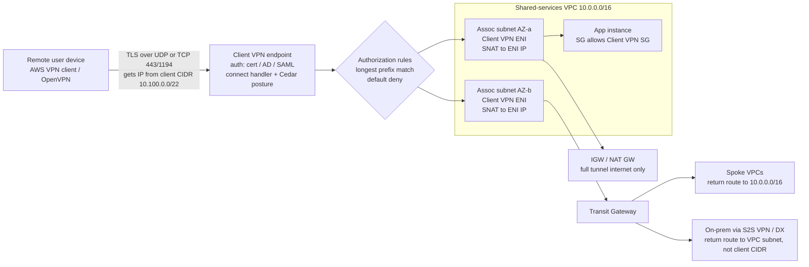
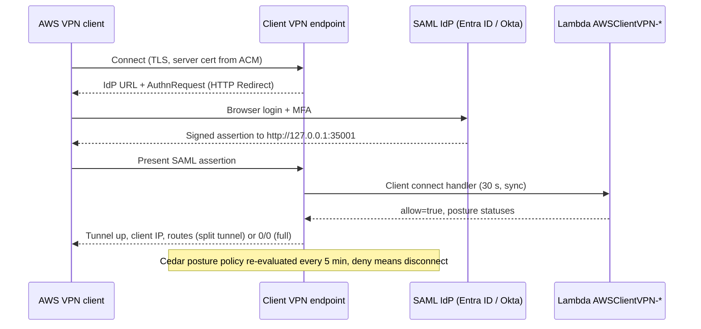

# G11 Client VPN
> Last verified: 2026-10 · Audience: senior/staff DevOps, SRE, AI eng, NetEng, DevSecOps, architects

## TL;DR
- **Managed remote-access VPN** (the generic course term) maps to **AWS Client VPN** (OpenVPN/TLS, regional endpoint) and **Azure VPN Gateway point-to-site (P2S)** or **Virtual WAN User VPN** (OpenVPN / IKEv2 / SSTP). Same job: an encrypted tunnel from one user device into a cloud network.
- **AWS Client VPN in one breath:** you give it a **client CIDR** (/22 to /12, fixed after creation, no overlap with the VPC). You **associate subnets**, one per AZ and all in one VPC. Each association puts **managed ENIs** in that subnet. **Authorization rules** (longest-prefix match, deny by default) and **routes** decide what clients can reach. Client traffic is **SNAT'd to the ENI IP**, so security groups and the remote networks see the VPC subnet, not the client CIDR.
- **Azure P2S in one breath:** a route-based VPN gateway in `GatewaySubnet`, a **client address pool**, and three auth types: **certificate**, **Entra ID** (OpenVPN + Azure VPN Client only, with Conditional Access and MFA) and **RADIUS/AD**. There is **no SNAT**: the client pool is routed, so NSGs and on-prem must know it.
- **Auth:** AWS offers mutual certificate auth, Active Directory (Directory Service) and SAML 2.0 (one IdP per endpoint). You can stack cert with AD, or cert with SAML. AWS also has a **client connect handler** (a Lambda named `AWSClientVPN-*`, 30 s timeout) and, as of 2026, **device posture** written as Cedar policies (CrowdStrike, Jamf or JumpCloud tokens, re-checked every 5 min).
- **Split tunnel vs full tunnel:** AWS defaults to full tunnel (it pushes `0.0.0.0/0`). Turning on split tunnel pushes the endpoint route table instead. Azure P2S behaves as split tunnel by default (it pushes only VNet and learned prefixes). Forced tunnel there means advertising `0.0.0.0/1` plus `128.0.0.0/1`, and the gateway does **not** give internet egress.
- **Pricing shapes differ:** AWS charges **per subnet association-hour plus per connection-hour**, so cost grows with users × hours. Azure charges **gateway-hours with 128 P2S connections included**, plus a per-connection-hour fee above that. vWAN charges P2S scale units plus connection units.
- **Reaching peered or on-prem networks:** in AWS, add an endpoint route through the associated subnet, an auth rule, and VPC routes toward peering, TGW, VGW or DX. In Azure you need gateway transit on the peerings, and for S2S-connected sites you need BGP. Windows clients must re-download the profile after topology changes.
- **Modern direction is ZTNA (zero-trust network access):** **AWS Verified Access**, **Microsoft Entra Private Access** (part of Global Secure Access), **Cloudflare Access + Cloudflare One Client (formerly WARP)**, and **Tailscale**. These check identity and device per app, on every request, instead of giving network-level reach.

## G11.1 Managed remote-access VPN

### What it is (generic → AWS / Azure)
| Generic term (course) | AWS | Azure |
|---|---|---|
| Managed remote-access VPN endpoint | **Client VPN endpoint** (`cvpn-endpoint-…`) | **VPN Gateway P2S configuration** on a virtual network gateway; or **Virtual WAN P2S (User VPN) gateway** in a vHub |
| Client address pool | **Client CIDR** (IPv4 /22–/12; IPv6 is auto-assigned from the associated subnet) | **VPN client address pool** (vWAN supports multiple pools and user-group → pool mapping) |
| Attachment into the network | **Target network association** = subnet → managed **ENIs** | Gateway VMs in **GatewaySubnet** (VPN GW) or in the vHub |
| Access policy | **Authorization rules** (CIDR + AD/SAML group) + **security groups** on the association | Entra app assignment / Conditional Access; NSGs or Azure Firewall on the client pool |
| Client software | AWS-provided client (OpenVPN-based) or any OpenVPN client (no SAML with third-party clients) | **Azure VPN Client** (Entra ID, OpenVPN); native IKEv2/SSTP; OpenVPN client (cert only) |
| Connection log | **Connection logging** → CloudWatch Logs | Gateway diagnostic logs (`P2SDiagnosticLog`, `IKEDiagnosticLog`) → Log Analytics (unverified exact table names) |

### AWS Client VPN: how it works
- **Protocol:** OpenVPN over TLS. Transport is **UDP (default) or TCP**, chosen at creation and **immutable**. Port is **443 (default) or 1194**. Endpoints can be IPv4, IPv6 or dual-stack, for both the outer tunnel and the inner traffic.
- **Server certificate is required in ACM** whatever auth you pick. Mutual auth also needs a client root CA chain in ACM. If the server and client certs share a CA, you can reuse the same ARN.
- **Client CIDR rules:**
  - Size must be **between /22 and /12**.
  - It **cannot overlap** the VPC CIDR or any manual route, and it **cannot be changed** later.
  - AWS reserves part of it for its HA model, so **size it at 2× peak concurrent users**.
- **Target network associations:**
  - Every associated subnet must be in the **same VPC**, with **at most one subnet per AZ**. Dedicated-tenancy VPCs are not supported.
  - The endpoint sits in `pending-associate` until the first association exists, and clients cannot connect until then.
  - Each association creates **Client VPN ENIs** in the subnet. AWS deletes and recreates them during maintenance (you will see this in CloudTrail), so **always connect by DNS name, never by IP**.
- **SNAT/PAT:**
  - IPv4 client traffic leaving the ENI is **source-NAT'd to the ENI's IP**, and ports are translated when several clients hit the same destination IP and port.
  - Result: target security groups reference the **Client VPN security group**, and on-prem or peer networks only need a return route to the **VPC subnet**, not to the client CIDR.
  - **IPv6 traffic is not NAT'd**, so the client's real IPv6 address is visible.
- **Scale and quotas (default, per Region):**
  - 5 endpoints per Region (adjustable).
  - 200 authorization rules per endpoint.
  - 100 routes per target association.
  - 20,000 CRL entries (hard limit).
  - 10 concurrent operations per endpoint (hard limit).
- **Concurrent connections scale with the number of associations:** 1 association = 7,000; 2 = 36,500; 3 = 66,500; 4 = 96,500; 5 = 126,000.
- **Bandwidth:** **50 Mbps baseline per user connection**. AWS Support can raise it.
- **Authentication:**

  | Method | Identity source | Group-based auth rules | Self-service portal | Notes |
  |---|---|---|---|---|
  | Mutual (cert) | Client certs from your CA, in ACM | **No.** Every rule is "all users", so you need separate endpoints per user population | No | Failed mutual-auth attempts are **not logged**. CRL import is limited to 20k entries |
  | Active Directory | AWS Managed Microsoft AD / AD Connector, **same account and same Region** | Yes (AD group SID) | Yes | MFA via the directory's RADIUS |
  | SAML 2.0 federated | IAM SAML provider (Okta, Entra ID, IAM Identity Center, JumpCloud…) | Yes (`memberOf` attribute, case-sensitive) | Yes | **One IdP per endpoint**. Needs the AWS client ≥1.2.0. ACS is `http://127.0.0.1:35001` (the client reserves **TCP 35001**). No SAML single logout. Assertions must be signed. NameID must be in email format |

  You can combine auth methods as **cert + AD** or **cert + SAML**. When combined, both must succeed.
- **Connection-time controls, applied in this order: authenticate → client connect handler → authorization rules:**
  - **Client connect handler:**
    - It is a Lambda whose name starts with `AWSClientVPN-`. It must be in the same account and Region, it runs **synchronously** with a **30 s fixed timeout**, and any failure, throttle or invalid response means **deny**.
    - Use provisioned concurrency so it stays fast.
    - It receives the cert CN, username, groups, platform and public IP, and returns `allow` plus up to 10 posture statuses.
  - **Device posture / authorization policy (new in 2026):**
    - Policies are written in **Cedar** and evaluate device trust tokens (CrowdStrike, Jamf, JumpCloud) and user attributes.
    - The policy is checked at connect and **again every 5 minutes**. A session that falls out of compliance is disconnected.
    - **Shadow mode** lets you log decisions without enforcing them. The policy document is limited to 10 KB.
- **Session controls:**
  - Session timeout can be **8, 10, 12 or 24 h** (default 24).
  - Optional "disconnect on session timeout" makes users reconnect manually instead of the client reconnecting automatically.
  - A client login banner can show up to 1,400 characters.
  - The self-service portal is for downloading the profile and only works with AD or SAML.
- **Connection logging:**
  - Logs go to CloudWatch Logs as JSON. Each record has connection-attempt or reset status, failure reason, client IP, device IP, CN, username, byte and packet counts, duration and the posture evaluation.
  - It is **connection metadata, not a flow log**. For traffic flows, use **VPC Flow Logs on the Client VPN ENIs**.
- **TunnelCrack hardening (AWS-enforced):**
  - If the client's LAN is **outside RFC 1918 or 169.254/16**, the endpoint pushes `redirect-gateway block-local`, so local LAN access is lost.
  - The client also requires that the IP it connects to matches what the endpoint DNS name resolves to. A **custom DNS CNAME/A record pointing at the endpoint IPs breaks** recent AWS clients.
- **DNS:** you can push up to 2 IPv4 (plus 2 IPv6) DNS servers. Because traffic is SNAT'd through a VPC ENI, the **VPC resolver (VPC+2) is reachable**, and so are Route 53 Resolver inbound endpoints for hybrid DNS. On **Windows full tunnel**, all DNS is forced into the tunnel.
- **Cost (us-east-1 list):**
  - **$0.10 per subnet association-hour** plus **$0.05 per active connection-hour**, plus public IPv4 address charges.
  - Example: 2 associations for a month is about $146. 500 users × 8 h × 22 days adds about $4,400.
  - Connection-hours dominate. Idle connected clients cost money, so set session timeouts.

### Azure P2S: how it works
- **Gateway:**
  - P2S requires a **route-based** virtual network gateway in **GatewaySubnet**.
  - New deployments should use the **AZ SKUs (VpnGw1AZ–5AZ)**. Non-AZ VpnGw1–5 are being consolidated into AZ SKUs, and a Standard public IP is required.
  - **Basic SKU:** SSTP only (no IKEv2/OpenVPN), no RADIUS, no IPv6, a 128-connection cap. For dev/test only.
- **Protocols:**
  - **OpenVPN**: TLS 1.2/1.3 on TCP 443. Works on Windows, macOS 13+, iOS, Android and Linux.
  - **SSTP**: Windows only, maximum 128 connections on every SKU.
  - **IKEv2**: IPsec. Used by macOS and native clients.
  - IPv6 works with IKEv2 and OpenVPN, but not SSTP.
- **Connection limits (IKEv2/OpenVPN):**
  - VpnGw1AZ: 250. VpnGw2AZ: 500. VpnGw3AZ: 1,000. VpnGw4AZ: 5,000. VpnGw5AZ: 10,000.
  - The SSTP limit is a separate 128 on every SKU.
  - P2S and S2S **share the gateway's aggregate throughput** (for example, Gen2 VpnGw2AZ is benchmarked at 1.25 Gbps). Heavy P2S use degrades S2S.
- **Auth types:** Certificate, Microsoft Entra ID, RADIUS (AD/NPS/MFA). Several can be enabled at once.
  - **Certificate:** you upload the root CA public key and the gateway validates client certs. Revocation works by thumbprint.
  - **Entra ID:**
    - Works **only over OpenVPN, only with the Azure VPN Client** (Windows 11 and macOS).
    - Gives you **Conditional Access + MFA**.
    - Use the **Microsoft-registered App ID** (audience `c632b3df-…`). **Manually registered client apps retire 2028-03-31** in Azure Public Cloud.
    - The gateway supports **one audience value**.
    - **Azure VPN Client for Linux (preview) retired 2026-08-31.** Linux users go back to OpenVPN with certificate auth.
  - **RADIUS:** the gateway passes authentication through to a RADIUS server, so the RADIUS server must be reachable from the gateway (in a VNet, or on-prem over S2S).
- **Routing and no NAT:**
  - Clients get addresses from the **client address pool**. Azure routes that pool inside the VNet, and NSGs or Azure Firewall see the real client pool IP.
  - **With BGP, on-prem learns the P2S pool** over S2S BGP (unverified: confirm in your topology). Without BGP you add the pool to the local network gateway path on the on-prem device.
  - OpenVPN clients accept at most **1,000 routes**.
- **Virtual WAN User VPN:**
  - A separate **P2S gateway** inside the vHub, sized in **scale units**: 1 SU = 0.5 Gbps / 500 connections, 20 SU = 10 Gbps / 10,000, up to 200 SU = 100 Gbps / **100,000 users**.
  - Supports **user groups → multiple address pools**, so you can enforce per-group firewall policy on the source pool.
  - **Branch-to-branch transit** connects P2S users to S2S/ER sites by default.
  - A Secured hub (Azure Firewall) gives internet breakout for P2S. Users may need to disable IPv6 on the device to force traffic into the hub.
- **Pricing shape:** gateway-hour by SKU, with **128 P2S connections included**, then **per connection-hour** above 128. vWAN bills P2S scale-unit hours plus connection-unit hours (unverified current numbers).

### Trade-offs / when to use
- **Use a managed client VPN** when:
  - users need **network-layer (L3)** access to many arbitrary ports or protocols (DB clients, SSH, RDP, legacy thick clients);
  - you want a fast lift from on-prem VPN concentrators;
  - you need the client to have a routable or identifiable IP.
- **Prefer ZTNA** (Verified Access, Entra Private Access, Cloudflare Access, Tailscale ACLs) when access is to known apps. You get **per-app least privilege**, continuous posture checks and no lateral movement.
- **AWS vs Azure structural differences:**
  - **SNAT vs routed pool.** AWS SNAT simplifies on-prem return routing, but you lose per-user source IP in downstream logs; correlate through connection logs and ENI flow logs. Azure keeps client IPs but forces you to route and filter the pool everywhere.
  - **Per-destination authorization.** AWS has native CIDR × group auth rules. Azure P2S on VPN Gateway has **no per-destination authZ**: Entra controls *who connects*, and NSGs or Firewall control *where* (vWAN user-group pools help here).
  - **Billing.** AWS bills per connection-hour. Azure's cost is mostly a fixed gateway fee with 128 connections included. For many intermittent users Azure is cheaper; for a small team AWS is cheaper.
  - **Gateway sharing.** The AWS endpoint is its own service. The Azure P2S gateway is shared with S2S and ER coexistence, so the throughput budget and maintenance are shared too.
- **Self-managed alternatives:**
  - OpenVPN Access Server, WireGuard (wg-easy, Netmaker), or firewall NVAs (Palo Alto GlobalProtect, Fortinet, Cisco Secure Client) on EC2 or VMs.
  - Pick these when you need features like host checks, per-app VPN or HIP profiles, and you accept owning HA and patching. See [G10 Site-to-Site VPN](G10-site-to-site-vpn.md) for the appliance pattern.

### Interview angles
- **"Why can't my Client VPN users reach an EC2 instance even though the auth rule exists?"**
  - Check the **security group**: the instance SG must allow the **Client VPN association SG**, or the VPC subnet CIDR, not the client CIDR.
  - Check that a **route** exists on the endpoint for that destination.
  - With split tunnel, check that the **client actually got the route**.
  - Check the NACLs on the association subnet.
- **"Design HA for Client VPN."**
  - Associate **one subnet in each of ≥2 AZs**. The DNS name resolves to multiple ENIs, and the client reconnects on failure.
  - It is regional. For multi-Region, use one endpoint per Region with separate profiles. There is no anycast or global endpoint, and a custom DNS alias is blocked by the TunnelCrack check.
- **"Centralized remote access for 50 accounts."**
  - Put **one endpoint in a shared-services/network VPC** attached to a **Transit Gateway**.
  - Add endpoint routes for each spoke CIDR pointing at the association subnet, and a subnet route table sending them to the TGW.
  - Spokes only need a return route to the **shared-services VPC CIDR** (thanks to SNAT).
  - Auth rules per IdP group. Azure equivalent: **vWAN hub with User VPN**, or a hub VNet gateway with "allow gateway transit".
- **"Cert-only auth and different teams need different access."** Cert auth can't do group rules. Either use **separate endpoints per population** or move to **SAML/AD** with group-based rules (or cert + SAML).
- **"How do you revoke a laptop?"**
  - Cert: import the CRL (≤20k entries) and terminate active connections; CRL changes don't drop live sessions.
  - SAML/AD: disable the user in the IdP and terminate the session.
  - Posture: with a Cedar policy, the next 5-minute re-evaluation drops it.
- **"Entra ID auth on Azure P2S isn't offered for IKEv2. Why?"** Entra auth is OpenVPN-only with the Azure VPN Client. With IKEv2 + OpenVPN tunnel types selected, Entra users are forced to OpenVPN.
- **Pitfalls:**
  - A client CIDR that overlaps home or VPC ranges.
  - Undersized /22 for 1,000+ users (remember 2× sizing).
  - Pinning endpoint IPs in firewall allow-lists.
  - Expecting third-party OpenVPN clients to support SAML.
  - Forgetting CloudWatch connection logs are **not** flow logs.
  - On Azure, forgetting that **168.63.129.16 (Azure DNS) is not reachable from P2S clients**. Use **DNS Private Resolver inbound endpoints** or custom DNS on the VNet (see [G3](G3-network-dns-and-dhcp.md)).

## G11.2 Split tunnel and remote network access

### How it works
- **Full tunnel:** all client traffic, including internet, goes to the VPN. Pros: central egress inspection, data-loss controls, a consistent source IP. Cons: hairpin latency, egress and data-processing cost, VPN capacity spent on SaaS and video traffic.
- **Split tunnel:** only the corporate prefixes go into the tunnel; everything else exits the device's local ISP. Pros: performance, cost, bandwidth relief. Cons: the device is dual-homed (local network plus corp at once), the internet path loses central egress inspection (needs an endpoint agent or SWG instead), and DNS behaviour gets messy.
- **AWS Client VPN:**
  - **Default is full tunnel.** The client route table gets `0.0.0.0/0` via the tunnel.
  - **Full tunnel internet access needs all of these:**
    - an endpoint route `0.0.0.0/0` → association subnet;
    - an auth rule `0.0.0.0/0`;
    - an association subnet route to an **IGW or NAT GW**;
    - SG egress allowing it.
  - **Enable split tunnel** (on create or modify): the endpoint **pushes its route table** to the client. Don't add `0.0.0.0/0` in split mode, because it disrupts connectivity. **Any route-table change resets all client connections**, so batch changes into a window.
  - **Auth rules use longest-prefix match:**
    - Default is deny, and you cannot write deny rules.
    - `0.0.0.0/0` is evaluated **last** and means "anything not matched by a more specific rule".
    - A more specific rule for group A **removes** that prefix from group B's `0/0` access. This is the classic exam trap.
  - Benefit of split tunnel called out by AWS: lower **data transfer out cost** from AWS.
- **Azure P2S:**
  - **Effectively split tunnel by default.** Clients receive the VNet prefix, directly peered VNet prefixes (with *Allow gateway transit* / *Use remote gateways*) and, **for non-Windows clients**, BGP-learned S2S prefixes.
  - **Custom routes:** add these on the gateway's P2S config (for example a storage account IP `/32`, so storage traffic rides the tunnel), or edit include/exclude routes in the Azure VPN Client profile XML (unverified exact element names).
  - **Forced tunnel:** advertise `0.0.0.0/1` and `128.0.0.0/1`. Two halves are used because they beat the local default route on prefix length. **The VPN gateway itself does not provide internet**, so that traffic is dropped unless you steer it to an NVA or Azure Firewall. A vWAN **secured hub** with routing intent is the clean path.
  - **Windows quirk:** after peering or topology changes, **re-download and reinstall the client profile**. With BGP-learned S2S routes, Windows clients may need routes added manually; non-Windows get them automatically.
  - Access is **not transitive through non-BGP S2S chains**. It only reaches **directly peered** VNets, not peers-of-peers.
- **Cloudflare One Client (formerly WARP) split tunnel:** **Exclude mode is the default.** Everything goes to Cloudflare Gateway except the excluded ranges (RFC 1918 and 100.64/10 by default). You must remove a private range from the exclude list for it to reach private networks through Cloudflare Tunnel. **Include mode** sends only listed IPs and domains.

### Remote network access patterns (reaching beyond the attached network)
| Destination | AWS Client VPN | Azure P2S (VPN Gateway) | Azure vWAN User VPN |
|---|---|---|---|
| Attached VPC/VNet | Assoc + auth rule (route auto-added) | Automatic | VNet connection to hub |
| Peered VPC / VNet | Endpoint route via assoc subnet + auth rule + peer SG allows assoc SG/subnet (in **full tunnel**, access is allowed by default) | Peering with gateway transit; direct peers only | Any connected VNet (hub routing) |
| Hub-and-spoke | Route via assoc subnet → **TGW** | Hub gateway + gateway transit | Native |
| On-prem via S2S/DX | Endpoint route + auth rule + VPC route to **VGW/TGW**; on-prem returns to the **VPC subnet** (SNAT) | S2S with **BGP**; on-prem must route the **client pool** | Branch-to-branch on (default) |
| Internet (full tunnel) | `0/0` route + auth + IGW/NAT | Forced tunnel + NVA/Firewall | Secured hub / routing intent |
| Client-to-client | Route `client CIDR → local` + auth rule. Not supported with AD/SAML group auth rules, nor for IPv6 | Not a typical pattern (unverified) | Possible via hub |

### Trade-offs / when to use
- **Full tunnel** when regulation requires all egress inspected (finance, government), when you need a stable egress IP for third-party allow-lists, or for untrusted networks.
- **Split tunnel** for performance and cost at scale, especially Teams/Zoom/SaaS. Combine it with an **SSE/SWG** (Entra Internet Access, Cloudflare Gateway, Zscaler) so internet traffic is still inspected without hairpinning through your VPC/VNet.
- **Hybrid "split include + DNS split":** send only corporate prefixes and corporate DNS zones through the tunnel. Watch for **DNS leaks** (corporate names resolved by an ISP resolver) and **overlapping home LANs** (192.168.0.0/24 vs your VPC).
- AWS **route changes reset every client** in split mode, which is an operational cost for frequently changing networks. Azure's equivalent cost is the **Windows profile re-download**.

### Interview angles
- **"Users report the internet dies when connected."** AWS full tunnel is missing a `0/0` route or auth rule, or the association subnet has no IGW/NAT route. Azure forced tunnel has no internet path at the gateway, so add a Firewall/NVA or switch to split tunnel.
- **"Peered VPC unreachable in split tunnel but fine in full tunnel."** Split mode only pushes the endpoint route table, so add a route for the peer CIDR (and an auth rule).
- **"On-prem can't respond to VPN users."** AWS: on-prem needs a route to the **VPC/assoc subnet**, not the client CIDR, because of SNAT. Azure: on-prem needs a route to the **P2S pool**, through BGP or static.
- **"Security says split tunnel is unsafe."**
  - Counter with: endpoint EDR, a device posture gate (AWS Cedar posture, Entra Conditional Access compliant device), DNS filtering, and SWG for internet traffic.
  - Or go further to ZTNA, where the device never gets L3 reach at all.
- **Exam trap (ANS-C01):** a group with `0.0.0.0/0` access **loses** a subnet as soon as another group gets a more specific rule for it. Fix it by adding the same specific rule for the first group.

### Modern alternatives: ZTNA vs client VPN
| | Client VPN (AWS Client VPN / Azure P2S) | **AWS Verified Access** | **Microsoft Entra Private Access** | **Cloudflare Access + Cloudflare One Client** | **Tailscale** |
|---|---|---|---|---|---|
| Model | L3 tunnel into a network | Per-app identity-aware proxy | SSE/ZTNA; Quick Access (IP/FQDN ranges) or per-app | SASE edge; Access policies + Gateway network policies | WireGuard peer-to-peer mesh |
| Policy point | At connect (+ AWS posture re-eval every 5 min) | **Every request**: Cedar policy over IdP + device trust context | Conditional Access + **Universal CAE** | Per request/session at Cloudflare edge | ACLs/grants enforced on each node |
| Connector | ENIs in the VPC / gateway in VNet | Endpoints: **ALB/NLB, ENI, network CIDR, RDS** | **Private network connector** (outbound-only) | **cloudflared** tunnel (outbound-only), Cloudflare Mesh/WAN for networks | Subnet routers / app connectors; exit nodes |
| Protocols | Any IP | HTTP(S) clientless; **TCP via Connectivity Client** (Win/macOS) | **TCP + UDP** via Global Secure Access client | HTTP clientless; any TCP/UDP/ICMP via client | Any IP |
| Billing | Assoc-hr + conn-hr (AWS); gateway-hr (Azure) | $0.27/app-hr + $0.02/GB (HTTP); $0.20/endpoint-hr + conn-hr over 100 free (TCP) | Per-user license (Entra Suite or standalone; needs Entra ID P1/P2) | Per-user seats (unverified pricing) | Per-user seats |

- **AWS Verified Access:**
  - Trust providers are IAM Identity Center or OIDC for users, plus device providers (Jamf, CrowdStrike, JumpCloud).
  - Hierarchy is instance → groups (group policy) → endpoints (optional endpoint policy).
  - Logs every access attempt and integrates with WAF on HTTP.
  - Use it when replacing VPN for internal web apps and specific TCP services (SSH, RDP, DBs).
- **Entra Private Access:**
  - Evolved from Entra application proxy.
  - Quick Access is the "VPN-replacement" bucket. Per-app Global Secure Access apps get distinct Conditional Access policies.
  - Supports private DNS and Kerberos SSO.
  - Natural fit when Entra is the IdP and Intune provides device compliance.
- **Cloudflare:**
  - Clientless browser access through Access applications.
  - Private network routes through Cloudflare Tunnel are reached with the Cloudflare One Client and Gateway network policies (identity + posture).
  - Works across AWS, Azure and on-prem without touching inbound firewalls.
- **Tailscale:**
  - The coordination server only distributes public keys and policy; data goes **peer-to-peer over WireGuard**.
  - NAT traversal uses STUN/ICE, falling back to **DERP relays**, which cannot decrypt traffic.
  - **Subnet routers** expose VPCs/VNets without per-host agents.
  - Good for engineering-team or ops access and multi-cloud dev; less of a fit for compliance-heavy central egress.
- **Interview line:** "VPN answers *can this device join the network*; ZTNA answers *can this user on this device reach this app right now*. I'd keep the client VPN for L3-only legacy cases and move app access to ZTNA with posture and continuous evaluation." See [L7 Zero trust](../L-data-privacy-ai-security/L7-zero-trust-workload-identity.md).

## Diagrams





## Cloud mapping: AWS vs Azure
| Capability | AWS | Azure | Role it plays | Key differences | Alternatives |
|---|---|---|---|---|---|
| Managed remote-access VPN | **AWS Client VPN** | **VPN Gateway P2S** / **Virtual WAN User VPN** | Terminates user tunnels into the cloud network | AWS: standalone regional endpoint, OpenVPN only, SNAT. Azure: shared with S2S on the gateway SKU, OpenVPN/IKEv2/SSTP, routed pool | OpenVPN AS, WireGuard, firewall NVAs (GlobalProtect, FortiClient) |
| Client addressing | Client CIDR /22–/12, immutable, 2× sizing | VPN client address pool; vWAN multi-pool + user groups | Gives tunnel IPs | AWS hides client IPs behind ENI SNAT; Azure exposes the pool | — |
| Attachment / HA | Subnet associations (1 per AZ) → ENIs | Active-active AZ gateway instances (AZ SKUs) | Data-plane presence | AWS capacity grows with associations (7k → 126k); Azure caps per SKU (250–10k) or vWAN SU (to 100k) | — |
| User auth | Mutual cert, AD (Directory Service), SAML 2.0 | Cert, **Entra ID** (OpenVPN + Azure VPN Client), RADIUS | Who may connect | AWS: SAML with any IdP incl. Entra ID. Azure: native Conditional Access/MFA | IdP-integrated ZTNA |
| Destination authZ | Authorization rules (CIDR × group, LPM) + SG | NSG / Azure Firewall on pool; vWAN user-group pools | What they can reach | AWS has native per-group CIDR rules; Azure relies on network filtering | ZTNA per-app policy |
| Posture | Client connect handler (Lambda) + **Cedar device posture** (CrowdStrike/Jamf/JumpCloud) | Entra **Conditional Access** compliant-device (Intune) | Device health gate | AWS re-evaluates every 5 min; Azure at token issuance + CAE (unverified scope for P2S) | Verified Access, Entra Private Access, Cloudflare device posture |
| Split/full tunnel | Toggle; pushes endpoint route table; default full | Default split; custom routes; forced = 0/1 + 128/1 | Client routing | AWS route change resets all clients; Azure Windows needs profile reinstall | SSE/SWG for internet breakout |
| Logging | Connection logs → CloudWatch Logs; VPC Flow Logs on ENIs | Gateway diagnostics → Log Analytics; NSG/VNet flow logs | Audit + troubleshooting | Both log connection metadata, not payload | — |
| Pricing | $0.10/assoc-hr + $0.05/conn-hr (+ public IPv4) | Gateway-hr; 128 P2S included; per-conn-hr over 128; vWAN SU-hr | Cost model | AWS scales with users × hours; Azure mostly fixed | ZTNA per-user licensing |
| ZTNA alternative | **AWS Verified Access** | **Microsoft Entra Private Access** (Global Secure Access) | Per-app, VPN-less access | VA: per-app-hour + GB; Entra: per-user license | Cloudflare Access, Tailscale, Zscaler ZPA |

- **AWS Client VPN:**
  - It is a **regional**, fully managed OpenVPN service.
  - It scales automatically, but connection capacity depends on the number of associated AZs, and per-user bandwidth is about 50 Mbps.
  - Because of SNAT it slots into TGW/DX/S2S designs without touching on-prem routing.
- **Azure VPN Gateway P2S:**
  - It is part of the virtual network gateway, so the SKU choice sets connection count and shared throughput.
  - AZ SKUs give zone redundancy.
  - Entra ID integration is the big differentiator: Conditional Access, MFA and a Microsoft-registered app.
- **Virtual WAN User VPN:**
  - Pick it for large-scale or global remote access: up to 100k users per hub, user-group pools, transit to branches, and a secured hub for internet.
  - It is the Azure analogue of "Client VPN + TGW in a network account".
- **Gotchas:**
  - AWS:
    - Endpoints are regional and there is no global anycast.
    - The SAML IdP must be in the same account as the endpoint, and AD must be in the same account and Region.
    - One IdP per endpoint.
    - There is no deny rule.
    - TunnelCrack checks break custom DNS aliases.
  - Azure:
    - Basic SKU has no IKEv2/OpenVPN/RADIUS.
    - SSTP is capped at 128.
    - The Linux Azure VPN Client retired on 2026-08-31.
    - Manually registered Entra app audiences retire on 2028-03-31.
    - P2S traffic shares throughput with S2S.
    - Azure DNS (168.63.129.16) is unreachable from P2S clients.
- **Alternatives:** Cloudflare Access + Cloudflare Tunnel (cloud-agnostic ZTNA), Tailscale (WireGuard mesh with subnet routers into VPCs/VNets), and Kubernetes-native options like `kubectl port-forward`, Teleport or Boundary for admin access instead of broad VPN.

## Hands-on (optional)

```bash
# AWS: create a split-tunnel SAML endpoint, associate 2 AZs, authorize a group, route to a peered VPC
EP=$(aws ec2 create-client-vpn-endpoint \
  --client-cidr-block 10.100.0.0/22 \
  --server-certificate-arn "$SERVER_CERT_ARN" \
  --authentication-options Type=federated-authentication,FederatedAuthentication={SAMLProviderArn=$SAML_ARN} \
  --connection-log-options Enabled=true,CloudwatchLogGroup=/cvpn/prod \
  --split-tunnel --transport-protocol udp --vpn-port 443 \
  --session-timeout-hours 12 \
  --dns-servers 10.0.0.2 \
  --vpc-id "$VPC_ID" --security-group-ids "$CVPN_SG" \
  --query ClientVpnEndpointId --output text)

for SUBNET in "$SUBNET_A" "$SUBNET_B"; do
  aws ec2 associate-client-vpn-target-network --client-vpn-endpoint-id "$EP" --subnet-id "$SUBNET"
done

aws ec2 authorize-client-vpn-ingress --client-vpn-endpoint-id "$EP" \
  --target-network-cidr 10.0.0.0/16 --access-group-id "Engineering"

# Peered VPC: route via an associated subnet + auth rule (VPC peering route must also exist)
aws ec2 create-client-vpn-route --client-vpn-endpoint-id "$EP" \
  --destination-cidr-block 10.20.0.0/16 --target-vpc-subnet-id "$SUBNET_A"
aws ec2 authorize-client-vpn-ingress --client-vpn-endpoint-id "$EP" \
  --target-network-cidr 10.20.0.0/16 --access-group-id "Engineering"

aws ec2 export-client-vpn-client-configuration --client-vpn-endpoint-id "$EP" --output text > prod.ovpn
aws ec2 describe-client-vpn-connections --client-vpn-endpoint-id "$EP" \
  --query 'Connections[].{user:Username,ip:ClientIp,status:Status.Code}'
```

```hcl
# Azure: P2S on an AZ VPN gateway with Entra ID auth (OpenVPN, Microsoft-registered app audience)
resource "azurerm_virtual_network_gateway" "vpngw" {
  name                = "vpngw-hub"
  location            = var.location
  resource_group_name = var.rg
  type                = "Vpn"
  vpn_type            = "RouteBased"
  sku                 = "VpnGw2AZ"
  generation          = "Generation2"

  ip_configuration {
    name                 = "gwipconfig"
    public_ip_address_id = azurerm_public_ip.gw.id # Standard SKU, zone-redundant
    subnet_id            = azurerm_subnet.gateway.id # GatewaySubnet
  }

  vpn_client_configuration {
    address_space        = ["172.30.0.0/22"]
    vpn_client_protocols = ["OpenVPN"]
    vpn_auth_types       = ["AAD"]
    aad_tenant           = "https://login.microsoftonline.com/${var.tenant_id}/"
    aad_audience         = "c632b3df-fb67-4d84-bdcf-b95ad541b5c8"
    aad_issuer           = "https://sts.windows.net/${var.tenant_id}/"
  }

  custom_route {
    address_prefixes = ["10.50.0.0/16"] # e.g. on-prem range pushed to clients
  }
}
```

## Cross-links
- [G10 Site-to-Site VPN](G10-site-to-site-vpn.md): IPsec, BGP, appliance VPN hubs (on-prem reachability for P2S users)
- [G9 Hybrid network basics](G9-hybrid-network-basics.md)
- [G8 Transit hub](G8-transit-hub.md): TGW / vWAN hub for centralized client VPN
- [G6 Private connectivity and peering](G6-private-connectivity-peering.md): non-transitive peering, gateway transit
- [G1.7 Instance-level stateful firewall rules](G1-virtual-network-fundamentals.md#g17-instance-level-stateful-firewall-rules) and [G1.11 Managed NAT gateway](G1-virtual-network-fundamentals.md#g111-managed-nat-gateway)
- [G3 Network DNS and DHCP](G3-network-dns-and-dhcp.md): Route 53 Resolver / DNS Private Resolver for VPN clients
- [G13 Managed global WAN](G13-managed-global-wan.md)
- [L7 Zero trust and workload identity](../L-data-privacy-ai-security/L7-zero-trust-workload-identity.md)
- TLS and certificates: [C4 Security](../C-large-scale-architecture/C4-security.md), [H4 Transport Layer Security](../H-full-stack-troubleshooting/H4-transport-layer-security.md), [I2 TLS and certificates](../I-dns-tls-acceleration-gaps/I2-tls-and-certificates.md)

## Sources
- https://docs.aws.amazon.com/vpn/latest/clientvpn-admin/how-it-works.html
- https://docs.aws.amazon.com/vpn/latest/clientvpn-admin/what-is-best-practices.html
- https://docs.aws.amazon.com/vpn/latest/clientvpn-admin/limits.html
- https://docs.aws.amazon.com/vpn/latest/clientvpn-admin/split-tunnel-vpn.html
- https://docs.aws.amazon.com/vpn/latest/clientvpn-admin/client-authentication.html
- https://docs.aws.amazon.com/vpn/latest/clientvpn-admin/federated-authentication.html
- https://docs.aws.amazon.com/vpn/latest/clientvpn-admin/client-authorization.html
- https://docs.aws.amazon.com/vpn/latest/clientvpn-admin/cvpn-working-rules.html
- https://docs.aws.amazon.com/vpn/latest/clientvpn-admin/connection-authorization.html
- https://docs.aws.amazon.com/vpn/latest/clientvpn-admin/connection-logging.html
- https://docs.aws.amazon.com/vpn/latest/clientvpn-admin/cvpn-working-endpoint-create.html
- https://aws.amazon.com/vpn/pricing/
- https://docs.aws.amazon.com/verified-access/latest/ug/what-is-verified-access.html
- https://docs.aws.amazon.com/verified-access/latest/ug/verified-access-endpoints.html
- https://docs.aws.amazon.com/verified-access/latest/ug/connectivity-client.html
- https://aws.amazon.com/verified-access/pricing/
- https://learn.microsoft.com/en-us/azure/vpn-gateway/point-to-site-about
- https://learn.microsoft.com/en-us/azure/vpn-gateway/about-gateway-skus
- https://learn.microsoft.com/en-us/azure/vpn-gateway/vpn-gateway-about-point-to-site-routing
- https://learn.microsoft.com/en-us/azure/vpn-gateway/vpn-gateway-p2s-advertise-custom-routes
- https://azure.microsoft.com/en-us/pricing/details/vpn-gateway/
- https://learn.microsoft.com/en-us/azure/virtual-wan/virtual-wan-faq
- https://learn.microsoft.com/en-us/azure/virtual-wan/virtual-wan-point-to-site-azure-ad
- https://learn.microsoft.com/en-us/entra/global-secure-access/overview-what-is-global-secure-access
- https://learn.microsoft.com/en-us/entra/global-secure-access/concept-private-access
- https://developers.cloudflare.com/cloudflare-one/connections/connect-networks/private-net/
- https://developers.cloudflare.com/cloudflare-one/connections/connect-devices/warp/configure-warp/route-traffic/split-tunnels/
- https://tailscale.com/blog/how-tailscale-works
