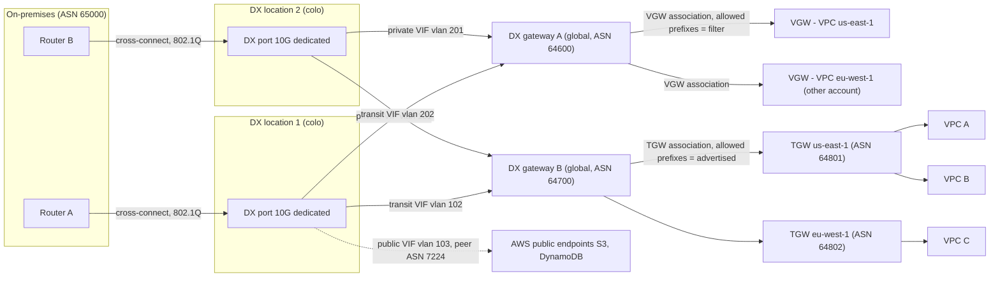
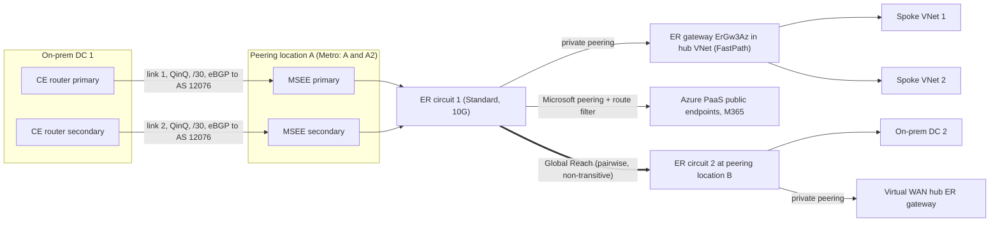
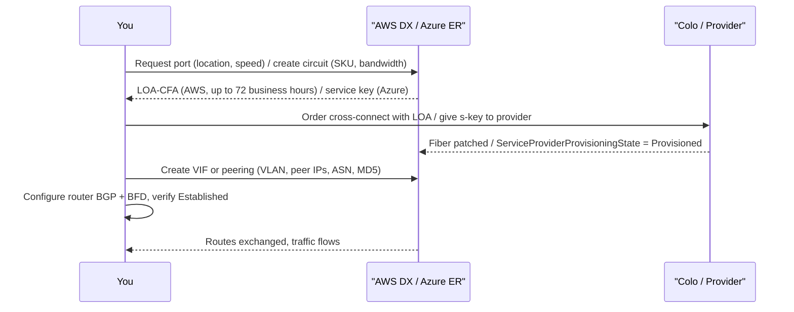
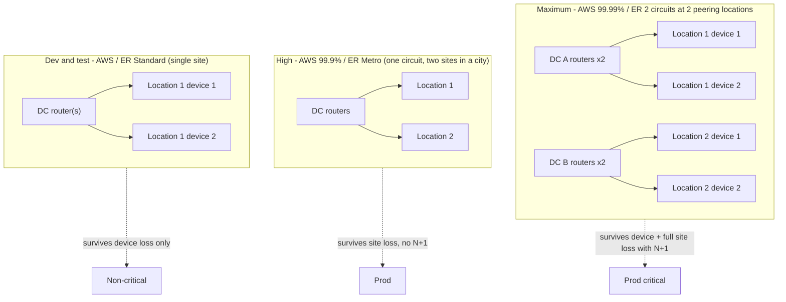
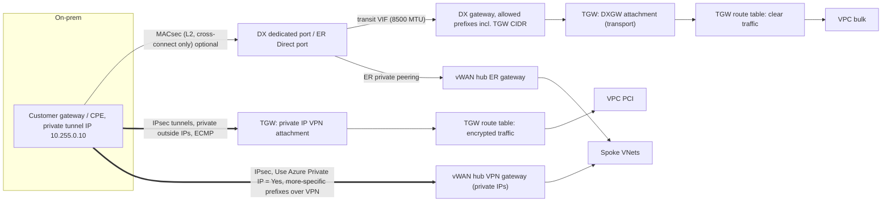
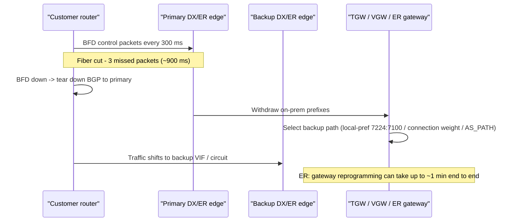

# G12 Dedicated Interconnect
> Last verified: 2026-10 · Audience: senior/staff DevOps, SRE, AI eng, NetEng, DevSecOps, architects

> Neutralized terms used in this file: **dedicated interconnect** = AWS **Direct Connect (DX)** / Azure **ExpressRoute (ER)**; **virtual interface** = DX **VIF** / ER **peering** (private or Microsoft); **interconnect gateway** = **DX gateway (DXGW)** / ER **circuit + VNet gateway**; **transit hub** = AWS **Transit Gateway (TGW)** or Cloud WAN / Azure **Virtual WAN hub** or hub-spoke VNet.

## TL;DR
- A dedicated interconnect is a **private Layer 2 handoff (802.1Q VLANs over single-mode fiber)** at a colocation facility, with **eBGP per VLAN**. You get steady latency and lower egress rates. It is **not encrypted by default**: use MACsec (L2) or IPsec over it (L3).
- **AWS DX**: you order a **port** (dedicated 1/10/100/400 Gbps, or a **hosted** 50 Mbps–25 Gbps connection through a partner), get a **LOA-CFA**, order a **cross-connect**, then create **VIFs**: **private** (VGW/DXGW), **public** (AWS public prefixes, ASN 7224) or **transit** (DXGW→TGW/Cloud WAN).
- **Azure ER**: you create a **circuit**, which always comes as **two links to a redundant MSEE pair**. Choose a **SKU**: **Local** (1–2 metro regions, egress included), **Standard** (one geopolitical area) or **Premium** (global, more routes and VNets). You hand the **service key** to a provider, or use **ER Direct** (dual 10/100/400 Gbps ports). Then configure **private peering** and/or **Microsoft peering** (ASN **12076**).
- **Scale limits interviewers probe**: DX inbound routes on private/transit VIF default to **100 per address family, configurable up to 1,000** via inbound prefix controls (since 2026; the older hard limit was 100). The public VIF limit is **1,000**. A TGW sends at most **200** prefixes to on-prem per transit VIF. ER private peering accepts **4,000** IPv4 routes (Standard) or **10,000** (Premium), and Microsoft peering **200** per session. **Going over the limit drops the BGP session** on both clouds.
- **DXGW** is a **global, out-of-path route reflector**. It connects VIFs to VGWs/TGWs in any Region, but it does **not provide VPC-to-VPC transit**. The AWS-side ASN is set on the VGW/DXGW (Amazon default **64512**). On ER the gateway SKU (ErGw1Az/2Az/3Az/ErGwScale) is the throughput bottleneck. **FastPath** bypasses the gateway on the data path.
- **Site-to-site over the cloud backbone**: AWS **SiteLink** (per-VIF toggle, private/transit VIFs on a DXGW) vs Azure **ER Global Reach** (connects pairs of circuits, not transitive).
- **Route control**: DX uses communities `7224:7100/7200/7300` (local-pref) on private/transit VIFs and `7224:9100/9200/9300` (scope) on public VIFs, and AWS tags `7224:8100/8200` and NO_EXPORT on what it sends. ER **ignores communities you send** and only tags its own routes (`12076:5xxxx` regional, `12076:50xx` service). Microsoft peering needs a **route filter** before any prefix is advertised.
- **Design default**: two locations × two devices. DX **Maximum resiliency** (4 connections, 2 locations) gives **99.99%**, and **High** (2 connections, 2 locations) gives **99.9%**. On ER, use **Metro** or two circuits at two peering locations. Add **BFD 300 ms × 3** and a **VPN backup**. One circuit is never "HA". LAGs add bandwidth, not site resilience: members must be the same speed on the same device, max 4 below 100G or 2 at 100/400G.
- **Encryption and MTU**: use **MACsec** (DX dedicated 10/100/400G, GCM-AES-XPN-256 required at 100G+; ER Direct) or IPsec. For IPsec, AWS uses **private IP VPN** (TGW + transit VIF, about 1.25 Gbps per tunnel, ECMP) or the older public-VIF VPN; Azure uses **IPsec over private peering** (vWAN "Use Azure Private IP"). MTU is **9001** on a private VIF, **8500** on a transit VIF and **1500** on a public VIF. **ER has no jumbo frames (1,400 through the gateway)**.

## G12.1 Introduction to dedicated interconnect
- **How it works:**
  - A physical port on the cloud provider's edge router (AWS DX endpoint / Microsoft Enterprise Edge, **MSEE**) in a **colocation facility** (Equinix, Digital Realty, CoreSite, …) is cross-connected to your router or to a carrier's NNI.
  - Logical separation is done with **802.1Q VLANs**. Each VLAN carries one eBGP session (one VIF or one peering).
  - Traffic stays off the public internet: **predictable latency/jitter**, **higher throughput**, **cheaper data-transfer-out** (DX DTO rates are lower than internet DTO; ER Local and "unlimited" plans include egress).
  - A DX location is associated with **one home Region**. You can still reach **all public Regions** (public VIF) and **any Region** via a DXGW (except China).
  - An ER circuit reaches the regions allowed by its SKU scope: Local, Standard (geopolitical area) or Premium (global).
- **Trade-offs / when to use:**
  - Use it for steady high throughput (>1 Gbps), latency-sensitive hybrid apps (DB replication, VDI, trading), large data migration or ingest, and compliance requirements to avoid the internet.
  - Lead time is **weeks** (port, cross-connect, carrier). It has no built-in encryption. Each link is a single physical path. Port-hours are billed even when idle.
  - VPN is minutes to provision and IPsec by default, but is limited per tunnel (≈1.25 Gbps on AWS VGW/TGW) and runs over the internet. See [G10 Site-to-site VPN](G10-site-to-site-vpn.md).
- **Interview angles:**
  - "Is DX/ER secure?" → It is *private*, not *encrypted*. Add MACsec (dedicated 10/100/400G DX, ER Direct) or IPsec (DX private IP VPN / public VIF VPN; ER: VPN over private peering). See G12.23–G12.26 later in this file.
  - "Why not just VPN?" → Throughput ceilings, internet jitter, and egress cost at scale. The reverse question is also common: use VPN as the **backup** for DX/ER.
  - Pitfall: ordering one port and calling it HA. AWS SLA tiers require multiple connections in **multiple locations**. ER's SLA requires **both** BGP sessions (primary and secondary) to be up.

## G12.2 Network requirements (physical layer up to BGP)
- **How it works (AWS DX, dedicated):**
  - **L1**: **Single-mode fiber** only. Optics: **1000BASE-LX (1310 nm)** for 1G, **10GBASE-LR (1310 nm)** for 10G, **100GBASE-LR4** for 100G, **400GBASE-LR4** for 400G.
  - Auto-negotiation may need to be on **or** off depending on the DX endpoint. A mismatch is a classic "port up, VIF down" cause.
  - **L2**: **802.1Q VLAN** encapsulation must be supported **end to end**, including carrier and intermediate switches. Frame size is **1522** or **9023 bytes** at L2 (jumbo).
  - **L3/L4**: **BGP with MD5 authentication** is mandatory on DX (enabled by default, can't be disabled). Asynchronous **BFD** is enabled on the AWS side and takes effect once you configure it on your router. IPv4/IPv6/dual-stack are supported per VIF.
  - **Peer addressing**: a /30 or /31 (RFC 3021 /31 supported on all VIF types) or AWS-assigned 169.254.0.0/16 link-local. IPv6 is always an Amazon-allocated **/125**.
  - **Location model**: you are colocated at the DX location, **or** you use an APN DX Partner, **or** an independent provider extends the circuit to you.
- **How it works (Azure ER):**
  - **Provider model**: the provider handles L1/L2. You get two logical links (**primary and secondary**) per circuit. **Dual-tagged (QinQ)**: the outer S-tag selects the circuit link and the inner C-tag selects the peering.
  - **ER Direct**: **dual 10G, 100G or 400G** ports across an MSEE pair. **Single-mode LR**: QSFP-100G-LR4 for 100G, QSFP-DD-400G-LR4 for 400G. You choose **Dot1Q or QinQ** tagging (Ethertype 0x8100).
  - ER Direct supports **no LACP or MLAG**. **IP MTU is 1,500** at the MSEE, and the effective TCP/UDP max through the ER gateway is **1,400 bytes**.
  - **BGP**: you reserve a **/29 or two /30s** per peering (IPv6 /125 or two /126s). Use the first usable IP of each /30 yourself; Microsoft takes the second. **MD5 is optional**. **BFD** is on by default for private peering.
  - Hold time is **180 s** and keepalive **60 s** on the Microsoft side (fixed). **HSRP and VRRP are not supported**; redundancy comes from the BGP pair.
- **Trade-offs / when to use:**
  - LR optics, not SR. Multimode fiber is a common ordering mistake.
  - 100G and 400G locations are a subset of all locations. Check port availability before the design review.
- **Interview angles:**
  - "Walk me through bring-up." → Light levels / Tx-Rx (L1) → port up → VLAN tag matches and ARP to the peer IP (L2) → ping peer → BGP Established with MD5 → prefixes received/advertised → app traffic.
  - "Why must every device support 802.1Q?" → A device that strips tags silently black-holes every VIF.

## G12.3 BGP Autonomous System and ASN
- **How it works:**
  - **AWS public ASN** is **7224**. It is used as the AWS side of **public VIFs**, and AWS replaces a customer's **private** ASN with 7224 when re-advertising public-VIF prefixes inside AWS.
  - **AWS side of private/transit VIFs**: the **VGW** ASN (default **64512** if you don't set one) or the **DXGW** ASN. DXGW ASN must be in **64512–65534** or **4200000000–4294967294**.
  - **TGW**: each TGW behind the same DXGW in different Regions needs a **unique ASN**. A DXGW used with Cloud WAN must not overlap the core-network ASN range.
  - **Customer ASN on DX**: public (must own it, verified) or private.
    - 16-bit private range: **64512–65534**.
    - Long ASNs are **1–4294967294** (long-ASN support). Private long range: **4200000000–4294967294**.
  - On DX the customer ASN **can't equal** the VGW/DXGW ASN on the same VIF. The same customer ASN can be reused across VIFs.
  - **Azure**: Microsoft uses **AS 12076** for private and Microsoft peering. **65515–65520 are reserved** (VNet gateways use **65515**). 16-bit and 32-bit ASNs are supported.
  - On Microsoft peering a **private ASN is allowed but needs manual validation** and is **stripped**, so your prepends don't work. Documentation ASNs **64496–64511 are rejected**.
- **Trade-offs / when to use:**
  - **Public ASN plus public prefixes** gives real AS_PATH control on public VIF / Microsoft peering, which you need for active/passive across providers.
  - **Private ASN** is fine for private VIF / private peering.
  - With a private ASN on a **public VIF**, prepending is stripped (AWS swaps in 7224) and you lose that control knob.
- **Interview angles:**
  - "Which ASN goes where?" → On-prem router = your ASN. Neighbor = 7224 (public VIF), VGW/DXGW ASN (private/transit), or 12076 (ER).
  - Pitfall: two Regions' TGWs with the **same ASN** on one DXGW cause AS_PATH loop prevention to drop routes.
  - Pitfall: using 65515 on-prem with Azure. It collides with the VNet gateway ASN.

## G12.4 Connection types: dedicated vs hosted
- **How it works (AWS):**
  - **Dedicated connection**: a physical port allocated to **your** account at **1, 10, 100 or 400 Gbps**. Requested via console/API: the **Connection wizard** (resiliency levels *Maximum*, *High*, *Development and Test*) or **Classic**.
    - Up to **50 public/private VIFs + 4 transit VIFs (max 51 total)** per dedicated connection, a hard limit.
    - Supports **LAG** (up to 4 members <100G, 2 members at 100G and above) and **MACsec** (dedicated only, on MACsec-capable ports).
  - **Hosted connection**: a partner carves capacity from **their** interconnect. Speeds are **50, 100, 200, 300, 400, 500 Mbps, 1, 2, 5, 10, 25 Gbps**.
    - Only qualified partners can sell ≥1 Gbps. **25 Gbps** is only available at locations offering 100G ports.
    - **Exactly 1 VIF per hosted connection**, a hard limit. You **accept** it in the console.
    - AWS **polices** traffic at the rate, so excess is dropped and bursty flows suffer. Jumbo frames only work if the partner's parent connection is jumbo-enabled.
    - Speed changes are made by the partner. In-place up/downgrade is supported if the partner supports it.
  - **Hosted VIF**: a different thing. A VIF on someone else's dedicated connection (partner or another account) is shared to your account, so you share the port's bandwidth.
- **How it works (Azure):**
  - **Provider circuits**: **50 Mbps–10 Gbps** (50/100/200/500 Mbps, 1/2/5/10 Gbps). Connectivity models: **Cloud Exchange co-location** (L2/L3 cross-connect at an exchange), **point-to-point Ethernet**, **any-to-any (IPVPN/MPLS)**, and **ER Direct**.
  - **ER Direct**: port pairs at **10, 100 or 400 Gbps** (400G is limited-location and enrollment-gated). You carve **multiple circuits** on the pair:
    - 10G port: 1/2/5/10 Gbps circuits.
    - 100G port: 5/10/40/100 Gbps circuits.
    - 400G port: up to 400 Gbps circuits.
  - ER Direct port billing starts at **45 days** or when a link is enabled, whichever comes first.
  - **Circuit SKUs**: **Local** (1–2 regions in or near the metro, egress **included**, no Global Reach, needs a 1G+ circuit from a supported location), **Standard** (all regions in the geopolitical area), **Premium** add-on (global reach to all regions, 10k routes, more VNet links, M365).
  - **Billing**: **Metered** vs **Unlimited** data plans.
  - **Resiliency tiers**: **standard**, **high** (= **ER Metro**, the same price as standard) and **max** (multiple circuits in different locations).
- **Trade-offs / when to use:**
  - Hosted/provider gives sub-1G sizes and quick onboarding through existing MPLS, but you have no LAG/MACsec and only one VIF.
  - Dedicated/Direct gives many VIFs, MACsec, jumbo frames, physical isolation, and multiple business-unit circuits on one port (ER Direct).
- **Interview angles:**
  - "Need 500 Mbps to 3 VPCs in 2 Regions and also S3?" → A hosted connection has **one VIF**. Use a transit VIF to a DXGW + TGW (or a private VIF to a DXGW), and reach S3 over a TGW/interface endpoint. Or order 2 hosted connections, or move to dedicated.
  - "Upgrade ER bandwidth?" → **Increase in place** if the port has capacity. You **can't decrease**: create a new circuit and migrate.

## G12.5 Steps to provision a connection
- **How it works (AWS dedicated):**
  1. Pick a DX **location** and **speed** (plus the resiliency model in the wizard). AWS reviews the request in **up to 72 business hours**. If AWS asks for more information, reply within **7 days** or the request is deleted.
  2. Download the **LOA-CFA** (Letter of Authorization – Connecting Facility Assignment). It names the cage/panel/port. LOA-CFA validity is commonly **90 days** (unverified in current docs). After that, re-download.
  3. Give the LOA to the **colo provider** (if you are in the building; you must be their customer) or to your **APN partner/carrier**, who orders the **cross-connect** in the meet-me room. A campus such as "Equinix DC1-DC6" counts as **one location**, so it is not location diversity.
  4. Port comes **up**; billing of port-hours begins (when the connection is available, or **90 days** after creation, whichever is first; unverified).
  5. Create **VIFs** (VLAN, peer IPs, ASN, MD5, MTU, gateway). Download the vendor **router config**, configure BGP and BFD, and verify (`traceroute`, ping an EC2 instance).
  6. Add **redundancy**: a second connection or location, plus a VPN backup.
- **How it works (AWS hosted):** order from a partner → partner creates the connection in your account → **accept** → create the single VIF.
- **How it works (Azure provider model):**
  1. Create the **circuit** (provider, peering location, bandwidth, SKU, billing). Azure returns a **service key (s-key)**.
  2. Give the s-key to the provider. **ServiceProviderProvisioningState** goes NotProvisioned → Provisioning → **Provisioned**. **Status** = Enabled. **Billing starts at circuit creation**.
  3. Configure **private peering** and/or **Microsoft peering** yourself, or have the provider do it if it manages L3.
  4. Create the **ER gateway** in GatewaySubnet (/27 recommended, /26 for 16 circuits), then a **connection** (link the VNet). Cross-subscription/tenant links use **authorization keys**.
  5. You **can't delete** a circuit while it is Provisioning or Provisioned. The provider must deprovision it first, and billing continues until deletion.
- **How it works (Azure ER Direct):** register the `AllowExpressRoutePorts` feature → create the ER Direct port resource → download the **LOA** → order cross-connects → enable admin state → create circuits on the port pair.
- **Interview angles:**
  - "Who owns which step?" → The cloud allocates the port and LOA. The colo runs the cross-connect. The carrier does the last mile. You own the router, BGP, and BFD.
  - Pitfall: billing surprises. DX port-hours start after 90 days even if your carrier is late (unverified). ER bills from circuit creation.

## G12.6 Virtual interfaces: public, private, transit
- **How it works:**

| Type (AWS) | Reaches | AWS-side peer | Azure equivalent |
|---|---|---|---|
| **Private VIF** | One VPC via **VGW** (same Region), or many VPCs in any Region via **DXGW** + VGWs | VGW/DXGW ASN | **Azure private peering** → ER gateway in VNet (or vWAN hub) |
| **Public VIF** | All AWS **public** endpoints, all public Regions (S3, DynamoDB, API endpoints, EIPs, CloudFront) | 7224 | **Microsoft peering** (Azure PaaS public endpoints, M365 with authorization) with a **route filter** |
| **Transit VIF** | **DXGW → TGW** (up to 6 TGWs) or **Cloud WAN** core network | DXGW ASN | Private peering into a **Virtual WAN hub** ER gateway (transit is in the hub) |

  - Old Azure **public peering** is **deprecated**. Use Microsoft peering, or better, Private Endpoints over private peering.
  - DX quotas per dedicated connection: **50 private/public + up to 4 transit (51 max)**. Hosted connection: **1**.
  - Azure: **one private and one Microsoft peering per circuit**, each with primary and secondary BGP sessions.
- **Trade-offs / when to use:**
  - A public VIF / Microsoft peering exposes **public** prefixes to and from the cloud provider. It needs public IPs and NAT, and it can create **asymmetric routing** with the internet path.
  - Prefer **private VIF/peering + PrivateLink/Private Endpoints** for PaaS where possible. See [G7 Service endpoints and Private Link](G7-service-endpoints-private-link.md).
  - Transit VIF is the scalable choice for many VPCs (TGW). Private VIF + DXGW is fine for ≤20 VGWs and has no TGW data-processing charge.
- **Interview angles:**
  - "Can a private VIF reach S3?" → Not directly (S3 is a public endpoint). Use a public VIF, or an **S3 interface endpoint** reached over the private VIF. A gateway endpoint does **not** work from on-prem.
  - "Can one DXGW mix private and transit VIFs?" → **No.** A DXGW associated with a VGW or attached to a private VIF can't be associated with a TGW.

## G12.7 Virtual interface creation parameters
- **How it works (AWS):**
  - **Connection/LAG**, **name**, **owner account** (for hosted VIFs to another account).
  - **Gateway**: VGW or DXGW (private), DXGW (transit), none (public).
  - **VLAN**: 1–4094, unique per connection, **immutable** after creation. On a hosted connection the partner sets it.
  - **Address family** IPv4/IPv6 with **one BGP session per family** per VIF.
    - IPv4 peer IPs: yours, or AWS-generated 169.254/16.
    - Public VIF needs **public /30 or /31 you own** (or an AWS-provided /31 on request). No EIPs or BYOIP from the Amazon pool.
    - IPv6 is an AWS-assigned /125.
  - **Customer ASN** and **MD5 key** (yours or generated).
  - **Public VIF**: the **prefixes you advertise**, between 1 and 1,000, /1–/32 (IPv4) or /1–/64 (IPv6). Ownership is verified via RIR or an LOA on letterhead, and approval can take **up to 72 business hours**.
  - **MTU**: **private VIF 1500 or 9001**, **transit VIF 1500 or 8500**. The **public VIF is fixed at 1500**. Changing MTU can **bounce all VIFs on the connection for up to 30 s**. Jumbo frames apply only to **propagated** routes; static routes to a VGW use 1500.
  - **SiteLink** on/off (private/transit only).
  - **Inbound prefix allocation**: default **100 per address family**, up to **1,000** per VIF. Each dedicated connection has a pool of **5,000** (1/10G), **30,000** (100G) or **50,000** (400G). A DXGW has **10,000** total.
  - **Tags**.
- **How it works (Azure peering config):**
  - **Peering type** (AzurePrivatePeering / MicrosoftPeering), **VLAN ID**, **peer ASN**.
  - **Primary/secondary /30** (and /126 for IPv6), **optional MD5**.
  - Microsoft peering also needs **advertised public prefixes** (validated against RIR/IRR, state must be *Configured*), an optional **customer ASN** and a **routing registry name**.
- **Interview angles:**
  - "VIF stuck *down* but connection *up*?" → VLAN mismatch, wrong peer IP or mask, auto-negotiation, MD5 mismatch, or prefix allocation exceeded (BGP idle).
  - "Mixed MTU?" → If two private VIFs (or a VIF plus a VPN) advertise the same route with different MTUs, **1500 is used**. MTU is covered fully in G12.27 later in this file and in [G4 Network performance](G4-network-performance-and-optimization.md).

## G12.8 Provider-published IP ranges
- **How it works:**
  - **AWS** publishes `https://ip-ranges.amazonaws.com/ip-ranges.json`.
    - Fields: `syncToken`, `createDate`, then `prefixes[]` / `ipv6_prefixes[]` with `ip_prefix`, `region`, `service` (AMAZON, EC2, S3, CLOUDFRONT, ROUTE53, …) and `network_border_group`.
    - The **SNS topic `AmazonIpSpaceChanged`** (us-east-1) notifies you of changes. There is also an RFC 8805 `geo-ip-feed.csv` and **AWS-managed prefix lists** (e.g. CloudFront origin-facing).
    - BYOIP ranges are **not** in the file but **are** advertised over a public VIF. The BGP-advertised set may be aggregated or de-aggregated compared with the JSON.
  - **Azure** has **Service Tags**: a weekly downloadable JSON per cloud (track it via `changeNumber`, both top-level and per tag) and the **Service Tag Discovery API** (`az network list-service-tags`, which can lag up to 4 weeks behind the JSON).
    - New IPs aren't used for **≥1 week** after publication.
    - Over **Microsoft peering**, the routes you receive are chosen by **route filter** (service **BGP communities**, e.g. `12076:5010` Exchange, `12076:5070` ARM) plus regional communities `12076:51xxx`. `Get-AzBgpServiceCommunity` lists them.
- **Trade-offs / when to use:**
  - Use the published lists for **egress firewall allow-lists** and for **filtering what you accept** on a public VIF.
  - EC2 ranges include other customers' instances. Allowing "AMAZON" is not tenant isolation.
- **Interview angles:**
  - "How do you only send S3 traffic over the public VIF?" → On your router, filter received prefixes by **community `7224:8100`** (same Region), or by matching `service=S3` prefixes from ip-ranges.json. Everything else goes via the internet.
  - Pitfall: hard-coding ranges. Automate updates from SNS or `changeNumber`.

## G12.9 Public virtual interface
- **How it works:**
  - eBGP to **7224**. AWS advertises **all AWS public prefixes** (local and remote Regions, plus CloudFront/Route 53 PoP prefixes). The prefixes carry **NO_EXPORT** and a **minimum AS_PATH length of 3**, and are tagged **7224:8100** (same Region as the DX location's home Region), **7224:8200** (same continent) or untagged (other continents).
  - You advertise **public prefixes you own** (RIR-registered). AWS performs **inbound source filtering**: packets must come from your advertised prefixes. **No transit** between customers.
  - Your prefixes are **not** re-advertised to the internet, other DX customers or AWS's peers. They **are visible inside AWS to all customers**, so firewall accordingly.
  - Scope communities you attach: **7224:9100** (local Region), **9200** (continent), **9300** (global, the default if untagged).
  - **Inbound route limit is 1,000** prefixes from you (hard). Prefix controls don't apply to public VIFs.
  - Billing: DTO to your advertised public prefixes owned by the same payer is metered at the **DX rate**, not internet DTO.
  - **Azure Microsoft peering equivalent**: you need public /30s and NAT for your traffic. Since Aug 2017 **no prefixes are advertised until a route filter is attached**. M365 needs Microsoft authorization (and **Premium** for M365). The limit is **200 prefixes from you per session**, and default routes and RFC 1918 are filtered.
- **Trade-offs / when to use:**
  - Use it for high-volume access to S3/DynamoDB/public APIs or to terminate **public IP VPN over DX** (an encryption pattern, covered in G12.24 later in this file).
  - Risk: once you learn all AWS public prefixes, your router may prefer DX for *all* AWS/Amazon.com traffic, including for users who should go through the internet. Apply **inbound filters and local-pref** deliberately.
- **Interview angles:**
  - "Same prefix advertised to the internet and the public VIF?" → AWS prefers the **longest prefix** first, then AS_PATH. Advertise **more specifics on DX** or prepend on the internet. With a **private ASN your prepends are stripped**.
  - "Is the public VIF private?" → No. It's a private *path* to public IPs, and your prefixes are reachable by any AWS customer.

## G12.10 Private virtual interface
- **How it works:**
  - **Attach to a VGW** (one VPC, same Region as the DX location's home Region), **or to a DXGW** (up to **20 VGWs** in any Region and account, except China).
  - The AWS side advertises the VPC CIDRs (via a DXGW: the VPC CIDR, *filtered* by allowed prefixes). On-prem routes **propagate** into VPC route tables if **route propagation** is enabled on the VGW.
  - The **VPC route-table quota** (default 50 propagated + static, adjustable) can be lower than the VIF allocation, and routes beyond it aren't installed.
  - MTU **1500 or 9001**. BFD and MD5. Use **ECMP** across VIFs with equal attributes. **No VIF-per-VGW limit**.
  - **Azure equivalent**: **private peering** → an **ER virtual network gateway** in GatewaySubnet → VNet and peered spokes (gateway transit).
    - Each circuit links to **10 VNets** (Standard) or **20–100** (Premium, scales with bandwidth).
    - Up to **4 circuits from the same peering location** and **16 from different locations** per VNet (16 needs ErGw3Az or ErGwScale with ≥10 units).
    - Azure advertises **≤1,000 IPv4 VNet routes** to on-prem. Use `summarizedGatewayPrefixes` to aggregate them.
- **Trade-offs / when to use:**
  - Private VIF straight to a VGW is the simplest, but it is **one VIF per VPC**, so it scales poorly (the 50-VIF cap).
  - Private VIF + DXGW gives multi-Region, multi-account reach with no TGW cost, but **no VPC↔VPC transit** and a max of 20 VGWs.
  - Transit VIF + TGW gives scale and inter-VPC routing, but adds the TGW per-GB processing cost.
- **Interview angles:**
  - "Migrate a VIF from a VGW to a DXGW?" → You can't re-point a VIF. Create a new VIF to the DXGW, shift traffic via BGP preference, then delete the old VIF.
  - Pitfall: overlapping VPC CIDRs behind one DXGW. Associations with overlapping CIDRs are rejected.

## G12.11 Transit virtual interface
- **How it works:**
  - A transit VIF attaches to a **DXGW** that is associated with **TGWs** (≤**6 per DXGW**, hard) or a **Cloud WAN core network** (≤**5,000** prefixes to on-prem).
  - Quota: **up to 4 transit VIFs per dedicated connection** (counted within 51). Transit VIFs are supported on **any speed, including hosted**.
  - **AWS→on-prem**: only the **allowed prefixes** configured on the DXGW–TGW association are advertised, originated with the DXGW ASN. VPC CIDRs are **not** auto-advertised. Max **200 prefixes per TGW** advertised on a transit VIF (IPv4 + IPv6 combined). Summarize.
  - **On-prem→AWS**: routes propagate into **TGW route tables** (the DXGW attachment). The default limit is **100 per address family per BGP session**, configurable up to **1,000** (prefix controls). Exceeding the limit puts the session **idle (DOWN)**.
  - MTU **1500 or 8500** (TGW jumbo frames max out at 8500). The /30 or /31 peer link range does **not** propagate into the TGW.
  - A TGW can associate with **≤20 DXGWs**.
  - **Azure equivalent**: ER private peering into a **Virtual WAN hub**'s ER gateway, where the hub provides any-to-any VNet, VPN and ER transit. Alternatively a hub VNet with an NVA and Azure Route Server. See [G13 Managed global WAN](G13-managed-global-wan.md).
- **Trade-offs / when to use:**
  - Use it for many VPCs per Region, inter-VPC routing, segmentation via TGW route tables, or to combine with VPN attachments.
  - Cost: TGW data processing per GB plus the attachment-hours.
- **Interview angles:**
  - "Your 300 VPC CIDRs don't fit in 200 prefixes." → Allocate VPC CIDRs from **summarizable supernets per Region** and advertise the supernet as the allowed prefix.
  - "Can allowed prefixes overlap across TGWs on one DXGW?" → **No.** 0.0.0.0/0 is impossible with more than one TGW.

## G12.12 Interconnect gateway with private interfaces
- **How it works:**
  - The **DXGW** is a **global** resource that acts as a **distributed set of BGP route reflectors**. It is **outside the data path**, so it is not a SPOF and you don't need two.
  - Limits: **20 VGWs per DXGW**, **30 private/transit VIFs per DXGW**, **200 DXGWs per account**, **10,000 total prefix allocations** per DXGW.
  - **Cross-account**: the VGW or TGW owner sends an **association proposal**. The DXGW owner accepts it and may **override the allowed prefixes**.
  - **Allowed prefixes on a VGW association = filter**. It must be the **same as or wider than** the VPC CIDR. Only the actual VPC CIDR is advertised.
    - Example: VPC 10.0.0.0/16 with allowed 10.0.0.0/15 → you get 10.0.0.0/16.
    - Allowed 10.0.0.0/24 → nothing is advertised.
  - **No transit between associations** (VGW↔VGW).
    - **Exception (Nov 2021)**: if on-prem advertises a **supernet** covering the VPCs on the **same VIF**, VPC-to-VPC traffic hairpins via the DX endpoint.
    - To block it: use security groups, advertise more specifics, or use separate DXGWs per environment.
  - Local Zones can also be reached via VGW + DXGW.
  - **Azure equivalent**: there is no separate global object. The **ER circuit itself** is the shared thing.
    - Link VNets in other regions within the SKU scope (Premium for cross-geo), across subscriptions and tenants via **authorization keys**.
    - VNet↔VNet over ER is **disabled by default** and **not recommended**. Use VNet peering instead.
- **Interview angles:**
  - "Design: DX in us-east-1 location, VPCs in us-east-1 and eu-west-1, 3 accounts." → One DXGW. Each account's VGW proposes an association. One private VIF per connection to the DXGW. Allowed prefixes per VPC.
  - "Why does dev reach prod through on-prem?" → The supernet hairpin. Fix it with specifics or separate DXGWs.

## G12.13 Interconnect with transit hub
- **How it works:**
  - **DX + TGW**: transit VIF → DXGW → TGW association (allowed prefixes) → TGW route tables → VPC attachments.
  - Multi-Region options:
    - Associate each Region's TGW with the same DXGW (≤6, unique ASNs).
    - Associate one TGW and use **TGW peering** (static routes) to the others.
    - Use **Cloud WAN** (DXGW attachment, policy-based segments).
  - **DX + VPN**: run a **TGW Connect / private IP VPN** over DX for encryption. Or use VPN attachments on the same TGW as **backup** (BGP prefers DX: TGW prefers **DX over VPN** for the same prefix, (unverified) exact path-selection order: static > prefix-list > propagated DX > VPN).
  - **Azure**: an ER gateway in the **Virtual WAN hub** (scale units; FastPath auto-enabled for ER Direct with ≥5 units) or a **hub VNet** ER gateway + Azure Firewall/NVA + spokes using `useRemoteGateways`.
    - **ER + S2S VPN coexistence** needs both gateways in GatewaySubnet (/27+). To route **between** VPN-connected and ER-connected branches you need **Azure Route Server** (branch-to-branch) or vWAN.
- **Trade-offs / when to use:**
  - The hub centralizes inspection and segmentation, but costs per-GB processing and adds a hop.
  - The **Azure gateway SKU caps throughput**:

| ER gateway SKU | Throughput | PPS | Max circuits | FastPath |
|---|---|---|---|---|
| Standard / **ErGw1Az** | 1 Gbps | 100k | 4 | No |
| HighPerformance / **ErGw2Az** | 2 Gbps | 200k | 8 | No |
| UltraPerformance / **ErGw3Az** | 10 Gbps | 1M | 16 | Yes |
| **ErGwScale** (1–40 units) | 1 Gbps per unit | 100k–200k per unit | 4 / 8 / 16 (≥10 units) | Yes (≥10 units) |

  - **FastPath** bypasses the gateway on the data path. The gateway still exchanges routes.
    - Requires UltraPerformance/ErGw3Az or ErGwScale ≥10 units.
    - IP limits: **25k** (provider), **100k** (Direct 10G), **200k** (Direct 100/400G).
    - VNet peering, UDR, IPv6 and Private Link (limited GA) over FastPath work **only on ER Direct**.
    - Spoke ILBs, PaaS, and Azure Firewall in spokes still go through the gateway.
  - Non-AZ ER gateway SKUs migrate to AZ SKUs via the **gateway migration experience**. ER gateways now use **auto-assigned (Microsoft-managed) public IP** and are always zone-redundant.
- **Interview angles:**
  - "10 Gbps ER circuit, apps see 2 Gbps." → The **gateway SKU** is the bottleneck (ErGw2Az). Upgrade to ErGw3Az/ErGwScale or enable FastPath.
  - "Packets over 1,400 bytes are dropped through the ER gateway." → The gateway doesn't fragment. Clamp MSS or enable FastPath.
  - Cross-ref: [G8 Transit hub](G8-transit-hub.md).

## G12.14 Site-to-site routing over the provider backbone
- **How it works:**
  - **AWS SiteLink**: a per-VIF toggle on **private VIFs attached to a DXGW** or **transit VIFs**. Not supported on a VIF to a VGW, public VIFs, GovCloud or China.
    - With it, on-prem sites connected at **different DX locations** exchange routes via the DXGW and send traffic over the **shortest AWS backbone path**, without traversing a Region.
    - It is billed per SiteLink-enabled VIF-hour plus per-GB.
    - Enabling it changes AWS's path preference: AWS-to-on-prem traffic prefers the **shortest AS_PATH from any location**, not the home-Region location.
    - SiteLink breaks if the same prefix is advertised on multiple VIFs. SiteLink prefix limit is ≤1,000 per family via prefix controls.
    - A DXGW with **no** VGW/TGW association can be used purely for SiteLink.
  - **Azure ExpressRoute Global Reach**: links **two circuits** at **different peering locations**, so on-prem↔on-prem traffic crosses Microsoft's backbone.
    - It is **not transitive**: A↔B plus B↔C does **not** give A↔C, so a full mesh needs every pair configured.
    - Same geopolitical region needs no Premium. Cross-geo needs **Premium on both** circuits.
    - **Not available on Local SKU**, and only in supported countries. It needs a **/29** for the connection.
    - Throughput is capped by the smaller circuit. Global Reach links count against the circuit's VNet-link limit.
    - Route limits: you can still only *advertise* 4k/10k, but you *receive* the other sites' routes too.
- **Trade-offs / when to use:**
  - Use it to replace or augment an MPLS WAN between data centers that already have cloud interconnects.
  - Compare it with carrier MPLS SLAs and with SD-WAN over the cloud (Cloud WAN, Virtual WAN). See [G13 Managed global WAN](G13-managed-global-wan.md).
- **Interview angles:**
  - "Two DCs, each with DX at a different location; make them talk over AWS." → Enable SiteLink on both VIFs (same DXGW). Watch for overlapping or duplicate prefixes.
  - "Three ER circuits, want any-to-any." → Configure 3 Global Reach pairs (it's non-transitive). Check Premium if the circuits are cross-geo.

## G12.15 Routing policies and BGP communities
- **How it works (AWS, summary; the deep dive is in G12.16–G12.19 later in this file):**
  - **Private/transit VIF**: AWS→on-prem path selection is **longest prefix** → **local-pref communities** `7224:7100` low / `7224:7200` medium / `7224:7300` high (mutually exclusive, evaluated **before AS_PATH**) → **AS_PATH** → **MED** (not recommended) → **ECMP** (flow-based, same attributes, ASNs need not match).
    - Without tags, AWS prefers DX locations whose **associated Region** equals the source Region (implicit medium local-pref for the home Region).
  - **Public VIF inbound**: you tag scope (`7224:9100/9200/9300`). Equal communities plus equal AS_PATH make prefixes multipath candidates.
  - **Public VIF outbound**: AWS tags `7224:8100/8200` and NO_EXPORT. The `7224:1–7224:65535` range is reserved, and unsupported communities are stripped.
  - **On-prem→AWS** is entirely **your** policy: local-pref on your routers decides which VIF you send on.
  - Default dual-connection behavior is **active/active** (BGP multipath). For active/passive use local-pref communities (private/transit) or AS_PATH prepend/more specifics (public).
- **How it works (Azure):**
  - Microsoft **does not honor communities you send**. To steer Azure→on-prem you use **AS_PATH prepend** or **more specific prefixes**. To steer on-prem→Azure you use **local-pref** on your side.
  - Within the VNet, **connection weight** prefers one circuit over another. ECMP spans up to **4 circuits**, per-flow on the 5-tuple.
  - Microsoft tags routes with **regional communities**: private peering `12076:50xxx` (requires a custom VNet community to be set first), Microsoft peering `12076:51xxx`, plus service-specific `12076:52xxx–55xxx` (Storage/SQL/Cosmos/Backup) and **service communities** `12076:5010` (Exchange) … `12076:5250` (PSTN).
  - **Default route** is accepted on **private peering only**. It forces Azure internet egress on-prem and breaks KMS activation unless you add UDRs.
- **Interview angles:**
  - "Active/passive across 2 DX locations for return traffic?" → Tag the primary VIF's prefixes `7224:7300` and the backup's `7224:7100`. Local-pref beats AS_PATH, so prepending alone fails when the backup is in the home Region.
  - "Asymmetric routing with Microsoft peering + internet." → Advertise NAT pools only over ER (or more specifics). Use local-pref on-prem. Don't advertise the same /24 to both.
  - Overlap: routing fundamentals are in [F7 Network routing](../F-network-engineering/F7-network-routing.md).

## G12.16 Public interface routing policies
- **How it works (AWS public VIF):**
  - **Inbound policy** (your routes into AWS):
    - You must own the public prefixes, and they must be registered with an RIR.
    - Traffic must be **destined to Amazon public prefixes**. There is **no transit** between DX customers.
    - AWS runs **inbound packet filtering**: a source address outside your advertised prefixes is dropped (anti-spoofing).
    - Max **1,000 prefixes** from you, a hard limit. Going over it sends the session to idle.
  - **Outbound policy** (AWS routes to you):
    - AWS advertises **all local and remote Region public prefixes**, plus on-net non-Region PoPs (CloudFront, Route 53).
    - China-Region prefixes are advertised only in China, and commercial-Region prefixes only in commercial Regions.
    - Prefixes carry a **minimum AS_PATH length of 3** and the **NO_EXPORT** community.
    - You must not re-advertise them to the internet.
  - **AWS's path choice toward your prefixes** is **longest prefix match first, then AS_PATH**.
    - If the same prefix is advertised from two Regions over two public VIFs with identical attributes, AWS prefers the **home Region**.
    - Identical attributes on several connections let AWS **load-share** across them.
  - **Customer prefixes stay inside Amazon**. They are not sent to other DX customers, to AWS's peers or to AWS's transit providers. They are **reachable from all AWS public IPs**, which includes other tenants.
  - **ASN rules**:
    - With a **public ASN**, your prepends are visible and work.
    - With a **private ASN** (64512–65534 or 4200000000–4294967294), AWS **replaces it with 7224**, so prepends are stripped and useless.
- **How it works (Azure Microsoft peering):**
  - Microsoft does **not** act on communities you send. You steer Azure→on-prem with **more specific prefixes** or **AS_PATH prepend**. Prepend only works with a public ASN, because a private ASN is stripped.
  - Inbound to you is controlled by the **route filter**: you choose service communities (and regional communities `12076:51xxx`).
  - Max **200 prefixes per session** from you. Default route and RFC 1918 prefixes are rejected.
  - **NAT is mandatory**: Microsoft peering accepts only public source addresses you've registered.
- **Trade-offs / when to use:**
  - A public VIF / Microsoft peering returns traffic to your **NAT pool**. If you advertise the same NAT /24 to the internet as well, return traffic may come back over either path, giving **asymmetry**, and stateful firewalls drop it.
  - Prefer **private connectivity (PrivateLink / Private Endpoint over private VIF/peering)**. Use the public path only for bulk S3/Blob traffic or VPN termination.
- **Interview angles:**
  - "AWS sends return traffic over the internet, not DX." → You advertised a **shorter prefix on DX** than the internet, or the same prefix with a longer AS_PATH. Advertise **more specifics over DX**, or prepend on the internet side, which needs a public ASN.
  - "Can another AWS customer reach my public-VIF prefixes?" → **Yes**, from AWS public IP space (EC2 with public IPs). Firewall them as you would internet-facing prefixes.

## G12.17 Public interface routing scenarios (active/active, active/passive, ECMP)
- **How it works:**

| Goal | AWS → on-prem (you influence) | On-prem → AWS (you control) | Azure Microsoft peering equivalent |
|---|---|---|---|
| **Active/active** (2 VIFs, 2 connections) | Same prefixes, same length, same AS_PATH, **same scope community** on both. AWS uses multipath | Equal local-pref, `maximum-paths 2` (ECMP) on your routers | Same prefixes on primary and secondary sessions. Microsoft load-balances per flow |
| **Active/passive** | **Prepend** your public ASN on the backup VIF (private ASN prepends are stripped), **or** advertise **more specifics** on the primary and the aggregate on both | **Higher local-pref** on the primary VIF's learned routes | **Prepend** or more specifics on the passive circuit, local-pref on your side. Microsoft ignores your communities |
| **Regional split** | Tag `7224:9100` (local Region only) on a DX in Region A and `7224:9300` on the other | Filter received routes by `7224:8100/8200` and set local-pref | Route filter per circuit (regional communities) |

  - **ECMP**: AWS treats prefixes with **identical communities and AS_PATH** as multipath candidates. Hashing is **per flow**, so one elephant flow can't exceed one link.
  - **Inbound hairpin pitfall**: your router learns *all* AWS public prefixes. Without a filter, traffic to other Regions' public endpoints (and Amazon retail IPs) moves onto DX. Usually that's fine. It breaks if you send traffic from addresses that aren't advertised: AWS's **source filtering drops it**.
- **Trade-offs / when to use:**
  - **Longest prefix** is the strongest knob: it is deterministic and beats everything. Its cost is more routes and the risk of hitting the 1,000-prefix limit.
  - **AS_PATH prepend** works only with a public ASN, and it is weaker than a more specific prefix advertised elsewhere.
  - ECMP doubles throughput only for many flows. Per-flow hashing doesn't help a single TCP stream.
- **Interview angles:**
  - "Active/passive on public VIF with a private ASN?" → Prepending is stripped (7224 replaces it). Use **more specific prefixes on the primary**, or get a public ASN.
  - "Two public VIFs in different home Regions, all else equal?" → AWS prefers the **home-Region** VIF for that Region's traffic.

## G12.18 Public interface BGP communities
- **How it works:**

| Direction | Community | Meaning |
|---|---|---|
| You → AWS (scope) | `7224:9100` | Propagate your prefix to the **local Region** only (the DX location's associated Region) |
| | `7224:9200` | All Regions on the **continent** (North America / APAC / EMEA) |
| | `7224:9300` | **Global**, all public Regions. This is also the **default when untagged** |
| AWS → you (origin) | `7224:8100` | Routes from the **same Region** as the DX location |
| | `7224:8200` | Routes from the **same continent** |
| | *(no tag)* | Routes from other continents |
| AWS → you | **NO_EXPORT** | Set on **all** routes AWS sends. Don't leak them |
| Received by AWS | treated as **NO_EXPORT** | AWS treats your routes as if tagged NO_EXPORT and keeps them inside the AWS network |

  - `7224:1`–`7224:65535` are **reserved**. Unsupported communities are **stripped**.
  - With the same communities and the same AS_PATH, prefixes become **multipath candidates**.
  - **Azure Microsoft peering**: communities run **from Microsoft to you only**.
    - **Regional** communities: `12076:51004` (US West) style, `12076:51xxx`.
    - **Service** communities, e.g. `12076:5010` Exchange, `12076:5040` (SharePoint, unverified mapping) … `12076:5250`.
    - You select what to receive with a **route filter**. Communities you attach are ignored.
- **Trade-offs / when to use:**
  - `9100` keeps a Region-local DX from attracting traffic from other continents' Regions, which avoids long backhaul across the AWS backbone and then over your DX.
  - Filtering on `8100` cuts the received table from thousands of prefixes to the local Region's, which protects small edge routers' FIBs.
- **Interview angles:**
  - "Use S3 in us-east-1 over DX, and everything else over the internet?" → Accept only `7224:8100`-tagged prefixes (optionally intersected with `service=S3` from ip-ranges.json). Tag your prefixes `7224:9100`.
  - "Does Azure honor 7224-style scope tags?" → No. Azure uses **route filters** inbound to you, and **prefix length / prepend** outbound.

## G12.19 Private interface routing policies and BGP communities
- **How it works (AWS private and transit VIF, AWS → on-prem order):**
  1. **Longest prefix match**. This is AWS's recommended active/passive method when prefixes can differ.
  2. **Local-pref communities**: `7224:7100` low, `7224:7200` **medium**, `7224:7300` high.
     - They are **mutually exclusive** and evaluated **before AS_PATH**.
     - Untagged prefixes get **medium** if the DX location's **associated Region** equals the sending Region, and **lower** otherwise.
  3. **AS_PATH length** (prepend works here).
  4. **MED**, which AWS doesn't recommend.
  5. **ECMP** across private/transit VIFs with the same AS_PATH length and attributes. The ASNs in the paths **need not match**.
  - Untagged ECMP happens when the Region has ≥2 VIF paths from locations **in the same associated Region**, or ≥2 from locations **not** in that Region. Otherwise the home-Region path wins.
  - Tagged: the **same** local-pref community on all VIFs gives **active/active across Regions**. If one fails, ECMP continues over the remaining VIFs whatever their home Region.
  - **On-prem → AWS** is your router policy (local-pref/weight). AWS doesn't influence it. A TGW or VGW receives your routes, and your preference decides which VIF you use.
  - **Same prefix from DX and VPN**: VGW/TGW prefer **DX over VPN** (BGP-propagated). Longest prefix still wins first.
- **How it works (Azure private peering):**
  - Azure → on-prem: **longest prefix**, then **connection weight** (on the VNet gateway connection, higher wins; it sits **before AS_PATH**), then **AS_PATH** (prepend on the less-preferred circuit). Equal paths give **ECMP across up to 4 circuits**.
  - On-prem → Azure: your local-pref. Microsoft tags its routes with the VNet's **custom BGP community** plus a regional community (`12076:50xxx`) so you can match on them.
  - Primary and secondary links of **one circuit** should run **active/active**. Microsoft load-balances per flow. During maintenance Microsoft **prepends** on the link being serviced.
- **Trade-offs / when to use:**
  - Local-pref communities give **deterministic** active/passive even when the backup is in the home Region (where an untagged route would get medium local-pref and beat AS_PATH-prepended routes from elsewhere).
  - Active/active across Regions with `7224:7200` everywhere gives full use of bandwidth. **Check that capacity survives N-1**: each link must carry the full load alone.
- **Interview angles:**
  - "Primary DX in Virginia, backup DX in Ohio. us-east-1 return traffic uses Ohio intermittently." → Tag Virginia `7224:7300` and Ohio `7224:7100`. Don't rely on prepend.
  - "Azure keeps using circuit B even though I prepend on it." → Check **connection weight** on the gateway connection. It is evaluated before AS_PATH.

## G12.20 Link aggregation groups (LAGs)
- **How it works (AWS):**
  - LACP (802.3ad) bundles **dedicated** connections into one logical connection. **Hosted connections can't join a LAG**.
  - All members must be **the same speed** (1/10/100/400G) and terminate on the **same AWS device** (same endpoint) at the same location. **MLAG is not supported**.
  - Max members: **4 if <100G**, **2 at 100G/400G**. Each member counts toward the Region connection quota.
  - All members run **active/active** (per-flow hashing). VIFs are created on the LAG. All VIF types are supported.
  - **`minimumLinks`** (default **0**): if operational members fall below it, the **whole LAG goes down**. That forces BGP failover to another location instead of squeezing traffic onto the survivors.
  - **MACsec on a LAG**: the members must be MACsec-capable. **One CKN/CAK** applies to all members; extra keys exist only for rotation.
  - The Resiliency Toolkit auto-creates LAGs when you order a non-standard aggregate speed (e.g. 40G = 4×10G).
- **How it works (Azure):**
  - There is **no LAG/LACP on ER Direct**. Capacity comes from port size (10/100/400G) and multiple circuits. A provider circuit's bandwidth is set by the provider.
- **Trade-offs / when to use:**
  - A LAG adds **bandwidth**, not **location resilience**: one device, one site.
  - Pair LAGs **across two locations** for HA.
  - Use `minimumLinks` to avoid a "brownout" where 1 of 4 links survives and congests.
- **Interview angles:**
  - "Need 40 Gbps with HA." → 2 LAGs of 4×10G at **two locations**, each with `minimumLinks=3` or 4, active/active via BGP. Or 2×100G at two locations.
  - "Can I LAG a 10G and a 100G?" → **No**, all members must be the same speed.

## G12.21 Connection resiliency
- **How it works (AWS Resiliency Toolkit / SLA):**

| Model | Topology | SLA | Protects against |
|---|---|---|---|
| **Maximum resiliency** | **≥4 connections across ≥2 locations**, 2 per location, each on a **separate AWS device** | **99.99%** | Device, link, **full location** loss, with N+1 at each site |
| **High resiliency** | **≥2 connections at 2 locations** (1 each) | **99.9%** | Fiber cut, device failure, location loss (no redundancy left after a failure) |
| **Development and test** | 2 connections, **one location**, separate devices | Single-connection tier only | Device failure only |
| Single / Classic | 1 connection | Credit only below **95%** | Nothing (AWS says not for production) |

  - The current SLA terms also require an **Enterprise Support** plan, a **Well-Architected Review** for 99.99%, and private endpoints in **≥2 AZs** (verify the SLA page before quoting this in a contract).
  - The Toolkit enforces the same speed and different devices, and shows the achievable SLA and port-hour cost.
  - **Failover Test**: AWS brings down the BGP sessions of selected VIFs for a set time, max **180 minutes** (unverified), to prove that traffic moves.
  - **Backup tiers**: a **Site-to-Site VPN** (VGW or TGW) as the last resort. DX is preferred automatically. Its ~1.25 Gbps per tunnel ceiling means it is only a degraded-mode path.
- **How it works (Azure ER):**
  - **Standard resiliency**: 1 circuit with 2 links at **one** peering location (single-homed). Not recommended.
  - **High resiliency = ER Metro**: 1 circuit split across **two peering locations in a metro** (e.g. Amsterdam + Amsterdam2), at the **same price** as standard. In some locations Microsoft now **blocks new standard-resiliency circuits** where Metro is available.
  - **Maximum resiliency**: **2 circuits at 2 distinct peering locations** (each circuit dual-linked). There is a guided portal experience. Add **zone-redundant gateways**.
  - **SLA**: 99.95% per dedicated circuit (unverified current figure). It applies only if **both** primary and secondary BGP sessions are configured. ER Direct and Global Reach carry the same SLA.
  - **Resiliency Insights** gives a percentage index (route resilience, zone-redundant gateway, tests). **Resiliency Validation** tests gateway failover between sites.
  - Microsoft states that VPN backup is **not recommended** for latency-sensitive or bandwidth-heavy workloads. Use multi-site ER instead.
- **Trade-offs / when to use:**
  - Each step up roughly doubles port and cross-connect cost. Match it to the workload's SLO and the cost of downtime. Composite SLA = DX/ER × gateway × app.
  - Diversity must be **end to end**: different carriers, conduits, building entries and on-prem routers. Two circuits from one carrier in one conduit share fate.
- **Interview angles:**
  - "Design for 99.99%." → AWS: 4 dedicated connections, 2 DX locations, 2 devices per location, BFD, local-pref communities, tested with Failover Test. Azure: 2 ER circuits (or 2 Metro circuits) at different peering locations, zone-redundant ErGw, BFD, active/active, different providers.
  - "Is one ER circuit HA?" → It survives a **link or device** failure, but **not a site** failure. Use Metro or a second circuit.

## G12.22 Failure detection with BFD
- **How it works:**
  - **BGP alone is slow**. DX defaults rely on the BGP hold time (90 s typical, unverified for DX). ER MSEEs use **keepalive 60 s and hold 180 s**, so up to **3 minutes** to detect a failure. Lowering timers costs CPU (ER minimum 3/10 s).
  - **AWS DX**: **asynchronous BFD** is **enabled automatically** on every VIF on the AWS side. It becomes active when you configure it on your router. AWS defaults are a **300 ms min interval × multiplier 3**, about **900 ms** detection.
  - **Azure ER**: BFD is **enabled by default on the MSEE** for new private and Microsoft peerings. MSEE Tx/Rx is **300 ms** (sometimes **750 ms**). The **slower peer wins**, so you can lengthen it but not shorten it.
    - Peerings created before Aug 2018 (private), Jan 2020 (Microsoft) or Nov 2025 (IPv6) need a **peering reset** to get BFD.
    - Microsoft recommends **disabling BFD echo mode**.
    - Even with BFD, **end-to-end convergence via the ER gateway can take up to ~1 minute**.
  - Typical config: `bfd interval 300 min_rx 300 multiplier 3` plus `neighbor x fall-over bfd`.
- **Trade-offs / when to use:**
  - Always enable BFD when there's an alternative path (second DX/ER, VPN backup). Without an alternative it adds nothing.
  - BFD that is too aggressive (e.g. 50 ms) can **flap** on microbursts or a busy control plane. Pair it with BGP dampening and graceful-restart decisions.
  - BFD detects the failure, but convergence also depends on route withdrawal propagation (DXGW/TGW, VNet gateway programming).
- **Interview angles:**
  - "Failover takes 90 seconds on DX." → BFD isn't configured on the customer router. AWS has it on but it is passive until you enable it.
  - "Why does Azure still take ~40 s after BFD?" → BFD speeds up **detection** at the MSEE. **Gateway and VNet route reprogramming** still takes time.

## G12.23 Encrypting interconnect traffic
- **How it works:** DX and ER are **private but not encrypted**. The options by layer:

| Option | Layer | AWS | Azure | Throughput ceiling | Notes |
|---|---|---|---|---|---|
| **MACsec** | L2, hop-by-hop on the cross-connect | Dedicated **10/100/400G** at MACsec-capable locations, and LAGs | **ER Direct** ports (10/100/400G) | Line rate | Covers only **your router ↔ provider edge** |
| **Public IP VPN** | L3 IPsec | VPN to VGW/TGW **public endpoints over a public VIF** | S2S VPN over **Microsoft peering** | ~1.25 Gbps per tunnel (AWS), ECMP across tunnels on TGW | Needs public IPs. A public VIF also exposes all AWS public prefixes |
| **Private IP VPN** | L3 IPsec | **TGW private IP VPN over a transit VIF** | **IPsec over private peering** (vWAN hub VPN with "Use Azure Private IP", or VPN Gateway private IP) | ~1.25 Gbps per tunnel (AWS). Azure depends on the gateway SKU | No public IPs and no internet exposure |
| **App-layer TLS / mTLS** | L7 | Any | Any | App-bound | Often enough for compliance (end to end, which neither MACsec nor IPsec is) |

  - AWS also states that it **encrypts at the physical layer between DX locations and Regions** on its backbone. Your exposure is the **last mile and cross-connect**.
- **Trade-offs / when to use:**
  - **MACsec** gives line rate with no MTU penalty to speak of (~32 bytes of overhead), but it is **point to point only**. It isn't available on hosted connections or ER provider circuits, and it needs capable optics and line cards.
  - **IPsec** is end to end to the cloud gateway, but has a **throughput ceiling**, **MTU overhead** (~1400–1446) and per-hour VPN charges.
- **Interview angles:**
  - "Regulator says encrypt everything in transit; you have 10G DX dedicated." → **MACsec `must_encrypt`** for line rate, plus TLS in apps. If the provider segment is hosted or a carrier, use **private IP VPN** over a transit VIF with ECMP across many tunnels.
  - Overlap: [L2 Encryption and key management](../L-data-privacy-ai-security/L2-encryption-key-management.md), [C4 Security](../C-large-scale-architecture/C4-security.md).

## G12.24 Public IP VPN over interconnect (Layer 3)
- **How it works:**
  - **AWS**: create a **public VIF** and accept the AWS public prefixes. Your customer gateway, using a public IP you advertise on the VIF, builds **standard Site-to-Site VPN** tunnels to the VGW/TGW **public tunnel endpoints**. Those endpoints are AWS public IPs, so the tunnels ride DX instead of the internet.
    - This was the original "encrypted DX" pattern.
    - Each tunnel is **~1.25 Gbps**. On a **TGW**, use **ECMP across multiple VPN connections** (BGP, `VpnEcmpSupport`) to scale.
    - To make sure the tunnels use DX: advertise your CGW IP **only** on the public VIF (or as a more specific), and on-prem route the AWS tunnel endpoint /32s via the public VIF.
  - **Azure**: **S2S VPN over Microsoft peering**. The VPN gateway's public IPs are learned via the route filter (the regional Azure community). The tunnel runs inside ER. Microsoft's WAF suggests it as a backup or encryption overlay.
- **Trade-offs / when to use:**
  - It is simple and works on any connection type, **including hosted**.
  - Downsides:
    - It needs **public IPs** and **NAT**.
    - A **public VIF exposes all AWS public prefixes** to your edge and your prefixes to all AWS tenants, which widens the attack surface.
    - Asymmetric-routing risk against the internet path.
  - Superseded on AWS by **private IP VPN** for most designs.
- **Interview angles:**
  - "Why is my VPN-over-DX actually going over the internet?" → The CGW public IP is also announced to your ISP with equal or better preference, or the tunnel endpoint routes on-prem point at the internet. Fix it with more specifics or prepends, and pin the endpoint /32s.

## G12.25 Private IP VPN over interconnect (Layer 3)
- **How it works (AWS private IP VPN):**
  - **Components**: a **TGW** with a **TGW CIDR block** (the tunnel outside IPs) + a **DXGW** associated with the TGW, whose **allowed prefixes include the TGW CIDR** + a **transit VIF** + a **Site-to-Site VPN attachment** with outside IP type **PrivateIpv4** that uses the DXGW attachment as its **transport attachment**.
  - Tunnel outside IPs are **private (RFC 1918 or RFC 6598)** on both ends. No public IP, no internet exposure.
  - **Route scale is higher than DX alone**: **5,000 outbound and 1,000 inbound** routes per VPN connection, versus 200 out and 100 in (default) on a transit VIF.
  - The VPN attachment and the DXGW attachment can use **different TGW route tables**. That lets you send **encrypted and unencrypted** traffic over the same DX at the same time.
  - Per-tunnel throughput is the standard **~1.25 Gbps**. Scale with **ECMP** across multiple VPN connections. **Accelerated VPN** does not apply.
  - Launched in 2021–2022 (exact GA date unverified). AWS now positions it as the recommended DX encryption overlay when MACsec isn't possible.
- **How it works (Azure):**
  - **Virtual WAN**: in the hub VPN gateway connection, set **"Use Azure Private IP Address" = Yes**. The VPN site uses the CPE's **private IP** reachable via ER private peering, and that IP must be in the prefixes advertised over ER.
    - **Routing caveat**: if the **same prefixes** go over ER and VPN, **Azure uses ER unencrypted**. Advertise **more specifics over VPN** (e.g. 10.0.0.0/16 on ER, 10.0.1.0/24 on VPN) or **disjoint** prefixes.
    - The BGP peer IP can't be APIPA. Use a loopback.
  - **Hub-spoke (no vWAN)**: a VPN Gateway with **private IP enabled** (AZ SKU), tunnels over private peering, and **ER + VPN gateway coexistence** in GatewaySubnet.
- **Trade-offs / when to use:**
  - It is encryption on any DX type (including hosted) with no public exposure.
  - Throughput is bounded by tunnel count. 10 Gbps of encrypted traffic needs ~8+ tunnels with ECMP.
  - Costs: VPN connection-hours, TGW data processing and DX DTO.
  - **MTU**: AWS VPN tunnels support **MTU 1446 / MSS 1406** (unverified). Azure VPN advises **MSS 1350**. Clamp MSS on the CGW.
- **Interview angles:**
  - "Encrypt only PCI traffic over DX and leave bulk replication clear." → Use private IP VPN with a **separate TGW route table** for the PCI VPC associated to the VPN attachment. Bulk traffic goes via the DXGW attachment's route table.
  - "Azure traffic isn't using the IPsec tunnel." → The same prefix is advertised over ER and VPN, so ER wins. Advertise more specifics over VPN.

## G12.26 MACsec encryption (Layer 2)
- **How it works (AWS DX):**
  - IEEE **802.1AE** between your router and the DX device, covering the cross-connect only.
  - Available on **dedicated 10/100/400G** at selected locations (order a **MACsec-capable port**, `macSecCapable=true`), on LAGs, and on **partner interconnects** (partner-owned). **Not available on hosted connections**.
  - **Ciphers**: 10G supports **GCM-AES-256** or **GCM-AES-XPN-256**. 100/400G require **GCM-AES-XPN-256** (Extended Packet Numbering, so you don't have to rekey every few minutes).
  - Only **256-bit keys**. **SCI must be on**. **No dot1q-in-clear**: the VLAN tag is encrypted.
  - **Static CAK** only (no dynamic/802.1X CAK). You generate a **CKN/CAK** (64 hex characters) and associate it via `associate-mac-sec-key`. It is stored in **Secrets Manager** (AWS-managed key, read-only).
    - The keychain holds **up to 3 CKN/CAK pairs** for hitless rotation.
    - **SAK** is derived and **rotated automatically**.
  - **Encryption mode**: **`should_encrypt`** (the default, falls back to clear) or **`must_encrypt`** (no traffic without MACsec). If the last CKN is removed while in `must_encrypt`, AWS flips the mode to `should_encrypt` to avoid an outage.
  - **No extra charge**. Monitor it with **`ConnectionEncryptionState`** (1 = up; on a LAG, 1 means all members are encrypted).
- **How it works (Azure ER Direct):**
  - Configured **per port link** (you can do one link at a time for a hitless rollout).
  - CAK/CKN are stored in **Key Vault** (soft-delete required, **not behind a private endpoint**), accessed via a **user-assigned managed identity**.
  - **Ciphers**:
    - 10G: **GcmAes128/GcmAes256**.
    - **40G and above**: also **GcmAesXpn128/GcmAesXpn256**. XPN is recommended, because without it sessions fail sporadically.
    - CKN is up to 64 hex characters. CAK is 32 or 64 hex characters depending on the cipher.
  - **SCI** must be enabled for Cisco CPE ↔ Juniper MSEE.
  - **Not available on provider circuits**: the provider's own NNI may do MACsec, but you can't control it.
  - A key mismatch shows up as **no ARP and no BGP**.
- **Trade-offs / when to use:**
  - It runs at line rate with minimal latency, and also protects **ARP, LACP and other L2 control traffic**.
  - It does **not** protect beyond the DX/MSEE device. Rely on provider backbone encryption claims or add IPsec/TLS for end to end.
  - Operational risk: a key mismatch is a full outage under `must_encrypt`. Roll out with `should_encrypt` first, then tighten.
- **Interview angles:**
  - "100G DX, MACsec won't come up." → Check that the cipher is **XPN-256**, SCI is on, the key is 64 hex characters, and the CKN matches exactly. Also check that the port was ordered MACsec-capable (you can't retrofit a non-capable port; order a new one).
  - "Is MACsec end to end?" → No. It is **hop-by-hop L2**.

## G12.27 MTU and jumbo frames
- **How it works (AWS):**

| Path | Max MTU | Notes |
|---|---|---|
| **Private VIF** | **9001** (or 1500) | Matches VPC jumbo. Applies to **propagated** routes only. Static routes to a VGW use 1500 |
| **Transit VIF** | **8500** (or 1500) | TGW jumbo maximum |
| **Public VIF** | **1500** | Fixed |
| Hosted connection | Jumbo only if the **partner's parent** connection is jumbo-capable | Check `jumboFrameCapable` |
| Site-to-Site VPN / private IP VPN | ~1446 (unverified) | IPsec overhead. Clamp MSS |
| VPC ↔ internet / IGW, VPC peering inter-Region | 1500 | — |

  - Changing a VIF's MTU **bounces all VIFs on the connection** (up to ~30 s).
  - If several VIFs (or a VIF plus VPN) advertise the same route with **different MTUs, the VGW/TGW uses 1500**.
  - **Path MTU** = min(on-prem LAN, carrier, DX L2 frame **9023**, VIF MTU, VPC/TGW). Every L2 hop (carrier and colo switch) must allow jumbo.
- **How it works (Azure):**
  - **No jumbo**. The MSEE IP MTU is **1500**, and ER through the gateway supports **1,400 bytes** (FAQ). Microsoft recommends tuning VM MTU and MSS accordingly.
  - The ER gateway doesn't fragment, so clamp **TCP MSS at ~1360** on CPE (unverified exact recommendation).
- **Trade-offs / when to use:**
  - Jumbo frames cut per-packet overhead and CPU for bulk transfer (DB replication, backups, Storage Gateway). The win is real only when the **whole path** supports them.
  - **PMTUD black holes**: firewalls that drop ICMP type 3 code 4 ("frag needed") cause hangs on large transfers while small requests work. Use MSS clamping as a safety net.
- **Interview angles:**
  - "SSH works but SCP stalls over DX." → An MTU mismatch (jumbo on the VIF, 1500 on a carrier hop) plus blocked ICMP. Test with `ping -M do -s 8972` (Linux, for 9000) and lower until it passes.
  - Overlap: [F6 Network performance](../F-network-engineering/F6-network-performance.md) (F6.1), [G4 Network performance and optimization](G4-network-performance-and-optimization.md) (G4.1), [H5 Network performance deep dive](../H-full-stack-troubleshooting/H5-network-performance-deep-dive.md) (H5.8).

## G12.28 Pricing
- **How it works (AWS DX):**
  - **Port-hours**, billed whether used or not:
    - Dedicated: about **$0.30/h (1G)**, **$2.25/h (10G)**, **$22.50/h (100G)**, **$85/h (400G)** in most locations. Japan differs.
    - Hosted: e.g. $0.03/h for 50M, $0.33/h for 1G, $2.48/h for 10G, $6.20/h for 25G. Partner fees are on top.
  - **Data transfer out (DTO)** at **DX rates**, which depend on the source Region and the DX location. E.g. **~$0.02/GB** US Region → US location, much lower than internet DTO (~$0.09/GB first tier). **Data in is free**.
  - DTO over a DXGW is charged to the **account that owns the resource sending the traffic** (unverified wording).
  - **Public VIF**: traffic to public prefixes owned by the same payer is billed at DX rates. Other traffic is billed at internet DTO.
  - **Extras**:
    - **SiteLink**: per VIF-hour plus per-GB.
    - **TGW**: attachment-hours plus ~$0.02/GB processing on transit VIF designs.
    - **VPN** connection-hours for private IP VPN.
    - Cross-connect fees (colo) and carrier circuits.
    - **MACsec** is free.
- **How it works (Azure ER):**
  - **Circuit monthly fee** by bandwidth and SKU. **Data plans**:
    - **Metered**: lower monthly fee plus **per-GB egress** by peering-location **zone** (1/2/3).
    - **Unlimited**: higher flat fee, egress included.
  - **Local SKU**: egress **included** (always unlimited), limited to 1–2 nearby regions, no Global Reach.
  - **Premium** add-on: global reach, more routes and VNet links.
  - **Global Reach** add-on: per-GB both ways between geographies. This is the one case where ingress is charged.
  - **ER Direct**: a fixed **port-pair** fee that **includes Local and Standard circuit fees**. Premium carries an add-on. Egress is billed per circuit by zone. Billing starts at 45 days or when a link is enabled.
  - **Gateway-hours** (ErGw*/ErGwScale per unit), vWAN hub hours, and **Traffic Collector** (~$0.60–0.80/h plus $0.10–0.20/GB).
  - Billing starts at **circuit creation**, even if the provider hasn't provisioned it.
- **Trade-offs / when to use:**
  - **Metered vs unlimited break-even**: compute the egress GB at which (unlimited − metered fee) ÷ per-GB rate is reached. Steady high egress favors **unlimited** or **Local**.
  - DX breakeven against internet DTO is usually **tens of TB per month** once port, cross-connect and carrier costs are included.
- **Interview angles:**
  - "Cut a 2 PB/month Azure egress bill." → Use **ER Local** in the same metro (egress included) or Unlimited, and push replication onto ER. On AWS, use DX DTO rates plus compression/dedup, and avoid TGW processing via a private VIF to a DXGW for bulk paths.
  - Pitfall: idle DX ports or Not-Provisioned ER circuits keep billing. Azure Advisor flags the latter.

## G12.29 Monitoring
- **How it works (AWS):**
  - **CloudWatch `AWS/DX`** metrics, 5-minute default (1-minute minimum for some):
    - **Connection**: `ConnectionState` (1/0), `ConnectionBpsEgress/Ingress`, `ConnectionPpsEgress/Ingress`, `ConnectionErrorCount` (MAC/CRC errors; replaces `ConnectionCRCErrorCount`), `ConnectionLightLevelTx/Rx` (dBm, per `OpticalLaneNumber`), `ConnectionEncryptionState` (MACsec), `ConnectionDiscardsPpsEgress` (congestion drops).
    - **VIF**: `VirtualInterfaceBpsEgress/Ingress`, `VirtualInterfacePpsEgress/Ingress`, `VirtualInterfaceBgpStatus`, `VirtualInterfaceBgpPrefixesAccepted/Advertised` (by `IpAddressFamily`).
  - **Alarm** on `ConnectionState`, `VirtualInterfaceBgpStatus`, `BgpPrefixesAccepted` approaching the limit, light-level drift, `ConnectionErrorCount > 0` and utilization above 70–80%.
  - **AWS Health / Personal Health Dashboard** sends **DX maintenance** notifications. Plan around them with redundancy.
  - Data plane:
    - **VPC Flow Logs** and **TGW Flow Logs**.
    - **Network Manager** with TGW route analysis.
    - **Reachability Analyzer** (AWS side only).
    - **CloudWatch Network Monitor** for hybrid latency and loss probes from a VPC to on-prem IPs.
- **How it works (Azure):**
  - **Circuit metrics** (1-minute): `ArpAvailability` and `BgpAvailability` (per peering and per primary/secondary), `BitsIn/OutPerSecond`, `Ingress/EgressBandwidthUtilization`, `QosDropBitsIn/OutPerSecond`, `GlobalReachBitsIn/Out`, FastPath route count.
  - **ER Direct port metrics**: `AdminState`, `LineProtocol`, **`RxLightLevel`/`TxLightLevel`** (healthy range is **−10 to 0 dBm**), port bits per second.
  - **Gateway metrics**: CPU, packets per second, routes advertised and learned, frequency of route changes, active flows, max flows created per second, number of VMs.
  - **Network Insights (ExpressRoute Insights)** for topology plus health. **Connection Monitor** (agent-based) for on-prem ↔ Azure loss and latency, replacing the retired NPM.
  - **Traffic Collector** gives **sampled flow logs (1:4096, every 1 min)** to Log Analytics, Event Hubs or Storage. It supports provider and Direct circuits from **1–100 Gbps** (not 200/400G).
  - **Service Health** maintenance alerts, and the `PeeringRouteLog` diagnostic log.
- **Trade-offs / when to use:**
  - The 5-minute DX averages hide microbursts. Use on-prem SNMP or streaming telemetry, plus flow logs, for the bursty view.
  - An ER `BgpAvailability` dip can be Microsoft-side maintenance even while your CE session stays up. Correlate with Service Health.
- **Interview angles:**
  - "How do you detect a degrading fiber before it fails?" → Trend `ConnectionLightLevelRx` / `RxLightLevel` and `ConnectionErrorCount`, and alert on drift, not just on down.
  - "Who's eating the circuit?" → Azure: Traffic Collector top talkers. AWS: VPC/TGW Flow Logs, since DX has no native flow export.

## G12.30 Troubleshooting Layer 1 to 4
- **How it works (systematic, bottom-up):**

| Layer | Symptom | AWS checks | Azure checks |
|---|---|---|---|
| **L1 physical** | Connection *down*, no light | Cross-connect completion notice matches the **LOA-CFA** port. Router port enabled. **LR optics / single-mode**. **Auto-negotiation off for >1G** (1G depends on the endpoint) with speed and duplex hard-set. Rx light acceptable. **Roll Tx/Rx**. `ConnectionLightLevel*` and `ConnectionErrorCount`. Request a colo light report | ER Direct `AdminState` enabled (admin down by default) and `LineProtocol`. `Rx/TxLightLevel` in **−10 to 0 dBm**. Provider: ask for an L1/L2 test. Circuit `ServiceProviderProvisioningState` = **Provisioned** |
| **L2 data link** | Connection up, **VIF down**, can't ping peer | IP on the **VLAN subinterface** (e.g. `Gi0/0.123`), not the physical one. **VLAN ID matches**. Every intermediate switch **trunks 802.1Q**. **ARP entry** for the AWS MAC (AWS won't ARP until it sees tagged frames). Clear ARP | **QinQ/dot1Q** tags (S-tag/C-tag) match. `az network express-route list-arp-tables` per peering and path. `ArpAvailability`. MACsec key mismatch means no ARP |
| **L3/L4 BGP** | Ping peer OK, **BGP not Established** | Local ASN and **AWS ASN** (7224 / VGW / DXGW). Peer IPs and mask. **MD5 exact match** (no trailing spaces). **TCP 179** plus ephemeral ports not blocked. **Prefix limit** not exceeded (100 default private/transit, 1,000 public). **GTSM/TTL security off**: DX sends TTL=1 single-hop eBGP, so a session stuck in *Active/OpenSent* means ttl-security is on | ASN 12076, /30 addressing (you take the first usable IP), optional MD5, BFD. Private ASN collisions (65515–65520). Prefix limits (4k/10k private, 200 Microsoft) drop the session. `BgpAvailability`. **Reset peering** |
| **Routing** | BGP up, **no traffic** | Prefixes advertised and accepted (`VirtualInterfaceBgpPrefixesAccepted`). **VGW route propagation** enabled and the VPC route-table quota not hit. DXGW **allowed prefixes**. TGW route-table association and propagation. A more specific **static route** or VPN overriding. SG/NACL. Asymmetric return (local-pref communities). Overlapping CIDRs | `list-route-tables` on primary and secondary. **Effective routes** on the NIC. Route filter attached (Microsoft peering). Gateway SKU or **FastPath** limits. UDR or `0.0.0.0/0` forcing a hairpin. **Connection weight**. NSG |
| **Performance** | Slow or lossy | MTU/MSS (G12.27). `ConnectionDiscardsPpsEgress` (congestion). Hosted connection **policing**. Single-flow ECMP limits | Gateway SKU throughput, CPU and flows. `QosDropBits*`. 1,400-byte MTU. Run **Azure Connectivity Toolkit (AzureCT)** / iPerf |

- **Interview angles:**
  - "Walk me through a DX that just came up but no app traffic flows." → Go up the layers: light/state → ARP on the VLAN → BGP Established → prefixes received on both sides → VPC/TGW route tables → SG/NACL → MTU. Name the metric or command at each step.
  - "BGP stuck in Active, packets arrive on the interface." → MD5 mismatch, or **TTL security** on the neighbor. Remove GTSM (DX is single-hop TTL 1). Note that BGP to a TGW **Connect** peer is multihop.
  - Cross-ref: [H2 Troubleshooting your network](../H-full-stack-troubleshooting/H2-troubleshooting-your-network.md), [H1 Linux network diagnostics](../H-full-stack-troubleshooting/H1-linux-network-diagnostics.md), [G5 Traffic monitoring and troubleshooting](G5-traffic-monitoring-troubleshooting.md).

## G12.31 Architecture: putting it together
- **Reference design (AWS + Azure, enterprise hybrid):**
  - **Physical**:
    - AWS: 2 DX locations × 2 dedicated 10G (or LAGs) on separate devices, for **Maximum resiliency (99.99%)**.
    - Azure: 2 ER circuits at 2 peering locations (or 2 **Metro** circuits), ideally **ER Direct** if you need MACsec or more than 10G.
    - Diverse carriers and building entries. Two CE routers per site.
  - **Encryption**: **MACsec `must_encrypt`** on dedicated/Direct ports. Where MACsec isn't possible, **private IP VPN** (TGW) or **IPsec over private peering** (vWAN). TLS in apps regardless.
  - **Logical (AWS)**:
    - A **transit VIF** per connection → one **DXGW** → **TGWs** in each Region (unique ASNs), with **summarized allowed prefixes** (≤200 per TGW).
    - A separate **private VIF + DXGW** for a few bulk VPCs, to avoid TGW per-GB processing.
    - Optional **public VIF** only if S3 via public endpoints is required. Otherwise use **S3 interface endpoints** over the private path.
  - **Logical (Azure)**: private peering → **Virtual WAN hub** ER gateway (or hub VNet ErGw3Az/ErGwScale + **FastPath**, Azure Firewall, Route Server). Use Microsoft peering only for M365/PaaS public IPs when needed. Prefer Private Endpoints.
  - **Routing policy**:
    - AWS: `7224:7200` on all VIFs for **active/active**, or `7300`/`7100` for active/passive. On-prem uses local-pref to choose the egress VIF.
    - Azure: active/active on both links, **connection weight** or prepend to prefer one circuit.
    - BFD 300 ms × 3 everywhere.
  - **Backup**: TGW / vWAN **Site-to-Site VPN** over the internet as the last resort. DX/ER is preferred automatically; for Azure, make sure prefixes and lengths make ER preferred.
  - **DC ↔ DC**: **SiteLink** (AWS) or **Global Reach** (Azure) as an MPLS backup or replacement (G12.14).
  - **Operations**:
    - CloudWatch alarms on state, BGP, prefix counts, light and errors. ER Insights, Connection Monitor and Traffic Collector.
    - Quarterly **Failover Test** (AWS) / **Resiliency Validation** (Azure).
    - IaC (Terraform) for VIFs and peerings. Capacity alarms at 70% with an N-1 check.
- **Trade-offs / when to use:**
  - Per-Region TGWs plus a DXGW give the most flexibility, at the cost of TGW per-GB processing.
  - **Cloud WAN** / **Virtual WAN** simplify global segmentation at extra hourly cost (see G13).
  - Multicloud through a single colo cage (DX + ER at the same Equinix metro) with **Megaport / Equinix Fabric** makes cloud-to-cloud transit cheap and fast. Watch for overlapping RFC 1918 space.
- **Interview angles:**
  - "Design hybrid connectivity for a bank: 20 Gbps, 99.99%, encrypted, 3 AWS Regions plus Azure." → Walk through physical → encryption → logical → routing → backup → operations, as above. Quote the specific limits (200 prefixes per TGW, 4k/10k ER routes, gateway SKU throughput) and how you summarize around them.
  - Follow-up: "What fails first as you grow?" → Route scale (summarize), ER gateway throughput (FastPath or ErGwScale), TGW cost (private VIF for bulk), and the per-tunnel VPN ceiling (ECMP or MACsec).

## Diagrams

### AWS: DX gateway topology (private VIF + transit VIF)


### Azure: ExpressRoute topology (provider circuit + Global Reach + vWAN)


### Provisioning flow (AWS dedicated vs Azure provider)


### Resiliency models (AWS Resiliency Toolkit vs Azure ER)


### Encryption over the interconnect: private IP VPN (AWS) vs IPsec over private peering (Azure)


### BFD-driven failover sequence


## Cloud mapping: AWS vs Azure
| Capability | AWS | Azure | Role it plays | Key differences | Alternatives |
|---|---|---|---|---|---|
| Dedicated port | DX **dedicated connection** 1/10/100/400G | **ER Direct** port pair 10/100/400G | Your own physical port at the edge | ER Direct is always a **pair** carved into circuits. A DX connection is single; redundancy means ordering more | GCP Dedicated Interconnect, Equinix Fabric |
| Partner sub-rate | DX **hosted connection** 50M–25G | ER **provider circuit** 50M–10G | Carrier-delivered capacity | Hosted = 1 VIF. An ER circuit always includes 2 links + both peerings | Megaport/Equinix virtual cross-connects |
| Logical L3 interface | **Private / public / transit VIF** | **Private peering / Microsoft peering** | eBGP per VLAN | ER has one of each per circuit. DX has up to 51 VIFs per port | — |
| Cloud-side ASN | 7224 public; VGW/DXGW ASN (default 64512) | 12076 for all peerings | BGP neighbor | Azure reserves 65515–65520 | — |
| Multi-region attach | **DX gateway** (global, 20 VGW / 6 TGW) | Circuit **SKU** (Local / Standard / **Premium**) + VNet links | Reach beyond the home region | AWS: any Region via DXGW at no extra cost. Azure: cross-geo needs Premium | Cloud WAN / Virtual WAN |
| Transit hub | **TGW** via transit VIF; Cloud WAN | **Virtual WAN hub** ER gateway; hub VNet + Route Server | Many VPCs/VNets, segmentation | Azure gateway SKU caps throughput (1–10G+) unless FastPath | NVAs, Aviatrix |
| Gateway in the VPC/VNet | VGW (no throughput cap documented for DX) | **ER gateway** ErGw1Az/2Az/3Az/ErGwScale | Route exchange (+ data path in Azure) | Azure data path goes through the gateway unless FastPath | — |
| Site-to-site over backbone | **SiteLink** | **Global Reach** | DC↔DC over the cloud WAN | SiteLink is a VIF toggle (any DX locations). Global Reach is pairwise, non-transitive, not on Local | MPLS, SD-WAN |
| Metro HA | Connection wizard "Maximum/High resiliency" (2 locations) | **ER Metro** (one circuit, two locations in a city) | Location diversity | ER Metro costs the same as standard | Two separate circuits |
| Public-service routing | Public VIF + communities 7224:8100/8200, 9100/9200/9300 | Microsoft peering + **route filters** (service communities) | Reach PaaS public IPs privately | Azure advertises nothing until a route filter is attached, and ignores your communities | Private endpoints over private path |
| Published ranges | ip-ranges.json + SNS, managed prefix lists | Service Tags JSON (weekly) + Discovery API | Firewall/route filtering | Azure tags are usable natively in NSG/UDR/Firewall | — |
| Encryption | MACsec (dedicated), private IP VPN, public VIF VPN | MACsec (ER Direct), IPsec over private peering / vWAN | Confidentiality on the link | Neither is encrypted by default | — |
| L2 encryption detail | MACsec 10G GCM-AES-256/XPN-256, 100/400G XPN-256 only; keys in Secrets Manager; `should_encrypt`/`must_encrypt` | MACsec GcmAes128/256, XPN variants on 40G+; keys in Key Vault via managed identity | Line-rate hop-by-hop encryption | AWS: 256-bit only, SCI forced on. Azure: per link, SCI optional (needed for Cisco) | IPsec overlay, TLS |
| Link bundling | **LAG** (LACP, same speed, ≤4 <100G, ≤2 at 100/400G, `minimumLinks`) | None on ER Direct (bigger port or more circuits) | Bandwidth aggregation | AWS LAG is on one device, so it is not site HA | ECMP across connections |
| Route preference to on-prem | Local-pref communities `7224:7100/7200/7300` → AS_PATH → MED → ECMP | **Connection weight** → AS_PATH → ECMP (≤4 circuits) | Active/active vs active/passive | Azure ignores your communities | More-specific prefixes (both) |
| Public-path scope control | `7224:9100/9200/9300` (you tag), `8100/8200` + NO_EXPORT (AWS tags) | Route filter (service + regional communities) | Limit propagation / received routes | AWS lets you scope your prefixes. Azure filters what you receive | — |
| Failure detection | Async BFD auto-on, 300 ms × 3 | BFD default on MSEE, 300 ms (or 750 ms), BGP 60/180 s | Sub-second failover | Azure needs a peering reset for old circuits | Lower BGP timers |
| SLA tiers | Maximum 99.99% / High 99.9% / single (<95% credit) | Standard / High (Metro) / Maximum; circuit SLA 99.95% (unverified) | Contracted availability | AWS needs Enterprise Support (+WAR for 99.99%) | — |
| MTU | Private VIF 9001, transit VIF 8500, public 1500 | 1500 at MSEE, 1,400 through gateway, no jumbo | Throughput efficiency | Only AWS supports jumbo over the interconnect | MSS clamping |
| Monitoring | CloudWatch `AWS/DX` (state, bps/pps, light, errors, BGP status/prefixes, encryption state), Flow Logs, Network Monitor | Azure Monitor (ARP/BGP availability, light levels, gateway CPU/flows), ER Insights, Connection Monitor, **Traffic Collector** (1:4096 flows) | Health + capacity + forensics | AWS has no native DX flow export. Azure has sampled flow logs | SNMP/streaming telemetry, Kentik/ThousandEyes |
| Resilience testing | Resiliency Toolkit **Failover Test** (brings BGP down) | **Resiliency Validation** + Resiliency Insights | Prove failover works | — | Manual BGP shutdown |
| Pricing shape | Port-hours + DX DTO (≈$0.02/GB US) | Circuit fee (metered + per-GB, or unlimited) / Local (egress incl.) / Direct port fee | Cost model | Azure bills from circuit creation; AWS port-hours start at availability or 90 days | Internet DTO + VPN |

- **AWS DX** is a port plus VIFs. Global reach comes from the **DXGW** (a free route-reflector object). The **TGW/Cloud WAN** is the scaling and segmentation layer. Limits are mostly per VIF / per DXGW / per TGW, e.g. **200 prefixes per TGW out**, inbound 100→1,000 configurable.
- **Azure ER** is a circuit (always dual-link) plus peerings. Reach is governed by the **SKU**. On the VNet side, the **ER gateway SKU** governs both throughput and the circuit count, and **FastPath** removes the data-path bottleneck. Limits are per circuit (4k/10k routes in, 1k routes out, VNet links 10–100).
- **SLA shape**: AWS publishes DX SLAs by **resiliency model** (Maximum = 4 connections across 2+ locations; High = 2 locations) (unverified exact percentages: 99.99% / 99.9%). Azure's ER SLA is per **circuit** with **both BGP sessions** configured (unverified: 99.95%).
- **Pricing shape**: DX = port-hours (dedicated or hosted rate) + DTO at the DX rate (+ SiteLink per-hour and per-GB). ER = circuit monthly fee by bandwidth × (metered + per-GB egress | unlimited) + Premium add-on + Global Reach add-on + gateway hours. ER Local includes egress. Inbound is free on both.
- **Gotchas**: DX hosted = 1 VIF. DXGW can't mix VGW and TGW associations. ER provider circuits can't shrink in place. ER gateway MTU is 1400 and it doesn't fragment. ER VNet↔VNet is disabled by default.
- **Alternatives**: **GCP Cloud Interconnect** (Dedicated 10/100G, Partner) and **Cross-Cloud Interconnect** for multicloud. **Megaport / Equinix Fabric** provide virtual cross-connects to several clouds from one port.
  - AWS has added **AWS Interconnect** connections (multicloud/last-mile) that attach to a DXGW and consume 2,000 of its 10,000 prefix allocation (product details unverified).
  - **Cloudflare Magic WAN / Network Interconnect (CNI)** is an option when the "WAN" is really internet plus security.
- **Part 2 differences that interviewers probe**:
  - **AWS lets you steer AWS→on-prem with communities**. Azure gives you only prefix length, prepend and gateway connection weight.
  - **AWS offers jumbo frames over DX**. Azure caps at 1,400 through the gateway.
  - **AWS LAGs exist**. Azure relies on bigger ports or more circuits.
  - **MACsec** exists on both but only on dedicated/Direct ports, never on hosted or provider circuits.
  - **Private IP VPN** on AWS needs a **TGW + transit VIF**. Azure's equivalent is **vWAN hub VPN with private IPs** or a VPN Gateway with private IP plus a more-specific-prefix trick.
  - **Azure ER Metro** gives two-site resilience in **one circuit at no extra cost**. AWS needs separate connections at two locations.

## Hands-on (optional)
```bash
# --- AWS: inspect connections, LOA, VIFs and BGP state ---
aws directconnect describe-connections --query 'connections[].[connectionId,location,bandwidth,connectionState,macSecCapable]' --output table
aws directconnect describe-loa --connection-id dxcon-xxxxxxxx --query loaContent --output text | base64 -d > loa.pdf
aws directconnect describe-virtual-interfaces \
  --query 'virtualInterfaces[].[virtualInterfaceId,virtualInterfaceType,vlan,asn,amazonSideAsn,mtu,virtualInterfaceState,bgpPeers[0].bgpStatus]' --output table

# AWS public ranges: S3 prefixes in us-east-1 (to build a public-VIF inbound filter)
curl -s https://ip-ranges.amazonaws.com/ip-ranges.json \
  | jq -r '.prefixes[] | select(.service=="S3" and .region=="us-east-1") | .ip_prefix'

# --- Azure: circuit service key, provider state, learned routes ---
az network express-route show -g rg-net -n er-ckt-1 \
  --query '{skey:serviceKey,provider:serviceProviderProvisioningState,sku:sku.tier,bw:serviceProviderProperties.bandwidthInMbps}'
az network express-route list-route-tables -g rg-net -n er-ckt-1 \
  --peering-name AzurePrivatePeering --path primary -o table
az network list-service-tags --location westeurope --query "values[?name=='Storage.WestEurope'].properties.addressPrefixes"

# --- Part 2: LAG, MACsec, monitoring, troubleshooting ---
# AWS: new LAG with 2 x 10G connections on one device; whole LAG goes down if <2 members are up
aws directconnect create-lag --location EqDC2 --connections-bandwidth 10Gbps \
  --lag-name lag-loc1 --number-of-connections 2
aws directconnect update-lag --lag-id dxlag-xxxx --minimum-links 2

# AWS: associate a MACsec CKN/CAK (64 hex chars each) and enforce encryption
aws directconnect associate-mac-sec-key --connection-id dxcon-xxxx \
  --ckn "$(openssl rand -hex 32)" --cak "$(openssl rand -hex 32)"   # store the same values on your router first
aws directconnect update-connection --connection-id dxcon-xxxx --encryption-mode must_encrypt

# AWS: alarm when BGP on a VIF drops
aws cloudwatch put-metric-alarm --alarm-name dx-vif-bgp-down --namespace AWS/DX \
  --metric-name VirtualInterfaceBgpStatus --dimensions Name=ConnectionId,Value=dxcon-xxxx Name=VirtualInterfaceId,Value=dxvif-yyyy \
  --statistic Minimum --period 60 --evaluation-periods 1 --threshold 1 --comparison-operator LessThanThreshold \
  --alarm-actions arn:aws:sns:us-east-1:111122223333:netops

# AWS: light levels over the last hour (fiber degradation)
aws cloudwatch get-metric-statistics --namespace AWS/DX --metric-name ConnectionLightLevelRx \
  --dimensions Name=ConnectionId,Value=dxcon-xxxx --statistics Minimum --period 300 \
  --start-time "$(date -u -d '-1 hour' +%FT%TZ)" --end-time "$(date -u +%FT%TZ)"

# AWS: Resiliency Toolkit failover test - bring BGP down on a VIF for 30 minutes
aws directconnect start-bgp-failover-test --virtual-interface-id dxvif-yyyy --test-duration-in-minutes 30

# Path-MTU check from a Linux host across a 9001-MTU private VIF (9001 - 28 bytes IP/ICMP)
ping -M do -s 8973 -c 3 10.0.1.10

# Azure: L2 ARP and per-link route table on the primary path
az network express-route list-arp-tables -g rg-net -n er-ckt-1 --peering-name AzurePrivatePeering --path primary -o table
az network express-route list-route-tables-summary -g rg-net -n er-ckt-1 --peering-name AzurePrivatePeering --path secondary -o table
```

```hcl
# AWS: DX gateway + TGW association + transit VIF (connection already exists)
resource "aws_dx_gateway" "main" {
  name            = "dxgw-core"
  amazon_side_asn = "64700"
}

resource "aws_dx_gateway_association" "tgw_use1" {
  dx_gateway_id         = aws_dx_gateway.main.id
  associated_gateway_id = aws_ec2_transit_gateway.use1.id
  allowed_prefixes      = ["10.0.0.0/12"] # summarized; max 200 per TGW toward on-prem
}

resource "aws_dx_transit_virtual_interface" "tvif" {
  connection_id  = "dxcon-xxxxxxxx"
  dx_gateway_id  = aws_dx_gateway.main.id
  name           = "tvif-loc1"
  vlan           = 102
  address_family = "ipv4"
  bgp_asn        = 65000
  mtu            = 8500
}

# Azure: provider circuit + private peering
resource "azurerm_express_route_circuit" "ckt" {
  name                  = "er-ckt-1"
  resource_group_name   = "rg-net"
  location              = "westeurope"
  service_provider_name = "Equinix"
  peering_location      = "Amsterdam"
  bandwidth_in_mbps     = 1000
  sku {
    tier   = "Standard" # Local | Standard | Premium
    family = "MeteredData"
  }
}

resource "azurerm_express_route_circuit_peering" "private" {
  peering_type                  = "AzurePrivatePeering"
  express_route_circuit_name    = azurerm_express_route_circuit.ckt.name
  resource_group_name           = "rg-net"
  peer_asn                      = 65000
  primary_peer_address_prefix   = "192.168.100.128/30"
  secondary_peer_address_prefix = "192.168.100.132/30"
  vlan_id                       = 100
}
```

## Cross-links
- [G6 Private connectivity and peering](G6-private-connectivity-peering.md)
- [G7 Service endpoints and Private Link](G7-service-endpoints-private-link.md) (PaaS over private VIF / private peering)
- [G8 Transit hub](G8-transit-hub.md) (TGW, Virtual WAN, hub-spoke)
- [G9 Hybrid network basics](G9-hybrid-network-basics.md)
- [G10 Site-to-site VPN](G10-site-to-site-vpn.md) (backup path, VPN over DX)
- [G13 Managed global WAN](G13-managed-global-wan.md) (Cloud WAN, Virtual WAN, SiteLink / Global Reach comparisons)
- [G4 Network performance and optimization](G4-network-performance-and-optimization.md) (MTU overlap: F6.1, G4.1, G12.27, H5.8)
- [F7 Network routing](../F-network-engineering/F7-network-routing.md) (BGP path selection)
- [F6 Network performance](../F-network-engineering/F6-network-performance.md#f61-mss-vs-mtu-vs-pmtud) (MTU)
- [H2 Troubleshooting your network](../H-full-stack-troubleshooting/H2-troubleshooting-your-network.md) (L1–L4 method used in G12.30)
- [H1 Linux network diagnostics](../H-full-stack-troubleshooting/H1-linux-network-diagnostics.md) (ping -M do, mtr, tcpdump on BGP/179)
- [H5 Network performance deep dive](../H-full-stack-troubleshooting/H5-network-performance-deep-dive.md) (MTU overlap H5.8)
- [G5 Traffic monitoring and troubleshooting](G5-traffic-monitoring-troubleshooting.md) (Flow Logs, Network Watcher, Connection Monitor)
- [G11 Client VPN](G11-client-vpn.md)
- [L2 Encryption and key management](../L-data-privacy-ai-security/L2-encryption-key-management.md) (MACsec/IPsec key handling, Secrets Manager / Key Vault)
- [C4 Security](../C-large-scale-architecture/C4-security.md) (encryption in transit)
- [J2 Monitoring and alerting](../J-sre/J2-monitoring-and-alerting.md) (alerting on BGP/light-level SLIs)
- [J7 Chaos engineering](../J-sre/J7-chaos-engineering.md) (DX Failover Test / ER Resiliency Validation as game days)
- [C3 Reliability](../C-large-scale-architecture/C3-reliability.md) (DR and standby, multi-path design)

## Sources
- https://docs.aws.amazon.com/directconnect/latest/UserGuide/Welcome.html
- https://docs.aws.amazon.com/directconnect/latest/UserGuide/limits.html
- https://docs.aws.amazon.com/directconnect/latest/UserGuide/prefix-controls.html
- https://docs.aws.amazon.com/directconnect/latest/UserGuide/hosted_connection.html
- https://docs.aws.amazon.com/directconnect/latest/UserGuide/WorkingWithVirtualInterfaces.html
- https://docs.aws.amazon.com/directconnect/latest/UserGuide/getting_started.html
- https://docs.aws.amazon.com/directconnect/latest/UserGuide/create-connection.html
- https://docs.aws.amazon.com/directconnect/latest/UserGuide/routing-and-bgp.html
- https://docs.aws.amazon.com/directconnect/latest/UserGuide/direct-connect-gateways-intro.html
- https://docs.aws.amazon.com/directconnect/latest/UserGuide/create-direct-connect-gateway.html
- https://docs.aws.amazon.com/directconnect/latest/UserGuide/direct-connect-transit-gateways.html
- https://docs.aws.amazon.com/directconnect/latest/UserGuide/allowed-to-prefixes.html
- https://docs.aws.amazon.com/vpc/latest/tgw/tgw-dcg-attachments.html
- https://docs.aws.amazon.com/vpc/latest/userguide/aws-ip-ranges.html
- https://learn.microsoft.com/en-us/azure/expressroute/expressroute-faqs
- https://learn.microsoft.com/en-us/azure/expressroute/expressroute-routing
- https://learn.microsoft.com/en-us/azure/expressroute/expressroute-workflows
- https://learn.microsoft.com/en-us/azure/expressroute/expressroute-erdirect-about
- https://learn.microsoft.com/en-us/azure/expressroute/expressroute-about-virtual-network-gateways
- https://learn.microsoft.com/en-us/azure/expressroute/about-fastpath
- https://learn.microsoft.com/en-us/azure/expressroute/metro
- https://learn.microsoft.com/en-us/azure/virtual-network/service-tags-overview
- https://docs.aws.amazon.com/directconnect/latest/UserGuide/lags.html
- https://docs.aws.amazon.com/directconnect/latest/UserGuide/MACsec.html
- https://docs.aws.amazon.com/directconnect/latest/UserGuide/resiliency_toolkit.html
- https://aws.amazon.com/directconnect/sla/
- https://aws.amazon.com/directconnect/pricing/
- https://docs.aws.amazon.com/directconnect/latest/UserGuide/monitoring-cloudwatch.html
- https://docs.aws.amazon.com/directconnect/latest/UserGuide/Troubleshooting.html
- https://docs.aws.amazon.com/directconnect/latest/UserGuide/ts_layer_1.html
- https://docs.aws.amazon.com/directconnect/latest/UserGuide/ts-layer-2.html
- https://docs.aws.amazon.com/directconnect/latest/UserGuide/ts-layer-3.html
- https://docs.aws.amazon.com/directconnect/latest/UserGuide/ts-ttl-security.html
- https://docs.aws.amazon.com/vpn/latest/s2svpn/private-ip-dx.html
- https://learn.microsoft.com/en-us/azure/expressroute/expressroute-bfd
- https://learn.microsoft.com/en-us/azure/expressroute/expressroute-howto-macsec
- https://learn.microsoft.com/en-us/azure/expressroute/design-architecture-for-resiliency
- https://learn.microsoft.com/en-us/azure/expressroute/monitor-expressroute-reference
- https://learn.microsoft.com/en-us/azure/expressroute/traffic-collector
- https://learn.microsoft.com/en-us/azure/virtual-wan/vpn-over-expressroute
- https://learn.microsoft.com/en-us/azure/well-architected/service-guides/azure-expressroute
