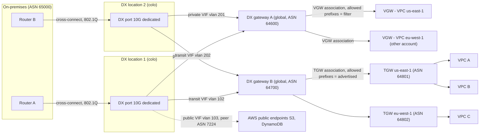
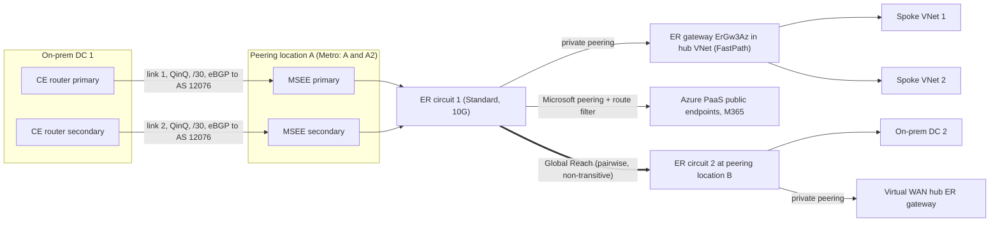
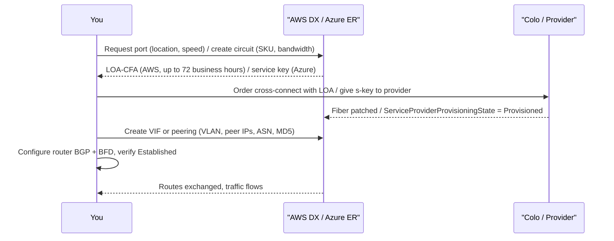

# G12 Dedicated Interconnect
> Last verified: 2026-10 · Audience: senior/staff DevOps, SRE, AI eng, NetEng, DevSecOps, architects

> Neutralized terms used in this file: **dedicated interconnect** = AWS **Direct Connect (DX)** / Azure **ExpressRoute (ER)**; **virtual interface** = DX **VIF** / ER **peering** (private or Microsoft); **interconnect gateway** = **DX gateway (DXGW)** / ER **circuit + VNet gateway**; **transit hub** = AWS **Transit Gateway (TGW)** or Cloud WAN / Azure **Virtual WAN hub** or hub-spoke VNet.

## TL;DR
- A dedicated interconnect is a **private Layer 2 handoff (802.1Q VLANs over single-mode fiber)** at a colocation facility, with **eBGP per VLAN**. You get steady latency and lower egress rates. It is **not encrypted by default**: use MACsec (L2) or IPsec over it (L3).
- **AWS DX**: you order a **port** (dedicated 1/10/100/400 Gbps, or a **hosted** 50 Mbps–25 Gbps connection through a partner), get a **LOA-CFA**, order a **cross-connect**, then create **VIFs**: **private** (VGW/DXGW), **public** (AWS public prefixes, ASN 7224) or **transit** (DXGW→TGW/Cloud WAN).
- **Azure ER**: you create a **circuit**, which always comes as **two links to a redundant MSEE pair**. Choose a **SKU**: **Local** (1–2 metro regions, egress included), **Standard** (one geopolitical area) or **Premium** (global, more routes and VNets). You hand the **service key** to a provider, or use **ER Direct** (dual 10/100/400 Gbps ports). Then configure **private peering** and/or **Microsoft peering** (ASN **12076**).
- **Scale limits interviewers probe**: DX inbound routes on private/transit VIF default to **100 per address family, configurable up to 1,000** via inbound prefix controls (since 2026; the older hard limit was 100). The public VIF limit is **1,000**. A TGW sends at most **200** prefixes to on-prem per transit VIF. ER private peering accepts **4,000** IPv4 routes (Standard) or **10,000** (Premium), and Microsoft peering **200** per session. **Going over the limit drops the BGP session** on both clouds.
- **DXGW** is a **global, out-of-path route reflector**. It connects VIFs to VGWs/TGWs in any Region, but it does **not provide VPC-to-VPC transit**. The AWS-side ASN is set on the VGW/DXGW (Amazon default **64512**). On ER the gateway SKU (ErGw1Az/2Az/3Az/ErGwScale) is the throughput bottleneck. **FastPath** bypasses the gateway on the data path.
- **Site-to-site over the cloud backbone**: AWS **SiteLink** (per-VIF toggle, private/transit VIFs on a DXGW) vs Azure **ER Global Reach** (connects pairs of circuits, not transitive).
- **Route control**: DX uses communities `7224:7100/7200/7300` (local-pref) on private/transit VIFs and `7224:9100/9200/9300` (scope) on public VIFs, and AWS tags `7224:8100/8200` and NO_EXPORT on what it sends. ER **ignores communities you send** and only tags its own routes (`12076:5xxxx` regional, `12076:50xx` service). Microsoft peering needs a **route filter** before any prefix is advertised.
- **Design default**: two locations × two devices (DX "Maximum resiliency" / ER **Metro** or two peering locations), with BFD, plus a **VPN backup**. One circuit is never "HA".

## G12.1 Introduction to dedicated interconnect
- **How it works:**
  - A physical port on the cloud provider's edge router (AWS DX endpoint / Microsoft Enterprise Edge, **MSEE**) in a **colocation facility** (Equinix, Digital Realty, CoreSite, …) is cross-connected to your router or to a carrier's NNI.
  - Logical separation is done with **802.1Q VLANs**. Each VLAN carries one eBGP session (one VIF or one peering).
  - Traffic stays off the public internet: **predictable latency/jitter**, **higher throughput**, **cheaper data-transfer-out** (DX DTO rates are lower than internet DTO; ER Local and "unlimited" plans include egress).
  - A DX location is associated with **one home Region**. You can still reach **all public Regions** (public VIF) and **any Region** via a DXGW (except China).
  - An ER circuit reaches the regions allowed by its SKU scope: Local, Standard (geopolitical area) or Premium (global).
- **Trade-offs / when to use:**
  - Use it for steady high throughput (>1 Gbps), latency-sensitive hybrid apps (DB replication, VDI, trading), large data migration or ingest, and compliance requirements to avoid the internet.
  - Lead time is **weeks** (port, cross-connect, carrier). It has no built-in encryption. Each link is a single physical path. Port-hours are billed even when idle.
  - VPN is minutes to provision and IPsec by default, but is limited per tunnel (≈1.25 Gbps on AWS VGW/TGW) and runs over the internet. See [G10 Site-to-site VPN](G10-site-to-site-vpn.md).
- **Interview angles:**
  - "Is DX/ER secure?" → It is *private*, not *encrypted*. Add MACsec (dedicated 10/100/400G DX, ER Direct) or IPsec (DX private IP VPN / public VIF VPN; ER: VPN over private peering). See G12.23–G12.26 later in this file.
  - "Why not just VPN?" → Throughput ceilings, internet jitter, and egress cost at scale. The reverse question is also common: use VPN as the **backup** for DX/ER.
  - Pitfall: ordering one port and calling it HA. AWS SLA tiers require multiple connections in **multiple locations**. ER's SLA requires **both** BGP sessions (primary and secondary) to be up.

## G12.2 Network requirements (physical layer up to BGP)
- **How it works (AWS DX, dedicated):**
  - **L1**: **Single-mode fiber** only. Optics: **1000BASE-LX (1310 nm)** for 1G, **10GBASE-LR (1310 nm)** for 10G, **100GBASE-LR4** for 100G, **400GBASE-LR4** for 400G.
  - Auto-negotiation may need to be on **or** off depending on the DX endpoint. A mismatch is a classic "port up, VIF down" cause.
  - **L2**: **802.1Q VLAN** encapsulation must be supported **end to end**, including carrier and intermediate switches. Frame size is **1522** or **9023 bytes** at L2 (jumbo).
  - **L3/L4**: **BGP with MD5 authentication** is mandatory on DX (enabled by default, can't be disabled). Asynchronous **BFD** is enabled on the AWS side and takes effect once you configure it on your router. IPv4/IPv6/dual-stack are supported per VIF.
  - **Peer addressing**: a /30 or /31 (RFC 3021 /31 supported on all VIF types) or AWS-assigned 169.254.0.0/16 link-local. IPv6 is always an Amazon-allocated **/125**.
  - **Location model**: you are colocated at the DX location, **or** you use an APN DX Partner, **or** an independent provider extends the circuit to you.
- **How it works (Azure ER):**
  - **Provider model**: the provider handles L1/L2. You get two logical links (**primary and secondary**) per circuit. **Dual-tagged (QinQ)**: the outer S-tag selects the circuit link and the inner C-tag selects the peering.
  - **ER Direct**: **dual 10G, 100G or 400G** ports across an MSEE pair. **Single-mode LR**: QSFP-100G-LR4 for 100G, QSFP-DD-400G-LR4 for 400G. You choose **Dot1Q or QinQ** tagging (Ethertype 0x8100).
  - ER Direct supports **no LACP or MLAG**. **IP MTU is 1,500** at the MSEE, and the effective TCP/UDP max through the ER gateway is **1,400 bytes**.
  - **BGP**: you reserve a **/29 or two /30s** per peering (IPv6 /125 or two /126s). Use the first usable IP of each /30 yourself; Microsoft takes the second. **MD5 is optional**. **BFD** is on by default for private peering.
  - Hold time is **180 s** and keepalive **60 s** on the Microsoft side (fixed). **HSRP and VRRP are not supported**; redundancy comes from the BGP pair.
- **Trade-offs / when to use:**
  - LR optics, not SR. Multimode fiber is a common ordering mistake.
  - 100G and 400G locations are a subset of all locations. Check port availability before the design review.
- **Interview angles:**
  - "Walk me through bring-up." → Light levels / Tx-Rx (L1) → port up → VLAN tag matches and ARP to the peer IP (L2) → ping peer → BGP Established with MD5 → prefixes received/advertised → app traffic.
  - "Why must every device support 802.1Q?" → A device that strips tags silently black-holes every VIF.

## G12.3 BGP Autonomous System and ASN
- **How it works:**
  - **AWS public ASN** is **7224**. It is used as the AWS side of **public VIFs**, and AWS replaces a customer's **private** ASN with 7224 when re-advertising public-VIF prefixes inside AWS.
  - **AWS side of private/transit VIFs**: the **VGW** ASN (default **64512** if you don't set one) or the **DXGW** ASN. DXGW ASN must be in **64512–65534** or **4200000000–4294967294**.
  - **TGW**: each TGW behind the same DXGW in different Regions needs a **unique ASN**. A DXGW used with Cloud WAN must not overlap the core-network ASN range.
  - **Customer ASN on DX**: public (must own it, verified) or private.
    - 16-bit private range: **64512–65534**.
    - Long ASNs are **1–4294967294** (long-ASN support). Private long range: **4200000000–4294967294**.
  - On DX the customer ASN **can't equal** the VGW/DXGW ASN on the same VIF. The same customer ASN can be reused across VIFs.
  - **Azure**: Microsoft uses **AS 12076** for private and Microsoft peering. **65515–65520 are reserved** (VNet gateways use **65515**). 16-bit and 32-bit ASNs are supported.
  - On Microsoft peering a **private ASN is allowed but needs manual validation** and is **stripped**, so your prepends don't work. Documentation ASNs **64496–64511 are rejected**.
- **Trade-offs / when to use:**
  - **Public ASN plus public prefixes** gives real AS_PATH control on public VIF / Microsoft peering, which you need for active/passive across providers.
  - **Private ASN** is fine for private VIF / private peering.
  - With a private ASN on a **public VIF**, prepending is stripped (AWS swaps in 7224) and you lose that control knob.
- **Interview angles:**
  - "Which ASN goes where?" → On-prem router = your ASN. Neighbor = 7224 (public VIF), VGW/DXGW ASN (private/transit), or 12076 (ER).
  - Pitfall: two Regions' TGWs with the **same ASN** on one DXGW cause AS_PATH loop prevention to drop routes.
  - Pitfall: using 65515 on-prem with Azure. It collides with the VNet gateway ASN.

## G12.4 Connection types: dedicated vs hosted
- **How it works (AWS):**
  - **Dedicated connection**: a physical port allocated to **your** account at **1, 10, 100 or 400 Gbps**. Requested via console/API: the **Connection wizard** (resiliency levels *Maximum*, *High*, *Development and Test*) or **Classic**.
    - Up to **50 public/private VIFs + 4 transit VIFs (max 51 total)** per dedicated connection, a hard limit.
    - Supports **LAG** (up to 4 members <100G, 2 members at 100G and above) and **MACsec** (dedicated only, on MACsec-capable ports).
  - **Hosted connection**: a partner carves capacity from **their** interconnect. Speeds are **50, 100, 200, 300, 400, 500 Mbps, 1, 2, 5, 10, 25 Gbps**.
    - Only qualified partners can sell ≥1 Gbps. **25 Gbps** is only available at locations offering 100G ports.
    - **Exactly 1 VIF per hosted connection**, a hard limit. You **accept** it in the console.
    - AWS **polices** traffic at the rate, so excess is dropped and bursty flows suffer. Jumbo frames only work if the partner's parent connection is jumbo-enabled.
    - Speed changes are made by the partner. In-place up/downgrade is supported if the partner supports it.
  - **Hosted VIF**: a different thing. A VIF on someone else's dedicated connection (partner or another account) is shared to your account, so you share the port's bandwidth.
- **How it works (Azure):**
  - **Provider circuits**: **50 Mbps–10 Gbps** (50/100/200/500 Mbps, 1/2/5/10 Gbps). Connectivity models: **Cloud Exchange co-location** (L2/L3 cross-connect at an exchange), **point-to-point Ethernet**, **any-to-any (IPVPN/MPLS)**, and **ER Direct**.
  - **ER Direct**: port pairs at **10, 100 or 400 Gbps** (400G is limited-location and enrollment-gated). You carve **multiple circuits** on the pair:
    - 10G port: 1/2/5/10 Gbps circuits.
    - 100G port: 5/10/40/100 Gbps circuits.
    - 400G port: up to 400 Gbps circuits.
  - ER Direct port billing starts at **45 days** or when a link is enabled, whichever comes first.
  - **Circuit SKUs**: **Local** (1–2 regions in or near the metro, egress **included**, no Global Reach, needs a 1G+ circuit from a supported location), **Standard** (all regions in the geopolitical area), **Premium** add-on (global reach to all regions, 10k routes, more VNet links, M365).
  - **Billing**: **Metered** vs **Unlimited** data plans.
  - **Resiliency tiers**: **standard**, **high** (= **ER Metro**, the same price as standard) and **max** (multiple circuits in different locations).
- **Trade-offs / when to use:**
  - Hosted/provider gives sub-1G sizes and quick onboarding through existing MPLS, but you have no LAG/MACsec and only one VIF.
  - Dedicated/Direct gives many VIFs, MACsec, jumbo frames, physical isolation, and multiple business-unit circuits on one port (ER Direct).
- **Interview angles:**
  - "Need 500 Mbps to 3 VPCs in 2 Regions and also S3?" → A hosted connection has **one VIF**. Use a transit VIF to a DXGW + TGW (or a private VIF to a DXGW), and reach S3 over a TGW/interface endpoint. Or order 2 hosted connections, or move to dedicated.
  - "Upgrade ER bandwidth?" → **Increase in place** if the port has capacity. You **can't decrease**: create a new circuit and migrate.

## G12.5 Steps to provision a connection
- **How it works (AWS dedicated):**
  1. Pick a DX **location** and **speed** (plus the resiliency model in the wizard). AWS reviews the request in **up to 72 business hours**. If AWS asks for more information, reply within **7 days** or the request is deleted.
  2. Download the **LOA-CFA** (Letter of Authorization – Connecting Facility Assignment). It names the cage/panel/port. LOA-CFA validity is commonly **90 days** (unverified in current docs). After that, re-download.
  3. Give the LOA to the **colo provider** (if you are in the building; you must be their customer) or to your **APN partner/carrier**, who orders the **cross-connect** in the meet-me room. A campus such as "Equinix DC1-DC6" counts as **one location**, so it is not location diversity.
  4. Port comes **up**; billing of port-hours begins (when the connection is available, or **90 days** after creation, whichever is first; unverified).
  5. Create **VIFs** (VLAN, peer IPs, ASN, MD5, MTU, gateway). Download the vendor **router config**, configure BGP and BFD, and verify (`traceroute`, ping an EC2 instance).
  6. Add **redundancy**: a second connection or location, plus a VPN backup.
- **How it works (AWS hosted):** order from a partner → partner creates the connection in your account → **accept** → create the single VIF.
- **How it works (Azure provider model):**
  1. Create the **circuit** (provider, peering location, bandwidth, SKU, billing). Azure returns a **service key (s-key)**.
  2. Give the s-key to the provider. **ServiceProviderProvisioningState** goes NotProvisioned → Provisioning → **Provisioned**. **Status** = Enabled. **Billing starts at circuit creation**.
  3. Configure **private peering** and/or **Microsoft peering** yourself, or have the provider do it if it manages L3.
  4. Create the **ER gateway** in GatewaySubnet (/27 recommended, /26 for 16 circuits), then a **connection** (link the VNet). Cross-subscription/tenant links use **authorization keys**.
  5. You **can't delete** a circuit while it is Provisioning or Provisioned. The provider must deprovision it first, and billing continues until deletion.
- **How it works (Azure ER Direct):** register the `AllowExpressRoutePorts` feature → create the ER Direct port resource → download the **LOA** → order cross-connects → enable admin state → create circuits on the port pair.
- **Interview angles:**
  - "Who owns which step?" → The cloud allocates the port and LOA. The colo runs the cross-connect. The carrier does the last mile. You own the router, BGP, and BFD.
  - Pitfall: billing surprises. DX port-hours start after 90 days even if your carrier is late (unverified). ER bills from circuit creation.

## G12.6 Virtual interfaces: public, private, transit
- **How it works:**

| Type (AWS) | Reaches | AWS-side peer | Azure equivalent |
|---|---|---|---|
| **Private VIF** | One VPC via **VGW** (same Region), or many VPCs in any Region via **DXGW** + VGWs | VGW/DXGW ASN | **Azure private peering** → ER gateway in VNet (or vWAN hub) |
| **Public VIF** | All AWS **public** endpoints, all public Regions (S3, DynamoDB, API endpoints, EIPs, CloudFront) | 7224 | **Microsoft peering** (Azure PaaS public endpoints, M365 with authorization) with a **route filter** |
| **Transit VIF** | **DXGW → TGW** (up to 6 TGWs) or **Cloud WAN** core network | DXGW ASN | Private peering into a **Virtual WAN hub** ER gateway (transit is in the hub) |

  - Old Azure **public peering** is **deprecated**. Use Microsoft peering, or better, Private Endpoints over private peering.
  - DX quotas per dedicated connection: **50 private/public + up to 4 transit (51 max)**. Hosted connection: **1**.
  - Azure: **one private and one Microsoft peering per circuit**, each with primary and secondary BGP sessions.
- **Trade-offs / when to use:**
  - A public VIF / Microsoft peering exposes **public** prefixes to and from the cloud provider. It needs public IPs and NAT, and it can create **asymmetric routing** with the internet path.
  - Prefer **private VIF/peering + PrivateLink/Private Endpoints** for PaaS where possible. See [G7 Service endpoints and Private Link](G7-service-endpoints-private-link.md).
  - Transit VIF is the scalable choice for many VPCs (TGW). Private VIF + DXGW is fine for ≤20 VGWs and has no TGW data-processing charge.
- **Interview angles:**
  - "Can a private VIF reach S3?" → Not directly (S3 is a public endpoint). Use a public VIF, or an **S3 interface endpoint** reached over the private VIF. A gateway endpoint does **not** work from on-prem.
  - "Can one DXGW mix private and transit VIFs?" → **No.** A DXGW associated with a VGW or attached to a private VIF can't be associated with a TGW.

## G12.7 Virtual interface creation parameters
- **How it works (AWS):**
  - **Connection/LAG**, **name**, **owner account** (for hosted VIFs to another account).
  - **Gateway**: VGW or DXGW (private), DXGW (transit), none (public).
  - **VLAN**: 1–4094, unique per connection, **immutable** after creation. On a hosted connection the partner sets it.
  - **Address family** IPv4/IPv6 with **one BGP session per family** per VIF.
    - IPv4 peer IPs: yours, or AWS-generated 169.254/16.
    - Public VIF needs **public /30 or /31 you own** (or an AWS-provided /31 on request). No EIPs or BYOIP from the Amazon pool.
    - IPv6 is an AWS-assigned /125.
  - **Customer ASN** and **MD5 key** (yours or generated).
  - **Public VIF**: the **prefixes you advertise**, between 1 and 1,000, /1–/32 (IPv4) or /1–/64 (IPv6). Ownership is verified via RIR or an LOA on letterhead, and approval can take **up to 72 business hours**.
  - **MTU**: **private VIF 1500 or 9001**, **transit VIF 1500 or 8500**. The **public VIF is fixed at 1500**. Changing MTU can **bounce all VIFs on the connection for up to 30 s**. Jumbo frames apply only to **propagated** routes; static routes to a VGW use 1500.
  - **SiteLink** on/off (private/transit only).
  - **Inbound prefix allocation**: default **100 per address family**, up to **1,000** per VIF. Each dedicated connection has a pool of **5,000** (1/10G), **30,000** (100G) or **50,000** (400G). A DXGW has **10,000** total.
  - **Tags**.
- **How it works (Azure peering config):**
  - **Peering type** (AzurePrivatePeering / MicrosoftPeering), **VLAN ID**, **peer ASN**.
  - **Primary/secondary /30** (and /126 for IPv6), **optional MD5**.
  - Microsoft peering also needs **advertised public prefixes** (validated against RIR/IRR, state must be *Configured*), an optional **customer ASN** and a **routing registry name**.
- **Interview angles:**
  - "VIF stuck *down* but connection *up*?" → VLAN mismatch, wrong peer IP or mask, auto-negotiation, MD5 mismatch, or prefix allocation exceeded (BGP idle).
  - "Mixed MTU?" → If two private VIFs (or a VIF plus a VPN) advertise the same route with different MTUs, **1500 is used**. MTU is covered fully in G12.27 later in this file and in [G4 Network performance](G4-network-performance-and-optimization.md).

## G12.8 Provider-published IP ranges
- **How it works:**
  - **AWS** publishes `https://ip-ranges.amazonaws.com/ip-ranges.json`.
    - Fields: `syncToken`, `createDate`, then `prefixes[]` / `ipv6_prefixes[]` with `ip_prefix`, `region`, `service` (AMAZON, EC2, S3, CLOUDFRONT, ROUTE53, …) and `network_border_group`.
    - The **SNS topic `AmazonIpSpaceChanged`** (us-east-1) notifies you of changes. There is also an RFC 8805 `geo-ip-feed.csv` and **AWS-managed prefix lists** (e.g. CloudFront origin-facing).
    - BYOIP ranges are **not** in the file but **are** advertised over a public VIF. The BGP-advertised set may be aggregated or de-aggregated compared with the JSON.
  - **Azure** has **Service Tags**: a weekly downloadable JSON per cloud (track it via `changeNumber`, both top-level and per tag) and the **Service Tag Discovery API** (`az network list-service-tags`, which can lag up to 4 weeks behind the JSON).
    - New IPs aren't used for **≥1 week** after publication.
    - Over **Microsoft peering**, the routes you receive are chosen by **route filter** (service **BGP communities**, e.g. `12076:5010` Exchange, `12076:5070` ARM) plus regional communities `12076:51xxx`. `Get-AzBgpServiceCommunity` lists them.
- **Trade-offs / when to use:**
  - Use the published lists for **egress firewall allow-lists** and for **filtering what you accept** on a public VIF.
  - EC2 ranges include other customers' instances. Allowing "AMAZON" is not tenant isolation.
- **Interview angles:**
  - "How do you only send S3 traffic over the public VIF?" → On your router, filter received prefixes by **community `7224:8100`** (same Region), or by matching `service=S3` prefixes from ip-ranges.json. Everything else goes via the internet.
  - Pitfall: hard-coding ranges. Automate updates from SNS or `changeNumber`.

## G12.9 Public virtual interface
- **How it works:**
  - eBGP to **7224**. AWS advertises **all AWS public prefixes** (local and remote Regions, plus CloudFront/Route 53 PoP prefixes). The prefixes carry **NO_EXPORT** and a **minimum AS_PATH length of 3**, and are tagged **7224:8100** (same Region as the DX location's home Region), **7224:8200** (same continent) or untagged (other continents).
  - You advertise **public prefixes you own** (RIR-registered). AWS performs **inbound source filtering**: packets must come from your advertised prefixes. **No transit** between customers.
  - Your prefixes are **not** re-advertised to the internet, other DX customers or AWS's peers. They **are visible inside AWS to all customers**, so firewall accordingly.
  - Scope communities you attach: **7224:9100** (local Region), **9200** (continent), **9300** (global, the default if untagged).
  - **Inbound route limit is 1,000** prefixes from you (hard). Prefix controls don't apply to public VIFs.
  - Billing: DTO to your advertised public prefixes owned by the same payer is metered at the **DX rate**, not internet DTO.
  - **Azure Microsoft peering equivalent**: you need public /30s and NAT for your traffic. Since Aug 2017 **no prefixes are advertised until a route filter is attached**. M365 needs Microsoft authorization (and **Premium** for M365). The limit is **200 prefixes from you per session**, and default routes and RFC 1918 are filtered.
- **Trade-offs / when to use:**
  - Use it for high-volume access to S3/DynamoDB/public APIs or to terminate **public IP VPN over DX** (an encryption pattern, covered in G12.24 later in this file).
  - Risk: once you learn all AWS public prefixes, your router may prefer DX for *all* AWS/Amazon.com traffic, including for users who should go through the internet. Apply **inbound filters and local-pref** deliberately.
- **Interview angles:**
  - "Same prefix advertised to the internet and the public VIF?" → AWS prefers the **longest prefix** first, then AS_PATH. Advertise **more specifics on DX** or prepend on the internet. With a **private ASN your prepends are stripped**.
  - "Is the public VIF private?" → No. It's a private *path* to public IPs, and your prefixes are reachable by any AWS customer.

## G12.10 Private virtual interface
- **How it works:**
  - **Attach to a VGW** (one VPC, same Region as the DX location's home Region), **or to a DXGW** (up to **20 VGWs** in any Region and account, except China).
  - The AWS side advertises the VPC CIDRs (via a DXGW: the VPC CIDR, *filtered* by allowed prefixes). On-prem routes **propagate** into VPC route tables if **route propagation** is enabled on the VGW.
  - The **VPC route-table quota** (default 50 propagated + static, adjustable) can be lower than the VIF allocation, and routes beyond it aren't installed.
  - MTU **1500 or 9001**. BFD and MD5. Use **ECMP** across VIFs with equal attributes. **No VIF-per-VGW limit**.
  - **Azure equivalent**: **private peering** → an **ER virtual network gateway** in GatewaySubnet → VNet and peered spokes (gateway transit).
    - Each circuit links to **10 VNets** (Standard) or **20–100** (Premium, scales with bandwidth).
    - Up to **4 circuits from the same peering location** and **16 from different locations** per VNet (16 needs ErGw3Az or ErGwScale with ≥10 units).
    - Azure advertises **≤1,000 IPv4 VNet routes** to on-prem. Use `summarizedGatewayPrefixes` to aggregate them.
- **Trade-offs / when to use:**
  - Private VIF straight to a VGW is the simplest, but it is **one VIF per VPC**, so it scales poorly (the 50-VIF cap).
  - Private VIF + DXGW gives multi-Region, multi-account reach with no TGW cost, but **no VPC↔VPC transit** and a max of 20 VGWs.
  - Transit VIF + TGW gives scale and inter-VPC routing, but adds the TGW per-GB processing cost.
- **Interview angles:**
  - "Migrate a VIF from a VGW to a DXGW?" → You can't re-point a VIF. Create a new VIF to the DXGW, shift traffic via BGP preference, then delete the old VIF.
  - Pitfall: overlapping VPC CIDRs behind one DXGW. Associations with overlapping CIDRs are rejected.

## G12.11 Transit virtual interface
- **How it works:**
  - A transit VIF attaches to a **DXGW** that is associated with **TGWs** (≤**6 per DXGW**, hard) or a **Cloud WAN core network** (≤**5,000** prefixes to on-prem).
  - Quota: **up to 4 transit VIFs per dedicated connection** (counted within 51). Transit VIFs are supported on **any speed, including hosted**.
  - **AWS→on-prem**: only the **allowed prefixes** configured on the DXGW–TGW association are advertised, originated with the DXGW ASN. VPC CIDRs are **not** auto-advertised. Max **200 prefixes per TGW** advertised on a transit VIF (IPv4 + IPv6 combined). Summarize.
  - **On-prem→AWS**: routes propagate into **TGW route tables** (the DXGW attachment). The default limit is **100 per address family per BGP session**, configurable up to **1,000** (prefix controls). Exceeding the limit puts the session **idle (DOWN)**.
  - MTU **1500 or 8500** (TGW jumbo frames max out at 8500). The /30 or /31 peer link range does **not** propagate into the TGW.
  - A TGW can associate with **≤20 DXGWs**.
  - **Azure equivalent**: ER private peering into a **Virtual WAN hub**'s ER gateway, where the hub provides any-to-any VNet, VPN and ER transit. Alternatively a hub VNet with an NVA and Azure Route Server. See [G13 Managed global WAN](G13-managed-global-wan.md).
- **Trade-offs / when to use:**
  - Use it for many VPCs per Region, inter-VPC routing, segmentation via TGW route tables, or to combine with VPN attachments.
  - Cost: TGW data processing per GB plus the attachment-hours.
- **Interview angles:**
  - "Your 300 VPC CIDRs don't fit in 200 prefixes." → Allocate VPC CIDRs from **summarizable supernets per Region** and advertise the supernet as the allowed prefix.
  - "Can allowed prefixes overlap across TGWs on one DXGW?" → **No.** 0.0.0.0/0 is impossible with more than one TGW.

## G12.12 Interconnect gateway with private interfaces
- **How it works:**
  - The **DXGW** is a **global** resource that acts as a **distributed set of BGP route reflectors**. It is **outside the data path**, so it is not a SPOF and you don't need two.
  - Limits: **20 VGWs per DXGW**, **30 private/transit VIFs per DXGW**, **200 DXGWs per account**, **10,000 total prefix allocations** per DXGW.
  - **Cross-account**: the VGW or TGW owner sends an **association proposal**. The DXGW owner accepts it and may **override the allowed prefixes**.
  - **Allowed prefixes on a VGW association = filter**. It must be the **same as or wider than** the VPC CIDR. Only the actual VPC CIDR is advertised.
    - Example: VPC 10.0.0.0/16 with allowed 10.0.0.0/15 → you get 10.0.0.0/16.
    - Allowed 10.0.0.0/24 → nothing is advertised.
  - **No transit between associations** (VGW↔VGW).
    - **Exception (Nov 2021)**: if on-prem advertises a **supernet** covering the VPCs on the **same VIF**, VPC-to-VPC traffic hairpins via the DX endpoint.
    - To block it: use security groups, advertise more specifics, or use separate DXGWs per environment.
  - Local Zones can also be reached via VGW + DXGW.
  - **Azure equivalent**: there is no separate global object. The **ER circuit itself** is the shared thing.
    - Link VNets in other regions within the SKU scope (Premium for cross-geo), across subscriptions and tenants via **authorization keys**.
    - VNet↔VNet over ER is **disabled by default** and **not recommended**. Use VNet peering instead.
- **Interview angles:**
  - "Design: DX in us-east-1 location, VPCs in us-east-1 and eu-west-1, 3 accounts." → One DXGW. Each account's VGW proposes an association. One private VIF per connection to the DXGW. Allowed prefixes per VPC.
  - "Why does dev reach prod through on-prem?" → The supernet hairpin. Fix it with specifics or separate DXGWs.

## G12.13 Interconnect with transit hub
- **How it works:**
  - **DX + TGW**: transit VIF → DXGW → TGW association (allowed prefixes) → TGW route tables → VPC attachments.
  - Multi-Region options:
    - Associate each Region's TGW with the same DXGW (≤6, unique ASNs).
    - Associate one TGW and use **TGW peering** (static routes) to the others.
    - Use **Cloud WAN** (DXGW attachment, policy-based segments).
  - **DX + VPN**: run a **TGW Connect / private IP VPN** over DX for encryption. Or use VPN attachments on the same TGW as **backup** (BGP prefers DX: TGW prefers **DX over VPN** for the same prefix, (unverified) exact path-selection order: static > prefix-list > propagated DX > VPN).
  - **Azure**: an ER gateway in the **Virtual WAN hub** (scale units; FastPath auto-enabled for ER Direct with ≥5 units) or a **hub VNet** ER gateway + Azure Firewall/NVA + spokes using `useRemoteGateways`.
    - **ER + S2S VPN coexistence** needs both gateways in GatewaySubnet (/27+). To route **between** VPN-connected and ER-connected branches you need **Azure Route Server** (branch-to-branch) or vWAN.
- **Trade-offs / when to use:**
  - The hub centralizes inspection and segmentation, but costs per-GB processing and adds a hop.
  - The **Azure gateway SKU caps throughput**:

| ER gateway SKU | Throughput | PPS | Max circuits | FastPath |
|---|---|---|---|---|
| Standard / **ErGw1Az** | 1 Gbps | 100k | 4 | No |
| HighPerformance / **ErGw2Az** | 2 Gbps | 200k | 8 | No |
| UltraPerformance / **ErGw3Az** | 10 Gbps | 1M | 16 | Yes |
| **ErGwScale** (1–40 units) | 1 Gbps per unit | 100k–200k per unit | 4 / 8 / 16 (≥10 units) | Yes (≥10 units) |

  - **FastPath** bypasses the gateway on the data path. The gateway still exchanges routes.
    - Requires UltraPerformance/ErGw3Az or ErGwScale ≥10 units.
    - IP limits: **25k** (provider), **100k** (Direct 10G), **200k** (Direct 100/400G).
    - VNet peering, UDR, IPv6 and Private Link (limited GA) over FastPath work **only on ER Direct**.
    - Spoke ILBs, PaaS, and Azure Firewall in spokes still go through the gateway.
  - Non-AZ ER gateway SKUs migrate to AZ SKUs via the **gateway migration experience**. ER gateways now use **auto-assigned (Microsoft-managed) public IP** and are always zone-redundant.
- **Interview angles:**
  - "10 Gbps ER circuit, apps see 2 Gbps." → The **gateway SKU** is the bottleneck (ErGw2Az). Upgrade to ErGw3Az/ErGwScale or enable FastPath.
  - "Packets over 1,400 bytes are dropped through the ER gateway." → The gateway doesn't fragment. Clamp MSS or enable FastPath.
  - Cross-ref: [G8 Transit hub](G8-transit-hub.md).

## G12.14 Site-to-site routing over the provider backbone
- **How it works:**
  - **AWS SiteLink**: a per-VIF toggle on **private VIFs attached to a DXGW** or **transit VIFs**. Not supported on a VIF to a VGW, public VIFs, GovCloud or China.
    - With it, on-prem sites connected at **different DX locations** exchange routes via the DXGW and send traffic over the **shortest AWS backbone path**, without traversing a Region.
    - It is billed per SiteLink-enabled VIF-hour plus per-GB.
    - Enabling it changes AWS's path preference: AWS-to-on-prem traffic prefers the **shortest AS_PATH from any location**, not the home-Region location.
    - SiteLink breaks if the same prefix is advertised on multiple VIFs. SiteLink prefix limit is ≤1,000 per family via prefix controls.
    - A DXGW with **no** VGW/TGW association can be used purely for SiteLink.
  - **Azure ExpressRoute Global Reach**: links **two circuits** at **different peering locations**, so on-prem↔on-prem traffic crosses Microsoft's backbone.
    - It is **not transitive**: A↔B plus B↔C does **not** give A↔C, so a full mesh needs every pair configured.
    - Same geopolitical region needs no Premium. Cross-geo needs **Premium on both** circuits.
    - **Not available on Local SKU**, and only in supported countries. It needs a **/29** for the connection.
    - Throughput is capped by the smaller circuit. Global Reach links count against the circuit's VNet-link limit.
    - Route limits: you can still only *advertise* 4k/10k, but you *receive* the other sites' routes too.
- **Trade-offs / when to use:**
  - Use it to replace or augment an MPLS WAN between data centers that already have cloud interconnects.
  - Compare it with carrier MPLS SLAs and with SD-WAN over the cloud (Cloud WAN, Virtual WAN). See [G13 Managed global WAN](G13-managed-global-wan.md).
- **Interview angles:**
  - "Two DCs, each with DX at a different location; make them talk over AWS." → Enable SiteLink on both VIFs (same DXGW). Watch for overlapping or duplicate prefixes.
  - "Three ER circuits, want any-to-any." → Configure 3 Global Reach pairs (it's non-transitive). Check Premium if the circuits are cross-geo.

## G12.15 Routing policies and BGP communities
- **How it works (AWS, summary; the deep dive is in G12.16–G12.19 later in this file):**
  - **Private/transit VIF**: AWS→on-prem path selection is **longest prefix** → **local-pref communities** `7224:7100` low / `7224:7200` medium / `7224:7300` high (mutually exclusive, evaluated **before AS_PATH**) → **AS_PATH** → **MED** (not recommended) → **ECMP** (flow-based, same attributes, ASNs need not match).
    - Without tags, AWS prefers DX locations whose **associated Region** equals the source Region (implicit medium local-pref for the home Region).
  - **Public VIF inbound**: you tag scope (`7224:9100/9200/9300`). Equal communities plus equal AS_PATH make prefixes multipath candidates.
  - **Public VIF outbound**: AWS tags `7224:8100/8200` and NO_EXPORT. The `7224:1–7224:65535` range is reserved, and unsupported communities are stripped.
  - **On-prem→AWS** is entirely **your** policy: local-pref on your routers decides which VIF you send on.
  - Default dual-connection behavior is **active/active** (BGP multipath). For active/passive use local-pref communities (private/transit) or AS_PATH prepend/more specifics (public).
- **How it works (Azure):**
  - Microsoft **does not honor communities you send**. To steer Azure→on-prem you use **AS_PATH prepend** or **more specific prefixes**. To steer on-prem→Azure you use **local-pref** on your side.
  - Within the VNet, **connection weight** prefers one circuit over another. ECMP spans up to **4 circuits**, per-flow on the 5-tuple.
  - Microsoft tags routes with **regional communities**: private peering `12076:50xxx` (requires a custom VNet community to be set first), Microsoft peering `12076:51xxx`, plus service-specific `12076:52xxx–55xxx` (Storage/SQL/Cosmos/Backup) and **service communities** `12076:5010` (Exchange) … `12076:5250` (PSTN).
  - **Default route** is accepted on **private peering only**. It forces Azure internet egress on-prem and breaks KMS activation unless you add UDRs.
- **Interview angles:**
  - "Active/passive across 2 DX locations for return traffic?" → Tag the primary VIF's prefixes `7224:7300` and the backup's `7224:7100`. Local-pref beats AS_PATH, so prepending alone fails when the backup is in the home Region.
  - "Asymmetric routing with Microsoft peering + internet." → Advertise NAT pools only over ER (or more specifics). Use local-pref on-prem. Don't advertise the same /24 to both.
  - Overlap: routing fundamentals are in [F7 Network routing](../F-network-engineering/F7-network-routing.md).

<!-- PART2-IDS-GO-HERE -->

## Diagrams

### AWS: DX gateway topology (private VIF + transit VIF)


### Azure: ExpressRoute topology (provider circuit + Global Reach + vWAN)


### Provisioning flow (AWS dedicated vs Azure provider)


## Cloud mapping: AWS vs Azure
| Capability | AWS | Azure | Role it plays | Key differences | Alternatives |
|---|---|---|---|---|---|
| Dedicated port | DX **dedicated connection** 1/10/100/400G | **ER Direct** port pair 10/100/400G | Your own physical port at the edge | ER Direct is always a **pair** carved into circuits. A DX connection is single; redundancy means ordering more | GCP Dedicated Interconnect, Equinix Fabric |
| Partner sub-rate | DX **hosted connection** 50M–25G | ER **provider circuit** 50M–10G | Carrier-delivered capacity | Hosted = 1 VIF. An ER circuit always includes 2 links + both peerings | Megaport/Equinix virtual cross-connects |
| Logical L3 interface | **Private / public / transit VIF** | **Private peering / Microsoft peering** | eBGP per VLAN | ER has one of each per circuit. DX has up to 51 VIFs per port | — |
| Cloud-side ASN | 7224 public; VGW/DXGW ASN (default 64512) | 12076 for all peerings | BGP neighbor | Azure reserves 65515–65520 | — |
| Multi-region attach | **DX gateway** (global, 20 VGW / 6 TGW) | Circuit **SKU** (Local / Standard / **Premium**) + VNet links | Reach beyond the home region | AWS: any Region via DXGW at no extra cost. Azure: cross-geo needs Premium | Cloud WAN / Virtual WAN |
| Transit hub | **TGW** via transit VIF; Cloud WAN | **Virtual WAN hub** ER gateway; hub VNet + Route Server | Many VPCs/VNets, segmentation | Azure gateway SKU caps throughput (1–10G+) unless FastPath | NVAs, Aviatrix |
| Gateway in the VPC/VNet | VGW (no throughput cap documented for DX) | **ER gateway** ErGw1Az/2Az/3Az/ErGwScale | Route exchange (+ data path in Azure) | Azure data path goes through the gateway unless FastPath | — |
| Site-to-site over backbone | **SiteLink** | **Global Reach** | DC↔DC over the cloud WAN | SiteLink is a VIF toggle (any DX locations). Global Reach is pairwise, non-transitive, not on Local | MPLS, SD-WAN |
| Metro HA | Connection wizard "Maximum/High resiliency" (2 locations) | **ER Metro** (one circuit, two locations in a city) | Location diversity | ER Metro costs the same as standard | Two separate circuits |
| Public-service routing | Public VIF + communities 7224:8100/8200, 9100/9200/9300 | Microsoft peering + **route filters** (service communities) | Reach PaaS public IPs privately | Azure advertises nothing until a route filter is attached, and ignores your communities | Private endpoints over private path |
| Published ranges | ip-ranges.json + SNS, managed prefix lists | Service Tags JSON (weekly) + Discovery API | Firewall/route filtering | Azure tags are usable natively in NSG/UDR/Firewall | — |
| Encryption | MACsec (dedicated), private IP VPN, public VIF VPN | MACsec (ER Direct), IPsec over private peering / vWAN | Confidentiality on the link | Neither is encrypted by default | — |

- **AWS DX** is a port plus VIFs. Global reach comes from the **DXGW** (a free route-reflector object). The **TGW/Cloud WAN** is the scaling and segmentation layer. Limits are mostly per VIF / per DXGW / per TGW, e.g. **200 prefixes per TGW out**, inbound 100→1,000 configurable.
- **Azure ER** is a circuit (always dual-link) plus peerings. Reach is governed by the **SKU**. On the VNet side, the **ER gateway SKU** governs both throughput and the circuit count, and **FastPath** removes the data-path bottleneck. Limits are per circuit (4k/10k routes in, 1k routes out, VNet links 10–100).
- **SLA shape**: AWS publishes DX SLAs by **resiliency model** (Maximum = 4 connections across 2+ locations; High = 2 locations) (unverified exact percentages: 99.99% / 99.9%). Azure's ER SLA is per **circuit** with **both BGP sessions** configured (unverified: 99.95%).
- **Pricing shape**: DX = port-hours (dedicated or hosted rate) + DTO at the DX rate (+ SiteLink per-hour and per-GB). ER = circuit monthly fee by bandwidth × (metered + per-GB egress | unlimited) + Premium add-on + Global Reach add-on + gateway hours. ER Local includes egress. Inbound is free on both.
- **Gotchas**: DX hosted = 1 VIF. DXGW can't mix VGW and TGW associations. ER provider circuits can't shrink in place. ER gateway MTU is 1400 and it doesn't fragment. ER VNet↔VNet is disabled by default.
- **Alternatives**: **GCP Cloud Interconnect** (Dedicated 10/100G, Partner) and **Cross-Cloud Interconnect** for multicloud. **Megaport / Equinix Fabric** provide virtual cross-connects to several clouds from one port.
  - AWS has added **AWS Interconnect** connections (multicloud/last-mile) that attach to a DXGW and consume 2,000 of its 10,000 prefix allocation (product details unverified).
  - **Cloudflare Magic WAN / Network Interconnect (CNI)** is an option when the "WAN" is really internet plus security.

## Hands-on (optional)
```bash
# --- AWS: inspect connections, LOA, VIFs and BGP state ---
aws directconnect describe-connections --query 'connections[].[connectionId,location,bandwidth,connectionState,macSecCapable]' --output table
aws directconnect describe-loa --connection-id dxcon-xxxxxxxx --query loaContent --output text | base64 -d > loa.pdf
aws directconnect describe-virtual-interfaces \
  --query 'virtualInterfaces[].[virtualInterfaceId,virtualInterfaceType,vlan,asn,amazonSideAsn,mtu,virtualInterfaceState,bgpPeers[0].bgpStatus]' --output table

# AWS public ranges: S3 prefixes in us-east-1 (to build a public-VIF inbound filter)
curl -s https://ip-ranges.amazonaws.com/ip-ranges.json \
  | jq -r '.prefixes[] | select(.service=="S3" and .region=="us-east-1") | .ip_prefix'

# --- Azure: circuit service key, provider state, learned routes ---
az network express-route show -g rg-net -n er-ckt-1 \
  --query '{skey:serviceKey,provider:serviceProviderProvisioningState,sku:sku.tier,bw:serviceProviderProperties.bandwidthInMbps}'
az network express-route list-route-tables -g rg-net -n er-ckt-1 \
  --peering-name AzurePrivatePeering --path primary -o table
az network list-service-tags --location westeurope --query "values[?name=='Storage.WestEurope'].properties.addressPrefixes"
```

```hcl
# AWS: DX gateway + TGW association + transit VIF (connection already exists)
resource "aws_dx_gateway" "main" {
  name            = "dxgw-core"
  amazon_side_asn = "64700"
}

resource "aws_dx_gateway_association" "tgw_use1" {
  dx_gateway_id         = aws_dx_gateway.main.id
  associated_gateway_id = aws_ec2_transit_gateway.use1.id
  allowed_prefixes      = ["10.0.0.0/12"] # summarized; max 200 per TGW toward on-prem
}

resource "aws_dx_transit_virtual_interface" "tvif" {
  connection_id  = "dxcon-xxxxxxxx"
  dx_gateway_id  = aws_dx_gateway.main.id
  name           = "tvif-loc1"
  vlan           = 102
  address_family = "ipv4"
  bgp_asn        = 65000
  mtu            = 8500
}

# Azure: provider circuit + private peering
resource "azurerm_express_route_circuit" "ckt" {
  name                  = "er-ckt-1"
  resource_group_name   = "rg-net"
  location              = "westeurope"
  service_provider_name = "Equinix"
  peering_location      = "Amsterdam"
  bandwidth_in_mbps     = 1000
  sku {
    tier   = "Standard" # Local | Standard | Premium
    family = "MeteredData"
  }
}

resource "azurerm_express_route_circuit_peering" "private" {
  peering_type                  = "AzurePrivatePeering"
  express_route_circuit_name    = azurerm_express_route_circuit.ckt.name
  resource_group_name           = "rg-net"
  peer_asn                      = 65000
  primary_peer_address_prefix   = "192.168.100.128/30"
  secondary_peer_address_prefix = "192.168.100.132/30"
  vlan_id                       = 100
}
```

## Cross-links
- [G6 Private connectivity and peering](G6-private-connectivity-peering.md)
- [G7 Service endpoints and Private Link](G7-service-endpoints-private-link.md) (PaaS over private VIF / private peering)
- [G8 Transit hub](G8-transit-hub.md) (TGW, Virtual WAN, hub-spoke)
- [G9 Hybrid network basics](G9-hybrid-network-basics.md)
- [G10 Site-to-site VPN](G10-site-to-site-vpn.md) (backup path, VPN over DX)
- [G13 Managed global WAN](G13-managed-global-wan.md) (Cloud WAN, Virtual WAN, SiteLink / Global Reach comparisons)
- [G4 Network performance and optimization](G4-network-performance-and-optimization.md) (MTU overlap: F6.1, G4.1, G12.27, H5.8)
- [F7 Network routing](../F-network-engineering/F7-network-routing.md) (BGP path selection)
- [F6 Network performance](../F-network-engineering/F6-network-performance.md#f61) (MTU)
- [H2 Troubleshooting your network](../H-full-stack-troubleshooting/H2-troubleshooting-your-network.md)
- [C3 Reliability](../C-large-scale-architecture/C3-reliability.md) (DR and standby, multi-path design)

## Sources
- https://docs.aws.amazon.com/directconnect/latest/UserGuide/Welcome.html
- https://docs.aws.amazon.com/directconnect/latest/UserGuide/limits.html
- https://docs.aws.amazon.com/directconnect/latest/UserGuide/prefix-controls.html
- https://docs.aws.amazon.com/directconnect/latest/UserGuide/hosted_connection.html
- https://docs.aws.amazon.com/directconnect/latest/UserGuide/WorkingWithVirtualInterfaces.html
- https://docs.aws.amazon.com/directconnect/latest/UserGuide/getting_started.html
- https://docs.aws.amazon.com/directconnect/latest/UserGuide/create-connection.html
- https://docs.aws.amazon.com/directconnect/latest/UserGuide/routing-and-bgp.html
- https://docs.aws.amazon.com/directconnect/latest/UserGuide/direct-connect-gateways-intro.html
- https://docs.aws.amazon.com/directconnect/latest/UserGuide/create-direct-connect-gateway.html
- https://docs.aws.amazon.com/directconnect/latest/UserGuide/direct-connect-transit-gateways.html
- https://docs.aws.amazon.com/directconnect/latest/UserGuide/allowed-to-prefixes.html
- https://docs.aws.amazon.com/vpc/latest/tgw/tgw-dcg-attachments.html
- https://docs.aws.amazon.com/vpc/latest/userguide/aws-ip-ranges.html
- https://learn.microsoft.com/en-us/azure/expressroute/expressroute-faqs
- https://learn.microsoft.com/en-us/azure/expressroute/expressroute-routing
- https://learn.microsoft.com/en-us/azure/expressroute/expressroute-workflows
- https://learn.microsoft.com/en-us/azure/expressroute/expressroute-erdirect-about
- https://learn.microsoft.com/en-us/azure/expressroute/expressroute-about-virtual-network-gateways
- https://learn.microsoft.com/en-us/azure/expressroute/about-fastpath
- https://learn.microsoft.com/en-us/azure/expressroute/metro
- https://learn.microsoft.com/en-us/azure/virtual-network/service-tags-overview
