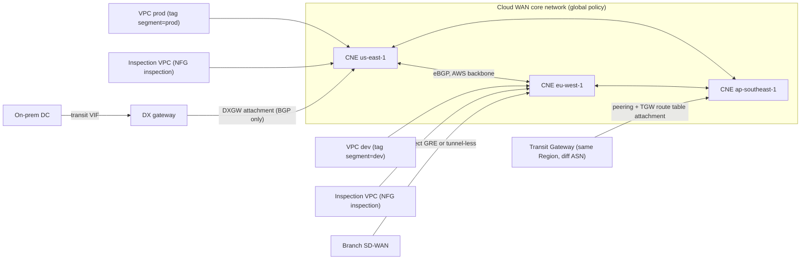
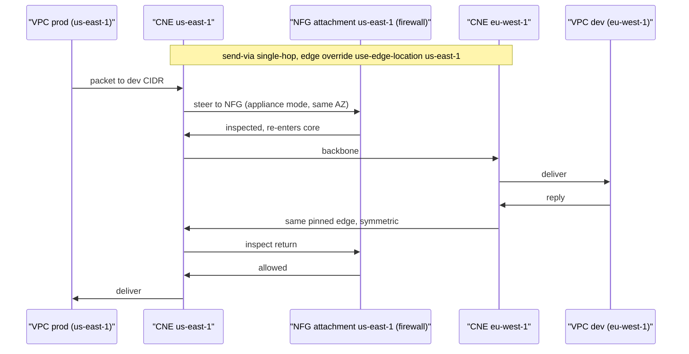

# G13 Managed Global WAN
> Last verified: 2026-10 · Audience: senior/staff DevOps, SRE, AI eng, NetEng, DevSecOps, architects

> Neutralized terms: **managed global WAN** = **AWS Cloud WAN** ↔ **Azure Virtual WAN (Standard)**, with multiple hubs. **Transit hub** = AWS Transit Gateway (TGW) ↔ Virtual WAN hub or a hub-spoke VNet. **Interconnect** = AWS Direct Connect (DX) ↔ Azure ExpressRoute (ER). **Regional edge router** = Cloud WAN Core Network Edge (CNE) ↔ Virtual WAN hub router.

## TL;DR
- **Cloud WAN** is a global network you configure with a **policy**. You write one JSON **core network policy**. AWS then builds a **Core Network Edge (CNE)** in each listed Region, peers every CNE with every other CNE, and keeps segment route tables the same in every Region. You don't build or maintain a mesh of TGW peerings.
- **Segments** are global VRFs, meaning separate routing domains. **Attachment policies** use **tags** and other metadata to put each attachment in a segment. **Segment actions** control what can reach what: `share` leaks routes between segments, `create-route` adds a static route, and `send-via` or `send-to` steer traffic through inspection.
- Attachment types are **VPC**, **Site-to-Site VPN**, **Connect** (GRE or tunnel-less, used for SD-WAN), **TGW route table** (through a TGW peering in the same Region), and **Direct Connect gateway**. The DX gateway attachment is native, so you no longer need a TGW between DX and Cloud WAN. It is GA and shipped late 2024.
- Inspection has two generations. The legacy pattern uses an **inspection segment** plus per-Region static `create-route` entries and `share`. The current pattern is **service insertion**, where **network function groups (NFGs)** are used by `send-via` (east-west, `single-hop` or `dual-hop`) and `send-to` (north-south, egress). With service insertion, Cloud WAN handles cross-Region symmetry for you.
- **Cloud WAN vs a TGW peering mesh:** a TGW mesh needs n·(n−1)/2 peerings, uses static routes across peerings, and segments with per-TGW route tables. Cloud WAN gives one global policy, BGP between CNEs, global segments and change sets you can review. In return it costs more per edge, has 1 core network per global network and 1 CNE per Region, and can be less deterministic about path choice.
- **Azure equivalent:** Standard Virtual WAN. **Hubs form a full mesh automatically.** **Routing intent** has a Private policy and an Internet policy, with next hop Azure Firewall, an NVA or a SaaS NGFW. A hub with a security solution is a **secured hub**. Routing intent is the *only* way to inspect hub-to-hub traffic. **ExpressRoute Global Reach** links on-prem sites to each other. **Azure Virtual Network Manager (AVNM)** builds VNet meshes and hub-spoke designs at scale, but it isn't a WAN.
- Know these quotas: **1 CNE per Region per core network**, **40 segments**, **5,000 attachments**, **10,000 routes per core network**, **MTU 8500** between VPCs and **1500** over VPN, **1.25 Gbps per VPN tunnel**, and **5 Gbps per GRE Connect peer**.

---

## G13.1 What is a managed global WAN?
- **How it works:**
  - **Object model:** *Global network* is the container, shared with Network Manager (5 per account, adjustable). *Core network* is the AWS-managed part, with exactly 1 per global network. *Core Network Edge (CNE)* is a regional router, at most 1 per Region per core network. Under the hood a CNE is a managed TGW-like construct.
  - CNEs are **automatically full-meshed** across the AWS backbone and run **eBGP** between each other. Each CNE takes an ASN from `asn-ranges`. Allowed ranges are 64512–65534 and 4200000000–4294967294, and you can't change a CNE's ASN later.
  - **Segments** work like global VRFs. Each one has a single route table that is replicated to every edge where the segment exists. By default, attachments in the same segment can talk to each other. Set `isolate-attachments: true` to stop that.
  - **Attachments:** VPC (up to 5 core network attachments per VPC), Site-to-Site VPN, Connect (GRE, or **tunnel-less** using a VPC or DX as transport), TGW route table (through a TGW peering), and DX gateway.
  - **Lifecycle:** you edit the policy, which creates a **policy version**. Cloud WAN computes a **change set**, a diff you review. Then you **execute** it and that version becomes LIVE. You get up to 10,000 versions, and a policy can be at most 1 MB.
  - **Route evaluation at each CNE:**
    1. Longest prefix wins.
    2. Static routes beat VPC-propagated routes in the same Region.
    3. Among dynamic routes, shorter AS path wins, then lower MED.
    4. If those tie, the order is DX gateway, then Connect, then VPN, then remote CNE or TGW peering.
  - **Data plane limits:** up to **100 Gbps** and **7.5 Mpps per VPC attachment per AZ**. MTU is **8500** between VPCs and over TGW peering, and **1500** over VPN. Larger packets are dropped. MSS clamping is enforced. PMTUD works **only for traffic entering through a VPC attachment**.
  - **Pricing shape:** you pay per CNE-hour (about $0.50/h), per attachment-hour (about $0.065/h in us-east-1), and **$0.02/GB data processing**, plus normal inter-Region transfer. Traffic over a TGW peering has no data processing charge. In practice the CNE-hour is the cost you can't avoid.
- **Trade-offs / when to use:**
  - **Use Cloud WAN** when you have many Regions (3 or more) and want global segmentation such as prod/dev/PCI. It also fits when you want branches over SD-WAN (Connect) or VPN to land on the nearest edge, or when you want intent-based **policy as code** with tag-driven onboarding across many accounts (share through AWS RAM).
  - **Stay on TGW** for 1–2 Regions, when you need fine route-table tricks per VPC, or when cost matters. A single TGW is cheaper than CNEs.
  - **Weaknesses:** routing inside a segment has to be the same globally, so you can't give one attachment a different view without making it its own segment. AWS says this is deliberate, to stop "one segment per attachment" sprawl. With equal routes the tie-break is "deterministically random", so if you need a primary/secondary DC preference you must set it with AS-path or MED, or with the newer **routing policies**.
- **Interview angles:**
  - *"How is Cloud WAN different from TGW?"* → TGW is a regional router you peer by hand. Cloud WAN is a **global, declarative** layer: one policy, CNEs meshed automatically with BGP, and segments that span Regions. Cloud WAN still interoperates with TGW through peering.
  - *"How do you onboard 500 VPCs in 50 accounts?"* → Share the core network through RAM. Each account creates a VPC attachment tagged `segment=prod`. The attachment policy uses `association-method: tag` to map it, and acceptance is either required or automatic for that segment.
  - **Pitfall:** the tags that count are on the **attachment**, not on the VPC. A typo in a tag value means no rule matches, so the attachment joins no segment, and nothing warns you loudly.
  - **Pitfall:** the TGW and the core network must use **different ASNs**, and so must the DX gateway and the core network ranges.

## G13.2 Core network policy
- **How it works:**
  - **Sections:**
    - `version`, either `2021.12` or **`2025.11`**. You need 2025.11 for routing policies, and it also turns on BGP community propagation.
    - `core-network-configuration`, which holds edge locations, ASNs, `inside-cidr-blocks` for Connect, `vpn-ecmp-support` (default true), `dns-support` (default true) and `security-group-referencing-support` (default **false**).
    - `segments`
    - `network-function-groups`
    - `segment-actions`
    - `attachment-policies`
    - `attachment-routing-policy-rules` and `routing-policies`, both new with 2025.11.
  - **Segment options:**
    - `edge-locations` limits the segment to a subset of Regions, for example for data residency.
    - `isolate-attachments` defaults to false.
    - `require-attachment-acceptance` defaults to **true**.
    - `allow-filter` or `deny-filter` are applied **after** shares, and you can only use one of them. For example, put `pci` in a `deny-filter` so that no `share` can ever leak routes to it.
  - **Segment actions:**
    - `share` with `mode: attachment-route` advertises only attachment routes, both ways by default. It does **not** re-share static routes or routes from other shares, so it isn't transitive. `share-with` takes a list, `"*"`, or `{except:[...]}`. If you share `shared-svcs` with `[prod, dev]`, prod and dev still can't reach each other.
    - `create-route` adds static CIDRs with at most one attachment per Region in `destinations`, or a `blackhole`. Blackhole routes are not propagated.
    - `send-via` and `send-to` do service insertion (see G13.5).
    - `associate-routing-policy` applies to a pair of edges.
  - **Attachment policies:**
    - Rules are numbered 1–65535 and evaluated **lowest first; the first match wins**.
    - `condition-logic` is `and` or `or`, with no nesting.
    - Condition types are `any`, `tag-exists`, `tag-name`, `tag-value`, `account`, `region`, `attachment-type` and `resource-id`. Operators are `equals`, `not-equals`, `contains` and `begins-with`.
    - The action is either `association-method: constant` with a fixed `segment`, or `association-method: tag` with `tag-value-of-key`, which maps the tag value straight to the segment name. The action can also be `add-to-network-function-group`.
    - `require-acceptance: true` on a rule can make acceptance mandatory for that rule even when the segment auto-accepts.
  - **Routing policies (2025.11):**
    - Each policy has a direction, inbound or outbound, and a priority from 1 to 9999.
    - Match types are `prefix-equals`, `prefix-in-cidr`, `prefix-in-prefix-list`, `asn-in-as-path`, `community-in-list` and `med-equals`.
    - Actions are `drop`, `allow`, `summarize` (outbound only), AS-path prepend, remove or replace, community add or remove, `set-med` and `set-local-preference`.
    - **`allow` and `drop` are terminal**, so put the modifying rules in front of them.
    - Limits: 10 rules per policy, 5 match conditions per rule, and 5 policies per association type.
- **Policy excerpt** (config, trimmed):
```json
{
  "version": "2021.12",
  "core-network-configuration": {
    "asn-ranges": ["64512-64555"],
    "edge-locations": [{"location": "us-east-1"}, {"location": "eu-west-1"}]
  },
  "segments": [
    {"name": "prod", "isolate-attachments": true, "require-attachment-acceptance": true},
    {"name": "dev",  "require-attachment-acceptance": false},
    {"name": "sharedsvcs", "deny-filter": []}
  ],
  "network-function-groups": [{"name": "inspection", "require-attachment-acceptance": false}],
  "segment-actions": [
    {"action": "share", "mode": "attachment-route", "segment": "sharedsvcs", "share-with": ["prod", "dev"]},
    {"action": "send-via", "segment": "prod", "mode": "single-hop",
     "when-sent-to": {"segments": ["dev"]},
     "via": {"network-function-groups": ["inspection"],
             "with-edge-overrides": [{"edge-sets": [["us-east-1", "eu-west-1"]], "use-edge-location": "us-east-1"}]}},
    {"action": "send-to", "segment": "prod", "via": {"network-function-groups": ["inspection"]}}
  ],
  "attachment-policies": [
    {"rule-number": 100, "condition-logic": "and",
     "conditions": [{"type": "tag-exists", "key": "nfg"}],
     "action": {"add-to-network-function-group": "inspection"}},
    {"rule-number": 200, "conditions": [{"type": "tag-exists", "key": "segment"}],
     "action": {"association-method": "tag", "tag-value-of-key": "segment"}}
  ]
}
```
- **Trade-offs / when to use:**
  - Use tag-based mapping (`tag-value-of-key`) to keep the policy small and avoid one rule per segment. Map by `resource-id` only for the occasional exception, because every new attachment then needs a policy edit.
  - Leave `require-attachment-acceptance` on for prod and PCI so a tag change can't move a workload into a more trusted segment. Even with auto-accept, **changing a tag moves the attachment to another segment**, which can be abused as lateral movement if IAM on attachment tags is loose.
  - Put the policy in Git and push it through IaC: Terraform `aws_networkmanager_core_network_policy_attachment` with the `aws_networkmanager_core_network_policy_document` data source. Review the change set in the PR before you execute it.
- **Interview angles:**
  - *"Does sharing A↔B and B↔C let A reach C?"* → No. `attachment-route` mode only shares directly attached routes, so shares aren't transitive. To reach C you need a share between A and C, or a static route.
  - *"How do you guarantee PCI never reaches dev?"* → Put dev in a `deny-filter` on the PCI segment, or use an `allow-filter` with an explicit list. Filters are applied after shares, so a wildcard share can't override them. Also keep `require-attachment-acceptance`.
  - *"How do you prefer the primary DC over the DR DC for the same prefix?"* → Inbound routing policy with `set-local-preference`, or AS-path prepend or MED from on-prem. Without one of these, ties are broken deterministically but arbitrarily.
  - **Pitfall:** `create-route` without a destination in every Region means the Regions that lack one follow the propagated route from another Region. That hairpins traffic across Regions and adds cost.

## G13.3 Connecting transit hub and interconnect
- **How it works:**
  - **TGW ↔ Cloud WAN:**
    - You create a **peering** between a CNE and a TGW in the **same Region**, with different ASNs. It uses dynamic BGP only, and static routes are rejected.
    - On top of the peering you add **TGW route table attachments**. Each one maps a specific TGW route table to a Cloud WAN segment, so segmentation holds end to end, for example TGW `rt-prod` ↔ segment `prod`. A **policy table** on the TGW peering attachment does the steering.
    - Quota: 50 TGW peers. Peering traffic has no Cloud WAN data processing charge.
  - **DX ↔ Cloud WAN:**
    - **Native DX gateway attachment**, GA since late 2024. On-prem connects over a **transit VIF** to the DX gateway, and the DX gateway attaches to the core network. Before this you needed DXGW → TGW → peering → CNE.
    - Each DX gateway can attach to only one core network, and that DXGW can't also be associated with a VGW or TGW, or carry private VIFs. The quota is 40 DX attachments per core network.
    - Routing is **BGP only**. You can't point a static route at a DXGW attachment.
    - **DX BGP communities are not supported.**
    - There is no "allowed prefixes" list. Each CNE advertises **only its local routes** to the DXGW, and AS_PATH is kept. Use 2025.11 outbound routing policies with `summarize` to control what you advertise.
    - The DX gateway ASN must be outside the core network's `asn-ranges`.
    - Up to 5,000 outbound routes per DXGW attachment.
    - Private IP VPN and Connect over DX transport are **not supported** with a DXGW attachment as the transport.
  - **SD-WAN and branches:**
    - **Connect attachment.** In GRE mode you get up to 4 peers, 5 Gbps each, so 20 Gbps per attachment. In **tunnel-less** mode (BGP straight to the appliance in a VPC) you get up to 100 Gbps per AZ. You need `inside-cidr-blocks`, /24 minimum for IPv4.
    - **VPN attachment:** 1.25 Gbps per tunnel, with ECMP only if you use BGP.
- **Trade-offs / when to use:**
  - **Keep TGW in Regions** that rely on TGW-only features or already have tooling and per-VPC route-table designs, and peer those TGWs into Cloud WAN. This is the common **brownfield migration**: peer the TGWs, then move VPC attachments over to Cloud WAN one at a time.
  - **Native DXGW attachment** cuts out the TGW hop and its cost, and on-prem prefixes become global per segment. You lose static routes, allowed-prefix lists and DX communities, which is why routing policies matter.
  - DX vs VPN for the same prefix: when AS path and MED are equal, DX routes are preferred over Connect, then VPN. That gives you natural primary/backup behaviour.
- **Interview angles:**
  - *"Migrate a 4-Region TGW mesh to Cloud WAN without downtime?"* → Deploy the core network with segments that match the TGW route tables. Peer each TGW to its local CNE and add route-table attachments per domain. Shift the prefix preference through BGP with longer prefixes or AS path, cut VPCs over by attachment, and remove the inter-Region TGW peerings last.
  - *"On-prem should only see summaries"* → Use outbound routing policy `summarize` on the DXGW attachment or the edge, since allowed-prefixes aren't available. In the TGW+DXGW design, allowed prefixes on the DXGW association did this job.
  - **Pitfall:** ASN collisions between the TGW, the DXGW and the CNE ranges cause attachment failures. Plan an ASN registry.
  - **Pitfall:** VPN and Connect run at MTU 1500 or less while VPC↔VPC runs at 8500, and PMTUD isn't available on DX, VPN or Connect attachments. Rely on MSS clamping for TCP and be careful with UDP. See [G12.27 MTU](G12-dedicated-interconnect.md#g1227-mtu-and-jumbo-frames).

## G13.4 Traffic inspection: inspection network attachment
- **How it works (legacy / manual pattern, before NFGs):**
  - Create an **`inspection` segment** and attach an **inspection VPC** to it in each Region. The VPC runs AWS Network Firewall, or GWLB plus third-party NGFW appliances.
  - In each workload segment (`prod`, `dev`), add `create-route` entries for `0.0.0.0/0` and the RFC1918 supernets with **destinations = the inspection VPC attachment for each Region**. Then `share` the inspection segment with the workload segments so return routes exist.
  - Set `isolate-attachments: true` on workload segments so traffic can't skip the firewall inside a segment.
  - Turn on **appliance mode** on the inspection VPC attachment so both directions of a flow stay in the same AZ and stateful inspection holds.
- **Trade-offs / when to use:**
  - It is explicit and easy to reason about within one Region.
  - **Inter-Region traffic is the hard part.** Traffic from prod in us-east-1 to dev in eu-west-1 can be inspected in one Region going out and the other Region coming back, which is **asymmetric** and breaks stateful firewalls. Or it gets inspected twice. Fixing this needs per-Region static routes and careful shares, and the policy grows with every Region times every segment.
  - It still makes sense for simple north-south egress in one Region, or when you need full control of the static route table.
- **Interview angles:**
  - *"Why did my stateful firewall drop half the cross-Region flows?"* → The return path went through a different Region's firewall, so the flow was asymmetric. Fix it by moving to NFG `send-via` with `single-hop` and an edge override, or with `dual-hop`, which keeps symmetry for you.
  - **Pitfall:** without appliance mode, return traffic may land in a different AZ's firewall endpoint.
  - **Pitfall:** relying on `share` to carry the static default route. `attachment-route` mode does **not** share static routes, so you have to write `create-route` in every segment.

## G13.5 Traffic inspection: network function groups (service insertion)
- **How it works:**
  - A **network function group (NFG)** is a policy object that holds the attachments where network functions run, such as inspection VPCs with AWS Network Firewall or GWLB plus NGFW, or on-prem appliances over Connect, VPN or DXGW. The limit is **one attachment per NFG per Region**. Attachments join through an attachment-policy rule with `add-to-network-function-group`, using `and` logic and `tag-exists`. **An attachment belongs to a segment *or* an NFG, never both.**
  - **`send-via` (east-west):**
    - It is **bidirectional**: A→B also covers B→A.
    - `when-sent-to.segments` lists the destination segments, and it can name the same segment, in which case `isolate-attachments` is required.
    - **`single-hop`** inspects once, at a single intermediate attachment. Cloud WAN picks the Region from a default priority list unless you set `with-edge-overrides` (`edge-sets` plus `use-edge-location`). If only one Region has an NFG attachment, that one is used.
    - **`dual-hop`** inspects at both the source and destination edges, which is useful when each Region owns its own firewall policy. It needs an NFG attachment in both Regions. An NFG used for dual-hop can't be reused for single-hop or send-to.
  - **`send-to` (north-south):** all traffic from the segment goes to the NFG, which sends it on to the internet or on-prem and it doesn't come back in. You will see `0.0.0.0/0` and `::/0` shown as blackholed in the segment's route view, and that is expected.
  - **Requirements and gotchas:**
    - Turn on **appliance mode** on inspection VPC attachments.
    - Static routes are **not** propagated automatically into NFG route tables.
    - NFG BGP routes can take up to **about 30 minutes** to appear in `GetNetworkRoutes`. The data plane isn't affected.
    - An NFG with **no attachments** still lets the policy deploy, but **traffic to it is blackholed**.
    - Service insertion costs nothing extra.
- **Trade-offs / when to use:**
  - **NFG `send-via`** is the default answer for multi-Region east-west inspection, because Cloud WAN manages symmetry and route programming. Use `single-hop` to save cost and latency, and `dual-hop` for per-Region sovereignty or separate firewall ownership.
  - **`send-to`** suits centralized egress per Region. Distributed egress, with a NAT GW or firewall in each VPC, avoids the CNE data-processing charge.
  - Inspecting every flow at a CNE adds about $0.02/GB of processing per CNE traversal, plus firewall processing. Exempt high-volume trusted flows by using separate segments or `share` instead of `send-via`.
- **Interview angles:**
  - *"Design global prod↔dev inspection across 3 Regions with symmetric flows"* → One NFG named `inspection` with an inspection VPC in each Region, tagged into the NFG. Use `send-via` with `single-hop` from prod to dev, and `with-edge-overrides` to pin each Region pair. Add `send-to` for prod egress. Isolate attachments in prod if prod-to-prod also needs inspection.
  - *"Why is all traffic to the firewall blackholed after deploy?"* → The NFG has no attachment in that Region, because of a tag mismatch or a pending acceptance.
  - Follow-up: *"Can an inspection VPC also be in a segment?"* → No. It is in an NFG or in a segment, not both.

---

## Diagrams




## Cloud mapping: AWS vs Azure
| Capability | AWS | Azure | Role it plays | Key differences | Alternatives |
|---|---|---|---|---|---|
| Managed global WAN | Cloud WAN (global network + core network) | Virtual WAN, **Standard** SKU | Global any-to-any transit over the provider backbone | Cloud WAN uses one JSON policy (intent). vWAN is configured per hub and per connection. Basic vWAN supports S2S VPN only. | Cloudflare WAN (formerly Magic WAN), Aviatrix, Megaport/Equinix NaaS |
| Regional edge router | Core Network Edge (1 per Region) | Virtual hub router (several hubs per Region allowed) | Regional attach point, BGP | The vWAN hub router handles up to 50 Gbps aggregate and about 2,000 VMs by default, scaled with routing infrastructure units | TGW per Region, hub-spoke VNet |
| Hub mesh | CNEs auto full-mesh | Hubs auto full-mesh (Standard) | Inter-Region transit without peering sprawl | Equivalent behaviour | TGW peering mesh, global VNet peering |
| Segmentation | Segments (global), share/filters | Custom route tables, association/propagation, labels; or **routing intent** (can't be combined with custom RTs) | Separate routing domains | Cloud WAN segments are global by design. vWAN RTs are per hub, and labels span hubs. | AVNM connected groups, NSG/admin rules |
| Policy-based onboarding | Attachment policies on tags/account/Region | **AVNM** network groups (Azure Policy-driven) + hub-spoke config with vWAN hub as hub (preview) | Automatic spoke attachment at scale | AVNM can also build mesh or global mesh (connected groups, up to 3,000 VNets in high-scale preview) | Terraform modules, Landing Zone automation |
| Inspection east-west | NFG `send-via` single/dual-hop | Routing intent **Private** policy → Azure Firewall/NGFW NVA/SaaS in hub (**secured hub**) | Steer private and inter-hub traffic through firewall | vWAN inspection between hubs needs routing intent on **all** hubs. Only some NVAs are eligible: Check Point, Fortinet, Cisco; Palo Alto Cloud NGFW counts as SaaS. | GWLB + 3rd-party, Cloudflare Network Firewall |
| Inspection north-south | NFG `send-to` | Routing intent **Internet** policy (0.0.0.0/0, not propagated across hubs) | Central egress | vWAN egress is always local to the hub | Cloudflare Gateway/SWG |
| Transit hub interop | TGW peering + TGW route table attachment | (vWAN hub *is* the transit hub); hub-VNet BGP peering with NVAs | Brownfield integration | Same Region and different ASN required on AWS | — |
| Interconnect into WAN | DX gateway attachment (transit VIF, BGP only) | ExpressRoute connection to vWAN hub | Private hybrid entry | ER-to-ER transit in vWAN needs **Global Reach** *or* routing intent plus a support case; the two can't be combined. | Cloudflare Network Interconnect, Megaport |
| On-prem ↔ on-prem over backbone | Cloud WAN segment with DX/VPN/Connect at different edges | **ExpressRoute Global Reach** (Premium SKU across geopolitical regions) | Use the cloud backbone as a corporate WAN | Global Reach links circuits directly and bypasses the hub | MPLS, SD-WAN, Cloudflare WAN |
| SD-WAN integration | Connect attachment (GRE/tunnel-less) | vWAN partner CPE automation, NVA-in-hub, BGP peering | Branch on-ramp | vWAN has a large automated partner list. Cloud WAN uses Connect with BGP. | Cisco Catalyst SD-WAN, Fortinet, Palo Alto Prisma SD-WAN, VMware VeloCloud |

- **AWS Cloud WAN:** global by design. You get 1 policy and 1 core network per global network. Pricing is per CNE-hour, per attachment-hour and per GB processed, plus inter-Region transfer.
- **Azure Virtual WAN (Standard):**
  - A hub is a Microsoft-managed VNet. Microsoft's guidance is a hub address space of at least /24, with /23 recommended (unverified exact recommendation).
  - **Hub-to-hub full mesh is automatic.** VNet-to-VNet transit runs through the hub router.
  - A **secured virtual hub** is a hub with Azure Firewall managed through **Firewall Manager**, or with an eligible NVA or SaaS.
  - **Routing intent** gives each hub at most one Private policy and one Internet policy. It automatically installs `_policy_PrivateTraffic` routes for the RFC1918 supernets and removes 0/0 and supernet static routes from `defaultRouteTable`. You can't use it alongside custom route tables.
  - For AZ-700, remember that routing intent is the *only* way to inspect inter-hub traffic.
- **Azure ExpressRoute Global Reach:** links two ER circuits so on-prem sites talk to each other over the Microsoft backbone. Premium SKU is needed between geopolitical regions, and availability is limited to certain countries. It is incompatible with the routing-intent ER-to-ER transit mode.
- **Azure Virtual Network Manager:** a governance and topology tool, not a WAN.
  - Network groups can be static or Azure Policy-driven.
  - Connectivity configs build a mesh, a **global mesh**, or hub-and-spoke where the hub is a VNet or a vWAN hub. The vWAN hub option is in **preview**.
  - Mesh links are **connected groups**. They show as next hop `ConnectedGroup`, with up to 2 connected groups per VNet.
  - Security admin rules sit above NSGs.
  - It is the closest Azure match to Cloud WAN's tag-based onboarding.
- **Gotchas:**
  - AWS segments are global, while Azure custom route tables are per hub (labels help).
  - Azure's Internet policy does **not** propagate 0/0 across hubs, so egress is local. Cloud WAN `send-to` with edge overrides can centralize egress.
  - In Azure, every VNet connected to a hub in another Region pays global peering charges.
- **Alternatives:**
  - **Cloudflare WAN** (renamed from Magic WAN) gives you anycast GRE or IPsec, CNI, or the Cloudflare One appliance. It includes Cloudflare Network Firewall and plugs into Zero Trust, so it is cloud-agnostic.
  - **SD-WAN vendors** (Cisco, Fortinet, Palo Alto, VeloCloud, Aviatrix for multi-cloud) bring you an overlay you control end to end that works the same across clouds. The cost is appliance licences and managing it yourself.
  - **GCP** offers Network Connectivity Center and Cloud WAN.

## Hands-on (optional)
```hcl
data "aws_networkmanager_core_network_policy_document" "p" {
  core_network_configuration {
    asn_ranges = ["64512-64555"]
    edge_locations { location = "us-east-1" }
    edge_locations { location = "eu-west-1" }
  }
  segments {
    name                          = "prod"
    isolate_attachments           = true
    require_attachment_acceptance = true
  }
  segments { name = "sharedsvcs" }
  segment_actions {
    action     = "share"
    mode       = "attachment-route"
    segment    = "sharedsvcs"
    share_with = ["prod"]
  }
  attachment_policies {
    rule_number = 100
    conditions {
      type = "tag-exists"
      key  = "segment"
    }
    action {
      association_method = "tag"
      tag_value_of_key   = "segment"
    }
  }
}

resource "aws_networkmanager_global_network" "g" {}
resource "aws_networkmanager_core_network" "c" {
  global_network_id = aws_networkmanager_global_network.g.id
}
resource "aws_networkmanager_core_network_policy_attachment" "a" {
  core_network_id = aws_networkmanager_core_network.c.id
  policy_document = data.aws_networkmanager_core_network_policy_document.p.json
}
```
```bash
# Inspect what the live policy actually produced in a segment route table
aws networkmanager get-network-routes --global-network-id "$GN" \
  --route-table-identifier "CoreNetworkSegmentEdge={CoreNetworkId=$CN,SegmentName=prod,EdgeLocation=us-east-1}"
aws networkmanager get-core-network-change-set --core-network-id "$CN" --policy-version-id 7
```

## Cross-links
- [G8 Transit hub](G8-transit-hub.md): TGW and vWAN hub fundamentals, TGW peering, appliance mode
- [G12 Dedicated interconnect](G12-dedicated-interconnect.md): DX gateway, transit VIF, ExpressRoute, [G12.27 MTU](G12-dedicated-interconnect.md#g1227-mtu-and-jumbo-frames)
- [G10 Site-to-site VPN](G10-site-to-site-vpn.md): VPN attachments, BGP, ECMP
- [G6 Private connectivity and peering](G6-private-connectivity-peering.md): VPC/VNet peering vs a transit mesh
- [G2 Additional virtual network features](G2-additional-virtual-network-features.md) and [G1 fundamentals](G1-virtual-network-fundamentals.md): firewalls and ACLs
- [F7 Network routing](../F-network-engineering/F7-network-routing.md): BGP path selection, AS path, MED, local preference
- [C4 Security](../C-large-scale-architecture/C4-security.md): firewalls and segmentation (see the Overlaps table)
- [L7 Zero trust](../L-data-privacy-ai-security/L7-zero-trust-workload-identity.md): SSE and Cloudflare-style alternatives

## Sources
- https://docs.aws.amazon.com/network-manager/latest/cloudwan/cloudwan-policies-json.html
- https://docs.aws.amazon.com/network-manager/latest/cloudwan/cloudwan-policy-service-insertion.html
- https://docs.aws.amazon.com/network-manager/latest/cloudwan/cloudwan-policy-network-actions-routes.html
- https://docs.aws.amazon.com/network-manager/latest/cloudwan/cloudwan-policy-network-function-groups.html
- https://docs.aws.amazon.com/network-manager/latest/cloudwan/cloudwan-dxattach-about.html
- https://docs.aws.amazon.com/network-manager/latest/cloudwan/cloudwan-peerings.html
- https://docs.aws.amazon.com/network-manager/latest/cloudwan/cloudwan-route-evaluation.html
- https://docs.aws.amazon.com/network-manager/latest/cloudwan/cloudwan-quotas.html
- https://aws.amazon.com/cloud-wan/pricing/
- https://learn.microsoft.com/en-us/azure/virtual-wan/virtual-wan-about
- https://learn.microsoft.com/en-us/azure/virtual-wan/how-to-routing-policies
- https://learn.microsoft.com/en-us/azure/expressroute/expressroute-global-reach
- https://learn.microsoft.com/en-us/azure/virtual-network-manager/concept-connectivity-configuration
- https://developers.cloudflare.com/cloudflare-wan/
