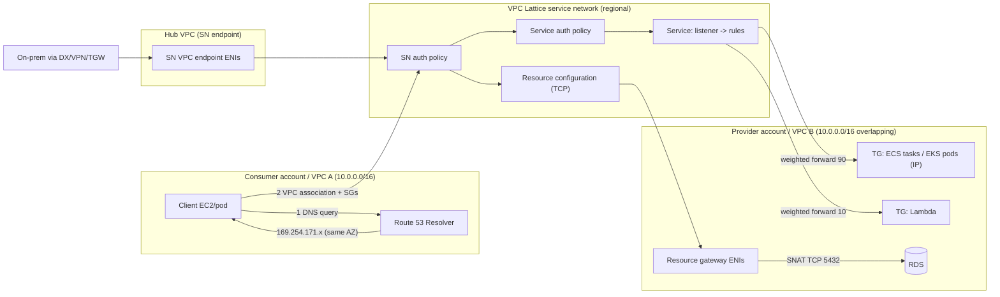
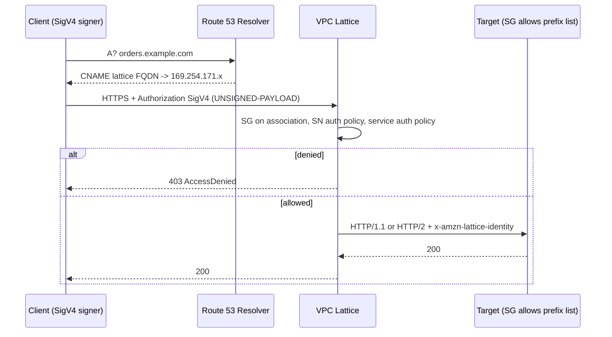

# G14 Service-to-Service Application Networking
> Last verified: 2026-10 · Audience: senior/staff DevOps, SRE, AI eng, NetEng, DevSecOps, architects

> **Neutralized term → vendor names.** "Service-to-service application network" = **Amazon VPC Lattice** (AWS). Azure has **no 1:1 product**. The nearest equivalents are a combination of **Azure Private Link Service + Private Endpoint** (L4 cross-VNet/tenant exposure), **Application Gateway for Containers** (managed L7 for AKS), **Azure Container Apps environments** (built-in Envoy service discovery), **Azure API Management** (L7 policy/authZ) and the **Istio-based service mesh add-on for AKS**.

## TL;DR
- VPC Lattice is a **regional, fully managed L7 (plus TCP/TLS) application-networking layer**. It connects, authorizes and observes **services** (HTTP/HTTPS/gRPC/TLS) and **resources** (TCP, such as RDS, IPs, domain names) across VPCs and accounts, with **no peering, TGW, route tables or sidecars**.
- Building blocks: the **service network** (logical boundary), the **service** (listener → rules → target groups), the **resource configuration** with its **resource gateway** (Dec 2024, TCP only), **auth policies** (IAM, SigV4/SigV4A) and the **service directory**.
- A VPC connects to a service network in one of two ways. A **VPC association** allows only 1 per VPC, uses link-local/non-routable IPs from the managed prefix list, and is reachable only from inside that VPC. A **service network VPC endpoint** (PrivateLink-powered) allows many per VPC, uses VPC IPs, and is reachable over **peering, TGW, DX and VPN** (on-prem).
- Traffic flow: the client resolves the service FQDN via Route 53 Resolver and gets a **169.254.171.0/24** address. The packet is intercepted by the VPC/Nitro data plane and proxied by Lattice to the target. Targets must allow ingress from the **`com.amazonaws.<region>.vpc-lattice` prefix list**. **Overlapping CIDRs work** because nothing routes VPC-to-VPC.
- Security has four layers: (1) association or endpoint exists, (2) **security groups** on the association or endpoint, (3) **service-network auth policy** (coarse), (4) **service auth policy** (fine). All IAM must explicitly allow, and an explicit deny wins. Auth policies **do not apply to resource configurations**.
- Custom domains: you get one immutable custom domain per service plus a **BYOC ACM cert** (there is no fallback cert). Route 53 **alias/CNAME** points to `…vpc-lattice-svcs.<region>.on.aws`. For resources, Lattice can **auto-provision private hosted zones** in consumer VPCs, with consumers choosing a private DNS preference.
- Cross-account sharing uses **AWS RAM** (services, service networks, resource configurations). Pricing is per **service-hour, GB and request** (us-east-1: $0.025/h, $0.025/GB, first 300k req/h free). Resources cost $0.10/h plus tiered $/GB. VPC associations and SN endpoints add **no extra charge**. There are **no inter-AZ data charges**.
- Key limits: **1 SN per VPC via association**, **10 Gbps and 10k RPS per service per AZ** (soft), **MTU 8500**, idle timeout 60 s (60–600 s) and **max connection lifetime 10 min** for services, **350 s idle** for resources. There are **no WebSockets natively** (use a TLS listener or a resource).

## G14.1 Introduction
- **How it works:**
  - **Problem solved:** microservices are spread over many VPCs and accounts, often with overlapping CIDRs and mixed compute (EC2, ECS, EKS, Lambda). The traditional fix is TGW or peering plus internal ALBs plus a mesh (sidecars, mTLS CA). Lattice collapses connectivity, L7 routing, authZ and observability into one **managed proxy fleet** that lives in the VPC data plane.
  - **Role split (org design matters in interviews):** the **service network owner** (platform or network team) creates and shares the SN, associates VPCs, and sets coarse auth policy and SGs. The **service owner** (app team) creates the service, listeners, rules and TGs, and sets fine-grained auth. The **resource owner** creates the resource gateway and resource config.
  - Timeline: preview at re:Invent 2022, **GA 31 Mar 2023**. **TLS passthrough** arrived May 2024. **Resource configurations/gateways (TCP resources across VPCs/accounts)** arrived **Dec 2024**. Dual-stack management APIs came Apr 2025, Oracle Database@AWS support Jun 2025, and configurable resource-gateway IPs Oct 2025.
  - Management surfaces: console, CLI/SDK, CloudFormation/Terraform, and the **AWS Gateway API Controller** for EKS (Kubernetes Gateway API → Lattice).
- **Trade-offs / when to use:**
  - **Use it** for many teams and accounts, east-west HTTP/gRPC, IAM-native authZ, mixed compute, overlapping CIDRs, and avoiding sidecar ops. It also fits migrations: put an ALB or legacy fleet behind Lattice as a target and shift weights.
  - **Avoid it or complement it** in these cases: north-south internet ingress (it is private only, so use ALB/CloudFront/API GW), non-TCP/UDP app traffic, **cross-region** (Lattice is regional, so you need an ALB/NLB or TGW bridge or a per-region SN; unverified that any native cross-region feature exists), very high per-service throughput above the soft quotas, long-lived connections over 10 min, and native WebSockets.
  - Compared with a mesh: Lattice has **no in-cluster sidecars** and works for non-K8s compute too. A mesh gives richer L7 features (retries, circuit breaking, fault injection, mTLS SPIFFE identity, intra-cluster pod-to-pod without leaving the node).
- **Interview angles:**
  - "How do 300 VPCs in 40 accounts with overlapping 10.0.0.0/16 talk?" → Lattice SN shared via RAM plus VPC associations. **No routing needed**, so overlap is irrelevant. For TCP DBs, use resource configs.
  - "Lattice vs PrivateLink?" → **PrivateLink** is a **1:1 provider→consumer L4** exposure (NLB/GWLB-backed endpoint service, or resource endpoints since 2024). **Lattice** is **many-to-many L7** with routing rules, weighted TGs and IAM authZ per request. Service network endpoints actually **use PrivateLink** to reach an SN.
  - "Lattice vs Transit Gateway?" → TGW is **L3 any-to-any routing**: it needs non-overlapping CIDRs, route tables and SGs/NACLs and has no identity. Lattice is **app-layer, identity-aware and service-scoped**. Many orgs run both.

## G14.2 Components: service network, service, resource
### Service network
- **How it works:** a logical boundary (an "application-layer VPC") grouping **services and resource configurations**. Clients in connected VPCs can reach any associated service or resource **if authorized**. It carries an **auth type** (`NONE` or `AWS_IAM`) plus auth policy, and access logs (CloudWatch Logs, Firehose, S3). Quotas: **50 SNs/region**, **500 service associations/SN**, **500 VPC associations/SN**, **200 SN endpoints/SN**, **500 resource configs/SN** (all soft).
- **Patterns:** one SN per environment (prod/non-prod), per domain/BU, or per trust zone. A service can be associated with **multiple SNs**, so the same service can be exposed to prod and shared-services SNs.

### Service
- **How it works:** a unit of software with a generated FQDN `<name>-<id>.<partition>.vpc-lattice-svcs.<region>.on.aws`, an optional custom domain, an auth type, and **listeners → rules → target groups**.
  - **Listener:** protocols **HTTP, HTTPS, TLS (passthrough)**, ports 1–65535, **2 listeners/service** (soft). HTTPS uses a Lattice-managed cert for the generated FQDN, or BYOC for a custom domain. ALPN selects **HTTP/1.1 or HTTP/2**. Listener and target protocols don't have to match, because Lattice up- and downgrades.
  - **Rules:** priority **1–100**, evaluated lowest first, with a default rule (no conditions) evaluated last. Conditions are **path** (exact/prefix, no wildcards, ≤200 chars), **header** (exact/prefix/contains) and **method** (exact). Actions are **forward** (≤ multiple TGs, **weight 0–999** each for canary/blue-green) or **fixed-response** (e.g. 404/500). **10 rules/listener** (soft).
  - **Target group:** types **INSTANCE, IP, LAMBDA, ALB**. ECS tasks register via the IP type with native ECS integration. EKS pods register via the **Gateway API Controller** (IP). TG protocols are **HTTP, HTTPS, TCP**, and **TCP TGs work only with TLS listeners** (INSTANCE/IP/ALB only). Protocol versions are **HTTP1** (default), **HTTP2** and **gRPC** (HTTPS listener, INSTANCE/IP only, no Lambda). Default algorithm is **round robin**, with **fail-open when all targets are unhealthy**. Limits: **10 TGs/service**, **1,000 targets/TG**, **500 TGs/region**. The TG must be in the **same account as the service**.
  - **Target specifics:** IP targets must come from the TG's VPC subnets and can't be public IPs or VPC endpoints (use an ALB TG for out-of-VPC IPs). A LAMBDA TG takes **one function** and supports event structure versions V1/V2. An ALB TG takes **one internal ALB**, which can be a target of ≤2 Lattice services, and the ALB needs a listener on the TG port. HTTPS to targets **does not validate target certs**, so self-signed certs are fine. Lattice states that traffic is authenticated at the packet level.
  - **Headers to targets:** `x-forwarded-for/port/proto`, plus identity headers that **can't be spoofed** (stripped on ingress): `x-amzn-lattice-identity` (Principal, PrincipalOrgID, SessionName, Roles Anywhere X.509 fields), `x-amzn-lattice-identity-tags`, `x-amzn-lattice-network` (SourceVpcArn) and `x-amzn-lattice-target`. Apps can do **authZ on caller identity without parsing JWTs**.

### Resource (resource configuration + resource gateway), Dec 2024
- **How it works:**
  - A **resource gateway** is a set of ENIs in the provider VPC (multi-AZ subnets with SGs) that acts as the ingress point. The resource sees traffic **sourced from the resource gateway IPs** (SNAT). The gateway's SG outbound rules control what it can reach (e.g. TCP 3306 to the DB CIDR). Since Oct 2025 you can set the number of IPv4 addresses per ENI. **500 resource gateways/VPC**.
  - A **resource configuration** is the logical object for what to expose. Types: **single** (an IP or domain name), **group** with **child** members (≤60 children, soft), **ARN** (AWS-provisioned resource; **only RDS** is supported, and not publicly accessible clusters), and **CIDR** (a list of CIDRs; TCP for app traffic and UDP only for DNS; reachable **only via tunnel endpoints**, not service networks). **Protocol is TCP only**, with defined **port ranges**. Domain targets in a private zone need gateway DNS resolution **IN_VPC**, domains resolving outside the VPC need a NAT GW, and public IPv6 domain targets aren't supported. IP targets must be RFC1918 or 100.64/10.
  - **Consumer access paths:** (1) a **resource endpoint** (PrivateLink VPC endpoint of type *resource*, no SN), (2) a **tunnel endpoint** (CIDR configs), (3) a **service network endpoint**, or (4) a **service network VPC association**. With a VPC association, each resource gets **one IP per subnet from 129.224.0.0/17** (AWS-owned, non-routable), which is added to VPC route tables.
  - **Auth policies don't apply** to resource configurations, so control access with RAM sharing, SN membership, SGs and the DB's own auth.
  - **Transitive-sharing guard:** a provider can **forbid association with shareable service networks**, so consumer B can't re-share to C.
- **Trade-offs:** this replaces "NLB + endpoint service" for exposing DBs, Kafka, caches or on-prem IPs to other accounts. You need no NLB and it is many-to-many via an SN. The cost is TCP only, no per-request authZ, a 350 s idle timeout (use TCP keepalives) and SNAT hiding the client IP.

- **Interview angles:**
  - "Expose an RDS in account A to 50 consumer accounts without NLB or peering" → resource gateway plus an **ARN resource config** shared by RAM. Consumers reach it via a resource endpoint or via their SN. Private DNS is auto-provisioned.
  - "Why didn't my Lambda TG get gRPC?" → gRPC needs an HTTPS listener and INSTANCE/IP targets.
  - Pitfall: **"all targets unhealthy" → fail-open**. Health checks don't protect you from a bad deploy, so use weighted rollout.

## G14.3 Network associations
- **How it works:**
  - **Service ↔ SN association** (and **resource config ↔ SN**) makes the service or resource discoverable and reachable from consumers connected to that SN. Either the SN owner or the service owner can create it, given access (RAM share plus IAM). The resource association carries a **private-DNS-enabled flag that overrides** the endpoint or VPC-association setting.
  - **SN ↔ VPC association:** at most **1 SN per VPC**, with **≤5 SGs** on the association (you can't remove all SGs: delete and re-create instead). Clients are **only resources inside that VPC**, so traffic arriving via **peering, TGW, DX or VPN can't use it**. It uses link-local or non-routable addresses (managed prefix list). The **VPC association is what makes a VPC a client VPC**. Target VPCs don't need it unless their targets also call other services.
  - **SN VPC endpoint** (VPC endpoint of type *service network*, PrivateLink-powered): **multiple per VPC** (one VPC → many SNs). ENIs with **VPC-owned IPs** are placed in chosen subnets with SGs. It is reachable **from peered or TGW VPCs, on-prem over DX/VPN**, and from Windows/macOS clients that can't route link-local. It supports private DNS.
  - **Direction semantics:** a VPC with only target-side presence is ingress-only. A VPC that is associated but hosts no services is egress-only (clients). A VPC that is associated and hosts targets is both.
- **Trade-offs / when to use:**

| Aspect | SN VPC association | SN VPC endpoint |
|---|---|---|
| SNs per VPC | 1 | Many |
| Addresses used | Link-local 169.254.171.0/24 + non-routable (prefix list) | VPC subnet IPs (ENIs) |
| Reachable from peering/TGW/DX/VPN | No | **Yes** |
| Security control | ≤5 SGs on association | SGs on endpoint ENIs |
| Cost | No extra charge | No extra charge (pricing page) |
| Typical use | In-VPC workloads, simplest | Hub/shared-services, on-prem clients, multiple SNs |

- **Interview angles:**
  - "On-prem needs to call a Lattice service" → create a **SN endpoint in a hub VPC** reachable over DX/VPN/TGW and use an R53 inbound resolver endpoint for DNS. A VPC association won't work.
  - "VPC must consume two SNs (prod-shared plus partner)" → use one association plus one or more SN endpoints, or all endpoints.
  - Pitfall: removing a VPC association instantly breaks every client in that VPC.

## G14.4 Traffic flow
- **How it works (VPC association path):**
  1. The client resolves `svc.example.com` → CNAME/alias → Lattice FQDN. **Route 53 Resolver** returns a **link-local IP from 169.254.171.0/24** (IPv6 from the `com.amazonaws.<region>.ipv6.vpc-lattice` list, believed to be `fd00:ec2:80::/64`, unverified). **AZ affinity** means the answer is the same-AZ address when healthy.
  2. The client sends the packet to that address. The client SG **egress** must allow the listener port to the prefix list (default allow-all egress is fine). There is **no route table entry** needed for services: the VPC/Nitro data plane intercepts link-local traffic and hands it to Lattice. The **association SGs** are evaluated as ingress to the SN.
  3. Lattice terminates the connection (except TLS passthrough). It evaluates the **SN auth policy**, then the **service auth policy** (SigV4 check if signed), then **listener rules**, and picks a TG and a target (round robin).
  4. Lattice opens a new connection to the target **from prefix-list addresses**. The target SG must allow **ingress from the `com.amazonaws.<region>.vpc-lattice` prefix list** on the target and health-check ports. You **can't reference the client SG** because the source is Lattice. Return traffic follows the same proxied path.
- **SN endpoint path:** the client resolves to **endpoint ENI IPs** (VPC-routable). Peering/TGW/on-prem clients route to those ENIs, then Lattice takes over as above.
- **Resource path:** consumer → link-local or 129.224.0.0/17 (association) or endpoint ENI → Lattice → **resource gateway ENIs (SNAT)** → resource IP/port.
- **Why overlapping CIDRs work:** consumer and provider VPCs never exchange routes. Each side only talks to Lattice-owned or link-local addresses, and Lattice proxies at L4/L7.
- **Numbers to remember:** **10 Gbps/service/AZ** and **10k RPS/service/AZ** (raise via SA/TAM). **MTU 8500**. HTTP/gRPC/TLS **idle 60 s** (configurable 60–600 s per service via `idleTimeoutSeconds`), **max connection lifetime 10 min**. Resources have **350 s idle** and no lifetime cap. Unsupported AZ IDs include `use1-az3`, `usw1-az2`, `apne1-az3`, `euw1-az4`, `cac1-az3` and `ilc1-az2`.
- **Trade-offs:** you get no IP-level visibility of the true client at the target (use `x-forwarded-for` and identity headers), and target SGs open to the whole regional prefix list (rely on auth policy for identity). Windows/macOS clients **need a static route** for 169.254.171.0/24 to their primary IP, so prefer an SN endpoint.
- **Interview angles:**
  - "Service unreachable after association" → check, in order: DNS returns 169.254.171.x? → client SG egress → association SG ingress on the listener port → auth policy (403 = authZ) → target SG allows the prefix list → health checks → client in an unsupported AZ ID?
  - "Why does a gRPC stream drop at 10 min?" → max connection lifetime. Design client reconnects.
  - "Does Lattice need NAT/IGW?" → no for services. A resource gateway with a domain target that resolves outside the VPC needs a NAT GW.





## G14.5 Service access with custom domain name
- **How it works:**
  - Every service gets a generated FQDN `name-id.xxxx.vpc-lattice-svcs.<region>.on.aws`. A custom domain (e.g. `parking.example.com`) is set **at service creation**. It is **one per service**, **immutable**, and **unique within a SN**.
  - **HTTPS with a custom domain needs a BYOC ACM certificate.** There's **no default fallback cert**, so without one HTTPS to the custom name fails (SNI mismatch). For the generated FQDN, Lattice manages the cert.
  - **DNS:** create a Route 53 **private or public hosted zone** record that maps the custom name to the Lattice FQDN. Use an **alias A/AAAA record** (works at the zone apex, recommended) or a CNAME. The private hosted zone must be associated with each **client VPC**. Cross-account clients need a PHZ association (cross-account authorization) or a shared Route 53 Profile. Without the mapping, the custom domain won't work.
  - **TLS passthrough listener (May 2024):** Lattice routes on **SNI** and doesn't terminate TLS, so the app holds the cert (end-to-end/mTLS). No L7 rules or auth policies are possible, because it can't see HTTP.
  - **Resources:** providers attach a **custom domain to a resource configuration**, with optional **domain verification** (5 verifications/region, soft). Consumers set **private-DNS preference**: `VERIFIED_DOMAINS_ONLY` (default, recommended), `ALL_DOMAINS`, `VERIFIED_DOMAINS_AND_SPECIFIED_DOMAINS` or `SPECIFIED_DOMAINS_ONLY`. Lattice then **auto-creates PHZs** in consumer VPCs. ARN configs (RDS) always get PHZs, except when the gateway is in the same VPC. The private-DNS flag is immutable.
- **Trade-offs:** custom domains let clients keep stable names across migration (ALB → Lattice). Auto-PHZ for resources is convenient but **hijacks resolution** for that domain in the VPC, which is why the default is verified-only. A malicious provider can't claim `*.yourbank.com` in your VPC.
- **Interview angles:**
  - "Migrate from internal ALB to Lattice without client changes" → create the Lattice service with the same custom domain and a BYOC cert, register the ALB as an **ALB-type TG**, then flip the R53 alias. Later, shift weights to native TGs.
  - "HTTPS to custom domain fails, HTTP works" → missing or mismatched ACM cert. Lattice won't serve the generated cert for a custom name.
  - Follow-up: "Who owns the PHZ?" → the network/DNS team, typically centrally with Route 53 Profiles or RAM-shared resolver rules. See [G3 Network DNS and DHCP](G3-network-dns-and-dhcp.md).

## G14.6 Features: good to know
- **Auth policies (IAM):**
  - JSON IAM resource policy, **≤10 KB**, one per SN and one per service. Action is `vpc-lattice-svcs:Invoke`. Resource is `serviceARN/path` (gRPC: `serviceARN/package.Service/Method`).
  - Condition keys: `vpc-lattice-svcs:SourceVpc`, `SourceVpcOwnerAccount`, `ServiceNetworkArn`, `ServiceArn`, `Port`, `RequestMethod` (always POST for gRPC), `RequestPath`, `RequestHeader/<name>` and `RequestQueryString/<key>` (not gRPC). Global keys also work: `aws:PrincipalOrgID`, `aws:PrincipalTag/*`, `aws:ResourceTag/*` and `aws:PrincipalType` (e.g. deny `Anonymous`).
  - Evaluation: **implicit deny when auth type is AWS_IAM** and you need an explicit allow at **each enabled layer** (caller identity policy if signed, SN policy, then service policy). An explicit deny anywhere wins. Setting `AWS_IAM` without a policy means **everything is denied**.
  - **Clients sign with SigV4/SigV4A**, service name `vpc-lattice-svcs`. **Payload signing is unsupported**, so send `x-amz-content-sha256: UNSIGNED-PAYLOAD`. Any signed request is authenticated, and a bad signature fails even if the policy allows anonymous access. Credentials come from instance profiles, ECS task roles, **EKS Pod Identity**/IRSA, Lambda roles or **IAM Roles Anywhere** (X.509 for on-prem).
  - Common pattern: the SN policy is coarse (`aws:PrincipalOrgID` = org, or "authenticated only"), and the service policy is fine (role X may GET `/rates`).
- **Cross-account via AWS RAM:** share **service networks** (consumer accounts associate their VPCs), **services** (SN owner associates them), and **resource configurations**. TGs aren't shareable (they must be in the service's account). **Shared VPC** participants can create TGs in shared subnets (Jul 2023). The **service directory** lists your own services plus shared ones.
- **Kubernetes:** **AWS Gateway API Controller**: `GatewayClass amazon-vpc-lattice`, **Gateway → SN**, **HTTPRoute/GRPCRoute/TLSRoute → Lattice service**, **ServiceExport/ServiceImport** for multi-cluster/multi-account, and policies `TargetGroupPolicy`, `IAMAuthPolicy`, `AccessLogPolicy` and `VpcAssociationPolicy`. It gives **multi-cluster east-west without a mesh or flat network**. ECS has native Lattice TG registration.
- **Observability:** CloudWatch metrics go to the service owner. **Access logs** (CloudWatch Logs, S3, Firehose) are available at the SN level (SN owner sees all consumers' requests), service level and resource-config level. Logs include caller principal, source VPC, TG and response code, which is useful for zero-trust audits.
- **Reliability:** multi-AZ by design with **AZ affinity** (same-AZ IP answered first). **No inter-AZ data transfer charges** on Lattice hops, unlike ALB cross-zone or plain cross-AZ traffic. Weighted TGs are good for canary and blue-green deployments.
- **Pricing shape (us-east-1):**

| Dimension | Price |
|---|---|
| Service-hour | $0.025/service/h |
| Data processed (services) | $0.025/GB |
| HTTP requests / TLS connections | first **300k/h free**, then $0.10 per 1M |
| Resource configuration | $0.10/resource/h (charged to the SN owner for associated configs) |
| Resource data | $0.01/GB first 1 PB → $0.006 → $0.004 |
| VPC associations / SN endpoints | no additional cost |

  - Rough math: 100 services cost about 100 × 0.025 × 730 ≈ **$1,825/mo** before data. For chatty high-RPS east-west traffic, compare against an in-cluster mesh (CPU/memory cost) or TGW ($/attachment-h plus $0.02/GB).
- **Limitations to name:** regional only; no native WebSockets; no request/response header rewrite; limited retries and circuit breaking compared with Envoy (unverified for any 2026 additions); 2 listeners/service; 10 rules/listener (soft); HTTP/2 to targets doesn't support target-side streaming; auth policies not available for TLS passthrough or resources.
- **Interview angles:**
  - "Zero trust east-west on AWS without a mesh?" → Lattice with `AWS_IAM` on SN and services, SigV4 from workload roles, org-scoped SN policy, per-route service policy, target SGs locked to the prefix list, and SN access logs to S3/Athena. Map to [L7 Zero trust & workload identity](../L-data-privacy-ai-security/L7-zero-trust-workload-identity.md).
  - "Lattice vs App Mesh?" → **AWS App Mesh reached end of support on 30 Sep 2026** (announced 2024). AWS points users to **ECS Service Connect** (ECS) or **Lattice** (unverified exact wording; the EOS date was widely announced).
  - "Lattice vs ECS Service Connect?" → Service Connect is an ECS-only, Envoy-sidecar namespace (Cloud Map). Lattice is cross-compute, cross-VPC and cross-account.

## Cloud mapping: AWS vs Azure
| Capability | AWS | Azure | Role it plays | Key differences | Alternatives |
|---|---|---|---|---|---|
| App-layer service network across VNets/accounts | **VPC Lattice service network** | **No 1:1.** Closest: **Container Apps environment** (intra-env), **Istio AKS add-on** (intra-cluster), **APIM** (gateway pattern) | Logical boundary for service discovery + authZ | Lattice spans VPCs/accounts with no routing. Azure needs VNet peering/vWAN or Private Link per service | Istio multi-cluster, Cilium ClusterMesh, Consul (Cloud Map + mesh), Cloudflare Mesh/Tunnel |
| Service with L7 listeners/rules/weighted backends | **Lattice service + listener + rules + TGs** | **App Gateway for Containers** (AKS, Gateway API) / **Container Apps ingress** (revisions split) / **APIM API** | Routing, canary, health checks | AGC is ingress-oriented (ports 80/443 only) and runs per cluster. Lattice is east-west across accounts | Envoy/Istio VirtualService, Linkerd, NGINX Gateway Fabric |
| K8s Gateway API integration | **AWS Gateway API Controller** (Gateway=SN, Route=service) | **ALB Controller for AGC** (Gateway API v1.5); Istio add-on (Gateway API not yet GA on add-on) | K8s-native config of managed L7 | Lattice controller is east-west + multi-cluster (ServiceExport/Import); AGC is north-south | Istio/Cilium Gateway API, GKE multi-cluster Gateway |
| Expose TCP resource (DB/IP/FQDN) cross-VPC/account | **Resource config + resource gateway** (or PrivateLink resource endpoint) | **Private Link Service** (Standard LB frontend; **PLS Direct Connect** preview = any private IP, no LB) + **Private Endpoint**; PaaS DBs: native private endpoints | Unidirectional private L4 exposure with SNAT | Lattice: many-to-many via SN, no NLB. PLS: 1 service to N endpoints, approval workflow, ≤8 NAT IPs, ~300 s idle | Cloudflare Tunnel, Tailscale, Consul terminating gateway |
| Consumer attachment | **SN VPC association** / **SN VPC endpoint** | **Private Endpoint** (NIC with VNet IP) | Connect a client network | Lattice association uses link-local, so no IP consumption. PE uses VNet IPs (like SN endpoint) | — |
| Identity-based per-request authZ | **Auth policies (IAM, SigV4/SigV4A)** | **Entra ID tokens**: APIM `validate-jwt`, Container Apps Easy Auth, Istio `AuthorizationPolicy` + `RequestAuthentication`; mTLS in Container Apps env | Zero-trust east-west | AWS: signed request, enforced in network fabric. Azure: bearer JWT validated by gateway/sidecar | SPIFFE/SPIRE, OPA/Envoy ext_authz |
| Provider-side source filtering | **Managed prefix list `com.amazonaws.<region>.vpc-lattice`** | NSG with PLS **NAT IP** subnet / service tags | Lock targets to only the fabric | Lattice addresses are link-local/non-routable. PLS SNATs to provider-subnet IPs | — |
| Client identity propagation | `x-amzn-lattice-identity`, `x-amzn-lattice-network` headers | PLS **Proxy Protocol v2** with LinkID TLV; APIM/AGC forward headers | Know who called | Lattice gives IAM principal; PLS gives only endpoint LinkID + source IP | — |
| Cross-account/tenant sharing | **AWS RAM** | **Azure RBAC** + PLS visibility/auto-approval (cross-tenant) | Multi-account ownership | RAM is org-aware. PLS uses subscription allow-lists + manual/auto approval | — |
| Custom domain + private DNS | **Route 53** alias/CNAME, PHZ; auto-PHZ for resources | **Azure Private DNS zones** (privatelink.* zones), Container Apps custom domains | Friendly names | Lattice auto-provisions PHZ for resource configs; Azure needs private DNS zone groups on PEs | Cloudflare DNS |
| Observability | Lattice access logs + CloudWatch | AGC/APIM diagnostics, Container Apps logs, Istio + Azure Monitor managed Prometheus | Per-request logs | Lattice logs at SN level cover all consumers centrally | OpenTelemetry, Kiali |

- **VPC Lattice (AWS):** regional managed proxy fabric. It is the only hyperscaler product that does cross-VPC, cross-account L7 routing plus IAM authZ with **no network-level connectivity** between VPCs. Pricing is per service-hour, GB and request.
- **Azure Private Link Service + Private Endpoint:** the closest **L4** equivalent to Lattice resources and SN endpoints. PLS requires a **Standard Load Balancer** frontend (NIC-based backend pool), is **IPv4 only**, **TCP/UDP**, **~5 min idle timeout**, and **≤8 NAT IPs**. It supports cross-tenant use via alias, visibility and approval. **PLS Direct Connect** (public preview 2026) targets any private IP without an LB, which is analogous to a Lattice IP resource config. It has no L7 routing and no per-request identity.
- **Application Gateway for Containers:** Azure-managed L7 data plane outside the AKS cluster, configured via **ALB Controller** (Gateway API v1.5 and Ingress). It offers traffic splitting, mTLS (frontend/backend/end-to-end), WAF, header/URL rewrite, WebSockets, SSE and inference-gateway routing. Listener ports are **80/443 only**. It is ingress-oriented, not a cross-VNet service directory.
- **Azure Container Apps environment:** the closest *developer experience* match. Apps in one environment discover each other by name via **Envoy**, with optional **mTLS peer encryption** and **Dapr service invocation**. It is internal or external, needs a /27 subnet (workload profiles), and offers revision traffic splitting. The boundary is one environment in one VNet. Cross-environment or cross-VNet access needs Private Endpoints or an internal LB plus peering.
- **Azure API Management:** an L7 policy gateway (validate-jwt with Entra ID, rate limits, transforms) in internal VNet mode. It is often used as the "service network" for east-west APIs across VNets. It is a hop, and with dedicated tiers it is costly. Workspaces/gateways can federate teams.
- **Istio-based service mesh add-on for AKS:** Microsoft-managed **Istio** control plane (revisions, user-triggered canary upgrades, internal/external ingress gateways, Prometheus/Grafana integration). As of the 2026-09 docs it has **no ambient mode, no multi-cluster and no Gateway API for mesh (GAMMA)**, ProxyConfig/WasmPlugin are blocked, and there is **no auto-upgrade**. Use it for intra-cluster mTLS and L7 policy, but it does not replace cross-VNet connectivity.
- **Key AWS-vs-Azure differences:** Lattice decouples **connectivity from routing** (overlapping CIDRs are fine). Azure solutions generally still need L3 reachability (peering/vWAN) or per-service Private Link. Lattice authZ is **IAM SigV4 enforced by the fabric**, while Azure relies on **Entra ID JWTs validated by a gateway or sidecar**. Lattice scope is **regional**. AGC/Container Apps/APIM are also regional, and APIM premium supports multi-region.
- **Alternatives (cloud-agnostic):** **Istio** (sidecar or ambient, multi-cluster), **Linkerd** (Rust micro-proxy, simple mTLS), **Cilium** service mesh / **ClusterMesh** (eBPF, sidecarless, multi-cluster), **HashiCorp Consul** (service discovery plus mesh gateways across clouds and VMs), **Cloudflare** (Tunnel + Zero Trust / WARP-to-Tunnel for private service access across clouds), and on GCP the canonical analogue **Cloud Service Mesh** / **Private Service Connect**.

## Hands-on (optional)
```bash
# Create SN with IAM auth, a service, an IP TG, listener; associate VPC + service
SN=$(aws vpc-lattice create-service-network --name prod-sn --auth-type AWS_IAM --query id --output text)
SVC=$(aws vpc-lattice create-service --name orders --auth-type AWS_IAM \
  --custom-domain-name orders.internal.example.com \
  --certificate-arn arn:aws:acm:us-east-1:111122223333:certificate/abc --query id --output text)
TG=$(aws vpc-lattice create-target-group --name orders-ip --type IP \
  --config '{"port":8080,"protocol":"HTTP","vpcIdentifier":"vpc-0prov","protocolVersion":"HTTP1"}' --query id --output text)
aws vpc-lattice register-targets --target-group-identifier "$TG" --targets id=10.0.1.10,port=8080
aws vpc-lattice create-listener --service-identifier "$SVC" --name https --protocol HTTPS --port 443 \
  --default-action "{\"forward\":{\"targetGroups\":[{\"targetGroupIdentifier\":\"$TG\",\"weight\":100}]}}"
aws vpc-lattice create-service-network-service-association --service-network-identifier "$SN" --service-identifier "$SVC"
aws vpc-lattice create-service-network-vpc-association --service-network-identifier "$SN" \
  --vpc-identifier vpc-0client --security-group-ids sg-0assoc
# Org-scoped SN policy (no newlines allowed in policy JSON)
aws vpc-lattice put-auth-policy --resource-identifier "$SN" \
  --policy '{"Version":"2012-10-17","Statement":[{"Effect":"Allow","Principal":"*","Action":"vpc-lattice-svcs:Invoke","Resource":"*","Condition":{"StringEquals":{"aws:PrincipalOrgID":"o-abc123"}}}]}'
# Target SG: allow only Lattice fabric
PL=$(aws ec2 describe-managed-prefix-lists --filters Name=prefix-list-name,Values=com.amazonaws.us-east-1.vpc-lattice --query 'PrefixLists[0].PrefixListId' --output text)
aws ec2 authorize-security-group-ingress --group-id sg-0target \
  --ip-permissions "IpProtocol=tcp,FromPort=8080,ToPort=8080,PrefixListIds=[{PrefixListId=$PL}]"
```

```hcl
# Share the service network to another account via RAM
resource "aws_vpclattice_service_network" "prod" {
  name      = "prod-sn"
  auth_type = "AWS_IAM"
}
resource "aws_ram_resource_share" "sn" {
  name                      = "prod-sn-share"
  allow_external_principals = false
}
resource "aws_ram_resource_association" "sn" {
  resource_arn       = aws_vpclattice_service_network.prod.arn
  resource_share_arn = aws_ram_resource_share.sn.arn
}
resource "aws_ram_principal_association" "consumer" {
  principal          = "444455556666"
  resource_share_arn = aws_ram_resource_share.sn.arn
}
```

## Cross-links
- [G6 Private connectivity & peering](G6-private-connectivity-peering.md): why Lattice avoids peering and overlap issues
- [G7 Service endpoints & Private Link](G7-service-endpoints-private-link.md): PrivateLink endpoint services, resource endpoints, Azure Private Link Service
- [G8 Transit hub](G8-transit-hub.md): TGW / Virtual WAN, which you combine with SN endpoints for on-prem
- [G3 Network DNS and DHCP](G3-network-dns-and-dhcp.md): Route 53 PHZ, resolver endpoints, Azure Private DNS
- [G1 Virtual network fundamentals](G1-virtual-network-fundamentals.md): SGs, NACLs, prefix lists (firewalls overlap: G1.7, G1.8)
- [G15 Additional course topics](G15-additional-course-topics.md): load balancers, Kubernetes networking (G15.1, G15.4)
- L4 vs L7 proxies: [D1 System design basics](../D-system-design/D1-system-design-basics.md), [H6 Web application architecture](../H-full-stack-troubleshooting/H6-web-application-architecture.md)
- [C4 Security](../C-large-scale-architecture/C4-security.md) and [L7 Zero trust & workload identity](../L-data-privacy-ai-security/L7-zero-trust-workload-identity.md): SigV4/IAM vs mTLS/SPIFFE identity
- [H4 TLS](../H-full-stack-troubleshooting/H4-transport-layer-security.md): TLS passthrough, SNI, BYOC certs

## Sources
- https://docs.aws.amazon.com/vpc-lattice/latest/ug/what-is-vpc-lattice.html
- https://docs.aws.amazon.com/vpc-lattice/latest/ug/how-it-works.html
- https://docs.aws.amazon.com/vpc-lattice/latest/ug/service-network-associations.html
- https://docs.aws.amazon.com/vpc-lattice/latest/ug/security-groups.html
- https://docs.aws.amazon.com/vpc-lattice/latest/ug/quotas.html
- https://docs.aws.amazon.com/vpc-lattice/latest/ug/service-custom-domain-name.html
- https://docs.aws.amazon.com/vpc-lattice/latest/ug/auth-policies.html
- https://docs.aws.amazon.com/vpc-lattice/latest/ug/sigv4-authenticated-requests.html
- https://docs.aws.amazon.com/vpc-lattice/latest/ug/listeners.html
- https://docs.aws.amazon.com/vpc-lattice/latest/ug/listener-rules.html
- https://docs.aws.amazon.com/vpc-lattice/latest/ug/target-groups.html
- https://docs.aws.amazon.com/vpc-lattice/latest/ug/http-targets.html
- https://docs.aws.amazon.com/vpc-lattice/latest/ug/resource-configuration.html
- https://docs.aws.amazon.com/vpc-lattice/latest/ug/doc-history.html
- https://aws.amazon.com/vpc/lattice/pricing/
- https://www.gateway-api-controller.eks.aws.dev/latest/
- https://learn.microsoft.com/en-us/azure/private-link/private-link-service-overview
- https://learn.microsoft.com/en-us/azure/application-gateway/for-containers/overview
- https://learn.microsoft.com/en-us/azure/container-apps/networking
- https://learn.microsoft.com/en-us/azure/aks/istio-about
