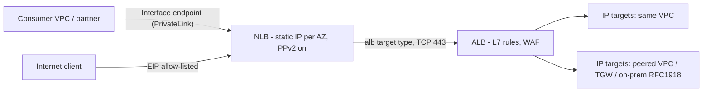
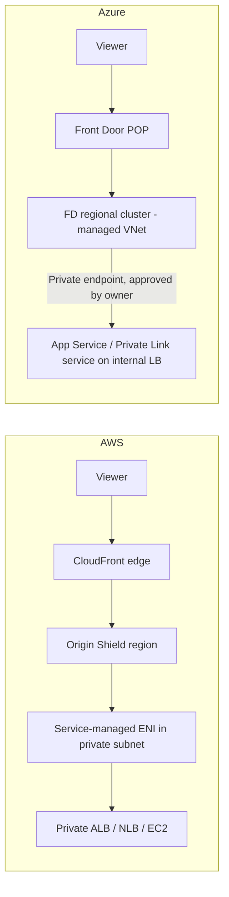
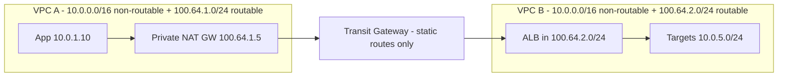
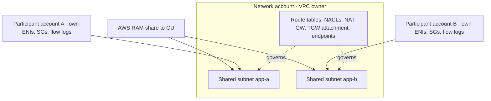

# G15 Additional course topics
> Last verified: 2026-10 · Audience: senior/staff DevOps, SRE, AI eng, NetEng, DevSecOps, architects

> **Data caveat:** the curriculum lists G15 as sections named in the course description whose lectures **could not be retrieved**. These notes are built from official AWS / Microsoft / Kubernetes docs and aimed at **ANS-C01 (AWS Advanced Networking Specialty)** and **AZ-700 (Azure Network Engineer)** depth. Every generic term is mapped to AWS **and** Azure.

## TL;DR
- **Load balancers are network devices first:** know cross-zone defaults (ALB on, NLB/GWLB off), client IP preservation rules (NLB keeps source IP unless `ip` target with TCP/TLS; through PrivateLink you need **Proxy Protocol v2**), static IPs (NLB 1 IP/AZ + optional EIP; ALB has none, so put **ALB behind NLB**), and Azure's split: **Standard LB** (L4, pass-through) / **Gateway LB** (VXLAN NVA insertion) / **App Gateway v2** (regional L7) / **App Gateway for Containers** (K8s L7) / **Front Door** (global L7 + CDN).
- **CDN networking = locking the origin down:** CloudFront **OAC** (S3), **VPC origins** (private ALB/NLB/EC2, no public origin at all), managed prefix list + custom header; Azure **Front Door Premium Private Link** origins (you approve a private endpoint) or `X-Azure-FDID` + `AzureFrontDoor.Backend` service tag.
- **Advanced DNS:** Route 53 routing policies + health checks (health checkers are public, so private endpoints use **CloudWatch-alarm health checks**); ARC for zonal shift/Region switch; Azure Traffic Manager / Front Door for global steering. Details in I1.
- **Kubernetes networking:** EKS VPC CNI gives pods **real VPC IPs** (ENI-limited max pods; fix with **prefix delegation** /28s, **custom networking** in 100.64/10, or **IPv6**); **security groups for pods** via trunk/branch ENIs. AKS default is **Azure CNI Overlay** (pods from a private pod CIDR, SNAT to node, 250 pods/node) with the **Cilium** data plane; kubenet retires **2028-03-31**.
- **Overlapping CIDRs:** AWS **private NAT gateway + TGW** (routable/non-routable split) or **PrivateLink** (consumer-to-provider only); Azure **Private Link service** (built-in NAT), VPN Gateway / vWAN **NAT rules**, or an SNAT NVA. Strategy: IPAM plus 100.64.0.0/10 for "non-routable" pod/workload space.
- **Security services:** Shield Standard (free, L3/L4) vs **Shield Advanced** (SRT, cost protection, WAF fees covered, org-wide subscription) ↔ Azure **DDoS Network Protection** (per 100 IPs, rapid response, cost protection, WAF discount) vs **DDoS IP Protection** (per IP, none of those extras). **AWS Firewall Manager** (Org-wide WAF/Shield/SG/NACL/Network Firewall/DNS Firewall policies) ↔ **Azure Firewall Manager** (Firewall Policy hierarchy, secured vHub, DDoS plan, WAF policy).
- **IPAM:** **VPC IPAM** (scopes → hierarchical pools with locale + allocation rules, Free vs Advanced tier, Org integration, BYOIP) ↔ **Azure Virtual Network Manager IPAM** (root/child pools up to 7 levels, IPv4+IPv6, static CIDR reservations, `IPAM Pool User` role).
- **Shared networks:** AWS **VPC subnet sharing via RAM**: the owner keeps routes, NACLs, gateways and TGW attachments, while participants own their ENIs, SGs and flow logs. **Azure has no cross-subscription subnet sharing** because a NIC must be in the same subscription as its VNet. Use hub-and-spoke (per-subscription spokes) and RBAC `subnets/join/action` within a subscription.

---

## G15.1 Networking aspects of load balancers

### How it works: AWS ELB family
| Property | ALB (L7) | NLB (L4) | GWLB (L3) |
|---|---|---|---|
| Cross-zone default | **On**, can't disable at LB level (can at target-group level) | **Off** (LB attribute or per target group) | **Off** |
| Static IP | No (IPs change; service-managed public IPv4 can come from your **IPAM pool**) | **1 IP per AZ**; internet-facing can bind **one EIP per subnet** (at creation) | Private only, reached via **GWLB endpoints** |
| Client IP to target | No, it's a proxy, so use `X-Forwarded-For` (`append` default) | Preserved by default for `instance` targets & UDP; **off by default for `ip` targets with TCP/TLS** | Packet unchanged, GENEVE-encapsulated |
| Security groups | Yes | Yes (must attach at creation to use; required for CloudFront VPC origin) | No |
| Idle timeout | 60 s default; client keepalive 3600 s | TCP 350 s default (60–6000 s configurable), TLS 350 s fixed, UDP 120 s fixed | 350 s TCP (unverified) |
| Targets | instance, ip, **lambda** | instance, ip, **alb** | instance, ip (appliances) |

- **ALB subnets:** ≥2 AZs, each subnet **≥ /27 with ≥ 8 free IPs**, or scaling fails (`active_impaired`, 5xx).
- **NLB `ip` targets** must come from the VPC's subnets or RFC1918/RFC6598 (`10/8, 172.16/12, 192.168/16, 100.64/10`), so peered VPCs, TGW-attached VPCs and on-prem over DX/VPN can all be targets. **No public IPs.** The same holds for **ALB IP targets across peering/TGW**. Instance-ID targets must be in the **same VPC**.
- **Client IP preservation off** → NLB SNATs to its own IP and has a limit of **~55,000 connections/min per (NLB IP, target IP:port)**. Exceed it and you get port-allocation errors; fix with more targets or `secondary_ips.auto_assigned.per_subnet` (0–7).
- **Hairpin/loopback pitfall:** with client IP preservation on, a target calling its *own* NLB can time out because source equals destination. Register by IP or disable preservation.
- **Proxy Protocol v2** (`proxy_protocol_v2.enabled`, default off) prepends a binary header with the original src/dst. It is **required to learn the client IP through PrivateLink** (the header carries a VPC endpoint ID TLV). The target must parse PPv2 or every connection breaks.
- **PrivateLink:** an **endpoint service** is fronted by an **NLB** (or GWLB). To publish an **HTTP app privately with static IPs**, use **NLB → `alb` target type → ALB**. This gives fixed IPs for firewall allow-lists, a PrivateLink exposure, and L7 routing (only TCP listener → ALB; IPv4 only).
- **NLB zonal DNS failover:** `dns_failover.minimum_healthy_targets` pulls an AZ's IP from DNS (TTL 60 s). **Zonal shift** via ARC is opt-in (`zonal_shift.config.enabled`).
- **GWLB:** bump-in-the-wire for firewalls/IDS. **GENEVE UDP 6081**, flow stickiness 5-tuple (default), 3-tuple or 2-tuple. Spokes route `0.0.0.0/0` (or IGW ingress routing) to a **GWLB endpoint** in a separate subnet. Appliances need a jumbo MTU (GWLB supports **8500 bytes**, unverified).

### How it works: Azure equivalents
- **Azure Load Balancer Standard** (Basic **retired 2025-09-30**). It is **pass-through L4**, so **source IP is preserved**. Frontends are **zone-redundant**, and the backend pool spans zones (no cross-zone toggle, unlike NLB). Public Standard IPs are **static**. It is **closed by default**: an NSG must allow traffic. It provides **HA ports** (all ports/protocols, used for NVAs), **outbound rules** (SNAT), floating IP (DSR), and a **Global tier** (cross-region LB, anycast front of regional LBs; formerly "cross-region LB").
- **Azure Gateway Load Balancer** ↔ GWLB. It uses **VXLAN** (internal and external tunnel interfaces) and **HA-ports rules only**. Instead of UDR next-hop, you **chain** it: a Standard public LB frontend or a VM NIC's Standard public IP references the GWLB frontend, and **you can't use a GWLB frontend as a UDR next hop**. It can chain across subscriptions/tenants (`frontendIPConfigurations/join/action`) and **doesn't work with the Global tier**.
- **Application Gateway v2** ↔ ALB (regional L7, WAF_v2, autoscaling, zone-redundant, dedicated subnet; /24 recommended). It adds `X-Forwarded-For`, and its backends can be any reachable IP/FQDN, including peered/on-prem.
- **Application Gateway for Containers (AGC)** ↔ AWS Load Balancer Controller + ALB. The managed L7 data plane runs **outside the cluster**, and the in-cluster **ALB Controller** translates **Gateway API (v1.5)** / Ingress. It needs a **delegated subnet**, supports mTLS, WAF, traffic splitting, gRPC, and an inference gateway. Successor to AGIC.
- **Azure Front Door (Std/Premium)** ↔ CloudFront + Global Accelerator + WAF. It is a global anycast L7 proxy (see G15.2).
- **Static anycast IPs:** AWS **Global Accelerator** (2 static anycast IPs, TCP/UDP, fronting NLB/ALB/EIP) ↔ Azure **Global-tier Load Balancer** (L4) or Front Door (L7, no static IP).

### Trade-offs / when to use
- Need fixed IPs or allow-listing → NLB with EIPs (or NLB→ALB). Need L7 + WAF → ALB / App Gateway. Need inline NVAs at scale with symmetric flows → GWLB / Gateway LB. Global L4 static IPs → Global Accelerator / Azure Global-tier LB.
- Cross-zone off (NLB) saves **inter-AZ data charges** and keeps AZ isolation, but unbalanced target counts per AZ cause hot spots. ALB cross-zone is free.
- Proxy Protocol is all-or-nothing per target group. Mixing PPv2 and non-PPv2 clients breaks health checks and apps.

### Interview angles
- "Partner must allow-list our IPs for an HTTPS API" → **NLB with EIPs → ALB target** (or Global Accelerator). In Azure: Standard public IP on App Gateway v2 (static by default).
- "Why does my NLB backend see the NLB's IP?" → `ip` target type + TCP/TLS disables preservation by default. Enable it, or use PPv2 (the only option across PrivateLink).
- "How does GWLB keep flows symmetric?" → flow-hash stickiness, plus the GWLB endpoint as the route target on both directions (ingress routing on the IGW edge route table). Azure: chaining handles it without UDRs.
- Pitfall: ALB in a /28 subnet, or subnets with < 8 free IPs → scaling failure.
- See [F6 Network performance](../F-network-engineering/F6-network-performance.md), [F9](../F-network-engineering/F9-answering-your-questions.md), [H6 Web application architecture](../H-full-stack-troubleshooting/H6-web-application-architecture.md) for L4 vs L7 theory, and [G7 PrivateLink](./G7-service-endpoints-private-link.md).



---

## G15.2 Networking aspects of the CDN

### How it works: CloudFront
- **Origins:** S3 (REST or website endpoint), ALB/NLB/EC2, API Gateway, MediaPackage, any HTTP(S) "custom origin" (including on-prem). **Origin groups** do failover on configured status codes (GET/HEAD/OPTIONS only).
- **OAC (Origin Access Control)** replaces legacy **OAI**: SigV4-signed requests to S3, works with **SSE-KMS**, all Regions, and PUT/POST. The bucket policy allows `cloudfront.amazonaws.com` with `AWS:SourceArn` = the distribution ARN.
- **VPC origins (Nov 2024):** origins are **ALB, NLB or EC2 in private subnets**. CloudFront creates a **service-managed ENI** in your subnet (needs ≥1 free IPv4) and a `CloudFront-VPCOrigins-Service-SG`.
  - The VPC still needs an **IGW attached** (not used for routing).
  - Allow ingress from the CloudFront managed prefix list or, more tightly, from the service SG.
  - **Not supported:** GWLB, NLB with TLS listeners, NLB without an SG, gRPC, Lambda@Edge origin triggers.
  - **Inbound NACLs are not evaluated, but outbound NACLs are** (allow ephemeral 1024–65535 back).
  - Shareable cross-account via **RAM**.
- **Without VPC origins**, you restrict a public ALB with the **managed prefix list** `com.amazonaws.global.cloudfront.origin-facing` in its SG, a **secret custom header** checked by an ALB rule or WAF, and optionally TLS to origin.
- **Origin Shield:** an extra caching tier in one regional edge cache, chosen in the Region with lowest latency to the origin. It **collapses requests** (as few as one origin fetch per object). Charged per request when it's an incremental layer. Good for multi-CDN, live video JIT packaging, and bandwidth-limited on-prem origins.
- **Field-level encryption:** the edge encrypts **up to 10 POST form fields** with your **RSA-2048 public key** (`RSA/ECB/OAEPWithSHA-256AndMGF1Padding`), so only the back-end holding the private key can decrypt (for example, a card number passing through many tiers). It requires HTTPS-only viewer and origin protocol and `application/x-www-form-urlencoded`.
- **ACM cert for CloudFront must be in us-east-1** (see G15.6).

### How it works: Azure Front Door (Standard/Premium)
- **Private Link origins: Premium only.** Front Door creates a private endpoint from its managed regional network, and **you approve** it on the origin.
  - Supported origins: App Service/Functions, Blob, static website, **internal LB via Private Link service** (AKS, ARO), APIM, App Gateway, Container Apps.
  - There is one PE per (resource ID, group ID, region) per profile.
  - **You can't mix public and private origins in one origin group.**
  - The limit is **7,200 RPS per regional cluster per profile** (HTTP 429 beyond it), so spread origins across Private Link regions.
  - **No mTLS to origins.**
- **Public-origin lockdown:** NSG/App Gateway allows the **`AzureFrontDoor.Backend` service tag**, and the app/WAF checks that the **`X-Azure-FDID`** header equals your profile ID (both needed, because the service tag is shared by all Front Door customers). This is the analogue of CloudFront prefix list + secret header.
- **Rule sets (rules engine):** match on headers, path, geo, device; actions include URL rewrite/redirect, header modification, cache override, origin group override. Analogue: CloudFront **cache/origin-request/response-headers policies + CloudFront Functions / Lambda@Edge**.
- **Caching tiers:** Front Door has no direct named "Origin Shield". Its regional cache layering is internal (unverified). Use **Premium + Private Link region** placement to control the origin-facing hop.
- **Retirements:** Azure CDN from Edgio is gone (2025). Front Door (classic) and CDN Standard from Microsoft (classic) are on retirement paths, so migrate to Front Door Std/Premium (exact dates unverified; check Azure Updates).

### Trade-offs / when to use
- VPC origins / Private Link origins remove the public attack surface entirely, at the cost of feature restrictions (gRPC, Lambda@Edge origin triggers; FD 7.2k RPS/region, approvals).
- Origin Shield adds cost and a hop. It pays off only for cacheable content with geographically spread viewers or expensive origins.
- Field-level encryption is niche. Prefer app-level encryption or tokenization unless PCI scope reduction across many internal hops matters.

### Interview angles
- "How do you ensure users can't bypass the CDN?" → AWS: VPC origin (best), else prefix list + secret header + WAF. Azure: Private Link origin (Premium), else service tag + `X-Azure-FDID`.
- "OAI vs OAC?" → OAC: SigV4, KMS, all Regions, write methods. OAI is legacy.
- Follow-up: "Lambda@Edge on a VPC origin?" → viewer triggers yes, origin triggers no.
- Cross-links: [C6 Technology stack (CDN)](../C-large-scale-architecture/C6-technology-stack.md), [H6](../H-full-stack-troubleshooting/H6-web-application-architecture.md), [I3 Acceleration](../I-dns-tls-acceleration-gaps/I3-acceleration.md).



---

## G15.3 Advanced DNS configurations
*Full DNS depth lives in [I1 DNS](../I-dns-tls-acceleration-gaps/I1-dns.md) and [G3](./G3-network-dns-and-dhcp.md). Network-exam essentials only:*
- **Route 53 routing policies:** simple, **weighted**, **latency**, **failover**, **geolocation**, **geoproximity** (bias), **multivalue answer** (up to 8 healthy records), **IP-based** (CIDR collections, for example to steer ISPs). You can nest them with alias records or Traffic Flow. **Alias** records can live at the zone apex and are free for AWS targets.
- **Health checks:** the global health checkers are on the **public internet**, so they can't probe private IPs. For private resources use a **CloudWatch-alarm-based** check or a **calculated** check (child-check thresholds). Remember to allow the health checker IP ranges on the endpoint. **Evaluate target health** on alias records to ELB uses target-group health.
- **Private DNS / hybrid:** Route 53 Resolver inbound/outbound endpoints + forwarding rules shared via **RAM** ↔ Azure **DNS Private Resolver** + forwarding rulesets linked to VNets (see G3).
- **ARC (Amazon Application Recovery Controller):** **zonal shift** (manual, ≤ 3 days, extendable) and **zonal autoshift** (AWS-initiated) for ALB/NLB/ASG/EKS. **Routing control** is a highly reliable data plane across 5 regional endpoints with safety rules, flipping DNS health checks. **Region switch** orchestrates multi-Region failover plans. **Readiness check** monitors capacity/quotas and is **not in the failover critical path**.
- **Azure analogues:** **Traffic Manager** (DNS-based: priority, weighted, performance, geographic, multivalue, subnet; endpoint monitoring), **Front Door** (anycast L7, faster failover than DNS TTLs), and **Global-tier LB** (L4). Azure has no ARC equivalent; the closest are Azure Chaos Studio for drills plus Traffic Manager priority flips and runbooks (no managed zonal shift; App Gateway/LB rely on zone-redundancy).
- **Interview angle:** "DNS failover takes too long" → TTL plus resolver caching plus client pinning. Use anycast (Global Accelerator/Front Door) or ARC routing control with pre-scaled standby. Never put the control plane (Route 53 API) in the failover path; health-check state flips are data-plane operations.

---

## G15.4 Kubernetes networking

### How it works: EKS (Amazon VPC CNI)
- **Pods get real VPC IPs** from secondary IPs on node ENIs, so they are routable across peering/TGW/DX with no overlay. **Max pods (secondary-IP mode)** = `ENIs × (IPv4 per ENI − 1) + 2`. Example: m5.large has 3 ENIs × 10 IPs, giving 29.
- **Prefix delegation** (`ENABLE_PREFIX_DELEGATION=true`) assigns **/28 prefixes (16 IPs)** per ENI slot.
  - It gives far higher pod density and faster pod launch (fewer EC2 API calls). **Nitro only.**
  - Default kubelet max is still 110; set `maxPods` accordingly (EKS guidance: 110 for < 30 vCPU, 250 above).
  - Tune with `WARM_PREFIX_TARGET`, `WARM_IP_TARGET`, `MINIMUM_IP_TARGET`.
  - **Pitfall:** it needs *contiguous* free /28s, so fragmented subnets fail ("InsufficientCidrBlocks"). Fix with **subnet CIDR reservations**.
  - Migrate via **new node groups**, not rolling the same nodes.
- **Custom networking** (`ENIConfig` per AZ) puts pod ENIs in **different subnets/SGs**, typically a secondary VPC CIDR from **100.64.0.0/10** (CG-NAT space) to save routable RFC1918 space. The **primary ENI is not used for pods**, so max pods drops. **IPv4 only**, and subnets must be in the same VPC. Combine with a **private NAT gateway** to reach other networks (G15.5).
- **IPv6 clusters:** the family is chosen at creation and **can't be changed**.
  - Pods get IPv6 from prefixes on the ENI. There are **no dual-stack pods/services**.
  - Pods still get a **host-local IPv4** that is SNAT'd to the node's primary IPv4 for IPv4 egress, so no DNS64/NAT64 is needed.
  - Pod IPv6 is preserved leaving the VPC (IGW or egress-only IGW).
  - Requires Nitro, **no Windows**, **no custom networking**, VPC CNI ≥ 1.10.1, and LB Controller ≥ 2.3.1 in **IP mode** only.
  - This is the strategic fix for IP exhaustion.
- **Security groups for pods:** the VPC resource controller attaches a **trunk ENI** to the node and gives each pod a **branch ENI** with its own SGs (`ENABLE_POD_ENI=true`).
  - Nitro (not t-family), **no Windows / EKS Auto Mode**.
  - In `POD_SECURITY_GROUP_ENFORCING_MODE=strict` (default), SNAT is disabled, so pods need a NAT GW in a private subnet, and `externalTrafficPolicy: Local` with instance targets isn't supported.
  - `standard` mode lets Calico and NodeLocal DNSCache work, but traffic leaving the VPC uses the **node's** SG.
  - The pod's SG overrides the `ENIConfig` SG. High pod churn adds startup latency.
- **AWS Load Balancer Controller:** `Ingress` → **ALB**, `Service type=LoadBalancer` → **NLB**. **`target-type: ip`** sends traffic straight to pod IPs (no NodePort hop, works with Fargate/IPv6). Instance mode goes via NodePort. **TargetGroupBinding** attaches pods to pre-existing TGs. Gateway API support exists in recent versions (unverified version).
- **Network policies:** the VPC CNI has **native NetworkPolicy enforcement (eBPF)** via the `enableNetworkPolicy` add-on setting. Alternatives: Calico, Cilium (chained or replacing the CNI). SGs (L3/L4 to AWS resources) and NetworkPolicy (pod-to-pod) are **complementary**.

### How it works: AKS
| Model | IPs | Reachability | Notes |
|---|---|---|---|
| **Azure CNI Overlay** (default/recommended) | Pods from a private **pod CIDR** (default `10.244.0.0/16`; each node gets a /24, unverified default) | Pod → VNet/on-prem is **SNAT'd to node IP**; inbound only via Services/LB | **250 pods/node**, max cluster scale, saves VNet space |
| **Azure CNI Pod Subnet** | Pods from a dedicated VNet subnet | **Both ways**, pod IP preserved across peered VNets | Dynamic or static-block allocation; flat model |
| Azure CNI Node Subnet (legacy) | Pods share node subnet | Both ways | Inefficient IP use |
| kubenet (legacy) | Overlay + UDRs | Pod-initiated | **Retires 2028-03-31** → migrate to Overlay |

- **Azure CNI Powered by Cilium** (eBPF data plane) works with Overlay, Pod Subnet or Node Subnet and enforces **Cilium network policies** (L3/L4, plus FQDN/L7 with Advanced Container Networking Services). Policy engines are **Azure NPM** (being phased out, unverified dates), **Calico**, and **Cilium**.
- **Reserved ranges:** pod, service and VNet CIDRs must avoid `169.254/16, 192.0.2/24, 172.30/16, 172.31/16`, so `172.16.0.0/12` is rejected as a pod CIDR.
- **BYO VNet:** the cluster identity needs **Network Contributor** on the subnet, or a custom role with `Microsoft.Network/virtualNetworks/subnets/join/action`. The node subnet **can't be delegated**. AKS does **not** manage your NSGs; with Overlay, allow node↔pod CIDR traffic.
- **Ingress:** **App Gateway for Containers** (Gateway API, external data plane; not supported with kubenet), AGIC (legacy pattern), the managed NGINX app-routing add-on, and internal LB + Private Link service for Front Door.

### Trade-offs / when to use
- **Flat/routable pod IPs** (EKS default, AKS Pod Subnet): needed when on-prem or firewalls must see pod IPs, or for per-pod SGs. Costs a lot of IP space.
- **Overlay / non-routable** (AKS Overlay, EKS custom networking in 100.64/10 + private NAT): conserves space; pods hide behind node IPs, which complicates per-pod firewalling outside the cluster.
- **IPv6** is the long-term answer on EKS. AKS dual-stack Overlay exists (verify feature parity).

### Interview angles
- "Pods stuck `ContainerCreating`, 'failed to assign an IP'" → ENI/IP limits or subnet exhaustion. Use prefix delegation, custom networking, IPv6, or bigger subnets. Check `WARM_*` tuning (it over-reserves IPs).
- "Per-pod firewalling to RDS" → EKS security groups for pods. AKS has no per-pod NSG, so use Cilium/Calico policies plus Pod Subnet with NSGs on a dedicated pod subnet.
- "ALB `instance` vs `ip` target" → `ip` skips kube-proxy hop and cross-node SNAT, which preserves the source in X-Forwarded-For, and is required for Fargate/IPv6.

```bash
# EKS: enable prefix delegation on the VPC CNI (new node groups afterwards)
kubectl set env daemonset aws-node -n kube-system ENABLE_PREFIX_DELEGATION=true WARM_PREFIX_TARGET=1
# AKS: overlay + Cilium data plane
az aks create -g rg -n aks1 --network-plugin azure --network-plugin-mode overlay \
  --pod-cidr 192.168.0.0/16 --network-dataplane cilium --generate-ssh-keys
```

---

## G15.5 Advanced network architectures

### Overlapping CIDRs
- **AWS private NAT gateway + Transit Gateway** (documented pattern):
  - IPAM splits **routable** ranges (unique) from **non-routable** ranges (may overlap, e.g. 10.0.0.0/16 reused everywhere).
  - Each VPC gets a small routable secondary CIDR (e.g. 100.64.1.0/24). VPC A puts a **private NAT GW** in its routable subnet; VPC B puts an **ALB/NLB** in its routable subnet.
  - The TGW attaches using **routable subnets only**, with **static routes, propagation disabled**.
  - Flow: A's non-routable subnet → private NAT (source becomes NAT IP) → TGW → B's ALB → B's non-routable targets.
  - It's **one-directional** (initiator side NATs; the provider side exposes a LB). Bidirectional needs the mirror setup.
- **PrivateLink** (NLB endpoint service ↔ interface endpoint): overlap-proof by design because the consumer sees an ENI IP in its own CIDR. It's **consumer → provider only, TCP (and UDP via NLB with some limits, unverified)**, one service at a time. **VPC Lattice** generalizes this for service-to-service (see [G14](./G14-service-to-service-networking.md)).
- **Private NAT for allow-listed on-prem:** SNAT a whole VPC to a small **allow-listed range** before VPN/DX (same private NAT mechanism).
- **Azure:**
  - **Private Link service** (fronting a Standard internal LB) with **NAT IP** source translation.
  - **VPN Gateway NAT rules** (static/dynamic, ingress/egress, for overlapping on-prem sites) and **Virtual WAN VPN NAT rules**.
  - For general VNet↔VNet overlap, an **SNAT NVA / Azure Firewall** in a transit VNet, since there is no managed private NAT gateway. Azure NAT Gateway is public egress only.
  - Peering **can't** be created between overlapping VNets, same as VPC peering.

### Multi-account / multi-subscription landing zone
- **AWS:** Organizations + **Control Tower** with OUs.
  - A **network account** owns TGW/Cloud WAN, DX gateways, **centralized egress VPC** (NAT GW) and **inspection VPC** (Network Firewall or GWLB with TGW appliance mode). It also owns Route 53 Resolver endpoints and rules, shared via **RAM**.
  - **IPAM** is delegated to the network account, and **shared VPCs** (G15.8) serve app teams.
  - SCPs deny IGW creation in workload accounts.
- **Azure (CAF landing zone):** management groups → **Connectivity subscription** (hub VNet with Azure Firewall/VPN/ER gateways, or **Virtual WAN** secured hub), Identity, Management, and **landing-zone subscriptions** with spoke VNets.
  - **Azure Policy** handles deny public IP, enforce UDR/NSG, and DNS zone registration for private endpoints.
  - **AVNM** handles connectivity configs (hub-spoke/mesh), security admin rules, and IPAM.
- Cross-link: [G8 Transit hub](./G8-transit-hub.md), [G13 Managed global WAN](./G13-managed-global-wan.md).

### IPv6 strategy
- **AWS:** the VPC gets a **/56** (Amazon-provided or BYOIPv6/IPAM pool; IPAM can also provision contiguous Amazon IPv6 blocks), and subnets get **/64**.
  - **IPv6-only subnets** are supported. They use **NAT64 + DNS64** (NAT gateway + Route 53 Resolver DNS64) to reach IPv4-only services.
  - Use an **egress-only IGW** for outbound-only. ALB supports `dualstack-without-public-ipv4`.
  - Driver: **public IPv4 is billed hourly (since Feb 2024)**, plus EKS IP exhaustion.
- **Azure:** **dual-stack** VNets/subnets (a subnet's IPv6 range must be **/64**). IPv6 on Standard LB, Standard public IPs, NSGs and UDRs. IPv6-only VNets and a managed NAT64 aren't available (unverified), so you plan dual-stack.
- **Strategy talking points:** dual-stack edge first (LB/CDN), then IPv6 for pod/workload space. Security parity is essential: SGs/NSGs/NACLs need explicit `::/0` rules, and IPv6 has **no NAT privacy boundary**, so egress-only IGW and firewall policy replace it.



---

## G15.6 Security services: DDoS protection, certificate management, firewall manager

### DDoS
| | AWS Shield Standard | **AWS Shield Advanced** | Azure DDoS infra protection | **Azure DDoS IP Protection** | **Azure DDoS Network Protection** |
|---|---|---|---|---|---|
| Cost | Free, automatic | Monthly subscription per org (1-yr commitment; ~$3k/mo, unverified) + data transfer | Free, automatic | **Per protected public IP** | **Per plan covering 100 public IPs** (+ overage) |
| Scope | All AWS customers, L3/L4 | EC2 EIPs, ELB, CloudFront, Global Accelerator, Route 53 zones | All Azure public IPs | Standard public IPs | Standard **and Basic** public IPs in linked VNets, across subscriptions in a tenant |
| Response team | – | **SRT** (needs Business/Enterprise support) | – | **No** | **DDoS Rapid Response** |
| Cost protection | – | Yes (scaling credits) | – | No | Yes |
| WAF | – | **WAF fees for protected resources included** (≤1,500 WCU; 50B req/mo); auto L7 mitigation rule group (150 WCU) | – | No discount | **WAF discount** |
| Extras | – | Health-based detection (Route 53 health checks), protection groups, org-wide via Firewall Manager | – | Metrics, alerts, mitigation reports/flow logs | Same plus above |

- **Azure limitations:** it doesn't protect a public IP on a **NAT Gateway**, multitenant PaaS such as Virtual WAN, or Classic VMs. DDoS isn't natively integrated with vWAN secured hubs (use customer-provided public IPs, preview).
- **Interview angle:** "Volumetric L7 flood on CloudFront" → Shield Advanced auto L7 mitigation + WAF rate-based rules. In Azure, Front Door WAF rate limiting (Front Door has built-in L3/4 protection, and DDoS plans protect VNet public IPs, not Front Door).

### Certificate management
- **ACM:** free public certs for integrated services (ELB, CloudFront, API GW, App Runner and others). DNS validation is preferred because it **auto-renews**.
  - Certs are **regional, non-copyable**, so you request one per Region. For **CloudFront, the cert must be in us-east-1**.
  - **AWS Private CA** issues private certs that are **exportable**.
  - Public certs for your own hosts: ACM now documents **ACME automation** for EC2/self-managed servers. Exportable public certs were also announced in 2025 (unverified detail/pricing).
  - Shrinking public TLS lifetimes (CA/B Forum: 200 days from March 2026, trending to 47 days by 2029) make **automation mandatory** (see I2).
- **Azure:** **Key Vault certificates** (integrated CAs DigiCert/GlobalSign, auto-renew, versionless secret IDs). **App Gateway v2 / Front Door / APIM pull from Key Vault via managed identity.** **Front Door managed certificates** are free and auto-rotated. **App Service managed certificates** are free, no wildcard, and non-exportable. **App Service Certificates** are purchased and stored in KV.
- **Mapping:** ACM ↔ Front Door/App Service managed certs (zero-touch). ACM imported certs ↔ Key Vault certificates. Private CA ↔ Key Vault + your own CA (Azure has no managed private CA service; Azure Managed HSM / third-party, unverified). See [I2 TLS and certificates](../I-dns-tls-acceleration-gaps/I2-tls-and-certificates.md) and [L2](../L-data-privacy-ai-security/L2-encryption-key-management.md).

### Firewall manager
- **AWS Firewall Manager** requires Organizations, a delegated **FMS admin account** and **AWS Config** in member accounts. Policy types: **WAF**, **Shield Advanced** (auto-subscribe accounts), **VPC security groups** (common/audit/usage-audit), **network ACLs**, **Network Firewall** (distributed or centralized deployment), **Route 53 Resolver DNS Firewall**, and third-party (Palo Alto Cloud NGFW, Fortigate). Policies auto-apply to new accounts/resources by tag or resource type. You pay for the underlying services and Config.
- **Azure Firewall Manager** offers central **Azure Firewall Policy** with **parent/child (global/local) hierarchy**, for **secured virtual hubs** (vWAN, with route management and SECaaS partners such as Zscaler/iboss/Check Point for V2I/B2I) and **hub VNets** (Firewall Policy only). It also handles **DDoS plan association** and **WAF policy management** (Front Door / App Gateway).
  - Policies are usable cross-region, but a base policy must be in the same region as its child.
  - Inter-hub/branch-to-branch inspection requires **Routing Intent**.
  - Avoid it with custom static routes in vWAN, because it overwrites them.
- **Gap:** Azure Firewall Manager doesn't push **NSGs** org-wide. For that use **AVNM security admin rules** (evaluated before NSGs, can't be overridden by app teams) or Azure Policy.

---

## G15.7 IP address management (IPAM)
- **Amazon VPC IPAM:**
  - **Scopes:** one public and one default private, with more private scopes possible for overlapping domains. Inside them are hierarchical **pools** (top-level → regional pool with a **locale** → dev/prod pools) with **allocation rules** (min/max/default netmask, required tags, auto-import).
  - VPCs are created **from a pool**, which prevents overlap. **Resource discovery** across Organizations accounts tracks compliance (overlap, unmanaged, noncompliant CIDRs) and history. Pools are shared via RAM.
  - It handles **BYOIP** (public IPv4/IPv6) across Regions/accounts, Amazon-provided contiguous IPv6 pools, and **public IPv4 pools for ALB** (and EIPs).
  - **Tiers:** **Free Tier** covers public IP insights and basic monitoring in the IPAM home Region for the owner account. **Advanced Tier** (charged per active IP-hour) adds **private-scope pools, pools in other Region locales, Org-wide resource discovery, and allocations to other accounts**. Before downgrading, you must delete those.
- **Azure Virtual Network Manager (AVNM) IPAM:**
  - IP address **pools** form a **root pool** with **child pools up to 7 levels deep**, **IPv4 and IPv6**.
  - VNets get **non-overlapping CIDRs auto-allocated** at creation (`--ipam-allocations` with a size).
  - **Static CIDR** reservations cover on-prem/multicloud/unsupported resources.
  - Usage stats show total IPs and % allocated. A pool can serve **VNets in other regions**.
  - Delegation uses the **IPAM Pool User** role, plus **Network Manager Read** for discoverability. Scope is the AVNM scope (management groups/subscriptions).
  - GA status: the doc is no longer marked preview (GA date unverified).
- **Trade-offs:** IPAM only prevents overlap for resources **created through it**, so brownfield needs discovery/import plus static reservations. Hierarchy mirrors routing summarization: allocate **summarizable per-Region blocks** so TGW/vWAN/on-prem route tables stay small (also helps with TGW route limits and ExpressRoute 4,000-prefix private peering limits, cross-check G12).
- **Interview angle:** "Design IP plan for 200 accounts, 4 Regions, hybrid" → reserve one /8 or several /12s, carve per-Region /14s → per-environment pools → /20–/22 per VPC with allocation rules. Keep 100.64/10 for non-routable pod space and a separate pool for on-prem. Use IPAM Advanced with Org discovery. Azure: AVNM root pool = the same supernet, with child pools per region/landing-zone and static allocations for on-prem.

---

## G15.8 Shared virtual networks
- **AWS VPC subnet sharing (RAM):** the **owner** (network account) shares subnets with accounts/OUs **in the same Organization** (enable RAM sharing with Organizations). Default-VPC subnets can't be shared. AZ placement is by **AZ ID** (use1-az1), not name.

| Area | Owner (VPC account) | Participant |
|---|---|---|
| VPC, subnets, DHCP options | Create/modify/delete | **Describe only**; VPC tags **not** shared |
| Route tables, NACLs | Full control | Describe only |
| IGW / NAT GW / VGW / TGW attachment / endpoints / R53 Resolver endpoints | Full control | Can't create (TGW attach is owner-only; NAT GW not even describable) |
| ENIs | Describe participants' ENIs, can't modify them | Create/modify/delete **own** ENIs (EC2, RDS, Lambda, ALB/NLB…) |
| Security groups | Default SG belongs to the owner; can describe participants' SGs | Create own SGs; reference others' as `account/sg-id`; **can't use the default SG**; can use owner SGs only if **SG-shared** |
| Flow logs | Subnet/VPC-level, plus any ENI | Only for **own ENIs**; owner can't see/delete participant flow logs |
| Billing / quotas | VPC-level charges (NAT GW, TGW attachment, endpoints) | Own resources plus **their** data transfer; resources count against participant quotas |

- **Why use it:** fewer VPCs and TGW attachments (cost and limits), implicit intra-VPC routing for tightly coupled apps, and central network control while keeping account-level billing/IAM isolation. **Risks:** a shared blast radius (one route-table error hits all participants), SG-only isolation inside the VPC, and IP planning per subnet. Participant LB targets must be in subnets shared with them.
- **Azure has no direct subnet sharing across subscriptions:** the docs state that **a NIC can only be assigned to a VNet in the same subscription and location**. Patterns instead:
  - **Hub-and-spoke**: each subscription owns spoke VNets peered to a central hub (Connectivity subscription), or **vWAN**. AVNM connectivity configs automate peering at scale.
  - **Within one subscription**, delegate deploy rights per subnet with RBAC: custom role with `Microsoft.Network/virtualNetworks/subnets/join/action` (+ `read`) at **subnet scope**, so app teams can attach NICs/AKS/private endpoints without owning the VNet. Same mechanism as AKS BYO-VNet.
  - Central governance via **Azure Policy** and **AVNM security admin rules**, the closest analogue to "owner controls NACLs/routes".
- **Interview angles:**
  - "Can a participant change its subnet route to a firewall?" → No, routes/NACLs are owner-only. The participant controls only SGs.
  - "Shared VPC vs TGW per-account VPCs?" → shared VPC for the same trust boundary, high east-west, fewer attachments; separate VPCs + TGW for hard isolation, independent routing, and overlapping teams.
  - "Equivalent in Azure?" → there isn't one. Spoke per subscription plus hub, or a single subscription with subnet-scoped RBAC.



```hcl
# Owner account: share two subnets with an OU via RAM
resource "aws_ram_resource_share" "net" {
  name                      = "shared-app-subnets"
  allow_external_principals = false
}
resource "aws_ram_resource_association" "app_a" {
  resource_arn       = aws_subnet.app_a.arn
  resource_share_arn = aws_ram_resource_share.net.arn
}
resource "aws_ram_principal_association" "apps_ou" {
  principal          = "arn:aws:organizations::111122223333:ou/o-exampleorg/ou-exam-ple12345"
  resource_share_arn = aws_ram_resource_share.net.arn
}
```

---

## Cloud mapping: AWS vs Azure
| Capability | AWS | Azure | Role it plays | Key differences | Alternatives |
|---|---|---|---|---|---|
| L4 load balancer | NLB | Load Balancer Standard | TCP/UDP distribution, static frontends | NLB cross-zone off by default + EIP per AZ; Azure zone-redundant frontend, pass-through, closed until NSG allows | HAProxy/Envoy, MetalLB, Cilium LB |
| L7 regional LB | ALB | Application Gateway v2 | HTTP routing, TLS, WAF | ALB no static IP, needs /27 subnets; AppGW static public IP, dedicated subnet, WAF_v2 SKU | NGINX, Envoy, Traefik |
| NVA insertion | Gateway Load Balancer (GENEVE 6081, endpoints + routes) | Gateway Load Balancer (VXLAN, chaining) | Transparent firewall/IDS scaling | AWS uses route tables to GWLBe; Azure chains to public LB/NIC IP, no UDR next-hop | Cloud-native firewalls (Network Firewall / Azure Firewall) |
| K8s L7 ingress | AWS Load Balancer Controller → ALB/NLB | Application Gateway for Containers (ALB Controller) | Ingress/Gateway API to pods | AGC data plane outside cluster, Gateway API v1.5; LBC `ip` targets direct to pod IPs | NGINX/Envoy Gateway, Istio, Cilium Gateway |
| Global anycast entry | Global Accelerator (L4) / CloudFront (L7) | Global-tier LB (L4) / Front Door (L7) | Global steering, edge termination | GA gives 2 static anycast IPs; FD no static IPs | Cloudflare (Spectrum / CDN) |
| CDN private origin | CloudFront VPC origins, OAC (S3) | Front Door Premium Private Link origins | No public origin exposure | VPC origins: ALB/NLB/EC2, no gRPC; FD: approval, 7,200 RPS per regional cluster, no mixed origin groups | Cloudflare Tunnel |
| Origin offload tier | Origin Shield | Front Door internal tiered cache (unverified) | Request collapsing | Explicit Region choice on AWS | Cloudflare Tiered Cache |
| DNS steering | Route 53 routing policies + health checks | Traffic Manager / Azure DNS | Global failover, latency/geo routing | R53 is authoritative DNS + routing in one; TM is DNS-only steering atop any DNS | NS1, Cloudflare LB |
| Recovery orchestration | ARC (zonal shift/autoshift, routing control, Region switch) | No direct equivalent (Traffic Manager + runbooks, zone-redundant services) | Controlled failover | ARC routing control is a dedicated high-availability data plane | Custom runbooks, Chaos tools |
| Pod networking | EKS VPC CNI (+prefix delegation, custom networking, IPv6, SG for pods) | AKS Azure CNI Overlay / Pod Subnet, Cilium data plane | Pod IPAM + data plane | EKS pods routable by default; AKS default overlay SNATs to node; kubenet retires 2028-03-31 | Cilium, Calico |
| Overlap handling | Private NAT GW + TGW, PrivateLink, VPC Lattice | Private Link service (NAT IP), VPN/vWAN NAT rules, SNAT NVA | Connect overlapping networks | Azure has no private NAT gateway | Overlay SD-WAN, Aviatrix |
| DDoS | Shield Standard / Advanced | DDoS infra / IP Protection / Network Protection | Volumetric + L7 protection | Shield Adv per-org subscription incl. WAF fees; Azure per-IP or per-100-IP plans | Cloudflare, Akamai Prolexic |
| Certificates | ACM, AWS Private CA | Key Vault certificates, Front Door/App Service managed certs | TLS issuance + renewal | ACM regional; CloudFront needs us-east-1; KV referenced via managed identity | cert-manager + Let's Encrypt |
| Central firewall policy | AWS Firewall Manager | Azure Firewall Manager (+ AVNM security admin rules) | Org-wide security policy | FMS covers WAF/Shield/SG/NACL/NFW/DNS FW; AzFM covers Firewall Policy/WAF/DDoS, NSGs via AVNM | Terraform/OPA policy-as-code |
| IPAM | VPC IPAM (Free/Advanced) | AVNM IPAM | Non-overlapping CIDR allocation | AWS: scopes, locales, BYOIP, Org discovery; Azure: 7-level pools, static CIDRs, IPAM Pool User role | Infoblox, NetBox |
| Shared network | VPC subnet sharing via RAM | None cross-subscription; hub-spoke + subnet-scoped RBAC (`subnets/join/action`) | Central network, decentralized workloads | Azure NIC must be in the VNet's subscription | GCP Shared VPC (canonical analogue) |

- **Scope differences:** AWS LBs, ACM certs and IPAM pools are **regional** (IPAM pools carry a locale). Azure Front Door, Traffic Manager and Firewall Policy are **global** resources. AVNM IPAM pools can serve VNets **across regions**.
- **Zonal behaviour:** NLB/GWLB default to **AZ-local** forwarding (cross-zone off, which costs less and isolates better), while Azure Standard LB is zone-redundant by design and has no per-zone isolation toggle. For AZ evacuation, AWS has ARC zonal shift; Azure relies on zone-redundant services and probes.
- **Pricing shape:** ELB uses LCU/NLCU/GLCU-hours; Azure LB uses rules + data processed; App Gateway v2 uses capacity units; Shield Advanced is a flat org subscription while Azure DDoS is per plan/per IP; IPAM Advanced is per active IP; Front Door Premium is a base fee + requests/egress.
- **Alternatives:** **Cloudflare** (CDN + Spectrum L4 + Magic Transit DDoS + Tunnel for origin hiding) maps onto CloudFront/Front Door + Shield/DDoS + VPC origins/Private Link. **Kubernetes-native** (Cilium for CNI/policy/Gateway API, Envoy Gateway) can replace cloud ingress controllers. **NetBox/Infoblox** serve as cross-cloud IPAM sources of truth. **GCP Shared VPC** is the canonical analogue of RAM subnet sharing (host/service projects).

## Hands-on (optional)
```bash
# NLB target group: disable client IP preservation, enable Proxy Protocol v2 (PrivateLink consumers)
aws elbv2 modify-target-group-attributes --target-group-arn "$TG_ARN" \
  --attributes Key=preserve_client_ip.enabled,Value=false Key=proxy_protocol_v2.enabled,Value=true

# NLB: enable cross-zone (inter-AZ data charges apply)
aws elbv2 modify-load-balancer-attributes --load-balancer-arn "$NLB_ARN" \
  --attributes Key=load_balancing.cross_zone.enabled,Value=true

# Find the CloudFront origin-facing managed prefix list for an ALB security group
aws ec2 describe-managed-prefix-lists \
  --filters Name=prefix-list-name,Values=com.amazonaws.global.cloudfront.origin-facing \
  --query 'PrefixLists[0].PrefixListId' --output text

# Private NAT gateway in a routable subnet (overlapping-CIDR pattern)
aws ec2 create-nat-gateway --subnet-id "$ROUTABLE_SUBNET" --connectivity-type private
```

## Cross-links
- [G6 Private connectivity & peering](./G6-private-connectivity-peering.md) · [G7 Service endpoints & Private Link](./G7-service-endpoints-private-link.md) · [G8 Transit hub](./G8-transit-hub.md) · [G3 Network DNS & DHCP](./G3-network-dns-and-dhcp.md) · [G14 Service-to-service networking](./G14-service-to-service-networking.md) · [G12 Dedicated interconnect](./G12-dedicated-interconnect.md)
- [F6 Network performance](../F-network-engineering/F6-network-performance.md) · [F9 Answering your questions](../F-network-engineering/F9-answering-your-questions.md) · [H6 Web application architecture](../H-full-stack-troubleshooting/H6-web-application-architecture.md)
- [I1 DNS](../I-dns-tls-acceleration-gaps/I1-dns.md) · [I2 TLS and certificates](../I-dns-tls-acceleration-gaps/I2-tls-and-certificates.md) · [I3 Acceleration](../I-dns-tls-acceleration-gaps/I3-acceleration.md)
- [C4 Security](../C-large-scale-architecture/C4-security.md) · [L2 Encryption & key management](../L-data-privacy-ai-security/L2-encryption-key-management.md) · [L7 Zero trust & workload identity](../L-data-privacy-ai-security/L7-zero-trust-workload-identity.md)

## Sources
- https://docs.aws.amazon.com/elasticloadbalancing/latest/network/network-load-balancers.html
- https://docs.aws.amazon.com/elasticloadbalancing/latest/network/load-balancer-target-groups.html
- https://docs.aws.amazon.com/elasticloadbalancing/latest/application/application-load-balancers.html
- https://docs.aws.amazon.com/elasticloadbalancing/latest/gateway/introduction.html
- https://learn.microsoft.com/en-us/azure/load-balancer/load-balancer-overview
- https://learn.microsoft.com/en-us/azure/load-balancer/gateway-overview
- https://learn.microsoft.com/en-us/azure/application-gateway/for-containers/overview
- https://docs.aws.amazon.com/AmazonCloudFront/latest/DeveloperGuide/private-content-vpc-origins.html
- https://docs.aws.amazon.com/AmazonCloudFront/latest/DeveloperGuide/origin-shield.html
- https://docs.aws.amazon.com/AmazonCloudFront/latest/DeveloperGuide/field-level-encryption.html
- https://learn.microsoft.com/en-us/azure/frontdoor/private-link
- https://docs.aws.amazon.com/r53recovery/latest/dg/what-is-route53-recovery.html
- https://docs.aws.amazon.com/eks/latest/userguide/cni-increase-ip-addresses.html
- https://docs.aws.amazon.com/eks/latest/userguide/security-groups-for-pods.html
- https://docs.aws.amazon.com/eks/latest/userguide/cni-custom-network.html
- https://docs.aws.amazon.com/eks/latest/userguide/cni-ipv6.html
- https://learn.microsoft.com/en-us/azure/aks/concepts-network-cni-overview
- https://docs.aws.amazon.com/vpc/latest/userguide/nat-gateway-scenarios.html
- https://learn.microsoft.com/en-us/azure/ddos-protection/ddos-protection-sku-comparison
- https://docs.aws.amazon.com/waf/latest/developerguide/ddos-advanced-summary.html
- https://docs.aws.amazon.com/waf/latest/developerguide/fms-chapter.html
- https://learn.microsoft.com/en-us/azure/firewall-manager/overview
- https://docs.aws.amazon.com/acm/latest/userguide/acm-overview.html
- https://docs.aws.amazon.com/vpc/latest/ipam/what-it-is-ipam.html
- https://docs.aws.amazon.com/vpc/latest/ipam/mod-ipam-tier.html
- https://learn.microsoft.com/en-us/azure/virtual-network-manager/concept-ip-address-management
- https://docs.aws.amazon.com/vpc/latest/userguide/vpc-sharing.html
- https://docs.aws.amazon.com/vpc/latest/userguide/vpc-share-limitations.html
- https://learn.microsoft.com/en-us/azure/virtual-network/virtual-network-network-interface
