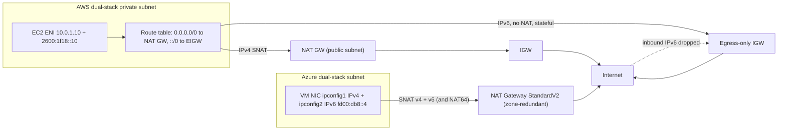
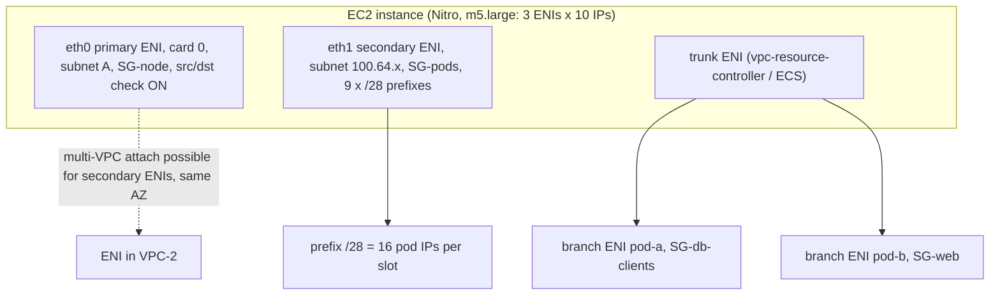
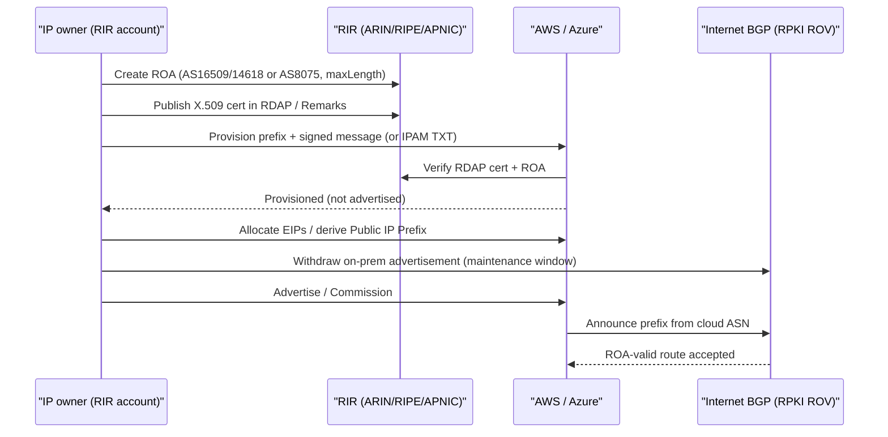

# G2 Additional Virtual Network Features
> Last verified: 2026-10 · Audience: senior/staff DevOps, SRE, AI eng, NetEng, DevSecOps, architects

## TL;DR
- **IPv6 outbound-only.** On AWS, ENIs get **globally unique** IPv6 addresses with no NAT. "Private" means routing `::/0` to an **egress-only IGW (EIGW)** instead of the IGW. The EIGW is **stateful**, free, one per VPC, and can't have an SG attached (use NACLs and SGs on the ENIs). Azure has **no EIGW resource**. A VNet's IPv6 space is only reachable from outside through a **public IPv6 resource**: an instance-level PIP, LB outbound rules, or **NAT Gateway StandardV2**, which does IPv6 SNAT and NAT64. Inbound filtering is done with **NSGs**.
- **Growing address space.** On AWS you add **secondary CIDRs**: **5 per VPC by default, up to 50**, each /16–/28. They can't be resized. **RFC 1918 families can't be mixed.** **100.64.0.0/10 is allowed**, which is the standard EKS pod-IP pattern. On Azure you **add or extend VNet address prefixes in place** (a /16 can grow to /8, or shrink if subnets still fit). On a **peered** VNet you must then **Sync** every peering.
- **AWS ENI.** Primary and secondary private IPs, one EIP per private IP, SGs (5 by default, up to 16), MAC, and a **source/dest check** flag. It is AZ-bound and **can be attached across VPCs in the same AZ**. **Prefix delegation** gives a /28 IPv4 or /80 IPv6 block that counts as one IP slot. **Trunk and branch ENIs** (ECS `awsvpcTrunking`, EKS SG-for-Pods) raise per-instance ENI density.
- **Azure NIC.** Up to **256 IP configs** per NIC. The primary config must be IPv4, and you get at most **one IPv6 config**. **IP forwarding** is the equivalent of turning off source/dest check. **Accelerated Networking** uses SR-IOV (Mellanox or MANA) and can only be toggled on a deallocated VM. All NICs on a VM must be in the **same VNet**. Adding or removing a NIC requires **stop (deallocate)**.
- **BYOIP.** Both clouds take a **/24 minimum for IPv4 and /48 for advertised IPv6**, plus a **ROA** and proof of ownership (an X.509 cert in the RDAP/RIR record and a signed message). Both allow **5 ranges per region by default**. AWS ROA → AWS ASNs **16509/14618**, Azure ROA → **AS 8075**. In Azure the resource is a **Custom IP Prefix**: provision (~30 min), then **commission** (~3–4 h), then derive Public IP Prefixes.
- **Central IPAM.** **Amazon VPC IPAM** has scopes, then a hierarchy of pools, then allocations. It integrates with Organizations, comes in Free and Advanced tiers, and runs BYOIP workflows. **Azure Virtual Network Manager (AVNM) IPAM** has root and child pools (up to **7 levels**), static CIDRs, and RBAC delegation through the **IPAM Pool User** role. Use one or the other to stop overlap before it happens, because overlap blocks peering, TGW/vWAN and hybrid connectivity.

---

## G2.1 IPv6 egress-only internet gateway
- **How it works (AWS):**
  - IPv6 addresses in a VPC are GUAs, so they are public by default. An **EIGW** is a horizontally scaled, redundant, **stateful** VPC gateway. It allows outbound IPv6 and its return traffic, and drops connections initiated from the internet.
  - Route table: `::/0 → eigw-xxxx`. A subnet whose IPv6 default route points to the IGW is IPv6-public. One pointing to the EIGW is IPv6-"private".
  - **IPv6 only.** For IPv4 outbound you still need a NAT GW (see [G1.11](G1-virtual-network-fundamentals.md#g111-managed-nat-gateway)). The two co-exist in a dual-stack subnet: `0.0.0.0/0 → nat-…` and `::/0 → eigw-…`.
  - **No SG can be attached to an EIGW.** Control traffic with **NACLs** on the subnet and SGs on the ENIs.
  - **No hourly charge.** You pay normal data transfer. Quota: **5 per region**, and **1 per VPC**.
  - **No NAT66 on AWS.** The source address stays the instance's GUA. For IPv6-only subnets that must reach IPv4-only destinations, use **DNS64 (Route 53 Resolver) plus NAT64 on the NAT GW** (`64:ff9b::/96 → nat-…`).
- **How it works (Azure), with no EIGW resource:**
  - VNet IPv6 space is **customer-defined** (often ULA `fd00::/8` or your own GUA). Subnets must be **exactly /64**. Every NIC must keep an IPv4 config, because **IPv6-only VMs are not supported**.
  - Ways to get IPv6 internet access:
    - an **instance-level public IPv6** on a secondary IP config, which gives inbound and outbound
    - **Standard LB outbound rules** with IPv6 frontends
    - **NAT Gateway StandardV2**, which supports up to 16 IPv4 and 16 IPv6 PIPs, plus **NAT64** via `64:ff9b::/96`. NAT64 needs a third-party DNS64.
  - Azure **translates** the private VNet IPv6 to the public IPv6. The guest OS never sees the public address, so Azure does not strictly avoid NAT for IPv6. The "egress-only" property comes from the **NAT GW**: it is stateful and allows no unsolicited inbound. **NSGs** restrict inbound when a VM has its own public IPv6.
  - Known issue: attaching a **StandardV2 NAT GW breaks IPv6 outbound via LB outbound rules**. Use LB outbound rules for both IPv4 and IPv6, or Standard NAT for IPv4 with LB rules for IPv6.
  - Gaps as of 2026-10: **ICMPv6 can't be filtered in NSGs**. **Azure Firewall, Route Server and Virtual WAN are IPv4-only.** IPv6 public IPs and prefixes are **free**.
- **Trade-offs / when to use:**
  - EIGW is the default for "dual-stack, private workloads that need to pull packages or call APIs over IPv6". It costs nothing, unlike the NAT GW's hourly and per-GB charges, so it is a cheap way to move IPv6-capable egress off NAT.
  - IPv6-only subnets on AWS combined with NAT64 cut the public IPv4 bill ($0.005/IP-hour). On Azure you still need IPv4 on every NIC.
- **Interview angles:**
  - "How do you make IPv6 instances private?" → On AWS, route `::/0` to the EIGW instead of the IGW. NAT isn't needed because addresses are globally unique, and the gateway being stateful gives the outbound-only behaviour.
  - "Is the EIGW a firewall?" → No. It only blocks **inbound-initiated** connections. Egress filtering still needs SGs, NACLs, or Network Firewall/GWLB.
  - Pitfall: someone puts `::/0 → igw` in a "private" subnet's route table while the SG allows `::/0` inbound, and every IPv6 host is exposed. IPv4 habits ("no public IP = private") don't carry over to IPv6.
  - Pitfall: stateless **NACLs** must allow ephemeral return ports for IPv6 separately (the rules are distinct from IPv4).
  - Azure follow-up: "Equivalent of an EIGW?" → **NAT GW StandardV2 with IPv6 PIPs**, or LB outbound rules. Use NSGs for inbound. Default outbound access is going away (new VNets get private subnets by default since **31 Mar 2026**).



## G2.2 Extending the address space (secondary CIDRs)
- **How it works (AWS):**
  - A VPC has a **primary IPv4 CIDR**, which can't be removed, plus **secondary CIDRs**. Every block counts against the quota of **5 IPv4 CIDRs per VPC, adjustable to 50**. IPv6: **up to 5 blocks**, each /44–/60 in /4 steps. Amazon-provided blocks are a /56 and you can't choose the range.
  - Each block is **/16–/28** and **can't be resized**. To grow, you add another block. A `local` route is added automatically to every route table.
  - Restrictions, from the association table:
    - If the primary range is **10/8**, you can't add 172.16/12 or 192.168/16.
    - If any block is in 10.0/15, you can't add 10.0/16.
    - **198.19.0.0/16** is blocked for RFC 1918 VPCs.
    - **172.31/16** is blocked if the primary is in 172.16/12.
  - **Always permitted:** **100.64.0.0/10 (RFC 6598 CGNAT)** and publicly routable non-RFC 1918 space.
  - A new block **can't be the same size or larger than an existing route's destination**. Example: a route `10.0.0.0/24 → vgw` blocks adding 10.0.0.0/24 or larger, but a /25 is fine.
  - **Peering:** you can't add a block that overlaps the peer's CIDRs. While the peering is `pending-acceptance`, the requester can't add CIDRs at all. With **Direct Connect gateway** associations, VPC CIDRs must not overlap each other.
  - Forbidden everywhere: 0/8, 127/8, 169.254/16, 224/4. Avoid **172.17/16**, which collides with the Docker bridge used by Cloud9 and SageMaker.
- **EKS pattern with 100.64/10:**
  1. Add a `100.64.0.0/16` secondary CIDR and create per-AZ pod subnets in it.
  2. Set VPC CNI **custom networking** with `AWS_VPC_K8S_CNI_CUSTOM_NETWORK_CFG=true`, plus one `ENIConfig` per AZ (subnet and SGs). Set `ENI_CONFIG_LABEL_DEF=topology.kubernetes.io/zone`.
  3. Pods now live on **secondary ENIs** in 100.64. The **primary ENI isn't used for pods**, so max pods drops. On an m5.large it goes from 29 to (3−1)×(10−1)+2 = **20**. With **prefix delegation** it becomes (3−1)×(9×16)+2 = **290**, but cap it at **110** on small nodes (EKS suggests 250 on large ones).
  4. Pod egress is SNATed to the node's primary ENI IP, which is routable. When pods must reach other VPCs or on-prem with overlapping or non-routable space, use a **private NAT GW** in the routable subnet with TGW. This pattern is the [G8](G8-transit-hub.md) hub.
  5. Enabling custom networking is **disruptive**. Existing nodes keep the old behaviour, so cordon, drain and replace them.
  - Prefer **IPv6 EKS clusters** when you can. Custom networking adds operational burden, and it doesn't fix overlap on its own.
- **How it works (Azure):**
  - A VNet has **one or more address prefixes**. You can **add** a prefix, **extend** one (e.g. /16 → /8), or **shrink** one as long as its subnets still fit. You can't remove a prefix that still contains subnets.
  - Forbidden: 224/4, 255.255.255.255/32, 127/8, 169.254/16, **168.63.129.16/32**. 168.63.129.16 is the WireServer, which provides DNS, DHCP and LB probes.
  - **Peered VNets:** resizing happens **without downtime**, but every remote peering then shows "remote sync required". Run **Sync** on each peering (`az network vnet peering sync`) after **every** change (add, modify or delete prefix). New prefixes must not overlap peers or on-prem.
  - The limit on prefixes per VNet is very high, so the practical bounds are subnet rules (/29–/2, IPv6 exactly /64) and route and peering hygiene.
  - Adding IPv6 to an existing VNet fails if it has **resource navigation links**, which come from some delegated PaaS subnets.
  - **AKS analog to 100.64:** **Azure CNI Overlay**. Pods get IPs from a private overlay CIDR (default 10.244.0.0/16) that isn't in the VNet, and egress is SNATed to the node IP. Azure CNI with a separate **pod subnet** is the closer analog to ENIConfig.
- **Trade-offs / when to use:**
  - Secondary CIDRs and extra prefixes are the fix when you're out of IPs **without a rebuild**. The cost is fragmented space, more routes to advertise on-prem and through TGW/vWAN, and more overlap risk.
  - Use non-routable 100.64/10 **only for things that never need inbound reachability** from outside the VPC, such as pods and batch workers. Expose them through ALB/NLB or private NAT.
  - Hybrid gotcha: on-prem may already use 100.64/10 (ISPs and carrier-grade NAT), so check with the network team.
- **Interview angles:**
  - "Our VPC ran out of IPs and EKS can't schedule pods" → work through this ladder: (1) add a 100.64/16 secondary with custom networking, (2) enable prefix delegation, (3) set subnet CIDR reservations for /28 contiguity, (4) move to an IPv6 cluster, (5) use private NAT GW plus TGW for overlap.
  - "Can I resize a VPC CIDR?" → AWS: no, add a secondary block. Azure: yes, in place. Azure follow-up: "remember to sync peerings".
  - "Why did `AssociateVpcCidrBlock` fail?" → Check, in order: an RFC 1918 family mismatch, the quota of 5, a route that's more specific than or equal to the new block, overlap with a peer or DXGW, or a peering still pending acceptance.

## G2.3 Virtual network interfaces deep dive
### AWS ENI
- **Attributes:**
  - IPs: a **primary private IPv4**, which is fixed for the ENI's lifetime, plus **secondary private IPv4s**, which can be **re-assigned** to another ENI (a classic floating-IP failover). **One EIP per private IPv4.** One auto-assigned public IPv4.
  - IPv6: a primary IPv6 and secondary IPv6s.
  - Other: **SGs** (5 per ENI by default, up to 16, with rules × SGs ≤ 1,000), a MAC address, the **source/dest check** flag, a description, and **delete-on-termination**.
- **Placement:** an ENI is **AZ-scoped**. It can be attached to any instance **in the same AZ, including one in a different VPC you own (multi-VPC ENI attachment)**. That gives dual-homed appliances with separate SGs per VPC. The **primary ENI (device index 0) can't be detached**. Secondary ENIs support **hot** (running), **warm** (stopped) and **cold** (at launch) attach.
- **Limits:**
  - Per instance type, ENIs × IPs per ENI is fixed and **not adjustable**. Examples: c8i.large 3×20, c8i.4xlarge 8×50, c8i.48xlarge 24×64. Check with `aws ec2 describe-instance-types`.
  - Per account: **5,000 ENIs per AZ** (adjustable).
  - Large instances spread ENIs across **multiple network cards** (e.g. p5.48xlarge has 32). The primary ENI must be on card 0. Each card can hold only one **EFA** interface.
- **Bandwidth:** you **can't add ENIs to double bandwidth**. Instance bandwidth is per instance type, not per ENI. Multiple ENIs in the **same subnet** cause asymmetric routing. Use secondary IPs on one ENI instead.
- **Source/destination check** is on by default and drops packets where the ENI is neither the source nor the destination. **Disable it** for NAT instances, routers, firewalls, VPN/SD-WAN appliances, and anything acting as the next hop for VPC route-table entries. Prefix IPs are covered by the check too.
- **Prefix delegation** (Nitro only): assign a **/28 IPv4** (16 IPs) or an **/80 IPv6** prefix to an ENI, either automatically or manually. **Each prefix uses one IP slot**: a c5.large with 10 IPs per ENI can hold 9 prefixes plus the primary IP. The VPC CNI uses it (`ENABLE_PREFIX_DELEGATION=true`) for pod density and fewer EC2 API calls. A prefix needs a **contiguous** free /28, which fails on fragmented subnets. Fix it with **subnet CIDR reservations** (type `prefix`).
- **Trunk and branch ENIs (ENI trunking):**
  - **ECS:** the `awsvpcTrunking` account setting adds a **trunk ENI** managed by ECS. A c5.large goes from **3 ENIs to 12**, so 2 tasks become **10 tasks** on `awsvpc`. Constraints: Linux only, only instances launched after enabling it, no shared subnets, and resource-based IPv4 DNS (A record) must be off.
  - **EKS Security Groups for Pods:** the VPC resource controller attaches a trunk ENI, and each pod gets a **branch ENI** with its own SGs.
    - Requirements: Nitro instances flagged trunking-compatible, **no `t` family**, **not on Windows or EKS Auto Mode**.
    - `POD_SECURITY_GROUP_ENFORCING_MODE=strict` is the default. It disables SNAT, so pods need a NAT GW in a private subnet. `standard` mode makes out-of-VPC traffic use the node SG.
    - Expect higher pod-start latency when pods churn a lot.
- **Requester-managed ENIs** are created by services such as ELB, NAT GW, Lambda in VPC, VPC endpoints, RDS and EKS control-plane ENIs. You can't detach or modify them. They **consume subnet IPs**, which is why Lambda- or endpoint-heavy subnets run dry. **Managed ENIs**, e.g. EKS Auto Mode, are also read-only.
- **Performance features**, detailed in [G4](G4-network-performance-and-optimization.md):
  - **ENA** is the standard SR-IOV adapter.
  - **ENA Express** uses SRD and raises single-flow throughput to 25 Gbps within an AZ.
  - **EFA** provides OS-bypass for HPC and ML NCCL traffic.

### Azure NIC
- **IP configurations:** **up to 256 IP configs per NIC** (and 256 private IPs).
  - The **primary config must be IPv4**.
  - A NIC can have **only one private IPv6**, and it must be on a secondary config.
  - Allocation can be **dynamic or static**. Both persist until the NIC is deleted or moved.
  - **Secondary IPs must be configured inside the guest OS.** On Windows that includes the primary. **Never put the public IP in the OS**, because Azure performs 1:1 translation.
- **IP forwarding** (`ip_forwarding_enabled`) is the equivalent of source/dest check being off. It allows the NIC to receive traffic not addressed to it and to send traffic with a foreign source address. Enable it **on every NIC that forwards traffic**, and also turn on forwarding in the OS (`net.ipv4.ip_forward=1`). It is used for NVAs that are the next hop of a UDR.
- **Accelerated Networking:**
  - **SR-IOV** bypasses the host vSwitch and offloads NSG/ACL policy to hardware. That gives lower latency, more PPS, less jitter and less CPU load.
  - Hardware is Mellanox ConnectX-3/4 Lx/5 or **MANA**, Microsoft's own NIC. MANA needs recent kernels.
  - Supported on most sizes with **2+ vCPUs**, or **4+ vCPUs** with hyperthreading.
  - It can **only be toggled when the VM is stopped (deallocated)**.
  - The VF is **bonded to a synthetic `hv_netvsc` NIC** and gets revoked during host maintenance. Applications must bind to the synthetic interface, and the VF must be marked unmanaged in NetworkManager or networkd.
  - **No extra cost.**
- **Multi-NIC rules:**
  - **All NICs must be in the same VNet**, though different subnets are allowed. This differs from AWS multi-VPC ENI.
  - Adding or removing a NIC requires the VM to be **stopped (deallocated)**. The NIC must be in the same region and subscription.
  - A NIC's VNet **can't be changed**, but its subnet can. Moving the primary NIC's subnet works while the VM runs. Secondary NICs require deallocation.
  - The VM must keep at least one NIC, and deleting the VM does **not** delete its NICs.
  - Default outbound traffic goes via the **primary IP config of the primary NIC**.
- **MAC address:** assigned at first start. It persists until the NIC is deleted **or the primary NIC's primary IP changes**. Licensing that is tied to a MAC can break when it changes.
- **No trunk/branch equivalent.** Per-pod network policy in AKS is done with Azure NPM, Cilium or Calico network policy, not per-pod NSGs.



- **Trade-offs / when to use:**
  - Use **secondary IPs** for floating VIPs, multiple TLS certs per host, and pod IPs on small clusters. Use **prefixes** for container density. Use **extra ENIs** only for a separate subnet, SG or VPC (management-plane separation, dual-homed firewalls). Use **trunking** when you need per-task or per-pod SGs or are ENI-bound on ECS.
  - Per-pod SGs give strong L3/L4 isolation that auditors understand. The cost is API rate limits, slower pod starts, and constraints on SNAT and NodePort.
- **Interview angles:**
  - "NAT instance or firewall appliance isn't forwarding" → On AWS, **disable source/dest check** on the ENI. On Azure, **enable IP forwarding on the NIC and in the OS**. Then check that the route table or UDR next hop points at that ENI or NIC IP, and that SG/NSG and NACL allow the transit traffic.
  - "How do you build an HA floating IP without gratuitous ARP?" → Move a **secondary private IP** or EIP with the API (AWS `assign-private-ip-addresses --allow-reassignment`), or update the route-table next hop. On Azure, update the UDR next hop or put the pair behind an ILB with HA ports, which is the preferred way.
  - "Why can't EKS schedule pods although the node has CPU?" → ENI × IP limits (`max-pods`). Fix: prefix delegation, a bigger instance type, or IPv6.
  - "Multiple ENIs for bandwidth?" → No. Bandwidth is per instance type. Use ENA Express, EFA, or a larger size or a network-optimized `n` type.
  - Pitfall: two ENIs in the same subnet give asymmetric return paths and rp_filter drops. Use policy routing or a single ENI with secondary IPs.

## G2.4 Bring your own IP
- **How it works (AWS BYOIP):**
  - **Requirements:**
    - The range is registered at an RIR to a business or institution, not an individual.
    - **Most specific IPv4 is /24.** For IPv6 it is **/48 if advertised**, or **/60 if not publicly advertisable** (useful as private-ish GUA VPC CIDRs).
    - The range must have a **clean reputation**.
    - Each range can be in **one region at a time**. One ROA and RDAP record can cover smaller sub-blocks across several regions.
  - **Quota:** **5 BYOIP ranges (IPv4 + IPv6) per region**. Increases go through Support.
  - **Ownership proof**, two methods:
    - (a) An **X.509 self-signed cert in the RDAP record** at ARIN, RIPE or APNIC, plus a signed message.
    - (b) An **IPAM DNS TXT record**, which works for any RIR.
  - **ROA:** authorize the Amazon ASNs **16509 and 14618** (unverified on this page; standard AWS guidance). A ROA isn't needed for non-advertised ranges. Don't hand-edit RADb, because AWS updates it.
  - **Lifecycle:** **provision**, then **advertise** (`pending-advertising` → `advertised`), then **withdraw**. Advertisements can't be cancelled mid-operation. **BYOASN** lets AWS advertise the range with your own ASN as origin.
  - **Usage:** allocate **EIPs** from the pool for EC2, NAT GW and NLB. Use BYOIPv6 as **VPC IPv6 CIDRs**. Global Accelerator has its own BYOIP flow. You can use all addresses, **including the network and broadcast** addresses.
  - **Sharing across accounts** works only through **IPAM + Organizations + RAM**.
  - **Not supported** in China regions, Wavelength or Outposts. Selected Local Zone network border groups are supported for IPv4.
- **How it works (Azure Custom IP Prefix):**
  - **Validate** at the RIR:
    - **ROA with Origin AS 8075** (8070 for US Gov). Allow **24 h** for it to become visible.
    - A **self-signed X.509 cert** in the RIR record's Remarks or description field.
    - A **signed message** in the format `subscriptionId|prefix|ROAexpiry`, signed with the cert's private key.
  - **Provision:** create a `customIpPrefix` (~**30 min**). Then **derive Public IP Prefixes and Standard PIPs** from it. A custom prefix **can't attach directly** to a resource.
  - **Commission:** the range is advertised from the region and then globally by the Microsoft WAN on AS 8075. It takes ~**3–4 h**, and the range is partially advertised while still `Commissioning`. There is a **regional-only commissioning** option for safe migration.
  - **Models:** a **unified** range is /21–/24. **Global/regional** splits it into a parent (/21–/24) and regional children (/22–/26, at least one level smaller). For IPv6, the global parent is **/48** and regional children are **/64**.
  - **Limits:**
    - **5 custom prefixes per region** by default.
    - In AZ regions the prefix must be **zone-redundant or zonal**.
    - **Not advertised over ExpressRoute Microsoft peering.**
    - Routing Preference (Internet) and Global-tier IPs are not supported. Public IP **StandardV2** can't be derived from it.
    - The prefix **can't move between subscriptions**. Derived prefixes can sit in other subscriptions in the same tenant if you have permissions.
    - Reverse DNS requires your own reverse zone in Azure DNS.
  - **Pricing:** provisioning is free, and derived PIPs are free. Inbound traffic to the range is billed at internet egress rates for the source region.
- **Trade-offs / when to use:**
  - Use BYOIP to keep **IP reputation and allowlists** (payment processors, B2B partner firewalls, email sending reputation, hard-coded IoT endpoints) and to escape per-IP IPv4 charges at scale. AWS's $0.005/IP-hour public IPv4 charge does not apply to BYOIP addresses (per the 2024 pricing announcement, not re-verified here).
  - Costs: RIR paperwork that can take days with LIRs, BGP coordination, and a migration that needs a **withdraw-then-advertise** maintenance window. Never advertise the same prefix from on-prem and the cloud at once.
  - Alternatives: a **contiguous Amazon-provided IPv4 block via IPAM**, or an **Azure Public IP Prefix**. Both give predictable allowlists without owning space.
- **Interview angles:**
  - "Migrate a /24 from the DC to the cloud with zero allowlist changes" → Steps: (1) create the ROA for the cloud ASN while keeping the existing ROA for the on-prem ASN, (2) publish the cert and signed message, (3) provision (not advertised), (4) pre-create EIPs or PIPs and test, (5) in the window, withdraw on-prem and advertise in the cloud, (6) monitor BGP with RIPE RIS or bgp.tools. Rollback is the reverse.
  - "Why advertise a /24 and not a /25?" → Internet routers generally filter IPv4 prefixes longer than /24 (and IPv6 longer than /48), so smaller blocks aren't globally routable.
  - Pitfall: an expired ROA means carriers with RPKI ROV may drop the route. Renew before the validity end date (Azure ties the signed message to the ROA expiry).

### IPAM (supports G2.2 and G2.4)
| | Amazon VPC IPAM | Azure Virtual Network Manager IPAM |
|---|---|---|
| Hierarchy | IPAM → **scopes** (default public and private; extra private scopes for overlapping networks) → **pools** (top-level → regional/locale → env) → **allocations** | Network Manager → **root pool** → **child pools** (up to **7 levels**) → allocations to VNets plus **static CIDRs** (on-prem or unsupported resources) |
| Allocation rules | Min/max/default netmask, tag rules, auto-import. VPC create with `ipv4_ipam_pool_id` + netmask | VNet create or update with `--ipam-allocations` (number of IPs). Non-overlap is guaranteed within a pool |
| Multi-account / region | AWS Organizations delegated admin, RAM sharing, operating regions, resource discovery | AVNM scope (management groups/subscriptions). One pool can serve VNets in **other regions** |
| Public space | BYOIP and Amazon-provided **contiguous IPv4/IPv6** pools. Public scope | Not a BYOIP workflow (BYOIP uses Custom IP Prefix) |
| Monitoring | Compliance and overlap status, utilization, **IP history** (Advanced) | Usage %, allocated vs total, resource lists |
| Delegation | IAM/RAM | **IPAM Pool User** role (+ Network Manager Read for discoverability) |
| Tiers | **Free** (basic public-space monitoring) vs **Advanced** (billed per **active IP**/hour: private pools, cross-account, history) | Billed as part of AVNM (pricing unverified) |
| IPv6 | Yes | Yes (IPv4 and IPv6 pools) |

---

## Diagrams


## Cloud mapping: AWS vs Azure
| Capability | AWS | Azure | Role it plays | Key differences | Alternatives |
|---|---|---|---|---|---|
| IPv6 outbound-only | **Egress-only IGW** (route `::/0`) | **NAT Gateway StandardV2** with IPv6 PIPs, or **LB outbound rules**, plus NSG | Let IPv6 hosts initiate outbound and block inbound-initiated traffic | AWS: no NAT, GUA on ENI, free, per VPC. Azure: platform translates VNet IPv6 to public IPv6. StandardV2 NAT is zone-redundant, hourly plus per-GB, and per subnet | Self-managed firewall/NVA, Cloudflare WARP/egress gateway |
| IPv4-only destinations from IPv6 | NAT GW **NAT64** + Route 53 Resolver **DNS64** | NAT GW StandardV2 **NAT64** + **third-party DNS64** | Reach v4-only SaaS from v6-only workloads | Azure has no IPv6-only VMs, so NAT64 targets IPv6-only *flows* | 464XLAT, dual-stack |
| Add address space | **Secondary VPC CIDR** (5 → 50, /16–/28, immutable size) | **Add/extend VNet address prefix** (resizable in place) | Grow capacity without a rebuild | AWS can't resize and restricts RFC 1918 mixing. Azure needs **peering Sync** | New VPC/VNet + peering/TGW/vWAN |
| Non-routable pod space | 100.64/10 secondary + VPC CNI **custom networking** (ENIConfig) | **Azure CNI Overlay** (10.244/16 default) or Azure CNI pod subnet | Save routable RFC 1918 space for K8s | AWS pods stay VPC-native in a non-routable range. Azure Overlay pods are not VNet IPs | Cilium overlay, IPv6 clusters |
| Virtual NIC | **ENI** (AZ-scoped, multi-VPC attach same AZ, hot attach) | **NIC** (region/VNet-scoped, same-VNet only, attach needs deallocate) | L3 identity: IPs, SG/NSG, MAC | AWS: IPs per ENI by instance type (e.g. 10–64). Azure: 256 IP configs per NIC | — |
| Extra IPs | Secondary private IPs / IPv6, **prefix delegation** (/28, /80) | Secondary **IP configurations** (1 IPv6 max) | VIPs, containers | Azure has no prefix-delegation primitive on a NIC (AKS uses overlay or pod subnet) | — |
| Forwarding appliance | Disable **source/dest check** | Enable **IP forwarding** (NIC + OS) | NAT/firewall/router as a route next hop | Same concept, inverted naming | GWLB / Azure Gateway LB, Azure Firewall, Network Firewall |
| Per-pod/task SG | **Trunk/branch ENI** (ECS awsvpcTrunking, EKS SG-for-Pods) | No equivalent: K8s NetworkPolicy (Azure NPM/Cilium/Calico) | L4 isolation per workload | AWS uses SGs that auditors already know. Azure uses K8s policy | Cilium, Calico |
| SR-IOV acceleration | **ENA / ENA Express / EFA** | **Accelerated Networking** (Mellanox/MANA), InfiniBand on HPC SKUs | Low latency, high PPS | Azure toggles only when deallocated. AWS ENA is always on for Nitro | — |
| BYOIP | **BYOIP** pools (EC2/IPAM), GA BYOIP, **BYOASN** | **Custom IP Prefix** → Public IP Prefix | Keep reputation and allowlists | AWS: provision/advertise, RDAP or IPAM TXT verification. Azure: provision/commission, signed message, AS 8075, regional-only option | Cloudflare BYOIP / Magic Transit, own colo |
| IP address management | **Amazon VPC IPAM** (scopes/pools, Free/Advanced) | **AVNM IPAM** (root/child pools, 7 levels) | Non-overlap, planning, compliance | AWS covers public BYOIP pools and IP history. AVNM is VNet-centric, with cross-region pools | Infoblox, NetBox, BlueCat |

- **EIGW vs Azure:** the closest true equivalent is a **StandardV2 NAT GW** (or LB outbound rules) attached to a dual-stack subnet. AWS keeps end-to-end IPv6 addresses. Azure translates them, so logs on the far side show the PIP, not the VM's ULA. **Azure Firewall is IPv4-only**, so centralised IPv6 egress inspection on Azure needs a third-party NVA (as of 2026-10).
- **Secondary CIDR vs VNet prefix:** AWS blocks are fixed-size and capped at 50. Azure prefixes are elastic. Both require **non-overlap with every connected network**. On Azure, a forgotten **peering Sync** shows up as a peer that can't reach the new range. On AWS, overlap or route conflicts fail at association time.
- **ENI vs NIC:** AWS ENIs are AZ-bound but can cross VPCs. Azure NICs are bound to one VNet but are zone-agnostic. AWS supports **hot attach**, while Azure needs a **deallocate**, which matters for appliance HA runbooks. Both clouds discourage multi-NIC to gain bandwidth.
- **BYOIP:** both clouds require a /24 or /48, a ROA, and RIR ownership proof, and both allow 5 per region. AWS can use **your ASN (BYOASN)**. Azure always originates from AS 8075. Azure prefixes are **zonal or zone-redundant objects**.
- **IPAM:** AWS VPC IPAM is more mature: public scope, BYOIP, Organizations, compliance history. AVNM IPAM (GA) fits teams already using AVNM for connectivity and security admin rules. Third-party IPAM (Infoblox, NetBox) is the multicloud source of truth.

## Hands-on (optional)
```hcl
# --- AWS: dual-stack VPC, 100.64 secondary CIDR, EIGW, appliance ENI ---
resource "aws_vpc" "main" {
  cidr_block                       = "10.20.0.0/16"
  assign_generated_ipv6_cidr_block = true # Amazon-provided /56
}

resource "aws_vpc_ipv4_cidr_block_association" "pods" {
  vpc_id     = aws_vpc.main.id
  cidr_block = "100.64.0.0/16" # RFC 6598, permitted alongside 10/8
}

resource "aws_egress_only_internet_gateway" "eigw" {
  vpc_id = aws_vpc.main.id
}

resource "aws_route" "private_v6_default" {
  route_table_id              = aws_route_table.private.id
  destination_ipv6_cidr_block = "::/0"
  egress_only_gateway_id      = aws_egress_only_internet_gateway.eigw.id
}

resource "aws_network_interface" "fw_trust" {
  subnet_id         = aws_subnet.trust.id
  security_groups   = [aws_security_group.fw.id]
  source_dest_check = false # required for NAT/firewall next hop
  ipv4_prefix_count = 2     # two /28 delegated prefixes (Nitro only)
}

# IPAM pool-driven VPC CIDR (no hand-picked ranges)
resource "aws_vpc" "from_ipam" {
  ipv4_ipam_pool_id   = aws_vpc_ipam_pool.prod_use1.id
  ipv4_netmask_length = 20
}
```

```hcl
# --- Azure: extend VNet, forwarding NIC with accelerated networking, BYOIP ---
resource "azurerm_virtual_network" "hub" {
  name                = "vnet-hub"
  location            = "westeurope"
  resource_group_name = azurerm_resource_group.net.name
  address_space       = ["10.30.0.0/16", "10.31.0.0/16", "fd00:db8:30::/48"] # added prefix -> Sync peerings
}

resource "azurerm_network_interface" "nva" {
  name                           = "nic-nva-trust"
  location                       = azurerm_virtual_network.hub.location
  resource_group_name            = azurerm_resource_group.net.name
  ip_forwarding_enabled          = true # azurerm v4 name (was enable_ip_forwarding)
  accelerated_networking_enabled = true # toggle only while VM deallocated

  ip_configuration {
    name                          = "ipv4"
    primary                       = true
    subnet_id                     = azurerm_subnet.trust.id
    private_ip_address_allocation = "Static"
    private_ip_address            = "10.30.1.4"
  }
  ip_configuration {
    name                          = "ipv6"
    subnet_id                     = azurerm_subnet.trust.id
    private_ip_address_version    = "IPv6"
    private_ip_address_allocation = "Dynamic"
  }
}

resource "azurerm_custom_ip_prefix" "byoip" {
  name                          = "cip-198-51-100-0-24"
  location                      = "westeurope"
  resource_group_name           = azurerm_resource_group.net.name
  cidr                          = "198.51.100.0/24"
  zones                         = ["1", "2", "3"] # must be zonal/zone-redundant in AZ regions
  roa_validity_end_date         = "2027-12-31"
  wan_validation_signed_message = var.byoip_signed_message
  commissioning_enabled         = false # provision first, commission in the change window
}
```

```bash
# Sync all peerings after changing a peered VNet's address space (Azure)
for p in $(az network vnet peering list -g rg-net --vnet-name vnet-hub --query "[].name" -o tsv); do
  az network vnet peering sync -g rg-net --vnet-name vnet-hub -n "$p"
done

# AWS: how many ENIs/IPs does an instance type allow, and the EKS max-pods math
aws ec2 describe-instance-types --instance-types m5.large \
  --query 'InstanceTypes[0].NetworkInfo.[MaximumNetworkInterfaces,Ipv4AddressesPerInterface]' --output text
# max_pods = ENIs * (IPs_per_ENI - 1) + 2   ->  3*(10-1)+2 = 29

# Azure BYOIP signed message (format: subscription|prefix|ROA expiry yyyymmdd)
openssl genrsa -out byoip.key 2048
openssl req -new -x509 -key byoip.key -days 180 -subj "/CN=byoip" | tr -d "\n" > byoip.cer   # paste into RIR Remarks
echo -n "${SUB_ID}|198.51.100.0/24|20271231" | openssl dgst -sha256 -sign byoip.key | openssl base64 | tr -d "\n"
```

## Cross-links
- [G1 Virtual network fundamentals: G1.4 Addressing](G1-virtual-network-fundamentals.md#g14-addressing-cidr), [G1.6 IP addresses](G1-virtual-network-fundamentals.md#g16-ip-addresses-ipv4-vs-ipv6-private-vs-public-vs-static-public-ip), [G1.7 SGs](G1-virtual-network-fundamentals.md#g17-instance-level-stateful-firewall-rules), [G1.8 NACLs](G1-virtual-network-fundamentals.md#g18-subnet-level-stateless-network-acls), [G1.11 NAT GW](G1-virtual-network-fundamentals.md#g111-managed-nat-gateway), [G1.13 NAT instance](G1-virtual-network-fundamentals.md#g113-self-managed-nat-instance)
- [G3 Network DNS and DHCP](G3-network-dns-and-dhcp.md) (DNS64, the .2 resolver, 168.63.129.16)
- [G4 Network performance and optimization](G4-network-performance-and-optimization.md) (ENA Express, EFA, Accelerated Networking, MTU)
- [G5 Traffic monitoring and troubleshooting](G5-traffic-monitoring-troubleshooting.md) (flow logs per ENI/NIC)
- [G6 Private connectivity / peering](G6-private-connectivity-peering.md) (CIDR overlap, peering Sync)
- [G8 Transit hub](G8-transit-hub.md) (private NAT GW + TGW for 100.64 pods)
- [G12 Dedicated interconnect](G12-dedicated-interconnect.md) (BGP, DXGW non-overlap)
- [F2 Internet Protocol](../F-network-engineering/F2-internet-protocol.md) and [F7 Network routing](../F-network-engineering/F7-network-routing.md) (IPv6 addressing, BGP/RPKI)
- [C4 Security](../C-large-scale-architecture/C4-security.md) (firewalls/ACLs overlap)

## Sources
- https://docs.aws.amazon.com/vpc/latest/userguide/egress-only-internet-gateway.html
- https://docs.aws.amazon.com/vpc/latest/userguide/vpc-cidr-blocks.html
- https://docs.aws.amazon.com/vpc/latest/userguide/amazon-vpc-limits.html
- https://docs.aws.amazon.com/AWSEC2/latest/UserGuide/using-eni.html
- https://docs.aws.amazon.com/AWSEC2/latest/UserGuide/network-interface-attachments.html
- https://docs.aws.amazon.com/AWSEC2/latest/UserGuide/ec2-prefix-eni.html
- https://docs.aws.amazon.com/AWSEC2/latest/UserGuide/AvailableIpPerENI.html
- https://docs.aws.amazon.com/AWSEC2/latest/UserGuide/ec2-byoip.html
- https://docs.aws.amazon.com/eks/latest/best-practices/custom-networking.html
- https://docs.aws.amazon.com/eks/latest/userguide/security-groups-for-pods.html
- https://docs.aws.amazon.com/AmazonECS/latest/developerguide/container-instance-eni.html
- https://docs.aws.amazon.com/vpc/latest/ipam/what-it-is-ipam.html
- https://docs.aws.amazon.com/vpc/latest/ipam/how-it-works-ipam.html
- https://docs.aws.amazon.com/vpc/latest/ipam/mod-ipam-tier.html
- https://learn.microsoft.com/en-us/azure/virtual-network/ip-services/ipv6-overview
- https://learn.microsoft.com/en-us/azure/nat-gateway/nat-overview
- https://learn.microsoft.com/en-us/azure/virtual-network/manage-virtual-network
- https://learn.microsoft.com/en-us/azure/virtual-network/update-virtual-network-peering-address-space
- https://learn.microsoft.com/en-us/azure/virtual-network/ip-services/virtual-network-network-interface-addresses
- https://learn.microsoft.com/en-us/azure/virtual-network/virtual-network-network-interface
- https://learn.microsoft.com/en-us/azure/virtual-network/virtual-network-network-interface-vm
- https://learn.microsoft.com/en-us/azure/virtual-network/accelerated-networking-overview
- https://learn.microsoft.com/en-us/azure/virtual-network/ip-services/custom-ip-address-prefix
- https://learn.microsoft.com/en-us/azure/virtual-network/ip-services/create-custom-ip-address-prefix-portal
- https://learn.microsoft.com/en-us/azure/virtual-network-manager/concept-ip-address-management
- https://learn.microsoft.com/en-us/azure/azure-resource-manager/management/azure-subscription-service-limits
