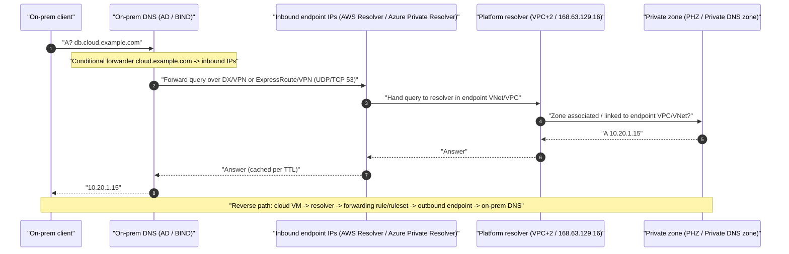
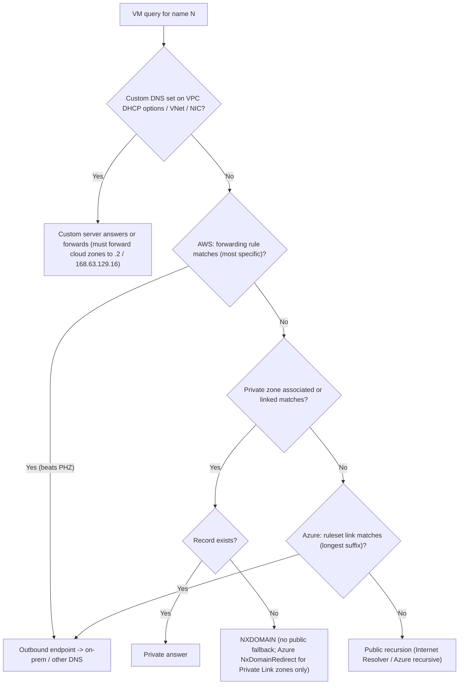

# G3 Network DNS and DHCP
> Last verified: 2026-10 · Audience: senior/staff DevOps, SRE, AI eng, NetEng, DevSecOps, architects

## TL;DR
- Every virtual network has a **provider-managed recursive resolver** at a fixed address. On AWS it is the **Route 53 VPC Resolver** at **VPC CIDR base +2**, `169.254.169.253` or `fd00:ec2::253`. AWS renamed "Route 53 Resolver" to "Route 53 VPC Resolver" when it launched **Route 53 Global Resolver** (GA March 2026). On Azure it is **Azure-provided DNS at `168.63.129.16`**, the same IP in every region and national cloud.
- **You cannot filter platform DNS with SGs/NACLs** on AWS. On Azure, NSGs don't apply to DNS by default, but you can deny it with an NSG rule that uses the `AzurePlatformDNS` service tag. Throttling happens per instance: AWS allows **1024 PPS per ENI** across all link-local services, and that limit can't be raised. Azure throttles each VM by an undocumented amount, so enable client-side caching.
- **DHCP options**: AWS has **DHCP option sets**. They are **immutable**, a VPC has exactly **one**, and one set can be shared by many VPCs. Azure has no option-set object. It has a **DNS servers setting on the VNet or the NIC**, and the NIC setting wins. Both clouds apply changes on **DHCP lease renewal**. Neither needs a reboot, but on Azure you have to renew the lease yourself.
- **Private zones**: an AWS **Private Hosted Zone (PHZ)** is associated with VPCs. Cross-account association runs only through the CLI or API: the zone owner authorizes, then the VPC owner associates. An Azure **Private DNS zone** uses **VNet links**, which are either registration links (autoregistration) or resolution links. Both are global objects. Both AWS settings `enableDnsSupport` and `enableDnsHostnames` must be **true** for PHZs.
- **Custom DNS servers** such as AD DCs, BIND or Infoblox must **conditionally forward cloud names to the platform resolver** (`.2` on AWS, `168.63.129.16` on Azure). If they don't, private zones and PrivateLink names stop resolving. The managed resolver endpoints have made VM-based forwarders mostly obsolete.
- **Hybrid DNS**: on AWS this is **Resolver inbound/outbound endpoints + forwarding rules**, with the rules shared through **AWS RAM** or bundled in **Route 53 Profiles**. On Azure it is **DNS Private Resolver inbound/outbound endpoints + DNS forwarding rulesets**, with **ruleset VNet links**. On-prem conditional forwarders target the **inbound endpoint IPs, never `.2` or `168.63.129.16`**, because neither address is reachable from outside the network.
- **Precedence gotchas**: on AWS a forwarding rule beats a PHZ for the same name, and the most specific match wins. A PHZ match with no record returns **NXDOMAIN with no public fallback**. On Azure, setting a custom DNS server on the VNet **bypasses linked private zones**. **Fallback to internet** (`NxDomainRedirect`) exists only for Private Link zones.
- **DNS egress filtering**: AWS uses **Route 53 Resolver DNS Firewall**, which can be managed centrally through Firewall Manager. Azure uses a **DNS security policy**, which Learn now calls **DNS resolver policy**. Azure's version is regional, a VNet can have only one, and it can include the MSRC threat-intelligence feed.

## G3.1 How DNS works
- **How it works (brief; full treatment in [H3](../H-full-stack-troubleshooting/H3-domain-name-system.md) and [F5](../F-network-engineering/F5-popular-networking-protocols.md)):**
  - A stub resolver sends one recursive query to a **recursive resolver**. The resolver walks root → TLD → authoritative servers, caching each answer for its **TTL**, and caches negative answers per the SOA minimum (RFC 2308).
  - Transport is UDP/53 by default. Resolution falls back to **TCP/53** when a response is truncated (TC bit) or larger than the EDNS0 buffer. Encrypted options are DoT (853) and DoH (443).
- **Cloud-specific twists:**
  - **Split-horizon** is the norm: the same name resolves to a private IP inside the network and a public IP outside. Examples are a PHZ alongside a public zone with the same name, and `privatelink.*` CNAME chains.
  - The platform resolver is **recursive only**. You cannot delegate to it or zone-transfer from it.
  - The AWS VPC Resolver doesn't send **EDNS Client Subnet (ECS)**, so geo-DNS answers reflect the AWS resolver's location.
- **Interview angles:** if asked "what happens when I resolve X in a VPC", walk through the stub resolver → link-local resolver → private zones and rules → public recursion order. That order is covered in G3.2 and G3.4.

## G3.2 Provider-managed DNS resolver inside the network
- **How it works (AWS, Route 53 VPC Resolver):**
  - Reachable at **VPC primary CIDR + 2**, for example 10.0.0.2. The docs also list `169.254.169.253` and `fd00:ec2::253`. The `169.254.169.253` address still works from IPv6-only subnets.
  - Answers queries for PHZs, VPC-internal names (`ip-10-0-0-5.ec2.internal` / `<region>.compute.internal`) and public names through recursion.
  - Built from two parts: a **Nitro Resolver** on the host's Nitro card, which keeps a local cache and can serve stale answers on upstream SERVFAIL or timeout, and a **zonal resolver fleet**. Queries from that fleet to the internet leave from AWS public IPs.
  - **Limit:** **1024 PPS per ENI** shared by DNS, IMDS, NTP and Windows licensing. The limit is hard and can't be raised. Detect it with `ethtool -S eth0 | grep linklocal_allowance_exceeded`. There is **no per-VPC aggregate QPS cap**.
  - **VPC attributes:**
    - **`enableDnsSupport`** (default **true**) controls whether the resolver answers at all.
    - **`enableDnsHostnames`** defaults to **false** except in the default VPC. It controls public DNS hostnames for instances.
    - **Both must be true** for PHZs and for **PrivateLink private DNS**.
  - **Resolver rules**:
    - Supports **recursive queries only**.
    - SGs and NACLs **can't filter** resolver traffic.
    - The Hadoop/EMR caveat: with custom DNS servers you need a conditional forwarder for `<region>.compute.internal` pointing at `.2`.
- **How it works (Azure-provided DNS, `168.63.129.16`):**
  - A **virtual public IP of the host node** ("WireServer"). It also provides DHCP, Load Balancer health probes and the VM agent channel (TCP 80/32526).
  - It **is not subject to UDRs**. NSGs don't apply by default. Block it with an NSG deny to `AzurePlatformDNS`, or with the guest firewall.
  - Built-in names: `<vm>.internal.cloudapp.net`, with a per-VNet suffix delivered by DHCP. **They resolve only within the same VNet**, and not across peering.
    - **Reverse PTR records are auto-created** and are also VNet-scoped. Peered VNets get **NXDOMAIN** for PTR lookups.
    - The suffix can't be changed, manual records aren't allowed, and WINS/NetBIOS isn't supported.
  - When a custom DNS server is configured, DHCP hands out the **placeholder suffix `reddog.microsoft.com`**, which resolves nothing.
  - 168.63.129.16 has **no reverse lookup** of itself.
- **Trade-offs / when to use:** the platform resolver is free and highly available with no setup. Its limits are that you get no zone control or custom records (use private zones for those) and no visibility. For visibility, use **Resolver query logging** on AWS and **DNS resolver policy logs** on Azure.
- **Interview angles:**
  - "DNS intermittently fails on a busy EC2 host" → **link-local PPS throttling**. Fix it with a local cache (`systemd-resolved`, `dnsmasq`, `nscd`), by spreading load across more ENIs, and by checking `linklocal_allowance_exceeded`.
  - "Can I use the `.2` address from on-prem or a peered VPC?" → **No.** AWS explicitly says forwarding to another VPC's +2 is unsupported and unstable. Use an inbound endpoint.
  - "PrivateLink private DNS isn't working" → check that **both VPC DNS attributes are true**.
  - Pitfall on Azure: a host firewall that blocks 168.63.129.16 also breaks the **VM agent, DHCP and LB probes**, not just DNS.

## G3.3 DHCP option sets
- **How it works (AWS):**
  - Fields: `domain-name-servers` (up to **4 IPv4 + 4 IPv6**, or 3 IPv4 + `AmazonProvidedDNS`; don't mix custom servers with AmazonProvidedDNS), `domain-name`, `ntp-servers` (4 + 4; Amazon Time Sync is `169.254.169.123` / `fd00:ec2::123`), `netbios-name-servers`, `netbios-node-type` (use **2**, since broadcast and multicast aren't supported) and **IPv6 preferred lease time** (default **140 s**, renewal at about half).
  - **Immutable**: you can't edit a set after creation. To change options, create a new set and **re-associate** it. **One set per VPC**. One set can be associated with **many VPCs**. A set that's in use can't be deleted.
  - **Effect on instances**: existing instances pick up the new set at their **next lease renewal**, which can take hours. Force it with `dhclient -r && dhclient`, `networkctl renew` or `ipconfig /renew`. No reboot is required.
  - **No DHCP option set** (the "none" option) disables DNS. Nitro instances still get `169.254.169.253`, but Xen instances get **no resolver at all**.
  - `domain-name` with several space-separated values works on some Linux distributions only. Windows treats it as a single value.
- **How it works (Azure, no option-set object):**
  - The **VNet → DNS servers** setting can be Default (Azure-provided) or Custom. It can be **overridden per NIC**, and the NIC setting wins.
  - Azure DHCP at 168.63.129.16 hands out the IP address, gateway, DNS servers and suffix. You **can't set NTP, domain name or NetBIOS options**. Use a guest OS configuration or a GPO instead.
  - After a change, **renew the lease on every affected VM**, or restart them. Don't hardcode DNS inside the guest OS, because **service healing** can replace the NIC and wipe the setting.
  - Custom DNS needs at least one IP. An empty Custom list falls back to Azure-provided DNS.
  - If you use **VPN Gateway** with custom DNS, Microsoft says to **add 168.63.129.16 to the list**.
  - You can't run your own DHCP server for VNet clients. Azure DHCP is authoritative for VNet addressing.
- **Trade-offs / when to use:** use a custom option set or custom VNet DNS only when an AD/BIND estate must be authoritative. Otherwise keep the platform default and solve hybrid DNS with resolver endpoints (G3.6). That keeps platform features working, such as PrivateLink DNS, Profiles and DNS Firewall.
- **Interview angles:**
  - "Changed DNS servers, nothing happened" → instances haven't renewed their leases yet, or (on AWS) you edited the wrong thing, since sets are immutable and you must swap the association.
  - "Why might pointing a VPC's DHCP options at on-prem DCs be a bad idea?" Three reasons:
    1. **DNS Firewall is bypassed.** DNS Firewall only inspects queries that go through the VPC Resolver.
    2. **Latency and fragility** grow across the WAN.
    3. **PHZ and PrivateLink names break** unless the DCs forward back to the cloud.

## G3.4 Private DNS zones for internal names
- **How it works (AWS Route 53 Private Hosted Zone):**
  - A global object associated with **VPCs in any Region**, up to **300 VPCs per PHZ**. Above that, use **Route 53 Profiles**, which support **1000 VPCs per Profile**.
  - **Cross-account association**:
    1. The zone owner runs `create-vpc-association-authorization`.
    2. The VPC owner runs `associate-vpc-with-hosted-zone`.
    3. Delete the authorization afterwards, which is best practice. Up to **1000 pending authorizations** are allowed.
    - **This can't be done in the console.**
  - **Split-view**: a public zone and a PHZ with the same name. The **most specific zone wins**.
    - If a matching PHZ has **no matching record**, the result is **NXDOMAIN**, with **no fallback to the public zone**.
    - If no PHZ matches, the query goes to public recursion.
  - **A forwarding rule for the same domain overrides the PHZ.**
  - Routing policies supported in PHZs: simple, failover, multivalue, weighted, latency, geolocation and geoproximity, with health checks. **IP-based routing isn't listed.**
  - **NS delegation inside PHZs** is now possible through **delegation rules**, a 2025 addition.
  - Quotas: 500 hosted zones per account (soft), 10,000 records per zone (soft).
  - Records aren't auto-registered. Automate them with Lambda/EventBridge or IaC.
- **How it works (Azure Private DNS zone):**
  - A global resource with **VNet links**.
    - A **registration link** enables **autoregistration**, which creates and deletes A records for VMs. Limits: **VMs only**, **primary NIC only**, **no PTR records**, and **one registration zone per VNet**.
    - A **resolution link** gives read access only.
  - Limits:
    - 1000 zones per subscription
    - 1000 VNet links per zone
    - **100 autoregistration links per zone**
    - 25,000 record sets per zone
    - a VNet can link to 1000 zones
  - **No single-label zones**, no NS delegation in private zones (create the child as its own zone instead), and **reserved names** are blocked (`core.windows.net`, `azure.com` and others).
  - Links can be **cross-subscription and cross-tenant**, given RBAC on both sides.
  - **Resolution order with default DNS**: linked private zones first, then Azure recursion. **A VNet with a custom DNS server doesn't consult its linked zones.** The custom server must forward to 168.63.129.16 from a VNet that is linked to the zones.
  - **Fallback to internet**: `resolutionPolicy: NxDomainRedirect` on a VNet link (API 2024-06-01+). **Private Link zones only**. It fixes the problem of identically named `privatelink.*` zones owned by different teams or tenants answering NXDOMAIN.
- **Trade-offs / when to use:**
  - Azure autoregistration is convenient for VM fleets but useless for PaaS and ILBs. The 1-registration-zone-per-VNet rule pushes you to a per-environment registration zone.
  - On AWS there's no autoregistration, but Profiles and RAM give organization-scale distribution.
  - **Centralize Private Link zones** in a connectivity subscription or account and link or share them. See [G7](../G-cloud-network-architecture/G7-service-endpoints-private-link.md).
- **Interview angles:**
  - "Spoke VNet can't resolve the private endpoint" → the zone isn't linked to that VNet (or to the resolver's VNet), or the spoke uses custom DNS without forwarding.
  - "Two teams both created `privatelink.blob.core.windows.net`" → you get conflicting NXDOMAINs. Fix it by centralizing the zone, or use `NxDomainRedirect`.
  - "PHZ example.com shadows the public zone and www breaks" → this is the NXDOMAIN-with-no-fallback rule. Copy the public records into the PHZ, or narrow the PHZ to a subdomain.

## G3.5 Running a custom DNS server inside the network
- **How it works:**
  - Typical servers are AD DCs, BIND/Unbound, Infoblox/BlueCat, or **Azure Firewall DNS proxy**. The firewall becomes the VNet's DNS server, which is required for FQDN-based *network* rules.
  - Point VPC DHCP options or VNet DNS settings at these servers.
  - The servers must:
    - **conditionally forward cloud zones to the platform resolver**: `.2` / `169.254.169.253` on AWS, `168.63.129.16` on Azure, from inside a network that is associated or linked with the private zones
    - recurse for internet names
    - be reachable on **UDP and TCP 53**
    - **not** be open to the internet
  - **Windows DNS forwarding timeout**: set it **above 4 s** when forwarding to Azure. Otherwise private-zone queries can time out and return public IPs.
  - When custom DNS servers are set on Azure, **port-53 traffic to them bypasses subnet and NIC NSGs**, according to Microsoft's name-resolution doc. Don't rely on NSGs for DNS segmentation.
  - With DDNS, **disable or extend scavenging**, because Azure DHCP leases are very long.
- **Trade-offs / when to use:**
  - **Pros:** full feature set (AD-integrated zones, DNSSEC signing, RPZ, views) and an existing operations team.
  - **Cons:** you own HA, which means at least 2 servers across zones, plus patching, scaling and the AWS 1024 PPS-per-ENI ceiling on forwarders. You also lose platform features unless you forward back. **Both clouds now steer you to the managed resolver endpoints.** Microsoft states outright that DNS Private Resolver "replaces the need to use VM-based DNS servers".
- **Interview angles:**
  - "AD-joined Windows fleet in AWS": keep the DCs authoritative for `corp.example.com`, have them forward `amazonaws.com`, `compute.internal` and PHZ domains to `.2`, and use Resolver endpoints for on-prem. An alternative is **AWS Managed Microsoft AD** with an outbound rule.
  - Anti-pattern: DC VMs in a hub forwarding to **another VNet's** 168.63.129.16. You can't do that. 168.63.129.16 always answers for the VNet the query **originates from**.

## G3.6 Hybrid DNS: inbound and outbound resolver endpoints
- **How it works (AWS Route 53 VPC Resolver endpoints):**
  - **Inbound endpoint**:
    - ENIs in your VPC that on-prem resolvers forward to. Requires **at least 2 IPs in different AZs**, up to 6 by default, and 4 endpoints per Region per account by default.
    - Two types: *default*, which forwards to IPs, and *delegation*, where on-prem delegates a subdomain to it with NS records (Do53 only).
    - Protocols: **Do53, DoH, DoH-FIPS** (FIPS for inbound only).
  - **Outbound endpoint + rules**:
    - Rules come in three kinds: **Forward** (conditional forwarding, up to 6 target IPs), **System** (carve a subdomain out of a forward rule and resolve it locally) and **Delegation**. An auto-created recursive rule, **"Internet Resolver"**, handles everything else.
    - **The most specific rule wins.** A `.` rule forwards everything except **auto-defined system rules** (AWS internal names). Reverse-DNS auto rules can be disabled.
  - Capacity: about **10,000 UDP QPS per endpoint IP**. That drops to roughly **1,500** if the security group triggers connection tracking or the traffic goes through an NLB. Use **unrestricted 0.0.0.0/0 port 53 SG rules** to stay untracked, and add IPs above 50% utilization.
  - Pricing: **per endpoint-IP-hour plus per query**.
  - Connectivity needed: inbound needs **DX or VPN**. Outbound can also go through **NAT**.
  - **Sharing:**
    - **Share rules through AWS RAM.** Sharing a rule also shares its outbound endpoint, so you can run **one outbound endpoint per Region in a central DNS VPC** and associate the shared rules in spoke accounts.
    - Since 2024, **Route 53 Profiles** bundle PHZs, Resolver rules, DNS Firewall rule groups, **interface VPC endpoints** and query-log configurations, and are shared through RAM.
    - **One Profile per VPC.** Local VPC associations beat the Profile on exact ties, and the most specific match otherwise.
    - Profile limits: 5 per Region (soft), 1000 VPCs, 5000 PHZs, 1000 rules.
  - Endpoints **can't be created in dedicated-tenancy VPCs**, or in a VPC you don't own. That includes shared-subnet participants.
- **How it works (Azure DNS Private Resolver):**
  - One resolver per VNet, in the **same region**.
  - **Inbound and outbound endpoints each need their own dedicated subnet**, sized **/28 to /24** and **delegated to `Microsoft.Network/dnsResolvers`**. IPv6-enabled subnets aren't allowed. The inbound IP can be **static or dynamic**.
  - Limits:
    - 15 resolvers per subscription
    - 5 inbound and 5 outbound endpoints per resolver
    - **10,000 QPS per endpoint**
    - zone-redundant
  - **DNS forwarding ruleset**:
    - Holds up to **1,000 rules**, with up to 6 targets each and UDP or TCP. Rule domain names are FQDNs with a trailing dot.
    - A ruleset attaches to 1–2 outbound endpoints and can be **linked to up to 500 VNets** in the same region. **Cross-tenant ruleset links aren't supported.**
  - Query order in a VNet using default DNS:
    1. custom DNS, if set
    2. **linked private zones**
    3. **ruleset links**, longest-suffix match
    4. Azure recursion
  - No client changes are needed for VNets linked to the ruleset.
  - Not supported: **ExpressRoute FastPath**, **VNet encryption**-enabled VNets and Azure Lighthouse.
  - **Two hub-spoke patterns:**
    - **Distributed**: spokes keep default DNS, the ruleset is linked to the spokes, and the private zones are linked to the spokes.
    - **Centralized**: spoke VNet DNS servers are set to the **hub inbound endpoint IP**, and private zones are linked only to the hub.
    - Pitfall: linking a ruleset to the inbound endpoint's own VNet with a rule that targets that inbound endpoint creates a **forwarding loop**.
- **Trade-offs / when to use:**
  - Managed endpoints mean no patching, built-in multi-AZ high availability and no extra IaaS. They cost an hourly fee per endpoint (AWS per IP).
  - Centralizing in a hub or shared-services network cuts cost. Keep an endpoint per Region to avoid cross-Region dependency and latency.
- **Interview angles:**
  - "On-prem can't resolve `db.internal.example.com` in the PHZ" → check that the on-prem conditional forwarder targets the **inbound endpoint IPs**, the PHZ is **associated with the inbound endpoint's VPC**, and the SG or NSG allows **UDP and TCP 53** from on-prem CIDRs over DX/VPN or ExpressRoute/VPN.
  - "500 accounts need to resolve `corp.example.com`" → central outbound endpoint + rule **shared through RAM to the Organization**, or a **Route 53 Profile**. On Azure: one ruleset linked to all spoke VNets in the region, through Azure Policy/IaC.
  - "Forward everything to on-prem for inspection" → AWS `.` rule (auto-defined rules still stay local), Azure `.` ruleset rule. Warn about breaking platform names and about latency.
  - Related 2025–2026 change: **Route 53 Global Resolver** (GA March 2026) is an **internet-reachable anycast** resolver for *authorized off-VPC clients* such as branch offices and users. It resolves PHZs and public names over Do53, DoH and DoT, with filtering. It's a different product from VPC Resolver endpoints. Azure has no direct equivalent; the nearest options are Private Resolver behind VPN/ER, or a third-party SSE/protective DNS service.

### DNS egress filtering (AWS DNS Firewall vs Azure DNS security policy)
- **AWS Route 53 Resolver DNS Firewall:**
  - Rule groups attach to VPCs, up to 5 per VPC, with priorities. Each group holds up to 100 rules.
  - Actions: **ALLOW / BLOCK (NODATA, NXDOMAIN, OVERRIDE→CNAME) / ALERT**. You can use **AWS-managed domain lists**, and DNS Firewall Advanced adds DGA and tunneling detection.
  - A per-VPC **fail-open vs fail-closed** setting controls what happens if the firewall itself fails.
  - Managed centrally across the Organization with **Firewall Manager**. It **only sees queries that go through VPC Resolver**, so custom DNS servers bypass it unless they forward through it.
  - It complements AWS Network Firewall, which can't see VPC Resolver's own queries.
- **Azure DNS security policy** (current Learn title: **DNS resolver policy**):
  - Regional, linked to VNets in the same region with **one policy per VNet** (the policy-to-VNet relationship is 1:N).
  - Traffic rules have priority **100–65000** (lower runs first) and actions **Allow / Block / Alert**.
  - Domain lists support wildcards, and **CNAME chains are chased**. An **MSRC Threat Intelligence managed list** is available.
  - Logs go to a Storage account, Log Analytics or Event Hubs. It covers public and private DNS traffic in the VNet.
  - Limits: 1000 policies, 100 rules, 2000 domain lists, 100k domains (per the doc's table; scope per subscription or region is unverified).

## Diagrams




Note: on Azure, private zones are checked before ruleset links. On AWS, rules beat PHZs. The flowchart merges the two orders. Read each cloud's branch on its own.

## Cloud mapping: AWS vs Azure
| Capability | AWS | Azure | Role it plays | Key differences | Alternatives |
|---|---|---|---|---|---|
| Built-in recursive resolver | Route 53 **VPC Resolver** (VPC+2, 169.254.169.253, fd00:ec2::253) | **Azure-provided DNS** 168.63.129.16 | Default DNS for every workload | AWS: 1024 PPS/ENI hard cap, SG/NACL can't filter. Azure: per-VM throttle, NSG can block through the `AzurePlatformDNS` tag, the IP is shared with DHCP, VM agent and LB probes | CoreDNS/NodeLocal DNSCache in Kubernetes, Unbound |
| Network DNS toggles | `enableDnsSupport` (default true), `enableDnsHostnames` (default false, except the default VPC) | No toggles. DNS is always on. Default vs Custom DNS servers | Gate platform resolution and hostnames | AWS needs both true for PHZ and PrivateLink DNS | n/a |
| DHCP options | **DHCP option set** (immutable, 1 per VPC, shareable, DNS/domain/NTP/NetBIOS/IPv6 lease) | **VNet DNS servers** setting + **NIC override** | Push resolver/suffix to clients | Azure has no NTP, domain or NetBIOS options. Both apply on lease renewal | Guest config, GPO, cloud-init |
| Private zones | Route 53 **private hosted zone** (VPC association, cross-account through authorization, 300 VPCs/zone) | **Azure Private DNS zone** (VNet links, autoregistration, 1000 links/zone) | Internal names, split-horizon, Private Link | Autoregistration only on Azure. AWS rule beats PHZ. Azure custom DNS bypasses linked zones. Azure `NxDomainRedirect` | Cloudflare DNS views, Infoblox, BIND views |
| Hybrid inbound | **Resolver inbound endpoint** (≥2 IPs/AZs, Do53/DoH/DoH-FIPS) | **DNS Private Resolver inbound endpoint** (dedicated delegated /28+ subnet) | On-prem → cloud zones | AWS bills per IP and caps at 10k QPS/IP. Azure caps at 10k QPS/endpoint and is zone-redundant | VM forwarders (BIND/Windows DNS) |
| Hybrid outbound | **Outbound endpoint + Resolver rules** (forward/system/delegation) | **Outbound endpoint + DNS forwarding ruleset** (≤1000 rules, ≤500 VNet links) | Cloud → on-prem conditional forwarding | AWS rules are associated per VPC or shared through RAM. Azure rulesets link to VNets in the same region, with no cross-tenant links | Infoblox Cloud, VM forwarders |
| Multi-account distribution | **AWS RAM** (rules, query-log configs) + **Route 53 Profiles** | Cross-subscription/tenant zone links, ruleset links, **Azure Policy** for DNS-zone-group automation | Org-scale DNS governance | Profiles bundle PHZ + rules + Firewall + endpoints. Azure uses separate links per resource | Terraform modules |
| DNS filtering | **Route 53 Resolver DNS Firewall** (+ Firewall Manager) | **DNS security policy / DNS resolver policy** (+ MSRC threat intel); Azure Firewall DNS proxy | Block exfiltration and malicious domains | AWS: 5 rule groups/VPC, fail-open option. Azure: one policy per VNet, regional, CNAME chasing | Cloudflare Gateway, Infoblox Threat Defense, Zscaler |
| DNS query logs | Resolver query logging (CloudWatch/S3/Firehose) | DNS resolver policy logs (Storage/LA/Event Hubs) | Forensics and visibility | Azure logging rides on the policy resource | SIEM ingestion, see [G5](../G-cloud-network-architecture/G5-traffic-monitoring-troubleshooting.md) |
| Off-network clients | **Route 53 Global Resolver** (anycast, GA 2026-03) | No direct equivalent (Private Resolver over VPN/ER) | Branch and remote users resolving private zones | AWS-only managed anycast with DoH/DoT and filtering | Cloudflare Zero Trust DNS, Cisco Umbrella |

- **Roles**:
  - The resolver is the data plane.
  - DHCP options and VNet DNS settings are the client steering.
  - Private zones are the authoritative data.
  - Endpoints and rules/rulesets make up the hybrid bridge.
  - Profiles, RAM and links handle distribution.
  - Firewall and policy cover security.
- **Scope**:
  - Global objects: PHZs and Private DNS zones.
  - Regional: Resolver endpoints, rules, Profiles, DNS Firewall associations, Private Resolver, rulesets and resolver policies. Plan **one hybrid DNS stack per region** in both clouds.
- **Precedence** is the most-tested difference:
  - AWS: forwarding rule > PHZ > public, with the most specific match across them.
  - Azure (default DNS): linked private zone > ruleset link > public. A custom DNS server short-circuits everything.
- **Pricing shape**:
  - AWS endpoints: per ENI/IP-hour plus per million queries. PHZs: per zone-month plus queries. DNS Firewall: per domain stored plus per query.
  - Azure Private Resolver: per endpoint-hour and per ruleset-hour (unverified detail). Private zones: per zone plus queries.

## Hands-on (optional)
```hcl
# AWS: central hybrid DNS VPC — inbound+outbound endpoints, forward rule, RAM share to the Org
resource "aws_route53_resolver_endpoint" "inbound" {
  name               = "hub-inbound"
  direction          = "INBOUND"
  security_group_ids = [aws_security_group.dns.id] # allow UDP+TCP 53 from on-prem CIDRs
  ip_address { subnet_id = aws_subnet.dns_a.id }
  ip_address { subnet_id = aws_subnet.dns_b.id }   # >=2 AZs
  protocols          = ["Do53"]
}

resource "aws_route53_resolver_endpoint" "outbound" {
  name               = "hub-outbound"
  direction          = "OUTBOUND"
  security_group_ids = [aws_security_group.dns.id]
  ip_address { subnet_id = aws_subnet.dns_a.id }
  ip_address { subnet_id = aws_subnet.dns_b.id }
}

resource "aws_route53_resolver_rule" "corp" {
  domain_name          = "corp.example.com"
  rule_type            = "FORWARD"
  resolver_endpoint_id = aws_route53_resolver_endpoint.outbound.id
  target_ip {
    ip   = "10.10.0.10"
    port = 53
  }
  target_ip {
    ip   = "10.10.0.11"
    port = 53
  }
}

resource "aws_ram_resource_share" "dns" {
  name                      = "resolver-rules"
  allow_external_principals = false
}
resource "aws_ram_resource_association" "corp" {
  resource_arn       = aws_route53_resolver_rule.corp.arn
  resource_share_arn = aws_ram_resource_share.dns.arn
}
resource "aws_ram_principal_association" "org" {
  principal          = var.organization_arn
  resource_share_arn = aws_ram_resource_share.dns.arn
}
# In each spoke account: aws_route53_resolver_rule_association { resolver_rule_id, vpc_id }

# DHCP option set (immutable — changes = new set + new association)
resource "aws_vpc_dhcp_options" "corp" {
  domain_name         = "corp.example.com"
  domain_name_servers = ["AmazonProvidedDNS"]
}
resource "aws_vpc_dhcp_options_association" "corp" {
  vpc_id          = aws_vpc.spoke.id
  dhcp_options_id = aws_vpc_dhcp_options.corp.id
}
```

```hcl
# Azure: DNS Private Resolver in hub + ruleset linked to a spoke
resource "azurerm_subnet" "dns_in" {
  name                 = "snet-dns-inbound"
  resource_group_name  = azurerm_resource_group.hub.name
  virtual_network_name = azurerm_virtual_network.hub.name
  address_prefixes     = ["10.0.10.0/28"]
  delegation {
    name = "dnsresolvers"
    service_delegation {
      name    = "Microsoft.Network/dnsResolvers"
      actions = ["Microsoft.Network/virtualNetworks/subnets/join/action"]
    }
  }
}
# (snet-dns-outbound defined the same way, 10.0.10.16/28)

resource "azurerm_private_dns_resolver" "hub" {
  name                = "dnspr-hub"
  resource_group_name = azurerm_resource_group.hub.name
  location            = azurerm_resource_group.hub.location
  virtual_network_id  = azurerm_virtual_network.hub.id
}

resource "azurerm_private_dns_resolver_inbound_endpoint" "in" {
  name                    = "in"
  private_dns_resolver_id = azurerm_private_dns_resolver.hub.id
  location                = azurerm_private_dns_resolver.hub.location
  ip_configurations {
    private_ip_allocation_method = "Dynamic"
    subnet_id                    = azurerm_subnet.dns_in.id
  }
}

resource "azurerm_private_dns_resolver_outbound_endpoint" "out" {
  name                    = "out"
  private_dns_resolver_id = azurerm_private_dns_resolver.hub.id
  location                = azurerm_private_dns_resolver.hub.location
  subnet_id               = azurerm_subnet.dns_out.id
}

resource "azurerm_private_dns_resolver_dns_forwarding_ruleset" "rs" {
  name                                       = "rs-onprem"
  resource_group_name                        = azurerm_resource_group.hub.name
  location                                   = azurerm_resource_group.hub.location
  private_dns_resolver_outbound_endpoint_ids = [azurerm_private_dns_resolver_outbound_endpoint.out.id]
}

resource "azurerm_private_dns_resolver_forwarding_rule" "corp" {
  name                      = "corp"
  dns_forwarding_ruleset_id = azurerm_private_dns_resolver_dns_forwarding_ruleset.rs.id
  domain_name               = "corp.example.com." # trailing dot required
  enabled                   = true
  target_dns_servers {
    ip_address = "10.10.0.10"
    port       = 53
  }
}

resource "azurerm_private_dns_resolver_virtual_network_link" "spoke1" {
  name                      = "spoke1"
  dns_forwarding_ruleset_id = azurerm_private_dns_resolver_dns_forwarding_ruleset.rs.id
  virtual_network_id        = azurerm_virtual_network.spoke1.id
}
```

```bash
# Quick checks from a VM
dig +short db.cloud.example.com @10.0.0.2          # AWS VPC Resolver (VPC CIDR base + 2)
dig +short db.cloud.example.com @168.63.129.16     # Azure-provided DNS
dig +tcp db.cloud.example.com @<inbound-endpoint-ip> # from on-prem: test TCP 53 path too
ethtool -S eth0 | grep linklocal_allowance_exceeded # AWS link-local 1024 PPS throttling
resolvectl status                                   # which DNS servers DHCP actually pushed
sudo dhclient -r eth0 && sudo dhclient eth0         # force DHCP renew after option-set/VNet DNS change
```

## Cross-links
- [H3 Domain Name System](../H-full-stack-troubleshooting/H3-domain-name-system.md) covers DNS fundamentals, record types and debugging.
- [F5 Popular networking protocols](../F-network-engineering/F5-popular-networking-protocols.md) has the DNS protocol (F5.1).
- [I1 DNS gaps](../I-dns-tls-acceleration-gaps/I1-dns.md) covers DNSSEC, DoH/DoT and anycast.
- [G1 Virtual network fundamentals](../G-cloud-network-architecture/G1-virtual-network-fundamentals.md) covers reserved IPs (+2) and SG/NACL.
- [G7 Service endpoints and Private Link](../G-cloud-network-architecture/G7-service-endpoints-private-link.md) covers `privatelink.*` zones and endpoint DNS.
- [G6 Private connectivity and peering](../G-cloud-network-architecture/G6-private-connectivity-peering.md) covers DNS across peering.
- [G8 Transit hub](../G-cloud-network-architecture/G8-transit-hub.md) and [G9 Hybrid network basics](../G-cloud-network-architecture/G9-hybrid-network-basics.md) cover the hub-and-spoke placement of resolvers.
- [G5 Traffic monitoring and troubleshooting](../G-cloud-network-architecture/G5-traffic-monitoring-troubleshooting.md) covers query logging.
- [C4 Security](../C-large-scale-architecture/C4-security.md) covers egress filtering and exfiltration.

## Sources
- https://docs.aws.amazon.com/vpc/latest/userguide/AmazonDNS-concepts.html
- https://docs.aws.amazon.com/vpc/latest/userguide/DHCPOptionSetConcepts.html
- https://docs.aws.amazon.com/vpc/latest/userguide/DHCPOptionSet.html
- https://docs.aws.amazon.com/Route53/latest/DeveloperGuide/resolver.html
- https://docs.aws.amazon.com/Route53/latest/DeveloperGuide/resolver-availability-scaling.html
- https://docs.aws.amazon.com/Route53/latest/DeveloperGuide/resolver-overview-DSN-queries-to-vpc.html
- https://docs.aws.amazon.com/Route53/latest/DeveloperGuide/resolver-choose-vpc.html
- https://docs.aws.amazon.com/Route53/latest/DeveloperGuide/resolver-overview-forward-vpc-to-network-using-rules.html
- https://docs.aws.amazon.com/Route53/latest/DeveloperGuide/hosted-zone-private-considerations.html
- https://docs.aws.amazon.com/Route53/latest/DeveloperGuide/hosted-zone-private-associate-vpcs-different-accounts.html
- https://docs.aws.amazon.com/Route53/latest/DeveloperGuide/profiles.html
- https://docs.aws.amazon.com/Route53/latest/DeveloperGuide/resolver-dns-firewall.html
- https://docs.aws.amazon.com/Route53/latest/DeveloperGuide/DNSLimitations.html
- https://aws.amazon.com/about-aws/whats-new/2026/03/amazon-route-53-global-resolver/
- https://learn.microsoft.com/en-us/azure/virtual-network/what-is-ip-address-168-63-129-16
- https://learn.microsoft.com/en-us/azure/virtual-network/virtual-networks-name-resolution-for-vms-and-role-instances
- https://learn.microsoft.com/en-us/azure/dns/private-dns-privatednszone
- https://learn.microsoft.com/en-us/azure/dns/private-dns-autoregistration
- https://learn.microsoft.com/en-us/azure/dns/private-dns-virtual-network-links
- https://learn.microsoft.com/en-us/azure/dns/private-dns-fallback
- https://learn.microsoft.com/en-us/azure/dns/dns-private-resolver-overview
- https://learn.microsoft.com/en-us/azure/dns/dns-security-policy
