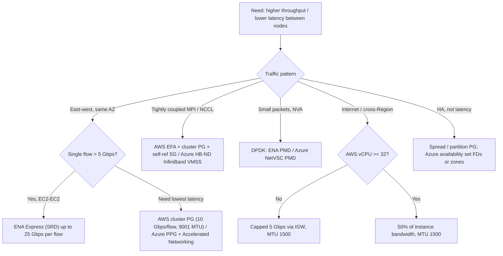
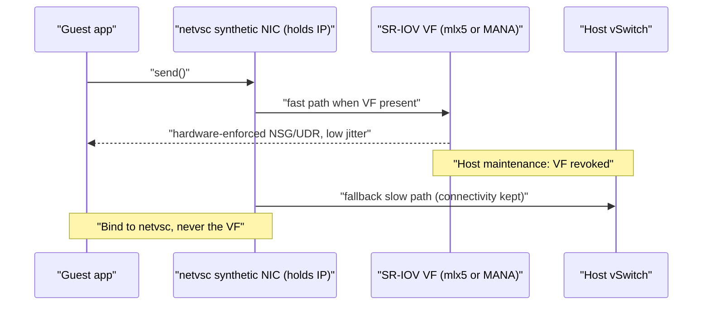

# G4 Network Performance and Optimization
> Last verified: 2026-10 · Audience: senior/staff DevOps, SRE, AI eng, NetEng, DevSecOps, architects

## TL;DR
- Performance is limited at **several layers at once**: the instance/VM size cap (aggregate Gbps), the **per-flow** cap, **PPS**, **tracked connections/flows**, the **path MTU**, and the destination class (same AZ, cross-Region, internet). The lowest one wins. Name the limiter before you tune anything.
- **AWS per-flow:** 5 Gbps single flow (one 5-tuple) outside a **cluster placement group**, 10 Gbps inside one, up to **25 Gbps with ENA Express** (SRD, same Region). Traffic through an **IGW** gets 5 Gbps if the instance has <32 vCPU, otherwise **50% of instance bandwidth**. **Azure** caps **egress only, per VM, for every destination** (ingress is not metered). It publishes **flow/connection limits** (≥500k flows) instead of a per-flow Gbps number.
- **Placement:** AWS has **cluster** (low latency, same AZ), **spread** (7 running instances per AZ per group, separate racks) and **partition** (≤7 partitions per AZ, rack-disjoint, topology visible to the app). Azure's counterparts are **proximity placement groups** (PPG, co-located in one datacenter) for latency and **availability sets / VMSS fault domains** (3 FD, 20 UD) or **zones** for anti-affinity.
- **SR-IOV everywhere:** AWS **ENA** (enhanced networking; the legacy Intel 82599 VF topped out at 10 Gbps). Azure **Accelerated Networking**, where the VF is a Mellanox CX-3/4/5 or **MANA** (Azure Boost) bonded behind a synthetic **netvsc** device. The VF can be **revoked during maintenance**, so apps must bind to the synthetic interface.
- **Kernel bypass:** **DPDK** (poll-mode drivers, hugepages, for NVAs and packet processing) works on both clouds. **AWS EFA** = OS-bypass via **libfabric** + **SRD**, used by **NCCL/NIXL/MPI**. It is **not routable** and can't cross AZs or VPCs. Azure's equivalent is **InfiniBand (NDR 400 Gb/s per port) with RDMA on HB/HC/ND-series**, e.g. ND H100 v5 = 8×400 Gb/s = 3.2 Tbps per VM.
- **MTU:** AWS 9001 inside a VPC. 1500 over IGW, VPN, and cross-Region without TGW. **8500** over TGW and inter-Region VPC peering. Azure defaults to **1500**. Jumbo frames are supported **only inside a VNet and directly peered VNets in the same Region**: **9000 on MANA, 3900 on Mellanox**. Never through gateways, global peering or the internet.
- **Burst credits:** AWS instances ≤16 vCPU ("up to X Gbps") have a **network baseline plus network I/O credits** (separate in/out buckets, 5–60 min, best effort). **EBS-optimized** burst is a separate budget (30 min per 24 h). Azure has **no network-bandwidth credit system** (B-series credits are CPU only). Its credits are **disk/VM-storage bursting** (30 min).
- **Observe drops, not averages:** AWS ENA `ethtool -S` allowance counters (`bw_in/out_allowance_exceeded`, `pps_allowance_exceeded`, `conntrack_allowance_exceeded`, `linklocal_allowance_exceeded`). Azure Monitor **Inbound/Outbound Flows** and **flow creation rate**. Microbursts don't show up in 1-minute CloudWatch or Azure Monitor averages.

## G4.1 Basics of network performance: bandwidth, latency, jitter, throughput, PPS, MTU
- **How it works (definitions an interviewer expects):**
  - **Bandwidth**: the link or allocation capacity (bits/s). In the cloud it is a **per-instance/VM allocation**, not a NIC line rate. AWS specs cover **in and out simultaneously** ("up to 10 Gbps" means 10 in + 10 out). Azure specs are **egress only**, summed across all NICs.
  - **Throughput**: the goodput you actually get. It is bounded by bandwidth, **window/RTT (BDP)**, loss, per-flow caps, CPU, and PPS. For a single TCP flow, throughput ≈ cwnd / RTT. See [F6](../F-network-engineering/F6-network-performance.md) and [H5](../H-full-stack-troubleshooting/H5-network-performance-deep-dive.md).
  - **Latency**: one-way delay or RTT. Its components are propagation, serialization, queuing and processing. Same-AZ RTT is typically tens to hundreds of µs, cross-AZ is about 1–2 ms (unverified, varies by Region), and cross-Region adds tens of ms.
  - **Jitter**: variance in latency. It is driven by queuing, noisy neighbours and host vSwitch processing. SR-IOV/Accelerated Networking reduces it (no host vSwitch in the data path). ENA Express/SRD cuts **tail latency** under congestion.
  - **PPS (packets per second)**: the real limiter for small-packet workloads (DNS, VoIP, gaming, NVAs, key-value stores). Each instance has a **PPS allowance**. You can hit it long before Gbps.
  - **MTU**: the largest L3 packet on a link. Bigger MTU means fewer packets for the same data (lower PPS and CPU), higher efficiency, and a higher single-flow ceiling. TCP **MSS = MTU − 40** (IPv4 + TCP headers without options). MTU details: [F6](../F-network-engineering/F6-network-performance.md), [G12](G12-dedicated-interconnect.md), [H5](../H-full-stack-troubleshooting/H5-network-performance-deep-dive.md).
- **AWS MTU table (verified 2026-10):**

| Path | MTU |
|---|---|
| Within a VPC, intra-Region VPC peering | 9001 (all current-gen types) |
| Transit Gateway (VPC, DX, Connect, peering attachments) | 8500 |
| Inter-Region VPC peering | **8500** (older material says 1500. That is out of date) |
| Internet gateway, Site-to-Site VPN, cross-Region without TGW | 1500 |
| Direct Connect private VIF / transit VIF | 1500 or 9001 / 1500 or 8500 (see [G12](G12-dedicated-interconnect.md)) |

- **Azure MTU:** default **1500**. Larger MTU is supported only inside a VNet and in directly peered VNets in the same Region. Max **9000 on MANA** and **3900 on Mellanox CX-3/4/5** (Windows registry `*JumboPacket` values 9014 / 4088). Not supported through VPN/ExpressRoute gateways, global peering or the internet.
- **PMTUD:** relies on ICMP "Fragmentation Needed" (Type 3 Code 4) for IPv4 and on ICMPv6 Packet Too Big. **NACLs/NSGs that block ICMP break PMTUD**, causing black-hole connections: the handshake works, then large transfers hang. AWS TGW generates PMTUD responses only for traffic coming in on **VPC and Connect** attachments, not on VPN/DX/peering. TGW also performs **MSS clamping**.
- **Trade-offs / when to use:**
  - Use jumbo frames for east-west traffic inside a VPC/VNet and inside a cluster PG (AWS recommends this for max throughput). Keep 1500 on internet-facing interfaces, or set the MTU **per route** or **per ENI**.
  - Optimize for PPS when the workload sends small packets: ENA/AN, DPDK, more queues and vCPUs, a bigger instance size.
- **Interview angles:**
  - "Throughput is far below the instance spec" → check single-flow vs multi-flow (`iperf3 -P 8`), RTT×window (BDP), the allowance counters, and the MTU along the path.
  - "SSH works but scp hangs over VPN/TGW" → MTU/PMTUD black hole. Fix by allowing ICMP, clamping MSS, or lowering the MTU.
  - Pitfall: migrating from VPC peering (9001) to TGW (8500) can drop jumbo packets on asymmetric paths. Update both VPCs together.

## G4.2 Placement groups and dedicated block-storage bandwidth
### Placement groups (AWS) vs PPG / availability sets (Azure)

| AWS strategy | Purpose | Key rules | Azure analogue |
|---|---|---|---|
| **Cluster** | Lowest latency, highest per-flow throughput, high-bisection segment | **Single AZ** (can span **peered VPCs** in the same Region). 10 Gbps single flow. No burstable T-types or M7i-flex. Same type and a single launch request recommended. Internet/DX traffic still limited to 5 Gbps | **Proximity placement group** (one datacenter) + Accelerated Networking. For HPC, a **VMSS with InfiniBand** |
| **Spread** (rack) | Few critical instances on distinct hardware | **Max 7 running instances per AZ per group** (can span AZs: 3 AZ = 21). Host-level spread only on Outposts. No Dedicated Instances. Capacity Reservations don't reserve into it | **Availability set** (up to **3 fault domains / 20 update domains**, 99.95% SLA), or **VMSS Flexible** with FD spreading |
| **Partition** | Large replicated systems (HDFS, HBase, Cassandra, Kafka) | **≤7 partitions per AZ**, each on its own racks. Can be multi-AZ. Instance count limited only by account limits. Partition ID is visible to the app for rack-aware replication. Dedicated Instances limited to 2 partitions | **Availability set FDs** or **VMSS FD count** (`platformFaultDomainCount`). Apps read the FD from IMDS (unverified for all SKUs) |
| **Precision time** (new) | µs clock sync (PTP hardware clock, HW timestamping) | Can be the **parent** of a cluster PG (`--parent-group-id`). No extra charge | No direct equivalent (unverified) |

- **How it works:**
  - **Cluster PG capacity**: the first launch effectively pins the placement. Adding instances later or mixing types raises the odds of **InsufficientInstanceCapacity**. Fix: stop and start all instances so they migrate together. Reserve capacity with an **ODCR in the cluster PG** (zonal RIs can't). **Capacity Blocks for ML don't support PGs.**
  - **Azure PPG**: a **colocation constraint, not a pin**. It is pinned to a datacenter on the first VM deploy and released when everything is deallocated. Use the optional **`intent`** (list of VM sizes, plus an optional `zone`, only together with intent) to pick a datacenter that supports every size. Intent is **not a capacity guarantee**. Errors you'll see: **OverconstrainedAllocationRequest**, **AllocationFailure**. Planned maintenance can leave a PPG **Not aligned**; check `az ppg show --include-colocation-status`. **A PPG cannot span zones.**
- **Trade-offs / when to use:**
  - Cluster PG / PPG gives you latency and less blast-radius protection (same rack or segment), so you get correlated failure. For HA, run one cluster/PPG per AZ and replicate across them.
  - Spread for 2–7 critical nodes (quorum members, primary/standby). Partition for big topology-aware clusters.
  - Azure availability sets are the legacy path. Microsoft now recommends **VMSS Flexible** and zones. Availability sets give **lower latency than zones** but no datacenter-level protection.

### Dedicated block-storage bandwidth
- **AWS EBS-optimized:** **on by default for all current-gen instances** at no extra cost (older generations: optional, hourly fee). Bandwidth to EBS is **dedicated and separate from network I/O**. Smaller sizes have **baseline vs maximum** (e.g. m5.large 650 Mbps baseline / 4,750 Mbps max). They can hold **max for 30 min at least once per 24 h**, then fall back to baseline. Bigger sizes sustain max indefinitely.
  - **Effective EBS performance = min(instance EBS limit, sum of volume limits).** IOPS limits are quoted at 16 KiB I/O, throughput at 128 KiB.
  - **New (8th/9th gen M/C/R/X, e.g. M8g, C8i, R8a):** **configurable bandwidth weighting** between VPC networking and EBS (verify the per-type options).
- **Azure:** published per VM size as **remote storage (uncached) IOPS/MBps** and **cached/temp-disk limits**, separate from "expected network bandwidth". Disk traffic rides a **prioritized network channel** over regular traffic. **Effective = min(disk limit, VM uncached limit)**. Example: a D8s_v3 caps three P30 disks at 12,800 uncached IOPS. Host caching (ReadOnly/ReadWrite) adds a separate cached budget, so cached + uncached can be summed.
- **Interview angles:**
  - "DB on a small instance is fast for 30 min then slows down" → EBS burst exhausted (AWS) or VM/disk burst credits exhausted (Azure). Check `EBSIOBalance%` / `EBSByteBalance%` (CloudWatch) or Azure `VM Uncached Bandwidth Consumed Percentage`.
  - "Added faster disks, nothing changed" → you hit the VM/instance cap, not the disk cap.

## G4.3 Enhanced (SR-IOV) networking
- **How it works:**
  - **SR-IOV**: the physical NIC exposes **Virtual Functions** mapped straight into the guest. This removes the hypervisor vSwitch from the data path, which gives higher PPS, lower and more consistent latency, and less CPU.
  - **AWS:** **ENA** on all **Nitro** instances. Security-group, routing and encap policy are enforced on the **Nitro card**. The doc states "up to 100 Gbps" for ENA, but newer network-optimized types and multi-network-card instances go far higher (e.g. c6in 200 Gbps, GPU types at 3,200 Gbps via multiple cards plus EFA, unverified for the latest families). Legacy **Intel 82599 VF** (C3/C4/M4/R3/I2/D2) tops out at **10 Gbps**. Enable or check with `enaSupport` / `sriovNetSupport` and `ethtool -i eth0` (driver `ena`). No extra charge.
  - **ENA Express** (**SRD** on standard ENA): sprays a flow over multiple paths and reorders at the receiver. **Single flow 5 → 25 Gbps** (up to the instance limit), lower **p99.9 tail latency** under congestion. Both ends must be supported types with it enabled (UDP is a separate opt-in). Same Region (cross-AZ supported except in a few Regions). **No middleboxes** in the path. Needs a slightly **lower MTU** for SRD headers; TCP MSS is clamped automatically, UDP is not. Not supported in Local Zones. Median latency can rise by tens of µs when the network is idle.
  - **Azure Accelerated Networking (AN):** the VF (**Mellanox ConnectX-3/4 Lx/5** or **MANA**) is **transparently bonded under the synthetic `hv_netvsc` interface**, which holds the IP. NSG/UDR/policy is offloaded to hardware (FPGA/SmartNIC, "Azure Boost"). It **can't be toggled on a running VM** (stop/deallocate first). Supported on most general-purpose and compute sizes with ≥2 vCPU (≥4 with hyperthreading). **NC/NV sizes ignore it.** The benefit is end-to-end only when **both VMs** have AN, and it has little effect across VNets or to on-prem.
  - **MANA** (Microsoft Azure Network Adapter, part of **Azure Boost**): Microsoft's own NIC with forward-compatible drivers. Images must carry **both** `mana` and `mlx4/mlx5` drivers because a VM can land on either hardware. As of 2026 the v5 Intel and Cobalt 100 v6 sizes are being placed on MANA hardware (earliest 26 May 2026). Linux kernel ≥6.14 is recommended for custom builds. If the guest lacks a driver, traffic falls back to the **synthetic vSwitch path** (slow but working).
- **Trade-offs / when to use:**
  - Always on in practice: AWS Nitro uses ENA by default, and Azure turns AN on by default in most portal/CLI flows for supported sizes (verify for your template). It doesn't raise the **allocation cap**, it helps you **reach** it.
  - Azure custom images: mark SR-IOV VFs as **unmanaged** (udev rule / `azure-vm-utils` ≥0.6.0, cloud-init ≥23.2), and never bind apps to the VF.
- **Interview angles:**
  - "Azure VM lost network during host maintenance" → the app or NVA was bound to the VF instead of netvsc. VF revocation is normal.
  - "Does AN increase my bandwidth?" → No. It cuts latency, jitter and CPU, and raises achievable PPS. The size cap still applies.
  - ENA Express vs cluster PG: ENA Express gives 25 Gbps per flow **without** co-location constraints, including cross-AZ. A cluster PG gives the lowest absolute latency.

## G4.4 DPDK and kernel-bypass network adapters
- **How it works:**
  - **DPDK**: user-space **poll-mode drivers (PMD)** with **hugepages** and dedicated cores. No interrupts, context switches or kernel stack, so you get very high PPS. Typical users: **NVAs** (virtual routers, firewalls, LBs, 5G packet core, DDoS scrubbers).
    - **AWS:** the ENA PMD (`net_ena`) is upstream in DPDK. ENA allowance counters are available through DPDK xstats (DPDK ≥20.11). Fragment proxy mode needs DPDK ≥25.03.
    - **Azure:** requires **AN**, and **≥2 NICs** (keep management on a non-AN NIC). Run the **NetVSC PMD** as the master PMD (recommended, DPDK ≥22.11 LTS; failsafe PMD is deprecated) so you still get packets that arrive on the synthetic path and **survive VF revocation**. Needs the RDMA verbs drivers `mlx4_ib`/`mlx5_ib`/`mana_ib`. On MANA it needs kernel ≥6.14.
  - **AWS EFA (Elastic Fabric Adapter):** **OS-bypass** through **libfabric** (OFI). Transport is **SRD** (reliable, out-of-order, multipath, with congestion control). Consumed by **NCCL ≥2.4.2 (via aws-ofi-nccl)**, **NIXL** (disaggregated inference KV transfer), **Open MPI ≥4.1**, **Intel MPI 2019 U5+** and the **Neuron SDK**. **RDMA read/write** on Nitro v4+. **GPUDirect RDMA** on P5/P5e/P5en/P6 and similar.
    - Interface types: **EFA with ENA** (EFA + IP) and **EFA-only** (no IP, can't be primary). Both count against the ENI limit.
    - **EFA traffic is not routable and can't cross AZs or VPCs.** In practice: same subnet, same **cluster PG**, and a security group that **allows all traffic to and from itself** (self-referencing SG, inbound and outbound).
    - One EFA per network card on multi-card instances (e.g. 32 EFAs on p5.48xlarge for 3,200 Gbps, unverified count). P4d/P4de/DL1 EFA traffic can't talk to other types. Not on Outposts. Windows only for CDI SDK. **No extra charge.**
  - **Azure equivalent: InfiniBand + RDMA** on **HB/HC (HPC)** and **ND (AI)** series, e.g. **HBv4** = 400 Gb/s **NDR** in a non-blocking fat tree. **ND H100 v5** = 8 GPUs, each with its own **400 Gb/s Quantum-2 CX7** link, so **3.2 Tbps per VM**, with **GPUDirect RDMA**. IB is SR-IOV'd into the VM and **auto-configured between VMs in the same VMSS** (or availability set). It is a **separate fabric from the VNet**, so NSGs/UDRs don't govern it (unverified wording). NCCL runs over IB verbs (UCX/HPC-X images).
- **Trade-offs / when to use:**
  - DPDK: big PPS gains, but you **own the stack** (no kernel TCP/IP, no iptables/tcpdump by default) and you burn dedicated cores. Only worth it for packet-processing apps.
  - EFA/IB: required for scaling **tightly coupled MPI** and **multi-node training** (all-reduce). Without them, NCCL falls back to TCP sockets and collective time dominates the step.
- **Interview angles:**
  - "Design multi-node LLM training on AWS" → p5/p6 in a **cluster PG** (or **EC2 UltraClusters / Capacity Blocks**, which handle placement themselves because Capacity Blocks don't take user PGs), EFA on every card, self-referencing SG, aws-ofi-nccl, FSx for Lustre. On Azure: **ND H100/H200/GB200 VMSS** with InfiniBand, CycleCloud/AKS, Azure Managed Lustre. See [K5 training](../K-ai-infra-llm/K5-training-fine-tuning.md) and [K4 serving](../K-ai-infra-llm/K4-llm-serving-inference.md).
  - "Why is EFA traffic failing across subnets?" → EFA (SRD) isn't routable. Only the ENA/IP part is.
  - Kernel-bypass background: [A7 sockets](../A-operating-systems/A7-socket-management.md).

## G4.5 Bandwidth limits inside and outside the virtual network
- **How it works (AWS):**
  - **Aggregate instance bandwidth** scales with size (e.g. m5.8xlarge 10 Gbps, m5.16xlarge 20 Gbps) and applies to **in and out separately**.
  - **Single flow** (a TCP/UDP 5-tuple; for GRE/IPsec the 3-tuple src/dst/proto): **5 Gbps** outside a cluster PG, **10 Gbps** inside one, **25 Gbps** with ENA Express. You can also use **MPTCP** or multiple flows.
  - **Through an IGW or local gateway** (internet, and by AWS's wording effectively cross-Region public paths): **<32 vCPU → 5 Gbps. Above 32 vCPU → 50% of instance bandwidth.** The doc's wording leaves exactly 32 vCPU ambiguous, though its m5.16xlarge (64 vCPU) example gets 10 of 20 Gbps. **Exception (2026):** C8in/M8in/R8in-class network-optimized types get their **full baseline** to the IGW.
  - **Cluster PG** members: internet and **Direct Connect** traffic is still limited to **5 Gbps**.
  - **S3 in the same Region** (public IPs or a gateway/interface endpoint) can use the **full aggregate** bandwidth, even from a cluster PG.
  - Other per-instance allowances: **PPS**, **conntrack** (security-group connection tracking; untracked flows avoid it), **link-local 1024 PPS per ENI** to Route 53 Resolver (.2), IMDS and Time Sync. When exceeded, packets are **queued, then dropped**.
  - Hops outside the instance have their own caps: **TGW 100 Gbps / 7.5M PPS per VPC attachment per AZ**, a **TGW Connect peer 5 Gbps**, a **VPN tunnel ~1.25 Gbps** (scale with ECMP on TGW; see [G10](G10-site-to-site-vpn.md)), and the NAT GW per-gateway limits ([G1](G1-virtual-network-fundamentals.md)).
- **How it works (Azure):**
  - **Egress-only cap per VM**, **summed across all NICs**, for **all destinations and protocols** (same VNet, peered, internet, all count the same). **Ingress isn't capped directly** (CPU and storage still limit it). Accelerated Networking does **not** raise the cap.
  - **Flow limits**: each TCP/UDP connection = **2 flows** (in and out). Azure supports **≥500k total connections** on every size. Recommended **connections**: 2–7 vCPU **100k**, 8–15 **500k**, 16–31 **700k**, 32–63 **800k**, 64+ **1M** (or **2M** on Azure Boost/MANA sizes). **NVAs should use half** (forwarding doubles the flows). Watch flow **creation rate** too, because it shares CPU with packet processing. Network-optimized sizes publish higher limits ("connection acceleration"). Benchmark with the **NCPS** tool.
  - No published per-flow Gbps cap equivalent to AWS's 5/10 Gbps. A single TCP flow is bounded by window, RTT and host processing (unverified, so benchmark with ntttcp/iperf3).
- **Trade-offs / when to use:**
  - Design for **many flows** (parallel S3/Blob multipart, `iperf3 -P`, ECMP across tunnels, multiple Kafka partitions) rather than one fat flow.
  - Internet-heavy egress on AWS: pick ≥32 vCPU or network-optimized "n" types, or scale out horizontally behind NLB/ALB/CloudFront ([I3](../I-dns-tls-acceleration-gaps/I3-acceleration.md)).
- **Interview angles:**
  - "Single S3/DB replication stream stuck at 5 Gbps on a 100 Gbps instance" → the per-flow cap. Use multiple streams, ENA Express (EC2 to EC2), or a cluster PG.
  - "NVA on Azure drops connections at scale" → flow table exhaustion (the half-limit rule for NVAs). Scale out behind a Gateway LB/ILB, or use bigger or network-optimized sizes.
  - "Spec says 25 Gbps and conntrack drops appear" → SG connection tracking exhausted. Use untracked rules (allow-all symmetric), raise the size, or tune idle timeouts.

## G4.6 Burstable network bandwidth credits
- **How it works (AWS):**
  - Instances **≤16 vCPU (≤4xlarge)** are listed as **"up to X Gbps"**. They have a **baseline** (e.g. c5.large 0.75 Gbps, c5.xlarge 1.25, c5.2xlarge 2.5, c5.4xlarge 5.0 vs "up to 10") and burst using **network I/O credits**.
  - Credits are **full at launch**, **earned while below baseline**, **not earned while stopped**, and kept in **separate inbound and outbound buckets**. Burst lasts **~5–60 min depending on size** and is **best effort** (a shared resource) even with credits.
  - Find the baseline with `aws ec2 describe-instance-types --query '...NetworkCards[0].BaselineBandwidthInGbps'`. The console doesn't show it.
  - It is separate from **T-family CPU credits** and from the **EBS-optimized 30 min / 24 h burst**.
- **How it works (Azure):**
  - **No network-bandwidth credit system.** VM network caps are a fixed max (e.g. all **Bsv2** sizes list up to 6.25 Gbps max), and B-series credits are **CPU-only**.
  - Credits that do exist are **storage**: **VM-level bursting** (credit-based, enabled by default on most Premium-storage sizes) and **disk-level bursting**. Disk bursting is credit-based for **Premium SSD ≤512 GiB (P20 and smaller)** and **Standard SSD ≤1 TiB (E30 and smaller)**, e.g. P4 goes from 120 IOPS/25 MB/s to 3,500 IOPS/170 MB/s. **On-demand** (paid) bursting is for Premium SSD >512 GiB, e.g. P30 up to 30,000 IOPS / 1,000 MB/s. Buckets start full and allow **30 min at max burst**, refilling in under a day.
- **Trade-offs / when to use:**
  - "Up to" sizes suit spiky workloads (CI runners, small web tiers). For sustained transfers, size on **baseline**, not on the "up to" number.
  - Load tests on fresh instances are misleading: you're spending launch credits. Run long enough to drain them (see [J5](../J-sre/J5-capacity-planning-load-testing.md)).
- **Interview angles:**
  - "Nightly backup on c5.xlarge fast for 20 min then 1.25 Gbps" → network credits drained. Move to a size whose **baseline** fits, or spread the job.
  - "Equivalent on Azure?" → No network credits. Size on the published egress Mbps. Bursting talk on Azure means disks or VM storage.

## Diagrams




## Cloud mapping: AWS vs Azure
| Capability | AWS | Azure | Role it plays | Key differences | Alternatives |
|---|---|---|---|---|---|
| Low-latency co-location | Cluster placement group | Proximity placement group (+ `intent`) | Same rack/segment or datacenter for µs-level RTT | AWS: per-flow 10 Gbps boost and single AZ. Azure: colocation constraint pinned on first deploy, can't span zones | Bare metal / on-prem HPC; GCP compact placement |
| Hardware anti-affinity | Spread PG (7 per AZ), partition PG (7 partitions per AZ) | Availability set (3 FD / 20 UD), VMSS Flexible FDs, zones | Limit correlated failure | AWS partition exposes partition ID. Azure AS is legacy, VMSS Flex preferred | K8s topology spread constraints / pod anti-affinity |
| SR-IOV NIC | ENA (Nitro); Intel 82599 VF legacy | Accelerated Networking (Mellanox CX / MANA, Azure Boost) | Bypass the host vSwitch: PPS, latency, CPU | Azure VF bonded under netvsc and revocable. Toggle only when deallocated | — |
| Per-flow acceleration | ENA Express (SRD), 25 Gbps/flow | No direct equivalent (unverified) | Multipath single flow, lower tail latency | AWS-only. Same Region, no middleboxes | MPTCP, multiple flows |
| Kernel bypass for packets | DPDK ENA PMD | DPDK NetVSC PMD (Mellanox or MANA) | NVA-grade PPS | Azure needs AN, 2+ NICs, master PMD | VPP, XDP/AF_XDP |
| HPC/ML fabric | EFA (SRD, libfabric, RDMA, GPUDirect) | InfiniBand NDR/HDR RDMA on HB/HC/ND | Collective comms (NCCL/MPI) | EFA rides the Ethernet fabric and isn't routable. Azure IB is a separate fabric scoped to a VMSS | On-prem IB / RoCE; GCP GPUDirect-TCPX/RDMA |
| Storage bandwidth | EBS-optimized dedicated bandwidth (30 min/24 h burst), configurable weighting on 8th gen+ | VM uncached/cached disk caps, VM-level and disk bursting | Keep storage I/O from starving the network | Azure publishes storage caps separately and prioritizes disk traffic | Instance store / local NVMe; Lustre |
| Bandwidth caps | Per instance in+out, 5/10/25 Gbps per flow, 50% via IGW (≥32 vCPU) | Per-VM egress only, all destinations, flow limits | Fair share on shared hosts | Azure ingress not metered. AWS destination-dependent | — |
| Network burst | Network I/O credits (≤16 vCPU) | None (CPU and disk credits only) | Burst over baseline | AWS-only concept | — |
| Jumbo frames | 9001 VPC, 8500 TGW/inter-Region peering, 1500 IGW/VPN | 1500 default. 9000 MANA / 3900 Mellanox within VNet and same-Region peering | Fewer packets, more throughput | Azure jumbo has a narrow scope and isn't through gateways | — |
| Drop telemetry | ENA `ethtool -S` allowance counters → CloudWatch agent | Azure Monitor Inbound/Outbound Flows, flow creation rate | Detect shaping or drops | AWS exposes per-cause counters | eBPF / node-exporter |

- **Cluster PG vs PPG:** both trade resilience for latency. AWS's version also lifts the per-flow cap. Azure's is about datacenter colocation inside a Region/AZ and is best paired with AN. Both suffer capacity errors when you grow incrementally: use an ODCR in the cluster PG on AWS, `intent` plus one ARM template on Azure.
- **EFA vs InfiniBand:** EFA is AWS's custom Ethernet transport (SRD), so it shares the VPC fabric but is constrained to one subnet/AZ/VPC. Azure gives you real InfiniBand (a separate, non-blocking fat tree), which is closer to an on-prem supercomputer. Both are free features of the instance price.
- **Bandwidth accounting:** AWS meters both directions and varies by destination (IGW 50%, single-flow caps). Azure meters egress only and the same for every destination, but publishes **connection/flow budgets** that NVAs and proxies hit first.
- **Alternatives:** Kubernetes topology-aware routing and pod anti-affinity sit on top of these primitives. In Kafka/Spark/Databricks, use rack-awareness (partition PG IDs or Azure FDs). For edge and internet throughput, Cloudflare/CloudFront/Front Door bypass per-instance IGW caps by terminating at the edge.

## Hands-on (optional)
```hcl
# AWS: cluster placement group + EFA-ready instance (same subnet, self-referencing SG)
resource "aws_placement_group" "train" {
  name     = "train-cluster"
  strategy = "cluster"            # or "spread" (spread_level = "rack") / "partition" (partition_count <= 7)
}

resource "aws_security_group" "efa" {
  name   = "efa-self"
  vpc_id = var.vpc_id
  ingress { from_port = 0, to_port = 0, protocol = "-1", self = true }
  egress  { from_port = 0, to_port = 0, protocol = "-1", self = true }
}

resource "aws_instance" "node" {
  count           = 2
  ami             = var.dlami_id
  instance_type   = "p5.48xlarge"
  placement_group = aws_placement_group.train.id
  network_interface {
    network_interface_id = aws_network_interface.efa[count.index].id
    device_index         = 0
  }
}

resource "aws_network_interface" "efa" {
  count           = 2
  subnet_id       = var.subnet_id          # EFA traffic is not routable: one subnet
  security_groups = [aws_security_group.efa.id]
  interface_type  = "efa"                  # or "efa-only" for secondary cards
}

# Azure: proximity placement group with intent + Accelerated Networking NIC
resource "azurerm_proximity_placement_group" "ppg" {
  name                = "ppg-lowlat"
  location            = var.location
  resource_group_name = var.rg
  zone                = "1"                              # only valid together with allowed_vm_sizes (intent)
  allowed_vm_sizes    = ["Standard_D16s_v5", "Standard_E16s_v5"]
}

resource "azurerm_network_interface" "nic" {
  name                           = "nic-app"
  location                       = var.location
  resource_group_name            = var.rg
  accelerated_networking_enabled = true                 # azurerm v4 name; v3 = enable_accelerated_networking
  ip_configuration {
    name                          = "ipcfg"
    subnet_id                     = var.subnet_id
    private_ip_address_allocation = "Dynamic"
  }
}
# azurerm_linux_virtual_machine: set proximity_placement_group_id = azurerm_proximity_placement_group.ppg.id
```

```bash
# Is the bottleneck an allowance? (AWS ENA) - non-zero and growing = shaping/drops
ethtool -S eth0 | grep -E 'allowance_exceeded|conntrack_allowance_available'
ethtool -i eth0 | grep -E 'driver|version'      # ena (AWS) / mlx5_core or mana (Azure VF)

# Path MTU check: 9001 - 28 (IP+ICMP) = 8973; 1500 - 28 = 1472
ping -M do -s 8973 -c 3 10.0.1.20
tracepath 10.0.1.20

# Single vs multi-flow (shows the 5/10 Gbps per-flow cap on AWS)
iperf3 -c 10.0.1.20 -t 30          # 1 flow
iperf3 -c 10.0.1.20 -t 30 -P 8     # 8 flows

# Baseline vs burst network bandwidth for a family
aws ec2 describe-instance-types --filters Name=instance-type,Values='c5.*' \
  --query 'InstanceTypes[].[InstanceType,NetworkInfo.NetworkPerformance,NetworkInfo.NetworkCards[0].BaselineBandwidthInGbps]' --output table

# Azure PPG alignment after maintenance
az ppg show -g rg1 -n ppg-lowlat --include-colocation-status -o jsonc
```

## Cross-links
- [F6 Network performance](../F-network-engineering/F6-network-performance.md): BDP, MTU/MSS, latency theory.
- [H5 Network performance deep dive](../H-full-stack-troubleshooting/H5-network-performance-deep-dive.md): MTU black holes, TCP tuning.
- [G1 Virtual network fundamentals](G1-virtual-network-fundamentals.md): IGW, NAT GW, SG/NACL (ICMP for PMTUD).
- [G5 Traffic monitoring & troubleshooting](G5-traffic-monitoring-troubleshooting.md): flow logs, metrics.
- [G8 Transit hub](G8-transit-hub.md): TGW 8500 MTU, attachment bandwidth.
- [G10 Site-to-site VPN](G10-site-to-site-vpn.md): 1500 MTU, ECMP for tunnel bandwidth.
- [G12 Dedicated interconnect](G12-dedicated-interconnect.md): DX/ExpressRoute jumbo frames.
- [A7 Socket management](../A-operating-systems/A7-socket-management.md): kernel stack vs bypass.
- [K5 Training & fine-tuning](../K-ai-infra-llm/K5-training-fine-tuning.md) and [K4 LLM serving](../K-ai-infra-llm/K4-llm-serving-inference.md): NCCL/EFA/IB, NIXL.
- [J5 Capacity planning & load testing](../J-sre/J5-capacity-planning-load-testing.md): burst credits distort tests.
- [C1 Performance](../C-large-scale-architecture/C1-performance.md): latency overlaps (C1.6 to C1.15).

## Sources
- https://docs.aws.amazon.com/AWSEC2/latest/UserGuide/ec2-instance-network-bandwidth.html
- https://docs.aws.amazon.com/AWSEC2/latest/UserGuide/network_mtu.html
- https://docs.aws.amazon.com/AWSEC2/latest/UserGuide/placement-strategies.html
- https://docs.aws.amazon.com/AWSEC2/latest/UserGuide/enhanced-networking.html
- https://docs.aws.amazon.com/AWSEC2/latest/UserGuide/ena-express.html
- https://docs.aws.amazon.com/AWSEC2/latest/UserGuide/monitoring-network-performance-ena.html
- https://docs.aws.amazon.com/AWSEC2/latest/UserGuide/efa.html
- https://docs.aws.amazon.com/AWSEC2/latest/UserGuide/ebs-optimized.html
- https://docs.aws.amazon.com/vpc/latest/tgw/transit-gateway-quotas.html
- https://learn.microsoft.com/en-us/azure/virtual-network/virtual-machine-network-throughput
- https://learn.microsoft.com/en-us/azure/virtual-network/how-to-virtual-machine-mtu
- https://learn.microsoft.com/en-us/azure/virtual-network/accelerated-networking-overview
- https://learn.microsoft.com/en-us/azure/virtual-network/accelerated-networking-mana-overview
- https://learn.microsoft.com/en-us/azure/virtual-network/setup-dpdk
- https://learn.microsoft.com/en-us/azure/virtual-machines/co-location
- https://learn.microsoft.com/en-us/azure/virtual-machines/availability-set-overview
- https://learn.microsoft.com/en-us/azure/virtual-machines/disks-performance
- https://learn.microsoft.com/en-us/azure/virtual-machines/disk-bursting
- https://learn.microsoft.com/en-us/azure/virtual-machines/sizes/gpu-accelerated/ndh100v5-series
- https://learn.microsoft.com/azure/virtual-machines/hbv4-series
- https://learn.microsoft.com/en-us/azure/virtual-machines/sizes/general-purpose/bsv2-series
