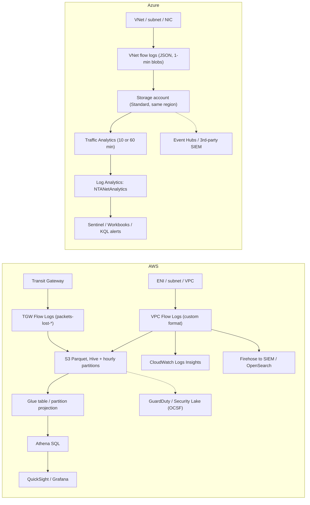
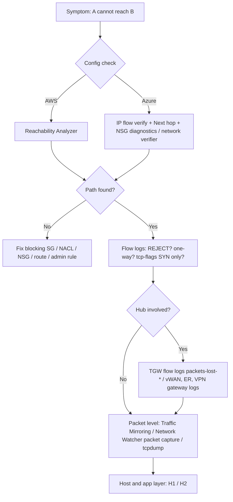

# G5 Traffic Monitoring, Troubleshooting & Analysis
> Last verified: 2026-10 · Audience: senior/staff DevOps, SRE, AI eng, NetEng, DevSecOps, architects

## TL;DR
- **There are four kinds of tool, and each answers a different question:**
  - **Flow logs** are L3/L4 metadata (who talked to whom, how much, and whether it was accepted or rejected). AWS: **VPC Flow Logs** and **Transit Gateway Flow Logs**. Azure: **VNet flow logs** with **Traffic Analytics**.
  - **Packet mirroring/capture** gives you full payloads. AWS: **Traffic Mirroring**. Azure: **virtual network TAP** (public preview) and **Network Watcher packet capture**.
  - **Reachability analysis** reads the configuration and answers "can A reach B, and what blocks it?" AWS: **Reachability Analyzer**. Azure: **Network Watcher** (IP flow verify, next hop, NSG diagnostics, connection troubleshoot) and the **AVNM network verifier**.
  - **Access/compliance analysis** answers "which paths exist that should NOT?" AWS: **Network Access Analyzer**. Azure: **AVNM network verifier**, **Azure Policy** and **Defender for Cloud**.
- **Flow logs are sampled metadata, not a packet log.** They are aggregated per 5-tuple per ENI/NIC over 1–10 min windows and delivered best-effort in about 5–10 min. They have no payload, no L7 information, and no DNS query names. Some traffic is never logged: on AWS that includes Amazon DNS, IMDS, DHCP, ARP and Time Sync.
- **AWS custom format matters:** `pkt-srcaddr/pkt-dstaddr` (the real IP behind NAT GW or EKS pods), `tcp-flags` (SYN=2, SYN-ACK=18, FIN=1, RST=4, OR-ed together), `flow-direction`, `traffic-path` (1–8), `reject-reason` (BPA/EC), and newer `next-hop-*` / tag fields. **You can't change a flow log's format after creation.** Delete it and create a new one.
- **Azure NSG flow logs are retiring.** New ones can't be created (blocked from 30 Jun 2025). Full retirement is **30 Sep 2027**, when existing NSG flow log resources and their Traffic Analytics are removed. **VNet flow logs** replace them: one config per VNet/subnet/NIC, AVNM security admin rule visibility, encryption status, and a `D` (deny) flow state.
- **Traffic Mirroring = Nitro ENI → VXLAN UDP 4789 → target**, where the target is an ENI, an NLB, or a GWLB endpoint. Limits: 3 sessions per source ENI, filters, truncation. It's costly, so use it **for targeted IDS/forensics, not always-on for everything**.
- **Reachability Analyzer never sends packets.** It is a static model of SG, NACL, route tables, TGW, LB and Network Firewall. Network Watcher's **connection troubleshoot / connection monitor** *do* send synthetic probes. Know which is which.
- **A good escalation ladder is:** config check (Reachability Analyzer / IP flow verify / next hop) → flow logs (was it REJECTed, and where?) → TGW flow logs (`packets-lost-*`) → mirroring/packet capture (payload, TLS, retransmits) → host tools (see [H1](../H-full-stack-troubleshooting/H1-linux-network-diagnostics.md)).

## G5.1 Network flow logs

### AWS VPC Flow Logs
- **How it works:**
  - **Scope:** you can attach to a **VPC, subnet, or ENI**. VPC and subnet scope cover every ENI in them, including requester-managed ENIs for ELB, NAT GW, RDS, Lambda in a VPC and interface endpoints. **TGW and TGW attachments** have their own flow logs (see below).
  - **Filter:** `ACCEPT`, `REJECT` or `ALL`.
  - **Aggregation interval:** the maximum is **10 min (default) or 1 min**. **Nitro instances always use ≤1 min**, whatever you set.
  - **Delivery is best-effort:** about **5 min to CloudWatch Logs** and about **10 min to S3**. Don't build sub-minute alerting on it.
  - **Destinations:**
    - **CloudWatch Logs**, which needs an IAM role. Query it with Logs Insights.
    - **S3**, which needs a bucket policy. Format is **text or Parquet**, and both are gzip-compressed. Parquet queries are **10–100× faster** and use about 20% less storage. Options include **Hive-compatible prefixes** and **hourly partitions**. Files are published every 5 min.
    - **Amazon Data Firehose**, which can also be cross-account and feed Splunk, OpenSearch or a SIEM.
  - **Pricing:** billed as CloudWatch **vended logs**, by ingestion GB (tiered), plus destination storage.
  - **Quotas:** max **250 flow-log subscriptions per resource**.
  - **Default format = the v2 fields:** `version account-id interface-id srcaddr dstaddr srcport dstport protocol packets bytes start end action log-status`.
  - **`log-status` values:** `OK`, `NODATA` (no traffic in the window) and `SKIPDATA` (records dropped because of internal capacity or an error).
  - **Custom format fields worth knowing (version in brackets):**

    | Field | Ver | Why interviewers care |
    |---|---|---|
    | `vpc-id`, `subnet-id`, `instance-id` | 3 | Enrichment without joins |
    | `tcp-flags` | 3 | Bitmask: **FIN=1, SYN=2, RST=4, SYN-ACK=18**. OR-ed within the window (e.g. 19 = SYN-ACK+FIN, 3 = SYN+FIN). Pure ACK/PSH reports **0**. A lone SYN with no SYN-ACK on the return record points to a silent drop or SYN scan. |
    | `pkt-srcaddr`, `pkt-dstaddr` | 3 | The **original** IP. On a **NAT GW ENI**, `srcaddr` is the NAT GW private IP and `pkt-srcaddr` is the instance. For **EKS pods** with a secondary IP, `dstaddr` falls back to the ENI's primary IP while `pkt-dstaddr` is the pod IP. |
    | `type` | 3 | IPv4 / IPv6 / EFA |
    | `region`, `az-id`, `sublocation-*` | 4 | Spotting cross-AZ cost (use az-id, not AZ name) |
    | `pkt-src-aws-service`, `pkt-dst-aws-service` | 5 | Tags S3, DYNAMODB, EC2, ROUTE53_RESOLVER, CLOUDFRONT… ranges |
    | `flow-direction` | 5 | ingress / egress relative to the ENI |
    | `traffic-path` | 5 | Egress only: **1** same VPC (incl. AWS-managed ENI/Outpost LGW), **2** IGW or gateway endpoint, **3** VGW, **4** intra-region peering, **5** inter-region peering, **6** Local/Wavelength Zone, **7** gateway VPC endpoint, **8** IGW |
    | `ecs-*` (cluster, service, task ARN, container id…) | 7 | Per-task attribution (awsvpc mode only) |
    | `reject-reason` | 8 | **BPA** (VPC Block Public Access) or **EC** (VPC Encryption Controls) |
    | `resource-id` | 9 | Regional NAT gateway ID |
    | `encryption-status` | 10 | 0 none, 1 Nitro-encrypted, 2 app-encrypted (inferred from port 443 for endpoints), 3 both |
    | `instance-tag`, `interface-tag`, `asg-tag` (+`-2`), `interface-type`, `next-hop-interface-id/subnet-id/vpc-id/az-id/interface-type` | 11 | Tag-based attribution (uses a service-linked role and EventBridge managed rules). Next-hop shows the middlebox ENI (e.g. TGW attachment). It is not available for IGW, cross-region, or some ingress. |

- **What is NOT logged (classic exam trap):**
  - Traffic to the **Amazon DNS server / Route 53 Resolver** (`.2` / 169.254.169.253). Traffic to your own DNS server *is* logged. Use **Route 53 Resolver query logs** for DNS names.
  - **IMDS 169.254.169.254**, **Time Sync 169.254.169.123**, **DHCP**, **ARP**, Windows license activation, and traffic to the **reserved VPC router IP**.
  - **Mirrored source traffic.** Only the copy arriving at the target is logged.
  - Endpoint ENI ↔ NLB ENI traffic.
- **Other gotchas:**
  - **You can't modify a flow log** (role, format, fields). Delete it and recreate.
  - You **can't enable flow logs on a peer VPC in another account**.
  - Traffic to a **secondary IP** shows the **primary IP** in `dstaddr`. Use `pkt-dstaddr`.
  - **Security groups are stateful.** An allowed inbound flow's response is ACCEPTed even if outbound rules would deny it.
  - **NACLs are stateless.** An inbound ACCEPT followed by an outbound REJECT on the same tuple almost always means the NACL is missing the **ephemeral port range (1024–65535)** outbound.
  - `REJECT` also covers packets that arrive after the connection was closed.

### AWS Transit Gateway Flow Logs
- **How it works:**
  - Configured on the **TGW or a TGW attachment**, and owned by the TGW owner.
  - Destinations: CloudWatch Logs, S3 or Firehose.
  - The default format includes v2–v6 fields.
  - **TGW-only fields:** `tgw-id`, `tgw-attachment-id`, `tgw-pair-attachment-id`, `tgw-src/dst-vpc-id`, `tgw-src/dst-vpc-account-id`, `tgw-src/dst-subnet-id`, `tgw-src/dst-eni`, `tgw-src/dst-az-id`, `resource-type=TransitGateway`.
  - **Drop counters (the killer feature):** `packets-lost-no-route`, `packets-lost-blackhole`, `packets-lost-mtu-exceeded`, `packets-lost-ttl-expired`.
  - Its `tcp-flags` includes **PSH=8, ACK=16, URG=32**, unlike VPC flow logs. An ACK-only record still reports 0.
- **Limitations:**
  - **Multicast** isn't logged.
  - **Connect attachments** (GRE/BGP) aren't logged separately. Their flows appear under the transport attachment.
  - Max 250 subscriptions per resource.
- **When to use:** central hub/spoke visibility in **one** log instead of N spoke VPC logs. It also proves TGW-side drops (blackhole route, MTU **8500 bytes** across TGW VPC attachments, 1500 for VPN). See [G8](G8-transit-hub.md) and [G4](G4-network-performance-and-optimization.md).

### Azure: NSG flow logs → VNet flow logs (+ Traffic Analytics)
- **NSG flow logs (legacy):**
  - JSON, collected every **1 min**, written to **Storage** as `PT1H.json` blobs per NSG per MAC.
  - **v1** records 5-tuple + decision. **v2** adds flow state **B/C/E** plus packet/byte counts. `C` records come every 5 min.
  - **Retiring:** new NSG flow logs can no longer be created (blocked from **30 Jun 2025**). Retirement is **30 Sep 2027**. After that, the flow-log resources and NSG-based Traffic Analytics are deleted, but existing blobs stay under their retention policy. A migration script/portal flow exists.
  - **Pain points:** subnet NSG and NIC NSG both need logging, and the "last NSG processed" logs the flow in an order that depends on the platform. Bytes/packets are missing for stateless non-default inbound TCP rules (fix: set `FlowTimeoutInMinutes` 4–30). App Gateway v2 subnets aren't supported. v6 VM sizes aren't supported.
- **VNet flow logs (current):**
  - Enable at **VNet, subnet or NIC** scope. Records include:
    - `aclID` (NSG **or AVNM security admin rule**) and `rule`
    - tuple `ts,src,dst,sport,dport,proto(IANA number),dir(I/O),state,encryption,pktsSent,bytesSent,pktsRecv,bytesRecv`
  - **Flow state:** `B` begin, `C` continuing (5-min stats), `E` end, **`D` deny**.
  - **Encryption values:** `X` = encrypted (VNet encryption). `NX` = not encrypted. `NX_*` variants (`NX_HW_NOT_SUPPORTED`, `NX_NOT_ACCEPTED`, `NX_LOCAL_DST`, `NX_FALLBACK`, …) explain why.
  - **Also covers** VPN/ExpressRoute gateways, App Gateway, APIM (VNet-injected) and stateless flow bytes. It also shows **platform rule** entries for Azure-handled traffic.
  - **Not supported:** ExpressRoute **FastPath** traffic (log at the VM subnet/NIC instead), and the **private endpoint itself** (traffic is visible only at the source VM; use `PrivateEndpointResourceId`). PaaS without NIC visibility isn't supported either: ACI, Container Apps, Functions, App Service, Logic Apps, DNS Private Resolver, SQL MI, NetApp Files.
  - **Storage requirements:** the account must be a **Standard** storage account (not premium), in the **same region**, in the same subscription or the same Entra tenant. **Rotating a CMK breaks logging** until you disable and re-enable it.
  - **Pricing:** per GB collected with **5 GB/month/subscription free**, plus storage, plus Traffic Analytics (per GB processed, no free tier).
  - Disable the NSG flow log on the same workload first, otherwise you get duplicates.
- **Traffic Analytics:**
  - Reads flow-log blobs on a **60-min (default) or 10-min processing interval**. Ingestion can take up to another hour, so this is **not** real-time.
  - Aggregates on src IP, dst IP, dst port, NSG/rule, direction and L4 protocol. Source port is dropped.
  - Enriches records with geo, WHOIS, malicious-IP threat intel (Botnet, C2, CryptoMining…) and topology, then writes to Log Analytics.
  - Tables for **VNet flow logs:** `NTANetAnalytics`, `NTAIpDetails`, `NTATopologyDetails`.
  - Tables for **NSG flow logs:** `AzureNetworkAnalytics_CL`, `AzureNetworkAnalyticsIPDetails_CL`.
  - **FlowType values:** IntraVNet, InterVNet, S2S, P2S, AzurePublic, ExternalPublic, MaliciousFlow, UnknownPrivate, Unknown.
- **Trade-offs / when to use:**
  - **Flow logs** are cheap, always-on and forensically sufficient for most "who connected" questions. Retention is driven by compliance (PCI, SOC2).
  - **Volume control:**
    - AWS: log at subnet/ENI scope for noisy tiers, use a `REJECT`-only filter for security-only use, use **Parquet + hourly partitions** for Athena, and set S3 lifecycle to IA/Glacier.
    - Azure: scope at subnet, and choose 60-min TA unless you need faster.
  - For **real-time** detection, stream through Firehose/Kinesis or Event Hubs instead of waiting for TA or S3 batch delivery.
  - **Amazon GuardDuty** and **Microsoft Defender for Cloud / Sentinel** consume flow logs for threat detection. GuardDuty reads them from an independent stream, so you don't need to enable flow logs yourself.
- **Interview angles:**
  - **"Users can't reach the app. How do flow logs help?"** Answer this way:
    - A REJECT on inbound points to an SG/NACL/NSG problem.
    - An ACCEPT inbound with a REJECT outbound on the same tuple points to the stateless NACL (ephemeral ports).
    - An ACCEPT both ways means it's not the network. Look at the app/OS (see [H2](../H-full-stack-troubleshooting/H2-troubleshooting-your-network.md)).
  - **"Why don't I see my DNS queries?"** Amazon-provided DNS isn't logged. Use Resolver query logging. In Azure, traffic to 168.63.129.16 shows as AzurePublic platform traffic in TA; use DNS Private Resolver/DNS security policy logs for query names.
  - **"Find the real client behind a NAT GW / NLB"** → `pkt-srcaddr`. NLB with client IP preservation shows the client directly. Without it, use NLB access logs or Proxy Protocol v2.
  - **"Find cross-AZ data transfer cost"** → group bytes by `az-id` vs `next-hop-az-id`, or by subnet pairs.
  - **"Detect port scans"** → many distinct `dstport` values with `tcp-flags=2` and REJECT or no reply from one `srcaddr`.
  - **Pitfalls:**
    - Assuming flow logs are complete or real-time (SKIPDATA, best-effort delivery).
    - Expecting to edit the format later.
    - Forgetting that Nitro forces ≤1-min windows, which affects cost.
    - Logging the same traffic twice (VPC + subnet + ENI, or Azure NSG + VNet), which doubles cost.
    - In Azure, counting bytes without summing B/C/E records.

## G5.2 Traffic (packet) mirroring
- **How it works (AWS Traffic Mirroring):**
  - **Components:**
    - **Source:** an ENI of type `interface` on supported instances, i.e. **Nitro**-based (plus a few Xen types such as C4/M4/R4/X1). Only Nitro v2 bare metal is supported.
    - **Filter:** inbound/outbound rules with a rule number, accept/reject, protocol, CIDRs and ports. It can include the `amazon-dns` network service.
    - **Target:** an **ENI**, an **NLB** (needs a **UDP 4789 listener**), or a **GWLB endpoint** (cross-VPC/cross-account fleets, max 100 Gbps per endpoint).
    - **Session:** ties source + filter + target together, with a **session number** (lower number is evaluated first) and a **VNI**.
  - **Each packet is mirrored once**, to the first matching session. Use several sessions with different filters to fan out (e.g. HTTP → tool A, rest of TCP → tool B).
  - **Encapsulation:** mirrored packets are **VXLAN on UDP 4789**, routed with the normal VPC route table. The target's SG/NACL must allow UDP 4789 from the source. Overhead is **+54 B (IPv4) / +74 B (IPv6)**. Through GWLB (MTU 8500), the largest untruncated packet is **8446 B** (IPv4). Use **packet length truncation** to keep only headers.
  - **What is and isn't mirrored:** inbound packets **dropped** by the source SG/NACL are **not** mirrored. Outbound mirrored copies are **not** subject to the source's outbound SG. Mirrored traffic counts against the source instance's network bandwidth, and production traffic takes priority under congestion (unverified on the exact wording).
  - **Quotas:** **3 sessions per source ENI**, 10,000 sessions/targets/filters per account, **10 rules per filter** (per docs table). Sources per ENI target: **10, or 100** on large instance sizes. NLB/GWLBE targets have no source limit.
  - **Pricing:** **hourly per active session**, even if the source is stopped, so delete sessions when done. Add data transfer and NLB/GWLB processing.
  - **Targets:** can be in another account. An NLB/GWLB target may deliver packets out of order, so use an ENI target if your tool can't handle that. Pick ≥2 AZs and enable cross-zone LB for HA.
- **Azure equivalents:**
  - **Virtual network TAP (vTAP), public preview in select regions.** It mirrors VM NIC traffic to a collector NIC or an **internal LB frontend** in the same or a peered VNet (same region). Partner NDR/packet brokers (Gigamon, Keysight, Corelight, Vectra, …) process the copy.
  - **vTAP limits:**
    - Not supported: IPv6, VNet-encrypted VMs, Basic LB backends, inbound Private Link Service traffic, vWAN peering between source and destination, and v6 VM SKUs (preview).
    - Adding a source causes up to **60 s** of downtime and **disables Live Migration** (preview).
  - **Network Watcher packet capture** is the on-demand option. It's an agent **VM extension** (`AzureNetworkWatcherExtension`) on a VM or VMSS.
    - **Session settings:** 5-tuple filters, bytes-per-packet truncation (34 = IPv4 header only), and a default time limit of **18,000 s (5 h)**.
    - **Output:** `.cap` to local disk or blob. The storage account needs **key access** because the extension uses a SAS.
    - **Continuous capture (preview)** uses a ring buffer of up to 10,000 files of ≤4 GB, for ≤7 days.
    - **Limit:** 10,000 parallel sessions per region per subscription.
  - On AWS, the closest equivalent to "packet capture" is Traffic Mirroring or `tcpdump` via SSM. AWS has no managed capture extension.
- **Trade-offs / when to use:**
  - Mirroring gives **full payload**: IDS/NDR (Suricata/Zeek), forensics, TLS handshake and retransmission analysis, and app debugging when you don't control the code.
  - Its costs: per-session hours, bandwidth contention on the source, and a decryption problem (most traffic is TLS, so payload value is limited without keys or a TLS-terminating inspection point).
  - **Alternatives:**
    - Inline inspection: **AWS Network Firewall / GWLB + appliances**, or **Azure Firewall Premium IDPS**.
    - Host agents (eBPF / Cilium Hubble, VPC CNI network policy logs).
    - Flow logs alone, when metadata is enough.
- **Interview angles:**
  - **"Need IDS on every prod workload"** → don't mirror everything. Use GWLB + an inline IDS fleet, or mirror to a **GWLB endpoint** target with tight filters and truncation.
  - **"Mirror isn't arriving"** → check these: target SG allows UDP 4789; source is a non-Nitro type; NLB is missing its UDP 4789 listener (it fails silently); a route exists to the target; an earlier session already claimed the packet.
  - Analyze captures in Wireshark (VXLAN is decoded automatically): see [F8](../F-network-engineering/F8-analyzing-protocols-with-wireshark.md), which also covers vTAP basics.

## G5.3 Reachability analysis (hop-by-hop path)
- **How it works (AWS Reachability Analyzer):**
  - Builds a **model of the network configuration** and checks reachability **without sending packets**. It's a static analysis built on automated reasoning (Tiros).
  - Output is either the **hop-by-hop path** (the shortest one, if several exist) or the **blocking component(s)** with explanation codes.
  - **Sources/destinations:** EC2 instances, ENIs, IGWs, TGWs/attachments, VGWs, VPC endpoints and endpoint services, peering connections. **IP addresses can be destinations.** Source and destination must be in the **same region**, in the same VPC or connected via peering/TGW, and **cross-account within an AWS Organization** (delegated admin, trusted access).
  - **Path components it evaluates:**
    - **Filtering:** SGs, NACLs, prefix lists, AWS Network Firewall (5-tuple rules only, not domain lists or Suricata).
    - **Routing and NAT:** route tables, TGW route tables, NAT GW, IGW.
    - **Load balancing and private connectivity:** ELB / target groups, PrivateLink, VPN.
  - **Blind spots:**
    - **IPv4 only**.
    - Doesn't check target **health**, OS firewalls (iptables/Windows Firewall), app listeners, or BYOIP advertisement.
    - No TGW **policy tables** or Connect attachments. TCP through a TGW route table is analyzed **forward only**.
    - A GWLB endpoint path stops at the endpoint.
    - Doesn't consider mirroring.
    - Analyses are **auto-deleted after 120 days**.
  - **Pricing:** per analysis run.
  - **Related:** **Network Manager Route Analyzer** for TGW route-table paths in global networks, and **CloudWatch Network Monitor / Internet Monitor / Network Flow Monitor** for actual data-plane measurements (see [J2](../J-sre/J2-monitoring-and-alerting.md)).
- **Azure equivalents (Network Watcher diagnostics, regional, auto-enabled per region):**

  | Tool | Sends traffic? | Answers |
  |---|---|---|
  | **IP flow verify** | No (rule eval) | Is this 5-tuple allowed/denied to/from a VM NIC, and **by which NSG rule**? (IPv4/IPv6) |
  | **NSG diagnostics** | No | Same, but also for VMSS / App Gateway, with IP/prefix/**service tag** sources. Can add a higher-priority rule from the result. |
  | **Effective security rules** | No | Merged NIC + subnet NSG rules (plus AVNM admin rules) actually applied |
  | **Next hop** | No | Next hop type (VirtualAppliance, VirtualNetworkGateway, Internet, VnetLocal, None…), IP and **route table ID** for a destination → UDR/BGP mistakes |
  | **Effective routes** (NIC blade) | No | Full merged system + BGP + UDR route table |
  | **Connection troubleshoot** | **Yes** (agent) | Point-in-time TCP/ICMP test from VM/VMSS/AppGW/Bastion to VM/FQDN/URI/IP with hop list, latency, and the faulting hop/NSG/UDR |
  | **Connection monitor** | **Yes** (continuous) | Ongoing latency/loss/reachability for Azure + hybrid endpoints. Limits: 100 per region per subscription. It replaced classic Connection Monitor and NPM. |
  | **VPN troubleshoot** | Diagnostics | Gateway/connection health logs. One operation at a time per subscription. |
  | **Topology** | No | Cross-subscription visual map |

  - **AVNM network verifier** (GA in a set of regions) is the closest match to Reachability Analyzer.
    - **How it's set up:** a **verifier workspace** under the network manager (delegable via RBAC), where you define **reachability analysis intents** (source VM / VMSS instance / subnet / internet → destination VM / subnet / Storage / SQL / Cosmos DB / internet, plus ports and protocol).
    - **What it evaluates:** static analysis of NSG, ASG, **security admin rules**, mesh/connected groups, peering, route tables, service endpoints, private endpoints, vWAN, and **Azure Firewall (static L4 only)**.
    - **Constraint:** a subnet used as source/destination needs ≥1 running VM.
- **Trade-offs / when to use:**
  - **Static analysis** is safe, needs no agent, works before deployment (CI gate) and proves *why*. But it can be "reachable" while the app is down, since it doesn't see health, the OS firewall or MTU/PMTUD.
  - **Active probes** (connection troubleshoot / monitor, CloudWatch Network Monitor, synthetic canaries) prove the data plane, but they need agents and only test what you probe.
- **Interview angles:**
  - **"EC2 can't reach RDS in a peered VPC"** → run Reachability Analyzer ENI→ENI on 5432. Typical findings:
    - **SG referencing a peer SG ID** (only works for same-region peering).
    - Missing peering route in one direction.
    - NACL ephemeral ports.
    - Overlapping CIDR.
  - **"Azure VM can't reach on-prem"** → **Next hop**, which will show something like UDR to an NVA that has no return route, or a missing propagated route (BGP propagation disabled on the route table). Then run **connection troubleshoot**, then check VNet flow logs at the VM NIC.
  - **Automate intent:** run Reachability Analyzer / network verifier in CI after IaC changes, and assert the result in `aws ec2 describe-network-insights-analyses` (`NetworkPathFound`).
  - **Pitfall:** saying Reachability Analyzer "pings" or tests latency. It doesn't. Overlaps: [H2](../H-full-stack-troubleshooting/H2-troubleshooting-your-network.md), [F2](../F-network-engineering/F2-internet-protocol.md) (traceroute/ping).

## G5.4 Network access compliance analysis
- **How it works (AWS Network Access Analyzer):**
  - Define **Network Access Scopes**, i.e. the paths you consider violations:
    - **MatchPaths** select paths by source/destination resource IDs, resource **types** (e.g. `AWS::EC2::InternetGateway`), **tags**, CIDRs, ports and protocols.
    - **ExcludePaths** carve out legitimate exceptions (e.g. web tier ENIs).
  - **Findings** are potential paths that match MatchPaths and not ExcludePaths.
  - Uses the same automated-reasoning engine as Reachability Analyzer, but asks the **inverse question** (all paths that *could* exist, not one specific A→B).
  - **Amazon-created scopes** cover common checks (e.g. "all IGW → ENI paths").
  - **Typical requirements it can verify:** prod ↔ dev **segmentation**, CDE isolation for PCI, "only ALBs reachable from IGW", "every path to the internet traverses Network Firewall/NAT" (trusted paths), and "only on-prem CIDR on 22".
  - **Pricing:** per **ENI analyzed** per analysis.
  - **Multi-account:** works across accounts via AWS Organizations (unverified on the exact delegated-admin mechanics; same pattern as Reachability Analyzer).
  - **Not to be confused with IAM Access Analyzer**, which analyzes resource policies (S3, KMS, roles), not network paths. Complementary detective controls are **AWS Config** rules (e.g. `vpc-flow-logs-enabled`, `restricted-ssh`, `vpc-sg-open-only-to-authorized-ports`) and **Security Hub** / **Firewall Manager** policies.
- **Azure equivalents:**
  - **AVNM network verifier.** Verifies intents such as "internet → this subnet must be blocked" and shows evaluation order across **security admin rules** (which override NSGs) and NSGs.
  - **AVNM security admin rules.** Preventive org-wide guardrails, e.g. always-deny high-risk ports from the internet and "AlwaysAllow" for monitoring.
  - **Azure Policy.** Detective/preventive compliance. Built-ins include "Flow logs should be configured for every virtual network", DeployIfNotExists to enable VNet flow logs + Traffic Analytics, "Management ports should be closed", "Subnets should be associated with an NSG", and deny public IP on NICs.
  - **Microsoft Defender for Cloud.** Attack path analysis, internet-exposure recommendations, adaptive network hardening (retired, unverified).
  - **Azure Firewall Manager** policy and **Network Watcher Topology** support audits.
- **Trade-offs / when to use:**
  - **Access analysis** finds *unknown* exposure (paths you didn't think to test). Reachability tests *known* intents. Use both:
    - Access Analyzer / Policy as scheduled compliance evidence.
    - Reachability / verifier as a change gate.
    - **Flow logs** to prove paths were *actually used* (or never used, so they can be closed).
  - Static analyzers only know about modeled resources. Third-party NVAs, OS firewalls and K8s NetworkPolicies are opaque to them.
- **Interview angles:**
  - **"How do you prove to an auditor that the PCI VPC is isolated?"** → use a Network Access Analyzer scope with MatchPaths (any non-CDE resource ↔ CDE tag) and zero findings, run on a schedule. Add Config rules, SCPs/RCPs preventing IGW/peering creation, and flow-log evidence. In Azure: AVNM security admin deny rules, the network verifier intent, and an Azure Policy compliance report.
  - **"Difference between Reachability Analyzer and Network Access Analyzer?"** → one specific source/destination (*can A reach B, and what blocks it?*) vs. all paths matching a pattern (*what can reach what, and which shouldn't?*).
  - Cross-link: firewall/ACL design in [G1](G1-virtual-network-fundamentals.md) (G1.7–G1.8), [C4](../C-large-scale-architecture/C4-security.md), zero trust in [L7](../L-data-privacy-ai-security/L7-zero-trust-workload-identity.md).

## Diagrams





## Cloud mapping: AWS vs Azure
| Capability | AWS | Azure | Role it plays | Key differences | Alternatives |
|---|---|---|---|---|---|
| Flow metadata logging | VPC Flow Logs (VPC/subnet/ENI) | VNet flow logs (VNet/subnet/NIC); NSG flow logs retiring 30 Sep 2027 | L3/L4 who/what/accept-reject | AWS: space-delimited, custom fields, 1/10-min windows, CWL/S3/Firehose. Azure: JSON to Storage only, 1-min blobs, B/C/E/D states, NSG/AVNM rule name + encryption state | eBPF (Cilium Hubble), NetFlow/IPFIX from NVAs, GCP VPC Flow Logs |
| Hub/transit flow logs | Transit Gateway Flow Logs | VNet flow logs on hub VNet / gateways; Azure Firewall & vWAN diagnostics | Central visibility + drop reasons | Only TGW gives explicit `packets-lost-no-route/blackhole/mtu/ttl` | NVA logs (Palo Alto, Fortinet) |
| Flow analytics | Athena, CloudWatch Logs Insights, Security Lake (OCSF), GuardDuty | Traffic Analytics → Log Analytics (KQL), Sentinel, Defender | Top talkers, threats, geo, compliance | TA aggregates and enriches with a 10/60-min lag. Athena is DIY SQL over raw records (pay per TB scanned) | Splunk, Elastic, Databricks/Spark ([M2](../M-data-platforms/M2-spark-at-scale.md)), Kafka streaming ([M4](../M-data-platforms/M4-kafka-at-scale.md)) |
| Packet mirroring | VPC Traffic Mirroring (VXLAN 4789 to ENI/NLB/GWLBE) | Virtual network TAP (preview, VXLAN to NIC/ILB) | Full-packet copy for IDS/NDR | AWS GA with filters and 3 sessions/ENI. Azure vTAP is preview, region-limited, with VM restrictions | Inline GWLB / Azure Firewall Premium IDPS, host agents |
| On-demand packet capture | (none managed) tcpdump via SSM Run Command; Traffic Mirroring | Network Watcher packet capture (VM/VMSS extension, continuous preview) | Short targeted pcap | Azure has a managed extension with a storage destination | Wireshark/tshark ([F8](../F-network-engineering/F8-analyzing-protocols-with-wireshark.md)) |
| Config-based reachability | VPC Reachability Analyzer | AVNM network verifier; Network Watcher IP flow verify / NSG diagnostics / next hop / effective routes & rules | Explain "why blocked / which path" without traffic | AWS: one engine, multi-account via Orgs, per-analysis price. Azure: split across several tools; verifier scoped to the AVNM scope | Forward Networks, Batfish |
| Active connectivity tests | CloudWatch Network Monitor (hybrid probes), Network Flow Monitor, Internet Monitor, Synthetics | Connection troubleshoot (point-in-time), Connection monitor (continuous) | Prove data-plane health/latency | Azure tools use the Network Watcher agent extension | ThousandEyes, Kentik, Datadog NPM |
| Access/compliance analysis | Network Access Analyzer (+ Config rules, Security Hub, Firewall Manager) | AVNM verifier + security admin rules, Azure Policy, Defender for Cloud attack paths | Find unintended paths, audit evidence | NAA = pattern-based "all violating paths". Azure relies on policy + verifier intents | CSPM tools (Wiz, Prisma), Batfish |

- **Scope:**
  - All AWS tools here are **regional**. Reachability Analyzer and NAA need the same region, but they work across accounts with Organizations.
  - Network Watcher is **one instance per region per subscription**, auto-enabled when a VNet is created. Traffic Analytics can write to a workspace in another region without cross-region charges.
- **Cost shape:**
  - AWS flow logs are vended-log GB (tiered), plus Athena **$/TB scanned**. Parquet and partitions are the main cost levers.
  - Azure is per GB collected (5 GB free), plus TA per GB processed, plus Log Analytics ingestion.
  - Mirroring: AWS charges per session-hour. vTAP preview pricing is (unverified).
- **Gotchas:**
  - AWS flow logs are immutable once created.
  - Azure flow logs need a Standard storage account in the same region, and a CMK rotation breaks them.
  - Azure **FastPath** and private endpoint traffic isn't logged where you expect.
  - Neither cloud logs DNS query names in flow logs.

## Hands-on (optional)

```bash
# --- AWS: VPC flow log with a custom format to S3 (Parquet, Hive prefixes, hourly partitions)
aws ec2 create-flow-logs --resource-type VPC --resource-ids vpc-0abc123 \
  --traffic-type ALL --max-aggregation-interval 60 \
  --log-destination-type s3 --log-destination arn:aws:s3:::my-flowlogs-bucket/vpc \
  --destination-options FileFormat=parquet,HiveCompatiblePartitions=true,PerHourPartition=true \
  --log-format '${version} ${account-id} ${vpc-id} ${subnet-id} ${interface-id} ${instance-id} ${srcaddr} ${dstaddr} ${pkt-srcaddr} ${pkt-dstaddr} ${srcport} ${dstport} ${protocol} ${packets} ${bytes} ${start} ${end} ${action} ${tcp-flags} ${flow-direction} ${traffic-path} ${az-id} ${pkt-dst-aws-service} ${log-status}'

# Generate the Athena integration CloudFormation template (Glue table + partition Lambda + saved queries)
aws ec2 get-flow-logs-integration-template --flow-log-id fl-0123abcd \
  --config-delivery-s3-destination-arn arn:aws:s3:::my-cfn-templates \
  --integrate-services 'AthenaIntegrations=[{IntegrationResultS3DestinationArn=arn:aws:s3:::my-athena-results,PartitionLoadFrequency=daily}]'

# Athena: top rejected sources in the last day (table/columns as created by the template)
aws athena start-query-execution --work-group primary \
  --query-execution-context Database=vpcflowlogs \
  --result-configuration OutputLocation=s3://my-athena-results/ \
  --query-string "SELECT srcaddr, dstport, count(*) AS hits FROM vpc_flow_logs WHERE action='REJECT' AND from_unixtime(start) > now() - interval '1' day GROUP BY srcaddr, dstport ORDER BY hits DESC LIMIT 20"

# Athena: half-open TCP (SYN seen, no SYN-ACK/FIN) and NAT GW real-source attribution
aws athena start-query-execution --work-group primary \
  --query-execution-context Database=vpcflowlogs \
  --result-configuration OutputLocation=s3://my-athena-results/ \
  --query-string "SELECT pkt_srcaddr, pkt_dstaddr, dstport, sum(bytes) AS b FROM vpc_flow_logs WHERE protocol=6 AND tcp_flags=2 AND flow_direction='egress' GROUP BY 1,2,3 ORDER BY b DESC LIMIT 50"
# Fetch results: aws athena get-query-results --query-execution-id <id>

# --- AWS: Reachability Analyzer (config-only)
PATH_ID=$(aws ec2 create-network-insights-path --source i-0aaa --destination i-0bbb \
  --protocol tcp --destination-port 5432 --query NetworkInsightsPath.NetworkInsightsPathId --output text)
AN_ID=$(aws ec2 start-network-insights-analysis --network-insights-path-id "$PATH_ID" \
  --query NetworkInsightsAnalysis.NetworkInsightsAnalysisId --output text)
aws ec2 describe-network-insights-analyses --network-insights-analysis-ids "$AN_ID" \
  --query 'NetworkInsightsAnalyses[0].[Status,NetworkPathFound,Explanations[].ExplanationCode]'

# --- AWS: Network Access Analyzer (scope JSON defines MatchPaths/ExcludePaths)
SCOPE_ID=$(aws ec2 create-network-insights-access-scope --cli-input-json file://igw-to-any-eni.json \
  --query NetworkInsightsAccessScope.NetworkInsightsAccessScopeId --output text)
SA_ID=$(aws ec2 start-network-insights-access-scope-analysis --network-insights-access-scope-id "$SCOPE_ID" \
  --query NetworkInsightsAccessScopeAnalysis.NetworkInsightsAccessScopeAnalysisId --output text)
aws ec2 get-network-insights-access-scope-analysis-findings --network-insights-access-scope-analysis-id "$SA_ID"

# --- AWS: Traffic Mirroring (filter -> target -> session)
F=$(aws ec2 create-traffic-mirror-filter --query TrafficMirrorFilter.TrafficMirrorFilterId --output text)
aws ec2 create-traffic-mirror-filter-rule --traffic-mirror-filter-id "$F" --traffic-direction ingress \
  --rule-number 100 --rule-action accept --protocol 6 --destination-port-range FromPort=443,ToPort=443 \
  --source-cidr-block 0.0.0.0/0 --destination-cidr-block 10.0.0.0/16
T=$(aws ec2 create-traffic-mirror-target --gateway-load-balancer-endpoint-id vpce-0ids \
  --query TrafficMirrorTarget.TrafficMirrorTargetId --output text)
aws ec2 create-traffic-mirror-session --network-interface-id eni-0src --traffic-mirror-target-id "$T" \
  --traffic-mirror-filter-id "$F" --session-number 1 --packet-length 128   # truncate to headers

# --- Azure: VNet flow log + Traffic Analytics (10-min), then diagnostics
az network watcher flow-log create -g rg-net -l eastus -n fl-hub --vnet vnet-hub \
  --storage-account sthubflowlogs --retention 90 \
  --traffic-analytics true --workspace law-net --interval 10
az network watcher test-ip-flow -g rg-app --vm vm-web --direction Inbound --protocol TCP \
  --local 10.1.0.4:443 --remote 203.0.113.10:50000
az network watcher show-next-hop -g rg-app --vm vm-web --source-ip 10.1.0.4 --dest-ip 10.50.0.10
az network watcher test-connectivity -g rg-app --source-resource vm-web --dest-address 10.50.0.10 --dest-port 1433
az network watcher packet-capture create -g rg-app --vm vm-web -n cap1 \
  --storage-account stcaps --time-limit 600 --filters '[{"protocol":"TCP","remotePort":"443"}]'
```

```hcl
# Terraform: AWS VPC flow log to S3 in Parquet with tcp-flags and pkt-* fields
resource "aws_flow_log" "vpc" {
  vpc_id                   = aws_vpc.main.id
  traffic_type             = "ALL"
  max_aggregation_interval = 60
  log_destination_type     = "s3"
  log_destination          = "${aws_s3_bucket.flowlogs.arn}/vpc"
  log_format               = "$${version} $${interface-id} $${srcaddr} $${dstaddr} $${pkt-srcaddr} $${pkt-dstaddr} $${srcport} $${dstport} $${protocol} $${bytes} $${start} $${end} $${action} $${tcp-flags} $${flow-direction} $${traffic-path}"
  destination_options {
    file_format                = "parquet"
    hive_compatible_partitions = true
    per_hour_partition         = true
  }
}
```

## Cross-links
- [F8 Analyzing protocols with Wireshark](../F-network-engineering/F8-analyzing-protocols-with-wireshark.md): pcap analysis, VXLAN decode, Azure vTAP basics
- [H1 Linux network diagnostics](../H-full-stack-troubleshooting/H1-linux-network-diagnostics.md) · [H2 Troubleshooting your network](../H-full-stack-troubleshooting/H2-troubleshooting-your-network.md): host-side tools (tcpdump, ss, mtr)
- [G1 Virtual network fundamentals](G1-virtual-network-fundamentals.md): SG/NACL/NSG semantics (G1.7, G1.8)
- [G4 Network performance and optimization](G4-network-performance-and-optimization.md): MTU, bandwidth limits that show up as `packets-lost-mtu-exceeded`
- [G8 Transit hub](G8-transit-hub.md): TGW / Virtual WAN topology behind TGW flow logs
- [G3 Network DNS and DHCP](G3-network-dns-and-dhcp.md): why DNS isn't in flow logs and where Resolver query logs live
- [J2 Monitoring and alerting](../J-sre/J2-monitoring-and-alerting.md) · [J3 Observability](../J-sre/J3-observability.md)
- [C4 Security](../C-large-scale-architecture/C4-security.md) · [L7 Zero trust & workload identity](../L-data-privacy-ai-security/L7-zero-trust-workload-identity.md)

## Sources
- https://docs.aws.amazon.com/vpc/latest/userguide/flow-log-records.html
- https://docs.aws.amazon.com/vpc/latest/userguide/flow-logs-limitations.html
- https://docs.aws.amazon.com/vpc/latest/userguide/flow-logs-s3-path.html
- https://docs.aws.amazon.com/vpc/latest/userguide/flow-logs-athena.html
- https://docs.aws.amazon.com/vpc/latest/tgw/tgw-flow-logs.html
- https://docs.aws.amazon.com/vpc/latest/mirroring/what-is-traffic-mirroring.html
- https://docs.aws.amazon.com/vpc/latest/mirroring/traffic-mirroring-targets.html
- https://docs.aws.amazon.com/vpc/latest/mirroring/traffic-mirroring-sessions.html
- https://docs.aws.amazon.com/vpc/latest/mirroring/traffic-mirroring-quotas.html
- https://docs.aws.amazon.com/vpc/latest/reachability/what-is-reachability-analyzer.html
- https://docs.aws.amazon.com/vpc/latest/reachability/how-reachability-analyzer-works.html
- https://docs.aws.amazon.com/vpc/latest/network-access-analyzer/what-is-network-access-analyzer.html
- https://learn.microsoft.com/en-us/azure/network-watcher/nsg-flow-logs-overview
- https://learn.microsoft.com/en-us/azure/network-watcher/vnet-flow-logs-overview
- https://learn.microsoft.com/en-us/azure/network-watcher/traffic-analytics
- https://learn.microsoft.com/en-us/azure/network-watcher/traffic-analytics-schema
- https://learn.microsoft.com/en-us/azure/network-watcher/network-watcher-overview
- https://learn.microsoft.com/en-us/azure/network-watcher/packet-capture-overview
- https://learn.microsoft.com/en-us/azure/virtual-network/virtual-network-tap-overview
- https://learn.microsoft.com/en-us/azure/virtual-network-manager/concept-virtual-network-verifier
