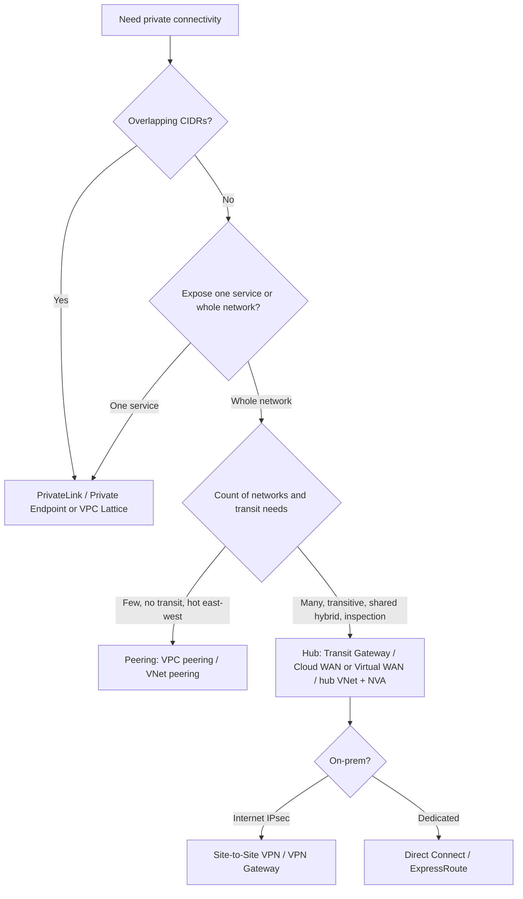
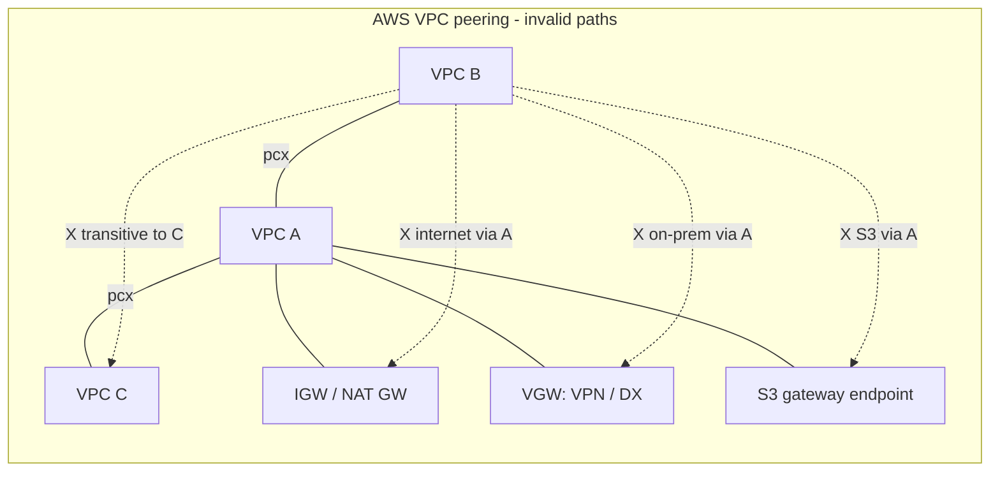
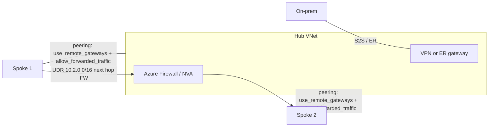
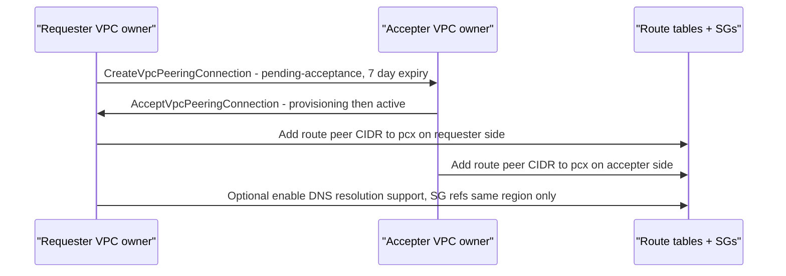

# G6 Private Connectivity: Peering
> Last verified: 2026-10 · Audience: senior/staff DevOps, SRE, AI eng, NetEng, DevSecOps, architects

## TL;DR
- **Peering** = a 1:1, non-transitive, private-IP link between two virtual networks over the provider backbone. It is not a gateway or a VPN: it has **no single point of failure and no bandwidth bottleneck**, and **no hourly fee**. You pay **per GB**.
- **AWS VPC peering** has hard rules: **no overlapping CIDRs** (any associated CIDR blocks it), **no transitive routing**, **no edge-to-edge routing** (you can't use the peer's IGW, NAT, VPN, DX or gateway endpoint), **at most one peering per VPC pair**, **50 active peerings per VPC by default (adjustable to 125)**, and a request **expires after 7 days**. You must add routes manually on **both** sides.
- **Azure VNet peering** is also non-transitive with no overlap, but it differs in important ways. **Gateway transit** (`Allow gateway transit` on the hub plus `Use remote gateways` on the spoke) **is allowed**, including over global peering. **NVA/Azure Firewall transit** works with UDRs plus `Allow forwarded traffic`. Routes are **injected automatically**. The limit is **500 peerings per VNet** (AVNM raises this to 1,000 spokes, and to 3,000 VNets in a high-scale mesh "connected group").
- **Inter-region**: AWS inter-region peering is **encrypted** and stays on the backbone. It has **MTU 8500** (9001 within a region) and **no cross-region SG referencing**, so you use CIDRs, and you must enable DNS resolution support explicitly. Azure **global peering** cannot reach a **Basic LB** frontend (Basic LB is now retired) and costs more per GB, by zone.
- **Pricing shape**: AWS charges nothing for **same-AZ** traffic (since May 2021, even cross-account; match by **AZ ID**). Cross-AZ costs **$0.01/GB each direction**, and inter-region uses the standard inter-region DT rate. Azure charges **ingress AND egress at both ends**, with a higher **global** rate by zone.
- **Picking an option**: use peering for a few VPCs with heavy east-west traffic, or for low latency and zero per-hour cost. Use a TGW/vWAN hub when you have more than about 10 VNets, need transitive routing, share hybrid links, or need central inspection. Use PrivateLink when CIDRs overlap or you expose one service rather than a whole network. Use VPC Lattice for service-to-service networking at L7 (and TCP resources) across accounts or VPCs with overlapping CIDRs.
- Full-mesh peering needs **n(n-1)/2** links: 10 VPCs need 45 links, and 50 VPCs need 1,225. That operational cost is why hubs exist ([G8](G8-transit-hub.md)).

## G6.1 Private connectivity options
- **How it works (the menu):**

| Option | Generic idea | AWS | Azure | Transitive? | Overlapping CIDR OK? | Scope / unit | Cost shape |
|---|---|---|---|---|---|---|---|
| Peering | Direct VNet↔VNet routing | VPC peering (intra/inter-region) | VNet peering / Global VNet peering, subnet peering | No | No | Whole network (Azure: or chosen subnets) | No hourly fee. Per-GB (AWS same-AZ free) |
| Transit hub | Cloud router, hub-spoke | Transit Gateway (TGW), Cloud WAN | Virtual WAN hub, or hub VNet + NVA/Azure Firewall + Route Server, AVNM hub-spoke | Yes (route tables) | No (per route domain) | Attachments | Per attachment-hour + per-GB processed (AWS). vWAN hub-hour + per-GB |
| Private service exposure | Consumer gets a private IP for a provider's service | PrivateLink (interface endpoint, NLB/GWLB-backed endpoint service) | Private Link service + Private Endpoint | N/A (unidirectional) | **Yes** | One service | Endpoint-hour + per-GB |
| Site-to-site VPN | IPsec over internet | Site-to-Site VPN (VGW/TGW) | VPN Gateway | Via hub | No | Network | Tunnel-hour + egress |
| Dedicated interconnect | Private circuit to colo | Direct Connect (DXGW) | ExpressRoute (Global Reach) | Via DXGW/TGW, ER Global Reach | No | Network | Port-hour + egress |
| Service network / app layer | L7 (and TCP) service-to-service with auth policy | VPC Lattice (service network, resource config) | No 1:1 equivalent. Closest are Private Link + App Gateway/APIM, or a service mesh (unverified equivalence) | N/A | **Yes** | Service / resource | Service-hour + per-GB + per-request |
| Share the network itself | One VPC, many accounts | VPC sharing (RAM) | One VNet shared via RBAC across teams/subscriptions (subnet-level permissions) | N/A | N/A | Subnet | None |

- **Trade-offs / when to use:**
  - **Peering**: lowest latency (same as intra-VNet on Azure same-region), no throughput cap beyond instance limits, no per-hour cost. Mesh complexity grows as O(n²).
  - **Hub (TGW/vWAN)**: transitive, centralized inspection and egress, shared hybrid. Adds a hop and per-GB processing ($0.02/GB on TGW in most regions, per [G8](G8-transit-hub.md)). TGW MTU is 8500.
  - **PrivateLink**: use it when overlapping CIDRs, SaaS/provider exposure, or least-privilege "one port, one service" matter. It is one-directional, because the consumer initiates.
  - **Lattice**: use it when app teams want service discovery, IAM auth policies and per-request logs without a network team managing routes. It supports overlapping CIDRs, and AZ affinity means no inter-AZ DT charge.
- **Interview angles:**
  - "Connect 3 VPCs, heavy data, same region" → peering (consider the free same-AZ traffic). "Connect 200 VPCs across 5 accounts plus on-prem" → TGW/Cloud WAN, or vWAN.
  - "Partner has a 10.0.0.0/16 CIDR that overlaps ours" → PrivateLink (or Lattice). Peering and TGW won't work without NAT.
  - Hybrid mix: TGW for broad routing, plus peering for a hot path that is sensitive to cost or latency. Routes use the longest prefix, so a more specific peering route wins over a TGW route.



## G6.2 Virtual network peering
### AWS VPC peering
- **How it works:**
  - **Lifecycle**: Initiating-request → **pending-acceptance** (expires in **7 days**) → provisioning → **active**. Other states are failed, rejected, expired and deleted (each stays visible for between 2 hours and 2 days).
  - The requester creates the connection and the accepter (same or another account) accepts it. **Each side adds routes** (dest = peer CIDR, target = `pcx-…`). You can route a subset (a subnet CIDR or a /32) for least privilege.
  - **Quotas**: **50 active peerings per VPC (adjustable up to 125)**, **25 outstanding requests**, and a non-adjustable 168 h expiry. **Only one peering per VPC pair.**
  - **Security groups**: in the **same region** you can reference a peer SG, including **cross-account** as `123456789012/sg-xxxx`. When the peering or the peer SG is deleted, the rule becomes **stale**. Find stale rules with `describe-stale-security-groups`. They are not auto-removed.
  - **DNS**: you can't query the peer VPC's Amazon DNS server (`.2`). Enable **DNS resolution support** (`allow_remote_vpc_dns_resolution`) on both sides so public DNS hostnames resolve to private IPs. For private hosted zones, associate the PHZ with both VPCs or use Route 53 Resolver ([G3](G3-network-dns-and-dhcp.md)).
  - **IPv6** works, but you must associate IPv6 CIDRs and add IPv6 routes.
  - **MTU**: 9001 (jumbo frames) within a region.
  - **No unicast RPF**. If a hub VPC peers with two VPCs that have identical CIDRs, a reply can go to the wrong VPC. Fix it with more-specific routes (longest prefix match).
  - **Shared VPCs**: only the VPC owner can create or accept peerings, not participants.
- **Trade-offs:** use it for hub-of-services patterns (AD, shared tooling) with specific routes. Avoid it as the backbone for more than about 10–20 VPCs.

### Azure VNet peering
- **How it works:**
  - You create **two peering links** (one per VNet). The state goes **Initiated → Connected** once both links exist. Deleting the link on one side also removes the remote side (portal behaviour).
  - **Routes are system-injected automatically** with next hop `VNetPeering`/`VNetGlobalPeering`. The `VirtualNetwork` NSG service tag expands to include the peered VNets, so default NSG rules allow all peered traffic. Lock it down with explicit NSG rules or AVNM security admin rules.
  - **Peering settings** (Terraform names, with defaults):

| Setting | TF arg | Default | Meaning |
|---|---|---|---|
| Allow access to remote VNet | `allow_virtual_network_access` | true | Basic reachability. Turn it off to "pause" peering without deleting it |
| Allow forwarded traffic | `allow_forwarded_traffic` | false | Accept packets that did **not originate** in the peer VNet (from an NVA). Needed for NVA hub transit |
| Allow gateway transit | `allow_gateway_transit` | false | Set on the **hub** link. Lets peers use the hub's VPN/ER gateway or Route Server |
| Use remote gateways | `use_remote_gateways` | false | Set on the **spoke** link. Only one peering per VNet may set it, and the spoke **can't have its own gateway** |

  - **Gateway transit**: works with all VPN Gateway SKUs **except Basic**. It works over local AND global peering, and it also covers Azure Route Server. Spoke traffic to the hub gateway is charged at **peering rates on the spoke** (the docs corrected an older claim that it was free). Use `summarizedGatewayPrefixes` on the hub to cut the number of prefixes advertised on-prem.
  - **Service chaining**: a UDR in a spoke can point next-hop at an NVA IP in the peered hub (or at a VPN gateway). You **can't** use an ExpressRoute gateway as a UDR next hop for VNet-to-VNet routing.
  - **Address space resize** of a peered VNet needs no downtime. Run **sync** on the peer after each change (`az network vnet peering sync`, or Terraform `triggers`). This is not supported with classic VNets.
  - **Limits**: **500 peerings per VNet** by default, and **1,000** through an AVNM hub-and-spoke connectivity config. You can't move a peered VNet between RGs or subscriptions without deleting the peering first.
  - **Cross-subscription and cross-tenant** work. Cross-tenant needs a guest user or RBAC (`virtualNetworkPeerings/write`, Network Contributor) on both sides. Peering **across clouds** (Public ↔ China/Gov) is not possible.
  - **DNS**: Azure-provided default name resolution does not cross peering. Use **Private DNS zones** linked to each VNet, or DNS Private Resolver.
  - **Peering + VNet-to-VNet gateway** on the same pair: traffic **prefers peering**.
  - **P2S clients** must re-download their VPN profile after peering changes so they pick up the new routes.
### Azure subnet peering (verify status)
- You peer **chosen subnets** rather than whole address spaces. Set `peer_complete_virtual_networks_enabled=false` with `local_subnet_names`/`remote_subnet_names`, and optionally `only_ipv6_peering_enabled`.
- As of 2026-10 it still **requires a subscription allowlist** (registration form). It is available in all regions, but only through CLI, PowerShell, API, ARM or Terraform (not the portal).
- **Limits**: 200 subnets per side per link, and 1,000 peered subnets per VNet across all links. There is still **one link per VNet pair**, and you can't convert a VNet peering into a subnet peering in place (delete and recreate).
- **Gotchas**: in the current release, non-peered local subnets still get forward routes (the packets are dropped). Some delegated subnets (NetApp, BareMetal…) can be over-advertised. **Use NSGs anyway.** Use v5+ VM SKUs in production because of a known bug on older generations.
- **Overlapping address spaces become possible** between VNets as long as the *peered subnets* are unique. This is a partial answer to "peering with overlap" (no AWS equivalent).
### AVNM connectivity configurations
- **Hub-and-spoke**: AVNM creates real peerings (hub VNet) or vWAN connections (vWAN hub, in preview). The options are **Use hub as gateway** (gateway transit, on by default in the portal) and **Direct connectivity**, which builds a spoke-to-spoke mesh within one spoke network group. It is regional by default; add **global mesh** for cross-region.
- **Mesh**: built from a **connected group**, which is **not a peering**. Effective routes show next hop `ConnectedGroup`, and it doesn't appear under *Peerings*. Defaults: regional, with an optional global mesh. A **VNet can be in at most 2 connected groups**. **High-scale connected groups support up to 3,000 VNets** (preview flag `AllowHighScaleConnectedGroup` plus a form). Up to **20,000 private endpoints** with the high-scale PE option.
- **Overlap in a mesh** is allowed by default, but overlapping prefixes are **removed** from the mesh (traffic dropped). Set `ConnectedGroupAddressOverlap=Disallowed` to block it.
- **Delete existing peerings** option: removes any peering that doesn't match the config. **Peering enforcement** (`peeringEnforcement=Enforced`) blocks out-of-band edits or deletes.
- **Interview angles:**
  - "How do Azure spokes reach on-prem through one shared gateway?" → hub: `allow_gateway_transit=true`. Spoke: `use_remote_gateways=true`. The spoke has no gateway.
  - "Spoke-to-spoke on Azure?" → there are three answers: (1) NVA/Azure Firewall in the hub plus UDRs plus `allow_forwarded_traffic`, (2) AVNM direct connectivity/mesh, (3) Virtual WAN (transitive by default).
  - "Peered VMs can't reach each other" → check, in order: both links **Connected**, `allow_virtual_network_access`, NSG/ASG, effective routes (a UDR overriding toward an NVA?), and DNS.
  - "In AWS, why can't I select the peer SG in the console?" → peer SGs aren't listed. Type the ID (with the account prefix if it's cross-account). Cross-region referencing is impossible.

## G6.3 Peering across regions
- **How it works:**
  - **AWS inter-region peering**: the same API, with `peer_region` set. Traffic is **encrypted before leaving AWS facilities**, stays on the **AWS global backbone**, and has no SPOF and no bandwidth bottleneck.
  - AWS inter-region differences:
    - **MTU 8500** (versus 9001 within a region).
    - **No cross-region SG references**, so use CIDRs.
    - **DNS resolution support must be enabled** even for RFC 1918 CIDRs.
    - Tags apply only in the region/account where you create them.
    - The `Deleting` state exists only for inter-region.
    - Terraform `auto_accept` doesn't work, so use `aws_vpc_peering_connection_accepter` with an aliased provider.
  - **Azure global VNet peering**: the same resource, with gateway transit supported.
  - Azure global peering constraints:
    - Peered resources **can't reach a Basic Load Balancer frontend** across regions. Use Standard LB. Basic LB was retired on 2025-09-30, so this mostly matters for legacy estates.
    - Some services built on Basic LB don't work.
    - Peering can't be created inside a VNet `PUT`.
  - Encryption of in-VNet/peered traffic is an opt-in feature (**VNet encryption** on supported VM SKUs) rather than something implicit to global peering (unverified for the specific "always encrypted inter-region" guarantee. Microsoft states that traffic between its datacenters is MACsec-encrypted).
- **Pricing model shape:**

| | AWS | Azure |
|---|---|---|
| Create/hourly | Free | Free |
| Same AZ | **Free** (since 2021-05, even cross-account; compare AZ **IDs** like `use1-az1`, not names) | Charged (intra-region peering rate, in **and** out) |
| Cross-AZ, same region | $0.01/GB **each direction** (the standard inter-AZ rate) | Same intra-region peering rate (around $0.01/GB in + $0.01/GB out, unverified) |
| Cross-region | Standard **inter-region DT** (charged on egress from the source region, around $0.01–0.02/GB in US/EU, more in APAC/SA) | **Global peering** rate by **zone**, charged on egress at the source **and** ingress at the destination |
| Via hub instead | TGW: + $0.02/GB processing + attachment-hours | vWAN/hub: + hub processing + peering legs |

- **Trade-offs / when to use:**
  - Inter-region peering suits DR replication and active-active DB/cache replication ([B8](../B-database-engineering/B8-database-replication.md), [C3](../C-large-scale-architecture/C3-reliability.md)) when only a few regions are involved.
  - With many region pairs, use TGW inter-region peering or Cloud WAN, or vWAN hub-to-hub (transitive by default).
  - On AWS, a hot east-west path can be tens of percent cheaper over direct peering than through TGW, because it avoids the $0.02/GB processing fee.
- **Interview angles:**
  - "Jumbo frames across regions?" → the AWS peering MTU is 8500. PMTUD/MSS clamping matters when ICMP is blocked ([G4](G4-network-performance-and-optimization.md), [H5](../H-full-stack-troubleshooting/H5-network-performance-deep-dive.md)).
  - "Azure DR region spokes need on-prem" → a spoke can use a remote gateway in another region over global peering, but consider latency and the cost of the global-peering leg.
  - "Is cross-region peering traffic encrypted?" → AWS: yes, documented. Azure: backbone and MACsec between datacenters, plus optional VNet encryption. Never assume app-layer encryption: use TLS or mTLS anyway ([L7](../L-data-privacy-ai-security/L7-zero-trust-workload-identity.md)).

## G6.4 Peering invalid scenarios (no transitive routing)
- **How it works (AWS ANS canonical invalid list):**
  1. **Overlapping CIDRs**: any overlap among **all** associated IPv4/IPv6 CIDRs blocks creation, even if you only intend to use the non-overlapping block.
  2. **Transitive peering**: with A↔B and A↔C, B cannot reach C through A. You need B↔C, or a hub.
  3. **Edge-to-edge through an IGW**: B cannot use A's internet gateway.
  4. **Edge-to-edge through a NAT**: B cannot use A's NAT gateway or instance for internet access.
  5. **Edge-to-edge through VPN/DX**: B cannot reach on-prem over A's VGW VPN or Direct Connect.
  6. **Gateway endpoint**: B cannot use A's S3/DynamoDB **gateway endpoint** (it is route-table based). By contrast, A's **interface endpoints are reachable** from B because they are ENIs with IPs, as long as DNS is handled ([G7](G7-service-endpoints-private-link.md)).
  7. **More than one peering** between the same two VPCs.
  8. Querying the peer's **Amazon DNS resolver**.
  9. **Replies to overlapping peers** go to the wrong VPC (no uRPF). This is "valid but broken" unless you use specific routes.
- **Azure equivalents (where Azure differs):**

| Scenario | AWS VPC peering | Azure VNet peering |
|---|---|---|
| Overlapping address space | Invalid | Invalid (subnet peering can partially work around it. AVNM mesh drops the overlap) |
| Transitive A→hub→C | Invalid (no forwarding at all) | Invalid by default. **Valid with an NVA/Azure Firewall in the hub, UDRs on the spokes and `allow_forwarded_traffic`**, or with Route Server, vWAN, or an AVNM mesh |
| Use the peer's VPN/ER gateway | **Invalid** | **Valid** via gateway transit (`allow_gateway_transit` + `use_remote_gateways`) |
| Internet egress via the peer | Invalid (IGW/NAT are edge) | Valid **only via an NVA/Azure Firewall** in the hub (UDR 0.0.0.0/0 → firewall IP). A spoke can't directly use a hub subnet's NAT Gateway |
| Use the peer's service endpoint / gateway endpoint | Invalid (gateway endpoint) | Service endpoints are tied to the **source subnet**, so they don't extend to a peer. **Private Endpoints are reachable over peering** |
| UDR next hop = ER gateway for VNet↔VNet | N/A | Invalid |
| Basic LB frontend over global peering | N/A | Invalid |

- **Trade-offs:** fixing transitivity with an NVA adds a hop, plus cost, plus an HA design (ILB HA ports, symmetric routing). TGW/vWAN removes the DIY work but adds per-GB processing.
- **Interview angles:**
  - "VPC B can't reach on-prem through VPC A's Direct Connect" → that is edge-to-edge and invalid. Fix it with TGW + DXGW (transit VIF), or give B its own VIF/VGW through the DX gateway ([G12](G12-dedicated-interconnect.md)).
  - "Can we put a proxy EC2 instance in A to forward B's traffic?" → technically the traffic then originates from A's instance, which works at L7 (a proxy). Plain routing via an ENI as next hop for peered traffic is not supported as transit. This is an anti-pattern, so use TGW + an inspection VPC/GWLB.
  - The pitfall people fall into: they assume Azure behaves like AWS and say "no gateway transit". Azure *does* support it. AWS *never* supports it over peering.





## Diagrams


## Cloud mapping: AWS vs Azure
| Capability | AWS | Azure | Role it plays | Key differences | Alternatives |
|---|---|---|---|---|---|
| Network-to-network peering | VPC peering | VNet peering | Direct private L3 between 2 networks | Azure auto-injects routes and supports gateway transit. AWS needs manual routes and has no edge-to-edge routing | Hub router, VPN |
| Cross-region peering | Inter-region VPC peering | Global VNet peering | Same, across regions | AWS: MTU 8500, encrypted, no SG refs. Azure: no Basic LB frontends | TGW peering / vWAN hub-to-hub, Cloud WAN |
| Granular peering | Specific routes (subnet or /32) | Subnet peering (allowlisted) | Least-privilege reach | Azure removes the routes. AWS only narrows them per route table | PrivateLink |
| Peering at scale / governance | Org-wide automation (Cloud WAN segments) | AVNM connectivity configs (mesh = connected group, hub-spoke) | Declarative topology | AVNM mesh isn't a peering, scales to 3,000 VNets, and can enforce peerings | Terraform modules |
| Transitive hub | Transit Gateway / Cloud WAN | Virtual WAN / hub VNet + Azure Firewall + Route Server | Transit, shared hybrid, inspection | TGW is regional with route tables. vWAN is a global managed mesh of hubs | NVA (Palo Alto, FortiGate), Cloudflare Magic WAN |
| Service exposure | PrivateLink / VPC Lattice | Private Link / Private Endpoint | Per-service private access, overlap-safe | Lattice adds L7 routing, auth policies and request pricing | Kubernetes service mesh (Istio), Cloudflare Tunnel |
| Share one network | VPC sharing (RAM) | Single VNet + RBAC (subnet join permission) | Avoid peering entirely | AWS has explicit participant semantics | n/a |

- **AWS VPC peering** is regional or inter-region, with per-VPC quotas of 50 (125 max). It has no SLA as a separate product, because it is part of the VPC fabric. The per-GB pricing makes same-AZ traffic free.
- **Azure VNet peering** covers 500 links per VNet. Peered latency in the same region equals intra-VNet latency. It is charged per GB on both ends, so it is never free even in the same AZ. Its NSG `VirtualNetwork` tag widens automatically, which is a common security gotcha.
- **Biggest behavioural gap**: Azure peering supports **gateway transit** and **forwarded traffic through NVAs**. AWS peering forwards nothing beyond the peer's own CIDR.
- **Alternatives**:
  - **Kubernetes** multi-cluster networking (Cilium Cluster Mesh, Istio multi-network) can sit over peering or Lattice/PrivateLink ([G14](G14-service-to-service-networking.md)).
  - **Cloudflare** Magic WAN/Tunnel can replace hub transit for multi-cloud.
  - **GCP VPC Network Peering** is the canonical third-cloud analogue. It is also non-transitive, but it exchanges subnet routes automatically and is global by default.

## Hands-on (optional)
```hcl
# AWS: cross-region (and/or cross-account) VPC peering
provider "aws" { region = "us-east-1" }
provider "aws" {
  alias  = "peer"
  region = "eu-west-1"
}

resource "aws_vpc_peering_connection" "a_to_b" {
  vpc_id        = aws_vpc.a.id
  peer_vpc_id   = aws_vpc.b.id
  peer_region   = "eu-west-1"
  # peer_owner_id = "222222222222"   # if cross-account
  # auto_accept only works same-account AND same-region
}

resource "aws_vpc_peering_connection_accepter" "b" {
  provider                  = aws.peer
  vpc_peering_connection_id = aws_vpc_peering_connection.a_to_b.id
  auto_accept               = true
}

resource "aws_vpc_peering_connection_options" "a" {
  vpc_peering_connection_id = aws_vpc_peering_connection_accepter.b.id
  requester { allow_remote_vpc_dns_resolution = true }
}

resource "aws_vpc_peering_connection_options" "b" {
  provider                  = aws.peer
  vpc_peering_connection_id = aws_vpc_peering_connection_accepter.b.id
  accepter { allow_remote_vpc_dns_resolution = true }
}

resource "aws_route" "a_to_b" {
  route_table_id            = aws_route_table.a_private.id
  destination_cidr_block    = aws_vpc.b.cidr_block   # or a subnet / /32 for least privilege
  vpc_peering_connection_id = aws_vpc_peering_connection.a_to_b.id
}

resource "aws_route" "b_to_a" {
  provider                  = aws.peer
  route_table_id            = aws_route_table.b_private.id
  destination_cidr_block    = aws_vpc.a.cidr_block
  vpc_peering_connection_id = aws_vpc_peering_connection.a_to_b.id
}
# Cross-region: SG rules must use CIDRs, not peer SG IDs.
```

```hcl
# Azure: hub-spoke peering with gateway transit (both links required)
resource "azurerm_virtual_network_peering" "hub_to_spoke" {
  name                         = "hub-to-spoke1"
  resource_group_name          = azurerm_resource_group.hub.name
  virtual_network_name         = azurerm_virtual_network.hub.name
  remote_virtual_network_id    = azurerm_virtual_network.spoke1.id
  allow_virtual_network_access = true
  allow_forwarded_traffic      = true
  allow_gateway_transit        = true   # hub owns the VPN/ER gateway or Route Server
}

resource "azurerm_virtual_network_peering" "spoke_to_hub" {
  name                         = "spoke1-to-hub"
  resource_group_name          = azurerm_resource_group.spoke1.name
  virtual_network_name         = azurerm_virtual_network.spoke1.name
  remote_virtual_network_id    = azurerm_virtual_network.hub.id
  allow_virtual_network_access = true
  allow_forwarded_traffic      = true   # accept traffic forwarded by hub NVA/firewall
  use_remote_gateways          = true   # spoke must NOT have its own gateway
  # Re-sync after address-space changes on the remote VNet:
  triggers = { remote_space = join(",", azurerm_virtual_network.hub.address_space) }
  depends_on = [azurerm_virtual_network_gateway.hub]  # gateway must exist first
}

# Subnet peering (allowlisted feature):
#   peer_complete_virtual_networks_enabled = false
#   local_subnet_names  = ["app"]
#   remote_subnet_names = ["db"]
```

```bash
# Debug checks
aws ec2 describe-vpc-peering-connections --filters Name=status-code,Values=active
aws ec2 describe-stale-security-groups --vpc-id vpc-aaaa1111
az network vnet peering list -g rg-hub --vnet-name hub -o table      # peeringState: Connected
az network nic show-effective-route-table -g rg-spoke -n vm1-nic -o table  # VNetPeering / ConnectedGroup next hops
az network vnet peering sync -g rg-spoke --vnet-name spoke1 -n spoke1-to-hub
```

## Cross-links
- [G1 Virtual network fundamentals](G1-virtual-network-fundamentals.md): CIDR planning to avoid overlap. Route tables, SG and NSG.
- [G3 Network DNS and DHCP](G3-network-dns-and-dhcp.md): cross-VPC/VNet name resolution, Route 53 PHZ, Azure Private DNS.
- [G4 Network performance and optimization](G4-network-performance-and-optimization.md): G4.1 MTU, jumbo frames, 8500 versus 9001.
- [G7 Service endpoints and Private Link](G7-service-endpoints-private-link.md): gateway versus interface endpoints, overlap-safe exposure.
- [G8 Transit hub](G8-transit-hub.md): TGW / vWAN as the fix for non-transitivity.
- [G9 Hybrid network basics](G9-hybrid-network-basics.md), [G10 Site-to-site VPN](G10-site-to-site-vpn.md), [G12 Dedicated interconnect](G12-dedicated-interconnect.md): edge-to-edge alternatives.
- [G13 Managed global WAN](G13-managed-global-wan.md): Cloud WAN / vWAN.
- [G14 Service-to-service networking](G14-service-to-service-networking.md): VPC Lattice.
- [F7 Network routing](../F-network-engineering/F7-network-routing.md): longest prefix match, uRPF.
- [C4 Security](../C-large-scale-architecture/C4-security.md): firewalls and ACLs overlap (G1.7, G1.8).

## Sources
- https://docs.aws.amazon.com/vpc/latest/peering/what-is-vpc-peering.html
- https://docs.aws.amazon.com/vpc/latest/peering/vpc-peering-basics.html
- https://docs.aws.amazon.com/vpc/latest/peering/vpc-peering-connection-quotas.html
- https://docs.aws.amazon.com/vpc/latest/peering/vpc-peering-security-groups.html
- https://docs.aws.amazon.com/vpc/latest/peering/peering-configurations-partial-access.html
- https://aws.amazon.com/about-aws/whats-new/2021/05/amazon-vpc-announces-pricing-change-for-vpc-peering/
- https://aws.amazon.com/blogs/networking-and-content-delivery/demystifying-amazon-vpc-peering-charges/
- https://docs.aws.amazon.com/vpc-lattice/latest/ug/what-is-vpc-lattice.html
- https://learn.microsoft.com/en-us/azure/virtual-network/virtual-network-peering-overview
- https://learn.microsoft.com/en-us/azure/virtual-network/virtual-network-manage-peering
- https://learn.microsoft.com/en-us/azure/virtual-network/how-to-configure-subnet-peering
- https://learn.microsoft.com/en-us/azure/vpn-gateway/vpn-gateway-peering-gateway-transit
- https://learn.microsoft.com/en-us/azure/virtual-network-manager/concept-connectivity-configuration
- https://learn.microsoft.com/en-us/azure/azure-resource-manager/management/azure-subscription-service-limits
- https://azure.microsoft.com/en-us/pricing/details/virtual-network/
- https://github.com/hashicorp/terraform-provider-aws/blob/main/website/docs/r/vpc_peering_connection.html.markdown
- https://github.com/hashicorp/terraform-provider-azurerm/blob/main/website/docs/r/virtual_network_peering.html.markdown
