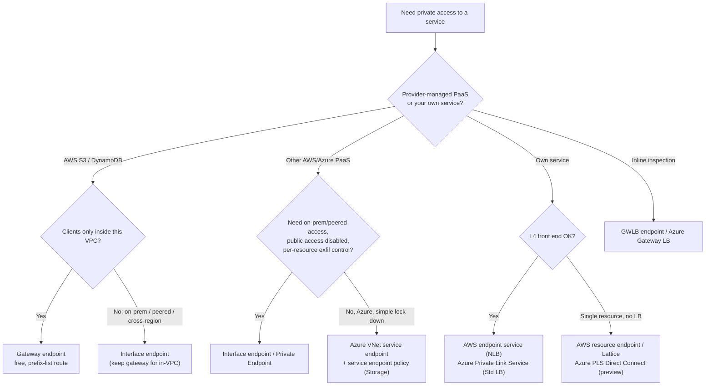
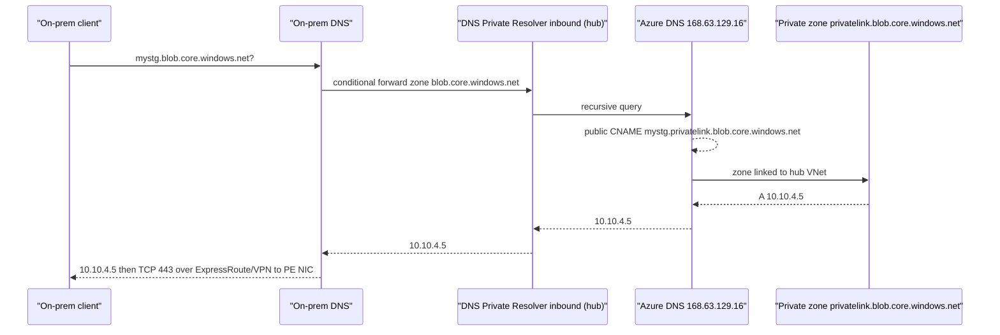
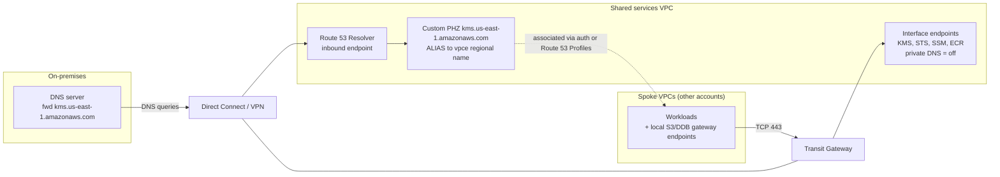
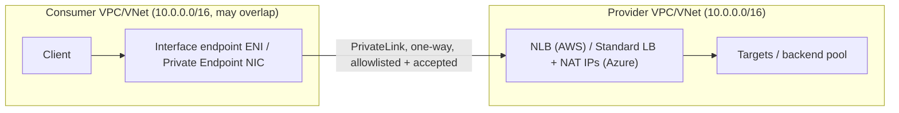

# G7 Private Connectivity: Service Endpoints & Private Link
> Last verified: 2026-10 · Audience: senior/staff DevOps, SRE, AI eng, NetEng, DevSecOps, architects

## TL;DR
- There are **two families** of private access to managed services. The first is **route-based "service endpoints"**: AWS **gateway endpoints** (S3, DynamoDB) and Azure **VNet service endpoints**. The service keeps its **public IP**, your route table or subnet gets a more specific path, and they cost **nothing**. The second is **NIC-based "private link"**: AWS **interface endpoints** (PrivateLink) and Azure **Private Endpoints**. These put a **private IP from your subnet** in front of the service and are billed per hour and per GB.
- Route-based endpoints **do not extend beyond the subnet or VPC that owns them**. On-premises networks, peered VNets and VPCs, and Transit Gateway or Virtual WAN spokes cannot use them. Private IPs can be reached from anywhere that is routable: peering, TGW, vWAN, DX/ExpressRoute or VPN.
- **DNS is the hard part.** AWS private DNS creates a **hidden, AWS-managed private hosted zone (PHZ)** that is only visible inside the endpoint's own VPC. Azure uses a **public CNAME** (`x.blob.core.windows.net → x.privatelink.blob.core.windows.net`) plus a **Private DNS zone** `privatelink.*` that holds the A record. Most outages come from forwarding the wrong zone, linking the zone to the wrong VNet, or keeping duplicate zones.
- **Provider side.** AWS calls it an **endpoint service** (NLB or GWLB front end, allowed principals, acceptance, private DNS name verified by a TXT record). Azure calls it **Private Link Service** (Standard LB front end, NAT IPs, visibility plus auto-approval, alias). Both are **one-way**: only the consumer can open connections. Both get around **overlapping CIDRs**.
- **Security is layered.** On AWS: the endpoint **security group**, the **endpoint policy** (IAM resource policy, 20,480 characters), and resource policies that check `aws:SourceVpce` or `aws:SourceVpc`. On Azure: **NSG/UDR on the PE subnet** (network policies are *disabled by default*), service-side "public network access = Disabled", **service endpoint policies** (Storage only) and **network security perimeter**.
- **Newer endpoint types** (2024–2026). **GWLB endpoints** are a route target that sends traffic to inline appliances over GENEVE. **Resource endpoints** reach a single resource (database, IP, domain name) through a **resource gateway** with no NLB needed. **Service-network endpoints** connect a VPC to a whole **VPC Lattice service network**. Cross-region PrivateLink now exists for some AWS services and for endpoint services.
- **Reference architectures.** On AWS, put endpoints in a central shared-services VPC, associate a PHZ with the spoke VPCs (or use Route 53 Profiles), and point on-premises conditional forwarders at a **Route 53 Resolver inbound endpoint**. On Azure, put Private Endpoints in the hub or in spokes, keep **one central set of `privatelink.*` zones** linked to every VNet that resolves them, and point on-premises forwarders at the **DNS Private Resolver inbound endpoint**. Forward the **public** zone name, not the `privatelink` zone name.
- **Peering versus endpoints.** Peering (G6) is **bidirectional, network-wide, needs non-overlapping CIDRs and is non-transitive**. PrivateLink is **unidirectional, exposes one service, tolerates overlapping CIDRs and scales to thousands of consumers**. It also costs per GB processed and supports TCP only on AWS.

---

## G7.1 Introduction to service endpoints and private link
- **How it works:**
  - **The problem.** A workload in a private subnet needs to reach a managed service such as S3/Blob, KMS/Key Vault, SQL or a SaaS API. It must not use an IGW/NAT, public IPs or a firewall allow-list of public ranges, and the data should stay on the provider backbone and leave an auditable control point.
  - **Three generic mechanisms:**
    | Generic term | AWS | Azure | Data path |
    |---|---|---|---|
    | Route-based service endpoint | **Gateway VPC endpoint** (S3, DynamoDB only) | **Virtual network service endpoint** (Storage, SQL, Cosmos DB, Key Vault, Service Bus, Event Hubs, App Service, ACR, Cognitive Services…) | Traffic still goes to the service's **public IP** over a more specific route. The service sees your VPC or VNet identity. |
    | NIC-based private endpoint to a provider service | **Interface VPC endpoint** (AWS PrivateLink) | **Private Endpoint** (Azure Private Link) | **A private IP in your subnet**, with DNS overridden to point at it |
    | Publishing your own service privately | **VPC endpoint service** (NLB or GWLB) | **Private Link Service** (Standard LB) | The consumer's endpoint goes through the provider's LB |
  - **Common properties of private link.** Traffic is **unidirectional**: the provider cannot open connections back. Overlapping CIDRs between consumer and provider are fine. There are no route-table changes on the consumer side for the interface variants. It is **regional**, with cross-region options now available.
  - **Azure note (2026).** Microsoft's docs now say **Private Link and Private Endpoints are the recommended approach** over service endpoints. A **"standard service endpoint"** (public preview) adds network identifiers and **network security perimeter** integration for Storage and Key Vault, with SQL and Cosmos DB also in preview.
- **Trade-offs / when to use:**
  - Gateway endpoints and service endpoints: **free**, no IP consumption, simple. But they **do not work from on-premises or peered networks**, and the DNS name still resolves to public IPs.
  - Interface endpoints and Private Endpoints: billed. AWS charges **$0.01 per ENI-hour per AZ plus $0.01/GB** for the first PB. Azure charges for PE hours and for **both inbound and outbound GB** (similar in shape, roughly $0.01, check the region). In return they reach from anywhere routable, support **exfiltration control** by binding to one specific resource, and let you turn off public access on the service entirely.
- **Interview angles:**
  - "Why not just use a NAT gateway?" → NAT costs $/GB plus hourly. It exposes egress to the internet and needs firewall allow-lists of public ranges. It also gives no per-resource scoping. An S3 gateway endpoint removes NAT processing charges for S3 at **$0**, which is a classic cost-optimisation answer.
  - "Is traffic to a public service endpoint on the internet?" → AWS: traffic from an IGW to an AWS service in the same region **stays on the AWS network**. The real concern is control: public IP exposure, firewall rules, and the ability to disable public access.

## G7.2 Gateway (route-table based) endpoints
- **How it works (AWS gateway endpoint):**
  - Supports **only S3 and DynamoDB**. It is **not PrivateLink**: there is no ENI and no private IP. **No additional charge.**
  - When you create it you pick **route tables**. AWS adds a route with destination = **AWS-managed prefix list** (`pl-xxxx`, the service's regional public CIDRs) and target = `vpce-xxxx`. **You cannot edit or delete that route directly**. You disassociate the route table instead.
  - **Longest prefix match applies.** The prefix-list route beats `0.0.0.0/0 → IGW/NAT` for that service in **the same region**. A route covering the exact service CIDR beats it in turn. **Cross-region S3 does not use the gateway endpoint** (prefix lists are regional) and falls back to IGW or NAT.
  - Only **one** endpoint route per service per route table. Many route tables can share one endpoint.
  - **Security group egress must allow the prefix list** (e.g. `pl-xxxx tcp/443`). **NACLs cannot reference prefix lists**, so you have to expand the CIDRs.
  - **Endpoint policy:** `Principal` must be `"*"`. Use the condition `aws:PrincipalArn` to scope it. Default policy = full access.
  - **IPv6 and dual-stack** are supported through IPv6 prefix lists. Watch the DNS record IP type: if the endpoint is IPv4-only and the client uses `s3.dualstack…`, AAAA traffic **bypasses** the endpoint.
  - Quotas: **20 gateway endpoints per region** (adjustable), up to 255 per VPC.
  - **Not reachable from on-premises or over VPC peering, TGW or VPN.** Traffic from outside the VPC never hits that VPC's route table as a source. Edge-to-edge routing is not supported.
- **How it works (Azure VNet service endpoint):**
  - Enabled **per subnet** for a service (`Microsoft.Storage`, `Microsoft.Sql`, `Microsoft.KeyVault`…). It adds effective routes with **nextHopType `VirtualNetworkServiceEndpoint`** for the service prefixes. These routes **override BGP and UDR forced tunnelling** for those prefixes.
  - **The source IP becomes the VM's private IP** instead of a public IP. Existing service firewall rules based on public IPs **break**, and **open TCP connections are reset** when you enable it.
  - **DNS is unchanged.** The FQDN still resolves to the **public IP** of the service. The service-side **VNet rule** (firewall) is what locks the resource to `subnet X`.
  - Free, and there is **no limit** on the number of service endpoints per VNet. Some services cap VNet rules (e.g. on Storage).
  - **Not usable from on-premises.** To let on-premises in, add the on-premises **public or NAT IPs** (ExpressRoute Microsoft-peering NAT) to the resource IP firewall.
  - Peered VNets: enable the endpoint on **each subnet independently**. Nothing is inherited.
  - Azure SQL service endpoints cover **same-region** traffic only. `Microsoft.Storage.Global` provides cross-region Storage service endpoints.
  - **Service endpoint policies** (Storage only) are an **allow-list of storage accounts** (by subscription, resource group or account resource ID) applied to the subnet. They prevent exfiltration to *other* storage accounts. Limits: 500 per subscription, 100 per subnet, 200 resources per definition. Applying a policy upgrades the Storage SE scope to **global**. They break **classic accounts and managed-service storage** (e.g. HDInsight infrastructure) unless those are listed. They are not supported for most managed services deployed into a VNet (SQL MI is the exception).
- **Trade-offs / when to use:**
  - Use an AWS gateway endpoint for any in-VPC S3 or DynamoDB traffic, basically always: it is free and removes NAT $/GB. Add an **S3 interface endpoint** only for on-premises, cross-region or peered consumers (see G7.5 for the "private DNS only for inbound Resolver endpoint" hybrid).
  - Azure service endpoints are fine for simple "lock storage or SQL to my subnet" needs. Prefer Private Endpoints when on-premises or peered access, exfiltration control beyond Storage, or **public access disabled** is required.
- **Interview angles:**
  - "On-premises over DX can't reach S3 through the gateway endpoint. Why, and what's the fix?" → Gateway endpoints are route-table targets that only apply to traffic **originating in the VPC**. Fix: an **S3 interface endpoint** reachable over DX/VPN, or a DX **public VIF**.
  - The equivalent AWS-vs-Azure pitfall: neither AWS gateway endpoints nor Azure service endpoints change DNS. **Azure service endpoints also change the source IP**, which breaks IP-based firewall rules.
  - Lock S3 to the endpoint with a bucket policy `Deny if aws:SourceVpce != vpce-…`. **This also blocks console access**, which is a known lock-out risk.

## G7.3 Private-link interface endpoints
- **How it works (AWS interface endpoint):**
  - You pick **one subnet per AZ**. AWS creates a **requester-managed ENI** in each with a private IP that **never changes for the life of the endpoint**. IPv4, IPv6-only or dual-stack, matching the subnet type.
  - Has **security groups** (inbound 443 from clients is the usual rule), an **endpoint policy** (where the service supports it) and optional **private DNS**.
  - **Bandwidth:** **10 Gbps per AZ by default, auto-scaling to 100 Gbps per AZ**. **MTU 8500**, **no PMTUD** (no ICMP frag-needed is generated), **MSS clamping** enforced.
  - Protocol: **TCP only** for interface endpoints to AWS services and NLB-backed services. Resource endpoints are also TCP-only. The UDP note for cross-region refers to NLB UDP services.
  - Quota: **50 interface plus GWLB endpoints per VPC** (adjustable).
  - Billing: **per ENI-hour per AZ plus per GB** ($0.01/GB first PB, $0.006 next 4 PB, $0.004 above 5 PB).
  - **Cross-region (2025+):** for selected AWS services (S3, IAM, ECR, KMS, ECS, Lambda, Firehose, Flink, Route 53) you can create an interface endpoint in region A with `--service-region B`. This requires the IAM permission-only action **`vpce:AllowMultiRegion`** (and an SCP that allows it), and **regional DNS only** (no zonal names). Failover across AZs is managed; **failover across regions is not**.
- **How it works (Azure Private Endpoint):**
  - A **read-only NIC** in your subnet with a private IP that is stable for the PE's lifetime. Static IP assignment is supported for most services. The PE targets **one private-link resource plus one sub-resource** (`groupId`: `blob`, `file`, `dfs`, `sqlServer`, `vault`, `registry`…). **Blob and File need separate PEs.**
  - The PE must be in the **same region and subscription as its VNet**. The **target resource can be in another region or tenant**.
  - **Approval:** automatic if you hold `…/privateEndpointConnectionsApproval/action` on the target, otherwise **manual** (Pending → Approved, Rejected or Disconnected). Only **Approved** connections carry traffic.
  - Reachable from the same VNet, **regionally and globally peered VNets**, and **on-premises via VPN or ExpressRoute**.
  - Each PE injects a **/32 system route** into the VNet and its peers. See G7.8 for how UDRs interact with it.
  - **A PE does not disable public access.** You must set the service's *Public network access = Disabled* or firewall it.
- **Trade-offs / when to use:**
  - Interface endpoints and PEs cost money per VPC/VNet times AZ times service. With 30 services × 3 AZs × 100 VPCs, the hourly cost alone becomes significant, which is why you centralise (G7.13).
  - Per-AZ ENIs: if you put an endpoint in only one AZ, **every AZ depends on that AZ** and pays cross-AZ data transfer. Deploy at least 2 AZs and use zonal DNS names for AZ affinity if needed.
- **Interview angles:**
  - "Endpoint created but clients time out." → Check, in order: (1) the **SG on the endpoint ENI** allows 443 from the client CIDR, (2) DNS returns the private IP (private DNS enabled, plus VPC `enableDnsSupport` and `enableDnsHostnames`), (3) the endpoint policy, (4) the AZ actually has an ENI.
  - "Large file uploads hang through the endpoint." → MTU 8500 with no PMTUD, combined with a jumbo-frame path or GRE/IPsec overlay. Clamp MSS or lower the MTU on the client side.
  - Azure: "Private endpoint created, app still resolves the public IP." → The Private DNS zone is not linked to the client VNet, or a custom DNS server does not forward to **168.63.129.16**. See G7.5.

## G7.4 Private link: important to know features
- **How it works:**
  - **Unidirectional and NAT'd.** Consumers initiate and the provider only responds. On AWS the provider's NLB sees **its own NLB IPs** as the source (client IP is lost) unless **Proxy Protocol v2** is enabled. The TLV carries the VPC endpoint ID. On Azure, PLS **destination-NATs through NAT IPs** you choose from a provider subnet (**up to 8 NAT IPs per PLS**, each adding source ports). Original consumer info is available through **TCP Proxy v2**, which carries a TLV `0xEE` with the PE **LinkID**.
  - **Overlapping CIDRs are fine** because only the endpoint IP in the consumer's space matters.
  - **AZ alignment (AWS).** The consumer can only create ENIs in AZs where the provider's NLB is enabled. AZ names differ per account, so **use AZ IDs** (`use1-az1`). Cross-zone LB on the NLB hides AZ gaps but costs inter-AZ transfer and shares fate with the provider AZ.
  - **IP address types.** IPv4, IPv6 or dual-stack endpoints, even when the backends are IPv4-only (the NLB must be dual-stack). Azure **PLS is IPv4-only, TCP and UDP**.
  - **Idle timeouts.** Azure PLS has about a **5-minute (300 s) idle timeout**, so use TCP keepalives under that. AWS NLB TCP idle timeout defaults to 350 s and is configurable. Cross-region PrivateLink does not support a custom NLB idle timeout.
  - **Notifications.** AWS can send SNS notifications for endpoint and endpoint-service connection events (accept, reject, delete). Azure exposes connection states on `privateEndpointConnections`.
  - **Cross-region and cross-tenant.** AWS **endpoint services can be offered in several regions** (provider pays **$0.05 per hour per remote region**, consumer pays inter-region transfer). Azure PEs can target a **resource in another region or tenant** natively.
- **Trade-offs / when to use:**
  - PrivateLink is the **SaaS and multi-tenant pattern**: thousands of consumers, no routing coordination, no CIDR planning. The costs are the per-GB charge, the L4 NLB front end, and loss of the client IP without Proxy Protocol.
- **Interview angles:**
  - "How does the provider tell tenants apart?" → AWS: Proxy Protocol v2 with the `vpce-id` TLV, or one NLB listener or port per tenant. Azure: TCP Proxy v2 **LinkID** matched to the `privateEndpointConnection.linkIdentifier`.
  - Pitfall: turning on Proxy Protocol on one Azure PLS turns it on for the **whole LB backend**, and health probes then carry the header too. Every PLS sharing that LB must be configured the same way, or probes fail.

## G7.5 Endpoint DNS
- **How it works (AWS):**
  - Every interface endpoint gets public-resolvable names that answer with private IPs:
    - Regional: `vpce-0abc-xyz.<svc>.<region>.vpce.amazonaws.com`. AWS round-robins across healthy AZ ENIs.
    - Zonal: `vpce-0abc-xyz-<az>.<svc>.<region>.vpce.amazonaws.com`. Use these for AZ affinity and to avoid cross-AZ cost.
  - **Private DNS** (on by default for AWS services, and recommended) needs VPC **`enableDnsSupport` and `enableDnsHostnames`**. AWS then creates a **hidden, AWS-managed PHZ** for `<svc>.<region>.amazonaws.com` so unchanged SDKs hit the endpoint. **That PHZ only applies inside the endpoint's own VPC.** You cannot share or associate it.
  - Only one VPC can carry a given private DNS name for a service. Creating a second endpoint with private DNS for the same service in a VPC that already resolves that name through a custom PHZ conflicts with it.
  - **S3 special cases.** S3 interface endpoint names are `bucket.vpce-…s3.<region>.vpce.amazonaws.com` (also `accesspoint.` and `control.`). With private DNS, `s3.<region>.amazonaws.com` resolves privately. The option **"Enable private DNS only for inbound endpoint"** (`PrivateDnsOnlyForInboundResolverEndpoint`, **default true** when enabling private DNS on S3 and **requires an S3 gateway endpoint** in the VPC) works like this:
    - In-VPC traffic resolves to public IPs and uses the **free gateway endpoint**.
    - Queries arriving through the **Route 53 Resolver inbound endpoint** (on-premises) get the interface ENI IPs.
  - Route 53 Resolver (VPC+2, `169.254.169.253`) is **not reachable from outside the VPC**. On-premises clients need a **Resolver inbound endpoint** plus conditional forwarders.
- **How it works (Azure):** the **CNAME chain**, which is the most common pitfall:
  ```
  mystg.blob.core.windows.net            CNAME  mystg.privatelink.blob.core.windows.net   (public DNS, always)
  mystg.privatelink.blob.core.windows.net A     10.1.2.5     (Private DNS zone linked to *your* VNet)
                                          -> otherwise falls through to public A record / blob.<cluster> public IP
  ```
  - Azure adds the `privatelink` CNAME in **public DNS** as soon as a PE exists, and it is resolvable from anywhere. Clients keep using the **public FQDN**, and only resolvers that can see the **Private DNS zone `privatelink.blob.core.windows.net`** get the private IP.
  - **Use the exact recommended zone names**, or automatic record creation does not happen. Examples: `privatelink.blob.core.windows.net`, `privatelink.file.core.windows.net`, `privatelink.dfs.core.windows.net`, `privatelink.database.windows.net`, `privatelink.vaultcore.azure.net`, `privatelink.azurecr.io` (plus a regional `data` record), `privatelink.<region>.azmk8s.io`, `privatelink.openai.azure.com`, `privatelink.cognitiveservices.azure.com`, `privatelink.services.ai.azure.com`, `privatelink.servicebus.windows.net`, `privatelink.azurewebsites.net`.
  - **Private DNS zone group.** Binds the PE to up to **5 zones** (one zone per name). Records are created and deleted automatically with the PE. Only one zone group per PE.
  - Resolution from a VNet only works if the zone is **linked to the VNet whose DNS settings do the resolving**. With Azure-provided DNS, that is the client VNet. With custom DNS, it is the VNet of the DNS server or resolver. Custom DNS servers must forward to **168.63.129.16**.
  - **On-premises conditional forwarders must target the public zone** (`blob.core.windows.net`, `database.windows.net`), **not** `privatelink.*`. They point at the **DNS Private Resolver inbound endpoint** or a forwarder VM.
  - **NXDOMAIN trap.** Once `privatelink.blob.core.windows.net` is linked, lookups for *other* storage accounts that have a PE somewhere (in another tenant, say) return NXDOMAIN from your zone. Fix: the **"Fallback to internet"** setting on the virtual network link (`resolutionPolicy = NxDomainRedirect`), or a manual A record (not recommended).
  - **Do not** create a Private DNS zone named after the **public** zone (`blob.core.windows.net`). That hijacks every storage account.
  - **Do not** run duplicate `privatelink.*` zones per spoke. Records then diverge, and a PE in spoke B overwrites spoke A's record for the same resource.
- **Trade-offs / when to use:**
  - Both clouds rely on the client resolving the **public name** to a private IP through split-horizon DNS. Endpoint-specific names (AWS `vpce-…` names, or the Azure PE IP) avoid DNS changes but break TLS SNI and certificates for many services and require app changes.
- **Interview angles:**
  - "From on-premises `nslookup mystg.blob.core.windows.net` returns a public IP, while from the VNet it returns 10.x. Why?" → On-premises DNS forwards nothing, or forwards `privatelink.blob.core.windows.net` (which is never queried first). Forward **`blob.core.windows.net`** to the **Private Resolver inbound endpoint**. Also check that the inbound endpoint's VNet is linked to the zone.
  - "In a spoke VPC, `sqs.us-east-1.amazonaws.com` resolves public even though the hub has an endpoint." → The managed PHZ does not cross VPCs. Disable private DNS on the hub endpoint and **create your own PHZ with an alias record**, then associate it with the spokes (G7.13).
  - Mermaid sequence of the Azure chain is in [Diagrams](#diagrams).

## G7.6 Exposing your own service through private link
- **How it works (AWS endpoint service, the provider side):**
  - Front end: an **NLB** (TCP/UDP/TLS; for interface endpoints) or a **GWLB** (for GWLB endpoints). Several LBs can back one service. You cannot disassociate an LB while endpoints are connected.
  - Service name `com.amazonaws.vpce.<region>.vpce-svc-xxxx`. DNS `vpce-svc-xxxx.<region>.vpce.amazonaws.com`.
  - **Allowed principals.** By default nobody can connect. Add ARNs: `arn:aws:iam::<acct>:root` (whole account), a role, a user, or `*`. **`*` combined with auto-accept means your NLB is effectively public** even without a public IP. Removing a principal **does not cut existing connections**.
  - **Acceptance required** (manual accept or reject) works alongside permissions: either allow a narrow set and auto-accept, or allow a broad set and accept manually.
  - **Supported regions:** the provider can enable cross-region consumers ($0.05 per hour per remote region). The host region cannot be removed. Opt-in regions must be opted in.
  - **AZ management:** if you add an AZ to the NLB, you must **enable it on the endpoint service** separately.
  - Common back ends: an ALB as an NLB target (for L7) and NLB IP targets, which also covers on-premises IPs (see G7.10).
  - Also available as **AWS Marketplace / SaaS PrivateLink** listings.
- **How it works (Azure Private Link Service):**
  - Front end: a **Standard Load Balancer** frontend IP config. **Basic LB is not supported.** The **backend pool must be NIC-based, not IP-based**.
  - The PLS must be in the **same region as its VNet and the LB**. Consumers can be in **any region or tenant**.
  - **NAT IP configs** come from a provider subnet. Keep **at least 8 free IPs** and use up to 8 NAT IPs per PLS. The provider app sees NAT IPs as the source.
  - **Alias** `prefix.{GUID}.<region>.azure.privatelinkservice`, shared offline. The consumer creates a PE using the alias and **manual** approval.
  - **Visibility** controls who can *see and request*: RBAC-only, subscription list, or "anyone with alias". **Auto-approval** is a subset of visibility: listed subscriptions are approved automatically.
  - The subnet needs `privateLinkServiceNetworkPolicies = Disabled` for the NAT IPs (Terraform: `private_link_service_network_policies_enabled = false`).
  - **PLS Direct Connect (public preview, 2026):** PLS to any privately routable destination IP **without a load balancer**.
  - The PLS itself is **free**. Consumers pay for their PE.
- **Trade-offs / when to use:**
  - Choose this over peering or TGW when there are many consumers, overlapping CIDRs, a SaaS or multi-tenant model, or a need to expose one port and nothing else.
  - The NLB (AWS) or SLB (Azure) is L4. For L7 routing, put an ALB behind the NLB on AWS, or Application Gateway (which supports Private Link) on Azure, or use **VPC Lattice** (G7.9 and G14).
- **Interview angles:**
  - "Design SaaS private connectivity for 500 enterprise customers." → AWS: NLB plus endpoint service, allowed principals per customer account, acceptance required, Proxy Protocol v2 for tenant ID, a private DNS name `api.saas.com` (G7.7), endpoint service in 3 AZs, and cross-region support for customers in other regions. Azure: a PLS on an SLB with a subscription-restricted visibility list, an auto-approval list for paid tenants, and TCP Proxy v2 LinkID.

## G7.7 Endpoint service with a custom domain name
- **How it works (AWS):**
  - The provider sets **one private DNS name** on the endpoint service, e.g. `api.example.com` or a wildcard `*.example.com` (lowercase only).
  - **Domain ownership verification:** AWS gives a **TXT name and value** (e.g. `_6e86v84tqgqubxbwii1m.example.com TXT "vpce:l6p0ERxlTt45jevFwOCp"`). Publish it in **public DNS** (TTL 1800 recommended on Route 53). The state moves from `pendingVerification` to `verified`. Verifying the parent `example.com` covers its subdomains. A domain can be verified **at most twice** (with and without the underscore label), which matters for multiple regions or accounts.
  - If verification later fails, **new connections are denied and existing ones continue**.
  - The consumer then enables private DNS on their interface endpoint. AWS creates a PHZ in the consumer VPC with **`api.example.com` CNAME → the endpoint's regional DNS name**. Clients inside the consumer VPC get private IPs, and everyone else resolves the public record. This is split horizon with **no app change**.
  - **GWLB endpoint services do not support private DNS names.**
- **How it works (Azure):** PLS has **no TXT-verified private DNS name feature**. The consumer creates their own Private DNS zone (e.g. `api.contoso.com` or `privatelink.contoso.com`) with an A record pointing at the PE IP, linked to the relevant VNets, or forwards it centrally. The provider's TLS cert must cover whatever name the consumer uses.
- **Trade-offs / when to use:** a custom name keeps TLS valid (the cert matches `api.example.com`) and lets the same client config work over the internet and over PrivateLink.
- **Interview angles:**
  - "Verification stuck at pending." → The DNS provider appended the zone name twice (add a trailing dot), forced lowercase on the value, disallowed underscores, or the record was published in a private zone instead of **public** DNS.
  - "Consumer sees a TLS name mismatch." → They are using the `vpce-…` DNS name. Enable private DNS (provider name) or add SANs.

## G7.8 Endpoint security
- **How it works (AWS), defense in depth:**
  1. **Security groups on the interface endpoint ENIs.** Restrict inbound to client CIDRs or SGs on 443. Gateway endpoints have no SG, so the client SG egress uses the **prefix list**. Note: **GWLB endpoints have no SG**.
  2. **Endpoint policy.** An IAM resource policy (must include `Principal`, max **20,480 chars**, **default = allow all**). It does not grant anything on its own: the effective permission is the intersection of identity policy, resource policy and endpoint policy. Examples: allow only org buckets (`aws:ResourceOrgID` / `aws:ResourceAccount`), allow only org principals (`aws:PrincipalOrgID`). Not every service supports endpoint policies, and those that don't allow everything. Endpoints to **non-AWS endpoint services always allow full access**, so the provider controls access instead.
  3. **Resource-side policies:** bucket, KMS key or SQS queue policies with **`aws:SourceVpce`** / **`aws:SourceVpc`** / `aws:SourceVpcArn` (new, for cross-region). **`aws:SourceIp` does not work** for traffic through endpoints because there is no public source IP. Use `aws:VpcSourceIp` instead. Newer org-level keys **`aws:VpceAccount` / `aws:VpceOrgID` / `aws:VpceOrgPaths`** support "only via *our* endpoints" perimeters (unverified for exact launch date and service coverage).
  4. **Data-perimeter SCPs/RCPs.** Deny when `aws:SourceVpce` is not in the list or the call is not via an AWS service (`aws:ViaAWSService`).
  5. **Provider side:** allowed principals, acceptance, NLB SGs (NLB SGs can be configured to *not* evaluate PrivateLink traffic, so be explicit), and Proxy Protocol for auditing.
  - Logging: VPC Flow Logs on endpoint ENIs, CloudTrail `vpcEndpointId` in data and management events. S3 server access logs show the endpoint.
- **How it works (Azure):**
  1. **Network policies on the PE subnet.** `privateEndpointNetworkPolicies` defaults to **Disabled**, which means NSGs and UDRs are **ignored** for PE traffic. Values: `Disabled | NetworkSecurityGroupEnabled | RouteTableEnabled | Enabled`. (az CLI only toggles all or nothing. Terraform azurerm v4 uses `private_endpoint_network_policies = "Enabled"`.)
  2. **UDR and the /32 trap.** Each PE injects a **/32** route, so a `0.0.0.0/0 → firewall` UDR **does not** override it. To force PE traffic through Azure Firewall or an NVA, enable `RouteTableEnabled` and add a UDR with a prefix **at least as specific as the VNet address space** (e.g. the PE subnet /24) on the *client* subnets. **SNAT at the NVA** is recommended for symmetric return traffic. The `disableSnatOnPL` tag is the alternative.
  3. NSG on the PE: **no NSG flow logs for inbound to PE** (use VNet flow logs), no effective-rules view on the PE NIC. **ASG** limit is 50 IP configs per ASG. Source-port filtering is treated as `*`.
  4. **Service side:** *Public network access = Disabled* (otherwise the PE is just an extra door), resource firewalls and VNet rules, and **network security perimeter** (PaaS-to-PaaS perimeter, GA for several services).
  5. **Exfiltration:** a PE maps to **one resource**, so a compromised VM can only reach that specific account through it. But it can still reach *any* storage account over the internet unless egress is controlled. Combine with Azure Firewall FQDN rules, **service endpoint policies** (if using SEs) and Azure Policy (e.g. "deny public network access", "deploy DNS zone group").
  6. **Approval workflow:** manual approval for cross-tenant connections. Watch for *rogue* PEs pointing at your resources from foreign tenants, which you should reject.
- **Trade-offs / when to use:** a central endpoint (G7.13) gives one large policy and a big blast radius. Distributed endpoints allow least-privilege policies per VPC but cost more.
- **Interview angles:**
  - "Make S3 reachable only from our org and only via our VPC endpoints." → Endpoint policy: resource must be in org (`aws:ResourceOrgID`). Bucket policy: deny unless `aws:SourceVpce` is ours (or `aws:PrincipalOrgID` plus `aws:SourceVpc`). Plus SCP and RCP for the data perimeter.
  - "We added an NSG to the PE subnet and it does nothing." → Network policies are disabled by default. Enable `NetworkSecurityGroupEnabled`.

## G7.9 Other endpoint types: gateway load balancer, resource, service network
- **GWLB endpoint (AWS):**
  - Connects to a **GWLB-backed endpoint service** (an inspection fleet: firewalls, IDS). It is a **route-table target**: IGW ingress routing sends `app-subnet CIDR → gwlbe`, and the app subnet uses `0.0.0.0/0 → gwlbe`. The GWLB uses **GENEVE (UDP 6081)** to send traffic to the appliances transparently.
  - **One subnet and AZ per endpoint**, which cannot be changed. Create one per AZ for AZ affinity.
  - **10 Gbps per AZ, scaling to 100 Gbps.** No SG and **no private DNS name support**. Billed hourly plus per GB.
  - Breaks **NLB client IP preservation**. **IPv6 with an egress-only IGW is dropped**.
  - Azure equivalent: **Gateway Load Balancer (Azure)** chained to a Standard LB or a public IP frontend. It is not a Private Link construct but solves the same transparent-inspection insertion problem. Hub NVA plus UDR is the classic alternative.
- **Resource VPC endpoint (AWS, 2024+, built on VPC Lattice constructs):**
  - Reach **one resource** (an **RDS** database by ARN, an IP address, a domain-name target, or an EC2 instance or app endpoint, which can even be **on-premises**) in another VPC or account **without an NLB**.
  - The provider defines a **resource configuration** associated with a **resource gateway** in their VPC and shares it through **AWS RAM**.
  - **TCP only.** At least one AZ of the endpoint and resource gateway must overlap. Connections only go from consumer to resource.
  - DNS: `vpce-…rcfg-….vpc-lattice-rsc.<region>.on.aws` (publicly resolvable to private IPs, works from on-premises). Private DNS is available for ARN-type (RDS) configs.
  - Quota: 200 per VPC. Billing: **$0.02 per resource-hour plus $0.01/GB** for the consumer, plus resource gateway per-GB charges (Lattice pricing).
- **Service-network VPC endpoint (AWS):**
  - Connects a VPC to an entire **VPC Lattice service network** (Lattice services at L7, plus resource configurations at L4) through **one endpoint**. It is reachable from on-premises and peered networks, unlike a classic **service-network VPC association**, which only serves in-VPC clients through link-local addresses.
  - IP consumption: a **/28 per AZ** (16 contiguous IPs, allocated even if empty) for Lattice services, plus **one IP per resource configuration per AZ** (up to 63 per ENI).
  - **No hourly charge for the endpoint itself.** You pay per resource configuration-hour and per GB (Lattice pricing). Quota: 50 per VPC.
  - Azure analogue: there is no direct equivalent. The closest options are **PLS Direct Connect** (preview), private endpoints per resource, or a service mesh / Container Apps environment. See G14.
- **Trade-offs / when to use:**
  | Need | AWS | Azure |
  |---|---|---|
  | Transparent inline inspection | GWLB plus GWLB endpoint | Gateway LB chaining, or hub NVA with UDR |
  | Private access to one DB or IP in another account without an NLB | Resource endpoint (Lattice resource config) | Private Endpoint to the PaaS DB, or PLS Direct Connect (preview) |
  | Many services across accounts, L7 auth policies | Lattice service network plus service-network endpoint | APIM / App Gateway with PE, or service mesh |
- **Interview angles:** "Why can't I put a GWLB endpoint in two subnets?" → It is a routing target, one per AZ by design. Model it like a NAT gateway per AZ.

## G7.10 Endpoint architectures: accessing on-premises services
- **How it works:** cloud consumers (possibly in many accounts or tenants, with overlapping CIDRs) need to reach a service that lives **on-premises**, without full routing to the DC.
  - **AWS:**
    - Option A: an **NLB with IP targets** set to on-premises IPs (reachable over DX/VPN from the provider VPC), published as an **endpoint service**. Consumers create interface endpoints. Requirements: IP targets outside the VPC must be RFC 1918 or 100.64/10 and reachable through DX/VPN, and health checks run over the hybrid link.
    - Option B (2024+): a **resource configuration** of type IP or domain name pointing at the on-premises host, plus a **resource gateway** in the hybrid-connected VPC, shared via RAM. Consumers use **resource endpoints** or a **service-network endpoint**, so no NLB is needed.
  - **Azure:**
    - A **PLS** in front of a **Standard LB whose backend pool is NIC-based**. Since on-premises IPs cannot be pool members, put **forwarder or proxy VMs** (HAProxy/NGINX, or a DNAT NVA) in the pool and forward to on-premises over ExpressRoute or VPN.
    - Alternatively, use **PLS Direct Connect** (preview) to a privately routable on-premises IP **without an LB**.
  - **DNS:** the provider publishes a friendly name (AWS: verified private DNS name, G7.7). Consumers in other accounts resolve it through their endpoint.
- **Trade-offs / when to use:**
  - Exposes **one port** of an on-premises service to many VPCs without route propagation, which fits mainframe APIs, licence servers and payment HSM gateways.
  - Costs: an extra hop (NLB or proxy), the hybrid link is a single point of failure, and the client IP is NAT'd (use Proxy Protocol). Health checks over DX add latency sensitivity.
- **Interview angles:** "Fifty spoke accounts with overlapping 10.0.0.0/16 need the on-premises LDAP." → An endpoint service (NLB IP targets) or a Lattice resource config in a single hybrid-connected "edge" VPC. Each spoke creates an endpoint, and no routing or overlap problem arises.

## G7.11 Endpoint architectures: accessing from peered or connected networks
- **How it works:**
  - **Gateway endpoints and Azure service endpoints are not usable through peering, TGW, vWAN or VPN.** The route only exists in the source VPC's route tables or the enabled subnet's effective routes.
  - **Interface endpoints are reachable over VPC peering (including inter-region) and TGW**, because they are just private IPs. The catch is DNS: the managed private DNS PHZ is **only** in the endpoint's VPC, so peered clients resolve the public IP. Fix: **a custom PHZ plus association with the peer VPC**, Resolver rules, or Route 53 Profiles. Or use the `vpce-…` regional name.
  - S3 is the special case: the **S3 interface endpoint** is the supported way to reach S3 privately from another region or a peered VPC (the gateway endpoint cannot do it). Alternatively, use **cross-region PrivateLink** for supported services.
  - **Azure PEs are reachable from regionally and globally peered VNets, vWAN spokes and on-premises.** DNS: **link the central `privatelink.*` zone to every VNet** that uses Azure-provided DNS, or point the spokes' custom DNS at the hub's Private Resolver inbound endpoint.
  - PE /32 routes **propagate to peered VNets**. With a hub firewall, you need explicit UDRs on the spokes for the PE prefixes (G7.8) to keep traffic symmetric.
- **Trade-offs / when to use:** one endpoint shared across peers saves hourly cost but adds peering or TGW data charges (TGW **$0.02/GB** processing on AWS plus endpoint $/GB). Compare with an endpoint per VPC.
- **Interview angles:** "We peered VPC B to VPC A, which has an SSM endpoint, but instances in B still need NAT." → Private DNS does not cross peering. Associate a PHZ for `ssm.<region>.amazonaws.com` (alias to the endpoint) with VPC B, or create endpoints in B.

## G7.12 Endpoint architectures: accessing from on-premises
- **How it works (AWS):**
  - On-premises connects over **DX private or transit VIF, or Site-to-Site VPN**, to a VPC with interface endpoints (or reaches them through TGW).
  - DNS: create a **Route 53 Resolver inbound endpoint** (ENIs in 2+ AZs). On-premises DNS gets **conditional forwarders** for the service names (e.g. `sqs.us-east-1.amazonaws.com`, `s3.us-east-1.amazonaws.com`, or the custom PHZ zone) pointing at the inbound endpoint IPs. The inbound endpoint resolves using whatever PHZs (managed or custom) are visible in its VPC.
  - Alternative without DNS changes: use endpoint-specific `vpce-…` names, which **resolve publicly to private IPs**. On-premises can use them directly, at the cost of app config changes.
  - **S3 hybrid pattern:** gateway endpoint (in-VPC, free) plus interface endpoint with **private DNS only for the inbound Resolver endpoint**, so on-premises queries get the interface IPs.
- **How it works (Azure):**
  - On-premises connects over **ExpressRoute private peering or VPN** to the hub VNet with PEs.
  - DNS: an **Azure DNS Private Resolver inbound endpoint** (dedicated delegated subnet, minimum /28) in the hub, with the hub VNet linked to all `privatelink.*` zones. On-premises DNS **conditionally forwards the public zones** (`blob.core.windows.net`, `database.windows.net`, `vaultcore.azure.net`, `azurecr.io`…) to the inbound endpoint IP. The resolver queries 168.63.129.16, which follows the CNAME into the linked private zone.
  - Legacy alternative: forwarder VMs or **Azure Firewall DNS proxy** forwarding to 168.63.129.16. **168.63.129.16 is not reachable from on-premises**, so something inside the VNet must proxy.
  - Outbound (Azure to on-premises names): **outbound endpoint plus DNS forwarding ruleset** linked to the VNets. Never link a ruleset that forwards to the inbound endpoint to the inbound endpoint's own VNet, because that **creates a DNS loop**.
  - Contrast with service endpoints: **not usable from on-premises at all**. You would need to allow on-premises public or NAT IPs (ExpressRoute Microsoft peering) on the resource firewall.
- **Trade-offs / when to use:** forwarding the **whole public zone** (`blob.core.windows.net`) to Azure means *all* storage lookups from on-premises go through Azure. Accounts without a PE fall back to public through the CNAME. This is fine, but make the resolver highly available and watch the NXDOMAIN case (G7.5).
- **Interview angles:**
  - "On-premises users get NXDOMAIN for a partner's storage account after the PE rollout." → The partner account has a PE in the partner's tenant, so the CNAME points to `privatelink…`, and your zone has no record for it. Enable **fallback to internet** on the zone link.
  - AWS: "Which Resolver endpoint does on-premises use?" → **Inbound** (on-premises to AWS). **Outbound** plus forwarding rules is for AWS to on-premises.

## G7.13 Endpoint architectures: centralized endpoints
- **How it works (AWS):**
  - A **shared-services or network-services VPC** hosts interface endpoints for common services (SSM, STS, KMS, ECR, Logs, SQS…). Spokes reach it through **TGW** (or Cloud WAN).
  - **Disable private DNS** on the central endpoints. Create a **custom PHZ per service** (e.g. `kms.us-east-1.amazonaws.com`) with an **apex alias A record** pointing at the endpoint regional DNS name. ECR `dkr` needs a **wildcard** record.
  - **Associate the PHZs with the spoke VPCs.** Cross-account association uses `create-vpc-association-authorization` from the zone owner, then `associate-vpc-with-hosted-zone` from the spoke. At scale, **Route 53 Profiles** (share PHZs, Resolver rules and DNS Firewall via RAM) are the modern route. Alternatively, use Resolver forwarding rules to a central inbound endpoint.
  - On-premises: conditional forward to the central **Resolver inbound endpoint**.
  - Multi-region: associate the PHZ with VPCs in other regions plus TGW peering. Inter-region transfer applies. Or use native **cross-region PrivateLink** where supported.
  - **Keep S3 and DynamoDB gateway endpoints local in every VPC.** They are free, and centralising them is impossible anyway.
- **How it works (Azure):**
  - **Private DNS zones are centralised** in a connectivity or DNS subscription (the CAF landing-zone pattern). **Azure Policy `DeployIfNotExists`** attaches a **DNS zone group** to every new PE so that records land in the central zones. Zones are linked to the hub VNet (resolver) and, if spokes use Azure-provided DNS, to each spoke too.
  - Spokes either use **custom DNS = hub Private Resolver inbound IP** (centralised) or link a forwarding ruleset (distributed).
  - The **PEs themselves are usually placed in the spoke** next to the workload, which keeps ownership, cost and NSG scope local. The fully centralised alternative (PEs in the hub) also works, since PEs are reachable through peering and vWAN.
- **Trade-offs / when to use:**
  | | Distributed endpoints (per VPC/VNet) | Centralised endpoints |
  |---|---|---|
  | Cost | Hourly × VPCs × AZs × services, which grows quickly | One set of hourly charges, plus TGW $/GB and endpoint $/GB |
  | Policy | Least-privilege endpoint policy per VPC | One shared policy (20,480 chars, big blast radius) |
  | Ops | Per-VPC DNS automatic (managed PHZ) | Custom PHZs, associations, Profiles to manage |
  | Failure domain | Isolated | Shared: hub and TGW are critical path |
  | Bandwidth | 100 Gbps per AZ per endpoint per VPC | All spokes share the central endpoint's per-AZ capacity |
  - A rough break-even: centralise when many VPCs use low volumes of many services. Keep high-throughput services (ECR pulls, Logs, S3) local to avoid TGW $/GB.
- **Interview angles:**
  - "Landing zone with 300 accounts. How do you give private AWS API access?" → Central endpoints in the network account, PHZ per service shared via **Route 53 Profiles**, gateway endpoints local, and an SCP denying the creation of IGWs in spokes.
  - Azure equivalent: central `privatelink.*` zones, Azure Policy auto-registration, hub DNS Private Resolver, and Policy denying public network access.

## G7.14 Peering vs endpoints
| Dimension | Peering / TGW / vWAN (see G6, G8) | Private Link (interface endpoint / PE) | Route-based SE (gateway endpoint / VNet SE) |
|---|---|---|---|
| Scope exposed | Whole network (all ports, subject to SG/NACL/NSG) | **One service / one LB / one resource** | One public service, all accounts of it (unless policy) |
| Direction | Bidirectional | **Consumer → provider only** | Outbound from VPC/subnet |
| Overlapping CIDRs | **Not allowed** | **Allowed** | N/A |
| Transitive | Peering no; TGW/vWAN yes | Reachable from anything routable to the ENI/NIC | **No** (not from peers or on-premises) |
| Scale | Peering ~125 (AWS default 50) per VPC; Azure 500 peerings per VNet | Thousands of consumers per service | Unlimited |
| Protocols | All IP | AWS: TCP (NLB UDP for endpoint services); Azure PLS: TCP/UDP, IPv4 | All to that service |
| Cost (AWS) | Intra-AZ peering free, cross-AZ/region transfer; TGW $0.02/GB plus attachment-hour | $0.01 per ENI-hour per AZ plus $0.01/GB | **Free** |
| Cost (Azure) | VNet peering ingress and egress per GB (global costs more) | PE hour plus inbound and outbound per GB; PLS free | **Free** |
| Admin coupling | Both sides coordinate CIDRs and routes | Provider allowlist and approval only | None |
| Typical use | Same-org app-to-app many-to-many, shared services, migrations | SaaS, cross-org, overlapping IPs, PaaS lock-down, least exposure | Cheap private S3/DynamoDB/Storage/SQL from in-VNet |
- **Interview angles:**
  - "When do you choose PrivateLink over peering?" → Overlapping CIDRs, a cross-organisation or SaaS model, a need to expose one service instead of a network, a unidirectional trust boundary, or thousands of consumers. Choose peering or TGW for chatty many-to-many traffic within one organisation, non-TCP protocols, or when $/GB through endpoints would dominate.
  - Hybrid answer: TGW or vWAN for the internal mesh, plus PrivateLink or PE for PaaS and third parties, plus gateway endpoints and service endpoints for bulk S3/Storage.

---

## Diagrams

**Endpoint type decision**


**Azure Private Endpoint DNS resolution from on-premises (the CNAME chain)**


**AWS centralized interface endpoints with shared PHZ and on-prem**


**Provider and consumer private link (AWS endpoint service / Azure PLS)**


## Cloud mapping: AWS vs Azure
| Capability | AWS | Azure | Role it plays | Key differences | Alternatives |
|---|---|---|---|---|---|
| Route-based private access to PaaS | Gateway VPC endpoint (S3, DynamoDB) | VNet service endpoint (many services) | Optimal backbone path to the public endpoint, identity of VPC/VNet passed | AWS: route-table + prefix list; Azure: subnet flag, effective route `VirtualNetworkServiceEndpoint`, **source IP changes to private**; both free, neither works from on-premises or peers | NAT GW + firewall allow-lists |
| Exfiltration filter for route-based | Gateway endpoint policy (IAM) | Service endpoint policy (Storage only) | Restrict which buckets or accounts are reachable | AWS policy language is rich (conditions); Azure is an allow-list of resource IDs | Egress firewall FQDN rules |
| NIC-based private endpoint | Interface VPC endpoint (PrivateLink) | Private Endpoint (Private Link) | Private IP for a service in your subnet | AWS: ENI per AZ, SGs, endpoint policy; Azure: single NIC (zone-redundant platform), sub-resource per PE, NSG/UDR only if network policies enabled, approval workflow | Cloudflare Tunnel / Zero Trust for SaaS reachability |
| Endpoint DNS | Managed hidden PHZ (private DNS), regional/zonal vpce names | Public CNAME → `privatelink.*` Private DNS zone, DNS zone group | Make the public FQDN resolve privately | AWS PHZ is per-VPC and not shareable (use a custom PHZ); Azure zones are first-class resources linked to many VNets | Self-run BIND/CoreDNS split-horizon |
| Hybrid DNS | Route 53 Resolver inbound/outbound endpoints, rules, Profiles | Azure DNS Private Resolver inbound/outbound, forwarding rulesets | On-premises ↔ cloud name resolution | Azure needs a delegated /28 subnet per endpoint; AWS ENIs in 2+ AZs | Infoblox, AD DNS forwarders, Azure Firewall DNS proxy |
| Publish own service | VPC endpoint service (NLB/GWLB) | Private Link Service (Standard LB) | Expose an L4 service privately to other tenants | AWS: allowed principals + acceptance + TXT-verified private DNS + cross-region; Azure: visibility + auto-approval + alias + NAT IPs (≤8), IPv4 only, 5-min idle | Peering/TGW, API gateway over internet + mTLS |
| Inline inspection insertion | GWLB endpoint | Gateway Load Balancer (chaining) | Transparent bump-in-wire to NVAs | AWS uses PrivateLink across accounts; Azure chains to a Std LB or public IP frontend | Hub NVA + UDR, Azure Firewall |
| Resource-level access without LB | Resource endpoint (Lattice resource config + resource gateway) | PLS Direct Connect (preview) / PE to PaaS | Reach one DB/IP/domain privately | AWS GA, TCP, RAM-shared; Azure preview | Peering |
| Service-network access | Service-network endpoint (VPC Lattice) | – (APIM/App Gateway + PE; service mesh) | Many services through one endpoint with auth policies | Lattice /28 per AZ IP use | Istio/Linkerd, Consul |
- **Service roles:**
  - AWS **PrivateLink** is the umbrella for interface, GWLB, resource and service-network endpoints. Gateway endpoints are separate.
  - **Azure Private Link** is the umbrella for Private Endpoint (consumer) and Private Link Service (provider).
- **Scope and zonal behaviour:**
  - AWS endpoints are **AZ-scoped ENIs**: you choose AZs and the bandwidth is per AZ.
  - The Azure PE is one NIC in a regional subnet, and zone resiliency is handled by the platform.
  - AWS interface endpoints have no cross-region reach unless cross-region PrivateLink is used. Azure PEs can **target resources in other regions** natively.
- **Limits:**
  - AWS: 50 interface plus GWLB endpoints per VPC, 20 gateway endpoints per region, policy 20,480 chars, 10 to 100 Gbps per AZ, MTU 8500.
  - Azure: zone group up to 5 zones, ASG 50 members on a PE subnet, PLS up to 8 NAT IPs, SE policies 100 per subnet. For the PE count per VNet and subscription, see Azure networking limits (unverified at the time of writing; historically 1,000 PEs per VNet and 64,000 per subscription).
- **Pricing shape:**
  - AWS: interface endpoints $0.01 per ENI-hour per AZ plus tiered $/GB. Resource endpoints $0.02 per resource-hour plus $/GB. Service-network endpoints have no endpoint-hour charge (Lattice billing). Cross-region endpoint services cost the provider $0.05 per hour per region.
  - Azure: PE per hour plus **ingress and egress** $/GB tiers. PLS free. Service endpoints and their policies are free.
- **Gotchas:**
  - AWS managed PHZ invisible to peers.
  - Azure `privatelink` zone duplicated per spoke.
  - On-premises forwarding of the `privatelink.` zone instead of the public zone.
  - Azure PE /32 beating a 0/0 UDR.
  - Network policies off by default.
  - Azure SE resetting TCP sessions and changing the source IP.
  - S3 bucket policy `aws:SourceVpce` locking out the console.
- **Alternatives:**
  - **Cloudflare Zero Trust or Tunnel** for publishing private apps to users without inbound exposure.
  - **Kubernetes** internal LBs combined with PLS or endpoint services (AKS supports PLS annotations on `LoadBalancer` services, and the AWS Load Balancer Controller can create NLBs for endpoint services).
  - **Confluent Cloud, Databricks and Snowflake** consume or offer PrivateLink and Private Endpoints as the standard private-network option.
  - **GCP Private Service Connect** is the canonical third equivalent.

## Hands-on (optional)
**Terraform: AWS interface endpoint (SSM) with SG and endpoint policy, plus S3 gateway and S3 interface for on-premises only**
```hcl
resource "aws_security_group" "vpce" {
  name   = "vpce-https"
  vpc_id = var.vpc_id
  ingress {
    from_port   = 443
    to_port     = 443
    protocol    = "tcp"
    cidr_blocks = [var.vpc_cidr, var.onprem_cidr]
  }
}

resource "aws_vpc_endpoint" "ssm" {
  vpc_id              = var.vpc_id
  service_name        = "com.amazonaws.${var.region}.ssm"
  vpc_endpoint_type   = "Interface"
  subnet_ids          = var.endpoint_subnet_ids # one per AZ, >= 2 AZs
  security_group_ids  = [aws_security_group.vpce.id]
  private_dns_enabled = true # hidden managed PHZ in THIS VPC only
  policy = jsonencode({
    Statement = [{
      Effect    = "Allow"
      Principal = "*"
      Action    = "*"
      Resource  = "*"
      Condition = { StringEquals = { "aws:PrincipalOrgID" = var.org_id } }
    }]
  })
}

resource "aws_vpc_endpoint" "s3_gw" {
  vpc_id            = var.vpc_id
  service_name      = "com.amazonaws.${var.region}.s3"
  vpc_endpoint_type = "Gateway"
  route_table_ids   = var.private_route_table_ids # adds pl-xxxx -> vpce route
}

resource "aws_vpc_endpoint" "s3_if" {
  vpc_id              = var.vpc_id
  service_name        = "com.amazonaws.${var.region}.s3"
  vpc_endpoint_type   = "Interface"
  subnet_ids          = var.endpoint_subnet_ids
  security_group_ids  = [aws_security_group.vpce.id]
  private_dns_enabled = true
  dns_options {
    private_dns_only_for_inbound_resolver_endpoint = true # in-VPC uses free gateway EP
  }
  depends_on = [aws_vpc_endpoint.s3_gw]
}
```

**Terraform: Azure Private Endpoint for Blob plus Private DNS zone, VNet link and DNS zone group**
```hcl
resource "azurerm_subnet" "pe" {
  name                              = "snet-pe"
  resource_group_name               = var.rg
  virtual_network_name              = var.vnet_name
  address_prefixes                  = ["10.10.4.0/24"]
  private_endpoint_network_policies = "Enabled" # honour NSG + UDR (default Disabled)
}

resource "azurerm_private_dns_zone" "blob" {
  name                = "privatelink.blob.core.windows.net" # exact recommended name
  resource_group_name = var.dns_rg                          # central connectivity sub
}

resource "azurerm_private_dns_zone_virtual_network_link" "hub" {
  name                  = "link-hub"
  resource_group_name   = var.dns_rg
  private_dns_zone_name = azurerm_private_dns_zone.blob.name
  virtual_network_id    = var.hub_vnet_id # VNet hosting DNS Private Resolver inbound EP
  registration_enabled  = false
  resolution_policy     = "NxDomainRedirect" # fallback to internet for foreign PEs
}

resource "azurerm_private_endpoint" "blob" {
  name                = "pe-${var.storage_name}-blob"
  location            = var.location
  resource_group_name = var.rg
  subnet_id           = azurerm_subnet.pe.id

  private_service_connection {
    name                           = "psc-blob"
    private_connection_resource_id = var.storage_account_id
    subresource_names              = ["blob"] # file/dfs need their own PEs
    is_manual_connection           = false
  }

  private_dns_zone_group {
    name                 = "default"
    private_dns_zone_ids = [azurerm_private_dns_zone.blob.id] # auto A-record lifecycle
  }
}
```

**Quick verification**
```bash
# AWS: inside VPC should return ENI IPs; regional/zonal names visible here
aws ec2 describe-vpc-endpoints --vpc-endpoint-ids vpce-0123 --query 'VpcEndpoints[].DnsEntries'
dig +short ssm.us-east-1.amazonaws.com

# Azure: check the CNAME chain and what your resolver returns
dig +short mystg.blob.core.windows.net            # expect CNAME ...privatelink... then 10.x
dig +short mystg.blob.core.windows.net @10.10.0.4 # query DNS Private Resolver inbound EP
az network nic show-effective-route-table -g rg -n vm-nic -o table | grep -E 'VirtualNetworkServiceEndpoint|/32'
```

## Cross-links
- [G1 Virtual network fundamentals](../G-cloud-network-architecture/G1-virtual-network-fundamentals.md) (route tables, SG and NACL basics, G1.7/G1.8 firewalls)
- [G3 Network DNS and DHCP](../G-cloud-network-architecture/G3-network-dns-and-dhcp.md) (Route 53 Resolver, PHZs, Azure Private DNS, DNS Private Resolver)
- [G4 Network performance](../G-cloud-network-architecture/G4-network-performance-and-optimization.md) (MTU 8500 and no PMTUD, G4.1)
- [G6 Private connectivity: peering](../G-cloud-network-architecture/G6-private-connectivity-peering.md) (peering limits and non-transitivity)
- [G8 Transit hub](../G-cloud-network-architecture/G8-transit-hub.md) (TGW / vWAN for centralised endpoints)
- [G9 Hybrid network basics](../G-cloud-network-architecture/G9-hybrid-network-basics.md), [G10 Site-to-site VPN](../G-cloud-network-architecture/G10-site-to-site-vpn.md), [G12 Dedicated interconnect](../G-cloud-network-architecture/G12-dedicated-interconnect.md) (DX/ExpressRoute paths used in G7.12)
- [G14 Service-to-service networking](../G-cloud-network-architecture/G14-service-to-service-networking.md) (VPC Lattice service networks)
- [H3 Domain Name System](../H-full-stack-troubleshooting/H3-domain-name-system.md), [I1 DNS](../I-dns-tls-acceleration-gaps/I1-dns.md) (split-horizon, conditional forwarding)
- [C4 Security](../C-large-scale-architecture/C4-security.md) and [L7 Zero trust & workload identity](../L-data-privacy-ai-security/L7-zero-trust-workload-identity.md) (data perimeters, exfiltration)
- [K6 Managed model platforms](../K-ai-infra-llm/K6-managed-model-platforms.md) (Bedrock / Azure OpenAI over PrivateLink and PE)

## Sources
- https://docs.aws.amazon.com/vpc/latest/privatelink/gateway-endpoints.html
- https://docs.aws.amazon.com/vpc/latest/privatelink/privatelink-access-aws-services.html
- https://docs.aws.amazon.com/vpc/latest/privatelink/privatelink-share-your-services.html
- https://docs.aws.amazon.com/vpc/latest/privatelink/configure-endpoint-service.html
- https://docs.aws.amazon.com/vpc/latest/privatelink/manage-dns-names.html
- https://docs.aws.amazon.com/vpc/latest/privatelink/vpc-endpoints-access.html
- https://docs.aws.amazon.com/vpc/latest/privatelink/vpc-limits-endpoints.html
- https://docs.aws.amazon.com/vpc/latest/privatelink/gateway-load-balancer-endpoints.html
- https://docs.aws.amazon.com/vpc/latest/privatelink/privatelink-access-resources.html
- https://docs.aws.amazon.com/vpc/latest/privatelink/privatelink-access-service-networks.html
- https://docs.aws.amazon.com/vpc/latest/privatelink/aws-services-cross-region-privatelink-support.html
- https://docs.aws.amazon.com/AmazonS3/latest/userguide/privatelink-interface-endpoints.html
- https://docs.aws.amazon.com/whitepapers/latest/building-scalable-secure-multi-vpc-network-infrastructure/centralized-access-to-vpc-private-endpoints.html
- https://aws.amazon.com/privatelink/pricing/
- https://learn.microsoft.com/en-us/azure/virtual-network/virtual-network-service-endpoints-overview
- https://learn.microsoft.com/en-us/azure/virtual-network/virtual-network-service-endpoint-policies-overview
- https://learn.microsoft.com/en-us/azure/private-link/private-endpoint-overview
- https://learn.microsoft.com/en-us/azure/private-link/private-endpoint-dns
- https://learn.microsoft.com/en-us/azure/private-link/private-endpoint-dns-integration
- https://learn.microsoft.com/en-us/azure/private-link/private-link-service-overview
- https://learn.microsoft.com/en-us/azure/private-link/disable-private-endpoint-network-policy
- https://learn.microsoft.com/en-us/azure/dns/private-resolver-architecture
- https://azure.microsoft.com/en-us/pricing/details/private-link/
