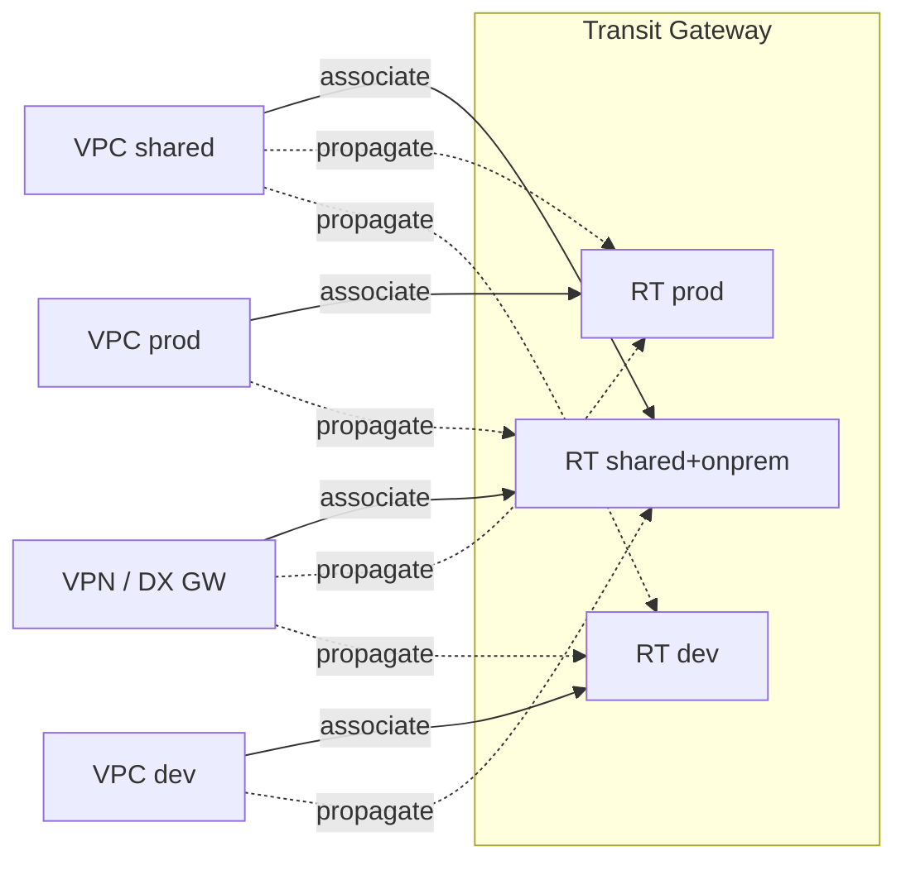
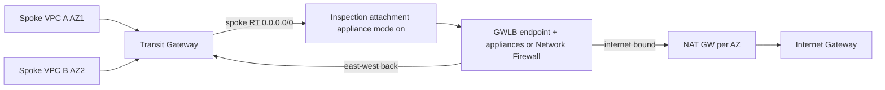
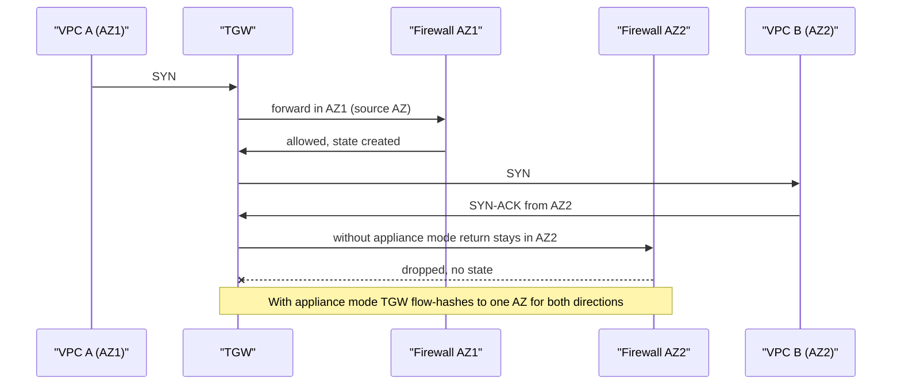
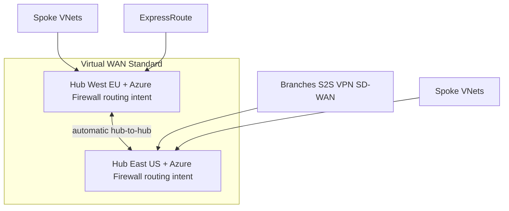

# G8 Transit Hub
> Last verified: 2026-10 · Audience: senior/staff DevOps, SRE, AI eng, NetEng, DevSecOps, architects

**Neutralized terms used in this file**

| Generic term (course) | AWS | Azure |
|---|---|---|
| Transit hub / transit hub router | **AWS Transit Gateway (TGW)** (regional) | **Virtual WAN (Standard) virtual hub** router, or a customer-managed **hub VNet** (hub-spoke) with Azure Firewall/NVA + UDRs (+ Azure Route Server) |
| Attachment | TGW attachment (VPC, VPN, VPN Concentrator, DX gateway, Connect, peering, network function) | vWAN *connection* (hub VNet connection, S2S VPN, P2S, ExpressRoute, hub-to-hub automatic) / VNet peering |
| Hub route table | TGW route table (association + propagation) | vWAN hub route table + **labels**; or UDR route tables in hub-spoke |
| VRF-style isolated route table | Multiple TGW route tables + blackhole routes | vWAN custom route tables / `None` route table / labels; AVNM network groups |
| Hub peering across regions | TGW inter-Region peering (static routes) | vWAN hub-to-hub (automatic full mesh over Microsoft backbone); global VNet peering between hub VNets |
| SD-WAN appliance attachment | TGW **Connect** (GRE + BGP) | NVA in the vWAN hub (partner SD-WAN) or **BGP peering** with the hub router; Azure Route Server in hub-spoke |
| Gateway load balancer | **Gateway Load Balancer (GWLB)**, GENEVE UDP 6081 | Azure **Gateway Load Balancer** (VXLAN) / internal Standard LB with **HA ports** |
| Managed network firewall | **AWS Network Firewall** | **Azure Firewall** (Std/Premium) |
| Network function attachment | TGW **network function attachment** (Network Firewall, native) | **Secured virtual hub** (Azure Firewall deployed *in* the vWAN hub) + routing intent |
| Dedicated interconnect | Direct Connect (transit VIF → DX gateway → TGW) | ExpressRoute (circuit → ER gateway in hub) |
| Cross-account sharing | **AWS RAM** share of the TGW | Cross-subscription/tenant hub VNet connections; AVNM scoped to management groups |

## TL;DR
- TGW is a **regional, AWS-managed L3 router**: attachments are both source and destination; forwarding is by **longest-prefix match** in the **one route table the ingress attachment is associated with**. Association = "which table do I look up in"; propagation = "which tables learn my prefixes". That one sentence answers most segmentation questions.
- **Segmentation = multiple route tables (VRF-like)** + selective propagation + **blackhole** routes; static beats propagated for the same prefix; TGW does **not** filter propagated routes (use separate tables or Cloud WAN policies).
- **AZ model:** one subnet (ENI) per AZ per VPC attachment; traffic stays in the source AZ by default. **Stateful inspection across AZs breaks** (asymmetric return) unless you enable **appliance mode** on the inspection VPC attachment (flow-hash → same AZ both directions).
- **Bandwidth (verified 2026-10):** VPC / DX GW / peering attachment up to **100 Gbps per AZ each direction**, 7.5 Mpps; VPN tunnel **1.25 Gbps** (large-bandwidth tunnel 5 Gbps), so scale VPN with **BGP + ECMP**; Connect peer 5 Gbps, 4 peers = 20 Gbps per Connect attachment. MTU **8500** (VPN 1500 at TGW / 1446 tunnel MTU).
- **Peering:** inter-Region (and intra-Region) TGW peering is **static-route only**, no ECMP, 1 peering per TGW pair; use **AWS Cloud WAN** when you want dynamic inter-Region routing and policy segments.
- **Centralized patterns:** egress (NAT GW in egress VPC + `0.0.0.0/0` → egress attachment + blackholes), inspection (GWLB + appliances with appliance mode, or **AWS Network Firewall native TGW attachment**, GA 2025, appliance mode auto-on, static routes only, no 3rd-party), shared interface endpoints + Route 53 PHZ.
- **Cost trade-off:** TGW = **$0.05/attachment-hour + $0.02/GB** processed (us-east, charged to the sender); VPC peering = no hourly/processing fee, lowest latency, but non-transitive and max **125** peerings per VPC. Mix: TGW for the fabric, peering for high-volume pairs.
- **Azure mapping:** **vWAN Standard hub** (managed router, 50 Gbps aggregate, auto hub-to-hub mesh, **routing intent** for Internet/Private traffic via Azure Firewall/NGFW NVA/SaaS) vs **customer-managed hub-spoke** (hub VNet + Azure Firewall + UDRs + gateway transit + Azure Route Server, orchestrated by **AVNM**).

## G8.1 Introduction to the transit hub router
- **How it works:**
  - TGW = regional virtual router, elastic scale, operates at **L3**; packets go to a next-hop **attachment** based on destination IP. Supports IPv4 and IPv6.
  - Replaces N(N-1)/2 VPC peerings with N attachments; **transitive** routing (VPC ↔ VPC ↔ VPN ↔ DX) which VPC peering never allows.
  - Own **BGP ASN** (`amazon_side_asn`, default 64512) used toward VPN/DX/Connect.
  - Default quotas: 5 TGWs/account/Region, **5,000 attachments/TGW**, 20 route tables/TGW (adjustable), **10,000 total routes** across all tables, 5 TGWs per VPC, one attachment per VPC per TGW.
  - Optional features: DNS support (resolve public DNS of peered VPC to private IP), **security-group referencing** across VPC attachments in the same Region, VPN ECMP, multicast (only at creation), auto-accept shared attachments, TGW CIDR blocks (for Connect peers, private-IP VPN, Client VPN).
- **Trade-offs / when to use:** more than a handful of VPCs, any hybrid (VPN/DX) that must reach many VPCs, centralized inspection/egress, or need for segmentation. Adds a hop (latency, sub-ms) and per-GB cost.
- **Interview angles:**
  - "Why not just peer?" → transitivity, centralized hybrid, segmentation, inspection; peering is fine for few VPCs or heavy pairwise traffic (G8.17).
  - Pitfall: forgetting the **VPC subnet route table** side; attaching a VPC does nothing until subnets have a route `→ tgw-…`.
  - Azure: vWAN hub router (Standard SKU only; Basic = S2S VPN only, no transit) or hub VNet + NVA; Azure VNet peering is likewise **non-transitive**.

## G8.2 Network attachments and routing
- **How it works:**
  - **Attachment types:** VPC, Site-to-Site VPN, **VPN Concentrator** (new: many low-bandwidth sites, 100 Mbps/tunnel, 100 sites per concentrator), Direct Connect gateway, **Connect** (GRE/BGP over a VPC or DX transport attachment), **peering** (TGW-TGW or TGW-Cloud WAN), **network function** (AWS Network Firewall). Client VPN can also attach natively (2025).
  - **Association:** each attachment is associated with **exactly one** route table (lookup table for traffic *entering* from it). A table can have many associated attachments.
  - **Propagation:** an attachment can propagate its routes into **one or more** tables. VPC → its CIDRs; VPN/DX GW/Connect → BGP-learned prefixes. **No filtering** of propagated routes.
  - **Static routes** (incl. **blackhole**) and **prefix-list references** can be added; static wins over propagated for the same CIDR.
  - **Route evaluation:** longest prefix first; tie on same CIDR → static > prefix-list > VPC-propagated > **DX GW-propagated** > Connect > VPN-over-DX > VPN > VPN Concentrator > Client VPN > peering (Cloud WAN). Same type → shorter AS_PATH, lower MED (defaults: 0 on DX, 100 on VPN/Connect), eBGP > iBGP. Only the **preferred** route is shown; backup appears only when the primary is withdrawn.
  - **Default route table** (default association + default propagation) exists unless both are disabled; for anything segmented, disable both and manage tables explicitly.
- **Trade-offs / when to use:** default table = flat any-to-any (simple, zero isolation). Custom tables = segmentation but more objects to manage (IaC).
- **Interview angles:**
  - "Spoke A can't reach spoke B" → check (1) VPC subnet route to TGW, (2) A's attachment association, (3) B propagated into A's table (and reverse for return!), (4) SG/NACL, (5) AZ subnet presence (G8.5).
  - "DX and VPN advertise the same prefix, which wins?" → DX GW-propagated beats VPN-propagated by type; to prefer VPN make it more specific.
  - Azure: vWAN **connections** associate to one hub route table and propagate to tables/**labels**; branches (VPN/ER/P2S) must all associate to **Default** and propagate to the same set.

## G8.3 Full routing vs restricted (VRF-style) route tables
- **How it works:**
  - **Full routing:** one table, every attachment associated + propagated → any-to-any (the "centralized router" scenario).
  - **Restricted / VRF-style:** one table per security domain (e.g. `prod`, `dev`, `shared`, `onprem`). Isolated VPCs associate to `prod` table but propagate only into `shared`/`onprem` tables; shared services propagate into all → spokes reach shared + on-prem but **not each other**.
  - **Blackhole routes** drop matching traffic: e.g. in a spoke table with `0.0.0.0/0 → egress`, add blackholes for `10.0.0.0/8` etc. so inter-VPC traffic cannot ride the default route.
  - One TGW with N tables behaves like N isolated routers but is easier to change than N TGWs.
- **Trade-offs / when to use:** tables isolate at L3 only; still need SG/NACL/firewall for L4-7. Route-table quota (20 default) and route quota (10k total) matter at scale. For policy-based segments across Regions, **Cloud WAN segments** are the managed evolution.
- **Interview angles:**
  - "Implement dev can't talk to prod but both reach shared services and on-prem" → 3-table design (diagram below); remember **return path** must exist in shared/on-prem tables.
  - Pitfall: leaving default propagation on, so a new attachment silently leaks into the "flat" table.
  - Azure vWAN: custom route tables + **None** table (propagate to None = advertise nowhere) + labels; but **routing intent cannot coexist with custom route tables**. Hub-spoke: isolation is the default (peering non-transitive), connectivity is added via UDRs to the firewall.

## G8.4 Network patterns: flat vs segmented
- **How it works:**
  - **Flat:** default table, all propagate. Simple, every new VPC reachable everywhere; blast radius = whole estate.
  - **Segmented:** environment/tenant/compliance tables; shared-services and on-prem tables; optional **inspection** hop (traffic between segments forced via firewall attachment).
  - Typical enterprise: segmented + centralized egress + centralized inspection for east-west across segments only (intra-segment direct).
- **Trade-offs / when to use:** flat for small orgs / sandboxes; segmented for PCI/HIPAA scopes, M&A, multi-tenant SaaS. Inspection adds cost (per-GB on TGW twice + firewall) and latency.
- **Interview angles:**
  - "Zero-trust east-west?" → segmentation (L3) + inspection (L4-7) + SG referencing; L3 isolation alone isn't zero trust.
  - Azure: vWAN default = flat any-to-any between all VNets and branches of all hubs; segmentation via custom tables, or simpler: **routing intent private policy** (everything through firewall). Hub-spoke: spokes isolated unless UDR via firewall; AVNM **direct connectivity** creates spoke mesh (connected group) when you *want* flat.

## G8.5 Availability zone considerations
- **How it works:**
  - Per VPC attachment you pick **exactly one subnet per AZ**; TGW places one ENI (one IP) there. Enabling an AZ makes **all subnets in that AZ** reachable, but **only resources in AZs with an attachment subnet can send to TGW**.
  - Without appliance mode TGW keeps traffic in the **originating AZ**; if destination attachment lacks that AZ, TGW sends it to a random enabled AZ (no extra TGW charge for that cross-AZ hop).
  - Best practice: dedicated small **/28 TGW subnets** per AZ with their own route table (and permissive NACL), so workload NACLs don't hit TGW ENI traffic.
  - Bandwidth quota is **per AZ**: 100 Gbps / 7.5 Mpps per VPC attachment per AZ.
- **Trade-offs / when to use:** enable every AZ the VPC uses; extra AZs cost nothing on TGW hourly (charge is per attachment), only IPs.
- **Interview angles:**
  - "Instances in AZ-c can't reach on-prem but AZ-a can" → attachment has no subnet in AZ-c.
  - Pitfall: putting TGW ENI in the same subnet as workloads, then applying a restrictive NACL.
  - Azure: vWAN hub router and Azure Firewall are zone-redundant platform services; no per-AZ subnet selection; hub-spoke Azure Firewall should be deployed **across zones**.

## G8.6 AZ affinity and appliance mode (symmetric routing)
- **How it works:**
  - Problem: A (AZ1) → B (AZ2) through an inspection VPC. Forward path enters inspection VPC in AZ1, return enters in AZ2 → a **different firewall instance** sees the reply without the SYN → **drop**.
  - **Appliance mode** on the *inspection VPC attachment*: TGW picks one ENI/AZ via **flow hash** for the life of the flow and uses it for return traffic → symmetric. It may also send traffic to any AZ of that VPC (gives up AZ affinity).
  - Guarantee holds only if source and destination traffic both enter the inspection VPC **from the same TGW**; **one TGW per appliance VPC** (TGWs don't share flow state). Traffic that enters via IGW then goes to TGW post-inspection can drop.
  - Enabling it on an existing attachment can shift flows across AZs.
  - Network Firewall native attachment: appliance mode **auto-enabled**.
- **Trade-offs / when to use:** required for any stateful appliance (firewall, IDS, NAT appliance) in a multi-AZ inspection VPC; costs some cross-AZ data transfer and latency.
- **Interview angles:**
  - Classic exam distractor: "firewall drops return traffic intermittently after adding a 2nd AZ" → enable appliance mode (not "add more instances").
  - GWLB has its own 5-tuple (or 3/2-tuple) flow stickiness, but TGW still must deliver both directions to the same AZ's GWLB endpoint → still need appliance mode.
  - Azure: symmetric hashing via **internal Standard LB with HA ports** in front of NVAs (or Azure GWLB); in vWAN, routing intent + firewall in hub handles symmetry including inter-hub (requires routing intent on **all** hubs).

## G8.7 Hub peering across regions
- **How it works:**
  - TGW **peering attachment** (inter-Region, intra-Region, or cross-account); requester/accepter flow.
  - **Static routes only** (no BGP propagation over the peering), **no ECMP**, only **1 peering between any two TGWs**, 50 peerings per TGW (adjustable).
  - Inter-Region traffic is **encrypted** on the AWS backbone; MTU 8500; no PMTUD on peering; up to 100 Gbps per AZ.
  - Data processing charged only on the sending TGW (no charge at receiving TGW), plus inter-Region data transfer.
  - Use distinct ASNs per TGW (good hygiene; required for some designs). Multicast not supported across peering.
- **Trade-offs / when to use:** few Regions, simple summarised routes (e.g. `10.1.0.0/16` per Region). At many Regions / dynamic needs → **AWS Cloud WAN** (core network, segments, policy, dynamic routing between CNEs; see G13).
- **Interview angles:**
  - "Route between Regions without maintaining statics" → Cloud WAN, or summarise per-Region CIDRs to keep statics few.
  - Pitfall: expecting on-prem routes learned on TGW-1 to propagate to TGW-2 automatically. They don't.
  - Azure vWAN: hubs in the same virtual WAN are **automatically full-meshed** over the Microsoft backbone, dynamic (but static routes and `0.0.0.0/0` **don't propagate across hubs**). Hub-spoke: global VNet peering hub↔hub + UDRs on firewalls.

## G8.8 Connect attachment for SD-WAN appliances
- **How it works:**
  - Connect attachment rides on a **transport attachment** (existing VPC or DX GW attachment). Each **Connect peer** = one **GRE** tunnel + **two BGP sessions** (redundancy) to AWS-managed infra.
  - Inside BGP addresses: a **/29 from 169.254.0.0/16** (some reserved, e.g. 169.254.0.0/29 to .5.0/29, 169.254.169.248/29); appliance uses the first address. Optional IPv6 /125 from fd00::/8. Outer TGW address comes from a **TGW CIDR block**.
  - Only **MP-BGP over IPv4** peering; eBGP needs `ebgp-multihop` TTL 2; keepalive 10 s / hold 30 s; **no BFD, no graceful restart, no static routes**; routes propagate by default.
  - Limits: **5 Gbps and 300 kpps per Connect peer**, 4 peers per attachment (20 Gbps), ECMP across peers/attachments when AS_PATH and ASN match (not across the 2 sessions of one peer). 1,000 routes in from appliance, 5,000 out.
  - GRE MTU: subtract 24 bytes (e.g. 1476 on a 1500 interface).
  - No TGW data-processing charge on Connect beyond the transport attachment.
- **Trade-offs / when to use:** vs IPsec VPN from the appliance: no IPsec overhead, higher throughput (5 Gbps vs 1.25), native BGP; but GRE is **unencrypted** (fine inside a VPC/over DX; use IPsec/MACsec if encryption needed).
- **Interview angles:**
  - "Integrate Cisco/Fortinet SD-WAN in AWS with dynamic routing and > 1.25 Gbps" → appliance in a transit VPC + TGW Connect.
  - Azure: deploy partner SD-WAN **NVA inside the vWAN hub**, or NVA in a spoke with **vWAN hub BGP peering**; hub-spoke uses **Azure Route Server** (BGP only, does not forward data; up to 16 peers, 4,000 routes/peer, ASN 65515). Note: SD-WAN NVA and firewall NVA in the *same* hub with routing intent is not yet supported.

## G8.9 VPN attachment (ECMP, accelerated VPN)
- **How it works:**
  - Each Site-to-Site VPN = **2 tunnels**; standard tunnel **up to 1.25 Gbps / 140 kpps**; large-bandwidth tunnel **up to 5 Gbps / 400 kpps** (attachment-type support: check docs, unverified for VGW). Tunnel MTU 1446 / MSS 1406, no jumbo, no PMTUD.
  - **ECMP** (TGW option `vpn_ecmp_support`, on by default) aggregates multiple tunnels/connections; requires **dynamic (BGP)** VPNs, same ASN (no AS-path relax) and ECMP on the customer gateway. E.g. 4 connections × 2 tunnels × 1.25 = ~10 Gbps aggregate, but **a single flow is still capped at one tunnel**.
  - VGW does not do ECMP across tunnels (active/standby) → another reason to terminate VPN on TGW.
  - Route limits on TGW VPN: 1,000 dynamic routes in from CGW, 5,000 out.
  - **Accelerated VPN:** TGW-only; two AWS-managed **Global Accelerator** accelerators (one per tunnel) carry traffic from the nearest edge over the AWS backbone; **NAT-T required**, IKE must be initiated by the CGW, can't toggle on an existing connection (recreate), not with DX public VIF, cert-auth needs IKE fragmentation support. Default 10 accelerated VPNs/Region.
  - **Private IP VPN** over DX transit VIF (encryption over DX, outer IPs from TGW CIDR).
- **Trade-offs / when to use:** ECMP VPN = cheap bandwidth scaling, quick to provision; jitter/latency of internet. Accelerated = for distant/poorly-peered branches. DX for predictable, high, SLA-backed bandwidth (G12).
- **Interview angles:**
  - "Need 4 Gbps over VPN" → multiple BGP VPN connections on TGW with ECMP (or 5 Gbps large-bandwidth tunnels); per-flow still 1.25 Gbps.
  - Pitfall: static-routed VPNs → no ECMP.
  - Azure: vWAN S2S VPN gateway scales by **scale units** (per hub, active-active instances; aggregate up to ~20 Gbps, unverified); Azure VPN Gateway (non-vWAN) uses SKUs (VpnGw1-5AZ); Azure has no direct "accelerated VPN" equivalent (Microsoft global network routing-preference achieves similar ingress-near-user behaviour).

## G8.10 Hub and dedicated interconnect
- **How it works:**
  - Path: DX connection → **transit VIF** → **Direct Connect gateway** (global) → **association** with TGW(s) in any Region.
  - Quotas: **4 transit VIFs per dedicated connection** (counted within 51 VIFs), 1 VIF on hosted connection; **6 TGWs per DX GW**, **20 DX GWs per TGW**, 30 VIFs per DX GW.
  - **Allowed prefixes** on the DX GW-TGW association control what AWS advertises on-prem (up to **200 prefixes per TGW** combined IPv4/IPv6); TGW does not auto-advertise VPC CIDRs, so summarise. On-prem → AWS: 100 routes per BGP session default, up to 1,000 with prefix controls; exceeding → **BGP session goes idle**.
  - ECMP across multiple transit VIFs on **one** DX GW when prefix, length and AS_PATH match → AWS recommends a single DX GW.
  - DX GW-propagated beats VPN-propagated for same prefix → VPN as backup to DX works naturally.
  - MTU 8500 on transit VIF (jumbo) supported, no PMTUD on DX attachments.
- **Trade-offs / when to use:** DX GW+TGW for many VPCs/Regions; private VIF to VGW only for a few VPCs (no TGW per-GB fee). Add VPN over DX (private IP VPN) or MACsec when encryption is a requirement.
- **Interview angles:**
  - "On-prem can't learn new VPC CIDR" → it's not in the allowed-prefixes list (or not covered by a summary).
  - "BGP over DX flaps after adding VPCs" → advertised >100 prefixes into AWS session limit.
  - Azure: ExpressRoute circuit → **ER gateway in vWAN hub** (scale units) or ER gateway in hub VNet; **FastPath** to bypass gateway for data plane; ER-to-ER transit via **Global Reach**; vWAN routing intent advertises RFC1918 aggregates to ER on-prem. Details in G12.

## G8.11 Multicast
- **How it works:**
  - Must be enabled **when the TGW is created** (`multicast_support`); you create **multicast domains** (subnet-level membership, a subnet in only one domain) and groups (group IP; membership by ENI).
  - Membership: **IGMPv2** (dynamic; TGW queries every 2 min, member removed after 3 missed queries) or **static** API registration (sources + members). IPv6 only with static.
  - Not supported over **DX, VPN, peering or Connect** attachments; no fragmentation (fragments dropped); non-Nitro instances can't be senders (and need src/dst check disabled).
  - Limits: **1 Gbps per flow**, 20 Gbps aggregate per AZ, 75 kpps per flow (<10 receivers), 100 members per group; AWS warns it's not for HFT.
  - SG/NACL must allow IGMP (protocol 2) from 0.0.0.0/32 and to 224.0.0.2 / group IP.
- **Trade-offs / when to use:** lift-and-shift of market data, media, legacy clustering. Domains can be shared via RAM.
- **Interview angles:**
  - "Multicast from on-prem into VPC?" → not natively over DX/VPN; use GRE/overlay on an appliance.
  - Azure: **VNets do not support multicast/broadcast**; needs an overlay (NVA/VXLAN/GRE, or app-level pub/sub). This is a real AWS-vs-Azure differentiator.

## G8.12 Architecture: centralized internet egress
- **How it works:**
  - **Egress VPC** with public subnets (NAT GW per AZ + IGW) and private TGW subnets per AZ. Spoke VPCs have **no IGW/NAT**; spoke subnet `0.0.0.0/0 → TGW`.
  - Spoke TGW table: `0.0.0.0/0 → egress attachment` (static) + **blackholes for RFC1918** to stop spoke-to-spoke via default.
  - Egress VPC: TGW-subnet RT `0.0.0.0/0 → NAT GW (same AZ)`; public-subnet RT `spoke CIDRs → TGW`, `0.0.0.0/0 → IGW`. TGW attachment must be in **private** subnet (otherwise packets go straight to IGW and are dropped, no public IP).
  - Egress table (associated to egress attachment) has propagated spoke routes for return traffic.
- **Trade-offs / when to use:** fewer NAT GWs/EIPs (one allowlistable egress IP set), central control; but TGW per-GB ($0.02) **plus** NAT per-GB ($0.045) and cross-AZ risk; a big egress VPC's NAT has 55,000 concurrent connections per destination per EIP limit (add EIPs). Decentralized NAT can be cheaper for heavy egress.
- **Interview angles:**
  - "Cost-optimise S3 traffic in a centralized egress design" → **gateway endpoints in each spoke** (free) so S3/DynamoDB bypass TGW + NAT.
  - Add inspection by inserting Network Firewall/GWLB in the egress VPC (G8.13/14).
  - Azure: vWAN **routing intent Internet policy** → Azure Firewall/NGFW/SaaS in hub (direct access); hub-spoke: UDR `0.0.0.0/0 → Azure Firewall` private IP; **NAT Gateway** on firewall subnet for SNAT scale. Note **default outbound access** is being retired: new VNets default to private subnets (exact cutover date unverified, announced for 2025-2026), so explicit egress (NAT GW/firewall) is the norm.

## G8.13 Architecture: centralized inspection with gateway load balancer
- **How it works:**
  - **GWLB** (L3 "bump-in-the-wire", listens on all ports) encapsulates original packets in **GENEVE (UDP 6081)** to a fleet of appliances (Palo Alto, Fortinet, Check Point...), with health checks and flow stickiness (5-tuple default; 3/2-tuple optional).
  - **Inspection VPC**: TGW subnets → route `0.0.0.0/0 → GWLB endpoint (GWLBe)` in same AZ → appliance → back via GWLBe → appliance subnet RT `0.0.0.0/0 → TGW`.
  - TGW: spoke table `0.0.0.0/0 → inspection attachment`; inspection table has propagated spoke routes (+ default to egress VPC if combined). **Appliance mode on inspection attachment** is mandatory for symmetric flows.
  - GWLB is AZ-scoped; cross-zone load balancing optional (off by default).
- **Trade-offs / when to use:** third-party NGFW features/licensing, existing SecOps tooling; you manage the fleet (AMIs, scaling, patching). Alternative: Network Firewall (managed, Suricata rules).
- **Interview angles:**
  - "Why GENEVE?" → preserves original packet (src/dst unchanged) + metadata TLVs; appliance must support GENEVE; MTU overhead (GWLB supports 8500 MTU).
  - "Two inspection VPCs, one TGW?" fine; "two TGWs into one appliance VPC" breaks flow stickiness.
  - Azure: **Azure Gateway Load Balancer** (chains to Standard LB/public IP frontends via VXLAN) is for *ingress* service chaining; for east-west in hub-spoke use **internal LB with HA ports** + NVAs; in vWAN put the NGFW NVA in the hub and use routing intent.

## G8.14 Architecture: centralized inspection with managed network firewall
- **How it works:**
  - Classic model: **AWS Network Firewall endpoints** (GWLB-based, AWS-managed) in a dedicated **inspection VPC**, one firewall subnet per AZ; TGW subnet RT → firewall endpoint (vpce-…) → firewall subnet RT → TGW. Appliance mode on the inspection attachment.
  - Stateless + stateful (**Suricata-compatible**) rule groups, domain filtering (SNI/Host), TLS inspection, managed threat signatures; central policy through **Firewall Manager**.
  - Combined **east-west + egress**: inspection VPC also holds NAT GW + IGW, or chain to separate egress VPC.
- **Trade-offs / when to use:** no fleet to manage, auto-scales (~100 Gbps per endpoint per AZ, unverified for 2026), pay per endpoint-hour + per GB; fewer advanced NGFW features than 3rd-party.
- **Interview angles:**
  - "Distributed vs centralized Network Firewall?" → distributed (endpoints per VPC, ingress/IGW edge routing) for per-VPC policy and avoiding TGW cost; centralized for east-west and on-prem traffic through TGW.
  - Azure: **hub VNet with Azure Firewall** (Std/Premium, Premium adds TLS inspection/IDPS) and UDRs; or **secured virtual hub** (G8.15). Policy via **Azure Firewall Manager / Firewall Policy**.

## G8.15 Architecture: centralized inspection with network function attachment
- **How it works (verified, GA June-July 2025, all Regions):**
  - Create the Network Firewall by selecting the **TGW** instead of a VPC/subnets. AWS provisions a **service-managed buffer VPC** with GWLB endpoints per AZ; you see a TGW **network function attachment**.
  - **Appliance mode auto-enabled**; routing by **static routes only** in TGW tables; **third-party firewalls not supported**.
  - Cross-account: TGW owner RAM-shares the TGW to the firewall owner account; either side can manage the attachment.
  - Routing: spoke table `0.0.0.0/0` (or specific CIDRs) → NF attachment; NF attachment's associated table → propagated spoke routes + default to egress VPC.
  - Billing: Network Firewall endpoint/GB + TGW attachment; supports **TGW metering policies** for flexible cost allocation. (Exact whether TGW data-processing is charged for the NF hop: check pricing, unverified.)
- **Trade-offs / when to use:** removes inspection-VPC plumbing (subnets, RTs, endpoint routing, appliance-mode mistakes). Less control over the buffer VPC (no NAT/IGW inside it; centralize egress in a separate egress VPC).
- **Interview angles:**
  - "2026 greenfield centralized east-west inspection on AWS, AWS-native firewall?" → NF native TGW attachment; GWLB only if 3rd-party NGFW required.
  - Azure's direct equivalent: **secured virtual hub** = Azure Firewall deployed *inside* the vWAN hub + **routing intent** (Private + Internet policies, at most one each per hub). Private policy steers RFC1918 (10/8, 172.16/12, 192.168/16) + extra prefixes; inter-hub inspection requires routing intent on all hubs. Next hop: Azure Firewall, eligible NGFW NVAs (e.g. Check Point, Fortinet, Cisco) or SaaS (e.g. Palo Alto Cloud NGFW).

## G8.16 Architecture: centralized interface endpoints
- **How it works:**
  - Create **interface VPC endpoints** (PrivateLink) once in a **shared-services VPC**; spokes reach them via TGW.
  - **Disable private DNS** on the endpoints; create **Route 53 private hosted zones** named for the service (e.g. `sqs.us-east-1.amazonaws.com`) with alias A records to the endpoint DNS, and **associate the PHZ with every spoke VPC** (cross-account association via authorization). On-prem resolves through **Route 53 Resolver inbound endpoints**.
  - **Gateway endpoints** (S3/DynamoDB) can't be shared over TGW; keep them per VPC (free).
- **Trade-offs / when to use:** savings when many VPCs × many services × AZs (each interface endpoint ~$0.01/AZ-hour); cost moves to TGW per-GB + endpoint per-GB, so high-volume services (e.g. ECR pulls, S3 via interface endpoint) may be cheaper locally. Also endpoint policies become shared (coarser).
- **Interview angles:**
  - Pitfall: leaving "private DNS" on in the hub; spokes still resolve public IPs → traffic goes to NAT.
  - Azure: centralize **Private Endpoints** in the hub (or per-spoke) with **Private DNS zones** (`privatelink.*`) linked to all VNets, ideally via **Azure DNS Private Resolver** for on-prem; with vWAN, DNS zones can't link to the hub itself, link to a shared services VNet. See G7.

## G8.17 Transit hub vs peering
| Aspect | VPC peering | Transit Gateway |
|---|---|---|
| Topology | 1:1, **non-transitive** | hub, transitive |
| Scale | 50 default, **125 max** per VPC | 5,000 attachments |
| Bandwidth | no aggregate limit beyond instance | **100 Gbps/AZ/direction** per VPC attachment, 7.5 Mpps |
| Latency | lowest (direct) | +1 hop |
| Cost | no hourly, **no processing**; data transfer only (same-AZ free) | **$0.05/attachment-hr + $0.02/GB** + data transfer |
| MTU | 9001 intra-Region | 8500 |
| Security groups | cross-VPC SG reference (same Region) | SG referencing supported (opt-in, same Region) |
| Segmentation / inspection | none | route tables, blackhole, appliance mode |
| Overlapping CIDRs | not allowed | not allowed (use NAT/PrivateLink) |
- **Interview angles:**
  - "Two VPCs exchange 500 TB/month" → peer them directly even if both are on TGW (more specific peering route wins in the VPC RT); TGW would add ~$10k/month processing.
  - Migration pitfall: MTU mismatch (9001 vs 8500) during cutover drops jumbo packets; update both VPC RTs at once.
  - Overlapping CIDRs → neither works; use PrivateLink (G7) or private NAT GW.
  - Azure: VNet peering (non-transitive, per-GB in+out both sides, global peering higher) vs vWAN hub (hub-processing + connection-unit fees, transitive, routing infrastructure units: default 2 units ≈ 3 Gbps / 2,000 VMs, router max 50 Gbps). AVNM **connected groups** give mesh at scale without peerings.

## G8.18 Sharing the hub across accounts
- **How it works:**
  - Owner (network account) shares TGW via **AWS RAM** to accounts, OUs, or the whole Organization (with org sharing enabled no invitation needed).
  - Spoke accounts create **VPC attachments** to the shared TGW; owner accepts (or enable **auto-accept shared attachments**). **Route tables, associations, propagations remain owner-only** → central control.
  - Billing: attachment-hour to the attachment (VPC) owner, data processing to the account sending traffic into TGW; TGW metering policies can reassign.
  - Also share via RAM: TGW multicast domains, DX GW association proposals (cross-account), Network Firewall attachment flow, Route 53 Resolver rules, subnets (VPC sharing as alternative).
- **Trade-offs / when to use:** hub in a dedicated **network account** (Control Tower/Landing Zone), IaC pipeline owns routing; spokes self-serve attachments. Alternative: **VPC sharing** (share subnets, no TGW needed within a shared VPC).
- **Interview angles:**
  - "Spoke team wants to change routes" → they can't; owner manages tables (intentional). Automate association via EventBridge/Lambda or AFT/IaC on attachment tag.
  - Azure: vWAN hub can connect VNets across **subscriptions** (and tenants with proper RBAC); **AVNM** at management-group scope deploys hub-spoke/mesh + security admin rules + UDR management across subscriptions.

## Diagrams

### Association vs propagation (segmented, VRF-style)

Result: prod and dev each reach shared and on-prem, never each other; shared/on-prem table knows all spokes for return traffic.

### Centralized inspection + egress with appliance mode


### Why appliance mode is needed


### Azure Virtual WAN secured hubs


## Cloud mapping: AWS vs Azure
| Capability | AWS | Azure | Role it plays | Key differences | Alternatives |
|---|---|---|---|---|---|
| Managed transit router | Transit Gateway | Virtual WAN Standard hub | Transitive L3 hub for VNets/VPCs + hybrid | TGW regional, you wire peering; vWAN global object, hubs auto-mesh; vWAN router 50 Gbps aggregate vs TGW 100 Gbps per attachment per AZ | AWS Cloud WAN; Aviatrix/Alkira; Cloudflare Magic WAN |
| Self-built hub | Transit VPC (legacy, appliances + VPN) | Hub VNet + Azure Firewall/NVA + UDRs + Route Server | DIY transit | Azure hub-spoke still very common (AZ-700); AWS transit-VPC largely obsolete | AVNM to orchestrate |
| Segmentation | TGW route tables, blackhole | vWAN custom route tables, labels, None table; AVNM network groups | VRF-like isolation | Routing intent excludes custom tables | Cloud WAN segments |
| Global / inter-region | TGW peering (static) / Cloud WAN | Hub-to-hub automatic (dynamic); global VNet peering | Multi-region backbone | Azure dynamic by default; AWS static unless Cloud WAN | SD-WAN overlay |
| SD-WAN integration | TGW Connect (GRE+BGP) | NVA in vWAN hub, hub BGP peering, Route Server | Dynamic routing with appliances | Route Server is control-plane only | VPN/IPsec |
| Inspection | GWLB + 3rd-party; Network Firewall (VPC or native TGW attachment) | Azure Firewall in hub VNet or secured virtual hub; NGFW NVA/SaaS in hub; Azure GWLB | Centralized east-west/egress filtering | AWS needs appliance mode; vWAN routing intent handles symmetry | Cloudflare/Zscaler SSE for egress |
| Hybrid | VPN (ECMP, accelerated), DX GW + transit VIF | vWAN S2S/P2S gateways, ER gateway, Global Reach | On-prem connectivity | AWS per-tunnel 1.25 Gbps; Azure gateway scale units/SKUs | Equinix Fabric/Megaport |
| Multicast | TGW multicast (IGMPv2/static) | Not supported (overlay needed) | One-to-many delivery | Real gap on Azure | App-level pub/sub, Kafka |
| Cross-account | AWS RAM | Cross-subscription connections, AVNM | Central network account | RAM keeps routing with owner | — |

- **TGW**: regional router; pay per attachment-hour + per GB; route tables are the policy. **Cloud WAN** is the global, policy-driven layer (segments, dynamic inter-Region) built on TGW-like core network edges.
- **Virtual WAN Standard**: Microsoft-managed hub VNet per region containing router (min /24 hub address space), gateways, firewall; **routing infrastructure units** scale VM count/throughput (default 2 units: 2,000 VMs, ~3 Gbps, unverified exact); Basic SKU = S2S only, upgrade one-way.
- **Hub-spoke (customer-managed)**: you own UDRs (`0.0.0.0/0` and spoke-to-spoke → firewall IP), **gateway transit / use remote gateways** on peerings, Route Server for NVA BGP; AVNM automates peerings (with enforcement), connected groups (mesh up to 3,000 VNets with high-scale preview), security admin rules, routing configs.
- **Gotchas**: vWAN `0.0.0.0/0` and static routes don't propagate across hubs; routing intent rewrites defaultRouteTable statics irreversibly; Azure UDR can't override inside-VNet prefixes from vWAN (only less-specific); AWS TGW can't filter propagated routes.
- **Alternatives**: Kubernetes multi-cluster meshes (Cilium ClusterMesh) only at pod layer; Cloudflare Magic WAN/Magic Firewall as SASE-style hub; GCP Network Connectivity Center is the canonical GCP equivalent.

## Hands-on (optional)
Segmented TGW with shared services, blackhole, appliance mode and RAM share.
```hcl
resource "aws_ec2_transit_gateway" "hub" {
  amazon_side_asn                 = 64512
  default_route_table_association = "disable"
  default_route_table_propagation = "disable"
  auto_accept_shared_attachments  = "enable"
  vpn_ecmp_support                = "enable"
  dns_support                     = "enable"
  tags = { Name = "core-tgw" }
}

resource "aws_ec2_transit_gateway_route_table" "spokes" {
  transit_gateway_id = aws_ec2_transit_gateway.hub.id
  tags               = { Name = "rt-spokes" }
}
resource "aws_ec2_transit_gateway_route_table" "inspection" {
  transit_gateway_id = aws_ec2_transit_gateway.hub.id
  tags               = { Name = "rt-inspection" }
}

resource "aws_ec2_transit_gateway_vpc_attachment" "inspection" {
  transit_gateway_id     = aws_ec2_transit_gateway.hub.id
  vpc_id                 = var.inspection_vpc_id
  subnet_ids             = var.inspection_tgw_subnet_ids # one /28 per AZ
  appliance_mode_support = "enable"
  transit_gateway_default_route_table_association = false
  transit_gateway_default_route_table_propagation = false
}

resource "aws_ec2_transit_gateway_vpc_attachment" "app" {
  transit_gateway_id = aws_ec2_transit_gateway.hub.id
  vpc_id             = var.app_vpc_id
  subnet_ids         = var.app_tgw_subnet_ids
  transit_gateway_default_route_table_association = false
  transit_gateway_default_route_table_propagation = false
}

# Spokes look up in rt-spokes; everything goes to inspection
resource "aws_ec2_transit_gateway_route_table_association" "app" {
  transit_gateway_attachment_id  = aws_ec2_transit_gateway_vpc_attachment.app.id
  transit_gateway_route_table_id = aws_ec2_transit_gateway_route_table.spokes.id
}
resource "aws_ec2_transit_gateway_route" "default_to_inspection" {
  destination_cidr_block         = "0.0.0.0/0"
  transit_gateway_attachment_id  = aws_ec2_transit_gateway_vpc_attachment.inspection.id
  transit_gateway_route_table_id = aws_ec2_transit_gateway_route_table.spokes.id
}
resource "aws_ec2_transit_gateway_route" "block_legacy" {
  destination_cidr_block         = "10.99.0.0/16"
  blackhole                      = true
  transit_gateway_route_table_id = aws_ec2_transit_gateway_route_table.spokes.id
}

# Inspection VPC looks up in rt-inspection, which learns spoke CIDRs (return path)
resource "aws_ec2_transit_gateway_route_table_association" "inspection" {
  transit_gateway_attachment_id  = aws_ec2_transit_gateway_vpc_attachment.inspection.id
  transit_gateway_route_table_id = aws_ec2_transit_gateway_route_table.inspection.id
}
resource "aws_ec2_transit_gateway_route_table_propagation" "app_to_inspection" {
  transit_gateway_attachment_id  = aws_ec2_transit_gateway_vpc_attachment.app.id
  transit_gateway_route_table_id = aws_ec2_transit_gateway_route_table.inspection.id
}

# Share the TGW with the whole Organization
resource "aws_ram_resource_share" "tgw" {
  name                      = "core-tgw"
  allow_external_principals = false
}
resource "aws_ram_resource_association" "tgw" {
  resource_arn       = aws_ec2_transit_gateway.hub.arn
  resource_share_arn = aws_ram_resource_share.tgw.arn
}
resource "aws_ram_principal_association" "org" {
  principal          = var.organization_arn
  resource_share_arn = aws_ram_resource_share.tgw.arn
}
```

Quick checks:
```bash
# Which route wins for a destination in a given TGW route table
aws ec2 search-transit-gateway-routes \
  --transit-gateway-route-table-id tgw-rtb-0123 \
  --filters "Name=route-search.longest-prefix-match,Values=10.20.1.10/32"

# Enable appliance mode on an existing inspection attachment
aws ec2 modify-transit-gateway-vpc-attachment \
  --transit-gateway-attachment-id tgw-attach-0abc \
  --options ApplianceModeSupport=enable

# Azure: effective routes on a vWAN hub route table
az network vhub get-effective-routes -g rg-net -n hub-weu \
  --resource-type RouteTable --resource-id "$RT_ID"
```

## Cross-links
- [G1 Virtual network fundamentals](../G-cloud-network-architecture/G1-virtual-network-fundamentals.md) (route tables, SG/NACL: G1.7, G1.8)
- [G6 Private connectivity and peering](../G-cloud-network-architecture/G6-private-connectivity-peering.md)
- [G7 Service endpoints and Private Link](../G-cloud-network-architecture/G7-service-endpoints-private-link.md)
- [G9 Hybrid network basics](../G-cloud-network-architecture/G9-hybrid-network-basics.md) · [G10 Site-to-site VPN](../G-cloud-network-architecture/G10-site-to-site-vpn.md) · [G12 Dedicated interconnect](../G-cloud-network-architecture/G12-dedicated-interconnect.md)
- [G13 Managed global WAN (Cloud WAN / vWAN)](../G-cloud-network-architecture/G13-managed-global-wan.md)
- [G4 Network performance and optimization (MTU)](../G-cloud-network-architecture/G4-network-performance-and-optimization.md) · [G5 Traffic monitoring and troubleshooting](../G-cloud-network-architecture/G5-traffic-monitoring-troubleshooting.md)
- [F7 Network routing (LPM, BGP, ECMP)](../F-network-engineering/F7-network-routing.md)
- [C4 Security (firewalls)](../C-large-scale-architecture/C4-security.md) · [L7 Zero trust](../L-data-privacy-ai-security/L7-zero-trust-workload-identity.md)

## Sources
- https://docs.aws.amazon.com/vpc/latest/tgw/how-transit-gateways-work.html
- https://docs.aws.amazon.com/vpc/latest/tgw/transit-gateway-quotas.html
- https://docs.aws.amazon.com/vpc/latest/tgw/tgw-connect.html
- https://docs.aws.amazon.com/vpc/latest/tgw/tgw-multicast-overview.html
- https://docs.aws.amazon.com/network-firewall/latest/developerguide/tgw-firewall.html
- https://aws.amazon.com/about-aws/whats-new/2025/07/aws-network-firewall-native-transit-gateway-support/
- https://docs.aws.amazon.com/vpn/latest/s2svpn/vpn-limits.html
- https://docs.aws.amazon.com/vpn/latest/s2svpn/accelerated-vpn.html
- https://docs.aws.amazon.com/directconnect/latest/UserGuide/limits.html
- https://aws.amazon.com/transit-gateway/pricing/
- https://learn.microsoft.com/en-us/azure/virtual-wan/virtual-wan-about
- https://learn.microsoft.com/en-us/azure/virtual-wan/about-virtual-hub-routing
- https://learn.microsoft.com/en-us/azure/virtual-wan/how-to-routing-policies
- https://learn.microsoft.com/en-us/azure/route-server/route-server-faq
- https://learn.microsoft.com/en-us/azure/virtual-network-manager/concept-connectivity-configuration
