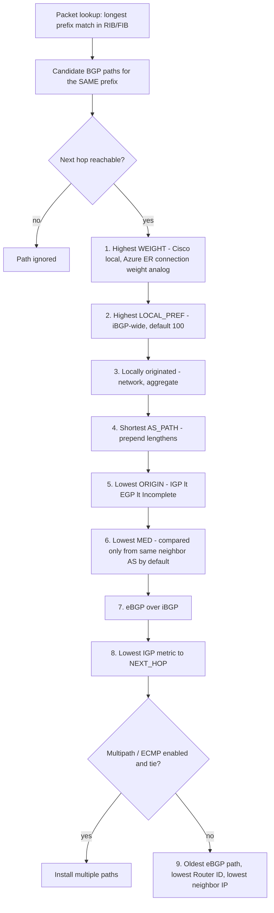
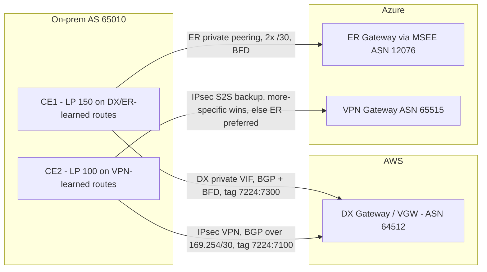

# G9 Hybrid Network Basics
> Last verified: 2026-10 · Audience: senior/staff DevOps, SRE, AI eng, NetEng, DevSecOps, architects

## TL;DR
- There are two hybrid links. An **IPsec VPN** runs over the internet: it's fast to set up, cheap and encrypted, but its throughput and latency vary and are capped per tunnel. A **dedicated interconnect** (AWS **Direct Connect**, Azure **ExpressRoute**) is a private circuit: you get predictable latency, 1–400 Gbps and a higher SLA, but it isn't encrypted by default and setup takes weeks.
- The standard enterprise pattern is **interconnect as primary + VPN as backup**. Both clouds prefer the interconnect for an *identical* prefix: AWS VGW prefers DX BGP > VPN static > VPN BGP, and Azure prefers ExpressRoute over VPN.
- **Longest prefix match beats every BGP attribute.** This is true on AWS and Azure alike. A more specific prefix advertised over the VPN pulls traffic away from DX or ER, so most "why is traffic on the VPN?" incidents are prefix-length problems.
- **Static vs dynamic:** use BGP when you need automatic failover, active/active across tunnels, or more than a handful of prefixes. Use static routing only for devices that can't run BGP. On AWS, static and BGP are exclusive per VPN connection.
- **BGP basics:** a path-vector protocol on **TCP 179**. **eBGP** runs between ASes (TTL 1, the next hop changes). **iBGP** runs inside an AS (full mesh or route reflectors, no re-advertising of iBGP-learned routes). Private ASNs are **64512–65534** (2-byte) and **4200000000–4294967294** (4-byte).
- **Direction rule:** your **egress** (cloud-bound traffic) is controlled by what you *receive*: **Weight** (Cisco-local) and **LOCAL_PREF** inside your AS. Your **ingress** (traffic returning from the cloud) is controlled by what you *advertise*: more-specific prefixes, **AS_PATH prepend**, **MED**, and on AWS the **7224:7x00 local-pref communities**.
- **AWS DX** honors 7224:7100/7200/7300, then AS_PATH, then MED. **Azure** ignores every community you send it, so for on-prem → Azure ingress you rely on more-specific prefixes or AS_PATH prepend. Inside Azure you can use ER **connection weight**, which is evaluated *before* AS_PATH.
- Fixed timers worth memorizing: Azure VPN Gateway and ExpressRoute use **60 s keepalive / 180 s hold**, which you can't change on the Microsoft side. AWS DX uses **BFD at 300 ms × 3** on the AWS side. Azure VPN Gateway has **no BFD**.

## G9.1 Introduction to hybrid networking (IPsec VPN vs dedicated interconnect)
- **How it works:**
  - **IPsec site-to-site VPN** builds an IKEv1/IKEv2 tunnel over the public internet to a cloud VPN endpoint. On AWS that's a **Virtual Private Gateway (VGW)**, a **Transit Gateway (TGW)** or **Cloud WAN**. On Azure it's a **VPN Gateway** (route-based) or a **Virtual WAN VPN gateway**.
    - **AWS:** every VPN connection has **2 tunnels**, each in a different AZ. A standard tunnel carries **up to 1.25 Gbps / 140k PPS**. A **Large Bandwidth Tunnel** carries **up to 5 Gbps / 400k PPS**, but only on TGW or Cloud WAN. Both tunnels must use the same size. To go beyond that, use ECMP across tunnels on TGW (see G8.9).
    - **Azure:** throughput depends on the SKU (VpnGw1–5, AZ variants). The top SKUs reach about 10 Gbps aggregate per gateway (unverified exact per-SKU figure). Active-active mode gives you 2 gateway instances, so 2 tunnels per site. The SLA is 99.95% (Basic SKU 99.9%).
  - **Dedicated interconnect** is a physical cross-connect at a colocation facility. In AWS it's a **DX location**; in Azure it's a **peering location** reaching the **MSEE** routers. BGP runs over 802.1Q VLANs:
    - **AWS:** these are **virtual interfaces (VIFs)**. A **Private VIF** reaches a VGW or DX Gateway. A **Transit VIF** reaches a DXGW then a TGW. A **Public VIF** reaches AWS public endpoints.
    - **Azure:** these are **peerings**. **Private peering** reaches VNets through an ExpressRoute gateway. **Microsoft peering** reaches Microsoft 365 and Azure PaaS public endpoints.
    - **AWS speeds:** dedicated ports come in **1 / 10 / 100 / 400 Gbps**. Hosted connections run from 50 Mbps up to 25 Gbps through partners (unverified upper hosted figure).
    - **Azure speeds:** provider circuits come in **50 Mbps–10 Gbps**. **ExpressRoute Direct** gives you **10 or 100 Gbps** port pairs. Circuit bandwidth is duplex, and you can burst to about 2× by using the secondary link, but that's not guaranteed.
  - **SLA:**
    - **AWS DX** depends on the resiliency model. **Maximum resiliency** (2 locations × 2 connections) gets **99.99%**. **High resiliency** (2 locations) gets **99.9%**. A single connection has no SLA.
    - **Azure ER** gets **99.95%**, but only if you configure **both** BGP sessions on the primary and secondary links.
  - **Encryption:** interconnects are private but **not encrypted by default**.
    - **AWS:** **MACsec** on 10/100/400 Gbps dedicated ports, at selected locations only, using GCM-AES-256 or XPN-256. For L3, run **IPsec over DX** (Private IP VPN on a transit VIF to TGW).
    - **Azure:** **MACsec** on ExpressRoute Direct. For L3, run **IPsec over ER private peering** (a VPN gateway using the private IP).
  - **Lead time:** a VPN takes **minutes**. An interconnect takes **days to weeks**, sometimes months: you need an LOA-CFA, the colo cross-connect, the provider circuit and router configuration.
- **Trade-offs / when to use:**

| Dimension | IPsec VPN | Dedicated interconnect (DX / ER) |
|---|---|---|
| Bandwidth | AWS 1.25 Gbps/tunnel (5 Gbps LBT), ECMP to scale. Azure SKU-bound | 50 Mbps–400 Gbps, LAG (AWS) / multiple circuits |
| Latency / jitter | Internet-variable | Deterministic, low jitter |
| SLA | AWS 99.95% per VPN connection. Azure 99.95% (VpnGw1+) | AWS up to 99.99% (max resiliency). Azure 99.95% |
| Encryption | Yes (IPsec) | No by default. Add MACsec (L2) or IPsec overlay |
| Cost shape | Hourly connection + standard internet egress | Port-hour + reduced DTO rate (AWS). Azure: monthly circuit fee + metered or unlimited data plan + Premium add-on |
| Lead time | Minutes | Weeks (colo, carrier, LOA-CFA) |
| Ops burden | Low. CPE + PSK/certs | Physical layer, BGP, BFD, provider management |

  - Use a **VPN** for PoCs, small branches, a quick start while the interconnect is provisioned, backup of the interconnect, or when you need encryption cheaply.
  - Use an **interconnect** for consistent throughput (migrations, data/AI pipelines, storage replication), latency-sensitive apps, and high DTO volume, where the lower egress pricing pays for the port.
- **Interview angles:**
  - If asked "*DX/ER is private so it's secure, right?*", say it's **isolated, not encrypted**. Compliance (PCI, HIPAA) usually needs MACsec or IPsec on top.
  - If asked "*cheapest HA design?*", the answer is a single DX or ER circuit plus a **VPN backup**. Know that Azure supports ER+VPN only as **active/passive** failover. Microsoft also notes that a VPN backup is a poor fit for bandwidth-heavy or latency-critical workloads, where it recommends multi-site ER instead.
  - Pitfall: the passive VPN **silently rots** (expired PSK, firewall change). Test failover regularly, and monitor that the BGP session on the backup stays up.
  - Pitfall: Azure's circuit SLA requires **both** sessions. A single-homed CE voids it.
  - Follow-up "*how do you get >1.25 Gbps over VPN on AWS?*" Use TGW + **ECMP** across multiple VPN connections with BGP, or Large Bandwidth Tunnels at 5 Gbps. A VGW does **not** do ECMP across VPN connections.

## G9.2 Static vs dynamic routing
- **How it works:**
  - **Static routing:** you configure the remote prefixes yourself on both sides. Nothing detects whether the path is alive except IKE/DPD tearing the tunnel down.
    - **AWS** has static routes on the VPN connection, up to **100**.
    - **Azure** puts the prefixes in the **Local Network Gateway** address space.
  - **Dynamic routing (BGP):** prefixes are exchanged automatically, and failover is driven by hold timers or BFD.
    - **AWS VPN limits:** you can advertise **100** dynamic routes from the CGW to a VGW (not adjustable). A VGW advertises up to 1,000 to the CGW, and a TGW up to 5,000.
    - **Azure VPN Gateway** accepts up to **4,000** prefixes. The session **drops** if you exceed that.
    - **DX** allows **100** routes per private or transit VIF session by default (raise to 1,000 with prefix controls) and **1,000** per public VIF. The session goes idle if you exceed the limit.
    - **ER private peering** allows **4,000** IPv4 prefixes (10,000 with Premium) and 100 IPv6. **ER Microsoft peering** allows 200 per session.
  - **AWS:** a VPN connection is **either** static or BGP, not both. A VPN Concentrator is BGP-only. DX is **always BGP**. Turn on **route propagation** on the VPC route table to see VGW-learned routes.
  - **Azure:** ExpressRoute is **always BGP**. A VPN Gateway can mix BGP and non-BGP connections. You can disable gateway route propagation per subnet route table, but **never on GatewaySubnet**.
  - **Cloud route-table priority for an identical prefix:**
    - **AWS VPC:** longest prefix first, then static routes (IGW, NAT, ENI, peering, TGW, GWLBe), then prefix-list routes, then propagated routes. Among propagated routes the VGW prefers **DX BGP > VPN static > VPN BGP**, then **shortest AS_PATH**, then **lowest MED**. The VPC **local** route always wins, even over more-specific propagated routes.
    - **Azure:** longest prefix first, then **UDR > BGP > system** routes. System routes for VNet, peering and service endpoints still win over more-specific BGP routes.
- **Trade-offs / when to use:**
  - **Static** is fine when there are few prefixes, the device can't run BGP (an old firewall or a policy-based VPN), or you want deterministic and auditable routes. The cost is that failover is coarse and every IP-plan change needs a ticket.
  - **BGP** gives active/active tunnels, ECMP (on TGW), automatic failover, summarization and path steering. The cost is complexity, plus the risk of leaking routes or hitting prefix-limit session drops.
- **Interview angles:**
  - Asked "*why use BGP on VPN at all?*", say that AWS sends from the cloud over **one preferred tunnel**, identified by MED. Without BGP, failover to the other tunnel relies on DPD and static routes, and asymmetric return paths break stateful firewalls.
  - Pitfall: an on-prem device advertises **more than 100 routes to a VGW** and the excess routes are silently missing, or advertises more than 4,000 to an Azure VPN Gateway and the session drops. The fix is to **summarize**.
  - Pitfall on AWS: a static route to an ENI or NVA beats the identical propagated route, which looks like "BGP is ignored".

## G9.3 How BGP works
- **How it works (RFC 4271):**
  - BGP is a **path-vector** protocol. It's loop-free because a router rejects any update whose AS_PATH already contains its own ASN. It runs over **TCP 179**.
  - **Message types:** OPEN (version, ASN, hold time, BGP Identifier, capabilities), UPDATE (withdrawn routes, path attributes, NLRI), KEEPALIVE and NOTIFICATION (an error that closes the session). ROUTE-REFRESH comes from RFC 2918.
  - **FSM:** Idle → Connect → Active → OpenSent → OpenConfirm → **Established**. A session stuck in **Active** usually means a TCP or ACL problem, an MD5 mismatch, or a wrong peer IP or ASN.
  - **Timers:** the session uses the lower **Hold time** of the two OPENs, and it must be **0 or ≥3 s**. The suggested hold time is 90 s. Keepalive is typically **⅓ of hold**. Cloud values:
    - **Azure VPN Gateway:** fixed at **keepalive 60 s / hold 180 s**, with no BFD. Match these values on-prem.
    - **Azure ExpressRoute:** **keepalive 60 s / hold 180 s** fixed on the MSEE side, but negotiable down, and **BFD** is supported.
    - **AWS DX:** BFD is enabled on the AWS side at a **300 ms interval × 3 multiplier**, so you only need to enable it on your router. AWS-generated VPN configs commonly use **10 s / 30 s** (unverified for current templates).
  - **eBGP vs iBGP:**

| | eBGP | iBGP |
|---|---|---|
| Peers | Different ASNs | Same ASN |
| TTL | 1 by default (directly connected) | Multi-hop, usually loopback-sourced |
| NEXT_HOP | Rewritten to self | Unchanged by default (`next-hop-self` often needed) |
| Loop prevention | AS_PATH | Split horizon: iBGP routes not re-advertised to iBGP peers, so you need a full mesh, **route reflectors** or confederations |
| AD (Cisco) | 20 | 200 |

  - **ASNs:**
    - 2-byte private: **64512–65534**. 4-byte private: **4200000000–4294967294** (RFC 6996). 64496–64511 are reserved for documentation. 4-byte ASNs come from RFC 6793.
    - **AWS:** the VGW and TGW default to **64512**, and AWS's public ASN is **7224**. Customer gateways can't use 7224 (or 9059, 10124 and 17943 in specific Regions).
    - **Azure:** Microsoft's ER ASN is **12076**. The VPN Gateway defaults to **65515**. Reserved: **65515–65520** (Microsoft internal) and 8074, 8075 and 12076. Usable private ranges on the VPN Gateway are 64512–65514 and 65521–65534. Your on-prem and Azure ASNs must differ.
    - **Private ASNs on public paths:** both clouds **strip private ASNs**, on a DX public VIF (replaced with 7224) and on ER Microsoft peering. Any prepend you do with a private ASN there is lost, so use a public ASN if you need prepending to work.
  - **Path attributes:**
    - **Well-known mandatory:** ORIGIN (IGP < EGP < INCOMPLETE), **AS_PATH** and **NEXT_HOP**.
    - **Well-known discretionary:** **LOCAL_PREF** (iBGP only, default 100) and ATOMIC_AGGREGATE.
    - **Optional transitive:** AGGREGATOR and **COMMUNITY** (RFC 1997, `ASN:value`; well-known values include NO_EXPORT and NO_ADVERTISE).
    - **Optional non-transitive:** **MED** (MULTI_EXIT_DISC).
    - **Weight** is Cisco-proprietary, local to the router, and never advertised. Azure gateways show a similar per-route weight (for example ER-learned 32769 vs VPN-learned 32768).
  - **Session details:**
    - **AWS:** **MD5** is supported on DX and the cloud generates the key.
    - **Azure:** MD5 is optional on ER.
    - **AWS:** VPN BGP runs over **169.254.x.x/30** inside-tunnel addresses.
    - **Azure:** VPN BGP uses **APIPA 169.254.21.0–169.254.22.255** addresses or a GatewaySubnet IP (unverified exact APIPA range).
    - **ER** needs **2×/30** (or one /29) for the primary and secondary links. You take the first usable address and Microsoft takes the second.
- **Trade-offs / when to use:**
  - eBGP is the only option toward either cloud. Inside your network, iBGP between the CE routers is what lets LOCAL_PREF steer which edge carries your cloud-bound traffic.
  - Use BFD for sub-second failover. Lowering BGP timers is CPU-costly, and the cloud often won't negotiate them down (Azure VPN Gateway).
- **Interview angles:**
  - "*Session stuck in Active/Connect?*" Check TCP 179 reachability (ACL, security group, firewall), the peer IP or ASN, MD5, eBGP multihop/TTL, and the source interface. On Azure VPN, check that a **/32 host route to the Azure BGP peer** points into the tunnel.
  - "*Why is a route in Adj-RIB-In but not installed?*" Look at next-hop reachability, AS_PATH loop detection (two sites using the **same ASN** need `allowas-in` or different ASNs), or a filter or prefix limit.
  - Know the RIB terms: **Adj-RIB-In**, **Loc-RIB** and **Adj-RIB-Out**.

## G9.4 BGP route selection: AS_PATH, LOCAL_PREF, MED
- **How it works:** the generic best-path order (Cisco-flavored; RFC 4271 §9.1 defines the core) is shown below. **Longest prefix match happens before BGP**: it's the FIB/RIB lookup, so BGP only compares paths for the *same* prefix.



- **Which attribute influences which direction:**

| Attribute / knob | Scope | Set where | Influences | Notes for cloud |
|---|---|---|---|---|
| Longest prefix | Global | Advertise more-specifics | **Both directions**, and beats everything | AWS recommends it first. Azure: only way to make VPN win over ER |
| Weight | Single router | Inbound policy on your router | **Your outbound** (egress to cloud) | Never advertised. Azure ER **connection weight** = cloud-side analog |
| LOCAL_PREF | Within one AS | Inbound policy (received routes) | **Your outbound** | Not sent over eBGP, so the cloud can't see your LP. AWS exposes it **via communities** |
| AS_PATH prepend | Transitive | Outbound policy (advertised routes) | **Inbound** to you (cloud → on-prem) | Honored by AWS (VGW, DX) and Azure (ER, VPN GW). Stripped if a private ASN is on public paths |
| MED | Adjacent AS only | Outbound policy | **Inbound** to you, weak | AWS: evaluated after LP and AS_PATH, "not recommended". VGW uses MED to mark the preferred tunnel |
| Communities | Transitive, tag only | Outbound (to cloud) / match inbound | Whatever the receiver maps them to | AWS: 7224:7x00 LP and 7224:9x00 scope honored. **Azure honors none sent to it.** Azure *sends* regional 12076:5xxxx tags |

- **AWS: what is honored.**
  - **VPC route table:** longest prefix, then the VPC local route, then static, then prefix list, then propagated.
  - **VGW among propagated routes:** **DX BGP > VPN static > VPN BGP**, then the shortest AS_PATH (between BGP VPNs), then the lowest MED.
  - **DX private and transit VIF, outbound from AWS toward on-prem:**
    1. Longest prefix.
    2. **Local-preference communities** you attach: **7224:7100 low, 7224:7200 medium, 7224:7300 high**. They're mutually exclusive and evaluated *before* AS_PATH. With no tag, AWS sets **medium** for DX locations associated with the same Region and a lower value for remote ones.
    3. AS_PATH length.
    4. MED.
    5. ECMP across VIFs when everything ties. The ASNs in the path don't need to match.
  - **Active/passive:** tag the primary with 7224:7300 and the backup with 7224:7100. **Active/active:** use the same tag on both.
  - **DX public VIF:**
    - Scope communities you attach: **7224:9100** local Region, **7224:9200** continent, **7224:9300** global (the default).
    - Tags AWS attaches: **7224:8100** same Region and **7224:8200** same continent.
    - Every route AWS sends is tagged **NO_EXPORT**, and AWS also treats every route it receives as NO_EXPORT.
    - Outbound path choice uses AS_PATH plus LPM. The AS_PATH has a minimum length of 3.
  - **Interaction with VPN:** if the same prefix arrives via DX and via a VGW VPN, **DX wins**. If the VPN carries a **more specific** prefix, the **VPN wins**.
  - On TGW, the order is similar: static > prefix list > propagated, with DX (via DXGW) > VPN among propagated routes (unverified exact TGW tie-break wording; see G8).
- **Azure: what is honored.**
  - **VNet effective routes:** longest prefix, then **UDR > BGP > system**.
  - **ER vs VPN:** for a prefix learned via both ExpressRoute and VPN, **Azure prefers ExpressRoute**. The gateway weight shows 32769 for ER vs 32768 for VPN. To make the VPN win, advertise a **more specific prefix over the VPN**. Azure supports ER + VPN only as active/passive.
  - **Multiple ER circuits to one VNet:** the default is **ECMP**. Set **connection weight** to prefer one, and it's evaluated **before AS_PATH length**. You can link up to 4 circuits from the same peering location and 16 from different ones.
  - **AS_PATH prepend** is honored by ER (on-prem → Azure choice among circuits) and by the **VPN Gateway**. The VPN Gateway has **no RoutingWeight**; that setting is reserved for ER connections, so prepend is the only VPN knob.
  - **LOCAL_PREF limitation:** LP is non-transitive, and Microsoft **doesn't honor any communities you send**, so Azure has no "set my LP" equivalent of 7224:7x00. Use LP only **on-prem**, for example 150 on routes learned via ER vs 100 via VPN, to keep *your* egress symmetric with Azure's ER preference.
  - **Communities Azure sends:**
    - Private peering: `12076:50xxx`, once you set a **custom VNet BGP community**.
    - Microsoft peering: `12076:51xxx` regional tags and service tags like `12076:5010` (Exchange).
    - Match these on-prem to set LP per Region, which avoids hairpinning to the wrong circuit.
  - **Routing preference:** Azure Route Server and Virtual WAN hubs offer a **hub routing preference** setting (ExpressRoute / VPN / AS Path) that overrides the default ER-first behavior (see G8, G13).
  - During **ER maintenance**, Microsoft prepends AS_PATH on one link to drain it. Don't ignore or strip that prepend, or you'll get asymmetry.
- **Trade-offs / when to use:**
  - Prefer **prefix length** for hard primary/backup with simple, vendor-neutral behavior. The cost is more prefixes and more limits to watch: 100 on a VGW, 100 by default on a DX private VIF.
  - Prefer **AWS LP communities** over prepending for DX active/passive. They're evaluated earlier, they're explicit, and they survive across Regions.
  - Use **AS_PATH prepend** when the receiver doesn't honor communities (Azure) or when you're steering across third-party ASes. Avoid **MED**: it's weak, only compared between paths from the same neighbor AS, and easily overridden.
- **Interview angles:**
  - "*DX primary, VPN backup, but traffic flows over the VPN.*" The usual cause is that on-prem advertises a **more-specific** prefix over the VPN (LPM wins), or a static VPN route overlaps.
  - "*Return traffic from AWS uses the wrong DX location.*" Tag the prefixes with 7224:7300 on the primary and 7224:7100 on the backup. Also check the associated-Region default LP.
  - "*How do you make Azure send traffic over circuit A instead of B?*" From Azure → on-prem, use **connection weight**, or AS_PATH prepend on circuit B. From on-prem → Azure, set LOCAL_PREF on *your* routers. Communities won't work toward Microsoft.
  - "*Symmetry with stateful firewalls?*" Align both directions. Your LP (egress) and your prepend or communities (ingress) must point at the same link.
  - Classic trap: thinking prepending changes **your outbound** path. It only affects how *others* reach you.

## Diagrams



## Cloud mapping: AWS vs Azure
| Capability | AWS | Azure | Role it plays | Key differences | Alternatives |
|---|---|---|---|---|---|
| Site-to-site IPsec VPN | Site-to-Site VPN on VGW / TGW / Cloud WAN (Accelerated option) | VPN Gateway (route-based), Virtual WAN VPN gateway | Encrypted hybrid over the internet | AWS: 2 tunnels per connection, 1.25 or 5 Gbps per tunnel, ECMP only on TGW. Azure: SKU-bound throughput, active-active instances, fixed 60/180 BGP timers, no BFD | Cloudflare Magic WAN, SD-WAN NVAs, strongSwan on a VM/EC2 |
| Dedicated interconnect | Direct Connect (dedicated 1/10/100/400G, hosted) | ExpressRoute (provider 50M–10G), ExpressRoute Direct 10/100G | Private, deterministic L2/L3 link | AWS SLA up to 99.99% (multi-location). Azure 99.95% with both links. Azure circuit is always a redundant pair | Megaport/Equinix Fabric, GCP Cloud Interconnect |
| Logical circuits | Private / Transit / Public VIF | Private peering / Microsoft peering | Separate routing domains on one port | AWS public VIF scope communities. Azure Microsoft peering needs route filters | n/a |
| Many VNets/VPCs over one link | Direct Connect Gateway (+TGW) | ER circuit linked to many VNets (10, more with Premium), Global Reach, vWAN | Fan-out | DXGW is global. ER Premium for cross-geo | Cloud WAN / vWAN (G13) |
| L2 encryption | MACsec on DX dedicated 10/100/400G | MACsec on ER Direct | Line-rate encryption | Both are port-level and location-dependent | IPsec overlay |
| L3 encryption over private link | Private IP VPN over DX (transit VIF + TGW) | IPsec over ER private peering (VPN GW private IP) | Encrypt in transit for compliance | Both cap throughput at VPN limits | Third-party NVA tunnels |
| Path preference controls | VGW order DX>VPN static>VPN BGP. 7224:7100/7200/7300 LP communities, AS_PATH, MED | ER over VPN by default. Connection weight, AS_PATH prepend. Hub routing preference (vWAN/ARS) | Primary/backup steering | Azure ignores received communities. AWS honors LP communities | n/a |
| BGP with NVAs in the cloud | TGW Connect (GRE+BGP) | Azure Route Server | Dynamic routing to SD-WAN/firewall VMs | See G8.8 / G13 | n/a |

- **Direct Connect ↔ ExpressRoute:**
  - **What's equivalent:** both are physical, BGP-only private circuits.
  - **Redundancy:** Azure gives every circuit **two links to two MSEEs** by design. AWS makes you buy redundancy: 2 connections, 2 locations.
  - **Bandwidth:** AWS has native **400G** ports. Azure Direct tops out at **100G**.
  - **Billing:** AWS bills port-hours plus a reduced DTO rate. Azure bills a monthly circuit fee with a metered or unlimited data plan, and **Premium** adds global reach to all geos plus higher route and VNet limits.
- **VGW/TGW VPN ↔ Azure VPN Gateway:**
  - **AWS** BGP-to-VGW route limit is 100. Azure's is 4,000.
  - **Azure** fixes the BGP timers at 60/180 with no BFD, so failover is slow (~3 min on a silent failure). That's one reason to prefer ER + DPD-tuned VPN.
- **Steering:** AWS gives you explicit cloud-side LP via communities. On Azure you have only prefix length and prepend toward Microsoft, plus connection weight on the Azure side.
- **Alternatives:**
  - **Equinix Fabric** or **Megaport** give fast virtual cross-connects into both clouds, with lead time in days instead of weeks.
  - **Cloudflare Magic WAN** / Magic Transit offer internet-based managed WAN.
  - **SD-WAN** vendors integrate through TGW Connect or vWAN.

## Hands-on (optional)
```hcl
# AWS: BGP VPN on a Transit Gateway with large-bandwidth tunnels (sketch)
resource "aws_customer_gateway" "onprem" {
  bgp_asn    = 65010
  ip_address = "203.0.113.10"
  type       = "ipsec.1"
}

resource "aws_vpn_connection" "primary" {
  customer_gateway_id = aws_customer_gateway.onprem.id
  transit_gateway_id  = aws_ec2_transit_gateway.hub.id
  type                = "ipsec.1"
  static_routes_only  = false # BGP; static and BGP are exclusive
}
```

```bash
# Azure: inspect what the VPN/ER gateway learned and the weight/AS path chosen
az network vnet-gateway list-learned-routes -g rg-hub -n gw-vpn -o table
az network vnet-gateway list-advertised-routes -g rg-hub -n gw-vpn --peer 192.168.11.88 -o table
# Prefer one ER circuit from Azure side: raise connection routing weight
az network vpn-connection update -g rg-hub -n conn-er-west --routing-weight 100
# AWS: see VGW/TGW propagated routes and DX BGP status
aws ec2 search-transit-gateway-routes --transit-gateway-route-table-id tgw-rtb-123 --filters Name=type,Values=propagated
aws directconnect describe-virtual-interfaces --query 'virtualInterfaces[].{id:virtualInterfaceId,bgp:bgpPeers[].bgpStatus}'
```

## Cross-links
- [F7 Network routing (BGP/IGP basics)](../F-network-engineering/F7-network-routing.md)
- [G8.9 VPN attachment (ECMP, accelerated VPN)](./G8-transit-hub.md#g89-vpn-attachment-ecmp-accelerated-vpn) · [G8.10 Hub and dedicated interconnect](./G8-transit-hub.md#g810-hub-and-dedicated-interconnect)
- [G10 Site-to-Site VPN](./G10-site-to-site-vpn.md) (tunnels, DPD, NAT-T, active/active)
- [G12 Dedicated interconnect](./G12-dedicated-interconnect.md) (VIFs, LAG, MACsec, resiliency models, MTU G12.27)
- [G13 Managed global WAN](./G13-managed-global-wan.md) (Cloud WAN / Virtual WAN, hub routing preference)
- [G1 Virtual network fundamentals](./G1-virtual-network-fundamentals.md) (route tables, G1.7/G1.8 firewalls/ACLs)
- [C3 Reliability (DR and standby)](../C-large-scale-architecture/C3-reliability.md) · [L2 Encryption & key management](../L-data-privacy-ai-security/L2-encryption-key-management.md)
- [H2 Troubleshooting your network](../H-full-stack-troubleshooting/H2-troubleshooting-your-network.md)

## Sources
- https://docs.aws.amazon.com/directconnect/latest/UserGuide/routing-and-bgp.html
- https://docs.aws.amazon.com/vpc/latest/userguide/route-tables-priority.html
- https://docs.aws.amazon.com/vpn/latest/s2svpn/vpn-route-priority.html
- https://docs.aws.amazon.com/vpn/latest/s2svpn/VPNRoutingTypes.html
- https://docs.aws.amazon.com/vpn/latest/s2svpn/vpn-static-dynamic.html
- https://docs.aws.amazon.com/vpn/latest/s2svpn/vpn-limits.html
- https://docs.aws.amazon.com/vpn/latest/s2svpn/VPNTunnels.html
- https://docs.aws.amazon.com/vpn/latest/s2svpn/cgw-options.html
- https://docs.aws.amazon.com/directconnect/latest/UserGuide/limits.html
- https://docs.aws.amazon.com/directconnect/latest/UserGuide/MACsec.html
- https://docs.aws.amazon.com/directconnect/latest/UserGuide/resiliency_toolkit.html
- https://learn.microsoft.com/en-us/azure/expressroute/expressroute-routing
- https://learn.microsoft.com/en-us/azure/expressroute/expressroute-optimize-routing
- https://learn.microsoft.com/en-us/azure/expressroute/expressroute-faqs
- https://learn.microsoft.com/en-us/azure/expressroute/use-s2s-vpn-as-backup-for-expressroute-privatepeering
- https://learn.microsoft.com/en-us/azure/vpn-gateway/vpn-gateway-vpn-faq
- https://learn.microsoft.com/en-us/azure/virtual-network/virtual-networks-udr-overview
- https://www.rfc-editor.org/rfc/rfc4271
