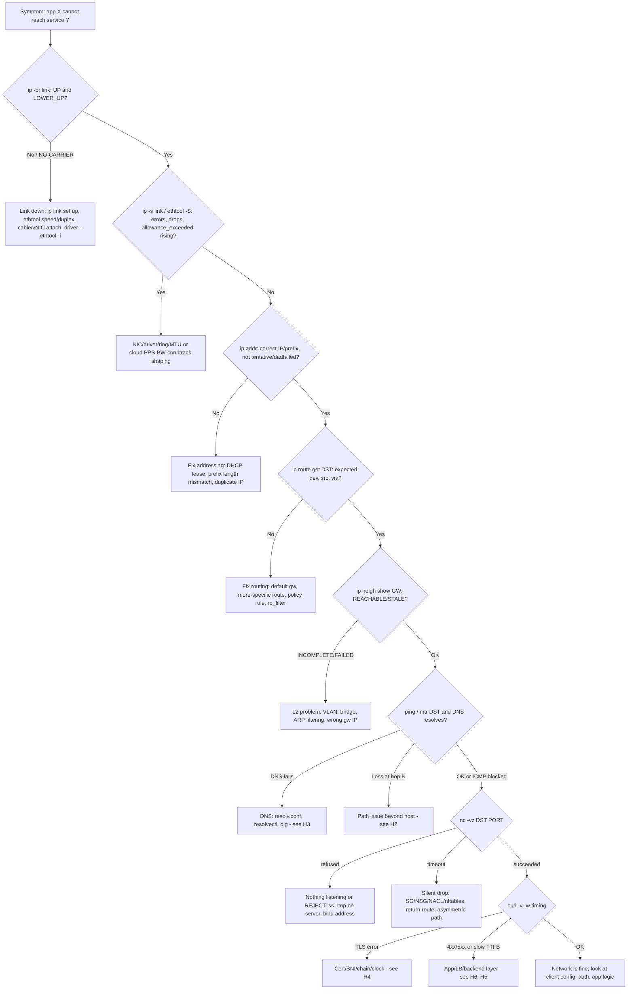
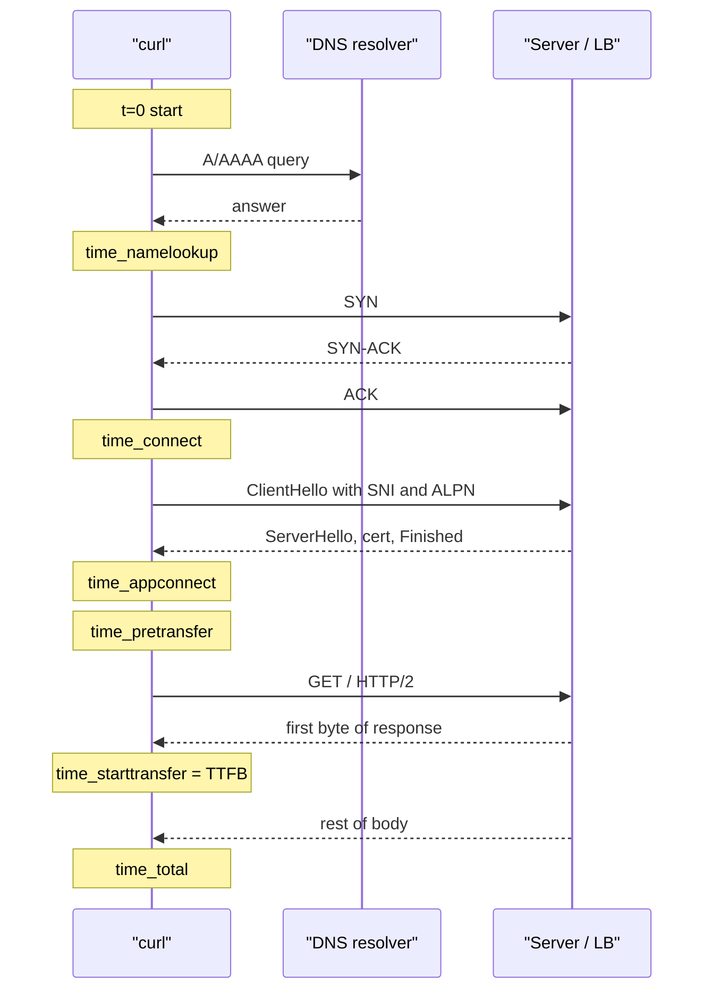

# H1 Linux Network Diagnostics
> Last verified: 2026-10 · Audience: senior/staff DevOps, SRE, AI eng, NetEng, DevSecOps, architects

## TL;DR
- **Troubleshoot bottom-up and prove each layer before moving up.** Order: link, L2 neighbor, L3 address and route, L4 port, L7 app. Use **one command per layer**: `ip -br link` / `ethtool`, `ip neigh`, `ip addr` + `ip route get`, `ss` / `nc`, and `curl -v -w`.
- **iproute2 (`ip`, `ss`) replaces net-tools.** `ifconfig`, `route`, `arp` and `netstat` come from net-tools, which is deprecated and missing from many minimal images. Interviewers notice when you reach for `netstat -tulpn` instead of `ss -tulpn`.
- **`ip route get <dst>` is the single most useful L3 command.** It asks the kernel which route, source IP, interface and next hop it would actually use, after policy routing and VRFs are applied.
- **Read neighbor states.** An `INCOMPLETE` or `FAILED` entry for the gateway means an L2 problem (VLAN, cabling, ARP filtering), not a routing problem. In the cloud you rarely see this, because the hypervisor answers ARP.
- **Error class tells you the layer.** "Connection refused" (RST) means the host is reachable and nothing is listening, or a REJECT rule fired. A **timeout** means packets are silently dropped by a firewall, SG/NSG or routing blackhole. "No route to host" means ICMP host-unreachable or ARP failure.
- **`curl -w` timing splits latency into phases:** DNS → TCP → TLS → server think time (TTFB) → transfer. `--resolve` / `--connect-to` let you test a specific backend IP while still sending the right SNI and Host header.
- **The host is only half the picture in the cloud.** Pair on-box tools with **control-plane analyzers**. On AWS that is VPC Reachability Analyzer, which models config and sends no packets. On Azure it is Network Watcher IP flow verify, next hop and connection troubleshoot. For keyless or out-of-band access use SSM Session Manager or Azure Bastion, and EC2 or Azure Serial Console when the network itself is broken.

## Systematic layered runbook



- **Golden rule:** change one variable at a time, and test from **both ends** (client → server *and* server-side `ss` / `tcpdump`). A capture on the server that shows a SYN arriving and no SYN-ACK leaving tells you the problem is local to the host (firewall, listener, return route).
- **Divide and conquer.** If the bottom-up order is too slow, start at L4 with `nc -vz`. Success means L1-L4 are fine, so go up. Failure means go down.

## H1.1 Interface Status
- **How it works:**
  - **`ip link show`** (short form `ip l`) prints the admin flags and the operational state:
    - `<BROADCAST,MULTICAST,UP,LOWER_UP>`: **UP** is the admin flag (`ip link set dev X up`). **LOWER_UP** means the driver reports carrier (`netif_carrier_on`).
    - **NO-CARRIER** means the interface is admin UP but has no physical or virtual link: cable out, switch port shut, vNIC detached, or the peer veth is down.
    - `state UP|DOWN|UNKNOWN|DORMANT|LOWERLAYERDOWN` follows the RFC 2863 operstates. **UNKNOWN** is normal for `lo`, tun/tap and some virtual devices. **LOWERLAYERDOWN** means a stacked device (VLAN, bond slave) whose parent is down. **DORMANT** means L1 is up but the interface is waiting on something such as 802.1X.
  - **`ip -br link` / `ip -br -c addr`** gives one line per interface, which is ideal for quick triage. **`ip -j -p link`** outputs JSON for scripts and `jq`.
  - **`ip -s -s link show dev eth0`** prints RX/TX bytes, packets, **errors, dropped, overrun, mcast**, plus TX **carrier, collsns**. The second `-s` adds a breakdown such as RX length/crc/frame/fifo/missed. Rising **crc/frame** counts point to bad cable, optics or duplex. Rising **dropped** counts point to ring-buffer overflow, an unknown protocol or VLAN, or socket backlog. **overrun/missed** means the NIC ran out of ring descriptors.
  - **`ethtool`** handles the physical and driver layer:
    - `ethtool eth0`: speed, duplex, autoneg, `Link detected`
    - `ethtool -i eth0`: driver and version, for example `ena`, `mlx5_core`, `hv_netvsc`
    - `ethtool -S eth0`: NIC- and driver-specific counters
    - `ethtool -k eth0`: offloads such as TSO, GSO, GRO and checksum
    - `ethtool -g eth0` / `-G`: ring sizes
    - `ethtool -l eth0` / `-L`: channels and queues
    - `ethtool -c`: interrupt coalescing
  - **MTU** appears in `ip link` (`mtu 9001` is common on AWS inside a VPC, 1500 on the internet path). Test the path with `ping -M do -s 8973 <dst>` (9001 minus 28 bytes of IP and ICMP header). See [F6](../F-network-engineering/F6-network-performance.md) and [H5](../H-full-stack-troubleshooting/H5-network-performance-deep-dive.md).
  - Watch live link changes with **`ip monitor link`**. Interface counters also live in `/sys/class/net/eth0/statistics/*` and `/proc/net/dev`.
- **Cloud specifics:**
  - **AWS ENA** exposes shaping counters through `ethtool -S` (ENA driver ≥ 2.2.10; `conntrack_allowance_available` needs ≥ 2.8.1 and Nitro):
    - **`bw_in_allowance_exceeded`**, **`bw_out_allowance_exceeded`**, **`pps_allowance_exceeded`**: packets queued or dropped because the instance hit its bandwidth or PPS maximum
    - **`conntrack_allowance_exceeded`**: security-group connection tracking is full
    - **`linklocal_allowance_exceeded`**: PPS cap on traffic to the Amazon DNS resolver, IMDS and Time Sync. This counter is behind the classic "random DNS timeouts under load" incident.
  - **Azure** uses `hv_netvsc` with Accelerated Networking. The VF (`mlx5_core` / MANA) shows up as a **second interface enslaved to the synthetic one**. Don't configure IPs on the VF.
- **Trade-offs / when to use:**
  - `ip -br` is for triage. `ip -s -s` and `ethtool -S` are for "it's up but slow or lossy".
  - Offload settings break captures. With GRO/TSO on, `tcpdump` shows "giant" 64 KB segments and bad checksums on TX. That is expected and not a bug. Only disable offloads (`ethtool -K eth0 gro off`) when you are debugging.
- **Interview angles:**
  - *"Interface shows UP but no traffic?"* → Say UP is admin only. Check **LOWER_UP/NO-CARRIER**, then `ethtool` link detected, then the counters.
  - *"Packet loss on an EC2 box with clean `ip -s` counters?"* → Check **ENA allowance counters**. Linux counters don't see hypervisor shaping.
  - *"`ifconfig` vs `ip`?"* → `ifconfig` can't show secondary addresses added without labels, policy routing, netns or VRFs, and it's deprecated. Use `ip`.

## H1.2 IP Neighbor
- **How it works:**
  - **`ip neigh show`** (`ip n`) shows the ARP (IPv4) and NDP (IPv6) cache. It replaces `arp -an`.
  - **NUD states:**
    - **REACHABLE**: confirmed within the reachable time. The base is about 30 s, randomized to 0.5-1.5×.
    - **STALE**: valid but unconfirmed. It is used as-is and the kernel re-validates it on the next send.
    - **DELAY** then **PROBE**: re-validating with unicast probes.
    - **INCOMPLETE**: a request was sent and no reply has come back yet.
    - **FAILED**: probes were exhausted, which typically ends in "No route to host" (EHOSTUNREACH).
    - **PERMANENT**: static entry. **NOARP**: the device needs no resolution, for example tun or point-to-point links.
  - Commands:
    - `ip neigh show dev eth0 nud failed`
    - `ip neigh flush dev eth0` (doesn't touch permanent or noarp entries)
    - `ip neigh replace 10.0.0.1 lladdr aa:bb:.. dev eth0 nud permanent`
    - `ip -6 neigh` for IPv6 NDP
  - Active probes:
    - `arping -I eth0 10.0.0.1` checks that the target answers at L2.
    - `arping -D` performs duplicate address detection.
    - `arping -U` / `-A` sends a gratuitous ARP after failover.
    - `ndisc6` covers IPv6.
  - Tunables live in `/proc/sys/net/ipv4/neigh/<dev>/` (`base_reachable_time_ms`, `gc_stale_time`) and `/proc/sys/net/ipv4/neigh/default/gc_thresh1/2/3` (defaults 128/512/1024).
- **Trade-offs / when to use:**
  - Check this **when the gateway or same-subnet peer doesn't answer**. INCOMPLETE for the gateway usually comes from:
    - wrong VLAN or bridge
    - wrong gateway IP or prefix (the host thinks the target is on-link when it isn't)
    - ARP filtering, `arp_ignore` / `arp_announce`, or `rp_filter`
    - a blocked switch port
  - A **duplicate IP** shows up as the MAC flapping between two values in `ip monitor neigh`, or as `arping -D` getting a reply.
  - **Large flat L2, Kubernetes nodes with many pods, or LB hosts** can overflow `gc_thresh3`. You'll see `neighbour: arp_cache: neighbor table overflow!` in dmesg. Raise the thresholds.
- **Cloud specifics:**
  - In **AWS VPC and Azure VNet there is no real broadcast or multicast L2**. The hypervisor answers ARP. On Azure, every gateway ARP resolves to the well-known virtual MAC `12:34:56:78:9a:bc`.
  - So **gratuitous-ARP-based VIP failover (keepalived/VRRP) does not work as-is**. You need an API call to move a secondary IP or ENI, or route-table updates, or a load balancer (Azure LB with floating IP, AWS NLB or GWLB).
  - An INCOMPLETE entry in the cloud usually means the target IP isn't assigned to any NIC in that subnet.
- **Interview angles:**
  - *"Ping to gateway fails, what next?"* → `ip neigh show <gw>`. If INCOMPLETE, it's L2, so check the VLAN, switch and `arping`. If REACHABLE but ping still fails, it's ICMP filtering or the gateway itself.
  - *"Why does keepalived failover not work on EC2?"* → No gratuitous ARP in the VPC. Use EIP or secondary-IP reassignment through the API, or a route-table target change.
  - Follow-up: STALE is **not** an error. It's the normal resting state.

## H1.3 IP Addressing
- **How it works:**
  - **`ip addr show`** (`ip a`) shows `inet 10.0.1.23/24 brd ... scope global dynamic eth0  valid_lft 3200sec preferred_lft 3200sec`:
    - **dynamic** means a DHCP or SLAAC lease. Watch `valid_lft` for expiring leases.
    - Flags to look for: **tentative** (IPv6 DAD in progress, so the address can't be used yet), **dadfailed** (duplicate IPv6 address), **deprecated**, **secondary**.
  - Add or remove addresses: `ip addr add 10.0.1.50/24 dev eth0`, `ip addr del ...`. Runtime changes are **not persistent**. Persist them with netplan, NetworkManager (`nmcli`) or systemd-networkd, and use `networkctl status` / `nmcli dev show` to see what the manager thinks.
  - Routing:
    - `ip route show` (`ip r`) and `ip route show table all`
    - **`ip route get 8.8.8.8`** returns `via 10.0.1.1 dev eth0 src 10.0.1.23 uid 1000`, the kernel's actual decision
    - `ip rule show` lists policy routing (multiple ENIs, VPN split tunnels)
    - `ip -6 route`
  - **Longest-prefix match wins.** After that comes **metric**: lower is better, which matters with two default routes (Wi-Fi + Ethernet, multi-ENI). See [F7](../F-network-engineering/F7-network-routing.md).
  - Namespaces: `ip netns exec <ns> ip a`, or `nsenter -t <pid> -n ip a` to see a **container's** view. This is essential for Kubernetes pod debugging.
- **Common faults:**
  - **Prefix-length mismatch** (/24 vs /16). The host ARPs for off-subnet targets instead of routing, or routes on-subnet targets through the gateway. This is the classic "half the hosts are reachable" symptom.
  - **Missing or wrong default route**, or a **more-specific route** hijacking traffic (a VPN pushing 10.0.0.0/8, or Docker's `172.17.0.0/16` overlapping a corporate range).
  - **Asymmetric routing on multi-NIC hosts.** The reply leaves the wrong interface and **`rp_filter=1`** (strict) drops it. Fix with source-based policy routing (`ip rule add from 10.0.2.10 table 102`) or `rp_filter=2` (loose).
  - **Duplicate IP**, or a **DHCP lease not renewed**.
- **Cloud specifics:**
  - **AWS reserves 5 IPs per subnet:** network, .1 VPC router, .2 DNS (VPC base+2), .3 reserved, and broadcast.
  - **Azure also reserves 5:** .0, .1 default gateway, .2 and .3 for Azure DNS mapping, and .255.
  - The **public IP or EIP is not on the NIC** in either cloud; it's 1:1 NAT at the edge. `ip a` shows only the private IP. Get the public one from IMDS (`169.254.169.254`) or `curl ifconfig.me`.
  - Secondary private IPs on AWS must be assigned in the API **and** configured in the OS. Amazon Linux's `amazon-ec2-net-utils` automates this.
  - See [G1](../G-cloud-network-architecture/G1-virtual-network-fundamentals.md) and [F2](../F-network-engineering/F2-internet-protocol.md).
- **Interview angles:**
  - *"How do you know which interface/source IP a packet will use?"* → `ip route get <dst> [from <src>] [oif <dev>]`. Don't eyeball `ip r`.
  - *"Server has two NICs, replies vanish"* → Asymmetric routing plus rp_filter. Fix with policy routing.
  - *"Container can't reach X but host can"* → `nsenter` into its netns, then check its routes, DNS (`/etc/resolv.conf`) and the iptables/nftables NAT on the host.

## H1.4 TCP Port Testing
- **How it works:**
  - **Server side: `ss`** (iproute2, reads kernel netlink). It replaces `netstat`:
    - `ss -tulpn`: TCP and UDP listeners, numeric, with the owning process. Root is needed to see other users' PIDs.
    - `ss -tan state established '( dport = :443 )'`, `ss -tan state time-wait | wc -l`
    - `ss -ti dst 10.0.2.5`: per-socket **cwnd, rtt, retrans, mss, delivery rate**
    - `ss -s`: summary
    - `ss -m`: socket memory
    - `ss -o`: timers
    - `ss -K`: kill sockets (needs a kernel built with `CONFIG_INET_DIAG_DESTROY`)
  - **Recv-Q/Send-Q on a LISTEN socket** mean current **accept-queue length** / **backlog limit**, which is `min(listen backlog, net.core.somaxconn)`. If Recv-Q stays at or near Send-Q, the app isn't calling `accept()` fast enough. Confirm with `nstat -az TcpExtListenOverflows TcpExtListenDrops`. See [A7](../A-operating-systems/A7-socket-management.md).
  - **The bind address matters.** `127.0.0.1:8080` is reachable only locally, which is the classic "works with curl localhost, not from outside" problem. `0.0.0.0` / `[::]` / `*` means all interfaces.
  - **Client side:**
    - `nc -vz -w 3 host 443`: TCP connect test, zero-I/O, 3 s timeout
    - `nc -vzu host 53`: UDP. This is unreliable, because "succeeded" just means no ICMP port-unreachable came back.
    - `ncat` (nmap) adds `--ssl`, `-l` listeners, and proxy support
    - `nc -l 8080` on the server proves the network path independent of the app
    - Without nc, use bash: `timeout 3 bash -c '</dev/tcp/host/443' && echo open`
    - `telnet host port` is legacy and often not installed
    - `nmap -Pn -p 443 host` distinguishes open, closed and filtered
- **Interpreting results:**

| Result | Wire behaviour | Likely cause |
|---|---|---|
| `succeeded/open` | SYN → SYN-ACK | Path and listener OK; problem is higher (TLS/app) |
| `Connection refused` | SYN → **RST** | Host reached; no listener on that IP:port, or firewall REJECT with tcp-reset |
| `timed out` | SYN → nothing | **Silent drop**: SG/NSG/NACL/iptables DROP, missing return route, wrong IP, host down |
| `No route to host` | ICMP host-unreachable or ARP FAILED | L2/L3: neighbor failure, ICMP admin-prohibited (REJECT) |
| `Network is unreachable` | Local, no packet sent | No matching route on the client (`ip route get`) |

- **Trade-offs / when to use:**
  - `nc` / `/dev/tcp` prove L4 only. A port can be open while TLS or the app is broken, so go on to `curl`.
  - Some L4 load balancers and proxies (AWS NLB, Azure LB, Envoy) complete or forward the handshake on behalf of the backend. "Open" proves you reached the **LB**, not the backend.
  - Confirm on the wire with `tcpdump -ni any 'tcp port 443 and host 10.0.2.5'`. Seeing SYNs arrive with no SYN-ACK means a host firewall (`nft list ruleset`, `iptables -S`) or a missing listener. Seeing no SYN arrive at all means an upstream filter or routing. See [F8](../F-network-engineering/F8-analyzing-protocols-with-wireshark.md).
- **Interview angles:**
  - *"Refused vs timeout?"* → Refused means the host is alive and the port is closed, which is a fast fail. Timeout means something is dropping, which is a security-layer or routing issue. Cloud **SGs never send RST**. They silently drop, so a timeout is the SG/NACL signature.
  - *"netstat vs ss?"* → `ss` reads netlink and is fast with 100k+ sockets. `netstat` parses `/proc/net/tcp`, which is slow, and it's deprecated. `ss -i` exposes TCP internals that netstat cannot.
  - *"Lots of TIME_WAIT?"* → Normal on the active closer and it lasts 60 s on Linux. It only matters as ephemeral-port exhaustion on the client or proxy (`ip_local_port_range`). Fix with connection pooling or keep-alive. `tw_reuse` applies to outbound connections only. Don't use `tcp_tw_recycle` (removed in 4.12).
  - See [H2](../H-full-stack-troubleshooting/H2-troubleshooting-your-network.md) (H2.5, H2.6) for listener and firewall scenarios.

## H1.5 cURL Command
- **How it works:**
  - **`curl -v`** shows DNS result and connect IP, the TLS handshake (version, cipher, ALPN h2/http1.1, cert subject/SAN/issuer/expiry), request headers (`>`) and response headers (`<`).
  - **`--trace-ascii -`** with `--trace-time` gives full byte-level output with timestamps.
  - **`-w` / `--write-out` timing variables** are cumulative from start, in seconds:
    - **`time_namelookup`**: DNS done
    - **`time_connect`**: TCP handshake done
    - **`time_appconnect`**: TLS handshake done (0 for plain HTTP)
    - **`time_pretransfer`**: ready to send the request
    - **`time_starttransfer`**: first response byte received (**TTFB**)
    - **`time_total`**: finished
    - **`time_redirect`**: time spent following redirects
    - **`time_queue`** and **`time_posttransfer`**: newer variables, curl 8.x
  - **Derive the phases by subtraction:**
    - DNS = `namelookup`
    - TCP RTT ≈ `connect − namelookup`
    - TLS = `appconnect − connect`
    - Server processing ≈ `starttransfer − pretransfer`
    - Download = `total − starttransfer`
  - Other useful `-w` variables: `%{http_code}`, `%{remote_ip}`, `%{remote_port}`, `%{http_version}`, `%{ssl_verify_result}`, `%{num_connects}`, `%{size_download}`, `%{speed_download}`, `%{json}` (all variables).
  - **Bypassing DNS for targeted tests:**
    - **`--resolve host:443:10.0.2.5`** pins a hostname to an IP while keeping the correct **SNI and Host header**. Use it to test one backend behind an LB or CDN, or a new origin before a DNS cutover.
    - **`--connect-to host:443:other:8443`** redirects the connection to another host and port.
    - Avoid `-H 'Host: ...'` against an IP for HTTPS: SNI and certificate validation won't match.
  - Other flags:
    - `-I` (HEAD), `-L` (follow redirects), `-o /dev/null -s` (quiet)
    - `--connect-timeout 3`, `-m 10` (total max time)
    - `-4` / `-6` to force an address family (exposes broken IPv6)
    - `--http1.1` / `--http2` / `--http3`
    - `-k` disables certificate verification. Use it for diagnosis only, never in automation.
    - `--cacert`, `--cert` / `--key` for mTLS
    - `-x` (proxy). Env vars `HTTPS_PROXY` / `NO_PROXY` silently change the path, so check `env | grep -i proxy`.
    - `--retry`
- **Reading the timing:**

| Slow phase | Points to |
|---|---|
| `time_namelookup` high (e.g. 5 s) | DNS: resolver timeout, IPv6 AAAA delay, ndots search-list expansion in K8s, link-local PPS cap → [H3](../H-full-stack-troubleshooting/H3-domain-name-system.md) |
| connect − namelookup high | Network RTT/loss, SYN retransmits (1 s, 3 s backoff), SYN backlog full, conntrack full |
| appconnect − connect high | TLS: OCSP/CRL fetch, RSA key size, no session resumption, cross-region handshake → [H4](../H-full-stack-troubleshooting/H4-transport-layer-security.md) |
| starttransfer − pretransfer high | Server/app/DB think time, LB queueing, cold start → [H6](../H-full-stack-troubleshooting/H6-web-application-architecture.md) |
| total − starttransfer high | Bandwidth, window/BDP, congestion → [H5](../H-full-stack-troubleshooting/H5-network-performance-deep-dive.md) |

- **Trade-offs / when to use:**
  - `curl` is the canonical L7 test, and it's scriptable for synthetic checks.
  - Single samples are noisy. Loop it and look at the distribution (p50/p99), not one run.
  - Run it from **inside the same netns or pod** as the failing client. Results from a laptop prove little.
- **Interview angles:**
  - *"Users say site is slow, how do you isolate?"* → Run `curl -w` with the phase breakdown and explain each subtraction, then use `--resolve` to compare an individual backend against the LB or CDN edge.
  - *"Exit codes?"* → 6 = couldn't resolve host, 7 = couldn't connect, 28 = timeout, 35 = TLS handshake failure, 60 = cert verification failed. These are useful in scripts.
  - Pitfall: `-k` "fixing" the problem means you have a cert or chain issue to fix, not a workaround.

## Diagrams



## Cloud mapping: AWS vs Azure

| Capability | AWS | Azure | Role it plays | Key differences | Alternatives |
|---|---|---|---|---|---|
| Config-based path analysis | **VPC Reachability Analyzer** | **Network Watcher Next hop + IP flow verify / NSG diagnostics** | Answers "would config allow A→B on port P, and what blocks it?" | RA models the whole path hop-by-hop (SG, NACL, RT, TGW, LB, NFW) and **sends no packets**. Azure splits it into per-VM tools (next hop = routing, IP flow verify = NSG rule) | K8s: `kubectl` + Cilium Hubble policy verdicts |
| Intent / posture verification | **Network Access Analyzer** (scopes with MatchPaths/ExcludePaths) | Azure Virtual Network Manager **security admin rules + Network Verifier** (unverified naming) / Azure Policy | Finds *unintended* paths (prod↔dev, IGW→ENI) for compliance | NAA is priced per ENI analyzed; RA per analysis | Third-party: Forward Networks, Tufin |
| Active point-in-time connectivity test | Reachability Analyzer (config only); for real packets use `nc`/`curl` via SSM | **Connection troubleshoot** (sends real probes from VM/VMSS/AppGW/Bastion to VM/FQDN/URI/IP) | Data-plane check incl. latency, hops | Azure has a native data-plane test; AWS relies on on-box tools or CloudWatch **Network Synthetic Monitor** / Internet Monitor | ThousandEyes, Cloudflare probes |
| Continuous synthetic monitoring | CloudWatch Network Synthetic Monitor, Synthetics canaries | **Connection monitor** | Ongoing RTT/loss between endpoints | Azure limit 100 connection monitors/region/sub | Datadog NPM, Prometheus blackbox_exporter |
| Effective rules | Console "Security" tab; `describe-security-groups` (no merged view of NACL+SG) | **Effective security rules** (NIC + subnet NSG merged), effective routes | See what actually applies | Azure gives a merged effective view; AWS needs RA for combined evaluation | — |
| Flow logs | VPC Flow Logs (ENI/subnet/VPC; ACCEPT/REJECT) | **VNet flow logs** (NSG flow logs retire **2027-09-30**; no new creation) + Traffic analytics | Post-hoc evidence of drops | Neither logs payload; AWS can't log IMDS/DNS/DHCP traffic | Packet mirroring / Zeek |
| Packet capture | VPC Traffic Mirroring (Nitro), or `tcpdump` on box | **Network Watcher packet capture** (VM extension, remote-triggered) | Wire-level proof | Azure is API-driven per VM; AWS mirrors to a target NLB/ENI | `tcpdump`, Wireshark (F8) |
| Shell access without inbound ports | **SSM Session Manager** (agent dials out over 443; IAM-authorized; logs to S3/CloudWatch) / EC2 Instance Connect Endpoint | **Azure Bastion** (managed jump host, portal or native client, SKUs Developer/Basic/Standard/Premium) | Run the on-box H1 toolkit without opening 22 | SSM needs agent + egress to SSM endpoints (or VPC endpoints); Bastion is network-path based, needs `AzureBastionSubnet` /26+ | Teleport, Tailscale, Cloudflare Access |
| Out-of-band console | **EC2 Serial Console** (Nitro; account-level opt-in) | **Azure Serial Console** (needs boot diagnostics enabled) | Fix a host whose network config is broken (bad netplan, firewall lockout) | Both need a local password user or SysRq; both are text-only console | IPMI/iLO on-prem |

- **Reachability Analyzer:**
  - It is a **static model** of the configuration. It won't catch OS-level problems such as host iptables, no listener, or a wrong in-guest route, and it ignores target health.
  - IPv4 only. Source and destination must be in the same Region, though cross-account within an Organization works.
  - Analyses are auto-deleted after 120 days.
  - Use it first to rule the cloud network in or out, then go on-box.
- **Azure IP flow verify** checks only **NSG rules** on one NIC for a 5-tuple. **NSG diagnostics** extends that to VMSS and App Gateway, and to prefixes and service tags. **Next hop** returns the hop type (VirtualAppliance, VirtualNetworkGateway, Internet, None) and the route table ID, which catches UDR blackholes to a dead NVA.
- **Network Watcher setup:** it is auto-enabled per region (one instance per region per subscription).
- **Mental model across both clouds:** cloud tools answer *"does the fabric allow it"*, and on-box H1 tools answer *"does the OS and app accept it"*. You need both.
- Full coverage in [G5 Traffic monitoring & troubleshooting](../G-cloud-network-architecture/G5-traffic-monitoring-troubleshooting.md).

## Hands-on

```bash
# --- Layer-by-layer triage (run as root for -p in ss) ---
DST=api.example.com; PORT=443
ip -br -c link                                 # L1: UP + LOWER_UP?
ip -s -s link show dev eth0 | sed -n '1,20p'   # errors/drops/overrun
ethtool eth0 | grep -E 'Speed|Duplex|Link detected'
ethtool -i eth0                                # driver (ena, hv_netvsc, mlx5_core...)
ethtool -S eth0 | grep -E 'allowance|drop|err' | grep -v ': 0$'   # AWS shaping counters
ip -br addr                                    # L3 addressing
IP=$(getent ahostsv4 "$DST" | awk 'NR==1{print $1}'); echo "resolved=$IP"
ip route get "$IP"                             # which dev/src/via will be used
GW=$(ip route get "$IP" | awk '/via/{for(i=1;i<=NF;i++) if($i=="via") print $(i+1)}')
[ -n "$GW" ] && ip neigh show "$GW"            # L2: REACHABLE/STALE vs INCOMPLETE/FAILED
nc -vz -w 3 "$DST" "$PORT"                     # L4: succeeded / refused / timed out
curl -sS -o /dev/null --connect-timeout 3 -m 10 -w '@-' "https://$DST/" <<'EOF'
dns=%{time_namelookup} tcp=%{time_connect} tls=%{time_appconnect} pre=%{time_pretransfer} ttfb=%{time_starttransfer} total=%{time_total}
code=%{http_code} ip=%{remote_ip} http=%{http_version}\n
EOF
```

```bash
# --- Server side: is anything listening, and is the accept queue full? ---
ss -ltnp '( sport = :443 )'                    # LISTEN: Recv-Q=accept queue, Send-Q=backlog
nstat -az TcpExtListenOverflows TcpExtListenDrops
ss -tan state syn-recv | wc -l                 # SYN flood / slow handshake
ss -ti dst 10.0.2.5 | grep -oE 'rtt:[^ ]+|cwnd:[0-9]+|retrans:[^ ]+'
tcpdump -ni any -c 20 'tcp port 443 and tcp[tcpflags] & (tcp-syn|tcp-rst) != 0'
nft list ruleset 2>/dev/null || iptables -S    # host firewall
```

```bash
# --- Test one backend behind an LB/CDN with correct SNI + Host ---
curl -v --resolve api.example.com:443:10.0.2.5 https://api.example.com/healthz
# Repeat 20x and print TTFB distribution
for i in $(seq 20); do curl -s -o /dev/null -w '%{time_starttransfer}\n' https://api.example.com/; done | sort -n | awk '{a[NR]=$1} END{print "p50="a[int(NR*0.5)]" p95="a[int(NR*0.95)]" max="a[NR]}'
# Path-MTU probe (9001 jumbo inside AWS VPC; 1500 elsewhere)
ping -c 3 -M do -s 8973 10.0.2.5 || ping -c 3 -M do -s 1472 10.0.2.5
# No nc installed? bash built-in TCP check
timeout 3 bash -c '</dev/tcp/10.0.2.5/5432' && echo open || echo "closed/filtered"
# Debug inside a container's network namespace
nsenter -t "$(docker inspect -f '{{.State.Pid}}' myapp)" -n ip route get 10.0.2.5
```

```bash
# --- Cloud-side checks (CLI) ---
# AWS: Reachability Analyzer, ENI -> ENI on TCP 5432
P=$(aws ec2 create-network-insights-path --source eni-aaa --destination eni-bbb \
      --protocol tcp --destination-port 5432 --query NetworkInsightsPath.NetworkInsightsPathId --output text)
A=$(aws ec2 start-network-insights-analysis --network-insights-path-id "$P" \
      --query NetworkInsightsAnalysis.NetworkInsightsAnalysisId --output text)
aws ec2 describe-network-insights-analyses --network-insights-analysis-ids "$A" \
  --query 'NetworkInsightsAnalyses[0].[Status,NetworkPathFound,Explanations[0].ExplanationCode]'
aws ssm start-session --target i-0123456789abcdef0      # shell without port 22

# Azure: IP flow verify, next hop, connection troubleshoot
az network watcher test-ip-flow -g rg --vm vm1 --direction Outbound --protocol TCP \
  --local 10.0.1.4:60000 --remote 10.0.2.5:5432
az network watcher show-next-hop -g rg --vm vm1 --source-ip 10.0.1.4 --dest-ip 10.0.2.5
az network watcher test-connectivity -g rg --source-resource vm1 --dest-address 10.0.2.5 --dest-port 5432
az network bastion ssh -n bastion1 -g rg --target-resource-id "$VM_ID" --auth-type AAD
```

### Legacy-to-modern command map
| Legacy (net-tools) | iproute2 / modern |
|---|---|
| `ifconfig -a` | `ip -br link`, `ip addr` |
| `ifconfig eth0 up` | `ip link set dev eth0 up` |
| `route -n` | `ip route show` / `ip route get <dst>` |
| `arp -an` | `ip neigh show` |
| `netstat -tulpn` | `ss -tulpn` |
| `netstat -s` | `nstat -az` / `ss -s` |
| `netstat -i` | `ip -s link` |
| `telnet host port` | `nc -vz host port` / `curl -v telnet://host:port` |

## Cross-links
- [F2 Internet Protocol](../F-network-engineering/F2-internet-protocol.md): ping and traceroute basics (overlap: diagnostic tools)
- [F8 Analyzing protocols with Wireshark](../F-network-engineering/F8-analyzing-protocols-with-wireshark.md): tcpdump and Wireshark
- [F6 Network performance](../F-network-engineering/F6-network-performance.md) and [H5 Network performance deep dive](../H-full-stack-troubleshooting/H5-network-performance-deep-dive.md): MTU, latency
- [F7 Network routing](../F-network-engineering/F7-network-routing.md)
- [A7 Socket management](../A-operating-systems/A7-socket-management.md): accept and SYN queues (overlap: sockets)
- [H2 Troubleshooting your network](../H-full-stack-troubleshooting/H2-troubleshooting-your-network.md): traceroute, listeners, firewalls
- [H3 DNS](../H-full-stack-troubleshooting/H3-domain-name-system.md) · [H4 TLS](../H-full-stack-troubleshooting/H4-transport-layer-security.md) · [H6 Web application architecture](../H-full-stack-troubleshooting/H6-web-application-architecture.md)
- [G1 Virtual network fundamentals](../G-cloud-network-architecture/G1-virtual-network-fundamentals.md) · [G5 Traffic monitoring & troubleshooting](../G-cloud-network-architecture/G5-traffic-monitoring-troubleshooting.md)
- [J3 Observability](../J-sre/J3-observability.md)

## Sources
- https://man7.org/linux/man-pages/man8/ip-neighbour.8.html
- https://man7.org/linux/man-pages/man8/ip-link.8.html
- https://man7.org/linux/man-pages/man8/ss.8.html
- https://docs.kernel.org/networking/operstates.html
- https://manpages.debian.org/trixie/ethtool/ethtool.8.en.html
- https://curl.se/docs/manpage.html
- https://docs.aws.amazon.com/AWSEC2/latest/UserGuide/monitoring-network-performance-ena.html
- https://docs.aws.amazon.com/vpc/latest/reachability/what-is-reachability-analyzer.html
- https://docs.aws.amazon.com/vpc/latest/reachability/how-reachability-analyzer-works.html
- https://docs.aws.amazon.com/vpc/latest/network-access-analyzer/what-is-network-access-analyzer.html
- https://learn.microsoft.com/en-us/azure/network-watcher/network-watcher-overview
