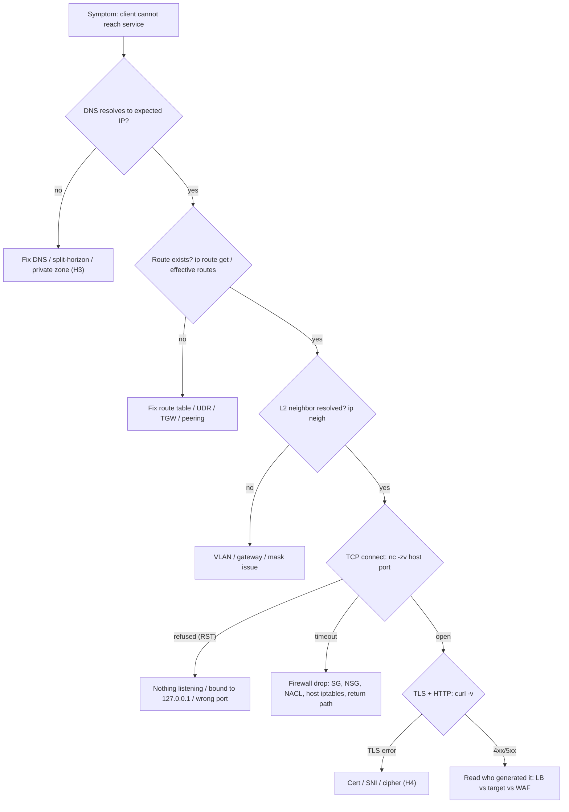
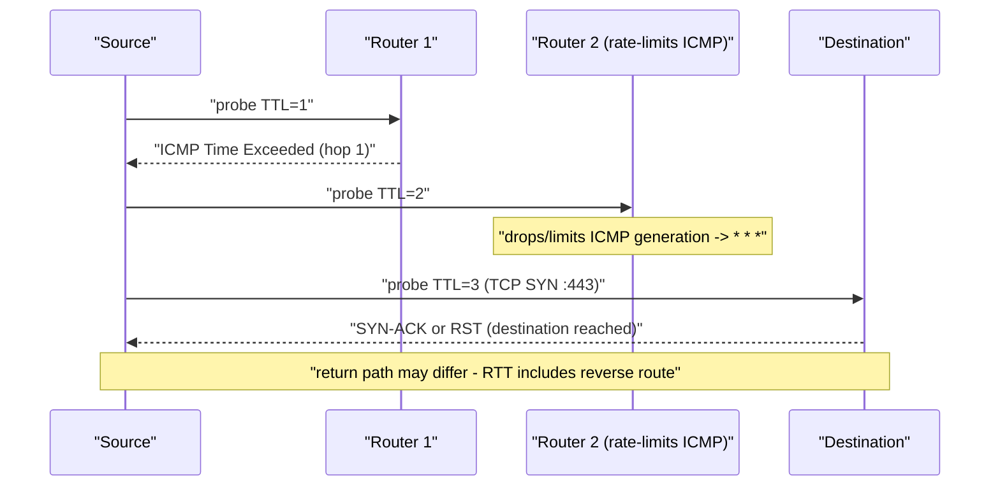
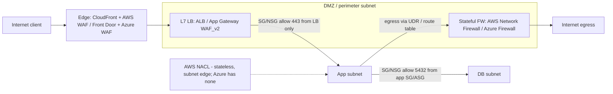

# H2 Troubleshooting Your Network
> Last verified: 2026-10 · Audience: senior/staff DevOps, SRE, AI eng, NetEng, DevSecOps, architects

## TL;DR
- **Work the stack, one layer at a time, and split the problem in half.** Go bottom-up: link → IP/ARP → route → port/firewall → TLS → HTTP → app. Or go top-down from the error the user sees. Each test should cut the search space in half: same subnet? same VPC? same host?
- **Find the failing hop by its boundaries.** Look for the last point where traffic still works and the first point where it fails. Then **check the return path**: asymmetric routing and stateful firewalls cause most problems that read as "ping works but the app doesn't".
- **Gateway 5xx codes point to a cause.** Know them per product:
  - **502** = the backend answered badly (RST, malformed response, TLS handshake failure, keep-alive race).
  - **503** = no healthy or registered targets.
  - **504** = the backend did not answer in time (connect timeout or idle timeout, NACL blocking ephemeral ports).
  - Azure App Gateway is different: it returns **502** for unhealthy, empty or blocked backends, and on v2 it returns **504** after a retry times out.
- **A subnet or mask mismatch** (wrong prefix length, wrong gateway, overlapping CIDR) gives a "half-working" network. Some peers are reachable and others are not, and the LB marks targets unhealthy, which surfaces as **503**.
- **Treat traceroute as a hint, not proof.** ICMP rate limiting (RFC 1812), filtered probes, ECMP, asymmetric return paths and MPLS `no-ttl-propagate` all distort it. A `* * *` in the middle with a clean destination is normal.
- **Check listeners first** (`ss -ltnp`). A service bound to `127.0.0.1` instead of `0.0.0.0`, the wrong port, or a full backlog gives a **RST/refused**. A firewall drop gives a **timeout**. Learn to read that difference.
- **Stateful vs stateless filtering is a cloud certification favourite:**
  - Stateful: AWS **SG**, Azure **NSG**, AWS Network Firewall, Azure Firewall.
  - Stateless: AWS **NACL**. Remember the **ephemeral return ports 1024–65535**.
  - Azure has **no stateless subnet ACL**. The NSG attaches to the subnet and/or the NIC.
- **Layer the defences:** DMZ / perimeter VNet → **L3/L4 firewall** → **L7 WAF** (AWS WAF on CloudFront/ALB/API GW; Azure WAF on App Gateway / Front Door / App Gateway for Containers). A WAF block shows as **403** and does not mean the network is down.

## H2.1 Network Connection Basics
- **How it works:**
  - **Five-layer TCP/IP model:**
    - Physical: link up/down, CRC errors.
    - Data link: MAC, ARP/NDP, VLAN tags, STP.
    - Network: IP, mask, routes, TTL, ICMP.
    - Transport: TCP/UDP ports, handshake, RST.
    - Application: DNS, TLS, HTTP, SQL.
  - **Bottom-up checklist:**
    - `ip -br link` (state UP, no errors).
    - `ip -br addr` (correct IP and prefix).
    - `ip route get <dst>` (which interface and gateway the kernel picks).
    - `ip neigh` (FAILED or INCOMPLETE means L2 or a wrong gateway).
    - `ping <gw>`, then `ping <dst>`.
    - `traceroute`/`mtr`.
    - `nc -zv <dst> <port>`.
    - `curl -v`.
  - **`ping` (ICMP echo type 8 / reply type 0)** tests L3 reachability and RTT/loss. It says nothing about TCP ports, and ICMP is often filtered: AWS SGs drop it unless allowed, and many Azure appliances drop it. Treat "ping fails" as **not conclusive**.
  - **traceroute** sends probes with TTL = 1, 2, 3 …. Each router that decrements TTL to 0 returns **ICMP Time Exceeded (type 11)**, and the destination returns **Port Unreachable** (UDP mode) or SYN-ACK/RST (TCP mode).
    - Linux defaults: UDP to base port **33434**, **3 probes per hop**, **30 max hops**, **5 s** wait.
    - `-I` uses ICMP, `-T` uses TCP SYN (port 80 by default).
  - **Locating the failing hop:**
    - Find the last hop that responds consistently. Then confirm by testing *from* that hop's side (a jump host in that subnet or VPC).
    - Loss that **starts at hop N and continues to the destination** is real.
    - Loss **only at hop N** is usually control-plane ICMP rate limiting.
- **Trade-offs / when to use:**
  - `mtr -rwzc 100 <dst>` (`-z` shows AS numbers) gives per-hop loss and latency over time. Use it instead of a single traceroute for intermittent issues.
  - Bottom-up suits "nothing works" outages. Top-down (start from the HTTP status or app log) suits "one endpoint is slow or failing".
  - Use cloud path analysis instead of guessing:
    - AWS: **VPC Reachability Analyzer** (static config analysis, no packets sent) and **VPC Flow Logs** (ACCEPT/REJECT).
    - Azure: **Network Watcher** IP flow verify, next hop, Connection troubleshoot, and **VNet flow logs**. NSG flow logs retire on **2027-09-30**: no new ones can be created now, so migrate to VNet flow logs.
- **Interview angles:**
  - "Ping works but HTTP doesn't" → L4/L7 problem: listener, SG/NSG port rule, WAF, TLS/SNI, or an MTU black hole (small ICMP gets through, large TLS records don't; see [H5.8](./H5-network-performance-deep-dive.md)).
  - "Ping fails but HTTP works" → ICMP is filtered. Normal in cloud.
  - Always ask: **what changed, which scope** (one host, one AZ, all), **which direction**, **since when**.
  - Pitfall: debugging from your laptop through VPN or corporate proxy. Reproduce from inside the same subnet as the client.



## H2.2 SQL Backend Server Error
- **How it works (the scenario):** the app tier gets "SQL server unreachable" or connection timeouts after a network change. The usual root causes:
  - **VLAN mismatch:**
    - The DB port sits in the wrong access VLAN.
    - The trunk does not allow the VLAN (`switchport trunk allowed vlan` missing it).
    - Native VLAN mismatch between switches (CDP warns about it).
    - In each case the host has an IP but **ARP for the gateway never resolves**, so `ip neigh` shows `FAILED`/`INCOMPLETE`.
  - **Routing misconfiguration:**
    - The inter-VLAN SVI or router-on-a-stick sub-interface is missing.
    - The default gateway is set to the wrong IP.
    - A static route points to a dead next hop.
    - **No return route.** The DB subnet knows how to reach the app subnet only via a different firewall, so a stateful device drops the asymmetric flow.
  - **Port 1433 (MSSQL) / 3306 (MySQL) / 5432 (PostgreSQL)** is blocked between tiers, or the DB listens only on localhost: PostgreSQL `listen_addresses='localhost'` is the default, and the server also needs a `pg_hba.conf` entry for the client.
- **Diagnose:**
  - From the app host: `ip route get <db_ip>`, then `ip neigh show <gw>`, `traceroute -T -p 5432 <db_ip>`, `nc -zv <db_ip> 5432`.
  - On the DB host: `ss -ltnp 'sport = :5432'`, and `tcpdump -ni any port 5432` to see whether SYNs arrive and whether SYN-ACKs leave on the **same interface**.
  - On switches: `show vlan brief`, `show interfaces trunk`, `show ip route`.
- **Trade-offs / when to use:**
  - In cloud there is no customer-visible VLAN. The equivalent faults are subnet route table associations, peering or TGW route propagation, and SG/NSG rules.
  - Prefer **SG-to-SG references** (AWS) or **ASGs** (Azure) over CIDRs so that re-IPing does not break DB access.
- **Interview angles:**
  - "SYN reaches the DB, SYN-ACK leaves, the app never sees it" → **asymmetric return path** or a stateful firewall on only one leg.
  - "Works from one app server, not another" → per-host gateway or mask config, or that host's port is in the wrong VLAN.
  - Mention **connection pool exhaustion** and DB `max_connections` as the non-network look-alike. The error text differs: "too many connections" vs "timeout".

## H2.3 503 Service Unavailable
- **How it works (the scenario):** a backend is placed in a subnet whose **mask, gateway or CIDR doesn't match** the LB or proxy's view. Examples: a `/24` configured as `/16`, overlapping CIDRs across peered networks, or the LB subnet not routed to the new target subnet. Health checks fail, the pool has no healthy members, and the proxy returns **503**.
- **Subnet mismatch mechanics:**
  - **Mask too wide:** the host thinks the peer is on-link and ARPs for it instead of sending to the gateway. The peer is in another subnet, so nothing answers.
  - **Mask too narrow:** the host sends same-subnet traffic to the gateway. This sometimes works through ICMP redirects/proxy-ARP and sometimes doesn't.
  - **Overlapping CIDRs:** VPC/VNet peering and TGW refuse or blackhole overlapping ranges. This is a classic reason a new spoke "can't reach" shared services.
- **What 503 means per product:**
  - **AWS ALB 503:** the target groups have **no registered targets** or all targets are `unused`. This also occurs when target optimizer rejects requests because no targets are ready.
    - If all targets are *unhealthy* (rather than unregistered), ALB **fails open** and routes to all of them. Users then see 502/504 instead.
    - Check the metric `HTTPCode_ELB_503_Count` versus `HTTPCode_Target_5XX_Count`.
  - **Azure App Gateway:** an empty backend pool or all-unhealthy instances surface as **502**, not 503. Check **Backend health** (`az network application-gateway show-backend-health`).
  - **App-generated 503:** the target itself is overloaded or in maintenance and returns 503, often with `Retry-After`. This shows in `HTTPCode_Target_5XX_Count`, not the ELB counter.
- **Generic LB 5xx triage table (AWS ALB per official troubleshooting doc):**

| Code | Generated by | Typical causes | First check |
|---|---|---|---|
| **502 Bad Gateway** | ALB | Target sent **RST** on connect or ICMP host unreachable. Target closed a keep-alive with FIN/RST mid-request (**target keep-alive < ALB idle timeout**, default 60 s). Malformed response or headers > 32 KB. Backend TLS handshake error. Deregistration delay expired. Lambda error, throttling or response > 1 MB. | Target app logs, keep-alive settings (nginx `keepalive_timeout`, Node `server.keepAliveTimeout` > 60 s), backend cert |
| **503 Service Unavailable** | ALB | No registered targets / all `unused`. Target optimizer has no ready targets. | Target group registration, AZ coverage, ASG/ECS deregistration |
| **504 Gateway Timeout** | ALB | TCP connect to target > **10 s**. Target didn't respond within **idle timeout**. **NACL blocks ephemeral 1024–65535 from target back to LB.** Content-Length larger than body. Backend TLS handshake > 10 s. | SG/NACL, target latency (`target_processing_time`), slow DB queries |
| **500** | ALB | WAF web ACL execution error. IdP or JWKS endpoint unreachable or > 5 s (auth rules). | WAF, OIDC config |
| **460** | ALB (log only) | Client closed the connection before the idle timeout (client timeout < LB/target time) | Client timeout vs backend latency |
| **403** | ALB | **AWS WAF** blocked the request | WAF sampled requests / logs |

- **Trade-offs / when to use:** alarm on **ELB-generated** 5xx separately from **target-generated** 5xx. They have different owners: platform vs app team.
- **Interview angles:**
  - "502 vs 503 vs 504 in one line": 502 = **bad answer**, 503 = **nobody to ask**, 504 = **no answer in time**.
  - The intermittent-502 favourite is the **keep-alive race**. Fix it by setting the backend keep-alive higher than the LB idle timeout.
  - Azure follow-up:
    - App Gateway **default request timeout 20 s** (range 1–86400). On **v1** a timeout gives **502**. On **v2** App Gateway retries a second backend member and then returns **504**.
    - Default probe: `http://127.0.0.1:<port>/`, interval **30 s**, timeout **30 s**, unhealthy threshold **3**, expects 200–399.
    - With HTTPS on v2, the probe host name is also sent as **SNI**, so a SAN mismatch turns the backend unhealthy and causes 502s.

## H2.4 Traceroute Tool
- **How it works:**
  - **Filtering:** a hop shows `* * *` when the router doesn't send Time Exceeded, rate-limits it (RFC 1812 permits ICMP rate limiting; Linux `net.ipv4.icmp_ratelimit` defaults to 1000 ms per target for limited types), or a firewall drops the probe protocol. UDP 33434+ is often blocked, so switch to `traceroute -T -p 443` or `-I`.
  - **Annotations:** `!H` host unreachable, `!N` network unreachable, `!P` protocol unreachable, `!X` **administratively prohibited**. `!X` means an ACL answered: it identifies the filtering device.
  - **Asymmetric routing:** traceroute shows only the **forward** path. Reply latency includes the return path, which can differ (hot-potato BGP, ECMP). A latency jump at hop N may really be on the return path. Get a reverse traceroute from the far side.
  - **ECMP / load balancing:** different probes hash to different paths, so one hop index shows multiple IPs. Use **Paris-traceroute** or `mtr` with a fixed flow to keep the 5-tuple constant.
  - **MPLS hidden hops:**
    - With `no mpls ip propagate-ttl` the provider core does not copy IP TTL into the label (RFC 3443 "pipe/short-pipe" models), so the whole LSP looks like **one hop** with a large RTT jump.
    - With TTL propagation on, P-routers may answer from label-switched paths. RFC 4950 ICMP extensions carry the label stack. `traceroute -e` displays them (RFC 4884 extensions).
  - **Suboptimal routing / routing costs:**
    - Watch for a path that detours (e.g., EU → US → EU), shown by geo/ASN or a sudden +80 ms.
    - IGP causes: wrong OSPF cost (reference bandwidth too low, so 1G and 10G links cost the same) or EIGRP metric weighting.
    - BGP causes: local-pref/AS-path prepending or missing more-specific prefixes.
    - Cloud causes: traffic hair-pinning through a hub firewall or NVA in another region, or Azure **routing preference** set to Internet vs Microsoft network.
  - **ACLs:** an ACL drop shows as the trace dying after the last permitted hop, or as `!X`. Remember the ACL may permit TCP/443 while dropping UDP traceroute probes, so trace with the **same protocol/port as the app**.
- **Trade-offs / when to use:**
  - Use traceroute for **where** the path goes and **where latency first appears**. Do not use it to prove packet loss at an intermediate router.
  - In AWS VPCs, the VPC router doesn't decrement TTL visibly. Intra-VPC traceroutes look like 1 hop, and NAT GW / TGW hops may show as `*`.
- **Interview angles:**
  - "Hop 5 shows 40 % loss but the destination shows 0 %" → control-plane ICMP de-prioritization. **Not a problem.**
  - "Loss from hop 5 onward through the destination" → a real issue at or after hop 5.
  - "Latency jumps 70 ms at a hop and stays" → a long-haul link (speed of light ≈ 1 ms RTT per 100 km of fibre) or a detour.



## H2.5 TCP Server Connection
- **How it works:**
  - **Listeners:**
    - `ss -ltnp` lists TCP listening sockets with PID and process. `ss -lunp` does the same for UDP. These replace the deprecated `netstat -tulpn`.
    - The `Local Address` column shows the bind: `0.0.0.0:8080` or `[::]:8080` means all interfaces, `127.0.0.1:8080` means **loopback only**, the classic "works locally, not remotely".
    - `Recv-Q` on a LISTEN socket is the current accept-queue length and `Send-Q` is the **backlog** (see [A7.1](../A-operating-systems/A7-socket-management.md)). If Recv-Q stays near Send-Q the queue overflows: SYNs are dropped, clients time out, and `nstat -az TcpExtListenOverflows` climbs.
  - **Connection outcomes:**
    - **Connection refused** = RST. The host was reachable but nothing listened, or a REJECT rule (`iptables -j REJECT --reject-with tcp-reset`) answered.
    - **Timeout** = a DROP somewhere (SG/NSG/NACL/host firewall) or no route/return path.
    - **No route to host** = ICMP host unreachable, or `REJECT --reject-with icmp-host-prohibited`.
  - **Firewall rules (host):**
    - Check `iptables -S` / `nft list ruleset` / `firewall-cmd --list-all` / `ufw status`.
    - Kubernetes kube-proxy and Docker insert their own chains, and Docker-published ports **bypass ufw**.
  - **telnet / nc:**
    - `telnet host port` showing "Connected" means the 3-way handshake succeeded.
    - `nc -zv -w3 host port` is scriptable. Use `openssl s_client -connect host:443 -servername fqdn` for TLS.
    - netstat and telnet are legacy (net-tools, often absent on minimal images). Know the `ss`/`nc`/`/dev/tcp` equivalents.
- **Trade-offs / when to use:**
  - Test **from the client's network position**. A test from the server itself bypasses SGs, NSGs and NACLs.
  - `tcpdump -ni eth0 'tcp port 8080 and tcp[tcpflags] & (tcp-syn|tcp-rst) != 0'` shows whether SYNs arrive and what is answered.
- **Interview angles:**
  - "Refused vs timed out?" is the single most useful signal: refused = **host-level/app** problem, timeout = **network/firewall** problem.
  - "Service listens on IPv6 only" (`[::]` with `bindv6only=1`) while clients use IPv4 is a subtle trap.
  - In containers, check that the app binds `0.0.0.0` inside the container, not `localhost`.

## H2.6 Application Port Testing
- **How it works:** check port reachability, then protocol correctness, at each boundary: client → LB → target → dependency.
  - **L4:** `nc -zv`, `bash -c '</dev/tcp/host/443'`, `nmap -Pn -p 443,8443 host`. `-Pn` skips ICMP host discovery, which cloud firewalls often block.
  - **L7:**
    - `curl -sv -o /dev/null -w '%{http_code} dns=%{time_namelookup} tcp=%{time_connect} tls=%{time_appconnect} ttfb=%{time_starttransfer}\n' https://fqdn/health` shows **which phase** is slow.
    - `curl --resolve fqdn:443:<target_ip>` bypasses DNS/LB to hit one backend with the correct SNI/Host.
  - **UDP:** there is no handshake. `nc -u` "success" means nothing, so use an application-level test (`dig @ns`, an NTP query) instead.
  - **Hit the health-check path exactly as the LB does:**
    - AWS: ALB sends `Host: <target-private-ip>[:port]` and `User-Agent: ELB-HealthChecker/2.0`.
    - Azure: App Gateway's default probe sends host `127.0.0.1`.
    - A vhost-only config on the target therefore gives 404, then an unhealthy target, then 502/503.
- **Trade-offs / when to use:**
  - Synthetic probes (CloudWatch Synthetics, Azure Monitor availability tests / Application Insights standard tests) catch outside-in failures that internal health checks miss.
  - Port scanning production networks may trip IDS/GuardDuty/Defender alerts. Get authorization.
- **Interview angles:**
  - "LB says unhealthy but curl from my laptop works" → you tested a different path: different Host header or SNI, different source IP (SG allows your IP but not the LB SG), or a different port (health check vs traffic port).
  - The `curl -w` timing breakdown is the expected senior answer for "where is the latency?" (see [H1.5](./H1-linux-network-diagnostics.md#h15-curl-command)).

## H2.7 Firewall Filtering Issues
- **How it works:**
  - **Stateful filtering** tracks connections (Linux conntrack, SG/NSG flow records). Return traffic for an allowed flow is permitted automatically.
    - Removing an allow rule does not cut existing flows on an Azure NSG.
    - AWS SG tracking behaves similarly for tracked connections. Untracked flows apply only when *all* rules are `0.0.0.0/0` both ways.
    - Conntrack table exhaustion (`nf_conntrack: table full, dropping packet`) is a classic high-traffic failure.
  - **Stateless filtering** evaluates each packet independently, so you must allow **both directions**, including **ephemeral ports**:
    - **1024–65535** to be safe.
    - Linux clients use 32768–60999 by default.
    - Windows uses 49152–65535.
    - ELB/NAT GW use 1024–65535.
  - **ACLs:**
    - First match wins. AWS NACL rules are numbered 1–32766, lowest first, with an implicit `*` deny.
    - Router ACLs end with an implicit deny.
    - Order and specificity bugs (a broad deny above a specific allow) are the classic failure.
  - **DMZ:**
    - A screened subnet between two firewalls, or a three-legged firewall: inside / DMZ / outside.
    - Public-facing services (reverse proxies, bastions, mail relays) live there.
    - DMZ → internal is default-deny with explicit pinholes. Internal → DMZ is permitted.
    - Cloud equivalent: public subnets holding only LBs, NAT and firewall endpoints, a **perimeter/hub VNet** with Azure Firewall + App Gateway, or an AWS **inspection VPC** behind TGW.
  - **WAF:**
    - L7 HTTP inspection: OWASP Top 10 (SQLi, XSS, LFI), bot control, rate-based rules, geo and IP reputation.
    - It runs in **detection/count** or **prevention/block** mode.
    - False positives give **403** (AWS WAF behind ALB/CloudFront; Azure WAF on App Gateway/Front Door). Large bodies may hit body-inspection limits and be blocked or passed per config.
- **Common filtering failures:**
  - NACL allows inbound 443 but not outbound ephemeral → connection **hangs** (and ALB **504**).
  - Host firewall (firewalld) re-enabled by an image update.
  - SG references an SG in a **non-peered** VPC.
  - Azure NSG on both the subnet and the NIC: inbound needs **both** to allow (subnet NSG evaluated first, then NIC), and outbound runs NIC then subnet.
  - The AVNM (Azure Virtual Network Manager) security admin rule "Deny" overrides NSG allows.
  - A stateful firewall sees only one direction (asymmetric route via a second firewall) → drops the mid-flow packets.
- **Trade-offs / when to use:**
  - SG/NSG (stateful, per-ENI/NIC) is the primary microsegmentation control.
  - NACL (stateless, per-subnet) is a coarse guardrail or emergency IP block. Keep it simple: 20 rules per direction by default, adjustable up to 40.
  - Network Firewall / Azure Firewall handle centralized egress filtering, FQDN filtering and IDS/IPS.
  - The WAF covers app-layer threats only. It does not replace network filtering.
- **Interview angles:**
  - "Why does my NACL need outbound rules when my SG doesn't?" → stateless vs stateful.
  - "Azure equivalent of NACL?" → **none**. Use an NSG associated with the subnet (still stateful), Azure Firewall/NVA via UDR, or AVNM security admin rules for org-wide guardrails.
  - Firewall rule changes are the top cause of "network" incidents. Insist on policy-as-code (Terraform), flow-log evidence, and **change correlation**.
  - Cross-link: [C4 security](../C-large-scale-architecture/C4-security.md), [D2.13](../D-system-design/D2-reusable-parts-of-system-design.md), [G1.7/G1.8](../G-cloud-network-architecture/G1-virtual-network-fundamentals.md).



## Cloud mapping: AWS vs Azure
| Capability | AWS | Azure | Role it plays | Key differences | Alternatives |
|---|---|---|---|---|---|
| Instance/NIC stateful filter | **Security Group** | **NSG** (on NIC) + **ASG** grouping | Microsegmentation, allow-list | SG is **allow-only**, rules unordered, can reference other SGs. NSG has **allow + deny**, priority 100–4096, default rules at 65000/65001/65500 (AllowVNet, AllowAzureLB, DenyAll). | K8s NetworkPolicy, Cilium, Calico |
| Subnet-level filter | **Network ACL** (stateless, numbered rules, allow+deny) | **NSG associated to subnet** (stateful) | Coarse guardrail at subnet edge | Azure has **no stateless subnet ACL**. NACLs don't filter Route 53 Resolver (.2), IMDS, or Time Sync traffic. | AVNM security admin rules (Azure, org-wide, evaluated before NSG) |
| Managed L3–L7 network firewall | **AWS Network Firewall** (Suricata IPS; stateless + stateful rule groups; endpoints in dedicated firewall subnet per AZ; steered by route tables) | **Azure Firewall** Basic (≤250 Mbps) / Standard (≤30 Gbps) / Premium (≤100 Gbps, TLS inspection, IDPS, URL filtering); in `AzureFirewallSubnet` | Centralized egress/east-west inspection, FQDN filtering | AWS needs symmetric routing via endpoints, often in an inspection VPC behind TGW. Azure Firewall does SNAT/DNAT natively and sits in a hub VNet/vWAN hub. | Palo Alto / Fortinet NVAs (GWLB on AWS; NVA + UDR on Azure), Cloudflare Magic Firewall |
| WAF | **AWS WAF** web ACL ("protection pack") on CloudFront (global, created in us-east-1), ALB, API GW REST, AppSync, Cognito, App Runner, Verified Access, Amplify | **Azure WAF** on App Gateway v2 (regional; DRS 2.2/2.1, CRS 3.2), Front Door Premium (global edge; DRS 2.x), App Gateway for Containers (DRS 2.1) | L7 OWASP/bot/rate protection | AWS WAF is a separate attachable resource, one web ACL per resource. Azure WAF is a policy bound to the gateway/Front Door SKU (WAF_v2). Both block with **403**. | Cloudflare WAF, Akamai |
| L7 LB 5xx semantics | **ALB**: 502 bad target response / RST / keep-alive race; 503 no registered targets; 504 connect >10 s or idle timeout (default 60 s) / NACL ephemeral | **App Gateway**: 502 for NSG/UDR/DNS block, probe failure, empty pool, all unhealthy, cert mismatch; v2 retries then **504** on timeout (default request timeout 20 s) | Front door of the app; where 5xx triage starts | ALB fails open when all targets are unhealthy. App GW v2 forbids forcing 0.0.0.0/0 to an NVA on its subnet (except Private Deployment) and needs inbound **GatewayManager 65200–65535**. | NGINX/Envoy, K8s Ingress / Gateway API |
| Path analysis | **Reachability Analyzer**, **VPC Flow Logs**, Network Access Analyzer | **Network Watcher**: IP flow verify, Next hop, Connection troubleshoot, Effective routes/NSG; **VNet flow logs** | Prove where a packet is allowed/dropped | Reachability Analyzer is static config analysis. Connection troubleshoot sends real probes. NSG flow logs retire **2027-09-30**. | Kentik, ThousandEyes |

- **Security Group vs NSG:**
  - Both are stateful.
  - An SG is attached per ENI: 5 SGs per ENI by default (up to 16), 60 inbound + 60 outbound rules per SG by default, and rules × SGs ≤ 1000.
  - An NSG attaches to a subnet *and/or* NIC, both are evaluated, and it supports explicit **deny** plus **service tags**.
- **NACL:** stateless, one per subnet, rules evaluated low-to-high, 20 rules per direction by default (max 40). Its most common breakage is **missing outbound/inbound ephemeral ranges**, which surfaces as ALB **504** or health-check timeouts.
- **Network Firewall vs Azure Firewall:**
  - AWS Network Firewall is an *endpoint* you route through: VPC route table edits plus an IGW ingress route table for north-south. It runs Suricata rules and offers TLS inspection.
  - Azure Firewall is a *gateway* in a hub. Spokes UDR 0.0.0.0/0 to its private IP.
  - Its **Premium** tier adds IDPS and outbound TLS inspection. Inbound TLS termination is done with App Gateway in front.
- **WAF placement:** at the edge (CloudFront / Front Door) to drop attacks before they reach the region, and regionally (ALB / App Gateway) for private apps. App Gateway v2 has a dedicated subnet (recommended **/24**) and NSG constraints that frequently cause 502s when misconfigured.
- **Alternatives:**
  - Kubernetes NetworkPolicy/Cilium for pod-level stateful filtering.
  - Cloudflare (WAF + Magic Firewall + Spectrum) as a cloud-agnostic edge.
  - GCP Cloud Armor (WAF) and VPC firewall rules (stateful, which is the canonical GCP contrast).

## Hands-on (optional)
```bash
# Layered quick triage from the CLIENT's network position
DST=10.0.2.15; PORT=5432; FQDN=api.example.com
ip route get "$DST"                         # chosen interface + gateway
ip neigh show | grep -E 'FAILED|INCOMPLETE' # L2 / VLAN / gateway problems
traceroute -T -p "$PORT" -n "$DST"          # trace with the app's protocol/port
nc -zv -w3 "$DST" "$PORT"                   # refused (RST) vs timeout (drop)
curl -so /dev/null -w 'code=%{http_code} dns=%{time_namelookup} tcp=%{time_connect} tls=%{time_appconnect} ttfb=%{time_starttransfer}\n' "https://$FQDN/health"

# On the SERVER
ss -ltnp                                    # who listens, on which address (0.0.0.0 vs 127.0.0.1)
nstat -az TcpExtListenOverflows TcpExtListenDrops
sudo tcpdump -ni any "tcp port $PORT and (tcp[tcpflags] & (tcp-syn|tcp-rst) != 0)"

# AWS: separate LB-generated vs target-generated 5xx
aws cloudwatch get-metric-statistics --namespace AWS/ApplicationELB \
  --metric-name HTTPCode_ELB_5XX_Count --dimensions Name=LoadBalancer,Value=app/my-alb/123abc \
  --start-time "$(date -u -d '-1 hour' +%FT%TZ)" --end-time "$(date -u +%FT%TZ)" \
  --period 300 --statistics Sum

# Azure: App Gateway backend health + IP flow verify
az network application-gateway show-backend-health -g rg -n appgw -o table
az network watcher test-ip-flow -g rg --vm vm1 --direction Inbound \
  --protocol TCP --local 10.0.2.4:443 --remote 10.0.1.10:50000
```

```hcl
# Stateless NACL: allowing inbound 443 is NOT enough - return traffic needs ephemeral ports
resource "aws_network_acl_rule" "in_https" {
  network_acl_id = aws_network_acl.app.id
  rule_number    = 100
  egress         = false
  protocol       = "tcp"
  rule_action    = "allow"
  cidr_block     = "10.0.0.0/16"
  from_port      = 443
  to_port        = 443
}
resource "aws_network_acl_rule" "out_ephemeral" {
  network_acl_id = aws_network_acl.app.id
  rule_number    = 100
  egress         = true
  protocol       = "tcp"
  rule_action    = "allow"
  cidr_block     = "10.0.0.0/16"
  from_port      = 1024
  to_port        = 65535
}
```

## Cross-links
- [H1 Linux Network Diagnostics](./H1-linux-network-diagnostics.md): ip, neigh, port testing, curl
- [H3 DNS](./H3-domain-name-system.md) · [H4 TLS](./H4-transport-layer-security.md) · [H5 Network performance (MTU H5.8)](./H5-network-performance-deep-dive.md) · [H6 Web app architecture (L4/L7 LB H6.5–H6.6)](./H6-web-application-architecture.md)
- [F2 Internet Protocol (ICMP/ping/traceroute F2.3, F2.5)](../F-network-engineering/F2-internet-protocol.md) · [F7 Network routing](../F-network-engineering/F7-network-routing.md) · [F8 Wireshark](../F-network-engineering/F8-analyzing-protocols-with-wireshark.md)
- [G1 Virtual network fundamentals (G1.7 SG/NSG, G1.8 NACL)](../G-cloud-network-architecture/G1-virtual-network-fundamentals.md) · [G5 Traffic monitoring & troubleshooting](../G-cloud-network-architecture/G5-traffic-monitoring-troubleshooting.md) · [G8 Transit hub](../G-cloud-network-architecture/G8-transit-hub.md)
- [C4 Security (C4.12–C4.13 firewalls)](../C-large-scale-architecture/C4-security.md) · [D2 Reusable parts (D2.13)](../D-system-design/D2-reusable-parts-of-system-design.md) · [A7 Socket management (backlog)](../A-operating-systems/A7-socket-management.md)
- [J4 Incident response](../J-sre/J4-incident-response-postmortems.md) · [L7 Zero trust](../L-data-privacy-ai-security/L7-zero-trust-workload-identity.md)

## Sources
- https://docs.aws.amazon.com/elasticloadbalancing/latest/application/load-balancer-troubleshooting.html
- https://learn.microsoft.com/en-us/troubleshoot/azure/application-gateway/application-gateway-troubleshooting-502
- https://learn.microsoft.com/en-us/troubleshoot/azure/application-gateway/troubleshoot-http-504-gateway-timeout
- https://learn.microsoft.com/en-us/azure/application-gateway/configuration-infrastructure
- https://docs.aws.amazon.com/vpc/latest/userguide/vpc-network-acls.html
- https://docs.aws.amazon.com/vpc/latest/userguide/amazon-vpc-limits.html
- https://learn.microsoft.com/en-us/azure/virtual-network/network-security-groups-overview
- https://docs.aws.amazon.com/network-firewall/latest/developerguide/what-is-aws-network-firewall.html
- https://learn.microsoft.com/en-us/azure/firewall/choose-firewall-sku
- https://docs.aws.amazon.com/waf/latest/developerguide/how-aws-waf-works-resources.html
- https://learn.microsoft.com/en-us/azure/web-application-firewall/ag/ag-overview
- https://learn.microsoft.com/en-us/azure/web-application-firewall/afds/afds-overview
- https://man7.org/linux/man-pages/man8/traceroute.8.html
- https://man7.org/linux/man-pages/man8/ss.8.html
- https://www.rfc-editor.org/rfc/rfc1812 (ICMP rate limiting) · https://www.rfc-editor.org/rfc/rfc4950 (MPLS ICMP extensions) · https://www.rfc-editor.org/rfc/rfc3443 (MPLS TTL processing)
- https://www.kernel.org/doc/Documentation/networking/ip-sysctl.txt
