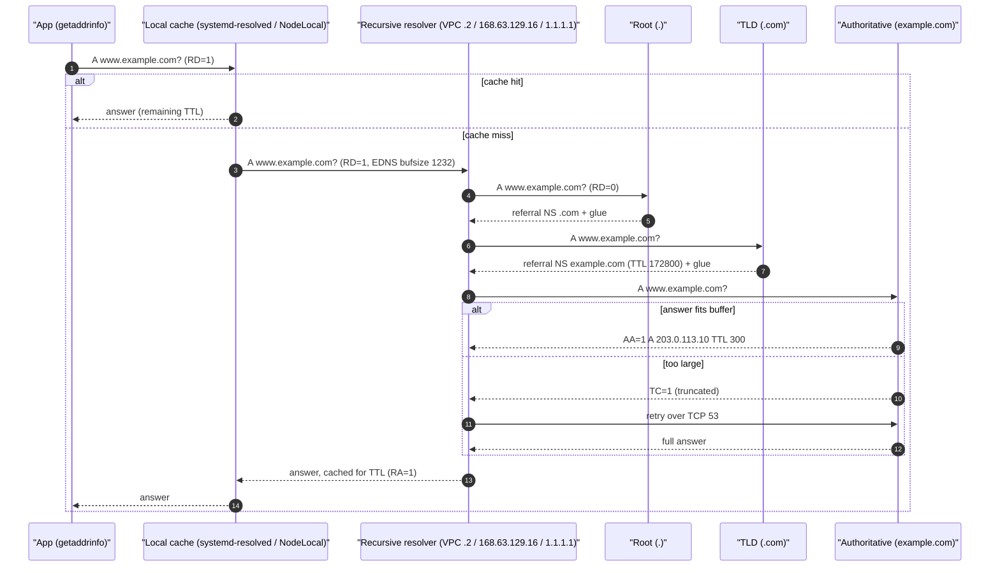
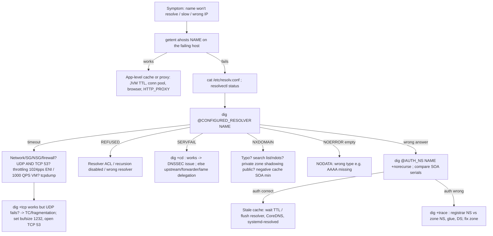

# H3 Domain Name System (DNS)
> Last verified: 2026-10 · Audience: senior/staff DevOps, SRE, AI eng, NetEng, DevSecOps, architects

## TL;DR
- DNS runs on **UDP/53 by default, but TCP/53 is mandatory** (RFC 7766). A response too big for the client's buffer comes back with **TC=1**, and the client retries over TCP. If a firewall allows only UDP/53, large answers (DNSSEC, long TXT/SPF, many A records) break.
- **EDNS0** (RFC 6891) lets a client advertise a UDP buffer larger than 512 B. Since **DNS Flag Day 2020** the default is **1232 B**: the IPv6 minimum MTU of 1280, minus 48 B of IPv6 and UDP headers. This keeps responses from fragmenting.
- Resolution path: **stub (app/libc) → local cache (systemd-resolved/nscd/NodeLocal) → recursive resolver → root → TLD → authoritative**. Every answer is cached for its **TTL**. Failed lookups are cached too: **negative caching TTL = min(SOA TTL, SOA MINIMUM)** (RFC 2308).
- Encrypted DNS: **DoT** (TCP 853, RFC 7858), **DoH** (HTTPS 443, RFC 8484), **DoQ** (UDP 853 via QUIC, ALPN `doq`, RFC 9250). DoH blends in with web traffic, which makes life hard for enterprise DNS controls. DoT is easy to identify and block by port.
- Tools: **`dig` is the tool to use**. Use `+trace` to walk the delegation yourself, `+norecurse` to check the cache or an authoritative server, `@server` to choose who answers, and `+short` for scripts. **`nslookup`** is fine for quick checks but hides detail. Neither tool reads `/etc/hosts` or nsswitch. To see what applications actually resolve, use `getent ahosts`.
- Kubernetes: **`ndots:5` plus 3 or more search domains** turns one external lookup into up to about 8–10 queries (A+AAAA × search list). Fix it with a trailing dot, a lower `ndots` in `dnsConfig`, or **NodeLocal DNSCache**, and scale CoreDNS. On AWS the hard cap is **1024 pps per ENI** to link-local services (VPC DNS, IMDS, NTP). On Azure it is **1000 QPS and 200 pending queries per VM** to 168.63.129.16.
- **TTL strategy for migrations:** lower the TTL at least one old TTL before the cutover, cut over, keep the old target serving for longer than the old TTL (some clients ignore TTLs), then raise the TTL again. For NS or delegation changes, the parent's NS TTL (often 48 h for .com) is outside your control.
- Cloud: **Route 53 public/private hosted zones + VPC Resolver (VPC+2 / 169.254.169.253) + Resolver endpoints/rules** maps to **Azure DNS public zones + Private DNS zones + Azure-provided DNS 168.63.129.16 + DNS Private Resolver (inbound/outbound + forwarding rulesets)**.

## H3.1 Introduction to DNS
- **How it works:**
  - A distributed, hierarchical, cached key/value database: name + type + class → RRset. Main types: **A, AAAA, CNAME, MX, NS, SOA, TXT, SRV, PTR, CAA, HTTPS/SVCB**, plus DS/DNSKEY/RRSIG for DNSSEC.
  - Header flags to know: **QR, AA** (authoritative answer), **TC** (truncated), **RD** (recursion desired), **RA** (recursion available), **AD** (DNSSEC authenticated data), **CD** (checking disabled). RCODEs: **NOERROR, NXDOMAIN, SERVFAIL, REFUSED, FORMERR, NOTIMP**.
  - **NODATA** is not an RCODE. It is NOERROR with an empty answer section and an SOA in the authority section: the name exists but has no record of that type.
- **UDP/53 and TCP fallback:**
  - Classic DNS over UDP is limited to **512 B** (RFC 1035). Anything larger is truncated (**TC=1**) and the client must retry over **TCP/53**. Over TCP each message carries a 2-byte length prefix, so the maximum is 65,535 B.
  - **RFC 7766:** every general-purpose implementation **MUST** support both UDP and TCP. Clients should reuse connections and pipeline queries. Servers may answer out of order, and responses are matched by message ID. Zone transfers (**AXFR/IXFR**) always use TCP.
  - **EDNS0 (RFC 6891):** an OPT pseudo-RR in the additional section. It advertises the **UDP payload size**, carries the **DO bit** (send DNSSEC records), extended RCODEs, and options such as **ECS (Client Subnet, RFC 7871)**, **cookies (RFC 7873)** and **padding**.
  - **DNS Flag Day 2019:** large resolvers removed their workarounds for authoritative servers that were not EDNS-compliant. **DNS Flag Day 2020:** default EDNS buffer of **1232 B**. Resolvers **MUST** retry over TCP when TC=1, and authoritative servers **MUST NOT** send answers larger than the advertised buffer. The goal was to **avoid IP fragmentation**: fragments get dropped by middleboxes and can be spoofed for cache poisoning.
- **Encrypted transports:**

| Protocol | RFC | Transport/port | Notes |
|---|---|---|---|
| Do53 | 1035/7766 | UDP+TCP 53 | Plaintext; anyone on path can see and modify it |
| **DoT** | 7858 | TCP **853** + TLS | Easy to identify, so easy for enterprises to block or allow; Android "Private DNS" uses it |
| **DoH** | 8484 | HTTPS **443** (`application/dns-message`, GET `?dns=` base64url or POST), HTTP/2 or HTTP/3 | Indistinguishable from web traffic; browsers can bypass OS DNS (Firefox TRR, Chrome secure DNS) |
| **DoQ** | 9250 | QUIC **UDP 853**, ALPN `doq` | One query per stream, message ID **must be 0**, no head-of-line blocking; covers stub, recursive→authoritative and XFR |
| ODoH | 9230 (experimental) | DoH through a proxy | The proxy sees the client IP, the target sees the query, and neither sees both (Cloudflare + partners) |

  - **DDR (RFC 9462):** a client discovers that its plaintext resolver also supports DoH/DoT by querying `_dns.resolver.arpa` SVCB.
  - Enterprise control points: block or allow the **canary domain** `use-application-dns.net` (Firefox disables automatic DoH when it returns NXDOMAIN), MDM policies, and egress filtering of known DoH endpoints.
- **Trade-offs / when to use:**
  - Do53 inside a VPC or VNet is fine: the path is private and the provider resolver doesn't expose its traffic. AWS link-local DNS traffic "is not visible on the network".
  - Use DoT/DoH for **untrusted last-mile** networks (roaming laptops, branch offices). AWS Route 53 Resolver endpoints support DoH, and Route 53 Global Resolver supports DoH/DoT.
  - Encryption **≠ authenticity of data**. That is the job of **DNSSEC**, which signs the data. DoT/DoH protect only the transport between two hops.
- **Interview angles:**
  - "Is DNS UDP or TCP?" → Both. UDP first. TCP for TC=1, for responses larger than the EDNS buffer, and for XFR. DoT is also TCP. Opening only UDP/53 in a firewall or security group is a classic outage.
  - "Why 1232?" → 1280 IPv6 minimum MTU − 40 (IPv6) − 8 (UDP). It avoids fragmentation on almost every path. Mention fragment-based cache poisoning.
  - "DoH vs DoT for an enterprise?" → DoT is visible and controllable on port 853. DoH hides inside 443 and undermines DNS-based security controls such as Route 53 DNS Firewall and Azure DNS Security Policy. The usual approach is DoH to *your own* resolver, or none at all.
  - Pitfall: **UDP source-port randomization plus the 16-bit TXID** are what defend against Kaminsky-style poisoning. NAT devices that de-randomize source ports weaken that defense.

## H3.2 How DNS Lookup Works
- **How it works:**
  - **Stub resolver:** glibc `getaddrinfo()` follows `/etc/nsswitch.conf` (`hosts: files dns` or `files resolve`). It reads `/etc/hosts`, then the nameservers in `/etc/resolv.conf`. **glibc does not cache.** Caching comes from systemd-resolved, nscd, dnsmasq, or the language runtime.
  - **Local cache** layers: the browser (Chrome about 1 min), OS caches (Windows DNS Client, macOS mDNSResponder, **systemd-resolved** at `127.0.0.53`), and the **JVM**. The JVM uses `networkaddress.cache.ttl`, which defaults to 30 s without a security manager. Older or security-manager setups can cache **forever**, a classic failover bug.
  - **Recursive resolver:** an ISP resolver, 1.1.1.1, 8.8.8.8, the VPC/VNet resolver, or CoreDNS forwarding upstream. It performs **iterative** queries and caches each answer for its TTL.
  - **Root:** 13 root **identities** (a–m.root-servers.net), served by roughly 1,900+ anycast instances (approximate, root-servers.org). The root returns a **referral** to the TLD NS records plus **glue**.
  - **TLD** (e.g. `.com` run by Verisign) returns a referral to the domain's NS records. The NS TTL in the `.com` delegation is **172800 s (48 h)**.
  - **Authoritative** server returns the answer with the **AA** flag set. A **CNAME** restarts resolution at the target name; the resolver chases it.
  - Resolvers cache the NS/glue for the TLD and domain, so later queries skip the root and TLD. In steady state almost every query is a cache hit or a single hop to the authoritative server.
- **TTL facts:**
  - TTL is a 32-bit value, with a maximum of 2^31−1 (RFC 2181). Resolvers often clamp it (e.g. max 1 day, sometimes a min-TTL floor).
  - **Negative caching (RFC 2308):** an NXDOMAIN or NODATA response carries the zone **SOA** in the authority section. Negative TTL = **min(SOA record TTL, SOA MINIMUM field)**. NXDOMAIN is cached per (name, class); NODATA per (name, type, class). RFC guidance: 1–3 h is sensible, and more than 1 day causes problems.
  - **Route 53** default SOA: TTL 900, MINIMUM 86400, so the negative TTL is effectively **900 s**. **Azure DNS** default SOA minimum is 300 s (unverified against current portal defaults). Lower these *before* creating a record that clients are already querying. Otherwise "I created it but it still says NXDOMAIN" lasts up to the negative TTL.
  - **Serve-stale (RFC 8767):** a resolver can return expired data (e.g. up to 1–3 days) when the authoritative servers are unreachable. This softens authoritative outages but means a "deleted" record can still be served.
- **TTL strategy for migrations:**
  1. T−(old TTL + margin): lower the record TTL to **60–300 s**. Lower the SOA MINIMUM too if new names are involved.
  2. Wait **at least the old TTL** so every cache holds the low-TTL copy.
  3. Cut over the record, or use weighted records to shift traffic gradually.
  4. Keep the **old endpoint serving** for hours to days. Clients that ignore TTLs (JVMs, long-lived connection pools, IoT, some ISP resolvers) keep using the old address.
  5. Raise the TTL back (300–3600 s) once the change is stable. Low TTLs cost query volume (Route 53 bills per query; alias queries to AWS resources are free) and make you more exposed to resolver outages.
  - **Changing DNS provider (NS change):** the parent's NS TTL (48 h for .com) isn't yours to lower. Run **both providers with identical records** for longer than 48 h. Lower your in-zone NS TTL first. With **DNSSEC**, either remove the DS record at the registrar and wait out the DS TTL, or use a multi-signer setup (RFC 8901). Never move signed zones blindly.
- **Trade-offs / when to use:**
  - Short TTLs (30–60 s) suit DNS-based failover (Route 53 health checks, Traffic Manager), but some clients ignore them. Anycast or a load balancer with a stable IP fails over faster than DNS.
  - Long TTLs (hours) suit stable records (MX, NS, apex of static sites). They lower latency and make you more resilient to resolver or authoritative outages (the 2016 Dyn DDoS hurt sites with low TTLs most).
- **Interview angles:**
  - "Walk me through typing a URL" → browser cache → OS stub/cache → recursive → root → TLD → authoritative → cache by TTL. Then TCP or QUIC connect, then TLS (link to [H4](./H4-transport-layer-security.md)).
  - "We changed DNS an hour ago and some users still hit the old IP" → old TTL not yet expired, a negative cache entry, resolvers that clamp or ignore TTL, JVM/app caches, connection pooling (no new lookup ever happens), or serve-stale.
  - "Recursive vs iterative?" → the stub asks the recursive resolver with RD=1 and gets a full answer. The recursive resolver asks root, TLD and authoritative iteratively and gets referrals.
  - Also mention **ECS**: CDNs and GeoDNS see the resolver's IP, not the client's, unless ECS is sent. 1.1.1.1 deliberately does not send ECS for privacy, which can give less optimal CDN mapping.



## H3.3 Nslookup Command
- **How it works:**
  - Ships on Windows, Linux (bind-utils/dnsutils) and macOS. Two modes: one-shot (`nslookup -type=mx example.com 8.8.8.8`) and interactive (`set type=ns`, `set debug`, `server 1.1.1.1`).
  - **"Non-authoritative answer"** means the answer came from a recursive resolver's cache, without the AA flag. That is normal and not an error. To get an **authoritative** answer, find the NS (`nslookup -type=ns example.com`) and query one of them directly (`nslookup www.example.com ns-123.awsdns-15.com`). The "Non-authoritative" label then disappears.
  - Common types: `-type=a`, `aaaa`, `mx` (shows preference values; lower is preferred), `ns`, `soa` (serial, refresh, retry, expire, minimum: check whether secondaries or providers are in sync by comparing serials), `txt` (SPF, DKIM, domain verification), `ptr`/reverse (`nslookup 10.0.0.5`).
  - `set debug` / `-debug` shows the full header, flags and TTLs. `set norecurse` checks whether a resolver has the name **cached**.
- **Trade-offs / when to use:**
  - Use it on Windows hosts and Azure VMs when dig isn't installed, and for quick checks. The Windows nslookup does a reverse lookup of the server first (hence "Server: UnKnown" against 168.63.129.16, which has no PTR).
  - Weaknesses: it uses its **own resolver code**, not the OS stub. It **ignores `/etc/hosts`, nsswitch, the Windows NRPT (Name Resolution Policy Table) and systemd-resolved split DNS routing**. So "nslookup works but the app fails", and the reverse, are both common. Its output is also harder to parse than dig's.
- **Interview angles:**
  - "nslookup resolves but curl fails with 'Could not resolve host'" → the app path differs. Check nsswitch, `/etc/hosts`, systemd-resolved per-link routing domains, a container's own resolv.conf, a proxy, or IPv6/AAAA preference. Test with `getent ahosts` (Linux) or `Resolve-DnsName` (Windows, which honors the NRPT).
  - "Cached vs authoritative?" → non-authoritative means served from a resolver cache and may be stale up to the TTL. To verify the source of truth, query the authoritative NS directly. If the authoritative server has the new value and the resolver does not, wait out the TTL or flush the cache.

## H3.4 DNS Troubleshooting Workflow
- **How it works (layered isolation):**
  1. **Scope it:** one host, one subnet/VPC, one region, or everyone? One name, one zone, or all names? Internal or public?
  2. **What does the app actually resolve?** `getent ahosts name` (honors nsswitch and hosts), `resolvectl query name`, the container's or pod's `/etc/resolv.conf`.
  3. **Is the configured resolver reachable?** `dig @<resolver> name`. A timeout points to the network, a security group/NSG/firewall, throttling, or a dead resolver. A REFUSED answer points to an ACL or `allow-recursion`.
  4. **Read the RCODE:**
     - **NXDOMAIN:** typo, missing record, a search-domain mix-up, wrong split-horizon view, a **private zone shadowing a public one** (the Route 53 PHZ returns NXDOMAIN and does not fall through), or a negative cache entry.
     - **SERVFAIL:** DNSSEC validation failure (retest with `+cd`; if `+cd` works, DNSSEC is the problem), lame delegation, or an unreachable upstream or forwarder.
     - **NOERROR with an empty answer (NODATA):** wrong record type. For example, AAAA is missing while the client prefers IPv6.
  5. **Bypass caches:** query the **authoritative** server directly (`dig @ns1 name +norecurse`). Compare the SOA **serial** across all NS servers.
  6. **Walk the delegation:** `dig +trace`. Look for a registrar NS that doesn't match the zone NS, missing glue, or a broken DS record at the parent.
  7. **Size/transport:** works with `+tcp` but not over UDP, or works with `+bufsize=512` → **fragmentation, or TCP/53 blocked**.
  8. **Caching layers:** CoreDNS/NodeLocal cache, systemd-resolved (`resolvectl flush-caches`), browser, JVM, and the client's connection pool. Check the TTL in the response.
  9. **Rate/limits:** AWS **1024 pps per ENI** link-local (`linklocal_allowance_exceeded` in ENA `ethtool -S`). Azure **1000 QPS / 200 pending per VM**. Route 53 Resolver endpoint **10k QPS per IP** (down to about 1,500 with connection tracking). Kubernetes conntrack exhaustion.
  10. **Capture:** `tcpdump -ni any port 53 or port 853`. Check whether queries leave, whether responses come back, the TC bit, fragments, and retransmits at 5 s intervals (the glibc timeout).
- **Classic root causes:**
  - Only UDP/53 allowed through.
  - **Linux 5 s delays:** glibc sends A and AAAA in parallel from one socket, which hits a conntrack race in NAT/kube-proxy. Fix with `options single-request-reopen` or NodeLocal DNSCache.
  - `ndots:5` search amplification.
  - Custom DNS servers not forwarding to the cloud resolver, so private zones and Private Endpoints resolve to public IPs.
  - Expired domain or registrar NS changed.
  - DNSSEC key rollover gone wrong.
  - Split-horizon leaks.
  - `/etc/resolv.conf` overwritten by DHCP, NetworkManager or cloud-init.
- **Trade-offs / when to use:** start with the cheapest checks (getent, dig against the configured resolver) before captures. In Kubernetes, check CoreDNS logs and metrics (`coredns_dns_requests_total`, `coredns_forward_*`, SERVFAIL rate) before blaming the cloud resolver.
- **Interview angles:**
  - "Intermittent DNS timeouts in EKS" → most likely the CoreDNS pods hitting **1024 pps per ENI** to VPC+2, the conntrack race, or ndots amplification. Fix: spread CoreDNS across nodes (anti-affinity / topology spread) and scale it (cluster-proportional-autoscaler), deploy **NodeLocal DNSCache** (it also upgrades upstream queries to TCP), tune `ndots`, and make sure the CoreDNS `cache` plugin is enabled.
  - "Private Endpoint resolves to the public IP" (Azure) → the VNet isn't linked to `privatelink.*` Private DNS zone, or a custom DNS or on-prem forwarder isn't sending the **public zone** (e.g. `blob.core.windows.net`) to 168.63.129.16 or the Private Resolver inbound endpoint. Never conditional-forward `privatelink.blob...` from on-prem. Forward the public name.
  - "Works from my laptop, not the server" → different resolvers or views: VPN NRPT/split DNS, corporate DoH, a stale cache.



## H3.5 Linux Dig Command
- **How it works:**
  - `dig [@server] name [type] [+options]`. The default type is A. dig reads `/etc/resolv.conf` for the server but **ignores `/etc/hosts`**. It doesn't apply the search list unless you pass `+search`.
  - Reading the output: the HEADER `status:` (RCODE) and `flags:` (`qr aa rd ra ad tc`). ANSWER/AUTHORITY/ADDITIONAL counts. The OPT PSEUDOSECTION shows the EDNS version and `udp:` buffer. Each record's **TTL counts down** when served from a cache. `SERVER:` shows who answered. `Query time:` is 0–1 ms for a local cache hit.
- **Key options:**

| Option | Use |
|---|---|
| `+short` | Answer data only (scripts, CI health checks) |
| `+noall +answer` | Clean answer section with TTLs |
| `@1.1.1.1` / `@ns-1.awsdns-01.org` | Choose the resolver or query the authoritative server directly |
| `+trace` | dig performs the iteration itself: root → TLD → authoritative, printing each referral. **Bypasses your resolver's cache** (only the initial root NS lookup uses it). Finds delegation/glue/DS breaks |
| `+norecurse` (RD=0) | Against a recursive resolver: "is it cached?" Against an authoritative server: the correct way to ask |
| `+tcp` / `+notcp`, `+bufsize=1232`, `+ignore` | Test the TCP path and truncation behavior (`+ignore` shows the TC response instead of retrying) |
| `+dnssec`, `+cd`, `delv` | Inspect RRSIG/AD; `+cd` disables validation to isolate DNSSEC SERVFAILs; `delv` gives validation detail |
| `-x 10.0.0.5` | Reverse PTR lookup |
| `+nssearch` | SOA from every authoritative NS: spot serial mismatches |
| `+subnet=203.0.113.0/24` | Send ECS to test GeoDNS/CDN answers |
| `+https` / `+tls` (BIND 9.18+), `kdig +quic` | Test DoH/DoT (and DoQ with knot-utils) |
| `+search`, `+ndots=5` | Reproduce search-list expansion |

  - Record types: `A`, `AAAA`, `CNAME`, `MX`, `NS`, `SOA`, `TXT`, `SRV`, `CAA`, `HTTPS`, `ANY`. `ANY` is mostly deprecated; RFC 8482 lets servers return minimal answers.
  - A CNAME chain appears in the ANSWER section in order. A CNAME **cannot coexist with other records at the same name**, so there is no CNAME at the zone apex. Use Route 53 **alias** records, Azure **alias** records, or Cloudflare **CNAME flattening**.
- **Trade-offs / when to use:** dig is the standard for debugging. `host` gives terse output. `drill`/`kdig` are alternatives where BIND tools are missing (Alpine: `bind-tools`). `resolvectl query` tests the systemd-resolved path including split DNS.
- **Interview angles:**
  - "How do you prove the authoritative server is correct but the resolver is stale?" → compare `dig @auth name +norecurse` with `dig @resolver name`. Compare TTLs: a resolver TTL lower than the record's configured TTL means it is cached and counting down.
  - "What does `+trace` show you that a normal dig doesn't?" → every referral hop, the NS set and glue at each level, and where the chain breaks. Examples: the registrar still points to old name servers (lame delegation), or a DS record at the parent has no matching DNSKEY.
  - Pitfall: running `dig` inside a pod with `ndots:5` does **not** reproduce what the app sees unless you add `+search`. Use `getent` or `nslookup` from the pod, or `dig +search`.

```bash
# Quick answers / scripting
dig +short www.example.com A
dig +noall +answer example.com MX
dig @1.1.1.1 example.com AAAA +dnssec

# Authoritative vs cached
dig +short NS example.com
dig @"$(dig +short NS example.com | head -1)" www.example.com +norecurse
dig +nssearch example.com                 # SOA serials on every NS

# Delegation walk, truncation/TCP tests
dig +trace www.example.com
dig @8.8.8.8 big-txt.example.com TXT +bufsize=512 +ignore   # expect flags: tc
dig @8.8.8.8 big-txt.example.com TXT +tcp

# What the application actually resolves (honors nsswitch + /etc/hosts)
getent ahosts www.example.com
resolvectl status; resolvectl query www.example.com; resolvectl flush-caches

# Encrypted DNS (BIND 9.18+)
dig @1.1.1.1 +https example.com
dig @1.1.1.1 +tls example.com

# Watch DNS on the wire (UDP+TCP 53, DoT 853)
sudo tcpdump -ni any 'port 53 or port 853'

# Kubernetes: test from inside the cluster's DNS context
kubectl run dnsutils --rm -it --image=registry.k8s.io/e2e-test-images/agnhost:2.39 -- \
  sh -c 'cat /etc/resolv.conf; nslookup kubernetes.default; nslookup api.example.com.'
kubectl -n kube-system logs -l k8s-app=kube-dns --tail=50

# AWS: has this instance hit the 1024 pps link-local cap?
ethtool -S eth0 | grep linklocal_allowance_exceeded
```

### Linux and Kubernetes resolver configuration (cross-cutting)
- **`/etc/resolv.conf` (glibc):**
  - At most **3 nameservers** (MAXNS). Defaults: `timeout:5`, `attempts:2` (caps 30 s / 5).
  - `ndots` defaults to **1** (maximum 15).
  - Options: `rotate`, `single-request`, `single-request-reopen`, `use-vc` (force TCP), `edns0`, `trust-ad`, `no-aaaa`.
  - Azure recommends `options timeout:1 attempts:5` for Linux VMs.
- **systemd-resolved:**
  - Stub listener on **127.0.0.53** (full features: cache, split DNS, DNSSEC, DoT). From systemd v251 there is also **127.0.0.54**, a proxy-only listener without the stub features.
  - `/etc/resolv.conf` is usually a symlink to `/run/systemd/resolve/stub-resolv.conf`. Pointing it at `/run/systemd/resolve/resolv.conf` instead lists the real upstream servers.
  - Per-link DNS servers and **routing domains** (`~corp.example`) give VPN split DNS.
  - Gotcha: a container that copies a host resolv.conf pointing at 127.0.0.53 can't reach the host's loopback. Docker and kubelet handle this by using the upstream file.
- **Kubernetes:**
  - kubelet writes `nameserver <kube-dns ClusterIP>`, `search <ns>.svc.cluster.local svc.cluster.local cluster.local [+node search domains]`, and `options ndots:5`.
  - `dnsPolicy`:
    - `ClusterFirst` is the default.
    - `Default` inherits the node's resolver config. Despite the name, it is *not* the default.
    - Use `ClusterFirstWithHostNet` for hostNetwork pods.
    - `None` means configuration comes only from `dnsConfig`.
  - **CoreDNS:** `forward . /etc/resolv.conf`, `cache 30`, the `autopath` plugin (server-side search walk), and stub domains or conditional forwarding via the Corefile.
  - **NodeLocal DNSCache** (GA since v1.18): a DaemonSet on link-local **169.254.20.10**. It skips kube-proxy DNAT and conntrack for pod→cache traffic, upgrades upstream queries to **TCP**, and can enable negative caching. The default cache is 10k entries (about 30 MB).
- **ndots math:** `api.stripe.com` has 2 dots, fewer than 5, so it tries `api.stripe.com.<ns>.svc.cluster.local`, `.svc.cluster.local`, `.cluster.local`, then `.ec2.internal`/`.<region>.compute.internal`, and only then the absolute name. Each step sends A and AAAA, so about **8–10 queries**, all NXDOMAIN except the last. Fixes:
  - Use FQDNs with a **trailing dot** in config.
  - `dnsConfig.options: [{name: ndots, value: "2"}]`.
  - Use the CoreDNS `autopath` plugin.
  - Run NodeLocal DNSCache to absorb the NXDOMAINs.

## Cloud mapping: AWS vs Azure

| Capability | AWS | Azure | Role it plays | Key differences | Alternatives |
|---|---|---|---|---|---|
| Public authoritative DNS | **Route 53 public hosted zone** (4 NS across TLDs, 100% SLA) | **Azure DNS public zone** (4 NS, anycast, 100% SLA) | Hosts internet-facing records | R53: routing policies (weighted, latency, geo, geoproximity, failover, multivalue, IP-based) + health checks built in. Azure DNS answers statically; routing comes from **Traffic Manager** (alias or the preview *Traffic Manager Linked Records*). Azure has no zone transfers and no domain registration; R53 has both registration and transfers via Route 53 Domains | **Cloudflare DNS** (anycast, CNAME flattening, proxied records), NS1, Google Cloud DNS |
| Apex aliasing | **Alias records** (ELB, CloudFront, S3, API GW; queries to AWS targets free) | **Alias records** (Public IP, Traffic Manager, Azure CDN/Front Door, same-zone record set; max 50 per resource) | CNAME-like behavior at the zone apex | R53 alias works only for AWS targets; Azure alias also deletes or updates the record with the resource lifecycle | Cloudflare CNAME flattening, ALIAS/ANAME at other providers |
| Private authoritative DNS | **Route 53 private hosted zone** associated with VPCs (300 VPCs/zone; beyond that use **Route 53 Profiles**) | **Azure Private DNS zone** + **VNet links** (1000 links/zone; 100 with autoregistration; a VNet can autoregister into only **1** zone) | Internal names, Private Endpoint/PrivateLink names, split-horizon | Azure **autoregistration** of VM records; R53 has no autoregistration. R53 PHZ that matches a name returns NXDOMAIN with **no fallthrough**. Azure can opt into **fallback to internet** (`NxDomainRedirect`) on privatelink zones | CoreDNS/BIND/Infoblox, AD-integrated DNS |
| Built-in VPC/VNet resolver | **Route 53 VPC Resolver** ("AmazonProvidedDNS") at **VPC CIDR base+2**, **169.254.169.253**, **fd00:ec2::253** | **Azure-provided DNS 168.63.129.16** (WireServer virtual IP; also DHCP, LB health probes, VM agent) | Recursive resolver that also sees private zones | AWS: **1024 pps per ENI** for all link-local traffic (DNS+IMDS+NTP), not raisable; cannot be filtered with SG/NACL. Azure: **1000 QPS and 200 pending per VM**, excess dropped; port 53 to it bypasses NSGs unless you use the `AzurePlatformDNS` tag; no PTR for the IP itself. AWS requires `enableDnsSupport` + `enableDnsHostnames` for PHZ | Self-managed resolvers (Unbound, BIND, CoreDNS) |
| Hybrid forwarding | **Route 53 Resolver endpoints**: inbound (on-prem→AWS), outbound + **forwarding rules** (AWS→on-prem); 10k UDP QPS per endpoint IP (as low as about 1,500 with connection tracking or NLB); 6 IPs/endpoint; DoH supported | **Azure DNS Private Resolver**: inbound/outbound endpoints + **DNS forwarding rulesets** (10k QPS per endpoint, 1000 rules/ruleset, 1 resolver per VNet, ruleset links to 500 VNets) | Conditional forwarding between cloud and on-prem/AD | R53 forwarding rules take **precedence over a PHZ** for the same name. Resolver rules and PHZs are shared via **RAM** or **Route 53 Profiles**. Azure rulesets link to VNets; custom DNS on VNets must forward to the inbound endpoint or 168.63.129.16. Windows forwarders to Azure need a timeout above 4 s | DNS VMs/AD DCs forwarding to base+2 / 168.63.129.16 |
| DNS filtering / firewall | **Route 53 Resolver DNS Firewall** (domain lists, managed threat lists, 100 rules/group) | **Azure DNS Security Policy** (GA; VNet-level filter + logging, threat-intel feed) | Block exfiltration and malware domains at the resolver | Both act only on traffic through the platform resolver; DoH clients bypass them | Cloudflare Gateway, Infoblox BloxOne, Zscaler |
| Query logging | **Resolver query logs** (CloudWatch/S3/Firehose); public zone query logs (us-east-1 CloudWatch) | DNS Security Policy diagnostic logs; Private Resolver metrics | Forensics, troubleshooting | — | CoreDNS `log` plugin, SIEM |
| Global anycast resolver for non-VPC clients | **Route 53 Global Resolver** (GA Mar 2026; DoH/DoT, resolves public and associated PHZ names for authorized clients) | No direct equivalent (unverified); use Private Resolver inbound over VPN/ExpressRoute | Encrypted resolution for branches and roaming clients | — | Cloudflare 1.1.1.1 / Zero Trust Gateway |
| DNSSEC signing | Route 53 DNSSEC signing (KSK in **KMS**, us-east-1 CMK; 2 KSKs/zone) | Azure Public DNS DNSSEC (supported) | Data origin authentication | Private zones are unsigned on both | Cloudflare one-click DNSSEC |

- **Role summary:**
  - **Route 53** is a global service (control plane in us-east-1, data plane globally anycast, 100% SLA). The **VPC Resolver** is per-AZ and regional. **Resolver endpoints** are ENIs in your subnets, so place them in 2 or more AZs.
  - **Azure DNS** zones are global resources. **Private DNS zones are global** and can link to VNets in any region. **DNS Private Resolver** is regional and VNet-bound, and needs dedicated `/28`+ subnets for inbound and outbound endpoints.
- **Important differences / gotchas:**
  - **Throttling shape:** AWS throttles by **packets/s per ENI** across all link-local services. Bursty sidecars, CoreDNS, and IMDS calls all share the 1024 pps. Azure throttles by **queries/s per VM**.
  - In both clouds, put a **local cache** on the node (systemd-resolved, dnsmasq, NodeLocal DNSCache). Azure explicitly recommends client-side caching and `timeout:1 attempts:5`.
  - **Custom DNS servers:** in AWS (DHCP option set) and Azure (VNet DNS servers), anything not forwarded to base+2 or 168.63.129.16 **loses PHZ and Private Endpoint resolution**. EMR/Hadoop on AWS also needs `*.compute.internal` forwarded.
  - **Precedence:**
    - AWS: Resolver forwarding rule > PHZ (most specific) > public resolution.
    - Azure: VNet-linked private zones are answered by 168.63.129.16. Ruleset rules apply on the outbound endpoint path.
    - Private Endpoints need the **`privatelink.*`** zone linked. Clients query the public name, which CNAMEs to privatelink.
  - **Azure DNS changes** reach the name servers within 60 s. **Route 53** changes reach all authoritative servers typically within 60 s (`GetChange` returns INSYNC).
  - **Pricing shape:** both charge per zone per month + per million queries. R53 alias queries to AWS resources are free; R53 Resolver endpoints are billed per ENI-hour + per query. Azure Private Resolver is billed per endpoint-hour + rulesets.
- **Alternatives:**
  - **Cloudflare DNS:** authoritative anycast across 330+ cities, CNAME flattening at the apex, proxied (orange-cloud) records that return Cloudflare IPs. The public resolver **1.1.1.1** supports DoH (`https://cloudflare-dns.com/dns-query`), DoT (`one.one.one.one:853`) and ODoH. 1.1.1.2 / 1.1.1.3 are the malware and family-filtered variants.
  - **Kubernetes CoreDNS** is the in-cluster resolver on EKS and AKS. AKS uses CoreDNS forwarding to 168.63.129.16 or the VNet's custom DNS.
  - GCP Cloud DNS is the third-cloud equivalent: private zones plus inbound/outbound server policies.

## Cross-links
- [G3 Network DNS and DHCP](../G-cloud-network-architecture/G3-network-dns-and-dhcp.md): DHCP option sets, VPC/VNet DNS attributes, hybrid resolver design.
- [I1 DNS (gaps: DNSSEC, anycast, GeoDNS, record types deep-dive)](../I-dns-tls-acceleration-gaps/I1-dns.md)
- [F5 Popular networking protocols (F5.1 DNS)](../F-network-engineering/F5-popular-networking-protocols.md)
- [F3 UDP](../F-network-engineering/F3-user-datagram-protocol.md) and [F4 TCP](../F-network-engineering/F4-transmission-control-protocol.md): the transport details behind TC=1 and TCP fallback.
- [H1 Linux network diagnostics](./H1-linux-network-diagnostics.md) and [H2 Troubleshooting your network](./H2-troubleshooting-your-network.md): tcpdump, firewall filtering (H2.7).
- [H4 Transport Layer Security](./H4-transport-layer-security.md): the TLS that DoT/DoH/DoQ rely on.
- [H5 Network performance deep dive](./H5-network-performance-deep-dive.md): MTU and fragmentation (H5.8), the reason for 1232.
- [G7 Service endpoints / Private Link](../G-cloud-network-architecture/G7-service-endpoints-private-link.md): privatelink DNS zones.
- [C1 Performance (caching)](../C-large-scale-architecture/C1-performance.md): TTL as a cache-invalidation policy.

## Sources
- https://docs.aws.amazon.com/vpc/latest/userguide/AmazonDNS-concepts.html
- https://docs.aws.amazon.com/Route53/latest/DeveloperGuide/DNSLimitations.html
- https://docs.aws.amazon.com/Route53/latest/DeveloperGuide/hosted-zone-private-considerations.html
- https://aws.amazon.com/blogs/aws/introducing-amazon-route-53-global-resolver-for-secure-anycast-dns-resolution-preview/
- https://learn.microsoft.com/en-us/azure/virtual-network/what-is-ip-address-168-63-129-16
- https://learn.microsoft.com/en-us/azure/virtual-network/virtual-networks-name-resolution-for-vms-and-role-instances
- https://learn.microsoft.com/en-us/azure/azure-resource-manager/management/azure-subscription-service-limits#azure-dns-limits (via MicrosoftDocs `includes/dns-limits.md`)
- https://learn.microsoft.com/en-us/azure/dns/dns-faq
- https://learn.microsoft.com/azure/dns/private-dns-fallback
- https://learn.microsoft.com/en-us/azure/dns/dns-security-policy
- https://kubernetes.io/docs/concepts/services-networking/dns-pod-service/
- https://kubernetes.io/docs/tasks/administer-cluster/nodelocaldns/
- https://man7.org/linux/man-pages/man5/resolv.conf.5.html
- https://www.dnsflagday.net/2020/
- https://www.rfc-editor.org/rfc/rfc7766 · https://www.rfc-editor.org/rfc/rfc2308 · https://www.rfc-editor.org/rfc/rfc9250 · RFC 6891, 7858, 8484, 8767, 9462
- https://developers.cloudflare.com/1.1.1.1/encryption/
