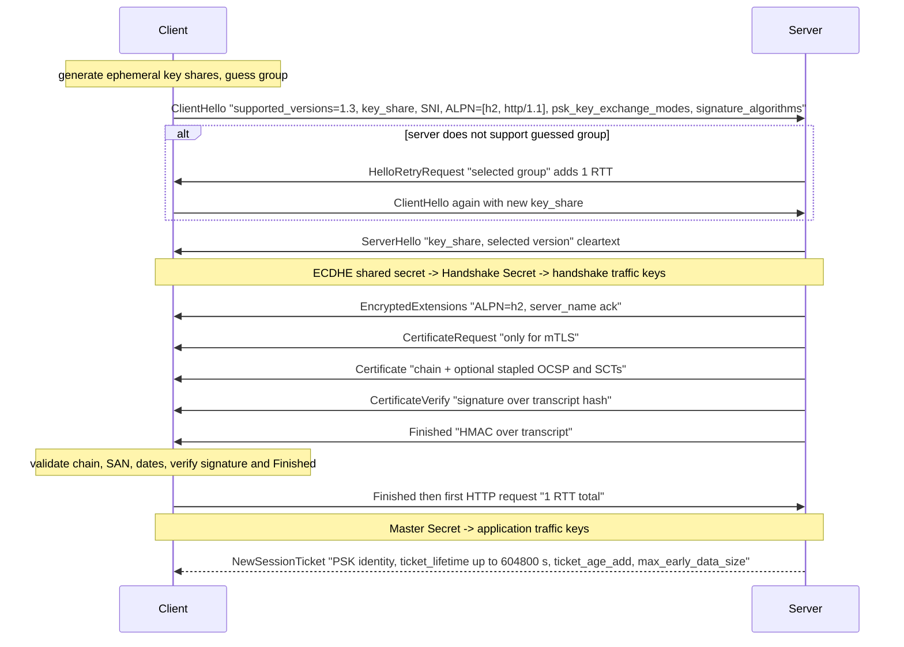
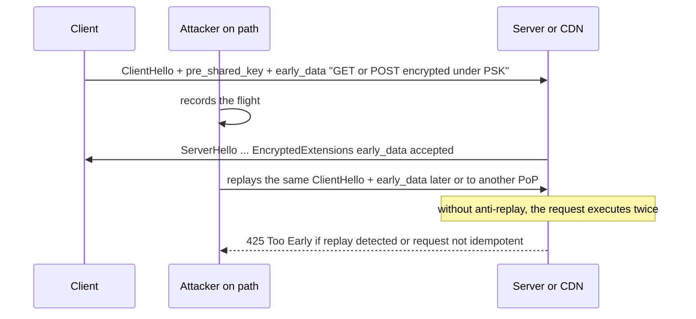
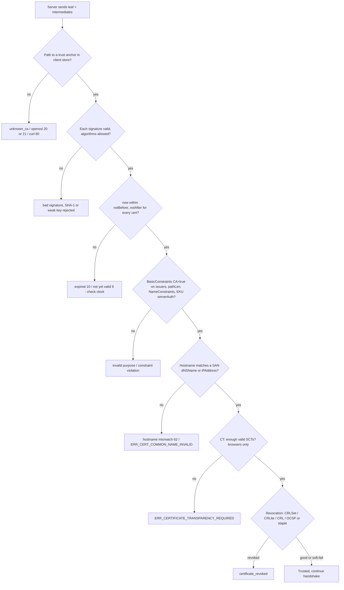
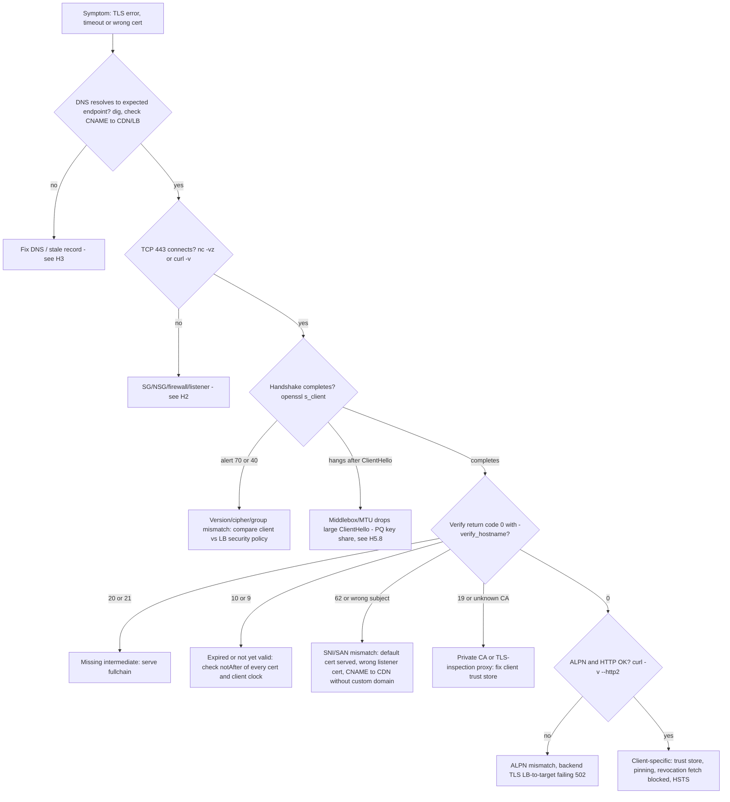

# H4 Transport Layer Security (SSL/TLS)
> Last verified: 2026-10 · Audience: senior/staff DevOps, SRE, AI eng, NetEng, DevSecOps, architects

> **Scope:** this is the **troubleshooting and operations** deep dive. The overview of TLS 1.2 vs 1.3, ECDHE and forward secrecy, SNI/ECH, certificate lifetimes (SC-081v3: 200 days now, 47 days by 2029) and post-quantum `X25519MLKEM768` is in [F5.2/F5.3](../F-network-engineering/F5-popular-networking-protocols.md#f52-tls) and is not repeated here. Design-level TLS (termination, mTLS, PKI) is in [C4](../C-large-scale-architecture/C4-security.md) and [I2](../I-dns-tls-acceleration-gaps/I2-tls-and-certificates.md).

## TL;DR
- TLS gives **confidentiality** (AEAD), **integrity** (AEAD tag per record) and **server authentication** (X.509 chain to a trusted root and a hostname match on the **SAN**). It does **not** hide IPs, ports, packet sizes or timing, and it hides SNI only with ECH.
- **TLS 1.3 = 1 RTT** full handshake (key_share in ClientHello), everything after ServerHello is encrypted, **ALPN** is answered in EncryptedExtensions, resumption uses **PSK tickets** (lifetime ≤ 7 days), and **0-RTT early data is replayable**: allow idempotent requests only and answer **425 Too Early** when unsure (RFC 8470).
- Certificate validation is an ordered pipeline: **path build → signatures → validity dates (clock) → constraints/EKU → SAN match → CT SCTs → revocation**. Most production failures are a **missing intermediate**, an **expired leaf or intermediate**, a **SAN/SNI mismatch**, an **outdated trust store** (containers, Java, IoT) or **clock skew**.
- **Revocation in 2026:** CA/B Forum **SC-063** made **CRLs mandatory and OCSP optional** (effective 15 Mar 2024). **Let's Encrypt shut its OCSP responders on 6 Aug 2025.** Chrome uses **CRLSets** and does no online OCSP checks by default. Firefox uses **CRLite** (all desktop users since Fx 137) and disabled OCSP for DV certs in Fx 142. Short certificate lifetimes are now the real revocation mechanism.
- **OCSP stapling** still matters for CAs that run OCSP and for non-browser clients (Windows Schannel/CAPI, enterprise, Java). **Must-Staple is effectively dead** (LE rejects it).
- **HSTS** (RFC 6797) turns HTTP→HTTPS and makes certificate errors **non-bypassable**. Preload needs `max-age ≥ 31536000; includeSubDomains; preload` and is slow to undo. Chrome 154 (Oct 2026) also turns on "Always Use Secure Connections" by default.
- Troubleshoot bottom-up: **DNS → TCP 443 → handshake alert → chain/verify code → hostname → dates/clock → ALPN/HTTP**. Use `openssl s_client -connect h:443 -servername h -showcerts` and `curl -v --resolve`.
- Cloud: **ALB/NLB security policies** (console default `ELBSecurityPolicy-TLS13-1-2-Res-PQ-2025-09`, CLI/CFN default still `ELBSecurityPolicy-2016-08`), **CloudFront security policies** (`TLSv1.2_2021`, `TLSv1.2_2025`, `TLSv1.3_2025`) vs **App Gateway** (`AppGwSslPolicy20220101[S]`, TLS 1.0/1.1 gone since 31 Aug 2025) and **Front Door** (`TLSv1.2_2023` default). Rotation: **ACM** renews at 45 days before expiry; **Key Vault** works with a versionless secret ID (App Gateway polls every 4 h, Front Door picks up "Latest" in 3 to 4 days).

## H4.1 Introduction to TLS
- **How it works:**
  - **Layering:** handshake protocol (negotiate, authenticate, derive keys), then **record protocol** (records of up to 2^14 = 16 KB plaintext, AEAD-encrypted with a per-record nonce from the sequence number), plus **alerts**. It runs over TCP. **DTLS** and **QUIC** (RFC 9001, TLS 1.3 inside) are the UDP variants.
  - **Three guarantees:** (1) **confidentiality**: AES-GCM or ChaCha20-Poly1305; (2) **integrity**: AEAD tag, so tampering means `bad_record_mac` and a closed connection; (3) **authentication**: the server proves it holds the private key for a CA-signed cert (CertificateVerify signature over the transcript). Client authentication (**mTLS**) is optional.
  - **What leaks anyway:** IP/port, SNI (unless ECH), cert in TLS 1.2 (plaintext), record sizes and timing (traffic analysis), DNS queries (unless DoH/DoT).
  - **Implicit TLS vs STARTTLS:** HTTPS/443, IMAPS/993 and SMTPS/465 start TLS immediately. SMTP/587 and LDAP STARTTLS upgrade in-band and are strippable unless enforced (MTA-STS, DANE).
  - **Versions:** SSL 2/3 and TLS 1.0/1.1 are dead (RFC 8996). TLS 1.2 is the floor and TLS 1.3 is preferred. Cloud LBs/CDNs have removed 1.0/1.1 (App Gateway enforced from 31 Aug 2025, Front Door 1.2+ only).
- **Trade-offs / when to use:**
  - **Termination point** decides who can see plaintext: CDN/LB termination (WAF, L7 routing, cert centralization) vs **re-encrypt** to the backend (zero trust, compliance) vs **passthrough** (end-to-end, but no L7 features). See [H6](H6-web-application-architecture.md) and [C4](../C-large-scale-architecture/C4-security.md).
  - CPU cost of TLS is small on modern CPUs (AES-NI). The expensive parts are the **asymmetric handshake** and **latency (RTTs)**, so reuse connections (keep-alive, HTTP/2 multiplexing, resumption).
- **Interview angles:**
  - "Does HTTPS hide which site I visit?" → No: SNI, DNS and IP reveal it unless you add ECH plus DoH, and even then IP and traffic analysis remain.
  - "Is TLS enough for compliance in transit inside a VPC?" → Often required end-to-end (PCI DSS, HIPAA guidance). Cloud fabric encryption (e.g. AWS Nitro inter-instance encryption, Azure MACsec between datacenters) helps but is not app-level authentication.
  - Pitfall: saying "SSL" for the protocol. Say "TLS"; "SSL certificate" is just the legacy name.

## H4.2 TLS Handshake
- **How it works (any version):** (1) **negotiate** version, cipher suite, group, ALPN, SNI; (2) **key exchange** with ephemeral (EC)DHE; (3) **authenticate** the server via cert chain plus a signature over the transcript; (4) **Finished** messages, a MAC over the whole transcript, which detects tampering and downgrades.
- **RTT budget before the first request byte** (cold connection):

| Stack | TCP | TLS | Total before request |
|---|---|---|---|
| TCP + TLS 1.2 | 1 RTT | 2 RTT | **3 RTT** |
| TCP + TLS 1.3 | 1 RTT | 1 RTT | **2 RTT** |
| TCP + TLS 1.3 resumed with 0-RTT | 1 RTT | 0 | **1 RTT** |
| QUIC (HTTP/3) | combined | 1 RTT | **1 RTT** (0-RTT on resumption) |
  - On a 100 ms RTT path, TLS 1.2 → 1.3 saves 100 ms per new connection. That is why edge termination (CDN PoP near the user) matters more than cipher choice. See [H5.3](H5-network-performance-deep-dive.md).
- **Handshake alerts you will see in logs and pcaps** (RFC 8446 §6):

| Alert (code) | Typical cause |
|---|---|
| `handshake_failure` (40) | No common cipher suite or group (policy too strict, old client) |
| `bad_certificate` (42) / `certificate_unknown` (46) | Client rejected the chain (often missing intermediate, or the client's own cert in mTLS) |
| `certificate_expired` (45) | Expired leaf/intermediate, or clock skew |
| `unknown_ca` (48) | Chain does not reach a trusted root (private CA, TLS-inspection proxy, outdated store) |
| `decrypt_error` (51) | Signature/Finished verification failed (key/cert mismatch, broken middlebox) |
| `protocol_version` (70) | Client offers only TLS 1.0/1.1, or server floor is 1.3 |
| `certificate_required` (116) | mTLS: server required a client cert and got none |
| `unrecognized_name` (112) | SNI not configured on the server |
| `no_application_protocol` (120) | ALPN mismatch (e.g. client insists on `h2`, listener offers only `http/1.1`) |
- **Interview angles:**
  - "Walk me through what happens when I type https://..." → DNS (+ HTTPS RR) → TCP SYN/SYN-ACK/ACK → ClientHello (SNI, ALPN, key_share) → ServerHello + encrypted cert → Finished → HTTP request. Name the RTTs.
  - "Where does the handshake fail if the cert is wrong?" → On the **client** after it receives Certificate/CertificateVerify. The client sends the alert, so the **server log** shows only "client closed" or `alert 42/48`. Debug from the client side.
  - TLS 1.2 handshake and its diagram are in [F5.2](../F-network-engineering/F5-popular-networking-protocols.md#f52-tls).

## H4.3 TLS 1.3: The Gold Standard

### Full handshake with key schedule

- **Key schedule (HKDF):** Early Secret (from PSK or zeros) → Handshake Secret (+ ECDHE) → Master Secret → client/server application traffic secrets, plus **resumption_master_secret** (seeds tickets) and **exporter_master_secret** (channel binding, e.g. EAP-TLS, token binding).
- **Hardening built in:** static RSA and DH removed (forward secrecy always), no renegotiation (**KeyUpdate** instead), no compression (CRIME), only AEAD, **downgrade sentinel** in ServerHello.random (`DOWNGRD\x01`) if a 1.3 server is forced to 1.2.
- **Middlebox compatibility mode:** the 1.3 ClientHello still says `legacy_version=0x0303` (TLS 1.2), carries a session ID and sends dummy ChangeCipherSpec. The real version is in `supported_versions`. This exists because middleboxes broke early 1.3 drafts ("ossification"). The same problem returns with large **PQ key shares** (ClientHello > 1 MTU, split across TCP segments).

### ALPN (RFC 7301)
- The client lists protocols (`h2`, `http/1.1`; `h3` is for QUIC). The server picks one, and in 1.3 it is returned **inside EncryptedExtensions** (hidden from passive observers). No match → `no_application_protocol` alert (strict servers) or no ALPN (lenient servers fall back to HTTP/1.1).
- **Ops gotchas:**
  - **gRPC requires `h2`**. If a proxy terminates TLS and offers only `http/1.1`, gRPC fails with cryptic errors. **ALB** negotiates ALPN itself (target group protocol version HTTP1/HTTP2/gRPC). **NLB TLS listeners** default to ALPN policy **`None`**: set `HTTP2Preferred` or `HTTP2Only` for h2/gRPC through NLB.
  - Load balancers that terminate TLS do separate ALPN with the backend: client h2 does not imply backend h2.
  - `curl --http2 -v` shows `ALPN: server accepted h2`. `openssl s_client -alpn h2` prints `ALPN protocol: h2`.

### Session resumption and PSK
- **How it works:** after the handshake, the server sends **NewSessionTicket(s)**: an encrypted blob containing the resumption secret, encrypted with the server's **Session Ticket Encryption Key (STEK)**. On reconnect, the client sends `pre_shared_key` with the ticket identity plus binder.
  - `psk_dhe_ke` (default in practice): PSK **plus** fresh ECDHE, so forward secrecy is kept. `psk_ke`: PSK only, no FS, saves CPU (rare on the web).
  - Ticket lifetime is capped at **7 days** (604800 s). Servers usually use much less. Tickets are single-use recommended (privacy, no linkability).
- **Ops gotchas:**
  - **STEK management:** across a fleet, either share/rotate STEKs (e.g. every few hours, distributed securely) or accept a lower resumption rate. A leaked STEK decrypts every resumed session encrypted under it (breaks FS for `psk_ke` and exposes resumption secrets). Rotate STEKs like keys.
  - Behind an L4 load balancer without stickiness, resumption hits a different node. If STEKs are not shared, you get a full handshake (just slower, not broken).
  - **Azure Application Gateway does not support TLS session ID/ticket resumption and has no 0-RTT** (documented limitation). Factor this in for chatty clients and use keep-alive.
- Verify resumption: `openssl s_client -sess_out` then `-sess_in` → look for `Reused, TLSv1.3`.

### 0-RTT early data and replay risk

- **Why replayable:** early data is encrypted only under keys derived from the PSK, before the server contributes any fresh randomness, so the server cannot prove liveness. It also has **no forward secrecy relative to the PSK**.
- **RFC 8446 §8 anti-replay options:** single-use tickets (needs a strongly consistent store across all nodes, which is hard globally), **ClientHello recording** within a time window, and **freshness checks** using `obfuscated_ticket_age` (reject if outside a small window). None is perfect across a distributed CDN.
- **RFC 8470 (HTTP):** the intermediary adds `Early-Data: 1` when forwarding a request received in early data. The origin can answer **`425 Too Early`**, and the client retries after the handshake completes.
- **Policy:** allow 0-RTT only for **safe, idempotent** requests (GET without side effects). Never for POST/payments/state changes or for anything where the GET has side effects (e.g. `/logout?`, "click-to-confirm" links). Many platforms keep 0-RTT off by default (Cloudflare opt-in; App Gateway unsupported).
- **Interview angles:**
  - "Why is TLS 1.3 faster *and* why not just enable 0-RTT everywhere?" → 1-RTT by sending key_share upfront. 0-RTT trades replay safety for one RTT; restrict it to idempotent requests and use `Early-Data` / 425.
  - "Session resumption broke after scaling the LB fleet" → STEKs not shared, or a ticket cache that is per-node. Check the resumption rate metric.
  - "HelloRetryRequest spikes" → server group preference differs from client guess (e.g. server dropped X25519 for FIPS, or enabled PQ only). Each costs an RTT. Front Door explicitly tells clients to prefer secp256r1/secp384r1 to avoid this.

## H4.4 SSL Certificate Validation

- **How it works (details that bite):**
  - **Path building:** roots are never needed on the wire (sending one is harmless but wasteful). **Browsers** may fetch missing intermediates via **AIA caIssuers** or use cached ones; **curl/OpenSSL, Go, Java, Python, Node, Android apps usually do not**. Hence "works in Chrome, fails in curl/Java".
  - **Multiple valid paths / cross-signs:** clients choose differently. Classic incident: Let's Encrypt **DST Root CA X3 expiry (30 Sep 2021)** broke OpenSSL 1.0.x clients that chose the expired cross-signed path even though a valid path existed.
  - **Trust stores differ:** Mozilla NSS, **Chrome Root Store** (Chrome's own since 2022/23), Apple, Microsoft, **Java `cacerts`** (per-JDK), Linux `ca-certificates`, Python `certifi`, Node's bundled store. **Slim/distroless containers** often lack `ca-certificates` → `x509: certificate signed by unknown authority`. Root programs also **distrust CAs** (e.g. Chrome distrusted Entrust-issued TLS certs from Nov 2024), which causes failures on new clients only.
  - **Hostname:** only **SAN** counts (CN ignored by modern clients). A wildcard matches **one label** (`*.example.com` matches `a.example.com`, not `example.com` or `a.b.example.com`). IP addresses need `iPAddress` SAN entries.
  - **EKU:** server certs need `serverAuth`. Public CAs are dropping `clientAuth` in 2026, so mTLS client certs come from a private CA (see [F5.2](../F-network-engineering/F5-popular-networking-protocols.md#f52-tls)).
  - **Validity and clock:** every cert in the chain is checked against **client local time**. VMs or containers without NTP, IoT devices with no RTC (boot at 1970), or a dead CMOS battery → "not yet valid" or "expired". An intermediate can expire before the leaf.
  - **Certificate Transparency:** Chrome/Safari require SCTs (embedded in the cert, via TLS extension, or in a stapled OCSP response). Private-CA certs are exempt because CT is enforced only for publicly trusted roots.
  - **Protocol support** is part of "validation" in practice: the cert key type must fit the cipher suites (ECDSA cert + RSA-only client = `handshake_failure`). Serve **dual certs** (ECDSA + RSA) on servers that support it.
  - **Key/cert pairing:** the private key must match the leaf public key. Otherwise the server fails to load, or clients get `decrypt_error`.
- **Trade-offs / when to use:**
  - **Pinning** (HPKP is dead; app-level pins in mobile apps) makes rotation dangerous with 47-day certs. Pin to a **CA SPKI you control (private CA)** or do not pin; prefer CT monitoring + CAA.
  - Private CA for internal/mTLS (AWS Private CA, Vault, cert-manager) means **you** distribute the root to every client trust store, including container images and JVMs.
- **Interview angles:**
  - "Cert is valid but some clients fail" → missing intermediate (AIA fetch masks it in browsers), old trust store, cross-sign path choice, SNI-less client gets the default cert, or ECDSA-only cert for an old client.
  - "openssl says `Verify return code: 0 (ok)` but the app fails" → s_client does **not** check hostname unless you pass `-verify_hostname`; the app may use a different trust store (Java) or pin.
  - "How do you monitor certs?" → synthetic probe of `notAfter` for **every cert in the served chain** from outside **and** from inside (private endpoints), CT log monitoring for unexpected issuance, alerts at < 30% lifetime remaining, and an inventory of exported/imported certs (those never auto-rotate).

## H4.5 OCSP Certificate Revocation (OCSP stapling)
- **How it works:**
  - **CRL** (RFC 5280): the CA publishes a signed list of revoked serials at the **CRL Distribution Point** URL. It can be large; CAs may **shard** (partition) CRLs. Clients cache CRLs until `nextUpdate`.
  - **OCSP** (RFC 6960): the client asks the responder at the **AIA OCSP** URL "is serial X good?" and gets a signed `good/revoked/unknown` response valid for hours to days. Problems: **privacy** (the CA learns who visits which site), **latency** (extra RTT to a third party), **availability** (responder outages), and **soft-fail** (browsers ignore failures, so an attacker who blocks OCSP wins anyway).
  - **OCSP stapling** (RFC 6066 `status_request`; in TLS 1.3 carried as an extension in the leaf's CertificateEntry): the **server** fetches and caches the OCSP response and sends it in the handshake. That removes the privacy and latency issues. **Must-Staple** (RFC 7633 TLS Feature extension) made it hard-fail, but almost nobody enforced it.
- **Current state (verify in interviews, this changed fast):**

| Item | Status as of 2026-10 |
|---|---|
| CA/B Forum **SC-063v4** | Effective **15 Mar 2024**: **CRLs mandatory, OCSP optional** for publicly trusted TLS CAs (OCSP must continue while unexpired certs contain an OCSP URL) |
| **Let's Encrypt** | Must-Staple requests failing from 30 Jan 2025; OCSP URLs removed from certs **7 May 2025**; **OCSP responders turned off 6 Aug 2025**. CRLs only |
| **Chrome** | No online OCSP/CRL checks by default; uses **CRLSets** (pushed, emergency- and CRL-crawl-derived subset). OCSP only via enterprise policy |
| **Firefox** | **CRLite** for all desktop users since **Fx 137 (Apr 2025)**: compressed filter of all CT-logged revocations, updated every 12 h, roughly 300 KB/day; **OCSP disabled for DV certs from Fx 142** |
| Safari/Apple | Apple-operated revocation via Apple's own infrastructure (mechanism details unverified) |
| Windows Schannel / .NET / Java / enterprise clients | Still do CRL/OCSP checks depending on config, so stapling and reachable CRL/OCSP URLs still matter for them |
| Short-lived certs | 6-day LE "shortlived" profile; under the BRs very short-lived certs can omit revocation info (exact threshold unverified). Lifetime shrinkage (47 days by 2029) is the industry's real revocation strategy |
- **Is stapling still relevant?**
  - **Yes** for certs from CAs that still run OCSP (many commercial CAs) when you serve Windows/Java/enterprise clients. Stapling avoids client-side OCSP timeouts that show up as slow first connections or failures behind egress firewalls that block the CA's OCSP host. **Azure Front Door staples by default.**
  - **No-op** for Let's Encrypt certs: there is no OCSP URL, so nginx logs a warning like `"ssl_stapling" ignored, no OCSP responder URL in the certificate`. Harmless, but remove `ssl_stapling on` or expect the log line.
  - Remove **Must-Staple** from any CSR templates: LE rejects it, and with responders gone it would hard-fail.
- **Trade-offs:** CRLs = scalable, private, but large/staleness up to `nextUpdate`. OCSP = fresh, but private-data leak plus availability coupling. Browser push lists (CRLSets/CRLite) = private and fast, but vendor-specific. **Short-lived certs** = no revocation infra needed, but require bulletproof automation.
- **Interview angles:**
  - "A private key leaked, how fast are users protected?" → revoke immediately (CRL updated, CRLite within about 12 h for Firefox, CRLSet if Google includes it). Chrome may not block a non-emergency leaf revocation, so **rotate key + cert** and treat remaining lifetime as the exposure window, which is why short lifetimes matter.
  - "Egress-restricted subnet, TLS client hangs for seconds" → client trying CRL/OCSP fetch to the CA (Windows/Java). Allow the CA's CRL/OCSP hosts via proxy, use stapling, or adjust revocation mode.
  - "Our internal mTLS needs revocation" → private CA CRLs (ALB mTLS trust stores accept CRLs uploaded via S3; App Gateway mutual auth supports CRL/OCSP checking for client certs, unverified detail) or very short-lived workload certs (SPIFFE/SPIRE, cert-manager).

## H4.6 HTTP Strict Transport Security (HSTS)
- **How it works:**
  - Response header `Strict-Transport-Security: max-age=<s>[; includeSubDomains][; preload]` is **honored only over a valid HTTPS response** (ignored over HTTP). The browser then rewrites `http://` to `https://` internally (Chrome shows a **307 Internal Redirect**) for `max-age` seconds and makes **cert errors non-bypassable** (no "proceed anyway").
  - Defeats **SSL stripping** (sslstrip MITM on the first HTTP request) after the **first visit (TOFU)**. The **preload list** (hardcoded in Chrome, Firefox, Safari, Edge) removes the TOFU gap.
  - **Preload requirements (hstspreload.org):** valid cert; redirect HTTP → HTTPS **on the same host** first; all subdomains on HTTPS (including `www` if it has a DNS record); header on the base domain with `max-age ≥ 31536000`, `includeSubDomains`, `preload`; redirects must also carry the header. **Removal takes months** to reach users through browser releases.
  - Whole TLDs are preloaded (e.g. `.dev`, `.app`): any domain there is HTTPS-only.
  - **Related 2026 changes:** Chrome **154 (Oct 2026)** enables **"Always Use Secure Connections"** by default for public sites (warning before first HTTP visit). The DNS **HTTPS RR** (RFC 9460) also tells clients to use HTTPS before the first connection.
- **Trade-offs / rollout:**
  - Ramp `max-age`: 300 s → 1 week → 1 month → 1 to 2 years, adding `includeSubDomains` only after inventorying subdomains (intranet hosts, legacy HTTP-only tools, printers and appliances under the same domain break).
  - `max-age=0` revokes the policy only for browsers that see it over HTTPS.
  - HSTS does nothing for API clients (curl, SDKs). Enforce HTTPS server-side there (redirect or refuse port 80, or not listen on 80 at all for APIs).
- **Where to set it:** at the edge/LB so it is consistent: **ALB** listener attribute `routing.http.response.strict_transport_security.header_value` (header modification, off by default), **CloudFront** response headers policy (managed security-headers policy), **Azure Front Door** rules engine (modify response header), **App Gateway** rewrite rules, or the app/ingress (nginx `add_header ... always`).
- **Interview angles:**
  - "We enabled HSTS + preload and an internal subdomain broke" → `includeSubDomains` forced HTTPS on `legacy.corp.example.com`. Fix: give it a cert. Removal from preload is slow.
  - "Cert expired and users can't click through" → HSTS makes it non-bypassable, which raises the cost of cert-expiry incidents. Monitor expiry harder.
  - "HSTS vs 301 redirect" → a 301 still sends the first request in cleartext (strippable); HSTS stops the browser from ever sending it after first sight; preload covers the first sight.

## H4.7 SSL Troubleshooting Workflow

- **Rule 1:** always reproduce **with SNI** and **against a specific IP** (bypass DNS/CDN), from the **same network** as the failing client (corporate TLS-inspection proxies re-sign traffic with an enterprise CA).
- **Rule 2:** separate **frontend TLS** (client → LB/CDN) from **backend TLS** (LB/CDN → origin). A 502/503 from an LB with a fine frontend cert usually means the backend handshake failed (origin cert expired, SAN does not match the origin hostname that Front Door/CloudFront checks, or the origin requires SNI that the proxy does not send).

### Error → cause → fix
| Error (client) | Likely cause | Fix |
|---|---|---|
| `unable to get local issuer certificate` (20) / `unable to verify the first certificate` (21) / curl exit 60 / Java `PKIX path building failed` | Server sends leaf only, or client store lacks root | Serve `fullchain.pem` (leaf + intermediates, in order); update client CA bundle |
| `certificate has expired` (10) | Leaf or **intermediate** expired; renewal succeeded but process not reloaded; old cert on one node | Check each cert's `notAfter`; reload nginx/envoy; check every LB node and region |
| `certificate is not yet valid` (9) | **Client clock behind** (or cert issued seconds ago and clock skew) | `timedatectl`, `chronyc tracking`; fix NTP |
| `hostname mismatch` (62) / `ERR_CERT_COMMON_NAME_INVALID` / curl `SSL: no alternative certificate subject name matches` | Missing SNI → default cert; wrong cert on listener; wildcard depth; CNAME to CDN without custom-domain cert | Add `-servername`; add SNI cert to listener; add SAN |
| `self-signed certificate in certificate chain` (19) | TLS-inspection proxy or private CA | Install the enterprise/private root into the right store (OS, Java, Python certifi, Node `NODE_EXTRA_CA_CERTS`) |
| `alert protocol version` / `no protocols available` | Client 1.0/1.1 only, or server min 1.3 vs 1.2 client | Align policy; upgrade client |
| `sslv3 alert handshake failure` (40) | No shared cipher/group, ECDSA-only cert to RSA-only client, or **mTLS required** | Compare `openssl s_client -cipher/-groups`; check `CertificateRequest` |
| `x509: certificate signed by unknown authority` (Go, in containers) | Image without `ca-certificates` | Install CA bundle in image |
| `wrong version number` | Talking TLS to a plaintext port (or HTTP to 443 through a misconfigured proxy) | Check port/listener protocol |
| `key values mismatch` (nginx start) | Key does not match cert | Compare public key hashes |

### Hands-on
```bash
H=api.example.com
# 1. Full picture: SNI, chain, negotiated version/cipher/group, ALPN, verify result incl. hostname
openssl s_client -connect "$H:443" -servername "$H" -showcerts \
  -verify_return_error -verify_hostname "$H" -alpn h2,http/1.1 </dev/null 2>&1 \
  | grep -E 'depth|verify|Protocol|Cipher|Negotiated|ALPN|Server Temp Key|subject=|issuer='

# 2. Dates/SANs of EVERY cert actually served (catches expired intermediates)
openssl s_client -connect "$H:443" -servername "$H" -showcerts </dev/null 2>/dev/null \
  | awk '/BEGIN CERT/{n++} {print > "/tmp/c" n ".pem"}'
for f in /tmp/c[0-9]*.pem; do openssl x509 -in "$f" -noout -subject -issuer -enddate 2>/dev/null; echo; done

# 3. Expiring within 30 days? (exit 1 if yes) - use in a cron/synthetic check
echo | openssl s_client -connect "$H:443" -servername "$H" 2>/dev/null \
  | openssl x509 -noout -checkend $((30*86400)) && echo OK || echo "EXPIRES <30d"

# 4. SNI mismatch test: without SNI you get the default cert
openssl s_client -connect "$H:443" -noservername </dev/null 2>/dev/null | openssl x509 -noout -subject -ext subjectAltName

# 5. Pin a specific backend/PoP IP while keeping SNI + Host (bypass DNS/CDN), with timings
curl -sv -o /dev/null --resolve "$H:443:203.0.113.10" "https://$H/healthz" \
  -w 'dns=%{time_namelookup} tcp=%{time_connect} tls=%{time_appconnect} ttfb=%{time_starttransfer}\n'

# 6. Protocol/cipher/group probing
openssl s_client -connect "$H:443" -servername "$H" -tls1_2 </dev/null   # does 1.2 still work?
openssl s_client -connect "$H:443" -servername "$H" -tls1_3 -groups X25519MLKEM768 </dev/null  # OpenSSL 3.5+
curl -sv --tlsv1.3 --tls-max 1.3 "https://$H/" -o /dev/null

# 7. Stapled OCSP (prints "OCSP response: no response sent" for LE certs - expected)
openssl s_client -connect "$H:443" -servername "$H" -status </dev/null 2>/dev/null | sed -n '/OCSP response/,/====/p'
# Revocation pointers in the leaf (LE: CRL DP only, no OCSP since May 2025)
openssl x509 -in /tmp/c1.pem -noout -ext crlDistributionPoints,authorityInfoAccess

# 8. Resumption and 0-RTT
openssl s_client -connect "$H:443" -servername "$H" -sess_out /tmp/sess </dev/null >/dev/null 2>&1
openssl s_client -connect "$H:443" -servername "$H" -sess_in /tmp/sess </dev/null 2>/dev/null | grep -E 'Reused|Early data'

# 9. Local files: chain verifies, key matches cert
openssl verify -CAfile root.pem -untrusted intermediate.pem leaf.pem
diff <(openssl x509 -in leaf.pem -noout -pubkey) <(openssl pkey -in key.pem -pubout) && echo "key matches"

# 10. Clock skew and HSTS header
timedatectl status | grep -E 'synchronized|Local time'; chronyc tracking | grep -E 'System time|Leap'
curl -sI "https://$H/" | grep -i strict-transport-security

# 11. Cloud side: policy and renewal state
aws elbv2 describe-listeners --load-balancer-arn "$LB_ARN" --query 'Listeners[].{port:Port,policy:SslPolicy,alpn:AlpnPolicy}'
aws acm describe-certificate --certificate-arn "$CERT_ARN" --query 'Certificate.{exp:NotAfter,renewal:RenewalSummary.RenewalStatus,inUse:InUseBy}'
az network application-gateway ssl-policy show -g "$RG" --gateway-name "$AGW"
az keyvault certificate show --vault-name "$KV" -n "$CERT" --query '{exp:attributes.expires,ver:id}'
```

```dockerfile
# Fix "x509: certificate signed by unknown authority" in slim images + add a private root
FROM debian:bookworm-slim
RUN apt-get update && apt-get install -y --no-install-recommends ca-certificates && rm -rf /var/lib/apt/lists/*
COPY corp-root-ca.crt /usr/local/share/ca-certificates/corp-root-ca.crt
RUN update-ca-certificates
```
- **Interview angles:**
  - "Users report intermittent cert errors" → one node/region/PoP has the old cert (renewal not deployed everywhere), mixed fleet behind DNS round robin, or a subset of clients behind a TLS-inspection proxy. Probe each IP with `--resolve`.
  - "Renewal succeeded but site still serves the old cert" → process not reloaded, cert pinned to a **specific Key Vault version** (no auto-rotation), ACM cert **imported** (imported certs are not renewed), or CloudFront using a cert outside **us-east-1**.
  - "It works from my laptop but not from the pod" → container trust store, egress proxy, missing SNI in the client library, or DNS split-horizon returning a private endpoint with a different cert.

## Cloud mapping: AWS vs Azure
| Capability | AWS | Azure | Role it plays | Key differences | Alternatives |
|---|---|---|---|---|---|
| Edge/CDN TLS policy | **CloudFront** security policy (`TLSv1.2_2021`, `TLSv1.2_2025`, `TLSv1.3_2025`) | **Front Door Std/Premium** TLS policy (`TLSv1.2_2023` default, `TLSv1.2_2022`, custom) | Viewer-side versions/ciphers at global PoPs | CloudFront offers PQ key exchange (`X25519MLKEM768`, `SecP256r1MLKEM768`, TLS 1.3 only) and a TLS 1.3-only policy; Front Door is 1.2+ with 1.3 always on, DHE removed Apr 2026, PQ not documented (unverified), staples OCSP by default | Cloudflare (PQ, ECH, 0-RTT opt-in), Akamai |
| Regional L7 TLS policy | **ALB** security policy (console default `ELBSecurityPolicy-TLS13-1-2-Res-PQ-2025-09`; API/CFN/CDK default `ELBSecurityPolicy-2016-08`) | **Application Gateway v2** SSL policy (`AppGwSslPolicy20220101` default for API ≥ 2023-02-01; `20220101S` stricter; CustomV2 for 1.3) | Client-facing TLS termination, SNI multi-cert, WAF | ALB backend policy is **derived** from the listener policy (not configurable). AppGw backend negotiation prefers 1.3, not customizable; **no session resumption, no 0-RTT**; old and 2022 policies cannot coexist on one gateway | NGINX/Envoy ingress, Traefik |
| L4 TLS termination | **NLB TLS listener** (security policy + **ALPN policy**, default `None`) | No direct equivalent: Azure Load Balancer is passthrough only; App Gateway TCP/TLS proxy (GA status unverified) | Offload TLS for non-HTTP or h2/gRPC at L4 | NLB needs `HTTP2Preferred`/`HTTP2Only` for gRPC | HAProxy, Envoy |
| Public cert issuance and rotation | **ACM** (198-day public certs; DNS-validated renew at **45 days** before expiry if in use and CNAMEs exist; ARN unchanged; Health/EventBridge alerts at 30/15/7/3/1 days on failure) | **Key Vault** certs (integrated CAs DigiCert/GlobalSign auto-renew, new version per renewal), **Front Door managed certs** (rotate within 45 days of expiry; only when CNAME points directly to Front Door), **App Service managed certs** | Issue, renew, deploy without key handling | ACM is regional (CloudFront needs **us-east-1**); **imported ACM certs never auto-renew**. Key Vault consumers must reference a **versionless** secret ID: App Gateway polls every **4 h** (any config change forces a check; KV access failure **disables the listener**); Front Door "Latest" picks up in 3 to 4 days | Let's Encrypt + cert-manager, Cloudflare Universal SSL |
| Cert expiry monitoring | ACM `DaysToExpiry` metric / EventBridge, AWS Config `acm-certificate-expiration-check` | Key Vault Event Grid `CertificateNearExpiry`, certificate contacts, Azure Policy, Advisor (AppGw KV errors) | Catch expiry and failed renewals | Neither monitors certs **outside** the platform (exported/on-prem) | Synthetic checks (Blackbox exporter, Datadog SSL check), CT monitoring |
| mTLS (client certs) | **ALB mTLS** (verify mode with trust store + CRLs in S3, or passthrough header) ; API Gateway mTLS | **App Gateway mutual authentication** (SSL profile, trusted client CA); **Front Door mTLS** now documented on the TLS policy page (the end-to-end TLS page still says unsupported: verify) | Authenticate clients/devices/B2B | AWS has first-party **Private CA** for client certs; Azure has no general-purpose managed private CA equivalent (unverified) | Istio/Linkerd mesh, SPIFFE/SPIRE, Vault PKI |
| HSTS / security headers | ALB listener header modification; CloudFront response headers policy | Front Door rules engine; App Gateway rewrite rules | Consistent HSTS at the edge | ALB header modification is off by default per listener | Cloudflare HSTS setting |
- **Role of each:** CloudFront/Front Door terminate near users (RTT savings), ALB/App Gateway terminate regionally with WAF and L7 routing, NLB terminates TLS at L4. ACM/Key Vault own the cert lifecycle; the LB/CDN only references it.
- **Gotchas:** the AWS **API default** ALB/NLB policy (`2016-08`, allows TLS 1.0) differs from the console default, so set `ssl_policy` explicitly in IaC. App Gateway resources created with old API versions keep `AppGwSslPolicy20150501` semantics until changed. Front Door/CloudFront check the **origin** cert against the origin hostname, so a valid frontend plus an expired or mismatched origin cert shows up as 502/503 at the edge.
- **Alternatives:** **Cloudflare** (edge TLS with PQ, ECH, CRL-based revocation, origin certs), **Kubernetes cert-manager** with ACME (HTTP-01/DNS-01) for in-cluster ingress, **HashiCorp Vault PKI** for short-lived internal certs.

```hcl
# ALB HTTPS listener: explicit PQ/TLS1.3 policy, ACM cert, HSTS at the LB
resource "aws_lb_listener" "https" {
  load_balancer_arn = aws_lb.web.arn
  port              = 443
  protocol          = "HTTPS"
  ssl_policy        = "ELBSecurityPolicy-TLS13-1-2-Res-PQ-2025-09"
  certificate_arn   = aws_acm_certificate_validation.web.certificate_arn
  routing_http_response_strict_transport_security_header_value = "max-age=31536000; includeSubDomains"

  default_action {
    type             = "forward"
    target_group_arn = aws_lb_target_group.web.arn
  }
}

# App Gateway v2: strict predefined policy (TLS 1.2+/1.3, GCM-only for 1.2)
# inside azurerm_application_gateway:
#   ssl_policy {
#     policy_type = "Predefined"
#     policy_name = "AppGwSslPolicy20220101S"
#   }
```

## Cross-links
- [F5 Popular networking protocols: TLS overview, lifetimes, PQ](../F-network-engineering/F5-popular-networking-protocols.md#f52-tls)
- [F8 Wireshark (SSLKEYLOGFILE decryption)](../F-network-engineering/F8-analyzing-protocols-with-wireshark.md)
- [C4 Security (C4.5 to C4.11 TLS, certs, termination)](../C-large-scale-architecture/C4-security.md)
- [I2 TLS and certificates gaps](../I-dns-tls-acceleration-gaps/I2-tls-and-certificates.md)
- [D2 Reusable parts (D2.11, D2.12)](../D-system-design/D2-reusable-parts-of-system-design.md)
- [H2 Troubleshooting your network](H2-troubleshooting-your-network.md), [H3 DNS](H3-domain-name-system.md), [H5 Network performance (H5.3 handshake delay, H5.8 MTU)](H5-network-performance-deep-dive.md), [H6 Web application architecture](H6-web-application-architecture.md)
- [L2 Encryption and key management](../L-data-privacy-ai-security/L2-encryption-key-management.md), [L7 Zero trust and workload identity](../L-data-privacy-ai-security/L7-zero-trust-workload-identity.md)
- [J4 Incident response (cert-expiry postmortems)](../J-sre/J4-incident-response-postmortems.md)

## Sources
- https://www.rfc-editor.org/rfc/rfc8446 (TLS 1.3: handshake, PSK, 0-RTT anti-replay §8, alerts §6)
- https://www.rfc-editor.org/rfc/rfc8470 (Early-Data header, 425 Too Early)
- https://www.rfc-editor.org/rfc/rfc7301 (ALPN)
- https://www.rfc-editor.org/rfc/rfc6960 (OCSP), https://www.rfc-editor.org/rfc/rfc5280 (X.509/CRL), https://www.rfc-editor.org/rfc/rfc6797 (HSTS)
- https://letsencrypt.org/2024/12/05/ending-ocsp/
- https://cabforum.org/2023/07/14/ballot-sc063v4-make-ocsp-optional-require-crls-and-incentivize-automation
- https://hacks.mozilla.org/2025/08/crlite-fast-private-and-comprehensive-certificate-revocation-checking-in-firefox/
- https://www.chromium.org/Home/chromium-security/crlsets/
- https://hstspreload.org/
- https://blog.google/security/https-by-defau/ (Chrome 154 HTTPS by default)
- https://docs.aws.amazon.com/elasticloadbalancing/latest/application/describe-ssl-policies.html
- https://docs.aws.amazon.com/elasticloadbalancing/latest/application/header-modification.html
- https://docs.aws.amazon.com/elasticloadbalancing/latest/network/load-balancer-listeners.html
- https://docs.aws.amazon.com/AmazonCloudFront/latest/DeveloperGuide/secure-connections-supported-viewer-protocols-ciphers.html
- https://docs.aws.amazon.com/acm/latest/userguide/managed-renewal.html, https://docs.aws.amazon.com/acm/latest/userguide/dns-renewal-validation.html
- https://learn.microsoft.com/en-us/azure/application-gateway/application-gateway-ssl-policy-overview
- https://learn.microsoft.com/en-us/azure/application-gateway/key-vault-certs
- https://learn.microsoft.com/en-us/azure/frontdoor/end-to-end-tls, https://learn.microsoft.com/en-us/azure/frontdoor/tls-policy
- https://learn.microsoft.com/en-us/azure/key-vault/certificates/overview-renew-certificate
