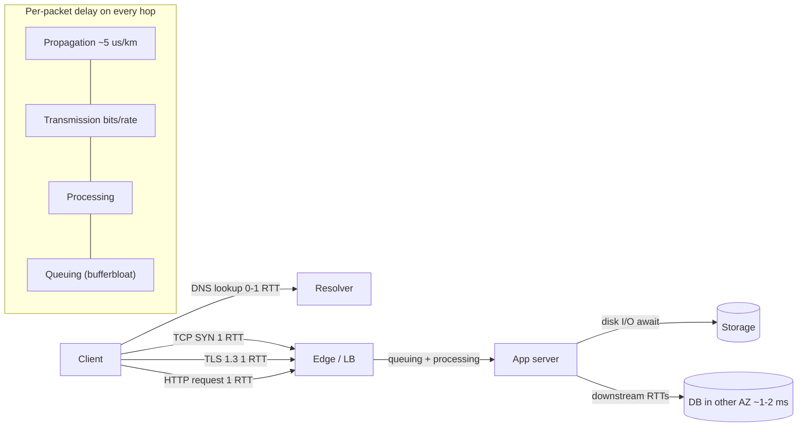
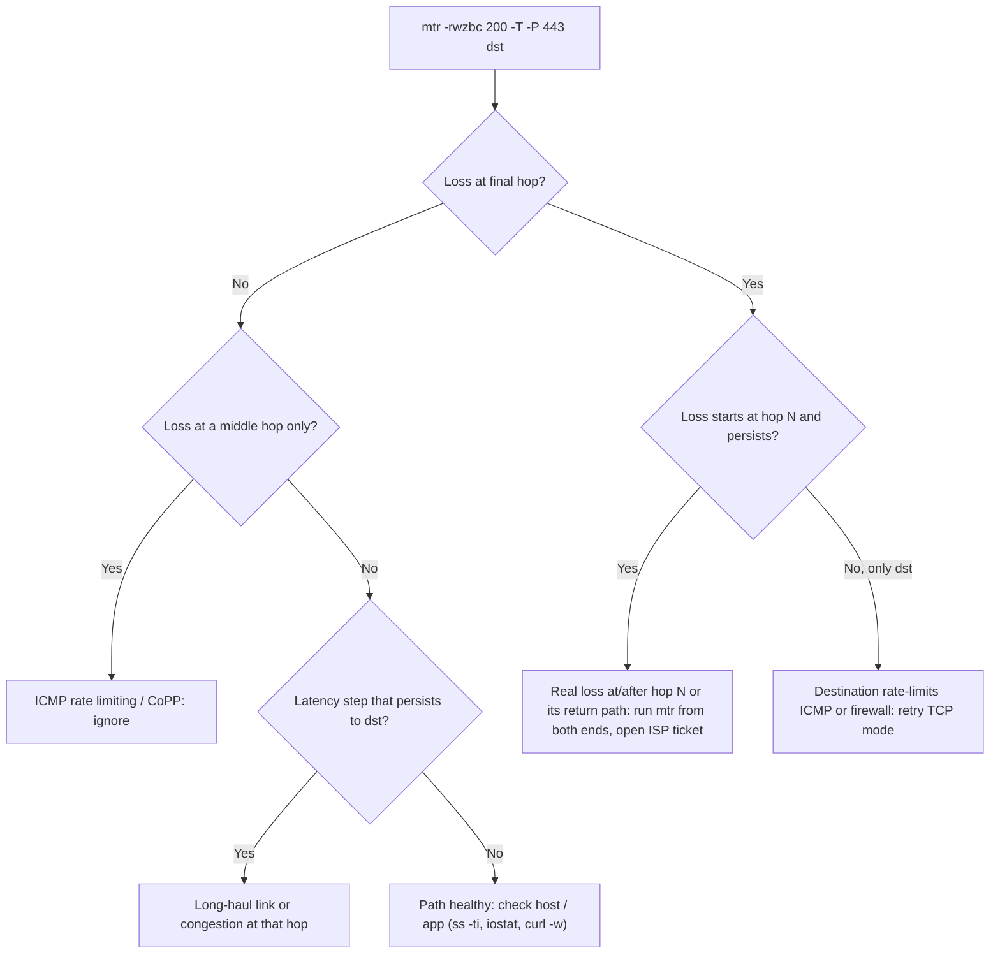

# H5 Network Performance Deep Dive
> Last verified: 2026-10 · Audience: senior/staff DevOps, SRE, AI eng, NetEng, DevSecOps, architects

## TL;DR
- **Latency = propagation + transmission + processing + queuing (+ protocol round trips).** Propagation is fixed by physics: light in fiber covers about **5 µs/km one way**, which is roughly **1 ms RTT per 100 km**. Queuing is the part that changes, and it drives most **tail latency**.
- **MTR rule:** loss at an intermediate hop that **does not carry through** to later hops is ICMP rate limiting by that router's control plane. It is not real loss. **Only loss that starts at hop N and continues to the destination counts.** Run it in **TCP mode on the real port** (`mtr -T -P 443`), because ICMP is often handled on a different path.
- **Bandwidth ≠ throughput.** A single TCP flow is limited by **window/RTT** (BDP: the window must be at least bandwidth × RTT) and by loss. **Mathis:** throughput ≤ (MSS/RTT) · (1.22/√p). At 100 ms RTT and 1% loss, Reno/CUBIC-style TCP gets about **1.4 Mbps** no matter how big the link is.
- **Bufferbloat:** oversized FIFO buffers turn throughput into latency, so RTT goes up under load. Fix it with **AQM (fq_codel, CoDel target 5 ms)** and **BBR** with pacing. Measure the **RTT under load**, not the idle RTT.
- **Server delay is usually storage or CPU, not the network.** Check `iostat -x` (`r_await`/`w_await`, `aqu-sz`, `%util`), `iotop`, and `vmstat` (`wa`, `r`). Compare **TTFB with the TCP connect time** to separate the server from the network.
- **Cloud numbers worth knowing:**
  - **Azure inter-AZ: under about 2 ms RTT** (Microsoft target).
  - **AWS AZs:** up to about **100 km apart** with **single-digit-ms** latency, suitable for synchronous replication.
  - Inter-region P50 values from Azure's published table: **East US → East US 2: 8 ms**, **West Europe → North Europe: 17 ms**, **East US → West Europe: about 85 ms**, **Australia East → East US: about 200 ms**. AWS publishes its numbers in **Network Manager Infrastructure Performance** (P50 over 5 minutes, free).
- **MTU testing:** `ping -M do -s 1472` (1500 − 20 − 8). On AWS inside a VPC, use **8973** for 9001. Anything bigger should fail with "message too long" or a "Frag needed" reply. If it disappears silently, ICMP is being dropped, which causes a **PMTU black hole**.
- **Monitoring and acceleration mapping:**
  - **Network monitoring:** AWS **Network Synthetic Monitor** (hybrid probes, formerly "CloudWatch Network Monitor"), **Network Flow Monitor** (agent-based TCP stats), and **Internet Monitor** (internet/ISP health) ↔ Azure **Network Watcher Connection Monitor** (classic and NPM are retired).
  - **Acceleration:** **Global Accelerator** (L4 anycast with TCP termination at the edge) ↔ Azure **global (cross-region) Load Balancer** (L4 anycast pass-through) or **Front Door** (L7, split TCP).

## H5.1 What is Network Latency? (propagation, transmission, processing, queuing, protocol delay)
- **How it works:**

| Component | Formula / driver | Typical magnitude | Can you change it? |
|---|---|---|---|
| **Propagation** | distance ÷ (c/n). Fiber n ≈ 1.47, so about **2×10⁸ m/s**, about **4.9 µs/km** | NYC↔London about 5,600 km, so about **28 ms one way** and **56 ms best-case RTT** (real paths run about 70 ms because routes aren't great circles) | Only by moving endpoints closer (edge, region choice, CDN) or by taking a straighter path. Hollow-core fiber and microwave are about 30% faster (HFT) |
| **Transmission (serialization)** | packet bits ÷ link rate | 1500 B: **1.2 ms at 10 Mbps**, **12 µs at 1 Gbps**, **1.2 µs at 10 Gbps** | A faster link, smaller packets on slow links |
| **Processing** | Router lookup and ACLs, NIC/kernel/hypervisor stack, TLS crypto | µs per hop in hardware. Virtual NICs, iptables, conntrack, and sidecars add **10s–100s of µs** | SR-IOV / **ENA Express**, **Azure Accelerated Networking**, eBPF datapaths, fewer proxies |
| **Queuing** | Waiting in router, NIC, qdisc or socket buffers when arrival rate > service rate | **0 to 100s of ms** (bufferbloat). It is the **main source of jitter and P99 latency** | AQM, pacing, capacity, QoS, avoiding microbursts |
| **Protocol** | Round trips for DNS + TCP + TLS + HTTP, slow start, retransmit timeouts (min RTO 200 ms on Linux) | Each extra RTT multiplies with distance | Connection reuse, TLS 1.3/QUIC, an edge that terminates connections |

- **One-way vs RTT:** most tools report RTT. Routes are often **asymmetric**, so you can't simply halve it. Azure's latency table is explicitly **directional** (East US→East US 2 is **8 ms**, the reverse is **9 ms**).
- **Little's law intuition:** queue delay = queue length ÷ drain rate. A 1 MB buffer draining at 10 Mbps holds **800 ms** of delay.
- **Trade-offs / when to use:**
  - At WAN distances, propagation sets the floor. Below that floor, the only options are moving compute or data closer or cutting round trips. At LAN or AZ distances, processing and queuing dominate.
  - Jumbo frames cut per-packet processing and transmission overhead inside a DC. They make things worse if any hop needs fragmentation or PMTUD is broken.
- **Interview angles:**
  - "Why is our P99 10× our P50?" → The cause is almost never propagation. Say **queuing**: GC pauses, head-of-line blocking, retransmits (200 ms min RTO), noisy neighbours, bufferbloat, or connection setup on a cold pool.
  - "Can we make cross-Atlantic latency go below 60 ms?" → Not with physics alone. Reduce the **number of round trips** (keep-alive, 0-RTT, edge termination, async replication) or **move the data** (read replicas, CDN).
  - Pitfall: quoting "speed of light" (3×10⁸ m/s). In fiber it is about **⅔ c**.

## H5.2 Troubleshooting Latency (MTR)
- **How it works:**
  - `mtr` combines traceroute and ping. It sends probes with increasing TTL and keeps stats per hop: **Loss%, Snt, Last, Avg, Best, Wrst, StDev**.
  - Useful flags (mtr 0.9x man page):
    - `-r` report mode and `-w` wide report.
    - `-c N` sets the cycle count.
    - `-n` turns off DNS and `-b` shows both names and IPs.
    - `-z` does **AS lookup**.
    - `-T` / `-u` / `-S` choose TCP/UDP/SCTP probes, and `-P PORT` sets the port.
    - `-s` sets the packet size, `-i` the interval, and `-j`/`-C`/`-x` give JSON/CSV/XML output.
    - `-e` shows MPLS labels.
  - Each hop's latency is the time for **that router to generate an ICMP Time Exceeded**. That is control-plane work, which routers deprioritise and rate-limit (CoPP).
- **Interpreting the output:**

| Pattern | Meaning |
|---|---|
| Loss only at hop 5 (e.g. 40%), and hops 6…dest show 0% | **ICMP rate limiting / CoPP** on hop 5, not real loss. Ignore it |
| Loss starts at hop 5 and **persists or increases to the destination** | Real loss at or after hop 5 (or on the **return path** from hop 5) |
| Latency jumps at hop N and **stays high** for all later hops | Real added delay: a long-haul link (expected, e.g. an ocean crossing) or congestion there |
| Latency spike at one hop only, later hops normal | Slow ICMP generation on that router. Not a problem |
| `???` / no reply hops | The router doesn't send ICMP, or a firewall drops it. Fine if later hops respond |
| Loss only at the **final hop** | The destination host is rate-limiting ICMP, or a firewall is in the way. Confirm with `mtr -T -P <port>` |
| High **StDev / Wrst** | Jitter, which means queuing. Correlate with time of day (peak congestion) |

  - **Return path matters:** a reply can come back over a different path. Loss you see "at hop 7" can be on hop 7's return route. Run mtr **from both ends**.
  - **ECMP:** UDP mtr changes the source port per probe by default, so it may spread probes across several paths. TCP mode or a fixed `-L`/`-P` keeps one flow (Paris-traceroute idea). See [H2.4](../H-full-stack-troubleshooting/H2-troubleshooting-your-network.md#h24-traceroute-tool).
  - **Cloud SDN hides hops:** inside a VPC or VNet you often see only the destination. Use Reachability Analyzer or Network Watcher Next hop for path logic, and **Network Synthetic Monitor / Connection Monitor** for continuous loss and RTT.
- **Trade-offs / when to use:**
  - mtr is great for **intermittent loss and latency on internet paths** and for ISP tickets (send the `-rwzbc 200` report from both directions).
  - It is useless for throughput (use iperf3) and misleading for application latency, because it measures ICMP rather than your TCP stack (use `curl -w`, sockperf, or `ss -ti`).
- **Interview angles:**
  - "mtr shows 30% loss at hop 3 — escalate to the ISP?" → **Only if the loss carries through to the destination.** Otherwise it's rate limiting. This is a classic seniority filter.
  - Follow-up: "How many probes?" → At least **100–200 cycles**. With 10 probes, 1 lost probe is already 10%.
  - Pitfall: **pinging AWS Global Accelerator** IPs is answered at the AWS edge and **never reaches your endpoint**. Azure global LB **does not answer ICMP**. Test with TCP or HTTP.

## H5.3 TCP Protocol Delay (DNS, TCP and TLS handshakes; head-of-line blocking)
- **How it works:** time to first byte on a new HTTPS connection ≈ **DNS (0–1+ RTT to the resolver) + TCP 1 RTT + TLS 1.3 1 RTT (TLS 1.2: 2 RTT) + HTTP request 1 RTT + server time**. That is about **3–4 RTTs** before the first useful byte. At 80 ms RTT that's about **240–320 ms** before the server even matters.
  - **Slow start:** the initial cwnd is **10 segments (about 14.6 KB, RFC 6928)** and doubles every RTT. A 1 MB response on a cold connection needs about **6–7 RTTs**. Linux `tcp_slow_start_after_idle=1` (default) **resets cwnd after idle**, which hurts long-lived but bursty connections, so set it to 0 on servers.
  - **QUIC/HTTP/3:** 1 RTT for transport and crypto together, **0-RTT on resumption**, and no TCP-layer HOL blocking.
  - **HOL blocking**: HTTP/1.1 is one request at a time per connection. HTTP/2 multiplexes streams over a single TCP connection, so **one lost segment stalls all streams**. Under loss of about 2% or more, HTTP/2 can be slower than 6 parallel HTTP/1.1 connections. HTTP/3 fixes this.
  - Detail is in [F6.4 Cost of Connection Establishment](../F-network-engineering/F6-network-performance.md#f64-cost-of-connection-establishment) and [F6.7 TCP HOL blocking](../F-network-engineering/F6-network-performance.md#f67-tcp-head-of-line-blocking). Nagle + delayed ACK is covered in F6.2/F6.3.
- **Trade-offs / when to use:**
  - Connection pooling and keep-alive remove handshake RTTs, but you must **order idle timeouts** (client < LB < server). Global Accelerator's TCP idle timeout is a fixed **340 s** and TCP keepalives **don't** reset it.
  - **Edge termination** (CloudFront, Global Accelerator, Front Door split TCP) makes the 3–5 handshake round trips short, and reuses warm long-haul connections to the origin.
- **Interview angles:**
  - "Page is slow only for Australian users" → Multiply the RTT (about 200 ms to US East) by the round-trip count. Fix with edge termination or CDN, TLS 1.3/QUIC, and fewer serial requests. Don't reach for a bigger server.
  - "Decompose a slow request" → `curl -w` timings (dns / connect / appconnect / starttransfer). See [H1.5](../H-full-stack-troubleshooting/H1-linux-network-diagnostics.md#h15-curl-command) and [H6.9 TTFB](../H-full-stack-troubleshooting/H6-web-application-architecture.md#h69-time-to-first-byte-server-delay).
  - Pitfall: 0-RTT data can be **replayed**. Only allow it for idempotent requests.

## H5.4 Server Processing Delays (disk I/O)
- **How it works:** TTFB − connect time ≈ server time, which is queueing for a worker, CPU, locks, downstream calls and **storage I/O**. Use **USE** (Utilization, Saturation, Errors) for each resource.
  - **`iostat -xz 1`** (sysstat) fields:

    | Field | Meaning | Red flag |
    |---|---|---|
    | `r_await` / `w_await` | ms per read/write **including time in the queue** | ≫ device baseline (NVMe about 0.1 ms, network block storage about 0.5–2 ms, HDD 5–10 ms) |
    | `aqu-sz` (was `avgqu-sz`) | Average queue depth | Sustained above the device's parallelism means saturation |
    | `%util` | % of time the device had I/O in flight | Near 100% means saturated **only for serial devices**. NVMe and cloud volumes serve requests in parallel, so 100% util can still have headroom. Trust await and queue depth |
    | `r/s`, `w/s`, `rkB/s`, `wkB/s` | IOPS and throughput | Compare with the **provisioned IOPS/MBps** limits of the volume |

  - **`iotop -o`** shows which process or thread does the I/O (it needs `CONFIG_TASK_IO_ACCOUNTING`). **`pidstat -d 1`** is an alternative.
  - **`vmstat 1`**: `wa` is I/O wait %, `b` is processes blocked on I/O, and `r` is the run queue (CPU saturation when it is above the vCPU count), plus `si/so` for swapping.
  - Cloud volumes are **network-attached**. Every I/O pays a network round trip, and hitting the **IOPS/throughput cap** shows up as rising `await` with flat IOPS.
    - AWS gp3 is "single-digit ms" and io2 Block Express is sub-ms.
    - Azure Premium SSD v2 and Ultra Disk are sub-ms.
    - Bursting volumes and instance-level EBS bandwidth caps are classic hidden ceilings.
- **Trade-offs / when to use:**
  - Local NVMe (instance store / Azure temp or local NVMe) gives the lowest latency, but it is **ephemeral**.
  - Network block storage is durable but costs latency on every I/O. You can cut that with caching (page cache, Redis), batching or group commit, and async writes.
  - fsync-heavy workloads (DB WAL) are bounded by **write latency, not throughput**.
- **Interview angles:**
  - "Network team says the network is fine, but the API is slow" → Compare `time_connect` with `time_starttransfer`. If connect is fast and TTFB is slow, it's the server. Then check `iostat` await, the run queue, and slow DB queries.
  - Pitfall: reading `%util=100%` on an NVMe or EBS volume as "disk maxed". Pitfall: ignoring **noisy neighbour / burst credit depletion** (gp2, burstable instances).
  - Link: [A6 Storage management](../A-operating-systems/A6-storage-management.md), [C1 Performance (C1.6–C1.15)](../C-large-scale-architecture/C1-performance.md).

## H5.5 Bandwidth, Throughput, and Latency
- **How it works:**
  - **Bandwidth** = link capacity. **Throughput** = what you actually achieve. **Goodput** = useful payload after headers and retransmits.
  - **BDP** (RFC 6349) = bottleneck bandwidth × RTT. It is the number of bytes "in flight" needed to fill the pipe, and the **minimum TCP window**.
    - 1 Gbps × 100 ms = **12.5 MB**.
    - 10 Gbps × 80 ms = **100 MB**.
    - 100 Mbps × 20 ms = 250 KB.
  - **Single-flow ceiling = window ÷ RTT.** Without window scaling (64 KB max), 100 ms RTT gives **about 5.2 Mbps** whatever the link speed. **Window scaling** (RFC 7323, shift ≤ 14) allows up to about 1 GiB.
  - **Linux defaults** (kernel ip-sysctl):
    - `tcp_rmem` = 4K / **131072** / max. The max is "between 128 KB and 32 MB depending on RAM" in current docs; older kernels used 6 MB.
    - `tcp_wmem` = 4K / 16K / up to 4 MB.
    - `tcp_moderate_rcvbuf=1` (autotuning) and `tcp_window_scaling=1`.
    - Autotuning stops at `tcp_rmem[2]`. Setting `SO_RCVBUF` **turns autotuning off** for that socket, and the value is capped by `net.core.rmem_max`.
  - **Cloud per-flow limits:** AWS caps a single 5-tuple flow at **5 Gbps**. You get **10 Gbps inside a cluster placement group** and **25 Gbps with ENA Express** in the same AZ. Traffic through an IGW is capped at **5 Gbps for instances under 32 vCPU**, or 50% of instance bandwidth above that. To go faster, use parallel flows (`iperf3 -P`, multipart S3, MPTCP).
  - **iperf3** basics:
    - Default port **5201** and duration 10 s.
    - **UDP defaults to 1 Mbit/s** unless you set `-b`. TCP is unlimited.
    - `-P` parallel streams, `-R` reverse, `--bidir`, `-w` window, `-C` congestion control, `-O` to omit slow-start seconds, `-J` JSON.
    - Since **3.16** it runs one thread per stream (before that it was single-threaded and CPU-bound).
- **RFC 6349 metrics:**
  - **TCP Efficiency %** = (sent − retransmitted) / sent.
  - **Buffer Delay %** = (RTT under load − baseline RTT) / baseline. This is a direct bufferbloat measure.
  - **Transfer Time Ratio** = actual / ideal.
- **Trade-offs / when to use:**
  - Raising buffers fixes high-BDP paths. It also raises memory per socket, and on a bloated path it **adds queuing delay**. Pair it with BBR and fq pacing.
  - Parallel streams hide window and loss limits but are unfair to other flows.
- **Interview angles:**
  - "We have a 10 Gbps Direct Connect / ExpressRoute but `scp` copies at 200 Mbps" → Check the BDP against the window (`ss -ti` shows `cwnd`, `rtt`, `rcv_space`, `retrans`). Check single-flow caps and loss (Mathis). Note that `scp`/ssh has its own channel window. Fix with tuned buffers, parallel streams, or a better tool (`rclone`, `s5cmd`, multipart).
  - "Bandwidth vs latency: which matters for page load?" → Above about 5–10 Mbps, **latency dominates** because of round trips and slow start. Bandwidth matters for bulk transfer.

## H5.6 Packet Loss Dynamics
- **How it works:**
  - **Mathis et al. 1997:** throughput ≤ **(MSS / RTT) × (C / √p)**, with C ≈ **√(3/2) ≈ 1.22** (periodic loss, Reno-style AIMD).
    - MSS 1460 B, RTT 100 ms, **p = 0.01% → about 14 Mbps**. **p = 1% → about 1.4 Mbps**.
    - Doubling RTT halves throughput. Throughput falls with **√loss**. Long-haul links therefore need very low loss.
    - CUBIC does better than Reno on high-BDP paths but is still loss-driven. **BBR** models bottleneck bandwidth and min RTT and **doesn't treat random loss as congestion** (BBRv1 tolerates up to about 15–20% loss and can be unfair to CUBIC; BBRv3 fixes some of that).
  - **Recovery mechanics:**
    - **Fast retransmit** after 3 dup ACKs or SACK costs about 1 RTT.
    - **RTO** (Linux min **200 ms**, initial 1 s) is a big latency spike and resets cwnd to 1.
    - Tail loss (last segments of a response) has no dup ACKs, which led to **TLP/RACK** (RFC 8985).
    - So **0.1% loss can add 200 ms+ to P99**.
  - **Causes of loss:** congestion (queue overflow), **policers** (bursty drops), bad optics or CRC errors (`ip -s link`, `ethtool -S` → `rx_crc_errors`), duplex mismatch, and full NIC ring buffers (`ethtool -S` → `rx_missed`/`rx_no_buffer`). In the cloud, **instance allowance exceeded** counters (ENA: `bw_in/out_allowance_exceeded`, `pps_allowance_exceeded`, `conntrack_allowance_exceeded`) also drop packets.
  - **Bufferbloat:** big FIFO buffers absorb loss but add delay, and the loss signal arrives late. **FQ-CoDel** (RFC 8290) defaults: target **5 ms**, interval **100 ms**, 1024 flows, limit 10240 packets. It has been the default qdisc on many distros (via systemd). Test it with a loaded-latency test: ping while `iperf3` saturates the link.
- **Trade-offs / when to use:**
  - BBR is a fit for lossy and long-RTT paths (WAN, CDN egress, video). CUBIC is the safe default inside DCs. With DCTCP/ECN in controlled fabrics, **ECN** marks packets instead of dropping them.
  - FEC (QUIC/media) spends extra bandwidth to avoid retransmit RTTs.
- **Interview angles:**
  - "1% loss is small, right?" → Apply Mathis. At 100 ms RTT, one CUBIC/Reno flow drops to about **1.4 Mbps**, and RTOs blow up the tail.
  - "How do you prove loss is in the network vs the host?" → Look at retransmits in `ss -ti`/`nstat` (`TcpRetransSegs`), NIC and ENA allowance counters, and `tcpdump` at both ends (missing at the receiver = network). Run mtr from both directions.
  - Microbursts: 1-minute CloudWatch metrics **average them away**. AWS docs warn about this explicitly. Use ENA driver counters.

## H5.7 System and Network Latency Comparison
- **Order-of-magnitude table** (based on Jeff Dean's numbers and updated for current hardware; values are approximate):

| Operation | Approx latency | Relative ("if 1 ns = 1 s") |
|---|---|---|
| L1 cache reference | 0.5–1 ns | 1 s |
| Branch mispredict | about 3–5 ns | 5 s |
| L2 cache | about 4–7 ns | 7 s |
| Mutex lock/unlock (uncontended) | about 15–25 ns | 20 s |
| Main memory (DRAM) | about 80–100 ns | 1.5 min |
| Syscall / context switch | about 0.1–2 µs / 2–5 µs | 30 min–1.5 h |
| Send 1 KB over 10 Gbps (serialization) | about 0.8 µs | 13 min |
| Read 1 MB sequentially from RAM | about 10–50 µs | 3–14 h |
| NVMe SSD 4 KB random read | about 10–100 µs | 3–28 h |
| Same-AZ VM↔VM RTT (cloud, accelerated NIC) | about 25–100 µs in a cluster PG / PPG; typically under 0.5 ms otherwise (unverified, measure) | about 1 day |
| Network block volume I/O (EBS / Managed Disk) | about 0.2–2 ms | about 1–20 days |
| **Inter-AZ RTT** | **Azure target under about 2 ms**; AWS "single-digit ms" (often about 1 ms or less) | about 3 weeks |
| HDD seek | 5–10 ms | about 3 months |
| Same-continent inter-region (East US→East US 2; West Europe→North Europe) | **8 ms; 17 ms** (Azure P50, Jul 2026) | months |
| US coast-to-coast (East US→West US) | **about 69 ms** (Azure P50) | about 2 years |
| Transatlantic (East US→West Europe) | **about 85 ms** | about 3 years |
| Australia East→East US | **about 202 ms** | about 6 years |
| TCP RTO minimum (Linux) | 200 ms | about 6 years |

- **Where to get real numbers:**
  - **AWS Network Manager → Infrastructure Performance** gives inter-Region, inter-AZ and intra-AZ latency. It is the **P50 of AWS-managed probes per 5 minutes**, it is free (publishing to CloudWatch is charged), it shows the same data in every account, and it **excludes** TGW, NAT, ELB and ENI paths.
  - **Azure "network round-trip latency statistics"** gives **P50 over 30 days**, is directional, and is refreshed every 6–9 months.
  - For your own workloads, Microsoft recommends **SockPerf (Linux) / Latte (Windows)** over ping, because ICMP is handled differently from TCP/UDP.
- **Trade-offs / when to use:**
  - Each step down the table is about **10–1000× worse**. Design to keep hot paths in memory or in the same AZ, and to make cross-region calls **async**.
  - Cluster placement groups and Azure proximity placement groups (PPGs) give the lowest latency but reduce failure isolation (one rack or DC) and capacity availability.
- **Interview angles:**
  - "Synchronous cross-AZ DB replication: OK?" → Yes. At about 1–2 ms RTT each commit pays one RTT. Synchronous **cross-region** replication (8–80+ ms per commit) usually isn't OK, so use async or a quorum in a nearby region.
  - "Chatty microservice making 50 sequential calls cross-AZ" → 50 × 1–2 ms = 50–100 ms. Batch calls, run them in parallel, or use **zonal affinity** (topology-aware routing). Cross-AZ also **costs money on AWS** (Azure doesn't charge inter-AZ data transfer per its AZ doc).
  - Link: [C1 Performance (C1.6–C1.15 latency)](../C-large-scale-architecture/C1-performance.md), [A4 Inside the CPU](../A-operating-systems/A4-inside-the-cpu.md).

## H5.8 Low-Latency Testing (MTU and fragmentation)
- **How it works:** send probes with **DF set** and a known size to find the path MTU without fragmentation.
  - `ping -M do -s <payload>`: payload = MTU − 20 (IPv4 header) − 8 (ICMP). **1500 → 1472**. **AWS 9001 → 8973**. IPv6: MTU − 48 → **1452**.
  - `-M do` sets DF and the kernel enforces the PMTU. `-M probe` sets DF and bypasses the cached PMTU. `-M want` lets the kernel fragment locally.
  - Outcomes:
    - Reply → that size fits.
    - "**Frag needed and DF set (mtu = N)**" from a router → PMTUD works and tells you N.
    - `ping: local error: message too long` → too big for the local interface or cached PMTU.
    - **Timeout only for large sizes** → ICMP is filtered somewhere, a **PMTU black hole**.
  - `tracepath <host>` finds the PMTU hop by hop without root. `iperf3 -M <mss>` forces the MSS to test throughput at a given segment size.
  - **Fragmentation cost:** fragments are reassembled at the destination. Losing one fragment loses the whole datagram, they are often dropped by firewalls/NAT, and **Global Accelerator drops TCP fragments at the edge** (UDP fragments are forwarded). IPv6 routers never fragment.
  - The MTU facts (AWS 9001 in VPC / 8500 TGW and inter-region peering / 1500 IGW and VPN; Azure 1500 default; MSS clamping; PLPMTUD) are already in [F6.1](../F-network-engineering/F6-network-performance.md#f61-mss-vs-mtu-vs-pmtud). Not repeated here.
- **Low-latency benchmarking hygiene:**
  - Test **TCP/UDP with the app's message size** (`sockperf ping-pong -m 350 --tcp`). Don't rely on ICMP.
  - Run long enough to fill the tail (sockperf about 100 s, Latte about 65k iterations) and report **P50/P99/P99.9**, not the mean.
  - Pin CPUs and disable power saving (C-states) on bare metal. Keep the **same AZ / placement group** and Accelerated Networking / ENA on.
  - Take a **baseline** after deploy and retest after every change (OS, NIC driver, NSG/SG, routing).
- **Interview angles:**
  - "SSH works but large HTTPS responses hang over the VPN" → PMTU black hole. Prove it with `ping -M do -s 1472` (fails) vs 1372 (works). Fix it with MSS clamping (e.g. 1350 on Azure VPN), by allowing ICMP type 3 code 4, or with `tcp_mtu_probing=1`.
  - "Does a jumbo MTU reduce latency?" → Only a little (fewer packets, less per-packet CPU). Its real benefit is **throughput and CPU efficiency** inside one VPC/VNet. It hurts if traffic exits through a 1500-byte path without working PMTUD.

## Diagrams




## Cloud mapping: AWS vs Azure
| Capability | AWS | Azure | Role it plays | Key differences | Alternatives |
|---|---|---|---|---|---|
| Published infra latency | Network Manager **Infrastructure Performance** | "Azure network round-trip latency statistics" page | Pick regions/AZs, set latency baselines | AWS: live dashboard, P50 per 5 min, inter-AZ and intra-AZ too, CloudWatch export. Azure: static P50 table over 30 days, directional, inter-region only | ThousandEyes, Kentik, cloudping-style tools |
| Synthetic hybrid / path probing | **Network Synthetic Monitor** (formerly CloudWatch Network Monitor) | **Network Watcher Connection Monitor** | RTT and loss between VPC/VNet and on-prem/endpoints | AWS: agentless (managed ENIs in your subnet), ICMP/TCP, 30/60 s aggregation, **NHI** says whether AWS is at fault (DX / TGW peering). Azure: needs Network Watcher VM extension or Arc + AMA on-prem, TCP/ICMP/**HTTP**, hop topology, default warn thresholds RTT **750 ms** / checks-failed **10%** | ThousandEyes agents, smokeping, blackbox_exporter |
| In-workload flow performance | **Network Flow Monitor** (agent, TCP stats: retransmits, RTT, top contributors, NHI) | Connection Monitor + **VNet flow logs / Traffic Analytics** (flow volume, no TCP RTT) | Find which flows lose or delay packets between AZs, VPCs, S3/DynamoDB | AWS gives per-flow TCP health. Azure flow logs are about volume and allow/deny, not latency | eBPF (Cilium Hubble, Pixie), Datadog NPM |
| Internet / end-user health | **Internet Monitor** (city-network/ASN performance and availability scores, health events) | No direct first-party equivalent. Closest: **Traffic Manager Real User Measurements / Traffic View**, App Insights availability tests (unverified for parity) | Is it the ISP, AWS/Azure, or us? | Internet Monitor uses AWS's global telemetry, so you don't need your own probes | Cloudflare Radar, Catchpoint, ThousandEyes |
| Global L4 acceleration | **Global Accelerator** (standard / custom routing) | **Global (cross-region) Load Balancer** (Global tier) | Anycast static IPs, enter the provider backbone near the user, fast regional failover | GA **terminates TCP at the edge** (split TCP), 2 static IPv4 (+2 IPv6 dual-stack), traffic dials/weights, answers ping at the edge. Azure global LB is **pass-through L4** (no TCP termination), home vs participating regions, backends must be **public regional Standard LBs**, health every **5 s**, **no ICMP** | Cloudflare Spectrum, GCP global LB |
| Global L7 acceleration | **CloudFront** (+ origin shield) | **Front Door Standard/Premium** (classic retires **31 Mar 2027**) | Split TCP/TLS at edge, cache, WAF, warm origin connections | Front Door docs now describe **unicast + Traffic-Manager-based PoP selection** for Std/Premium (anycast for classic). CloudFront uses DNS-based edge selection | Cloudflare, Akamai, Fastly |
| Lowest-latency placement | **Cluster placement group**, ENA / **ENA Express** (25 Gbps single flow), EFA | **Proximity placement group**, **Accelerated Networking** (MANA/Mellanox) | Microsecond VM↔VM RTT for HPC, trading, chatty tiers | AWS single-flow 5 → 10 Gbps in a cluster PG. Both trade fault isolation for latency | Bare metal, RDMA/InfiniBand (HPC SKUs) |

- **Inter-AZ expectations:**
  - **Azure** states a target of **under about 2 ms RTT** between zones. That is a target for the network links, not a guarantee for your protocol path. Zones are usually within 100 km, and **inter-AZ data transfer is not charged**.
  - **AWS** says AZs are up to about **100 km (60 mi)** apart with **single-digit-ms** latency for synchronous replication. **Cross-AZ data transfer is billed** in each direction. Use Infrastructure Performance for the observed P50.
- **Choosing an accelerator:**
  - Non-HTTP (gaming, VoIP, MQTT, IoT), static IP allow-listing, or very fast multi-region failover: **Global Accelerator** on AWS, or **global LB** on Azure. Azure's has no TCP termination, so handshake RTTs stay long. To get split TCP on Azure for HTTP, use Front Door.
  - HTTP(S) with caching and WAF: **CloudFront / Front Door**.
  - DNS-based steering (**Route 53 latency routing / Azure Traffic Manager**) is cheaper, but failover is bounded by **TTL and resolver caching**, and it doesn't improve the path.
- **Gotchas:**
  - AWS Infrastructure Performance **excludes** TGW, NAT GW, ELB and ENI hops, so your app RTT will be higher.
  - Azure Connection Monitor needs the **Network Watcher extension** on source VMs. On-prem sources must be **Arc-enabled** (the Log Analytics agent is no longer supported).
  - **Network Performance Monitor and Connection Monitor (classic) are retired**, so migrate to Connection Monitor.
  - Network Synthetic Monitor TCP probes rotate source ports **1024–65535**, so open firewalls for that whole range.

## Hands-on (optional)
```bash
# --- H5.1 propagation floor: distance km -> best-case RTT ms (fiber ~ 2e5 km/s)
km=5600; echo "best-case RTT: $(echo "scale=1; 2*$km/200" | bc) ms"   # ~56 ms NYC-London

# --- H5.2 MTR: TCP mode on the real port, AS numbers, 200 cycles, both names+IPs
mtr -rwzbc 200 -T -P 443 api.example.com
# run the same from the far end back to you (return path!)

# --- H5.3 phase timing of one HTTPS request
curl -so /dev/null -w 'dns=%{time_namelookup} tcp=%{time_connect} tls=%{time_appconnect} ttfb=%{time_starttransfer} total=%{time_total}\n' https://api.example.com/health

# --- H5.4 server-side: storage and CPU saturation
iostat -xz 1 5            # r_await/w_await, aqu-sz, %util per device
sudo iotop -oPa           # only processes doing I/O, accumulated
vmstat 1 5                # r (run queue), b (blocked), wa (iowait), si/so
pidstat -d 1 5            # per-process read/write kB/s

# --- H5.5 BDP and window check
bw_mbps=1000; rtt_ms=100
echo "BDP = $(( bw_mbps * 1000000 / 8 * rtt_ms / 1000 / 1024 )) KiB"   # ~12207 KiB
sysctl net.ipv4.tcp_rmem net.ipv4.tcp_wmem net.core.rmem_max net.ipv4.tcp_congestion_control
ss -tin dst 10.0.2.15     # per-socket cwnd, rtt, rcv_space, retrans, delivery_rate

# iperf3 throughput: server, then client with 4 streams, omit slow start, reverse direction
iperf3 -s -D
iperf3 -c 10.0.2.15 -P 4 -t 30 -O 3
iperf3 -c 10.0.2.15 -R -t 30
iperf3 -c 10.0.2.15 -u -b 500M -t 10   # UDP: set -b, default is only 1 Mbit/s -> shows jitter/loss

# --- H5.6 Mathis estimate: MSS bytes, RTT s, loss p  -> Mbps
mss=1460; rtt=0.1; p=0.01
echo "scale=3; ($mss*8/$rtt)*1.22/sqrt($p)/1000000" | bc -l   # ~1.42 Mbps
# bufferbloat test: watch RTT while the link is saturated
ping -i 0.2 10.0.2.15 & iperf3 -c 10.0.2.15 -t 20; kill %1
tc qdisc show dev eth0    # expect fq_codel or fq; BBR: sysctl -w net.ipv4.tcp_congestion_control=bbr
nstat -az TcpRetransSegs TcpExtTCPTimeouts
ethtool -S eth0 | grep -E 'allowance_exceeded|crc|missed|no_buffer'   # ENA / NIC drops

# --- H5.8 MTU / DF testing
ping -c3 -M do -s 1472 example.com     # 1500 path
ping -c3 -M do -s 8973 10.0.2.15       # 9001 jumbo inside AWS VPC
ping -6 -c3 -M do -s 1452 example.com  # IPv6 1500 path
tracepath -n example.com               # hop-by-hop PMTU, no root needed
```

## Cross-links
- [F6 Network Performance](../F-network-engineering/F6-network-performance.md): MSS/MTU/PMTUD ([F6.1](../F-network-engineering/F6-network-performance.md#f61-mss-vs-mtu-vs-pmtud)), Nagle and delayed ACK, connection cost ([F6.4](../F-network-engineering/F6-network-performance.md#f64-cost-of-connection-establishment)), HOL blocking ([F6.7](../F-network-engineering/F6-network-performance.md#f67-tcp-head-of-line-blocking)), L4 vs L7.
- [C1 Performance](../C-large-scale-architecture/C1-performance.md): latency topics C1.6–C1.15 and caching C1.26–C1.30.
- [F4 TCP](../F-network-engineering/F4-transmission-control-protocol.md): congestion control, windows, retransmission.
- [H1 Linux network diagnostics](../H-full-stack-troubleshooting/H1-linux-network-diagnostics.md) and [H2 Troubleshooting your network](../H-full-stack-troubleshooting/H2-troubleshooting-your-network.md): ping, traceroute, curl, port tests.
- [H6 Web application architecture](../H-full-stack-troubleshooting/H6-web-application-architecture.md): socket buffers (H6.7), TTFB (H6.9).
- [G4 Network performance and optimization](../G-cloud-network-architecture/G4-network-performance-and-optimization.md), [G5 Traffic monitoring and troubleshooting](../G-cloud-network-architecture/G5-traffic-monitoring-troubleshooting.md), [I3 Acceleration](../I-dns-tls-acceleration-gaps/I3-acceleration.md).
- [A6 Storage management](../A-operating-systems/A6-storage-management.md) for disk I/O. [J5 Capacity planning and load testing](../J-sre/J5-capacity-planning-load-testing.md).

## Sources
- https://learn.microsoft.com/en-us/azure/reliability/availability-zones-overview (inter-zone RTT under about 2 ms target, no inter-AZ charge)
- https://learn.microsoft.com/en-us/azure/networking/azure-network-latency (P50 inter-region table, dataset July 30 2026)
- https://learn.microsoft.com/en-us/troubleshoot/azure/virtual-network/virtual-network-test-latency (SockPerf / Latte, not ping)
- https://docs.aws.amazon.com/whitepapers/latest/aws-fault-isolation-boundaries/availability-zones.html (AZs about 100 km, single-digit ms)
- https://docs.aws.amazon.com/network-manager/latest/infrastructure-performance/what-is-nmip.html and https://docs.aws.amazon.com/network-manager/latest/infrastructure-performance/how-nmip-works.html
- https://docs.aws.amazon.com/AmazonCloudWatch/latest/monitoring/CloudWatch-Network-Monitoring-Sections.html
- https://docs.aws.amazon.com/AmazonCloudWatch/latest/monitoring/nw-monitor-how-it-works.html
- https://docs.aws.amazon.com/AmazonCloudWatch/latest/monitoring/CloudWatch-NetworkFlowMonitor.html
- https://docs.aws.amazon.com/AmazonCloudWatch/latest/monitoring/CloudWatch-InternetMonitor.html
- https://learn.microsoft.com/en-us/azure/network-watcher/connection-monitor-overview
- https://docs.aws.amazon.com/global-accelerator/latest/dg/introduction-how-it-works.html
- https://learn.microsoft.com/en-us/azure/load-balancer/cross-region-overview
- https://learn.microsoft.com/en-us/azure/frontdoor/front-door-traffic-acceleration
- https://docs.aws.amazon.com/AWSEC2/latest/UserGuide/ec2-instance-network-bandwidth.html
- https://docs.kernel.org/networking/ip-sysctl.html
- https://www.rfc-editor.org/rfc/rfc6349 (BDP, TCP throughput metrics)
- https://www.rfc-editor.org/rfc/rfc8290 (FQ-CoDel)
- https://software.es.net/iperf/invoking.html
- Mathis, Semke, Mahdavi, Ott, "The Macroscopic Behavior of the TCP Congestion Avoidance Algorithm", CCR 27(3), 1997
- `man mtr`, `man ping`, `man iostat` (Ubuntu, mtr 0.9x / iputils / sysstat)
