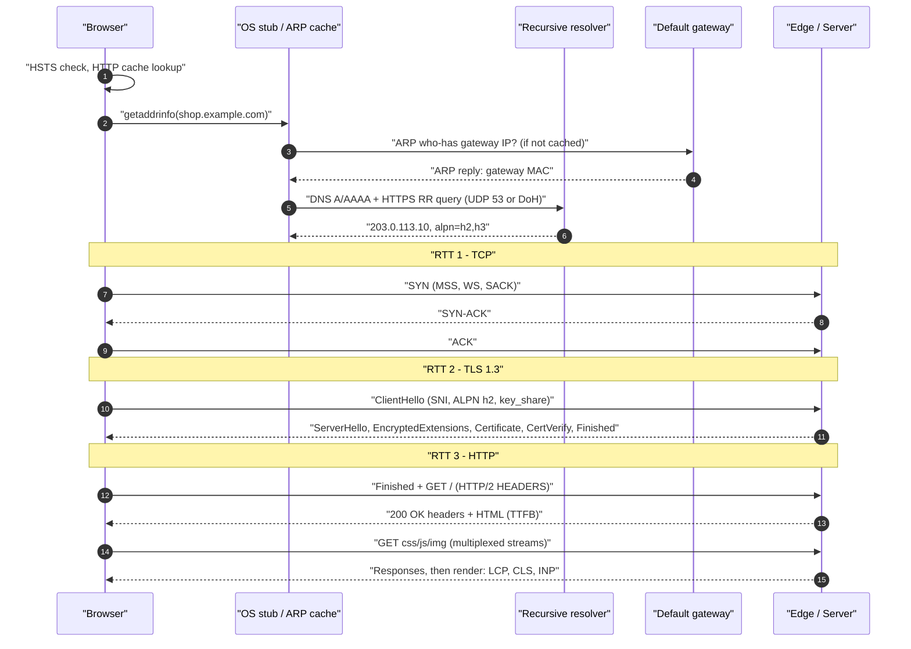
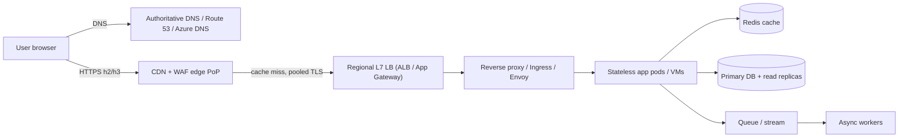
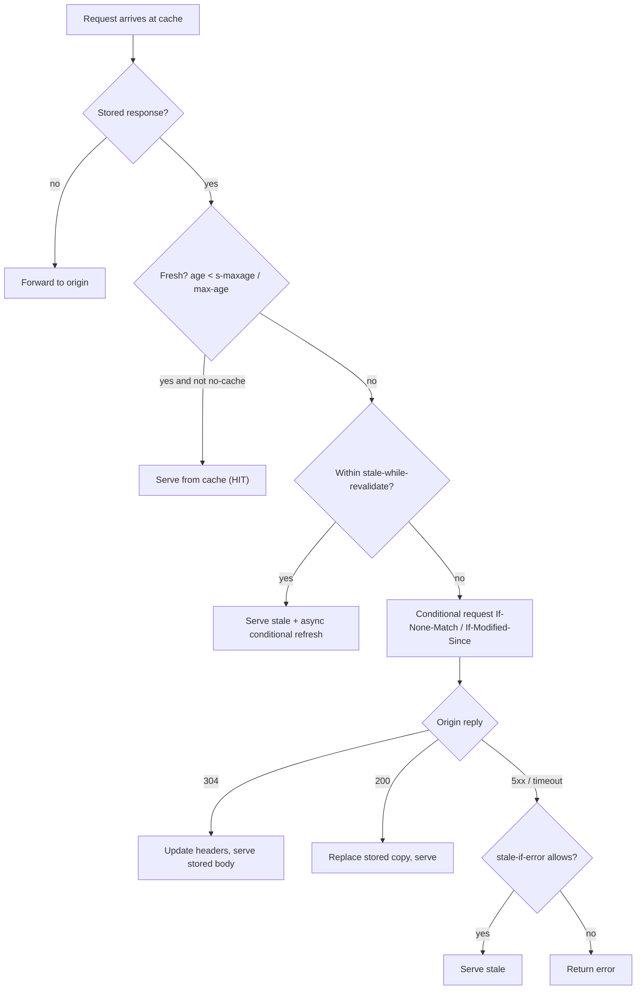
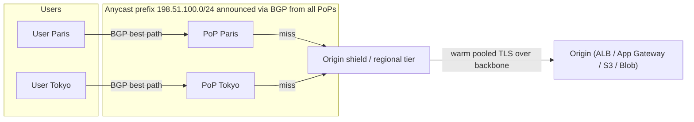
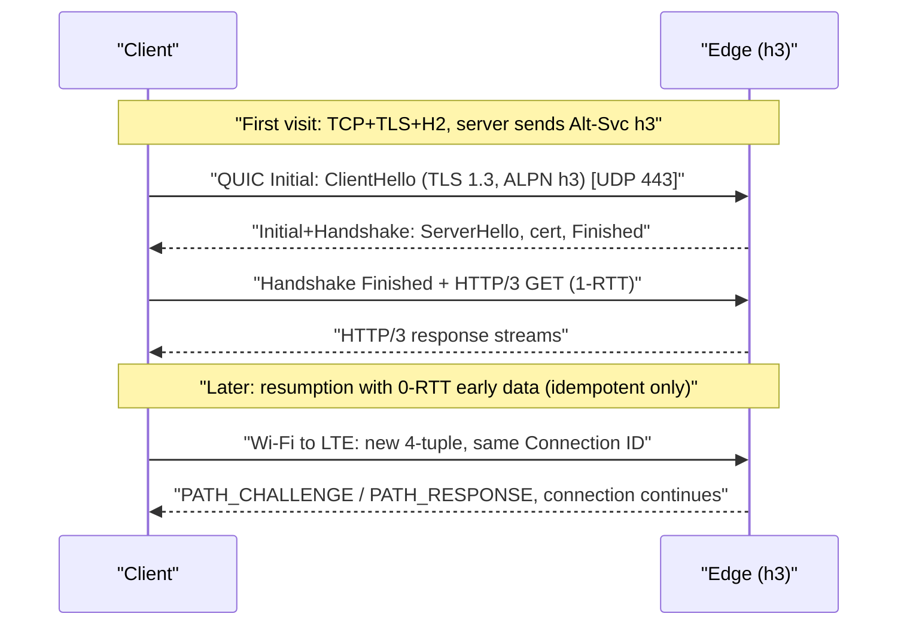

# H6 Web Application Architecture
> Last verified: 2026-10 · Audience: senior/staff DevOps, SRE, AI eng, NetEng, DevSecOps, architects

## TL;DR
- **A cold HTTPS page load costs about 3 RTTs before the first byte**, plus DNS: TCP (1) + TLS 1.3 (1) + HTTP request (1). TLS 1.2 adds one more RTT. HTTP/3 merges transport and crypto into **1 RTT**, or **0-RTT** on resumption. On long-RTT links, **RTT × round trips** usually matters more than bandwidth.
- **Caching is the biggest lever.** Know `no-cache` (store but revalidate every time) vs `no-store` (never store), `s-maxage` (shared caches only), `stale-while-revalidate` (serve stale while refreshing in the background), and `ETag` + `If-None-Match` → **304** (RFC 9111/9110/5861).
- **L7 load balancers and reverse proxies** terminate TLS, route on host, path or header, handle stickiness (cookies such as `AWSALB` and `ApplicationGatewayAffinity`), compress, and cache. Prefer **stateless apps with external session stores** over sticky sessions.
- **TTFB = DNS + connect + TLS + request transit + server think time + first-byte transit.** Split it with `curl -w` or Navigation Timing, then fix the biggest part. "Good" TTFB is ≤0.8 s (web.dev guidance).
- **Throughput ≤ window / RTT.** Socket buffers, window scaling and the initial cwnd (10 MSS) cap single-flow speed. **Chatty apps** (N sequential calls) cost N × RTT whatever the bandwidth.
- **Core Web Vitals (p75):** LCP ≤2.5 s, **INP ≤200 ms** (INP replaced FID in March 2024), CLS ≤0.1.
- **CDNs** cut RTT by terminating close to the user. Most use **anycast + BGP** (Cloudflare). Some steer with DNS instead: Azure Front Door now uses **unicast via Traffic Manager**, and CloudFront mainly uses DNS steering.
- **HTTP/3 status (2026-10):** CloudFront and Cloudflare support it for viewers. **ALB does not** (NLB has had QUIC passthrough since Nov 2025). **Azure Front Door's FAQ lists only HTTP/1.1 and HTTP/2.** App Gateway's HTTP/3 was a 2023 private preview, and its GA is unverified.

## H6.1 How a Browser Connects to the Internet (DNS, ARP, TCP, TLS 1.3, HTTP)
- **How it works (cold load of `https://shop.example.com/`):**
  1. **URL parse and HSTS:** the browser checks the HSTS preload list or a cached HSTS entry and rewrites `http` to `https` internally, with no redirect RTT.
  2. **Caches:** the browser checks its HTTP cache (could be a full hit, so zero network), then its own DNS cache, the OS stub resolver (`systemd-resolved` or `nscd`) and `/etc/hosts`.
  3. **DNS:** the stub sends a recursive query to the resolver (DHCP-provided, or DoH/DoT). The resolver walks root → TLD → authoritative, or answers from cache. Modern browsers also query the **HTTPS/SVCB RR (RFC 9460)**, which can advertise `alpn=h3` and ECH keys. See [H3 DNS](H3-domain-name-system.md).
  4. **Routing and ARP:** if the destination IP is off-subnet, the host ARPs for the **default gateway's MAC** (not the server's), using the ARP cache when it can. IPv6 uses NDP instead. In AWS and Azure the virtual router or hypervisor answers ARP, so there is no real L2 broadcast.
  5. **TCP 3-way handshake (1 RTT):** SYN (MSS, SACK-permitted, window scale, timestamps) → SYN-ACK → ACK. The initial cwnd is **10 MSS ≈ 14.6 KB** (RFC 6928).
  6. **TLS 1.3 (1 RTT, RFC 8446):** the ClientHello carries SNI, ALPN (`h2`, `http/1.1`) and a key_share. The server replies with ServerHello, EncryptedExtensions, Certificate, CertificateVerify and Finished. The client can send the HTTP request **together with its Finished**. PSK resumption allows **0-RTT early data**, which can be replayed.
  7. **HTTP:** the browser sends `GET /` with Host/`:authority`, cookies and `Accept-Encoding`, then gets the response. It parses the HTML, then fetches subresources over the same H2 connection (multiplexed) or up to **6 parallel H1.1 connections per origin**.
  8. **Render:** DOM + CSSOM → layout → paint. LCP, INP and CLS are measured here (see H6.11).
- **RTT budget at 50 ms RTT:** DNS (0–1 RTT) + TCP 50 + TLS 1.3 50 + HTTP 50 = **~150–200 ms before any server time**. With TLS 1.2 it is about 250 ms. With HTTP/3 1-RTT it is about 100 ms, and with 0-RTT about 50 ms.
- **Trade-offs / when to use:** connection reuse (keep-alive, H2 coalescing), `preconnect` / `dns-prefetch` and TLS session resumption remove most of these RTTs on repeat visits.
- **Interview angles:**
  - If asked "what happens when you type a URL", walk through the layers **and give the RTT count**. Mention HSTS, the HTTPS RR, ALPN and SNI.
  - Follow-up "ARP for which MAC?" → the gateway's MAC, unless the destination is on-link.
  - Pitfall: saying TLS 1.3 takes 2 RTTs. It takes 1, and 0-RTT on resumption only covers idempotent requests (RFC 8470 defines `425 Too Early`).



## H6.2 HTTP Request/Response Model
- **How it works:**
  - The semantics are defined in **RFC 9110**. Wire formats are separate: **HTTP/1.1 (RFC 9112)**, **HTTP/2 (RFC 9113)**, **HTTP/3 (RFC 9114)**.
  - A request has a method, a target, headers and an optional body. A response has a status, headers and a body.
  - **Methods:** `GET`, `HEAD` and `OPTIONS` are **safe**. Those plus `PUT` and `DELETE` are **idempotent**. `POST` and `PATCH` are not idempotent, so retry them only with an idempotency key.
  - **Status codes:**
    - 1xx: `103 Early Hints` (RFC 8297) lets the server send `Link: preload` before the real response.
    - 2xx: success.
    - 3xx: `301`/`308` are permanent and `302`/`307` temporary. `307` and `308` preserve the method. `304 Not Modified`.
    - 4xx: `401` vs `403`, `404`, `409`, `412 Precondition Failed`, `421 Misdirected Request` (SNI/Host mismatch or domain fronting), `429` + `Retry-After`.
    - 5xx at a proxy or LB: **502** means the upstream gave an invalid or closed response. **503** means no healthy targets or overload. **504** means the upstream timed out.
  - **H1.1:** text framing. Keep-alive is the default. Pipelining is effectively unused, which leaves **head-of-line (HOL) blocking per connection**, so browsers open 6 connections per origin.
  - **H2:** binary frames, multiplexed streams, HPACK, one connection per origin. TCP-level HOL blocking remains. Server push is deprecated and Chrome removed it in 2022.
  - **H3:** QUIC streams with no cross-stream HOL blocking, and QPACK header compression.
  - **Statelessness:** state lives in cookies (`Secure`, `HttpOnly`, `SameSite`), tokens (Bearer JWT) or server-side sessions.
- **Trade-offs / when to use:** use H2 or H3 from client to edge. Using H1.1 from edge to origin is common and often fine, since those connections are pooled and long-lived. gRPC needs **H2 end to end**.
- **Interview angles:**
  - If asked "502 vs 504 at the ALB" → 502 is the target resetting, closing the connection or sending a malformed response (often an app keep-alive timeout shorter than the LB idle timeout). 504 is the target not answering within the idle timeout.
  - "Why are retries dangerous?" → non-idempotent methods, and retry storms. Use budgets and jittered backoff.
  - Fix for **502s from keep-alive races**: set the **backend keep-alive timeout higher than the LB idle timeout** (ALB default 60 s).

## H6.3 Full Stack Application Flow
- **How it works:** the typical path is Client → DNS → **CDN/WAF edge** → **global LB** (optional) → **regional L7 LB** (TLS terminate, route) → **reverse proxy / ingress / sidecar** → **app tier** (stateless, autoscaled) → **cache** (Redis) → **DB** (primary + replicas) → async **queue/stream** → workers. Observability runs alongside every hop: trace IDs, logs and metrics.
  - **Every hop is a TCP/TLS connection pool with its own timeouts.** Timeouts should **shrink as you go deeper** (edge > LB > app > DB) so the outer layer doesn't give up first and leave orphaned work behind.
  - Client IP is carried hop by hop in `X-Forwarded-For` (each proxy appends), `Forwarded` (RFC 7239), or PROXY protocol v2 on L4 load balancers.
  - Request correlation: `traceparent` (W3C), `X-Amzn-Trace-Id` (ALB), `X-Azure-Ref` (Front Door).
- **Trade-offs / when to use:** each layer adds about 0.5–2 ms in-region and another failure domain. Remove layers that add no feature (for example, App Gateway behind Front Door only makes sense for regional WAF, VNet path routing or connection draining).
- **Interview angles:**
  - "Where would you put the WAF?" → at the edge, so attacks are absorbed globally, and optionally a regional WAF too.
  - "How do you trust X-Forwarded-For?" → only accept it from known proxy CIDRs, and take the right-most untrusted entry.
  - See also [D1 System design basics](../D-system-design/D1-system-design-basics.md) and [C2 Scalability](../C-large-scale-architecture/C2-scalability.md).



## H6.4 Browser Caching (cache-control policies, ETag, proxy and CDN revalidation)
- **How it works (RFC 9111 caching, RFC 9110 conditionals):**

| Directive | Meaning |
|---|---|
| `max-age=N` | Fresh for N s in **any** cache |
| `s-maxage=N` | Overrides `max-age`/`Expires` for **shared** caches (CDN, proxy) only |
| `no-cache` | May store, but **must revalidate before every reuse** (often a cheap 304) |
| `no-store` | Never store anywhere. Use for sensitive responses |
| `private` | Browser only. CDNs must not store it (per-user pages) |
| `public` | Shared caches may store it, even with `Authorization` |
| `must-revalidate` / `proxy-revalidate` | Once stale, never serve without revalidating. Returns 504 if the origin is unreachable |
| `immutable` (RFC 8246) | Don't revalidate even on reload. Use for fingerprinted assets |
| `stale-while-revalidate=N` (RFC 5861) | Serve stale for up to N s while refreshing in the background. This hides origin latency |
| `stale-if-error=N` (RFC 5861) | Serve stale if the origin returns 5xx or is unreachable |

  - **Validators:** `ETag` (strong `"abc"` or weak `W/"abc"`) with `If-None-Match`, and `Last-Modified` with `If-Modified-Since` (1 s resolution). A match returns **304** with no body.
  - **`If-Match` + 412** gives optimistic concurrency for PUT/PATCH.
  - **Heuristic freshness:** with no explicit expiry, caches may use about **10% of (Date − Last-Modified)**. This surprises people. Always set `Cache-Control`.
  - **`Vary`** splits the cache key. `Vary: Accept-Encoding` is fine. `Vary: User-Agent` or `Cookie` wrecks the hit ratio.
  - **CDN-specific headers:** `CDN-Cache-Control` (RFC 9213) and `Surrogate-Control` give a CDN its TTL separately from the browser's.
- **Recommended policy:**
  - **HTML:** `Cache-Control: no-cache` (or a short `s-maxage` + `stale-while-revalidate`) with an ETag.
  - **Fingerprinted JS/CSS (`app.3f9a.js`):** `public, max-age=31536000, immutable`.
  - **APIs:** `private, no-cache`, or `no-store` for PII.
- **Proxy and CDN revalidation:** when a CDN's copy goes stale it sends a conditional request to the origin and gets back a 304 header-only response, which saves origin egress and CPU.
  - CloudFront converts a strong ETag to **weak** when it compresses a response.
  - **Azure Front Door's FAQ says it does not support ETag**, so plan revalidation there around TTL and purge.
- **Interview angles:**
  - If asked "`no-cache` vs `no-store`" → `no-cache` still caches and revalidates. `no-store` never stores.
  - "Deploy rolled out but users see old JS" → HTML was cached with a long TTL. Use fingerprinted assets plus `no-cache` HTML, or purge.
  - Pitfall: caching `Set-Cookie` responses, or per-user data on a shared cache. Many CDN caching incidents involve leaked personalized pages.
  - Merge-by-reference: caching strategy depth is in [C1 Performance](../C-large-scale-architecture/C1-performance.md) (C1.26–C1.30), [C6 Technology stack](../C-large-scale-architecture/C6-technology-stack.md) (C6.18–C6.21) and [D1](../D-system-design/D1-system-design-basics.md) (D1.14, D1.15).



## H6.5 Data Center Load Balancers (L7 routing, HTTPS termination, sticky sessions)
- **How it works:**
  - **L7 routing:** match rules on host, path, headers, method, query string or source IP, then use weighted forwarding to target groups (blue/green, canary).
  - **HTTPS termination:** the LB holds the certificate (ACM / Key Vault). It serves multiple certs via SNI and offers TLS policies (min TLS 1.2, TLS 1.3 policies). It can **re-encrypt** to the backend (end-to-end TLS) or do **mTLS** to the client.
  - **Health checks** with thresholds, **connection draining / deregistration delay** (ALB default **300 s**, range 0–3600), and **slow start** (ALB 30–900 s, off by default).
  - **ALB algorithms:** `round_robin` (default), `least_outstanding_requests`, `weighted_random` + **anomaly mitigation**.
  - **Sticky sessions:**
    - **ALB duration-based:** LB cookie **`AWSALB`** (+ `AWSALBCORS`). Duration is 1 s–7 days, default 1 day.
    - **ALB application-based:** your app cookie, with the LB tracking it in **`AWSALBAPP`**. Names with the prefixes `AWSALB`, `AWSALBAPP` or `AWSALBTG` are reserved.
    - **ALB target-group stickiness** for weighted forwards uses **`AWSALBTG`**.
    - **App Gateway:** **`ApplicationGatewayAffinity`** plus **`ApplicationGatewayAffinityCORS`** (`SameSite=None; Secure`) for cross-site contexts.
  - **ALB protocol support:** H2 and gRPC end to end via the target-group protocol version (HTTPS listener only, **max 128 streams per client H2 connection**). **No HTTP/3 on ALB.**
  - **App Gateway v2 protocol support:** H2 to clients only, **always HTTP/1.1 to backends**. **No gRPC on classic App Gateway.** gRPC is supported on **Application Gateway for Containers**.
  - **Timeouts:**
    - App Gateway keep-alive is 120 s for H1.1 and 180 s for H2. Its TCP idle timeout defaults to 4 min.
    - The ALB idle timeout defaults to 60 s.
    - App Gateway requires TLS 1.2+ since **2025-08-31** (TLS 1.0/1.1 retired). TLS 1.3 needs v2 + a 2022 policy.
- **Trade-offs / when to use:**
  - Sticky sessions break even distribution ("hot" targets), lose sessions on target failure, and fight autoscale-in.
  - **Prefer stateless app + external session store** (Redis / DynamoDB / Cosmos DB). Reserve stickiness for legacy stateful apps, WebSocket affinity, or local-cache warmth.
  - TLS termination at the LB centralizes certs and WAF inspection but leaves plaintext inside the VPC. Compliance often demands re-encryption.
- **Interview angles:**
  - "L4 vs L7?" → L4 (NLB / Azure LB) handles TCP/UDP flows, preserves the source IP, is ultra-low latency, and has static IPs. L7 understands HTTP for routing, WAF, auth and stickiness. See [F6](../F-network-engineering/F6-network-performance.md) (F6.8, F6.9) and [C2](../C-large-scale-architecture/C2-scalability.md) (C2.26).
  - "Users randomly logged out" → stickiness lost after a target was replaced or the cookie expired, or the cookie was blocked by SameSite rules.
  - "gRPC behind Azure?" → use App Gateway for Containers, AKS ingress or Envoy. Classic App Gateway and Front Door only speak H1.1 to backends.

## H6.6 Reverse Proxy Server Operation (TLS offloading, caching, compression)
- **How it works:** a reverse proxy (nginx, Envoy, HAProxy, Traefik, or a cloud LB/CDN) accepts client connections, terminates TLS, and keeps **pooled keep-alive upstream connections**. This turns many short client connections into a few long ones. It also buffers slow clients ("slowloris" protection), rewrites headers, rate-limits and caches.
  - **TLS offload:** moves handshake CPU (ECDHE + signature) off the app. Session tickets and resumption cut repeat cost. TLS 1.3 + ECDSA certs are cheaper than RSA-2048 signing.
  - **Caching:** a micro-cache (1–10 s) on hot dynamic endpoints can absorb huge read spikes. Collapse concurrent misses (nginx `proxy_cache_lock`; CDN request collapsing) to avoid **thundering herds**.
  - **Compression (`Content-Encoding`):**

| Codec | Spec | Notes |
|---|---|---|
| gzip | RFC 1952 | Universal; levels 1–9; ~70% reduction on text |
| Brotli (`br`) | RFC 7932 | ~15–25% smaller than gzip on text; browsers only advertise it over HTTPS; high levels (10–11) for **static pre-compression** |
| Zstandard (`zstd`) | RFC 8878 (+ RFC 9659 window limit for HTTP) | Fast compress/decompress at Brotli-like ratios; Chrome since v123 (2024); good for dynamic content |

  - Don't recompress JPEG, PNG, WebP, MP4 or WOFF2. Always send `Vary: Accept-Encoding`.
  - CloudFront compresses only **1,000–10,000,000 byte** objects with an allow-listed `Content-Type`, and only **gzip and Brotli** (prefers Brotli). It does not compress zstd (it passes through what the origin compressed).
  - **Cloudflare** supports gzip, Brotli and **zstd** to visitors. Its default per plan as of 2026: Free = zstd, Pro/Business = Brotli, Enterprise = gzip. It fetches from the origin with `br, gzip`.
  - **Azure Front Door** does no dynamic compression above 8 MB.
- **Trade-offs / when to use:**
  - Compression trades CPU for bytes. It's most valuable on high-RTT or low-bandwidth paths and on pay-per-GB egress.
  - **BREACH-class attacks:** compressing responses that reflect user input alongside secrets leaks the secrets. Mitigate with per-request CSRF token masking, or by disabling compression on those responses.
- **Interview angles:**
  - "Why put nginx in front of Gunicorn/Node?" → slow-client buffering, TLS, static files, keep-alive pooling, compression and caching.
  - "Brotli vs zstd?" → Brotli for pre-compressed static assets, zstd for on-the-fly dynamic responses. Check what the CDN supports.
  - TLS depth: [H4 TLS](H4-transport-layer-security.md), [I2](../I-dns-tls-acceleration-gaps/I2-tls-and-certificates.md).

## H6.7 TCP Socket Buffers
- **How it works:**
  - Each socket has a **receive buffer** (unread data plus the advertised window) and a **send buffer** (unacked plus unsent data).
  - **Single-flow throughput ≤ min(rwnd, cwnd) / RTT.** Buffers must be ≥ **BDP = bandwidth × RTT**. Example: 1 Gbit/s × 80 ms = **10 MB**.
  - Linux sysctls are `net.ipv4.tcp_rmem` / `tcp_wmem` (min default max). Typical defaults are `4096 131072 6291456` (rmem) and `4096 16384 4194304` (wmem), and they vary by distro and kernel.
  - **Autotuning** (`tcp_moderate_rcvbuf=1`) grows the buffer up to the max. **Setting `SO_RCVBUF` disables autotuning** for that socket. The kernel doubles the value you set, and it is capped by `net.core.rmem_max`.
  - **Window scaling (RFC 7323)** is required for windows above 64 KB. It is negotiated only in SYN/SYN-ACK, so middleboxes that strip the option cap you at 64 KB.
  - Without scaling: 64 KB / 100 ms ≈ **5.2 Mbit/s**, whatever the link speed.
  - **`ss -tmi`** shows `skmem` (rb/tb), cwnd, rtt and retrans. A **Recv-Q** that keeps growing means the app isn't reading. A large **Send-Q** means the peer or network is slow.
- **Trade-offs / when to use:**
  - Large buffers cost memory per connection (100k connections × 4 MB is huge) and can add **bufferbloat** latency.
  - Prefer autotuning + **BBR** + `fq` qdisc for long fat pipes. Leave defaults for typical web servers. Tune only for bulk or high-BDP transfers (replication, backups, cross-region).
- **Interview angles:**
  - "Cross-region copy only gets 50 Mbit/s on a 10G link" → BDP/window limit. Check scaling, rmem max, and loss (CUBIC collapses on loss), or use parallel streams.
  - Merge-by-reference: [A7 Socket management](../A-operating-systems/A7-socket-management.md) (A7.1) and [F4 TCP](../F-network-engineering/F4-transmission-control-protocol.md) (F4.9).

## H6.8 Application Troubleshooting Basics
- **How it works (layered triage, outside-in):**
  1. **Scope:** is it all users or some (region, ISP, browser)? All endpoints or one? When did it start, and what changed (deploy, cert, DNS, WAF rule)?
  2. **DNS:** `dig +trace`, check the TTL, compare resolvers (8.8.8.8 vs corporate), check the HTTPS RR.
  3. **Connectivity:** `nc -vz host 443`, `mtr -T -P 443`, security groups / NSGs / NACLs.
  4. **TLS:** `openssl s_client -connect h:443 -servername h -alpn h2`. Check chain, expiry, SNI and ALPN.
  5. **HTTP:** `curl -v --resolve` to pin one backend, compare edge vs origin, look at status codes and headers (`Age`, `X-Cache`, `Via`, `cf-cache-status`, `x-amz-cf-pop`).
  6. **Server:** LB metrics (ALB `TargetResponseTime`, `HTTPCode_ELB_5XX` vs `HTTPCode_Target_5XX`; App Gateway `BackendResponseStatus`), app logs and traces by request ID, saturation (CPU, GC, thread or connection pools, DB locks).
  7. **Client:** DevTools waterfall, HAR file, RUM (CrashReport / CWV).
- **Trade-offs / when to use:** synthetic probes find outages and RUM finds real-user pain. Use both. Packet captures are a last resort, and TLS makes them hard (use `SSLKEYLOGFILE`).
- **Interview angles:**
  - "ELB 5xx vs Target 5xx" → ELB 5xx means the LB generated it (no healthy targets, 502/504). Target 5xx means the app returned it.
  - Always state your hypothesis per layer, and **change one thing at a time**.
  - Tools depth: [H1](H1-linux-network-diagnostics.md), [H2](H2-troubleshooting-your-network.md), [F8 Wireshark](../F-network-engineering/F8-analyzing-protocols-with-wireshark.md).

## H6.9 Time to First Byte (Server Delay)
- **How it works:** TTFB runs from the request start to the first response byte. Navigation Timing gives `responseStart − startTime`, which includes redirects, DNS, TCP, TLS, request transit, **server think time** and first-byte transit.
  - **Decomposition with curl:** `time_namelookup` → `time_connect` (TCP) → `time_appconnect` (TLS) → `time_starttransfer` (TTFB) → `time_total`.
  - **Server time ≈ starttransfer − appconnect − 1 RTT.**
  - The **`Server-Timing`** response header (W3C) can expose `db;dur=53, app;dur=47` to DevTools and RUM.
  - web.dev guidance: TTFB "good" ≤**0.8 s** and "poor" >1.8 s at p75. It is a diagnostic, not a Core Web Vital.
  - **Server-side causes:** cold starts (Lambda/Functions), DB queries / N+1, lock waits, GC pauses, thread-pool exhaustion, upstream fan-out (the slowest dependency dominates), disk I/O (see [H5](H5-network-performance-deep-dive.md) H5.4), and **CDN miss → origin** (cache-hit TTFB of ~20–50 ms vs miss 300+ ms).
- **Trade-offs / when to use:**
  - **Streaming / early flush** of the `<head>` and **103 Early Hints** improve perceived TTFB and LCP even when the backend is slow.
  - Edge rendering and caching trade freshness for TTFB.
- **Interview angles:**
  - "TTFB is 1.2 s, what do you do?" → split network from server using curl timings from near the origin. If server time dominates, trace it (APM spans). If network dominates, add a CDN or edge termination, reuse connections, and enable TLS resumption.
  - Pitfall: measuring TTFB from inside the VPC and declaring "fast". Real users add RTT × handshakes.

## H6.10 Application Chattiness (round trips, send window, RTT)
- **How it works:**
  - **Latency of a sequential workflow ≈ N_round_trips × RTT + Σ server time.**
    - A page that makes **40 sequential API calls** at 100 ms RTT costs ≥ **4 s** of pure network wait, even on 10 Gbit/s.
    - A DB client doing **500 row-by-row queries** cross-region (60 ms RTT) costs **30 s**, against 60 ms for a batch.
  - **Slow start** turns a large response into several RTTs. Initial cwnd is 10 MSS ≈ 14.6 KB, so a 200 KB response needs about **4 RTTs** at minimum (14.6 → 29 → 58 → 117 KB cumulative ≈ 219 KB) on a new connection.
  - **Send window:** throughput ≤ window / RTT (see H6.7). Small app-level windows have the same effect: request/ack protocols such as SMB1 or naive file copy with 64 KB blocks.
- **Trade-offs / when to use (fixes):** batch and bulk APIs, GraphQL/BFF aggregation, parallelize independent calls, H2 multiplexing, keep-alive and connection pooling, co-locate the app with its DB (**same region/AZ**), cache, move compute to the edge, reduce redirects, inline critical CSS. The cost is more complex APIs and bigger payloads.
- **Interview angles:**
  - "App works in us-east-1 but is slow from Sydney" → RTT × chattiness. Count round trips in the HAR file. Fixes: batch, an edge proxy with persistent origin connections, or a regional deployment.
  - "Lift-and-shift app is slow after moving the DB to cloud while the app stays on-prem" → classic chatty ORM over a WAN. Move them together.
  - Latency depth: [C1](../C-large-scale-architecture/C1-performance.md) (C1.6–C1.15), [F6](../F-network-engineering/F6-network-performance.md), [H5](H5-network-performance-deep-dive.md).

## H6.11 Web Page Load Time (PLT)
- **How it works:**
  - The classic **PLT** is the `load` event (all subresources done). `DOMContentLoaded` fires after HTML is parsed and deferred scripts have run.
  - The modern, user-centric measure is **Core Web Vitals** at **p75**, split by mobile and desktop:

| Metric | Measures | Good | Poor |
|---|---|---|---|
| **LCP** Largest Contentful Paint | Loading | ≤2.5 s | >4.0 s |
| **INP** Interaction to Next Paint | Responsiveness (all interactions) | ≤200 ms | >500 ms |
| **CLS** Cumulative Layout Shift | Visual stability | ≤0.1 | >0.25 |

  - **INP replaced FID as a Core Web Vital on 2024-03-12.** FID measured only the *first* input's delay. INP covers input delay + processing + presentation for interactions across the whole visit.
  - Supporting metrics: TTFB, FCP (good ≤1.8 s), TBT (lab).
  - **LCP sub-parts:** TTFB + resource load delay + resource load time + element render delay.
- **Trade-offs / when to use (levers):**
  - **Fewer critical-path RTTs:** preconnect, `103 Early Hints`, preload the LCP image, `fetchpriority=high`.
  - **Fewer render-blocking bytes:** defer/async JS, critical CSS, Brotli/zstd.
  - **INP:** break up long tasks (>50 ms), yield to the main thread, use less third-party JS.
  - **CLS:** set width/height on media, reserve ad slots, `font-display` with metric overrides.
  - **Lab vs field:** Lighthouse (lab) vs CrUX / RUM (field). Google ranking uses field data.
- **Interview angles:**
  - "Infra levers for LCP?" → CDN, HTTP/3, cache HTML at the edge with SWR, image CDN (AVIF/WebP, resize), TLS resumption, lower TTFB.
  - "Is FID still a metric?" → no. It was deprecated and replaced by INP in 2024.

## H6.12 Content Delivery Network (CDN) (edge servers, IP anycast, BGP)
- **How it works:**
  - **Edge PoPs** terminate TCP/TLS close to users (low handshake RTT). They cache static and cacheable dynamic content, and hold **warm, persistent connections** to the origin over the provider backbone, which is **dynamic site acceleration** even for uncacheable APIs.
  - **Tiered caching / origin shield** (CloudFront Regional Edge Caches + Origin Shield, Cloudflare Tiered Cache) collapses misses so the origin sees one fetch instead of N PoP fetches.
  - **Routing users to a PoP:**
    - **IP anycast + BGP:** the same prefix is announced from every PoP, and BGP sends each user to the "closest" PoP by **AS-path and policy**, which is not necessarily lowest latency. Failover is automatic when a PoP withdraws its route. TCP and QUIC over anycast work because routes are stable over flow lifetimes, and QUIC CIDs help further. Cloudflare is the canonical all-anycast network. Anycast also absorbs DDoS across all PoPs.
    - **DNS-based steering:** the authoritative DNS returns a PoP unicast IP based on resolver location, latency maps and health. It is more granular but depends on the **resolver's location** (EDNS Client Subnet helps) and on TTLs. **CloudFront** steers mainly by DNS. CloudFront also offers **Anycast Static IPs** (launched about late 2024, *unverified detail*). **Azure Front Door's FAQ (2026) says it now uses unicast via Front Door's Traffic Manager, which "replaced the Anycast routing method" it previously used.**
  - **Cache key hygiene:** normalize query strings, avoid caching on cookies and headers, and set a high cache-hit ratio target (>90% for static).
  - **Purge:** CloudFront invalidations (first 1,000 paths/month free). AFD purge takes about 10 min, with up to 100 URLs per request. Cloudflare purge is near-instant.
- **Trade-offs / when to use:**
  - CDN wins: latency, offload, DDoS/WAF at the edge, TLS at the edge.
  - CDN costs: stale content risk, cache poisoning / leaked personalized content, debugging across one more layer, egress cost model.
  - Don't chain two CDNs (Microsoft explicitly advises against it).
- **Interview angles:**
  - "How does anycast pick the PoP, and is it the lowest latency?" → BGP best path, not latency. Explain hot-potato routing and why DNS steering can be more precise.
  - "Anycast with TCP, isn't that unsafe?" → route flaps mid-flow are rare. Modern stacks use consistent hashing and connection tracking inside the PoP.
  - Merge-by-reference: [C6](../C-large-scale-architecture/C6-technology-stack.md) (C6.15), [D1](../D-system-design/D1-system-design-basics.md) (D1.14), [I3 Acceleration](../I-dns-tls-acceleration-gaps/I3-acceleration.md), [F7 Routing](../F-network-engineering/F7-network-routing.md).



## H6.13 HTTP/3 (QUIC)
- **How it works:**
  - **QUIC (RFC 9000)** is a transport over **UDP/443** with built-in **TLS 1.3 (RFC 9001)** and loss recovery / congestion control in user space (RFC 9002). **HTTP/3 (RFC 9114)** maps HTTP semantics onto QUIC streams and uses **QPACK** (RFC 9204) for headers.
  - **Handshake:** **1 RTT** for transport and crypto combined (vs TCP + TLS 1.3 = 2 RTT). **0-RTT** on resumption sends early data in the first flight. **That data can be replayed**, so allow only idempotent requests and answer `425 Too Early` otherwise.
  - **No transport-level HOL blocking:** loss on one stream doesn't stall the others, which is the H2-over-TCP problem. The gain is largest on lossy or mobile networks.
  - **Connection migration:** the connection is identified by **Connection IDs**, not the 4-tuple, so Wi-Fi → LTE switches or NAT rebinding don't break it. Path validation uses PATH_CHALLENGE/RESPONSE. **LBs must route on CID** (QUIC-LB draft). AWS NLB QUIC passthrough (Nov 2025) uses the CID for stickiness.
  - **Encrypted headers and packet numbers** make middlebox ossification hard. Network ops lose TCP-level visibility (no SYN/ACK RTT from passive taps). The spin bit is optional.
  - **Discovery:** the first visit uses TCP + H2. The server advertises `Alt-Svc: h3=":443"; ma=86400`, or the HTTPS DNS RR advertises `alpn=h3`. The browser then races QUIC.
  - **Fallback when UDP/443 is blocked or throttled** (corporate firewalls, some middleboxes): browsers race and fall back to TCP (happy-eyeballs style) and remember the failure for a while.
- **Trade-offs / when to use:**
  - QUIC costs more **CPU per byte** than kernel TCP + TLS offload. It needs UDP GSO/GRO and larger UDP buffers (`net.core.rmem_max`), and is subject to UDP rate-limiting by ISPs.
  - Debugging needs qlog, or `SSLKEYLOGFILE` + Wireshark.
  - Enable it at the **edge** (CDN). Origins rarely need it, because edge → origin connections are pooled and long-lived.
- **Per-service HTTP/3 status (2026-10):**

| Service | HTTP/3 to clients | Notes |
|---|---|---|
| CloudFront | **Yes** (since Aug 2022; `http2and3`) | Viewer side only; requires TLS 1.3 + SNI; origin fetches HTTP/1.1 (gRPC origins excepted, *unverified detail*) |
| Cloudflare | **Yes** (default on, all plans) | Also 0-RTT option, zstd, anycast |
| AWS ALB | **No** | H1.1/H2/gRPC only |
| AWS NLB | **QUIC passthrough** (Nov 2025) | Terminates nothing; CID-based stickiness; targets terminate QUIC |
| Azure Front Door Std/Premium | **Not listed** | FAQ (Aug 2026): "HTTP, HTTPS, and HTTP/2"; some third-party blogs claim h3, but this is *unverified* officially |
| Azure App Gateway v2 | **Private preview (2023)** | Current GA status *unverified* |
| GCP external ALB | Yes (since 2021) | Canonical alternative |

- **Interview angles:**
  - "Why is QUIC faster?" → 1-RTT/0-RTT handshakes, no cross-stream HOL blocking, and connection migration. It is *not* faster on clean, low-RTT wired links, and can be slower because of CPU cost.
  - "Users behind a corporate proxy don't get H3" → UDP/443 is blocked, and fallback is expected.
  - "0-RTT risks?" → replay. Never send non-idempotent requests in 0-RTT.



## Cloud mapping: AWS vs Azure

| Capability | AWS | Azure | Role it plays | Key differences | Alternatives |
|---|---|---|---|---|---|
| Regional L7 LB | **Application Load Balancer** | **Application Gateway v2** (+ App Gateway for Containers) | TLS termination, path/host routing, stickiness, WAF | ALB: H2 + **gRPC end to end**, no H3. AppGW: H2 frontend only, **H1.1 to backends**, no gRPC (AGC has gRPC), HTTP/3 preview | NGINX/Envoy ingress on K8s, GCP external ALB |
| L4 LB | **Network Load Balancer** | **Azure Load Balancer** | TCP/UDP pass-through, static IPs, source IP preservation | NLB supports **QUIC passthrough** + TLS listeners. Azure LB is pure L4 (no TLS) | HAProxy, MetalLB |
| Global edge / CDN | **CloudFront** (+ Global Accelerator for anycast L4) | **Azure Front Door Std/Premium** (global L7 + CDN + WAF) | Edge TLS, caching, DSA, global failover | CloudFront: H3, gzip+br, ETag revalidation, many origins types. AFD: H1.1/H2 only, **no ETag, no gRPC**, unicast PoP selection, Premium adds Private Link origins | **Cloudflare** (anycast, H3, zstd), Akamai, Fastly |
| Legacy CDN | — | **Azure CDN Standard from Microsoft (classic)**: no new profiles since 2025-08-15, **retires 2027-09-30**. **Edgio tier retired 2025-01-15**; Akamai tier retired earlier. **Front Door classic retires 2027-03-31** | — | Migrate to AFD Std/Premium | Cloudflare, Akamai (Marketplace) |
| WAF | AWS WAF (on CloudFront/ALB/API GW) | Azure WAF (on AFD/App GW) | L7 filtering | Rule-group vs managed-ruleset policy models | Cloudflare WAF |
| Certificates | ACM | Key Vault / AFD managed certs | TLS certs for termination | ACM certs are non-exportable (public). AFD classic managed certs retired 2026-04-14 | Let's Encrypt + cert-manager |
| DNS steering | Route 53 (latency/geo/failover) | Azure DNS + Traffic Manager | Directs users to region/PoP | TM is DNS-only global LB; AFD uses TM internally | Cloudflare DNS / LB, NS1 |

- **ALB vs App Gateway:**
  - Both are regional, zone-redundant L7 load balancers with cookie stickiness (`AWSALB*` vs `ApplicationGatewayAffinity*`), SNI multi-cert support, end-to-end TLS and connection draining.
  - **ALB:** pay-per-LCU. Lambda targets, OIDC/Cognito auth, mTLS. Deregistration delay defaults to 300 s.
  - **App Gateway v2:** capacity units with autoscale. Its own subnet is required. Rewrites, WAF_v2 SKU, private-only deployment option. TLS 1.0/1.1 retired 2025-08-31.
- **CloudFront vs Front Door:**
  - Both are global with per-request/GB pricing. AFD adds a **base fee per profile**.
  - AFD includes **global L7 load balancing across regions with health probes** and session affinity. In AWS the equivalent is CloudFront origin failover + Route 53 / Global Accelerator.
  - AFD config propagation takes up to about 15 min per operation, and purge about 10 min.
- **Cloudflare** is the reference anycast CDN: every PoP announces every IP, H3 + 0-RTT, zstd, Tiered Cache, Workers at the edge. It is a common cloud-agnostic alternative in front of either ALB or App Gateway.

## Hands-on (optional)
```bash
# TTFB decomposition (DNS / TCP / TLS / TTFB / total)
curl -so /dev/null -w 'dns=%{time_namelookup} tcp=%{time_connect} tls=%{time_appconnect} ttfb=%{time_starttransfer} total=%{time_total} http=%{http_version}\n' https://example.com/

# Revalidation check: grab ETag, then conditional GET (expect 304)
etag=$(curl -sI https://example.com/app.js | awk -F': ' 'tolower($1)=="etag"{print $2}' | tr -d '\r')
curl -sI -H "If-None-Match: $etag" https://example.com/app.js | head -1

# Cache / CDN headers and compression negotiation
curl -sI -H 'Accept-Encoding: zstd, br, gzip' https://example.com/ | grep -iE 'cache-control|age|etag|vary|content-encoding|x-cache|cf-cache-status|alt-svc'

# Try HTTP/3 (curl built with HTTP/3 support)
curl --http3-only -sI https://cloudflare.com/ | head -1

# Socket buffers / BDP check
sysctl net.ipv4.tcp_rmem net.ipv4.tcp_wmem net.core.rmem_max net.ipv4.tcp_window_scaling
ss -tmi state established '( dport = :443 )' | head -20
```

```hcl
# ALB target group: least-outstanding-requests, slow start, duration-based stickiness
resource "aws_lb_target_group" "web" {
  name                          = "web-tg"
  port                          = 8080
  protocol                      = "HTTP"
  vpc_id                        = var.vpc_id
  load_balancing_algorithm_type = "least_outstanding_requests"
  slow_start                    = 60
  deregistration_delay          = 30

  stickiness {
    type            = "lb_cookie" # cookie AWSALB
    cookie_duration = 3600
    enabled         = true
  }

  health_check {
    path    = "/healthz"
    matcher = "200"
  }
}
```

## Cross-links
- [H3 Domain Name System](H3-domain-name-system.md) · [H4 Transport Layer Security](H4-transport-layer-security.md) · [H5 Network performance deep dive](H5-network-performance-deep-dive.md) · [H1 Linux network diagnostics](H1-linux-network-diagnostics.md) · [H2 Troubleshooting your network](H2-troubleshooting-your-network.md)
- Caching: [C1 Performance](../C-large-scale-architecture/C1-performance.md) (C1.26–C1.30) · [C2 Scalability](../C-large-scale-architecture/C2-scalability.md) (C2.16) · [C6 Technology stack](../C-large-scale-architecture/C6-technology-stack.md) (C6.18–C6.21) · [D1 System design basics](../D-system-design/D1-system-design-basics.md) (D1.14, D1.15)
- CDN: [C6](../C-large-scale-architecture/C6-technology-stack.md) (C6.15) · [I3 Acceleration](../I-dns-tls-acceleration-gaps/I3-acceleration.md)
- Load balancing: [C2](../C-large-scale-architecture/C2-scalability.md) (C2.26) · [D1](../D-system-design/D1-system-design-basics.md) (D1.3–D1.5) · [F6 Network performance](../F-network-engineering/F6-network-performance.md) (F6.8, F6.9)
- Sockets: [A7 Socket management](../A-operating-systems/A7-socket-management.md) (A7.1) · [F4 TCP](../F-network-engineering/F4-transmission-control-protocol.md) (F4.9)
- TLS: [C4 Security](../C-large-scale-architecture/C4-security.md) (C4.5–C4.11) · [F5 Popular protocols](../F-network-engineering/F5-popular-networking-protocols.md) (F5.2, F5.3) · [I2 TLS and certificates](../I-dns-tls-acceleration-gaps/I2-tls-and-certificates.md)
- Edge networking: [G13 Managed global WAN](../G-cloud-network-architecture/G13-managed-global-wan.md) · [F7 Network routing](../F-network-engineering/F7-network-routing.md) · SLO view of latency: [J1](../J-sre/J1-slis-slos-error-budgets.md)

## Sources
- https://docs.aws.amazon.com/elasticloadbalancing/latest/application/load-balancer-target-groups.html
- https://docs.aws.amazon.com/elasticloadbalancing/latest/application/sticky-sessions.html
- https://aws.amazon.com/about-aws/whats-new/2025/11/aws-network-load-balancer-quic-passthrough-mode/
- https://docs.aws.amazon.com/AmazonCloudFront/latest/DeveloperGuide/ServingCompressedFiles.html
- https://docs.aws.amazon.com/AmazonCloudFront/latest/DeveloperGuide/DownloadDistValuesGeneral.html
- https://aws.amazon.com/about-aws/whats-new/2022/08/amazon-cloudfront-supports-http-3-quic/
- https://learn.microsoft.com/en-us/azure/frontdoor/front-door-faq
- https://learn.microsoft.com/en-us/azure/application-gateway/application-gateway-faq
- https://learn.microsoft.com/en-us/azure/cdn/edgio-retirement-faq
- https://learn.microsoft.com/azure/cdn/classic-cdn-retirement-faq
- https://learn.microsoft.com/en-us/azure/application-gateway/for-containers/grpc
- https://developers.cloudflare.com/speed/optimization/content/compression/
- https://web.dev/articles/vitals
- RFCs: https://www.rfc-editor.org/rfc/rfc9110 · rfc9111 · rfc9112 · rfc9113 · rfc9114 · rfc9000 · rfc9001 · rfc8446 · rfc5861 · rfc8246 · rfc9213 · rfc9460 · rfc8470 · rfc6928 · rfc7323 · rfc8878 · rfc7932
