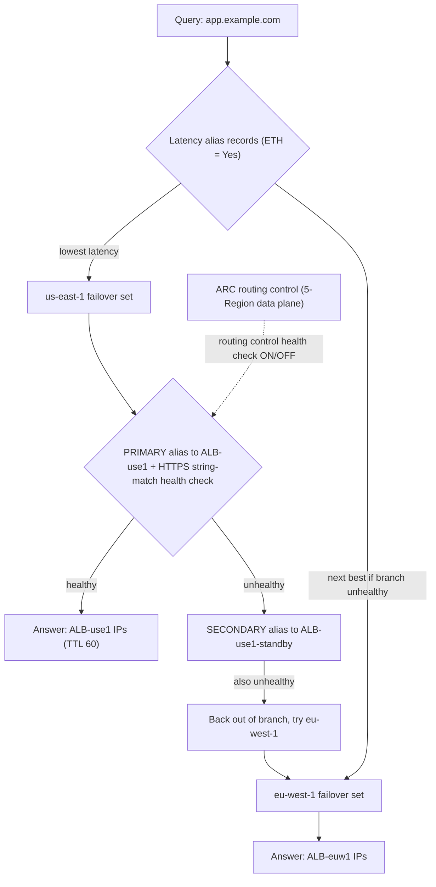
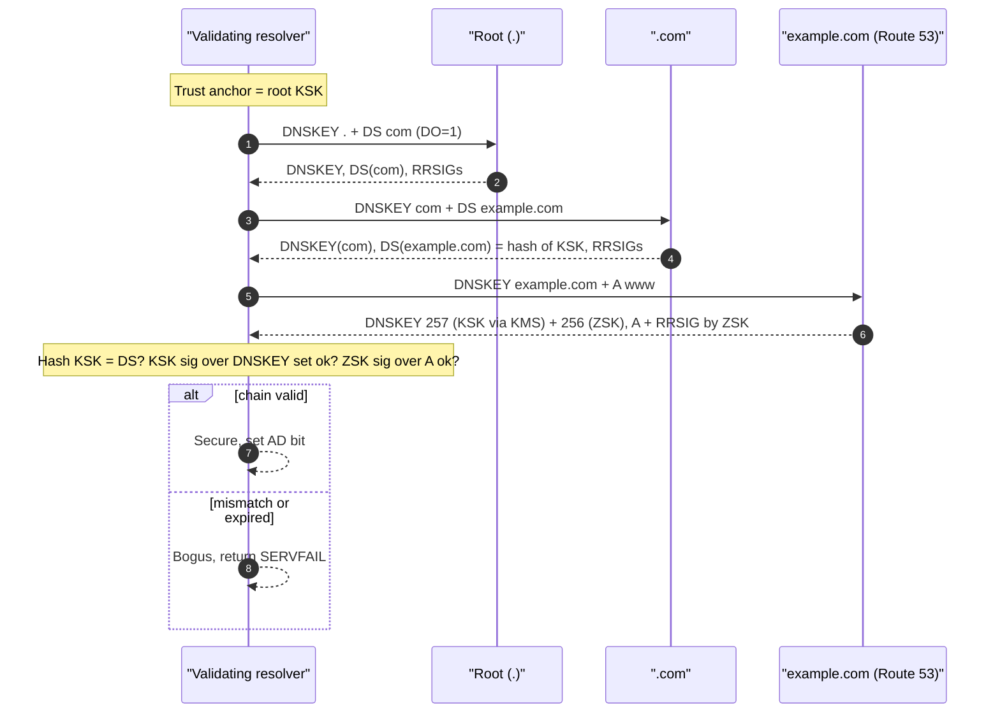
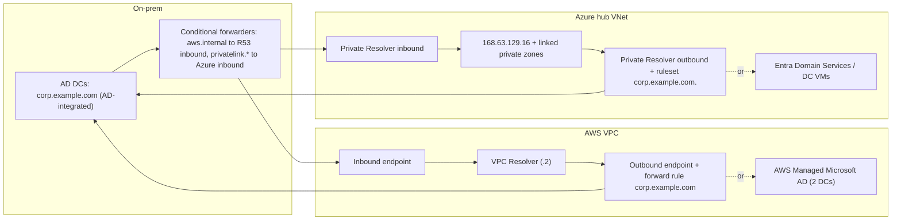

# I1 DNS
> Last verified: 2026-10 · Audience: senior/staff DevOps, SRE, AI eng, NetEng, DevSecOps, architects

> Scope: the gap topics the courses skip, which are provider alias records, DNS traffic steering, split-horizon, DNSSEC and AD-integrated DNS. Basics (resolution path, record types, dig/nslookup) are in [H3](../H-full-stack-troubleshooting/H3-domain-name-system.md) and [F5.1](../F-network-engineering/F5-popular-networking-protocols.md#f51-dns). Cloud resolvers, private zones and resolver endpoints are in [G3](../G-cloud-network-architecture/G3-network-dns-and-dhcp.md). This file links to those rather than repeating them.

## TL;DR
- **A CNAME can't sit at the zone apex** (RFC 1034: a CNAME can't share a name with other data, and the apex always has SOA and NS). Providers work around this in different ways:
  - **Route 53 alias**: synthesizes A/AAAA records from an AWS resource. Queries to AWS targets are **free**, the TTL is inherited from the target, and **Evaluate Target Health** makes it health-aware.
  - **Azure DNS alias record set**: A/AAAA/CNAME bound to a resource ID (public IP, Traffic Manager, Front Door, CDN, or another record set). It **empties itself when the target is deleted**, so you don't get dangling records.
  - **Cloudflare CNAME flattening**: the provider resolves the CNAME chain and returns the final IPs. It's on by default at the apex.
- **DNS steering is DNS, not load balancing.** It acts only on **new lookups**, it's limited by **resolver caching and TTL**, and geo or latency decisions use the **resolver's IP** unless the resolver sends ECS. Existing connections don't move.
- **Route 53 has 8 routing policies**: simple, weighted, latency, failover, geolocation, geoproximity, multivalue and IP-based. **IP-based isn't allowed in private hosted zones.** Health checks come in three kinds: endpoint, calculated (AND/OR/N-of-M over up to 256 children) and CloudWatch-alarm. An endpoint is healthy when **more than 18% of checkers** report healthy. A check fails if it can't connect within **4 s** or doesn't get a 2xx/3xx within **2 s**. String matching searches the **first 5,120 bytes**.
- **Fail-open is the default everywhere.** Route 53 treats all records as healthy when none are. Traffic Manager returns all endpoints when all are Degraded. A record with no health check is always healthy. Expect this to come up in interviews.
- **Azure Traffic Manager** is DNS-only (it returns a CNAME to the endpoint). It has 6 methods: Priority, Weighted, Performance, Geographic, MultiValue and Subnet, and you compose them with **nested profiles**. **Front Door** is an **anycast L7 proxy**: it fails over per request without waiting for TTLs, and its origin groups support priority, weight and latency sensitivity.
- **For multi-Region failover, don't depend on control planes during the event.** Use health checks, or the **ARC routing controls** data plane (a 5-Region cluster). Don't plan to edit records in the Route 53 console, whose control plane is in us-east-1.
- **Split-horizon** means a public and a private zone with the same name. A matching private zone that has no matching record returns **NXDOMAIN with no fallback**. **DNSSEC** works like this: the ZSK signs RRsets, the KSK signs the DNSKEY set, the parent's DS record holds a hash of the KSK, and that chain runs up to the root trust anchor. Validation failure means **SERVFAIL**.
  - Route 53 KSKs come from a **KMS asymmetric ECC_NIST_P256 key in us-east-1**. Route 53 manages the ZSK and uses algorithm 13.
  - Azure DNS signs with Microsoft-managed keys, also ECDSAP256SHA256, and uses **RFC 9824 compact denial**.
- **AD DNS**: zones are AD-integrated and multi-master, replicated through DomainDnsZones/ForestDnsZones, with secure dynamic updates and SRV-based DC location.
  - **Hybrid**: on-prem uses conditional forwarders that point at the cloud inbound endpoints.
  - **In AWS**: Resolver forward rules for `corp.example.com` point at the DC/Managed AD IPs.
  - **In Azure**: Private Resolver ruleset rules, or set VNet DNS to the Entra Domain Services or DC IPs.
  - DCs should forward the rest of the namespace to the platform resolver: `.2` on AWS, 168.63.129.16 on Azure.

## I1.1 Provider alias records vs CNAME
### The underlying DNS rule
- **CNAME constraints** (RFC 1034 §3.6.2, RFC 2181 §10.1):
  - A CNAME owner name can't hold any other record type. The apex always has **SOA and NS**, so a CNAME at the apex is illegal.
  - A CNAME redirects **every query type** for that name (A, AAAA, MX, TXT and so on).
  - Each CNAME adds a resolution step. That step is often cached, but it still costs a cold-cache RTT.
- **What the standards offer instead:**
  - The **HTTPS/SVCB records** (RFC 9460) in *AliasMode* (priority 0) are allowed at the apex and point to another name. Browsers (Chrome, Safari, Firefox) use HTTPS RRs. Non-browser clients mostly don't, so they aren't yet a universal apex fix.
  - **ANAME** never became an RFC and expired as an IETF draft. "ALIAS/ANAME" products from vendors are proprietary server-side flattening.

### Route 53 alias records
- **How it works:**
  - Alias is a Route 53 extension. The record keeps its own type (A/AAAA, plus CNAME/MX/TXT and others when it aliases a record of the same type in the same zone), and Route 53 answers with the **target's current IPs**. dig shows it as **A/AAAA, never as a CNAME**.
  - **Targets:** ELB (ALB, NLB, CLB), CloudFront, API Gateway (regional and edge), VPC interface endpoints, Global Accelerator, S3 static-website buckets, Elastic Beanstalk, App Runner, AppSync, OpenSearch custom domains, and **another record of the same type in the same hosted zone**.
    - It can't target arbitrary external names. For those, use a CNAME.
  - **Zone apex is allowed.** The one exception: an apex alias can't point at a same-zone record whose type is CNAME, because the types must match.
  - **TTL:** you can't set it. When the target is an AWS resource, the resource's TTL applies (ELB is 60 s). When the target is a record in the same zone, that record's TTL applies.
  - **Pricing:** **alias queries to AWS resources are free**.
    - A CNAME query is billed, and a CNAME to another Route 53 record is billed as **two queries**.
    - An alias to another record in the zone is billed normally (unverified nuance).
  - **Evaluate Target Health (ETH):**
    - With ETH = Yes, the alias inherits the target's health: an ELB is healthy if it has healthy targets, and a record tree is healthy if any record in the branch is healthy.
    - Health is evaluated **without you creating or paying for a health check**.
    - Not supported for CloudFront or S3 website targets as a health signal (unverified, treat as "always healthy").
  - Route 53 tracks IP changes on the target automatically. ELB IPs change constantly, so you can't use static A records for them.
- **Trade-offs / when to use:** use alias for any AWS-hosted target, and always at the apex. Use a CNAME for third-party SaaS targets, cross-zone or cross-provider names, or when you need the visible CNAME chain (some domain-verification flows check for it).
- **Interview angles:**
  - "Why not a CNAME for `example.com` to the ALB?" → It's illegal at the apex. Use an alias, which is also free and health-aware.
  - "Alias vs CNAME on a subdomain?" → Alias is still better for AWS targets: no extra lookup, no query charge, ETH. A CNAME is needed for non-AWS targets.
  - "Can an alias point to a record in another hosted zone?" → Only to supported AWS resources. A record-to-record alias must stay in the same zone.
  - Pitfall: in a failover pair with ETH = Yes on an alias to an ALB, **one unhealthy target group** behind a listener rule can mark the whole alias unhealthy. The ALB is healthy only if every target group has at least one healthy target (unverified wording; check the ELB docs). Use explicit health checks for application-level truth.

### Azure DNS alias record sets
- **How it works:**
  - A flag on an **A, AAAA or CNAME** record set. The alias type is **Azure resource** or **Zone record set**.
  - Targets:
    - **Standard SKU public IP** (A/AAAA)
    - **Traffic Manager profile** (A/AAAA/CNAME). An apex A alias to Traffic Manager needs a profile with **external endpoints** given as IP addresses, because the answer has to be IPs.
    - **Azure CDN endpoint**. Azure CDN from Akamai can't be used at the apex.
    - **Front Door endpoint**
    - **another record set of the same type in the same zone**
  - The DNS record's **lifecycle is tied to the resource**. If the target is deleted, the record set becomes **empty** rather than dangling, which mitigates subdomain takeover. If the public IP changes, the answer follows it.
  - Limit: **50 alias record sets per target resource**. Cross-subscription targets need `Microsoft.Network` registered in both subscriptions.
  - **New in 2026 (PREVIEW):** **Traffic Manager Linked Records** return the endpoint IPs directly, without the intermediate CNAME hop. They're paired with **Strictly Typed Profiles**. Microsoft recommends them over alias for new Traffic Manager setups.
- **Interview angles:** "How do you prevent dangling DNS and subdomain takeover in Azure?" → Use alias records to the resource ID, plus Defender for DNS/App Service domain-verification IDs (`asuid` TXT). See [L6](../L-data-privacy-ai-security/L6-secrets-supply-chain.md) for supply-chain hygiene.

### Cloudflare CNAME flattening
- **How it works:**
  - Cloudflare follows the CNAME chain at its authoritative edge and returns the **final A/AAAA records**. The CNAME is never shown to the client.
  - **On by default at the zone apex on every plan.** "Flatten all CNAMEs" and **per-record flattening** (tag `cf-flatten-cname`) are **paid-plan** features and apply to DNS-only records.
  - **Proxied (orange-cloud) records are effectively always flattened**, because they return Cloudflare anycast IPs.
  - A CNAME whose target is in the same zone is flattened automatically.
- **Pitfalls:**
  - Domain verification that expects to see a CNAME fails when that record is flattened.
  - A target with no A/AAAA record returns an **empty answer**.
  - A CNAME pointing at another Cloudflare account's proxied hostname fails with **Error 1014**.
  - Geo-steered targets are resolved from Cloudflare's own vantage point. Cloudflare sends ECS on flattening lookups in some cases (unverified), so a geo CDN target may hand back a non-optimal edge.

| Aspect | Route 53 alias | Azure DNS alias | Cloudflare flattening | Plain CNAME |
|---|---|---|---|---|
| Apex allowed | Yes | Yes | Yes (default) | **No** |
| Targets | AWS resources + same-zone records | Azure resource IDs + same-zone record sets | Any hostname | Any hostname |
| Visible to client as | A/AAAA | A/AAAA (or CNAME alias) | A/AAAA | CNAME |
| Health-aware | **ETH** (free) | Indirectly (via Traffic Manager/Front Door) | Via Load Balancing add-on | No |
| TTL | Inherited from target | Record TTL | Cloudflare-managed | Yours |
| Query cost | Free to AWS targets | Normal per-query | Plan-based | Billed (×2 if internal chain on Route 53) |
| Dangling protection | Partial (tracks resource) | **Yes (empties on delete)** | No | No |

## I1.2 DNS routing policies with health checks
### Route 53 routing policies
| Policy | Behaviour | Key facts | PHZ? |
|---|---|---|---|
| **Simple** | One record set. Multiple values are returned in random order | **No health checks** | Yes |
| **Weighted** | Each record set gets weight/sum(weights) | Weights **0–255**. Weight 0 is used only when **every non-zero record is unhealthy**. All weights 0 → equal split | Yes |
| **Latency** | Route 53 picks the Region with the lowest latency from the resolver's network to the AWS Region | Uses AWS-measured latency between networks and Regions, not real-time endpoint load | Yes |
| **Failover** | PRIMARY/SECONDARY, active-passive | Primary healthy → primary. Primary unhealthy → secondary. **Both unhealthy → primary**. A secondary with no health check is always returned | Yes |
| **Geolocation** | Matches continent, country, or US state/subdivision | **Most specific match wins.** Without a **Default** (`*`) record, unmatched queries get **NODATA**. Uses ECS when present | Yes |
| **Geoproximity** | Distance-based between the user and the resource (a Region, a Local Zone group, or lat/long) | **Bias −99..+99**: `biased distance = actual × (1 − bias/100)`. Now usable without Traffic Flow, though the maps need Traffic Flow | Yes |
| **Multivalue answer** | Up to **8 healthy** records chosen at random | Client-side load balancing with health awareness. **Not a load balancer substitute.** Can't be an alias | Yes |
| **IP-based** | Client or ECS CIDR → location in a **CIDR collection** | IPv4 /1–/24, IPv6 /1–/48. `*` is the default location. Longest prefix in the collection matches | **No** |

- **Evaluation trees:** you nest policies with **alias records that point to records in the same zone**. A common example is latency at the top, failover or weighted per Region underneath, and per-endpoint health checks at the leaves.
  - Put **ETH = Yes on every alias in the tree**. With ETH = No, Route 53 stays in a failed branch instead of backing out of it.
  - Put **health checks on every non-alias leaf**. A leaf without one is always "healthy".
  - **Traffic Flow** (a visual policy plus a policy record) builds the same trees. Each policy record is billed monthly.
- **Location signal:** Route 53 uses **EDNS Client Subnet (ECS)** when the resolver sends it (Google Public DNS and others do), and otherwise the resolver's IP. **The AWS VPC Resolver doesn't send ECS** (see [G3.1](../G-cloud-network-architecture/G3-network-dns-and-dhcp.md#g31-how-dns-works)). Corporate resolvers centralized in one country send every user to that country's endpoint.

### Route 53 health checks
- **Three kinds:**
  1. **Endpoint** (HTTP / HTTPS / TCP, optionally with **string match**).
  2. **Calculated**: a parent health check over up to **256 child health checks**. The console says 256 and another page says 255. Rules are AND, OR or "at least N of M". **It can't monitor other calculated checks.** A **disabled child counts as healthy**.
  3. **CloudWatch alarm**: watches the alarm's **data stream, not its state**, so `SetAlarmState` can't trigger it.
     - Same-account only.
     - **Standard-resolution metrics** only.
     - **No M-out-of-N alarms** and **no metric math**.
     - `InsufficientDataHealthStatus` can be Healthy, Unhealthy or LastKnownStatus.
     - **This is how you health-check private resources.** Route 53 checkers live on the internet and **can't probe private, RFC 1918 or link-local IPs**, so in PHZs and for internal services you put an alarm on an internal metric.
- **Endpoint check mechanics:**
  - **Interval:** **30 s (standard)** or **10 s (fast, extra charge)**. It can't be changed after creation. Checkers in different Regions **don't coordinate**, so the endpoint sees about one request every 2 s at the 30 s setting and more than one per second at 10 s. Size `/healthz` and your WAF rules for that load.
  - **Failure threshold:** the number of consecutive passes or fails that flips the status. The range is **1–10 and the default is 3**. That's from API docs and wasn't re-checked on this page, so treat it as unverified.
  - **Health aggregation:** **healthy if more than 18% of checkers report healthy** (AWS says this value may change). The low bar keeps a partial internet partition from failing an endpoint. You need **at least 3 checker Regions** if you customize them.
  - **Timeouts:**
    - HTTP/S: TCP connect within **4 s**, then a 2xx/3xx within **2 s**.
    - TCP: connect within **10 s**.
    - String match: the body must arrive within **2 s more**, and the string (**≤255 chars, case-sensitive**) must appear in the **first 5,120 bytes**. Only gzip and deflate responses are decompressed.
  - **HTTPS checks don't validate certificates**, so an expired cert still counts as healthy. Turn on **SNI** for multi-tenant TLS endpoints. Only TLS 1.0–1.2 is supported.
  - When the endpoint is specified by domain name, the check is **IPv4-only**. **Don't health-check the same name the record serves.** Check per-endpoint names such as `use1-www.example.com`.
  - Options: **Invert**; **Disabled**, which is treated as **healthy** (and still billed); latency graphs and string matching cost extra. Non-AWS endpoints cost more than AWS endpoints.
  - **Detection time** ≈ interval × threshold, which is about 90 s at the defaults or about 30 s with fast checks. On top of that, clients wait out the **record TTL** plus whatever caching resolvers and clients add, because some ignore low TTLs.
- **Selection logic** (how Route 53 picks a record): it chooses by policy, skips unhealthy records, and repeats. **If none are healthy, it treats all as healthy and answers anyway** (fail-open). Health is evaluated **periodically, not per query**.

### Azure Traffic Manager
- **How it works:**
  - A global DNS-based traffic manager. The client resolves `app.trafficmanager.net`, and Traffic Manager returns a **CNAME to the chosen endpoint**: an Azure resource's DNS name, an external FQDN, or an IP for MultiValue profiles. **No traffic passes through Traffic Manager.**
  - Endpoint types: **Azure**, **External** and **Nested** (a child profile).
  - The **profile TTL** is configurable. Use about 30–60 s for failover profiles; the portal default is 60 s (unverified).
- **The six methods:**
  - **Priority**: priority **1–1000**, lower wins, and values can't be shared. Active-passive with N backups.
  - **Weighted**: weights **1–1000**, default 1. Distribution is skewed when only a few resolvers are involved.
  - **Performance**: uses the **Internet Latency Table**, keyed on the **resolver IP**.
    - Several endpoints in the same region split traffic evenly.
    - If every endpoint in the closest region is degraded, traffic moves to the **next-closest region**.
    - External and nested endpoints need a location set.
  - **Geographic**:
    - Mapping levels are World, Regional grouping, Country/Region and State/Province (the last only for the US, Canada and Australia). The **most granular match wins**.
    - **Each region maps to exactly one endpoint, so there's no health-based failover.**
    - An **unmapped region or a Stopped endpoint returns NODATA.**
    - Best practice: make every geographic endpoint a **Nested profile with at least 2 endpoints**, and map **World** to something.
  - **MultiValue**: **External IPv4/IPv6 endpoints only**. Returns the healthy endpoints, up to *max record count* (**default 2**).
  - **Subnet**: CIDR or range → endpoint, with no overlaps. An endpoint **without ranges acts as the fallback**. Without a fallback, unmatched queries get **NODATA**.
  - You can change the method at any time and it takes effect within a minute. **Nesting** combines methods, for example Performance at the parent and Priority in each child, and `minChildEndpoints` (default 1) controls when a child counts as healthy.
- **Health monitoring:**
  - Protocol HTTP, HTTPS or TCP. HTTPS checks **don't validate certs**. **TLS 1.0 and 1.1 support ended on 28 Feb 2025.**
  - Settings:
    - **Interval:** 30 s, or 10 s for fast probing.
    - **Tolerated failures:** **0–9**, default **3**.
    - **Timeout:** 5–10 s (default 10) at the 30 s interval, or 5–9 s (default 9) at 10 s.
    - **Expected status code ranges:** up to 8, default **200 only**, so a 301 or 302 counts as unhealthy.
    - **Custom headers:** up to 8, such as `Host`.
  - Probes come from many locations. Allow the **`AzureTrafficManager` service tag**.
  - **All endpoints Degraded → Traffic Manager returns all of them** (fail-open). Health is shown as **Online** vs **Degraded**, so check that the profile actually reaches Online, or you won't notice broken probes.
  - **Disabled profile → NXDOMAIN.**
  - **Private and non-routable targets are forced to "Always serve"**, with no health checks.
  - All endpoints in a profile share monitoring settings. Use nested profiles to monitor endpoints differently.

### Azure Front Door (contrast)
- **Anycast L7 reverse proxy and CDN.** Failover happens **per request at the edge**, so it doesn't depend on DNS TTLs or client caches. It retries another origin when a TCP connect fails.
- **Origin selection:** healthy origins → lowest **priority** number (**1–5**, can be shared) → origins inside the **latency sensitivity** window (default **0 ms**, which means only the fastest) → split by **weight** (**1–1000, default 50**). Session affinity (`ASLBSA` cookies) is optional.
- **Front Door (classic) retires on 31 March 2027.** Migrate to Standard or Premium.
- The apex goes to Front Door through an **Azure DNS alias** or Cloudflare-style flattening. Details are in [I3](../I-dns-tls-acceleration-gaps/I3-acceleration.md).

### Amazon Application Recovery Controller (ARC)
- **Renamed:** "Route 53 Application Recovery Controller" is now **Amazon Application Recovery Controller (ARC)**.
- **Routing control:** on/off switches that drive **routing control health checks**. You attach those health checks to Route 53 failover records, for example one per Regional replica.
  - Each **cluster is a data plane spread across 5 AWS Regions**. You flip switches through any cluster endpoint, using the CLI or API (recommended). The console isn't on the critical path, and neither is the Route 53 control plane in us-east-1.
  - **Safety rules:** *assertion* rules (for example, "at least one cell must be on") and *gating* rules (a master switch).
  - Expect a fixed hourly price per cluster (unverified amount).
- **Region switch** (2025): orchestrated multi-Region, multi-account failover plans.
- **Readiness check:** audits quotas, capacity and config drift. **AWS says not to use it in the failover critical path.**
- **Zonal shift / zonal autoshift:** moves traffic out of an impaired AZ for ALB, NLB, EKS and others, for up to **3 days**, and you can extend it. This is AZ-level, not DNS-record-level.
- **Interview angles:**
  - "How do you make DNS failover deterministic and fast?"
    1. Run a **fast health check** (10 s interval, threshold 1–2) against a deep `/healthz` that checks dependencies, via a calculated check over dependency checks.
    2. Set a **low TTL** (30–60 s).
    3. For human-initiated Regional failover, use **ARC routing controls** (data plane).
    4. **Pre-scale the standby.** DNS failover onto a cold Region is just a different kind of outage.
  - "Weighted canary shows 30% traffic instead of 10%." → A small number of big resolvers (corporate NAT, VPC Resolver, ISP) cache one answer. DNS weights are **per resolver per TTL, not per request**. Use ALB weighted target groups, Front Door or a service mesh for request-level splits. See [C5](../C-large-scale-architecture/C5-deployment.md).
  - "Geolocation sends EU users to the US." → Their resolver has no ECS and its IP geolocates to the US, or there's no country record and the Default points to the US. Fix: an explicit Default, IP-based routing for known ISP or corporate CIDRs, or an anycast front end (CloudFront, Front Door or Global Accelerator, see [I3](../I-dns-tls-acceleration-gaps/I3-acceleration.md)).
  - "Route 53 vs Traffic Manager?"
    - Route 53 is both the **authoritative DNS** and the policy engine, with policy per record set.
    - Traffic Manager is a **separate profile** that you CNAME to (or alias at the apex). It has one method per profile, combined by nesting.
    - Both are DNS-level, health-probed and fail-open.
  - Pitfall: health-checking the load balancer rather than the application. A **TCP 443 check passes while the app returns 500s**. Use HTTP(S) with string match, or a calculated check over dependency checks.
  - Pitfall: **SLA framing**. Route 53 and Azure DNS each carry a **100% availability SLA** for authoritative DNS. Traffic Manager carries **99.99%**. Health-check-driven failover still depends on clients honoring TTLs. General health-check theory is in [C3.17](../C-large-scale-architecture/C3-reliability.md#c317-health-checks).

## I1.3 Split-horizon DNS and DNSSEC
### Split-horizon (split-view / split-brain)
- **What it is:** the same name returns different answers depending on who asks. Typical pattern: internal clients get private IPs (or extra internal-only names) and internet clients get public IPs.
- **Implementations:**
  - **AWS:**
    - A **public hosted zone and a PHZ with the same name**. The PHZ is associated with VPCs, and the public zone can even live at another provider.
    - Inside the VPC the **most specific zone match** wins.
    - If a matching PHZ **has no record → NXDOMAIN with no fallback to public.**
    - A **Resolver forward rule for the same name overrides the PHZ.**
    - Full precedence rules are in [G3.4](../G-cloud-network-architecture/G3-network-dns-and-dhcp.md#g34-private-dns-zones-for-internal-names).
  - **Azure:**
    - A **public Azure DNS zone and a Private DNS zone with the same name**, linked to VNets.
    - Linked private zones win for VNets using Azure-provided DNS, with the same NXDOMAIN-shadowing problem.
    - `NxDomainRedirect` fallback exists only for **Private Link zones**.
    - A **custom DNS server on the VNet bypasses linked zones.**
  - **Private Link** relies on split-horizon by design: `x.blob.core.windows.net` CNAMEs to `x.privatelink.blob.core.windows.net`. That name resolves to the private endpoint IP inside a VNet linked to the private zone, and to the public IP elsewhere. AWS interface endpoints with "private DNS" work the same way. See [G7](../G-cloud-network-architecture/G7-service-endpoints-private-link.md).
  - **On-prem:**
    - BIND `view` blocks keyed on `match-clients`.
    - Windows Server 2016+ **DNS policies**, using zone scopes plus `Add-DnsServerQueryResolutionPolicy` keyed on client subnet or interface.
    - Infoblox/BlueCat views.
    - Or simply separate internal and external servers.
- **Trade-offs:**
  - **Pros:** one name everywhere, internal traffic stays private, no hairpin through public load balancers.
  - **Cons:**
    - Two zones to keep in sync, which you automate with IaC.
    - Behaviour depends on **which resolver the client uses**. VPN split tunnels, DoH browsers that bypass corporate DNS, and laptops roaming on and off network all get inconsistent answers.
    - Hard to debug because "it works on my machine".
    - Certificates must cover the name from both sides.
- **Interview angles:**
  - "Users on VPN get the public IP for `app.corp.com`." → The client isn't using the internal resolver: split-tunnel DNS isn't configured, the browser uses DoH, or NRPT is missing. Or the on-prem conditional forwarder doesn't point at the cloud inbound endpoint.
  - "We added a PHZ for `example.com` and `www` broke inside the VPC." → NXDOMAIN shadowing. Mirror the public records into the PHZ, or scope the PHZ to `internal.example.com`. **Using a dedicated internal subdomain is usually the better design.**
  - **DNSSEC + split-horizon:** private zones are unsigned. A validating internal resolver treats a locally served internal zone as authoritative and doesn't validate it. A downstream validator that sees an unsigned internal answer for a name the public DS says is signed marks it **bogus → SERVFAIL**. Either sign the internal view with the **same keys**, use a **negative trust anchor** or domain-insecure setting for the internal names, or use a separate internal subdomain with no public delegation.

### DNSSEC fundamentals (RFC 4033/4034/4035)
- **What it guarantees:** **origin authentication, data integrity and authenticated denial of existence.** It gives **no confidentiality** (that's DoT, DoH or DoQ) and doesn't protect the stub-to-resolver hop unless the stub validates or the channel is secured.
- **Record types:**
  - **DNSKEY**: public keys. Flags **257 = KSK/SEP** and **256 = ZSK**.
  - **RRSIG**: a signature over an RRset, with inception and expiration times. That makes **clock skew** a failure mode.
  - **DS**: lives in the **parent**. It holds a hash of the child's KSK (key tag, algorithm, digest type 2 = SHA-256).
  - **NSEC/NSEC3**: proof of non-existence.
  - **CDS/CDNSKEY** (RFC 7344/8078): the child publishes the DS it wants, so the parent can automate DS updates.
- **Chain of trust:** the root **trust anchor** (root KSK, configured in validators) → root DNSKEY signs the root zone, including the DS for `.com` → `.com` DNSKEY → the DS for `example.com` in `.com` → `example.com` DNSKEY (KSK) signs the DNSKEY RRset → ZSK signs the zone's RRsets.
  - **Why split KSK and ZSK:** you can roll the ZSK often without touching the parent. Rolling the KSK means updating the DS at the registrar.
- **Algorithms:**
  - 8 = RSASHA256: legacy, produces large responses.
  - **13 = ECDSAP256SHA256**: the cloud default, gives small signatures.
  - 15 = Ed25519: modern, less widely deployed.
  - Algorithm 5/7 (SHA-1) is deprecated.
- **Validator outcomes:**
  - **Secure** sets the **AD bit**.
  - **Insecure**: there's provably no DS, so the answer is treated as normal unsigned DNS.
  - **Bogus** returns **SERVFAIL**.
  - Indeterminate.
  - A client sends **DO=1** to get RRSIGs and **CD=1** to skip validation. `dig +cd` is the classic test: if the answer only works with `+cd`, it's a DNSSEC problem.
- **Denial of existence:**
  - **NSEC** (RFC 4034) lists the next owner name, which enables **zone walking**.
  - **NSEC3** (RFC 5155) hashes owner names with a salt and iterations. That resists walking but still allows offline dictionary attacks. **RFC 9276** says to use **0 extra iterations and an empty salt**.
  - The **online-signing "black lies" / compact denial of existence (RFC 9824, 2025)** approach synthesizes a minimal NSEC per response, so there's nothing to walk. It's used by Route 53 (BL method, plus minimal NSEC for NODATA), Azure DNS (RFC 9824) and Cloudflare.
- **Operational risks:**
  - **Response size.** Large responses get fragmented, and the **EDNS buffer of 1232 bytes** (DNS Flag Day 2020) forces a TCP fallback. **Middleboxes that strip RRSIGs or cap answers at 512 bytes** break things. Allow TCP/53.
  - **Expired signatures.**
  - **DS/DNSKEY mismatch after a provider migration.** You need a multi-signer setup (RFC 8901) or a "go insecure, migrate, re-sign" sequence.
  - **Registrar DS update delays.**
  - **Root KSK rollovers.** KSK-2017 replaced KSK-2010 in 2018. **KSK-2024** was pre-published in 2025 and its rollover is scheduled for 2026 (unverified date). Validators need RFC 5011 automatic trust anchor updates.

### Route 53 DNSSEC
- **Signing (public hosted zones):**
  - The **KSK is backed by a customer managed KMS key** that must be **asymmetric, `ECC_NIST_P256`, in us-east-1**, with a key policy granting `dnssec-route53.amazonaws.com`. Route 53 can create the key for you, and every key is billed.
  - **Up to 2 KSKs per zone**, which lets you rotate. A KSK must be set **INACTIVE before you delete it**.
  - **Route 53 manages the ZSK.**
  - Signing algorithm 13, DS digest type 2.
  - **Signing is online**, so alias records, every routing policy and health-checked answers keep working. Each response gets its own RRSIG.
  - Signing a zone **caps TTLs at 1 week**.
  - **Multi-vendor (multi-signer) setups aren't supported.**
  - The parent must answer DS queries authoritatively.
  - DNSSEC signing applies to public zones. Private hosted zone signing isn't offered (unverified as an explicit statement; there's no PHZ option in the docs).
- **Enable runbook (AWS's own steps):**
  1. Monitor the zone. Lower the **max record TTL to about 1 h**, and lower the **SOA TTL and the SOA minimum**, because NSEC negative caching depends on them.
  2. Create the KSK and run `enable-hosted-zone-dnssec`. Wait for `INSYNC`.
  3. **Wait the old maximum TTL**, then monitor for about 2 weeks for middlebox breakage.
  4. **Add the DS record at the parent or registrar** with a low DS TTL (300 s). Wait for the max NS TTL.
  5. Monitor, then optionally raise the DS TTL to about 1 h.
  - **Rollback:** remove the DS → wait for the DS TTL → disable signing. **Never disable signing while the DS is still published, because that causes an instant SERVFAIL outage for validating resolvers.**
- **Alarms:** `DNSSECInternalFailure` and `DNSSECKeySigningKeysNeedingAction`. The second fires when, for example, someone disabled the KMS key or changed its policy.
- **Validation (VPC Resolver):**
  - Turned on **per VPC** and takes a few minutes. It validates public signed names while recursing.
  - If VPC Resolver **forwards** a query through a rule, the target resolver has to do the validation.
  - The **VPC Resolver ignores the DO and CD bits and never returns RRSIGs or sets the AD bit**. Clients can't validate on top of it. To validate yourself, run your own recursive resolver.
  - **Turning validation on can break resolution of badly signed third-party domains, which you'll see as an outage.**

### Azure DNS DNSSEC
- **Public zones only.** It's documented as GA, with portal, CLI (`az network dns dnssec-config create`) and PowerShell support. The Learn page carries no preview banner as of 2026-08.
- **Keys are Microsoft-managed.** The **ZSK rolls automatically**. A **KSK rollover is done through Microsoft support** and requires updating the DS.
- Algorithm **ECDSAP256SHA256 (13)**, with **RFC 9824 compact denial**. Azure doesn't use classic NSEC or NSEC3.
- The portal **hides DNSKEY, RRSIG and NSEC records**. Use `dig +dnssec` or `Resolve-DnsName -DnssecOk`. Don't use nslookup, which isn't DNSSEC-aware.
- The status flow is "Signed but not delegated" → "Signed and delegation established".
- **App Service Domains can't use DNSSEC**, because there's no way to add a DS record.
- **The Azure-provided resolver (168.63.129.16) doesn't validate.** For validation, run your own resolvers or use a validating upstream.
- Windows clients are **non-validating security-aware stubs**. You enforce validation per namespace with an **NRPT** Group Policy.

### Cloudflare DNSSEC (contrast)
- One-click signing. Cloudflare uses algorithm 13 and compact (black-lie) denial.
- It **automates DS publication through CDS/CDNSKEY** with supporting registries, and it's automatic on Cloudflare Registrar.
- It supports **multi-signer DNSSEC** for multi-provider setups (unverified detail).
- Cloudflare's 1.1.1.1 resolver validates.

### DNSSEC interview angles
- "Does DNSSEC stop DNS spoofing on public Wi-Fi?" → Only if the validating resolver is trustworthy and the stub-to-resolver hop is protected. Combine DNSSEC with DoH or DoT.
- "Enable DNSSEC on Route 53, what can go wrong?"
  - The KMS key gets deleted or disabled, so KSK action is needed and signatures eventually expire.
  - The DS is left behind at the parent after you disable signing.
  - Firewalls block TCP/53 or fragmented UDP.
  - A registrar delays the DS update.
  - A multi-provider design that isn't supported.
- "Why do cloud providers favour ECDSA P-256?" → Signatures are about 64 bytes versus 256 for RSA-2048, so answers fit in 1232 bytes and are cheap to generate for online signing.
- "NSEC vs NSEC3 vs compact denial?" → NSEC allows zone walking. NSEC3 replaces walking with hash cracking (RFC 9276 says zero iterations). Compact denial with online signing exposes nothing and is the modern answer.

## I1.4 Directory-integrated DNS: domain controllers and conditional forwarders
### AD-integrated DNS mechanics
- **Storage:** an **AD-integrated zone** lives in AD DS, which is only possible on DCs running the DNS role. Every DC hosting the zone is a **writable primary (multi-master)**, replicated by **AD replication, not AXFR/IXFR**.
  - **Replication scopes:**
    - *All DNS servers in the forest*: the **ForestDnsZones** application partition. `_msdcs.<forest>` lives here.
    - *All DNS servers in the domain*: the **DomainDnsZones** partition, which is the default for the domain zone.
    - *All DCs in the domain*: the legacy domain partition, which also reaches DCs that aren't running DNS.
    - A *custom application partition*.
  - Secondary zones **can't** be AD-integrated. They're file-based copies pulled over zone transfer, with the SOA refresh default at 15 min on Windows. Restrict zone transfers to NS-listed servers or named servers.
- **Secure dynamic updates** (Kerberos-authenticated, GSS-TSIG):
  - Clients and **Netlogon** register A/AAAA/PTR records and the DC-locator **SRV records**, such as `_ldap._tcp.dc._msdcs.<domain>`, `_kerberos._tcp`, `_gc._tcp` and site-specific `_sites` records.
  - **Record ACLs**: by default any authenticated user can create A or PTR records, and the creator owns them. **DnsAdmins has full control.** DnsAdmins membership has historically been a privilege-escalation path (DLL loading on the DNS service), so treat it as Tier 0.
- **DC location depends on DNS.** A broken SRV registration or the wrong DNS servers on a DC breaks domain join, Kerberos and GPO. **Domain members must use DC or AD-aware DNS**, either directly or via a forwarder that reaches the AD zone. Don't point them at a public resolver.
- **Scavenging:** aging and scavenging removes stale dynamic records (no-refresh plus refresh, 7 days each by default). In the cloud, DHCP leases are long, so tune scavenging carefully to avoid deleting live records.
- **Other zone tools:**
  - **Stub zones** hold only the SOA, NS and glue records of another namespace and keep themselves current. They suit a partner forest whose DNS servers change.
  - **Conditional forwarders** can be **stored in AD** and replicated to the domain or the forest.
  - **DNS policies** (2016+) cover split-brain, geo answers and filtering.
  - **DNSSEC signing** of AD-integrated zones has been supported since Server 2012, with a Key Master DC.

### Conditional forwarders between cloud and on-prem (pattern)
- **The general rule:** every resolver tier forwards each namespace to the **authority that can answer it**. Write the forwarding matrix down explicitly:

| Namespace | Asked from on-prem | Asked from AWS VPC | Asked from Azure VNet |
|---|---|---|---|
| `corp.example.com` (AD) | On-prem DCs (authoritative) | **Resolver outbound endpoint + forward rule** → DC IPs (on-prem or in-VPC DCs / Managed AD) | **Private Resolver outbound endpoint + ruleset rule** → DC IPs, or VNet DNS = DCs / Entra DS |
| `aws.example.internal` (PHZ), `*.amazonaws.com` private DNS | Conditional forwarder → **Route 53 inbound endpoint IPs** | VPC Resolver (+2) | Ruleset → AWS inbound endpoint (over VPN/interconnect) |
| `privatelink.*.windows.net`, Azure private zones | Conditional forwarder → **Azure Private Resolver inbound IP** | Forward rule → Azure inbound IP | 168.63.129.16 (linked zones) |
| Internet | On-prem recursion / forwarder | VPC Resolver | Azure DNS |

- Endpoint mechanics (IPs, subnets, QPS, RAM sharing, Profiles, ruleset links) are covered in [G3.6](../G-cloud-network-architecture/G3-network-dns-and-dhcp.md#g36-hybrid-dns-inbound-and-outbound-resolver-endpoints). This section only adds the AD-specific parts.

### AWS: AWS Managed Microsoft AD and self-managed DCs
- **AWS Managed Microsoft AD:**
  - **Two or more DCs in separate AZs**, each offering DNS on its directory DNS IPs. You can add DCs, and it supports multi-Region replication.
  - AWS manages the domain zone. **AWS Delegated Administrators** can manage records and **conditional forwarders** through the DNS MMC.
  - **Trusts:** a forest or external trust with on-prem needs **conditional forwarders in both directions**.
    - On-prem DNS gets a conditional forwarder for the Managed AD FQDN pointing at the directory DNS IPs, stored in AD with domain scope.
    - On the AWS side, you set the conditional forwarder when you **add the trust**: up to **4 on-prem DNS IPs**, IPv4 or IPv6.
    - You also add the **outbound SG rule** on the AWS-created DC security group, plus **IP routing** for non-RFC 1918 on-prem ranges. Single-label domains aren't supported.
- **How VPC workloads find AD:**
  - **Preferred:** keep the VPC on **AmazonProvidedDNS** and add a **Resolver forward rule** for `corp.example.com` that targets the DC IPs (Managed AD, or EC2 DCs). Share it organization-wide through **RAM** or a **Route 53 Profile**.
    - That keeps **PHZs, PrivateLink names and DNS Firewall** working.
    - Domain join, SRV lookups and Kerberos all resolve through the rule.
  - **Legacy:** a **DHCP option set** pointing at the DC IPs. Then the DCs must forward non-AD names to **`.2`**, and **DNS Firewall is bypassed**. See [G3.3](../G-cloud-network-architecture/G3-network-dns-and-dhcp.md#g33-dhcp-option-sets).
- **Self-managed EC2 DCs:** set the server-level forwarder to the VPC `.2` (or `169.254.169.253`). Add conditional forwarders to on-prem for any non-AD on-prem zones.
- **Loop pitfall:** if a forward rule for `corp.example.com` is associated with the **DCs' own VPC**, and those DCs forward unknown names back to `.2`, you can get a loop. This shows up mainly for names the DCs aren't authoritative for, such as an on-prem child domain. Keep forward rules away from the forwarders' own VPC, or use **System rules** to carve out names.

### Azure: Entra Domain Services, self-managed DCs, DNS Private Resolver
- **Microsoft Entra Domain Services** (formerly Azure AD DS):
  - A managed domain with **2 DCs**. You **must set the VNet's DNS servers to the managed domain's DC IPs** for domain join to work.
  - Members of **AAD DC Administrators** can manage DNS records and **conditional forwarders**.
  - **Create the forwarder with domain scope ("All DNS servers in this domain"). A forest-scoped forwarder fails.**
  - **Don't add zones for other namespaces.** Use conditional forwarders instead.
  - **Don't redirect `core.windows.net` or `windowsazure.com` zones**, because Domain Services depends on them. Forward individual hostnames if you have to.
  - **The server-level forwarder must stay 168.63.129.16 and root hints must stay off.** Changing either puts the domain in an unsupported state.
  - Supports **one-way outbound forest trusts** to on-prem (resource-forest model). That's from memory: check the current SKU requirements.
- **Self-managed DCs on Azure VMs:**
  - VNet or NIC DNS points at the DC IPs.
  - The DCs forward the rest of the namespace to **168.63.129.16**, and they must sit **in a VNet linked to the private DNS zones**, because 168.63.129.16 answers for the VNet the query comes from.
  - Set the Windows forwarder timeout above 4 s (see [G3.5](../G-cloud-network-architecture/G3-network-dns-and-dhcp.md#g35-running-a-custom-dns-server-inside-the-network)).
- **The modern alternative:** keep VNets on Azure-provided DNS and add a **DNS forwarding ruleset** rule `corp.example.com.` → DC IPs, linked to the spokes. Then only domain-joined workloads depend on the DCs, and Private Link and private zones keep working without custom DNS.
  - On-prem conditional forwarders send `privatelink.*` and the Azure private zones to the **inbound endpoint IP**, never to 168.63.129.16, which isn't reachable from on-prem.
- **Loop pitfall:** linking a ruleset that contains a `.` or `corp` rule targeting the DCs to the **DCs' own VNet**, while those DCs forward to 168.63.129.16. That VNet's queries then go through the ruleset again.

### Trade-offs / when to use
| Option | Use when | Watch out |
|---|---|---|
| Extend on-prem AD (DCs in cloud, same forest) | Large AD estate, apps need full AD (schema ext., GPO control) | You own DC HA/patching, Tier-0 security in cloud, AD site/subnet config for DC locator |
| AWS Managed Microsoft AD | AWS-native apps (RDS SQL Server, FSx for Windows, WorkSpaces) + trust to on-prem | No Domain/Enterprise Admin; delegated admin only |
| Entra Domain Services | Lift-and-shift legacy LDAP/Kerberos/NTLM apps in Azure, identities from Entra ID | No schema ext., one managed domain per tenant (unverified), DNS settings constraints above |
| Resolver rules / rulesets instead of DHCP-to-DC | Almost always | Must enumerate AD namespaces (incl. `_msdcs` child if separate) |

### Interview angles
- "Design DNS for a hybrid AD estate across on-prem, AWS and Azure." → Answer in four parts:
  1. AD stays authoritative for `corp`.
  2. Each cloud keeps its platform resolver, plus **outbound rules for `corp`** that point at the nearest DCs, which can be in-cloud DCs in the same AD site for latency.
  3. On-prem gets **conditional forwarders for the cloud private namespaces** that target the **inbound endpoints**.
  4. Draw the forwarding matrix, check UDP and TCP 53 through the firewalls, and check for loops.
- "Domain join fails in a new VPC but ping to the DC works." → SRV lookups fail. The VPC isn't associated with the shared `corp` forward rule, or it uses a PHZ for `corp.example.com` that shadows AD. Also check that TCP/UDP 53, 88, 389 and 445 are allowed.
- "Why not just point everything at the DCs?" → It bypasses DNS Firewall and resolver policies, puts DC CPU and the AWS 1024-PPS-per-ENI limit on the critical path for all DNS, and breaks Private Link names unless the DCs forward back correctly.
- "Where are conditional forwarders stored?" → In the DNS server registry, or **in AD** (domain or forest scope, replicated). Entra Domain Services needs domain scope.

## Diagrams







## Cloud mapping: AWS vs Azure
| Capability | AWS | Azure | Role it plays | Key differences | Alternatives |
|---|---|---|---|---|---|
| Authoritative public DNS | Route 53 public hosted zone | Azure DNS public zone | Hosts the zone, answers queries on anycast name servers | Both have 100% SLA. Route 53 includes the routing policies. Azure DNS is plain records (+ alias) | Cloudflare DNS, NS1, Akamai Edge DNS |
| Apex / resource-bound records | **Alias** (A/AAAA, free AWS-target queries, ETH) | **Alias record set** (A/AAAA/CNAME to resource ID). TM Linked Records (preview) | Apex to cloud resource, avoid dangling | Azure empties the record on target delete. Route 53 alias is health-aware and free | Cloudflare CNAME flattening, HTTPS RR AliasMode |
| DNS traffic steering | Route 53 routing policies + Traffic Flow | **Traffic Manager** (separate profile, 6 methods, nesting) | Weighted / latency / geo / failover answers | Route 53 sets policy per record. TM sets one method per profile and returns a CNAME. TM SLA 99.99% | Cloudflare Load Balancing, NS1 Pulsar |
| Health checks | Route 53 health checks (endpoint, calculated, CloudWatch alarm) | TM endpoint monitoring (HTTP/S/TCP, profile-wide) | Drive failover | Route 53 has calculated + alarm-based checks (private resources) and the 18% rule. TM has tolerated failures 0–9, status-code ranges, custom headers | Cloudflare health monitors |
| Anycast L7 global entry | CloudFront (+ Global Accelerator for L4) | **Front Door** Std/Premium | Per-request failover, no TTL dependency | Front Door does priority/weight/latency-sensitivity per origin group. Global Accelerator gives static anycast IPs | Cloudflare proxy, Akamai |
| Recovery control plane | **ARC** routing control, Region switch, zonal shift/autoshift | (No direct equivalent. Front Door/TM priority + Azure Site Recovery plans; unverified) | Deterministic, data-plane failover switches | ARC cluster = 5-Region data plane with safety rules | Runbooks + feature flags |
| Private / split-horizon zones | Private hosted zone | Azure Private DNS zone | Internal view of same name | Both NXDOMAIN-shadow. Azure has `NxDomainRedirect` for Private Link zones only | BIND views, Windows DNS policies, Infoblox |
| DNSSEC signing | Route 53 (KSK on KMS ECC P-256 in us-east-1, managed ZSK) | Azure DNS (fully Microsoft-managed keys, RFC 9824) | Signed public zones | AWS: you own the KSK/KMS lifecycle. Azure: KSK roll via support | Cloudflare (automated DS via CDS) |
| DNSSEC validation | VPC Resolver per-VPC toggle (no AD bit/RRSIG returned) | Not performed by 168.63.129.16 | Validate public answers | AWS can validate. Azure needs your own resolver | Unbound/BIND, 1.1.1.1, 8.8.8.8 |
| Hybrid forwarding | Resolver inbound/outbound endpoints + rules (RAM, Profiles) | DNS Private Resolver + forwarding rulesets | Conditional forwarding cloud ↔ on-prem | See [G3.6](../G-cloud-network-architecture/G3-network-dns-and-dhcp.md#g36-hybrid-dns-inbound-and-outbound-resolver-endpoints) | DC/BIND VMs |
| Managed AD DNS | AWS Managed Microsoft AD | Microsoft Entra Domain Services | AD-integrated DNS for domain-joined workloads | AWS supports two-way trusts and delegated admin. Entra DS needs VNet DNS = DS IPs and has fixed forwarder rules | Self-managed DCs on EC2/VMs |

- **Scope:** Route 53, Traffic Manager, Front Door and Azure DNS are **global**. Route 53's **control plane lives in us-east-1**, so record changes there are a dependency, while the data plane (answers and health checks) is global. ARC exists to keep failover off that control plane.
- **Pricing shape:**
  - Route 53: per hosted zone per month, per million queries (alias to AWS is free), per health check (AWS vs non-AWS endpoint, plus HTTPS, string-match, fast-interval and latency-graph options), per Traffic Flow policy record.
  - Traffic Manager: per million DNS queries plus per monitored endpoint (Azure vs external, fast probing extra).
  - KMS key per month for Route 53 DNSSEC.
- **Gotcha:** both platforms **fail open** when every endpoint is unhealthy, and both health checkers **can't reach private IPs**. On AWS, use CloudWatch-alarm checks for private resources. Traffic Manager forces "Always serve" for them.

## Hands-on (optional)
### Terraform: Route 53 apex alias + failover with a string-match health check
```hcl
resource "aws_route53_health_check" "primary" {
  fqdn              = aws_lb.primary.dns_name
  port              = 443
  type              = "HTTPS_STR_MATCH"
  resource_path     = "/healthz"
  search_string     = "\"status\":\"ok\""
  request_interval  = 10          # fast checks (extra cost); immutable
  failure_threshold = 2
  enable_sni        = true
  regions           = ["us-east-1", "us-west-2", "eu-west-1"] # >= 3
  tags = { Name = "api-primary-use1" }
}

resource "aws_route53_record" "apex_primary" {
  zone_id         = aws_route53_zone.public.zone_id
  name            = "example.com"
  type            = "A"
  set_identifier  = "primary-use1"
  health_check_id = aws_route53_health_check.primary.id
  failover_routing_policy { type = "PRIMARY" }
  alias {
    name                   = aws_lb.primary.dns_name
    zone_id                = aws_lb.primary.zone_id
    evaluate_target_health = true
  }
}

resource "aws_route53_record" "apex_secondary" {
  zone_id        = aws_route53_zone.public.zone_id
  name           = "example.com"
  type           = "A"
  set_identifier = "secondary-usw2"
  failover_routing_policy { type = "SECONDARY" }
  alias {
    name                   = aws_lb.secondary.dns_name
    zone_id                = aws_lb.secondary.zone_id
    evaluate_target_health = true
  }
}
```

### Terraform: Route 53 DNSSEC signing (KMS key must be in us-east-1)
```hcl
provider "aws" {
  alias  = "use1"
  region = "us-east-1"
}

resource "aws_kms_key" "dnssec" {
  provider                 = aws.use1
  customer_master_key_spec = "ECC_NIST_P256"
  key_usage                = "SIGN_VERIFY"
  deletion_window_in_days  = 7
  policy                   = data.aws_iam_policy_document.dnssec_kms.json # must allow dnssec-route53.amazonaws.com
}

resource "aws_route53_key_signing_key" "ksk" {
  hosted_zone_id             = aws_route53_zone.public.zone_id
  key_management_service_arn = aws_kms_key.dnssec.arn
  name                       = "ksk_2026"
}

resource "aws_route53_hosted_zone_dnssec" "this" {
  hosted_zone_id = aws_route53_key_signing_key.ksk.hosted_zone_id
}
# Then publish aws_route53_key_signing_key.ksk.ds_record at the registrar/parent.
```

### Terraform: Traffic Manager priority profile + apex alias in Azure DNS
```hcl
resource "azurerm_traffic_manager_profile" "app" {
  name                   = "tm-app-prod"
  resource_group_name    = azurerm_resource_group.rg.name
  traffic_routing_method = "Priority"

  dns_config {
    relative_name = "app-prod-contoso"   # app-prod-contoso.trafficmanager.net
    ttl           = 30
  }
  monitor_config {
    protocol                     = "HTTPS"
    port                         = 443
    path                         = "/healthz"
    interval_in_seconds          = 10
    timeout_in_seconds           = 9
    tolerated_number_of_failures = 2
    expected_status_code_ranges  = ["200-299"]
    custom_header {
      name  = "host"
      value = "app.contoso.com"
    }
  }
}

# Apex A-alias to TM requires external endpoints addressed by IP
resource "azurerm_traffic_manager_external_endpoint" "eastus" {
  name       = "eastus"
  profile_id = azurerm_traffic_manager_profile.app.id
  target     = "20.0.0.10"
  priority   = 1
}

resource "azurerm_traffic_manager_external_endpoint" "westeu" {
  name       = "westeurope"
  profile_id = azurerm_traffic_manager_profile.app.id
  target     = "20.0.1.10"
  priority   = 2
}

resource "azurerm_dns_a_record" "apex" {
  name                = "@"
  zone_name           = azurerm_dns_zone.public.name
  resource_group_name = azurerm_resource_group.rg.name
  ttl                 = 60
  target_resource_id  = azurerm_traffic_manager_profile.app.id
}
```

### bash: DNSSEC and steering checks
```bash
# Is the zone signed and is the chain intact?
dig +dnssec +multi example.com DNSKEY          # 257 = KSK, 256 = ZSK, RRSIG present?
dig +short example.com DS @a.gtld-servers.net  # DS in the parent; must match a KSK
dig +dnssec www.example.com A @1.1.1.1         # look for "flags: ... ad" (validated)

# Is a failure DNSSEC-related? If +cd works but plain query SERVFAILs -> bogus chain
dig www.example.com @8.8.8.8 | grep status
dig +cd www.example.com @8.8.8.8 | grep status

# Full validation trace (BIND 9 delv)
delv @1.1.1.1 www.example.com A +rtrace

# Negative answer proof (compact denial / NSEC)
dig +dnssec nonexistent.example.com A @1.1.1.1 | grep -E 'NSEC|status'

# Large response / TCP fallback sanity (EDNS 1232)
dig +dnssec +bufsize=1232 example.com DNSKEY | grep -E 'MSG SIZE|tc'

# Geo/latency steering: emulate a client subnet via ECS (resolver must pass it)
dig +subnet=81.2.69.0/24 app.example.com @ns-123.awsdns-15.com +short
dig +subnet=203.0.113.0/24 app.example.com @ns-123.awsdns-15.com +short

# Confirm alias shows as A (not CNAME) and TTL is the target's
dig +noall +answer example.com A

# AD DC locator records
dig +short _ldap._tcp.dc._msdcs.corp.example.com SRV @10.0.0.10
```

## Cross-links
- [H3 Domain Name System](../H-full-stack-troubleshooting/H3-domain-name-system.md) covers resolution and the dig/nslookup workflow ([H3.5 dig](../H-full-stack-troubleshooting/H3-domain-name-system.md#h35-linux-dig-command)).
- [F5.1 DNS](../F-network-engineering/F5-popular-networking-protocols.md#f51-dns) covers the protocol basics.
- [G3 Network DNS and DHCP](../G-cloud-network-architecture/G3-network-dns-and-dhcp.md) covers the VPC/VNet resolver, PHZ/Private DNS, custom DNS servers and resolver endpoints ([G3.4](../G-cloud-network-architecture/G3-network-dns-and-dhcp.md#g34-private-dns-zones-for-internal-names), [G3.6](../G-cloud-network-architecture/G3-network-dns-and-dhcp.md#g36-hybrid-dns-inbound-and-outbound-resolver-endpoints)).
- [G7 Service endpoints / Private Link](../G-cloud-network-architecture/G7-service-endpoints-private-link.md) covers `privatelink` split-horizon.
- [C3 Reliability](../C-large-scale-architecture/C3-reliability.md#c317-health-checks) covers health checks, failover and DR standby.
- [I2 TLS and certificates](../I-dns-tls-acceleration-gaps/I2-tls-and-certificates.md) covers CAA records and DNS-01 ACME challenges.
- [I3 Acceleration](../I-dns-tls-acceleration-gaps/I3-acceleration.md) covers CloudFront, Global Accelerator, Front Door and anycast vs DNS steering.
- [J4 Incident response](../J-sre/J4-incident-response-postmortems.md) covers DNS outages in postmortems.
- [L6 Secrets and supply chain](../L-data-privacy-ai-security/L6-secrets-supply-chain.md) covers dangling DNS and subdomain takeover.

## Sources
- https://docs.aws.amazon.com/Route53/latest/DeveloperGuide/resource-record-sets-choosing-alias-non-alias.html
- https://docs.aws.amazon.com/Route53/latest/DeveloperGuide/routing-policy.html
- https://docs.aws.amazon.com/Route53/latest/DeveloperGuide/routing-policy-geoproximity.html
- https://docs.aws.amazon.com/Route53/latest/DeveloperGuide/routing-policy-ipbased.html
- https://docs.aws.amazon.com/Route53/latest/DeveloperGuide/dns-failover-determining-health-of-endpoints.html
- https://docs.aws.amazon.com/Route53/latest/DeveloperGuide/health-checks-creating-values.html
- https://docs.aws.amazon.com/Route53/latest/DeveloperGuide/health-checks-how-route-53-chooses-records.html
- https://docs.aws.amazon.com/Route53/latest/DeveloperGuide/dns-failover-complex-configs.html
- https://docs.aws.amazon.com/Route53/latest/DeveloperGuide/hosted-zone-private-considerations.html
- https://docs.aws.amazon.com/Route53/latest/DeveloperGuide/dns-configuring-dnssec.html
- https://docs.aws.amazon.com/Route53/latest/DeveloperGuide/dns-configuring-dnssec-enable-signing.html
- https://docs.aws.amazon.com/Route53/latest/DeveloperGuide/dns-configuring-dnssec-cmk-requirements.html
- https://docs.aws.amazon.com/Route53/latest/DeveloperGuide/dns-configuring-dnssec-ksk.html
- https://docs.aws.amazon.com/Route53/latest/DeveloperGuide/dns-configuring-dnssec-proof-of-nonexistence.html
- https://docs.aws.amazon.com/Route53/latest/DeveloperGuide/resolver-dnssec-validation.html
- https://docs.aws.amazon.com/r53recovery/latest/dg/what-is-route53-recovery.html
- https://docs.aws.amazon.com/r53recovery/latest/dg/routing-control.html
- https://docs.aws.amazon.com/directoryservice/latest/admin-guide/ms_ad_setup_trust.html
- https://learn.microsoft.com/en-us/azure/dns/dns-alias
- https://learn.microsoft.com/en-us/azure/dns/dnssec
- https://learn.microsoft.com/en-us/azure/dns/dnssec-how-to
- https://learn.microsoft.com/en-us/azure/traffic-manager/traffic-manager-routing-methods
- https://learn.microsoft.com/en-us/azure/traffic-manager/traffic-manager-monitoring
- https://learn.microsoft.com/en-us/azure/frontdoor/routing-methods
- https://learn.microsoft.com/en-us/windows-server/networking/dns/zone-types
- https://learn.microsoft.com/en-us/entra/identity/domain-services/manage-dns
- https://developers.cloudflare.com/dns/cname-flattening/
- https://developers.cloudflare.com/dns/cname-flattening/set-up-cname-flattening/
- https://www.rfc-editor.org/rfc/rfc4033 · https://www.rfc-editor.org/rfc/rfc4034 · https://www.rfc-editor.org/rfc/rfc4035 · https://www.rfc-editor.org/rfc/rfc5155 · https://www.rfc-editor.org/rfc/rfc9276 · https://www.rfc-editor.org/rfc/rfc9824 · https://www.rfc-editor.org/rfc/rfc9460
