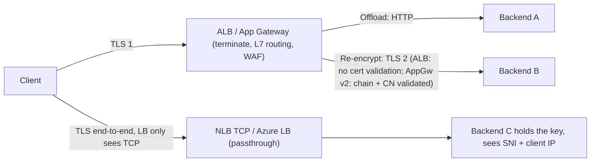
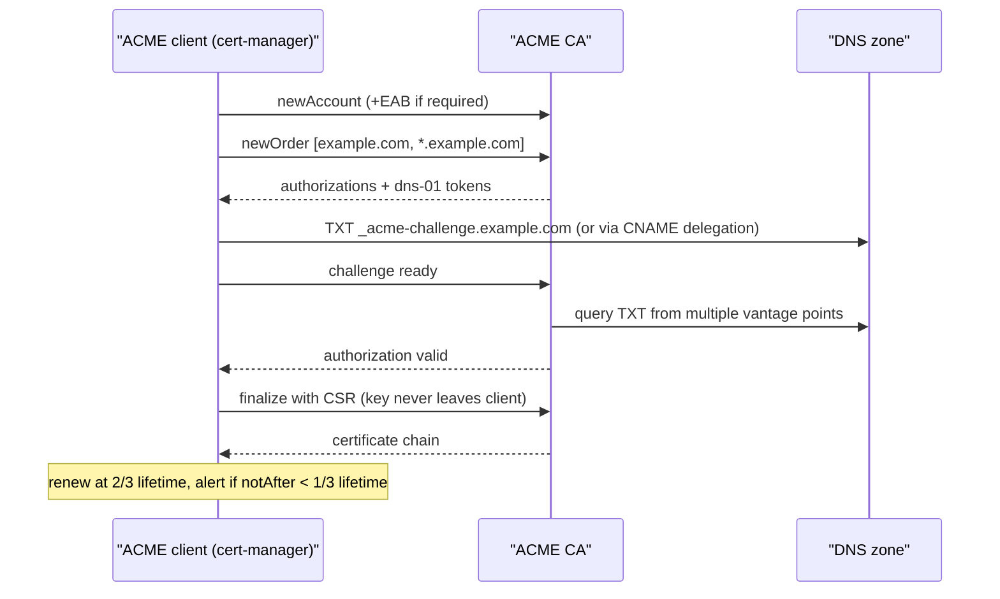
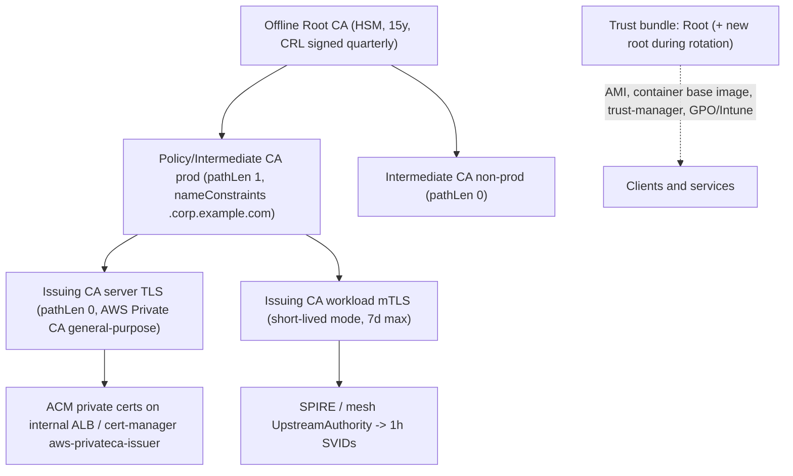

# I2 TLS and Certificates
> Last verified: 2026-10 · Audience: senior/staff DevOps, SRE, AI eng, NetEng, DevSecOps, architects

## TL;DR
- **There are three termination patterns.** In **offload**, TLS ends at the LB and plaintext goes to the backend. In **passthrough**, an L4 LB forwards TLS bytes untouched and the backend holds the key. In **re-encryption** (bridging, "end-to-end TLS"), the LB terminates TLS and opens a new TLS session to the backend. Pick by where you need L7 visibility, where the private key may live, and compliance needs ("encrypted everywhere" vs "no third party holds the key").
- **AWS ALB/NLB re-encryption does not validate target certificates.** Self-signed or expired certs are accepted, and AWS relies on VPC packet-level authentication instead. **Azure App Gateway v2 does validate**: the backend cert must chain to a well-known CA or an uploaded **trusted root**, and its CN/SAN must match the backend host/SNI. **Front Door and CloudFront** also validate origin certs against public CAs.
- **SNI lets one listener/IP serve many certs.** ALB/NLB allow 25 extra certs per LB by default (adjustable) with a "smart" selection order (ECDSA before RSA, ...). CloudFront SNI is free, while a dedicated IP serves pre-2010 non-SNI clients for a monthly fee. App Gateway uses multi-site listeners. Non-SNI clients get a **default cert**, and each platform picks that cert differently.
- **Encrypted Client Hello (ECH) is RFC 9849 (Mar 2026).** It hides the real SNI behind a `public_name`. Its config is published in the DNS **HTTPS RR**. It breaks SNI-based egress filtering, so enterprises strip HTTPS RRs at the resolver.
- **Lifecycle:** wildcard (one label, not the apex, shared key = big blast radius) vs SAN (explicit names, visible in CT logs). The ACME challenges are **HTTP-01** (port 80, no wildcards), **DNS-01** (wildcards, CNAME delegation) and **TLS-ALPN-01** (port 443). Max public cert validity falls to **47 days by 2029** (see F5), so automation plus `notAfter` monitoring is mandatory.
- **AWS:** ACM DNS-validated certs auto-renew (ARN unchanged). **Exportable public certs** are 198 days and paid. ACM now runs an **ACME endpoint** that issues 45-day public certs with client-held keys. Monitor with `DaysToExpiry` and EventBridge. **Azure:** Key Vault auto-renews certs from integrated CAs (DigiCert/GlobalSign). Monitor with Event Grid `CertificateNearExpiry` (30 days before expiry).
- **Private PKI:** **AWS Private CA** has two modes: general-purpose ($400/CA-month) and short-lived (≤7-day certs, $50/CA-month, no revocation needed). **Azure has no general-purpose first-party private CA.** Microsoft Cloud PKI covers Intune devices only. For workloads use AD CS, Vault PKI, step-ca, or SPIFFE/SPIRE.
- **Design rules:** use an offline or tightly isolated root, intermediates with `pathLenConstraint`, short-lived leaves, a plan for distributing trust bundles, and root rotation by cross-signing with an overlap period. Public CAs are dropping the clientAuth EKU, so **mTLS client certs must come from a private CA**.

## I2.1 Termination modes beyond offload: passthrough vs re-encryption to the backend

### The three modes
| Mode | Where TLS ends | L7 features (WAF, path routing, headers) | Who holds the private key | Typical AWS | Typical Azure |
|---|---|---|---|---|---|
| **Offload** (edge termination) | LB/edge; plaintext to backend | Yes | LB (ACM / Key Vault) | ALB HTTPS → HTTP TG; CloudFront → HTTP origin | App Gateway HTTPS listener → HTTP backend; Front Door → HTTP origin |
| **Passthrough** | Backend | No (L4 only; SNI not inspected) | Backend only | **NLB TCP:443 listener** → TCP TG | **Azure Load Balancer** (always passthrough) |
| **Re-encryption** (bridging) | LB, then a new TLS session to the backend | Yes | Both LB and backend (2 certs) | ALB HTTPS → **HTTPS TG**; NLB TLS → **TLS TG**; CloudFront → HTTPS origin | App Gateway with backend setting **HTTPS** ("end-to-end TLS"); Front Door forwarding protocol HTTPS |
| **L4 TLS termination** (variant) | LB at L4 | No HTTP features, but TLS offload for any TCP protocol | LB | **NLB TLS listener** (ALPN policy for h2/gRPC) | **App Gateway TCP/TLS proxy** (L4 terminating proxy) |

### How it works: AWS
- **ALB HTTPS target group.** The ALB "establishes TLS connections with the targets using certificates that you install on the targets. **The load balancer does not validate these certificates.** Therefore, you can use self-signed certificates or certificates that have expired." AWS's argument is that VPC traffic is authenticated at the packet level, so MITM is not a risk inside the VPC. The docs warn that traffic leaving AWS lacks this protection.
- **The ALB backend TLS policy is not configurable.** If any HTTPS listener uses a TLS 1.3 policy, target connections use `ELBSecurityPolicy-TLS13-1-0-2021-06`. Otherwise they use `ELBSecurityPolicy-2016-08`.
- **NLB TLS target group:** same rule. The NLB does not validate target certs.
- **NLB passthrough (TCP listener):**
  - The backend terminates TLS and sees the real SNI/ALPN.
  - Client IP is preserved by default for instance targets. For IP targets with TCP/TLS, preservation is off by default, so use **Proxy Protocol v2**.
  - The NLB cannot route by SNI to different target groups.
- **NLB TLS listener key limits:** RSA ≤ 3072-bit and ECDSA P-256/384/521. An RSA-4096 cert imported via IAM fails asynchronously; via ACM it is rejected at attach time.
- **CloudFront → origin:** CloudFront validates that the origin cert is publicly trusted and matches the origin domain (or the forwarded Host). A self-signed origin cert gives a 502.

### How it works: Azure
- **Azure Load Balancer** is a pass-through L4 device with no TLS awareness. TLS lives on the VMs (often with DSR/floating IP).
- **App Gateway v2 end-to-end TLS** (backend setting protocol = HTTPS):
  - The backend cert must chain to a **well-known CA**, or to a **trusted root certificate** uploaded to the backend setting (needed for self-signed or private-CA certs).
  - The CN must match the backend setting's host name. App Gateway sends that host as **SNI**.
  - "Pick hostname from backend target" uses the pool FQDN; IP pool members are not supported in that mode.
  - Trusted Azure services (App Service, APIM) are implicitly trusted.
  - **v1 SKU used "authentication certificates"** (exact match on the leaf public key). These were deprecated in v2 in favour of trusted roots.
- **App Gateway v2 backend TLS** always tries TLS 1.3 first and falls back to 1.2. It is not configurable; the TLS policy applies to the frontend only. Newer API versions add backend **TLS validation types**: complete validation, or configurable "specific SNI" / "skip SNI" (no subject-name check).
- **Front Door origin TLS:**
  - The origin cert must chain to a root on the **Microsoft Trusted CA List** and include intermediates. **Self-signed and internal-CA certs are not allowed.**
  - The subject name check can be disabled per origin for testing, but the chain must still be valid.
  - For private origins, Front Door Premium can use **Private Link**.

### mTLS at the edge (client cert authentication)
| Service | Modes | Revocation | Cert info to backend | Notes |
|---|---|---|---|---|
| **ALB** | **Passthrough** (forwards the chain, no verify) or **Verify** (trust store) | CRLs in the trust store (S3) | Passthrough: `X-Amzn-Mtls-Clientcert`. Verify: `-Serial-Number`, `-Issuer`, `-Subject`, `-Validity`, `-Leaf` | ≤2 verify-mode listeners per ALB; 25 CA certs per trust store; chain depth 4; 500k revocation entries; **no session resumption with mTLS**; "advertise CA subject names" option |
| **CloudFront** (viewer mTLS) | Required (default) / Optional / Passthrough | Supported (see docs) | Headers plus Connection Functions | Validation runs at edge PoPs; passthrough mode does no caching |
| **App Gateway v2** | **Strict** (trusted client CA in an SSL profile) or **Passthrough** (API ≥ 2025-03-01; backend validates) | **OCSP only** (no CRL); responder must be reachable or you get 400s | Server variables (e.g. client cert) via rewrite | 100 client-CA chains per SSL profile, 200 per gateway; files ≤25 KB; optional "verify client cert issuer DN" |
| **Front Door Premium** | Required+validated / required-not-validated / validate-if-presented / passthrough | **OCSP only** (403 on revoked) | `X-Azure-ClientCertificate` and related headers | **Preview** as of 2026-08. Requires an mTLS-enforced endpoint. **No caching on mTLS routes**. Root + ≤3 intermediates, 2 CAs for rollover |



- **Trade-offs / when to use:**
  - **Offload** is the default for web apps. It gives one place for certs, WAF, HSTS and PQ key exchange. Accept plaintext inside the VPC only if policy allows it. PCI DSS and HIPAA programs often demand encryption on internal hops as well.
  - **Re-encryption** gives L7 features and encryption on every hop. It costs a second handshake (mitigated by connection reuse) and a second cert to manage. On AWS, use self-signed or private-CA backend certs freely, since they are not validated. On App Gateway, use private-CA backends plus an uploaded trusted root.
  - **Passthrough** fits when the key must stay on the workload (HSM, compliance, "provider must never see plaintext"), when the backend needs the client cert natively (mTLS at the app or mesh ingress), or for non-HTTP TLS protocols. You lose WAF, path routing and LB access logs with HTTP detail.
  - **L4 TLS termination** (NLB TLS / App Gateway TCP/TLS proxy) offloads TLS for databases, MQTT and custom TCP without HTTP parsing. The App Gateway WAF does not inspect TLS/TCP listeners.
- **Interview angles:**
  - "Is ALB → HTTPS target 'secure' with a self-signed cert?" → Encrypted, yes; authenticated, no. ALB does not verify the target cert, and AWS relies on VPC integrity. If the threat model includes an in-VPC attacker, or a compliance rule needs authenticated hops, use a service mesh/mTLS or App Gateway-style validation, or terminate at the app via NLB passthrough.
  - "App Gateway backend shows unhealthy after enabling HTTPS" → Check the CN vs backend host name/SNI mismatch, a missing intermediate on the backend (App Gateway builds the chain from what the server sends), a private CA without an uploaded trusted root, or a probe host name that differs.
  - "Why does Front Door reject my origin?" → The origin cert has an internal or self-signed chain, or is missing intermediates. Use a public cert or Private Link, or disable only the subject-name check (not the chain check).
  - "We need client IP and the backend must see the client cert" → Use NLB TCP passthrough with client IP preservation or PPv2, or ALB mTLS passthrough plus headers. Remember that **ALB mTLS disables session resumption**, which raises handshake CPU and latency.
  - **Pitfall:** mTLS at the edge is worthless if the origin is reachable directly. Lock the origin to the edge with CloudFront VPC origins or prefix lists, Front Door Private Link or `X-Azure-FDID` checks, or ALB security groups.

## I2.2 SNI and multiple certificates on one listener
- **How it works:**
  - **SNI** (RFC 6066) puts the host name in ClientHello in cleartext. The server picks a cert (and on some platforms a routing target) before decryption. IP literals are not allowed in SNI.
  - **ALB:**
    - One **default cert** (required) plus a **certificate list**. Quota: **25 certs per ALB excluding the default** (adjustable).
    - The default cert is used only when there is no SNI or no CN/SAN match.
    - **If matches exist but none is compatible with the client, the handshake fails. There is no fallback to the default.**
    - Smart selection order when several certs match: **ECDSA over RSA, then not expired, then strongest hash, then largest key, then validity period**. This lets you serve dual ECDSA + RSA certs for the same name. Access logs record the SNI and the cert served.
  - **NLB TLS listener:** same default + list model and the same smart selection (no "not expired" criterion is listed). It selects certs by SNI but **does not route by SNI**.
  - **CloudFront:**
    - **One cert per distribution.** It can be a multi-SAN or wildcard cert, and it must be in ACM **us-east-1**.
    - **SNI** is the recommended, free default. CloudFront drops the connection if it cannot tell which domain is requested.
    - **Dedicated IP** serves pre-2010 or non-SNI clients. It costs an extra monthly charge (≈$600/month per distribution, per the pricing page; verify). The default quota is 2 dedicated-IP certs per account, raised by a support case. "Dedicated" IPs are still not static.
    - For thousands of customer domains, use multi-tenant distributions (CloudFront SaaS Manager, unverified details).
  - **App Gateway v2:**
    - **Multi-site listeners**, each with its own cert; **up to 5 host names (wildcards allowed) per listener**. A multi-host listener needs a SAN cert and a wildcard host needs a wildcard cert.
    - Rule **priority 1–20000** decides evaluation order: put `shop.contoso.com` before `*.contoso.com`, and multi-site listeners before basic ones.
    - **Non-SNI behaviour (v2):** returns the cert of the HTTPS listener with the **highest-priority rule** and does **not** fall back to the basic listener's cert (v1 did).
    - Use an **"SNI hole"** (dummy `sni-hole.invalid` listener with a self-signed cert at top priority) so IP-only scanners don't harvest your real cert.
    - **Multi-site TLS listeners on the L4 proxy** route by SNI to different pools.
  - **Front Door Std/Premium:**
    - Custom domains include apex and wildcard. Validation is a TXT record `_dnsauth.<sub>` (the token expires after 7 days); a BYOC cert whose CN/SAN matches can also prove ownership.
    - **Managed certs are DigiCert-issued**, so you may need CAA `0 issue digicert.com`. They auto-rotate within 45 days of expiry **only if the CNAME points directly** at the Front Door endpoint. With an A record, CNAME chains or apex CNAME flattening, the domain goes to "Pending revalidation".
    - **Wildcard managed certs are not auto-rotated.**
    - **BYOC from Key Vault:** the vault must be in the same subscription, the cert must be an RSA PFX (**EC certs not supported**), and "Latest" version rotation takes **up to 72 h** (another page says 3–4 days).
    - Don't pin managed certs; Microsoft changes roots (e.g. DigiCert G1 → G2 in 2026).
- **ECH (Encrypted Client Hello), RFC 9849, March 2026:**
  - The client sends a **ClientHelloOuter** with an innocuous SNI (the provider's `public_name`, e.g. `cloudflare-ech.com`) and an encrypted **ClientHelloInner** with the real SNI and ALPN.
  - Keys (ECHConfig) are published in the DNS **HTTPS/SVCB RR** (RFC 9460). Use DoH/DoT, or an on-path observer simply reads the DNS answer instead.
  - If ECH is rejected, the server authenticates as `public_name` and sends retry configs.
  - ECH only helps on large shared fronts (CDNs). A single-tenant IP still leaks the destination.
  - **Cloudflare:** ECH is on by default for Free zones and can be toggled on paid plans.
  - **AWS/Azure:** ECH is not documented for CloudFront, Front Door or the LBs (unverified; treat as unsupported).
  - **Enterprise/DevSecOps impact:** SNI-based egress filtering and TLS-inspection bypass lists stop seeing names. The documented control is to drop HTTPS RRs at the corporate resolver, or use the `use-application-dns.net` canary for Firefox.
- **Trade-offs / when to use:**
  - **Many certs via SNI** isolates key compromise per tenant and supports per-customer BYOC (SaaS). The cost is quota (ALB 25 default) and cert sprawl.
  - **One multi-SAN cert** is simpler, but every hostname appears in **CT logs**, any change means reissuing for all names, and one key covers everything.
  - **Wildcard** suits many dynamic subdomains (tenant.example.com). It does not cover the apex or deeper levels.
  - **SNI-less clients** (old Java/Android, some IoT, LB health checkers, `curl https://<ip>`) always get the default cert, so choose it deliberately.
- **Interview angles:**
  - "Host 300 customer domains on AWS" → The ALB default quota is 25 certs (adjustable, but costly to operate). Options: CloudFront multi-tenant/SaaS approach, several ALBs, NLB TCP passthrough to an ingress (Envoy/NGINX with cert-manager) that does SNI itself, or wildcard certs for your own subdomains.
  - "Why did a client get the wrong cert?" → No SNI was sent (IP connection, old client, health checker), or App Gateway v2 rule-priority default behaviour. Debug with `openssl s_client -servername` vs without it (see H4.7).
  - "Does SNI leak privacy?" → Yes, SNI and DNS are cleartext. Fixes are ECH + DoH; ESNI was its deprecated predecessor.
  - "ECDSA or RSA?" → Serve both. ALB/NLB prefer ECDSA for clients that support it (smaller, faster). Front Door BYOC is RSA-only, and App Gateway needs a PFX.

## I2.3 Certificate lifecycle: wildcard vs SAN, ACME automation, renewal, expiry monitoring

### Wildcard vs SAN
| | Wildcard `*.example.com` | SAN (multi-domain) |
|---|---|---|
| Coverage | One label only. **Not** `example.com`, **not** `a.b.example.com` | Exactly the listed names (can mix domains and the apex) |
| Typical combo | `example.com` + `*.example.com` in one cert | `www`, `api`, `example.net` |
| Validation | **DNS-01 required** for ACME wildcards | Any challenge per name |
| Blast radius | Key sits on every host using it; compromise impersonates any subdomain | Limited to the listed names |
| CT exposure | Hides individual host names | Every name is public in CT logs |
| Limits | n/a | ACM: 10 names by default (quota-adjustable, unverified upper limit); Let's Encrypt: 100 names per cert |

### ACME (RFC 8555) challenges
| Challenge | Proof | Port | Wildcard | Best for | Pitfalls |
|---|---|---|---|---|---|
| **HTTP-01** | File at `/.well-known/acme-challenge/<token>` | 80 | No | Simple web servers, ingress controllers | Port 80 must be open from the internet; every node behind the LB must serve the token |
| **DNS-01** | TXT `_acme-challenge.<name>` | n/a | **Yes** | Wildcards, internal/non-public hosts, multi-node | DNS API credentials on the box (scope them); propagation delay; **delegate with a CNAME** `_acme-challenge` to a dedicated validation zone to limit credentials |
| **TLS-ALPN-01** (RFC 8737) | Self-signed cert with `acme-tls/1` ALPN on 443 | 443 | No | Port 80 blocked; TLS-terminating proxies (Caddy, Traefik) | Limited client support; not in cert-manager |

- **Let's Encrypt** (context, details in F5): offers profiles including the 6-day "shortlived" profile (GA Jan 2026) and IP-address certs. It ended OCSP in 2025 and uses CRLs only. A persistent DNS challenge ("DNS-PERSIST-01") is an IETF draft (unverified status).
- **cert-manager (Kubernetes):**
  - **Issuer/ClusterIssuer** types: ACME, CA, Vault, Venafi, SelfSigned. External issuers include **aws-privateca-issuer** and step-issuer.
  - The ACME issuer supports **HTTP01 and DNS01** solvers, selected per cert via `dnsZones` / `dnsNames` / `matchLabels`. It supports **EAB** (needed by ACM ACME, ZeroSSL, Sectigo) and **ACME profiles** (v1.18+).
  - Defaults: `duration` 90d, renewal at **2/3 of lifetime** unless `renewBefore`/`renewBeforePercentage` is set.
  - Pair it with **trust-manager** to distribute CA bundles.

### AWS ACM lifecycle
- **Public certs:** 198-day validity since Feb 2026 (see F5).
- **Managed renewal eligibility:** the cert must be **in use** by an integrated service (ELB, CloudFront, API GW, …) or **exported**. **Imported certs and Private CA `IssueCertificate` certs are not eligible.** The ARN stays the same on renewal, and certs are regional (renew per Region; CloudFront certs live in us-east-1).
- **DNS validation** is a CNAME `_<hash>.example.com → _<hash>.acm-validations.aws`. **Leave it in place forever**, because renewal re-validates through it. The apex and wildcard share one CNAME. A **CAA record** that doesn't allow `amazon.com`/`amazontrust.com` blocks renewal (`CAA_ERROR`).
- **Email validation** needs a human click on every renewal. Avoid it.
- **Exportable public certs:** ACM-issued public certs whose key and chain you can export to EC2, containers or on-prem.
  - 198-day validity; ACM renews them **45 days before expiry** and emits events, but **you must redeploy them yourself**.
  - Extra per-cert charge: ≈$7/FQDN, $79/wildcard (see the pricing page). Revocable through ACM.
  - In Terraform, set export on the cert `options` (recent AWS provider; verify the argument name).
- **ACM ACME endpoints (new):**
  - A managed ACME server issues **publicly trusted 45-day certs**. The **private key is generated and kept by the ACME client** (certbot, cert-manager).
  - Admins **pre-approve domains** via CNAME validations (`PRE_APPROVED` authorization, so clients answer no live challenge) and hand out **EAB credentials** tied to IAM roles.
  - Constraints: certs **cannot be attached to ELB/CloudFront/API GW**, ACM does not renew them (the client renews), they can't be exported or revoked via ACM APIs (use the ACME `revoke-cert` URL), and ACM deletes them 1 year after expiry.
  - The ARN stays stable across client renewals. Allow ≥120 s issuance timeout. Reachable over PrivateLink.
  - CloudWatch: `CertificateIssuanceSuccess/Failed` per endpoint.
- **Monitoring:**
  - CloudWatch `AWS/CertificateManager` **`DaysToExpiry`**, published twice a day per cert.
  - EventBridge **"ACM Certificate Approaching Expiration"**: daily from **30 days** before expiry for public certs and **45 days** for private/imported. Tunable with `PutAccountConfiguration`.
  - EventBridge **"Renewal Action Required"** (retries at 30 private only, then 15, 3, 1 days), **"Expired"**, **"Available"** (hook for redeploying exported certs) and **"Revoked"**.
  - AWS Health `AWS_ACM_RENEWAL_STATE_CHANGE`, `CAA_CHECK_FAILURE`.
  - AWS Config `acm-certificate-expiration-check`.

### Azure Key Vault lifecycle
- **Three cert categories:**
  - **Integrated CA** (DigiCert, GlobalSign; needs your CA account and an issuer object): Key Vault handles renewal end to end.
  - **Non-integrated CA:** Key Vault generates the key and a **CSR**, the CA signs it, and you **merge** the result. Email reminders only.
  - **Self-signed:** auto-renewable.
- Every renewal creates a **new version**. Consumers must use the **versionless secret ID** to pick it up:
  - App Gateway polls every 4 h, and a Key Vault access failure disables the listener (see H4).
  - Front Door "Latest" picks up the new version in up to 72 h.
  - App Service syncs on its own schedule (unverified interval).
- **Policy `lifetime_action`:** `AutoRenew` or `EmailContacts`, triggered at a % of lifetime or N days before expiry (the portal default is AutoRenew at 80% of lifetime, unverified). **Certificate contacts** are per vault.
- **Event Grid:** `Microsoft.KeyVault.CertificateNearExpiry` fires **30 days before** expiry. Also `CertificateExpired` and `CertificateNewVersionCreated`. Events fire only on new versions and only after you subscribe.
- **Other managed options:**
  - **App Service Managed Certificates** (free, no wildcard).
  - **App Service Certificates** (198 days, paid).
  - **Front Door managed certs** (DigiCert).
  - AKS: cert-manager, or the Key Vault Secrets Store CSI driver for syncing.



- **Trade-offs / when to use:**
  - Use **platform-managed certs** (ACM non-exportable, Front Door managed) whenever the terminator is a managed service: no key handling and automatic renewal.
  - Use **ACME** (cert-manager, ACM ACME, Let's Encrypt) for Kubernetes and VMs where the key must stay local.
  - Use **exportable ACM / Key Vault integrated CA** when you need an OV cert, a specific CA, or one cert across hybrid estates. The cost is that *you* own redeployment.
  - **Imported certs are the outage risk class**: no auto-renewal anywhere.
- **Interview angles:**
  - "Design cert management for 47-day lifetimes" → Inventory everything (CT logs + cloud APIs + network scans). Keep validation records in place permanently (ACM CNAME, `_acme-challenge` delegation). Automate deploy-on-"Available"/"NewVersionCreated" events. Alert on renewal failure (EventBridge "Renewal Action Required"), not just on expiry. Run synthetic `notAfter` checks from outside (blackbox_exporter `probe_ssl_earliest_cert_expiry`). Ban leaf/intermediate pinning.
  - "ACM cert didn't renew" → Validation CNAME deleted, a CAA record blocks Amazon, the cert isn't in use or exported, it was imported, or (for email validation) nobody clicked.
  - "Front Door managed cert stuck in Pending revalidation" → CNAME flattening at the apex, an A record, or an indirect CNAME. Fix by pointing the CNAME directly at Front Door or re-adding a new `_dnsauth` TXT record (old tokens expire after 7 days).
  - **Pitfall:** monitoring only the platform. Neither ACM nor Key Vault sees certs baked into appliances, mobile apps (pinning), Java keystores or partner endpoints.

## I2.4 Private CAs and internal trust chains
- **How it works: AWS Private CA**
  - Managed CA with HSM-backed keys. Hierarchies up to **5 levels**. Root or subordinate CAs, or a subordinate signed by an **external (offline) root**.
  - Templates enforce `pathLenConstraint` (`SubordinateCACertificate_PathLen0..3/V1`).
  - Revocation via CRL (S3) and/or OCSP.
  - Share across accounts with **AWS RAM**.
  - Integrations: ACM private certs (managed renewal, exportable), **aws-privateca-issuer** for cert-manager, Connector for AD and SCEP connector (Intune/Jamf), IAM Roles Anywhere trust anchors, ALB mTLS trust stores.
  - **Modes** (`UsageMode`):

| | General-purpose (default) | Short-lived certificate |
|---|---|---|
| Max leaf validity | Any | **7 days** |
| Revocation | CRL/OCSP typically configured | Not needed (expiry is the revocation) |
| Price (2026) | **$400 per CA-month**; certs $0.75 (1–1k), $0.35 (1k–10k), $0.001 (>10k) | **$50 per CA-month**; **$0.058 per cert** |
| Placement | Anywhere in the hierarchy | **Must be the last (issuing) CA** |
| ACM issuance | Yes | **No.** ACM can't issue from short-lived CAs. Use the `IssueCertificate` API (e.g. Roles Anywhere, mesh, AppStream/WorkSpaces) |
| Trial | 30 days free CA fee for the first CA per Region per account | same |

- **How it works: Azure (verified 2026-10)**
  - There is **no general-purpose first-party managed private CA for workloads.** Key Vault stores and renews certs but is not a CA (issuers are Self, DigiCert, GlobalSign or "Unknown" with CSR merge).
  - **Microsoft Cloud PKI** (Intune Suite add-on) is a two-tier root + issuing CA with HSM keys, SCEP-only issuance, **for Intune-enrolled devices only**, max **3 CAs per tenant**. BYOCA can anchor it to AD CS.
  - Workload options:
    - **AD CS** on VMs (keys in Managed HSM or a network HSM).
    - **HashiCorp Vault PKI** (HCP or self-run).
    - **step-ca**.
    - **cert-manager CA issuer** with the root key in Key Vault (via external signers; unverified maturity).
    - **SPIRE**.
    - **Istio/AKS Istio add-on** built-in CA with a plug-in intermediate from Key Vault.
- **HashiCorp Vault PKI:**
  - **One CA per mount.** Root mount (or offline root) → intermediate mount(s) per environment/team → **roles** constrain `allowed_domains`, TTL and key type.
  - Short TTLs (hours to days) with **`no_store=true`** for high volume; auto-tidy; CRL auto-rebuild (1.12+), OCSP, **ACME server since 1.14** (use EAB).
  - Multi-issuer mounts allow **cross-signing and rotation**. The default mount max TTL inherits the system's 768h (32 days).
- **step-ca (Smallstep):**
  - Open-source online intermediate CA with **ACME**, OIDC, JWK, X5C and cloud **instance-identity (AWS/GCP/Azure IID) provisioners**, plus SSH certs.
  - Default leaf ~24 h (unverified default). Root typically generated offline.
- **SPIFFE/SPIRE (workload identity):**
  - The SPIRE Server holds the signing keys and registration entries. Agents on each node do **node attestation** (AWS IID, Azure MSI, k8s PSAT, TPM, join token) and **workload attestation** (k8s SA/namespace, unix uid, docker labels), then expose the **Workload API** (Unix socket).
  - Issues **X.509-SVIDs** (URI SAN `spiffe://trust-domain/ns/x/sa/y`) and JWT-SVIDs with short TTLs, rotated automatically (default X.509-SVID TTL 1 h, unverified).
  - An **UpstreamAuthority** plugin chains to AWS Private CA, Vault or disk. **Federation** exchanges trust bundles between trust domains.
  - Istio and Linkerd implement the SPIFFE ID format with their own CAs (Istio workload certs default to 24 h).
- **Intermediate CA design:**
  - **Root:** offline (air-gapped HSM or a powered-off VM with key ceremony) or an isolated AWS account with break-glass IAM. Long validity (10–20 y). Signs only intermediates and CRLs.
  - **Policy/intermediate tier** (optional, 3-tier) per business unit, region or environment. **`pathLenConstraint`** decrements to 0 at the issuing CAs.
  - **Name constraints** (`permittedSubtrees: .corp.example.com`) limit the damage from a compromised intermediate. Support for them is now good in modern TLS stacks.
  - **Issuing CAs** per environment (prod/non-prod never share), per use (server TLS vs client auth vs code signing), possibly per region for latency and blast radius.
  - Choose leaf lifetime against revocation cost. Short-lived (≤24 h–7 d) beats CRL/OCSP infrastructure.
- **Trust distribution (the hard part):**
  - **Linux:** `/usr/local/share/ca-certificates` + `update-ca-certificates` (Debian) or `update-ca-trust` (RHEL). Bake into golden AMIs/images and container base images.
  - **Java:** `cacerts` is separate. **Go/Node/Python** may use bundled stores (`NODE_EXTRA_CA_CERTS`, `REQUESTS_CA_BUNDLE`, certifi).
  - **Windows/macOS:** GPO / Intune trusted-certificate profiles / MDM.
  - **Kubernetes:** **trust-manager `Bundle`** → ConfigMap in every namespace. Mesh trust bundles come via SDS.
  - **AWS:** ALB mTLS trust store (S3 bundle), IAM Roles Anywhere trust anchor, RDS-style custom CA bundles for clients. **Azure:** App Gateway trusted root (backend) / trusted client CA, Front Door mTLS CA.
  - **Root rotation:** issue the new root, **cross-sign** it with the old one, ship the bundle containing **both** roots everywhere, wait for the longest leaf/intermediate lifetime plus deploy lag, switch issuance, then retire the old root.
- **Public vs private for mTLS:** per CA/Browser Forum and root-program changes, public CAs are phasing out the **clientAuth EKU** on TLS certs. Front Door explicitly tells you to move mTLS client certs to private CAs. Also, never use public certs for internal names: CT logs leak them, and names like `.internal` can't be validated publicly.



- **Trade-offs / when to use:**
  - **AWS Private CA** is managed, HSM-backed and integrated, but at $400/CA-month a 3-tier hierarchy across Regions adds up fast. **Short-lived mode** is 8x cheaper per CA and fits mTLS/workload identity.
  - **Vault PKI / step-ca** are cheap and multi-cloud, but you operate HA, storage, unseal and DR yourself.
  - **SPIRE** gives identity based on attestation (no secret zero) and suits zero trust. It is more complex, and apps need SPIFFE-aware libraries or a sidecar/mesh.
  - **AD CS** is fine for Windows/AD estates (autoenrollment) and painful for cloud-native automation.
- **Interview angles:**
  - "Design internal PKI for 5,000 microservices across AWS + Azure" → Offline root. A cloud-neutral issuing layer (SPIRE or Vault PKI, optionally chained to AWS Private CA as upstream). Short-lived certs (≤24 h) so revocation is unnecessary. trust-manager / golden images for the trust bundle. Separate prod/non-prod roots or intermediates. Name constraints. Federation between trust domains.
  - "Why not issue leaves from the root?" → A compromise or rotation of the root then means re-trusting every client. Intermediates can be revoked and rotated without touching trust stores.
  - "How do you revoke a compromised intermediate?" → Root-signed CRL / OCSP. Clients must actually check it (many don't for private PKI), which is why short-lived leaves plus rotatable intermediates are preferred.
  - "Azure equivalent of AWS Private CA?" → There is none for workloads. Say Cloud PKI (Intune devices only), AD CS, Vault, or a mesh CA, and that Key Vault stores and renews certs but doesn't sign.
  - **Pitfalls:** forgetting the Java truststore; pinning an intermediate; private CA certs over 398/825 days that break on Apple platforms (Apple's rules target public trust, unverified for private roots); CRL distribution points unreachable from isolated VPCs (App Gateway/Front Door hard-fail on OCSP).

## Cloud mapping: AWS vs Azure
| Capability | AWS | Azure | Role it plays | Key differences | Alternatives |
|---|---|---|---|---|---|
| L4 passthrough | **NLB TCP listener** | **Azure Load Balancer** | Backend owns TLS; LB only sees TCP | NLB: static IP per AZ, client-IP preservation rules, PPv2. Azure LB: DSR/floating IP, no TLS features at all | HAProxy/Envoy in TCP mode |
| L4 TLS termination | **NLB TLS listener** (+ALPN policy, TLS TG re-encrypt) | **App Gateway TCP/TLS proxy** | Offload TLS for non-HTTP | NLB doesn't validate target certs; App Gateway L4 has no WAF inspection | Envoy, stunnel |
| L7 offload / re-encrypt | **ALB** HTTPS → HTTP/HTTPS TG | **App Gateway v2** end-to-end TLS | WAF, routing, headers | **ALB never validates target certs; App Gateway v2 validates chain + CN (trusted root for private CA)** | NGINX/Envoy ingress |
| Edge termination | **CloudFront** (validates origin cert, public CA) | **Front Door** (Microsoft Trusted CA List, no internal CA; Private Link origins) | Global TLS near users | CloudFront certs in us-east-1; Front Door BYOC RSA only, same-subscription Key Vault | Cloudflare (ECH, PQ) |
| Multi-cert / SNI | ALB/NLB cert list (25 + default), CloudFront 1 cert/distro, SNI or dedicated IP | App Gateway multi-site listeners (5 hosts each), Front Door custom domains | Many hostnames per endpoint | Default-cert behaviour for non-SNI clients differs (ALB default cert; App Gateway v2 = highest-priority rule) | Ingress controllers w/ SNI |
| Edge mTLS | ALB passthrough/verify (CRL), CloudFront viewer mTLS | App Gateway strict/passthrough (OCSP), Front Door Premium mTLS (**preview**, OCSP) | Client cert auth | AWS uses CRLs in trust stores; Azure only OCSP | API Gateway mTLS, Cloudflare Access mTLS |
| Public cert issuance | **ACM** (managed, exportable, **ACME endpoint**) | **Key Vault** + integrated CAs, Front Door/App Service managed certs | Issue + renew | ACM free for integrated use; Key Vault needs your DigiCert/GlobalSign account | Let's Encrypt + cert-manager |
| Expiry monitoring | `DaysToExpiry`, EventBridge, Config rule, Health | Event Grid `CertificateNearExpiry`, contacts, Azure Policy | Detect expiry/failed renewal | Both blind to certs outside the platform | blackbox_exporter, CT monitoring |
| Private CA | **AWS Private CA** (general / short-lived) | **None for workloads**; Cloud PKI (Intune devices), AD CS | Internal PKI | AWS integrates with ACM, RAM, Roles Anywhere, cert-manager | Vault PKI, step-ca, SPIRE, mesh CA |
- **Roles:** the LB/CDN *references* a cert (ACM ARN or Key Vault versionless ID). ACM or Key Vault owns issuance and renewal. Private CA, Vault or SPIRE own internal identity.
- **Big differences to say out loud:**
  - AWS trusts the VPC and skips backend cert validation, while Azure App Gateway enforces it. This explains why "self-signed backend works on ALB but App Gateway marks it unhealthy".
  - AWS has a first-party private CA with a cheap short-lived mode; Azure doesn't.
  - Revocation for edge mTLS: AWS uses CRLs, Azure uses OCSP only.
  - ACM is regional with the CloudFront us-east-1 exception. Key Vault is regional, and Front Door requires the vault in the same subscription.
- **Alternatives:** Cloudflare (Universal/Advanced certs, ECH, origin CA certs, mTLS with Access), cert-manager + trust-manager on Kubernetes, Istio/Linkerd for mesh mTLS, HashiCorp Vault PKI / step-ca / SPIRE for cloud-neutral internal PKI.

## Hands-on (optional)
```hcl
# ACM DNS-validated cert (apex + wildcard), Route 53 validation, CloudFront needs us-east-1
provider "aws" {
  alias  = "use1"
  region = "us-east-1"
}

data "aws_route53_zone" "main" {
  name = "example.com"
}

resource "aws_acm_certificate" "web" {
  provider                  = aws.use1
  domain_name               = "example.com"
  subject_alternative_names = ["*.example.com"]
  validation_method         = "DNS"
  key_algorithm             = "EC_prime256v1"
  lifecycle { create_before_destroy = true }
}

# apex and wildcard share one CNAME -> allow_overwrite; never delete these (renewal uses them)
resource "aws_route53_record" "acm_validation" {
  for_each = {
    for dvo in aws_acm_certificate.web.domain_validation_options : dvo.domain_name => {
      name   = dvo.resource_record_name
      record = dvo.resource_record_value
      type   = dvo.resource_record_type
    }
  }
  allow_overwrite = true
  zone_id         = data.aws_route53_zone.main.zone_id
  name            = each.value.name
  type            = each.value.type
  records         = [each.value.record]
  ttl             = 60
}

resource "aws_acm_certificate_validation" "web" {
  provider                = aws.use1
  certificate_arn         = aws_acm_certificate.web.arn
  validation_record_fqdns = [for r in aws_route53_record.acm_validation : r.fqdn]
}

# CAA so only Amazon may issue (add others you use, e.g. letsencrypt.org)
resource "aws_route53_record" "caa" {
  zone_id = data.aws_route53_zone.main.zone_id
  name    = "example.com"
  type    = "CAA"
  ttl     = 3600
  records = ["0 issue \"amazon.com\"", "0 issuewild \"amazon.com\""]
}

# Alarm if renewal has not happened by 30 days left
resource "aws_cloudwatch_metric_alarm" "cert_expiry" {
  provider            = aws.use1
  alarm_name          = "acm-web-days-to-expiry"
  namespace           = "AWS/CertificateManager"
  metric_name         = "DaysToExpiry"
  dimensions          = { CertificateArn = aws_acm_certificate.web.arn }
  statistic           = "Minimum"
  period              = 86400
  evaluation_periods  = 1
  comparison_operator = "LessThanThreshold"
  threshold           = 30
}
```

```hcl
# Key Vault certificate from integrated CA (DigiCert) with auto-renew + near-expiry events
resource "azurerm_key_vault_certificate_issuer" "digicert" {
  name          = "DigiCert"
  key_vault_id  = azurerm_key_vault.kv.id
  provider_name = "DigiCert"
  account_id    = var.digicert_account_id
  org_id        = var.digicert_org_id
  password      = var.digicert_api_key
}

resource "azurerm_key_vault_certificate" "web" {
  name         = "www-example-com"
  key_vault_id = azurerm_key_vault.kv.id

  certificate_policy {
    issuer_parameters { name = azurerm_key_vault_certificate_issuer.digicert.name } # "Self" for self-signed, "Unknown" for CSR+merge
    key_properties {
      exportable = true
      key_type   = "RSA" # Front Door BYOC does not support EC
      key_size   = 2048
      reuse_key  = false
    }
    lifetime_action {
      action  { action_type = "AutoRenew" }
      trigger { days_before_expiry = 30 }
    }
    secret_properties { content_type = "application/x-pkcs12" }
    x509_certificate_properties {
      subject            = "CN=www.example.com"
      validity_in_months = 6
      key_usage          = ["digitalSignature", "keyEncipherment"]
      extended_key_usage = ["1.3.6.1.5.5.7.3.1"] # serverAuth
      subject_alternative_names { dns_names = ["www.example.com", "api.example.com"] }
    }
  }
}

# App Gateway / Front Door must reference the VERSIONLESS id to pick up renewals:
#   ssl_certificate { key_vault_secret_id = azurerm_key_vault_certificate.web.versionless_secret_id }

resource "azurerm_eventgrid_system_topic" "kv" {
  name                   = "kv-events"
  resource_group_name    = azurerm_key_vault.kv.resource_group_name
  location               = azurerm_key_vault.kv.location
  source_arm_resource_id = azurerm_key_vault.kv.id
  topic_type             = "Microsoft.KeyVault.vaults"
}

resource "azurerm_eventgrid_system_topic_event_subscription" "cert_expiry" {
  name                = "cert-expiry"
  system_topic        = azurerm_eventgrid_system_topic.kv.name
  resource_group_name = azurerm_key_vault.kv.resource_group_name
  included_event_types = [
    "Microsoft.KeyVault.CertificateNearExpiry",
    "Microsoft.KeyVault.CertificateExpired",
    "Microsoft.KeyVault.CertificateNewVersionCreated",
  ]
  webhook_endpoint { url = var.alert_webhook_url }
}
```

```bash
# CSR with SANs (ECDSA P-256), key stays local; OpenSSL 1.1.1+/3.x
openssl req -new -newkey ec -pkeyopt ec_paramgen_curve:P-256 -nodes \
  -keyout api.key -out api.csr \
  -subj "/CN=api.example.com" \
  -addext "subjectAltName=DNS:api.example.com,DNS:www.example.com" \
  -addext "extendedKeyUsage=serverAuth"
openssl req -in api.csr -noout -text | grep -A1 "Subject Alternative Name"

# Lab private PKI: root -> intermediate (pathlen:0) -> leaf, then verify the chain (OpenSSL 3.x)
openssl req -x509 -newkey ec -pkeyopt ec_paramgen_curve:P-384 -nodes -days 3650 \
  -keyout root.key -out root.crt -subj "/CN=Lab Root CA" \
  -addext "basicConstraints=critical,CA:TRUE" -addext "keyUsage=critical,keyCertSign,cRLSign"
openssl req -new -newkey ec -pkeyopt ec_paramgen_curve:P-256 -nodes \
  -keyout int.key -out int.csr -subj "/CN=Lab Issuing CA"
openssl x509 -req -in int.csr -CA root.crt -CAkey root.key -CAcreateserial -days 1095 -out int.crt \
  -extfile <(printf "basicConstraints=critical,CA:TRUE,pathlen:0\nkeyUsage=critical,keyCertSign,cRLSign\nnameConstraints=critical,permitted;DNS:.example.com")
openssl x509 -req -in api.csr -CA int.crt -CAkey int.key -CAcreateserial -days 7 \
  -copy_extensions copy -out api.crt
openssl verify -CAfile root.crt -untrusted int.crt api.crt

# Check what a listener serves with and without SNI (default-cert behaviour)
openssl s_client -connect lb.example.com:443 -servername api.example.com </dev/null 2>/dev/null | openssl x509 -noout -subject -ext subjectAltName -enddate
openssl s_client -connect lb.example.com:443 -noservername </dev/null 2>/dev/null | openssl x509 -noout -subject
```

## Cross-links
- [F5.3 HTTPS, TLS, Keys and Certificates (lifetime reduction table, CT, CAA, revocation)](../F-network-engineering/F5-popular-networking-protocols.md#f53-https-tls-keys-and-certificates)
- [F5.2 TLS (PQ key exchange)](../F-network-engineering/F5-popular-networking-protocols.md#f52-tls)
- [H4.2 TLS Handshake](../H-full-stack-troubleshooting/H4-transport-layer-security.md#h42-tls-handshake) · [H4.4 Certificate validation](../H-full-stack-troubleshooting/H4-transport-layer-security.md#h44-ssl-certificate-validation) · [H4.5 OCSP stapling](../H-full-stack-troubleshooting/H4-transport-layer-security.md#h45-ocsp-certificate-revocation-ocsp-stapling) · [H4.7 SSL troubleshooting workflow](../H-full-stack-troubleshooting/H4-transport-layer-security.md#h47-ssl-troubleshooting-workflow)
- [C4.8 Digital certificates](../C-large-scale-architecture/C4-security.md#c48-digital-certificates) · [C4.9 Chain of trust](../C-large-scale-architecture/C4-security.md#c49-chain-of-trust)
- [D2.11 Encryption in transit](../D-system-design/D2-reusable-parts-of-system-design.md#d211-security-encryption-in-transit-with-ssltlsmtls) · [D2.12 TLS vs mTLS](../D-system-design/D2-reusable-parts-of-system-design.md#d212-tls-vs-mtls)
- [C2.26 Layer-7 load balancers](../C-large-scale-architecture/C2-scalability.md#c226-layer-7-load-balancers) · [H6 Web application architecture](../H-full-stack-troubleshooting/H6-web-application-architecture.md)
- [I1 DNS (HTTPS RR, CAA, alias records)](./I1-dns.md) · [I3 Acceleration](./I3-acceleration.md)
- [G14 Service-to-service networking (VPC Lattice TLS)](../G-cloud-network-architecture/G14-service-to-service-networking.md)
- [L2 Encryption and key management](../L-data-privacy-ai-security/L2-encryption-key-management.md) · [L6 Secrets and supply chain](../L-data-privacy-ai-security/L6-secrets-supply-chain.md) · [L7 Zero trust and workload identity (SPIFFE)](../L-data-privacy-ai-security/L7-zero-trust-workload-identity.md)

## Sources
- https://docs.aws.amazon.com/elasticloadbalancing/latest/application/load-balancer-target-groups.html
- https://docs.aws.amazon.com/elasticloadbalancing/latest/application/https-listener-certificates.html
- https://docs.aws.amazon.com/elasticloadbalancing/latest/application/load-balancer-limits.html
- https://docs.aws.amazon.com/elasticloadbalancing/latest/application/mutual-authentication.html
- https://docs.aws.amazon.com/elasticloadbalancing/latest/network/tls-listener-certificates.html
- https://docs.aws.amazon.com/elasticloadbalancing/latest/network/load-balancer-target-groups.html
- https://docs.aws.amazon.com/AmazonCloudFront/latest/DeveloperGuide/cnames-https-dedicated-ip-or-sni.html
- https://docs.aws.amazon.com/AmazonCloudFront/latest/DeveloperGuide/mtls-authentication.html
- https://docs.aws.amazon.com/acm/latest/userguide/managed-renewal.html
- https://docs.aws.amazon.com/acm/latest/userguide/acm-exportable-certificates.html
- https://docs.aws.amazon.com/acm/latest/userguide/acm-acme.html
- https://docs.aws.amazon.com/acm/latest/userguide/acm-acme-issuance.html
- https://docs.aws.amazon.com/acm/latest/userguide/supported-events.html
- https://docs.aws.amazon.com/acm/latest/userguide/cloudwatch-metrics.html
- https://docs.aws.amazon.com/privateca/latest/userguide/short-lived-certificates.html
- https://docs.aws.amazon.com/privateca/latest/userguide/ca-hierarchy.html
- https://aws.amazon.com/private-ca/pricing/
- https://learn.microsoft.com/en-us/azure/application-gateway/ssl-overview
- https://learn.microsoft.com/en-us/azure/application-gateway/multiple-site-overview
- https://learn.microsoft.com/en-us/azure/application-gateway/mutual-authentication-overview
- https://learn.microsoft.com/en-us/azure/application-gateway/tcp-tls-proxy-overview
- https://learn.microsoft.com/en-us/azure/frontdoor/domain
- https://learn.microsoft.com/en-us/azure/frontdoor/end-to-end-tls
- https://learn.microsoft.com/en-us/azure/frontdoor/tls-policy
- https://learn.microsoft.com/en-us/azure/frontdoor/mutual-tls
- https://learn.microsoft.com/en-us/azure/key-vault/certificates/overview-renew-certificate
- https://learn.microsoft.com/en-us/azure/key-vault/certificates/how-to-integrate-certificate-authority
- https://learn.microsoft.com/en-us/azure/key-vault/general/event-grid-overview
- https://learn.microsoft.com/en-us/intune/intune-service/protect/microsoft-cloud-pki-overview
- https://developer.hashicorp.com/vault/docs/secrets/pki/considerations
- https://spiffe.io/docs/latest/spire-about/spire-concepts/
- https://cert-manager.io/docs/configuration/acme/
- https://letsencrypt.org/docs/challenge-types/
- https://www.rfc-editor.org/rfc/rfc9849.html
- https://developers.cloudflare.com/ssl/edge-certificates/ech/
