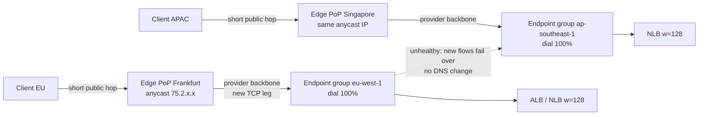
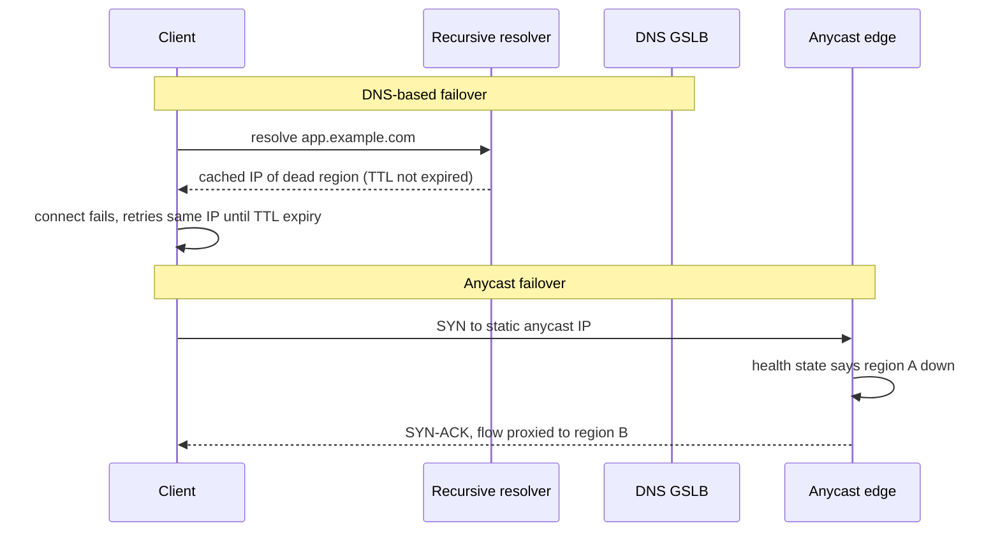

# I3 Acceleration
> Last verified: 2026-10 · Audience: senior/staff DevOps, SRE, AI eng, NetEng, DevSecOps, architects

## TL;DR
- **Anycast edge acceleration** (AWS **Global Accelerator**, Azure **global (cross-region) Load Balancer**, Cloudflare **Spectrum + Argo**) gives you **static anycast IPs** at the provider edge, then carries packets over the **provider backbone** to regional endpoints. It **does not cache**. A CDN (CloudFront, Front Door, Cloudflare CDN) is an **L7 HTTP reverse proxy that caches**.
- The edge is close to the user, so the **lossy, variable public-internet part is short**. The long-haul part runs on a managed, uncongested backbone. Result: lower and **more stable latency and jitter** and fewer retransmits. GA also **terminates TCP at the edge**, which makes handshakes shorter.
- **Static IPs** are the deciding feature for **firewall allowlisting**, IoT and embedded clients with hard-coded IPs, telco **zero-rating**, and apex records. GA gives 2 IPv4 addresses (4 with dual-stack) plus **BYOIP /24**. CloudFront now also offers **Anycast static IP lists** for HTTP.
- **Non-HTTP** traffic (any TCP or UDP: gaming, VoIP, MQTT, SIP, custom binary) goes to GA, Azure global LB or Spectrum. CloudFront and Front Door only carry HTTP(S) and WebSocket.
- **Failover**: DNS-based GSLB (Route 53, Traffic Manager) is limited by **TTL caching**, and resolvers and clients often ignore TTL. Anycast or edge-proxy failover changes routing **inside the provider**, so the IP never changes and new connections move within seconds to under a minute. **Existing flows stick** until they reset or hit the idle timeout.
- GA controls: **traffic dial** (0–100 % per endpoint group, i.e. per Region), **endpoint weight** (0–255, default 128), **client IP preservation**, health checks (TCP by default, 10 s or 30 s interval, threshold 3). If nothing is healthy, GA **fails open**.
- Pricing shapes differ. **GA** charges a fixed $0.025/h plus **DT-Premium per GB in the dominant direction**. CDNs charge per request plus egress. **Azure global LB** uses Standard LB meters. **Traffic Manager** charges per DNS query and per health check.

## I3.1 Anycast edge acceleration without caching vs CDN (static anycast IPs for allowlisting, non-HTTP traffic, fast regional failover)

- **How it works:**
  - The provider advertises the same IP prefix through **BGP from every edge PoP** (anycast). The client's ISP routes to the **topologically nearest** PoP. See [H6.12 CDN, IP anycast, BGP](../H-full-stack-troubleshooting/H6-web-application-architecture.md#h612-content-delivery-network-cdn-edge-servers-ip-anycast-bgp).
  - After the packet enters the edge, it travels over the **private backbone** to the chosen regional endpoint (NLB, ALB, EC2, EIP; or a regional Azure Standard LB). It does not cross several transit ASes with **hot-potato routing**.
  - **AWS GA** terminates client TCP at the edge and opens a new TCP connection to the endpoint almost immediately (**split TCP**). The 3-way handshake and the TLS handshake (TLS still ends at your endpoint, because GA is L4) run over the **short client-to-edge RTT**. Loss recovery also runs on that short leg, so TCP's congestion window recovers faster. UDP is forwarded without termination.
  - **Azure global LB** is a **pure L4 pass-through**. Traffic enters the nearest *participating region*, crosses the Microsoft backbone, and reaches the nearest healthy *regional* Standard LB (geo-proximity). It does not split TCP, and it **preserves the client IP** by design.
  - **Why it reduces latency and jitter:** the public internet adds jitter through congestion at peering points, BGP path changes and bufferbloat. Shortening the uncontrolled segment cuts both mean latency and **tail latency (p99)**. Gains are biggest for **far-from-origin users** and lossy last miles. A client close to a single Region sees little benefit. Benchmark it with GA's speed-comparison tool or a real-user A/B test, not with ping, because GA answers ICMP at the edge.

### Static anycast IPs for allowlisting
- **GA**: **2 static IPv4** addresses, or **4 with dual-stack** (2 IPv4 + 2 IPv6, the IPv6 pair taken from the same two /64s). The addresses come from **two independent network zones**, so a zone failure leaves the other IP reachable.
  - **BYOIP** works for IPv4 only, and the most specific prefix you can bring is **/24**.
  - The IPs stay with the accelerator even while it is **disabled**. You lose them when you **delete** the accelerator. Protect against deletion with IAM and ABAC tag policies.
- **Azure global LB**: one **static anycast Global-tier public IP**, IPv4 or IPv6. The **home region** you deploy in has no effect on routing. The IP is advertised from the **participating regions**.
- **CloudFront Anycast static IP lists**: **21 IPs** for zero-rating or allowlisting, or **3 IPs** for apex-domain A records.
  - Requires the **"Use all edge locations"** price class and approval from AWS support.
  - Dedicated to your account, and works with SNI.
  - This shrinks GA's advantage for **HTTP-only** allowlisting use cases.
- **Azure Front Door (Standard/Premium)** gives **no customer static IP**. Its docs now describe **unicast** PoP selection with Traffic Manager-based load management (Classic used anycast). Partners therefore allowlist the hostname, or you put GA or a global LB in front for IP-pinning needs.
- **Use cases:** B2B partners whose egress firewalls need fixed IPs, IoT devices with hard-coded IPs, mobile operator zero-rating, regulated customers who pin outbound rules, and moving Regions **without telling clients about an IP change**.

### Non-HTTP traffic
- **GA**: TCP and UDP listeners on any port range. Common cases are **gaming (UDP)**, **VoIP/SIP/RTP**, **MQTT for IoT**, and custom protocols.
  - UDP fragments are forwarded and **TCP fragments are dropped**.
  - Idle timeout is fixed at **340 s for TCP and 30 s for UDP**. It cannot be changed, and a TCP keepalive does **not** reset it; only a data byte does.
- **GA custom routing accelerator**:
  - Maps each **listener port to one specific EC2 IP:port** in a VPC subnet (up to /17). Your matchmaker decides the destination, for example for a game session or a media server.
  - **IPv4 only**. Client IP is **always preserved**.
  - **No health checks and no failover**, because you chose the destination.
- **Azure global LB**: TCP and UDP rules at L4.
  - **No ICMP** (ping fails), no **UDP port 3**, **public frontend only**, and **no internal LBs in the backend pool**.
  - **No outbound rules** and **no NAT64** (frontend and backend must be the same IP family).
  - Backend LB rule ports must match.
- **Cloudflare Spectrum**: L4 TCP/UDP proxy with L3/4 DDoS protection, origin masking, **Proxy Protocol** to pass the client IP, optional edge TLS termination, and **Argo Smart Routing** integration. Argo for Spectrum is TCP only (unverified).
  - Plan gating: paid plans get preset protocols. **Arbitrary ports need Enterprise** plus the Spectrum add-on.
- CDNs (CloudFront, Front Door) are **HTTP(S) and WebSocket only**. They are the wrong tool for raw TCP or UDP. See [F3 UDP pros & cons](../F-network-engineering/F3-user-datagram-protocol.md#f33-udp-pros--cons).

### Fast regional failover
- **Why DNS failover is slow:** a DNS GSLB (Route 53 failover or latency records, **Azure Traffic Manager**) only changes the answer it hands out. **Recursive resolvers and OS or browser caches keep the old answer for the TTL**, and some ignore TTL or enforce minimums. JVMs, for example, can cache indefinitely with a security manager.
  - Traffic Manager allows a TTL from 0 to 2,147,483,647 s. A low TTL costs more queries and adds resolution latency, and still does not guarantee clients re-resolve.
  - Real-world failover is roughly **health-check detection plus TTL plus client stickiness**: minutes, with a long tail. See [I1 DNS](I1-dns.md) and [C2.28 GSLB](../C-large-scale-architecture/C2-scalability.md#c228-global-server-load-balancing).
- **Anycast and edge failover:** the client keeps the same IP, and the provider's **edge routing state** changes instead.
  - **GA** "instantly" sends **new connections** to another healthy endpoint group. AWS states detection and removal takes **< 1 minute**, and config changes propagate in **seconds**.
  - Detection time is **interval × threshold**: with defaults, 30 s × 3 = up to about 90 s. With 10 s × 3 it is about 30 s. ALB and NLB endpoints use **ELB target-group health**: an ALB counts as healthy when every target group has at least one healthy target, and an NLB when at least one AZ is healthy.
  - **Azure global LB** probes the regional LBs **every 5 s**. A regional LB whose availability drops to 0 is taken out of rotation, and traffic goes to the **next closest** region.
- **GA failover semantics (common interview trap):**
  - **Traffic dial** (per endpoint group, i.e. per Region, 0–100 %, default 100) applies **only to traffic already steered to that group**. The rest spills to other Regions. Use it for **blue/green between Regions**, draining a Region for maintenance, and canary ramps.
  - **Weight** (per endpoint, 0–255, default 128) splits traffic proportionally **inside a group**.
  - If a group has no healthy endpoint with weight > 0, GA tries the **3 closest other groups**, **ignoring traffic dials** (a dial-0 Region can still receive failover traffic). If it still finds nothing, it **fails open** to a random endpoint in the closest group.
  - **Established connections are not moved.** They stay on the old endpoint until reset or until the idle timeout. Recovery back to normal routing takes **about 30 s**.
- **Client IP preservation (GA):**
  - **Always on** for custom routing accelerators.
  - Optional for **ALB and EC2** endpoints in standard accelerators.
  - Supported for **NLB only when it has security groups**, with TCP or UDP listeners and **not with TLS listeners**.
  - **Required for dual-stack endpoints**.
  - Without preservation, the endpoint sees GA edge IPs. Then use **Proxy Protocol v2** on an NLB, or read X-Forwarded-For on an ALB.
  - Caveat: do not also send **direct internet traffic** to the same endpoints. Mixing direct and GA traffic can cause **connection collisions** (5-tuple reuse) and longer TCP setup. AWS also recommends **disabling NLB cross-zone** for this reason.
- See [D1.23 DR: RPO vs RTO](../D-system-design/D1-system-design-basics.md#d123-disaster-recovery-rpo-vs-rto). Anycast failover reduces **network RTO** only. Data replication still sets **RPO**.

### vs CDN
- A **CDN** is an L7 reverse proxy. It **caches** static or cacheable content, terminates **TLS at the edge** (cert at the edge, WAF, bot rules, header and URL rewrite), and also does split-TCP and connection pooling to the origin for dynamic content. See [D1.14 caching](../D-system-design/D1-system-design-basics.md#d114-caching-where-to-cache-gateway-cdn-cache-cluster-ttl).
- **Anycast accelerators** operate at **L4**: no caching, no HTTP awareness, no WAF in the path (use **Shield** with GA, and WAF on the ALB behind it). They keep end-to-end TLS to your endpoint (no edge cert, which helps compliance) and support any TCP or UDP port.
- **Combine them:**
  - CloudFront or Front Door for web and API traffic.
  - GA or global LB for non-HTTP traffic, for static-IP clients, or as a fixed-IP **front of an ALB** that also gets regional failover.
  - Putting a CDN in front of GA is unusual. A CDN's origin failover (origin groups) already covers HTTP.

#### Comparison
| Service | Layer | Protocols | Static IP for you | Caching | Failover mechanism | Pricing shape |
|---|---|---|---|---|---|---|
| **AWS Global Accelerator** (standard) | L4 proxy; TCP split at edge | TCP, UDP | Yes: 2 IPv4 (+2 IPv6), BYOIP /24 | No | Edge health checks; reroutes new connections within seconds to < 1 min; dials and weights | $0.025/h per accelerator + **DT-Premium $/GB on dominant direction** (about $0.007–0.105/GB by geography) |
| **AWS GA custom routing** | L4, deterministic port→instance:port | TCP, UDP | Yes (IPv4 only) | No | **None** (app logic chooses) | Hourly + DT-Premium (separate rates) |
| **Amazon CloudFront** | L7 CDN or reverse proxy | HTTP/1.1, HTTP/2, HTTP/3, WebSocket | Optional **Anycast static IP list** (21 or 3 IPs) | Yes | Origin groups (failover on status codes or timeouts) | Per-request + data out by region (flat-rate plans also offered, unverified) |
| **Azure global (cross-region) LB** | L4 pass-through | TCP, UDP (no ICMP) | Yes: 1 Global-tier anycast IP (v4 or v6) | No | 5 s probes of regional LBs; geo-proximity to next closest | Standard LB meters (rules + data processed); shares Standard LB SLA |
| **Azure Front Door** Std/Prem | L7 CDN, split TCP, WAF | HTTP(S), HTTP/2, WebSocket | **No** (hostname; unicast PoP selection per docs) | Yes | Origin health probes + priority or latency routing at edge | Base monthly fee per profile + per-request + egress; Premium adds WAF managed rules and Private Link |
| **Azure Traffic Manager** | DNS (does not proxy) | Any (DNS answer only) | No (returns endpoint IP or CNAME) | No | Endpoint probing + **TTL-bound** DNS change | Per DNS query + per monitored endpoint |
| **Route 53** failover/latency records | DNS | Any | No | No | Health checks + TTL | Per hosted zone, per query, per health check |
| **Cloudflare Spectrum (+ Argo)** | L4 proxy (+ L7 for HTTP via CDN) | TCP, UDP | Shared anycast by default; static or **BYOIP** on Enterprise (unverified) | No (Spectrum); the CDN caches HTTP | Cloudflare Load Balancing at the proxy edge (no TTL dependency when proxied); Argo picks the fastest path | Plan-based; Spectrum and Argo are add-ons; Argo usage-based (unverified) |

- **Interview angles:**
  - *"Why not just use Route 53 latency or failover routing?"* DNS TTL caching and client stickiness make failover take minutes and be unpredictable. DNS also gives no backbone path, so packets still cross the public internet. Some clients cannot follow DNS at all because their IPs are hard-coded. GA gives a fixed IP and moves new flows in seconds.
  - *"GA vs CloudFront?"* Cacheable or HTTP content with WAF at the edge goes to CloudFront. Non-HTTP traffic, static IPs, deterministic L4 failover between Regions, and end-to-end TLS go to GA. They are complementary.
  - *"Azure equivalent of GA?"* The **cross-region (global) Load Balancer**: L4, anycast, client IP preserved. Its gaps versus GA: no split TCP, no traffic dial or weights, and backends must be **public regional Standard LBs**. For HTTP, Front Door is the answer. For non-proxy DNS steering, Traffic Manager.
  - *"Users still hit the dead Region after failover."* They have **established flows**: GA keeps a flow until reset or idle timeout (340 s TCP), and clients reuse their keep-alive pools. Fix by making the app close connections on unhealthy, using short client-side connection max-age, and setting the dial to 0 **before** maintenance.
  - *"Ping to GA is 1 ms, so it's broken or fake?"* GA answers ICMP at the **edge**. Measure with TCP or HTTP timings instead.
  - *"Can you block ICMP on GA?"* No. PMTUD needs ICMP Packet Too Big and Fragmentation Needed messages. Allow ICMP in endpoint security groups too, or clients with small MTUs will black-hole.
  - **Pitfalls:**
    - Deleting the accelerator releases the IPs your partners allowlisted.
    - Forgetting that the dial is ignored during failover (a dial-0 Region still takes spillover).
    - A GA health check on EC2 with a UDP listener needs a **TCP server** on the health-check port.
    - Allowlisting Front Door IP ranges instead of using `X-Azure-FDID` header plus service tag.
    - Assuming the Azure global LB supports internal or private LBs.

## Diagrams




## Cloud mapping: AWS vs Azure
| Capability | AWS | Azure | Role it plays | Key differences | Alternatives |
|---|---|---|---|---|---|
| Anycast L4 acceleration + static IP | Global Accelerator (standard) | Global (cross-region) Load Balancer | Fixed global entry IP, backbone transport, regional failover | GA splits TCP, has dials and weights, 2 or 4 IPs, BYOIP; Azure is pass-through, 1 IP, 5 s probes, backends are public regional Standard LBs only | Cloudflare Spectrum, GCP global external proxy Network LB |
| Deterministic L4 port mapping | GA custom routing | No direct equivalent | Session-to-server pinning for games and VoIP | Azure needs per-VM public IPs or LB NAT rules | Agones + direct IPs |
| L7 global edge + cache | CloudFront | Front Door Std/Premium (Classic retires **2027-03-31**) | CDN, WAF, TLS at edge | CloudFront offers static anycast IP lists; Front Door has no customer static IP | Cloudflare CDN, Akamai, Fastly |
| DNS GSLB | Route 53 routing policies | Traffic Manager | Steering by DNS answer | Both limited by TTL; Traffic Manager needs CNAME (use Azure DNS alias for apex) | Cloudflare Load Balancing (proxied), NS1 |
| Backbone path optimization | GA (implicit) | Global LB / Front Door (implicit), Routing Preference "Microsoft network" | Keep traffic on provider WAN | AWS has no per-IP routing-preference knob; Azure offers Internet vs Microsoft routing on public IPs | Cloudflare Argo Smart Routing |

- **GA** is a global service with a control plane in us-west-2. Endpoint groups are per Region. Shield Standard is included, and Shield Advanced can protect the accelerator.
- **Azure global LB** must be deployed in a **home region** (for example East US 2, West Europe, Southeast Asia). The home region has no effect on the data path. You can't convert a regional LB into one; you must create it with the Global tier.
- **Front Door** egress from Azure origins to Front Door is free (integrated egress pricing). GA DT-Premium is charged **on top of** normal EC2 data transfer out.
- **Cloudflare**: Spectrum handles L4, the CDN handles L7, and **Argo** does dynamic path selection over Cloudflare's network. When a load balancer is proxied (orange-cloud), failover happens at the edge with no TTL dependency.

## Hands-on (optional)
AWS Global Accelerator with two Regional ALBs. One Region is dialed to 20 % for a canary, and client IP is preserved.
```hcl
resource "aws_globalaccelerator_accelerator" "app" {
  name            = "app-ga"
  ip_address_type = "DUAL_STACK"   # 2x IPv4 + 2x IPv6; endpoints must preserve client IP
  enabled         = true
  attributes {
    flow_logs_enabled   = true
    flow_logs_s3_bucket = "my-ga-flowlogs"
    flow_logs_s3_prefix = "ga/"
  }
}

resource "aws_globalaccelerator_listener" "tcp443" {
  accelerator_arn = aws_globalaccelerator_accelerator.app.id
  protocol        = "TCP"
  client_affinity = "SOURCE_IP"     # stick a client to one endpoint
  port_range {
    from_port = 443
    to_port   = 443
  }
}

resource "aws_globalaccelerator_endpoint_group" "use1" {
  listener_arn                  = aws_globalaccelerator_listener.tcp443.id
  endpoint_group_region         = "us-east-1"
  traffic_dial_percentage       = 100
  health_check_protocol         = "TCP"   # ALB/NLB use ELB target-group health anyway
  health_check_interval_seconds = 10      # 10 or 30
  threshold_count               = 3
  endpoint_configuration {
    endpoint_id                    = var.alb_use1_arn
    weight                         = 128
    client_ip_preservation_enabled = true
  }
}

resource "aws_globalaccelerator_endpoint_group" "euw1" {
  listener_arn            = aws_globalaccelerator_listener.tcp443.id
  endpoint_group_region   = "eu-west-1"
  traffic_dial_percentage = 20            # canary; failover ignores the dial
  endpoint_configuration {
    endpoint_id                    = var.alb_euw1_arn
    weight                         = 128
    client_ip_preservation_enabled = true
  }
}

output "static_ips" {
  value = aws_globalaccelerator_accelerator.app.ip_sets
}
```

Azure global (cross-region) Load Balancer in front of two existing regional Standard public LBs.
```hcl
resource "azurerm_public_ip" "global" {
  name                = "pip-global"
  resource_group_name = azurerm_resource_group.rg.name
  location            = "eastus2"          # must be a home region
  allocation_method   = "Static"
  sku                 = "Standard"
  sku_tier            = "Global"
}

resource "azurerm_lb" "global" {
  name                = "lb-global"
  resource_group_name = azurerm_resource_group.rg.name
  location            = "eastus2"
  sku                 = "Standard"
  sku_tier            = "Global"
  frontend_ip_configuration {
    name                 = "fe-global"
    public_ip_address_id = azurerm_public_ip.global.id
  }
}

resource "azurerm_lb_backend_address_pool" "regional" {
  name            = "be-regional-lbs"
  loadbalancer_id = azurerm_lb.global.id
}

# Each backend is a regional LB's frontend IP config (public, Standard SKU)
resource "azurerm_lb_backend_address_pool_address" "r1" {
  name                                = "weu-R1"
  backend_address_pool_id             = azurerm_lb_backend_address_pool.regional.id
  backend_address_ip_configuration_id = azurerm_lb.weu.frontend_ip_configuration[0].id
}

resource "azurerm_lb_backend_address_pool_address" "r2" {
  name                                = "eus-R2"
  backend_address_pool_id             = azurerm_lb_backend_address_pool.regional.id
  backend_address_ip_configuration_id = azurerm_lb.eus.frontend_ip_configuration[0].id
}

resource "azurerm_lb_rule" "tcp443" {
  name                           = "tcp443"
  loadbalancer_id                = azurerm_lb.global.id
  protocol                       = "Tcp"
  frontend_port                  = 443
  backend_port                   = 443   # must equal the regional LB rule frontend port
  frontend_ip_configuration_name = "fe-global"
  backend_address_pool_ids       = [azurerm_lb_backend_address_pool.regional.id]
}
```

```bash
# Compare connect/TLS timing via GA static IP vs regional ALB DNS (don't use ping: GA answers ICMP at edge)
for t in 203.0.113.10 my-alb-123.eu-west-1.elb.amazonaws.com; do
  curl -so /dev/null -w "$t connect=%{time_connect} tls=%{time_appconnect} ttfb=%{time_starttransfer}\n" \
    --resolve app.example.com:443:$(getent hosts $t | awk '{print $1}' | head -1) https://app.example.com/health
done
```

## Cross-links
- [C2.28 Global server load balancing](../C-large-scale-architecture/C2-scalability.md#c228-global-server-load-balancing)
- [H6.12 CDN: edge servers, IP anycast, BGP](../H-full-stack-troubleshooting/H6-web-application-architecture.md#h612-content-delivery-network-cdn-edge-servers-ip-anycast-bgp)
- [F3 User Datagram Protocol](../F-network-engineering/F3-user-datagram-protocol.md)
- [D1 System design basics: caching (D1.14), DR (D1.23)](../D-system-design/D1-system-design-basics.md#d123-disaster-recovery-rpo-vs-rto)
- [I1 DNS (TTL, resolvers)](I1-dns.md) · [I2 TLS and certificates](I2-tls-and-certificates.md)
- [G13 Managed global WAN](../G-cloud-network-architecture/G13-managed-global-wan.md) · [F7 Network routing (BGP)](../F-network-engineering/F7-network-routing.md)

## Sources
- https://docs.aws.amazon.com/global-accelerator/latest/dg/introduction-how-it-works.html
- https://docs.aws.amazon.com/global-accelerator/latest/dg/about-endpoints-caveats.html
- https://docs.aws.amazon.com/global-accelerator/latest/dg/about-endpoints-endpoint-weights.unhealthy-endpoints.html
- https://docs.aws.amazon.com/global-accelerator/latest/dg/about-endpoint-groups-health-check-options.html
- https://aws.amazon.com/global-accelerator/faqs/
- https://aws.amazon.com/global-accelerator/pricing/
- https://docs.aws.amazon.com/AmazonCloudFront/latest/DeveloperGuide/request-static-ips.html
- https://learn.microsoft.com/en-us/azure/load-balancer/cross-region-overview
- https://learn.microsoft.com/en-us/azure/frontdoor/front-door-overview
- https://learn.microsoft.com/en-us/azure/frontdoor/front-door-traffic-acceleration
- https://learn.microsoft.com/en-us/azure/traffic-manager/traffic-manager-how-it-works
- https://developers.cloudflare.com/spectrum/
- https://developers.cloudflare.com/argo-smart-routing/
- https://github.com/hashicorp/terraform-provider-aws/blob/main/website/docs/r/globalaccelerator_endpoint_group.html.markdown
- https://github.com/hashicorp/terraform-provider-azurerm/blob/main/website/docs/r/lb_backend_address_pool_address.html.markdown
