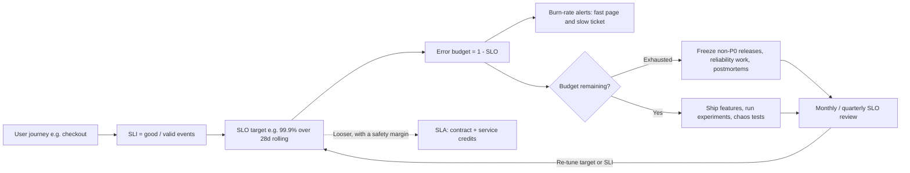

# J1 SLIs, SLOs & Error Budgets
> Last verified: 2026-10 · Audience: senior/staff DevOps, SRE, AI eng, NetEng, DevSecOps, architects

> Section J is not in the curriculum file. The curriculum's "Known gap" note says SLOs, error budgets, alerting and incident response are not covered by any course, and suggests the Google SRE book as the source. IDs J1.1–J1.8 are defined here.

## TL;DR
- **SLI** = what you measure (ratio of **good events / valid events**, 0–100%). **SLO** = internal target for that SLI over a **compliance window** (often 28/30-day rolling). **SLA** = an external contract with **money (service credits)** attached. Rule: **SLA looser than SLO looser than what you actually achieve.**
- **Error budget = 1 − SLO.** 99.9% over 30 days = **43.2 min** or **0.1% of requests**. Use the budget to decide how fast to ship. It is not a punishment.
- Pick SLIs by system type: **request-driven** (availability, latency, quality), **pipelines** (freshness, correctness, coverage), **storage** (durability). Measure as close to the user as you can (LB logs, client/RUM, synthetics), not CPU or queue depth.
- **Request-based vs window-based (timeslice):** request-based weighs every request equally. Window-based counts "good minutes", hides short bursts, and is required when your only metric is already a percentile.
- **Serial dependencies multiply** (3 × 99.9% ≈ 99.7%). A dependency should be about **one nine better** than the service that calls it. Do not get "extra nines" from redundancy calculations that assume independence.
- **Alert on burn rate, not on raw errors.** The Google multiwindow pattern for 99.9%: page at **14.4× (1h and 5m)** and **6× (6h and 30m)**, ticket at **1× (3d and 6h)**. CloudWatch and Azure Monitor both now support SLO burn-rate alerts natively.
- An **error budget policy** is a signed document: if the budget is exhausted, freeze changes except **P0/security fixes**. A single incident that uses **>20% of the 4-week budget** requires a postmortem with a P0 action item. Disputes escalate to the CTO.
- Tooling: **CloudWatch Application Signals SLOs** (AWS), **Azure Monitor SLIs on service groups** (Azure, new in 2026), **Google Cloud Monitoring SLOs**, and vendor-neutral **OpenSLO**, **Sloth**, **Pyrra**, Datadog, Grafana SLO, Nobl9.



## J1.1 SLI vs SLO vs SLA
- **How it works:**
  - **SLI (indicator)** is a quantitative measure of service level. The preferred form is `good events / valid events × 100`, so every SLI uses the same 0–100% scale and the error budget math is the same for all of them.
  - **SLO (objective)** is a target or range for an SLI over a window, e.g. "99% of `GET /cart` in the window complete in < 200 ms over a 28-day rolling window". The form is `SLI ≥ target` or `lower ≤ SLI ≤ upper`.
  - **SLA (agreement)** is an explicit contract with consequences, usually **service credits**. Legal or business owns it, not engineering.
  - **SLI specification vs implementation** (SRE workbook): the *spec* is what users care about ("home page loads in < 100 ms"). The *implementation* is how you measure it: server logs, LB logs, synthetic probes or client RUM. Each implementation trades quality, coverage and cost differently.
- **Trade-offs / when to use:**
  - Every user-facing service needs SLOs. An SLA is needed only when someone pays you and requires a contract.
  - Internal platforms (Kafka, K8s, DB-as-a-service) should still publish SLOs to their internal consumers. This sets expectations and prevents the "Chubby problem".
- **Interview angles:**
  - "Difference between SLO and SLA?" → The SLA is the **contract with a penalty**. The SLO is the **internal target you engineer to**. The SLO must be **stricter** than the SLA so you notice and react before you owe credits. The SRE book example: an SLA miss triggers a refund, while an SLO miss triggers engineering prioritisation.
  - **Chubby story** (SRE book): Google's lock service was so reliable that teams added unsafe hard dependencies on it. Google then took **planned outages** to burn the leftover budget and expose those dependencies. Lesson: **over-achieving an SLO is also a failure mode.**
  - Use **percentiles, not averages**. The mean hides a tail where 5% of requests can be about 20× slower.

## J1.2 Choosing SLIs
### SLI menu by system type (SRE workbook)
| System type | SLI kinds | Example spec |
|---|---|---|
| Request-driven (API, web, gRPC) | **Availability**, **Latency**, **Quality** (degraded/fallback responses) | "Proportion of valid requests served without 5xx"; "Proportion served < 300 ms"; "Proportion not served from degraded fallback" |
| Pipeline (batch / streaming) | **Freshness**, **Correctness**, **Coverage** | "% of reads using data refreshed < 10 min ago"; "% of output records validated correct"; "% of input partitions processed" |
| Storage | **Durability** (plus availability/latency of reads and writes) | "% of written objects readable later" |
| Also seen | **Throughput** (for batch work), **correctness** for any service with a golden answer | "% of jobs finishing within SLA window" |

- **How it works:**
  - Measure as close to the user as practical, in this order of preference: client/RUM or synthetic probes, then the LB/edge (ALB/Front Door logs), then the server, then infra. Server-side metrics **miss** DNS, TLS, LB and CDN failures.
  - **Valid events** are the denominator. Explicitly **exclude** health checks, internal probes and client errors you are not responsible for. CloudWatch Application Signals' `Availability` counts **4xx as successful** and only 5xx/OTel span errors as faults.
  - **Latency SLIs use thresholds, not percentiles**: "% of requests < 300 ms" can be counted and its budget computed. Use **two thresholds** (e.g. p90 < 100 ms and p99 < 500 ms equivalents) to cover both the typical and the tail user.
  - **Request-based (occurrences)**: `good requests / total requests` over the window. Every request has equal weight, and high-traffic hours dominate.
  - **Window-based (timeslices)**: `good intervals / total intervals`, where an interval (e.g. 1 min) is "good" if a condition holds, such as p95 < 300 ms or error rate < 1%. It smooths short bursts, gives low-traffic periods the same weight as peak, and is **required when the source metric is already a percentile** (Google Cloud docs). OpenSLO calls these `Occurrences`, `Timeslices` and `RatioTimeslices`.
- **Trade-offs / when to use:**
  - Use request-based for high-volume APIs, where it reflects actual user pain. Use window-based for low-traffic services, where one failed request out of 10 would otherwise burn 10% of the budget, and for "uptime-style" contracts. SLAs are mostly time-based ("monthly uptime %").
  - **Low-traffic services** (SRE workbook): add **synthetic traffic**, aggregate several small services into one SLO, change the product to tolerate single failures, or accept a lower target.
  - Rolling windows (e.g. **4 weeks**, which contain the same number of weekends) suit engineering decisions. Calendar windows suit business reporting and SLAs.
- **Interview angles:**
  - "Is CPU a good SLI?" → No. It is a **cause**, not a **symptom**. Users feel latency and errors. Keep CPU for capacity planning and dashboards ([J5](../J-sre/J5-capacity-planning-load-testing.md)).
  - "Why not average latency?" → An average hides bimodal distributions. Use a threshold-ratio SLI.
  - Start with **≤5 SLIs per service** (workbook guidance). Usually that is availability plus latency per critical journey.

## J1.3 SLO math: nines, error budgets, dependency composition
### Nines table (error budget = 1 − SLO)
| SLO | Per day | Per week | Per 28 days | Per 30 days | Per year (365 d) |
|---|---|---|---|---|---|
| 99% | 14.4 min | 1.68 h | 6.72 h | **7.2 h** | 3.65 d (87.6 h) |
| 99.5% | 7.2 min | 50.4 min | 3.36 h | **3.6 h** | 1.83 d (43.8 h) |
| 99.9% | 1.44 min | 10.1 min | 40.3 min | **43.2 min** | 8.76 h |
| 99.95% | 43.2 s | 5.04 min | 20.2 min | **21.6 min** | 4.38 h |
| 99.99% | 8.64 s | 60.5 s | 4.03 min | **4.32 min** | 52.6 min |
| 99.999% | 0.86 s | 6.05 s | 24.2 s | **25.9 s** | 5.26 min |
| 99.9999% | 86 ms | 0.6 s | 2.4 s | **2.6 s** | 31.5 s |

- **How it works:**
  - Request-based budget = `(1 − SLO) × valid requests in window`. For 99.9% at 1B requests/month that is **1M bad requests**. A period-based budget is counted in bad minutes. CloudWatch example: 30 d × 1-min periods = 43,200 periods, and at 99% the SLO is met if at least 42,768 periods are healthy.
  - **Serial composition** (all dependencies required, failures independent): `A = A1 × A2 × … × An`. Example: 99.9%³ ≈ **99.70%**, and 99.99% × 5 ≈ 99.95%.
  - **Parallel / redundant composition** (any one replica suffices, failures independent): `A = 1 − Π(1 − Ai)`. Two 99.9% zones give 99.9999% on paper, but **zones share control planes, deploys, config and DNS**, so real failures are correlated. The workbook warns: do not "math your way out".
  - **Rule of the extra nine** ("The Calculus of Service Availability", Treynor et al.): each critical hard dependency should be about **10× more available** than your target (one more nine). If it is not, add redundancy, graceful degradation, caching or async decoupling.
  - **Budget allocation:** share the budget between your own code, deploys and dependencies. Example for a 99.9% service: 0.05% for your own bugs and deploys, 0.03% for the DB, 0.02% for the network and LB.
- **Trade-offs / when to use:**
  - Each extra nine costs roughly **10× in engineering and infra** (multi-region, active-active, slower and safer deploys). Choose the target from **user and business need**, not from what the system currently achieves.
  - Customer-observed availability is capped by **their ISP and devices** (often about 99%–99.9%). Above about 99.99%, users cannot notice the difference.
- **Interview angles:**
  - "Your service depends on 4 services at 99.9% each. What can you promise?" → Serial ≈ 99.6% without mitigation. To promise 99.9%, make dependencies soft (timeouts, fallbacks, caches) or require 99.99% from them. Cross-link [C3 Reliability](../C-large-scale-architecture/C3-reliability.md#c34-availability).
  - Watch for **calendar month vs 30-day** differences (Feb has 40,320 min) and **"5 nines on a 28-day window = 24 s"**: a single bad deploy rollback takes longer than that.

## J1.4 Error budgets, burn rate & error budget policies
- **How it works:**
  - **Burn rate** = observed error rate ÷ (1 − SLO). At burn rate 1, the budget runs out exactly at the end of the window. At 14.4 on a 30-day window it runs out in 30 d / 14.4 ≈ **50 h**. CloudWatch formula: `burn rate threshold = X% budget × window hours / look-back hours`, e.g. 5% × 720 / 1 = **36**.
  - **Multiwindow, multi-burn-rate alerts** (SRE workbook, 99.9% SLO). Every row requires **both** the long and the short window to breach. The short window (1/12 of the long one) makes the alert reset quickly once the problem is fixed.

    | Severity | Long window | Short window | Burn rate | Budget consumed at trigger |
    |---|---|---|---|---|
    | Page | 1 h | 5 min | **14.4** | 2% |
    | Page | 6 h | 30 min | **6** | 5% |
    | Ticket | 3 d | 6 h | **1** | 10% |
  - In **CloudWatch** you create burn rates with look-back windows (`burn_rate_configurations`), alarm on each one, and combine pairs with a **composite alarm** `ALARM(1h) AND ALARM(5m)`. AWS documents exactly the 1h/5m, 6h/30m, 3d/6h pairs, which need an SLO interval of **3 h or more**.
  - In **Azure Monitor SLIs** you get a **baseline alert**, a **fast burn-rate** alert and a **slow burn-rate** alert, all routed to **action groups**.
  - **Error budget policy** (SRE workbook example):
    - If the budget is exceeded over the trailing **4 weeks**, **halt all changes and releases except P0 issues and security fixes** until the service is back within SLO.
    - Reliability work becomes mandatory if the miss was caused by your bugs or process. Work may continue if the cause was external, such as a company-wide network outage, an out-of-scope upstream failure or out-of-scope traffic.
    - A single incident that consumes **>20% of the 4-week budget** requires a **postmortem with at least one P0 action item**.
    - If one **class** of outage consumes more than 20% over a **quarter**, add a P0 item to next quarter's planning.
    - Disagreements **escalate to the CTO**. The policy is agreed in advance and signed by product, dev and SRE.
  - **Burn reviews:** a weekly or monthly SLO review covers budget remaining, top budget consumers and whether the SLI still matches user pain. Workbook decision matrix:
    - **SLO met, low toil**: ship faster or move SREs to other work.
    - **SLO met, high toil**: fix alerting or automation.
    - **SLO missed**: tighten the SLO, or reduce toil and improve mitigation.
- **Trade-offs / when to use:**
  - Freezes work only if leadership enforces them. Softer alternatives are canary-only deploys, more review, or a "reliability sprint".
  - **Exclusion windows** (CloudWatch supports scheduled and recurring ones): for period-based SLOs, data in the window counts as non-breaching. For request-based SLOs, all requests in the window are excluded. Using them for planned maintenance is fine. Using them to hide incidents is a red flag.
- **Interview angles:**
  - "Why not page on 1% errors for 5 min?" → That either pages on harmless blips (poor precision) or misses slow burns (poor recall). Burn-rate alerts link the page to a specific share of the budget. Details in [J2 Monitoring and alerting](../J-sre/J2-monitoring-and-alerting.md).
  - "Budget left at month-end, what now?" → Spend it: speed up releases, run chaos experiments ([J7](../J-sre/J7-chaos-engineering.md)) or schedule planned maintenance. **Do not** lower the bar by reflex.
  - Release velocity ties to the budget through progressive delivery ([C5 Deployment](../C-large-scale-architecture/C5-deployment.md), [J6](../J-sre/J6-toil-release-engineering.md)) and postmortems ([J4](../J-sre/J4-incident-response-postmortems.md)).

## J1.5 User-journey SLOs; SLOs for data pipelines, ML and LLM services
- **How it works (Critical User Journeys, CUJ):**
  - List the 3–5 journeys that matter to the business: login, search, add-to-cart, checkout, upload. Define availability and latency SLIs **per journey**, not per microservice.
  - Measure at the **edge or client**. Synthetic canaries cover multi-step journeys (CloudWatch Synthetics can feed SLOs: "Create an SLO on a canary"). Service-level SLOs then roll up to the journey.
  - **CloudWatch composite SLOs** aggregate `Availability` across **2–20 operations** of one service. **Azure** scopes SLIs to a **service group**, which is a logical workload boundary.
- **Data pipelines:**
  - **Freshness**: % of time (or of reads) where data age < N min, e.g. "99% of dashboard reads see data < 15 min old".
  - **Correctness**: % of records that pass validation or reconciliation.
  - **Coverage**: % of expected partitions or sources processed.
  - **Job success / completion time**: % of daily jobs complete by 06:00.
  - Lag-based SLIs for streaming include Kafka consumer lag in seconds and watermark delay. See [M5 Stream processing](../M-data-platforms/M5-stream-processing.md) and [M6 Orchestration](../M-data-platforms/M6-orchestration-etl.md).
- **ML inference:**
  - Availability and latency as for any API.
  - **Quality**: % of predictions served by the primary model rather than the fallback or default.
  - **Model freshness**: model age < N days.
  - **Feature freshness**: online feature store staleness.
  - Drift monitors are signals, not usually SLOs.
- **LLM serving** (details in [K4 LLM serving](../K-ai-infra-llm/K4-llm-serving-inference.md)):
  - **TTFT (time to first token)**: e.g. "95% of interactive requests have TTFT < 1 s".
  - **Inter-token latency / TPOT**: e.g. "p95 inter-token latency < 50 ms", which is about 20 tokens/s per stream and faster than reading speed.
  - **Output tokens/s** per request and **aggregate throughput** are capacity SLIs.
  - **End-to-end latency** depends heavily on output length. Normalise it, or bucket it by token count.
  - **Availability**: decide in advance whether **429/throttling** counts as bad. It should count when it comes from your own capacity or quota (Bedrock / Azure OpenAI provisioned throughput). It need not count when it is a per-tenant rate limit working as designed.
  - **Quality SLIs**: a sampled LLM-as-judge or eval pass rate, groundedness, refusal or guardrail-block rate. See [K9 LLMOps](../K-ai-infra-llm/K9-llmops-evals-guardrails.md).
- **Trade-offs / when to use:**
  - Journey SLOs match user pain but are harder to attribute to a single owning team. Keep both: journey SLOs for business reporting, service SLOs for team ownership and alerts.
  - LLM latency depends on prompt length and output length. Segment SLOs by tier (interactive vs batch) and by model.
- **Interview angles:**
  - "Define an SLO for a chat assistant" → Give TTFT p95 < 1 s, ITL p95 < 50 ms, availability 99.9% (5xx plus capacity 429s count as bad), and a weekly eval-score floor. Batch summarisation gets a looser completion-time SLO.
  - "Pipeline has no requests, how do you SLO it?" → Use freshness, correctness and coverage, measured by a probe that reads the output table, not by job exit codes.

## J1.6 SLAs and contractual credits
- **How it works:**
  - An SLA defines **uptime %**, **how downtime is measured**, **exclusions** (force majeure, customer misconfiguration, preview features, suspension), **credit tiers** and the **claim process**.
  - Credits are a **% of that service's monthly bill** and are applied to future invoices. They are almost never cash.

  | Service (as of 2026-10) | Commitment | Credit tiers |
  |---|---|---|
  | **AWS EC2 (Region-level)**, instances across **≥2 AZs** | **99.99%** monthly uptime | <99.99%: 10% · <99.0%: 30% · <95.0%: 100% |
  | **AWS EC2 (Instance-level)**, single instance | **99.5%** | tiered; a credit applies if an instance is unavailable for more than 6 min in an hour (per AWS SLA page) |
  | **AWS S3 Standard** | 99.9% | <99.9%: 10% · <99.0%: 25% · <95.0%: 100% (IA/One Zone-IA tiers start at 99%). **Durability (11 nines) is a design target, not in the SLA** |
  | **Azure VMs across ≥2 Availability Zones** | **99.99%** | <99.99%: 10% · <99%: 25% · <95%: 100% |
  | **Azure VMs in an Availability Set / Dedicated Host Group** | **99.95%** | <99.95%: 10% · <99%: 25% · <95%: 100% |
  | **Azure single-instance VM** | **99.9%** (Premium SSD / Premium SSD v2 / Ultra on all disks), **99.5%** (Standard SSD), **95%** (Standard HDD) | Premium tiers: <99.9%: 10% · <99%: 25% · <95%: 100% |
  | **Azure Application Insights** (query availability) | 99.9% | <99.9%: 10% · <99%: 25% |

  - **Claims:**
    - **AWS**: file a support case **by the end of the second billing cycle** after the incident. The credit must be more than $1.
    - **Azure**: the claim must be received **within 60 days** of the incident, with logs and resource names. Microsoft usually processes it in about 45 days. Only **one credit per service per period**.
- **Trade-offs / when to use:**
  - Credits rarely cover the business loss. An SLA tells you **expected reliability** and gives you **leverage**, not insurance. Design for the **SLO you need**, using multiple AZs or regions.
  - Your own SLA must be **looser than your internal SLO**, which in turn must be looser than the composed SLAs of your dependencies. Example: built on 99.99% compute, a 99.95% DB and a 99.99% LB, you may sell 99.9% at most.
- **Interview angles:**
  - "Single VM, what SLA?" → AWS: 99.5% instance-level. Azure: 99.9% only with Premium SSD-class disks. Both clouds' 99.99% requires **≥2 AZs**.
  - A cloud's "SLA" covers **its control or data plane**, not your app. A healthy region with a broken deploy is still your outage.
  - Pitfall: **preview features have no SLA** (e.g. Azure service groups and health models are in preview).

## J1.7 SLO tooling: OpenSLO, Sloth, Pyrra, cloud-native
| Tool | What it is | Key details |
|---|---|---|
| **OpenSLO** | Vendor-neutral YAML spec | `apiVersion: openslo/v1` (v2alpha draft in repo). Kinds: `SLO`, `SLI`, `DataSource`, `AlertPolicy`, `AlertCondition`, `AlertNotificationTarget`, `Service`. `budgetingMethod: Occurrences / Timeslices / RatioTimeslices`. `timeWindow` uses `duration` plus `isRolling`. SLIs are `ratioMetric` (good/bad/total) or `thresholdMetric`. Nobl9 started the spec |
| **Sloth** (slok/sloth, v0.16.0 Apr 2026) | Generates Prometheus SLO rules | Spec `prometheus/v1` (service, slos, objective, `sli.events.error_query` / `total_query`, `alerting.page_alert` / `ticket_alert`). Also a K8s CRD `PrometheusServiceLevel` and **OpenSLO input**. Outputs recording rules plus Google multiwindow multi-burn alerts. Has SLI plugins and Grafana dashboards |
| **Pyrra** (v0.10.2 Sep 2026) | SLO controller plus UI for Prometheus | CRD `pyrra.dev/v1alpha1` `ServiceLevelObjective` with `target`, `window` (e.g. 2w) and an `indicator` of type `ratio`, `latency` or `bool_gauge`. Generates burn-rate recording rules and `PrometheusRule` objects. Runs with a Kubernetes or filesystem backend |
| **Google Cloud Monitoring SLOs** | Native | Request-based and windows-based SLOs. Rolling compliance periods of **1–30 days** or calendar periods. Burn-rate alerting policies. Up to **500 SLOs per service**. Auto-detects services for Istio, Cloud Service Mesh and App Engine |
| **Datadog SLOs** | SaaS | Metric-based, monitor-based and time-slice SLOs. Burn-rate and budget alerts |
| **Grafana SLO** (Grafana Cloud) | SaaS on Prometheus/Mimir | Generates recording rules and multiwindow alerts, similar to Sloth |
| **Nobl9** | SaaS SLO platform | OpenSLO-native (`sloctl`). Pulls from many data sources, supports composite SLOs |

- **Trade-offs / when to use:**
  - Use cloud-native tools when telemetry already lives in CloudWatch or Azure Monitor and you have one cloud. Use OpenSLO plus Sloth or Pyrra for multi-cloud or Kubernetes with Prometheus. SaaS tools (Datadog, Nobl9, Grafana) suit org-wide SLO reporting across many sources.
  - Generated rules beat hand-written ones because burn-rate rules are easy to get subtly wrong (window ratios, `rate()` ranges).
- **Interview angles:**
  - "How do you keep SLOs in GitOps?" → Put OpenSLO or Sloth specs in the repo, have CI generate `PrometheusRule` objects, and apply them with Argo/Flux. In AWS use Terraform `awscc_applicationsignals_service_level_objective`.

## J1.8 SLO anti-patterns
- **100% target**: leaves zero budget, so you can never deploy. It is also impossible because user devices and ISPs are less reliable than that. An SLO at **current performance** blocks future change. Set it at what users need, with headroom.
- **Too many SLOs**: dozens per service means nobody reads them and every alert is noise. Keep **≤5 per service**, about 1–2 per critical user journey.
- **Internal or cause metrics as SLIs**: CPU, memory, pod restarts and queue depth are causes, not symptoms. Use them for dashboards and capacity planning, not SLOs.
- **Measuring only server-side**: this misses LB, DNS, TLS and CDN failures. Add synthetics or RUM.
- **Average latency, or a percentile-of-percentiles across hosts**: aggregating p99s across hosts is mathematically wrong. Use histograms or threshold ratios.
- **SLO with no policy**: if missing the budget changes nothing, the SLO is only decoration. No owner and no review cadence leads to the same result.
- **Over-achieving** (the Chubby problem): consumers start depending on reliability you never promised. Spend the budget or publish the real SLO.
- **SLA equal to SLO**: leaves no reaction time before credits are owed. Keep the SLA looser.
- **Mixing traffic classes**: averaging batch and interactive traffic, or long and short LLM generations, into one latency SLO hides problems. Segment them.
- **Counting user errors as bad**: 4xx are usually valid-but-good or excluded entirely (Application Signals treats 4xx as non-faults). Watch for 429s from your own throttling, which **are** your fault.
- **Paging on SLO threshold breach alone**: by the time a 30-day SLO is breached the budget is already gone. Page on **burn rate**.
- **Interview angles:** "What is the first anti-pattern you'd fix in a new team?" → SLOs defined on infrastructure metrics with static-threshold paging. Replace them with 2–3 journey SLIs and burn-rate alerts, and get an error budget policy signed.

## Cloud mapping: AWS vs Azure
| Capability | AWS | Azure | Role it plays | Key differences | Alternatives |
|---|---|---|---|---|---|
| Native SLO object | **CloudWatch Application Signals SLOs** (`AWS::ApplicationSignals::ServiceLevelObjective`) | **Azure Monitor service level indicators** on a **service group** (portal "Create SLIs"; service groups are **preview**) | Define SLI, target, window; compute attainment, budget, burn rate | AWS: period-based or request-based SLI. Azure: request-based or window-based. AWS supports calendar or rolling intervals from hours up to a year, **default 7-day rolling, 99% goal, 50% warning threshold**. Azure has a "compliance/evaluation period" | Google Cloud SLOs, Datadog, Grafana SLO, Nobl9, Sloth/Pyrra |
| SLI data source | Application Signals standard metrics (`Latency`, `Fault`, `Error` → Availability), **any CloudWatch metric / metric math**, **Synthetics canaries**, service dependencies | **Azure Monitor workspace** metrics (Prometheus-compatible) read with a **user-assigned managed identity** (Monitoring Reader on the source, Monitoring Metrics Publisher on the destination DCR) | Where good and total events come from | AWS auto-discovers services through ADOT/OTel. Azure needs separate source and destination workspaces (they can be the same) and explicit good/total signal formulas | OpenTelemetry + Prometheus |
| APM feeding SLIs | **Application Signals** (ADOT, EKS/ECS/EC2/Lambda) | **Application Insights** (OpenTelemetry-based) | Request, latency and dependency telemetry | App Insights has its own SLA (99.9% query availability) but no SLO object of its own. You build SLIs from its metrics or use the service-group SLIs | Datadog APM, Grafana Tempo/Mimir |
| Burn-rate alerting | `burn_rate_configurations` (look-back minutes) + CloudWatch alarms + **composite alarms** for multiwindow | **Fast** and **slow** burn-rate alerts plus a baseline alert, sent to **action groups** | Paging on budget consumption | AWS documents Google's 1h/5m, 6h/30m, 3d/6h pairs. Azure exposes two burn tiers in the wizard | Sloth/Pyrra generated Prometheus alerts |
| Grouping / health rollup | **Composite SLO** (2–20 operations), service-level SLO ("All Operations") | **Health models** (preview): entity graph with health roll-up over metrics, logs, Prometheus and App Insights signals | Journey or workload-level view | Health models are state-based health, not budget accounting. Pair them with SLIs | Nobl9 composite SLOs |
| Maintenance exclusion | **Time window exclusions** (one-time or recurring cron/rate) | Not documented for SLIs (unverified) | Avoid burning budget on planned work | AWS: excluded period-based windows count as non-breaching | — |
| IaC | **awscc** provider `awscc_applicationsignals_service_level_objective`. **No resource in hashicorp/aws as of 2026-10** (verified against provider source) | Portal-first. ARM/Bicep/Terraform support for SLIs (unverified). Health models have ARM, Bicep and Terraform quickstarts | SLOs as code | Use awscc or CloudFormation on AWS. On Azure, check `azapi` for the SLI resource type (unverified) | OpenSLO + Sloth in Git |

- **CloudWatch Application Signals SLOs:** an SLO targets a service, an operation, a dependency or any CloudWatch metric. It publishes attainment, error budget and burn-rate metrics, which you alarm on. Burn-rate alarms and the underlying Application Signals telemetry cost extra (exact SLO pricing is under Application Signals on the CloudWatch pricing page, unverified). It is regional, and cross-account works through CloudWatch cross-account observability (`account_id` in metric queries).
- **Azure Monitor SLIs:** launched in 2026 and scoped to **service groups**, a governance construct for grouping resources across subscriptions that is itself in **preview**. Treat the feature as **preview and without an SLA** (unverified label). It shows the trend, remaining error budget and burn rate per SLI.
- **Gotchas:**
  - AWS counts 4xx as available.
  - AWS period-based SLOs treat missing data per its rules. Low traffic can make request-based burn rates jumpy.
  - Azure's SLI depends on metrics being present in an **Azure Monitor workspace**, not a Log Analytics workspace. App Insights data must be available as metrics there.
- **Alternatives:**
  - **Google Cloud Monitoring SLOs** are the reference implementation of the SRE-book model.
  - **Datadog**, **Grafana Cloud SLO** and **Nobl9** work across clouds.
  - **Sloth/Pyrra** on Kubernetes with Prometheus, Azure Managed Prometheus or Amazon Managed Service for Prometheus.

## Hands-on
### Error budget calculator (bash)
```bash
# Usage: ./budget.sh 99.95 30   -> allowed bad minutes in a 30-day window
slo=${1:-99.9}; days=${2:-30}
awk -v s="$slo" -v d="$days" 'BEGIN{
  b=1-s/100; m=d*1440
  printf "SLO %s%% over %dd: budget %.2f min (%.1f s); 14.4x burn exhausts in %.1f h\n", s, d, b*m, b*m*60, d*24/14.4 }'
```

### CloudWatch Application Signals SLO (Terraform, awscc provider)
```hcl
terraform {
  required_providers {
    awscc = { source = "hashicorp/awscc", version = ">= 1.0" }
  }
}

# Request-based availability SLO on an Application Signals-discovered service operation
resource "awscc_applicationsignals_service_level_objective" "checkout_availability" {
  name        = "checkout-post-availability"
  description = "99.9% of POST /checkout requests succeed (5xx = bad) over 28d rolling"

  request_based_sli = {
    request_based_sli_metric = {
      key_attributes = {
        Type        = "Service"
        Name        = "checkout"
        Environment = "eks:prod/shop"
      }
      operation_name = "POST /checkout"
      metric_type    = "AVAILABILITY"
    }
  }

  goal = {
    attainment_goal   = 99.9
    warning_threshold = 50 # warn when 50% of budget remains
    interval = {
      rolling_interval = { duration = 28, duration_unit = "DAY" }
    }
  }

  # Look-back windows for multiwindow burn-rate alarms (pair 60/5, 360/30, 4320/360)
  burn_rate_configurations = [
    { look_back_window_minutes = 5 },
    { look_back_window_minutes = 30 },
    { look_back_window_minutes = 60 },
    { look_back_window_minutes = 360 },
    { look_back_window_minutes = 4320 },
  ]

  exclusion_windows = [{
    reason          = "Weekly DB maintenance"
    start_time      = "2026-10-12T02:00:00Z"
    window          = { duration = 1, duration_unit = "HOUR" }
    recurrence_rule = { expression = "rate(7 days)" }
  }]
}

# Period-based latency SLO on a plain CloudWatch metric (ALB p99 < 300 ms per 1-min period)
resource "awscc_applicationsignals_service_level_objective" "alb_latency" {
  name = "storefront-alb-p99-latency"
  sli = {
    comparison_operator = "LessThan"
    metric_threshold    = 0.3 # TargetResponseTime is in seconds
    sli_metric = {
      metric_data_queries = [{
        id = "p99"
        metric_stat = {
          metric = {
            namespace   = "AWS/ApplicationELB"
            metric_name = "TargetResponseTime"
            dimensions  = [{ name = "LoadBalancer", value = "app/storefront/0123456789abcdef" }]
          }
          period = 60
          stat   = "p99"
        }
      }]
    }
  }
  goal = {
    attainment_goal = 99
    interval = { calendar_interval = { duration = 1, duration_unit = "MONTH", start_time = 1790812800 } }
  }
}
```
- Alarm on the published burn-rate metrics with `aws_cloudwatch_metric_alarm`, then combine pairs with `aws_cloudwatch_composite_alarm`, e.g. `ALARM(burn60) AND ALARM(burn5)`. Thresholds: 14.4 for 60/5, 6 for 360/30, 1 for 4320/360. Check the burn-rate metric names and dimensions in the console before wiring them (unverified here).
- The exclusion-window `expression` syntax (cron or rate) and the `key_attributes` Environment format depend on the platform (e.g. `eks:<cluster>/<namespace>`). Verify them against the Application Signals service list.

### Prometheus multiwindow burn-rate rules (99.9% SLO)
```yaml
groups:
  - name: checkout-slo
    rules:
      - record: slo:error_ratio:rate5m
        expr: sum(rate(http_requests_total{job="checkout",code=~"5.."}[5m])) / sum(rate(http_requests_total{job="checkout"}[5m]))
      - record: slo:error_ratio:rate1h
        expr: sum(rate(http_requests_total{job="checkout",code=~"5.."}[1h])) / sum(rate(http_requests_total{job="checkout"}[1h]))
      - record: slo:error_ratio:rate30m
        expr: sum(rate(http_requests_total{job="checkout",code=~"5.."}[30m])) / sum(rate(http_requests_total{job="checkout"}[30m]))
      - record: slo:error_ratio:rate6h
        expr: sum(rate(http_requests_total{job="checkout",code=~"5.."}[6h])) / sum(rate(http_requests_total{job="checkout"}[6h]))
      - alert: CheckoutErrorBudgetBurn
        expr: |
          (slo:error_ratio:rate1h > (14.4 * 0.001) and slo:error_ratio:rate5m > (14.4 * 0.001))
          or
          (slo:error_ratio:rate6h > (6 * 0.001) and slo:error_ratio:rate30m > (6 * 0.001))
        labels:
          severity: page
        annotations:
          summary: "checkout is burning its 30d error budget >=6x (page)"
```
- In practice, generate these with **Sloth** or **Pyrra** from a single SLO spec rather than writing them by hand.

## Cross-links
- [C3 Reliability: availability, redundancy, SPOFs](../C-large-scale-architecture/C3-reliability.md#c34-availability)
- [C5 Deployment: canary, progressive delivery](../C-large-scale-architecture/C5-deployment.md)
- [J2 Monitoring and alerting: symptom-based alerting, burn rates](../J-sre/J2-monitoring-and-alerting.md)
- [J3 Observability](../J-sre/J3-observability.md) · [J4 Incident response & postmortems](../J-sre/J4-incident-response-postmortems.md) · [J5 Capacity planning](../J-sre/J5-capacity-planning-load-testing.md) · [J6 Toil & release engineering](../J-sre/J6-toil-release-engineering.md) · [J7 Chaos engineering](../J-sre/J7-chaos-engineering.md)
- [K4 LLM serving & inference: TTFT, ITL, throughput](../K-ai-infra-llm/K4-llm-serving-inference.md) · [K9 LLMOps, evals, guardrails](../K-ai-infra-llm/K9-llmops-evals-guardrails.md)
- [M5 Stream processing: lag, watermarks](../M-data-platforms/M5-stream-processing.md) · [M6 Orchestration/ETL: pipeline freshness](../M-data-platforms/M6-orchestration-etl.md)

## Sources
- https://sre.google/sre-book/service-level-objectives/
- https://sre.google/workbook/implementing-slos/
- https://sre.google/workbook/alerting-on-slos/
- https://sre.google/workbook/error-budget-policy/
- https://docs.aws.amazon.com/AmazonCloudWatch/latest/monitoring/CloudWatch-ServiceLevelObjectives.html
- https://docs.aws.amazon.com/AmazonCloudWatch/latest/monitoring/AppSignals-MetricsCollected.html
- https://github.com/hashicorp/terraform-provider-awscc/blob/main/docs/resources/applicationsignals_service_level_objective.md
- https://github.com/hashicorp/terraform-provider-aws/tree/main/internal/service/applicationsignals (no SLO resource registered)
- https://learn.microsoft.com/en-us/azure/azure-monitor/fundamentals/service-level-indicators-create
- https://learn.microsoft.com/en-us/azure/azure-monitor/health-models/overview
- https://docs.cloud.google.com/stackdriver/docs/solutions/slo-monitoring
- https://github.com/OpenSLO/OpenSLO (website/docs/specification.md, examples/budgeting-method)
- https://sloth.dev/ · https://github.com/pyrra-dev/pyrra
- https://aws.amazon.com/compute/sla/ · https://aws.amazon.com/s3/sla/
- https://www.microsoft.com/licensing/docs/view/Service-Level-Agreements-SLA-for-Online-Services (Online Services Consolidated SLA, October 2026: Virtual Machines, Application Insights, Azure Monitor)
