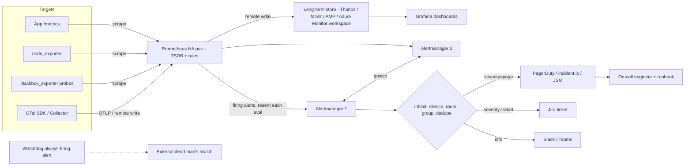
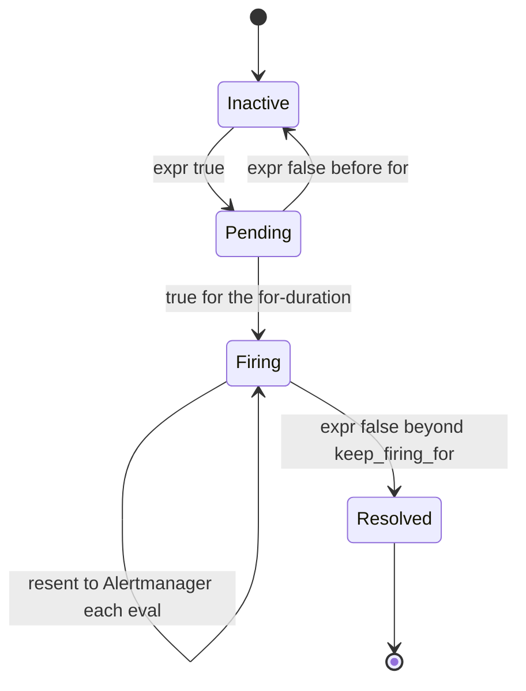

# J2 Monitoring and Alerting
> Last verified: 2026-10 · Audience: senior/staff DevOps, SRE, AI eng, NetEng, DevSecOps, architects

## TL;DR
- **Monitoring** answers questions you already know to ask (dashboards and alerts on known failure modes). **Observability** lets you answer new questions from high-cardinality telemetry. You need both. Alerts come from monitoring; debugging happens in observability ([J3](J3-observability.md)).
- Start from the **four golden signals** (latency, traffic, errors, saturation) for services, **RED** (rate, errors, duration) for request-driven services, and **USE** (utilization, saturation, errors) for resources.
- **Page on symptoms, not causes.** Page on user-visible SLO burn. Send causes (high CPU, a node down, a disk at 80%) to tickets or dashboards. Every page must be urgent, actionable and need a human.
- **Multi-window, multi-burn-rate SLO alerts** (SRE Workbook): page at **14.4x over 1h AND 5m** (2% of budget), page at **6x over 6h AND 30m** (5%), and ticket at **1x over 3d AND 6h** (10%). The short window is 1/12 of the long window so the alert resets quickly once the burn stops.
- **Prometheus:** pull-based scraping, a local single-node TSDB (15d retention by default, about 1–2 bytes/sample), recording rules, and alert rules that send to **Alertmanager** (grouping, inhibition, silences, routing, HA over gossip). It scales out with federation or **remote write** to **Thanos / Mimir / VictoriaMetrics / AMP / Azure Monitor workspace**.
- **Black-box** monitoring (probes, synthetics) catches active, user-visible failures, including when your own telemetry pipeline is dead. **White-box** monitoring (internal metrics) catches problems that are about to happen and gives you causes.
- **On-call health** (Google SRE): at most 25% of time on-call, at most 2 incidents per 12h shift, at least 8 engineers for a single-site rotation or 6 per site for follow-the-sun. Track pages per shift, off-hours pages and the percentage of actionable alerts.
- **Cloud:** CloudWatch alarms (metric, composite, anomaly detection, now also PromQL and log alarms) map to Azure Monitor alerts (metric, log search, Prometheus rule groups, dynamic thresholds) plus **action groups**. AMP ↔ Azure Monitor managed Prometheus. Amazon Managed Grafana ↔ Azure Managed Grafana. **Opsgenie reaches end of support on 2027-04-05** (end of sale was 2025-06-04). AWS **Incident Manager no longer accepts new customers**.

## J2.1 Monitoring vs observability
- **How it works:**
  - **Monitoring** means collecting, processing, aggregating and displaying real-time quantitative data (query counts, error counts, latencies, process lifetimes) and alerting on it. It assumes you know the failure modes ahead of time.
  - **Observability** is a property of the system: you can infer internal state from outputs. In practice that means high-cardinality, high-dimensionality events, traces and exemplars that you can slice by any attribute after the fact ("unknown unknowns").
  - Telemetry types: **metrics** (cheap, aggregated, good for alerting and trends), **logs** (detailed, delayed, expensive), **traces** (causality across services), **profiles**, and **events** (deploys, flag flips).
  - SRE Workbook rule: use **metrics for real-time alerting** and **logs for root cause**. For rare events, turn log lines into counter metrics and alert on those rather than on the logs directly.
  - Collection, storage, alerting and dashboards should be **loosely coupled** so you can swap pieces (for example OTel Collector → any backend).
- **Trade-offs / when to use:**
  - Metrics have bounded cost (cost ∝ number of series), so **cardinality** is the enemy. Never use user ID, request ID or raw URL as a Prometheus label.
  - Observability backends (columnar event stores, tracing) answer "why", but sampling and cost need tuning.
- **Interview angles:**
  - "Is observability just monitoring rebranded?" → No. Monitoring is a *subset*: predefined questions and alerts. Observability supports exploratory debugging of novel failures. Alerts should still fire on SLO symptoms, and the engineer then pivots into traces and logs.
  - Pitfall: alerting directly on log search queries at scale. It is slow, costly and fragile. Derive metrics instead.
  - Follow-up: the "monitor the monitor" problem. Use a dead man's switch (an always-firing `Watchdog` alert to an external heartbeat service) and an off-platform black-box probe.

## J2.2 Four golden signals
- **How it works (Google SRE book, ch. 6):**
  - **Latency:** time to serve a request. **Separate successful from failed latency.** A fast 500 is still an error, and a slow error is worse than a fast one.
  - **Traffic:** demand, for example HTTP req/s, sessions, transactions/s, or bytes/s for streaming.
  - **Errors:** rate of failed requests: explicit (5xx), implicit (200 with wrong content) and by policy (anything slower than 1s counts as an error).
  - **Saturation:** how "full" the service is, focused on the *most constrained* resource (memory, IO, thread pools, queue depth). Latency increases are often a leading indicator. Includes predictions like "disk full in 4h".
  - Measure latency with **histograms with exponential buckets**, not averages. At 1,000 req/s with a 100 ms mean, 1% of requests can take 5 s, and the mean hides it. Alert on p99/p99.9 or, better, on the fraction of requests over a threshold (an SLI).
- **Trade-offs / when to use:**
  - These are the minimum for any user-facing service. If you can only measure four things, measure these.
  - Saturation is the hardest to define. Pick the resource that runs out first (for example the connection pool, not CPU).
- **Interview angles:**
  - "Design monitoring for service X" → golden signals per endpoint and per dependency, SLIs derived from them, burn-rate alerts on the SLIs, and saturation as tickets or capacity input ([J5](J5-capacity-planning-load-testing.md)).
  - Pitfall: averaging percentiles across instances (p99 of p99s is meaningless). Aggregate the histogram buckets first, then compute the quantile: `histogram_quantile(0.99, sum by (le) (rate(http_request_duration_seconds_bucket[5m])))`.
  - Also export **intended-change** metrics (build version, config version, flag state) so dashboards line up outages with deploys (SRE Workbook).

## J2.3 USE and RED methods
- **How it works:**

| Method | Author | Applies to | Signals |
|---|---|---|---|
| **USE** | Brendan Gregg | Resources: CPU, memory, disks, NICs, buses, locks, thread pools | **U**tilization (% busy), **S**aturation (queued/extra work, e.g. run-queue length, swap), **E**rrors (error events) |
| **RED** | Tom Wilkie | Request-driven services and microservices | **R**ate (req/s), **E**rrors (failed req/s), **D**uration (latency distribution) |
| **Golden signals** | Google SRE | User-facing services | Latency, traffic, errors, saturation (RED + saturation) |

  - USE checklist on Linux: CPU utilization from `mpstat`, saturation from `vmstat r` (run queue greater than core count), memory saturation from swapping or OOM kills (PSI `/proc/pressure/*`), disk utilization and saturation from `iostat -x` (`%util`, `aqu-sz`), NIC from `sar -n DEV` plus drops ([A-operating-systems](../A-operating-systems/A8-more-os-concepts.md)).
- **Trade-offs / when to use:**
  - RED tells you *users are hurting*. USE tells you *which resource is the bottleneck*. Use RED for alerts and dashboards at the top, and USE for drill-down.
  - High utilization is not saturation. A disk at 100% `%util` on NVMe can still have headroom because of parallel queues. Saturation (queueing) is what drives latency.
- **Interview angles:**
  - "RED vs golden signals?" → RED is the golden signals without saturation. Add saturation for services with bounded pools.
  - Follow-up: Kubernetes. Pods get RED (from ingress or service mesh metrics). Nodes and containers get USE (cAdvisor, node_exporter, CPU throttling `container_cpu_cfs_throttled_periods_total`).

## J2.4 Symptom vs cause alerting
- **How it works:**
  - **Symptom** = what users see ("checkout p99 > 800 ms", "5xx ratio burning budget"). **Cause** = why ("DB CPU 95%", "one replica down").
  - Page on symptoms, preferably as **SLO burn**. Causes go to dashboards, tickets or auto-remediation. Redundant systems tolerate cause-level failures without user impact, so paging on them creates noise.
  - Exceptions where a cause is worth a page: **imminent, certain** symptoms with lead time, such as disk-full ETA (`predict_linear(node_filesystem_avail_bytes[6h], 4*3600) < 0`), cert expiry under 7 days, or quota exhaustion.
- **Trade-offs / when to use:**
  - Symptom alerts are fewer and robust to architecture changes, but less specific. Pair each one with a runbook and dashboard links that point to likely causes.
  - Cause alerts are useful for **non-user-facing** batch or data pipelines, and as **inhibition sources** (for example "cluster unreachable" suppresses per-service alerts).
- **Interview angles:**
  - "You get 200 alerts when a DB fails over. Fix it." → Move to symptom-based SLO alerts, group by service and cluster in Alertmanager, inhibit downstream alerts while the upstream one fires, and demote cause alerts to tickets.
  - Pitfall: "CPU > 80%" pages. CPU at 80% with SLOs met is healthy utilization, not an incident.

## J2.5 Multi-window multi-burn-rate SLO alerts
### Burn-rate math
- **Burn rate** = observed error rate ÷ (1 − SLO). Burn 1 uses exactly the whole budget over the SLO window (e.g. 30d). For a 99.9% SLO, the budget is 0.1% and burn 14.4 means an error rate of 1.44%.
- **Budget consumed** by an alert = burn rate × alert window ÷ SLO period:
  - 14.4 × 1h ÷ 720h = **2%** · 6 × 6h ÷ 720h = **5%** · 1 × 72h ÷ 720h = **10%**
- **Time to exhaust** the entire budget at that rate = period ÷ burn: 14.4x means ~50h (≈2 days). 6x means 5 days. 1x means 30 days.
- **Burn rate threshold for X% of budget in window W:** burn = X × period ÷ W, so 2% in 1h gives 0.02 × 720 ÷ 1 = 14.4.
- **Detection time** (Workbook) = (1 − SLO) ÷ error_ratio × window × burn. For a 100% outage at 99.9% with the 1h/14.4 rule: 0.001 × 60 min × 14.4 ≈ **0.86 min (~52 s)**. For a 2% error rate: 0.001 ÷ 0.02 × 60 × 14.4 ≈ 43 min.

| Severity | Long window | Short window | Burn rate | Budget consumed | Error-rate threshold @99.9% |
|---|---|---|---|---|---|
| **Page** | 1h | 5m | 14.4 | 2% | 1.44% |
| **Page** | 6h | 30m | 6 | 5% | 0.6% |
| **Ticket** | 3d | 6h | 1 | 10% | 0.1% |

### Why multi-window, multi-burn-rate
- The Workbook walks through six iterations: (1) error rate > SLO threshold over 10m gives poor precision; (2) a longer window gives slow reset; (3) a 1h burn-rate alert has good precision but resets slowly and misses slow burns; (4) multiple burn rates add coverage of slow burns; (5) **adding a short window** (1/12 of the long one) means the alert only fires while the burn is *still happening*, and it **resets within minutes** after mitigation. (6) is the recommended combination.
- **Good precision, recall, detection time and reset time**, at the cost of more rules and recording rules (a ratio over 5m, 30m, 1h, 2h, 6h, 1d, 3d).
- **Low-traffic services:** with 10 req/h, one failure is a 10% error rate and burns budget instantly. Options: synthetic traffic, combining services into a larger SLO, requiring a minimum request count (`and sum(rate(...[1h])) > N`), or a longer SLO window.
- **Prefer SLI ratios built from counters** (`rate(errors[1h]) / rate(total[1h])`), not gauges. See [J1 SLIs/SLOs/error budgets](J1-slis-slos-error-budgets.md) for SLI selection and budget policy.

```yaml
# prometheus rules — 99.9% availability SLO for job="checkout"
groups:
- name: slo-checkout-recording
  rules:
  - record: job:slo_errors_per_request:ratio_rate5m
    expr: sum by (job) (rate(http_requests_total{job="checkout",code=~"5.."}[5m]))
        / sum by (job) (rate(http_requests_total{job="checkout"}[5m]))
  # ...repeat for 30m, 1h, 6h, 3d (and 2h/1d if using the 3-page variant)
- name: slo-checkout-alerts
  rules:
  - alert: CheckoutErrorBudgetBurnFast
    expr: |
      (job:slo_errors_per_request:ratio_rate1h{job="checkout"} > (14.4*0.001)
       and job:slo_errors_per_request:ratio_rate5m{job="checkout"} > (14.4*0.001))
      or
      (job:slo_errors_per_request:ratio_rate6h{job="checkout"} > (6*0.001)
       and job:slo_errors_per_request:ratio_rate30m{job="checkout"} > (6*0.001))
    labels: {severity: page, team: payments}
    annotations:
      summary: "checkout burning error budget ({{ $value | humanizePercentage }} errors)"
      runbook_url: "https://runbooks.internal/checkout/error-budget-burn"
      dashboard: "https://grafana.internal/d/checkout-slo"
  - alert: CheckoutErrorBudgetBurnSlow
    expr: |
      job:slo_errors_per_request:ratio_rate3d{job="checkout"} > 0.001
      and job:slo_errors_per_request:ratio_rate6h{job="checkout"} > 0.001
    labels: {severity: ticket, team: payments}
```
- **Interview angles:**
  - "Why 14.4?" → It is the burn rate that uses 2% of a 30-day budget in 1 hour. At that rate the budget is gone in about 2 days, so a human must act now.
  - "Why the short window?" → Without it, a 1h-window alert keeps firing for up to an hour after a fix (the bad data stays in the window). The 5m window ensures it is *still* burning.
  - Tooling that generates these rules: **Sloth**, **Pyrra**, Grafana SLO, **OpenSLO** spec, Google Cloud SLO burn-rate alerts. CloudWatch **Application Signals** SLOs also support burn-rate alarms *(unverified for exact windows)*.
  - Pitfall: a 99.99% SLO with a 30d window gives a 4.3-minute budget, and a 14.4x page alert fires on about 9 s of total outage. Make sure the SLO is realistic before tuning alerts.

## J2.6 Alert fatigue, paging vs ticket, runbooks per alert
- **How it works:**
  - **Page** (wake a human now): urgent, user-impacting, actionable, needs judgment, novel. **Ticket** (fix within business days): slow burn, capacity, cert at 30d, a single redundant node down. **Log/dashboard only:** everything else. Anything robotic → **automate**. If an alert's response is always the same script, it's toil ([J6](J6-toil-release-engineering.md)).
  - **Every alert has:** an owner (team label), severity, a `runbook_url`, a dashboard link, a summary with impact, and a templated `$value`. CloudWatch alarm descriptions accept markdown for runbook links. Azure alert rules carry a description, and action groups support the **common alert schema**.
  - **Runbook content:** what the alert means, user impact, first 5 minutes (checks, dashboards, queries), mitigations (rollback, failover, scale, shed load), escalation path, and known false positives. Keep it versioned next to the rule. Move toward **automated runbooks** (SSM Automation, Azure Automation runbooks via action groups).
  - **Noise reduction:** `for:` durations (pending state), `keep_firing_for:` against flapping, Alertmanager **grouping** (`group_wait` 30s, `group_interval` 5m, `repeat_interval` 4h defaults), **inhibition**, **silences** for maintenance, `mute_time_intervals`, and CloudWatch **composite alarms** or the M-out-of-N **datapoints to alarm** setting.
- **Trade-offs / when to use:**
  - Every page costs trust. Once more than about half of pages are non-actionable, responders start ignoring all of them (alert fatigue leads to missed real incidents).
  - Precision vs recall: SLO burn alerts trade some detection speed for far fewer false pages.
- **Interview angles:**
  - "How do you run an alert review?" → Weekly or monthly review of every page. Classify each as actionable or not and as a real symptom or not. Delete, demote or tune alerts. Track **% actionable**, pages/shift, MTTA, and repeat offenders. Make "alert has a runbook" a merge gate (lint with `promtool check rules` plus a custom check).
  - **Test alerts as code:** `promtool test rules` with synthetic series, `amtool config routes test`, CloudWatch `SetAlarmState`, and Azure action group **Test**. The Workbook's three tiers are: metric is exported, rule evaluates, notification routes.
  - Pitfall: a "warning" severity that pages. Pitfall: the alert's email goes to a list nobody reads (that is a ticket queue, call it one).

## J2.7 Prometheus architecture
### Core components
- **Pull model:** the server scrapes `/metrics` (text/OpenMetrics/protobuf) every `scrape_interval` (default 1m, commonly 15–30s). `up{job}` is a free black-box health signal. **Service discovery** includes Kubernetes, EC2, Azure, Consul, file_sd and DNS. `relabel_configs` runs before the scrape and `metric_relabel_configs` after it (drop high-cardinality series there).
- **Pushgateway** is only for short-lived batch jobs (it holds the last value, has no HA, and the `up` signal is lost). **Agent mode** (`--agent`) does scrape + WAL + remote write with no local query or rules (for edge clusters).
- **Data model:** a series is a metric name plus a label set. Types are counter, gauge, histogram (classic `_bucket{le}` or **native histograms** with exponential buckets) and summary (client-side quantiles that **cannot be aggregated**).
- **Prometheus 3.0** (Nov 2024): new UI, UTF-8 metric/label names, native **OTLP receiver** (`/api/v1/otlp/v1/metrics`), **Remote Write 2.0** (metadata, exemplars, native histograms, string interning).

### TSDB
- Head block in memory plus a **WAL in 128 MB segments**. Data is persisted as **2-hour blocks** (chunks + index + tombstones) and compacted up to 31 days or 10% of retention.
- **Default retention is 15d** (`--storage.tsdb.retention.time`), with optional `--storage.tsdb.retention.size`. Data compresses to **~1–2 bytes/sample**. Disk ≈ retention_s × samples/s × bytes/sample. Example: 1M series at a 15s interval is ~66.7k samples/s, which over 15d at 2 B/sample is about 173 GB.
- **Local storage is not clustered or replicated.** NFS/EFS is unsupported (corruption risk). HA = **two identical replicas** scraping the same targets, with deduplication in the query layer or Alertmanager.
- Memory scales with **active series** (cardinality). That is the most common cause of Prometheus OOMs. Monitor `prometheus_tsdb_head_series`.

### Recording and alerting rules
- **Recording rules** precompute expensive expressions into new series (naming `level:metric:operations`, e.g. `job:http_requests:rate5m`). They make dashboards fast and are required for multi-window SLO math and for federation.
- **Alerting rules:** `expr`, `for` (pending → firing), `keep_firing_for`, `labels` (severity, team), `annotations` (templated summary, runbook). Alert state shows up as the synthetic `ALERTS{alertstate}` series. Prometheus **re-sends** firing alerts to Alertmanager on every evaluation and does no notification itself.

### Alertmanager
- **Pipeline:** receive → **inhibit** → **silence** → **route** (tree of matchers, `continue`) → **group** (`group_by`, `group_wait`, `group_interval`) → dedupe → notify (`repeat_interval`).
- **Inhibition:** `source_matchers` mute `target_matchers` when the `equal` labels match. Example: `severity=critical` inhibits `severity=warning` for the same `alertname, cluster`, or `ClusterUnreachable` inhibits everything in that cluster.
- **Silences:** time-bounded matchers created through the UI/API/`amtool`, for maintenance. Recurring windows use `mute_time_intervals` / `active_time_intervals` (with a timezone `location`).
- **Receivers:** PagerDuty (Events v2), Opsgenie, incident.io, Slack, MS Teams (v2), webhook, email, SNS, Jira, Webex and others.
- **HA:** run 3 Alertmanagers in a **gossip cluster** (silences and notification log are replicated). **Do not load-balance.** Each Prometheus must list every Alertmanager, and dedupe happens through gossip.

```yaml
# alertmanager.yml (excerpt)
route:
  receiver: default-slack
  group_by: [alertname, cluster, service]
  group_wait: 30s
  group_interval: 5m
  repeat_interval: 4h
  routes:
  - matchers: [severity="page"]
    receiver: pagerduty-oncall
  - matchers: [severity="ticket"]
    receiver: jira-queue
inhibit_rules:
- source_matchers: [alertname="ClusterUnreachable"]
  target_matchers: [severity=~"page|ticket"]
  equal: [cluster]
receivers:
- name: pagerduty-oncall
  pagerduty_configs: [{routing_key: "<secret>"}]
- name: jira-queue
  webhook_configs: [{url: "https://jira-bridge.internal/hook"}]
- name: default-slack
  slack_configs: [{channel: "#alerts", api_url: "<secret>"}]
```

### Scaling: federation, remote write, long-term stores
- **Federation** (`/federate?match[]=...`, `honor_labels: true`): **hierarchical** (per-DC Prometheus → global, pull only aggregated recording rules) or **cross-service**. Don't federate raw series. It doesn't scale and adds staleness.
- **Remote write:** streams WAL samples to a remote endpoint (queue shards, backoff). Watch `prometheus_remote_storage_samples_pending`, and expect WAL replay if the remote is down for more than ~2h. **Remote read** exists but is rarely used.

| | **Thanos** | **Grafana Mimir** | **VictoriaMetrics** |
|---|---|---|---|
| Model | Sidecar uploads 2h blocks to object storage (or **Receive** for remote write) | Remote-write ingest; microservices (distributor, ingester, querier, store-gateway, compactor, ruler, Alertmanager) | Single binary or cluster (vminsert / vmstorage / vmselect) |
| Storage | Object store (S3/GCS/Azure Blob) | Object store | Own local disk format (replication in cluster) |
| Global view / dedupe | Querier merges stores, dedupes HA pairs | Built-in multi-tenancy, HA dedupe | Built-in |
| Extras | Compactor **downsampling** (5m, 1h), Query Frontend caching/splitting | Fork of Cortex, high tenant scale, **AGPLv3** | Very high compression/low RAM, MetricsQL superset of PromQL, Apache 2.0 (cluster OSS) |

- **Interview angles:**
  - "Pull vs push?" → Pull: the server controls rate, `up` gives you liveness for free, easy to debug with curl, and targets don't need to know where the server is. Push: works for ephemeral or NAT'd jobs and event streams. In practice, OTel push → collector → remote write blends both.
  - "Prometheus is OOMing" → cardinality explosion. Find the top series with `topk(10, count by (__name__)({__name__=~".+"}))` or TSDB status, then drop labels via `metric_relabel_configs`, enforce `sample_limit` / `label_limit` per scrape, and shard via `hashmod`.
  - "Global alerting across 50 clusters?" → Evaluate alerts **locally** in each cluster (fast, survives WAN partitions) and remote-write to a central Mimir/Thanos/AMP for global queries and SLOs. Use a central ruler only for cross-cluster SLOs.

## J2.8 Black-box vs white-box monitoring
- **How it works:**
  - **White-box:** internal metrics, logs and traces exposed by the system. It sees causes, queueing and **imminent** problems ("retry rate climbing", "disk filling").
  - **Black-box:** externally observable behavior as a user sees it, through probes (`blackbox_exporter` HTTP/TCP/ICMP/DNS/gRPC), synthetics, and real-user monitoring. It shows **active** problems only, but it is independent of the system's own health.
  - Google's guidance: use lots of white-box monitoring, plus modest but critical black-box monitoring.
- **Trade-offs / when to use:**
  - Black-box catches failures white-box misses: DNS, TLS cert, CDN/LB misconfig, the network path, and the telemetry pipeline itself being down. White-box can't see requests that never arrived.
  - Black-box can't distinguish "slow DB" from "slow LB". It only says that users are hurting.
- **Interview angles:**
  - "The service dashboards are green but customers complain" → classic white-box blind spot (requests fail before reaching the instrumented code). Add black-box probes from multiple regions and client-side metrics/RUM.
  - Key `blackbox_exporter` metrics: `probe_success`, `probe_duration_seconds`, `probe_ssl_earliest_cert_expiry` (alert at < 14d).

## J2.9 Synthetic monitoring
- **How it works:** scripted, scheduled transactions from controlled locations. Types: **uptime/heartbeat** (single request), **API** (multi-step with assertions), **browser/user-journey** (headless Chrome via Playwright/Puppeteer/Selenium), **broken-link**, **visual diff**, and **TLS expiry**.
  - **CloudWatch Synthetics canaries:** Node.js/Python/Java scripts that run as **Lambda functions** in your account. Node.js/Python support Playwright, Puppeteer or Selenium (Selenium = Chrome only). They run **as often as once per minute** (cron/rate), support multi-location and VPC (for private endpoints), and emit metrics in the `CloudWatchSynthetics` namespace (e.g. `SuccessPercent`, `Duration`). They integrate with X-Ray and Application Signals.
  - **Azure Application Insights Standard availability tests:** a single request with SSL validity and lifetime checks, custom verbs, headers and body. **Up to 100 tests per App Insights resource** and **up to 16 locations** (recommend at least 5). Retries: the test fails only after **3 successive failures**. The alert location threshold should be **locations − 2** (e.g. 3 of 5). **URL ping tests are deprecated, with retirement extended to 2028-09-30.** Multi-step web tests are retired, so use Playwright plus custom telemetry (unverified for the replacement path). Private endpoints need an internal signal (no ingress).
- **Trade-offs / when to use:**
  - Synthetics give consistent baselines and detect outages with zero real traffic (nights, new regions, low-traffic SLOs). But they cover only scripted paths, cost money per run, and can create test data (use dedicated test accounts and tag their traffic).
  - **RUM** (CloudWatch RUM, App Insights browser SDK) covers real devices and geographies but is noisy and needs traffic.
- **Interview angles:**
  - "Low-traffic service, SLO alerts are noisy" → inject synthetic traffic at a known rate so the burn-rate denominator is stable.
  - Avoid single-location probes. Require N-of-M locations failing to distinguish your outage from a probe-network blip.
  - Secure synthetics: allowlist by service tag (`ApplicationInsightsAvailability`) **plus** a custom header, because the probe IPs are shared.

## J2.10 Dashboard design
- **How it works:**
  - **Hierarchy:** (1) a **service overview/SLO** dashboard (SLI vs target, budget remaining, burn rate, golden signals, deploy annotations), (2) **per-service RED** dashboards with per-dependency panels, (3) **USE/resource** dashboards, (4) ad-hoc exploration (Explore, Logs Insights, KQL).
  - **Rules:** top-left = most important and user-facing. Same time range and units throughout. Show **percentiles or heatmaps for latency**, never just averages. Rates for counters. Put the SLO threshold line on the chart. Overlay **annotations** (deploys, flag flips, incidents). Template variables for env/region/cluster. Use log scales where the range is wide.
  - **Dashboards as code:** Grafana JSON/Jsonnet (grafonnet), Terraform `grafana_dashboard`, CloudWatch dashboards via CloudFormation/Terraform, and Azure Workbooks/dashboards via ARM/Bicep. Provision them in Git and review changes.
  - Keep alerting **separate** from dashboards. Alerts should not depend on someone looking at a screen, and a dashboard panel isn't an alert definition.
- **Trade-offs / when to use:**
  - Too many panels hurt readability during an incident. Aim for 5–9 panels per row group, with links to drill-down dashboards.
  - High-cardinality template variables can overload the TSDB. Back expensive panels with recording rules.
- **Interview angles:**
  - "What's on the on-call landing dashboard?" → SLO and burn rate per service, the golden signals, dependency health, recent deploys, currently firing alerts, and links to runbooks.
  - Pitfall: "dashboard sprawl" with hundreds of unowned dashboards. Assign owners, delete anything unused for 90 days, and use the **Grafana dashboard maturity model** (unverified naming) as a framing.

## J2.11 On-call health
- **How it works (Google SRE book, "Being On-Call"):**
  - **≤ 25% of SRE time on-call** and **≥ 50% on engineering work**. The rest is other ops.
  - **≤ 2 incidents per 12-hour shift.** Each incident averages **~6 h** of work including RCA, postmortem and fixes.
  - **Team size:** **8 engineers** minimum for single-site week-long primary+secondary rotations, or **6 per site** in a dual-site **follow-the-sun** setup (no night shifts).
  - **Response targets:** about **5 min** for user-facing, time-critical services and **30 min** for less time-sensitive ones.
  - Compensation as time off in lieu or cash, with a cap. Guard against **operational underload**: each engineer should be on-call at least once or twice a quarter.
  - Primary/secondary escalation: an un-acked page escalates after N minutes (5–15 typical) to the secondary, then to the manager.
- **Health metrics:** pages per shift, **off-hours pages**, % actionable, MTTA, repeat alerts, time spent on interrupts, how often escalation fires, and on-call survey scores. Review these at handoff and in a monthly ops review.
- **Trade-offs / when to use:**
  - Follow-the-sun removes night pages but needs mature handoffs and shared runbooks. Single-site needs more people and a strict noise budget.
  - When ops load exceeds 50%, the policy is to send excess work back to the dev team or freeze features until it drops (link to the error budget policy in [J1](J1-slis-slos-error-budgets.md)).
- **Interview angles:**
  - "On-call is burning people out. What do you do?" → Measure (pages/shift, off-hours), cut noise (symptom alerts, burn-rate alerts, delete non-actionable ones), automate repeated responses, require postmortems with action items ([J4](J4-incident-response-postmortems.md)), hand operational work back to developers when over budget, and fix the rotation size.
  - The Bigtable lesson (SRE book): temporarily *lower* the SLO target to stop alert fatigue while fixing root causes, rather than firefighting forever.

## Diagrams




## Cloud mapping: AWS vs Azure
| Capability | AWS | Azure | Role it plays | Key differences | Alternatives |
|---|---|---|---|---|---|
| Platform metrics | CloudWatch Metrics (namespaces, dimensions; 1-min std, 1-s high-res custom) | Azure Monitor Metrics (platform metrics, 93-day retention) | Time series from managed services | Both are regional. CloudWatch is per account+region with cross-account observability (OAM). Azure scopes by resource/subscription | Prometheus, Datadog |
| Threshold alerts | CloudWatch **metric alarms** (period, evaluation periods, M-of-N datapoints, missing-data treatment) | Azure Monitor **metric alerts** (multi-resource, multi-condition, stateful) | Fire on a threshold | CloudWatch actions fire on **state change** only (except Auto Scaling, which repeats every minute). Azure stateful metric alerts resolve after 3 clean checks | Alertmanager, Grafana Alerting |
| Alert correlation / noise | **Composite alarms** (AND/OR/NOT over alarm states, actions suppression) | **Alert processing rules** (suppress/add action groups, schedules) | Reduce noise, maintenance windows | Composite alarms can't do EC2/ASG actions or be cross-account. APRs act after the alert fires | Alertmanager inhibition/silences |
| Anomaly detection | **Anomaly detection** bands (ML, trains up to 2 weeks, hourly/daily/weekly seasonality, exclusion windows) | **Dynamic thresholds** (10 days of history, weekly seasonality after 3 weeks, needs 3 days/30 samples before firing, sensitivity H/M/L) | Thresholds without hand tuning | Both are poor for slow drift. Azure can't combine with multi-condition rules | Datadog Watchdog, Prophet-style |
| Log-based alerts | Metric filters, **log alarms** on Logs Insights queries | **Log search alerts** (KQL), simple log alerts | Alert on log patterns | Prefer deriving metrics | Loki ruler, Splunk |
| Notification fan-out | **SNS** topics (plus Lambda, SSM OpsItem, Incident Manager, investigations) | **Action groups** (email, SMS, voice, push, webhook, secure webhook, Functions, Logic Apps, Automation runbook, Event Hubs, ITSM; up to 5 per rule) | Who/what gets notified | Action groups are first-class, reusable, global or regional, rate-limited per recipient. AWS composes via SNS/EventBridge | PagerDuty, incident.io |
| Managed Prometheus | **Amazon Managed Service for Prometheus (AMP)**: workspaces, remote write, managed agentless collector for EKS, ruler + alert manager, data replicated across 3 AZs, **150-day default retention (max 1095 days)** | **Azure Monitor managed service for Prometheus**: data in an **Azure Monitor workspace**, collected by the AMA add-on on AKS/Arc via DCR, **18-month retention at no storage cost**, Prometheus rule groups | PromQL storage/rules without running Prometheus | AMP alert manager supports **only SNS** as a receiver (same account). Azure Prometheus alerts use action groups. Pricing: AMP by ingest + storage + query, Azure by ingest + query | Thanos, Mimir, VictoriaMetrics, Grafana Cloud |
| PromQL native alarms | CloudWatch **PromQL alarms** on OTLP-ingested metrics (pending/recovery period ≈ `for`/`keep_firing_for`) | **Query-based metric alerts** (PromQL, preview) | Prometheus-style alerting in the native service | Both are new (2025–26) | — |
| Dashboards | **Amazon Managed Grafana** (workspaces, IAM Identity Center/SAML, priced per active user), CloudWatch dashboards | **Azure Managed Grafana** (Standard tier X1/X2; Essential deprecated, removal by 2027-03-31; Entra ID), Azure Monitor dashboards with Grafana, Workbooks | Visualization | Azure Standard is zone-redundant with private endpoints and Grafana Enterprise optional. AMG pricing is per editor/viewer | Self-hosted Grafana, Grafana Cloud |
| Synthetics | **CloudWatch Synthetics canaries** (Lambda, ≥1/min, VPC support) | **App Insights Standard availability tests** (≤16 locations, 100 per resource) | Black-box checks | AWS is scriptable browser automation. Azure is single request (URL ping retires 2028-09-30) | Checkly, Grafana Synthetic Monitoring, Datadog Synthetics |
| Incident/on-call | **AWS Systems Manager Incident Manager**: **closed to new customers** | No native on-call product. Action groups → ITSM/webhook | Paging, escalation, rotations | Use third-party tools | PagerDuty, incident.io, Jira Service Management (Opsgenie successor), Grafana IRM, FireHydrant |

- **CloudWatch alarms:** states are OK / ALARM / INSUFFICIENT_DATA. **Missing-data treatment** can be `missing` (default), `notBreaching`, `breaching` or `ignore`. Use `notBreaching` for error-only metrics like DynamoDB `ThrottledRequests`, and `breaching` for heartbeat-style metrics. The AWS/DynamoDB namespace defaults to `ignore`. The maximum evaluation span is 7 days if the period is at least 1h, otherwise 1 day. Alarm history is kept for 30 days. There is no limit on alarm count. Metrics Insights alarms can watch tag-filtered fleets, with each series as a contributor.
- **Composite alarms** are the AWS answer to inhibition. Example: `ALARM(p99-latency) AND ALARM(5xx-rate)` pages, while the children only notify SNS→Slack. **ActionsSuppressor** mutes children during a known parent condition (e.g. deployment). Avoid cyclic dependencies, because a cycle stops evaluation.
- **Azure alerts:** severity Sev0–Sev4. Alerts are retained 30 days. User response can be New / Acknowledged / Closed. Activity log alerts are stateless. Use **Azure Monitor Baseline Alerts (AMBA)** and Azure Policy for alerting at scale. Metric alert rules are billed per monitored time series.
- **AMP vs Azure managed Prometheus:** both are drop-in remote-write targets for self-managed Prometheus or OTel. For AMP, route its SNS receiver to Lambda/Chatbot/PagerDuty for richer receivers. Azure ties Prometheus rule groups to cluster scope and action groups.
- **On-call vendors (2026):**
  - **Atlassian Opsgenie** stopped new sales on **2025-06-04** and shuts down on **2027-04-05** (data deleted). The migration path is **Jira Service Management** (or Compass), with 120 days of parallel access.
  - **PagerDuty** is the incumbent (Events API v2, event orchestration, AIOps).
  - **incident.io** covers on-call, response and status pages, with a native Alertmanager receiver.
  - **Grafana IRM** (OnCall OSS was put into maintenance mode in 2025, unverified).
- Alternatives to cloud-native stacks: **Datadog / New Relic / Dynatrace** (SaaS all-in-one), **Grafana Cloud** (Mimir/Loki/Tempo), **Cloudflare** health checks and notifications for edge black-box probes, and **Kubernetes** kube-prometheus-stack (Prometheus Operator `PrometheusRule`, `ServiceMonitor`, `AlertmanagerConfig` CRDs).

## Hands-on (optional)
```bash
# Validate and unit-test alert rules, then check Alertmanager routing
promtool check rules slo-checkout.rules.yml
promtool test rules slo-checkout.test.yml          # synthetic series -> expected alerts
amtool check-config alertmanager.yml
amtool config routes test --config.file=alertmanager.yml severity=page team=payments
# Create a maintenance silence for 2h
amtool silence add cluster=prod-eu-1 --duration=2h --comment="kernel patching" --alertmanager.url=http://am:9093
# Find cardinality offenders
curl -s http://prometheus:9090/api/v1/status/tsdb | jq '.data.seriesCountByMetricName[:10]'

# CloudWatch: composite alarm that pages only when latency AND errors breach
aws cloudwatch put-composite-alarm --alarm-name checkout-user-impact \
  --alarm-rule 'ALARM("checkout-p99-latency") AND ALARM("checkout-5xx-rate")' \
  --alarm-actions arn:aws:sns:eu-west-1:111122223333:page-oncall
aws cloudwatch set-alarm-state --alarm-name checkout-user-impact \
  --state-value ALARM --state-reason "pipeline test"

# Azure: metric alert with an action group
az monitor action-group create -g rg-obs -n ag-oncall --short-name oncall \
  --action webhook pagerduty https://events.pagerduty.com/integration/<key>/enqueue
az monitor metrics alert create -g rg-obs -n app-5xx --scopes <appgw-resource-id> \
  --condition "total ResponseStatus > 50 where HttpStatusGroup includes 5xx" \
  --window-size 5m --evaluation-frequency 1m --severity 1 --action ag-oncall
```

```yaml
# docker compose: local Prometheus + Alertmanager + Grafana + blackbox lab
services:
  prometheus:
    image: prom/prometheus:latest
    volumes: ["./prometheus.yml:/etc/prometheus/prometheus.yml", "./rules:/etc/prometheus/rules"]
    command: ["--config.file=/etc/prometheus/prometheus.yml", "--storage.tsdb.retention.time=15d"]
    ports: ["9090:9090"]
  alertmanager:
    image: prom/alertmanager:latest
    volumes: ["./alertmanager.yml:/etc/alertmanager/alertmanager.yml"]
    ports: ["9093:9093"]
  blackbox:
    image: prom/blackbox-exporter:latest
    ports: ["9115:9115"]
  grafana:
    image: grafana/grafana:latest
    ports: ["3000:3000"]
```

## Cross-links
- [J1 SLIs, SLOs and error budgets](J1-slis-slos-error-budgets.md): SLI choice, budget policy, the inputs to burn-rate alerts
- [J3 Observability](J3-observability.md): traces, logs, OTel, high-cardinality debugging after the page
- [J4 Incident response and postmortems](J4-incident-response-postmortems.md): what happens after a page, incident roles, postmortem action items
- [J5 Capacity planning and load testing](J5-capacity-planning-load-testing.md): saturation signals feed capacity
- [J6 Toil and release engineering](J6-toil-release-engineering.md): automating repetitive alert responses
- [C3 Reliability](../C-large-scale-architecture/C3-reliability.md): redundancy, failure modes, health checks
- [G5 Traffic monitoring and troubleshooting](../G-cloud-network-architecture/G5-traffic-monitoring-troubleshooting.md): network-layer monitoring (flow logs, Network Watcher)

## Sources
- https://sre.google/workbook/alerting-on-slos/
- https://sre.google/workbook/monitoring/
- https://sre.google/sre-book/monitoring-distributed-systems/
- https://sre.google/sre-book/being-on-call/
- https://prometheus.io/docs/prometheus/latest/storage/
- https://prometheus.io/docs/prometheus/latest/federation/
- https://prometheus.io/docs/prometheus/latest/configuration/alerting_rules/
- https://prometheus.io/docs/alerting/latest/alertmanager/
- https://prometheus.io/docs/alerting/latest/configuration/
- https://thanos.io/tip/thanos/quick-tutorial.md/
- https://docs.aws.amazon.com/AmazonCloudWatch/latest/monitoring/AlarmThatSendsEmail.html
- https://docs.aws.amazon.com/AmazonCloudWatch/latest/monitoring/alarms-and-missing-data.html
- https://docs.aws.amazon.com/AmazonCloudWatch/latest/monitoring/Create_Composite_Alarm.html
- https://docs.aws.amazon.com/AmazonCloudWatch/latest/monitoring/CloudWatch_Anomaly_Detection.html
- https://docs.aws.amazon.com/AmazonCloudWatch/latest/monitoring/alarm-promql.html
- https://docs.aws.amazon.com/AmazonCloudWatch/latest/monitoring/CloudWatch_Synthetics_Canaries.html
- https://docs.aws.amazon.com/prometheus/latest/userguide/what-is-Amazon-Managed-Service-Prometheus.html
- https://docs.aws.amazon.com/prometheus/latest/userguide/AMP-alert-manager.html
- https://docs.aws.amazon.com/grafana/latest/userguide/what-is-Amazon-Managed-Service-Grafana.html
- https://docs.aws.amazon.com/incident-manager/latest/userguide/what-is-incident-manager.html
- https://learn.microsoft.com/en-us/azure/azure-monitor/alerts/alerts-overview
- https://learn.microsoft.com/en-us/azure/azure-monitor/alerts/action-groups
- https://learn.microsoft.com/en-us/azure/azure-monitor/alerts/alerts-dynamic-thresholds
- https://learn.microsoft.com/en-us/azure/azure-monitor/metrics/prometheus-metrics-overview
- https://learn.microsoft.com/en-us/azure/azure-monitor/app/availability
- https://learn.microsoft.com/en-us/azure/managed-grafana/overview
- https://www.atlassian.com/software/opsgenie/migration
