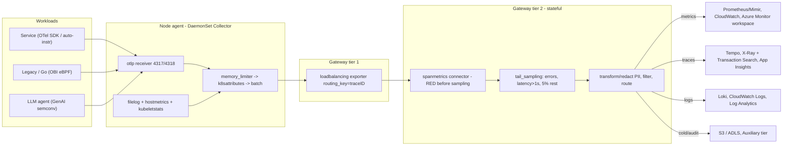
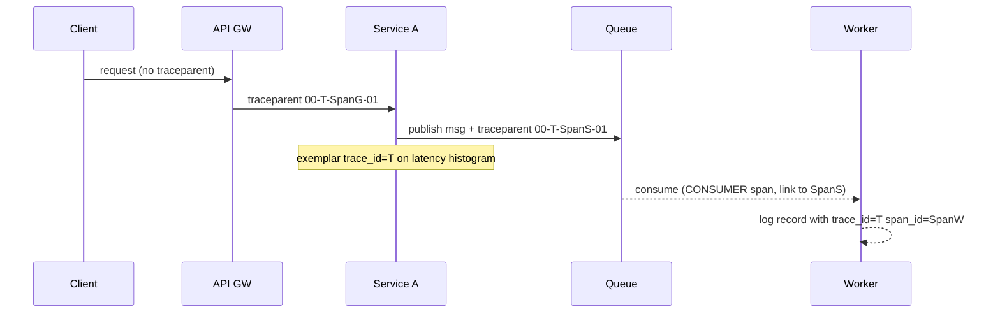

# J3 Observability
> Last verified: 2026-10 · Audience: senior/staff DevOps, SRE, AI eng, NetEng, DevSecOps, architects

## TL;DR
- **Monitoring answers known questions; observability answers new ones** by letting you slice telemetry along any dimension after the fact. In practice that means **high-cardinality, structured, correlated** telemetry, not "more dashboards".
- Signals: **metrics** (cheap, aggregated, good for alerting), **logs/events** (detailed, expensive per byte), **traces** (causality and latency breakdown), **profiles** (which code burns CPU or memory). A **wide event** (one rich structured record per unit of work) is the raw material the others can be derived from.
- **Cardinality is the cost driver.** Series = the product of label values. Keep unbounded IDs out of metric labels and put them on spans, logs and exemplars.
- **OpenTelemetry is the default instrumentation standard.** The pieces are the API, SDK, Collector, OTLP (gRPC 4317 / HTTP 4318) and semantic conventions. As of 2026 AWS has put the **X-Ray SDKs/Daemon in maintenance mode (since 2026-02-25)** and Azure ships the **Azure Monitor / Microsoft OpenTelemetry Distro** plus native OTLP ingestion.
- **Sampling:** head sampling is cheap but blind. Tail sampling keeps errors and slow traces but is stateful (route by trace ID). Compute RED metrics *before* you sample.
- **Correlation is the payoff.** Use the same `service.name` and resource attributes everywhere, put `trace_id` in logs, and attach exemplars to histograms. That gives you a click path from alert to trace to log to profile.
- **LLM apps:** trace each agent step (`invoke_agent`, `chat`, `execute_tool`, `retrieval`) with **GenAI semconv** (still *Development* status). Track tokens (input, output, cache, reasoning), TTFT and cost per tenant. Keep prompt and response capture **off by default** (PII).
- **Cost tiers matter at scale:** CloudWatch Logs Standard vs Infrequent Access, and Azure Log Analytics Analytics vs Basic vs Auxiliary. Route verbose data to the cheap tier at the pipeline, not after ingest.

## J3.1 Pillars, profiles and wide events
- **How it works:**
  - **Metrics** are numeric time series identified by name plus labels. They are pre-aggregated, so storage cost depends on the *number of series*, not on request volume. Best for alerting and SLOs (see [J1](./J1-slis-slos-error-budgets.md), [J2](./J2-monitoring-and-alerting.md)).
  - **Logs** are timestamped records. Unstructured text is hard to query, so emit structured (JSON or OTel LogRecord) logs. Cost scales with bytes ingested and stored.
  - **Traces** are a tree (DAG) of **spans** sharing a `trace_id`. Each span has a name, kind, start and end, attributes, events, links and status. They show where the time went across services.
  - **Profiles** are stack samples aggregated over time (CPU, alloc, lock, wall). In OTel they are the 4th signal and are **Alpha** as of 2026.
  - **Wide events / canonical log lines** mean one event per request per service with dozens to hundreds of fields: user_id, tenant, build_sha, feature flags, cache_hit, db_ms, region and so on. Honeycomb popularised the idea ("observability 2.0"). Metrics can be derived from these events, but not the reverse.
  - **High cardinality** means fields with many unique values (user_id, request_id). It is fine in event or columnar stores (Honeycomb, ClickHouse, BigQuery-like) and deadly as Prometheus labels.
- **Trade-offs / when to use:**
  - Metrics are cheap, fast and long-retention, but you lose the detail ("p99 went up" without "for whom").
  - Events and traces have full context but cost per event, so you need sampling.
  - Profiles are the only signal that names the guilty *function*. Use them when a trace shows "time spent in service X" but nothing below it.
- **Interview angles:**
  - If asked "pillars?" → name the three, then say the pillars framing is outdated. What matters is **correlation** and the ability to ask **arbitrary questions**: a wide event plus a trace context is the unit.
  - If asked "monitoring vs observability" → monitoring covers known-unknowns (predefined dashboards and alerts). Observability covers unknown-unknowns (exploratory slicing by any attribute).
  - Pitfall: three separate vendors or tools with different service names and no shared IDs. You end up with three silos, not observability.

## J3.2 Metric types, native/exponential histograms, exemplars
- **How it works:**

| Type | Semantics | Query pattern | Gotchas |
|---|---|---|---|
| **Counter** | Monotonic, resets on restart | `rate()` / `increase()` | Never `rate()` a gauge. Never alert on the raw counter value |
| **Gauge** | Point-in-time value (queue depth, memory) | `avg_over_time`, `max` | Scraping misses spikes between samples |
| **Histogram (classic)** | Cumulative `_bucket{le=…}`, `_sum`, `_count` | `histogram_quantile(0.99, sum by (le)(rate(x_bucket[5m])))` | Fixed buckets. **Each bucket is a series**. Quantile accuracy depends on the bucket layout |
| **Summary** | Client-computed quantiles | Read the quantile directly | **Not aggregatable** across instances. Avoid for fleet SLOs |
| OTel **UpDownCounter** | Non-monotonic sum | Like a gauge | — |

  - **Temporality:** Prometheus is **cumulative**. OTel supports cumulative and **delta** (Datadog and CloudWatch-style backends like delta). Prometheus can convert delta with the experimental `--enable-feature=otlp-deltatocumulative`.
  - **OTel exponential histogram:** bucket boundaries are powers of `base = 2^(2^-scale)`. The SDK auto-adjusts the scale to fit a max bucket count (default 160 buckets). The result is relative-error-bounded percentiles with no bucket tuning.
  - **Prometheus native histograms** are the equivalent. The schema runs from −4 to +8 (schema n+1 doubles resolution, and standard schemas are mergeable). There is a **zero bucket** with a threshold. They use sparse buckets, so one series replaces N `_bucket` series. Custom-bucket schema −53 exists, but those histograms are not mergeable across layouts.
    - **Stable since Prometheus v3.8.0.** Before 3.8 they needed `--enable-feature=native-histograms`. You must still set `scrape_native_histograms: true`, and scraping requires the **protobuf** exposition format.
  - **Exemplars** attach a sample `trace_id` (plus value and timestamp) to a histogram bucket or counter, so you can jump from a latency spike to a concrete trace. Classic histograms carry one exemplar per bucket. Native histograms can carry several, each with a timestamp. Prometheus needs `--enable-feature=exemplar-storage` and OpenMetrics/protobuf scrape (unverified flag name for 3.x; check your version).
- **Trade-offs / when to use:**
  - Use histograms for latency SLOs because they aggregate across pods and regions. Use summaries only for single-process debugging.
  - Native/exponential histograms have far lower series count and better accuracy. The catch is that the whole pipeline must support them (exporter, Collector, remote-write receiver, backend).
- **Interview angles:**
  - "Why is my p99 wrong?" → Possible causes: buckets too coarse around the SLO threshold, averaging percentiles (never average p99s), or a summary aggregated across pods.
  - "How do you compute p99 across 500 pods?" → `sum by (le)` the bucket rates, *then* run `histogram_quantile`. With native histograms, `histogram_quantile(0.99, sum(rate(x[5m])))`.
  - For an SLO, choose a bucket boundary *at* the threshold (e.g. `le="0.3"`), so "fraction under 300 ms" is exact, not interpolated.
  - Cross-link: latency percentiles in [C1.5](../C-large-scale-architecture/C1-performance.md#c15-performance-measurement-metrics).

## J3.3 Cardinality management and cost
- **How it works:**
  - Series count = metric names × Π(distinct values of each label). Example: `http_requests_total{method(5), route(200), status(10), pod(300)}` = **3M series**, and a histogram multiplies that again by the bucket count (~10–20).
  - Bad labels: user_id, request_id, raw URL path, error message, IP, timestamp, unbounded `k8s.pod.uid` on long-retention metrics.
  - CloudWatch: every unique dimension combination is a separate billable custom metric (≤30 dimensions per metric). The CloudWatch OTLP metrics endpoint has a 1M new-series per 10 min account limit, 150 labels per datapoint and 1024-char attribute values.
  - Prometheus: memory cost is roughly per active series in the head block. Churn (pods renamed on every deploy) also creates series.
- **Controls, from cheapest to most effective:**
  1. **Instrument well.** Use route templates (`/users/{id}`), not raw paths. Bucket status codes into classes (`5xx`).
  2. **Collector processors.** `attributes`/`transform` drop or hash labels. `filter` drops metrics. `metricstransform` aggregates labels away. The `cumulativetodelta` and `interval` processors cut volume.
  3. **Prometheus relabelling.** `metric_relabel_configs` with `labeldrop`/`drop`, plus `sample_limit` and `label_limit` per scrape job as a guardrail.
  4. **Recording rules / aggregation** at the edge: keep `sum by (service, route, code)` and drop pod-level data after 7 days.
  5. **Tiered retention:** raw 15 d → downsampled 1 y (Thanos, Mimir, VictoriaMetrics).
  6. **Usage-based pruning:** find metrics no dashboard or alert queries, e.g. Grafana Adaptive Metrics or the Datadog Metrics without Limits concept.
- **Trade-offs:**
  - Dropping labels loses drill-down. Move the detail to traces and wide events, where high cardinality is cheap.
  - Per-tenant metrics in SaaS: use top-N tenants plus an "other" bucket, or exemplars.
- **Interview angles:**
  - "Prometheus is OOMing" → run `topk(10, count by (__name__)({__name__=~".+"}))` and check the TSDB status page (head cardinality). Find the label explosion, add `sample_limit`, fix the instrumentation.
  - "Observability bill doubled" → the biggest levers are log volume (debug logs left on), cardinality, and the trace sampling rate. Govern with per-team budgets and showback.

## J3.4 Structured logging, log pipelines, sampling and retention tiers
- **Structured logging:**
  - Use JSON or OTel LogRecord with stable keys: `timestamp` (UTC, RFC 3339), `severity`, `service.name`, `trace_id`, `span_id`, `msg`, plus a domain-fields map.
  - Use one schema across services, e.g. OTel semconv or ECS (Elastic Common Schema).
  - Log **events, not narration**. Never log secrets, tokens or full PII. Redact at source *and* at the pipeline.
  - Kubernetes: write to stdout/stderr. The node agent tails `/var/log/containers/*.log` (CRI format).
- **Pipeline architecture:** agent (DaemonSet / sidecar) → **aggregator/gateway** (buffer, enrich, route) → backend(s).
  - **Fluent Bit:** C, tiny footprint, CNCF (graduated with Fluentd). It is the default log agent in EKS and AKS addons, and ships an OTel input and output.
  - **Vector:** Rust, the VRL transform language, strong buffering (disk), routes to many sinks (Datadog-owned).
  - **OTel Collector:** `filelog` receiver plus operators. Parses into OTel LogRecords and unifies with traces and metrics. This is the best choice when you want one agent for all signals.
  - Durable buffering (disk queue or Kafka) between agent and backend absorbs backend outages. Watch for backpressure, which drops logs at the agent.
- **Sampling and reduction:**
  - Drop DEBUG in prod, or allow it dynamically per tenant through a flag.
  - Dedupe repeated errors and rate-limit per key.
  - Sample health-check and 2xx access logs (e.g. 1–10%), and keep 100% of 5xx.
  - Use **log-to-metric** for counts (CloudWatch metric filters, Azure summary rules, the Collector `count` connector) instead of storing every line.
- **Retention tiers:**

| Tier | AWS | Azure | Use |
|---|---|---|---|
| Hot / full-featured | CloudWatch Logs **Standard** class | Log Analytics **Analytics** plan (30 d interactive incl., 90 d for App Insights/Sentinel; extendable to 2 y) | Alerts, dashboards, live tail |
| Warm / cheaper ingest | **Infrequent Access** class: lower ingestion price only. No metric filters, subscription filters, Live Tail, anomaly detection, field indexing or EMF. Class **cannot change after creation** | **Basic** plan: reduced ingest, full KQL, **pay per query**, simple log alerts only, workspace scope only | Troubleshooting, IR |
| Cold / audit | Export to S3 (or the S3 Tables integration) + Athena | **Auxiliary / Lake** plan: minimal ingest, slow queries, no alerts, DCR-based custom tables + some Azure tables | Compliance (Azure total retention up to **12 years**) |

  - Azure switches table plans at most **once per week per table**. Moving Analytics → Auxiliary stops alerts on that table.
- **Interview angles:**
  - "Design logging for 5 TB/day" → structured logs at source, an agent DaemonSet, a gateway with a disk/Kafka buffer, and severity- and route-based routing (errors to hot tier, access logs sampled to cheap tier or object storage). Add log-to-metrics, PII redaction, per-team quotas and a retention policy per table.
  - Pitfall: parsing unstructured logs with regex in the backend at query time. That is slow, costly and fragile.

## J3.5 Distributed tracing: W3C Trace Context, spans, head vs tail sampling
- **How it works:**
  - **`traceparent`** = `version-traceid-parentid-flags`. That is 2 + 32 + 16 + 2 hex characters, e.g. `00-4bf92f3577b34da6a3ce929d0e0e4736-00f067aa0ba902b7-01`. Flag `01` = sampled. Level 2 adds the **random flag** `02` (rightmost 7 bytes of the trace ID are random). Level 1 is a W3C Recommendation; Level 2 is a Candidate Recommendation Draft.
  - **`tracestate`** carries vendor-specific data: up to 32 list members, and implementers should propagate at least 512 chars. The OTel key `ot=th:…;rv:…` carries consistent-probability-sampling threshold and randomness (spec still *Development*).
  - **W3C Baggage** (`baggage` header) carries app key/values such as tenant or flag. It is propagated, *not* automatically put on spans, and it leaks to downstream and third parties, so never put secrets in it.
  - **Span kinds:** SERVER, CLIENT, PRODUCER, CONSUMER, INTERNAL. Async messaging uses **span links** (a batch consumer links to N producer contexts) rather than parent/child.
  - **Context propagation** is in-process through Context (thread-local, async-local) and cross-process through propagators (`tracecontext,baggage` by default). Add `xray` or `b3` for interop: an AWS X-Ray propagator is needed for API Gateway/Lambda hops.
- **Sampling:**

| | **Head** (in SDK: `parentbased_traceidratio`) | **Tail** (Collector `tail_sampling` processor) |
|---|---|---|
| Decision point | Root span start | After the trace completes (`decision_wait`, ~10–30 s) |
| Keeps errors/slow traces | No (random) | Yes (policies: `status_code`, `latency`, `string_attribute`, `rate_limiting`, `probabilistic`, `composite`) |
| Cost | Saves at the source, including network | All spans are exported to the Collector first. **Stateful, memory heavy** |
| Scaling | Trivial | All spans of a trace must hit the **same** Collector: a tier-1 `loadbalancing` exporter with `routing_key: traceID` feeds a tier-2 tail-sampling tier |

  - Combine the two: head-sample with a generous ratio, then tail-sample. Generate **RED metrics with the `spanmetrics` connector before sampling** so rates stay accurate.
  - With proportional sampling, backends must **re-weight** counts (adjusted count = 1/p). Otherwise trace-derived metrics are biased.
- **Interview angles:**
  - "Trace is broken into pieces" → causes: a missing propagator at a hop (LB, queue, Lambda), a proxy stripping headers, mixed X-Ray and W3C headers without a composite propagator, or async work started outside the context.
  - "How much does tracing cost?" → span count × size. Control it with sampling, by dropping noisy INTERNAL spans, and with attribute limits (SDK default 128 attributes per span).
  - "Should you trust an incoming `traceparent` from the internet?" → Restart the trace at the edge, or link to the external context, to prevent sampling abuse and ID injection.

## J3.6 OpenTelemetry: API/SDK/Collector, OTLP, semconv, auto- and eBPF instrumentation
- **How it works:**
  - **API:** a no-op by default, safe for libraries to depend on.
  - **SDK:** providers, samplers, processors (BatchSpanProcessor), exporters, resource detectors. Configured by env vars (`OTEL_SERVICE_NAME`, `OTEL_RESOURCE_ATTRIBUTES`, `OTEL_EXPORTER_OTLP_ENDPOINT`, `OTEL_TRACES_SAMPLER`) or by the declarative YAML config file.
  - **Collector** = receivers → processors → exporters, plus **connectors** (pipeline-to-pipeline, e.g. `spanmetrics`, `count`, `routing`) and extensions (`health_check`, `pprof`, auth such as `sigv4auth`).
    - Distributions: **core** vs **contrib** vs vendor builds (ADOT Collector, Grafana Alloy, Splunk, Elastic EDOT), or a custom build with `ocb`.
    - Deployment patterns: **agent** (DaemonSet/sidecar: host metrics, k8s attrs, filelog) + **gateway** (Deployment: tail sampling, auth, fan-out, cost filtering).
    - Processor order: `memory_limiter` **first**, then `k8sattributes`/`resourcedetection`, `filter`/`transform`, and `batch` last. Newer releases move batching into exporters (`sending_queue`); check your version.
  - **OTLP** is protobuf over **gRPC :4317** or **HTTP :4318** (`/v1/traces`, `/v1/metrics`, `/v1/logs`). It supports gzip and partial-success responses.
  - **Signal stability:** traces and metrics are stable, logs are stable in most SDKs, profiles are Alpha.
  - **Semantic conventions:** standard attribute names (`service.name`, `http.request.method`, `http.response.status_code`, `url.path`, `db.system.name`, `k8s.pod.name`, `cloud.region`). HTTP and DB conventions migrated to stable names, using `OTEL_SEMCONV_STABILITY_OPT_IN=http/dup` during the migration. **GenAI conventions** now live in a dedicated repo (`open-telemetry/semantic-conventions-genai`) with **Development** status (see J3.9).
  - **Zero-code / auto-instrumentation:**
    - Java agent (`-javaagent`), .NET CLR profiler, Python `opentelemetry-instrument`, Node `--require @opentelemetry/auto-instrumentations-node/register`.
    - Kubernetes: the **OpenTelemetry Operator** `Instrumentation` CR injects agents via a pod annotation (`instrumentation.opentelemetry.io/inject-java: "true"`).
    - Go needs compile-time or eBPF approaches.
  - **eBPF instrumentation (OBI, OpenTelemetry eBPF Instrumentation**, Grafana Beyla donated to OTel; v0.x as of 2026):
    - What it captures: RED metrics and spans for HTTP/S, HTTP/2, gRPC, Kafka, SQL clients and more, **without code changes**, with some context propagation. Needs Linux ≥5.8 (or RHEL 4.18 backports), BTF, and root or capabilities. amd64/arm64 only.
    - What it misses: business attributes and custom spans. Use it to cover legacy, third-party or Go workloads, and complement it with SDK instrumentation.
- **Trade-offs:**
  - Auto-instrumentation: fast coverage, but noisy spans and some startup overhead. Manual spans add business meaning.
  - Vendor agents (Datadog, Dynatrace OneAgent) are richer out of the box. OTel gives portability and **one instrumentation for many backends**, avoiding re-instrumentation on a vendor switch.
- **Interview angles:**
  - "Why a Collector instead of exporting directly from the SDK?" → it lets you change backends and credentials without redeploying apps, centralises sampling, redaction and enrichment, retries and buffers, and offloads CPU from the app.
  - "Collector is dropping data" → watch `otelcol_exporter_send_failed_*`, `otelcol_exporter_queue_size` vs capacity, and `memory_limiter` refusals. Scale the gateway horizontally (stateless, except for tail sampling).
  - Resource attributes are the join key: enforce `service.name`, `service.version`, `deployment.environment.name` and `service.namespace` org-wide.

## J3.7 Continuous profiling
- **How it works:**
  - Always-on low-rate sampling (e.g. ~100 Hz of CPU stacks) across the fleet, aggregated into **flame graphs** (width = time share). Types: CPU, wall-clock, heap/alloc, mutex/lock, goroutine/threads.
  - **eBPF profilers** (OTel eBPF profiler, contributed by Elastic; Parca; Pyroscope's eBPF mode) unwind native and many interpreted or JIT stacks system-wide with no code change. Overhead is typically ~1% CPU (vendor claims; unverified).
  - Language profilers: Go `pprof`, Java **JFR**/async-profiler, .NET EventPipe, Python py-spy.
  - Storage formats: pprof, and the new OTLP profiles format (Alpha). Backends: **Grafana Pyroscope**, Parca, Datadog Continuous Profiler, Elastic Universal Profiling, AWS **CodeGuru Profiler** (check its current status), **Application Insights Profiler** (.NET).
  - **Span-profile linking:** the profiler labels samples with `span_id`/`trace_id`, so you can open the flame graph *for one slow span*.
- **Trade-offs:**
  - Gives the code-level root cause and finds cost wins: the top CPU functions across the fleet often yield 10–30% savings (illustrative).
  - Costs: symbolisation complexity (stripped binaries, JIT), storage, and PII risk in stack args (low risk).
- **Interview angles:**
  - "Latency regression after deploy, traces show the time inside service X with no child spans" → diff profiles (before vs after) to find the new hot function.
  - Profiles vs traces: traces show *where in the request graph* time went, profiles show *where in the code*.

## J3.8 Correlating signals
- **How it works:**
  - **Shared resource identity:** the same `service.name`, `service.version`, `k8s.*` and `cloud.*` attributes on all signals (the Collector `k8sattributes` and `resourcedetection` processors enforce it).
  - **Logs → traces:** the OTel log bridge auto-injects `trace_id`/`span_id` into log records (Logback/log4j MDC, Python logging). The backend links them (Grafana derived fields, Loki to Tempo; App Insights `operation_Id`; CloudWatch Logs `traceId` to X-Ray).
  - **Metrics → traces:** **exemplars** on latency histograms. In Grafana, Prometheus/Mimir exemplars link to Tempo. Datadog and Honeycomb provide this natively.
  - **Traces → metrics:** the `spanmetrics` connector, Tempo metrics-generator, Application Signals and App Insights all derive RED metrics plus a **service graph** from spans.
  - **Traces → profiles:** span-profile linking (J3.7).
  - **Change events:** deploy and flag-change markers as annotations or events, so you can see "what changed".
- **Investigation workflow:** SLO burn alert ([J2](./J2-monitoring-and-alerting.md)) → RED dashboard for the service → exemplar or slow-trace query → span attributes reveal a common factor (tenant, AZ, version) → logs for that trace → profile for the hot span → deploy marker.
- **Interview angles:**
  - "How do you get from an alert to root cause in under 5 minutes?" → walk the chain above, and stress *consistent attributes* plus *exemplars*.
  - Pitfall: per-signal sampling done independently (logs at 10% on one key, traces at 1% on trace ID) means the linked log is usually missing. Sample consistently by trace ID, or keep all logs at error level and above.

## J3.9 Observability for LLM apps and agents
- **What to measure:**
  - **Latency:** TTFT (time to first token/chunk), time per output token, end-to-end latency, and queue time in the serving stack. Use p50/p95/p99 per model and route.
  - **Tokens:** input, output, cache-read and cache-write, and reasoning tokens. These map to **cost** per request, tenant and feature.
  - **Quality and safety:** finish reasons (`length`, `content_filter`), refusal and guardrail hits, tool-call error rate, eval scores (offline plus online LLM-judge), user feedback.
  - **Agent structure:** steps per task, tool calls per invocation, loops/retries, total cost per task.
- **OTel GenAI semantic conventions** (repo `semantic-conventions-genai`, **Development**, names may still change):
  - **Spans:**
    - Inference span `{gen_ai.operation.name} {gen_ai.request.model}` (kind CLIENT), with operations `chat`, `text_completion`, `generate_content`, `embeddings`, `retrieval`.
    - Agent spans `invoke_agent {gen_ai.agent.name}`, `create_agent`, `invoke_workflow`, `execute_tool {gen_ai.tool.name}`, `plan`, and memory ops (`search_memory`, `upsert_memory`).
    - MCP conventions also exist.
  - **Attributes:** `gen_ai.provider.name` (Required, e.g. `anthropic`, `openai`, `aws.bedrock`, `azure.ai.inference`), `gen_ai.request.model`, `gen_ai.response.model`, `gen_ai.response.finish_reasons`, `gen_ai.usage.input_tokens`, `gen_ai.usage.output_tokens`, `gen_ai.usage.cache_read.input_tokens`, `gen_ai.conversation.id`, `gen_ai.agent.name`, `gen_ai.tool.name`, `gen_ai.tool.call.id`.
  - **Metrics** (current repo):
    - Duration and streaming: `gen_ai.client.inference.duration`, `gen_ai.client.inference.time_to_first_chunk`, `gen_ai.client.inference.time_per_output_chunk`.
    - Token counters: `gen_ai.client.inference.usage.{input_tokens,output_tokens,cache_read.input_tokens,cache_write.input_tokens,reasoning.output_tokens}`.
    - Agent and tool: `gen_ai.invoke_agent.duration`, `gen_ai.execute_tool.duration`.
    - Server side: `gen_ai.server.time_to_first_token`, `gen_ai.server.time_per_output_token`.
    - Older instrumentations emit `gen_ai.client.token.usage` (histogram with `gen_ai.token.type`) and `gen_ai.client.operation.duration`. Expect both in the wild.
  - **Content capture:** prompts and outputs (`gen_ai.input.messages`, `gen_ai.output.messages`, `gen_ai.system_instructions`) are **not captured by default** and are opt-in. Production guidance is to **store the content externally and put references on spans**, which gives separate access control, retention and PII handling.
- **Tooling:**
  - OTel-native instrumentation: OpenLLMetry (Traceloop), OpenInference (Arize Phoenix), Langfuse, LangSmith (LangChain).
  - Vendor platforms: Datadog LLM Observability; Azure AI Foundry tracing to Application Insights (Microsoft OpenTelemetry Distro "AI agent observability"); AWS Bedrock model invocation logging (to CloudWatch Logs/S3) plus CloudWatch GenAI observability / Bedrock AgentCore observability (verify current naming).
- **Trade-offs / when to use:**
  - Full content capture makes debugging and evals easier, but brings **PII/regulatory exposure** and huge span sizes (CloudWatch OTLP rejects spans over 200 KB). Redact in the Collector and keep content in a separate, access-controlled store ([L1](../L-data-privacy-ai-security/L1-data-classification-pii.md)).
  - Token counts from the provider response are authoritative. Client-side tokenizer estimates drift.
- **Interview angles:**
  - "Design observability for a RAG/agent app" → root span per user request, child spans for retrieval (top_k, latency, doc IDs), rerank, each `chat` call (model, tokens, TTFT, finish reason) and each `execute_tool` (args hashed, result status).
    - Metrics: TTFT/TPOT histograms, token counters by tenant and model, cost dashboards and budget alerts.
    - Sampling: tail-sample to keep all errors, guardrail hits and expensive traces (tokens over a threshold).
    - Link evals to `trace_id`. See [K9](../K-ai-infra-llm/K9-llmops-evals-guardrails.md), [K7](../K-ai-infra-llm/K7-ai-gateways-caching-cost.md) and [K8](../K-ai-infra-llm/K8-agents-tool-use-mcp.md).
  - An AI gateway (LiteLLM, Kong, Cloudflare AI Gateway, APIM) is a natural single choke point for token and cost telemetry.
  - Pitfall: average latency is meaningless for LLMs because output length varies. Normalise to per-token latency, or bucket by output tokens.

## Diagrams




## Cloud mapping: AWS vs Azure
| Capability | AWS | Azure | Role it plays | Key differences | Alternatives |
|---|---|---|---|---|---|
| Metrics store | CloudWatch Metrics (+ OTel metrics queryable with **PromQL**); Amazon Managed Service for Prometheus | Azure Monitor Metrics (platform); **Azure Monitor workspace** (managed Prometheus) | Time series, alarms | CW classic: per-metric pricing, ≤30 dims. Both now offer a Prometheus-compatible managed store | Grafana Mimir, VictoriaMetrics, Datadog |
| Log store + query | CloudWatch Logs (Logs Insights QL, OpenSearch PPL/SQL) | Azure Monitor Logs / **Log Analytics** (**KQL**) | Log search, log alerts | AWS tiers per log group *class* (immutable). Azure tiers per *table plan* (switchable weekly) | Loki, Elastic, Splunk, ClickHouse |
| Log cost tiers | Standard / **Infrequent Access** / Delivery class; S3 export | **Analytics / Basic / Auxiliary(Lake)**; long-term retention up to 12 y | Cost vs capability | IA saves on ingest only. Basic/Aux charge per query | S3 + Athena; ADX |
| Tracing | **X-Ray** (SDK/Daemon in maintenance since 2026-02-25) → OTel; **Transaction Search** (spans → `aws/spans` log group, 1% indexed free) | **Application Insights** (workspace-based; data in Log Analytics `AppRequests/AppDependencies`) | Distributed traces, service map | AWS keeps 100% of spans as logs and indexes a % as trace summaries. App Insights samples in the distro (e.g. Java agent default 5 req/s rate-limited) | Tempo, Jaeger, Honeycomb, Datadog APM |
| APM | **CloudWatch Application Signals** (RED, SLOs, app map) | Application Insights (App map, Live Metrics, Profiler, Snapshot Debugger) | Curated APM over OTel | Application Signals needs Transaction Search for full features + unified pricing | Datadog, Dynatrace, New Relic |
| OTel distro / agent | **ADOT** (SDKs, Collector, EKS add-on, Lambda layer); **CloudWatch agent** (≥1.300025.0 receives OTLP) | **Azure Monitor / Microsoft OpenTelemetry Distro** (.NET, Java, Node, Python); Azure Monitor Agent (OTLP path preview) | Vendor-supported OTel | AWS: X-Ray remote sampler + propagator. Azure: connection string, Live Metrics, RBAC | Upstream OTel, Grafana Alloy, Elastic EDOT |
| Native OTLP ingest | `xray.<region>/v1/traces`, `logs.<region>/v1/logs`, `monitoring.<region>/v1/metrics`. HTTP only, SigV4 (bearer token for logs/metrics) | OTLP to cloud ingestion endpoints from Collector (GA); AMA & AKS paths (preview) | Vendor-neutral ingest | AWS: 5 MB/10k spans per request, 200 KB per span | Any OTLP backend |
| Edge/hybrid pipeline | ADOT/OTel Collector gateway; CloudWatch pipelines (log transform) | **Azure Monitor pipeline** (Arc-enabled K8s; Syslog/CEF GA, OTLP logs preview; persistent buffering) + DCR transformations | Filter/aggregate before ingest | Azure pipeline is a managed, Arc-deployed collector. You run the K8s | Vector, Cribl, Fluent Bit |
| Dashboards | CloudWatch dashboards; Amazon Managed Grafana | Workbooks, Azure Monitor dashboards with Grafana; Azure Managed Grafana | Visualisation | — | Grafana Cloud |
| Profiling | CodeGuru Profiler (check status) / third party | Application Insights Profiler (.NET) | Code hot spots | Thin native offerings | Pyroscope, Parca, Datadog |
| LLM telemetry | Bedrock invocation logging; CloudWatch GenAI / AgentCore observability (verify) | Foundry tracing → App Insights | Token/latency/agent traces | Both consume GenAI semconv to varying degrees | Langfuse, Phoenix, Datadog LLM Obs |

- **X-Ray → OTel:** AWS's guidance is "instrument with OTel SDKs/ADOT and collect with the OTel Collector or CloudWatch agent".
  - Server spans become X-Ray segments and other spans become subsegments. Attributes become metadata unless listed in `aws.xray.annotations`.
  - Keep the X-Ray propagator for hops through API Gateway and Lambda. The console and X-Ray APIs keep working.
- **Transaction Search vs Log Analytics:**
  - AWS stores spans *as structured logs* (`aws/spans`), searchable by any attribute, with a free 1% indexed as trace summaries.
  - Azure stores App Insights telemetry in **Log Analytics tables** queried by KQL. Basic/Aux plans exist but App Insights tables default to Analytics (90-day included retention).
- **Gotchas:**
  - CloudWatch log class can't be changed after creation, so plan IA log groups up front.
  - Azure Basic/Aux queries are billed per GB scanned, so dashboards on them cost money per refresh.
  - Classic App Insights resources are retired; it's workspace-based only now. Instrumentation-key-only ingestion lost support, so use connection strings.
- **Alternatives:**
  - **Grafana LGTM** (Loki logs, Grafana, Tempo traces, Mimir metrics, plus Pyroscope and Alloy as the collector): open source or Grafana Cloud, cheap object-storage-backed.
  - **Datadog:** turnkey all-signals SaaS, pricey per host, custom metric and indexed span.
  - **Honeycomb:** wide events and high-cardinality querying, BubbleUp, tail sampling with Refinery.
  - Also Elastic, Splunk/AppDynamics, Dynatrace, ClickHouse-based (SigNoz, HyperDX/ClickStack).
  - On Kubernetes, the OTel Operator plus a Collector gateway is the portable core regardless of backend.

## Hands-on (optional)
Local OTel Collector → Grafana LGTM (single-container `grafana/otel-lgtm` bundles Grafana, Prometheus/Mimir, Tempo, Loki, Pyroscope and an OTel Collector):
```yaml
# docker-compose.yaml
services:
  lgtm:
    image: grafana/otel-lgtm:latest
    ports: ["3000:3000"]          # Grafana (admin/admin)
  otelcol:
    image: otel/opentelemetry-collector-contrib:latest
    command: ["--config=/etc/otelcol/config.yaml"]
    volumes: ["./otelcol.yaml:/etc/otelcol/config.yaml:ro"]
    ports: ["4317:4317", "4318:4318"]
    depends_on: [lgtm]
```
```yaml
# otelcol.yaml - agent/gateway with RED-before-sampling, tail sampling, PII scrub
receivers:
  otlp:
    protocols:
      grpc: { endpoint: 0.0.0.0:4317 }
      http: { endpoint: 0.0.0.0:4318 }
processors:
  memory_limiter: { check_interval: 1s, limit_percentage: 80, spike_limit_percentage: 20 }
  attributes/scrub:
    actions:
      - { key: user.email, action: hash }
      - { key: gen_ai.input.messages, action: delete }
  tail_sampling:
    decision_wait: 10s
    policies:
      - { name: errors, type: status_code, status_code: { status_codes: [ERROR] } }
      - { name: slow, type: latency, latency: { threshold_ms: 1000 } }
      - { name: rest, type: probabilistic, probabilistic: { sampling_percentage: 5 } }
  batch: {}
connectors:
  spanmetrics: {}
  forward: {}
exporters:
  otlp/lgtm:
    endpoint: lgtm:4317
    tls: { insecure: true }
service:
  pipelines:
    traces/in:      { receivers: [otlp], processors: [memory_limiter, attributes/scrub], exporters: [spanmetrics, forward] }
    traces/sampled: { receivers: [forward], processors: [tail_sampling, batch], exporters: [otlp/lgtm] }
    metrics:        { receivers: [otlp, spanmetrics], processors: [memory_limiter, batch], exporters: [otlp/lgtm] }
    logs:           { receivers: [otlp], processors: [memory_limiter, attributes/scrub, batch], exporters: [otlp/lgtm] }
```
> The `forward` connector splits traces into two pipelines, so `spanmetrics` sees 100% of spans *before* `tail_sampling`. In a scaled-out deployment, put a `loadbalancing` exporter (`routing_key: traceID`) in front of the tail-sampling tier.

```bash
docker compose up -d
# Send a test span with telemetrygen (contrib tool image)
docker run --rm --network host ghcr.io/open-telemetry/opentelemetry-collector-contrib/telemetrygen:latest \
  traces --otlp-insecure --otlp-endpoint localhost:4317 --traces 20 --service demo
# Validate a collector config before shipping
docker run --rm -v "$PWD/otelcol.yaml:/c.yaml" otel/opentelemetry-collector-contrib:latest validate --config=/c.yaml
# Prometheus native histograms + OTLP ingest flags (Prometheus 3.x)
#   prometheus --web.enable-otlp-receiver   (endpoint /api/v1/otlp/v1/metrics)
#   scrape_configs: [- job_name: app, scrape_native_histograms: true]
```

## Cross-links
- [J1 SLIs, SLOs, error budgets](./J1-slis-slos-error-budgets.md)
- [J2 Monitoring and alerting](./J2-monitoring-and-alerting.md) (alert design, burn-rate alerts that consume these signals)
- [J4 Incident response and postmortems](./J4-incident-response-postmortems.md)
- [C1 Performance](../C-large-scale-architecture/C1-performance.md#c15-performance-measurement-metrics) (latency percentiles, tail latency) and [C1.2 How performance problems look](../C-large-scale-architecture/C1-performance.md#c12-how-do-performance-problems-look-like)
- [C3 Reliability](../C-large-scale-architecture/C3-reliability.md)
- [G5 Traffic monitoring & troubleshooting](../G-cloud-network-architecture/G5-traffic-monitoring-troubleshooting.md) (flow logs, network observability)
- [K7 AI gateways, caching, cost](../K-ai-infra-llm/K7-ai-gateways-caching-cost.md), [K8 Agents, tool use, MCP](../K-ai-infra-llm/K8-agents-tool-use-mcp.md), [K9 LLMOps, evals, guardrails](../K-ai-infra-llm/K9-llmops-evals-guardrails.md)
- [L1 Data classification & PII](../L-data-privacy-ai-security/L1-data-classification-pii.md)

## Sources
- https://docs.aws.amazon.com/xray/latest/devguide/xray-sdk-migration.html
- https://docs.aws.amazon.com/xray/latest/devguide/xray-sdk-daemon-timeline.html
- https://docs.aws.amazon.com/AmazonCloudWatch/latest/monitoring/CloudWatch-Transaction-Search.html
- https://docs.aws.amazon.com/AmazonCloudWatch/latest/monitoring/Enable-TransactionSearch.html
- https://docs.aws.amazon.com/AmazonCloudWatch/latest/monitoring/CloudWatch-OTLPEndpoint.html
- https://docs.aws.amazon.com/AmazonCloudWatch/latest/monitoring/CloudWatch-OpenTelemetry-Sections.html
- https://docs.aws.amazon.com/AmazonCloudWatch/latest/monitoring/CloudWatch-Application-Monitoring-Intro.html
- https://docs.aws.amazon.com/AmazonCloudWatch/latest/logs/CloudWatch_Logs_Log_Classes.html
- https://learn.microsoft.com/en-us/azure/azure-monitor/logs/data-platform-logs
- https://learn.microsoft.com/en-us/azure/azure-monitor/logs/logs-table-plans
- https://learn.microsoft.com/en-us/azure/azure-monitor/app/opentelemetry-enable
- https://learn.microsoft.com/en-us/azure/azure-monitor/containers/opentelemetry-options
- https://learn.microsoft.com/en-us/azure/azure-monitor/data-collection/pipeline-overview
- https://prometheus.io/docs/specs/native_histograms/
- https://prometheus.io/docs/guides/opentelemetry/
- https://opentelemetry.io/docs/concepts/sampling/
- https://opentelemetry.io/docs/concepts/signals/profiles/
- https://opentelemetry.io/docs/zero-code/obi/
- https://opentelemetry.io/docs/specs/otel/trace/tracestate-probability-sampling/
- https://github.com/open-telemetry/semantic-conventions-genai (docs/gen-ai: spans, agent spans, client-inference, metrics, token metrics)
- https://www.w3.org/TR/trace-context-2/
