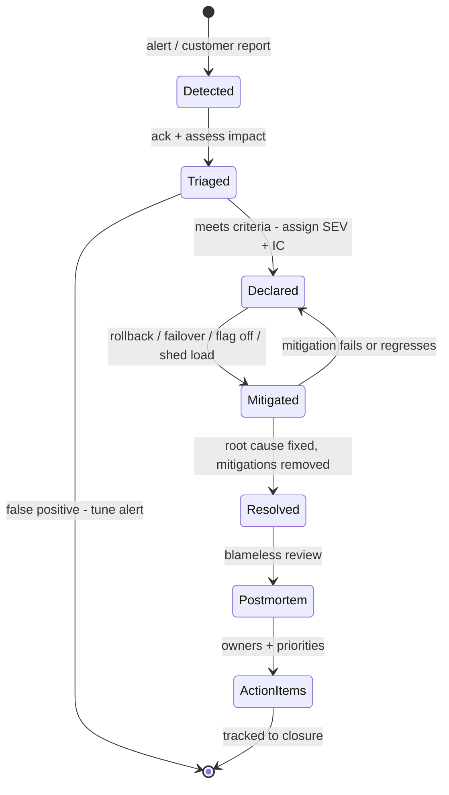
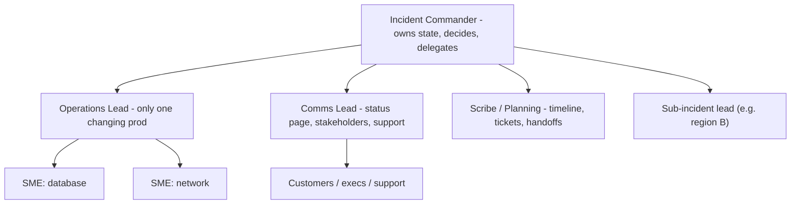

# J4 Incident Response & Postmortems
> Last verified: 2026-10 · Audience: senior/staff DevOps, SRE, AI eng, NetEng, DevSecOps, architects

## TL;DR
- An incident is managed as a **lifecycle**: detect → triage/declare → mitigate → resolve → learn. Interviewers mostly probe **mitigate before root-cause** ("stop the bleeding, restore service, preserve the evidence") and **declare early**.
- Structure beats heroics. Use an **ICS-derived role split**: **Incident Commander** (coordinates, does not touch keyboards), **Ops Lead** (hands on systems), **Comms Lead** (stakeholders and status page), **Scribe/Planning** (timeline, tickets, handoffs). Google's **3Cs** are **coordinate, communicate, control**.
- **Severity** should come from **customer impact and blast radius**, not from how hard the bug is. Severity sets paging, comms cadence, exec involvement and whether a postmortem is mandatory.
- **On-call must be sustainable.** Google SRE caps on-call at **≤25%** of time and ops work at ≤50%, targets **≤2 incidents per 12h shift**, wants **≥8 people** for a single-site rotation (≥6 per site for two sites), and pays comp time or cash.
- **Blameless postmortems** cover impact, timeline, trigger plus contributing factors, what went well and badly, and **action items with a single owner, a priority and a category** (prevent/mitigate/detect/repair). Prefer **systems thinking** over a linear "5 whys" that stops at "human error".
- **MTTx means are statistically weak** (incident durations are heavy-tailed, as Google's *Incident Metrics in SRE* shows). Use them carefully, look at distributions and percentiles, and track **learning outputs** too.
- 2024–2025 anecdotes all reduce to **config or data changes pushed globally without staged rollout or validation**: **CrowdStrike** Channel File 291, the **AWS us-east-1 DynamoDB DNS** race, and **Cloudflare** on Nov 18 and Dec 5 2025. Know each one's trigger, blast radius, mitigation and fix.
- Tooling as of 2026: **AWS Systems Manager Incident Manager has been closed to new customers since 2025-11-07** (AWS recommends OpsCenter or partners such as PagerDuty). AI triage is now a product category: **CloudWatch investigations**, **AWS DevOps Agent**, **Azure SRE Agent**, plus AI features in PagerDuty, incident.io and Rootly.

## J4.1 Incident lifecycle (detect → triage → mitigate → resolve → learn)
- **How it works:**
  - **Detect:** an SLO burn-rate alert, a symptom alert, a synthetic probe, or a customer or support report. Customer-reported incidents are themselves a **detection-gap finding**. See [J2](./J2-monitoring-and-alerting.md) and [J1](./J1-slis-slos-error-budgets.md).
  - **Triage/declare:** acknowledge the page, assess impact (who, how many, since when), assign a severity, **declare** the incident, open a channel or bridge, and assign an IC.
    - Google's declare criteria: a **second team** is needed, the outage is **customer-visible**, or the issue is **unresolved after 1h** of analysis.
  - **Mitigate:** restore service with a generic action such as rollback, failover, drain, a flag off, or load shedding (see J4.4). **Impact ends here.**
  - **Resolve:** fix the underlying condition, remove temporary mitigations, confirm SLIs are back, and stand down.
  - **Learn:** write the postmortem, review it, track action items, and share it widely (J4.7, J4.9).
  - Track the key timestamps explicitly, because the metrics in J4.8 are built from them:
    - **start of impact**
    - **detected**
    - **acknowledged**
    - **declared**
    - **mitigated**
    - **resolved**
    - **postmortem published**
    - **AIs closed**
- **Trade-offs / when to use:**
  - **Declaring early is cheap; declaring late is expensive.** You can always downgrade or cancel. The Google Home case study in the SRE workbook shows a late declaration prolonging an outage.
  - "Mitigated" and "resolved" are **different states**. Report both. Customers care about mitigated; engineering cares about resolved.
- **Interview angles:**
  - If asked "walk me through an incident you ran", use the lifecycle as the skeleton. Name your role, when you declared, what the generic mitigation was, how you communicated, and what changed afterwards.
  - Pitfall: debugging for an hour before declaring. Another pitfall is "closing" when the alert clears while the mitigation is still a manual hack.



## J4.2 Severity levels
- **How it works:** a typical 4–5 level scale. Names vary: SEV1–SEV5, P0–P4, or Cloudflare's P1 → P0 escalation.

| Level | Typical definition | Response | Comms | Postmortem |
|---|---|---|---|---|
| **SEV1 / P0** | Broad customer-facing outage, data loss/corruption, security breach, SLO burning fast | Page immediately, IC + roles, exec notified | Status page within ~15–30 min, updates every ~30 min | Mandatory |
| **SEV2 / P1** | Major feature or region degraded, subset of customers | Page, IC assigned | Status page if customer-visible, updates ~hourly | Mandatory |
| **SEV3 / P2** | Minor or partial degradation, workaround exists | Business-hours or on-call handles | Internal channel | Optional / lightweight |
| **SEV4–5** | Cosmetic, internal-only, near miss | Ticket | None | Near-miss review is encouraged |

  - Cadence numbers are common industry practice. They are not a standard, so set them per org.
  - Severity inputs: % of users or requests affected, revenue or critical journeys hit, data integrity, security, regulatory exposure, and **error-budget burn rate**.
  - **Re-assess severity continuously.** Cloudflare's June 12 2025 KV outage escalated **P1 at 18:06 to P0 at 18:21 UTC** as the scope became clear.
- **Trade-offs / when to use:**
  - Too many levels causes bikeshedding mid-incident. Use objective criteria plus a rule that **"when in doubt, pick the higher severity"**.
  - Keep **severity** (impact) separate from **priority** (fix ordering). A SEV3 can still be a P0 fix if it's a security issue.
- **Interview angles:**
  - If asked "who decides severity?", say the IC, using a **pre-agreed rubric**. Anyone may raise it. Downgrades are explicit and logged.
  - Follow-up: "Should a security incident follow the same process?" The same scaffolding applies, plus a restricted channel, legal/privacy involvement and evidence preservation. Comms are need-to-know. See [L4](../L-data-privacy-ai-security/L4-ai-security-threats.md).

## J4.3 Incident Command System roles (IC, Ops Lead, Comms Lead, Scribe/Planning)
- **How it works:** the model is adapted from firefighting's **Incident Command System**. In the SRE book the roles are IC, Ops, Communications and Planning. The workbook trims this to IC, CL and OL.
  - **Incident Commander (IC):** owns the incident state. Sets objectives, assigns roles, decides on mitigations and escalation, and runs the **update cadence**. Holds every role not yet delegated. **Does not debug.**
  - **Operations Lead (OL):** the **only** group that modifies production. Leads the responders, proposes mitigations and executes approved ones. Prevents "freelancing" (uncoordinated changes).
  - **Communications Lead (CL):** handles internal stakeholder updates, the status page, support and customer-success liaison, and exec briefings. Shields the IC and OL from "any update?" pings.
  - **Scribe / Planning:** keeps the **live incident doc** (timeline, decisions, hypotheses tried), files bugs, orders food, schedules **handoffs**, and tracks temporary mitigations to undo.
  - Optional roles: **Subject-matter experts**, **customer liaison**, **security lead**, **exec sponsor** (who stays out of the channel).
  - **Recursive separation:** for large incidents, create sub-incidents (per region or component), each with its own lead reporting to the IC.
  - Supporting infrastructure:
    - a **command post**: a dedicated channel or bridge everyone knows how to find
    - a **live incident document** used as the single source of truth
    - an **explicit handoff**: "You're now the incident commander, okay?" and it needs a verbal ack
- **Trade-offs / when to use:**
  - On small incidents one person may hold IC and OL. **Split them once more than ~2–3 people are involved** or when comms load appears.
  - Rotate the IC role and **train it** (Wheel of Misfortune, game days). The IC is a learned skill, not seniority.
- **Interview angles:**
  - If asked "the VP joins the bridge and starts directing", the IC politely reasserts command and gives the VP to the CL for updates.
  - If asked "how do you avoid two engineers both rolling back?", say all prod changes go through the OL and are announced in the channel before execution.



## J4.4 Mitigation-first vs root-causing
- **How it works:** **restore service first, then understand it.** In the workbook's words, you "don't have to fully understand the details, you only need to know the **location** of the root cause".
  - **Generic mitigations** should be pre-built, tested and cheap to invoke:
    - **Rollback** the binary, config or **data/feature file**. Most incidents follow a change, so ask "what changed?" first. See [C5](../C-large-scale-architecture/C5-deployment.md).
    - **Failover / drain:** shift traffic away from a bad zone, region or cell (DNS/GSLB weights, ARC routing controls, Front Door/Traffic Manager).
    - **Feature flag / kill switch off:** disable the offending feature.
    - **Shed load / rate-limit / degrade gracefully:** drop low-priority traffic, serve stale cache, turn off expensive features.
    - **Scale out / add capacity** when the cause is saturation.
    - **Block the bad input:** a query of death, an abusive client, a poison message.
  - **Preserve evidence** while mitigating: snapshot logs, keep one bad instance in quarantine instead of terminating it, and capture heap or core dumps.
- **Trade-offs / when to use:**
  - A rollback is only safe if changes are **backward compatible** (DB migrations: expand/contract) and the rollback path is exercised regularly.
  - Failover can **amplify** problems if the standby is under-provisioned or shares the failing dependency (a common-mode failure).
    - In AWS Oct 2025, NLB health-check-driven **AZ failovers** made things worse. The fix included **velocity controls** on those failovers.
  - Kill switches are themselves code paths and need testing. Cloudflare's Dec 5 2025 outage was triggered by **applying a killswitch to a rule type for the first time**.
  - Recovery can need **throttling**. Thundering herds and metastable states after the trigger is fixed are common (AWS EC2 DWFM, Oct 2025).
- **Interview angles:**
  - If asked "would you roll back without knowing the cause?", say **yes** if a recent change correlates in time. A rollback is cheap and reversible, and you can root-cause in staging later.
  - Follow-up: "What if there's no recent change?" Check dependencies, traffic shape, certificate or quota expiry, capacity, and data/config pushes that bypass CI/CD.
  - Pitfall: chasing root cause while customers burn the error budget.

## J4.5 Communication (status pages, cadence)
- **How it works:**
  - **Internal:** one incident channel plus a bridge, with a pinned **current-state summary** covering impact, scope, mitigation in progress, next update time and the IC's name. Run a separate stakeholder channel so responders aren't flooded.
  - **External:** a **status page** hosted **independently of your own infrastructure**. Status page content:
    - **acknowledge fast** (minutes, not hours)
    - **say what customers experience**, not internal component names
    - **commit to the next update time**
    - post **"monitoring"** before **"resolved"**
  - Typical cadence: SEV1 every **~30 min** even with no news ("no new information, next update at hh:mm"); SEV2 about hourly.
  - Use **templates** prepared in advance for investigating, identified, monitoring and resolved states.
  - Public post-incident report (PIR) timelines: Cloudflare usually publishes the **same or next day**. AWS publishes post-event summaries for broad-impact events (Oct 2025's arrived within days).
- **Trade-offs / when to use:**
  - Speed vs accuracy: never speculate on root cause publicly mid-incident. Saying "investigating elevated errors in X" is fine.
  - **Status page dependency trap:** on Nov 18 2025 Cloudflare's externally hosted status page **coincidentally** went down too. That pushed responders toward a **DDoS hypothesis**, a reminder that correlated signals mislead.
  - **Personalized health** (AWS Health / Azure Service Health) beats a global status page for cloud customers. It is scoped to your account and resources.
- **Interview angles:**
  - If asked "what goes in the first external message?", give the symptom, the affected product or region, the start time, that you're investigating, and the next update time.
  - Follow-up: "Who approves external comms?" The CL drafts and the IC approves. Use a pre-approved template so legal sign-off isn't on the critical path for SEV1.

## J4.6 On-call design (rotations, follow-the-sun, escalation, handoffs, compensation/health)
- **How it works:**
  - **Primary + secondary** rotations. The secondary catches fall-through pages or handles non-urgent work.
  - Typical shift lengths are 1 week, or **12h shifts in follow-the-sun**.
  - Google SRE numbers ("Being On-Call"):
    - on-call is **≤25%** of an SRE's time, engineering is ≥50%
    - **≤2 incidents per 12h shift**, because each takes ~6h including the postmortem
    - **≥8 engineers** for a single-site rotation, **≥6 per site** for a two-site rotation
    - response targets of **~5 min** for user-facing systems and **~30 min** for less critical ones
  - **Follow-the-sun:** 2–3 sites each cover daytime hours, which eliminates night pages. It needs strong **handoffs** and consistent runbooks.
  - **Escalation policy:** primary (ack within N min) → secondary → team lead or manager → IC pool/exec. Make it automatic via the paging tool. Also cover **cross-team escalation** (a dependency's on-call).
  - **Handoff:** written shift report covering open incidents, ongoing mitigations, silenced alerts, risky changes in flight and pending AIs. Hold a weekly **on-call review** of pages and their actionability.
  - **Health:** comp time or pay, capped as a proportion of salary per Google. Track pages per shift and **night pages**, and spot-check **alert actionability** (a target of ~100% actionable). Give recovery time after night incidents, and don't make a person on-call >1 in N weeks.
  - **Underload** is also a risk. Engineers should be on-call **at least 1–2 times per quarter** to stay fluent.
- **Trade-offs / when to use:**
  - Follow-the-sun costs more headcount and multi-site coordination but improves health. Weekly 24×7 rotations are simpler but cause fatigue.
  - "You build it, you run it" (dev on-call) improves ownership, but needs platform guardrails and a central IC pool for SEV1s.
- **Interview angles:**
  - If asked "the team gets 30 pages a week, what do you do?", measure first. Classify pages as actionable vs noise. Delete or convert to tickets anything non-actionable. Move to **SLO burn-rate alerts** ([J2](./J2-monitoring-and-alerting.md)). Automate repeat fixes ([J6](./J6-toil-release-engineering.md)). Hand back the pager or push back on launches if ops work exceeds 50%.

## J4.7 Blameless postmortems (template, timeline, contributing factors, 5 whys vs systems thinking, action items)
- **How it works:**
  - **Triggers** (Google): user-visible downtime or degradation beyond a threshold, **any data loss**, on-call intervention (rollback, traffic reroute), resolution time above a threshold, a **monitoring failure** (humans detected it), or a stakeholder request.
  - **Template** (SRE workbook):
    - executive summary
    - impact (duration, users, revenue)
    - **trigger** vs **root cause / contributing factors**
    - detection: how, and how fast
    - response and recovery
    - **timeline in UTC**
    - **what went well / what went poorly / where we got lucky**
    - **action items**
    - glossary
    - supporting data such as graphs and links
  - **Blameless** means assuming people acted reasonably given the information and tools they had. Ask "**how did the system make this action seem right?**", not "who?". **Blameless ≠ accountability-free**: teams are accountable for the AIs.
  - **Timeline:** built from the scribe's live doc, chat logs, deploy and audit logs, and alert history. Include **decision points and what responders believed at the time**.
  - **Action items:** each has a **single owner**, a **priority** (P0–P2), a **bug ID**, measurable done-criteria, and a **category**:
    - **Prevent**
    - **Mitigate** (reduce blast radius)
    - **Detect**
    - **Repair**
    - **Investigate**
    - Favor **mechanisms over "be more careful"** ("plan for a future where we're all as stupid as we are today").
  - **Review:** a senior reviewer checks impact completeness, depth of causal analysis and AI appropriateness. Then **share widely** (postmortem-of-the-month, reading clubs, Wheel of Misfortune).
- **5 whys vs systems thinking:**

| | 5 whys | Systems thinking (contributing factors, STAMP/CAST-style) |
|---|---|---|
| Model | Linear chain to a single root cause | Multiple interacting factors and missing controls |
| Strength | Fast, easy, good for simple failures | Fits complex systems where no single cause exists |
| Failure mode | Stops at "human error" or the first plausible cause; investigator-dependent | Takes more time and skill |
| Output | One fix | Several controls: validation, staged rollout, blast-radius limits, detection |

  - Example: Cloudflare Nov 18 2025 has **no single root cause**. The contributing factors were:
    - a ClickHouse permissions change that exposed duplicate column metadata
    - a feature-file generator that trusted query output
    - a **200-feature hard limit** with an `unwrap()` panic in FL2
    - global propagation every ~5 min
    - a coincident status-page outage that misled triage
- **Trade-offs / when to use:** a full postmortem for every SEV3 burns people out. Use **lightweight reviews** for minor incidents and **thematic reviews** across many incidents.
- **Interview angles:**
  - If asked "the engineer ran the wrong command, what's the root cause?", **human error is a symptom, not a cause.** Ask why the command was possible, why it had a global blast radius, and why there was no confirmation, dry-run or staged rollout.
  - Pitfalls:
    - AIs with no owner or that never close (track the **AI closure rate**)
    - "retrain the engineer" as the only AI
    - postmortems written but never read

## J4.8 Metrics: MTTD / MTTA / MTTR (and their critiques)
- **How it works:**

| Metric | From → to | Improves with |
|---|---|---|
| **MTTD** (detect) | impact start → alert/detection | SLO/symptom alerting, synthetics |
| **MTTA** (acknowledge) | page → human ack | paging policy, on-call health |
| **MTTM** (mitigate) | start → impact ended | generic mitigations, rollback speed |
| **MTTR** (repair/recover/resolve: **define which**) | start or detection → resolved | everything above plus fix velocity |
| **MTBF** | between failures | prevention work |

- **Critiques:**
  - Google's report *Incident Metrics in SRE* (Davidovič) used **Monte Carlo simulation** to show MTTR/MTTM are **poorly suited for decision-making or trend analysis**. Incident durations are **heavy-tailed** and counts are small, so means swing wildly from noise alone. A "20% MTTR improvement" can be pure chance.
  - **"R" is ambiguous**: repair, recover, respond or resolve. Comparisons across teams are meaningless without a shared definition.
  - **Goodhart's law:** targeting MTTR encourages declaring late, closing early, or splitting incidents.
  - Means hide the **long-tail incidents** that matter most.
  - Shallow metrics measure nothing about **learning**.
- **Better practice:**
  - report **distributions and percentiles** with sample sizes
  - use **SLO / error-budget consumption** as the impact metric ([J1](./J1-slis-slos-error-budgets.md))
  - track **time-to-mitigate per incident** qualitatively in reviews
  - track **% of incidents detected by monitoring vs customers**, **AI closure rate**, **repeat-incident rate** and **pages per shift**
- **Interview angles:** if asked "how would you measure incident response?", don't stop at "MTTR". Name the definitional and statistical problems, then propose SLO burn plus distributions plus learning metrics.

## J4.9 Learning from incidents (beyond the postmortem)
- **How it works:**
  - **Thematic analysis** across incidents (quarterly): recurring triggers such as config pushes, certificates, quotas and dependency failures. Feed the themes into roadmap and reliability investment.
  - **Near-miss reviews:** cheap lessons with no customer pain.
  - **Wheel of Misfortune / tabletop exercises:** replay real incidents with new on-callers.
  - **Game days and chaos experiments** validate the mitigations the postmortems asserted. See [J7](./J7-chaos-engineering.md).
  - **Incident review meetings** focus on decision-making and coordination, not just the technical trigger.
  - **Searchable postmortem repository** with tags (service, trigger type, detection method). This is now also **context for AI triage agents**: Azure SRE Agent and AWS DevOps Agent retain prior root causes and resolutions.
  - **Policy feedback:** error-budget policy (freeze launches when the budget is exhausted), production readiness reviews, and staged-rollout mandates for config and data, not just code.
- **Interview angles:**
  - If asked "how do you know postmortems work?", look for a falling **repeat-incident rate**, **AI closure within SLA**, more incidents **detected by monitoring**, and qualitative evidence: engineers read and cite postmortems, and leadership funds the themes.

## J4.10 Famous public postmortems as interview anecdotes

| Incident | Trigger | Why blast radius was huge | Mitigation | Key corrective actions | Lesson to cite |
|---|---|---|---|---|---|
| **CrowdStrike, 2024-07-19** | **Channel File 291** (Rapid Response Content for the Falcon Windows sensor 7.11+) released at **04:09 UTC**. The IPC Template Type defined **21 input fields** but the sensor's Content Interpreter supplied **20**, causing an **out-of-bounds read** that BSOD'd Windows hosts | Content pushed to all online Windows sensors at once and ran in the **kernel**. Hosts crash-looped, so the remote fix could not land | Reverted at **05:27 UTC** (~78 min). Hosts that had crashed needed **manual remediation** (Safe Mode or WinRE, delete the file; BitLocker keys required) | **Staged/canary deployment** of content, **runtime bounds checks**, expanded template validation and testing, **customer control** over content update timing | "Config/content is code": stage it, validate it and limit blast radius. **Recovery cost ≫ rollback speed** when the failure blocks the update channel |
| **AWS us-east-1 DynamoDB, 2025-10-19/20** | A latent **race condition in DynamoDB's automated DNS management**. The DNS Planner generates plans and independent **DNS Enactors** (per AZ) apply them via Route 53. A delayed Enactor applied a **stale plan** while another's cleanup deleted older plans, leaving an **empty DNS record** for `dynamodb.us-east-1.amazonaws.com`. The system could not self-repair | Many AWS control planes depend on regional DynamoDB. **EC2's DropletWorkflow Manager** lost leases, so launches failed. Network Manager propagation lagged. **NLB health checks** flapped and triggered AZ failovers. Lambda, ECS/EKS/Fargate, STS/IAM sign-in, Connect and Redshift were hit | DNS manually restored by **02:25 PDT** (DynamoDB impact **23:48–02:40 PDT**). EC2 needed **throttling plus selective DWFM host restarts**. Full recovery at **14:20 PDT Oct 20** (~14.5h) | DNS automation **disabled worldwide** until fixed. Race fixed and safeguards added. **Velocity control on NLB AZ failover**. EC2 recovery scale tests. Improved throttling | **Metastable/cascading failure**: the trigger was fixed in ~3h but recovery took ~11h more. Hidden dependencies on one regional service. Failover automation without rate limits amplifies |
| **Cloudflare, 2025-11-18** | A ClickHouse **permissions change** (deployed 11:05 UTC) made extra table metadata visible. The Bot Management **feature-file** query returned **duplicate rows**, more than doubling the file to **>200 features**. The FL2 proxy (Rust) had a **200-feature preallocated limit**, and `Result::unwrap()` **panicked**, returning 5xx | The feature file regenerates **every ~5 min** and propagates globally. A partially rolled-out DB change produced good and bad files alternately, so errors **oscillated**. This, plus the status page coincidentally being down, suggested **a DDoS** | Stopped bad-file generation, pushed a known-good file, restarted the proxy. Core traffic was mostly back by **14:30 UTC**, all by **17:06 UTC** | Treat **internally generated config like user input** (validate it). More **global kill switches**. Stop error-reporting/debug systems from overwhelming resources. Review proxy failure modes | Fail **open/safe** on bad config, not panic. Oscillating symptoms and correlated outages mislead triage |
| **Cloudflare, 2025-12-05** | Raising the WAF body buffer from **128KB to 1MB** to protect against React Server Components **CVE-2025-55182**. Disabling an internal test tool via the **global config system** applied a **killswitch to an `execute` rule for the first time**. A Lua nil-index error in the **FL1** proxy followed | Global config (not progressively rolled out) applied to customers on **FL1 with the Managed Ruleset**: **~28% of HTTP traffic** | Reverted at **09:11 UTC**. Total **~25 min (08:47–09:12 UTC)** | Enhanced staged rollouts for config, **fail-open** error handling, a pause on network changes until safer deployment was in place | Second major outage in 3 weeks with **the same class of cause** (global config). Shows why AI closure and themes matter |
| **Cloudflare, 2025-06-12** | Outage of **Workers KV's third-party cloud storage backing** | KV is a dependency of Access, WARP, Gateway, Turnstile, Workers AI, the dashboard and more | ~**2h28m** (17:52–20:28 UTC). Escalated P1 → P0 | KV redundancy, per-product blast-radius fixes, progressive namespace re-enablement tooling | **Hidden critical dependency** on an external provider. Map dependencies and test their failure |

- **Interview angles:**
  - If asked "tell me about a famous outage and what you'd change", pick one, give **trigger → amplifier → mitigation → systemic fix**, and generalize to your own systems:
    - staged rollouts for config and data ([C5](../C-large-scale-architecture/C5-deployment.md))
    - cell-based architecture and static stability ([C3](../C-large-scale-architecture/C3-reliability.md))
    - dependency mapping
    - chaos tests for the recovery path ([J7](./J7-chaos-engineering.md))
  - DNS-flavored follow-ups (empty record, TTL/caching delaying recovery): see [I1 DNS](../I-dns-tls-acceleration-gaps/I1-dns.md).

## Cloud mapping: AWS vs Azure

| Capability | AWS | Azure | Role it plays | Key differences | Alternatives |
|---|---|---|---|---|---|
| Provider health (global) | **AWS Health Dashboard: service health** | **Azure status** page | Public view of provider-wide incidents | Both global. Not personalized, so a lagging indicator | Cloudflare status, third-party outage aggregators |
| Provider health (personalized) | **AWS Health: your account health** (+ Health API, EventBridge `aws.health`, Organizational view) | **Azure Service Health** (service issues, planned maintenance, health and security advisories) | Account- or subscription-scoped events you can alert on | AWS: EventBridge delivery is free, the **Health API needs Business/Enterprise-tier support**. Azure: alerts via **activity log alerts + action groups** (action group region must be **Global**) | — |
| Per-resource health | AWS Health resource-level events; CloudWatch/EC2 status checks | **Azure Resource Health** (per resource, e.g. a single VM) | "Is it me or the platform?" during triage | Azure has a first-class per-resource health blade. AWS spreads this across services | — |
| Alerting → notification/automation | **CloudWatch alarms → SNS / EventBridge → Lambda / SSM Automation** | **Azure Monitor alerts + action groups** (email, SMS, voice, push; webhook/secure webhook, Functions, Logic Apps, Automation runbook, ITSM, Event Hubs) | Turn signals into pages and auto-remediation | Azure action groups bundle notification and action, with **up to 5 action groups per alert rule**, rate limits on SMS/voice/email, and Global (≥2-region) vs Regional processing. AWS composes SNS + EventBridge | PagerDuty, Opsgenie-successors, Grafana OnCall/IRM |
| Incident management (paging, on-call, response plans) | **SSM Incident Manager**: **closed to new customers since 2025-11-07**, no new features. AWS points to **SSM OpsCenter** plus partners (PagerDuty, Jira Service Management, ServiceNow) | No native paging/on-call product. Use action groups + **ITSM connector** (ServiceNow) or partners | Response plans, escalation, on-call schedules, chat channels, timelines | **Don't design new AWS systems around Incident Manager.** Both clouds expect a third-party incident platform | **PagerDuty**, **incident.io**, **FireHydrant**, **Rootly**, Jira Service Management, ServiceNow, Grafana IRM |
| Ops items / runbooks | **SSM OpsCenter** (OpsItems), **SSM Automation** runbooks | **Azure Automation** runbooks, Logic Apps | Track ops issues and run remediations | — | Rundeck, Ansible, Kubernetes operators |
| Resilience posture | **AWS Resilience Hub** (RTO/RPO policy, assessment, recommended alarms/SOPs, **FIS** experiments) | Azure has no direct 1:1. Closest are **Azure Chaos Studio** + WAF Reliability assessments / Advisor reliability recommendations | Find weaknesses *before* incidents | Resilience Hub is assessment + testing in one place. Azure splits it across tools | Gremlin, Steadybit, LitmusChaos ([J7](./J7-chaos-engineering.md)) |
| AI-assisted triage | **CloudWatch investigations** (gen-AI hypotheses from metrics, logs, CloudTrail changes, X-Ray, Health events; incident report generation; **2 concurrent active investigations, 150 enhanced investigations/month per account**). **AWS DevOps Agent** (production ops/incident investigation **GA**, release management in preview; integrates with PagerDuty, ServiceNow, Slack, Datadog, Dynatrace, New Relic, Splunk, Grafana) | **Azure SRE Agent**: ingests Azure Monitor alerts, PagerDuty and ServiceNow; correlates with App Insights, Log Analytics and GitHub/Azure DevOps deploys; **Review vs Autonomous run modes**; managed identity + RBAC; MCP connectors; billed in **Azure Agent Units** (4 AAU/agent-hour always-on + token-based active flow) | Correlate signals, propose root-cause hypotheses, draft tickets and postmortems, run governed mitigations | AWS splits it into an in-console investigation (CloudWatch) and a standalone agent. Azure is one agent product with per-tool allow/ask/deny policies and models selectable incl. **Claude** and GPT | PagerDuty AI agents, incident.io AI SRE, Rootly AI, Datadog Bits AI. DIY with **Claude** + MCP ([K8](../K-ai-infra-llm/K8-agents-tool-use-mcp.md)) |

- **AWS Health vs Azure Service Health:** both deliver personalized, account- or subscription-scoped events.
  - Subscribe programmatically. On AWS, an EventBridge rule on `source: aws.health` (works on every support tier). On Azure, a Service Health activity-log alert routed to an action group.
  - **Gotcha:** the provider's status page can lag or be impaired during the very outage you care about. Your own SLO alerts must be the primary signal.
- **Incident Manager status (as of 2026-10):** no new customers since **2025-11-07**. Existing accounts keep working with security/availability investment but **no new features**. AWS publishes migration guides to **OpsCenter, Jira Service Management, ServiceNow and PagerDuty** and recommends exporting incident data.
- **Third-party platforms:**
  - **PagerDuty:** the incumbent for paging, escalation and event orchestration.
  - **incident.io:** Slack/Teams-native response, on-call, status pages and AI.
  - **FireHydrant:** runbooks, retrospectives, status pages.
  - **Rootly:** Slack-native, AI-heavy.
  - The selection criteria interviewers like:
    - paging reliability, plus **independence from your own cloud** (don't host paging in the region you're paging about)
    - escalation flexibility
    - chat-ops
    - status page
    - postmortem workflow and AI tracking
    - API/IaC (Terraform providers)
- **AI-assisted triage, the senior take:**
  - It is good at **context gathering**: what changed, correlated metrics, similar past incidents, drafting comms and postmortem timelines.
  - Keep **humans in command**. Use review/approval modes for write actions, least-privilege identities and a full audit trail (CloudTrail / agent audit logs). Watch for hallucinated causality.
  - Measure it on time-to-useful-hypothesis, not "MTTR".

## Hands-on (optional)
```bash
# AWS: route personalized AWS Health events to an SNS topic (works without Business support; Health API does not)
aws events put-rule --name aws-health-to-oncall \
  --event-pattern '{"source":["aws.health"],"detail-type":["AWS Health Event"],"detail":{"eventTypeCategory":["issue"]}}'
aws events put-targets --rule aws-health-to-oncall \
  --targets 'Id=sns,Arn=arn:aws:sns:us-east-1:111122223333:oncall-page'
```

```hcl
# Azure: Service Health incidents -> global action group -> email + webhook (e.g., PagerDuty/incident.io endpoint)
resource "azurerm_monitor_action_group" "oncall" {
  name                = "ag-oncall"
  resource_group_name = "rg-ops"
  short_name          = "oncall"          # <= 12 chars
  location            = "global"          # Service Health alerts require a Global action group

  email_receiver {
    name                    = "sre-team"
    email_address           = "sre@example.com"
    use_common_alert_schema = true
  }
  webhook_receiver {
    name                    = "paging"
    service_uri             = "https://events.example-paging.com/integration/XXXX"
    use_common_alert_schema = true
  }
}

resource "azurerm_monitor_activity_log_alert" "service_health" {
  name                = "service-health-incidents"
  resource_group_name = "rg-ops"
  location            = "global"
  scopes              = ["/subscriptions/00000000-0000-0000-0000-000000000000"]
  criteria {
    category = "ServiceHealth"
    service_health {
      events    = ["Incident"]
      locations = ["East US", "West Europe"]
    }
  }
  action {
    action_group_id = azurerm_monitor_action_group.oncall.id
  }
}
```

## Cross-links
- [J1 SLIs, SLOs & error budgets](./J1-slis-slos-error-budgets.md): severity and impact via budget burn, error-budget policy
- [J2 Monitoring & alerting](./J2-monitoring-and-alerting.md): detection, burn-rate paging, alert actionability
- [J3 Observability](./J3-observability.md): triage with traces, logs and high-cardinality queries
- [J6 Toil & release engineering](./J6-toil-release-engineering.md): automating repeat mitigations, staged rollouts
- [J7 Chaos engineering](./J7-chaos-engineering.md): game days, Wheel of Misfortune, validating mitigations
- [C3 Reliability](../C-large-scale-architecture/C3-reliability.md): failover, cells, static stability
- [C5 Deployment](../C-large-scale-architecture/C5-deployment.md): canary, rollback, feature flags
- [I1 DNS](../I-dns-tls-acceleration-gaps/I1-dns.md): DNS failure modes (AWS Oct 2025)
- [K8 Agents, tool use & MCP](../K-ai-infra-llm/K8-agents-tool-use-mcp.md): AI triage agents, governance of agent actions
- [L4 AI security threats](../L-data-privacy-ai-security/L4-ai-security-threats.md): security incidents and agent permissions

## Sources
- https://sre.google/sre-book/managing-incidents/
- https://sre.google/sre-book/postmortem-culture/
- https://sre.google/sre-book/being-on-call/
- https://sre.google/workbook/incident-response/
- https://sre.google/workbook/postmortem-culture/
- https://sre.google/resources/practices-and-processes/incident-metrics-in-sre/
- https://aws.amazon.com/message/101925/ (AWS DynamoDB/us-east-1 post-event summary, Oct 2025)
- https://www.crowdstrike.com/blog/falcon-update-for-windows-hosts-technical-details/
- https://www.crowdstrike.com/wp-content/uploads/2024/08/Channel-File-291-Incident-Root-Cause-Analysis-08.06.2024.pdf
- https://blog.cloudflare.com/18-november-2025-outage/
- https://blog.cloudflare.com/5-december-2025-outage/
- https://blog.cloudflare.com/cloudflare-service-outage-june-12-2025/
- https://docs.aws.amazon.com/incident-manager/latest/userguide/what-is-incident-manager.html
- https://docs.aws.amazon.com/incident-manager/latest/userguide/incident-manager-availability-change.html
- https://docs.aws.amazon.com/incident-manager/latest/userguide/migration-guides.html
- https://docs.aws.amazon.com/health/latest/ug/what-is-aws-health.html
- https://docs.aws.amazon.com/resilience-hub/latest/userguide/what-is.html
- https://docs.aws.amazon.com/AmazonCloudWatch/latest/monitoring/Investigations.html
- https://aws.amazon.com/devops-agent/
- https://learn.microsoft.com/en-us/azure/service-health/overview
- https://learn.microsoft.com/en-us/azure/azure-monitor/alerts/action-groups
- https://learn.microsoft.com/en-us/azure/sre-agent/overview
- https://learn.microsoft.com/en-us/azure/sre-agent/pricing-billing
