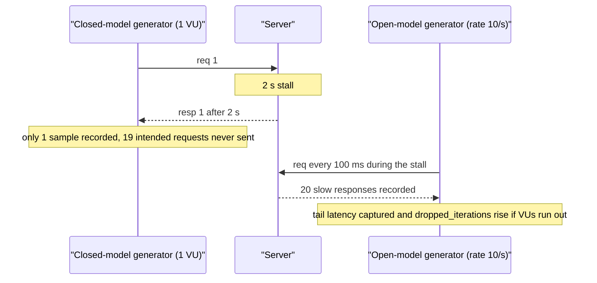
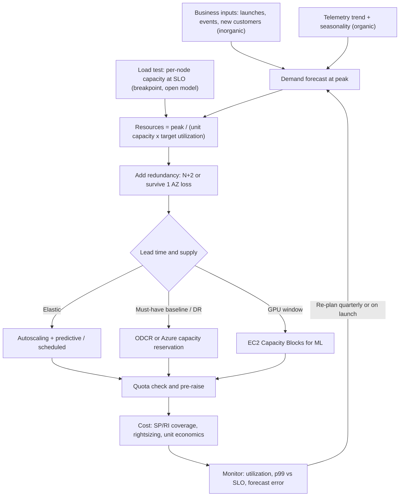

# J5 Capacity Planning & Load Testing
> Last verified: 2026-10 · Audience: senior/staff DevOps, SRE, AI eng, NetEng, DevSecOps, architects

## TL;DR
- **Capacity planning is a loop:** forecast demand (organic + inorganic), turn it into resources with a **measured** per-unit capacity (from load tests), add **headroom/redundancy (N+2, AZ-loss)**, provision ahead of **lead time**, then verify against real utilization. Plan in **resources (cores, GB, GPU-hours)**, not raw QPS, since request mix shifts (Google SRE).
- **Back-of-envelope:** 1 day ≈ 10^5 s; 1M req/day ≈ 12 QPS; peak ≈ 2–3x average; storage = writes x size x replication x retention; egress in Gbps = MB/s x 8 / 1000. Say your assumptions out loud and round hard.
- **Little's Law (L = λW)** sizes thread pools, connection pools and load-generator VUs. **Queueing:** wait grows like ρ/(1−ρ), so latency blows up past ~70–80% utilization. That is why utilization targets sit at 40–70% for latency-sensitive tiers.
- **Load test types:** load (expected peak), stress (beyond peak), soak (hours, for leaks), spike (sudden jump), breakpoint (ramp until it fails). Each answers a different question.
- **Open vs closed model:** closed-loop tools (fixed VUs, wait for each response) **slow down when the system slows down**, which hides tail latency (**coordinated omission**). Use **arrival-rate** generators (k6 `constant-arrival-rate`, wrk2 `-R`, vegeta `-rate`, Gatling open injection) to measure SLOs.
- **Autoscaling does not guarantee capacity.** It assumes the cloud has instances, quota allows them, and you can wait minutes for them to boot. Use **capacity reservations** (AWS ODCR / Azure on-demand capacity reservation) for DR and failover baselines, and **EC2 Capacity Blocks for ML** for GPU training windows.
- **Quota ≠ capacity:** quota is permission, capacity is physical supply. Both clouds say this explicitly. Track quota utilization with alarms and raise quotas ahead of launches and DR.
- **Cost-aware capacity:** headroom costs money (N+2 on N=4 is +50%). Measure **unit economics** (cost per 1k requests, per tenant, per 1M tokens). Rightsize with Compute Optimizer / Azure Advisor. Cover the steady baseline with Savings Plans/RIs, burst with on-demand or Spot.

## J5.1 Capacity planning process
- **How it works:**
  - **Inputs:** demand forecast, per-instance capacity at SLO (measured in a load test, not guessed), redundancy policy, provisioning **lead time** (minutes for cloud VMs, weeks for GPU blocks or quota increases, months for on-prem/colo).
  - **Organic growth:** natural adoption trend. Forecast with time-series methods (linear/exponential fit, seasonality such as weekly cycles and holiday peaks). Use **peak**, not average.
  - **Inorganic growth:** step changes from launches, marketing events, onboarding a big customer, a region migration, a new feature that changes request cost. These come from the business calendar, not from the graphs. SRE must be in the launch review.
  - **Forecast → resources:** `required = peak_demand / (per_unit_capacity x target_utilization)`, then add redundancy.
  - **Redundancy (N+1 / N+2):** Google's default intent is **N+2**: survive one planned outage (maintenance or rollout) plus one unplanned failure at the same time. In the cloud, the more common statement is **"survive loss of one AZ at peak"**: with 3 AZs, each AZ needs 50% of peak, so you provision 150%.
  - **Intent-based planning (Google Auxon):** state the goal ("meet demand in each region with N+2"), not "50 cores in cluster X". A solver bin-packs it. Spreadsheets fail because they go stale, are hard to error-check, and lose the reasoning behind each request.
  - **Utilization targets (typical):** latency-sensitive stateless tier **40–60% CPU at peak**. Batch/async **70–85%**. Databases **≤60–70%** (vertical scale is slow). Memory should stay below the GC/OOM danger zone. These are rules of thumb that you validate with load tests.
- **Trade-offs / when to use:**
  - More headroom means fewer incidents and more cost. Less headroom means you rely on autoscaling and load shedding working perfectly.
  - Plan in **resources**, not QPS. Google SRE: request mix changes over time, so QPS-based limits break. Model cost per request class.
  - Poor load balancing wastes capacity (Google example: 1,000 CPUs reserved, only 700 usable because load is unbalanced). Fix the balancing before buying more.
- **Interview angles:**
  - "How would you capacity plan service X?" → Walk the loop: SLO → load test for per-node capacity → forecast peak (organic + launches) → headroom/N+2/AZ-loss → lead time → quota/reservation → monitor forecast vs actual → re-plan quarterly.
  - Pitfall: planning on average load or on CPU alone. The bottleneck may be connections, IOPS, NAT ports, licenses, or a downstream dependency's quota.
  - Follow-up: "What's the leading indicator?" → saturation metrics (queue depth, pool utilization, p99 vs SLO) plus forecast-vs-actual error.
  - Load shedding/criticality ties in: when you run out of capacity anyway, shed SHEDDABLE traffic first (Google criticality levels CRITICAL_PLUS / CRITICAL / SHEDDABLE_PLUS / SHEDDABLE). See [J1](J1-slis-slos-error-budgets.md) for error budgets as the trigger.

## J5.2 Back-of-envelope estimation (interviews)
- **How it works: constants to memorize**

| Item | Value |
|---|---|
| Seconds/day | 86,400 ≈ **10^5** |
| Seconds/month · year | 2.6M · 31.5M (≈ π x 10^7) |
| 1M req/day | ≈ **12 QPS** avg (1B/day ≈ 12k QPS) |
| Peak : average | 2–3x typical, 5–10x for event-driven or flash traffic |
| 2^10 / 2^20 / 2^30 / 2^40 | ≈ 1 K / 1 M / 1 G / 1 T |
| 2^32 | ≈ 4.3 B (int32 IDs overflow; IPv4 space) |
| 1 Gbps | = 125 MB/s |

- **Latency numbers (order of magnitude; modern hardware varies):**

| Operation | ~Latency |
|---|---|
| L1 cache ref | ~1 ns |
| L2 cache ref | ~4 ns |
| Main memory ref | ~100 ns |
| Send 1 KB over 10 Gbps NIC | ~1 µs |
| Read 1 MB sequentially from RAM | ~5–10 µs |
| Random 4 KB read, NVMe SSD | ~20–100 µs |
| Round trip within an AZ / DC | ~100–500 µs |
| Cross-AZ round trip | ~0.5–2 ms |
| Read 1 MB sequentially from SSD | ~0.1–1 ms |
| HDD seek | ~2–10 ms |
| Cross-continent round trip (US↔EU) | ~70–150 ms |

- **Worked example: photo-sharing feed**
  - Assumptions: **200M DAU**. Each user does 50 feed reads and 2 posts per day. Post metadata is 1 KB. 10% of posts carry a 500 KB image. 20% of reads fetch an image. Peak = 3x average.
  - **Read QPS:** 200M x 50 = 10B/day ÷ 10^5 ≈ **100k avg → 300k peak**.
  - **Write QPS:** 400M/day ÷ 10^5 ≈ **4k avg → 12k peak**.
  - **Metadata storage:** 400M x 1 KB = 400 GB/day ≈ 146 TB/yr. x3 replicas ≈ **~440 TB/yr**.
  - **Media storage:** 40M x 500 KB = 20 TB/day ≈ **7.3 PB/yr**, before erasure coding. This belongs in object storage with lifecycle tiering.
  - **Egress:** metadata 300k x 1 KB = 300 MB/s ≈ 2.4 Gbps at peak. Images 60k/s x 500 KB = 30 GB/s ≈ **240 Gbps** at peak. That number is the reason you need a **CDN** ([C1.28](../C-large-scale-architecture/C1-performance.md#c128-http-caching-of-static-data)).
  - **Fleet:** a load test shows one node does 8k RPS at p99 SLO. At a 60% target that is 4.8k RPS. 300k ÷ 4.8k ≈ 63 nodes. To survive one AZ loss in 3 AZs, the remaining 2 AZs must carry 63, so 32/AZ x 3 = **96 nodes**.
  - **Cache sizing:** if 20% of posts drive 80% of reads, cache the hot day: 0.2 x 400 GB ≈ 80 GB, which fits in a small Redis cluster.
- **Trade-offs / when to use:** use BOTE to decide architecture (does it fit on one box? do we need sharding or a CDN?), not to set exact counts. Exact counts come from load tests.
- **Interview angles:**
  - Write the assumptions first, round to powers of 10, sanity-check each result ("240 Gbps from origin is unrealistic → CDN").
  - Common miss: forgetting replication, indexes (+30–100%), peak factor, or retention. Another: mixing up bits and bytes on bandwidth.
  - Follow-up "what dominates cost?" → usually media storage and egress, not compute.

## J5.3 Little's Law & queueing
- **How it works:**
  - **Little's Law: L = λ x W.** Average items in the system = arrival rate x average time in the system. It holds for any stable system, with no distribution assumptions.
    - 10k RPS x 200 ms = **2,000 concurrent requests** in flight, which sets thread/worker/connection limits.
    - DB pool: 3k QPS x 5 ms per query = **15 busy connections**. Size the pool to ~2x that, not 500.
    - Load generator: 2,000 VUs at 20 ms latency ≈ 100k RPS (the Azure Load Testing docs use exactly this formula: RPS = VUs / latency).
  - **Utilization ρ = λ / μ** (arrival rate / service rate). For M/M/1, response time **W = S / (1 − ρ)**, where S is service time:

| ρ | W / S |
|---|---|
| 50% | 2x |
| 70% | 3.3x |
| 80% | 5x |
| 90% | 10x |
| 95% | 20x |

  - **Kingman's approximation (G/G/1):** Wq ≈ (ρ/(1−ρ)) x ((ca² + cs²)/2) x S. Burstier arrivals or more variable service time (higher coefficient of variation) make queues worse at the same utilization.
  - **Pooling (M/M/c):** one queue served by many servers tolerates higher utilization than many single-server queues. This is why big shared pools run hotter than small ones.
  - **Tail amplification under fan-out:** a request fanning out to 100 backends, each with 1% chance of being slow, is slow 1 − 0.99^100 ≈ **63%** of the time. Mitigate with hedged requests and fewer hops.
  - **Retrograde scalability:** contention and coherence costs make throughput fall past a point (USL, [C1.17](../C-large-scale-architecture/C1-performance.md#c117-gunthers-universal-scalability-law)).
- **Trade-offs / when to use:** use queueing math to justify utilization targets and bounded queues. Unbounded queues turn overload into latency and then into timeouts (cascading failure). Prefer bounded queues plus rejection (fail fast, 429/503).
- **Interview angles:**
  - "Why not run at 90% CPU?" → queueing delay is ~10x service time and there is no buffer for an AZ loss or a spike.
  - "How many threads/connections?" → Little's Law with p99 latency, not mean, plus a margin.
  - Pitfall: Little's Law uses **averages over a stable window**. It does not tell you the tail.
  - Retry storms: Google limits per-request retries to 3 and per-client retry ratio to 10%, capping amplification at ~1.1x. Client-side adaptive throttling rejects locally with p = max(0, (requests − K·accepts)/requests), K=2.

## J5.4 Load testing types
| Type | Shape | Question it answers | Typical duration |
|---|---|---|---|
| **Smoke** | 1–5 VUs | Does the script/env work? | 1–5 min |
| **Load (average/peak)** | Ramp to expected peak, hold | Do we meet the SLO at forecast peak (+ headroom)? | 30–60 min |
| **Stress** | Above peak (e.g. 150–200%) | How does it degrade? Does shedding/autoscaling work? | 30–60 min |
| **Soak / endurance** | Normal load for hours | Memory leaks, connection/FD leaks, log/disk growth, GC drift, token expiry | 4–24 h+ |
| **Spike** | Instant jump (e.g. 10x) | Cold start, autoscaling lag, cache stampede, queue backlog | Minutes |
| **Breakpoint / capacity** | Slow ramp until SLO breach or errors | Per-node/per-cluster max at SLO; the input to J5.1 | Until failure |
| **Scalability** | Repeat at 1, 2, 4, 8 nodes | Is scaling linear? (USL fit) | Per step |

- **How it works:**
  - Define pass/fail **thresholds tied to SLOs** (p95/p99 latency, error rate, dropped iterations). Run in CI to catch regressions; Azure Load Testing "test fail criteria" and k6 thresholds both return non-zero on failure.
  - Use a **production-like env**: same instance types, data volume (index sizes matter), caches warmed or deliberately cold, and dependencies real or faithfully stubbed.
  - Watch **server-side saturation** (CPU, pools, GC, queue depth) next to the client-side metrics. Also check the **load generator's own health**. Azure Load Testing considers an engine healthy at <75% average CPU/memory.
- **Trade-offs / when to use:** breakpoint tests give capacity numbers. Soak tests catch the slow-burn bugs that cause the 3 a.m. pages. Spike tests validate autoscaling and warm pools. Do not trust results from a shared noisy staging env.
- **Interview angles:**
  - "How do you find a service's capacity?" → breakpoint test with an **open model**. Capacity = the highest rate where p99 stays under the SLO with errors under 0.1%. Then derate by the utilization target.
  - Pitfalls: testing one endpoint when production has a mix, 100% cache hits from repeating the same IDs, the generator saturating first, testing from the same AZ only, no think time in closed models, ignoring warm-up.

## J5.5 Open vs closed workload models & coordinated omission
- **How it works:**
  - **Closed model:** a fixed number of users. Each sends, waits for the response (plus think time), then sends again. Throughput = users / (response time + think time). When the server slows, the offered load **drops**. Examples: JMeter thread groups, Locust users, k6 `constant-vus` / `ramping-vus` / `*-iterations`.
  - **Open model:** requests arrive at a set rate regardless of responses, which is how internet traffic behaves (users don't coordinate). Examples: k6 `constant-arrival-rate` / `ramping-arrival-rate` (with `preAllocatedVUs`, `maxVUs`), wrk2 `-R`, vegeta `-rate`, Gatling `constantUsersPerSec` / `rampUsersPerSec`.
  - **Coordinated omission (Gil Tene):** a closed-loop generator stalls along with the server, so it **never sends the requests that would have hit the stall**. Those slow samples are missing, and p99/p99.9 looks far better than reality. wrk2 corrects for this by measuring latency from the **intended** send time (HdrHistogram).
  - In k6, if the SUT slows and VUs run out, the executor reports **`dropped_iterations`**. Treat that as a failure signal and put a threshold on it.
- **Trade-offs / when to use:**
  - Open: SLO/latency validation, public APIs, capacity breakpoints.
  - Closed: systems with a truly fixed client population (internal batch workers, connection-pooled clients, call-centre agents), or when you want to model concurrency limits.
  - Open-model generators need enough VUs: VUs ≥ rate x p99 latency (Little's Law). Otherwise they silently become closed.
- **Interview angles:**
  - "Your load test shows p99 = 50 ms but prod p99 is 2 s, why?" → coordinated omission or closed model, cache-friendly data, missing request mix, or a generator bottleneck.
  - Know the phrase: "**closed systems hide overload by slowing the arrival rate**."



## J5.6 Load testing tools
| Tool | Scripting | Model | Strengths | Watch out |
|---|---|---|---|---|
| **k6** (Grafana) | JavaScript/TypeScript, Go engine | Both; 6 executors (4 closed, 2 arrival-rate open) | Thresholds → CI exit code, low resource use, scenarios, Grafana Cloud k6, browser module | Not a browser by default; JS runtime is not Node.js |
| **Locust** | Python classes | Closed (users + `wait_time`); `constant_throughput` per user approximates rate | Arbitrary Python logic, distributed master/worker, web UI | GIL → many workers; closed by default |
| **Gatling** | Java/Kotlin/Scala/JS DSL | Explicit **open** and **closed** injection profiles | Efficient async engine, good HTML reports | DSL learning curve |
| **JMeter** | GUI/XML `.jmx`, plugins | Closed thread groups; Constant Throughput Timer / Throughput Shaping plugin for rate | Widest protocol set (HTTP, JDBC, JMS, LDAP, TCP), Azure/AWS managed support | Heavy per thread; ~250 threads/engine guideline (Azure) |
| **wrk2** | Lua hooks, CLI | Open, constant `-R` rate | CO-corrected HdrHistogram latencies | HTTP only, minimal scripting, unmaintained (unverified) |
| **vegeta** | CLI/Go lib, targets via stdin | Open, constant `-rate` | Unix-pipe friendly, plots/histograms | Limited scenario logic |

- **Trade-offs / when to use:** k6 or Gatling for SLO-gated CI tests. JMeter for non-HTTP protocols or existing `.jmx` assets. Locust when the test logic is Python-heavy. wrk2 or vegeta for quick, correct single-endpoint rate tests.
- **Interview angles:** name the open-model option in each tool. Mention distributed generation (multiple regions and AZs, egress bandwidth per generator, client-side TLS CPU cost) and generator health monitoring.

## J5.7 Testing in production (shadow traffic, synthetic load)
- **How it works:**
  - **Shadow/mirrored traffic:** copy live requests to a new version and discard its responses. Implementations: Envoy `request_mirror_policies`, Istio `mirror` + `mirrorPercentage`, NGINX `mirror` directive, replay tools (GoReplay). AWS **VPC Traffic Mirroring** / Azure **Virtual Network TAP** copy L3 packets, which suits IDS work more than app-level shadowing.
  - **Synthetic load:** generated requests against prod, tagged (header or test-tenant) so they are excluded from business metrics and billing, and routed to isolated data or idempotent paths.
  - **Synthetic monitoring/canaries:** low-rate probes for availability (CloudWatch Synthetics canaries; Azure Application Insights **standard availability tests**; classic URL ping tests are being retired, date unverified).
  - **Squeeze/redline testing:** shift real traffic onto fewer instances or one cluster (Facebook **Kraken**, Google draining) to measure true capacity under real request mix, with automated rollback triggered by SLO metrics.
  - **Dark launch:** a new code path runs on real traffic and its result is discarded, often behind a feature flag ([C5](../C-large-scale-architecture/C5-deployment.md)).
- **Trade-offs / when to use:**
  - Real request mix and real data volume, with no staging drift. The risks are side effects (writes, emails, payments, third-party rate limits), PII exposure in the shadow environment, and doubled downstream load.
  - Mitigate: mirror only idempotent reads or stub sinks, use a percentage ramp, have a kill switch, run off-peak, burn **error budget** consciously ([J1](J1-slis-slos-error-budgets.md)), and announce tests to on-call.
- **Interview angles:**
  - "How do you validate a rewrite at prod scale?" → shadow traffic → compare responses and latency → canary → ramp.
  - Pitfall: shadow writes to the real DB, or a mirror that adds latency to the primary path. Mirroring should be fire-and-forget.

## J5.8 Autoscaling vs capacity reservations
- **How it works:**
  - **Reactive autoscaling** (target tracking/step on CPU, RPS per target, queue depth). Reaction time = metric period + alarm evaluation + boot + app warm-up, often **2–10 min**. A spike faster than that needs headroom or shedding ([C2.30](../C-large-scale-architecture/C2-scalability.md#c230-auto-scaling-instances)).
  - **Predictive/scheduled scaling:** AWS EC2 Auto Scaling predictive scaling forecasts cyclical load from history (needs ≥24 h of data). Azure VMSS predictive autoscale is CPU-based and needs ~7 days of history (details unverified). Scheduled actions handle known events.
  - **Warm pools / standby pools** (AWS ASG warm pools, Azure VMSS standby pools) keep pre-initialized instances to cut boot time.
  - **Autoscaling fails when:** quota is exhausted, there is **insufficient capacity** in the AZ (`InsufficientInstanceCapacity` / Azure `AllocationFailed`/`ZonalAllocationFailed`), the wrong signal is used (CPU for an IO-bound service), caches are cold, or a downstream DB can't scale with it.
  - **AWS On-Demand Capacity Reservations (ODCR):** reserve instance type + platform + **AZ** + tenancy for any duration. Billed at the on-demand rate **whether used or not**. No discount by itself; combine with **Savings Plans or Regional RIs** for the discount (zonal RI discounts don't apply). **Open** (auto-match) vs **targeted**. Counts against On-Demand vCPU quota. Can be shared via RAM, grouped (Capacity Reservation groups), and used through CR Fleets. Supports cluster placement groups.
    - **Immediate** CRs: no commitment, cancel any time.
    - **Future-dated** CRs: you commit to a duration, the minimum is 32 vCPUs, families are C, G, I, M, R, T, U, X, and they cover incremental instances, not ones already running.
    - **Interruptible CRs:** lend unused reserved capacity to other teams/accounts and reclaim it later; consumers are terminated on reclaim with no fallback.
  - **Azure on-demand capacity reservation:** one VM size per reservation inside a **capacity reservation group** (region, optionally zones). VMs must **explicitly reference the group** to consume it. Priced at pay-as-you-go whether used or not. **RIs/Savings Plan discounts apply to used and unused** reservations. Backed by a **capacity SLA**. **Overallocation** above the reserved quantity is allowed but not covered by the SLA. Deallocated-but-associated VMs still consume quota. Not supported: Spot, Dedicated Host, availability sets, proximity placement groups, Ultra Disk, and several GPU series (ND-series, NCads H100 v5).
- **Trade-offs / when to use:**

| Need | Use |
|---|---|
| Elastic daily curves | Autoscaling (+ predictive) |
| DR region / AZ failover must succeed | Capacity reservation (ODCR / Azure CR) |
| Known event (sale, launch) | Future-dated ODCR or a scheduled CR + scheduled scaling |
| GPU training window of days or weeks | EC2 Capacity Blocks for ML (J5.9) |
| Cheap interruptible burst | Spot (AWS) / Spot VMs (Azure) |
| Steady-state discount | Savings Plans / RIs. **No capacity guarantee** (Azure RI "capacity priority" carries no SLA; AWS regional RIs reserve no capacity) |

- **Interview angles:**
  - "Autoscaling is configured, why did the failover fail?" → the DR region had no capacity or quota. Reservations, quota pre-raise, and failover game-days fix this ([J7](J7-chaos-engineering.md)).
  - Distinguish **discount instruments** (RI/SP) from **capacity instruments** (ODCR/CR, Capacity Blocks). Interviewers like this one.
  - Monitor reservation utilization: AWS publishes CloudWatch metrics and EventBridge underutilization events. Idle reservations are pure waste.

## J5.9 Quotas & limits management (incl. GPU capacity)
- **How it works:**
  - **AWS Service Quotas:** central view of default vs **applied** quotas, adjustable flag, per-account and per-Region (some per-resource). **Global** quotas are requested from us-east-1. Request increases via console/API/CLI. Support may approve, partially approve, or deny. **Quota request templates** auto-request increases for new accounts in an Organization. **CloudWatch usage metrics** (`AWS/Usage`) with `SERVICE_QUOTA()` metric math alarms. **Automatic Management** notifies you before exhaustion. Trusted Advisor also has service-limit checks.
  - **EC2 On-Demand quotas are vCPU-based per instance-family group** (Standard A/C/D/H/I/M/R/T/Z; G and VT; P; Inf; Trn; etc.). New accounts often start with low or **0 vCPUs for P/G GPU families**. Request early.
  - **Azure quotas:** per **subscription per region**. Compute has **Total Regional vCPUs** plus **per VM-family vCPUs**, and Spot vCPUs are separate. Adjustable quotas are requested on the **Quotas / My quotas** page or the **Quota REST API** (Compute, ML). Non-adjustable quotas need a support request. Quota requests are free. Microsoft "may increase or decrease quotas based on usage," and **an assigned quota does not reserve or guarantee capacity**. Usage alerts are available on the Quotas page.
  - **API rate limits** are quotas too: AWS EC2 API throttling (token bucket), Azure Resource Manager throttling. Mass scale-outs or IaC applies can hit them. Use backoff with jitter.
  - **Internal quotas (multi-tenant platforms):** per-tenant limits in resource units. Google allocates CPU-seconds per client, and the sum can exceed total capacity (statistical overcommit). Kubernetes `ResourceQuota` / `LimitRange` per namespace.
  - **GPU capacity: AWS EC2 Capacity Blocks for ML:**
    - Reserve P6-B300/P6-B200/P5/P5e/P5en/P4d/Trn1/Trn2 instances, and **UltraServers** (Trn2, P6e-GB200), with a start date **up to 8 weeks ahead**. Durations are **1-day increments up to 14 days, then 7-day increments up to 182 days**. Up to **64 instances per block, 256 across blocks** (org-wide per date).
    - Instances are co-located in **EC2 UltraClusters** (EFA, non-blocking network). **Price is dynamic (supply/demand), paid upfront**, and fixed once bought. **No cancellation.** Extensions are possible. **Savings Plans/RIs don't apply.** Blocks don't count against On-Demand limits.
    - Blocks end at **11:30 UTC**, and termination starts at 11:00 UTC on the last day. Instances must **target the reservation ID**. Placement groups are not supported. EKS managed node groups, ASG (schedule scaling at block start), ParallelCluster and PCS integrate with it.
  - **Azure GPU:** no direct public "Capacity Blocks" equivalent (unverified as of 2026-10). Options are on-demand capacity reservation for supported GPU series (NC A100 v4, NCasT4_v3, NV series; **not ND or NCads H100 v5**), quota increases plus Reserved Instances, Azure ML / AI Foundry managed compute, and for model APIs, Azure OpenAI **provisioned throughput units (PTU)**. GCP alternative: Dynamic Workload Scheduler calendar mode. AWS alternative: SageMaker HyperPod flexible training plans.
- **Trade-offs / when to use:** pre-raise quotas for **DR regions to 100% of primary**. Treat quota as a dependency with its own SLO (lead time). Use Capacity Blocks when GPU need is bursty (days/weeks). Use 1–3 yr commitments or ODCR when it is continuous.
- **Interview angles:**
  - "Launch day, scale-out fails with `VcpuLimitExceeded`" → quota, not capacity. Prevent it with quota alarms at 70–80% and quota templates for new accounts.
  - "Need 128 H100s for 3 weeks next month" → Capacity Blocks (2 blocks of 64 p5.48xlarge, 21 days), lock the price upfront, plan checkpointing around the 11:30 UTC end, use the EKS/ASG integration. See [K5](../K-ai-infra-llm/K5-training-fine-tuning.md).

## J5.10 Cost-aware capacity (FinOps basics, unit economics)
- **How it works:**
  - **FinOps Framework:** phases **Inform → Optimize → Operate**. Domains: Understand Usage & Cost, **Quantify Business Value** (forecasting, budgeting, **unit economics**), Optimize Usage & Cost, Manage the Practice. Recent framework versions add **Scopes** and AI as a technology category. **FOCUS** is the open billing data spec, with FOCUS exports in AWS Data Exports and Azure Cost Management.
  - **Unit economics:** cost per business unit = allocated cost ÷ units, e.g. **$/1k requests, $/active user/month, $/tenant, $/1M tokens, $/GPU-hour of useful training**. Track the trend. A rising unit cost at flat traffic means efficiency regressed.
  - **Allocation:** tags/labels (AWS cost allocation tags; Azure tags + management groups), account/subscription-per-team, K8s cost allocation (OpenCost/Kubecost). Showback first, then chargeback.
  - **Rate optimization:** Savings Plans (Compute / EC2 Instance / SageMaker) and RIs on AWS. Azure savings plan for compute and Azure Reservations. Aim for high **coverage** of the steady baseline and ~100% **utilization** of commitments.
  - **Usage optimization (rightsizing):**
    - **AWS Compute Optimizer:** EC2, ASG, EBS, Lambda, ECS on Fargate, RDS/Aurora, DynamoDB, ElastiCache, NAT Gateway, SageMaker and more. Uses a **14-day** lookback by default, **93 days** with paid enhanced infrastructure metrics. Configurable CPU/memory headroom preferences. Memory data needs the CloudWatch agent or ingestion from Datadog/Dynatrace.
    - **Azure Advisor (Cost):** shutdown/resize recommendations with a default **7-day** lookback (configurable 7/14/21/30/60/90). Shutdown when P95 CPU <3% and outbound network <2%. Resize targets: **user-facing P95 CPU ≤40%, P99 memory ≤60%**; non-user-facing ≤80%. Savings shown at retail and ignore RIs/Savings Plans.
  - **Cost of redundancy:** N+2 overhead = 2/N (N=4 → +50%; N=20 → +10%). Bigger pools make headroom cheaper, which is an argument for shared pools and multi-tenant clusters.
- **Trade-offs / when to use:** commitments lower the unit rate but reduce flexibility. Spot can save up to ~90% but is interruptible (fine for stateless, batch, CI, checkpointed training). Rightsizing must respect the latency SLO, so validate with a load test after downsizing.
- **Interview angles:**
  - "Cut cloud cost 30% without hurting reliability" → allocate first (who spends what), kill idle (Advisor/Compute Optimizer), rightsize (with headroom preferences), move the baseline to SP/RI, burst on Spot, autoscale to zero off-hours for non-prod, add storage lifecycle, reduce egress (CDN/caching), then track $/unit.
  - Pitfall: rightsizing to average utilization removes the AZ-loss headroom. Capacity and cost decisions must share the same N+2 policy.

## Diagrams


## Cloud mapping: AWS vs Azure
| Capability | AWS | Azure | Role it plays | Key differences | Alternatives |
|---|---|---|---|---|---|
| Quota management | **Service Quotas** (+ request templates, `AWS/Usage` metrics, Automatic Management, Trusted Advisor) | **Azure Quotas** (My quotas page, Quota REST API, usage alerts) | View/raise limits, alert before exhaustion | AWS per account per Region (global quotas via us-east-1); Azure per subscription per region, total + per-family vCPU; neither guarantees capacity | K8s ResourceQuota; GCP Quotas |
| Capacity guarantee (general VMs) | **EC2 On-Demand Capacity Reservations** (immediate, future-dated, interruptible; CR Fleets) | **On-demand capacity reservation** (capacity reservation groups) | Ensure launches succeed in an AZ/region | AWS open/targeted auto-match, zonal only; Azure requires explicit group reference, regional or zonal, **capacity SLA**, overallocation allowed; both bill at PAYG whether used or not | GCP reservations; Karpenter fallbacks |
| GPU time-boxed capacity | **EC2 Capacity Blocks for ML** (1–182 days, ≤64 instances/block, upfront dynamic price) | No direct equivalent (unverified); CR for some NC/NV series, quota + RIs, PTU for Azure OpenAI | Guaranteed co-located GPUs for training/fine-tuning windows | Capacity Blocks can't be cancelled; SP/RI don't apply | SageMaker HyperPod training plans; GCP DWS calendar mode |
| Discount commitments | Savings Plans, Reserved Instances | Azure savings plan for compute, Reservations | Lower the unit rate on the baseline | AWS regional RI/SP no capacity; Azure RI "capacity priority" without SLA | Spot / Spot VMs |
| Managed load testing | **Distributed Load Testing on AWS** (solution: CloudFormation, ECS on Fargate; JMeter, k6, Locust; multi-region; scheduling) | **Azure Load Testing** (now under the Azure App Testing umbrella; JMeter, Locust, URL quick tests) | Generate high-scale load without running generator fleets | DLT is a deployable solution you operate (~$31/mo baseline + Fargate usage); Azure is a managed PaaS with Azure Monitor server-side metrics, CI fail criteria, VNet injection, ≤400 engines/test, ≤24 h | Grafana Cloud k6, Gatling Enterprise, BlazeMeter |
| Rightsizing | **AWS Compute Optimizer** (14 d default, 93 d paid) | **Azure Advisor** (Cost pillar; 7 d default, up to 90 d) | Find idle/oversized resources | Compute Optimizer needs memory metrics from an agent; Advisor resize targets P95 CPU ≤40% for user-facing; Advisor savings ignore RIs | Kubecost/OpenCost, VPA |
| Autoscaling | EC2 Auto Scaling (target tracking, predictive, warm pools), Application Auto Scaling | VMSS autoscale (incl. predictive), standby pools, App Service/AKS autoscale | Elastic capacity | Predictive requirements differ (AWS ≥24 h data; Azure ~7 d, CPU only, unverified) | Kubernetes HPA/KEDA/Karpenter |
| Synthetic probes | CloudWatch Synthetics canaries | Application Insights standard availability tests | Prod reachability/latency from outside | Azure classic URL ping tests being retired | Grafana Synthetic Monitoring, Checkly |

- **Service Quotas vs Azure Quotas:** both are the permission layer. AWS has richer Organization automation (request templates applied to new accounts). Azure has a Quota API limited to Compute/ML providers, with others going through support tickets.
- **ODCR vs Azure CR:** the biggest gotcha is **matching**. AWS **open** CRs silently absorb any matching instance. Azure VMs must **opt in** via the reservation-group property, so a VM without it doesn't consume the reservation (and you pay for both). Azure RIs discount even unused reservations. On AWS, combine with Regional RIs/SP for the discount.
- **Capacity Blocks:** AWS-specific GPU primitive. Think of it as "a hotel booking for GPUs": dynamic price, no cancellation, hard end time. Design training jobs to checkpoint and finish before 11:00 UTC on the last day.
- **DLT on AWS vs Azure Load Testing:** DLT is a reference solution in your account (you patch and own it). It supports k6, which Azure Load Testing does not (Azure supports JMeter and Locust only). Azure Load Testing auto-stops on throttling and error conditions and integrates App Insights/Container insights server metrics. Limits: up to 400 engines per run, 1,000 concurrent engines, 24 h max duration. Guidance is ≤250 JMeter threads or ≤500 Locust users per engine.
- **Compute Optimizer vs Advisor:** both are rightsizing advisors. Compute Optimizer covers more services (DynamoDB, NAT GW, SageMaker) and lets you set headroom preferences. Advisor spans five pillars (Cost, Reliability, Security, Performance, Operational Excellence) with configurable lookback.
- **Alternatives:** Kubernetes (HPA/KEDA + Karpenter/Cluster Autoscaler with ODCR-aware node pools), Grafana Cloud k6 for managed k6, Cloudflare in front to absorb spikes (cache, rate limiting) and reduce origin capacity, Databricks/Spark clusters with autoscaling + spot for batch.

## Hands-on (optional)
```bash
# 1) Target + k6 open-model test in Docker (constant arrival rate, SLO thresholds)
docker network create lt 2>/dev/null || true
docker run -d --rm --name web --network lt nginx:alpine

cat > /tmp/k6-open.js <<'EOF'
import http from 'k6/http';
export const options = {
  scenarios: { open: { executor: 'constant-arrival-rate', rate: 500, timeUnit: '1s',
    duration: '30s', preAllocatedVUs: 20, maxVUs: 200 } },
  thresholds: { http_req_duration: ['p(99)<200'], http_req_failed: ['rate<0.01'],
    dropped_iterations: ['count<1'] },
};
export default function () { http.get('http://web/'); }
EOF

docker run --rm -i --network lt grafana/k6 run - < /tmp/k6-open.js
echo "k6 exit code: $?   # non-zero (99) when a threshold fails -> CI gate"
```

```bash
# 2) Same idea with vegeta (open model, pure CLI). Community image, unverified tag.
echo "GET http://web/" | docker run --rm -i --network lt peterevans/vegeta \
  sh -c 'vegeta attack -rate=1000/s -duration=20s | vegeta report -type=hist[0,5ms,10ms,50ms,100ms]'

# 3) Little's Law / BOTE helper
rps=10000; p99_ms=200
echo "in-flight ≈ $(( rps * p99_ms / 1000 )) concurrent requests"
echo "1B req/day ≈ $(( 1000000000 / 86400 )) avg QPS"

# Cleanup
docker rm -f web; docker network rm lt
```

```bash
# 4) Cloud quota / capacity checks (read-only)
aws service-quotas get-service-quota --service-code ec2 --quota-code L-1216C47A   # Running On-Demand Standard vCPUs
aws ec2 describe-capacity-block-offerings --instance-type p5.48xlarge --instance-count 8 \
  --capacity-duration-hours 168 --start-date-range 2026-11-01T00:00:00Z --end-date-range 2026-12-01T00:00:00Z
az vm list-usage --location eastus -o table        # regional + per-family vCPU usage vs quota
az quota list --scope /subscriptions/<sub>/providers/Microsoft.Compute/locations/eastus -o table
```

## Cross-links
- [C1 Performance](../C-large-scale-architecture/C1-performance.md): latency numbers ([C1.15](../C-large-scale-architecture/C1-performance.md#c115-some-common-latency-costs)), USL ([C1.17](../C-large-scale-architecture/C1-performance.md#c117-gunthers-universal-scalability-law)), metrics ([C1.5](../C-large-scale-architecture/C1-performance.md#c15-performance-measurement-metrics))
- [C2 Scalability](../C-large-scale-architecture/C2-scalability.md): auto scaling ([C2.30](../C-large-scale-architecture/C2-scalability.md#c230-auto-scaling-instances)), load balancing ([C2.22](../C-large-scale-architecture/C2-scalability.md#c222-load-balancing-multiple-instances))
- [J1 SLIs, SLOs & error budgets](J1-slis-slos-error-budgets.md): thresholds and the error-budget trigger for capacity work
- [J2 Monitoring & alerting](J2-monitoring-and-alerting.md) (saturation signals) · [J7 Chaos engineering](J7-chaos-engineering.md) (AZ-loss / failover drills)
- [D1 System design basics](../D-system-design/D1-system-design-basics.md) (BOTE in design interviews) · [K4 LLM serving](../K-ai-infra-llm/K4-llm-serving-inference.md) / [K5 Training](../K-ai-infra-llm/K5-training-fine-tuning.md) (GPU capacity)

## Sources
- https://sre.google/sre-book/handling-overload/
- https://sre.google/sre-book/load-balancing-datacenter/
- https://sre.google/sre-book/software-engineering-in-sre/ (Auxon, intent-based capacity planning, N+2)
- https://grafana.com/docs/k6/latest/using-k6/scenarios/executors/
- https://grafana.com/docs/k6/latest/using-k6/scenarios/concepts/open-vs-closed/
- https://grafana.com/docs/k6/latest/using-k6/scenarios/concepts/dropped-iterations/
- https://grafana.com/docs/k6/latest/set-up/install-k6/
- https://docs.aws.amazon.com/servicequotas/latest/userguide/intro.html
- https://docs.aws.amazon.com/AWSEC2/latest/UserGuide/ec2-capacity-reservations.html
- https://docs.aws.amazon.com/AWSEC2/latest/UserGuide/interruptible-capacity-reservations.html
- https://docs.aws.amazon.com/AWSEC2/latest/UserGuide/ec2-capacity-blocks.html
- https://docs.aws.amazon.com/AWSEC2/latest/UserGuide/capacity-blocks-purchase.html
- https://docs.aws.amazon.com/AWSEC2/latest/UserGuide/capacity-blocks-pricing-billing.html
- https://docs.aws.amazon.com/solutions/latest/distributed-load-testing-on-aws/solution-overview.html
- https://docs.aws.amazon.com/compute-optimizer/latest/ug/what-is-compute-optimizer.html
- https://learn.microsoft.com/en-us/azure/virtual-machines/capacity-reservation-overview
- https://learn.microsoft.com/en-us/azure/quotas/quotas-overview
- https://learn.microsoft.com/en-us/azure/app-testing/load-testing/overview-what-is-azure-load-testing
- https://learn.microsoft.com/en-us/azure/app-testing/load-testing/how-to-high-scale-load
- https://learn.microsoft.com/en-us/azure/app-testing/load-testing/resource-limits-quotas-capacity
- https://learn.microsoft.com/en-us/azure/advisor/advisor-overview
- https://learn.microsoft.com/en-us/azure/advisor/advisor-cost-recommendations
- https://www.finops.org/framework/
