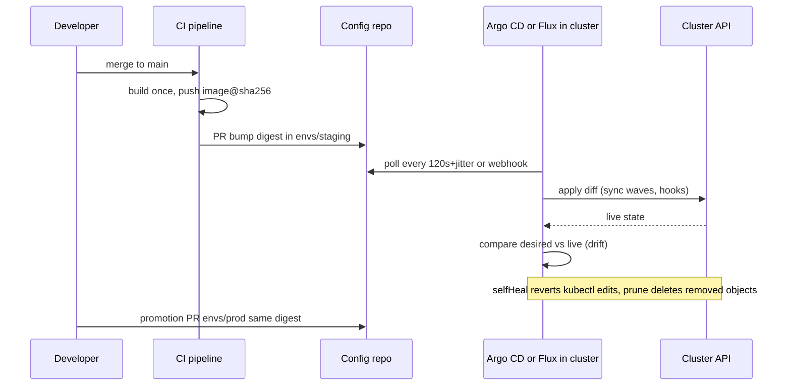

# J6 Toil, Automation & Release Engineering
> Last verified: 2026-10 · Audience: senior/staff DevOps, SRE, AI eng, NetEng, DevSecOps, architects

## TL;DR
- **Toil** has a specific definition: work that is manual, repetitive, automatable, tactical, has no enduring value and **scales linearly with the service**. Google keeps it **below 50%** of each SRE's time; its surveys put the average at about **33%**. Measure toil in hours or tickets before you try to cut it.
- Automation has levels, from a script in someone's home directory up to a system that needs no automation. The goal is the top level, where the system heals itself. Automation that runs at scale needs **rate limits, idempotency and sanity checks on its inputs** (Diskerase; the AWS DynamoDB DNS automation race in Oct 2025).
- **Release engineering** rests on four things: **hermetic, reproducible builds**, **one immutable artifact promoted** through environments (no rebuild per env), signed **provenance** (SLSA Build L2/L3), and policy gates enforced by the pipeline.
- **CI/CD**: work trunk-based with short-lived branches, use a **merge queue** so main stays green, and use feature flags so you can deploy without releasing. Monorepo or polyrepo is a choice about tooling and ownership. Neither one is "better".
- **Progressive delivery**: one-box/canary → **waves** (one AZ or cell at a time, small region first) → **bake times** → **automatic rollback on SLO/alarm**, with the canary compared against a control running at the same time. AWS goes one-box (≤10% of a region) → wave 1 bake ≥12 h → global in about 4–5 business days. Azure's model is rings/tiers with a bake of about 24 h.
- **About 70% of outages come from changes to a live system** (SRE book), and config and data pushes are the ones most often skipped by canaries. Config is code: validate it, version it, roll it out gradually, and have a kill switch.
- **GitOps** (OpenGitOps): declarative, versioned and immutable, pulled automatically, continuously reconciled. In Argo CD, reconciliation runs every 120 s + 60 s jitter, and `prune` and `selfHeal` are **off by default**.
- **DORA has five metrics, not four**: deployment frequency, change lead time, **failed deployment recovery time** (it replaced MTTR), change fail rate and **deployment rework rate**. They are grouped as throughput vs instability, and DORA's finding is that speed and stability are *not* a trade-off.

## J6.1 Toil: definition, 50% cap, measuring and eliminating
- **How it works:**
  - The six properties: **manual, repetitive, automatable, tactical (interrupt-driven), no enduring value, O(n) with service growth**. A task does not need all six to count. The more it matches, the more toil it is.
  - **Things that are not toil:** **overhead** (meetings, HR, training, peer review) and **grungy work that has lasting value** (cleaning up alert config, paying down tech debt). Saying this out loud is a common interview check.
  - **50% cap.** At least half of SRE time goes to engineering that reduces future toil or adds features. If toil stays above 50%, hand work back to the dev team or stop accepting new services. Google's quarterly surveys show about 33% on average, ranging from 0% to 80% per person.
  - **Common sources** (SRE Workbook): ticket-driven business processes, production interrupts, **release shepherding**, migrations, cost engineering, and troubleshooting opaque architectures.
  - **How to measure:** (1) find the toil with the people who do ops work; (2) pick an objective unit (**hours**, tickets, manual changes, pages); (3) track it **before, during and after** the fix. Sources are ticket queues tagged `toil`, on-call logs, and a quarterly self-reported survey. Turn the result into an **ROI**: hours/week × engineers × weeks vs build plus maintenance cost.
  - **Ways to reduce it** (Workbook): engineer the toil out at its source, **reject** toil whose cost exceeds its value, let **SLOs** decide what doesn't need doing, start with **human-backed interfaces** (a self-service form whose backend is a human at first and gets automated later), provide self-service, make the fleet uniform (fewer snowflakes), build safety checks into automation, and reuse OSS.
- **Trade-offs / when to use:**
  - Toil is acceptable in small doses: it is predictable, onboards new people and helps them build intuition. It becomes a problem when it grows linearly. Too much leads to burnout, attrition, slower features, and dev teams shifting their work onto SRE.
  - Not every piece of toil is worth automating. Use the "is it worth the time" table: frequency × time saved over 5 years.
- **Interview angles:**
  - "How would you cut on-call toil by half?" → measure first (classify pages and tickets), then remove non-actionable alerts (link to [J2](J2-monitoring-and-alerting.md)), automate the top 3 runbooks, offer self-service for the top ticket types, and fix root causes using postmortem action items ([J4](J4-incident-response-postmortems.md)).
  - "Isn't 50% arbitrary?" → it is a forcing function, and the point is the escape valve (give work back to devs). The exact number matters less than measuring it and having a trigger.
  - Pitfall: automation that needs a person to babysit it. That is still toil, just moved somewhere else.

## J6.2 Automation hierarchy and automation safety
- **How it works:**
  - **Hierarchy** (SRE book, using DB failover as the example): **(1)** no automation, failover done by hand → **(2)** externally maintained, system-specific (a script in an SRE's home directory) → **(3)** externally maintained, generic (a shared failover tool) → **(4)** internally maintained, system-specific (the DB ships its own failover) → **(5)** **a system that needs no automation** (it detects the problem and fails over by itself, as with Aurora or Cosmos DB managed failover).
  - **What automation gives you:** consistency, a **platform** (extensible, exports metrics), faster repairs (lower MTTR), faster action than a human can manage, and time savings.
  - **Safety rules for automation that touches many machines:** **rate-limit** actions, **check that inputs are sane** (refuse an empty set or "all"), require **idempotency**, run it progressively over a small slice first, give it a dry-run mode, add a **global circuit breaker**, and **stop when an invariant is violated**.
  - Real failures: **Diskerase** (Google) took an empty server list as "all servers" and wiped nearly the whole CDN fleet. **AWS us-east-1, Oct 2025**: a race between DynamoDB's DNS management automation components left an empty DNS record for the regional endpoint (public post-incident summary). **Google Cloud, Jun 2025**: a Service Control policy change with no feature flag replicated globally within seconds and crash-looped every region.
- **Trade-offs / when to use:**
  - Generic platform automation (level 3) scales across teams but often ignores system-specific edge cases. Built-in automation (4–5) is the most robust but needs owners outside SRE.
  - Automation can **erode operator skill**: humans lose practice at the manual fallback (automation paradox). Counter this with game days ([J7](J7-chaos-engineering.md)).
- **Interview angles:**
  - "Should we automate failover?" → yes, when failure detection is reliable and split-brain is prevented (fencing/quorum, see [C3](../C-large-scale-architecture/C3-reliability.md#c322-stateful-failovers)). Otherwise use automatic detection with a one-click human-approved failover.
  - Follow-up: "how do you stop automation causing an outage?" → blast-radius limits, rate limits, input invariants, progressive rollout of the automation itself, and audit logs.

## J6.3 Release engineering: hermetic builds, versioning, promotion, provenance
- **How it works:**
  - **Google's four principles:** **self-service** (teams release themselves), **high velocity** (small, frequent releases; "push on green"), **hermetic builds**, and **enforcement of policies** (gated approvals, an automatic report of every change in a release).
  - **Hermetic build**: depends only on declared, pinned inputs such as toolchain version, dependency lockfiles, and base images pinned **by digest**. No network access during the build and nothing from the host environment leaks in. The same inputs give the same outputs (**reproducible**, bit-for-bit). This is what allows cherry-picking a fix onto an old release and rebuilding it exactly. Tools: Bazel (open-source Blaze), Nix, Docker BuildKit with `SOURCE_DATE_EPOCH`, Go's `-trimpath`.
  - **Branching**: everything lands on mainline. A release branch is cut at a revision and is **never merged back**. Fixes go to main first and are **cherry-picked** onto the release branch. Never commit directly to the release branch.
  - **Artifact versioning**: build **once** and give it an immutable ID (SemVer plus git SHA/build ID, plus OCI **digest** `sha256:…`). Tags such as `:latest` are mutable pointers and must not be used for deploys. Google's MPM uses signed, versioned packages with **labels** (`canary`, `prod`) that move between versions, which is how promotion works.
  - **Promotion across environments**: the **same digest** moves dev → staging → prod. Environment differences live in **config**, not in the binary. Promotion is a metadata change (retag, a GitOps PR bumping the digest, or a registry copy to the prod registry/account), never a rebuild.
  - **Provenance / SLSA** (spec **v1.2** is current and has **Build** and **Source** tracks): **Build L1** means provenance exists (it can be unsigned). **L2** means a hosted build platform generates and **signs** provenance and consumers verify it. **L3** means a **hardened** builder with isolated runs and signing secrets kept out of user steps. Hermetic and reproducible builds are **not required** at any v1.x build level. They are separate, stronger properties.
  - Tooling: GitHub **artifact attestations** (`actions/attest` / `attest-build-provenance`, Sigstore-backed, `gh attestation verify`). GitHub says these reach SLSA Build L2, and L3 when combined with reusable workflows (unverified). Also cosign/Sigstore, in-toto, and admission-time verification (Kyverno/Ratify, AWS Signer + ECR, Azure Notation + Ratify). For the full supply-chain picture, SBOMs and signing, see [L6](../L-data-privacy-ai-security/L6-secrets-supply-chain.md).
- **Trade-offs / when to use:**
  - Hermeticity makes builds cacheable (remote caching gives huge CI speedups) and reproducible, but it costs effort: vendoring or mirroring dependencies, and builds that cannot fetch from the network.
  - Rebuilding per environment is the classic anti-pattern, because the thing you tested is not the thing you shipped.
- **Interview angles:**
  - "Staging passed, prod broke, same commit?" → ask whether it was the same artifact. If it was rebuilt, deps may have floated. Next check for config drift between environments.
  - "SLSA L3 vs reproducible builds?" → L3 protects the *build platform*: a tenant's run cannot forge provenance. Reproducibility lets *independent parties* verify the output. They complement each other.
  - "Budget release engineering from day one". Retrofitting it is expensive (SRE book).

## J6.4 CI/CD pipeline design: trunk-based, merge queues, monorepo vs polyrepo
- **How it works:**
  - **Trunk-based development**: branches live for less than about a day, everyone integrates into `main` at least daily, unfinished work hides behind **feature flags**, and releases are cut from trunk. DORA lists it as a capability that predicts delivery performance.
  - **Pipeline stages**: source → build (unit tests, lint, SAST, SBOM, sign) → artifact registry → pre-prod (alpha/beta functional and integration tests → **gamma**, as close to prod as possible, multi-region, with synthetic canaries) → prod waves. CI runs per change, and CD promotes one artifact.
  - **Merge queue** solves the "green PRs, red main" problem (semantic conflicts between PRs that each passed alone). GitHub's queue builds temporary `gh-readonly-queue/<base>/…` branches containing the PR plus everything ahead of it and merges FIFO. Settings are build concurrency 1–100, merge limits per group 1–100, a status-check timeout, and "only merge non-failing PRs". **Actions workflows must trigger on `merge_group`** or the queue stalls. It cannot be used with wildcard branch-protection patterns. Equivalents: GitLab merge trains, Bors/Mergify, Aviator.
  - **Test strategy**: hermetic and fast at PR time (minutes), bigger suites in the queue and post-merge. Quarantine flaky tests instead of retrying them blindly.
  - **Monorepo vs polyrepo**:

| Aspect | Monorepo | Polyrepo |
|---|---|---|
| Atomic cross-project change | Yes, one commit | Coordinated multi-repo PRs and versioned libs |
| Dependency versions | One version policy (no diamond-dependency hell) | Each repo pins; drift happens |
| CI cost | Needs **affected-target** builds (Bazel/Nx/Turborepo/Pants) plus remote cache | Naturally scoped per repo |
| Ownership/access | CODEOWNERS, path-based rules | Repo-level permissions are simple |
| Tooling burden | High at scale (VCS performance, sparse checkout) | Low per repo, high for org-wide changes |
| Release coupling | Can still deploy independently per service | Independent by default |

- **Trade-offs / when to use:**
  - Monorepo suits orgs that can invest in build tooling and want atomic refactors (Google, Meta). Polyrepo suits autonomous teams, mixed stacks, or strict access isolation.
  - A merge queue adds latency, so batch PRs with a bisect-on-failure strategy to win the throughput back.
- **Interview angles:**
  - "Design CI for 500 engineers in one repo" → build only affected targets, remote cache/execution, a merge queue with batching, flaky-test quarantine, and per-service CD triggered by the changed paths.
  - Pitfall: long-lived release or feature branches produce merge hell and big-bang releases. This is exactly what DORA's lead-time metric penalises.

## J6.5 Progressive delivery: canary analysis, feature flags, rings/waves, bake times, automatic rollback
Strategy mechanics (rolling, canary, blue/green, A/B, Argo Rollouts/Flagger, ECS/CodeDeploy/App Service specifics) are in [C5.26](../C-large-scale-architecture/C5-deployment.md#c526-rolling-updates), [C5.27](../C-large-scale-architecture/C5-deployment.md#c527-canary-deployment), [C5.28](../C-large-scale-architecture/C5-deployment.md#c528-recreate-deployment), [C5.29](../C-large-scale-architecture/C5-deployment.md#c529-blue-green-deployment) and [C5.30](../C-large-scale-architecture/C5-deployment.md#c530-ab-testing). This section covers the SRE layer on top: gates, waves and rollback.
- **How it works:**
  - **Canary analysis (SRE Workbook)**: a partial, **time-limited** deployment evaluated against a **control**. Impact scales with population: a 5% canary with a 20% error rate costs **1%** of total errors, and of the **error budget** ([J1](J1-slis-slos-error-budgets.md)). Rules:
    - Compare canary and control **at the same time**. Before/after comparison is confounded by time of day and day of week.
    - Use **a few (at most about a dozen) SLI-based metrics** that can be attributed to the change.
    - The metric window must be no longer than the canary duration. An hourly metric on a 30-minute canary gives a muddied signal.
    - Run one canary at a time (overlapping canaries contaminate each other's signal). Make sure peak traffic is included.
  - **SLO gates**: promotion requires the canary's error ratio and p99 latency to be no worse than the control's beyond a threshold, with a statistical test (Kayenta-style Mann-Whitney) or burn-rate alerts. Gate on **burn rate** and not only absolute thresholds.
  - **AWS (Builders' Library) model**:
    - Pre-prod: alpha → beta → gamma.
    - Prod: **one-box** (≤10% of a region or AZ's requests), with **≥1 h** bake.
    - **Wave 1**: a low-traffic region, one AZ or cell at a time, with **≥12 h** bake.
    - **Wave 2**: a high-traffic region.
    - **Waves 3–5**: 3 → 12 → all remaining regions in parallel, still one AZ per region at a time, with **2–4 h** bakes.
    - Within an AZ, replace at most 33% of boxes at once and keep ≥66% capacity.
    - A change reaches global in **about 4–5 business days**.
    - **Deployment blockers**: active high-severity alarms, org-wide events, and **time windows** (no nights, weekends, holidays, Fridays or late afternoons).
  - **Microsoft rings/tiers** (Safe deployment practices):
    - Ring 0 is internal users in a canary DC, then a small DC, a medium/large DC, a large internal DC plus EU, then everyone else.
    - **Bake about 24 h**, and it must include a business-hours peak.
    - Hotfix rules: **Sev 0** can go straight to the affected scale unit. **Sev 1** goes through tier 0 first. Everything else takes the full ring path.
    - Azure's own platform SDP uses **canary regions (EUAP)**, then a pilot, then broad regions, with **paired regions never updated at the same time** (unverified wording).
  - **Feature flags and kill switches**: deploying puts the code in prod, and releasing turns the flag on. Flag types:
    - **Release flags**: short-lived, delete them after rollout.
    - **Ops / kill switches**: long-lived. They turn off an expensive feature or dependency in seconds without a deploy.
    - **Experiment flags** (A/B).
    - **Permission flags**.
  - Flags must **fail safe** (a known default when the flag service is unreachable). Cache them locally (AppConfig Agent, App Config provider refresh), and roll out **flag changes progressively too**.
  - **Automatic rollback**: alarm-driven (CodeDeploy/ECS deployment alarms, CodePipeline `onFailure: ROLLBACK`, AppConfig bake-time alarms, Argo Rollouts `AnalysisRun` failure → abort). Roll back first, then investigate. **Roll-forward** is only acceptable when rollback is unsafe (an irreversible schema or data change), which is why migrations use **expand/contract**.
- **Trade-offs / when to use:**
  - Long bakes catch slow-burn bugs (leaks, cron jobs, cert expiry, weekly batches) but slow down hotfixes and stack up changes. Keep an expedited path that is still gated, just with shorter bakes.
  - Low-traffic services get too little canary signal, so use longer bakes, synthetic load, or a larger percentage.
  - Flags add combinatorial states and debt, so enforce expiry or ownership and lint for stale flags.
- **Interview angles:**
  - "Design a global deploy for a tier-0 service" → one-box → one AZ in a small region → bake → bigger region → exponential region waves; SLO and burn-rate gates with auto-rollback; blockers on active incidents and time windows; flags for risky behaviour; config on the same rails.
  - "Why one AZ at a time?" → the AZ is already a fault boundary the service is built to lose. A bad deploy then looks like a single-AZ outage that the architecture already tolerates.
  - Pitfall: canary gated on CPU or health checks only, which misses correctness bugs. Use SLIs and business KPIs.

## J6.6 GitOps (Argo CD, Flux, drift detection)
- **How it works:**
  - **OpenGitOps v1.0 principles**: (1) **declarative**, (2) **versioned and immutable**, (3) **pulled automatically** by agents, (4) **continuously reconciled**. Git (or OCI) is the desired state, and an in-cluster agent converges the live state toward it. CI never holds cluster credentials (**pull model**).
  - **Argo CD**:
    - `Application`/`ApplicationSet` CRDs. Reconciliation `timeout.reconciliation` defaults to **120 s + 60 s jitter** (up to about 3 min). Use Git webhooks for immediate sync.
    - `syncPolicy.automated` with **`prune`** (delete resources removed from Git) and **`selfHeal`** (revert manual drift, self-heal timeout 5 s) is **off by default**. **Manual rollback is not allowed while auto-sync is on**, so you roll back by reverting in Git.
    - Also: sync waves and hooks, `ignoreDifferences` for fields that controllers mutate (HPA-managed `replicas`), App-of-Apps, ApplicationSet generators (cluster, git, matrix) for fleet rollouts, and Argo CD 3.x as the current major (unverified minor).
  - **Flux v2** (GitOps Toolkit, CNCF graduated): `GitRepository`/`OCIRepository` → `Kustomization` (`interval`, `prune: true`, health checks, `dependsOn`) and `HelmRelease`. HelmRelease **drift detection** `spec.driftDetection.mode` takes `enabled` (correct), `warn` (Events only) or `disabled`, with JSON-pointer `ignore` rules. Image automation can bump tags in Git. **Flagger** handles canaries.
  - **Drift detection**: drift means the live state differs from Git (kubectl edits, mutating webhooks, operators). Options are to alert (`warn`, Argo `OutOfSync` notifications), auto-correct (selfHeal), or ignore known-mutated fields. For Terraform, use scheduled `terraform plan -detailed-exitcode` (exit code 2 = drift), HCP Terraform drift detection, or AWS Config / Azure Policy.
  - **Promotion with GitOps**: one directory or overlay per environment. Promotion is a PR that bumps the image digest in `envs/prod` (Kargo, Argo CD Image Updater, or a pipeline). Avoid branch-per-environment, which brings merge drift and cherry-pick hell.
- **Trade-offs / when to use:**
  - Gains: a full audit trail, rollback by `git revert`, DR by re-bootstrapping a cluster from Git, and no inbound credentials to the cluster. Costs: secrets need a pattern (External Secrets/SOPS/Sealed Secrets, see [L6](../L-data-privacy-ai-security/L6-secrets-supply-chain.md)), feedback loops are slower, and imperative tasks such as DB migrations need sync hooks or jobs.
  - Argo CD gives a rich UI, multi-tenancy (`AppProject`) and a hub-and-spoke option. Flux is lighter, CLI/CRD-native and runs per cluster, and is built into Azure **AKS GitOps (Flux v2 extension)**.
- **Interview angles:**
  - "Someone hot-fixed prod with kubectl, now what?" → selfHeal reverts it (good for drift, bad during an incident). Use a **sync-pause annotation or disable auto-sync** during incident mitigation, then codify the fix in Git.
  - "Push CD vs GitOps?" → push is simpler, but CI holds prod credentials and drift goes unseen. Pull is reconciled and auditable.

## J6.7 Config management and safe config changes
- **How it works:**
  - **Changes cause most outages.** The SRE book puts it at about **70%** of outages, and config and data pushes are the changes most likely to **bypass** the binary's canary. Public examples: Facebook 2021 (BGP config command), Cloudflare 2019 (WAF regex) and **Nov 2025** (a generated Bot Management feature file doubled in size and crashed the proxy fleet), CrowdStrike 2024 (a content update pushed globally with no staged rollout), and Google Cloud 2025 (a policy with blank fields and no flag).
  - **Treat config as code**: keep it in VCS, review it, generate it from a typed schema (CUE/Jsonnet/Pkl/KCL), **validate** it (JSON Schema, semantic validators, a "would this load?" dry run in CI), test it, make it immutable and versioned, and **roll it out progressively with bake and auto-rollback**, exactly like binaries.
  - **Google's four approaches** (Release Eng chapter): (1) config on mainline (simple, but skews from the binary), (2) **config bundled with the binary** (same version, same rollout), (3) **separate config package** with shared labels, (4) an **external dynamic store** (Chubby/Bigtable, today AppConfig, App Configuration, etcd, Consul).
  - **Dynamic config safety rules**:
    - The consumer must **reject bad config and keep the last-known-good** instead of crashing.
    - **Size and cardinality limits** on generated files.
    - **Fail static** when the config source is unreachable.
    - Each config change carries an ID and is logged for correlation in incidents.
    - Make the **rollback path not depend on the system being changed**.
  - **AWS AppConfig**:
    - Applications → environments (with **CloudWatch alarm monitors**) → configuration profiles (freeform or `AWS.AppConfig.FeatureFlags`) → **validators** (JSON Schema or Lambda) → **deployment strategies**.
    - Predefined strategies: `Linear20PercentEvery6Minutes` (30 min, then 30 min bake, AWS-recommended for prod), `Canary10Percent20Minutes` (exponential growth factor 10%, then 10 min bake), `AllAtOnce` (10 min bake), and `Linear50PercentEvery30Seconds` (test only).
    - Linear or exponential growth (`G*2^N`). An alarm during the deploy or bake triggers **automatic rollback**.
    - AppConfig Agent ≥2.0.136060 supports **entity-based** sticky gradual rollouts per user or segment.
  - **Azure App Configuration**:
    - Key-values with **labels** (per-environment variants), **snapshots** (immutable point-in-time sets), and Key Vault references.
    - Feature flags stored under the `.appconfig.featureflag/` prefix with content type `application/vnd.microsoft.appconfig.ff+json`.
    - Flag purposes are **Switch / Rollout / Experiment**. Filters cover percentage, targeting (groups and users), time window with recurrence, and custom conditions.
    - **Variant flags** carry allocation and a seed, with telemetry to Application Insights. Flags have a 10 KB size limit.
    - The SDK provider refreshes on a sentinel key or watched keys.
    - Gradual rollout of a *config change* is not the same as AppConfig's built-in strategies. You stage it with labels or snapshots and percentage flags (unverified that a native staged config-deploy feature exists).
- **Trade-offs / when to use:**
  - Bundled config shares the binary's safety rails but makes changes slow. Dynamic config is fast (seconds) but **fast is dangerous**: global propagation in seconds is the common cause in the outages above. Make it fast for kill switches and slow for everything else.
  - Push-time validation catches syntax errors. Only a canary catches semantic errors (valid JSON that is wrong).
- **Interview angles:**
  - "How do you make config changes safe?" → schema validation in CI, two-person review, staged rollout per cell or region with bake and alarm rollback, last-known-good fallback in clients, a change log correlated with SLO dashboards, and a separate fast path reserved for kill switches.
  - Pitfall: "it's just a config change" shortcuts around change management. Also CI that only lints syntax.

## J6.8 Platform engineering and internal developer platforms (Backstage, golden paths)
- **How it works:**
  - **Platform engineering**: a product team builds an **internal developer platform (IDP)** that gives stream-aligned teams **self-service** infrastructure, CI/CD, observability and security guardrails. It is "**paved road / golden path**", not a ticket queue. It is toil reduction at org scale (it industrialises J6.1's human-backed self-service idea).
  - **Golden path**: an opinionated, supported default (templated service plus pipeline, IaC module, dashboards and SLOs, alerting, runbook) that teams *may* leave at their own cost. It makes the secure and reliable choice the easiest one.
  - **Backstage** (created at Spotify, **CNCF Incubating**): **Software Catalog** (entities in `catalog-info.yaml`: Component, API, System, Resource, Group, owner), **Software Templates** (Scaffolder creates the repo, CI, infra and registers the entity), **TechDocs** (docs-as-code), Search, and a plugin ecosystem (Kubernetes, Argo CD, PagerDuty, cost, scorecards). Commercial and managed alternatives: Port, Cortex, OpsLevel, Roadie (managed Backstage), and Red Hat Developer Hub.
  - **Cloud building blocks**: AWS **Service Catalog**, **Proton** (AWS announced its end of support, unverified date, so avoid it for new designs), Control Tower/Account Factory (AFT), CodeCatalyst blueprints (status unverified). Azure **Deployment Environments**, **Dev Box**, template specs and Azure Verified Modules, and Azure DevOps/GitHub **required templates**. Both clouds also ship Terraform module registries and policy-as-code (SCPs/Config, Azure Policy).
  - **Measure the platform as a product**: adoption, time-to-first-deploy for a new service, DORA metrics of teams on the path vs off it, and developer satisfaction (SPACE/DevEx surveys).
- **Trade-offs / when to use:**
  - Worth it when there are many teams with repeated cognitive load (roughly 10+ teams, unverified heuristic). Too early or too mandatory and it becomes a bottleneck and "ticket ops 2.0".
  - Backstage is a framework and not a product. Running it takes real investment (a TypeScript and React plugin upkeep team), so consider managed options.
- **Interview angles:**
  - "SRE vs platform team?" → SRE owns reliability outcomes and SLOs and engages on critical services. The platform team builds the self-service substrate. SLO defaults and alerting templates baked into the golden path are where the two meet.
  - Pitfall: building the portal UI before the paved-road automation exists behind it.

## J6.9 DORA metrics
- **How it works:**
  - Current DORA guidance (dora.dev) has **five** software delivery metrics:

| Group | Metric | Definition |
|---|---|---|
| Throughput | **Change lead time** | commit to version control → running in production |
| Throughput | **Deployment frequency** | deployments per period / time between deployments |
| Throughput | **Failed deployment recovery time** | time to recover from a deployment that needed immediate intervention (**replaced "MTTR / time to restore service"**, which mixed in non-deploy incidents) |
| Instability | **Change fail rate** | share of deployments that need immediate intervention (rollback, hotfix) |
| Instability | **Deployment rework rate** | share of deployments that are unplanned and caused by a production incident (added 2024) |

  - Older material shows "4 keys" with MTTR. Interviewers may use those terms, so map them to the current names.
  - DORA's core finding: **speed and stability go together**. Top performers lead on all five and low performers trail on all five. The most-cited elite profile from earlier reports is on-demand deploys, lead time under 1 day, recovery under 1 hour and a low change fail rate. Recent reports moved away from fixed four-tier cluster thresholds toward team profiles or archetypes (unverified, so don't quote thresholds as current).
  - **Collecting them**: deploy events from CD (CodePipeline/CodeDeploy events, GitHub deployments API, Azure DevOps environments), commit timestamps from VCS, and incidents or rollbacks from the incident tool linked to deploy IDs. Tools: DORA Four Keys (OSS), GitLab DORA analytics, Azure DevOps Analytics, Sleuth, LinearB.
  - **Context**: measure **per application/service**. Aggregating across an org hides the signal (dora.dev).
- **Trade-offs / when to use:**
  - The metrics are for team learning, not for ranking teams. Goodhart's law applies: if you target deployment frequency, people split deploys artificially.
  - They measure delivery, not reliability. Pair them with SLOs ([J1](J1-slis-slos-error-budgets.md)) and product outcomes.
- **Interview angles:**
  - "Our change fail rate is 30%, what do you do?" → small batches, trunk-based development with a merge queue, better pre-prod (gamma), canary with SLO gates, flags, and postmortems on failed deploys. Watch rework rate rise or fall as the check.
  - "Lead time is 3 weeks" → map the value stream: where does work wait? Usually in review queues, manual approvals, change advisory boards, or flaky CI. DORA research found that heavyweight external change approval does not improve stability.

## Diagrams

```mermaid
flowchart LR
  A["Commit to trunk"] --> B["Merge queue: build + test on gh-readonly-queue"]
  B --> C["Hermetic build, SBOM, sign, SLSA provenance"]
  C --> D["Registry: immutable digest"]
  D --> E["Pre-prod alpha/beta: functional + integration"]
  E --> F["Gamma: prod-like, multi-region, synthetic canaries"]
  F --> G{"Deploy blockers? alarms, incident, time window"}
  G -- blocked --> G
  G -- clear --> H["One-box / 1-5% canary vs control"]
  H --> I{"SLO gate: error ratio, p99, burn rate, bake 1h"}
  I -- fail --> R["Automatic rollback + page"]
  I -- pass --> J["Wave 1: small region, one AZ at a time, bake 12h"]
  J --> K{"Alarms during bake?"}
  K -- yes --> R
  K -- no --> L["Waves 2..N: larger regions in parallel, bake 2-4h"]
  L --> M["100% deployed"]
  M --> N["Release: ramp feature flag 1% -> 100%"]
  N --> O{"Flag metrics ok?"}
  O -- no --> P["Kill switch: flag off in seconds"]
  O -- yes --> Q["Remove flag, record DORA metrics"]
```




## Cloud mapping: AWS vs Azure
| Capability | AWS | Azure | Role it plays | Key differences | Alternatives |
|---|---|---|---|---|---|
| Pipeline orchestration | **CodePipeline (V2)** | **Azure Pipelines** (YAML multi-stage), **GitHub Actions** | Stages, gates, promotion | CodePipeline V2: stage **conditions** (entry/onSuccess/onFailure with CloudWatchAlarm, DeploymentWindow, LambdaInvoke, VariableCheck rules) and **ROLLBACK** results. Azure Pipelines: **checks on environments/resources**, managed by resource owners outside the YAML | GitLab CI, Argo Workflows, Tekton, Jenkins, Buildkite |
| Build | **CodeBuild** | Azure Pipelines agents (Microsoft-hosted or self-hosted, Managed DevOps Pools), GitHub-hosted runners | Hermetic build, test, sign | CodeBuild is per-minute compute in your VPC. Azure uses agent pools and parallel jobs | Bazel remote execution, BuildKit, GitHub larger runners |
| Deploy engine | **CodeDeploy** (EC2/ECS/Lambda: in-place, B/G, canary/linear, alarm rollback), **ECS native B/G, canary, linear** | Azure Pipelines deployment jobs (`runOnce`/`rolling`/`canary` strategies), **App Service slots**, Container Apps revisions | Traffic shifting and rollback | AWS has managed traffic-shift configs (`CodeDeployDefault.LambdaCanary10Percent5Minutes`). Azure leans on platform features (slots, revisions) plus pipeline strategies | Argo Rollouts, Flagger, Spinnaker/Kayenta |
| Pre-deploy health gates | CodePipeline entry condition **CloudWatchAlarm**, DeploymentWindow rule | Checks: **Query Azure Monitor alerts**, **Business hours**, Approvals, Invoke Function/REST, **Exclusive lock** | Deployment blockers | Azure check order is static (branch control, required template, evaluate artifact) → pre-approvals → dynamic → post-approvals → exclusive lock | Argo CD sync windows |
| Feature flags & dynamic config | **AWS AppConfig** (feature flag profiles, validators, deployment strategies, alarm rollback, Agent) | **Azure App Configuration** (feature manager, filters, variants, labels, snapshots) | Deploy ≠ release, kill switches, safe config | AppConfig has **native gradual config rollout with bake and auto-rollback**. App Configuration is a fast KV/flag store with targeting, variants and telemetry, and you stage rollouts yourself. CloudWatch Evidently was discontinued, and AWS points to AppConfig | LaunchDarkly, Statsig, Unleash, Flagsmith, OpenFeature SDK |
| GitOps | **EKS Capabilities for Argo CD** (managed, unverified GA details) or self-managed Argo CD/Flux on EKS | **AKS GitOps (Flux v2 cluster extension)**, Argo CD extension for AKS (unverified status) | Pull-based reconciliation | Azure has first-party Flux. AWS has a managed Argo CD option (verify) | Akuity, Codefresh, Weave-style OSS Flux |
| Provenance / signing | **AWS Signer** (Notation for containers), ECR image signing/verification, CodeArtifact | **Notation + Key Vault**, ACR, Ratify on AKS, GitHub artifact attestations | SLSA provenance, admission verification | See [L6](../L-data-privacy-ai-security/L6-secrets-supply-chain.md) | Sigstore cosign, in-toto, Chainguard |
| Developer platform | Service Catalog, Control Tower AFT, (Proton, deprecated) | **Azure Deployment Environments**, Dev Box, template specs, AVM | Golden paths, self-service | Azure has more first-party IDP pieces. AWS leans on Service Catalog plus Backstage | Backstage, Port, Cortex, Humanitec |
| DORA telemetry | CodePipeline/CodeDeploy events → EventBridge | Azure DevOps Analytics / GitHub deployments | Delivery metrics | Neither gives all five DORA metrics out of the box (unverified) | Four Keys, GitLab DORA, Sleuth |

- **CodePipeline / CodeBuild / CodeDeploy**: CodePipeline wires stages together. V2 pipelines add triggers and filters on git tags/branches/paths, variables, and **stage conditions** for alarm-gated entry, deployment windows and automatic **stage rollback** to the previous successful execution. A rollback is only possible to an execution made under the current pipeline structure version, and not to a rollback execution. CodeDeploy does in-place or traffic-shifted deploys with **CloudWatch alarm-triggered auto-rollback**. ECS now has native blue/green, canary and linear strategies without CodeDeploy (see C5.29).
- **AppConfig vs App Configuration**: the biggest functional gap. **AppConfig = config *deployment* service** (strategy, bake, alarm rollback, validators), so it is AWS's answer to "config is the top outage cause". **App Configuration = config *store* plus feature management** (labels, snapshots, targeting, variants, App Insights experiments). Safe staging on Azure comes from labels or snapshots per ring plus percentage flags, gated by pipelines.
- **Azure Pipelines vs GitHub Actions**: Microsoft's strategic direction is GitHub (Actions, Advanced Security). Azure Pipelines remains fully supported and has the richer **environment checks** model. GitHub's counterparts are **environments** with required reviewers, wait timers, deployment branch policies and custom deployment protection rules.
- **Alternatives**: **GitLab** (CI, merge trains, environments, DORA analytics built in), **Argo** (CD, Rollouts, Workflows, Events) on Kubernetes, **Spinnaker + Kayenta** (automated canary analysis, originally Netflix/Google), **LaunchDarkly/OpenFeature** for vendor-neutral flags.

## Hands-on (optional)
```bash
# Canary SLO gate: compare canary vs control 5xx ratio from Prometheus; non-zero exit => pipeline rolls back
PROM=http://prometheus:9090
q() { curl -s "$PROM/api/v1/query" --data-urlencode "query=$1" | jq -r '.data.result[0].value[1] // "0"'; }
CANARY=$(q 'sum(rate(http_requests_total{track="canary",code=~"5.."}[10m])) / sum(rate(http_requests_total{track="canary"}[10m]))')
CONTROL=$(q 'sum(rate(http_requests_total{track="stable",code=~"5.."}[10m])) / sum(rate(http_requests_total{track="stable"}[10m]))')
echo "canary=$CANARY control=$CONTROL"
# fail if canary error ratio > control + 0.1 percentage points (absolute) AND > 2x control
awk -v c="$CANARY" -v b="$CONTROL" 'BEGIN { exit !(c > b + 0.001 && c > 2*b) }' && { echo "GATE FAIL"; exit 1; }
echo "GATE PASS"
```

```bash
# Promote the SAME artifact (by digest) and verify provenance before prod
IMG=ghcr.io/acme/checkout
DIGEST=$(crane digest "$IMG:${GIT_SHA}")
gh attestation verify "oci://$IMG@$DIGEST" --owner acme          # signed SLSA provenance
yq -i ".images[0].digest = \"$DIGEST\"" envs/prod/kustomization.yaml
git commit -am "promote checkout@$DIGEST to prod" && git push    # Argo CD/Flux pulls it

# Drift checks
argocd app diff checkout-prod --exit-code=false
terraform plan -detailed-exitcode -lock=false >/dev/null; [ $? -eq 2 ] && echo "DRIFT DETECTED"

# Kill switch via AppConfig (flag off, AllAtOnce for emergencies only)
aws appconfig start-deployment --application-id "$APP" --environment-id "$ENV" \
  --configuration-profile-id "$PROFILE" --configuration-version "$KILL_VER" \
  --deployment-strategy-id AppConfig.AllAtOnce
```

```hcl
# AWS AppConfig: feature flags with alarm-gated gradual rollout + auto-rollback
resource "aws_appconfig_application" "app" { name = "checkout" }

resource "aws_appconfig_environment" "prod" {
  name           = "prod"
  application_id = aws_appconfig_application.app.id
  monitor {
    alarm_arn      = aws_cloudwatch_metric_alarm.checkout_5xx.arn
    alarm_role_arn = aws_iam_role.appconfig_monitor.arn
  }
}

resource "aws_appconfig_configuration_profile" "flags" {
  application_id = aws_appconfig_application.app.id
  name           = "flags"
  location_uri   = "hosted"
  type           = "AWS.AppConfig.FeatureFlags"
}

resource "aws_appconfig_hosted_configuration_version" "v" {
  application_id           = aws_appconfig_application.app.id
  configuration_profile_id = aws_appconfig_configuration_profile.flags.configuration_profile_id
  content_type             = "application/json"
  content = jsonencode({
    version = "1"
    flags   = { new_checkout = { name = "new_checkout" } }
    values  = { new_checkout = { enabled = true } }
  })
}

resource "aws_appconfig_deployment_strategy" "safe" {
  name                           = "linear-20pct-6min-bake30"
  deployment_duration_in_minutes = 30
  growth_factor                  = 20
  growth_type                    = "LINEAR"
  final_bake_time_in_minutes     = 30
  replicate_to                   = "NONE"
}

resource "aws_appconfig_deployment" "rollout" {
  application_id           = aws_appconfig_application.app.id
  environment_id           = aws_appconfig_environment.prod.environment_id
  configuration_profile_id = aws_appconfig_configuration_profile.flags.configuration_profile_id
  configuration_version    = aws_appconfig_hosted_configuration_version.v.version_number
  deployment_strategy_id   = aws_appconfig_deployment_strategy.safe.id
}

# Azure App Configuration: percentage + targeting feature flag (needs App Configuration Data Owner on the store)
resource "azurerm_app_configuration" "cfg" {
  name                = "acme-appcfg-prod"
  resource_group_name = azurerm_resource_group.rg.name
  location            = azurerm_resource_group.rg.location
  sku                 = "standard"
}

resource "azurerm_app_configuration_feature" "new_checkout" {
  configuration_store_id = azurerm_app_configuration.cfg.id
  name                   = "new_checkout"
  label                  = "ring1"
  enabled                = true
  targeting_filter {
    default_rollout_percentage = 5
    groups {
      name               = "internal"
      rollout_percentage = 100
    }
  }
}
```

## Cross-links
- [C5 Deployment: rolling, canary, recreate, blue/green, A/B](../C-large-scale-architecture/C5-deployment.md#c527-canary-deployment), plus [C5.13 Provisioning and configuration](../C-large-scale-architecture/C5-deployment.md#c513-provisioning-and-configuration)
- [L6 Secrets & supply chain (SLSA, signing, SBOM)](../L-data-privacy-ai-security/L6-secrets-supply-chain.md)
- [J1 SLIs/SLOs/error budgets (release gating, burn rate)](J1-slis-slos-error-budgets.md)
- [J2 Monitoring & alerting (alarm-driven rollback, toil from noisy pages)](J2-monitoring-and-alerting.md)
- [J4 Incident response & postmortems (change-induced incidents, rework rate)](J4-incident-response-postmortems.md)
- [J7 Chaos engineering (validating rollback and automation)](J7-chaos-engineering.md)
- [C3 Reliability: failover automation, fault isolation](../C-large-scale-architecture/C3-reliability.md#c328-failover-best-practices)

## Sources
- https://sre.google/sre-book/eliminating-toil/
- https://sre.google/workbook/eliminating-toil/
- https://sre.google/sre-book/automation-at-google/
- https://sre.google/sre-book/release-engineering/
- https://sre.google/workbook/canarying-releases/
- https://dora.dev/guides/dora-metrics/
- https://builder.aws.com/content/3ErTKQOTKc5NIw031UePBPxTQ6I/automating-safe-hands-off-deployments (AWS Builders' Library, "Automating safe, hands-off deployments")
- https://learn.microsoft.com/en-us/devops/operate/safe-deployment-practices
- https://learn.microsoft.com/en-us/azure/devops/pipelines/process/approvals
- https://learn.microsoft.com/en-us/azure/azure-app-configuration/manage-feature-flags
- https://docs.aws.amazon.com/appconfig/latest/userguide/appconfig-creating-deployment-strategy.html
- https://docs.aws.amazon.com/appconfig/latest/userguide/appconfig-creating-deployment-strategy-predefined.html
- https://docs.aws.amazon.com/codepipeline/latest/userguide/stage-conditions.html
- https://argo-cd.readthedocs.io/en/stable/user-guide/auto_sync/
- https://fluxcd.io/flux/components/helm/helmreleases/
- https://opengitops.dev/
- https://slsa.dev/spec/v1.1/levels and https://slsa.dev/spec/v1.2/
- https://docs.github.com/en/repositories/configuring-branches-and-merges-in-your-repository/configuring-pull-request-merges/managing-a-merge-queue
- https://docs.github.com/en/actions/security-for-github-actions/using-artifact-attestations/using-artifact-attestations-to-establish-provenance-for-builds
- https://backstage.io/docs/overview/what-is-backstage
