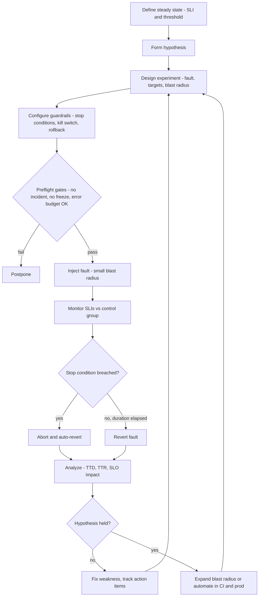
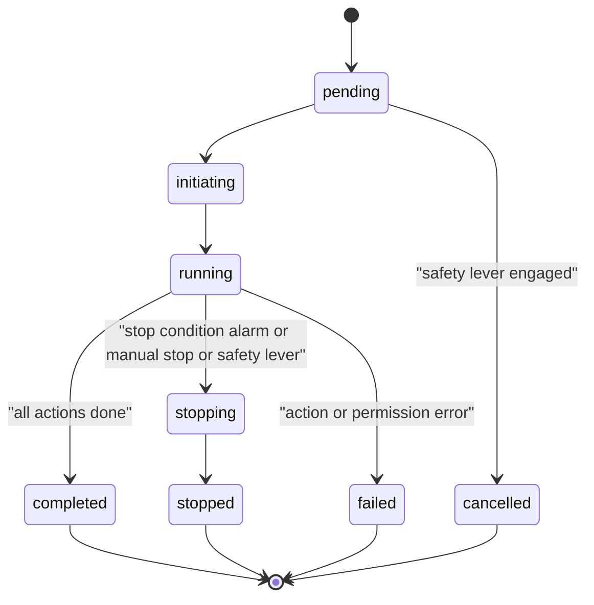

# J7 Chaos Engineering & Resilience Testing
> Last verified: 2026-10 · Audience: senior/staff DevOps, SRE, AI eng, NetEng, DevSecOps, architects

## TL;DR
- **Chaos engineering = experimenting on a system to build confidence that it withstands turbulent conditions in production** (principlesofchaos.org). It is a *scientific method* (hypothesis → controlled experiment → measure → learn), not "randomly breaking things".
- Five principles: **steady-state hypothesis** on business/output metrics, **vary real-world events**, **run in production**, **automate continuously**, **minimize blast radius**. Senior answer: you *earn* the right to run in prod via staging runs, observability, and automated stop conditions.
- Safety is the design centrepiece: **stop conditions tied to SLO burn alarms**, a **kill switch** (AWS FIS **safety lever**, ARC **blocking alarms**), small blast radius that expands gradually, auto-rollback of every injected fault, and "don't run during incidents/freezes or with an exhausted error budget".
- Fault catalogue beyond "kill an instance": **AZ/region loss, network latency/loss/partition, dependency failure, DNS failure, clock skew, resource exhaustion, API throttling/ICE (insufficient capacity)**, gray failures (slow, not dead).
- Cloud tooling: **AWS FIS** (actions/targets/stop conditions/scenario library incl. **AZ Availability: Power Interruption**, multi-account) + **Resilience Hub** (RTO/RPO policy, score) + **ARC zonal autoshift weekly 30-min practice runs**; **Azure Chaos Studio** (Workspaces + Scenarios — public preview as of 2026-09 — replacing **Experiments (classic)**; service-direct vs agent-based faults; **managed identity** permissions). K8s/OSS: **Chaos Mesh**, **LitmusChaos** (both CNCF incubating); commercial **Gremlin**; app/CI-level **Toxiproxy**; host-level **tc netem**.
- Measure resilience as: SLO impact during experiment, **time-to-detect / time-to-recover vs RTO**, alert coverage (did the right alert fire?), practice-run pass rate, and findings fixed — not "number of experiments run".
- Game days / DR drills exercise **people and runbooks**, not just code; feed results into postmortem-style action items ([J4](./J4-incident-response-postmortems.md)).

## J7.1 Principles of chaos engineering
- **How it works:**
  - **Build a hypothesis around steady-state behaviour** — measure *outputs* (orders/sec, p99 latency, error rate, SPS "stream starts per second" at Netflix), not internals (CPU). Hypothesis form: "If AZ-a loses power, checkout success rate stays ≥ 99.9% and p99 < 400 ms, recovered within 5 min."
  - **Vary real-world events** — prioritise by frequency × impact: hardware/instance loss, dependency errors, latency spikes, traffic surges, config pushes, certificate expiry, clock drift.
  - **Run experiments in production** — "sampling real traffic is the only way to reliably capture the request path"; staging lacks real traffic mix, data volume, caches, and config drift.
  - **Automate experiments to run continuously** — manual runs are "labour-intensive and ultimately unsustainable"; regressions creep in with every deploy.
  - **Minimize blast radius** — start with one host / 1% traffic / one cell, expand only after passing; temporary negative impact is acceptable but must be contained.
- **Experiment group vs control group:** compare steady-state metric between injected cohort and untouched cohort (canary-style) — isolates the fault's effect from background noise.
- **Trade-offs / when to use:**
  - Prerequisites before chaos: SLOs/SLIs defined ([J1](./J1-slis-slos-error-budgets.md)), dashboards and alerts working ([J2](./J2-monitoring-and-alerting.md), [J3](./J3-observability.md)), basic redundancy implemented ([C3](../C-large-scale-architecture/C3-reliability.md)). Chaos on a system you *know* is fragile just produces an outage — fix known weaknesses first.
  - Maturity path: tabletop → game day in pre-prod → automated in pre-prod CI → scoped prod experiments → continuous prod (practice runs, Chaos Monkey-style).
- **Interview angles:**
  - "Isn't chaos engineering just testing?" → Testing asserts known properties of known inputs; chaos *explores* emergent behaviour of the whole socio-technical system (retries, timeouts, autoscaling, humans, alerts) under realistic conditions.
  - "Why prod?" → config drift, real traffic, real dependencies; but say you gate it: staging-first, error budget available, stop conditions, business-hours with on-call staffed.
  - Origin: Netflix **Chaos Monkey** (2011, instance termination), **Simian Army**, **Chaos Kong** (region evacuation); Google **DiRT** (Disaster Recovery Testing) exercises.

## J7.2 Experiment design & safety
- **How it works — experiment spec checklist:**
  - Steady-state metric + threshold (ideally the **SLI** itself), hypothesis, **fault** + magnitude + duration, **targets & selection** (tags, %, count, AZ), **blast radius** (accounts, cells, % traffic), **stop conditions**, **rollback** steps, owner/comms plan, success/fail criteria.
  - **Pre-flight gates:** no active incident / Sev; not in change freeze; **error budget remaining > threshold** (e.g. >25%); dependencies' owners informed; on-call aware; observability verified (synthetic probe green).
  - **Stop conditions:** automated abort when steady state breaks. AWS FIS: CloudWatch alarm ARNs (`source = aws:cloudwatch:alarm`), **max 5 stop conditions per template**; when alarm → `ALARM`, experiment stops and **cannot be resumed**. Use **composite alarms** to combine SLI burn + saturation signals.
  - **Abort on SLO burn:** use a **fast-burn multi-window alert** (e.g. 14.4× burn over 1 h confirmed by 5 m window, from [J1](./J1-slis-slos-error-budgets.md)) as the stop condition — ties experiment risk directly to the error budget. Keep alarm evaluation periods short (1-min metrics, 1–3 datapoints) or the abort lags the damage.
  - **Kill switches:** FIS **safety lever** (one per account per Region) — when **engaged**, running experiments → `Stopped`, new ones → `Cancelled`; ARC practice runs: **blocking alarms** stop/prevent shifts; Azure Workspaces: cancel run + per-Scenario **resource exclusions**.
  - **Guardrails:** least-privilege experiment role (FIS IAM role / Azure Workspace managed identity) scoped by tag; SCPs/Azure Policy preventing chaos roles in sensitive accounts; `emptyTargetResolutionMode` (`fail` vs `skip`) so a typo doesn't silently do nothing; time-box every action (FIS action max **12 h**, experiment max **12 h**).
  - **Fault reversibility:** prefer faults the platform reverts (FIS clones/restores NACLs; Chaos Studio removes NSG rules at run end). Know which are **discrete/non-reverting** (e.g. Azure Service Bus *change state* actions, Key Vault *increment certificate version*) and add explicit restore steps.
- **Trade-offs / when to use:**
  - Tight stop conditions = safer but more false aborts (noisy metrics); loose = more learning, more risk. Tune on pre-prod first.
  - Auto-expanding blast radius (1 → 10 → 50%) gives confidence fast but needs automated analysis between steps.
- **Interview angles:**
  - "How do you make chaos safe in prod?" → steady-state SLI alarm as stop condition, small %, business hours, error-budget gate, kill switch, auto-revert, comms, run book for manual rollback if the tool itself fails (agent dies, NACL left behind).
  - Pitfall: stop condition alarm on a metric the fault *hides* (e.g. ALB 5xx when the fault drops packets before the ALB → you see *fewer* requests, not errors). Include **traffic-volume drop** alarms.
  - Pitfall: alarm `INSUFFICIENT_DATA` during network partitions — decide `treat_missing_data = breaching` for safety alarms.

## J7.3 Fault types
| Fault | Real-world cause | Inject with | Validates |
|---|---|---|---|
| **Instance/pod loss** | host failure, spot reclaim, OOM-kill | FIS `aws:ec2:terminate-instances`, `aws:ec2:send-spot-instance-interruptions`, `aws:eks:pod-delete`; Chaos Studio VM/VMSS shutdown; Chaos Mesh PodChaos | ASG/HPA replacement, LB health checks, graceful shutdown, no single points |
| **AZ loss** | power/cooling/network in one AZ | FIS **AZ Availability: Power Interruption** scenario; Chaos Studio **Zone Down / Compute Zone Down** Scenarios; ARC zonal shift | static stability (N+1 AZ capacity), DB failover, DNS/connection re-establishment |
| **Region loss / cross-Region partition** | regional event | FIS **Cross-Region: Connectivity** scenario (`route-table-…`/`transit-gateway-disrupt-cross-region-connectivity`, `s3:bucket-pause-replication`, `dynamodb:global-table-pause-replication`); Cosmos DB offline region | DR runbook, RTO/RPO, replication lag handling |
| **Network latency / loss** | congested links, noisy neighbours, gray failure | FIS `aws:ecs/eks:*-network-latency/packet-loss`, SSM `AWSFIS-Run-Network-Latency*`; FIS **Cross-AZ: Traffic Slowdown**, **AZ: Application Slowdown** scenarios; Chaos Studio agent Network Latency/Packet Loss; `tc netem`; Toxiproxy | timeouts, retries with jitter, hedging, circuit breakers |
| **Partition / blackhole** | NACL/SG misconfig, link failure | FIS `aws:network:disrupt-connectivity` (scope `all`, `availability-zone`, `s3`, `dynamodb`, `prefix-list`, `vpc`…); `*-network-blackhole-port`; Azure NSG rule fault; Chaos Mesh `partition` | split-brain prevention, quorum, fail-fast |
| **Dependency failure** | downstream outage, API errors | FIS `aws:fis:inject-api-internal/throttle/unavailable-error` (EC2, Kinesis APIs), `aws:lambda:invocation-error/-add-delay`, `aws:network:disrupt-vpc-endpoint`; Azure Key Vault deny access, Service Bus/Event Hubs disable, Redis reboot; Chaos Mesh HTTPChaos | fallbacks, cached responses, degradation modes, bulkheads |
| **DNS failure** | resolver outage, bad record, TTL issues | Azure **DNS Outage** Scenario (NSG deny :53), agent DNS Failure (Windows); Chaos Mesh **DNSChaos**; Gremlin DNS; `iptables` drop :53 | DNS caching, stale-if-error, resolver redundancy (see [I1](../I-dns-tls-acceleration-gaps/I1-dns.md)) |
| **Clock skew** | NTP failure, VM pause/resume | Chaos Mesh **TimeChaos**; Gremlin Time Travel; Chaos Studio agent Time Change (Windows) | token/cert validity, lease/lock expiry, ordering, TLS handshakes |
| **Resource exhaustion** | leaks, runaway jobs, full disk | FIS `aws:ssm:send-command` + `AWSFIS-Run-CPU-Stress`/`IO-Stress`, `aws:ecs/eks:*-cpu/io/memory-stress`; Chaos Studio CPU/memory/disk pressure; StressChaos; Gremlin Disk/Process Exhaustion | autoscaling, load shedding, alerting on saturation |
| **Throttling / capacity** | API rate limits, ICE during AZ events | FIS `aws:fis:inject-api-throttle-error`, `aws:ec2:api-/asg-insufficient-instance-capacity-error`, Kinesis `stream-provisioned-throughput-exception` | backoff, pre-provisioned capacity, static stability |
| **Storage I/O** | degraded EBS/disk | FIS `aws:ebs:pause-volume-io`, `aws:ebs:volume-io-latency` (EBS latency scenarios); Chaos Mesh IOChaos | timeouts on I/O, health checks detect stuck-but-alive |
- **Interview angles:**
  - **Gray failure** (slow/partial) is more dangerous than crash-stop: health checks pass, requests pile up, retries amplify. Always include latency and partial-loss experiments, not just kills.
  - Stopping an instance ≠ AZ failure: real AZ loss also breaks **control-plane scale-up in that AZ** (ICE), leaves **stale DNS** pointing at dead IPs, and fails **zonal storage** — that's why FIS composes several actions in the AZ scenario.
  - AWS NACL-based partitions are stateless and apply to new and existing flows; Azure NSG rule faults may not cut **existing** flows immediately (docs note connections persist until idle ~4 min with NSG rules) — know your tool's semantics.

## J7.4 Game days & DR drills
- **How it works:**
  - **Game day:** scheduled, facilitated exercise injecting a realistic failure into a real (pre-prod or prod) system with the on-call team responding as in a real incident. Roles: **facilitator/commander**, **injector**, **observers/scribe**, responders, comms liaison. Outputs: timeline, detection/response gaps, action items.
  - **Tabletop / "Wheel of Misfortune"** (Google SRE book): role-play a past incident verbally — cheap training for new on-callers, no system risk.
  - **DR drill:** execute the actual recovery plan — region failover, **restore from backup into a clean account**, DNS cutover — and *time it* against **RTO/RPO**. An untested backup is a hope, not a backup.
  - Google **DiRT**: company-wide annual (now continuous) disaster testing including people unavailability, datacenter loss, auth outages.
  - Netflix **Chaos Kong**: evacuate an entire AWS Region regularly to prove multi-Region active-active.
- **Trade-offs / when to use:**
  - Game days find **human/process** gaps (paging, runbook rot, missing access/break-glass, unclear ownership) that automated chaos can't. Automated chaos finds **regressions** continuously. You need both.
  - Announced vs unannounced: announced first; unannounced only with mature org and exec sponsorship.
- **Interview angles:**
  - "How would you validate your DR plan?" → define RTO/RPO per tier, quarterly failover drill in prod (or prod-like), measure actual RTO/RPO, rehearse **failback**, check data integrity post-restore, verify **dependencies** (IAM, KMS keys, DNS, secrets, quotas) exist in the DR Region; track via Resilience Hub/Workspace reports.
  - Treat findings like postmortem action items with owners and deadlines ([J4](./J4-incident-response-postmortems.md)).

## J7.5 Resilience testing in CI/CD
- **How it works:**
  - **Unit/integration level:** wrap dependencies with **Toxiproxy** (TCP proxy, API on **:8474**) in docker compose; add toxics (`latency`, `bandwidth`, `timeout`, `reset_peer`, `slow_close`, `slicer`, `limit_data`, `down`) per test; assert timeouts/retries/circuit breakers. `toxicity` = probability 0–1; `upstream` vs `downstream` stream.
  - **Kubernetes pre-prod:** ephemeral cluster per PR or nightly; run Chaos Mesh **Workflow/Schedule** or Litmus experiments with **probes** (httpProbe/cmdProbe/k8sProbe/promProbe; modes SoT, EoT, Edge, Continuous, OnChaos) — verdict fails the pipeline.
  - **Cloud pre-prod gate:** pipeline starts an FIS experiment (`aws fis start-experiment`) or Chaos Studio Scenario after deploy, polls status, fails the stage on `stopped` (stop condition hit) / `failed`. Combine with load testing so faults hit realistic traffic ([J5](./J5-capacity-planning-load-testing.md)).
  - **Post-deploy in prod:** continuous low-blast-radius experiments (e.g. weekly ARC practice runs, scheduled pod kills) as regression detectors.
- **Trade-offs / when to use:** CI chaos is deterministic and cheap but synthetic; prod chaos is realistic but risky. Flaky chaos tests destroy trust — keep assertions on SLIs with tolerance, quarantine flakes.
- **Interview angles:** "How do you stop resilience regressions?" → codify experiments as code (Terraform FIS templates / Bicep Scenarios / Chaos Mesh CRDs) in the service repo, run as a pipeline gate, alert on failure like a failing test.

## J7.6 Tools
| Tool | Scope | Model | Notes |
|---|---|---|---|
| **AWS FIS** | AWS resources | managed; experiment templates (actions + targets + stop conditions) | IAM-scoped, scenario library, multi-account, safety lever, CloudWatch/S3 logs, experiment reports |
| **Azure Chaos Studio** | Azure resources | managed; **Workspaces + Scenarios** (preview) / Experiments (classic, GA, feature-frozen) | service-direct + agent-based faults; AKS faults via Chaos Mesh |
| **Chaos Mesh** | Kubernetes (+ physical machines, cloud APIs) | CRDs: PodChaos, NetworkChaos, StressChaos, IOChaos, TimeChaos, DNSChaos, HTTPChaos, KernelChaos, AWSChaos/AzureChaos/GCPChaos, PhysicalMachineChaos; Workflow, Schedule | CNCF incubating; v2.8.x; **chaos-controller-manager** + privileged **chaos-daemon** DaemonSet + dashboard |
| **LitmusChaos** | Kubernetes, cloud, VMs | **ChaosCenter** control plane + chaos infrastructure; ChaosExperiment / ChaosEngine / ChaosResult CRDs; **ChaosHub** catalog | CNCF incubating; v3.x; probes → resilience score (probeSuccessPercentage) |
| **Gremlin** | hosts, containers, K8s, serverless (Failure Flags) | SaaS + agent | Resource (CPU, memory, IO, disk, GPU, process exhaustion), Network (blackhole, latency, packet loss, DNS, cert expiry), State (shutdown, process killer, time travel); halts, scheduling, reliability scoring |
| **Toxiproxy** | single TCP dependency | proxy + HTTP API | ideal for CI/dev; app must connect via proxy |
| **tc netem** | Linux interface | kernel qdisc | delay/jitter/distribution, loss (random, Gilbert-Elliott `gemodel`), duplicate, corrupt, reorder, rate, slot; **egress only** (ingress needs `ifb`) |
- **Interview angles:** Chaos Mesh/Litmus daemons run **privileged** (host network/PID namespaces) — a DevSecOps concern: restrict namespaces via RBAC/annotations, don't install in regulated clusters without review. FIS's in-guest faults run via **SSM documents** (needs SSM Agent); ECS/EKS faults need a sidecar/ephemeral container or agent.

### Hands-on: tc netem with a dead-man switch
```bash
#!/usr/bin/env bash
# Inject 200ms±50ms latency + 1% loss on egress to one dependency only; auto-revert.
set -euo pipefail
IF=eth0; DST=10.0.2.15/32; DUR=300

# Dead-man switch: revert even if this script is SIGKILLed.
systemd-run --on-active=$((DUR+60)) --unit=chaos-revert /usr/sbin/tc qdisc del dev "$IF" root || true
cleanup() { tc qdisc del dev "$IF" root 2>/dev/null || true; systemctl stop chaos-revert.timer 2>/dev/null || true; }
trap cleanup EXIT INT TERM

# prio root: all normal traffic -> band 1 (1:2); only filtered traffic -> band 2 (1:3) with netem
tc qdisc add dev "$IF" root handle 1: prio bands 3 priomap 1 1 1 1 1 1 1 1 1 1 1 1 1 1 1 1
tc qdisc add dev "$IF" parent 1:3 handle 30: netem delay 200ms 50ms distribution normal loss 1%
tc filter add dev "$IF" protocol ip parent 1:0 prio 1 u32 match ip dst "$DST" flowid 1:3

tc -s qdisc show dev "$IF"
sleep "$DUR"
# Variants: 'loss gemodel 1% 10%' (bursty), 'reorder 25% 50%' (needs delay), 'rate 1mbit'
# DNS blackhole: iptables -I OUTPUT -p udp --dport 53 -j DROP; iptables -I OUTPUT -p tcp --dport 53 -j DROP
```

### Hands-on: Toxiproxy in compose (CI)
```yaml
services:
  toxiproxy:
    image: ghcr.io/shopify/toxiproxy:2.9.0
    ports: ["8474:8474", "26379:26379"]
  redis:
    image: redis:7
# Test setup (bash):
#   toxiproxy-cli create -l 0.0.0.0:26379 -u redis:6379 redis
#   toxiproxy-cli toxic add -t latency -a latency=1000 -a jitter=200 redis
#   toxiproxy-cli toxic add -t reset_peer -a timeout=500 --toxicity 0.1 redis
```

## J7.7 Zonal failure testing (ARC zonal shift / autoshift practice runs; Azure zone-down)
- **How it works — AWS ARC:**
  - **Zonal shift:** customer-initiated, temporary shift of a resource's traffic away from one AZ (ALB/NLB, ASG, EKS — check supported-resource list); implemented via **DNS/health** changes, so **existing connections linger** → shorten client keepalive (e.g. ALB HTTP client keepalive ≈ 300 s) to bound recovery.
  - **Zonal autoshift:** AWS shifts traffic away on your behalf when its telemetry detects an AZ impairment. Requires **practice runs** configuration.
  - **Practice runs:** ARC shifts traffic out of one AZ **about weekly for ~30 min**, per resource independently; plus **on-demand** practice runs. **Outcome alarm(s) required** (ALARM → outcome `FAILED`); **blocking alarms optional** (prevent/stop runs, e.g. during incidents). Blocked dates/windows and allowed windows in UTC. Outcomes: `SUCCEEDED`, `FAILED`, `INTERRUPTED` (autoshift started, blocking alarm, customer zonal shift, alarm inaccessible…), `CAPACITY_CHECK_FAILED` (unbalanced LB/ASG capacity across AZs), `PENDING`.
  - Practice runs **don't start/continue while an FIS experiment is active** or during an AWS event in the Region.
  - **Static stability:** pre-scale so N−1 AZs carry full load — e.g. need 30 instances → run 15 × 3 AZs = 45 (doc example). Don't rely on scale-up during an AZ event (ICE, control-plane strain).
  - **FIS AZ Availability: Power Interruption** scenario: default **30 min interruption + 30 min recovery symptoms**; stops EC2 (ASG and non-ASG) in the AZ, injects **ICE** on `RunInstances/CreateFleet/StartInstances` (IAM-role and ASG targets), **disrupts subnet connectivity for 2 min** (forces timeouts + DNS refresh), **RDS cluster failover** if writer in AZ, **ElastiCache interrupt-az-power**, **pauses one EBS volume's I/O** (recovery symptom), blocks **S3 Express One Zone**, and starts **`aws:arc:start-zonal-autoshift` ~5 min in** for 25 min. Targets by tag `AzImpairmentPower=<StopInstances|IceAsg|DisruptSubnet|DisruptRds|…>`. **Ships without stop conditions — you must add them.** Fargate tasks/pods not supported; ElastiCache daily limit 20 replication groups/account/Region.
  - Multi-account AZ tests: target by **AZ ID** (e.g. `use1-az1`), not AZ name — names map differently per account.
- **How it works — Azure zone-down:**
  - Chaos Studio **Zone Down** Scenario (VMSS shutdown in target zone + Azure Cache for Redis forced failover + optional Automation runbooks) and **Compute Zone Down** (VM + VMSS shutdown by zone; variants + PostgreSQL / SQL DB / SQL MI failover). Classic: **VMSS Shutdown 2.0** with zone filter (Uniform orchestration only).
  - **Zone-redundant** resources (Microsoft fails over) vs **zonal** (you fail over) vs **nonzonal/regional** (may sit in the failed zone, you can't choose). Zone-down testing mainly validates *your* zonal resources and app behaviour; you cannot power off a zone-redundant PaaS's zone yourself.
  - **Logical→physical zone mapping differs per subscription** (`az account list-locations` → `availabilityZoneMappings`, Check Zone Peers API) — the Azure analogue of AWS AZ IDs; critical for multi-subscription zone tests.
  - Azure has no autoshift equivalent; zonal traffic removal is your design (Front Door/App Gateway health probes, AKS zone-spread, Load Balancer zone-redundant frontends).
- **Interview angles:**
  - "How do you prove you survive an AZ loss?" → static stability math, ARC autoshift with weekly practice runs and SLO outcome alarm, quarterly FIS AZ power scenario (adds ICE, DB failover, stale DNS), check **cross-AZ dependencies** (single-AZ NAT GW, zonal EBS, zonal caches), connection draining/keepalive.
  - Follow-up "why not just autoscale on AZ loss?" → capacity may be unavailable (ICE) when everyone scales simultaneously; scaling takes minutes; static stability avoids control-plane dependency in recovery.

## J7.8 Measuring resilience
- **How it works — metrics that matter:**
  - **Steady-state deviation:** SLI delta between control and experiment groups; **error budget consumed** by the experiment.
  - **TTD / TTR:** time to detect (did the *right* alert fire, how fast?) and time to recover vs **RTO**; data loss window vs **RPO**.
  - **Detection coverage:** % of injected faults that produced an actionable alert; % auto-mitigated without human.
  - **Practice-run / experiment pass rate** over time (ARC outcomes, FIS stopped-by-condition count, Litmus **resilience score** = weighted probe success, Chaos Studio Scenario reports).
  - **Posture:** **AWS Resilience Hub** — resiliency **policy** with RTO/RPO per disruption type (**Application, Cloud Infrastructure, AZ, Region**), assessment → *policy met/breached*, **resiliency score** (policy compliance + alarms + **SOPs** + **FIS tests** implemented), **drift detection**; recommends alarms, SOPs and FIS experiments.
  - **Org metrics:** findings fixed / open, time-to-fix, % critical services with automated experiments, % with DR drill in last quarter.
- **Trade-offs / when to use:** scores (Resilience Hub, Litmus) are good for portfolio trend lines, bad as targets (Goodhart: teams game score by adding trivial tests).
- **Interview angles:** "How do you know chaos engineering is working?" → fewer/shorter incidents of the classes you tested, faster MTTR, higher alert precision, findings fixed before they cause incidents — report incident classes *prevented*, not experiments *run*.

## J7.9 Anti-patterns
- **No hypothesis / no steady-state metric** — "let's break stuff and see" yields no learning and no stop condition.
- **Prod before pre-prod**, or chaos without observability — you can't distinguish experiment impact from noise.
- **No automated stop condition / kill switch**, or stop alarm on lagging/aggregated metrics (5-min periods, `treat_missing_data=notBreaching`).
- **Running during incidents, freezes, peak events, or with exhausted error budget**; not informing dependent teams / support.
- **Only killing instances** (Chaos Monkey cargo cult) — ignoring latency, partial failure, dependency and control-plane faults.
- **Unrealistic fault models** — stop-instance as "AZ outage", deleting a pod as "node failure"; ignoring ICE, stale DNS, long-lived connections.
- **Faults that don't revert** (discrete actions, agent killed mid-run, leftover NACL/NSG rules/iptables) — always have a dead-man switch and manual rollback runbook.
- **One-off hero game days** whose findings are never fixed; no tracking of action items.
- **Over-broad experiment identity** (FIS role or Workspace identity with `*`/Contributor on subscription) — chaos tooling is a privileged attack surface.
- **Testing retries without jitter/budgets** — chaos often *reveals* retry storms; fix with exponential backoff + jitter, retry budgets, circuit breakers ([C3](../C-large-scale-architecture/C3-reliability.md)).
- **Synthetic-only CI chaos treated as proof** of prod resilience.

## Diagrams




## Cloud mapping: AWS vs Azure
| Capability | AWS | Azure | Role it plays | Key differences | Alternatives |
|---|---|---|---|---|---|
| Managed fault injection | **AWS FIS** (experiment templates: actions, targets, stop conditions) | **Azure Chaos Studio** — **Workspaces + Scenarios** (public preview 2026) / **Experiments (classic)** (steps → branches → actions) | Inject faults into cloud resources with RBAC & audit | FIS: GA, IAM role per template, CloudWatch-alarm stop conditions. Chaos Studio Workspaces: scope-based discovery, Scenario templates, preview (no SLA); classic: per-resource **target + capability** onboarding, feature-frozen | Gremlin, Chaos Mesh (AWSChaos/AzureChaos), Litmus |
| Fault mechanism types | FIS native API actions vs **SSM documents** in-guest (`aws:ssm:send-command`), ECS/EKS task/pod actions | **Service-direct** (ARM APIs, no agent) vs **agent-based** (in-guest via Chaos agent VM extension) | Control-plane vs in-guest faults | Azure agent needs managed identity + outbound reach (Workspaces auto-installs/removes agent; VMSS not yet supported for agent Scenarios); Linux network faults need `tc`, outbound only | Gremlin agent, `tc`/stress-ng |
| Pre-built scenarios | **Scenario library**: AZ Power Interruption, AZ Application Slowdown, Cross-AZ Traffic Slowdown, Cross-Region Connectivity, EC2/EKS stress, EBS latency | **Scenarios**: Zone Down, Compute Zone Down (+PostgreSQL/SQL DB/SQL MI failover), DNS Outage, Entra ID Outage, Key Vault endpoint outage, DB failover/restart under load, Cache Stampede, Messaging disruption, Dependency Blackout, VM hibernate/maintenance reboot, CPU/memory pressure | Realistic multi-fault compositions | AWS scenario = JSON template you own (add stop conditions!); Azure Scenario = workspace resource with parameters, `runAfter` sequencing, exclusions | Litmus ChaosHub, Gremlin Scenarios |
| Safety/abort | **Stop conditions** (≤5 CloudWatch alarms), **safety lever** per account/Region, 12 h max | Cancel run; resource exclusions; RBAC two-layer (user can run + identity can act); alarm-driven auto-stop *(unverified for Workspaces)* | Bound blast radius | FIS has native SLO-alarm abort; on Azure wire Azure Monitor alerts → automation to cancel *(pattern, unverified as native)* | Gremlin halt conditions, Litmus probes |
| Permissions | FIS **experiment IAM role** (trusted by `fis.amazonaws.com`), tag-scoped; SLR for ARC practice runs | **Managed identity** — classic: per-experiment identity; Workspaces: shared **system/user-assigned identity** with roles (VM Contributor, Network Contributor, Cosmos DB Operator…); users need `Microsoft.Chaos/workspaces/scenarios/run/action` | Least-privilege execution principal | Azure: identity roles define blast radius; Fix Permissions button / least-privilege custom roles | K8s RBAC for Chaos Mesh/Litmus |
| Multi-account | **Multi-account experiments**: orchestrator account + up to 40 target account configs; AWS Health notification in targets; target by AZ ID | Workspace scope: subscription / resource group / **service group** | Test apps spanning accounts/subscriptions | AWS: AZ ID; Azure: logical↔physical zone mapping per subscription | — |
| Zonal traffic shift & practice | **ARC zonal shift / zonal autoshift** + weekly 30-min **practice runs** (outcome + blocking alarms) | No autoshift equivalent; Zone Down Scenarios + Front Door/App Gateway/LB health probes | Prove N−1 AZ capacity continuously | AWS shifts traffic for you during AZ events; Azure: you design zone failover for zonal resources | Route 53 ARC routing controls, Cloudflare LB |
| Resilience posture | **AWS Resilience Hub** (RTO/RPO policy, score, SOP + FIS recs, drift) | Scenario reports, **Azure Well-Architected/Reliability** guides, Azure Advisor reliability recs *(no direct Resilience Hub equivalent)* | Assess vs objectives | Resilience Hub generates FIS experiments from assessment | Gremlin Reliability Management |
- **AWS FIS:** regional; quotas — 20 actions/template, 10 parallel actions, 5 active experiments/account/Region, 5 stop conditions, 500 templates, 12 h action/experiment, 120-day result retention. Target selection: `ALL`, `COUNT(n)`, `PERCENT(n)` + tag/ARN + filters (filters OR within, AND across). `aws:fis:wait` and `aws:cloudwatch:assert-alarm-state` for sequencing/verification; `aws:arc:start-zonal-autoshift` recovery action. Pricing: per action-minute (stopped experiments billed only for elapsed time).
- **AWS Resilience Hub:** define app (CFN/Terraform state/tags/myApplications), resiliency policy per disruption type, assess → score; recommendations include CloudWatch alarms, SOPs (SSM docs) and FIS templates; re-assess on deploy to catch drift.
- **Azure Chaos Studio:** as of 2026-09 **Workspaces/Scenarios are public preview** ("not meant for production use") and **Experiments (classic)** is legacy (only critical fixes) — say this explicitly in interviews. AKS faults use **Chaos Mesh** under the hood (network, pod, stress, IO, time, kernel, HTTP, DNS). Notable classic faults: VM Redeploy (throttled to once per 10 h), Key Vault deny access/disable cert, Cosmos DB failover, Redis reboot, NSG security rule, autoscale disable, Service Bus/Event Hubs state changes (discrete — non-reverting).
- **Gotchas:** FIS AZ scenario lacks stop conditions by default; ARC practice runs blocked while FIS runs; Azure NSG faults don't immediately kill established flows; Azure agent faults on Linux are outbound-only; Azure zone numbers are per-subscription.
- **Alternatives:** **Chaos Mesh / Litmus** for cloud-agnostic Kubernetes chaos (portable across EKS/AKS/GKE), **Gremlin** for SaaS with cross-cloud/host coverage and governance, **Toxiproxy** for app-level CI, **tc netem/iptables/stress-ng** for bare Linux. GCP has no first-party managed chaos service; teams use these OSS tools.

## Hands-on: Terraform FIS experiment template (AZ-scoped, SLO-burn stop condition)
```hcl
resource "aws_cloudwatch_metric_alarm" "slo_fast_burn" {
  alarm_name          = "checkout-slo-fast-burn"
  namespace           = "AWS/ApplicationELB"
  metric_name         = "HTTPCode_Target_5XX_Count"
  dimensions          = { LoadBalancer = var.alb_arn_suffix }
  statistic           = "Sum"
  period              = 60
  evaluation_periods  = 2
  datapoints_to_alarm = 2
  threshold           = 50
  comparison_operator = "GreaterThanThreshold"
  treat_missing_data  = "breaching"          # partition => no data => abort
}

resource "aws_cloudwatch_log_group" "fis" {
  name              = "/fis/experiments"
  retention_in_days = 90
}

resource "aws_fis_experiment_template" "az_degrade" {
  description = "Stop 50% of tagged instances in one AZ and cut cross-AZ traffic for 5 min"
  role_arn    = aws_iam_role.fis.arn

  stop_condition {
    source = "aws:cloudwatch:alarm"
    value  = aws_cloudwatch_metric_alarm.slo_fast_burn.arn
  }

  target {
    name           = "app-instances-az1"
    resource_type  = "aws:ec2:instance"
    selection_mode = "PERCENT(50)"
    resource_tag {
      key   = "chaos-ready"
      value = "true"
    }
    filter {
      path   = "Placement.AvailabilityZone"
      values = ["us-east-1a"]
    }
    filter {
      path   = "State.Name"
      values = ["running"]
    }
  }

  target {
    name           = "app-subnets-az1"
    resource_type  = "aws:ec2:subnet"
    selection_mode = "ALL"
    resource_tag {
      key   = "chaos-ready"
      value = "true"
    }
    filter {
      path   = "AvailabilityZone"
      values = ["us-east-1a"]
    }
  }

  action {
    name      = "stop-instances"
    action_id = "aws:ec2:stop-instances"
    parameter {
      key   = "startInstancesAfterDuration"
      value = "PT5M"
    }
    target {
      key   = "Instances"
      value = "app-instances-az1"
    }
  }

  action {
    name      = "cut-cross-az"
    action_id = "aws:network:disrupt-connectivity"
    parameter {
      key   = "scope"
      value = "availability-zone"
    }
    parameter {
      key   = "duration"
      value = "PT5M"
    }
    target {
      key   = "Subnets"
      value = "app-subnets-az1"
    }
  }

  experiment_options {
    account_targeting            = "single-account"
    empty_target_resolution_mode = "fail"   # typo in tags must not silently pass
  }

  log_configuration {
    log_schema_version = 2
    cloudwatch_logs_configuration {
      log_group_arn = "${aws_cloudwatch_log_group.fis.arn}:*"
    }
  }

  tags = { Name = "az1-degrade", owner = "sre" }
}
```

```bash
# CI gate: run the template, fail the pipeline if it was stopped by the SLO alarm or failed.
set -euo pipefail
EXP=$(aws fis start-experiment --experiment-template-id "$TEMPLATE_ID" --query 'experiment.id' --output text)
while :; do
  S=$(aws fis get-experiment --id "$EXP" --query 'experiment.state.status' --output text)
  case "$S" in
    completed) echo "hypothesis held"; exit 0 ;;
    stopped|failed|cancelled) echo "experiment $S"; aws fis get-experiment --id "$EXP" --query 'experiment.state.reason'; exit 1 ;;
    *) sleep 15 ;;
  esac
done
# Emergency: aws fis update-safety-lever-state --id default --state "status=engaged,reason=incident"
```

## Cross-links
- [C3 Reliability](../C-large-scale-architecture/C3-reliability.md) — redundancy, retries/backoff, circuit breakers, static stability that chaos validates.
- [J1 SLIs, SLOs & error budgets](./J1-slis-slos-error-budgets.md) — steady-state metrics, burn-rate alarms used as stop conditions, error-budget gating.
- [J4 Incident response & postmortems](./J4-incident-response-postmortems.md) — game-day roles, action-item tracking, reproducing incidents as experiments.
- [J2 Monitoring & alerting](./J2-monitoring-and-alerting.md), [J3 Observability](./J3-observability.md), [J5 Capacity planning & load testing](./J5-capacity-planning-load-testing.md).
- [I1 DNS](../I-dns-tls-acceleration-gaps/I1-dns.md), [H1 Linux network diagnostics](../H-full-stack-troubleshooting/H1-linux-network-diagnostics.md) (tc/iptables).

## Sources
- https://principlesofchaos.org/
- https://docs.aws.amazon.com/fis/latest/userguide/stop-conditions.html
- https://docs.aws.amazon.com/fis/latest/userguide/safety-lever.html
- https://docs.aws.amazon.com/fis/latest/userguide/fis-quotas.html
- https://docs.aws.amazon.com/fis/latest/userguide/fis-actions-reference.html
- https://docs.aws.amazon.com/fis/latest/userguide/scenario-library-scenarios.html
- https://docs.aws.amazon.com/fis/latest/userguide/az-availability-scenario.html
- https://docs.aws.amazon.com/fis/latest/userguide/multi-account.html
- https://docs.aws.amazon.com/r53recovery/latest/dg/arc-zonal-autoshift.how-it-works.html
- https://docs.aws.amazon.com/r53recovery/latest/dg/arc-zonal-autoshift.how-it-works.scheduled-practice-runs.html
- https://docs.aws.amazon.com/r53recovery/latest/dg/arc-zonal-autoshift.how-it-works.alarms.html
- https://docs.aws.amazon.com/r53recovery/latest/dg/arc-zonal-autoshift.considerations.html
- https://docs.aws.amazon.com/resilience-hub/latest/userguide/concepts-terms.html
- https://learn.microsoft.com/en-us/azure/chaos-studio/chaos-studio-overview
- https://learn.microsoft.com/en-us/azure/chaos-studio/chaos-studio-scenarios
- https://learn.microsoft.com/en-us/azure/chaos-studio/chaos-studio-workspace-permissions
- https://learn.microsoft.com/en-us/azure/chaos-studio/chaos-studio-fault-library
- https://learn.microsoft.com/en-us/azure/reliability/availability-zones-overview
- https://registry.terraform.io/providers/hashicorp/aws/latest/docs/resources/fis_experiment_template
- https://chaos-mesh.org/docs/ and https://chaos-mesh.org/docs/simulate-network-chaos-on-kubernetes/
- https://docs.litmuschaos.io/docs/introduction/what-is-litmus and https://docs.litmuschaos.io/docs/concepts/probes
- https://github.com/Shopify/toxiproxy
- https://www.gremlin.com/docs/fault-injection-experiments
- https://man7.org/linux/man-pages/man8/tc-netem.8.html
