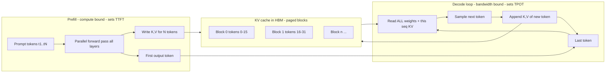
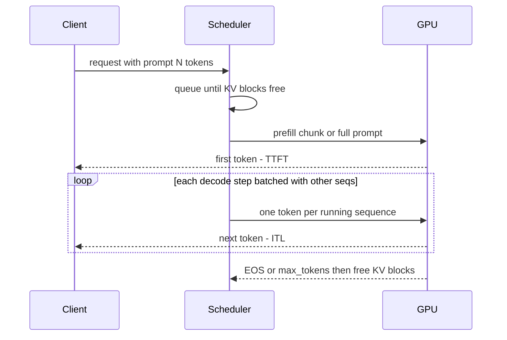

# K1 LLM Fundamentals for Infra
> Last verified: 2026-10 · Audience: senior/staff DevOps, SRE, AI eng, NetEng, DevSecOps, architects

## TL;DR
- Inference has two phases. **Prefill** processes the whole prompt in parallel, is **compute-bound**, and sets **TTFT**. **Decode** produces one token per step, is **memory-bandwidth-bound**, and sets **TPOT/ITL**. Most serving tricks (batching, chunked prefill, disaggregation, speculative decoding) exist to manage the mismatch between the two.
- **GPU memory = weights + KV cache + activations/overhead.** Weights ≈ params × bytes/param (70B BF16 ≈ 140 GB). KV cache = `2 × layers × kv_heads × head_dim × bytes × tokens`. At long context and high concurrency the **KV cache, not the weights, limits capacity**.
- **The decode speed ceiling at batch 1 ≈ HBM bandwidth ÷ bytes read per step** (≈ weight size). So HBM bandwidth (H100 3.35 TB/s → H200 4.8 → B200/B300 ~8 TB/s) matters more than FLOPS for interactive latency. **Batching** turns that bandwidth-bound work into throughput.
- **Quantization** (FP8/INT8/INT4/FP4) cuts memory and bandwidth per token. FP8 is nearly free in quality on Hopper or Blackwell. 4-bit (AWQ/GPTQ/NVFP4/MXFP4) costs measurable quality, so **evaluate it on your own tasks**.
- **SLOs:** TTFT, TPOT/ITL, end-to-end latency, tokens/s, and **goodput** (requests/s that meet *both* SLOs). Throughput without latency SLOs is a vanity metric.
- **MoE:** you pay memory for *total* params but compute and bandwidth for *active* params (DeepSeek-V3 671B total / 37B active). It is cheap per token but needs a lot of memory and expert parallelism.
- **Prompt caching** reuses the prefill KV for a shared prefix. Claude charges cache writes at 1.25× (5-min TTL) or 2× (1-h TTL) and reads at ≈0.1× base input. Gemini has implicit caching by default (cached tokens ≈10% of input), and explicit caches add a **storage $/M-tokens/hour** charge. Order your prompt as **static first, dynamic last**.
- **Hardware (2026):** H100/H200 (Hopper) are the volume parts. B200/B300 (HGX, 8-GPU) and GB200/GB300 **NVL72** (72-GPU NVLink domain) are the frontier parts. AMD MI300X/MI355X lead on HBM per dollar. AWS Trainium2/3 and Inferentia2 and Google TPU are the non-GPU options. AWS: P5/P5e/P5en/P6-B200/P6-B300/P6e-GB200. Azure: ND H100/H200 v5, ND GB200/GB300 v6, ND MI300X v5.

---

## K1.1 Tokens and tokenizers
- **How it works:**
  - A **tokenizer** maps text to integer IDs using a subword vocabulary. Common algorithms are **BPE** (GPT/Llama 3 via tiktoken-style), **SentencePiece/Unigram** (Gemma, older Llama), and byte-level BPE (no unknown tokens).
  - Rule of thumb for English: **1 token ≈ 4 characters ≈ 0.75 words**. Code, JSON, non-Latin scripts, and numbers tokenize **worse** (more tokens per character), often 1.5–3× for CJK and Indic scripts.
  - Vocab sizes: Llama 2 32K, Llama 3 **128K**, Gemma ~256K. A larger vocab gives fewer tokens per text but a bigger embedding/LM-head matrix and a bigger softmax.
  - Tokenizers are **model-specific**. Token counts from one vendor do not transfer to another. Use the provider's count-tokens API (Claude `count_tokens`, Gemini `countTokens`) for billing and limit estimates.
  - **Special tokens** (BOS/EOS, chat-template role markers, tool-call markers) count toward context and billing. A mismatched **chat template** is a classic silent-quality bug when self-hosting.
- **Trade-offs / when to use:**
  - Pricing, rate limits (TPM), context windows, and latency all scale with **tokens, not characters or requests**. Capacity plans must be done in tokens.
  - Multilingual products can pay 2× or more per user for the same content, so budget per language.
- **Interview angles:**
  - "Why did our bill jump after adding JSON tool schemas?" → Schemas, system prompts, and tool definitions are input tokens on **every** call. Cache them (K1.11) or trim them.
  - "Estimate tokens for 1M support tickets of 500 words" → ≈ 667 tokens each ≈ 0.67B input tokens. Add the system prompt × N.
  - Pitfall: rate limits are usually per **input TPM and output TPM separately**, plus RPM.

## K1.2 Prefill vs decode (why decode is memory-bandwidth bound)
- **How it works:**
  - **Prefill:** all N prompt tokens go through every layer in one forward pass. The work is big matrix-matrix multiplies with high **arithmetic intensity** (FLOPs per byte), so it is **compute-bound**. Prefill writes the K and V vectors for every prompt token into the **KV cache** and emits the first token. It determines **TTFT**, which grows roughly linearly with prompt length (quadratically for attention at very long context).
  - **Decode:** each step processes **one new token per sequence** and reads **all weights + that sequence's KV cache** from HBM to produce one token. This is matrix-vector work at about **1–2 FLOPs/byte** at batch 1, while the **ridge point** (peak FLOPS ÷ HBM bandwidth) is far higher. For H100 SXM: ~989 dense BF16 TFLOPS ÷ 3.35 TB/s ≈ **~300 FLOPs/byte**. Decode is therefore **memory-bandwidth-bound**.
  - **Batch-1 decode ceiling** ≈ `HBM bandwidth / bytes read per token` ≈ `BW / model bytes`:
    - 70B FP8 (70 GB) on one H200 (4.8 TB/s) → ≤ **~68 tok/s**.
    - 70B BF16 (140 GB) TP=8 on H100 (8 × 3.35 = 26.8 TB/s) → ≤ **~190 tok/s** (in practice less, because of the communication cost of all-reduce over NVLink).
    - 8B BF16 (16 GB) on L4 (~300 GB/s) → ≤ **~19 tok/s**. On H100 → ≤ ~200 tok/s.
  - **Batching** amortizes the weight read across B sequences, so throughput rises almost linearly with B until compute saturates or the KV cache runs out. Per-sequence KV reads still grow with B × context.
- **Trade-offs / when to use:**
  - Long prompts with short outputs (RAG, classification) are **prefill-heavy**: buy FLOPS, use prompt/prefix caching.
  - Short prompts with long outputs (chat, code generation, reasoning traces) are **decode-heavy**: buy **HBM bandwidth and capacity**, quantize, batch, and use speculative decoding.
  - **Prefill/decode disaggregation** runs separate GPU pools for each phase and ships the KV cache between them over NVLink/RDMA. It removes interference and lets each pool scale independently, at the cost of KV transfer bandwidth. See [K4 serving](../K-ai-infra-llm/K4-llm-serving-inference.md).
- **Interview angles:**
  - "Why does an H200 serve a 70B model faster than an H100 at the same FLOPS?" → Same Hopper compute, but **1.4× HBM bandwidth** (4.8 vs 3.35 TB/s) and 141 vs 80 GB HBM. Decode is bandwidth-bound and gets more room for KV/batch.
  - "GPU util shows 100% but tokens/s is low" → `nvidia-smi` utilization means "a kernel was running", not "the SMs are saturated". Check **SM occupancy/tensor activity** with DCGM (`DCGM_FI_PROF_SM_ACTIVE`, `PIPE_TENSOR_ACTIVE`) and memory-bandwidth utilization.
  - Follow-up on **speculative decoding:** a small draft model (or n-gram/EAGLE/MTP heads) proposes k tokens, the big model verifies them in one pass, and output is unchanged (lossless). It trades spare compute for fewer bandwidth-bound steps. It is most effective at **low batch**.





## K1.3 Context windows and long-context cost
- **How it works:**
  - The **context window** is the maximum of input + output tokens per request. Typical in 2026: 128K–1M tokens on frontier APIs, with some long-context tiers above that. Output caps are separate and smaller (`max_tokens`).
  - Cost scales with tokens:
    - **Compute:** attention is O(n²) in prefill and O(n) per decode step.
    - **Memory:** KV is O(n) per sequence, so a 128K-token sequence on a 70B GQA model holds **~40 GiB of KV in BF16** (K1.4).
    - **Money:** some APIs bill a **premium rate above a context threshold** (long-context pricing tiers). Check the provider's pricing page.
  - Positional schemes (**RoPE** with scaling such as YaRN/NTK) allow context extension. **Quality degrades with distance** ("lost in the middle"; needle-in-haystack scores do not equal reasoning over long context).
- **Trade-offs / when to use:**
  - Long context vs RAG: long context is simpler (no retriever) but costs more per call and has higher TTFT. RAG is cheaper per call but has more moving parts. Prompt caching narrows the cost gap for repeated documents. See [K3 RAG](../K-ai-infra-llm/K3-rag-pipelines.md).
  - Self-hosting with a large `max_model_len` reserves KV headroom and reduces concurrency. Set it to what the product actually needs.
- **Interview angles:**
  - "Why not always stuff 1M tokens?" → TTFT of tens of seconds, cost linear in tokens, KV memory limiting concurrency, and degraded recall in the middle of the context.
  - Mitigations: prompt caching, summarizing or compacting history, retrieval, sliding-window/hybrid attention models, and **KV offload** to CPU/NVMe (LMCache, vLLM KV connectors).

## K1.4 KV cache: size, GQA/MQA/MLA, PagedAttention
- **How it works:**
  - **Formula (per token):** `2 (K and V) × num_layers × num_kv_heads × head_dim × bytes_per_elem`. Multiply by tokens and by concurrent sequences.
  - **Worked numbers (BF16, 2 bytes):**

| Model | Layers | KV heads | head_dim | KV / token | 8K ctx / seq | 128K ctx / seq |
|---|---|---|---|---|---|---|
| Llama 3.x 8B (GQA) | 32 | 8 | 128 | 2·32·8·128·2 = **128 KiB** | 1 GiB | 16 GiB |
| Llama 3.x 70B (GQA) | 80 | 8 | 128 | 2·80·8·128·2 = **320 KiB** | 2.5 GiB | 40 GiB |
| Same 70B if MHA (64 heads) | 80 | 64 | 128 | 2.5 MiB | 20 GiB | 320 GiB |

  - **FP8 KV cache** halves these numbers (vLLM `--kv-cache-dtype fp8`) with small quality loss.
  - **Attention variants:**
    - **MHA:** KV heads = query heads. Largest KV.
    - **MQA:** 1 shared KV head. Smallest KV, but some quality loss.
    - **GQA:** groups of query heads share a KV head (Llama 3: 64 Q / 8 KV → **8× smaller** than MHA). This is the default for modern open models.
    - **MLA (Multi-head Latent Attention, DeepSeek-V2/V3/R1):** compresses K and V into a low-rank **latent** (~512 dims + 64 RoPE dims per token per layer) and up-projects at compute time. KV is tens of times smaller than MHA with near-MHA quality.
    - **Sliding-window/hybrid attention** (Gemma, Mistral, some Llama 4 layers) caps KV for the local layers.
  - **PagedAttention (vLLM):** KV is stored in fixed-size **blocks** (e.g. 16 tokens) addressed through a per-sequence **block table**, like OS virtual memory paging ([A3 memory](../A-operating-systems/A3-memory-management.md)).
    - It eliminates fragmentation from up-front max-length reservation. The original paper reported KV waste dropping from 60–80% to <4%.
    - It enables **copy-on-write sharing** for parallel sampling/beam search and **prefix caching** (blocks hashed by their token prefix).
  - vLLM pre-allocates `gpu_memory_utilization` (default **0.9**) of HBM. Whatever remains after weights and activations becomes the KV block pool. When the pool is exhausted the scheduler **preempts** (recomputes or swaps) sequences, which shows up as latency spikes.
- **Trade-offs / when to use:**
  - Max concurrency ≈ `KV pool bytes ÷ (KV/token × avg context)`. Ways to raise it: FP8 KV, smaller `max_model_len`, tensor parallelism (each GPU holds `kv_heads/TP` heads), or GPUs with more HBM (H200/B300/MI355X).
  - With TP greater than the number of KV heads (e.g. TP=16 with 8 KV heads), KV heads get **replicated** and you lose the memory benefit.
- **Interview angles:**
  - "Size KV for 200 concurrent chats averaging 4K tokens on Llama 70B" → 320 KiB × 4096 × 200 ≈ **250 GiB BF16** (125 GiB FP8). Weights are 140 GB BF16. On 8×H100 (640 GB) it fits. On 4×H100 it does not fit in BF16.
  - "What does `vllm:kv_cache_usage_perc` near 100% with rising `num_requests_waiting` mean?" → KV-bound. Scale out, quantize the KV cache, or cut context. Adding more FLOPS will not help.

## K1.5 Latency metrics: TTFT, TPOT/ITL, tokens/s, goodput
- **How it works:**

| Metric | Definition | Driven by | vLLM metric |
|---|---|---|---|
| **TTFT** | Time from request to first token (includes queueing + prefill) | Prompt length, queue depth, prefill compute, cache hits | `vllm:time_to_first_token_seconds` |
| **TPOT** | (E2E − TTFT) / (output tokens − 1), averaged per request | Decode bandwidth, batch size | `vllm:request_time_per_output_token_seconds` |
| **ITL** | Gap between consecutive streamed tokens (a distribution, so jitter is visible) | Batch composition, prefill interference | `vllm:inter_token_latency_seconds` |
| **E2E latency** | TTFT + TPOT × (N−1) | Both phases | `vllm:e2e_request_latency_seconds` |
| **Throughput** | Output (or total) tokens/s per GPU or node, and requests/s | Batch size, quantization | `vllm:generation_tokens_total` rate |
| **Queue time** | Waiting for KV blocks or batch slots | Capacity | `vllm:request_queue_time_seconds` |
| **Goodput** | Requests/s (or tokens/s) that **meet all SLOs** (e.g. TTFT p95 < 1 s **and** TPOT p95 < 50 ms) | Everything above | Derived |

  - Human reading speed is about 5–10 tokens/s, so **TPOT around 30–60 ms** feels fluid for chat. Agents and tool loops care about **E2E latency**, because each step is serial.
- **Trade-offs / when to use:**
  - Report **p50/p95/p99** at a stated concurrency and input/output length distribution. A single averaged "tok/s" number is meaningless without those.
  - TTFT SLOs favor small batches and prefill priority. TPOT SLOs favor avoiding prefill interference (chunked prefill or disaggregation).
- **Interview angles:**
  - "Define SLOs for an LLM API" → TTFT p95, TPOT p95, error rate including 429/overload, and goodput as the capacity metric. Link to [J1 SLOs](../J-sre/J1-slis-slos-error-budgets.md) and [J5 capacity planning](../J-sre/J5-capacity-planning-load-testing.md).
  - Pitfall: measuring TTFT at the server misses network, TLS, and gateway time. Measure at the client too, with streaming enabled.

## K1.6 Batching: throughput vs latency
- **How it works:**
  - **Static batching** waits for B requests and runs until all finish. Short requests wait for long ones, which wastes slots.
  - **Continuous (in-flight/iteration-level) batching** (Orca-style; vLLM, TGI, TensorRT-LLM, SGLang) admits or evicts sequences **every decode step**. It is the default in all modern servers.
  - **Chunked prefill** splits long prompts into chunks that are co-scheduled with decodes. In vLLM V1 it is on by default, controlled by `max_num_batched_tokens`:
    - Lower values (~2048) give better ITL.
    - Higher values (>8192) give better TTFT and throughput.
  - Knobs: `max_num_seqs` (concurrent sequences), `max_num_batched_tokens` (tokens per step), `gpu_memory_utilization`, `max_model_len`.
- **Trade-offs / when to use:**
  - Larger batch → higher tokens/s per GPU (lower $/token) but higher TPOT. Beyond the knee, latency rises steeply while throughput flattens.
  - **Online/interactive** serving: cap batch size to meet TPOT. **Offline/batch** jobs: max out batch size, or use provider **Batch APIs** (Claude Message Batches and OpenAI Batch are ~50% off with async completion up to 24 h).
- **Interview angles:**
  - "Throughput doubled but users complain" → TPOT/ITL p99 regressed. Check whether prefill chunks are interleaving with decodes, and whether batch size is above the knee.
  - Know the **roofline** framing: batch size moves decode from bandwidth-bound toward compute-bound.

## K1.7 Quantization (BF16 → FP8/INT8/INT4/FP4; AWQ, GPTQ, GGUF)
- **How it works:**

| Format | Bytes/param | HW with native math | Typical quality impact | Notes |
|---|---|---|---|---|
| FP32 | 4 | all | baseline | Training master weights only |
| **BF16/FP16** | 2 | Ampere+ | reference for serving | Default checkpoint dtype |
| **FP8 (E4M3/E5M2)** W8A8 | 1 | **Hopper, Ada, Blackwell, MI300+** | ~lossless (<1% on most evals) | Per-tensor or per-channel scales. DeepSeek-V3 was trained in FP8 |
| INT8 W8A8 (SmoothQuant) | 1 | Ampere+ (INT8 tensor cores) | small | Good pre-Hopper option |
| INT8/INT4 weight-only (W8A16/W4A16) | 1 / 0.5 | any (dequant in kernel) | INT4: noticeable on reasoning/code | Helps **decode** (bandwidth), not prefill compute |
| **AWQ** (activation-aware) | ~0.5 | any | good 4-bit | Protects salient channels |
| **GPTQ** | ~0.5 (3–8 bit) | any | good 4-bit | Second-order (Hessian) error compensation, layer by layer |
| **NVFP4 / MXFP4** (W4A4, microscaling) | ~0.5 | **Blackwell** (NVFP4, MXFP4); MI355X (MXFP4/MXFP6) | needs QAT or careful PTQ | Blackwell FP4 doubles FP8 tensor FLOPS |
| **GGUF** (llama.cpp) Q2–Q8, K-quants | 0.3–1 | CPU/Apple/consumer GPU | depends on bits | File format + quant schemes for local/edge. Not a datacenter serving format |

  - vLLM supports AWQ, GPTQ, FP8, INT8 W8A8, W4A8, GGUF, bitsandbytes, NVFP4/MXFP4, compressed-tensors (LLM Compressor), and a **quantized KV cache**. Hopper (SM 9.0) has the broadest support. Older GPUs (Volta/Turing) are limited, with GPTQ being the most compatible.
- **Trade-offs / when to use:**
  - **Weight-only** quantization reduces memory and decode bandwidth, which gives faster TPOT at low batch. **Weight+activation** (W8A8/W4A4) also speeds up compute-bound prefill and large batches.
  - Quality loss shows up first in **math, code, long-context, and multilingual** tasks. Small models suffer more than large ones. Always run your own evals ([K9](../K-ai-infra-llm/K9-llmops-evals-guardrails.md)).
  - PTQ (post-training, minutes to hours, calibration set) vs QAT (quantization-aware training, better at ≤4 bit, expensive).
- **Interview angles:**
  - "Fit 70B on one GPU?" → FP8 is ~70 GB, so it fits on an H200 (141 GB) with ~60 GB for KV, and **does not fit** on an 80 GB H100 with useful KV. INT4 is ~35–40 GB and fits on an H100 or L40S (48 GB) with little KV.
  - Pitfall: quoting "4-bit = 4× faster". Speedups are kernel- and batch-dependent, and dequant overhead can erase the gain at large batch.

## K1.8 Model memory sizing: worked examples (8B / 70B)
- **How it works:** `total ≈ weights + KV pool + activations/CUDA graphs/framework (~1–4 GB per GPU) + headroom`.
  - **Weights** = params × bytes: 8B → 16 GB BF16 / 8 GB FP8 / ~5 GB INT4. 70B → 140 GB / 70 GB / ~38 GB.
  - **Training** needs much more: about **16–20 bytes/param** for mixed-precision Adam (weights + grads + FP32 master + 2 optimizer moments), before activations. A 70B model needs over 1.1 TB, so it requires ZeRO/FSDP sharding. See [K5](../K-ai-infra-llm/K5-training-fine-tuning.md).
- **Worked example A: Llama 3.1 8B, BF16, chat at 8K ctx**

| Item | Calc | GB |
|---|---|---|
| Weights | 8.0B × 2 B | ~16 |
| Overhead | activations, graphs | ~2 |
| KV per seq @ 8K | 128 KiB × 8192 | 1.0 |
| On **L4 24 GB** (0.9 util = 21.6) | (21.6 − 18) / 1.0 | **~3 concurrent 8K seqs** |
| On **L40S 48 GB** | (43 − 18) / 1.0 | ~25 |
| On **H100 80 GB** | (72 − 18) / 1.0 | ~54 (×2 with FP8 KV) |

- **Worked example B: Llama 3.x 70B**

| Config | Weights | KV room (0.9 util, −~4 GB overhead) | Concurrent 8K seqs (2.5 GiB BF16 KV) |
|---|---|---|---|
| 1× H100 80 GB, BF16 | 140 GB | does not fit | — |
| 2× H100 TP=2, BF16 | 140 | 144 − 140 − 4 ≈ 0 | ~0 (unusable) |
| 4× H100 TP=4, BF16 | 140 | 288 − 144 ≈ 144 | ~57 |
| 8× H100 TP=8, BF16 (p5.48xlarge / ND96isr_H100_v5) | 140 | 576 − 148 ≈ 428 | ~170 |
| 1× H200 141 GB, FP8 | 70 | 127 − 74 ≈ 53 | ~21 (~42 with FP8 KV) |
| 1× B200 ~180 GB, FP8 | 70 | ~160 − 74 ≈ 86 | ~34 |
| 1× MI300X 192 GB, FP8 | 70 | 173 − 74 ≈ 99 | ~40 |

- **Trade-offs / when to use:** TP across NVLink is fine. **TP across PCIe or nodes is slow** (all-reduce every layer). Use **pipeline parallelism across nodes** and TP within a node.
- **Interview angles:** Always state the assumptions (dtype, context, concurrency, utilization factor), then give the answer and the bottleneck. Quick rule: "**2 GB per billion params in BF16, 1 in FP8, ~0.5–0.6 in INT4, plus KV.**"

## K1.9 GPU and accelerator landscape (verified 2026-10)
- **How it works — key specs (per accelerator):**

| Accelerator | HBM | HBM BW | Scale-up interconnect | Notes |
|---|---|---|---|---|
| NVIDIA **L4** | 24 GB GDDR6 | ~0.3 TB/s | PCIe only | Cheap inference/video (AWS G6) |
| NVIDIA **L40S** | 48 GB GDDR6 | ~0.86 TB/s | PCIe only | AWS G6e. Mid-size inference |
| NVIDIA RTX PRO 6000 (Blackwell Server) | 96 GB | (unverified) | PCIe | AWS **G7e** (new) |
| NVIDIA **H100 SXM** | 80 GB HBM3 | 3.35 TB/s | NVLink4 **900 GB/s** | ~989 TFLOPS BF16 dense / ~1,979 FP8 dense. **H100 NVL** (PCIe, 94 GB) is in Azure NCads H100 v5 |
| NVIDIA **H200 SXM** | **141 GB HBM3e** | **4.8 TB/s** | NVLink4 900 GB/s | Same compute as H100. NVIDIA cites 1.9× Llama2-70B inference vs H100 |
| NVIDIA **B200** (HGX 8-GPU) | ~180 GB HBM3e | ~8 TB/s | NVLink5 **1.8 TB/s** | FP4 support. DGX B200: 72 PF FP8 / 144 PF FP4 (sparse) per 8 GPUs |
| NVIDIA **GB200 NVL72** | 186 GB per B200 (AWS lists 185 GiB) | ~8 TB/s | **72-GPU NVLink domain**, 130 TB/s | Grace CPU + 2 B200 per superchip. Liquid-cooled rack |
| NVIDIA **B300 / GB300 NVL72** (Blackwell Ultra) | **288 GB HBM3e** | ~8 TB/s | NVLink5 1.8 TB/s; 72-GPU domain | ~1.5× FP4 vs GB200. 800 Gb/s per GPU scale-out. Rack ~37 TB fast memory (HBM + LPDDR) |
| AMD **MI300X** | **192 GB HBM3** | 5.3 TB/s | Infinity Fabric 896 GB/s aggregate (8 GPU) | ROCm/RCCL. Azure ND MI300X v5 |
| AMD MI325X / **MI355X** | 256 / **288 GB HBM3E** | 6 / ~8 TB/s | IF | MI355X adds FP4/FP6 (MXFP). MI355X numbers (unverified; vendor page timed out) |
| AWS **Trainium2** | 96 GiB HBM | ~2.9 TB/s | NeuronLink; **Trn2 UltraServer = 64 chips** | trn2.48xlarge = 16 chips |
| AWS **Trainium3** | **144 GB HBM3e** | **4.9 TB/s** | Trn3 UltraServer up to **144 chips**, 20.7 TB HBM, 362 MXFP8 PF | ~2× MXFP8 compute vs Trn2 |
| AWS **Inferentia2** | 32 GB HBM | — | NeuronLink | inf2.48xlarge = 12 chips / 384 GB. Inference only |
| Google **TPU** v5e / v5p / v6e (Trillium) / **v7 Ironwood** | v7: ~192 GB HBM (unverified) | v7: ~7.4 TB/s (unverified) | ICI torus, pods of thousands | GCP only. JAX/XLA, vLLM-TPU |

  - **NVLink vs PCIe:** PCIe Gen5 x16 ≈ **64 GB/s per direction (128 GB/s bidirectional)**, while NVLink4 is 900 GB/s and NVLink5 is 1.8 TB/s per GPU. **Tensor parallelism needs NVLink.** PCIe-only boxes (L4/L40S/H100 NVL pairs) suit models that fit on one or two GPUs. **Scale-out** goes over InfiniBand or EFA at **400–800 Gb/s per GPU** with GPUDirect RDMA. See [F6 network performance](../F-network-engineering/F6-network-performance.md).
  - **Rack-scale NVL72** puts a 72-GPU NVLink domain in one rack. Huge MoE models with expert parallelism or TP fit inside one coherent domain. Costs: liquid cooling, ~120–140 kW/rack (unverified), and a larger blast radius.
- **Trade-offs / when to use:**
  - Interactive large-model serving → H200/B200/B300 (bandwidth + capacity).
  - Small models or cost-sensitive work → L4/L40S/G7e, Inferentia2.
  - Training frontier models → GB200/GB300 NVL72, Trn2/Trn3 UltraServers, TPU pods.
  - AMD → best HBM/$, but check ROCm kernel coverage (FP8/FP4 paths, attention kernels).
  - Trainium/Inferentia → lowest $/token on AWS **if** the model is supported by the **Neuron SDK** (porting cost).
- **Interview angles:**
  - "Why are H200s worth more than H100s for inference but similar for training?" → Same FLOPS. Decode is bandwidth- and capacity-bound; training at large batch is compute-bound.
  - "What is an UltraServer / NVL72?" → Multiple instances joined into one accelerator interconnect domain (AWS P6e-GB200 UltraServers, Trn2/Trn3 UltraServers; Azure ND GB200/GB300 v6 = 18 VMs × 4 GPUs per rack).

## K1.10 Mixture of Experts (active vs total params)
- **How it works:** FFN layers are replaced by N **experts**. A **router** sends each token to the top-k experts (e.g. top-2 of 8, or 8 of 256 plus a shared expert).

| Model | Total | Active / token |
|---|---|---|
| Mixtral 8x7B | 46.7B | 12.9B |
| DeepSeek-V3 / R1 | 671B | 37B |
| Qwen3-235B-A22B | 235B | 22B |
| Llama 4 Maverick | ~400B | 17B |
| gpt-oss-120b | ~117B | ~5.1B (MXFP4 weights; fits on one 80 GB GPU) |

  - **Memory** scales with **total** params (all experts resident). **FLOPs and per-token bandwidth** scale with **active** params, but at large batch nearly all experts are touched each step, so bandwidth approaches total.
  - **Expert parallelism (EP)** shards experts across GPUs and uses **all-to-all** token routing, which is network-heavy. That is why NVL72 and high-bandwidth fabrics matter for MoE. Load imbalance ("hot experts") is handled with auxiliary losses or capacity factors.
- **Trade-offs / when to use:** quality of a large model at the per-token compute of a small one. Costs: high memory footprint, communication overhead, harder to fine-tune or quantize evenly, and lumpy latency under skewed routing.
- **Interview angles:** "How many H100s for DeepSeek-V3?" → 671B × 1 B (FP8) ≈ 671 GB of weights → at least 8×H200 (1.1 TB) or 16×H100 with PP. Compute per token is like a ~37B dense model. With MLA the KV cache is small.

## K1.11 Prompt caching (Claude and Gemini)
- **How it works:**
  - The provider stores the **prefill KV cache for an exact token prefix**. A later request with an identical prefix skips that prefill, which gives **lower TTFT and lower input cost**. Self-hosted equivalent: **vLLM automatic prefix caching** (hash-based KV block reuse, enabled by default in the V1 engine; it only speeds up prefill, not decode).
  - **Claude (Anthropic API, also on Bedrock, Vertex AI, Microsoft Foundry):**
    - **Explicit** `cache_control: {"type": "ephemeral"}` on content blocks, up to **4 breakpoints**. There is also an **automatic** mode: a single top-level `cache_control` whose breakpoint moves forward each turn.
    - Prefix order is **tools → system → messages**. A change at any level invalidates that level and everything after it. Tool definition changes, image add/remove, and thinking/effort changes all invalidate.
    - **TTL:** 5 min by default, refreshed free on each hit. Optional `"ttl": "1h"`.
    - **Pricing shape:** 5-min write = **1.25×** base input, 1-h write = **2×**, read = **0.1×** (some newest models are even lower, ~0.05×; check the pricing page).
    - **Minimum cacheable prefix** is 512–4,096 tokens depending on the model. The system looks back **20 blocks** for prior cache entries.
    - Usage fields: `cache_creation_input_tokens`, `cache_read_input_tokens`, `input_tokens` (tokens after the last breakpoint).
  - **Gemini API:**
    - **Implicit caching** is on by default for Gemini 2.5 and newer. Hits are automatic and you get the discount with no storage fee.
    - **Explicit caching** (`cachedContents`, generateContent API; not supported in the Interactions API) has a TTL you set (default 1 h, unverified).
    - Cached tokens are billed at **~10% of input price**, and explicit caches add a **storage fee per 1M tokens per hour** (e.g. $0.50–1.00/M/h on Flash tiers).
    - Minimum prefix: **2,048 tokens** (2.5 Flash/Pro), **4,096** (3.x).
    - Hits show in `usage.total_cached_tokens` / `cachedContentTokenCount`.
- **Trade-offs / when to use:**
  - Break-even for Claude: one 5-min write (1.25×) plus one read (0.1×) already beats two uncached calls (2×). Use the **1-h TTL** when requests are more than 5 min apart but frequent within an hour.
  - Gemini explicit caching pays off when **(reads × 90% discount) > storage $ × hours**. That favors large, frequently reused corpora (codebases, manuals, video).
  - **Design rule:** put static content first (tools, system, few-shot, documents) and volatile content last (timestamps, user query). A timestamp in the system prompt silently kills the hit rate.
- **Interview angles:**
  - "Cache hit rate is 0% even though the prompts look the same" → A non-deterministic prefix (dict/JSON key ordering, a timestamp, a per-request ID in the system prompt), a different tool list, a prefix below the minimum length, or requests spread across accounts/regions/workspaces with separate caches.
  - Distinguish **prompt (KV) caching** from **semantic/response caching** at the gateway (embedding similarity, which returns a stored answer). See [K7](../K-ai-infra-llm/K7-ai-gateways-caching-cost.md).

## K1.12 Decoding parameters
- **How it works:**
  - The logits are divided by **temperature** T, softmaxed, then filtered and sampled.
  - **T=0 / greedy** is near-deterministic. It is still not bit-exact on GPUs because of batch-dependent floating-point reductions; "batch invariance" kernels exist to fix this.
  - **top_k** keeps the k most likely tokens. **top_p (nucleus)** keeps the smallest set with cumulative probability ≥ p. **min_p** keeps tokens with probability ≥ min_p × p_max.
  - **Penalties:** repetition / frequency / presence penalties.
  - **Stop sequences** and **max_tokens** (output cap; output truncated there gives `stop_reason: max_tokens`).
  - **seed** gives best-effort reproducibility. **logprobs** expose token probabilities for confidence and evals. **n / best_of** sample several outputs, which multiplies decode cost.
  - Some APIs reject setting both temperature and top_p on newer models. Tune one. Reasoning or "extended thinking" modes may fix temperature.
- **Trade-offs / when to use:**
  - Extraction, classification, and tool calls → low T (0–0.3).
  - Creative/brainstorm → T 0.7–1.0 with top_p 0.9–0.95.
  - Self-consistency / best-of-n improves accuracy at n× cost.
- **Interview angles:**
  - "Same prompt, T=0, different answers in prod" → batch-size-dependent numerics, MoE routing ties, different replicas or quantization, or model version drift. Pin the model version and use evals with tolerance.
  - `max_tokens` is also a **capacity control**. The server reserves KV for the potential output, and runaway generations cost money and latency.

## K1.13 Structured outputs
- **How it works:**
  - **Constrained decoding:** at each step, logits for tokens that would violate a JSON Schema, regex, or grammar are masked. The output is then guaranteed to parse.
  - Self-hosted engines: XGrammar (vLLM default backend), Outlines, llguidance. vLLM supports `guided_json` / `response_format` / structured-outputs params.
  - **Claude:** **GA** structured outputs via `output_config.format` (JSON schema; replaces the deprecated `output_format`) and **strict tool use** (`strict: true` per tool).
    - Unsupported schema features: recursive schemas, numeric min/max, string length, and `additionalProperties` other than false.
    - Limits: up to 20 strict tools per request. Compiled grammars are cached **24 h**, so the **first request with a new schema pays compilation latency**.
  - Gemini: `responseSchema` / `responseMimeType: application/json`. OpenAI: `response_format: json_schema, strict: true`.
- **Trade-offs / when to use:**
  - Guarantees **syntax**, not **semantics**. Values can still be wrong or hallucinated, so validate business rules.
  - Over-constrained schemas can hurt reasoning quality. A common pattern is to let the model reason in a free-text field first, then fill the structured fields.
  - Grammar compilation and masking add a little latency, which matters at high QPS with many unique schemas.
- **Interview angles:** "JSON mode vs structured outputs vs tool calling?" → JSON mode only promises valid JSON. Structured outputs promise **schema** conformance. Tool calling is structured output plus routing to a function. See [K8 agents/tool use](../K-ai-infra-llm/K8-agents-tool-use-mcp.md).

---

## Cloud mapping: AWS vs Azure

| Capability | AWS | Azure | Role it plays | Key differences | Alternatives |
|---|---|---|---|---|---|
| 8× H100 training/inference node | **P5** `p5.48xlarge` (8×H100 80 GB, 3,200 Gbps EFA); `p5.4xlarge` = 1×H100 | **ND H100 v5** (`Standard_ND96isr_H100_v5`, 8×H100, 8×400 Gb/s NDR IB) | Workhorse Hopper node | AWS uses EFA (SRD over Ethernet); Azure uses InfiniBand with GPUDirect RDMA in the same VMSS | GCP A3, CoreWeave, Lambda |
| 8× H200 node | **P5e** `p5e.48xlarge`, **P5en** `p5en.48xlarge` (Sapphire Rapids, Nitro v5, more EBS) — 8×141 GB | **ND H200 v5** (8×H200) | Bigger-HBM Hopper for 70B+/long context | P5en has a faster CPU↔GPU path and EBS vs P5e | GCP A3 Ultra |
| 8× B200 / B300 (HGX) | **P6-B200** `p6-b200.48xlarge` (8×B200, 3,200 Gbps); **P6-B300** `p6-b300.48xlarge` (8×B300 268 GiB, **6,400 Gbps**) | (No HGX B200 SKU listed; Azure went rack-scale GB200/GB300) | Blackwell air-cooled nodes | AWS offers both HGX and rack-scale; Azure is NVL72-first | GCP A4 |
| Rack-scale NVL72 | **P6e-GB200** UltraServers (`p6e-gb200.36xlarge` = 4×B200 + Grace per instance; 72-GPU NVLink domain). P6e-GB300 (unverified) | **ND GB200 v6**, **ND GB300 v6** (`Standard_ND128isr_GB300_v6`: 4×B300 288 GB, 4×800 Gb/s IB, 18 VMs/rack = 72 GPUs) | Huge MoE/frontier training and inference | Both expose a 4-GPU VM slice of a 72-GPU NVLink domain; scheduling must be topology-aware | GCP A4X, Oracle OCI Supercluster |
| AMD GPUs | (no MI300X EC2 family) | **ND MI300X v5** (8×MI300X 192 GB, IF 896 GB/s, 8×400 Gb/s IB) | High-HBM inference | Azure-only among the two | Oracle, Vultr, TensorWave |
| Single/dual-GPU inference | **G6** (L4 24 GB, up to 8), **G6e** (L40S 48 GB, up to 8), **G7e** (RTX PRO 6000 96 GB), G7 (RTX PRO 4500) | **NCads H100 v5** (1–2× H100 NVL 94 GB, PCIe), NC A100 v4, NCasT4_v3, NVadsA10 v5; **NCCads H100 v5** = confidential GPU (TEE) | Cost-efficient small/medium model serving | Azure's H100 NVL PCIe is closer to G6e/G7e than to P5 | GCP G2 (L4) |
| Custom training silicon | **Trn2** (`trn2.48xlarge` 16 chips; Trn2 UltraServer 64 chips), **Trn3** UltraServers (144 chips), Trn1 | Maia 100 (internal, not rentable as VM — unverified) | Lower $/token training | Requires Neuron SDK | Google TPU v6e/v7 |
| Custom inference silicon | **Inf2** (`inf2.48xlarge` 12×Inferentia2, 384 GB) | — | Cheapest per token for supported models | Neuron compile step | TPU, Groq/Cerebras APIs |
| Guaranteed short-term GPU capacity | **EC2 Capacity Blocks for ML**: book 1–64 instances (256 per org per date), start up to **8 weeks ahead**, prepaid, **no cancellation**, placed in UltraClusters; ends 11:30 UTC (termination starts 11:00; P6e-GB200 must terminate ≥60 min early); supports P5/P5e/P5en/P6-B200/P6-B300/P4d/Trn1/Trn2 + Trn2/P6e-GB200 UltraServers | **On-demand Capacity Reservations** (PAYG rate, no term, SLA-backed) — **not supported for ND-series or NCads H100 v5**; ND capacity comes via quota requests, Reserved Instances/Savings Plans (billing discount only, no capacity guarantee), and account-team allocations | Getting GPUs when you need them | AWS sells time-boxed capacity; Azure capacity reservations do not cover top-end GPUs | GCP DWS Calendar mode, neoclouds |
| Long-term commitment | Savings Plans / RIs, ODCRs (On-Demand Capacity Reservations), SageMaker HyperPod flexible training plans | Reserved VM Instances (1/3 yr), Savings Plan for compute | Discount | RI ≠ capacity on Azure | — |
| Managed model APIs (no GPUs) | Amazon Bedrock (Claude, Llama, Nova…) + provisioned throughput | Azure AI Foundry (formerly Azure AI Studio; OpenAI, Claude, Llama…) + **PTUs** | Skip infra entirely | See [K6](../K-ai-infra-llm/K6-managed-model-platforms.md) | Claude API, Gemini API/Vertex |

- **Naming gotchas:** AWS family names are `P6-B200`/`P6-B300`/`P6e-GB200` (instance type `p6-b200.48xlarge`). Azure series are written `ND-H100-v5` / `ND_H100_v5` with size `Standard_ND96isr_H100_v5`, and `Standard_ND128isr_GB300_v6`. "isr" = Intel, SSD, RDMA.
- **Networking:** AWS **EFA** (libfabric, SRD) needs EFA-enabled AMIs and NCCL plugin (aws-ofi-nccl). Azure ND uses **InfiniBand NDR/XDR**, and VMs only see each other's IB inside the **same VM Scale Set**. Both require placement in a single cluster/spine (UltraClusters / IB fabric). See [G4](../G-cloud-network-architecture/G4-network-performance-and-optimization.md).
- **Quota first:** both clouds default GPU quota to ~0 for big families (Azure: vCPU quota per series per region; AWS: vCPU-based On-Demand quotas per P/G/Trn/Inf family). Capacity Block instances **don't count** against On-Demand limits.
- **Maintenance:** Azure ND GB300 v6 has **no Live Migration and no memory-preserving updates**. Plan for checkpointing and node drains. AWS similarly needs health checks and automated replacement (SageMaker HyperPod, EKS node auto-repair).
- **Alternatives:** Kubernetes with the NVIDIA GPU Operator plus Kueue/Volcano for gang scheduling; GCP TPUs (canonical non-NVIDIA option); neoclouds (CoreWeave, Lambda, Nebius) for spot-market GPU availability; or skipping GPUs entirely via the Claude/Gemini APIs.

## Hands-on

```bash
# GPU inventory, memory, power, utilization every 1 s
nvidia-smi --query-gpu=index,name,memory.total,memory.used,utilization.gpu,utilization.memory,power.draw,temperature.gpu \
  --format=csv -l 1

# Topology: NVLink (NV18 = 18 links) vs PCIe paths (PIX/PXB/SYS) and NIC affinity
nvidia-smi topo -m

# NVLink link status and throughput counters
nvidia-smi nvlink --status
nvidia-smi nvlink -gt d    # data throughput per link

# ECC errors, clocks, throttle reasons (thermal/power capping kills tokens/s)
nvidia-smi -q -d ECC,CLOCK,PERFORMANCE

# MIG on H100/H200: partition one GPU into up to 7 instances (small models)
sudo nvidia-smi -i 0 -mig 1 && sudo nvidia-smi mig -lgip

# Real SM/tensor/DRAM activity (better than utilization.gpu); requires DCGM
dcgmi dmon -e 1002,1004,1005   # SM_ACTIVE, PIPE_TENSOR_ACTIVE, DRAM_ACTIVE
```

```bash
# Serve Llama 3.1 70B FP8 on 4 GPUs with FP8 KV cache, prefix caching, capped context
docker run --gpus all --ipc=host -p 8000:8000 \
  -e HF_TOKEN="$HF_TOKEN" -v ~/.cache/huggingface:/root/.cache/huggingface \
  vllm/vllm-openai:latest \
  --model meta-llama/Llama-3.1-70B-Instruct --quantization fp8 \
  --tensor-parallel-size 4 --kv-cache-dtype fp8 \
  --max-model-len 32768 --gpu-memory-utilization 0.90 \
  --max-num-seqs 128 --max-num-batched-tokens 8192 --enable-prefix-caching

# Watch the SLO-relevant metrics
curl -s localhost:8000/metrics | grep -E \
 'vllm:(time_to_first_token_seconds|inter_token_latency_seconds|kv_cache_usage_perc|num_requests_(running|waiting)|prefix_cache_hits)'

# Quick KV size calculator: layers kv_heads head_dim bytes tokens
kv() { echo "$(( 2*$1*$2*$3*$4*$5 / 1024 / 1024 )) MiB"; }
kv 80 8 128 2 131072   # Llama 70B, 128K ctx, BF16 -> 40960 MiB
```

```bash
# AWS: find a Capacity Block for 4x p5e.48xlarge for 7 days
aws ec2 describe-capacity-block-offerings --instance-type p5e.48xlarge \
  --instance-count 4 --capacity-duration-hours 168 --region us-east-2
# Azure: check ND H200 availability/quota in a region
az vm list-skus --location eastus2 --size Standard_ND --all -o table
az vm list-usage --location eastus2 -o table | grep -i "ND"
```

## Cross-links
- [K4 LLM serving & inference](../K-ai-infra-llm/K4-llm-serving-inference.md): vLLM/TensorRT-LLM/SGLang, disaggregation, speculative decoding, autoscaling
- [K5 Training & fine-tuning](../K-ai-infra-llm/K5-training-fine-tuning.md): memory for training, LoRA/QLoRA, FSDP
- [K6 Managed model platforms](../K-ai-infra-llm/K6-managed-model-platforms.md): Bedrock, AI Foundry, PTUs, provisioned throughput
- [K7 AI gateways, caching & cost](../K-ai-infra-llm/K7-ai-gateways-caching-cost.md): semantic cache vs prompt cache, token budgets
- [K3 RAG pipelines](../K-ai-infra-llm/K3-rag-pipelines.md), [K9 LLMOps, evals & guardrails](../K-ai-infra-llm/K9-llmops-evals-guardrails.md)
- [A3 Memory management](../A-operating-systems/A3-memory-management.md): paging, which PagedAttention borrows from
- [C1 Performance](../C-large-scale-architecture/C1-performance.md), [J1 SLIs/SLOs](../J-sre/J1-slis-slos-error-budgets.md), [J5 Capacity planning](../J-sre/J5-capacity-planning-load-testing.md)
- [E1 AI system design fundamentals](../E-ai-system-design/E1-system-design-fundamentals.md)

## Sources
- https://docs.aws.amazon.com/ec2/latest/instancetypes/ac.html (EC2 accelerated instance specs: P5/P5e/P5en/P6-B200/P6-B300/P6e-GB200/G6/G6e/G7/G7e/Trn1/Trn2/Inf2)
- https://docs.aws.amazon.com/AWSEC2/latest/UserGuide/ec2-capacity-blocks.html
- https://aws.amazon.com/ai/machine-learning/trainium/
- https://learn.microsoft.com/en-us/azure/virtual-machines/sizes/overview
- https://learn.microsoft.com/en-us/azure/virtual-machines/sizes/gpu-accelerated/nd-family
- https://learn.microsoft.com/en-us/azure/virtual-machines/sizes/gpu-accelerated/nd-gb300-v6-series
- https://learn.microsoft.com/en-us/azure/virtual-machines/sizes/gpu-accelerated/nc-family
- https://learn.microsoft.com/en-us/azure/virtual-machines/capacity-reservation-overview
- https://www.nvidia.com/en-us/data-center/h200/
- https://www.nvidia.com/en-us/data-center/dgx-b200/
- https://www.nvidia.com/en-us/data-center/gb300-nvl72/
- https://platform.claude.com/docs/en/build-with-claude/prompt-caching (docs.claude.com redirects here)
- https://platform.claude.com/docs/en/build-with-claude/structured-outputs
- https://ai.google.dev/gemini-api/docs/caching
- https://ai.google.dev/gemini-api/docs/pricing
- https://docs.vllm.ai/en/latest/design/paged_attention.html
- https://docs.vllm.ai/en/latest/features/automatic_prefix_caching.html
- https://docs.vllm.ai/en/latest/features/quantization/index.html
- https://docs.vllm.ai/en/latest/configuration/optimization.html
- https://docs.vllm.ai/en/latest/design/metrics.html
