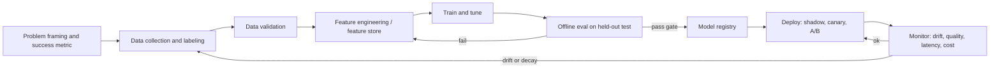
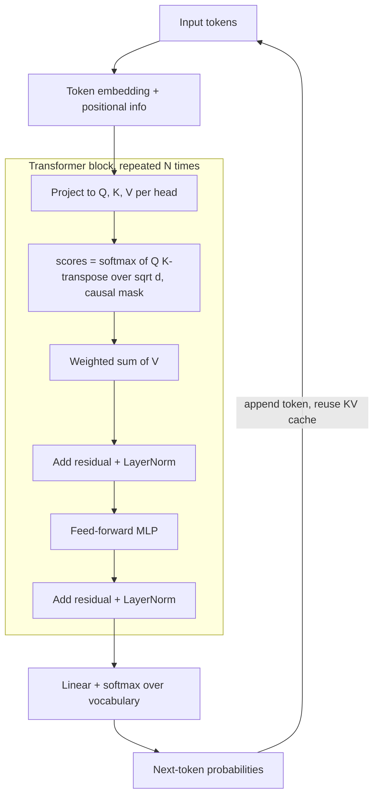
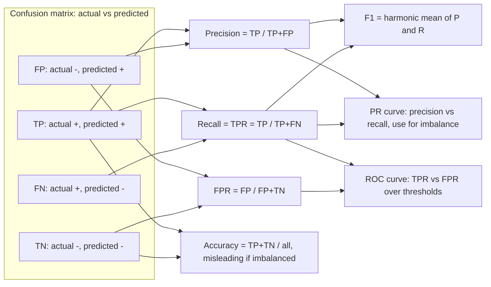

# K10 ML Fundamentals for Infra, SRE and AI Engineers
> Last verified: 2026-10 · Audience: senior/staff DevOps, SRE, AI eng, NetEng, DevSecOps, architects

## TL;DR
- ML = **learning a function from data** instead of writing rules; the infra job is the **lifecycle around the model** (data, features, training, deployment, monitoring), not the math.
- **Generalization** is the goal: hold out data the model never sees (train/validation/test), and treat **data leakage** as the #1 silent failure. It looks great offline and fails in prod.
- **Bias–variance:** underfit = too simple; overfit = memorizes. Fixes are more data, regularization, early stopping and simpler models, all chosen using **validation** data and never test data.
- **Pick metrics for the business cost.** Accuracy is misleading on imbalanced data. Use precision/recall/F1 and **PR-AUC**, and calibrate probabilities when downstream code thresholds them.
- **Gradient-boosted trees (XGBoost/LightGBM/CatBoost) still win on tabular data.** Transformers dominate text, vision and multimodal work. LLMs are not the default for structured prediction.
- **Models decay in production** through data drift, concept drift and training–serving skew. Monitor input distributions (PSI/JS/KS), prediction distributions and delayed ground-truth quality, and alert then retrain.
- **Online vs batch inference** is a latency, freshness and cost trade-off. **Feature stores** exist to give online and offline consistency plus **point-in-time-correct** training data.
- **As of 2026:** **SageMaker Model Monitor is closed to new customers** (AWS points to OSS Evidently + MLflow + CloudWatch), and the **Autopilot UI moved into SageMaker Canvas** (API remains). Azure ML has built-in model monitoring and a managed feature store.

## K10.1 Learning paradigms: supervised, unsupervised, self-supervised, reinforcement
| Paradigm | Signal | Typical tasks | Examples |
|---|---|---|---|
| **Supervised** | Labeled (x, y) pairs | Classification, regression, forecasting | Fraud yes/no, CTR, house price |
| **Unsupervised** | No labels; structure in x | Clustering, dimensionality reduction, anomaly detection | k-means segments, PCA, Random Cut Forest |
| **Self-supervised** | Labels derived from the data itself | Pretraining representations | Next-token prediction (GPT), masked LM (BERT), contrastive image/text (CLIP) |
| **Reinforcement learning** | Reward from environment | Sequential decisions, policy optimization | Game agents, robotics, **RLHF/RLAIF**-style LLM post-training |
- **Semi-supervised** = few labels plus many unlabeled examples (pseudo-labeling). **Weak supervision** = noisy programmatic labels.
- LLMs combine **self-supervised pretraining**, **supervised fine-tuning (SFT)** and **preference/RL post-training**. See [K5 Training & fine-tuning](K5-training-fine-tuning.md).
- **Interview angles:**
  - If asked "is anomaly detection supervised?", say it is **usually unsupervised or semi-supervised** because labeled anomalies are rare. It becomes supervised if you have labeled incidents.
  - Pitfall: calling LLM pretraining "unsupervised". The precise term is **self-supervised**.

## K10.2 The ML lifecycle
- **How it works:** problem framing → data collection/labeling → validation → **feature engineering** → training plus hyperparameter tuning → offline evaluation → registry/approval → **deployment** (shadow, canary, A/B) → **monitoring** (drift, quality, latency, cost) → retrain. It is a loop, not a line.
- **Artifacts to version:** data snapshot, feature definitions, code, hyperparameters, model binary, eval report and environment (container image). **Lineage** ties them together (MLflow, SageMaker Model Registry, Azure ML registries).
- **MLOps maturity:** manual notebooks → automated training pipeline (CT, continuous training) → CI/CD for pipelines plus automated retraining triggered by monitoring.
- **Trade-offs:** fully automated retraining can quietly ship a regressed model. Gate it on eval thresholds and a human approval for high-risk models.
- **Interview angles:**
  - If asked "what's different from software CI/CD?", say ML behaviour depends on **data as well as code**. You need **data tests, model eval gates and production monitoring for statistical decay**, not just unit tests and uptime.
  - Follow-up on rollback: keep the previous model version deployable, use **shadow deployment** to compare without user impact, and use canary by traffic percentage.



## K10.3 Train/validation/test splits, leakage, cross-validation
- **How it works:**
  - **Train** set fits parameters. **Validation** set tunes hyperparameters and chooses models. **Test** set is touched **once** for an unbiased final estimate. A common split is 70/15/15 or 80/10/10; with millions of rows, 98/1/1 is fine.
  - Repeated tuning against one validation set **overfits the validation set**. Azure AutoML docs call this out explicitly, which is why AutoML supports a separate test dataset.
  - **k-fold CV:** train on k−1 folds, evaluate on the held-out fold, average the k scores. **5 or 10 folds** are standard. In scikit-learn, an integer `cv` uses **StratifiedKFold for classifiers** and KFold for regressors.
  - Special splitters:
    - **StratifiedKFold** keeps class ratios, which matters for imbalanced data.
    - **GroupKFold** keeps the same user or patient out of both train and test.
    - **TimeSeriesSplit** always tests on the future, so training folds grow forward.
- **Leakage** happens when information that will not exist at prediction time reaches training. Common forms:
  - **Preprocessing fit on all data**, such as a scaler or imputer fit before splitting. Fix it with a `Pipeline` fit per fold.
  - **Target leakage:** a feature derived from the label, e.g. "refund_issued" when predicting fraud.
  - **Temporal leakage:** random splits on time-ordered data, or features computed with future data. Fix it with **point-in-time joins** (K10.13).
  - **Entity leakage:** the same user appears in train and test, so the model memorizes the user.
- **Trade-offs:** CV costs k× compute but gives variance estimates (mean ± std). For big deep-learning datasets, a single holdout is the norm.
- **Interview angles:**
  - If asked "offline AUC 0.99, prod is bad, why?", say **leakage first**, then training–serving skew, then drift.
  - Pitfall: never randomly shuffle time series. Use a time-based split or rolling-origin CV. Azure AutoML forecasting uses **rolling-origin cross-validation**.

## K10.4 Bias–variance, overfitting/underfitting, regularization, early stopping
- **How it works:**
  - Expected error = **bias² + variance + irreducible noise**.
  - **Underfitting** (high bias): training and validation error are both high.
  - **Overfitting** (high variance): training error is low and validation error is high, so the gap widens.
  - **Regularization:**
    - **L2/ridge** shrinks weights.
    - **L1/lasso** drives weights to zero, which also does feature selection. **Elastic Net** = L1 + L2.
    - Neural-net tools: **dropout**, weight decay, data augmentation.
    - Tree tools: max_depth, min_child_weight, subsampling, learning rate (shrinkage).
  - **Early stopping:** track validation loss each epoch or boosting round and stop after N rounds with no improvement (patience). Keep the best checkpoint.
- **Trade-offs:** more data reduces variance without adding bias, so it is usually the best fix. More model capacity reduces bias but needs regularization.
- **Interview angles:**
  - If asked "how do you detect overfitting?", say **learning curves** (training vs validation loss over epochs or data size).
  - If asked to fix overfitting, say: more or augmented data, regularize, simplify, early stop, use ensembles (bagging lowers variance), and check for leakage.
  - Modern caveat: very large over-parameterized nets show **double descent**. Don't over-claim the classic U-curve for LLMs.

## K10.5 Core model families (one line each)
| Family | One-liner | Use when | Infra note |
|---|---|---|---|
| **Linear regression** | Weighted sum of features, minimizes squared error | Baseline, interpretable, numeric target | Tiny, μs inference |
| **Logistic regression** | Linear model + sigmoid → probability | Baseline classifier, well-calibrated, regulated domains | Tiny; great for high-QPS CTR with hashed sparse features |
| **Decision tree** | If/else splits on features | Interpretability | Overfits alone |
| **Random forest** | Bagged trees on random feature subsets → lower variance | Robust tabular baseline | Parallel training |
| **Gradient boosting (XGBoost, LightGBM, CatBoost)** | Trees added sequentially to fit the residuals of the ensemble so far | **State of the art on tabular data**; handles mixed types and missing values | CPU-friendly; ms inference; LightGBM adds GOSS + EFB; CatBoost uses ordered boosting and native categoricals |
| **k-NN** | Predict from the nearest labeled points | Small data, similarity tasks | Cost grows with data unless you use ANN indexes ([K2](K2-embeddings-vector-databases.md)) |
| **k-means** | Partition into k clusters by nearest centroid | Segmentation, vector quantization (IVF in vector DBs) | Choose k by elbow or silhouette |
| **PCA** | Project onto the top-variance orthogonal directions | Dimensionality reduction | Linear only |
| **Neural nets (MLP)** | Stacked linear layers + nonlinearities | Large data, learned representations | GPU training |
| **CNN** | Convolutions share weights across space | Images, some audio and time series | Being displaced by ViTs at scale |
| **RNN/LSTM** | Recurrent state over sequences | Legacy sequence models (SageMaker DeepAR uses RNN) | Sequential, so hard to parallelize |
| **Transformer** | Self-attention over tokens, parallel across the sequence | Text, vision, multimodal; LLMs | Quadratic attention cost; KV cache ([K4](K4-llm-serving-inference.md)) |
- **Interview angles:**
  - If asked "deep learning for a churn table?", say **start with GBDT plus a logistic regression baseline**. Neural nets rarely beat well-tuned boosting on tabular data and cost more to serve and explain.
  - Ensembles: **bagging** lowers variance (random forest), **boosting** lowers bias (GBDT), **stacking** trains a meta-model on base predictions. Azure AutoML stacking uses LogisticRegression or ElasticNet meta-models and voting ensembles by default.

## K10.6 How a neural net trains (intuition)
- **Forward pass:** inputs → layers (weights · x + bias → activation such as ReLU or GELU) → prediction.
- **Loss** measures how wrong the prediction is. Use **MSE** for regression and **cross-entropy (log loss)** for classification and next-token LM.
- **Backpropagation** applies the chain rule to compute the gradient of the loss with respect to every weight in one backward pass. **Gradient descent** then updates each weight: w ← w − **learning rate** × gradient.
- **Batch / mini-batch** = examples per gradient step (e.g. 32–4096, or millions of tokens for LLMs). **Step/iteration** = one update. **Epoch** = one full pass over the data. LLM pretraining is often ~1 epoch over many tokens.
- **Optimizers:**
  - SGD with momentum.
  - **Adam/AdamW**, the default for transformers. Adam keeps 2 extra states per parameter, so memory is about 2× the weights; this matters for GPU sizing ([K5](K5-training-fine-tuning.md)).
- **Learning rate** is the most important hyperparameter:
  - Too high diverges (NaN loss); too low is slow or stuck.
  - Use **warmup + cosine/linear decay** schedules.
- Other stability tools:
  - **Gradient clipping** prevents exploding gradients.
  - **Mixed precision** (bf16/fp16) halves memory and bandwidth.
  - **Vanishing gradients** are mitigated by ReLU, residual connections and normalization layers.
- **Interview angles (infra-relevant):**
  - If asked "loss went NaN at step 40k", say: check the LR spike, fp16 overflow (use bf16 or loss scaling), a bad data shard, and gradient-norm metrics. Restart from a checkpoint.
  - Bigger batch → better GPU utilization, but you may need LR scaling. **Gradient accumulation** simulates a big batch on small memory.

## K10.7 Transformers and attention (one diagram)
- **How it works:**
  - Tokens are embedded, and **positional information** is added (e.g. RoPE).
  - Each layer runs **multi-head self-attention** and then an **MLP (feed-forward)**, both with residual connections and layer norm.
  - Attention: each token makes **Q, K, V** vectors, and Attention = softmax(QKᵀ/√d)·V. Every token can look at every other token.
  - **Decoder-only** (GPT, Claude, Llama) uses a **causal mask**, so tokens only see earlier tokens. **Encoder-only** (BERT) is used for embeddings and classification. **Encoder-decoder** (T5) is used for translation and summarization.
- **Infra consequences:**
  - Attention compute and memory grow **O(n²)** with sequence length.
  - Generation is autoregressive, one token at a time. It caches past K/V (**KV cache**) and is **memory-bandwidth bound in decode** and compute bound in prefill.
  - Details are in [K1](K1-llm-fundamentals-for-infra.md) and [K4](K4-llm-serving-inference.md).
- **Interview angles:**
  - If asked "why did transformers beat RNNs?", say **parallel training across the sequence** plus direct long-range dependencies through attention, and they scale predictably with data and compute.



## K10.8 Embeddings intuition
- An **embedding** is a dense vector (e.g. 384–3072 dims) learned so that **semantic similarity becomes geometric proximity**, usually measured by cosine similarity or dot product.
- Embeddings exist for words/tokens, sentences, images, users and items (recsys), and categorical features. They replace sparse one-hot encodings with learned representations.
- They power semantic search/RAG, recommendations ("two-tower" models), clustering, deduplication and anomaly detection, and they serve as features for downstream classical models.
- **Interview angles:**
  - Embeddings are **model-specific**. Changing the embedding model means re-embedding the whole corpus, so plan for dual-write and backfill.
  - Full depth on ANN indexes, dimensions and vector DBs is in [K2](K2-embeddings-vector-databases.md).

## K10.9 Evaluation metrics
### Classification (from the confusion matrix)
| Metric | Formula | Use when |
|---|---|---|
| **Accuracy** | (TP+TN)/all | Balanced classes only |
| **Precision** | TP/(TP+FP) | False positives are costly (spam to inbox, blocking a legit payment) |
| **Recall / TPR / sensitivity** | TP/(TP+FN) | False negatives are costly (fraud, cancer, security alerts) |
| **FPR** | FP/(FP+TN) | False alarms are costly (pager fatigue) |
| **Specificity** | TN/(TN+FP) = 1−FPR | Medical screening |
| **F1** | 2PR/(P+R), harmonic mean | One number for imbalanced data; **Fβ** weights recall β× more |
- **ROC curve** plots TPR against FPR across thresholds. **ROC-AUC** is the probability that a random positive is ranked above a random negative. 0.5 is random and 1.0 is perfect. It is threshold-independent and insensitive to class prior.
- **PR curve / PR-AUC (average precision)** plots precision against recall. **Prefer it for heavy imbalance** because ROC-AUC looks optimistic when negatives dominate (FPR stays tiny). The PR-AUC baseline equals the positive rate, not 0.5.
- **Log loss (cross-entropy)** penalizes confident wrong probabilities and is the training loss for logistic regression and neural nets.
- **Calibration** asks whether a predicted 0.8 means 80% in reality. Check with a reliability diagram, Brier score or ECE. Fix with **Platt scaling** (sigmoid) or **isotonic regression**. GBDT and neural-net outputs are often miscalibrated. Calibration matters when probabilities feed bids, pricing or risk scores, as in [E2 CTR](../E-ai-system-design/E2-google-ctr-prediction-case-study.md).
- **Threshold choice** is a business decision (cost of FP vs FN), separate from model quality.



### Regression
- **MAE** is the mean absolute error. It is robust to outliers and in the target's units.
- **RMSE** penalizes large errors more (squared) and is in the target's units. **MSE** is the squared version used as a loss.
- **MAPE** is percentage error. It breaks near zero, so consider sMAPE or WAPE for forecasting. **R²** is the variance explained.
### Ranking / retrieval / recsys
- **Precision@k / Recall@k** measure relevant items in the top k.
- **MRR** = mean of 1/rank of the **first** relevant result. Use it for "one right answer" tasks such as QA and navigational search.
- **nDCG@k** handles graded relevance with a log-position discount, normalized by the ideal ranking. It is the standard for search and RAG retrievers ([K3](K3-rag-pipelines.md)).
- **MAP** = mean average precision over queries.
### Text generation
- **BLEU** measures n-gram **precision** against references (machine translation). **ROUGE** measures n-gram/LCS **recall**-oriented overlap (summarization). Both are cheap and deterministic.
- **Why LLM evals moved beyond them:**
  - Many valid answers exist, so surface-overlap metrics correlate poorly with human judgment.
  - They can't score factuality, groundedness, safety or instruction-following.
- Current practice:
  - **LLM-as-judge** with rubrics.
  - Pairwise preference / Elo.
  - Task success rates.
  - RAG-specific groundedness and relevance metrics. Azure ML's GenAI monitoring signal lists groundedness, relevance, fluency, similarity and coherence.
  - Human eval sets.
  - See [K9 LLMOps, evals & guardrails](K9-llmops-evals-guardrails.md).
- **Interview angles:**
  - If asked "99% accuracy on fraud at 0.5% prevalence?", say it is worthless: predicting all-negative scores 99.5%. Report **recall at a fixed precision** or PR-AUC.
  - Always tie offline metrics to an **online business metric** (K10.14).

## K10.10 Class imbalance handling
- **Data-level options:**
  - **Undersample** the majority class (cheap, loses information).
  - **Oversample** the minority class.
  - **SMOTE** synthesizes minority points by interpolation. Use it only on the training fold, never before splitting (leakage).
  - **Downsample and upweight** (Google MLCC pattern): downsample the majority by factor f and multiply its example weight by f, so the probabilities stay calibrated.
- **Algorithm-level options:**
  - **Class weights** / `scale_pos_weight` (XGBoost).
  - **Focal loss.**
  - Anomaly-detection framing when positives are extremely rare.
- **Evaluation-level options:** stratified splits, PR-AUC, recall@precision and **threshold tuning** on validation data. Metric choice often matters more than resampling.
- **Trade-offs:** resampling changes the predicted base rate, so **recalibrate** if downstream code consumes probabilities.
- **Interview angles:**
  - Azure AutoML has **guardrails** that detect imbalance and over-fitting risks. See the "prevent over-fitting and imbalanced data" doc.
  - Follow-up: label delay. Fraud labels (chargebacks) arrive weeks later, which affects both training windows and monitoring.

## K10.11 Data drift, concept drift and monitoring
- **Types:**
  - **Data (covariate) drift:** P(x) changes, e.g. a new device mix or a new region launch.
  - **Concept drift:** P(y|x) changes. The same inputs now mean a different outcome, such as new fraud tactics or COVID-era behaviour.
  - **Prediction drift:** the distribution of outputs shifts.
  - **Label/prior shift:** the base rate changes.
  - **Training–serving skew:** features are computed differently online and offline. This is a bug, not drift. Feature stores mitigate it.
- **Detection statistics:**
  - **PSI** (rule of thumb: <0.1 stable, 0.1–0.25 moderate, >0.25 significant; industry convention, not a standard).
  - **Jensen–Shannon distance.**
  - **Wasserstein.**
  - **Two-sample KS** for numeric features and **chi-squared** for categorical ones.
  - Azure ML data drift offers JS distance, PSI, normalized Wasserstein, KS and chi-squared.
- **What to monitor:**
  - Input feature distributions and data quality (null rate, type errors, out-of-range values).
  - Prediction distribution.
  - **Model quality once ground truth arrives** (delayed labels).
  - Feature attribution drift (importance shifts).
  - Slice/fairness metrics.
  - Ops metrics: latency, error rate, GPU utilization, cost per prediction.
- **Azure ML model monitoring:**
  - Built-in signals: data drift, prediction drift, data quality, feature attribution drift (preview), model performance (preview) and GenAI safety/quality (preview).
  - Lookback windows are written in ISO 8601 (e.g. `P7D`). The default reference offset is 2× the production window, so the windows don't overlap.
  - Alerts go through Event Grid, which can trigger retraining.
  - It runs on Spark and doesn't support `AllowOnlyApprovedOutbound` managed-VNet isolation.
- **SageMaker Model Monitor:**
  - Pipeline: data capture → baseline (statistics plus constraints, Deequ-based) → monitoring schedule (Processing jobs) → CloudWatch.
  - Types: data quality, model quality, bias drift and feature attribution drift (Clarify).
  - Limits: tabular only, single-model endpoints only, and data capture stops at high disk usage (keep it below 75%).
  - **No longer open to new customers.** AWS recommends OSS SageMaker monitoring solutions (Evidently AI + SageMaker MLflow Apps), QuickSight and CloudWatch instead. The exact effective date was not found on the page (unverified).
- **Interview angles:**
  - If asked "drift alert fired, do we retrain?", say: not automatically. First check whether it is a **pipeline bug or skew** (null spike, schema change), then whether performance actually dropped on labeled data. Retrain on a fresh window only after that.
  - Drift without ground truth is a **leading indicator**, not proof of degradation.
  - Monitor the **top-N important features** to cut noise and cost; Azure ML recommends this.
  - Monitoring itself is SRE work: treat it with SLIs and alert-fatigue discipline ([J2](../J-sre/J2-monitoring-and-alerting.md)).

## K10.12 Online vs batch inference
| | **Batch (offline)** | **Online (real-time)** | **Streaming / near-real-time** | **Async** |
|---|---|---|---|---|
| Latency | Minutes–hours | ms–100s of ms (p99 SLO) | Seconds | Seconds–minutes, queued |
| Pattern | Scheduled job scores a whole table and writes to a DB/cache | Synchronous request/response endpoint | Consume Kafka/Kinesis events and score them | Queue + callback; large payloads |
| Cost | Cheapest; spot-friendly; scale to zero | Always-on capacity, autoscaling | Medium | Scale to zero possible |
| AWS | SageMaker Batch Transform | SageMaker real-time endpoint / serverless inference | Kinesis/MSK + endpoint or Flink | SageMaker Asynchronous Inference |
| Azure | Azure ML batch endpoints | Azure ML managed online endpoints | Event Hubs + online endpoint / Stream Analytics | Batch endpoints, or queue + online endpoint |
- **Trade-offs:**
  - **Batch** gives stale predictions but is simple and cheap. It suits nightly recommendations and churn scores.
  - **Online** handles fresh context but needs low-latency features (online store), autoscaling and a fallback.
  - A **hybrid** precomputes candidates in batch and re-ranks online, the classic recsys pattern ([E2](../E-ai-system-design/E2-google-ctr-prediction-case-study.md)).
- **Interview angles:**
  - If asked "how do you degrade gracefully?", say: a cached or batch prediction, a rule-based default, or the previous model version, plus timeouts and circuit breakers.
  - LLMs are mostly online and token-streamed, with batch APIs for offline jobs at a discount. See [K4](K4-llm-serving-inference.md) and [K7](K7-ai-gateways-caching-cost.md).

## K10.13 Feature stores
- **How it works:**
  - A central registry of **feature definitions** feeds two stores:
    - The **offline store**, a full history in a columnar lake format (Parquet/Iceberg/Delta), used for training and batch scoring.
    - The **online store**, holding the latest value per entity key with ms-latency reads, used for real-time inference.
  - It also provides **point-in-time joins**, also called "time travel". For each training label at time t, they fetch feature values **as of t**, which prevents temporal leakage.
- **SageMaker Feature Store:**
  - Data is organized in feature groups with `RecordIdentifier` + `EventTime`.
  - The offline store is **append-only Parquet in your S3**, queryable with Athena. The online store keeps the latest record only.
  - Streaming ingestion uses synchronous `PutRecord`; batch ingestion uses Processing jobs.
  - It is multi-AZ, and feature group names are unique per account and Region.
- **Azure ML managed feature store:**
  - It is a **workspace type** that many project workspaces can share.
  - Feature sets are **versioned and immutable**.
  - Managed Spark materializes features to an **offline store (ADLS Gen2)** and an **online store (Redis)**.
  - It supports point-in-time retrieval and RBAC, and features can be consumed from Azure Databricks.
- **Trade-offs:** a feature store pays off with many models or teams sharing features and with real-time serving needs. It is overkill for one batch model, where a well-modeled lakehouse table may suffice.
- **Interview angles:**
  - If asked "what problem does a feature store solve?", name **training–serving skew** (one definition, two stores), **leakage-free training sets** (point-in-time joins), **reuse/discovery** and **freshness** through streaming features.
  - Pitfall: online/offline **consistency lag**. Also watch for PII in feature names and metadata, which AWS explicitly warns against. See [L1](../L-data-privacy-ai-security/L1-data-classification-pii.md).

## K10.14 A/B testing basics
- **How it works:**
  - Randomly split users (by **user ID hash**, not by request) into control and treatment.
  - Pick a **primary metric** (e.g. conversion) and **guardrail metrics** (latency p99, error rate, revenue, unsubscribes, complaint rate) in advance.
  - Run the test for the **pre-computed sample size** (power analysis).
- **Statistics:**
  - **Significance level α** (typically 0.05) is the false-positive rate.
  - **Power 1−β** (typically 0.8) is the chance of detecting the **minimum detectable effect (MDE)**.
  - The **p-value** is the probability of a result at least this extreme if there is no true effect. Report **confidence intervals**, not just p-values.
- **Pitfalls:**
  - **Peeking** (stopping when significant) inflates false positives. Use sequential testing if you must peek.
  - **Multiple comparisons** need a Bonferroni or FDR correction.
  - **Novelty and primacy effects** distort short tests, so run at least 1–2 full weekly cycles.
  - **Sample ratio mismatch (SRM)** means the split is broken, so check it first.
  - **Network effects / interference** in marketplaces call for cluster or switchback tests.
  - Simpson's paradox can mislead aggregated results.
- **Offline vs online:** a better offline AUC does not guarantee a better online KPI. Production experiments are the arbiter.
- **Rollout ladder:** shadow mode (no user impact) → interleaving for ranking → canary → A/B → full rollout. **Multi-armed bandits** trade statistical clarity for less regret.
- **Interview angles:**
  - If asked "the treatment wins on CTR but p99 latency rose 30%", say the **guardrail blocks the launch**. Fix the latency, then retest.

## K10.15 When to use classical ML vs LLMs
| Situation | Prefer | Why |
|---|---|---|
| Structured/tabular prediction (churn, fraud, CTR, forecasting) | **GBDT / linear / time-series models** | Higher accuracy on tabular data, µs–ms latency, cents per million predictions, explainable (SHAP), easy to calibrate |
| High QPS, strict latency (<10 ms), edge | **Classical / small distilled models** | LLM cost and latency are orders of magnitude higher |
| Unstructured text understanding, extraction, summarization, open-ended generation, few labels | **LLM** (zero/few-shot, then fine-tune) | No feature engineering; handles language variety |
| Text classification at scale with stable labels | **LLM to label/bootstrap → train a small classifier or embedding + logistic regression** | Cheap inference, keeps LLM quality |
| Need determinism, auditability, regulatory explainability | **Classical** (or LLM with strict constraints plus human review) | LLM outputs are stochastic and harder to explain |
| Reasoning over many tools/docs, conversational UX | **LLM + RAG/agents** ([K3](K3-rag-pipelines.md), [K8](K8-agents-tool-use-mcp.md)) | Natural-language interface |
- **Hybrid patterns:**
  - LLM-generated features (embeddings, extracted fields) feeding a GBDT.
  - An LLM as fallback for low-confidence classical predictions.
  - Classical models as cheap **routers/guards** in front of LLMs.
  - An example is the [E4 content moderation case study](../E-ai-system-design/E4-facebook-content-moderation-case-study.md).
- **Interview angles:**
  - If asked "would you use GPT/Claude for credit scoring?", say no for the decision itself because of explainability, fairness, latency and cost. An LLM may help with document extraction upstream.

## K10.16 Glossary (25 terms interviewers drop)
| Term | Meaning |
|---|---|
| **Feature** | Input variable to a model |
| **Label / target** | Value the model learns to predict |
| **Hyperparameter** | Setting chosen before training (LR, depth, k); tuned on validation |
| **Parameter / weight** | Value learned during training |
| **Epoch** | One full pass over the training data |
| **Batch size** | Examples per gradient update |
| **Learning rate** | Step size of gradient descent |
| **Loss function** | Quantity minimized in training (MSE, cross-entropy) |
| **Gradient descent / backprop** | Update rule / chain-rule gradient computation |
| **Overfitting** | Fits training noise; poor generalization |
| **Regularization** | Penalty or constraint that reduces overfitting (L1, L2, dropout) |
| **Cross-validation** | Rotating held-out folds to estimate generalization |
| **Data leakage** | Information unavailable at prediction time used in training |
| **Training–serving skew** | Feature computation differs between training and serving |
| **Data drift / concept drift** | P(x) changes / P(y given x) changes |
| **Precision / recall** | Correctness of positives / coverage of actual positives |
| **ROC-AUC / PR-AUC** | Ranking quality across thresholds / same but imbalance-aware |
| **Calibration** | Predicted probabilities match observed frequencies |
| **Embedding** | Dense vector where distance encodes similarity |
| **Attention** | Mechanism that weights tokens by relevance (QKV) |
| **Inference** | Running a trained model to get predictions |
| **Feature store** | Online + offline feature serving with point-in-time correctness |
| **Model registry** | Versioned catalog of models with stage/approval and lineage |
| **Shadow deployment** | New model gets mirrored traffic; outputs logged, not served |
| **Transfer learning / fine-tuning** | Adapt a pretrained model to a new task with less data |

## Cloud mapping: AWS vs Azure
| Capability | AWS | Azure | Role it plays | Key differences | Alternatives |
|---|---|---|---|---|---|
| ML platform / workspace | Amazon SageMaker AI (Studio) | Azure Machine Learning workspace (in the Azure AI Foundry family) | Training, endpoints, registry, pipelines | SageMaker is a set of services per Region; Azure ML is workspace-scoped with registries for cross-workspace sharing | Databricks (MLflow + Mosaic AI), Vertex AI |
| AutoML | SageMaker Autopilot (API, AutoMLV2) / **SageMaker Canvas** (UI since Nov 2023) | Azure ML **Automated ML** | Algorithm selection, HPO, ensembling | Autopilot: tabular, text, image, time series, LLM fine-tune via V2 API. Azure AutoML: classification, regression, forecasting, CV, NLP; ensembles on by default; ONNX export | BigQuery ML, Databricks AutoML (unverified status), AutoGluon (OSS) |
| Built-in algorithms | SageMaker built-ins: XGBoost, LightGBM, CatBoost, AutoGluon-Tabular, Linear Learner, k-means, PCA, RCF, DeepAR, BlazingText, etc. | Azure ML curated environments + model catalog; AutoML's algorithm set | Ready-to-train containers | AWS ships first-party algorithm containers; Azure leans on curated framework environments and the model catalog | BigQuery ML `CREATE MODEL` (boosted trees, k-means, ARIMA_PLUS, etc.) |
| Feature store | SageMaker Feature Store (online + offline S3/Parquet, Athena) | Azure ML managed feature store (ADLS Gen2 offline, Redis online, Spark materialization) | Online/offline consistency, PIT joins | Azure: versioned immutable feature sets, managed materialization schedules. AWS: you run ingestion (PutRecord / Processing) | Databricks Feature Engineering in Unity Catalog, Feast (OSS), Tecton |
| Model monitoring | SageMaker Model Monitor (**closed to new customers**) → Evidently + SageMaker MLflow + CloudWatch / QuickSight | Azure ML model monitoring (drift, quality, attribution, performance, GenAI) + Event Grid | Drift/quality detection, retrain triggers | Azure is a first-class built-in; AWS now steers to an OSS reference architecture | Evidently, WhyLabs, Arize, Databricks Lakehouse Monitoring (unverified current name) |
| Experiment tracking / registry | SageMaker Experiments → **managed MLflow** in SageMaker; Model Registry | MLflow-compatible tracking built into Azure ML; registries | Lineage, approvals | Both converged on MLflow APIs | Databricks MLflow, W&B |
| Batch / online inference | Batch Transform; real-time, serverless, async endpoints | Batch endpoints; managed online endpoints | Serving | Azure online endpoints support blue/green traffic split across deployments natively | KServe on Kubernetes, BigQuery ML `ML.PREDICT` |
- **Roles:**
  - SageMaker and Azure ML are the end-to-end platforms.
  - Feature stores and monitors are the components interviewers probe for MLOps maturity.
  - For managed **foundation-model** platforms (Bedrock, Azure AI Foundry), see [K6](K6-managed-model-platforms.md).
- **Key differences:**
  - AWS is "many services, Region-scoped, you wire them". Azure ML is "workspace-centric, with managed Spark doing materialization and monitoring".
  - Azure's monitoring is native with Event Grid hooks. AWS **deprecated the new-customer path** for Model Monitor in favour of an OSS stack.
  - Both standardize on **MLflow** for tracking.
- **Alternatives:**
  - **BigQuery ML** trains and predicts with SQL inside the warehouse, so there is no data movement. It suits analysts and batch scoring.
  - **Databricks** offers lakehouse-native MLflow, Unity Catalog feature tables, Model Serving and monitoring ([M3](../M-data-platforms/M3-databricks-platform.md)).
  - **Kubernetes** with Kubeflow/KServe/Feast is the portable DIY option.

## Hands-on (optional)
```bash
# Local scikit-learn/XGBoost playground in Jupyter (no host Python needed)
docker run --rm -p 8888:8888 -v "$PWD":/home/jovyan/work quay.io/jupyter/scipy-notebook:latest
# open the printed http://127.0.0.1:8888/lab?token=... URL; scikit-learn, pandas, matplotlib are preinstalled
# inside a notebook terminal:  pip install xgboost lightgbm evidently

# Stand up an MLflow tracking server for experiment tracking + model registry
docker run --rm -p 5000:5000 ghcr.io/mlflow/mlflow:latest \
  mlflow server --host 0.0.0.0 --port 5000 --backend-store-uri sqlite:///mlflow.db
```

## Cross-links
- [K1 LLM fundamentals for infra](K1-llm-fundamentals-for-infra.md): tokens, inference, KV cache
- [K2 Embeddings & vector databases](K2-embeddings-vector-databases.md)
- [K3 RAG pipelines](K3-rag-pipelines.md): retrieval metrics (nDCG, MRR) in practice
- [K4 LLM serving & inference](K4-llm-serving-inference.md)
- [K5 Training & fine-tuning](K5-training-fine-tuning.md)
- [K9 LLMOps, evals & guardrails](K9-llmops-evals-guardrails.md)
- [E1 System design fundamentals (ML)](../E-ai-system-design/E1-system-design-fundamentals.md)
- [E2 Google CTR prediction](../E-ai-system-design/E2-google-ctr-prediction-case-study.md) · [E3 HubSpot user clustering](../E-ai-system-design/E3-hubspot-user-clustering-case-study.md) · [E4 Facebook content moderation](../E-ai-system-design/E4-facebook-content-moderation-case-study.md)
- [M3 Databricks platform](../M-data-platforms/M3-databricks-platform.md) · [J2 Monitoring and alerting](../J-sre/J2-monitoring-and-alerting.md)

## Sources
- https://developers.google.com/machine-learning/crash-course/classification/precision-and-recall
- https://developers.google.com/machine-learning/crash-course/classification/roc-and-auc
- https://scikit-learn.org/stable/modules/cross_validation.html
- https://docs.aws.amazon.com/sagemaker/latest/dg/model-monitor.html
- https://docs.aws.amazon.com/sagemaker/latest/dg/model-monitor-availability-change.html
- https://docs.aws.amazon.com/sagemaker/latest/dg/autopilot-automate-model-development.html
- https://docs.aws.amazon.com/sagemaker/latest/dg/feature-store.html
- https://docs.aws.amazon.com/sagemaker/latest/dg/algos.html
- https://learn.microsoft.com/en-us/azure/machine-learning/concept-model-monitoring
- https://learn.microsoft.com/en-us/azure/machine-learning/concept-what-is-managed-feature-store
- https://learn.microsoft.com/en-us/azure/machine-learning/concept-automated-ml
