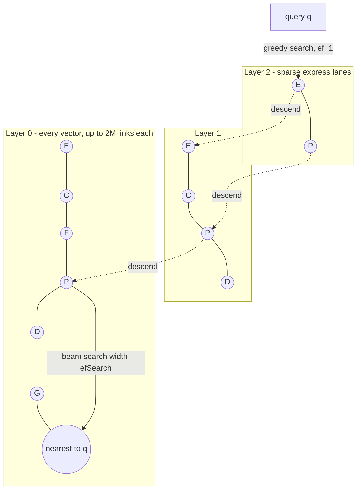
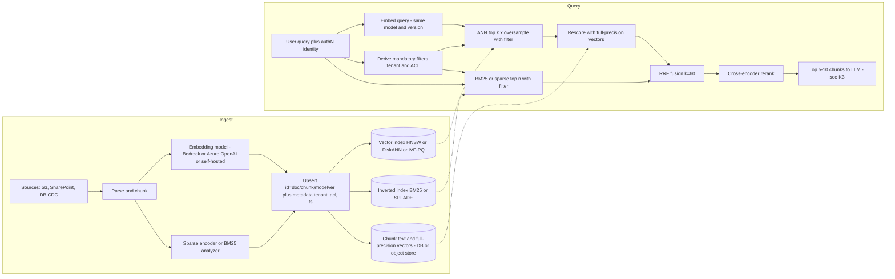
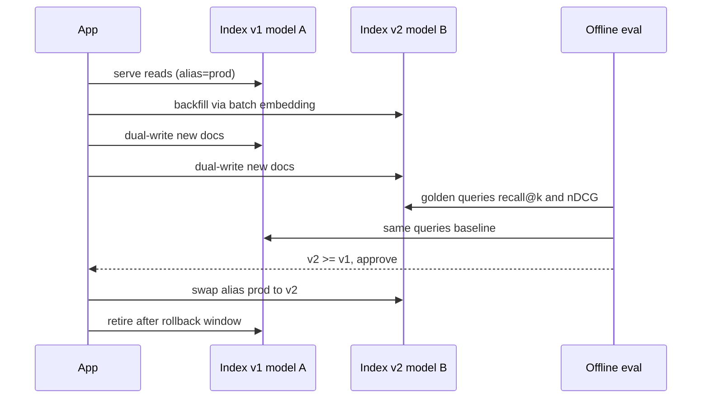

# K2 Embeddings & Vector Databases
> Last verified: 2026-10 · Audience: senior/staff DevOps, SRE, AI eng, NetEng, DevSecOps, architects

## TL;DR
- An **embedding** is a fixed-length float vector from a specific model; vectors from different models (or versions) are **not comparable** — a model change means **re-embedding the whole corpus** and rebuilding the index.
- Pick the metric the model was trained for; for **unit-normalized** vectors, cosine = dot product = rank-equivalent to L2, so use **dot product** (cheapest).
- Exact (flat/brute-force) kNN is O(N·d) with 100% recall and works fine up to roughly 10⁵–10⁶ vectors, or when filters shrink the candidate set. Beyond that use **ANN** (HNSW, IVF, DiskANN) and **measure recall@k against exact ground truth**.
- **HNSW** = best recall/latency but RAM-resident (≈ `1.1·(4d + 8M)·N` bytes). **IVF-PQ** = small memory, needs training, lower recall. **DiskANN** = SSD-resident graph with PQ in RAM, billion-scale on one node.
- **Quantize**: fp16 (2x), int8 SQ (4x), PQ (16–64x), binary (32x). Combine with **Matryoshka truncation** and **oversample + rescore** with full-precision vectors to recover recall.
- **Filtering** is the #1 production pain point. Post-filtering returns fewer than k results. Pre-filtering with a graph index needs engine support (filtered HNSW, iterative scans, filtered DiskANN, or a fallback to exact search).
- **Hybrid** (BM25 or SPLADE sparse + dense, fused with **RRF**, k=60) plus a cross-encoder reranker beats pure vector search on most enterprise corpora.
- Choose the store by **where the data already lives** and the scale/QPS profile: pgvector/Aurora/Azure PG (relational), OpenSearch/Azure AI Search (search-first and hybrid), S3 Vectors (cheap, cold, infrequent queries), Redis/MemoryDB/Azure Managed Redis (µs–ms, semantic cache and agent memory), Cosmos DB/DocumentDB (operational NoSQL), Pinecone/Qdrant/Milvus/Weaviate (dedicated).

## K2.1 Embeddings: dimensions, normalization, Matryoshka, multilingual/multimodal, selection, re-embedding
- **How it works:**
  - A model maps the input (text chunk, image, audio) to a vector `R^d`. **Semantic closeness ≈ geometric closeness** *within that model's space only*.
  - Typical dimensions (verified 2026-10):
    | Model | Dims | Max input | Notes |
    |---|---|---|---|
    | Amazon **Titan Text Embeddings V2** (`amazon.titan-embed-text-v2:0`) | **1024 (default) / 512 / 256** | 8,192 tokens / 50k chars | `normalize` flag; English-optimized, 100+ langs (preview); cross-language retrieval is "sub-optimal" per AWS |
    | Titan Text G1 (legacy) | 1536 | 8k | |
    | Cohere Embed English / Multilingual v3 (Bedrock) | 1024 | 512 tokens (unverified) | int8/binary output types (unverified) |
    | Azure OpenAI **text-embedding-3-small / -large** | 1536 / 3072 (default) | 8,191 tokens (unverified) | `dimensions` param (MRL truncation) |
    | text-embedding-ada-002 (legacy) | 1536 fixed | 8k | no truncation; older deployments being retired (check the Azure model-retirement page) |
  - **Bedrock embedding quotas are RPM-based, not TPM-based.** Plan bulk re-embeds with batch inference.
  - **Normalization:** L2-normalize to unit length so that `cos(a,b) = a·b`. OpenAI-family embeddings come out unit-normalized. Titan V2 has `normalize: true`. If you normalize, choose **dot product / inner product** in the index (Azure AI Search docs: same result as cosine, "slightly more performant").
  - **Matryoshka Representation Learning (MRL):** the model is trained so the **first n dimensions are themselves a usable embedding**. Truncate, then **re-normalize**. Azure AI Search exposes this as `truncateDimension` on quantized fields for text-embedding-3 models. Titan V2's 256/512/1024 options serve the same purpose.
  - **Multilingual:** one shared space across languages, so a query in DE can find a doc in KO *if the model is truly cross-lingual*. Test this explicitly.
  - **Multimodal:** text and images (and video/audio) in one space (e.g., Titan Multimodal Embeddings, Cohere Embed v4, Amazon Nova multimodal embeddings, CLIP-style models; dims vary, unverified). This enables text→image search.
  - **Selection:** use the **MTEB** leaderboard (retrieval subset, your languages) as a *shortlist only*, then run an **offline eval on your own queries** (recall@k, nDCG@10). Also weigh: max tokens vs chunk size, dims (cost driver), license or hosting (Bedrock/Azure/self-host for data residency), price per 1M tokens, RPM quotas, and support for int8/binary output.
- **Trade-offs / when to use:**
  - Higher dims give slightly better quality but cost RAM linearly. 3072→1024 MRL truncation typically loses only a few % of retrieval quality (verify on your data).
  - Domain-specific or fine-tuned embeddings beat general ones on jargon-heavy corpora, at the cost of owning the model lifecycle.
  - **Asymmetric models** (separate query vs document prompts/`input_type`, e.g. Cohere `search_query`/`search_document`): forgetting the flag silently hurts recall.
- **Interview angles:**
  - "We want to upgrade the embedding model" → **every vector must be regenerated**. You cannot mix spaces in one index.
    - Plan: new index → backfill (batch inference) → **dual-write** new docs → shadow-query and compare offline metrics → alias swap → retire the old index.
    - Cost = tokens × price + index build time + temporary **2x storage/RAM**.
    - Example: 100M chunks × 400 tokens = 40B tokens. At an illustrative $0.02 per 1M tokens that is about **$800** of compute. RPM quotas and index build time usually dominate, not dollars.
  - **Store the raw chunk text and the model ID/version alongside each vector.** Without the text you cannot re-embed. Tag vectors with `embedding_model` metadata to block cross-model queries.
  - Pitfall: changing chunking or text normalization also requires a re-embed (see [E1.9](../E-ai-system-design/E1-system-design-fundamentals.md#e19-rag-chunking-and-retrieval-strategies)).

## K2.2 Similarity metrics
- **How it works:**
  | Metric | Formula | Range / order | Use when |
  |---|---|---|---|
  | **Cosine** | a·b / (‖a‖‖b‖) | −1..1, higher = closer | Magnitude is noise; default for most text models |
  | **Dot / inner product** | Σ aᵢbᵢ | −∞..∞ | Vectors are normalized (= cosine, cheaper), or the model encodes "importance" in magnitude (some recsys/MIPS) |
  | **Euclidean (L2)** | ‖a−b‖ | 0..∞, lower = closer | Model trained with L2; for unit vectors ‖a−b‖² = 2 − 2cos, so it gives the same ranking |
  | **Hamming** | popcount(a XOR b) | bits | Binary-quantized vectors |
  | **Jaccard** | \|A∩B\|/\|A∪B\| | 0..1 | Sets / bit vectors |
  | L1 (Manhattan) | Σ\|aᵢ−bᵢ\| | | Rare for embeddings |
  - **pgvector operators:** `<->` L2, `<#>` **negative** inner product, `<=>` cosine distance, `<+>` L1, `<~>` Hamming, `<%>` Jaccard. Opclasses: `vector_l2_ops`, `vector_ip_ops`, `vector_cosine_ops`. The **query operator must match the index opclass**, or the planner does a seq scan.
  - **Score transforms differ by engine.** Azure AI Search returns `@search.score = 1/(1 + cosine_distance)` (range 0.333–1.0), not the raw cosine. Cosmos DB returns the raw cosine. OpenSearch uses engine-specific transforms. **Never hard-code similarity thresholds across engines or models.**
- **Trade-offs / when to use:** dot product on normalized vectors gives the cheapest compute with identical ranking. Metric and dimensions are **immutable** in most stores (S3 Vectors index, Cosmos DB vector policy, pgvector column type), so changing them means creating a new index.
- **Interview angles:**
  - "Cosine or dot?" → "Whatever the model was trained with. If outputs are unit-normalized they're equivalent, so I pick dot product for speed."
  - Pitfall: using L2 on unnormalized vectors from a cosine-trained model ranks long documents oddly.
  - Pitfall: absolute similarity cutoffs (e.g. "> 0.8") are model-specific and drift after a model upgrade.

## K2.3 Exact (kNN) vs approximate (ANN) search
- **How it works:**
  - **Exact kNN** scans all N vectors at O(N·d) per query with 100% recall. It is SIMD-friendly, and a GPU or a few million vectors on one node is fine.
  - **ANN** prunes the search space with graphs (HNSW, Vamana/DiskANN), clustering (IVF), or compression (PQ). It trades recall for latency and QPS.
  - **Recall@k** = |ANN top-k ∩ exact top-k| / k. **Tune to a target (e.g. ≥0.95)** with query-time knobs (`efSearch`, `nprobe`, `L`).
  - Engines expose exact mode for ground truth:
    - Azure AI Search: `"exhaustive": true` (and `exhaustiveKnn` fields use no vector quota).
    - Cosmos DB: `flat` index (≤505 dims).
    - pgvector: no index, or `SET enable_indexscan = off`.
    - DocumentDB 8.0: `$vectorSearch` with `exact: true`.
    - OpenSearch: script score.
    - Redis/MemoryDB: `FLAT`.
- **Trade-offs / when to use:**
  - **Exact** fits: <~100k–1M vectors; heavily filtered queries (the filter leaves a few thousand candidates); per-tenant small corpora; and building eval ground truth.
  - **ANN** fits: large corpora, tight p99 SLOs, high QPS.
- **Interview angles:**
  - "How do you know your ANN index is good?" → maintain a **golden query set**, compute exact top-k offline, and track recall@k as an SLI after every parameter change, re-index, or model change.
  - ANN results are **non-deterministic across replicas**. Cosmos DB docs say each replica builds its own DiskANN index, so ordering can differ between runs.

## K2.4 HNSW (Hierarchical Navigable Small World)
- **How it works:**
  - A multi-layer proximity graph. Each node gets a random max layer (exponential decay, mL ≈ 1/ln M), so upper layers are sparse "express lanes" and **layer 0 holds every vector**.
  - Search: greedy descent from the entry point on the top layer, then a beam search of width **efSearch** on layer 0. Complexity is ~O(log N).
  - Parameters:
    | Param | Meaning | pgvector | DocumentDB / Azure DocumentDB | Azure AI Search |
    |---|---|---|---|---|
    | **M / m** | Max links per node per layer (layer 0 typically 2M) | 16 | 16 (2–100) | **4** (4–10) |
    | **efConstruction** | Candidate list size while inserting (build quality) | 64 | 64 (4–1000, ≥2m) | **400** (100–1000) |
    | **efSearch / ef_runtime** | Candidate list at query time (recall vs latency) | **40** | 40 | 500 (100–1000) (unverified) |
  - MemoryDB/ElastiCache (Valkey search) set `M` and `EF_CONSTRUCTION` at `FT.CREATE` (immutable). `EF_RUNTIME` is a default that can be overridden per query.
  - Builds can be incremental (no training step), and you can create the index on an empty table.
- **Trade-offs / when to use:**
  - It is the best recall/latency trade-off at moderate scale and the default choice in nearly every engine.
  - Costs:
    - **RAM-resident** (Azure AI Search counts HNSW against a per-partition vector quota; exhaustive kNN does not).
    - Slow, CPU-heavy builds.
    - Deletes leave tombstones that degrade the graph.
  - Higher M gives better recall and more memory, and suits higher intrinsic dimensionality. Higher efConstruction gives better graph quality and slower builds. **efSearch is the runtime dial.**
- **Interview angles:**
  - pgvector pitfall: **`hnsw.ef_search` caps the result count**. With the default 40, `LIMIT 100` returns at most 40 rows, and post-filtering shrinks that further. Raise ef_search or enable iterative scans.
  - Build tips (pgvector):
    - Bulk-load *then* `CREATE INDEX`.
    - Size `maintenance_work_mem` so the graph fits, or the build spills and slows dramatically.
    - Raise `max_parallel_maintenance_workers` (default 2).
    - Use `CREATE INDEX CONCURRENTLY` in prod.
  - pgvector index limits:
    - `vector` HNSW/IVF: **2,000 dims**.
    - `halfvec`: 4,000.
    - `bit`: 64,000.
    - `sparsevec`: 1,000 non-zeros.
  - Above 2,000 dims (e.g. 3072): index `halfvec`, MRL-truncate, or use pg_diskann/pgvectorscale.



## K2.5 IVF and IVF-PQ
- **How it works:**
  - **IVF (inverted file):** k-means **train** `nlist` centroids, assign each vector to its nearest centroid list, and at query time scan the `nprobe` nearest lists.
  - Rules of thumb:
    - pgvector/DocumentDB: `lists = rows/1000` up to 1M rows, `sqrt(rows)` above that.
    - `probes ≈ sqrt(lists)` to start. The default probe count of 1 is very low recall.
  - **IVF-PQ:** store PQ codes (see K2.6) in the lists instead of raw floats, with optional reranking of the shortlist using raw vectors.
  - OpenSearch: faiss `ivf` (requires a training API call); not supported on OpenSearch Serverless classic collections.
  - **Must have representative data before building.** pgvector IVFFlat on an empty table produces bad centroids.
- **Trade-offs / when to use:**
  - Pros: faster builds and **lower memory** than HNSW; parallelizes well; **GPU-friendly** (FAISS/cuVS).
  - Cons: worse recall/latency curve; **centroids go stale** as data drifts, so periodic retrain/rebuild is needed; skewed list sizes cause tail latency.
  - Fits: very large static or batch-refreshed corpora, memory-constrained nodes, and GPU batch search.
- **Interview angles:**
  - "Recall dropped over months with no config change" → IVF centroid drift after heavy inserts. Retrain and rebuild.
  - DocumentDB caps `lists` by instance memory (e.g. r5.large ≈ 511 lists at 2,000 dims). Know that the working-memory limits are real.

## K2.6 Quantization: SQ, PQ, binary, MRL, rescoring
- **How it works:**
  | Technique | Bytes/dim (from fp32=4) | Compression | Recall impact | Notes |
  |---|---|---|---|---|
  | **fp16 / halfvec / Edm.Half** | 2 | 2x | ~none | pgvector `halfvec`, Cosmos DB `float16`, AI Search narrow type |
  | **Scalar int8 (SQ8)** | 1 | 4x | small | Per-dimension min/max → 0..255. AI Search scalar quantization; OpenSearch faiss SQ / Lucene byte |
  | **Product quantization (PQ)** | m bytes per vector | 16–64x+ | moderate; needs rerank | Split d into m subvectors, 256-centroid codebook each (8 bits); asymmetric distance tables. Trained. Used by DiskANN and Cosmos `quantizedFlat`/`diskANN` (`quantizerType: product` default, or `spherical`) |
  | **Binary (BQ)** | 1/8 | **32x** | large unless rescored | Sign bit per dim; Hamming distance (popcount). Best with ≥~768 dims and models robust to BQ. pgvectorscale **SBQ**; Elasticsearch BBQ |
  | **MRL truncation** | — | d/d' | small | Multiplies with the above (3072→1024 and BQ = 96x) |
  - **Oversample + rescore:** fetch `k × oversample` candidates using compressed vectors, then re-rank with full-precision vectors from disk or memory.
    - OpenSearch disk mode: default oversample **2.0** (with rescoring on by default).
    - Azure AI Search: `rescoringOptions` / `defaultOversampling` on compressed fields.
    - pg_diskann/pgvector: subquery that fetches the top 50 by index, then `ORDER BY` exact distance and `LIMIT 10`.
- **Trade-offs / when to use:**
  - RAM is the dominant cost, so quantize first. **int8 is almost free.** Binary plus rescoring gives the biggest savings but needs float vectors stored somewhere (disk/S3) and extra I/O.
  - Azure AI Search rescoring/oversampling only works with built-in quantization of float32/16 fields, not with vectors you quantized yourself.
  - Bedrock Knowledge Bases: **only OpenSearch Serverless and OpenSearch Managed** accept *binary* embeddings. S3 Vectors is float32 only.
- **Interview angles:**
  - "We're at 10× the RAM budget" → in order: fp16 → int8 → MRL truncate → BQ/PQ with rescore → disk-based (DiskANN/on_disk). Re-measure recall@k at each step.
  - Azure AI Search sample: scalar quantization cut vector size 4.8→1.2 MB. All options combined (narrow type, quantization, `stored=false`) cut total storage 21→4.9 MB.

## K2.7 DiskANN and disk-based vector search
- **How it works:**
  - **DiskANN (Vamana graph):** a flat (single-layer) graph with long-range edges, built with a pruning parameter (α). It is designed so the **full-precision graph and vectors live on SSD**, while only **PQ codes stay in RAM**. Searches touch few SSD pages, and final candidates are reranked with full vectors. It targets billion-point datasets on one node.
  - Implementations:
    | Implementation | Build params | Query params | Notes |
    |---|---|---|---|
    | **Azure Cosmos DB for NoSQL** `diskANN` | — | `searchListSizeMultiplier` in `VectorDistance` | ≤4,096 dims; needs ≥1,000 vectors, otherwise full scan; recommended when >50k vectors in scope (`quantizedFlat` ≤50k) |
    | **Azure DocumentDB** (ex-Cosmos DB for MongoDB vCore) `vector-diskann` | `maxDegree` 32 (20–2048), `lBuild` 50 (10–500) | `lSearch` 40 (10–1000) | M30+ tiers; up to **16,000 dims with PQ**; HNSW/IVF ≤2,000 dims (4,000 with half-precision) |
    | **Azure Database for PostgreSQL `pg_diskann`** (GA v0.6+) | `max_neighbors` 32, `l_value_ib` 100, `product_quantized` | `diskann.l_value_is` 100; `diskann.iterative_search` (`relaxed_order` default) | **16,000 dims with PQ**; `pq_param_num_chunks ≈ d/3`. Guidance: `max_neighbors` 64 for 1–50M rows, 96 for >50M, PQ on. Indexes built on v0.5 need REINDEX |
    | **pgvectorscale (StreamingDiskANN)**, Timescale, self-host/any PG | `num_neighbors` 50, `search_list_size` 100 | `diskann.query_rescore` | **SBQ** compression; label-based filtered DiskANN. Vendor benchmark claims vs Pinecone at 50M vectors |
    | **OpenSearch** | — | — | `mode: on_disk` (2.17+): default **32x** compression (16x/8x/4x/2x options) with rescoring; jvector plugin `disk_ann` method |
- **Trade-offs / when to use:**
  - **5–10x+ cheaper** per vector than RAM-resident HNSW, at the cost of slightly higher latency (SSD reads) and dependence on fast local NVMe or premium disks.
  - It is good at large scale with moderate QPS. HNSW-in-RAM still wins the lowest p99 at small scale.
- **Interview angles:**
  - "Index 1B × 768-d vectors without 3 TB of RAM" → DiskANN/on-disk mode with PQ in RAM (~64–96 B/vector ≈ 64–96 GB), full vectors on NVMe, rerank. Or IVF-PQ on GPU. Or S3 Vectors if QPS is low.
  - For Azure-native it's usually the "Microsoft Research DiskANN" answer: Cosmos DB, Azure DocumentDB, Azure PG `pg_diskann`, and Azure SQL (DiskANN vector index, preview/unverified).

## K2.8 Sizing math (memory, storage, throughput)
- **How it works:**
  - **Raw vectors:** `N × d × bytes_per_dim`. Azure AI Search formula: `raw × (1 + algo_overhead) × (1 + deleted_docs_ratio)`. HNSW overhead is about **1–20%** for float32 (higher for low-dim or quantized data, since links are ~8–10 B per link per doc).
  - **OpenSearch HNSW (faiss) estimate:** `1.1 × (4·d + 8·M) × N` bytes. **IVF:** `1.1 × (4·d·N + 4·d·nlist)`.
  - **OpenSearch Service native memory:** the JVM heap takes 50% of RAM (≤32 GiB), and k-NN graphs may use **50% of the remainder** (`knn.memory.circuit_breaker.limit`). A 32 GiB node holds about **8 GiB of graphs**. Watch the `KNNGraphMemoryUsage` CloudWatch metric.
  - **Worked example: 10M chunks, 1024-d, M=16:**
    | Variant | Per vector | Total (×1.1) | Notes |
    |---|---|---|---|
    | fp32 HNSW | 4096 + 128 B | **≈46 GB RAM** | Over 2 replicas = ~93 GB; on OpenSearch at 25% of node RAM that is ~6 r-class 64 GiB nodes |
    | fp16 | 2048 + 128 B | ≈24 GB | |
    | int8 | 1024 + 128 B | ≈12.7 GB | |
    | Binary (32x) | 128 + 128 B | ≈2.8 GB RAM | Plus 41 GB of full vectors on disk for rescore |
    | IVF-PQ, m=64 | 64 B | ≈0.7 GB | Plus raw vectors on disk if reranking |
  - **pgvector row size:** `4·d + 8` bytes (`vector`), `2·d + 8` (`halfvec`), on top of tuple overhead. A 1536-d float row is ~6 KB, so a heap page holds 1 row and the table is mostly TOAST. The HNSW index roughly duplicates the vectors, so plan for **~2x vector bytes + text**.
  - **Text and metadata often outweigh vectors.** Store chunk text in the DB/object store and keep only IDs and filterable fields in the vector index if the engine charges for RAM.
  - **QPS:** HNSW at ef≈100 typically gives hundreds to low thousands of QPS per vCPU-core cluster (highly data dependent, unverified). **Scale QPS with replicas and capacity with shards/partitions.**
- **Interview angles:**
  - Always state your assumptions (N, d, dtype, M, replicas, growth, deleted ratio, headroom ~30–50%).
  - Azure AI Search: vector quota is **per partition** (scaling partitions raises it) and depends on service creation date. On-disk vector files are ~3x their in-memory size.

## K2.9 Filtering: pre vs post, filtered HNSW
- **How it works:**
  - **Post-filter:** ANN returns top-k, then the filter is applied. It is cheap, but **returns <k (often 0)** results with selective filters. Example: OpenSearch `post_filter` with `knn`.
  - **Pre-filter (exact):** compute the allowed set via the B-tree/inverted index, then brute-force distance over it. 100% recall, but it gets slow when the allowed set is large.
  - **Filtered ANN:** traverse the graph but only *collect* allowed nodes, while still traversing through disallowed ones (or use filter-aware graphs). It degrades at very low selectivity because the graph becomes disconnected relative to the filter.
  - Engine behavior:
    | Engine | Mechanism |
    |---|---|
    | **OpenSearch efficient filtering** (lucene, faiss, jvector) | Chooses per query between exact search with pre-filter and approximate filtered search, based on N, matching docs P, k, and `knn.advanced.filtered_exact_search_threshold`. Faiss falls back to exact if ANN returns <k |
    | **pgvector ≥0.8** | **Iterative index scans**: `SET hnsw.iterative_scan = strict_order \| relaxed_order`, bounded by `hnsw.max_scan_tuples` (default 20,000) / `ivfflat.max_probes`. Bedrock KB recommends `relaxed_order` + 20,000 for Aurora metadata filtering. Alternatives: **partial indexes** per hot filter value, **partitioning** by tenant/category, B-tree on filter columns so the planner picks exact |
    | **pg_diskann** | `diskann.iterative_search` (default `relaxed_order`) |
    | **Azure DocumentDB** | Prefilter via a `filter` clause; requires a regular index on the filter field |
    | **Cosmos DB NoSQL** | `WHERE` + partition key scoping with `VectorDistance` |
    | **Qdrant** | Payload indexes + filterable HNSW (extra links per payload value) |
    | **Redis/MemoryDB** | `(@tag:{x}) =>[KNN k @vec $q]` hybrid query |
    | **S3 Vectors** | Metadata filters (filterable metadata ≤2 KB/vector; ≤100 filter constraints on `ENHANCED` index) |
- **Trade-offs / when to use:**
  - Selective filter (<~1–5% of corpus): exact pre-filter, or partition/partial index.
  - Broad filter: filtered ANN.
  - Unknown mix: an engine with an adaptive planner (OpenSearch, Qdrant) or iterative scans.
- **Interview angles:**
  - "RAG returns nothing for some users" → post-filtering on ACL/tenant after top-k. Fix with pre-filter, iterative scan, or a per-tenant index.
  - **Security filters must be enforced server-side**, never by trusting the LLM or client. See K2.13 and [L1](../L-data-privacy-ai-security/L1-data-classification-pii.md).
  - OpenSearch: `k` is per shard/segment, so set `size` too. Combining `knn` with other clauses can return <k.

## K2.10 Hybrid search (BM25 + dense) and fusion (RRF)
- **How it works:**
  - Run a **lexical** query (BM25 inverted index, which catches exact terms, IDs, SKUs, error codes, rare names) and a **dense** query (which catches paraphrase and semantics) in parallel, then fuse the results.
  - **Reciprocal Rank Fusion:** `score(d) = Σ_q 1/(k + rank_q(d))` with **k ≈ 60**. It is rank-based, so it needs no score normalization. Azure AI Search uses RRF automatically for hybrid and multi-vector queries, supports per-vector-query `weight`, and pulls up to `maxTextRecallSize` (default 1,000) from the text side. Default `top` is 50.
  - **Linear / convex combination:** `α·norm(dense) + (1−α)·norm(bm25)` (min-max or L2 normalization). Examples: the OpenSearch `normalization-processor` search pipeline with a `hybrid` query, and Elasticsearch linear retrievers. It is tunable but sensitive to score distributions.
  - Typical pipeline: **hybrid recall (top 50–200) → cross-encoder / semantic reranker → top 5–10 to the LLM.** Azure semantic ranker runs *after* RRF and reports `@search.rerankerScore` (0–4). Cohere Rerank and Bedrock rerank models are alternatives. Details in [K3](./K3-rag-pipelines.md).
  - Where it's built in:
    - Azure AI Search, OpenSearch, Elasticsearch, Weaviate, Qdrant (query API fusion), Milvus.
    - Cosmos DB NoSQL (`FullTextScore` + `ORDER BY RANK RRF(...)`).
    - pgvector together with PG full-text (`tsvector` + GIN) fused in SQL. Bedrock KB on Aurora requires a GIN index on chunks for hybrid.
- **Trade-offs / when to use:** hybrid usually wins on enterprise or technical corpora at the cost of two indexes and more latency. Pure dense can suffice for conversational FAQ with paraphrase-heavy queries.
- **Interview angles:**
  - "Users search ticket IDs and get nonsense" → dense embeddings are bad at exact tokens. Add BM25 hybrid.
  - RRF's k is **not** the kNN k. Interviewers like this.

## K2.11 Sparse vectors (SPLADE, learned sparse)
- **How it works:**
  - **Learned sparse retrieval** (SPLADE, Elastic ELSER, OpenSearch neural sparse) uses a transformer to output weights over the **vocabulary (~30k WordPiece terms)** with **term expansion** (e.g. adding "automobile" for "car"). Only ~100–300 dims are non-zero, so results are stored in an **inverted index** and scored by dot product.
  - Support:
    - pgvector `sparsevec` (index ≤1,000 non-zeros).
    - Qdrant sparse vectors.
    - Pinecone sparse/hybrid indexes.
    - Milvus `SPARSE_FLOAT_VECTOR`.
    - OpenSearch `neural_sparse` (doc-only mode avoids query-time inference).
    - Elasticsearch `sparse_vector`.
- **Trade-offs / when to use:**
  - Pros: keeps BM25-like **exact matching and interpretability** while adding semantics; usually beats BM25 zero-shot; runs on the CPU inverted-index stack.
  - Cons: costs inference at ingest (and at query unless doc-only), mostly English-centric models, larger index than BM25.
- **Interview angles:** "BM25 vs SPLADE vs dense?" → BM25 is a free baseline. SPLADE is a better lexical leg in hybrid. Dense handles paraphrase. Best is sparse plus dense fused with RRF, then a reranker.

## K2.12 Vector store options
- **How it works:**
  | Store | Index types | Strengths | Watch-outs |
  |---|---|---|---|
  | **pgvector** (0.8.x; Aurora/RDS/Azure PG/Cloud SQL/self-host) | HNSW, IVFFlat; vector/halfvec/bit/sparsevec | ACID, joins, RLS, one DB to operate, filters in SQL | 2,000-dim index limit (halfvec 4,000); single-node RAM; vacuum on HNSW is slow; ef_search caps results |
  | **pgvectorscale** | StreamingDiskANN + SBQ | Disk-friendly, filtered DiskANN | Not on RDS/Aurora (unverified); Timescale/self-host |
  | **Azure PG `pg_diskann`** | DiskANN + PQ | 16k dims, iterative filtering | Azure-only |
  | **OpenSearch** (Service/Serverless/self) | HNSW (faiss/lucene), IVF, disk mode, binary, PQ, GPU build; nmslib **deprecated** | Mature BM25 + hybrid + aggregations + filters; Bedrock KB native | JVM + native memory tuning; Lucene segment merges; `k` per shard |
  | **Elasticsearch** | HNSW `dense_vector` (int8/int4/BBQ quantized), `sparse_vector`/ELSER, RRF/linear retrievers | Hybrid, ELSER | License, cost |
  | **Milvus / Zilliz** | HNSW, IVF_FLAT/PQ/SQ, DiskANN, GPU (CAGRA), sparse | Billion-scale, disaggregated (storage on S3, separate query/data nodes) | Many components (etcd, MQ, object store) |
  | **Qdrant** | HNSW (filterable), SQ/PQ/BQ, sparse | Payload filtering, Rust, tiered multitenancy | Self-host ops, or Qdrant Cloud |
  | **Weaviate** | HNSW, flat, dynamic; PQ/BQ/SQ | Native multi-tenancy (shard per tenant), modules for vectorization | Memory-heavy HNSW |
  | **Pinecone** (serverless) | Proprietary; dense + sparse | Zero-ops, namespaces, storage/compute separation | SaaS-only data residency; cost at high QPS; vendor lock-in |
  | **Redis / Valkey** (Redis Stack/Query Engine, Azure Managed Redis, MemoryDB, ElastiCache) | FLAT, HNSW | **µs–ms** latency, semantic cache, agent memory | RAM cost; index **eventually consistent** with keyspace (MemoryDB); deletes/overwrites degrade HNSW |
  | **LanceDB** | IVF-PQ, HNSW-in-IVF (unverified) | **Embedded**, Lance columnar files on S3/local, zero server | Newer; concurrent-writer semantics |
  | **Amazon S3 Vectors** | Managed (opaque) | **Cheapest at rest**, serverless, 2B vectors/index, strongly consistent writes | Sub-second latency (~100 ms when warm), not for high QPS; cosine/euclidean only; float32 only |
  | **Azure AI Search** | HNSW, exhaustive kNN; SQ/BQ, MRL, narrow types | Hybrid + semantic ranker + integrated vectorization + security filters | Per-partition vector quota; tier pricing |
  | **Cosmos DB NoSQL** | flat (≤505 d), quantizedFlat, diskANN (≤4,096 d) | Vectors co-located with operational docs, global distribution | Index policy immutable (drop and re-add); ≥1,000 vectors before quantized indexes are effective; no shared-throughput accounts |
  | **Databricks Vector Search** | HNSW (managed) | Delta Sync index auto-syncs from a Delta table; Unity Catalog governance | Endpoint-hour pricing; Databricks-centric (details unverified) |
- **Interview angles:**
  - Default answer: "**Start where the data lives.** If you're already on Postgres and <~10–50M vectors, use pgvector. If you need hybrid and search relevance features, use OpenSearch or Azure AI Search. If the corpus is huge, cheap, and rarely queried, use S3 Vectors (optionally tiered under OpenSearch). For a latency-critical semantic cache, use Redis/Valkey."
  - A dedicated vector DB is justified by **scale (≫100M), QPS, multitenancy at 10⁵ tenants, or advanced filtering**. It is not justified by "AI".

## K2.13 Multi-tenancy
- **How it works:**
  | Pattern | Isolation | Cost / limits | Examples |
  |---|---|---|---|
  | **Silo: index/collection per tenant** | Strong (separate ANN graph, easy delete, per-tenant KMS) | Per-index overhead; collection limits | **S3 Vectors** (10,000 indexes/bucket × 10,000 buckets/region), AI Search index-per-tenant (index count limited by tier), OpenSearch index-per-tenant (shard explosion) |
  | **Namespace / partition / shard per tenant** | Medium-strong, physically separate | Moderate | **Pinecone namespaces**, **Weaviate native MT** (shard per tenant), **Milvus partition key**, **Qdrant custom sharding** (dedicated shard for large tenants) |
  | **Pool: shared index + tenant_id filter** | Logical only, so a bug can leak data | Cheapest | **Qdrant** `is_tenant=true` keyword index + `payload_m=16, m=0` (per-tenant graphs, data co-located); pgvector + **RLS** + partition by tenant; Cosmos DB partition key = tenant |
  - **Tiered:** small tenants pooled, large tenants promoted to dedicated shards or indexes (Qdrant tiered multitenancy). Qdrant Cloud caps at 1,000 collections per cluster by default and recommends *not* using collection-per-tenant.
  - Access control:
    - pgvector: Postgres RLS.
    - Azure AI Search: security filter fields / document-level ACL trimming.
    - S3 Vectors: IAM policies scoped per index (`s3vectors` namespace).
    - MemoryDB/Valkey: ACLs checked **per index** against its key-prefix list.
- **Trade-offs / when to use:** silo for regulated or big tenants (per-tenant deletion and encryption keys, noisy-neighbor isolation). Pool for many small tenants. Watch the **filtered-ANN recall problem** (K2.9) with pools: per-tenant partitions or graphs fix it.
- **Interview angles:**
  - "Design RAG for 50k B2B tenants" → tiered approach:
    - Pool with a partition/tenant key, tenant-aware graphs, and server-side mandatory filters.
    - Top 1% of tenants in dedicated shards.
    - Per-tenant usage metering.
    - **Right-to-delete** = delete by tenant partition, then rebuild/compact.
  - Pitfall: injecting the tenant filter from the LLM tool call. Instead, derive it from the authenticated identity in the retrieval service. See [L7](../L-data-privacy-ai-security/L7-zero-trust-workload-identity.md).

## K2.14 Updates, deletes, re-indexing and rebuilds
- **How it works:**
  - **Updates = delete + insert** (Azure AI Search, Lucene/OpenSearch, most ANN engines). Deleted nodes become **tombstones** that are still traversed but skipped.
    - Azure AI Search reports a "deleted documents ratio" (half of customers <10%) that inflates vector quota until cleanup.
    - MemoryDB docs: HNSW "may not efficiently handle deleting or overwriting" vectors. This causes excess memory and recall loss, and **reindexing** restores it.
  - **pgvector:** HNSW/IVF index entries are cleaned by `VACUUM`, which is slow on HNSW. The README suggests `REINDEX INDEX CONCURRENTLY` first, then vacuum. IVF centroids never update, so periodic rebuilds are needed.
  - **OpenSearch/Lucene:** each segment has its own graph. Merges rebuild graphs (CPU-heavy), so bulk-load with `refresh_interval=-1` and replicas=0, then `_forcemerge`. Serverless NextGen refresh is 10 s; classic vector collections 60 s.
  - **Freshness:**
    - S3 Vectors writes are **strongly consistent**.
    - Redis/MemoryDB indexes are **eventually consistent** (background thread; `search_max_index_lag_ms`).
    - Azure AI Search indexers run on a schedule.
    - Cosmos DB indexes in `consistent` mode, but large bursts (>5M vectors) lengthen index build time.
  - **Immutable settings** (dims, metric, M/efConstruction, quantization, Cosmos vector policy) mean you **build a new index and swap**.
- **Trade-offs / when to use:**
  - **Blue/green index rebuild** with alias swap (OpenSearch aliases, Postgres table/view swap, AI Search: re-point the app to a new index name) vs in-place reindex.
  - Ingestion pipeline: CDC or events (DynamoDB Streams, Debezium, Cosmos change feed, Databricks Delta Sync), then chunk → embed → upsert with **idempotent IDs** (`doc_id#chunk_n#model_v`).
- **Interview angles:**
  - "Recall degrades over time in a high-churn index" → tombstones or IVF drift. Monitor the deleted ratio and recall SLI, and schedule rebuilds off-peak.
  - "Doc updated but RAG still cites the old version" → stale chunks not deleted because chunk IDs weren't deterministic. Delete by `doc_id` prefix before upserting new chunks.
  - Model migration cost and the dual-index plan are covered in K2.1.

## K2.15 Scaling vector search
- **How it works:**
  - **Vertical:** RAM for HNSW, NVMe for DiskANN, and **quantization** before buying hardware.
  - **Sharding (capacity):**
    - Hash/random sharding: query **scatter-gather** to all shards, each returns top-k', then merge. Latency is bounded by the slowest shard, so oversample k' slightly.
    - Semantic/tenant partitioning routes to a subset, but risks hot shards.
    - Managed equivalents: Azure AI Search **partitions**, OpenSearch shards, Milvus segments, Cosmos physical partitions.
  - **Replicas (QPS/HA):** Azure AI Search **replicas** (2 for read SLA, 3 for read-write SLA), OpenSearch replicas, PG read replicas, Redis replicas.
  - **Tiering:** hot HNSW in RAM (OpenSearch/Redis), with warm/cold in **S3 Vectors** or OpenSearch UltraWarm/cold (k-NN on 2.17+ downloads graphs from S3 on first query). S3 Vectors can export a snapshot to OpenSearch Serverless for high-QPS serving.
  - **Serverless scale-to-zero:** OpenSearch Serverless NextGen vector collections (32x compression default, GPU index build, scale to zero when idle), Pinecone serverless, S3 Vectors.
  - **GPU:** index build (OpenSearch remote GPU build, cuVS/CAGRA in Milvus/FAISS) and batch search. Rarely worth it for online low-QPS search.
  - **Observability:**
    - p50/p99 latency per stage (embed, ANN, rerank).
    - recall@k on a canary set.
    - Graph memory vs circuit breaker.
    - Index lag.
    - Deleted ratio.
    - Embedding API RPM throttling (429s).
    - Cost per 1k queries.
- **Interview angles:**
  - The embed call (~10–100 ms) often dominates ANN time (~1–10 ms). Cache query embeddings and use a **semantic cache** ([K7](./K7-ai-gateways-caching-cost.md)).
  - Back-of-envelope answer must include memory per replica × replicas, rebuild time (hours for 100M+ HNSW), and a migration path when the model changes.

## Diagrams





## Cloud mapping: AWS vs Azure
| Capability | AWS | Azure | Role it plays | Key differences | Alternatives |
|---|---|---|---|---|---|
| Search-first vector + hybrid | **OpenSearch Service** (managed) / **OpenSearch Serverless** vector collections | **Azure AI Search** | Hybrid BM25 + vector, filters, facets, rerank | OpenSearch: you size nodes, native memory = ~25% of RAM for graphs; Serverless NextGen scales to zero, 32x compression default, 16k dims. AI Search: SU partitions/replicas, per-partition vector quota, built-in RRF + semantic ranker, integrated vectorization | Elasticsearch Cloud, Vespa, Weaviate |
| Relational + vectors | **Aurora PostgreSQL / RDS PostgreSQL + pgvector** | **Azure Database for PostgreSQL Flexible Server + pgvector + `pg_diskann`** | Vectors next to transactional data, SQL filters, RLS | Azure adds DiskANN+PQ (16k dims, iterative filtering); Aurora: Bedrock KB integration (HNSW + GIN hybrid, iterative scans recommended), Optimized Reads (NVMe cache) | Self-host PG + pgvectorscale, Timescale Cloud, AlloyDB (GCP), Azure SQL vector (unverified) |
| Object-storage vectors | **Amazon S3 Vectors** | — (no direct equivalent; closest are AI Search exhaustive kNN on storage-optimized tiers or DocumentDB/Cosmos DiskANN) (unverified) | Cheap at-rest, infrequent queries, archive/cold tier | S3 Vectors: 2B vectors/index, 4,096 dims, sub-second (~100 ms warm), 1,000 write req/s/index, float32 only, cosine/euclidean, IAM `s3vectors:*`, SSE-S3/KMS | LanceDB on Blob/S3, Milvus on object storage, turbopuffer |
| In-memory vectors / semantic cache | **MemoryDB** (durable, multi-AZ log), **ElastiCache for Valkey** vector search | **Azure Managed Redis** (RediSearch module; Memory/Balanced/Compute Optimized tiers; not Flash) | µs–ms kNN, semantic cache, agent memory | MemoryDB is durable and can be primary; ElastiCache is cache semantics (Valkey 8.2 node-based clusters, unverified). AMR requires **Enterprise clustering policy**, `NoEviction`, module chosen **at create time**. Azure Cache for Redis is being retired in favor of AMR (verify dates) | Redis Cloud, Dragonfly |
| Document DB + vectors | **Amazon DocumentDB** (5.0+ instance-based; HNSW/IVFFlat ≤2,000 dims; `$vectorSearch` in 8.0) | **Azure Cosmos DB for NoSQL** (flat/quantizedFlat/diskANN) and **Azure DocumentDB** (ex-Cosmos DB for MongoDB vCore; IVF/HNSW/DiskANN) | Vectors co-located with JSON docs | Azure has DiskANN and up to 16k dims (PQ); Cosmos NoSQL has full-text + RRF hybrid and RU-billed queries; DocumentDB has no compound/partial vector indexes and no parallel HNSW build in 5.0 | MongoDB Atlas Vector Search |
| Managed RAG vector store glue | **Bedrock Knowledge Bases** (OpenSearch Serverless/Managed, S3 Vectors, Aurora, Neptune Analytics, Pinecone, Redis Enterprise Cloud, MongoDB Atlas) | **Azure AI Search** integrated vectorization / **Foundry IQ** knowledge bases; "On Your Data" | Chunk, embed, index, retrieve without custom code | Bedrock KB: binary vectors only with OpenSearch; S3 Vectors metadata via KB ≤1 KB/35 keys | LangChain/LlamaIndex, Databricks Vector Search |
| Embedding models | **Bedrock**: Titan Text V2 (256/512/1024), Titan Multimodal, Cohere Embed, Nova multimodal (unverified) | **Azure OpenAI / Foundry**: text-embedding-3-small/large, Cohere on Foundry | Produce vectors | Bedrock quotas are RPM; Azure OpenAI quotas are TPM per deployment (unverified) | Self-host (TEI, vLLM), Gemini embeddings, Voyage |
| Dedicated third-party | Pinecone / Qdrant / Weaviate / Milvus (Zilliz) via Marketplace or self-host on EKS | Same via Marketplace or self-host on AKS | Scale, multitenancy, advanced filtering | PrivateLink / Private Endpoint availability varies by vendor | **Databricks Vector Search** (Delta Sync from Delta tables, Unity Catalog ACLs) on both clouds |

- **OpenSearch Service vs Azure AI Search:**
  - OpenSearch gives full control: engines (faiss/lucene; nmslib deprecated), IVF/PQ, disk mode, GPU builds, UltraWarm k-NN. You own capacity planning (circuit breaker, heap).
  - Azure AI Search is opinionated and HNSW-only (plus exhaustive kNN), with excellent hybrid, semantic ranking, and ACL trimming. Scale is coarse-grained via SU partitions and replicas.
  - Serverless OpenSearch bills OCUs. Classic needs >200 OCUs for billion scale via support.
- **Aurora/RDS pgvector vs Azure PG:** both offer community pgvector (check the supported version per engine minor). Azure adds Microsoft's `pg_diskann` (DiskANN + PQ, 16k dims). On AWS you'd use halfvec/binary quantization or move to OpenSearch for >2,000-dim indexing.
- **S3 Vectors** has no true Azure twin. It is a new cost tier (pay per storage, PUT, and query), with no clusters and low QPS. Typical pattern: **S3 Vectors as the system of record/cold tier + OpenSearch for hot, high-QPS hybrid.**
- **MemoryDB/ElastiCache vs Azure Managed Redis:** same Redis/Valkey `FT.CREATE ... VECTOR HNSW|FLAT` model.
  - MemoryDB is Multi-AZ durable (transaction log), so it is safe as a primary store. ElastiCache is a cache.
  - On AMR, plan RediSearch at provisioning (it can't be added later), and you can't use it on Flash Optimized.
- **Cosmos DB NoSQL vs DocumentDB (AWS):** Cosmos offers DiskANN, quantizedFlat, global distribution, and RU pricing. AWS DocumentDB is instance-based with HNSW/IVFFlat and ≤2,000 indexed dims (16,000 stored unindexed).
- **Alternatives:** Pinecone (zero-ops SaaS, namespaces), Qdrant (filter-heavy, tiered multitenancy), Milvus/Zilliz (billion-scale, GPU), Weaviate (native MT), Databricks Vector Search (lakehouse-native, Delta Sync), Elasticsearch (ELSER sparse), LanceDB (embedded, object storage).

## Hands-on (optional)
pgvector locally with HNSW, iterative scan, and exact-vs-ANN recall check:

```yaml
# docker-compose.yml
services:
  pg:
    image: pgvector/pgvector:pg17
    environment:
      POSTGRES_PASSWORD: dev
    ports: ["5432:5432"]
    command: ["postgres", "-c", "maintenance_work_mem=2GB", "-c", "max_parallel_maintenance_workers=4"]
  qdrant:
    image: qdrant/qdrant:latest
    ports: ["6333:6333"]
```

```bash
docker compose up -d
export PGPASSWORD=dev; P="psql -h localhost -U postgres -v ON_ERROR_STOP=1"
$P -c "CREATE EXTENSION IF NOT EXISTS vector;"
$P -c "CREATE TABLE items (id bigserial PRIMARY KEY, tenant int, embedding vector(128));"
# 200k random unit-ish vectors (random vectors are a worst case for ANN; use real embeddings for real tests)
$P -c "INSERT INTO items (tenant, embedding) SELECT (random()*100)::int, (SELECT array_agg(random()-0.5) FROM generate_series(1,128) WHERE g>0)::vector FROM generate_series(1,200000) g;"
$P -c "CREATE INDEX ON items USING hnsw (embedding vector_ip_ops) WITH (m=16, ef_construction=64);"
$P -c "CREATE INDEX ON items (tenant);"
# ANN with filter + iterative scan (pgvector >= 0.8)
$P -c "SET hnsw.ef_search=100; SET hnsw.iterative_scan=relaxed_order; EXPLAIN ANALYZE SELECT id FROM items WHERE tenant=7 ORDER BY embedding <#> (SELECT embedding FROM items WHERE id=1) LIMIT 10;"
# Exact ground truth for recall measurement
$P -c "SET enable_indexscan=off; SELECT id FROM items WHERE tenant=7 ORDER BY embedding <#> (SELECT embedding FROM items WHERE id=1) LIMIT 10;"
# Binary-quantized expression index + rescore pattern
$P -c "CREATE INDEX ON items USING hnsw ((binary_quantize(embedding)::bit(128)) bit_hamming_ops);"
$P -c "SELECT id FROM (SELECT id, embedding FROM items ORDER BY binary_quantize(embedding)::bit(128) <~> binary_quantize((SELECT embedding FROM items WHERE id=1)) LIMIT 40) c ORDER BY embedding <#> (SELECT embedding FROM items WHERE id=1) LIMIT 10;"

# Qdrant: multitenant collection (tenant-aware HNSW) + payload tenant index
curl -s -X PUT localhost:6333/collections/docs -H 'content-type: application/json' \
  -d '{"vectors":{"size":128,"distance":"Dot"},"hnsw_config":{"payload_m":16,"m":0}}'
curl -s -X PUT localhost:6333/collections/docs/index -H 'content-type: application/json' \
  -d '{"field_name":"tenant","field_schema":{"type":"keyword","is_tenant":true}}'
```

## Cross-links
- [E1.9 RAG chunking and retrieval strategies](../E-ai-system-design/E1-system-design-fundamentals.md#e19-rag-chunking-and-retrieval-strategies) · [E1.10 GraphRAG](../E-ai-system-design/E1-system-design-fundamentals.md#e110-graphrag-knowledge-graphs-for-advanced-retrieval)
- [K3 RAG pipelines](./K3-rag-pipelines.md) (chunking, reranking, eval) · [K1 LLM fundamentals](./K1-llm-fundamentals-for-infra.md) · [K6 Managed model platforms](./K6-managed-model-platforms.md) · [K7 AI gateways, caching, cost](./K7-ai-gateways-caching-cost.md) (semantic cache) · [K9 LLMOps & evals](./K9-llmops-evals-guardrails.md)
- [B3 Database indexing](../B-database-engineering/B3-database-indexing.md) · [B6 Sharding](../B-database-engineering/B6-database-sharding.md) · [B10 Database engines](../B-database-engineering/B10-database-engines.md)
- [L1 Data classification & PII](../L-data-privacy-ai-security/L1-data-classification-pii.md) · [L7 Zero trust / workload identity](../L-data-privacy-ai-security/L7-zero-trust-workload-identity.md) · [M3 Databricks platform](../M-data-platforms/M3-databricks-platform.md)

## Sources
- https://github.com/pgvector/pgvector (v0.8.x README: limits, HNSW/IVF defaults, iterative scans, operators)
- https://github.com/timescale/pgvectorscale
- https://docs.aws.amazon.com/AmazonS3/latest/userguide/s3-vectors.html
- https://docs.aws.amazon.com/AmazonS3/latest/userguide/s3-vectors-limitations.html
- https://docs.aws.amazon.com/opensearch-service/latest/developerguide/knn.html
- https://docs.aws.amazon.com/opensearch-service/latest/developerguide/serverless-vector-search.html
- https://docs.opensearch.org/latest/vector-search/ (and documentation-website sources for disk-based search and efficient k-NN filtering)
- https://docs.aws.amazon.com/memorydb/latest/devguide/vector-search-overview.html
- https://aws.amazon.com/elasticache/features/
- https://docs.aws.amazon.com/documentdb/latest/developerguide/vector-search.html
- https://docs.aws.amazon.com/bedrock/latest/userguide/titan-embedding-models.html
- https://docs.aws.amazon.com/bedrock/latest/userguide/knowledge-base-setup.html
- https://learn.microsoft.com/en-us/azure/search/vector-search-ranking
- https://learn.microsoft.com/en-us/azure/search/hybrid-search-ranking
- https://learn.microsoft.com/en-us/azure/search/vector-search-how-to-configure-compression-storage
- https://learn.microsoft.com/en-us/azure/search/vector-search-index-size
- https://learn.microsoft.com/en-us/azure/cosmos-db/nosql/vector-search
- https://learn.microsoft.com/en-us/azure/documentdb/vector-search
- https://learn.microsoft.com/en-us/azure/postgresql/flexible-server/how-to-use-pgdiskann
- https://learn.microsoft.com/en-us/azure/redis/overview-vector-similarity
- https://learn.microsoft.com/en-us/azure/ai-foundry/openai/concepts/understand-embeddings
- https://qdrant.tech/documentation/guides/multiple-partitions/
