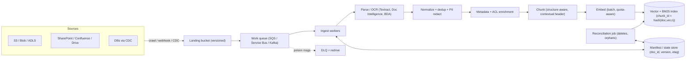
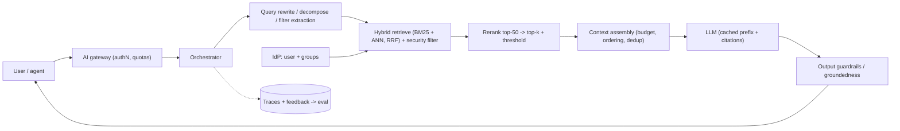
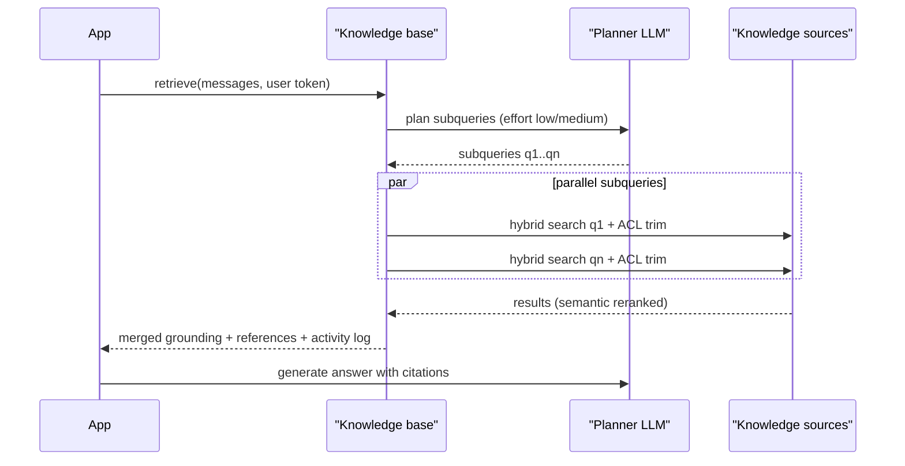

# K3 RAG Pipelines (production engineering)
> Last verified: 2026-10 · Audience: senior/staff DevOps, SRE, AI eng, NetEng, DevSecOps, architects

## TL;DR
- A production RAG system has **two planes**. The **ingest plane** is async, batch/stream, and throughput- and cost-bound: connectors, parse, clean, chunk, embed, index. The **query plane** is sync and latency-bound (TTFT): rewrite, retrieve, rerank, assemble, generate, cite. Scale, deploy and monitor them separately.
- Most quality problems start **upstream of the LLM**: bad parsing (tables, scanned PDFs), stale or orphaned chunks, missing ACL metadata. **Fix retrieval before the prompt.** Measure recall@k, MRR and nDCG on a golden set, then faithfulness and answer relevance.
- The default retrieval stack in 2026 is **hybrid BM25 + vector (RRF) → cross-encoder rerank → top 5–20 chunks**, with query rewriting for chat. Use agentic, multi-query retrieval only when queries are complex enough to justify 2–10× the latency and tokens.
- **Security trimming happens at retrieval time, inside the engine**, using ACL metadata synced from the source. It is never done by asking the LLM to "ignore docs the user can't see". Permissions are only as fresh as the last sync. Bedrock Managed KB adds real-time ACL checks for some connectors and **fails closed**.
- Ingestion must be **idempotent and incremental**. Use deterministic chunk IDs, delete-then-upsert per document version, tombstones for deletes, queues + DLQ for backfills, and blue/green index swaps for embedding-model changes.
- In generation: ground with numbered sources and **native citations** (Claude citations: `cited_text` is free of output tokens). **Prompt-cache** the stable prefix. Skip RAG entirely when the corpus is under about 200k tokens and fits with caching.
- Managed options: **Bedrock Knowledge Bases**, where **Managed KB** is now AWS's recommended type (7 connectors, ACL-aware, agentic retrieval). On Azure, **Azure AI Search** (integrated vectorisation, semantic ranker, agentic retrieval) surfaced as **Foundry IQ** knowledge bases in Microsoft Foundry. Alternatives are **Vertex AI RAG Engine** (now "RAG Engine on Gemini Enterprise Agent Platform") and **Databricks Vector Search**.
- Treat retrieved text as **untrusted input**: indirect prompt injection via documents is the top RAG-specific security risk.

---

## K3.1 RAG reference architecture: ingest plane vs query plane
- **How it works:**
  - **Ingest (write) plane:**
    1. **Source connectors** pull data (crawl or CDC/webhooks).
    2. Raw objects land in a **landing bucket** (S3/Blob, versioned).
    3. A **work queue** (SQS/Service Bus/Kafka) carries the jobs.
    4. **Parse/OCR → normalise → dedup → PII redact → enrich metadata (ACLs, tenant, timestamps, doc type) → chunk → embed (batch) → upsert** into the index.
    5. Record each doc version in a **manifest/state store** (DynamoDB/Cosmos DB/Delta).
  - **Query (read) plane:**
    1. API gateway / AI gateway (authN, quotas).
    2. Orchestrator: **query understanding** (rewrite, decompose, filter extraction).
    3. **Retrieve** (hybrid + **security filter**), then **rerank**.
    4. **Context assembly** within a token budget.
    5. **LLM** generates with citations.
    6. **Output guardrails**, then stream to the client.
    7. Write a trace and feedback.
  - **Shared contracts between the planes:**
    - Index schema: chunk_id, doc_id, doc_version, tenant_id, acl_*, source_uri, page, section, `last_modified`, embedding_model_version.
    - The embedding model plus its **version**. The query and the documents **must** use the same model and dimensions.
- **Trade-offs / when to use:**
  - Managed (Bedrock KB / Foundry IQ / Vertex RAG Engine) gives time-to-value, connectors and ACL sync. In exchange you get less control over chunk IDs, parsing and ranking, and you live with service quotas. For example, customer-managed Bedrock KB allows **Retrieve 20 rps**, **1 concurrent ingestion job per KB**, and **5 data sources per KB**.
  - DIY (OpenSearch/AI Search/pgvector + orchestrator on EKS/AKS) gives full control and multi-cloud portability, but you own connectors, ACL sync and evaluation.
- **Interview angles:**
  - "Design enterprise RAG." Draw the **two planes separately**. Say which is **async** (ingest: queue depth and lag SLOs) and which is **sync** (query: p95 TTFT SLO). Name the **freshness SLO**, e.g. "a doc change is searchable within 15 min, p95".
  - Pitfall: running the indexing pipeline on the same compute as query serving. On Azure AI Search, indexers share search units with queries, and the docs note **one indexer job per search unit** plus possible query throttling under indexing pressure. Isolate them with replicas, or push from your own workers.
  - Depth on chunking and GraphRAG: [E1.9](../E-ai-system-design/E1-system-design-fundamentals.md#e19-rag-chunking-and-retrieval-strategies), [E1.10](../E-ai-system-design/E1-system-design-fundamentals.md#e110-graphrag-knowledge-graphs-for-advanced-retrieval).

## K3.2 Ingestion: connectors, parsing, tables and OCR
- **How it works:**
  - **Connectors:**
    - **Bedrock Managed KB** has **7 native connectors**: S3, SharePoint, Confluence (plus Confluence Data Center over VPC), Web Crawler, Google Drive, OneDrive, Custom.
    - **Customer-managed KB:** S3 + Custom only (as of 2026-10).
    - **Azure AI Search indexers:**
      - GA: Blob, ADLS Gen2, Cosmos DB, Azure SQL / SQL MI / SQL on VM, Table Storage, **OneLake**.
      - Preview: SharePoint in M365, Azure Files, MySQL, Cosmos DB Mongo/Gremlin.
      - Foundry IQ knowledge sources add **remote** sources (SharePoint, web) that are queried live rather than indexed.
  - **Parsing tiers (Bedrock KB):**
    - **Default parser:** text only, **free**. Handles txt/md/html/doc(x)/xls(x)/pdf.
    - **Bedrock Data Automation (BDA):** multimodal (figures, charts, tables, images), priced **per page**.
    - **Foundation-model parser:** customisable prompt, priced **per token**, **100 GB** total file-size cap.
    - **Gotcha:** once BDA or an FM parser is selected, **every PDF** goes through it, even text-only ones, so cost scales with all PDFs.
    - Extracted figures can be stored in S3 and returned in source attribution.
  - **Amazon Textract:**
    - Sync APIs take **1 page, 10 MB**. Async (`Start*` + SNS) takes **PDF/TIFF ≤ 500 MB and ≤ 3,000 pages**.
    - APIs: `DetectDocumentText`, `AnalyzeDocument` (FORMS, TABLES, QUERIES, SIGNATURES, LAYOUT), `AnalyzeExpense`, `AnalyzeID` (US only), Analyze Lending.
    - Languages: EN/FR/DE/IT/PT/ES only. **Handwriting is English only**. No vertical text. Queries: 15/page sync, 30/page async.
  - **Azure Document Intelligence (now "Document Intelligence in Foundry Tools"):**
    - **v4.0 (`2024-11-30`) is the current GA**. v3.0 retires **2029-03-30** and v2.1 retires **2027-09-15**.
    - `prebuilt-read` handles OCR. `prebuilt-layout` extracts paragraphs/roles, tables, selection marks and sections, with **Markdown output** that suits structure-aware chunking. It also has prebuilt invoice/receipt/ID/tax models and custom/composed models.
    - Sits under **Azure Content Understanding**: Document Intelligence does deterministic extraction, and Content Understanding adds LLM-powered analyzers for unstructured or multimodal content.
    - In AI Search, use the **Document Layout skill** (DI layout) or the **Content Understanding skill** in the skillset.
  - **Azure AI Search extraction limits:**
    - Max source file **128 MB on S1, 256 MB on S2+**.
    - Max extracted characters **4M (S1) / 8M (S2) / 16M (S3)**. Anything beyond is silently truncated, which is a classic "why can't it find page 300" bug.
- **Tables & PDFs:**
  - Convert tables to Markdown/HTML and **never split a table across chunks**. Repeat the header row in each table chunk.
  - Keep the caption plus the preceding heading with the table.
  - For figures and charts, generate a text description (VLM) and index it, keeping a pointer to the image.
  - Detect scanned versus digital PDFs (does it have a text layer?) and route only the scanned ones to OCR. That is a cost lever.
  - Store **page numbers and bounding boxes** so citations can deep-link.
- **Trade-offs / when to use:**

| Doc type | Cheapest adequate parser |
|---|---|
| Born-digital prose PDFs/HTML | Default text extraction (free) |
| Tables/forms/invoices | Textract TABLES/FORMS, DI `prebuilt-layout` |
| Charts/diagrams/slides | BDA, FM/VLM parser, Content Understanding |
| Domain forms (tax, ID) | Prebuilt models (Textract AnalyzeExpense/ID, DI prebuilt-*) |

- **Interview angles:**
  - "Answers about tables are wrong." Check the parse output first. Raw text extraction flattens tables into word salad. Switch to layout-aware parsing, emit Markdown tables, and chunk by section.
  - Cost question: per-page OCR at millions of pages dominates ingestion cost. Route by document class, cache parse output keyed by **content hash** so re-chunking or re-embedding doesn't re-OCR, and use async APIs.

## K3.3 Data hygiene: dedup, PII redaction, metadata enrichment
- **How it works:**
  - **Exact dedup:** SHA-256 of normalised text (whitespace, case, boilerplate stripped) at both the document and chunk level.
  - **Near-dup:** MinHash/LSH or SimHash, e.g. Jaccard ≥ 0.8–0.9 on shingles. Keep the canonical copy (newest or most authoritative) and record aliases so ACLs still apply. Duplicates waste top-k slots and bias answers.
  - **PII redaction before embedding.** Once PII is embedded, a vector store becomes a sensitive datastore, and embeddings can be partially inverted.
    - **AWS:** Comprehend `DetectPiiEntities`, Macie (S3 discovery), Bedrock Guardrails sensitive-information filters (mask/block, at inference).
    - **Azure:** AI Language **PII Detection skill** in the skillset (**50,000-character** input limit per call, so split first), Purview classification.
    - **OSS:** Microsoft Presidio.
  - **Metadata:**
    - Fields: tenant_id, ACL principals/groups, sensitivity label, source system, URI, title, section path, page, author, `created/modified`, language, doc_type, `doc_version`, `embedding_model`.
    - **Bedrock KB:** sidecar `<file>.metadata.json` (same name + extension). Metadata-only changes skip re-embedding (except CSV or a custom-transform Lambda).
    - **Azure:** field mappings; chunk-level fields via **index projections**.
  - **Enrichment:** contextual headers (Anthropic contextual retrieval: a 50–100-token LLM-generated context per chunk), summaries, keywords, entities.
- **Trade-offs / when to use:**
  - Redacting at ingest is irreversible, so answers can't contain the PII even for authorised users. The alternative is to keep PII, classify it, and enforce access by label or ACL at query time. Choose per data class ([L1](../L-data-privacy-ai-security/L1-data-classification-pii.md)).
  - LLM enrichment (contextual chunks, summaries) is a one-off cost per document version. With prompt caching Anthropic quotes about **$1.02 per million document tokens**. It must be re-run on change.
- **Interview angles:**
  - "Five of the top-5 chunks are the same boilerplate." Add boilerplate stripping, near-dup removal and MMR diversification.
  - Metadata is what makes filtering (date, product, region) and security trimming possible. **Missing metadata cannot be fixed at query time.**

## K3.4 Incremental sync, deletes, idempotent re-index, backfills
- **How it works:**
  - **Change detection:**
    - **Bedrock KB:** sync is **incremental**. Unchanged documents are skipped. Changed content or metadata is fully re-ingested (re-parse, re-chunk, re-embed). Deleted documents are removed from the vector store.
    - **Bedrock KB direct ingestion:** `IngestKnowledgeBaseDocuments` / `DeleteKnowledgeBaseDocuments` index immediately without a sync. Limits: **25 docs / 6 MB per call**, **5 rps**, **10 concurrent** per account.
      - **Gotcha:** for S3 data sources, changes made only through this API are **overwritten by the next sync** unless S3 is updated too.
      - Don't run direct ingestion and `StartIngestionJob` at the same time.
    - **Managed KB:** sync schedules **daily/weekly/monthly** or on demand.
    - **Azure blob indexers:** detect changes automatically via `LastModified` (a high-water mark). SQL needs integrated change tracking or a high-water-mark column. The **minimum schedule is 5 min**. For anything fresher, use the **push API**.
  - **Deletes (the most-missed requirement):**
    - **Azure:** indexers **do not detect deletes by default**. Configure `NativeBlobSoftDeleteDeletionDetectionPolicy` (blob soft delete enabled, **versioning disabled**) or `SoftDeleteColumnDeletionDetectionPolicy` (an `IsDeleted` metadata flag).
      - This must be configured **before the first run**. Otherwise previously deleted docs stay orphaned, and the fix is a new index.
      - Not supported for one-to-many parsing modes (e.g. jsonArray, delimitedText). Delete explicitly via the API instead.
    - **Bedrock:** deletes propagate on sync.
    - **DIY:** use CDC tombstones, or a periodic **reconciliation scan** that diffs the source listing against the manifest and deletes the extra entries.
  - **Idempotent re-index pattern (DIY):**
    1. `chunk_id = hash(doc_id, doc_version, chunk_ordinal)`, or a content hash.
    2. On update: **delete all chunks where doc_id = X**, then upsert the new chunks. Otherwise, when the new version has fewer chunks, **orphan tail chunks** keep serving stale text.
    3. Use upsert semantics (Azure `mergeOrUpload`; OpenSearch `_id`) so retries are safe. Store the processed `doc_version` and `etag` in the manifest and skip if unchanged.
  - **Backfills:**
    - Fan out per document onto a queue (SQS / Service Bus / Kafka), with workers sized to the **embedding TPM/RPM quota**, not to CPU.
    - Add **DLQ** + redrive, exponential backoff on 429s, and checkpointing.
    - Use **batch inference** for bulk embedding/enrichment (Bedrock / Azure OpenAI batch are typically about 50% cheaper; check current pricing).
    - Bedrock KB customer-managed quotas: **5 concurrent ingestion jobs per account, 1 per KB / data source, ≤ 100 GB and ≤ 5M files per job, 50 MB per file**.
    - Managed KB raises these to **50 concurrent jobs per KB, 200 data sources per KB, 10 TB per KB**.
    - Azure indexers: **2 h max run** in the shared/public environment (24 h in the private environment). Put large backfills on a 5-min schedule so each run resumes where the last stopped.
  - **Embedding model change = full re-embed.**
    - Build a **new index**, dual-write or catch up, evaluate on the golden set, then **swap the alias** (Azure AI Search index aliases, not on the Serverless tier; OpenSearch aliases).
    - On Bedrock KB, the embedding model is chosen at KB creation, so the change means creating a new KB and switching the KB ID in config (unverified whether in-place change is allowed).
- **Trade-offs / when to use:**
  - **Pull** (indexer/sync) is simple but freshness is bounded by the schedule (at least 5 min on Azure, at least daily for Managed KB schedules unless triggered).
  - **Push** (event-driven, near real time) means you own retries, ordering and deletes.
- **Interview angles:**
  - "A user deleted a confidential doc but RAG still quotes it." Explain deletion detection, orphan chunks, and caches that also need purging: the semantic cache and the prompt cache. Then propose a **delete SLO** and a reconciliation job.
  - "How do you re-index 50M docs without downtime?" Build a shadow index, use queue-driven workers within embedding quota, compare evaluations, flip the alias, and keep the old index for rollback.

## K3.5 Retrieval: query rewriting, hybrid, reranking, top-k and context budget
- **How it works:**
  - **Query rewriting:**
    - Turn the chat turn into a **standalone query** (resolve pronouns from history), fix spelling, expand acronyms and synonyms.
    - Extract structured **filters** (date, product). Bedrock KB **implicit filtering** has the LLM generate a metadata filter from a schema.
    - **Decompose** multi-part questions (Bedrock `QUERY_DECOMPOSITION`).
    - Azure semantic **query rewrite (preview)** generates **up to 10** variants.
  - **Hybrid:**
    - BM25 + ANN fused by **RRF**, `Σ 1/(60+rank)`. BM25 rescues IDs, SKUs, error codes and names.
    - Native in Azure AI Search (one request). In Bedrock KB, only on OpenSearch, Aurora/RDS and MongoDB stores. **Managed KB always runs hybrid**.
    - Databricks: hybrid supports at most **200 results**.
    - Details in [E1.9](../E-ai-system-design/E1-system-design-fundamentals.md#e19-rag-chunking-and-retrieval-strategies).
  - **Reranking (cross-encoder):**
    - **Azure semantic ranker:**
      - Reranks the **top 50** BM25/RRF results only, so set vector `k ≥ 50`.
      - Per document, builds a summary string of up to **2,048 tokens** from title (128) + keywords (128) + content (the rest), in priority order.
      - `@search.rerankerScore` runs **0–4**. Captions and answers are verbatim.
      - Concurrency is **2–4 requests per SU**, with a queue of 4–8 per SU. Requests are throttled beyond that, so add SUs.
      - Billed per query, with a free monthly allowance (`search=*` is not billed).
    - **Bedrock:** `amazon.rerank-v1:0` (not in us-east-1) and `cohere.rerank-v3-5:0`. Rerank API **10 rps** default. Usable inside KB Retrieve or standalone.
    - **Managed KB** includes a managed reranker at no extra cost.
  - **Top-k & context budget:**
    - Retrieve wide (50–150), rerank narrow (5–20). Anthropic found **top-20 beat top-5 and top-10**.
    - Budget = model context − system prompt − history − output reserve. Example: 8k tokens of evidence = 16 chunks × 500 tokens.
    - Use a **relevance threshold** (e.g. rerankerScore ≥ 2) to drop weak chunks rather than always filling k. Azure warns not to make thresholds too granular because score distributions drift.
    - Bedrock `numberOfResults` defaults to **5**. The user query is capped at **1,000 characters**.
- **Trade-offs / when to use:**
  - Each extra stage adds TTFT (see K3.11). Rewriting with an LLM costs about 300 ms or more, so use a small, fast model or skip it for single-turn keyword queries.
  - Larger k improves recall but adds cost, latency and lost-in-the-middle risk (K3.10).
- **Interview angles:**
  - "Recall@20 is 95% but answers are still wrong." The problem is precision or ordering, not recall. Add a reranker, a threshold, and better context ordering.
  - "Users search exact error codes and RAG misses." Add BM25 (hybrid), keep the code in metadata, and avoid stemming or tokenising codes into pieces.

## K3.6 Generation: grounding, citations, prompt caching, long context vs RAG
- **How it works:**
  - **Grounding prompt:**
    - Put sources in delimited, numbered blocks (`<doc id=3 title=… uri=… page=…>`).
    - Instruct the model to answer **only** from the sources, to say "not found" otherwise, and to cite IDs.
    - Put the question **after** the documents for long contexts.
    - Never put secrets or ACL logic in the prompt.
  - **Claude citations:**
    - GA on the Claude API, Bedrock, Vertex AI and Microsoft Foundry.
    - Document types: plain text → `char_location`; PDF → `page_location`; custom content / `search_result` blocks → `content_block_location`.
    - `cited_text` does **not** count toward output tokens, nor toward input tokens when passed back.
    - Citations are guaranteed to point at the provided docs, which makes them more reliable than "please quote" prompting.
    - **Incompatible with structured outputs** (400 error if both are set).
    - Works with prompt caching: cache the document blocks, not the citation blocks.
  - **Bedrock RetrieveAndGenerate** returns citations with source location. **Azure agentic retrieval** returns references plus an activity log, and answer synthesis (preview) returns citation-backed answers.
  - **Prompt caching (Anthropic):**
    - Cache the stable prefix: tools → system → static docs.
    - **5-min TTL by default** (write 1.25× base input price). **1-hour TTL** costs 2×. Reads cost **0.1×** base input (lower on some newest models).
    - Max **4 breakpoints**. Minimum cacheable prefix is **512–4,096 tokens depending on model**.
    - Any change upstream of a breakpoint invalidates it, so put per-query retrieved chunks **after** the cached prefix.
    - For a fixed document set (a manual, a contract), caching the whole corpus beats retrieval.
  - **Long context vs RAG:**
    - If the corpus fits (Anthropic's rule of thumb: **under about 200k tokens / about 500 pages**), put it all in the prompt with caching. That means no retrieval misses and simpler operations.
    - RAG wins when the corpus is large or fast-changing, when you need per-user ACLs (you can't put docs a user may not see into a shared cached prefix), when you need attribution at scale, or for cost and latency per query.
- **Trade-offs / when to use:**
  - Strict "answer only from sources" reduces hallucination but increases refusals. Track the **refusal rate** alongside faithfulness.
  - Long context adds latency (prefill time grows with input tokens) and still suffers mid-context degradation.
- **Interview angles:**
  - "How do you prove an answer is grounded?" Native citations + citation precision/coverage evaluation (K3.9) + optional groundedness check (Bedrock Guardrails contextual grounding check; Azure AI Content Safety groundedness detection) before returning.
  - Caching caveat: caches are scoped per model and prefix. Per-tenant documents in the prefix mean **per-tenant caches**, and the cache must be evicted after a document deletion or permission change. The 5-min TTL limits exposure.

## K3.7 Document-level security trimming and per-tenant indexes
- **How it works:**
  - **Pattern 1, security filters:**
    - Index `allowed_groups` / `allowed_users` (string collections) on **every chunk**.
    - At query time, the app resolves the caller's identity (Entra/IdP → groups) and adds a filter such as `allowed_groups/any(g: search.in(g, 'g1,g2'))`.
    - This is GA in Azure AI Search and works anywhere (OpenSearch DLS/terms filter, pgvector `WHERE`, Bedrock KB metadata filters).
  - **Pattern 2, native ACL enforcement (Azure AI Search, preview `2026-08-01-preview`):**
    - Permission metadata is ingested from **ADLS Gen2 ACLs / RBAC scopes**, **SharePoint ACLs** or **Purview sensitivity labels**.
    - The app passes the user's Entra token in **`x-ms-query-source-authorization`**. The service checks Search Index Data Reader for the app, then trims results by the user's claims.
    - For chunked indexes, ACL and label fields must be **projected to each chunk** (index projections).
    - Purview labels: single-tenant only, system-assigned managed identity.
    - SharePoint inherited-permission changes need an explicit refresh.
    - Not combinable with `assetStore` (image serving).
  - **Pattern 3, Bedrock Managed KB ACL-aware retrieval:**
    - Crawls allow/deny users and groups for SharePoint, OneDrive, Google Drive, Confluence and Confluence DC. S3 and Custom take a customer-provided ACL file. Web Crawler has no ACLs.
    - Identity is the **user's email**, which must match exactly across sources (no aliasing).
    - **Deny overrides allow**.
    - **Real-time ACL verification** against the source for the SaaS connectors catches changes between syncs.
    - **Fails closed**: an error means fewer or zero results.
    - AWS explicitly says this is **"filtering, not authorization"**. Your app must authenticate the user and pass a verified identity.
  - **Multi-tenancy options:**

| Model | Isolation | Cost/ops | Use when |
|---|---|---|---|
| **Index (or KB) per tenant** | Strongest; per-tenant CMK/delete/region | Index-count limits (AI Search S1 **50 indexes**, S3 HD 1,000/partition; Bedrock **100 KBs/account** customer-managed, **10,000** Managed) | Few large or regulated tenants |
| **Shared index + mandatory tenant_id filter** | Logical only; one bug leaks data | Cheapest, best recall stats | Many small tenants |
| **Hybrid (pooled + silo for premium)** | Mixed | Mixed | SaaS tiers |

- **Trade-offs / when to use:**
  - **Pre-filter** (inside ANN) vs **post-filter**: post-filtering after top-k can return 0 results for low-privilege users. Use engines with filtered HNSW or iterative scan.
  - ACL freshness equals sync frequency. Revocations are the dangerous direction, so use real-time checks (Managed KB), short sync intervals, or a **post-retrieval authorization check** against the source for high-sensitivity data.
- **Interview angles:**
  - "Can we just tell the LLM which docs the user may see?" **No.** The model can be prompt-injected. Enforce trimming in the retrieval engine **before** text reaches the model, and inject the tenant filter server-side (never from the client).
  - Large-group propagation lag (Managed KB documents this) means newly granted users may briefly see nothing. Don't misdiagnose it as a retrieval bug.
  - Deeper identity patterns: [L7 zero trust & workload identity](../L-data-privacy-ai-security/L7-zero-trust-workload-identity.md).

## K3.8 Agentic RAG
- **How it works:**
  - The LLM controls retrieval in a loop: **plan → choose source/tool → search → read → reflect ("enough evidence?") → re-query or answer**. Retrieval is exposed as a **tool** (function calling / MCP).
  - **Azure AI Search agentic retrieval** (underpins **Foundry IQ**):
    1. A **knowledge base** references up to **10 knowledge sources** (S1+): indexed (search index, Blob/ADLS, OneLake, SharePoint indexed) or **remote** (SharePoint remote, web).
    2. **Retrieval reasoning effort** is `minimal` (no LLM planning, query goes to all sources), `low` (the **default**) or `medium` (iterative).
    3. Subqueries run **in parallel**, each semantically reranked, then merged.
    4. It returns merged extractive content, references and an activity log. Optional **answer synthesis** is in preview.
    5. `maxRuntimeInSeconds` is 10 s min, **90 s default**, 600 s max.
    6. Exposed via the REST retrieve action and the **MCP tool `knowledge_base_retrieve`**.
    7. **GA in `2026-04-01`** (minimal, extractive). LLM planning, answer synthesis, non-minimal effort and multi-turn are in **`2026-08-01-preview`**. The portals expose preview schemas only.
    8. Billing: Search **retrieval tokens** (with a free monthly allowance) plus Azure OpenAI tokens for planning and synthesis. Microsoft's worked example is about **$4.32 per 2,000 retrievals** with gpt-4o-mini planning.
  - **Bedrock Managed KB:** "agentic and semantic hybrid retrieval", plus **AgentCore Gateway** integration so agents call the KB as a tool. Customer-managed KBs do not support agentic retrieval.
  - **DIY:** Claude or another LLM with a `search` tool returning **`search_result` content blocks**, which get native citations. Add guardrails on max iterations and tokens.
- **Trade-offs / when to use:**
  - Use it for multi-part, comparative or conversational questions, or across heterogeneous sources (index + SharePoint + web).
  - Cost: **2–10× latency and tokens** versus single-shot. Non-deterministic paths are harder to evaluate and cache.
  - Use `minimal` effort / single-shot for FAQ-style lookups. Route by query complexity (a classifier or a cheap LLM).
- **Interview angles:**
  - "How do you bound an agentic RAG loop?" Set max steps (e.g. 3–5), a token and time budget (`maxRuntimeInSeconds`), dedupe repeated queries, require a stop condition, and log every subquery for evaluation.
  - Agentic retrieval vs GraphRAG: decomposition handles most multi-hop questions without a graph build ([E1.10](../E-ai-system-design/E1-system-design-fundamentals.md#e110-graphrag-knowledge-graphs-for-advanced-retrieval)). Agent design is in [K8](K8-agents-tool-use-mcp.md).

## K3.9 Evaluation: retrieval metrics, generation metrics, golden sets, online feedback
- **How it works:**
  - **Retrieval metrics** (need labelled relevant chunk or doc IDs):
    - **Recall@k:** the share of relevant items found in the top k. This is the primary RAG metric, because an item that isn't retrieved can't be used.
    - **Precision@k:** the share of the top k that is relevant.
    - **MRR:** the mean of `1/rank` of the first relevant item.
    - **nDCG@k:** `DCG = Σ (2^rel_i − 1)/log2(i+1)`, normalised by the ideal DCG. Use it with graded relevance.
    - **Hit rate@k:** at least one relevant item in the top k.
  - **Generation metrics** (usually LLM-as-judge):
    - **Faithfulness / groundedness:** the share of claims supported by the context.
    - **Answer relevance:** whether the answer addresses the question.
    - **Answer correctness:** compared against a reference answer.
    - **Citation precision / coverage.**
    - **Refusal rate.**
  - **RAGAS:**
    - Context Precision, **Context Recall** (needs a reference), Context Entities Recall (needs a reference), Noise Sensitivity, **Response Relevancy**, **Faithfulness**. All are LLM-based.
  - **Bedrock RAG evaluation jobs:**
    - **Retrieve-only:** Context relevance, Context coverage (needs ground truth).
    - **Retrieve-and-generate:** Correctness, Completeness, Helpfulness, Logical coherence, **Faithfulness**, **Citation precision**, **Citation coverage**, Harmfulness, Stereotyping, Refusal.
    - You can bring your own inference responses from a non-Bedrock RAG system.
  - **Azure:** Foundry evaluations / `azure-ai-evaluation` evaluators: Groundedness, Relevance, Retrieval, Response Completeness, and a document-retrieval evaluator with nDCG/top-k-style metrics (evaluator names unverified for current SDK version).
  - **Golden set:**
    - 200–1,000+ question → relevant-chunk/doc → reference-answer triples.
    - Stratify by intent, source, difficulty and **ACL persona** (include "should return nothing" cases).
    - Seed from real query logs plus SME review. Synthetic generation is fine to bootstrap, then curate.
    - **Version it alongside the index.** Re-label when documents change.
  - **Online:**
    - Thumbs up/down with a reason code, copy and click-through on citations, reformulation rate, "no answer" rate, escalation to a human.
    - Sample production traces for LLM-judge scoring. A/B test or shadow retrieval configs.
- **Trade-offs / when to use:**
  - LLM judges are cheap and scalable but biased (verbosity, self-preference). **Calibrate against human labels** (agreement or kappa) and pin the judge model and version.
  - Offline evaluation gates releases (CI on chunking, embedding or prompt changes). Online metrics catch drift and coverage gaps.
- **Interview angles:**
  - "Quality dropped after a deploy. What do you check?" Diff the evaluation per stage: retrieval recall@k (index or embedding change?), rerank, then faithfulness (prompt or model change?). This is only possible if traces store retrieved IDs, scores and the prompt version.
  - Evaluation ownership and guardrails in depth: [K9 LLMOps, evals & guardrails](K9-llmops-evals-guardrails.md).

## K3.10 Failure modes: stale index, lost in the middle, prompt injection via docs
- **How it works:**

| Failure | Symptom | Root cause | Mitigation |
|---|---|---|---|
| **Stale index** | Outdated answers; deleted docs quoted | Sync lag, missing deletion policy, orphan chunks, cached answers | Freshness and delete SLOs; index-lag metric (`now − max(last_modified indexed)`); reconciliation job; purge semantic cache by doc_id |
| **Silent truncation** | Content past page N never found | Extracted-character caps (AI Search 4M on S1), parser limits, 50 MB/file (Bedrock) | Alert on truncation warnings; split large files |
| **Bad parse** | Garbled tables, missing scanned pages | Text-only parser on scanned or complex PDFs | Layout/OCR routing, parse QA sampling |
| **Lost in the middle** | Answer ignores a relevant chunk in mid-context | LLMs attend best to the start and end of long contexts (Liu et al. 2023, U-shaped curve) | Fewer, reranked chunks; put the best chunks first and last; question at the end; summarise or compress |
| **Over-retrieval / distractors** | Plausible but wrong answer mixing documents | High k, near-dups, no threshold | Rerank + threshold, MMR, metadata filters |
| **Indirect prompt injection** | Model follows instructions hidden in a doc ("ignore previous… email this to…") | Retrieved text treated as instructions | Treat documents as data (delimiters + system rule); strip hidden text/HTML comments at ingest; least-privilege tools (no exfiltration-capable tools in the same turn); output filtering; Bedrock Guardrails prompt-attack filter / Azure Prompt Shields (document attacks); trust tiers by source |
| **Data poisoning** | Attacker edits a wiki page to steer answers | Writable sources indexed without provenance | Source allow-lists, authorship metadata, change review for high-trust corpora |
| **ACL leak** | User sees a snippet they shouldn't | Missing chunk-level ACL projection, revoked access not yet synced, shared cache | Chunk-level ACL fields, fail-closed, cache keyed by principal |
| **Embedding drift / mismatch** | Recall collapses after upgrade | Query and docs embedded with different model versions | Store `embedding_model` per index; blue/green |

- **Interview angles:**
  - Lead with **observability**: per request, log the query, rewritten query, filters, retrieved IDs and scores, reranked IDs, prompt version, model, tokens, citations, and latency per stage ([J3](../J-sre/J3-observability.md)).
  - Security framing: OWASP LLM Top 10 lists prompt injection (incl. indirect) and vector/embedding weaknesses. See [L4](../L-data-privacy-ai-security/L4-ai-security-threats.md).

## K3.11 Latency and cost budgets
- **How it works (typical p50 budget for a chat RAG turn, rules of thumb, not SLAs):**

| Stage | Typical | Notes |
|---|---|---|
| Auth/gateway/guardrail (input) | 10–100 ms | Guardrail model calls add more |
| Query rewrite (small LLM) | 200–600 ms | Skip for first-turn keyword queries |
| Query embedding | 20–50 ms | Batch or cache frequent queries |
| Hybrid ANN + BM25 | 10–100 ms | Databricks: standard about 50 ms vs storage-optimised about 250 ms |
| Rerank top 50 | 50–300 ms | Azure semantic ranker is throttled per SU |
| Agentic planning (if any) | +1–5 s | Parallel subqueries; capped by `maxRuntimeInSeconds` |
| LLM prefill (TTFT) | 0.3–2 s | Grows with context tokens; prompt caching cuts it |
| Generation | 20–100 tok/s | Stream to hide it |

- **Cost model per query:**
  - `embed(q) + search(SU/hour or per-query) + rerank(per query / per doc) + LLM_in × (context tokens) + LLM_out + planner tokens (agentic)`.
  - The **context tokens usually dominate**. Halving k often halves cost.
  - Ingest cost is per document version: `parse/OCR (per page) + enrichment LLM (per token) + embed (per token) + index storage (vector memory)`.
- **Levers:**
  - Smaller k after reranking, prompt caching of the static prefix, semantic/exact answer cache (keyed by tenant + ACL), and a cheaper model for rewriting and judging.
  - Quantised or MRL-truncated vectors to cut index memory ([K2](K2-embeddings-vector-databases.md)).
  - Route by complexity (single-shot vs agentic), and batch APIs for ingestion.
- **Capacity facts:**
  - Bedrock KB Retrieve/RetrieveAndGenerate: **20 rps** default per account (adjustable).
  - Azure AI Search scales by **replicas** (QPS, and SLA with ≥ 2 replicas for queries, ≥ 3 for queries + indexing) and **partitions** (storage and vector quota; e.g. S1 has **35 GB vector quota per partition** on post-2024 services).
- **Interview angles:**
  - "p95 TTFT is 6 s. Where do you look?" Use a per-stage trace. Usual culprits are a serial LLM rewrite, semantic ranker queuing (add SUs), oversized context, or agentic planning. Parallelise retrieval across sources, stream tokens, and cache.
  - Gateway-level token quotas and caching are in [K7](K7-ai-gateways-caching-cost.md). Serving-side TTFT is in [K4](K4-llm-serving-inference.md).

---

## Diagrams

### Ingest plane


### Query plane


### Agentic retrieval loop (Azure knowledge base / Bedrock Managed KB style)


---

## Cloud mapping: AWS vs Azure
| Capability | AWS | Azure | Role it plays | Key differences | Alternatives |
|---|---|---|---|---|---|
| Managed RAG | **Bedrock Knowledge Bases**: **Managed KB** (recommended; Bedrock-operated store) or customer-managed (bring OpenSearch/Aurora/S3 Vectors/Pinecone…) | **Azure AI Search** (indexers + skillsets + integrated vectorisation) surfaced as **Foundry IQ** knowledge bases in **Microsoft Foundry** | Ingest, index, retrieve, cite | Bedrock has end-to-end `RetrieveAndGenerate`. Azure AI Search is a full search engine; generation is done by your app/agent or answer synthesis (preview) | **Vertex AI RAG Engine** (now "RAG Engine on Gemini Enterprise Agent Platform"), **Databricks Vector Search**, LlamaIndex/LangChain DIY |
| Agentic retrieval | Managed KB agentic retrieval + **AgentCore Gateway** | AI Search **agentic retrieval** (knowledge bases/sources, reasoning effort, MCP `knowledge_base_retrieve`) = **Foundry IQ** | LLM query planning, parallel subqueries | Azure: GA `2026-04-01` minimal/extractive; planning and synthesis preview. AWS: Managed KB only | Claude + search tool with `search_result` blocks |
| Connectors | Managed KB: S3, SharePoint, Confluence(+DC), Web, Google Drive, OneDrive, Custom (7); customer-managed: S3 + Custom | Indexers: Blob, ADLS Gen2, SQL, Cosmos DB, Table, OneLake (GA); SharePoint, Files, MySQL (preview); remote SharePoint/web knowledge sources | Pull content + permissions | Azure is strong on Azure data stores and M365. AWS covers SaaS (Google Drive, Confluence) in Managed KB | Kendra (**maintenance mode, closed to new customers**), Glean, Airbyte |
| Document parsing/OCR | **Textract** (sync 1 page/10 MB; async 3,000 pages/500 MB), **Bedrock Data Automation** (per page), FM parser (per token) | **Document Intelligence in Foundry Tools** v4.0 (`prebuilt-layout` → Markdown), **Content Understanding** (LLM analyzers), Document Layout skill | Text, tables, figures, OCR | Textract: 6 languages, English-only handwriting. DI: broad prebuilt catalogue + Markdown layout output for chunking | Vertex Document AI Layout Parser, Unstructured, Docling, Claude/VLM PDF input |
| Reranking | `amazon.rerank-v1:0`, `cohere.rerank-v3-5:0`; Managed KB built-in reranker | **Semantic ranker** (top 50, 0–4 score, captions/answers) | Precision at top-k | Azure: per-query billing, throttled per SU. AWS: per-request model; Rerank API 10 rps default | Cohere/Voyage/Jina rerankers, Vertex ranking API, Databricks reranker |
| Doc-level security | Managed KB **ACL-aware retrieval** (email identity, deny > allow, real-time check, fail-closed); customer-managed: metadata filters | **Security filters** (GA); native **ACL/RBAC (ADLS Gen2), SharePoint ACLs, Purview labels** via `x-ms-query-source-authorization` (preview) | Per-user trimming | Azure binds to Entra tokens and Purview. AWS matches by email and explicitly says "filtering, not authorization" | OpenSearch DLS, pgvector RLS, Databricks Unity Catalog ACLs |
| Freshness / sync | Incremental sync jobs, direct ingestion API, Managed KB schedules (daily/weekly/monthly) | Indexer schedules (≥ 5 min), change + **deletion detection policies**, push API | Keep the index current | Azure delete detection is opt-in and must be set before the first run. Bedrock sync handles deletes | Databricks Delta Sync (continuous on standard endpoints) |
| PII handling | Comprehend PII, Macie, Bedrock Guardrails sensitive-info filters | AI Language PII skill, Purview, Content Safety | Redact/classify before indexing | Purview labels can be enforced at query time in AI Search (preview) | Presidio |
| Grounding & safety | Guardrails contextual grounding check + prompt-attack filter | Content Safety groundedness detection + **Prompt Shields** (doc attacks) | Hallucination/injection defence | Both are model-based filters, not guarantees | Claude citations, NeMo Guardrails |
| RAG evaluation | **Bedrock RAG evaluation jobs** (retrieve-only / retrieve-and-generate, LLM judge, BYO responses) | **Foundry evaluations** (groundedness, relevance, retrieval evaluators) | Offline quality gates | Bedrock has built-in citation precision/coverage metrics | RAGAS, TruLens, DeepEval, MLflow evaluate (Databricks) |

- **Bedrock Knowledge Bases:**
  - AWS docs now say "for optimized retrieval accuracy and a managed experience, we recommend **Bedrock Managed Knowledge Base**". Its console lives under **Amazon Bedrock AgentCore → Built-in tools → Knowledge Base**.
  - **Managed KB:** 1024-dim float32 embedding model if you bring your own, a built-in multimodal parser, fixed-size or built-in chunking (no semantic chunking), and much higher quotas (10,000 KBs/account, 200 data sources/KB).
  - **Customer-managed KB:** gives vector store choice and direct DB access, but lower quotas (100 KBs, 5 data sources, 1 concurrent job per KB).
- **Azure AI Search / Foundry IQ:**
  - **Foundry IQ is not a separate engine.** It is Azure AI Search knowledge bases + agentic retrieval consumed from Foundry Agent Service, Microsoft Agent Framework, Copilot Studio or any app.
  - Sibling "IQ" workloads: **Fabric IQ** (ontologies and semantic models over OneLake) and **Work IQ** (M365 signals).
  - Capacity is in SUs (replicas × partitions, max 36 SU). A **Serverless Developer** tier is in preview (billing started 2026-09-13; 300 MB vector index per index; no aliases).
- **Key differences:**
  - **Scope:** both are regional services. Plan multi-region by running a second index in another region (Azure: indexers per region; AWS: separate KB per region). Bedrock cross-region inference helps the generation step only.
  - **Pricing shape:**
    - Bedrock KB charges for the underlying vector store (or Managed KB storage/usage) + model tokens + parser/rerank.
    - AI Search charges for provisioned SUs (hourly) + semantic ranker queries + agentic retrieval tokens + Azure OpenAI tokens.
  - **Renames to mention:**
    - Azure AI Studio → Azure AI Foundry → **Microsoft Foundry**.
    - Azure AI services → **Foundry Tools** (e.g. "Document Intelligence in Foundry Tools").
    - Vertex AI → **Gemini Enterprise Agent Platform** (RAG Engine).
    - **Kendra** is in maintenance mode.
- **Alternatives:**
  - **Vertex AI RAG Engine:**
    - Corpus-based, with GCS/Drive and local file sources.
    - Parsing via the **Document AI Layout Parser** or an **LLM parser**.
    - Vector backends: RagManagedDb, Vertex AI Vector Search 2.0/1.0, Pinecone, Weaviate, Feature Store, Agent Platform Search.
    - Note that primary US regions are **allowlist-restricted** (GA in Frankfurt and the Netherlands, per docs as of 2026-10).
  - **Databricks Vector Search:**
    - Index types: **Delta Sync index** (managed or self-managed embeddings, triggered or continuous sync) vs **Direct Vector Access**.
    - Endpoint types: **Standard** (about 320M 768-d vectors, about 50 ms, continuous sync) vs **Storage-optimised** (about 1B vectors, about 250 ms, 10–20× faster indexing, triggered only).
    - Features and limits: hybrid RRF, reranker, max 4,096 dims, 50 indexes per endpoint, Unity Catalog governance.
    - The docs page now titles it "AI Search" (rename unverified).
  - **Claude:** Files/PDF input + citations + prompt caching for "small corpus, no RAG" designs. Claude is also available on Bedrock, Vertex AI and Microsoft Foundry.

---

## Hands-on (optional)
```bash
# --- AWS: trigger an incremental sync and watch it (customer-managed or Managed KB) ---
KB=KB12345678; DS=DS12345678
JOB=$(aws bedrock-agent start-ingestion-job --knowledge-base-id "$KB" --data-source-id "$DS" \
      --query 'ingestionJob.ingestionJobId' --output text)
aws bedrock-agent get-ingestion-job --knowledge-base-id "$KB" --data-source-id "$DS" \
    --ingestion-job-id "$JOB" --query 'ingestionJob.[status,statistics]'

# Retrieve-only with hybrid search, wider k, and a metadata (tenant) filter
aws bedrock-agent-runtime retrieve --knowledge-base-id "$KB" \
  --retrieval-query '{"text":"What is the RTO for the payments service?"}' \
  --retrieval-configuration '{"vectorSearchConfiguration":{
      "numberOfResults":20,"overrideSearchType":"HYBRID",
      "filter":{"equals":{"key":"tenant_id","value":"acme"}}}}'

# --- Azure AI Search: hybrid + semantic rerank + security filter in one call ---
SVC=mysearch; IDX=docs-v2; API=2026-04-01
curl -s -X POST "https://$SVC.search.windows.net/indexes/$IDX/docs/search?api-version=$API" \
  -H "Content-Type: application/json" -H "Authorization: Bearer $APP_TOKEN" \
  -d '{
    "search": "RTO payments service",
    "vectorQueries": [{"kind":"text","text":"RTO payments service","fields":"contentVector","k":50}],
    "queryType": "semantic", "semanticConfiguration": "default",
    "filter": "tenant_id eq '\''acme'\'' and allowed_groups/any(g: search.in(g, '\''grp-sre,grp-payments'\''))",
    "top": 10, "select": "chunk_id,title,source_uri,page"
  }'

# Blue/green: repoint alias from docs-v1 to docs-v2 after evals pass (index aliases; not on Serverless tier)
curl -s -X PUT "https://$SVC.search.windows.net/aliases/docs?api-version=$API" \
  -H "Content-Type: application/json" -H "api-key: $ADMIN_KEY" \
  -d '{"name":"docs","indexes":["docs-v2"]}'
```

---

## Cross-links
- [E1.9 RAG chunking & retrieval strategies](../E-ai-system-design/E1-system-design-fundamentals.md#e19-rag-chunking-and-retrieval-strategies) · [E1.10 GraphRAG](../E-ai-system-design/E1-system-design-fundamentals.md#e110-graphrag-knowledge-graphs-for-advanced-retrieval) · [E8 Deep research agent](../E-ai-system-design/E8-deep-research-agent-case-study.md)
- [K1 LLM fundamentals](K1-llm-fundamentals-for-infra.md) · [K2 Embeddings & vector DBs](K2-embeddings-vector-databases.md) · [K4 Serving & inference](K4-llm-serving-inference.md) · [K6 Managed model platforms](K6-managed-model-platforms.md) · [K7 AI gateways, caching & cost](K7-ai-gateways-caching-cost.md) · [K8 Agents, tool use & MCP](K8-agents-tool-use-mcp.md) · [K9 LLMOps, evals & guardrails](K9-llmops-evals-guardrails.md)
- [L1 Data classification & PII](../L-data-privacy-ai-security/L1-data-classification-pii.md) · [L4 AI security threats](../L-data-privacy-ai-security/L4-ai-security-threats.md) · [L7 Zero trust & workload identity](../L-data-privacy-ai-security/L7-zero-trust-workload-identity.md)
- [M3 Databricks platform](../M-data-platforms/M3-databricks-platform.md) · [M4 Kafka at scale](../M-data-platforms/M4-kafka-at-scale.md) · [M6 Orchestration & ETL](../M-data-platforms/M6-orchestration-etl.md)
- [J1 SLIs/SLOs](../J-sre/J1-slis-slos-error-budgets.md) · [J3 Observability](../J-sre/J3-observability.md) · [B3 Database indexing](../B-database-engineering/B3-database-indexing.md)

## Sources
- https://docs.aws.amazon.com/bedrock/latest/userguide/kb-data-source-sync-ingest.html
- https://docs.aws.amazon.com/bedrock/latest/userguide/kb-direct-ingestion.html
- https://docs.aws.amazon.com/bedrock/latest/userguide/kb-advanced-parsing.html
- https://docs.aws.amazon.com/bedrock/latest/userguide/kb-build-managed.html
- https://docs.aws.amazon.com/bedrock/latest/userguide/kb-managed-acl.html
- https://docs.aws.amazon.com/bedrock/latest/userguide/kb-managed-sync.html
- https://docs.aws.amazon.com/bedrock/latest/userguide/rerank-supported.html
- https://docs.aws.amazon.com/bedrock/latest/userguide/evaluation-kb.html
- https://docs.aws.amazon.com/bedrock/latest/userguide/knowledge-base-evaluation-metrics.html
- https://docs.aws.amazon.com/general/latest/gr/bedrock.html
- https://docs.aws.amazon.com/textract/latest/dg/what-is.html
- https://docs.aws.amazon.com/textract/latest/dg/limits-document.html
- https://learn.microsoft.com/en-us/azure/search/agentic-retrieval-overview
- https://learn.microsoft.com/en-us/azure/search/semantic-search-overview
- https://learn.microsoft.com/en-us/azure/search/search-document-level-access-overview
- https://learn.microsoft.com/en-us/azure/search/search-indexer-overview
- https://learn.microsoft.com/en-us/azure/search/search-howto-index-changed-deleted-blobs
- https://learn.microsoft.com/en-us/azure/search/search-limits-quotas-capacity
- https://learn.microsoft.com/en-us/azure/foundry/agents/concepts/what-is-foundry-iq
- https://learn.microsoft.com/en-us/azure/ai-services/document-intelligence/overview
- https://www.anthropic.com/news/contextual-retrieval
- https://platform.claude.com/docs/en/build-with-claude/citations
- https://platform.claude.com/docs/en/build-with-claude/prompt-caching
- https://docs.cloud.google.com/vertex-ai/generative-ai/docs/rag-engine/rag-overview
- https://docs.databricks.com/aws/en/vector-search/vector-search
- https://docs.ragas.io/en/stable/concepts/metrics/available_metrics/
