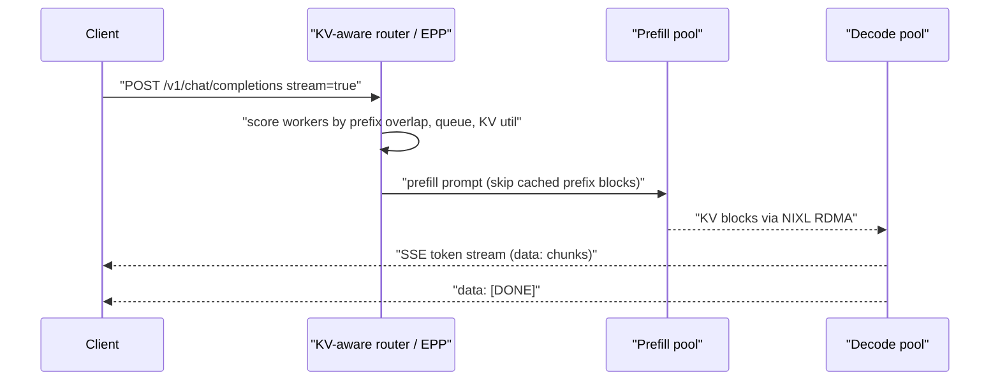
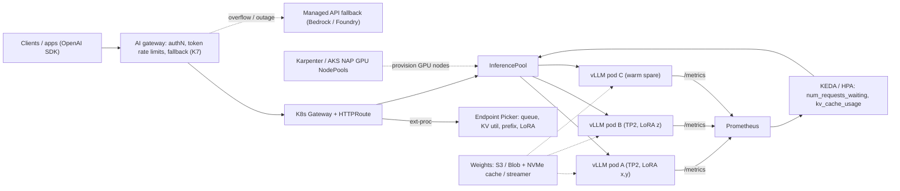
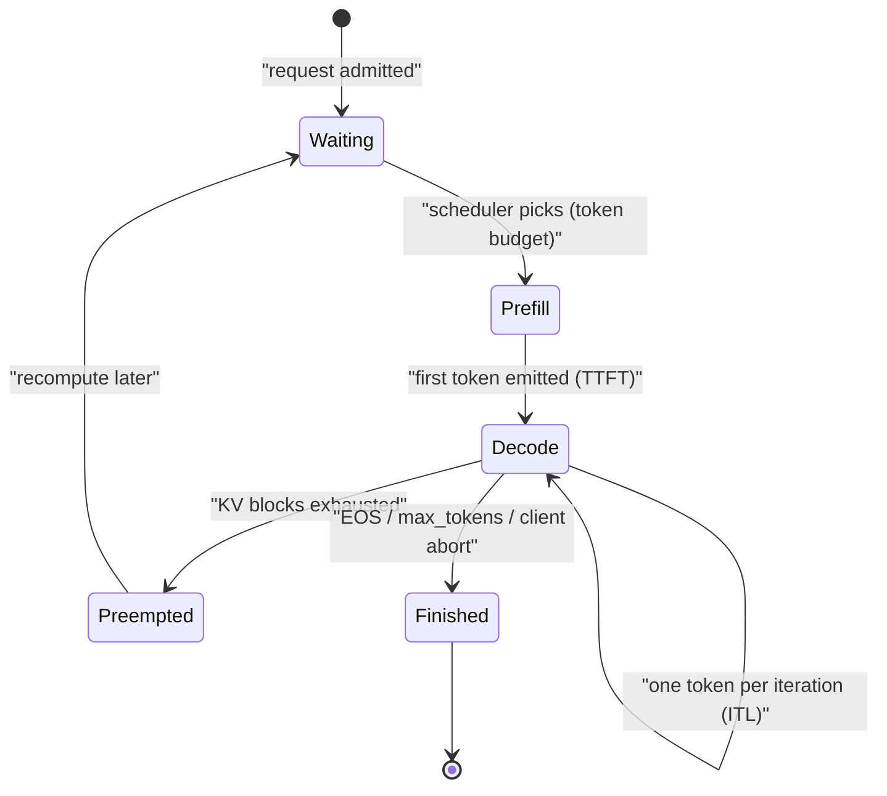

# K4 LLM Serving & Inference Infrastructure
> Last verified: 2026-10 · Audience: senior/staff DevOps, SRE, AI eng, NetEng, DevSecOps, architects

## TL;DR
- **Prefill and decode behave differently.** Prefill (the prompt) is **compute-bound** and sets **TTFT**. Decode (one token at a time) is **memory-bandwidth-bound** and sets **ITL/TPOT**. Nearly every serving optimization targets one of the two phases, or separates them.
- **The KV cache is the scarce resource**, not FLOPs. PagedAttention, prefix caching, KV quantization, KV offload, and prefix-aware routing all exist to fit more concurrent sequences into HBM or to reuse KV that is already there.
- **Default engine stack (2026):** **vLLM** or **SGLang**. Add **TensorRT-LLM** when you need peak performance on NVIDIA hardware. **NVIDIA Dynamo** (the successor to Triton) and **llm-d** (CNCF Sandbox) sit above the engine to handle distributed, disaggregated and KV-aware serving. **TGI is in maintenance mode** and Hugging Face itself recommends vLLM or SGLang. Use **llama.cpp or Ollama** for edge, CPU or laptop serving.
- **Do not autoscale on CPU or GPU utilization.** Scale on **queue depth** (`vllm:num_requests_waiting`), **KV-cache utilization**, and **TTFT/ITL against an SLO**. Cold start, meaning pulling 100+ GB of weights and capturing CUDA graphs, takes minutes. Fix it with **weight caching or streaming loaders and warm pools**, not with faster autoscaler polling.
- **Route requests with awareness of the model server.** Round-robin destroys prefix-cache hit rate. The **Gateway API Inference Extension** (`InferencePool` + Endpoint Picker) routes on queue length, KV utilization, prefix-cache affinity and loaded LoRA adapters.
- **Cost per 1M tokens = GPU $/hr ÷ (tokens/s × 3600) × 1e6, divided by real utilization.** Batching size is the biggest lever, followed by quantization (FP8 or INT4) and the choice of parallelism.
- **Cloud managed equivalents:** SageMaker endpoints with **inference components** (multi-model, scale to zero), **HyperPod inference** (EKS-based, KV-aware routing, disaggregated P/D), and **Bedrock Custom Model Import** (serverless, billed per CMU). The Azure counterparts are **Azure ML managed online endpoints**, **Foundry managed compute**, and **AKS + KAITO**.
- **Security:** vLLM's `--api-key` protects only `/v1`-style paths, inter-node traffic (NCCL, KV transfer) is unauthenticated and unencrypted, and dynamic LoRA loading is unsafe in production. Put the server behind an allow-listing proxy on an isolated network, and treat the weights as crown-jewel artifacts.

## K4.1 Serving engines and OpenAI-compatible APIs
- **How it works:**
  - **vLLM.** Built around PagedAttention, continuous batching, prefix caching and chunked prefill. The V1 engine enables chunked prefill by default. It is OpenAI-compatible, serving `/v1/completions`, `/v1/chat/completions`, `/v1/responses`, `/v1/embeddings` and `/v1/audio/transcriptions`, plus `/health`, `/metrics` (Prometheus), `/tokenize`, `/v1/models` and `/load`. It also exposes Anthropic Messages-style and Cohere-style APIs. Default `--gpu-memory-utilization` is **0.92**.
  - **SGLang.** Hosted by the non-profit **LMSYS**. Its signature feature is **RadixAttention**, a radix tree of KV prefixes. It also offers a low-overhead scheduler, P/D disaggregation, expert parallelism, speculative decoding and fast structured (JSON/grammar) output. Hardware: NVIDIA, AMD, Intel Xeon, TPU, Ascend and others. It is strong for agentic workloads with many shared prefixes.
  - **TensorRT-LLM.** NVIDIA's optimized kernels: FP8/FP4 on Hopper and Blackwell, in-flight batching, paged KV. Historically you compiled per-GPU "engines". Newer releases default to a PyTorch-based workflow (unverified). It is usually deployed through **Dynamo** or **NVIDIA NIM** containers.
  - **Triton Inference Server → NVIDIA Dynamo.** NVIDIA describes Dynamo as building on Triton's successes. Dynamo is engine-agnostic (vLLM, SGLang, TRT-LLM), written in Rust for performance with Python for extensibility, and adds a KV-aware router, disaggregated P/D, KVBM tiered KV offload, NIXL transfer and an SLA planner. Triton remains the choice for multi-framework, non-LLM model serving: ONNX, PyTorch, ensembles.
  - **TGI (Hugging Face).** **In maintenance mode**, accepting only minor fixes and docs. Its docs recommend vLLM, SGLang, llama.cpp or MLX. Do not choose it for new builds.
  - **llama.cpp / Ollama.** GGUF quantized weights (for example Q4_K_M) running on CPU, Apple Metal or consumer GPUs. Ollama wraps llama.cpp and exposes an OpenAI-compatible `/v1` on port 11434. Use it for dev, edge, air-gapped laptops and low-QPS cases, not for multi-tenant high throughput.
- **OpenAI-compatible API as the contract.** Standardize clients on `/v1/chat/completions` with `stream: true`. Then you can swap the engine, or move between a managed API (Bedrock, Foundry) and self-hosted serving, behind an AI gateway (see [K7](./K7-ai-gateways-caching-cost.md)). Watch for differences in chat templates, tool-call parsers (`--tool-call-parser`), `stream_options.include_usage`, and token accounting.

| Engine | Sweet spot | Notes |
|---|---|---|
| vLLM | General default, broadest model and hardware coverage | Largest ecosystem: KServe, KAITO, llm-d, SageMaker LMI, Ray Serve LLM |
| SGLang | Prefix-heavy agents and RAG, structured output, large MoE | RadixAttention; router with cache awareness |
| TensorRT-LLM | Maximum tokens/s per NVIDIA GPU, FP8/FP4 | Most tuning effort; usually used via Dynamo or NIM |
| Dynamo | Multi-node, disaggregated, KV-aware fleet | Orchestration layer, not an engine |
| TGI | Legacy only | Maintenance mode |
| llama.cpp / Ollama | CPU, edge, laptop | GGUF, single-user latency |

- **Trade-offs / when to use:** Use a managed API when you have no data-residency or customization need and QPS is spiky. Self-host when you need steady high volume, fine-tuned or LoRA variants, data control, or latency SLOs that a managed API cannot meet.
- **Interview angles:**
  - If asked "which engine?", say vLLM by default, SGLang for prefix-heavy agent traffic, TRT-LLM or Dynamo when squeezing NVIDIA hardware. Mention that TGI is in maintenance mode, because that signals you are current.
  - If asked "Triton vs vLLM?", say they sit at different layers. Triton is a multi-framework model server, vLLM is an LLM engine (and can run as a Triton backend). Dynamo is the LLM-era successor that orchestrates engines.

## K4.2 Engine mechanics: KV cache, continuous batching, PagedAttention, prefix caching, chunked prefill
- **KV cache size per token** = 2 (K and V) × layers × KV heads × head_dim × bytes per element.
  - Llama-3-70B (80 layers, 8 KV heads with GQA, head_dim 128): BF16 ≈ **320 KB/token**, FP8 KV ≈ **160 KB/token**.
  - A 32k-token sequence in BF16 therefore uses about **10 GB** of KV.
  - GQA/MQA/MLA exist to shrink this number (see [K1](./K1-llm-fundamentals-for-infra.md)).
- **Continuous (in-flight) batching:** the scheduler admits and retires sequences **every decode iteration** instead of waiting for a whole batch to finish. This removes padding and head-of-line blocking, gives roughly 10x+ throughput over static batching, and is now standard in every serious engine.
- **PagedAttention:** KV is stored in fixed-size **blocks** (like OS virtual-memory pages; see [A3](../A-operating-systems/A3-memory-management.md)) through a per-sequence block table.
  - Fragmentation drops to near zero, so you get more concurrent sequences.
  - It enables copy-on-write sharing for parallel sampling and beam search.
  - When blocks run out, V1 **preempts** a sequence and **recomputes** it later (the default mode is RECOMPUTE, not swap).
  - Mitigate preemption by raising `gpu_memory_utilization`, lowering `max_num_seqs` / `max_num_batched_tokens`, or adding TP.
- **Automatic prefix caching (APC):** blocks are hashed by their token content plus the prefix, so a new request sharing a prefix (system prompt, RAG document, earlier chat turns) **skips prefill** for those blocks.
  - It speeds up **prefill only** and does nothing for decode-heavy, long-output requests.
  - Eviction is LRU over unreferenced blocks.
  - Monitor `vllm:prefix_cache_hits` / `vllm:prefix_cache_queries`.
  - This is the self-hosted analogue of provider prompt caching ([K7](./K7-ai-gateways-caching-cost.md)).
- **Chunked prefill:** long prompts are split into chunks that are co-scheduled with decode steps under a token budget (`max_num_batched_tokens`). This prevents a 100k-token prompt from stalling every stream's ITL.
  - Smaller budget (about 2048) gives better ITL.
  - Larger budget (8192+) gives better TTFT and throughput.
- **Other knobs:**
  - `--kv-cache-dtype fp8` roughly doubles KV capacity.
  - `--max-model-len` caps the context. Shrinking it frees KV and is often the fix when a model "doesn't fit".
  - **CUDA graphs** speed up decode but lengthen startup; `--enforce-eager` gives the fastest start and slower steady state.
  - Weight quantization: FP8 on H100+, AWQ/GPTQ INT4, NVFP4 on Blackwell.
- **Interview angles:**
  - "Why is decode slow at batch 1?" Each token must read **all weights** from HBM. 70 GB of FP8 weights at H100's ~3.35 TB/s is about 21 ms, so roughly 48 tok/s at best. Batching amortizes that weight read across many sequences, which is why throughput scales with batch size until KV capacity or compute runs out.
  - "Users report long TTFT at peak." Check the queue (`num_requests_waiting`), preemptions, chunked-prefill budget and prefix-cache hit rate before adding GPUs.

## K4.3 Speculative decoding
- **How it works:**
  - A cheap **proposer** guesses k tokens. The target model **verifies all k in one forward pass**, and rejection sampling keeps the output distribution **mathematically identical**. In practice there are tiny floating-point and batch-shape differences.
  - Proposer methods in vLLM:
    - Model-based: **EAGLE/EAGLE-3**, **MTP** (built-in multi-token-prediction heads, for example DeepSeek), **draft model** (a small sibling such as an 8B drafting for a 70B), PARD, MLP speculators.
    - Model-free: **n-gram** (prompt lookup) and **suffix decoding**.
  - Config example: `--speculative-config '{"method":"eagle3","model":"<draft>","num_speculative_tokens":3}'`.
- **Trade-offs / when to use:**
  - It turns idle compute at **low QPS** into lower ITL, often 1.5–3x. At **high QPS** the GPU is already compute-saturated, so verification overhead cuts throughput.
  - n-gram and suffix methods give modest gains without hurting peak traffic, and they are great for code edits and RAG that copy from the prompt.
  - The draft model costs extra HBM for its weights and KV.
- **Interview angles:**
  - If asked "how to cut latency without changing quality?", answer speculative decoding, measured by **acceptance rate**. Mention that it hurts at high concurrency and should be tuned or disabled dynamically under load.
  - Do not confuse it with quantization, which changes outputs.

## K4.4 Inference parallelism (TP / PP / EP / DP replicas)
- **How it works:**
  - **TP (tensor):** splits each layer's matrices across GPUs, with an all-reduce **every layer**. It needs NVLink/NVSwitch, so keep it **inside one node**. `--tensor-parallel-size` is usually the number of GPUs per node.
  - **PP (pipeline):** splits layers into stages across nodes. Communication happens only at stage boundaries, so it tolerates slower interconnect and uneven splits, at the cost of pipeline bubbles. `--pipeline-parallel-size` is usually the number of nodes.
  - **EP (expert):** for MoE models (DeepSeek-V3, Qwen3-MoE, gpt-oss), different experts live on different GPUs and tokens are all-to-all dispatched. It is commonly combined with **DP attention**. Flag: `--enable-expert-parallel`.
  - **DP replicas:** independent copies of the model behind a load balancer. This is the horizontal-scaling unit, and it is what you autoscale.
- **vLLM rules of thumb:**
  - Model fits on 1 GPU: no parallelism, scale with DP replicas.
  - Fits on one node: TP only.
  - Exceeds one node: TP = GPUs per node, PP = number of nodes, run on Ray or mp multi-node.
- **Trade-offs:**
  - More TP adds KV headroom and lowers per-token latency, but the all-reduce overhead lowers efficiency per GPU.
  - Often **2 × TP4 beats 1 × TP8** for throughput if the model fits.
  - Multi-node serving needs EFA (AWS) or InfiniBand (Azure ND), plus **gang scheduling** (LeaderWorkerSet, Ray, Dynamo Grove).
- **Interview angles:**
  - "Serve a 405B model?" FP8 weights are about 405 GB, so 8×H100 (640 GB) or 8×H200 at TP8, or 2 nodes with TP8×PP2 for BF16 or long context. Then justify the KV headroom you have left.
  - Pitfall: TP across nodes over Ethernet, which makes the per-layer all-reduce the bottleneck.

## K4.5 Disaggregated prefill/decode and distributed KV (NVIDIA Dynamo, llm-d)
- **How it works:**
  - Prefill and decode run on **separate GPU pools**. The prefill worker computes KV and **transfers it** to a decode worker over RDMA/NVLink using **NIXL** (NVIDIA's transfer library).
  - Each pool is sized and parallelized independently, for example high-TP prefill and wide-batch decode, and the TTFT and ITL SLOs become independently tunable.
  - Long prompts no longer interfere with ongoing streams.
- **NVIDIA Dynamo** (docs list v1.5.x as of 2026):
  - KV-aware router, which NVIDIA claims gives about 2x faster TTFT by routing to workers with cache overlap.
  - **KVBM**, which offloads KV across GPU → CPU → SSD → remote storage.
  - **Planner**, an SLA-driven autoscaler that right-sizes the prefill and decode pools.
  - **Grove**, a K8s operator for topology-aware gang scheduling on NVL72-class racks.
  - **ModelExpress/NIXL** GPU-to-GPU weight streaming, which NVIDIA claims gives about 7x faster replica cold start.
- **llm-d** (CNCF Sandbox, v0.10 in 2026): a K8s-native stack built from vLLM, a **GAIE-conformant proxy plus EPP** (the "router"), prefix-cache-aware routing, KV offload and P2P sharing, P/D disaggregation, and SLO-aware autoscaling through **KEDA**. It publishes "well-lit paths" as reference recipes.
- **Cloud managed:** **SageMaker HyperPod inference** offers disaggregated P/D, an L1 (CPU) and L2 (Redis or managed tiered storage) KV cache, and routing modes `prefixaware`, `kvaware`, `session` and `roundrobin`.
- **Trade-offs:** It pays off for **long prompts with strict ITL SLOs** at scale. It adds a network hop and KV transfer cost (a 32k-token BF16 KV for a 70B model is about 10 GB), needs RDMA, and adds operational complexity. Below roughly a handful of nodes, aggregated serving with chunked prefill is usually enough.
- **Interview angles:** If asked "TTFT spikes ruin streaming smoothness for other users", answer chunked prefill first, then disaggregation at scale. Name NIXL and KV transfer as the cost of disaggregation.



## K4.6 Multi-LoRA serving
- **How it works:**
  - One base model sits in HBM and many small **LoRA adapters** (MBs to a few hundred MB) are applied per request, batched together with kernels such as Punica/SGMV.
  - The client chooses an adapter through the `model` field.
  - vLLM flags: `--enable-lora`, `--lora-modules name=path`, `--max-loras` (concurrent adapters in a batch, **default 1**), `--max-lora-rank` (**default 16**), `--max-cpu-loras` (CPU-side LRU cache).
  - **Dynamic loading** uses `/v1/load_lora_adapter` and requires `VLLM_ALLOW_RUNTIME_LORA_UPDATING=True`. vLLM's docs warn it is a **security risk** and say to use it only in isolated, trusted environments.
- **Trade-offs:**
  - It is one to two orders of magnitude cheaper than a dedicated deployment per fine-tune.
  - Cost: each LoRA adds a little per-token overhead, the rank cap must cover your largest adapter, and adapter churn causes load latency.
  - Route requests to pods that **already hold the adapter**, which is what GAIE's EPP does.
  - Managed options: SageMaker inference components (one IC per adapter is a common pattern), Bedrock CMI (merged weights), and Foundry/Azure OpenAI fine-tunes as deployments.
- **Interview angles:** For "1,000 tenants, each with a fine-tune", answer **multi-LoRA on shared base pools**, adapter-affinity routing, adapters in object storage with an LRU, and a rank and size cap enforced in CI. Do not propose 1,000 endpoints.

## K4.7 GPU sizing and cost per million tokens (worked example)
- **Weight memory** = params × bytes per param. For 70B: BF16 140 GB, FP8 70 GB, INT4 about 35–40 GB. Add about 10–20% for activations, CUDA graphs and the runtime. **Everything left over is KV.**
- **Worked example: Llama-3.x-70B, FP8 weights, BF16 KV, on 2×H100 80 GB (TP2).**
  - HBM: 160 GB × 0.92 usable ≈ 147 GB. Minus 70 GB of weights and about 7 GB of overhead leaves **≈ 70 GB for KV**.
  - KV per token is 320 KB, so 70 GB / 320 KB ≈ **218k tokens** of KV, which is about **53 concurrent 4k-token sequences** (106 with an FP8 KV cache).
  - Assume (illustrative) a replica sustains **≈ 2,000 output tok/s** at that concurrency, with prefill amortized by prefix caching.
  - Assume (illustrative) **$4 per GPU-hour**, so $8/hr per replica. Tokens per hour = 2,000 × 3,600 = 7.2M.
  - **Cost ≈ $8 / 7.2 = $1.11 per 1M output tokens at 100% busy. At a realistic 40–50% average utilization this is about $2.2–2.8 per 1M.**
  - The real number depends on the input:output ratio, context length, SLO-constrained batch size and pricing tier (on-demand vs reserved, capacity blocks, spot).
- **Compare against managed per-token pricing.** Self-hosting wins only with **sustained utilization**, which needs a predictable base load. A common pattern is self-hosted baseline capacity with managed-API overflow.
- **Biggest levers:** batch size (the SLO trade-off), FP8/INT4 weights, FP8 KV, prefix-cache hit rate, speculative decoding at low QPS, right-sizing TP, and cheaper silicon (Inferentia2, L4/L40S for models ≤ 13B).
- **Accelerator options:**
  - H100/H200/B200 (AWS p5/p5e/p6, Azure ND H100 v5 / H200 v5 / GB200).
  - L4/L40S or A10G for small models (AWS g6/g6e/g5; Azure NV-series).
  - **AWS Inferentia2** (Inf2: up to 12 chips, 32 GB HBM each, 2 NeuronCores per chip, Neuron SDK).
  - **Azure Maia 200** (TSMC 3nm, 216 GB HBM3e at 7 TB/s, >10 PF FP4). It is **not rentable as customer VMs** as of 2026; it serves Microsoft first-party workloads (Foundry, M365 Copilot, OpenAI models). So Azure has **no customer-facing equivalent of Inferentia2**, and you rent ND or NC GPUs instead.
- **Interview angles:** Always do the math out loud: weights, then KV left over, then concurrency, then tokens/s, then $/1M at stated utilization. State your assumptions (prices change, so quote formulas, not list prices). Capacity planning ties to [J5](../J-sre/J5-capacity-planning-load-testing.md).

## K4.8 Autoscaling LLM serving and cold start
- **Signals that work:**
  - **Queue depth**: `vllm:num_requests_waiting`, the best leading indicator.
  - **KV-cache utilization**: `vllm:kv_cache_usage_perc`, which was renamed from `gpu_cache_usage_perc`. Sustained values >90% mean preemptions are coming.
  - Running requests per replica (`vllm:num_requests_running`).
  - **TTFT and ITL percentiles** (`vllm:time_to_first_token_seconds`, `vllm:inter_token_latency_seconds`) against the SLO.
  - Tokens/s versus the measured capacity per replica.
- **Signals that do not work:**
  - **CPU** is irrelevant to GPU serving.
  - **GPU utilization (DCGM)** sits near 100% whenever anything is running, regardless of headroom.
  - Raw RPS ignores prompt and output length variance.
- **Mechanisms:**
  - **KEDA** Prometheus scaler on queue depth. llm-d uses it for SLO-aware scaling.
  - **HPA** on custom metrics through prometheus-adapter.
  - **KServe** 0.20 (CNCF incubating): `InferenceService` / LLM serving with a vLLM runtime, metric-based autoscaling on token throughput, queue depth or GPU, scale to zero (Knative serverless mode), and **LocalModelCache**, which KServe says cuts LLM startup from 15–20 min to about 1 min.
  - **Ray Serve LLM**: vLLM deployments that autoscale on ongoing requests per replica (`target_ongoing_requests`).
  - **Dynamo Planner**: separate scaling of the prefill and decode pools.
- **Cold-start anatomy and fixes:**

| Phase | Typical cost | Fix |
|---|---|---|
| GPU node provisioning | 2–10 min, plus capacity risk | **Warm pools / overprovisioning** (low-priority placeholder pods), capacity reservations or capacity blocks, Karpenter or NAP with GPU NodePools |
| Image pull (10–20 GB CUDA images) | 1–5 min | Pre-pulled images and lazy loading (SOCI on AWS, artifact streaming on AKS) (unverified for current GA state) |
| Weight download (70B is 70–140 GB) | Minutes | Node-local NVMe cache (KServe LocalModelCache, HyperPod `modelCacheConfig`), **Run:ai Model Streamer** (`--load-format runai_streamer`) or tensorizer streaming from S3/Blob, FSx for Lustre or Azure Managed Lustre, Dynamo ModelExpress GPU-to-GPU |
| Load plus CUDA-graph capture and warmup | 30 s – several min | Keep the graph sizes in check; `--enforce-eager` for dev only |

- **Trade-offs:** Scale-to-zero suits only dev and low-QPS tenants because a cold start takes minutes. Production keeps `minReplicas ≥ 1` per model, ideally ≥ 2 across AZs. Scale **out early** (queue-based, with a short stabilization window) and **in slowly**. When scaling in, drain streaming connections (`terminationGracePeriodSeconds` longer than the max generation time).
- **Interview angles:** If asked "HPA on CPU at 70% for vLLM pods?", call it the classic anti-pattern and replace it with queue depth plus KV utilization. Then address cold start separately, because no autoscaler reacts faster than the weights load.

## K4.9 Inference-aware routing (Gateway API Inference Extension) and multi-tenancy
- **Gateway API Inference Extension (GAIE),** an official Kubernetes SIG-Network project:
  - **`InferencePool`** (API **v1**, `inference.networking.k8s.io`) replaces a Service as the backend of an `HTTPRoute`. It selects the model-server pods and points to an **Endpoint Picker (EPP)** extension. The gateway calls the EPP through Envoy ext-proc.
  - The EPP scrapes each pod's metrics and picks the endpoint by **queue length, KV-cache utilization, prefix-cache affinity and loaded LoRA adapters**.
  - **`InferenceObjective`** (alpha; replaced the earlier `InferenceModel`) carries per-workload **priority**, so sheddable or batch traffic is dropped first (verify the exact group and version).
  - `InferencePoolImport` supports cross-cluster pools.
  - Implementations include Envoy Gateway, kgateway, GKE Gateway and Istio (Istio support unverified). llm-d's router is a production EPP.
- **Prefix-aware routing:** hash the leading N tokens or blocks (or the session ID) so requests land where their KV is already warm. The fallback is least-loaded. It must be balanced against hot-spotting, so use a scorer that weights affinity against load. HyperPod's `prefixaware` / `kvaware` / `session` modes do the same thing as a managed feature.
- **LoRA-aware routing:** prefer pods that already have the adapter loaded and avoid thrashing `--max-loras` slots.
- **Multi-tenancy:**
  - Apply per-tenant **token-based** rate limits (input+output TPM) at the gateway, not just RPS.
  - Use priority classes (interactive above batch) and per-tenant max_tokens and context caps.
  - Use fair-share queuing so one tenant's 100k-token prompts cannot starve everyone else.
  - Isolation levels, from cheapest to strongest: shared pool with logical limits, then dedicated replicas or LoRA per tenant, then a dedicated cluster for regulated tenants.
  - **Prefix-cache side channel:** cache hits are measurably faster, which can leak whether another tenant sent a prompt. vLLM supports a per-request **`cache_salt`** to isolate tenants.
  - HyperPod's managed L2 KV tier is **shared with no isolation** across deployments in a cluster and stored **unencrypted at rest**. Use separate clusters or dedicated Redis for separation.
  - Further reading: [L4](../L-data-privacy-ai-security/L4-ai-security-threats.md).
- **Interview angles:** If asked "why is our cache hit rate 5% with 20 replicas?", the answer is round-robin load balancing. Fix it with GAIE/EPP or consistent hashing on a prefix or session key.



## K4.10 Reliability: fallback models, rate limits, streaming and timeouts
- **SSE streaming:**
  - The response is `Content-Type: text/event-stream` with `data: {json chunk}\n\n` frames and a terminal `data: [DONE]`.
  - Request `stream_options: {"include_usage": true}` to get token counts in the final chunk, which billing and metering need.
  - Proxies must **disable buffering** (nginx `proxy_buffering off`, `X-Accel-Buffering: no`) and use HTTP/1.1 keep-alive or HTTP/2.
  - **Idle timeouts kill long generations.** AWS ALB defaults to 60 s, Azure LB/App Gateway timeouts vary, and API gateways have hard caps. Configure **idle timeout above the maximum inter-chunk gap**, emit heartbeats or comments if needed, and set an **overall deadline** sized from max_tokens × p99 ITL.
  - Managed equivalents: SageMaker `InvokeEndpointWithResponseStream`, Bedrock `InvokeModelWithResponseStream` / `ConverseStream`.
- **Client disconnects:** the engine must **abort** the request so it stops burning KV and compute. vLLM aborts when the stream closes, but check that every proxy in the chain propagates the disconnect.
- **Timeouts:**
  - Separate the **TTFT timeout** (a short connect-and-first-byte deadline, for example 10–30 s) from the **stream idle timeout** and the **total deadline**.
  - Retry only *before* the first token. After tokens have streamed, a retry duplicates output, so fail over and let the client decide.
- **Fallbacks:**
  - Ordered model chain (primary self-hosted, then a smaller self-hosted model, then a managed API), applied per error class: 429/503/timeout trigger fallback, 400 does not.
  - Use circuit breakers per backend (see [C3](../C-large-scale-architecture/C3-reliability.md)).
  - Watch output-quality differences, because evals per fallback model are required ([K9](./K9-llmops-evals-guardrails.md)).
  - These features usually live in an AI gateway such as LiteLLM, Envoy AI Gateway, Azure APIM AI gateway or Bedrock cross-region inference ([K7](./K7-ai-gateways-caching-cost.md)).
- **Rate limits and load shedding:** enforce token-per-minute plus concurrency caps per tenant, and return **429 with `Retry-After`**. The engine itself should shed load with a bounded queue (fail fast) rather than queue forever, because unbounded queues turn into TTFT SLO breaches.
- **Health checks:** `/health` returns 200 only after the weights load, so use a **startupProbe** with a long budget (minutes) to avoid restart loops while 140 GB loads. Liveness should be lenient, because a long prefill must not count as a hang.
- **SLOs:** TTFT p95, ITL/TPOT p95, error rate and goodput (requests that met both SLOs). See [J1](../J-sre/J1-slis-slos-error-budgets.md).
- **Interview angles:** "Streams cut off at exactly 60 s" points to an ALB or proxy idle timeout. "Retrying a failed stream doubled the text" points to retries after the first token.

## K4.11 Security of self-hosted weights and serving endpoints
- **Endpoint hardening (vLLM docs):**
  - `--api-key` protects only `/v1`, `/v2`, `/inference` and `/cohere`. Paths such as `/invocations`, `/pause`, `/resume` and `/abort_requests` stay **unauthenticated**.
  - Put the server **behind a reverse proxy or gateway that allow-lists paths** and does real authN (OIDC/JWT, mTLS).
  - **Inter-node traffic** (PyTorch distributed/NCCL, KV transfer, gRPC) is unencrypted and unauthenticated. Run it on a **dedicated isolated network** (separate subnet or SG/NSG, EFA/IB fabric) with firewalled ports.
  - Do not allow `--trust-remote-code` for untrusted repos.
  - Do not use dynamic LoRA loading in production.
  - Lock down HF and cache directory permissions.
- **Weight protection:**
  - Store weights in a private bucket or container with **KMS/CMK** (Key Vault) encryption and access through **workload identity** only (IRSA / EKS Pod Identity; AKS Workload Identity), with no static keys (see [L7](../L-data-privacy-ai-security/L7-zero-trust-workload-identity.md)).
  - Use VPC endpoints or Private Endpoints and no internet egress from GPU nodes, which also blocks exfiltration.
  - Prefer **safetensors** (no pickle code execution). Pin model revisions by hash, sign and verify artifacts and images (cosign), and scan containers (see [L6](../L-data-privacy-ai-security/L6-secrets-supply-chain.md)).
  - SageMaker offers **network isolation** mode and KMS on the ML storage volume. Azure ML managed online endpoints offer managed VNet isolation, Private Link, Entra ID token auth and managed identity.
- **Data in the serving path:** prompts and KV live in GPU and host memory; KV offload tiers may be **unencrypted at rest** (HyperPod L2). Do not log prompts by default, or redact them, because PII flows through ([L1](../L-data-privacy-ai-security/L1-data-classification-pii.md)). For regulated workloads, consider confidential GPUs (H100 confidential computing) (unverified per-cloud availability).
- **Licensing and governance:** model licenses (Llama community license, Gemma terms, Apache-2.0 for Qwen/Mistral variants) carry usage restrictions. Bedrock CMI explicitly requires license compliance. Track the license in the model registry ([L5](../L-data-privacy-ai-security/L5-model-data-governance.md)).
- **Interview angles:** If asked "what is your threat model for self-hosted Llama?", cover these in order:
  1. Weight theft (IAM, KMS, egress controls).
  2. Unauthenticated control endpoints.
  3. Insecure NCCL/KV plane.
  4. Malicious artifacts (pickle, remote code, LoRA).
  5. Cross-tenant leakage (prefix cache timing, shared KV tiers).
  6. Prompt injection and data exfiltration at the app layer ([L4](../L-data-privacy-ai-security/L4-ai-security-threats.md)).

## Diagrams
- The serving architecture flowchart is in [K4.9](#k49-inference-aware-routing-gateway-api-inference-extension-and-multi-tenancy). The disaggregated P/D sequence is in [K4.5](#k45-disaggregated-prefilldecode-and-distributed-kv-nvidia-dynamo-llm-d).



## Cloud mapping: AWS vs Azure
| Capability | AWS | Azure | Role it plays | Key differences | Alternatives |
|---|---|---|---|---|---|
| Managed real-time endpoint for your container or model | **SageMaker AI real-time endpoints** + **LMI containers** (DJL; vLLM / TRT-LLM / Neuron backends) | **Azure ML managed online endpoints** (BYOC, Triton, MLflow) | Managed VMs + LB + autoscale for a model server | Azure separates the *endpoint* from *deployments* (blue/green %, mirroring, `azureml-model-deployment` header) and reserves **20% extra quota**. SageMaker uses production variants plus ICs | KServe on EKS/AKS, Ray Serve, Modal/Baseten |
| Many models / adapters per endpoint, scale to zero | **SageMaker inference components** (per-model CPU/accelerator/memory, `CopyCount`, scale a copy to 0, managed instance scaling) | Multiple deployments per online endpoint (no per-model GPU slicing, unverified), or KAITO/KServe on AKS | Bin-pack models onto shared GPU instances | ICs give finer granularity; Azure scales at the deployment/VM level | vLLM multi-LoRA, Triton multi-model |
| K8s-native LLM inference platform | **SageMaker HyperPod inference** (EKS-orchestrated; JumpStart/S3/FSx; KV L1/L2 + `prefixaware`/`kvaware` routing; disaggregated P/D; MIG; NVMe weight cache; KEDA autoscale) | **AKS + KAITO add-on** (`Workspace` CRD auto-provisions GPU nodes; vLLM runtime; OpenAI-compatible API; CNCF Sandbox) | Self-managed-feeling K8s serving with managed help | HyperPod shares the training fleet with task governance. KAITO is simpler: presets, Ampere+ only (CC ≥ 8.0), no AMD GPUs, add-on lags upstream one release, you delete the GPU node pools manually | llm-d, Dynamo, KServe on plain EKS/AKS |
| Serverless import of custom weights | **Bedrock Custom Model Import** (HF safetensors from S3; Llama, Mistral/Mixtral, Qwen2/2.5/3, GPT-OSS, Flan; <200 GB text, <100 GB multimodal; <128K context; billed in **CMUs per copy in 5-min windows**; no batch inference) | **Foundry managed compute** (HF, NIM, custom; dedicated VMs billed per minute of uptime; requires hub-based project; no content filtering) | Run your fine-tuned open model behind a cloud API | Bedrock CMI is serverless-ish (copies scale with demand, cold start possible); Foundry managed compute is dedicated always-on VMs (Azure ML online endpoints underneath) | Fireworks/Together, Databricks Model Serving |
| GPU node autoscaling on K8s | **Karpenter** on EKS (GPU NodePools, EKS Auto Mode includes it), accelerated AL2023 / Neuron AMIs, NVIDIA device plugin or GPU Operator | **AKS node auto-provisioning (NAP)**, which is Karpenter (`NodePool`/`AKSNodeClass`; preconfigured in AKS Automatic) or GPU node pools + cluster autoscaler; NVIDIA GPU Operator | Just-in-time GPU nodes for pending pods | NAP limits: no Windows, no IPv6, no service principals, can't stop the cluster. Both need GPU quota and capacity planning | Cluster Autoscaler, GKE Autopilot |
| Reserved GPU capacity | EC2 **Capacity Blocks for ML**, On-Demand Capacity Reservations, SageMaker training plans (unverified for inference use) | **Capacity reservations** (On-demand capacity reservation groups), Azure reserved VM instances | Guarantee that scale-out actually gets GPUs | GPU stockouts are the real autoscaling limit in both clouds | Multi-region pools, neoclouds |
| Custom inference silicon | **Inferentia2 / Inf2** (up to 12 chips, 32 GB HBM per chip, Neuron SDK) | **Maia 200** (3nm, 216 GB HBM3e). **Not customer-rentable** as of 2026; it powers Foundry and Copilot internally | Lower $/token than GPUs | AWS lets you rent the chip; on Azure you benefit only indirectly through first-party model APIs | Google TPU, Groq, Cerebras |
| Weight storage and fast load | S3 + FSx for Lustre, SOCI lazy image loading, Mountpoint for S3 (unverified for LLM loads) | Blob + Azure Managed Lustre, ACR artifact streaming (unverified GA) | Cut cold start | Same patterns; verify throughput limits per volume | Run:ai Model Streamer, tensorizer |

- **SageMaker endpoints + ICs:**
  - An IC declares `ComputeResourceRequirements` (CPU cores, accelerators, memory) and `RuntimeConfig.CopyCount`, and is invoked through `InvokeEndpoint` with the IC name.
  - ICs are the AWS answer to "many models on one GPU fleet", including **scale to zero per IC** (instances can be managed-scaled).
  - Autoscale on concurrent requests per copy (high-resolution metric) rather than CPU (unverified exact metric name).
- **HyperPod inference** is the closest managed analogue to llm-d or Dynamo: KV-aware routing modes, tiered KV cache, disaggregated P/D, multi-instance-type fallback lists, and NVMe weight and image caching. Caveat: L2 KV is shared across deployments and unencrypted at rest.
- **Bedrock CMI cost formula:** copies × CMUs per copy × $/CMU-min × billed minutes, in **5-minute windows from the first successful invocation**.
  - Regions: us-east-1, us-east-2, us-west-2 and eu-central-1. GPT-OSS is supported only in us-east-1.
  - Fine-tunes must match transformers 4.51.3.
  - Not supported: embedding models, batch inference, CloudFormation.
- **Azure ML managed online endpoints:**
  - Key, AML token or **Entra ID** auth. Managed VNet isolation with Private Endpoints.
  - Autoscale through **Azure Monitor autoscale**. It is CPU/metric- or schedule-based by default, so wire custom metrics if you can.
  - Use ≥ 3 instances for HA. Quota needed = `ceil(1.2 × instances) × cores`.
  - Kubernetes online endpoints (Azure Arc/AKS) exist if you want your own cluster, but they have no traffic mirroring.
- **Foundry:** "Azure AI Studio → Azure AI Foundry → **Microsoft Foundry**". Standard deployments (token or PTU billing) are for catalog models. **Managed compute** is the path for HF, NIM and custom weights (per-minute VM billing, no content filters).
- **KAITO:** enable with `az aks create/update --enable-ai-toolchain-operator --enable-oidc-issuer`. A workspace can take up to about 20 min to become ready. It is the Azure-native "one CRD to an OpenAI-compatible vLLM endpoint".
- **Alternatives:** plain **Kubernetes** + vLLM + GAIE/llm-d for portability. Managed APIs (**Claude** on Bedrock / Vertex / Foundry, **Gemini** on GCP) when you don't need custom weights. **Cloudflare Workers AI** for edge inference of small open models. **Databricks Model Serving** for teams already on a lakehouse ([M3](../M-data-platforms/M3-databricks-platform.md)).

## Hands-on (optional)
```bash
# vLLM OpenAI-compatible server (single GPU). --ipc=host (or --shm-size) is required for PyTorch shared memory.
docker run --runtime nvidia --gpus all \
  -v ~/.cache/huggingface:/root/.cache/huggingface \
  --env "HF_TOKEN=$HF_TOKEN" \
  -p 127.0.0.1:8000:8000 --ipc=host \
  vllm/vllm-openai:latest \
  --model Qwen/Qwen3-8B \
  --api-key "$VLLM_API_KEY" \
  --enable-prefix-caching \
  --max-model-len 16384 \
  --kv-cache-dtype fp8 \
  --max-num-batched-tokens 8192

# Streamed chat completion (SSE). -N disables curl buffering.
curl -N http://127.0.0.1:8000/v1/chat/completions \
  -H "Authorization: Bearer $VLLM_API_KEY" -H "Content-Type: application/json" \
  -d '{"model":"Qwen/Qwen3-8B","stream":true,"stream_options":{"include_usage":true},
       "messages":[{"role":"user","content":"Explain PagedAttention in 2 lines"}]}'

# Autoscaling and health signals
curl -s http://127.0.0.1:8000/metrics | grep -E 'vllm:(num_requests_waiting|num_requests_running|kv_cache_usage_perc|prefix_cache_hits)'

# Multi-GPU: TP across 4 GPUs in one node, MoE with expert parallel
#   ... vllm/vllm-openai:latest --model <moe-model> --tensor-parallel-size 4 --enable-expert-parallel

# Multi-LoRA (static adapters; avoid runtime loading in prod)
#   ... --enable-lora --max-loras 8 --max-lora-rank 64 --lora-modules sql=/adapters/sql support=/adapters/support

# Local/edge alternative: Ollama exposes an OpenAI-compatible API on :11434/v1
docker run -d --gpus all -v ollama:/root/.ollama -p 127.0.0.1:11434:11434 --name ollama ollama/ollama
```

## Cross-links
- [K1 LLM fundamentals for infra](./K1-llm-fundamentals-for-infra.md): tokens, attention, GQA, quantization basics
- [K5 Training & fine-tuning](./K5-training-fine-tuning.md): LoRA/QLoRA producing adapters; HyperPod training
- [K6 Managed model platforms](./K6-managed-model-platforms.md): Bedrock, Foundry, provisioned throughput vs self-hosting
- [K7 AI gateways, caching & cost](./K7-ai-gateways-caching-cost.md): fallback chains, token rate limits, semantic and prompt caching
- [K9 LLMOps, evals & guardrails](./K9-llmops-evals-guardrails.md): evaluating fallback models and quantized variants
- [J1 SLIs/SLOs](../J-sre/J1-slis-slos-error-budgets.md), [J5 Capacity planning](../J-sre/J5-capacity-planning-load-testing.md)
- [C2 Scalability](../C-large-scale-architecture/C2-scalability.md), [C3 Reliability](../C-large-scale-architecture/C3-reliability.md)
- [A3 Memory management](../A-operating-systems/A3-memory-management.md): paging, the analogy for PagedAttention
- [L4 AI security threats](../L-data-privacy-ai-security/L4-ai-security-threats.md), [L6 Secrets & supply chain](../L-data-privacy-ai-security/L6-secrets-supply-chain.md), [L7 Zero trust / workload identity](../L-data-privacy-ai-security/L7-zero-trust-workload-identity.md)

## Sources
- https://docs.vllm.ai/en/latest/serving/parallelism_scaling.html
- https://docs.vllm.ai/en/latest/features/automatic_prefix_caching.html
- https://docs.vllm.ai/en/latest/configuration/optimization.html
- https://docs.vllm.ai/en/latest/configuration/engine_args/
- https://docs.vllm.ai/en/latest/features/speculative_decoding/
- https://docs.vllm.ai/en/latest/features/lora/
- https://docs.vllm.ai/en/latest/design/metrics/
- https://docs.vllm.ai/en/latest/serving/online_serving/
- https://docs.vllm.ai/en/latest/deployment/docker/
- https://docs.vllm.ai/en/latest/usage/security/
- https://docs.sglang.io/
- https://huggingface.co/docs/text-generation-inference/index
- https://developer.nvidia.com/dynamo
- https://github.com/ai-dynamo/dynamo (README)
- https://docs.nvidia.com/dynamo/latest/
- https://llm-d.ai/docs/architecture
- https://gateway-api-inference-extension.sigs.k8s.io/
- https://gateway-api-inference-extension.sigs.k8s.io/concepts/api-overview/
- https://kserve.github.io/website/docs/intro
- https://docs.aws.amazon.com/sagemaker/latest/dg/realtime-endpoints-deploy-models.html
- https://docs.aws.amazon.com/sagemaker/latest/dg/sagemaker-hyperpod-model-deployment.html
- https://docs.aws.amazon.com/sagemaker/latest/dg/large-model-inference-container-docs.html
- https://docs.aws.amazon.com/bedrock/latest/userguide/model-customization-import-model.html
- https://docs.aws.amazon.com/bedrock/latest/userguide/import-model-calculate-cost.html
- https://aws.amazon.com/ai/machine-learning/inferentia/
- https://learn.microsoft.com/en-us/azure/machine-learning/concept-endpoints-online
- https://learn.microsoft.com/en-us/azure/ai-foundry/concepts/deployments-overview
- https://learn.microsoft.com/en-us/azure/aks/ai-toolchain-operator
- https://learn.microsoft.com/en-us/azure/aks/node-autoprovision
- https://blogs.microsoft.com/blog/2026/01/26/maia-200-the-ai-accelerator-built-for-inference/
