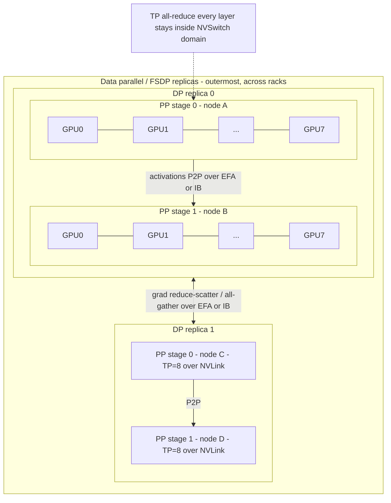
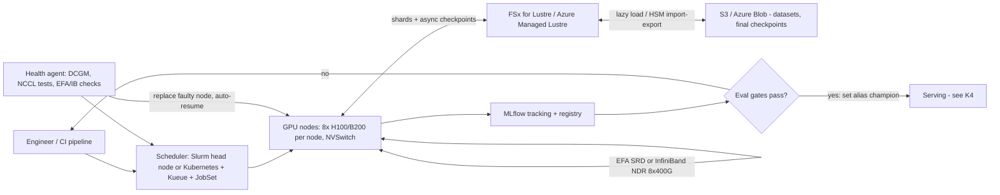

# K5 Training & Fine-tuning Infrastructure
> Last verified: 2026-10 · Audience: senior/staff DevOps, SRE, AI eng, NetEng, DevSecOps, architects

## TL;DR
- **Order of escalation: prompt → RAG → fine-tune → (continued) pre-train.** Fine-tuning teaches *behaviour/format/style/tool use*, RAG supplies *fresh or private facts*. Use both together when you need both; a fine-tune never replaces retrieval for current data.
- **Default fine-tune = LoRA/QLoRA + SFT**, then preference tuning (**DPO**) or RL with verifiable rewards (**GRPO / RFT**) if needed. Full fine-tuning only when adapters plateau and you can afford ~16 B/param of training state.
- **Memory math:** mixed-precision Adam ≈ **16 bytes/param** (2 weights + 2 grads + 12 fp32 master/m/v), 18–20 if fp32 grads are kept, *plus activations*. 7B ≈ 112 GB, 70B ≈ 1.1 TB → you must shard (FSDP/ZeRO-3) or use LoRA.
- **Parallelism ladder:** DDP → FSDP2/ZeRO (shard states) → + TP inside the NVLink domain → + PP across nodes → + CP/SP for long context → + EP for MoE. **Map the most chatty dimension to the fastest link.**
- **Network is the product:** NVLink/NVSwitch in-node, **EFA (SRD, libfabric)** on AWS vs **InfiniBand NDR 400 Gb/s per GPU** on Azure ND; both ~3.2 Tbps per 8-GPU node. NCCL rides on top; all-reduce bus bandwidth is the health KPI.
- **Schedulers need gang + topology:** Slurm does it natively; Kubernetes needs **Kueue** (quota, all-or-nothing, TAS) + **JobSet**/Kubeflow Trainer or **Volcano**.
- **At scale, failure is the steady state:** health checks (DCGM, NCCL tests, EFA loopback) + node replacement + **auto-resume from (async, sharded) checkpoints** on Lustre/object storage. SageMaker HyperPod packages this; on Azure you assemble it (CycleCloud Workspace for Slurm or AKS).
- **Ship through gates:** MLflow (or equivalent) tracks runs, the registry versions adapters/models with aliases (`@champion`), and eval gates (task metrics + safety + regression vs baseline) block promotion.

## K5.1 Fine-tune vs prompt vs RAG
- **How it works:**
  - **Prompting / few-shot:** zero training cost, instant iteration; limited by context length, per-call token cost and instruction-following ceiling.
  - **RAG:** retrieves current/private knowledge at query time; facts are updatable without retraining, citations possible, ACLs enforceable at retrieval ([K3](K3-rag-pipelines.md)).
  - **Fine-tuning:** changes weights → consistent format/tone/schema, better tool selection, shorter prompts (lower latency/cost), lets a **small model match a big one on a narrow task** (distillation).
  - **Continued pre-training:** large unlabeled domain corpus (legal, code base, language); expensive, risk of catastrophic forgetting.
- **Trade-offs / when to use:**

| Need | Prompt | RAG | Fine-tune |
|---|---|---|---|
| Fresh / frequently changing facts | – | **Best** | Poor (stale on day 1) |
| Strict output format, style, tool-call accuracy | OK | – | **Best** |
| Per-request cost/latency at high volume | Long prompts cost | Retrieval + context cost | **Shortest prompts, small model** |
| Data governance (right to be forgotten) | Easy | Easy (delete doc) | Hard (weights memorize; retrain) |
| Time to first result | Minutes | Days | Days–weeks + eval |

- **Interview angles:**
  - "Model hallucinates company facts" → RAG, not fine-tuning. "Model ignores our JSON schema / tone / tool conventions" → fine-tune (or structured outputs first).
  - Microsoft Foundry docs explicitly say fine-tuning "doesn't replace retrieval for current information or application-level safety controls" — quote this framing.
  - Hidden costs: dataset curation, eval harness, **hosting fee for a dedicated fine-tuned deployment**, re-tuning when the base model is retired.
  - **RAFT pattern:** fine-tune the model *on retrieved context* so it learns to use/ignore context — combines both.

## K5.2 Fine-tuning methods (full FT, LoRA/QLoRA, SFT, DPO, GRPO/RFT, distillation)
### Parameter scope
- **Full fine-tuning:** all weights updated; highest ceiling, needs full optimizer state (see K5.4), produces a full model copy per variant.
- **LoRA:** freeze W, learn low-rank ΔW = B·A (rank `r` typically 8–64, scaled by `lora_alpha/r`); trainable params usually <1%. Targets: attention projections or `target_modules="all-linear"` (QLoRA-style). Adapters are MBs → **multi-adapter serving** on one base (vLLM/LoRAX, Foundry managed compute "one or more compatible LoRA adapters").
- **QLoRA:** base model quantized to **4-bit NF4** with **double quantization**, compute in bf16, LoRA adapters in bf16; HF PEFT: "finetune a 65B parameter model on a single 48GB GPU". Variants: LoftQ init (minimizes quantization error), DoRA.
- **Gotchas:** merging adapters into quantized weights dequantizes → requantizes (rounding error accumulates); an adapter is **not portable across "similar" base versions**.
### Training objective (HF TRL v1, 2026: `SFTTrainer`, `DPOTrainer`, `KTOTrainer`, `RewardTrainer`, `GRPOTrainer`, `RLOOTrainer`, `DistillationTrainer`; ORPO/CPO/Online-DPO are experimental)
- **SFT:** next-token loss on demonstrations (chat format, loss masked to assistant turns). Data quality ≫ quantity (1k–100k curated examples typical).
- **RLHF (PPO + reward model):** classic three-stage pipeline — see [E7.2 Training & Inference Pipeline](../E-ai-system-design/E7-ai-interview-chatbot-case-study.md#e72-training--inference-pipeline-fine-tuning-reward-model-rlhf). Heavy: policy + reference + reward + value models in memory. Note PPO is no longer in TRL's main trainer list (2026) — industry moved to DPO/GRPO.
- **DPO:** offline, uses (prompt, chosen, rejected) pairs, no reward model or sampling; needs only policy + frozen reference (reference can be the LoRA-disabled base → cheap). KTO: unpaired thumbs up/down.
- **GRPO (DeepSeek-R1 style) / RLOO:** online RL; sample a *group* of completions per prompt, advantage = reward relative to group mean → **no value/critic model**. Rewards are often **verifiable** (unit tests, math answer, JSON validity). Infra shape: generation-heavy → co-locate **vLLM** for rollouts with the trainer; async GRPO decouples them.
- **RFT (managed):** Bedrock (reward functions in **Lambda**) and Foundry (graders, o4-mini/gpt-5) wrap GRPO-like training as a service.
- **Distillation:** teacher generates responses → SFT a student. Bedrock and Foundry both offer it. **Check licenses** — some ToS forbid using outputs to train competing models.
- **Interview angles:**
  - "Which method?" → have demonstrations → SFT; have preferences → DPO; have an automatic checker → GRPO/RFT; want cheaper model → distill.
  - **Reward hacking:** rising reward ≠ better model; test graders against adversarial outputs (Foundry guidance).
  - **Catastrophic forgetting:** LoRA forgets less; mix in general data; eval on general benchmarks too.

## K5.3 Open-weight models & licenses
| Family (2026) | Typical license | Key strings attached |
|---|---|---|
| **Meta Llama 3.x / 4** | Llama Community License (custom, not OSI) | >700M MAU needs separate Meta license; "Built with Llama" attribution; derivative names must start with "Llama"; Acceptable Use Policy (unverified for 2026 text: license URL redirects moved) |
| **Mistral** | Many models Apache 2.0 (Mistral 7B, Mixtral, Ministral/Small); some larger/older under Mistral Research/commercial license | Check per model card (unverified for latest Large) |
| **Qwen (Alibaba) Qwen2.5/3** | Mostly **Apache 2.0** (a few legacy sizes under Qwen license) | Foundry offers managed SFT for Qwen3-32B, RFT for Qwen3.6-35B-A3B |
| **DeepSeek V3 / R1** | Code **MIT**; V3 weights under DeepSeek Model License (commercial use allowed); R1 weights MIT | 671B total / **37B active** MoE; native **FP8** training |
| **Google Gemma** | Gemma ≤3: **Gemma Terms of Use** (not OSI; Prohibited Use Policy must pass through to derivatives; Google may restrict use); **Gemma 4: Apache 2.0** | Outputs are not "model derivatives" |
| **OpenAI gpt-oss-20b / 120b** | **Apache 2.0** | 117B total / **5.1B active** MoE; MXFP4 MoE weights → 120b fits one 80 GB GPU; must use **harmony** chat format |

- **Trade-offs / when to use:** Apache/MIT = lowest legal friction (redistribution, distillation, SaaS). Custom licenses add MAU thresholds, naming, AUP pass-through, and data-use clauses — route through legal and record license in the model registry.
- **Interview angles:**
  - "Open source vs open weights": most are open **weights** (no training data/code); OSI's OSAID requires more.
  - MoE models (DeepSeek, gpt-oss, Qwen-A3B) are cheap to *serve* per token but **all experts must fit in memory to train** → need EP + FSDP.
  - Supply chain: pull from verified orgs, prefer **safetensors** (pickle = code execution), pin revisions/hashes, scan ([L6](../L-data-privacy-ai-security/L6-secrets-supply-chain.md)).

## K5.4 Training memory math & activation checkpointing
- **How it works (per parameter, mixed precision bf16 + AdamW):**

| Item | Bytes |
|---|---|
| bf16 weights | 2 |
| bf16 gradients | 2 |
| fp32 master weights | 4 |
| Adam m (fp32) | 4 |
| Adam v (fp32) | 4 |
| **Total (ZeRO paper "16Ψ")** | **16** (18–20 if fp32 grad accumulation buffer) |

  - 7B → ~112 GB; 13B → ~208 GB; 70B → ~1.12 TB (≥ 14× 80 GB GPUs *before activations*). 405B → ~6.5 TB.
  - **Inference** needs only ~2 B/param (bf16) + KV cache; fine-tuning is **~8× inference** memory.
  - **LoRA:** frozen base 2 B/param + tiny adapter state → 7B ≈ 15–16 GB + activations. **QLoRA:** ~0.5–0.6 B/param base → 70B ≈ 40 GB.
  - **Activations** scale with `batch × seq_len × hidden × layers` (attention O(seq²) unless FlashAttention). For long contexts activations dominate states.
- **Levers:** **activation (gradient) checkpointing** — keep layer inputs, recompute in backward: ~**30–40% more compute** (one extra forward) for large activation savings; selective checkpointing recomputes only cheap-to-recompute/huge ops (attention). Also: gradient accumulation (fixed global batch, smaller micro-batch), FlashAttention, fused/chunked LM-head loss (TRL fused LM head: 52–82% less peak VRAM at 8k tokens), 8-bit optimizers, CPU/NVMe offload (ZeRO-Offload/Infinity, slow), FP8 training (Transformer Engine; DeepSeek V3).
- **Interview angles:**
  - "Fine-tune a 70B on 8×H100 80GB (640 GB)?" → full FT states 1.12 TB don't fit even sharded → **LoRA + FSDP** (base 140 GB sharded, trivial optimizer state) or QLoRA on 1–2 GPUs. Full FT needs ≥2 nodes with ZeRO-3/FSDP + checkpointing.
  - OOM debugging order: micro-batch ↓ → activation checkpointing → shard (FSDP) → offload → LoRA.
  - Model FLOPs ≈ **6 × params × tokens** for training (2 forward + 4 backward); **MFU** 35–55% is good on H100.

## K5.5 Distributed training: DDP, FSDP/ZeRO, TP/PP/SP/CP/EP, 3D parallelism
- **How it works:**

| Strategy | What's split | Comm pattern | Where it should run |
|---|---|---|---|
| **DDP** | Data (full replica per GPU) | all-reduce grads per step (bucketed, overlapped) | anywhere; model must fit 1 GPU |
| **ZeRO-1 / -2** | Optimizer states / + grads | reduce-scatter + all-gather | DP group |
| **ZeRO-3 / FSDP (FULL_SHARD)** | Params + grads + optimizer | all-gather params before each layer fwd/bwd, reduce-scatter grads | DP group; ~1.5× DDP traffic |
| **HSDP (hybrid)** | Shard within node, replicate across | intra-node all-gather, inter-node all-reduce | cuts cross-node traffic |
| **Tensor parallel (TP, Megatron)** | Individual matmuls (column/row split) | all-reduce per layer *twice* per fwd | **inside NVLink domain** (TP ≤ 8, or ≤ 72 on NVL72) |
| **Sequence parallel (SP)** | LayerNorm/dropout activations along seq (Megatron SP) or attention heads (Ulysses) | reduce-scatter/all-gather replacing TP all-reduce | with TP |
| **Context parallel (CP)** | Sequence across all layers (ring attention) | P2P KV ring exchange | long context (128k–1M) |
| **Pipeline parallel (PP)** | Layers into stages | P2P activations between stages | **across nodes** (low volume) |
| **Expert parallel (EP)** | MoE experts | all-to-all token routing | high-bandwidth fabric |

  - **PyTorch FSDP2 (`fully_shard`)** is current; **FSDP1 is deprecated**. FSDP2 uses per-parameter **DTensor `Shard(0)`**, `reshard_after_forward=True` (≈FULL_SHARD) or `False` (≈SHARD_GRAD_OP), `MixedPrecisionPolicy` (bf16 compute, fp32 reduce), 2D mesh for HSDP, frozen+trainable params mixing (good for LoRA).
  - **DeepSpeed ZeRO** stages 1/2/3 + offload; HF advice: prefer ZeRO-2, use ZeRO-3 only if it doesn't fit. Universal Checkpointing to resume under a different parallel layout.
  - **Pipeline bubble** ≈ `(p−1)/(m+p−1)` (p stages, m micro-batches) → need m ≫ p; 1F1B/interleaved schedules reduce activation memory and bubble.
  - **3D/4D/5D parallelism:** `world = DP × TP × PP (× CP × EP)`. E.g. 1,024 GPUs = TP 8 (in node) × PP 8 × DP 16 (FSDP/HSDP).
- **Frameworks:** **Megatron-LM / Megatron Core / NeMo** (NVIDIA, max performance, TP/PP/CP/EP), **DeepSpeed** (ZeRO, Microsoft), **torchtitan** (PyTorch-native reference: FSDP2 + TP + PP + CP, float8, torch.compile, DCP), HF **Accelerate/TRL** (fine-tuning), **SageMaker HyperPod recipes** / **NeMo** recipes, Neuron (`neuronx-distributed`) for Trainium.
- **Trade-offs / when to use:** fits on one GPU → DDP. ≤ ~30B fine-tune → FSDP/ZeRO-3 alone. Pre-training 70B+ or long context → TP+PP+FSDP(+CP). MoE → add EP.
- **Interview angles:**
  - "Why not TP across nodes?" → per-layer all-reduce on the critical path; EFA/IB (~50 GB/s per GPU) is ~18× slower than NVLink 4 (900 GB/s/GPU).
  - Global batch = micro-batch × grad-accum × DP; changing DP size on resume changes the global batch unless accumulation is adjusted.
  - Straggler/slow-link → the whole collective waits; one bad GPU drags everyone.

## K5.6 Cluster infrastructure: interconnects, NCCL, topology, schedulers
- **How it works:**
  - **Scale-up:** NVLink + NVSwitch inside an 8-GPU HGX node (H100 NVLink 4: 900 GB/s per GPU); **GB200/GB300 NVL72** = 72 GPUs in one NVLink domain (AWS P6e-GB200 UltraServer = 18 instances/72 GPUs; HyperPod places instances to fill one UltraServer first). Trainium: NeuronLink; Trn2/Trn3 UltraServers (Trn3 up to 144 chips, 144 GB HBM3e/chip).
  - **Scale-out:**
    - **AWS EFA:** OS-bypass via **libfabric**, **SRD** transport (multipath, reliable, out-of-order), NCCL through the **aws-ofi-nccl** plugin; p5/p5en 3,200 Gbps; GPUDirect RDMA on p5/p5e/p5en/p6. Limits: EFA traffic **can't cross AZs or VPCs, isn't routable**; one EFA per network card; **EFA-only** interfaces (no IP) for the extra cards; security group must allow all traffic to/from itself. No extra charge.
    - **Azure ND InfiniBand:** ND H100 v5 / ND MI300X v5 = **8 × 400 Gb/s NDR (Quantum-2 CX7) = 3.2 Tbps per VM**, one dedicated IB port per GPU, GPUDirect RDMA, auto-configured **only between VMs in the same VM Scale Set**; SR-IOV; "r" SKUs (e.g. `NC24rs_v3`) have IB. ND A100 v4 = 8 × 200 Gb/s HDR. MI300X uses **RCCL**.
    - **RoCE v2:** RDMA over Ethernet (needs PFC/ECN lossless tuning) — used by GCP, OCI, Meta on-prem.
  - **NCCL:** builds rings/trees from topology (`NCCL_TOPO_FILE` on Azure ND images); key env: `NCCL_DEBUG=INFO`, `FI_PROVIDER=efa`, `FI_EFA_USE_DEVICE_RDMA=1`, `NCCL_IB_HCA`, `NCCL_SOCKET_IFNAME`. Validate with **nccl-tests `all_reduce_perf`** bus bandwidth.
  - **Topology-aware scheduling:** keep a job under the fewest spine hops (same network block/rack). HyperPod topology-aware scheduling, Kueue TAS, Slurm `topology/tree|block` plugin; EC2 Capacity Blocks auto-place inside an UltraCluster.
- **Schedulers:**

| | **Slurm** | **Kubernetes** |
|---|---|---|
| Gang scheduling | Native (`sbatch -N`, `--exclusive`) | **Kueue** all-or-nothing, **Volcano** PodGroup `minMember`, JobSet |
| Multi-pod job API | `srun` steps, PMIx | **JobSet**, Kubeflow Trainer **TrainJob** (v2), PyTorchJob, RayJob |
| Quotas / fair share | QOS, partitions, fairshare | Kueue ClusterQueue/LocalQueue, cohorts borrowing, preemption, ResourceFlavor, **MultiKueue** (multi-cluster) |
| Topology | topology plugin | Kueue **Topology Aware Scheduling** |
| Containers | Pyxis + enroot | native |
| Strength | HPC researchers, low overhead, direct SSH | Same platform as inference/serving, GitOps, operators |
| Managed AWS | HyperPod (Slurm), ParallelCluster, AWS PCS | HyperPod (EKS), EKS |
| Managed Azure | CycleCloud Workspace for Slurm | AKS (+ AML on AKS/Arc) |

- **Interview angles:**
  - "Job is 40% slower on 64 nodes than expected" → check NCCL bus bandwidth, EFA/IB actually used (not TCP fallback — `NCCL_DEBUG=INFO` shows `NET/OFI`/`NET/IB`), placement spread, a straggler GPU (DCGM), PCIe/NUMA affinity.
  - Default kube-scheduler places pods one by one → **partial gang deadlock** (half the job holds GPUs waiting) — why Kueue/Volcano exist.
  - Azure gotcha: IB only connects VMs in the **same VMSS** → keep a training pool in one scale set/placement.

## K5.7 Storage, data loading & checkpointing
- **How it works:**
  - **Tiering:** object store (S3 / Blob) = durable, cheap source of truth; **parallel FS (FSx for Lustre / Azure Managed Lustre)** = hot tier for shards and checkpoints; local NVMe = cache/scratch.
  - **FSx for Lustre:** Scratch (no replication) vs Persistent; storage classes **SSD**, **Intelligent-Tiering** (recommended for most; elastic, optional SSD read cache), HDD (+20% SSD cache); **S3 data repository association** lazy-loads objects as files, auto import/export; sub-ms latency, multi-TBps; CSI driver for EKS; direct SageMaker input.
  - **Azure Managed Lustre (AMLFS):** durable tier on Premium SSD LRS; **Blob integration via Lustre HSM** (import from container, export changed data back); AKS **CSI driver** (AKS only); data stays in region. Pattern: create per-job FS, export, delete.
  - **Data loading:** pre-tokenize into large sharded files (WebDataset/MosaicML **StreamingDataset**/Megatron indexed `.bin/.idx`), deterministic resumable sampler (save dataloader state in checkpoint), stream from S3/Blob with local caching for huge corpora; avoid millions of small files (metadata storms on Lustre MDS).
  - **Checkpointing:** sharded per-rank (PyTorch **DCP** `torch.distributed.checkpoint`, DeepSpeed) → write in parallel, **reshard on load** to a different world size. **Async save** (`dcp.async_save`): copy GPU→CPU (pinned buffers), write in background; CPU RAM ↑ by checkpoint shard size; keep ≤1 in-flight save. Tiered: fast local/peer memory every N minutes, Lustre every hour, S3/Blob for durability.
  - Checkpoint size for full FT ≈ 12–16 B/param with optimizer (70B ≈ 1 TB) vs ~2 B/param weights-only export.
- **Interview angles:**
  - "GPUs at 40% utilization" → data-loader starvation (CPU decode, small files, cold S3) vs comm; profile.
  - **Optimal checkpoint interval (Young/Daly):** `≈ sqrt(2 × checkpoint_write_time × MTBF)`; async checkpointing shrinks the effective write cost so you can checkpoint more often.
  - Save tokenizer, config, data cursor, RNG states, LR scheduler — not just weights.

## K5.8 Fault tolerance: node failures & auto-resume
- **How it works:**
  - Failure rates at scale are high: Meta's Llama 3 405B run (16k H100s) reported **~466 interruptions in 54 days**, most hardware (GPU/HBM) (from the Llama 3 paper; unverified exact figures here). At 1,000+ GPUs expect daily failures.
  - **Detect:** health agents (XID errors, ECC, NVLink, thermal), **DCGM diagnostics level 4**, EFA loopback, **NCCL all-reduce cluster tests**, stress-ng; hang detection (NCCL watchdog `TORCH_NCCL_ASYNC_ERROR_HANDLING`, heartbeat on step progress).
  - **SageMaker HyperPod:** deep health checks at create/update and on demand (`StartClusterHealthCheck`); **Automatic node recovery** (default, recommended) reboots/replaces faulty nodes; **Slurm `srun --auto-resume=1`** re-runs the job step after replacement (single `srun`, recompute node list via `scontrol` — don't trust stale `$SLURM_JOB_NODELIST`); EKS: health-monitoring agent + node labels + job auto-resume for Kubeflow PyTorchJob; with auto-resume, faulty nodes are **always replaced, not rebooted**.
  - **DIY:** torchrun elastic (`--max-restarts`, c10d rendezvous), Slurm `--requeue`, Kubernetes JobSet `failurePolicy.maxRestarts`, spare (hot standby) nodes in the reservation, cordon/drain via Node Problem Detector; Azure: CycleCloud node health checks / AzureHPC node health check (NHC) scripts (unverified naming), AKS node auto-repair.
- **Trade-offs:** restart-from-checkpoint loses `interval/2` average work + restart time (container pull, NCCL init, checkpoint load) — at 10k GPUs minutes of restart = big $; hence in-memory/peer checkpoints and fault-tolerant DP (torchft/HSDP replica drop, unverified maturity).
- **Interview angles:** "Design for a 2,048-GPU, 30-day run" → spares ~2–5%, health-checked burn-in before start, async sharded checkpoints every 15–30 min, auto-resume, alerting on MFU drop and step-time variance, blast-radius limits per job.

## K5.9 Experiment tracking, model registry & eval gates
- **How it works:**
  - **MLflow tracking:** params, metrics (loss, MFU, tokens/s), artifacts, dataset lineage; **MLflow 3 `LoggedModel`** links checkpoints to evals. Managed: **SageMaker AI managed MLflow**, **Azure ML workspaces (MLflow-compatible tracking URI)**, **Databricks (Unity Catalog)**. W&B is the common SaaS alternative.
  - **Model registry:** registered model → auto-incremented versions → **aliases** (`models:/llm-support@champion`), tags (`validation_status=approved`, license, base model hash, dataset version). **Stages (Staging/Production) are deprecated** in favour of aliases; Unity Catalog versions **require signatures**.
  - **Eval gates (CI for models):** held-out task set (never in training), regression vs current champion and base model, general-capability canaries (forgetting), safety/red-team + jailbreak suites, latency/cost at the target serving runtime, LLM-as-judge with calibrated rubric; promote by moving alias only when all gates pass ([K9](K9-llmops-evals-guardrails.md)).
- **Interview angles:** reproducibility = code commit + container digest + data snapshot + seed + config; rollback = move alias back. Compare **checkpoints**, not just the final one (Foundry exposes per-checkpoint metrics; latest isn't always best).

## K5.10 Cost & capacity
- **How it works:**
  - **EC2 Capacity Blocks for ML:** reserve future GPU/Trainium capacity **1–14 days or multiples of 7 up to 182 days**, start **up to 8 weeks ahead** (offerings from 30 min out), **≤64 instances per block, ≤256 across blocks (per Org per date)**, price fixed at purchase (supply/demand), **no cancellation**, instances terminate **30 min before end** (60 min for UltraServers), placed inside an UltraCluster, no placement groups. Covers p6-b300/b200, p5/p5e/p5en, p4d, trn1/trn2; UltraServer blocks for Trn2 and P6e-GB200. **SageMaker training plans** reserve the same kind of capacity for HyperPod/Training jobs.
  - **Spot / low-priority:** SageMaker managed spot training (checkpoint to S3, big discounts), Azure ML **low-priority** VMs / Azure Spot VMs; fine for preemptible LoRA jobs, poor for tightly coupled multi-node (one eviction kills the gang).
  - **Azure:** On-demand capacity reservations, Reserved Instances/Savings Plans for ND; large ND H100/GB200 capacity often via sales-negotiated allocations (no public equivalent of Capacity Blocks — unverified).
  - **Managed fine-tuning pricing shape:** Bedrock = tokens × epochs + monthly model storage (+ inference via provisioned/on-demand custom deployment); Foundry = per-token training (Standard/Data zone/**Global** cheaper/**Developer** cheapest, preemptible, no SLA/residency) + **hourly hosting** for Standard deployments.
- **Interview angles:** cost levers ranked: right-size method (LoRA ≫ full), raise MFU (comm overlap, bigger micro-batch, FP8), avoid idle reserved GPUs (fill with eval/batch inference), cheaper accelerators (Trainium, MI300X), Developer/Global tiers for experiments. Always state GPU-hours = 6·N·D / (peak FLOPs × MFU).

## Diagrams




## Cloud mapping: AWS vs Azure
| Capability | AWS | Azure | Role it plays | Key differences | Alternatives |
|---|---|---|---|---|---|
| Managed training jobs | SageMaker AI Training jobs (managed spot, warm pools) | Azure ML command jobs on compute clusters / serverless compute (`distribution: PyTorch`, `process_count_per_instance`) | Submit container + script, service provisions nodes | AML sets `MASTER_ADDR/RANK/WORLD_SIZE` for you; SageMaker uses `/opt/ml` conventions | Vertex AI custom training, Databricks Serverless GPU |
| Resilient large-scale cluster | **SageMaker HyperPod** (Slurm or EKS orchestrator, deep health checks, auto node recovery, auto-resume, task governance, recipes) | **CycleCloud Workspace for Slurm** (Marketplace template: Slurm + PMIx v4 + Pyxis/enroot, AMLFS/ANF, Open OnDemand) or **AKS** with ND node pools | Long-lived multi-node training fleet | HyperPod is a managed service with built-in resiliency; CCWS is **not PaaS** — you own Slurm ops, upgrades, health | AWS ParallelCluster / PCS; Azure Batch; GKE + Kueue |
| Kubernetes training | EKS (+ HyperPod), Kueue, JobSet, Kubeflow Trainer | AKS + Kueue/Volcano, GPU & Network Operators | Containerized gang-scheduled jobs | EFA device plugin vs IB/RDMA shared device plugin (unverified AKS specifics) | Run:ai, Volcano, Ray |
| GPU/accelerator instances | P5/P5e/P5en (H100/H200), P6-B200/B300, P6e-GB200 UltraServer, **Trainium Trn2/Trn3** | ND H100 v5, ND H200 v5, ND MI300X v5, ND GB200/GB300 v6 | Compute | AWS has own training silicon (Trainium + Neuron SDK); Azure offers AMD MI300X (192 GB HBM, RCCL) | GCP TPU, CoreWeave/Lambda neoclouds |
| Scale-out fabric | **EFA** (SRD, libfabric, aws-ofi-nccl), 3.2 Tbps on p5 | **InfiniBand** NDR 400 Gb/s per GPU, 3.2 Tbps/VM, SR-IOV | Inter-node collectives | EFA = AWS custom Ethernet-based transport, same-AZ, non-routable; IB native RDMA, same VMSS only | RoCE v2 (GCP, OCI, on-prem) |
| Parallel file system | **FSx for Lustre** (S3 DRA, SSD/Intelligent-Tiering/HDD) | **Azure Managed Lustre** (Blob HSM import/export, AKS CSI) | Hot data + checkpoints | FSx Scratch vs Persistent; AMLFS durable on Premium SSD LRS, CSI only for AKS | Weka, VAST, DDN; S3 Express One Zone; Azure NetApp Files |
| Durable object store | S3 | Blob Storage / ADLS Gen2 | Datasets, final checkpoints | — | GCS, R2 |
| Reserved short-term GPU capacity | **EC2 Capacity Blocks for ML**, SageMaker training plans | On-demand capacity reservations, RIs; negotiated allocations (unverified) | Guarantee GPUs for a window | Capacity Blocks: 1–182 days, ≤8 weeks ahead, no cancel | — |
| Preemptible compute | Spot, SageMaker managed spot | Spot VMs, AML low-priority | Cheap experiments | Both need checkpointing | — |
| Managed fine-tuning | **Bedrock** model customization: SFT, **RFT** (Lambda rewards), distillation; Custom Model Import | **Microsoft Foundry** (ex-Azure AI Foundry): SFT, DPO, RFT; Standard/Data zone/Global/Developer training; interactive training (preview) | No-GPU fine-tuning of hosted models | Bedrock bills tokens × epochs + storage; Foundry offers OpenAI models (gpt-4.1 SFT/DPO, o4-mini/gpt-5 RFT) and open models (Llama-3.3-70B, Qwen3, gpt-oss) | Vertex AI Gemini tuning, Databricks Mosaic AI, OpenAI fine-tuning API |
| Tracking & registry | SageMaker managed MLflow, SageMaker Model Registry | Azure ML (MLflow-compatible) registry, Foundry | Lineage, versions, promotion | — | Databricks MLflow + Unity Catalog, W&B |

- **SageMaker HyperPod** is the closest thing to "managed supercomputer": deep health checks (GPU/NVLink count, DCGM L4, EFA, NCCL/NCCOM cluster tests), automatic node replacement, `srun --auto-resume=1`, topology-aware scheduling, UltraServer placement; 18 regions. Azure's answer is a **template (CCWS) or AKS** — more DIY; compare *ops ownership*, not features.
- **EFA vs InfiniBand:** both GPUDirect RDMA, ~400 Gb/s per GPU class. EFA is **AZ-scoped and non-routable**; IB on Azure is **VMSS-scoped**. NCCL needs the aws-ofi-nccl plugin on AWS; Azure HPC images ship OFED + NCCL topology files.
- **Trainium** is the price-performance lever on AWS (Neuron SDK, PyTorch/HF/vLLM support, NKI kernels) but forces Neuron toolchain; MI300X is Azure's non-NVIDIA option (ROCm/RCCL).
- **Managed fine-tuning:** Bedrock (as of 2026 docs) lists SFT, RFT and distillation — continued pre-training isn't on the current overview page (unverified status). Foundry renamed from Azure AI Foundry; roles renamed (Azure AI User → **Foundry User**). Foundry **Developer** training tier is preemptible with no SLA/residency; **Developer** deployment lasts 24 h for evaluation; **Global** training copies data/weights out of region — a residency trap ([L3](../L-data-privacy-ai-security/L3-residency-compliance.md)).
- **Alternatives:** **Databricks Mosaic AI** (MLflow/UC lineage, serverless GPU training; Mosaic "Foundation Model Fine-tuning" product status changed in 2025 — unverified), **Vertex AI** (Gemini supervised tuning, custom training, TPU), neoclouds (CoreWeave, Lambda, Together) for raw H100/B200 with Slurm-on-Kubernetes.

## Hands-on
Container image for multi-node training (EFA/IB userspace comes from the host or a vendor base image):
```dockerfile
FROM nvcr.io/nvidia/pytorch:25.09-py3
RUN pip install --no-cache-dir "trl" "peft" "accelerate" "mlflow"
WORKDIR /workspace
COPY train.py fsdp_lora.yaml ./
ENV NCCL_DEBUG=WARN TORCH_NCCL_ASYNC_ERROR_HANDLING=1
```

Run torchrun across 2 nodes × 8 GPUs (same command on each node, `NODE_RANK` 0/1):
```bash
# On AWS add EFA: --device /dev/infiniband/uverbs0 ... plus -e FI_PROVIDER=efa -e FI_EFA_USE_DEVICE_RDMA=1
# On Azure ND add IB: --device /dev/infiniband  (OFED on host) ; -e NCCL_IB_HCA=mlx5
docker run --rm --gpus all --network host --ipc host \
  --ulimit memlock=-1 --ulimit stack=67108864 \
  --device /dev/infiniband \
  -v /fsx:/fsx \
  -e NCCL_DEBUG=INFO -e MLFLOW_TRACKING_URI="$MLFLOW_TRACKING_URI" \
  my-registry/llm-train:1.0 \
  torchrun --nnodes 2 --nproc_per_node 8 \
    --rdzv_backend c10d --rdzv_endpoint "${MASTER_ADDR}:29500" --rdzv_id job42 \
    --max_restarts 3 \
    train.py --config fsdp_lora.yaml --ckpt_dir /fsx/ckpt/job42 --resume auto
```

Slurm (HyperPod) with auto-resume and NCCL sanity check first:
```bash
#!/bin/bash
#SBATCH --job-name=llama-lora
#SBATCH --nodes=4
#SBATCH --exclusive
#SBATCH --gpus-per-node=8
# 1) Quick fabric check: expect bus bandwidth near line rate, else drain the node
srun --mpi=pmix --container-image=nvcr.io#nvidia/pytorch:25.09-py3 \
  all_reduce_perf -b 1G -e 4G -f 2 -g 1
# 2) Train; HyperPod replaces bad nodes and re-runs this step from the last checkpoint
srun --auto-resume=1 ./train_auto_resume.sh   # script recomputes NODE_LIST/MASTER_ADDR via scontrol
```

## Cross-links
- [K1 LLM fundamentals for infra](K1-llm-fundamentals-for-infra.md) — tokens, FLOPs, precision formats
- [K3 RAG pipelines](K3-rag-pipelines.md) — the "RAG instead of fine-tune" path
- [K4 LLM serving & inference](K4-llm-serving-inference.md) — serving adapters, multi-LoRA, quantized inference
- [K6 Managed model platforms](K6-managed-model-platforms.md) — Bedrock / Foundry / Vertex beyond fine-tuning
- [K7 AI gateways, caching & cost](K7-ai-gateways-caching-cost.md)
- [K9 LLMOps, evals & guardrails](K9-llmops-evals-guardrails.md) — eval gates in depth
- [E7.2 RLHF pipeline](../E-ai-system-design/E7-ai-interview-chatbot-case-study.md#e72-training--inference-pipeline-fine-tuning-reward-model-rlhf)
- [L5 Model & data governance](../L-data-privacy-ai-security/L5-model-data-governance.md), [L6 Secrets & supply chain](../L-data-privacy-ai-security/L6-secrets-supply-chain.md), [L3 Residency](../L-data-privacy-ai-security/L3-residency-compliance.md)
- [M3 Databricks platform](../M-data-platforms/M3-databricks-platform.md), [M6 Orchestration](../M-data-platforms/M6-orchestration-etl.md)
- [J5 Capacity planning](../J-sre/J5-capacity-planning-load-testing.md), [J7 Chaos engineering](../J-sre/J7-chaos-engineering.md)
- [G4 Network performance](../G-cloud-network-architecture/G4-network-performance-and-optimization.md) — placement groups, enhanced networking

## Sources
- https://docs.pytorch.org/tutorials/intermediate/FSDP_tutorial.html
- https://docs.pytorch.org/tutorials/recipes/distributed_async_checkpoint_recipe.html
- https://huggingface.co/docs/peft/main/en/developer_guides/quantization
- https://huggingface.co/docs/trl/main/en/index
- https://huggingface.co/docs/transformers/main/en/deepspeed
- https://docs.aws.amazon.com/sagemaker/latest/dg/sagemaker-hyperpod.html
- https://docs.aws.amazon.com/sagemaker/latest/dg/sagemaker-hyperpod-resiliency-slurm-auto-resume.html
- https://docs.aws.amazon.com/sagemaker/latest/dg/sagemaker-hyperpod-eks-resiliency-deep-health-checks.html
- https://docs.aws.amazon.com/AWSEC2/latest/UserGuide/efa.html
- https://docs.aws.amazon.com/AWSEC2/latest/UserGuide/ec2-capacity-blocks.html
- https://docs.aws.amazon.com/AWSEC2/latest/UserGuide/capacity-blocks-how.html
- https://docs.aws.amazon.com/fsx/latest/LustreGuide/what-is.html
- https://docs.aws.amazon.com/bedrock/latest/userguide/custom-models.html
- https://aws.amazon.com/ai/machine-learning/trainium/
- https://learn.microsoft.com/en-us/azure/machine-learning/how-to-train-distributed-gpu
- https://learn.microsoft.com/en-us/azure/virtual-machines/sizes/gpu-accelerated/nd-family
- https://learn.microsoft.com/en-us/azure/cyclecloud/overview-ccws
- https://learn.microsoft.com/en-us/azure/azure-managed-lustre/amlfs-overview
- https://learn.microsoft.com/en-us/azure/foundry/fine-tuning/overview
- https://learn.microsoft.com/en-us/azure/ai-foundry/openai/how-to/fine-tuning
- https://kueue.sigs.k8s.io/docs/overview/
- https://mlflow.org/docs/latest/ml/model-registry/
- https://huggingface.co/openai/gpt-oss-120b
- https://huggingface.co/deepseek-ai/DeepSeek-V3
- https://ai.google.dev/gemma/terms
