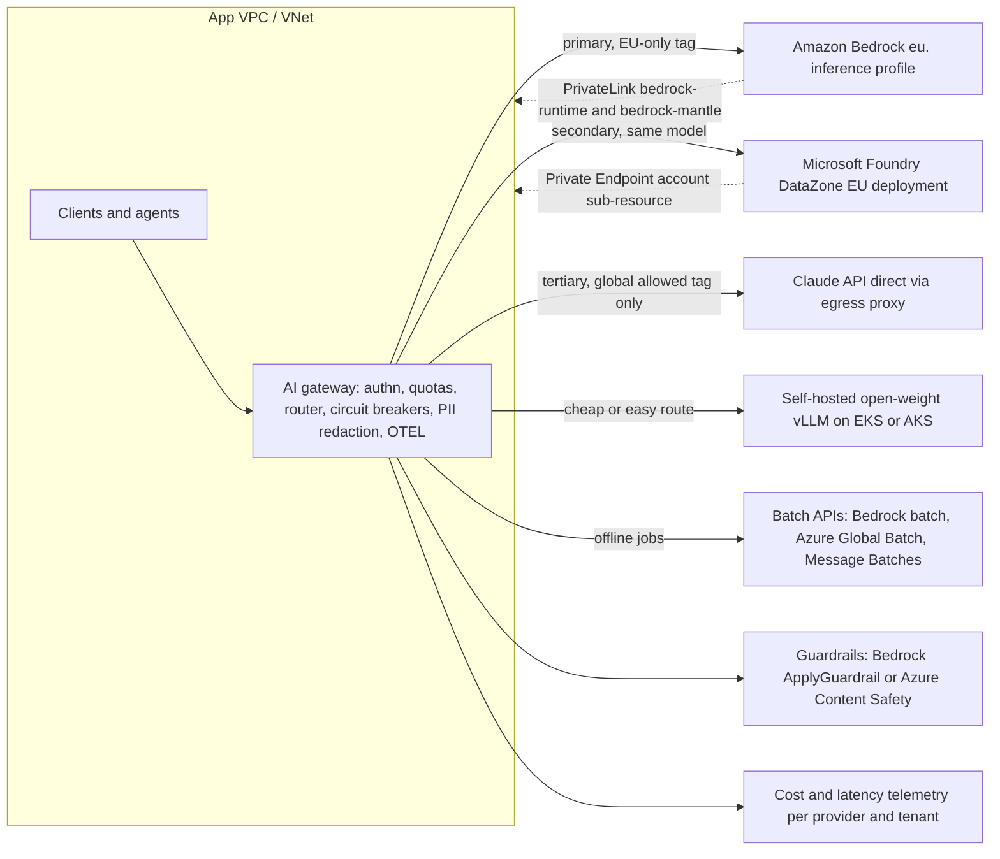
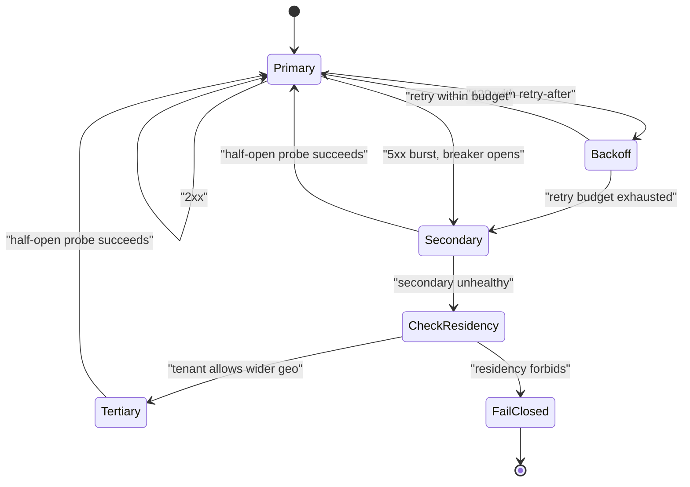

# K6 Managed model platforms
> Last verified: 2026-10 · Audience: senior/staff DevOps, SRE, AI eng, NetEng, DevSecOps, architects

## TL;DR
- **Default to buy (an API).** Self-hosting open-weight models only pays off with **sustained high GPU utilization**, a hard **data-control or sovereignty** requirement, or a need for **deep customization**. Hosted open-weight serving sits in between: Bedrock Custom Model Import, Foundry managed compute, Vertex Model Garden.
- There are **four ways to buy Claude**, and the operator and data processor differ for each:
  - **Claude API** (Anthropic operates and processes the data).
  - **Claude Platform on AWS** (Anthropic operates it; AWS handles IAM and billing).
  - **Claude in Amazon Bedrock** (AWS operates it, AWS is the processor, Anthropic has no operator access).
  - **Claude in Microsoft Foundry**, which comes in two versions: "Hosted on Azure" and "Hosted on Anthropic infrastructure".
  - **Vertex**, now branded *Gemini Enterprise Agent Platform*, also serves Claude.
- **Every hyperscaler uses the same three-way trade-off between where data is processed, how much it costs and how much capacity you get:**
  - **Global** routing: cheapest and highest quota.
  - **Geography / data zone** routing: about a **10% premium** on Bedrock and Vertex for Claude 4.5+, and **1.1x** for US-only on the Claude API and the Foundry US Data Zone.
  - **Single region**: the most constrained option.
- **There are three throughput modes everywhere.** Each has a different billing shape:
  - **On-demand pay-per-token**: shared pool, best effort, 429s under load.
  - **Reserved / provisioned capacity**: Bedrock Reserved tier or Provisioned Throughput model units (MUs), Azure provisioned throughput units (PTUs), Vertex Provisioned Throughput, Anthropic Priority Tier.
  - **Async batch**: about **50% off**, with a 24 h target.
- **Quotas are not alike, and the differences matter in an interview:**
  - Anthropic counts **only uncached input** against ITPM, and `max_tokens` does **not** count toward OTPM.
  - Azure OpenAI reserves **prompt plus `max_tokens`** against TPM up front and enforces RPM in **1 s or 10 s windows**.
  - Bedrock reserves tokens up front, then reconciles to actual usage.
- **Private networking and guardrails are platform features, not model features:**
  - Private connectivity: Bedrock PrivateLink (`bedrock-runtime`, `bedrock-mantle`, `bedrock-agent-runtime`), Azure Private Endpoint (`account` sub-resource), Vertex Private Service Connect (PSC) on Google Cloud.
  - Guardrails: Bedrock **Guardrails** (`ApplyGuardrail` works with any model) and Azure **content filters / Prompt Shields**.
  - Foundry applies **no built-in content filter to Claude** deployments.
- **Multi-provider fallback is a gateway concern.** Build it as a router with per-provider circuit breakers, model-equivalence maps, prompt-cache awareness, and a residency policy that **forbids falling back across a compliance boundary**.
- **Price shapes to know cold:**
  - Input and output per MTok, with output 4–5x input.
  - Prompt cache writes at 1.25x (5 min TTL) or 2x (1 h TTL); cache reads at 0.1x, or 0.05x / 0.025x on the newest Claude models.
  - Batch at 0.5x.
  - Priority at a premium (Gemini 1.8x).
  - Reservations billed per hour or per month.
  - The Claude 4.7+ tokenizer produces about **30% more tokens** for the same text.

## K6.1 Build vs buy: API vs self-hosted open-weight
- **How it works:**
  - **Buy (closed API):** Claude, GPT and Gemini through a first-party API or a hyperscaler. There is zero infra work, frontier quality and per-token opex. The vendor sets lifecycle dates and quotas.
  - **Buy, hosted open-weight:** Llama, Mistral, Qwen, DeepSeek, gpt-oss, Gemma and Nova-class models are served per token by Bedrock, Foundry ("Foundry Models from partners and community") or Vertex Model Garden. You pick the open weights for license, cost or portability reasons, but the platform runs them.
  - **Hosted bring-your-own-weights:** Bedrock **Custom Model Import** / custom models, which need Provisioned Throughput or on-demand depending on the model. Foundry **managed compute**, which bills per VM-hour and **does not use** the Standard/PTU deployment types. Vertex endpoints on your own GPUs.
  - **Build (self-host):** vLLM, SGLang or TensorRT-LLM on EKS, AKS, GKE or bare metal. You own GPUs, autoscaling, KV-cache tuning, model upgrades, safety filtering and on-call. See [K4 serving](K4-llm-serving-inference.md).
- **TCO model.** Say this out loud in an interview:
  - Self-host $/MTok ≈ `(GPU $/hr × GPUs per replica × replicas) / (tokens/sec × 3600 × utilization / 1e6)`, plus engineering FTEs, plus the eval/safety stack, plus idle and headroom capacity for redundancy across N+1 AZs.
  - Utilization is the killer variable. A replica sized for p99 latency at peak sits at 20–40% average utilization unless you have batch backfill.
  - API $/MTok is flat. It stays linear in volume and falls further with caching (0.1x reads or less) and batch (0.5x).
  - Hidden self-host costs:
    - GPU reservation commitments (1–3 years) to get decent prices.
    - Multi-region DR capacity.
    - Model refresh every 3–6 months.
    - Red-teaming and abuse monitoring that the API vendor would otherwise do.
    - Supply-chain scanning of weights (see [L6](../L-data-privacy-ai-security/L6-secrets-supply-chain.md)).
- **Data control spectrum** (low to high):
  1. Public API with default retention.
  2. API with **ZDR** or contractual no-training.
  3. Hyperscaler-operated model inside your cloud boundary, e.g. Bedrock: provider has no access, PrivateLink, CloudTrail.
  4. Hosted open weights in your tenancy.
  5. Self-hosted in your VPC or on-prem / air-gapped.
- **Licensing:** open-weight does not mean open source.
  - Llama's community license has use-policy and large-MAU clauses.
  - Many Mistral, Qwen and gpt-oss releases are Apache-2.0. Check per model.
  - Gemma has its own terms.
- **Trade-offs / when to use:**
  - **Buy** for frontier reasoning or agentic quality, spiky traffic, small teams, fast iteration, and when the needed residency is met by geo/data-zone routing.
  - **Self-host** for:
    - Air-gapped or sovereign needs that no cloud region satisfies.
    - Very high steady volume on a small model (classification, embeddings, rerank).
    - Custom architectures or heavy fine-tunes.
    - Latency at the edge.
    - Avoiding per-token pricing on a 24/7 saturated workload.
  - **Hybrid** (most common at scale): frontier API for hard tasks, a small self-hosted or hosted open model for high-volume easy tasks, and a router in front (see [K7 gateways](K7-ai-gateways-caching-cost.md)).
- **Interview angles:**
  - If asked "should we self-host Llama to save money?", say: compute the utilization-adjusted $/MTok against the API with caching and batch applied. Include FTEs and DR. Self-hosting usually loses below sustained high utilization and wins only for small models at high steady volume.
  - Pitfall: comparing GPU list price against API list price while ignoring prompt caching. Cache hits make API input about 90–97.5% cheaper.
  - Pitfall: assuming hyperscaler-hosted means self-hosted. On Bedrock the model runs in AWS-owned **model deployment accounts**. That is good for data control, but you still can't pin hardware, tune kernels or guarantee capacity without reserved or provisioned capacity.

## K6.2 Amazon Bedrock
### Catalog and access
- **Providers in the catalog as of 2026-10:** Amazon (Nova Micro/Lite/Pro, **Nova 2 Lite / Nova 2 Sonic**, Nova Canvas/Reel, Titan and Nova embeddings), **Anthropic** (Claude 5.x, 4.x and Claude 3 Haiku), Meta **Llama** 3.x/4, **Mistral** (Large 3, Devstral 2, Pixtral, Ministral), DeepSeek, Qwen3, OpenAI (gpt-oss plus GPT-5.x/6 cards), Cohere (Command, Embed, Rerank), AI21, Writer, Google Gemma, MiniMax, Moonshot Kimi, NVIDIA Nemotron, Z.AI GLM, xAI Grok, Stability, Luma, TwelveLabs. There is also Bedrock Marketplace for more.
- **Two Claude integrations:**
  - **Legacy** `InvokeModel` / `Converse` with ARN-style IDs and inference profiles. Covers Claude Opus 4.6 and earlier.
  - **"Claude in Amazon Bedrock"**. Covers Opus 4.7+ plus Haiku 4.5.
    - Exposes the native **Messages API** at `https://bedrock-mantle.{region}.api.aws/anthropic/v1/messages` with model IDs like `anthropic.claude-opus-5-5`.
    - Auth is SigV4 (`bedrock-mantle:CreateInference`), a Bedrock service role, or short-term bearer tokens (`x-api-key`; block long-term keys with the `bedrock:BearerTokenType` condition).
    - Not supported there: structured outputs, Files API / URL sources, server tools (web search/fetch, code execution), MCP connector, Message Batches, Managed Agents, server-side `fallbacks`.
- **Claude quotas on Bedrock:** the default is **2M input TPM**. You can request up to **5M input TPM / 500K output TPM** without Anthropic approval. RPM is enforced by AWS separately.
- **Data terms:** model providers have **no access** to the per-region **model deployment accounts**, so they never see prompts, completions or logs. AWS is the data processor. Model invocation logging to S3 or CloudWatch is **opt-in**. CloudTrail records API calls.

### Throughput modes (service tiers)
| Tier | How | Billing | Notes |
|---|---|---|---|
| **Standard** | default (`service_tier` omitted or `"default"`) | per token | shared on-demand quota |
| **Priority** | `service_tier: "priority"` | per-token premium | served ahead of Standard and Flex; no reservation needed |
| **Flex** | `service_tier: "flex"` | per-token discount | for delay-tolerant work (evals, summarization, agents) |
| **Reserved** | contract via AWS account team | fixed $ per 1K TPM per month, 1- or 3-month term | min **100K input TPM / 10K output TPM**; overflows to Standard; targets **99.5%** uptime; TPM counts `InputTokenCount + CacheWriteInputTokens` |
| **Provisioned Throughput** | purchase **Model Units (MUs)** | hourly, with no-commit, **1-month** or **6-month** terms | **required for custom / fine-tuned models**; **not usable with inference profiles** or batch |
| **Batch inference** | JSONL in S3, then a job, with output written to S3 | discounted (about 50% for supported models; see pricing page) | no tool calling or structured output; EventBridge notifications |
- Priority, Standard and Flex **share** the on-demand quota. Reserved capacity is separate.
- The CloudWatch dimension `ResolvedServiceTier` shows which tier actually served each request.

### Cross-Region inference (CRIS)
- **Geographic profiles** (`us.`, `eu.`, `apac.`/`jp.`/`au.` prefixes): routed within the geography for residency, at standard price.
- **Global profiles** (`global.`): routed to any commercial region, about **10% cheaper**.
- Price is based on the **source region**. There is no extra routing fee. Traffic stays on the AWS backbone, encrypted.
- Routing can reach **regions not enabled** in your account.
- CloudTrail logs the request in the source region, with `additionalEventData.inferenceRegion` recording where it ran.
- **SCP gotcha:** a geographic profile needs *all* destination regions allowed. A global profile needs `aws:RequestedRegion = "unspecified"` allowed. Region-deny SCPs silently break CRIS.
- For Claude on the new endpoint, the **global** endpoint carries no premium, while **regional** endpoints are **+10%**. Some regions are "in-region only" (us-east-1/2, us-west-2, eu-west-1, eu-north-1, ap-northeast-1, ap-southeast-4).

### Guardrails, Knowledge Bases, Agents, Evals
- **Guardrails** have these policy types:
  - Content filters: Hate, Insults, Sexual, Violence, Misconduct, Prompt Attack, applied to text and images. The **Standard tier** also inspects code (comments, identifiers, string literals).
  - Denied topics.
  - Word filters (with a managed profanity list).
  - Sensitive info: probabilistic PII detection plus custom regex, set to **block or mask**.
  - **Contextual grounding** checks for RAG hallucination and relevance.
  - **Automated Reasoning checks**, which validate against formal logic rules.
- How Guardrails are applied:
  - Attach a guardrail inline (ID plus version) or call **`ApplyGuardrail`** standalone. The standalone call works with **any model, including non-Bedrock or self-hosted ones**.
  - Supports **cross-Region guardrail profiles** and **organization-level enforcements** across accounts.
  - Reasoning content blocks are not evaluated.
- **Knowledge Bases** are managed RAG: ingest from S3 and other connectors, chunk, embed, and write to a vector store, then call `Retrieve` or `RetrieveAndGenerate`. Store options include OpenSearch Serverless, Aurora pgvector, S3 Vectors, Pinecone, Redis, MongoDB and Neptune GraphRAG *(store list from memory, unverified)*. See [K3](K3-rag-pipelines.md).
- **Bedrock Agents** are classic: action groups backed by Lambda/OpenAPI plus KBs.
- **AgentCore** is the framework- and model-agnostic agent platform. Components:
  - **Runtime**: serverless, session-isolated microVMs, MCP/A2A support.
  - **Gateway**: turns APIs and Lambdas into MCP tools.
  - **Memory**, **Identity**, **Code Interpreter**, **Browser**.
  - **Observability**: OpenTelemetry (OTEL) to CloudWatch.
  - **Evaluations**, **Policy** (a Cedar-compatible policy language that intercepts tool calls at the Gateway), **Registry**, **Harness** (a managed agent loop), Optimization, Payments.
  - AgentCore *may use and store content to improve the service for you*. Read the terms. See [K8](K8-agents-tool-use-mcp.md).
- **Model evaluation:** Bedrock Evaluations supports automatic, LLM-as-judge, human and RAG evaluations *(feature names from memory)*. See [K9](K9-llmops-evals-guardrails.md).

### Private networking
- Interface endpoints:
  - `com.amazonaws.<region>.bedrock` (control plane)
  - `bedrock-runtime` (InvokeModel/Converse)
  - **`bedrock-mantle`** (Messages API / OpenAI-compatible, DNS `bedrock-mantle.<region>.api.aws`)
  - `bedrock-agent`, `bedrock-agent-runtime`
  - FIPS variants in US and Canada regions
- Endpoint policies can restrict actions and model ARNs. Combine with IAM conditions and SCPs. See [G7](../G-cloud-network-architecture/G7-service-endpoints-private-link.md).
- **Interview angles:**
  - If asked "how do you keep Bedrock traffic private and EU-only?", say:
    - PrivateLink endpoints for `bedrock-runtime`/`bedrock-mantle` with private DNS.
    - Endpoint policy limited to the approved model / inference-profile ARNs.
    - An `eu.` geographic inference profile or a regional endpoint.
    - An SCP that denies `global.` profiles, i.e. denies `RequestedRegion=unspecified`.
    - CloudTrail checks on `inferenceRegion`.
    - KMS CMKs on KBs and logs.
  - If asked "why are we getting 429s on Bedrock with low traffic?", check:
    - Whether the quota is per model per region.
    - Whether `max_tokens` is reserved up front against TPM.
    - Output-token burndown multipliers on newer Claude models *(e.g. 5x; verify on the quotas page)*.
    - Whether you're on the legacy integration vs Mantle.
    - Whether you should move to CRIS, Priority or Reserved.

## K6.3 Microsoft Foundry (Azure OpenAI + Foundry Models)
- **Naming history:** Azure AI Studio became **Azure AI Foundry**, which became **Microsoft Foundry** (with a "new Foundry" vs "Foundry (classic)" portal). Azure AI Services became **Foundry Tools**. Azure OpenAI is now "Azure OpenAI in Foundry Models". The resource provider is still `Microsoft.CognitiveServices`.
- **Model sources:**
  - **Foundry Models sold by Azure:** Azure OpenAI GPT/o-series plus Microsoft-sold DeepSeek, Llama, etc.
  - **Models from partners and community:** sold by the provider through **Azure Marketplace**.
  - **Managed compute:** your own VMs, outside the deployment types.
  - **Instant access (preview):** call a model by name without creating a deployment.
- **Deployment types** (the SKU names appear in Terraform and CLI):

| Type | SKU | Data processed | Billing |
|---|---|---|---|
| Global Standard | `GlobalStandard` | any Azure region | per token; highest quota; new models land here first |
| Data Zone Standard | `DataZoneStandard` | US / EU (EU Data Boundary) / APAC zone | per token |
| Standard | `Standard` | customer's Azure geography | per token; lowest quota; models arrive last |
| Global / Data Zone / Regional Provisioned | `GlobalProvisionedManaged` / `DataZoneProvisionedManaged` / `ProvisionedManaged` | as named | **$/PTU/hr**, or Azure Reservations (1 month / 1 year) |
| Global / Data Zone Batch | `GlobalBatch` / `DataZoneBatch` | as named | **50% off**, 24 h target, separate enqueued-token quota |
| Developer | `DeveloperTier` | any | fine-tuned model eval only; 24 h lifetime; no SLA |

- **Data at rest** stays in the resource's geography for every type. **Inference** follows the type's scope. Microsoft may add regions to a data zone without notice.
- **Request-level processing tiers on Global Standard:** **Priority processing**, which has a per-model latency target and is also on Data Zone Standard, and **Flex processing**, which is cheaper and delay-tolerant.
- **PTU (provisioned throughput units):**
  - **Model-independent** quota, scoped per subscription × region × deployment type.
  - **Quota ≠ capacity.** A deployment can fail even when you have quota, so check the Model Capacities API.
  - Each model has a minimum PTU count and its own TPM per PTU.
  - Cached input tokens don't consume PTU capacity.
  - **Reservations are a billing discount only** and don't guarantee capacity. Deploy first, then buy the reservation.
  - **Spillover** sends overflow to a Standard deployment in the same resource. Configure it on the deployment or per request with `x-ms-spillover-deployment`. Supported for Azure OpenAI models only.
- **Claude in Foundry:**
  - Comes in two versions:
    - **Version 1, "Hosted on Anthropic infrastructure":** runs outside Azure, with the broadest feature set (Files API, web fetch).
    - **Version 2, "Hosted on Azure":** runs end-to-end on Azure, GA.
  - Endpoint: `https://<resource>.services.ai.azure.com/anthropic/v1/messages`, using the native Messages API with `anthropic-version: 2023-06-01`, the `AnthropicFoundry` SDK, and Entra ID (scope `https://ai.azure.com/.default`) or a key. Mythos models are Entra-only.
  - Deployment types: **Global Standard** for all models. **Data Zone Standard (US)** only for the Hosted-on-Azure versions of Haiku 4.5/5.5, Sonnet 5/5.5, Opus 4.8/5/5.5, which bills at **1.1x**, the same as `inference_geo: "us"`.
  - Billing: an **Azure Marketplace** subscription metered in **Claude Consumption Units (CCU), 1 CCU = $0.01**, at Claude API list prices. Not available on CSP, free-trial or credit-only subscriptions.
  - Follows the **Claude API lifecycle**, which Bedrock and Vertex don't.
  - **Foundry applies no built-in content filtering to Claude.** Add Azure AI Content Safety / Prompt Shields yourself.
  - **ZDR errors:** Covered Models (Fable/Mythos) fail with 400 on subscriptions that have ZDR enabled.
- **Content filters** ("Guardrails + controls"):
  - Four harm categories (hate, sexual, violence, self-harm) × severities (safe/low/medium/high), configured separately for input and output.
  - Optional **Prompt Shields**: user prompt attacks (jailbreak) and **indirect attacks**, which need document delimiters.
  - Protected material for text and code, the latter required for Customer Copyright Commitment coverage.
  - **Groundedness** (streaming only, limited regions), PII, **Task Adherence** for agents, and blocklists.
  - Turning filters **off or annotate-only on output requires approval** for modified content filtering.
  - Behaviour: a blocked prompt returns **HTTP 400** `content_filter`. A blocked completion returns `finish_reason: content_filter`. If the filter itself is down, the request succeeds **unfiltered** with a `content_filter_results.error`, so check for it.
  - Streaming mode filters in near-real time.
- **Private networking:**
  - Set `public_network_access = Disabled`.
  - Add a **Private Endpoint** on the `account` sub-resource.
  - Private DNS zones `privatelink.openai.azure.com`, `privatelink.cognitiveservices.azure.com` and `privatelink.services.ai.azure.com` for AIServices/Foundry resources.
  - Prefer Entra ID/managed identity, and set `disableLocalAuth=true` to kill keys.
  - Agents, evaluation and fine-tuning may need outbound or managed-VNet configuration *(details vary by feature, unverified)*.
- **Fine-tuning:** Azure OpenAI supports SFT, DPO and RFT on select models. Deploy the result with a Developer (eval) or Standard/PTU type *(method list from memory)*. See [K5](K5-training-fine-tuning.md).
- **Agents and evals:**
  - **Foundry Agent Service**, the Microsoft Agent Framework (which supports Claude), and Foundry evaluations (LLM-judge, safety evaluators).
  - Azure Policy can **deny deployment SKUs**, e.g. block `GlobalStandard` for regulated subscriptions.
- **Interview angles:**
  - If asked "EU customer needs EU-only processing on Azure OpenAI", say:
    - `DataZoneStandard` or `DataZoneProvisionedManaged` in an EU region (EU Data Boundary, including EFTA).
    - An Azure Policy denying `Global*` SKUs.
    - Private Endpoint plus Entra ID.
    - Note that Global gets new models first, so there is a model-availability lag.
  - Pitfall: treating Global Standard as "multi-region HA". If the primary region of a Global or Data Zone Standard deployment has an outage, its traffic is affected. Use **multiple resources in multiple regions behind APIM / a gateway**.

## K6.4 Anthropic Claude API (direct) and Claude Platform on AWS
- **Current models (2026-10, docs.claude.com → platform.claude.com):**

| Model | API ID | $/MTok in / out | Context / max out | Thinking (default effort) |
|---|---|---|---|---|
| Claude Fable 5.1 | `claude-fable-5-1` | 10 / 50 | 1M / 128K | adaptive, always on (`high`) |
| Claude Opus 5.5 (recommended default) | `claude-opus-5-5` | 4 / 20 | 1M / 128K | adaptive, always on (`medium`) |
| Claude Sonnet 5.5 | `claude-sonnet-5-5` | 2 / 10 | 1M / 128K | adaptive (`high`) |
| Claude Haiku 5.5 | `claude-haiku-5-5` | 0.10 / 0.50 (≤100K-token prompt); 0.50 / 2.50 above that | 1M / 128K | adaptive (`medium`) |

  - Legacy models still served: Fable 5, Opus 5, Opus 4.5–4.8, Sonnet 5, Sonnet 4.6, Haiku 4.5.
  - Mythos 5.1/5 have limited access through the Cyber Verification Program.
  - Dateless IDs from 4.6 onward are pinned snapshots.
  - Bedrock IDs take the form `anthropic.<id>`. Vertex and Foundry use the bare ID; on Foundry you send the **deployment name**.
  - Retirement is committed no sooner than about September–October 2027 for the 5.5 line. That date applies to Anthropic-operated platforms only; **Bedrock and Vertex set their own dates**.
- **Feature set:**
  - **Prompt caching:**
    - Automatic caching uses top-level `cache_control`. Explicit caching allows up to **4 breakpoints**, with a 20-block lookback.
    - Prefix order is `tools → system → messages`.
    - TTL is 5 min (writes 1.25x) or 1 h (writes 2x).
    - **Reads cost 0.1x**, or **0.05x on Opus 5.5 / Sonnet 5.5** and **0.025x on Fable/Mythos 5.1**.
    - Minimum cacheable prompt is 512 tokens on 5.5-gen models (1,024–4,096 on older ones).
    - Isolation is **per workspace** on the Claude API, Claude Platform on AWS and Foundry, but per organization on Bedrock and Vertex.
  - **Message Batches API:**
    - **50% off**. Each batch holds up to 100K requests. Results come back asynchronously, usually under 24 h.
    - Up to 300K output tokens on batch with the `output-300k-2026-03-24` beta header.
    - Not ZDR-eligible.
  - **Tool use:**
    - Client tools plus Anthropic-defined bash, text editor, computer/browser toolsets and memory.
    - Server tools: web search at **$10 per 1K searches**; web fetch with no surcharge; code execution with 1,550 free container-hours per month, then $0.05/hr, and free when combined with web search/fetch.
    - Also: tool search, MCP connector, programmatic tool calling, strict tool use / structured outputs.
    - Tool definitions add a system-prompt overhead of about 286–675 tokens depending on model.
  - **Thinking:**
    - **Adaptive thinking plus `effort`** (`low`…`max`) is the current mode.
    - **Extended thinking** (`thinking.type: "enabled"` with `budget_tokens`) is **deprecated on 4.6 and rejected on Opus 4.7+ and Opus 5.x**. Migration questions are likely.
  - **Files API:** upload once and reference by `file_id`. Not ZDR-eligible and not on Bedrock.
  - **Citations** cover documents and `search_result` blocks.
  - **Fast mode:** research preview on Opus 5.5/5/4.8, priced at $8/$40 for Opus 5.5. First-party only and not available with batch.
  - **Data residency:** `inference_geo: "us"` costs **1.1x**, and `global` is the default. Set `allowed_inference_geos` and `default_inference_geo` per workspace. Workspace geo (storage) is US-only.
- **Rate limits** (organization level, per model class, **token bucket**):
  - Tiers are Start, Build, Scale and Custom, with monthly spend caps of **$500 / $1K / $200K / none**.
  - Example: Opus 5.5 is 1K RPM / **2M ITPM** / 400K OTPM on Start, and 10K / 10M / 2M on Scale.
  - **Cache reads do not count toward ITPM** on current models. At an 80% hit rate, 2M ITPM gives an effective 10M input tokens per minute.
  - **OTPM counts actual output**, so a large `max_tokens` costs no rate-limit headroom.
  - A 429 returns `retry-after` plus `anthropic-ratelimit-{requests,input-tokens,output-tokens}-{limit,remaining,reset}` headers.
  - A **spend-cap 429 has no `retry-after`** and carries `error_code: enforced_spend_limit_reached`. Don't retry-loop on it.
  - **Acceleration limits** throttle sudden ramps.
  - **Workspace limits** can partition org capacity.
  - **Priority Tier** buys committed TPM; `inference_geo: "us"` burns down 1.1x.
- **Claude Platform on AWS:**
  - The full Claude API (`/v1/*`, Skills, code execution, betas) at `aws-external-anthropic.{region}.api.aws`.
  - Operated by **Anthropic**, which is the data processor. AWS supplies SigV4/IAM auth (`aws-external-anthropic:CreateInference`) and AWS Marketplace CCU billing.
  - Supports **PrivateLink**.
  - Has a separate capacity pool from both the first-party API and Bedrock.
  - Choose **Bedrock** instead for FedRAMP High, IL4/IL5, HIPAA-ready, or when "AWS must be the sole processor".
- **Data use:**
  - API data is **not used for training** without permission.
  - **ZDR** is contractual and per organization. It covers Messages and token counting. It does **not** cover: batch, Files, code execution, MCP connector, Agent Skills, Managed Agents, the Console, or **Covered Models** (Fable/Mythos 5.x require **30-day retention**).
  - ZDR orgs can't use CORS, so call through a backend proxy.
  - **HIPAA readiness:** BAA via the Console. Applies to the first-party API only, not Claude Platform on AWS or Foundry. JSON schemas used for structured outputs are cached separately, so keep PHI out of them.
- **Interview angles:**
  - If asked "why choose the direct API over Bedrock?", say: same-day features (Files, batch, server tools, MCP connector, Managed Agents, fast mode) and workspace-scoped caching.
  - If asked "why choose Bedrock?", say: AWS is the processor, IAM/VPC/CloudTrail-native, consolidated billing, FedRAMP/HIPAA, and Guardrails/KBs/AgentCore next to it.
  - Pitfall: the newer tokenizer (Claude 4.7+) yields about 30% more tokens per text, so re-baseline cost and context budgets when migrating.

## K6.5 Gemini API and Vertex AI (Gemini Enterprise Agent Platform)
- **Two front doors:**
  - **Gemini API** (ai.google.dev / AI Studio): API key, free tier plus paid tier. On the **free tier, data may be used to improve products. On the paid tier it is not.**
  - **Vertex AI**, now documented as **Gemini Enterprise Agent Platform**: Google Cloud IAM, VPC Service Controls (VPC-SC), PSC/private endpoints, CMEK, regional/multi-region/global endpoints, Model Garden partner models including **Claude** and open weights.
- **Models (2026-10):**
  - **Gemini 3.8 Flash** (`gemini-3.8-flash`) is the newest stable model. Paid pricing is $0.75 in / $3.75 out per MTok through 2026-12-31, doubling to $1.50 / $7.50 from 2027-01-01.
  - Also 3.8 Live and 3.8 Flash TTS, with 3.7/3.6 Flash and 3.5 Flash-Lite as previous generations.
  - **2.5 models are restricted** to prior users.
  - Context windows weren't listed on the page fetched. Assume 1M-class *(unverified)*.
- **Context caching:**
  - **Implicit caching is on by default** for Gemini 2.5+.
  - **Explicit** cached-content objects are available in `generateContent`, but not in the Interactions API.
  - Minimum size: 4,096 tokens on 3.x Flash, 2,048 on 2.5.
  - Cached input on 3.8 Flash costs $0.075/MTok, i.e. **0.1x**, **plus hourly storage** for explicit caches.
- **Grounding:** Google Search grounding and Maps grounding each get 5,000 free requests per month, then **$14 per 1K**. Vertex also offers grounding on your own data (Vertex AI Search / RAG Engine).
- **Throughput:**
  - **Standard PayGo** uses **dynamic shared quota (DSQ)**, a shared pool with no fixed per-project quota for Gemini, so you get 429s under global contention.
  - **Priority PayGo** costs **1.8x** on the Gemini API.
  - **Flex PayGo** and **Batch** cost **0.5x**.
  - **Provisioned Throughput** is a fixed-term commitment in GSUs (now documented as "GAUs") with **spillover to PayGo**. It covers Gemini **and partner models like Claude**. Terms are typically 1 week to 1 year *(unverified)*.
- **Claude on Vertex:** **global, multi-region and regional** endpoints. Regional and multi-region carry a **10% premium**. Google sets the model lifecycle. Cache isolation is per organization.
- **Interview angles:**
  - If asked "Vertex 429 RESOURCE_EXHAUSTED with low usage", say: DSQ contention. Use backoff, the global endpoint, Provisioned Throughput, or Priority PayGo.
  - Pitfall: prototyping on the AI Studio free tier with real customer data, which is used for product improvement.

## K6.6 Quotas, rate limits and throttling
- **What gets metered:**

| Platform | Units | Pre-reservation | Window | Cached tokens |
|---|---|---|---|---|
| Claude API | RPM, **ITPM**, **OTPM** per model class | ITPM estimated then adjusted; OTPM = actual output | token bucket, continuous refill; 60 RPM may be enforced as 1/s | **cache reads excluded** from ITPM |
| Bedrock | RPM + TPM per model per region (plus CRIS/global quotas) | reserves input + `max_tokens`, then reconciles *(see quotas-token-burndown)* | per minute | cache writes count; Reserved sizing = input + cache-write |
| Azure OpenAI | TPM per sub × region × model × deployment type; RPM derived (6 RPM per 1K TPM on older chat models; 1 RPM per 1K/6K/10K TPM on reasoning models) | **prompt estimate + `max_tokens` + `best_of`** | RPM evaluated over **1 s or 10 s** windows | PTU: cached input doesn't consume capacity |
| Claude in Foundry | RPM, uncached ITPM, OTPM per subscription type | like the Claude API | n/a | per Foundry quota docs |
| Vertex / Gemini | RPM/TPM per tier; DSQ on PayGo | n/a | per minute | n/a |

- **Throttling playbook:**
  1. **Classify the 429.**
     - Your own quota: raise or rebalance quota.
     - Shared-pool capacity, e.g. Azure "temporarily unable" or a lowered `x-ratelimit-limit-tokens`, or Vertex DSQ: back off, go global, or buy capacity.
     - Spend cap (Anthropic, no `retry-after`): page a human.
  2. **Honour `retry-after` / `retry-after-ms`**, otherwise use exponential backoff with **full jitter**. Cap retries. Never let SDK retries stack on top of your own: set the SDK `max_retries=0` when you wrap it.
  3. **Shape traffic.** Use a token-aware client-side limiter (leaky bucket on estimated tokens), ramp gradually (acceleration limits, Azure 1 s windows), and set `max_tokens` close to real need on Azure and Bedrock.
  4. **Add capacity.**
     - Spread across deployments, regions and inference profiles.
     - Use Priority for spikes.
     - Use Reserved / PTU / Provisioned Throughput for steady baseline load.
     - Use **spillover** (Azure PTU → Standard, Bedrock Reserved → Standard, Vertex PT → PayGo).
  5. **Reduce demand.** Prompt caching raises effective ITPM on Claude. Move offline work to batch, which has separate quota pools. Use smaller models for easy routes.
- **Interview angles:**
  - If asked "429s even though Azure metrics show low tokens", say: the rate limiter counts *estimated* tokens including `max_tokens` and rejected requests, and enforces RPM per second. Metrics show *billed* tokens.
  - Size reserved capacity on **p95 sustained TPM** and let spillover absorb peaks. Don't size on peak, or you waste committed spend.
  - Link to SLOs: availability SLIs should count 429s after retries as errors for user-facing paths (see [J1](../J-sre/J1-slis-slos-error-budgets.md), [J5 capacity](../J-sre/J5-capacity-planning-load-testing.md)).

## K6.7 Multi-provider routing and fallback
- **Why:** provider incidents, regional capacity exhaustion, model deprecations, price arbitrage and negotiating leverage. **Why not:** prompts aren't portable across model families, there are eval and safety differences per model, residency constraints, and caches don't carry over.
- **Pattern:**
  - An **AI gateway** handles authn/z, per-tenant quotas, token-aware rate limiting, routing, **circuit breakers**, retries, semantic and prompt-cache-aware routing, guardrails, PII redaction, cost attribution and OTEL traces. Options: APIM AI gateway, LiteLLM, Envoy AI Gateway, Kong, Cloudflare AI Gateway. See [K7](K7-ai-gateways-caching-cost.md).
  - Prefer **same model, different platform** before **different model**. For example, Claude Sonnet 5.5 can go Bedrock (`eu.` profile) → Foundry (Hosted on Azure) → Claude API. All use the Messages API shape and the same IDs apart from the `anthropic.` prefix. Fewer prompt and eval regressions than swapping in GPT or Gemini.
  - Keep a **model-equivalence map**, e.g. tier "frontier" = {Opus 5.5 on Bedrock, Opus 5.5 on Foundry, Gemini 3.8 Flash}, with **per-target prompt templates** and eval gates (see [K9](K9-llmops-evals-guardrails.md)).
  - **Residency-aware routing:** tag each target with its processing geography. A request labelled EU-only may only fail over among EU targets (Bedrock `eu.`, Foundry DataZone EU, Vertex EU multi-region). **If none are healthy, fail closed.**
  - **Cache affinity:** sticky routing per conversation keeps Anthropic or Bedrock prompt caches warm. A failover means a cold cache, so expect a 10–40x jump in input cost per request during the incident and plan the budget.
  - **Streaming:** a mid-stream provider failure can't transparently resume. Either retry the whole turn (make tools idempotent) or surface a partial-result error.
  - Anthropic offers a **server-side `fallbacks` parameter** on the first-party API (not on Bedrock). Use client-side fallback elsewhere *(semantics not deeply verified)*.
- **Interview angles:**
  - If asked to "design 99.95% for an LLM feature on top of providers with no or low latency SLAs", say:
    - Two or more platforms × two or more regions behind a gateway, with health-based routing.
    - Reserved/PTU for the baseline.
    - Graceful degradation to a smaller model or a cached answer.
    - Error budget accounting per provider.
  - Pitfall: a fallback loop amplifies an outage (retry storms). Use circuit breakers with half-open probes and a global retry budget (see [C3](../C-large-scale-architecture/C3-reliability.md)).

## K6.8 Residency, privacy and contract terms
| Question | Claude API | Claude Platform on AWS | Bedrock | Foundry (Azure OpenAI) | Claude in Foundry | Vertex | Gemini API |
|---|---|---|---|---|---|---|---|
| Who operates inference | Anthropic | Anthropic (on AWS infra for new workspaces) | AWS (provider has no access) | Microsoft | Azure (v2) / Anthropic (v1) | Google | Google |
| Data processor | Anthropic | Anthropic | AWS | Microsoft | Anthropic per Claude docs; check the hosting-comparison page for v2 *(unverified)* | Google | Google |
| Training on your data | No, without permission | No | No | No | No | No | **Free tier: may be used**; paid tier: no |
| Residency knobs | `inference_geo` us/global (1.1x); workspace geo US | `inference_geo`; workspace bound to a region | geographic / global CRIS; regional +10% | Global / DataZone / Standard (geo) | Global; US Data Zone (1.1x) | global / multi-region / regional (+10% for Claude) | limited |
| ZDR / retention | ZDR by contract; Covered Models need 30 days | ZDR on request | Bedrock data-protection terms; invocation logs opt-in | abuse monitoring; modified abuse monitoring by approval *(unverified detail)* | Anthropic manages ZDR per subscription | Google Cloud terms | paid-tier terms |
| HIPAA / FedRAMP | HIPAA-ready (BAA) | no HIPAA | HIPAA-eligible, FedRAMP High, IL4/5 (per Anthropic guidance) | per Azure compliance | no HIPAA readiness | per Google Cloud compliance | n/a |
- **Separate the residency layers:**
  - **Inference location**: where the GPU runs.
  - **Storage at rest**: files, batches, caches, logs.
  - **Control-plane metadata**: billing and identity.
  - **Abuse-monitoring retention.**
  - **Sub-processors.**
- Contracts to review: DPA, sub-processor list, BAA, EU Data Boundary statement, model provider AUP, and indemnity (Microsoft Customer Copyright Commitment requires certain filters).
- See [L3 residency](../L-data-privacy-ai-security/L3-residency-compliance.md), [L5 governance](../L-data-privacy-ai-security/L5-model-data-governance.md), [L1 PII](../L-data-privacy-ai-security/L1-data-classification-pii.md).
- **Interview angles:**
  - "Global routing" ≠ "data leaves the EU at rest". Most platforms keep **stored** data in the home geography even when inference is global. Say both halves.
  - Prompt caches are tenant-isolated (workspace or organization) and never shared across organizations. Mention this when asked whether caching leaks data.
  - Pitfall: enabling the Files API, batch or code execution in a ZDR org silently moves you outside ZDR scope. Gate these features in the gateway.

## K6.9 Pricing shapes and cost modelling
- **Shapes:**
  - **Per-token**: input < output, typically 1:5.
  - **Long-context tiers**: Haiku 5.5 above 100K prompt tokens. Claude 4.6+ (except Haiku 5.5) gets 1M context at flat price.
  - **Cache writes** at a premium and **cache reads** at a deep discount.
  - **Batch / Flex** at 0.5x.
  - **Priority** premium: Gemini 1.8x; Bedrock/Azure priced per model.
  - **Geo premium**: +10% regional on Bedrock/Vertex for Claude, 1.1x US on the Claude API/Foundry.
  - **Reserved**: Bedrock Reserved per 1K TPM per month, Bedrock PT per MU-hour, Azure per PTU-hour or reservation, Vertex PT per GSU-term.
  - **Tool surcharges**: web search $10/1K on Claude, $14/1K grounding on Gemini.
  - **Agent runtime**: Claude Managed Agents at $0.08 per session-hour; AgentCore consumption-based.
  - **Marketplace CCU** ($0.01) on Claude Platform on AWS and Foundry.
- **Worked example.** RAG chat on Opus 5.5 with 1M requests per month, a 20K-token cached system+docs prefix, 1K uncached input and 500 output:
  - Cache reads: 20K × 1M × $0.20/MTok = **$4,000**.
  - Uncached input: 1K × 1M × $4/MTok = **$4,000**.
  - Output: 500 × 1M × $20/MTok = **$10,000**.
  - Total ≈ **$18K per month**.
  - Without caching, input would be 21K × 1M × $4 = $84K, so ≈ **$94K**.
  - Cache writes add a few hundred dollars if the prefix is refreshed every 5 minutes.
- **Levers, in rough order of impact:**
  1. Model right-sizing via routing.
  2. Prompt caching.
  3. Batch/Flex for offline work.
  4. Output-length control (`effort`, `max_tokens`, concise formats).
  5. Global routing where residency allows.
  6. Reserved capacity at high steady utilization.
  7. Negotiated private offers (AWS/Azure Marketplace, committed spend).
- **Interview angles:**
  - Always quote **cost per successful task**, not per token. Agent loops multiply tokens, so measure tokens per task in evals.
  - Watch tokenizer changes and the default `effort` level when migrating models. Both shift spend without any code change.

## Diagrams




## Cloud mapping: AWS vs Azure
| Capability | AWS Bedrock | Azure Microsoft Foundry | GCP Vertex (Gemini Enterprise Agent Platform) | Claude API (direct) | Gemini API | Key differences / gotchas |
|---|---|---|---|---|---|---|
| **Model access** | Hundreds of models: Nova, Claude, Llama, Mistral, DeepSeek, Qwen, gpt-oss, Cohere, etc.; Marketplace | Azure OpenAI plus Foundry Models (sold by Azure, partners and community); **Claude via Marketplace** | Gemini plus Model Garden (Claude, Llama, Mistral, open weights) | Claude only, same-day features | Gemini only | Bedrock and Vertex set their own Claude lifecycle; Foundry follows Anthropic's |
| **Claude API shape** | Messages API on `bedrock-mantle` (4.7+); legacy InvokeModel/Converse | Messages API at `/anthropic/v1/messages` | `rawPredict` / Messages via Vertex SDK | native | n/a | Bedrock lacks Files, batch, server tools and MCP connector on Mantle |
| **On-demand** | Standard tier plus Priority/Flex (`service_tier`) | Global / DataZone / Standard per-token; Priority and Flex processing | Standard PayGo (DSQ), Priority, Flex | Standard plus Priority Tier, fast mode | Standard, Priority 1.8x, Flex 0.5x | Azure reserves `max_tokens` against TPM; Anthropic doesn't count cache reads |
| **Reserved throughput** | **Reserved tier** (1/3 months, TPM) and **Provisioned Throughput** (MUs; no-commit, 1 or 6 months) | **PTU** hourly or Reservation (1 month / 1 year); spillover | **Provisioned Throughput** (GSU/GAU) with spillover | Priority Tier commitment | Provisioned via Vertex | Azure quota ≠ capacity; Bedrock PT can't be used with inference profiles |
| **Batch** | S3 JSONL jobs (about 50% off) | Global/DataZone Batch, 50%, 24 h | Batch prediction 50% | Message Batches 50% | Batch 50% | Claude batch not ZDR-eligible; Bedrock batch has no tool use |
| **Regional / data-zone routing** | Geographic CRIS (`us.`/`eu.`/`apac.`/`jp.`/`au.`), `global.` (~10% cheaper); Claude regional +10% | Global / **Data Zone** (US/EU/APAC) / Standard (geo) | global / multi-region / regional (+10% for Claude) | `inference_geo` us (1.1x) / global | limited | SCPs must allow `RequestedRegion=unspecified` for global CRIS |
| **Guardrails** | **Bedrock Guardrails**: content, topics, words, PII mask, grounding, Automated Reasoning; `ApplyGuardrail` works with any model | **Content filters**, Prompt Shields, protected material, groundedness, Task Adherence; **not applied to Claude** | Gemini safety settings, Model Armor *(unverified)* | model-level safety; `stop_reason: refusal` | safety settings | Azure blocks a filtered prompt with HTTP 400; turning filters off needs approval |
| **Private networking** | PrivateLink: `bedrock`, `bedrock-runtime`, `bedrock-mantle`, `bedrock-agent(-runtime)`, FIPS | Private Endpoint (`account`), `publicNetworkAccess=Disabled`, Entra ID | PSC / VPC-SC | none (public TLS; IP allowlisting *(unverified)*); use **Claude Platform on AWS + PrivateLink** | none | Claude Platform on AWS supports PrivateLink |
| **Fine-tuning** | Custom models / distillation / Custom Model Import (PT required to serve) | Azure OpenAI SFT/DPO/RFT; Developer deployment for eval | Gemini tuning, open-weight tuning | none public | limited | see [K5](K5-training-fine-tuning.md) |
| **RAG** | Knowledge Bases | Foundry IQ / Azure AI Search *(naming unverified)* | RAG Engine / Vertex AI Search | Citations, search_result blocks, Files | Google Search grounding ($14/1K) | |
| **Agents** | Bedrock Agents, **AgentCore** (Runtime, Gateway, Memory, Identity, Policy, Evals) | Foundry Agent Service, Microsoft Agent Framework | Agent Builder / Agent Engine, ADK | Managed Agents ($0.08/session-hr), Agent SDK, MCP connector | Interactions API, Deep Research agents | see [K8](K8-agents-tool-use-mcp.md) |
| **Evals** | Bedrock Evaluations; AgentCore Evaluations | Foundry evaluations (quality and safety) | Gen AI evaluation service | Console eval tools | none | see [K9](K9-llmops-evals-guardrails.md) |
| **Pricing shape** | per token; CRIS global -10%; Reserved per 1K TPM; PT per MU-hour | per token; PTU-hour / reservation; Claude in CCU | per token; GSU commitment; +10% regional | per token; 1.1x US; cache 0.05–0.1x | per token; free tier | Marketplace CCU = $0.01 (Foundry, Claude Platform on AWS) |

- **Roles:**
  - **Bedrock** is AWS's model-agnostic inference plus safety, RAG and agent plane, with IAM, CloudTrail, KMS and PrivateLink built in. AWS operates the models.
  - **Foundry** is Azure's equivalent. Azure OpenAI is first-party there, and other providers come through Marketplace. Content Safety is integrated, and access runs through Entra ID and Private Endpoint.
  - **Vertex** is the GCP analogue. It is the canonical home for Gemini and also offers Claude.
- **Important differences:**
  - **Quota scope.** Bedrock scopes per account × region × model, plus CRIS. Azure scopes per subscription × region × model × **deployment type**, with up to 30 resources per region. Anthropic scopes per org × model class, with optional workspace limits.
  - **Capacity guarantees.** Bedrock Reserved has a 99.5% uptime target. Azure PTU has a latency target, but quota ≠ capacity. Vertex PT spills over to PayGo.
  - **SLA.** On-demand is best-effort everywhere. Only provisioned or reserved modes come with throughput or latency commitments.
  - **Feature lag.** Same-day features land first on the Claude API and Claude Platform on AWS. Global SKUs come next on Azure. Regional and Standard SKUs come last.
- **Alternatives:**
  - Self-host vLLM/SGLang on **Kubernetes** (EKS/AKS/GKE) for open weights ([K4](K4-llm-serving-inference.md)).
  - **Cloudflare Workers AI / AI Gateway** for edge inference and a provider-agnostic gateway.
  - **Databricks Model Serving** (Foundation Model APIs plus external models) when the data platform is Databricks ([M3](../M-data-platforms/M3-databricks-platform.md)).

## Hands-on (optional)
```hcl
# AWS: private access to Bedrock runtime + Mantle (Claude Messages API) with a restrictive endpoint policy
variable "region" { default = "eu-central-1" }

resource "aws_vpc_endpoint" "bedrock_runtime" {
  vpc_id              = var.vpc_id
  service_name        = "com.amazonaws.${var.region}.bedrock-runtime"
  vpc_endpoint_type   = "Interface"
  subnet_ids          = var.private_subnet_ids
  security_group_ids  = [aws_security_group.bedrock_vpce.id] # allow 443 from app SGs only
  private_dns_enabled = true
  policy = jsonencode({
    Version = "2012-10-17"
    Statement = [{
      Effect    = "Allow"
      Principal = "*"
      Action    = ["bedrock:InvokeModel", "bedrock:InvokeModelWithResponseStream", "bedrock:Converse", "bedrock:ConverseStream"]
      Resource  = [
        "arn:aws:bedrock:*:*:inference-profile/eu.*",   # EU geographic profiles only
        "arn:aws:bedrock:*::foundation-model/*"           # profile -> underlying model ARNs
      ]
    }]
  })
}

resource "aws_vpc_endpoint" "bedrock_mantle" {
  vpc_id              = var.vpc_id
  service_name        = "com.amazonaws.${var.region}.bedrock-mantle"
  vpc_endpoint_type   = "Interface"
  subnet_ids          = var.private_subnet_ids
  security_group_ids  = [aws_security_group.bedrock_vpce.id]
  private_dns_enabled = true
  policy = jsonencode({
    Version   = "2012-10-17"
    Statement = [{ Effect = "Allow", Principal = "*", Action = ["bedrock-mantle:CreateInference"], Resource = "*" }]
  })
}
```

```hcl
# Azure: Foundry/Azure OpenAI account, private-only, EU Data Zone deployment, private endpoint
resource "azurerm_cognitive_account" "aoai" {
  name                          = "aoai-prod-weu"
  location                      = "westeurope"
  resource_group_name           = var.rg
  kind                          = "OpenAI"          # "AIServices" for a Foundry resource
  sku_name                      = "S0"
  custom_subdomain_name         = "aoai-prod-weu"   # required for Entra ID + private endpoint
  public_network_access_enabled = false
  local_auth_enabled            = false             # Entra ID only, no keys
  identity { type = "SystemAssigned" }
}

resource "azurerm_cognitive_deployment" "chat" {
  name                 = "chat-eu"
  cognitive_account_id = azurerm_cognitive_account.aoai.id
  model {
    format  = "OpenAI"
    name    = var.model_name      # e.g. a current GPT model
    version = var.model_version
  }
  sku {
    name     = "DataZoneStandard"  # EU data zone; GlobalStandard / ProvisionedManaged etc.
    capacity = 100                 # units of 1K TPM for Standard types; PTUs for provisioned
  }
  rai_policy_name = "Microsoft.DefaultV2"  # content filter policy
}

resource "azurerm_private_endpoint" "aoai" {
  name                = "pe-aoai-prod-weu"
  location            = "westeurope"
  resource_group_name = var.rg
  subnet_id           = var.pe_subnet_id
  private_service_connection {
    name                           = "aoai"
    private_connection_resource_id = azurerm_cognitive_account.aoai.id
    subresource_names              = ["account"]
    is_manual_connection           = false
  }
  private_dns_zone_group {
    name                 = "aoai"
    private_dns_zone_ids = [azurerm_private_dns_zone.openai.id] # privatelink.openai.azure.com
  }
}
```

```bash
# Claude API: Messages call with prompt caching, US-only inference and a tool
curl -s https://api.anthropic.com/v1/messages \
  -H "x-api-key: $ANTHROPIC_API_KEY" \
  -H "anthropic-version: 2023-06-01" \
  -H "content-type: application/json" \
  -d '{
    "model": "claude-opus-5-5",
    "max_tokens": 1024,
    "inference_geo": "us",
    "cache_control": {"type": "ephemeral"},
    "system": "You are an SRE assistant. <large runbook text here>",
    "tools": [{"name": "get_alerts", "description": "List firing alerts",
               "input_schema": {"type": "object", "properties": {"service": {"type": "string"}}, "required": ["service"]}}],
    "messages": [{"role": "user", "content": "Is checkout degraded?"}]
  }' | jq '{stop_reason, usage}'
# usage.cache_read_input_tokens / cache_creation_input_tokens / input_tokens / inference_geo

# Claude Message Batches (50% off, async)
curl -s https://api.anthropic.com/v1/messages/batches \
  -H "x-api-key: $ANTHROPIC_API_KEY" -H "anthropic-version: 2023-06-01" -H "content-type: application/json" \
  -d '{"requests":[{"custom_id":"t1","params":{"model":"claude-haiku-5-5","max_tokens":256,
        "messages":[{"role":"user","content":"Classify: disk full on db-3"}]}}]}' | jq '{id, processing_status}'

# Bedrock: list geographic/global inference profiles, then Converse via an EU profile
aws bedrock list-inference-profiles --region eu-central-1 \
  --query 'inferenceProfileSummaries[].inferenceProfileId' --output text
aws bedrock-runtime converse --region eu-central-1 \
  --model-id eu.amazon.nova-pro-v1:0 \
  --messages '[{"role":"user","content":[{"text":"Summarize: p99 latency up 3x after deploy"}]}]' \
  --inference-config '{"maxTokens":256,"temperature":0.2}' \
  --query 'output.message.content[0].text' --output text

# Claude in Amazon Bedrock (Messages API on bedrock-mantle, SigV4 via curl)
curl -s https://bedrock-mantle.us-east-1.api.aws/anthropic/v1/messages \
  --aws-sigv4 "aws:amz:us-east-1:bedrock-mantle" \
  --user "$AWS_ACCESS_KEY_ID:$AWS_SECRET_ACCESS_KEY" \
  -H "x-amz-security-token: $AWS_SESSION_TOKEN" \
  -H "content-type: application/json" -H "anthropic-version: 2023-06-01" \
  -d '{"model":"anthropic.claude-sonnet-5-5","max_tokens":512,
       "messages":[{"role":"user","content":"Hello from a VPC"}]}' | jq .usage

# Azure: check where capacity exists before creating a PTU/Standard deployment
az rest --method get --url "https://management.azure.com/subscriptions/$SUB/providers/Microsoft.CognitiveServices/modelCapacities?api-version=2024-10-01&modelFormat=OpenAI&modelName=$MODEL&modelVersion=$VER"
```

## Cross-links
- [K1 LLM fundamentals for infra](K1-llm-fundamentals-for-infra.md) for tokens, context and KV cache.
- [K4 LLM serving & inference](K4-llm-serving-inference.md) for the self-host side of build vs buy.
- [K5 Training & fine-tuning](K5-training-fine-tuning.md) for managed fine-tuning and Custom Model Import.
- [K7 AI gateways, caching & cost](K7-ai-gateways-caching-cost.md) for the router, semantic cache and cost controls.
- [K8 Agents, tool use & MCP](K8-agents-tool-use-mcp.md) for AgentCore, Foundry Agent Service and Managed Agents.
- [K9 LLMOps, evals & guardrails](K9-llmops-evals-guardrails.md).
- [K3 RAG pipelines](K3-rag-pipelines.md) for Knowledge Bases, grounding and citations.
- [G7 Service endpoints & Private Link](../G-cloud-network-architecture/G7-service-endpoints-private-link.md).
- [L3 Residency & compliance](../L-data-privacy-ai-security/L3-residency-compliance.md), [L2 Encryption & key management](../L-data-privacy-ai-security/L2-encryption-key-management.md), [L4 AI security threats](../L-data-privacy-ai-security/L4-ai-security-threats.md).
- [J1 SLIs/SLOs](../J-sre/J1-slis-slos-error-budgets.md), [J5 Capacity planning](../J-sre/J5-capacity-planning-load-testing.md), [C3 Reliability](../C-large-scale-architecture/C3-reliability.md).

## Sources
- https://platform.claude.com/docs/en/about-claude/models/overview
- https://platform.claude.com/docs/en/about-claude/pricing
- https://platform.claude.com/docs/en/api/rate-limits
- https://platform.claude.com/docs/en/build-with-claude/prompt-caching
- https://platform.claude.com/docs/en/manage-claude/data-residency
- https://platform.claude.com/docs/en/manage-claude/api-and-data-retention
- https://platform.claude.com/docs/en/build-with-claude/claude-in-amazon-bedrock
- https://platform.claude.com/docs/en/build-with-claude/claude-platform-on-aws
- https://docs.aws.amazon.com/bedrock/latest/userguide/cross-region-inference.html
- https://docs.aws.amazon.com/bedrock/latest/userguide/service-tiers-inference.html
- https://docs.aws.amazon.com/bedrock/latest/userguide/prov-throughput.html
- https://docs.aws.amazon.com/bedrock/latest/userguide/data-protection.html
- https://docs.aws.amazon.com/bedrock/latest/userguide/vpc-interface-endpoints.html
- https://docs.aws.amazon.com/bedrock/latest/userguide/guardrails.html
- https://docs.aws.amazon.com/bedrock/latest/userguide/batch-inference.html
- https://docs.aws.amazon.com/bedrock/latest/userguide/model-cards.html
- https://docs.aws.amazon.com/bedrock-agentcore/latest/devguide/what-is-bedrock-agentcore.html
- https://learn.microsoft.com/en-us/azure/foundry/foundry-models/concepts/deployment-types
- https://learn.microsoft.com/en-us/azure/foundry/foundry-models/concepts/claude-models
- https://learn.microsoft.com/en-us/azure/foundry/foundry-models/how-to/use-foundry-models-claude
- https://learn.microsoft.com/en-us/azure/foundry/openai/how-to/quota
- https://learn.microsoft.com/en-us/azure/foundry/openai/concepts/provisioned-throughput
- https://learn.microsoft.com/en-us/azure/foundry-classic/foundry-models/concepts/content-filter
- https://ai.google.dev/gemini-api/docs/models
- https://ai.google.dev/gemini-api/docs/pricing
- https://ai.google.dev/gemini-api/docs/caching
- https://docs.cloud.google.com/vertex-ai/generative-ai/docs/provisioned-throughput/overview
