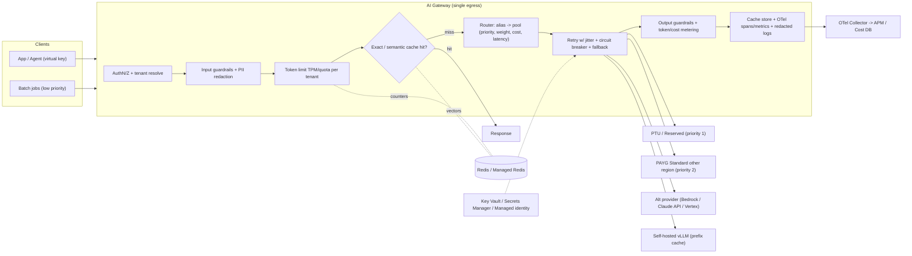
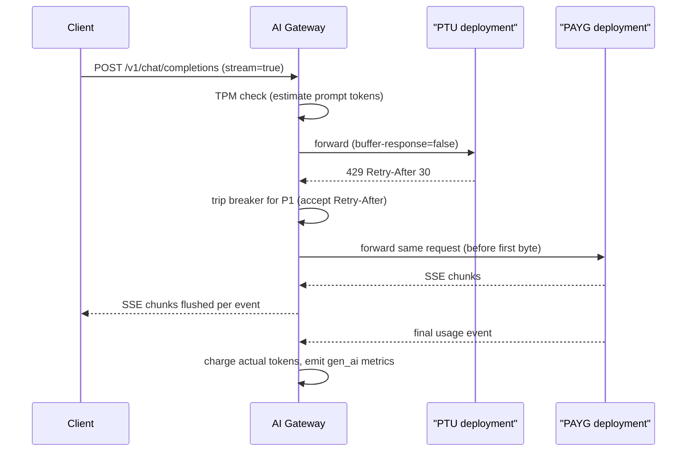

# K7 AI Gateways, Caching and Cost
> Last verified: 2026-10 · Audience: senior/staff DevOps, SRE, AI eng, NetEng, DevSecOps, architects

## TL;DR
- An **AI gateway** is the **single egress** for all LLM traffic. It handles identity, provider keys, routing and fallback, **token-based** quotas, caching, guardrails, PII redaction, and token/cost telemetry. It is an API gateway that understands tokens, model names and SSE.
- **Rate limit on tokens, not requests.** Use TPM per tenant plus a period quota (day or month). Return **429 + Retry-After** for rate limits and a distinct code for exhausted quotas (APIM returns 403). Accounting happens **after** the response, so concurrent requests can overshoot.
- **Routing:** priority pools put **PTU/reserved capacity first and spill over to pay-as-you-go**. Add a circuit breaker that honours `Retry-After`, cascades (cheap model → escalate), and A/B by weight. Retries need jitter and a **retry budget**.
- **Caching has three layers:** (1) **exact response cache**, which is safe but has a low hit rate; (2) **semantic cache**, which gets more hits but risks wrong answers and **cross-tenant leakage**, so partition by tenant and tune the threshold; (3) **provider prompt/prefix caching** (Claude, Bedrock, Azure OpenAI, Gemini, vLLM APC). Layer 3 is the biggest safe win for agents and RAG with long static prefixes.
- **Cost = Σ(tokens × rate) by token class** (input, cache write, cache read, output, reasoning). Do chargeback through gateway virtual keys/subscriptions, **Bedrock application inference profiles + cost allocation tags**, or APIM token metrics with dimensions. Use **Batch APIs (~50% off)** and Flex tiers for offline work.
- **Provisioned vs on-demand:** break-even is at sustained utilization. PTU/Reserved is billed **whether or not you use it**, so size for baseline and spill bursts to on-demand.
- **Streaming:** disable response buffering (APIM `buffer-response="false"`). Do not log bodies on SSE routes. Keep connections alive under idle timeouts (Azure LB **4 min**). Token limits on streams are **estimated** or charged at stream end.
- **Tools:** LiteLLM (OSS proxy, the basis of the AWS guidance), Portkey, Kong AI Gateway, **Envoy AI Gateway (renamed "Agent Router" in 2026)**, Cloudflare AI Gateway, and Azure APIM AI gateway. Observability uses OTel GenAI semconv ([J3.9](../J-sre/J3-observability.md#j39-observability-for-llm-apps-and-agents)).

## K7.1 AI gateway pattern
- **How it works:**
  - **Single egress / reverse proxy** between apps and agents and every model provider (Azure OpenAI/Foundry, Bedrock, Anthropic API, Vertex/Gemini, self-hosted vLLM). Apps hold a **gateway credential** (virtual key, APIM subscription key or Entra token). **Provider keys never leave the gateway**: they live in Key Vault or Secrets Manager, or the gateway uses managed identity / IAM role.
  - **Request pipeline (inbound → backend → outbound):**
    1. AuthN/Z (OAuth/JWT, mTLS, subscription key)
    2. Tenant resolution
    3. Prompt guardrails and **PII redaction**
    4. Token limit check
    5. Cache lookup
    6. Routing (model alias → deployment pool)
    7. Retries and fallback
    8. Response guardrails
    9. Token/cost metering
    10. Logging (with redaction)
    11. Cache store
  - **API normalization:** most gateways expose an **OpenAI-compatible** surface and translate to provider formats (LiteLLM supports 100+ providers; APIM has a **unified model API (preview)**; Cloudflare has a unified/universal endpoint). APIM's AI gateway supports the OpenAI Chat Completions/Responses, **Anthropic Messages (v2 tiers)** and Vertex AI schemas.
  - **Model aliasing:** apps call `chat-default` and the gateway maps it to a concrete model and version. This lets you migrate models or providers centrally without redeploying apps.
  - **Governance scope is now wider than LLMs:** APIM, Kong and Envoy/Agent Router also govern **MCP servers** and **A2A agent APIs** (see [K8](K8-agents-tool-use-mcp.md)).
- **Trade-offs / when to use:**
  - Gains: central policy, key hygiene, chargeback, provider portability and one audit point.
  - Costs: an **extra hop** (usually ms; negligible next to TTFT), a new **SPOF** (deploy multi-AZ or multi-region and keep it stateless with shared Redis/DB), and a "lowest common denominator" API. Provider-specific features such as `cache_control`, extended thinking and tool schemas can be lost in translation, so many gateways also offer **passthrough** routes.
  - **Build vs buy:** use managed (APIM, Cloudflare, Kong Konnect) for an enterprise control plane. Use OSS (LiteLLM, Envoy) for full control or self-hosted models. A **two-tier** pattern is common: a global edge gateway (auth/WAF) plus a platform AI gateway (tokens/routing).
- **Interview angles:**
  - "Design an enterprise LLM platform for 200 teams" → AI gateway with per-team virtual keys and budgets, model catalog with aliases, PTU-first priority pools, semantic cache partitioned per tenant, content safety, OTel token metrics, logs with PII redaction to a separate store, and **private networking** to providers (Private Link / VPC endpoints).
  - Pitfall: storing provider keys in app configs. Another pitfall: letting teams bypass the gateway. Enforce with **egress firewall/NSG/SCP** and Private Endpoints so only the gateway can reach provider endpoints (see [L7](../L-data-privacy-ai-security/L7-zero-trust-workload-identity.md)).
  - Guardrails at the gateway handle prompt injection, jailbreak and PII. Content filters (APIM `llm-content-safety` → Azure AI Content Safety; Bedrock Guardrails; Kong `ai-prompt-guard`/PII sanitizer). See [K9](K9-llmops-evals-guardrails.md) and [L4](../L-data-privacy-ai-security/L4-ai-security-threats.md).

## K7.2 Token-based rate limiting per tenant
- **How it works:**
  - **Why tokens:** provider capacity is sold as **TPM** (plus RPM). One 100k-token request costs as much as 1,000 small ones, so request-count limits (API Gateway usage plans, classic `rate-limit`) don't protect TPM.
  - **APIM `llm-token-limit`** (successor to `azure-openai-token-limit`):
    - `counter-key` can be any policy expression: subscription, tenant claim, IP.
    - Takes `tokens-per-minute` and/or `token-quota` + `token-quota-period` (Hourly/Daily/Weekly/Monthly/Yearly, fixed window aligned to UTC).
    - Exceeding the **TPM returns 429**; exceeding the **quota returns 403**. It emits `Retry-After` and remaining-tokens headers/variables.
    - Classic tiers use a **sliding window**; **v2 tiers use a token bucket**, so keep the TPM consistent when the same key is used at several scopes.
    - Counters are **per gateway/region, not aggregated** across a multi-region instance.
    - `estimate-prompt-tokens=true` checks before forwarding but costs latency. **Streaming always estimates.** Images are over-counted at up to 1,200 tokens. Concurrent requests can **temporarily exceed** the limit.
  - **Envoy AI Gateway / Agent Router:**
    - `llmRequestCosts` (InputToken, OutputToken, TotalToken, **CEL**, e.g. weighting cached tokens) are recorded into metadata and enforced by Envoy Gateway global rate limiting (`BackendTrafficPolicy`).
    - Budgets are checked at admission but **charged at response completion**. Streams are not cut mid-flight.
  - **LiteLLM:** `tpm_limit`/`rpm_limit`/`max_budget` per virtual key, user, team or org, plus model-level tpm/rpm. Needs **Redis** to share counters across replicas.
  - **Cloudflare AI Gateway:** **request-count** rate limiting per gateway (fixed or sliding window) returning 429. It is not token-aware.
  - **Provider-side limits still apply.** Prompt-cache reads **don't count toward ITPM** on Anthropic or Bedrock OpenAI models, which makes caching a rate-limit lever too.
- **Priority tiers:**
  - Give **separate pools/keys per class** (interactive P0, batch P2). Higher priority gets PTU/Reserved, lower priority goes to Standard/Flex or Batch.
  - Bedrock `service_tier` = `reserved | priority | default | flex`. On-demand quota is **shared** across priority, default and flex.
  - Azure deployment types: Provisioned, Priority processing, Standard, Batch.
  - Hierarchical budgets: an org quota contains team TPMs, which contain per-user TPMs. Shed load **lowest priority first**.
- **429 / backoff:**
  - Clients should use exponential backoff + **full jitter** and honour `Retry-After`. Gateways should not blindly retry 429s from a saturated deployment; **fail over to another pool** instead.
  - APIM circuit breaker with `acceptRetryAfter: true` handles Azure OpenAI `Retry-After` values that can be very large.
  - Keep a **retry budget** (e.g. ≤10% extra load) to avoid retry storms ([C3](../C-large-scale-architecture/C3-reliability.md)).
- **Trade-offs:** pre-estimation gives a tighter limit but adds latency and estimation error. Post-accounting is accurate but allows overshoot by the amount of concurrency. Local (per-node) counters are fast but approximate. A central Redis is exact but adds a hop and becomes a dependency (decide fail-open vs fail-closed).
- **Interview angles:**
  - "One tenant burns the shared PTU" → per-tenant TPM at the gateway, priority pools, quota 403 vs 429 semantics, dashboards on tokens by tenant.
  - Follow-up "how do you count streaming tokens?" → estimate input up front, count output as chunks arrive or from the final `usage` chunk (OpenAI `stream_options.include_usage`), then reconcile.

## K7.3 Model routing, fallback and A/B
- **How it works:**
  - **Static routing** by alias, tenant, data residency (EU tenants → EU deployments / Data Zone), or feature.
  - **Load balancing:** APIM backend **pools** support round-robin, weighted, **priority-based** (lower group used only when every higher-priority backend's breaker is open), and **session affinity** (cookie, e.g. for Assistants threads). Up to **30 backends per pool**. Balancing and breakers are **approximate**, per gateway instance.
  - **APIM circuit breaker:** one rule per backend (count or % of failures in an interval, status ranges such as 429/5xx, `tripDuration`, `acceptRetryAfter`). Returns **503** while open. Not available in Consumption tier.
  - **LiteLLM router:** `simple-shuffle` (weighted by tpm/rpm), `least-busy`, `usage-based-routing`, `latency-based-routing`, cost-based. `fallbacks`, **`context_window_fallbacks`**, **`content_policy_fallbacks`**, `default_fallbacks`; `num_retries`, `allowed_fails` + `cooldown_time`.
  - **Azure PTU spillover:** overflow requests (429 on a fully used PTU) go to a Standard deployment in the same resource, either always or per request with `x-ms-spillover-deployment`. Bedrock **Reserved tier overflows to Standard** automatically.
  - **Cross-region:** Bedrock **cross-Region (geo or global) inference profiles**; Azure **Global/Data Zone** deployments. These raise availability and throughput at the cost of residency scope.
- **Quality-aware routing:**
  - **Cascade:** cheap model first, escalate on low confidence, failed validation (schema/eval) or a hard classification. Saves cost when most traffic is easy, but doubles latency on escalations.
  - **Router classifier** (prompt complexity → model tier).
  - **Semantic routing** (embedding → route; Kong has a semantic load-balancing algorithm).
- **A/B and canary:**
  - Use weighted pools (90/10) keyed by **sticky user** hash. Compare cost, latency, eval score and feedback per arm, tagging spans with the variant.
  - **Shadow traffic** to a new model for offline eval (doubles cost; strip PII).
- **Trade-offs:**
  - Fallback to a different model family changes behaviour (prompt formats, tool-call fidelity), so eval-gate every fallback target.
  - Cross-provider fallback widens the **data-processing footprint** (DPA/residency, [L3](../L-data-privacy-ai-security/L3-residency-compliance.md)).
  - Session affinity improves prompt-cache hits but hurts balancing.
- **Interview angles:**
  - "Azure OpenAI returns 429 with Retry-After: 86400" → circuit breaker honouring Retry-After, priority pool to the next region/PTU, alert. Don't retry in place.
  - "Route to keep prompt caches warm" → **prefix/cache-key affinity**: same tenant + system prompt → same deployment/region (Azure `prompt_cache_key`, consistent hashing to vLLM replicas; see [K4](K4-llm-serving-inference.md)).

## K7.4 Response caching: exact and semantic
- **Exact (deterministic) cache:**
  - Key = hash(normalized request body: model, messages, tools, params) + tenant.
  - **Cloudflare:** identical-request only. Disabled by default. `cf-aig-cache-ttl` (60 s–1 month), `cf-aig-skip-cache`, `cf-aig-cache-key`, `cf-aig-cache-status: HIT|MISS`. The cache is volatile, so concurrent identical requests may both miss. Semantic caching is listed as planned.
  - **LiteLLM:** `redis`, `s3`, `gcs`, `local`, `disk`; per-request `Cache-Control: no-cache` / `s-maxage`, `x-litellm-cache-ttl`.
  - Safe only for **deterministic** use (temperature 0, FAQ bots, classification, embeddings). Embedding caches are the highest-ROI exact cache.
- **Semantic cache:**
  - Embed the prompt, vector-search prior prompts, and return the stored completion if similarity ≥ threshold.
  - **APIM:** `llm-semantic-cache-lookup` (inbound) + `llm-semantic-cache-store` (outbound, `duration` s).
    - Needs an embeddings backend and **Azure Managed Redis with RediSearch**. The module can only be enabled **at cache creation**.
    - `score-threshold` is a **distance**: **lower = stricter** (e.g. 0.05–0.15). `vary-by` partitions the cache (e.g. subscription/tenant). `ignore-system-messages`, `max-message-count`.
    - Microsoft advises adding a `rate-limit` **after** the lookup to protect backends if the cache is down.
  - **LiteLLM:** `redis-semantic` / `valkey-semantic` / `qdrant-semantic` with `similarity_threshold` (a **similarity**: **higher = stricter**, e.g. 0.75 in the docs, which is too loose for production). This is an easy interview trap.
  - **AWS:** **ElastiCache for Valkey 8.2 vector search** (HNSW/FLAT; Euclidean/cosine/IP; node-based clusters; no extra charge). AWS cites up to ~23% cost reduction at a 25% hit rate. **MemoryDB** vector search is the durable, Multi-AZ-log option.
- **Risks (say these in interviews):**
  - **False positives:** "cancel my order" vs "don't cancel my order" can sit close in embedding space. Negation, numbers, entities and dates are all hazards.
  - **Tenant/user leakage:** always partition (`vary-by`) by tenant and by authz scope. Never share across users when the answer contains personal or RAG-retrieved data.
  - **Staleness:** TTL plus invalidation when the source docs or system prompt change. Include the prompt-template version and model version in the key.
  - **Cache poisoning:** an attacker seeds a malicious answer for a popular question. Store only post-guardrail responses and consider caching only curated or verified answers.
  - **Context loss:** multi-turn chats with the same last message but different history. Include the conversation context or limit `max-message-count`.
  - **Latency and cost of the embed + vector search** on every request, which wastes money if the hit rate is low.
- **Trade-offs:**
  - A semantic cache pays off for high-repeat, low-personalization traffic (support FAQ, docs Q&A). Tune the threshold offline on labelled pairs (precision first), and monitor hit rate and **wrong-hit rate** via sampled evals.
  - Not worth it for agents or creative or personalized output; use prompt caching instead.
- **Interview angles:**
  - "Would you add a semantic cache?" → only with per-tenant partitioning, a strict threshold, versioned keys, short TTL and an eval-measured false-hit rate. Otherwise use exact cache + provider prefix caching.
  - Cross-link: general caching patterns in [C1](../C-large-scale-architecture/C1-performance.md); vector DBs in [K2](K2-embeddings-vector-databases.md).

## K7.5 Provider prompt caching and KV prefix cache
- **Concept:** the provider stores the **KV-cache of a prompt prefix**. A later request with a **byte-identical prefix** skips prefill, which cuts **TTFT** and input cost. The output is unchanged, so unlike a semantic cache there is **no correctness risk**. Order prompts **static → dynamic**: tools → system → documents → history → user turn.

| Provider | Activation | Min prefix | TTL | Pricing shape | Notes |
|---|---|---|---|---|---|
| **Claude API** | `cache_control` breakpoints (max **4**) or top-level **automatic caching** | **512** (Opus/Sonnet/Haiku 5.x), 1,024–4,096 older models | **5 min** default (refreshed on hit), **1 h** option | write **1.25×** (5 min) / **2×** (1 h); read is a small fraction (Opus 5.5: **$0.20 vs $4** base/MTok) | 20-block lookback; hierarchy tools→system→messages; cache reads **don't count to rate limits**; workspace-isolated on the Claude API, org-level on Bedrock/Vertex |
| **Bedrock** | Implicit (best effort) + explicit `cachePoint` (Converse) / `cache_control` (InvokeModel) | 512–4,096 by model (Nova: 1K, max 20K cached) | 5 min; 1 h on newer Claude | read at cache-read rate; writes may cost more | `inputTokens` **excludes** cached tokens: total = input + cacheRead + cacheWrite. **Not supported with batch inference**. Cross-region inference can cause more cache writes |
| **Azure OpenAI** | Automatic for prompts ≥1,024 tokens. GPT-5.6+: `prompt_cache_breakpoint`, `prompt_cache_key`, `prompt_cache_options` | **1,024** (identical first 1,024; 128-token increments pre-5.6) | In-memory: usually cleared after 5–10 min idle, always within 1 h. **Extended up to 24 h** (`prompt_cache_retention: "24h"`). GPT-5.6+: min **30 m** | Standard: discounted reads. **PTU: up to 100% discount, and cached tokens don't consume PTU**. GPT-5.6+ may charge writes | Not shared across subscriptions. Over ~15 RPM per key+prefix some requests miss, so shard keys |
| **Gemini** | **Implicit on by default** (2.5+); explicit `CachedContent` | 2,048 (2.5) / 4,096 (3.x Flash/Pro) | Explicit: default **1 h** (unverified this cycle) | Explicit caches also bill **storage per token-hour** (unverified) | `usage.total_cached_tokens` |
| **Self-hosted** | vLLM **Automatic Prefix Caching** (hash of KV blocks), SGLang **RadixAttention** | block size | evicted by LRU under memory pressure | free (GPU memory) | Needs **prefix-aware routing** across replicas (llm-d, KV-aware routers); see [K4](K4-llm-serving-inference.md) |

- **Trade-offs:**
  - A cache write costs more than plain input, so it only pays off if the prefix is reused within the TTL. On Claude, **one 5-min read already beats** the write premium (1.25 + 0.1 < 2.0). The 1 h TTL needs roughly ≥2 reuses.
  - Use the 1 h TTL when the gap between turns is over 5 min (human think-time, long agent sub-tasks).
  - **Anything that perturbs the prefix kills hits:** timestamps or request IDs in the system prompt, nondeterministic JSON key order in tools, tool-list reshuffles, changing `tool_choice` or images (Claude invalidation table).
- **Interview angles:**
  - "Agent costs exploded" → check the **cache hit ratio** (`cache_read / total input`). Agents resend a growing history, so cache it with automatic caching / a moving breakpoint. Expect large input-cost and TTFT reductions.
  - "Semantic vs prompt caching?" → prompt caching reuses **computation** (exact prefix, same answer quality). Semantic caching reuses **answers** (approximate, correctness risk). They are complementary.
  - The gateway must **pass through** cache directives and report cache tokens. Normalizing to OpenAI format can silently drop `cache_control`, so verify on your gateway.

## K7.6 Cost management and FinOps for LLMs
- **Cost per request:**
  - `uncached_in×P_in + cache_write×P_w + cache_read×P_r + out×P_out`. **Reasoning/thinking tokens are billed as output.** Add embeddings, rerank, vector DB, gateway compute and guardrail calls.
  - Output is typically **4–5× the input price**, so cap `max_tokens` and ask for terse/structured output.
- **Token accounting:**
  - Authoritative counts come from the **provider `usage` block**, not client tokenizers.
  - Watch provider semantics: Bedrock `inputTokens` excludes cache. On Claude, `input_tokens` covers only the tokens after the last breakpoint.
  - Store per request: tenant, app, feature, model, tier, the four token classes, cost, latency and cache status.
- **Chargeback / showback:**
  - **Gateway-level:** LiteLLM spend tracking per key/team/tag with budgets. APIM `llm-emit-token-metric` with custom **dimensions** (subscription, team, user) to App Insights, plus a built-in LLM analytics dashboard and prompt/completion logging.
  - **AWS native:** **Bedrock application inference profiles**. Create one per team/app (copying a foundation model or a cross-Region profile), **tag it**, activate **cost allocation tags**, and call InvokeModel/Converse with the profile ARN. Cost then splits by tag in Cost Explorer/CUR. Works for on-demand. Pricing is that of the model in the calling Region.
  - **Azure native:** separate Foundry resources/deployments per cost centre with **resource tags**, or one shared resource + APIM token metrics for chargeback. Reservation chargeback is in Cost Management.
- **Discount levers (biggest first):**
  - **Right-size the model:** routing/cascade, small models for classification and extraction.
  - **Prompt caching** (K7.5).
  - **Batch:**
    - Claude Message Batches: **50% off**, ≤100k requests or 256 MB per batch, most finish < 1 h, expire at 24 h, results kept 29 days, stacks with caching multipliers.
    - Azure **Batch** deployments are billed at a discounted rate.
    - Bedrock batch inference: S3 JSONL. Discount on the pricing page (commonly ~50%, unverified this cycle). **No tool calling or structured output; not for provisioned models.**
  - **Flex tier** (Bedrock `service_tier: flex`, discounted, slower).
  - **Prompt compression/trimming:** summarise history, drop irrelevant RAG chunks, rerank to fewer chunks, shorter system prompts. Tools like LLMLingua or Kong `ai-prompt-compressor` trade quality risk for fewer tokens.
- **Provisioned vs on-demand break-even:**
  - Azure **PTU** is billed $/PTU/hour **regardless of usage**. Hourly or a **1-month/1-year reservation**. Reservations **don't guarantee capacity**, so deploy first, then buy. There are minimum PTUs per model.
  - **Bedrock Reserved tier:** fixed price per 1K TPM, 1 or 3 months, min **100k input TPM / 10k output TPM**, 99.5% uptime target, overflows to Standard. Bedrock **Provisioned Throughput** (model units) exists for custom/fine-tuned models ([K6](K6-managed-model-platforms.md)).
  - Break-even utilisation ≈ `provisioned_cost_per_hour / (on-demand cost of the tokens that capacity can serve per hour)`.
    - Below that utilisation, on-demand is cheaper.
    - The common answer: **provision the steady baseline (P50–P70 of load) and spill peaks** to Standard/on-demand.
    - Cached tokens don't consume PTU capacity, which lowers the PTUs you need.
  - Provisioned also buys **latency SLAs and isolation from noisy neighbours**. It is not only a cost decision.
- **Interview angles:**
  - "Cut LLM spend 50% without hurting quality" → measure first (cost by feature), then caching, model routing, `max_tokens`/verbosity, batch for offline, RAG chunk diet, and PTU only at sustained utilisation. Gate every change with evals ([K9](K9-llmops-evals-guardrails.md)).
  - Pitfall: budgets enforced only monthly. Add **real-time budget alerts and hard caps** per key, because runaway agents loop.

## K7.7 Observability through the gateway
- The gateway is the natural choke point for **token and cost telemetry**. Emit OTel GenAI spans and metrics with **`gen_ai.provider.name`** (formerly `gen_ai.system`), `gen_ai.request.model`/`response.model` and `gen_ai.usage.*` including cache read/write. The semconv moved to the `semantic-conventions-genai` repo and is still Development status. Full detail in [J3.9](../J-sre/J3-observability.md#j39-observability-for-llm-apps-and-agents).
- Gateway-specific signals:
  - Cache status (exact/semantic/prompt) and hit ratios.
  - Fallback/retry counts by reason.
  - Breaker state per backend.
  - 429s by tenant vs provider.
  - Resolved tier (Bedrock `ResolvedServiceTier`).
  - TTFT and TPOT per route.
  - Spend vs budget per key.
- **Logging prompts and completions** (APIM → Azure Monitor/App Insights; LiteLLM callbacks → Langfuse/Datadog/S3; Cloudflare logs): **redact PII before persisting**, keep content in an access-controlled store with short retention, and keep only references and hashes on spans ([L1](../L-data-privacy-ai-security/L1-data-classification-pii.md)).
- Interview angle: "Who called which model, at what cost, and was it cached?" should be answerable from one gateway log line joined to `trace_id`.

## K7.8 Streaming (SSE) through gateways
- **How it works:**
  - LLM streaming = HTTP response with `Content-Type: text/event-stream`, chunked deltas, and a final usage event (OpenAI needs `stream_options.include_usage`; Anthropic sends `message_delta` usage).
  - Every hop must **flush per event**:
    - **APIM:** `forward-request buffer-response="false"`. Avoid `validate-content` and body logging to Azure Monitor/App Insights/Event Hubs on SSE APIs, because these buffer. Disable response caching. Long-running connections are not supported on the Consumption tier.
    - **Idle timeouts:** Azure LB idle timeout is **4 min**, so send keepalives. AWS ALB idle timeout defaults to **60 s** (configurable) and API Gateway REST integrations have historically capped at ~29 s, so use ALB/NLB or response streaming for long generations. **Nginx needs `proxy_buffering off`** (or `X-Accel-Buffering: no`). CDN/WAF in front can also buffer.
  - **Timeouts:** separate **time-to-first-byte timeout** (detects a stuck backend fast) from **total stream timeout** (long reasoning outputs). LiteLLM has `request_timeout` and `stream_timeout`.
- **Trade-offs:**
  - **Fallback after the first byte is impossible** without the client noticing. Retry or fail over only before streaming starts, or implement client-side resume.
  - Output guardrails on streams have three options:
    - Buffer the whole response (adds latency).
    - Check in chunks (partial unsafe text may leak).
    - Run async moderation and retract the message afterwards.
  - Token metering on streams is **estimated or post-hoc** (APIM estimates; Envoy charges at stream end), so expect overshoot.
  - Caching streamed responses requires reassembling them. Some gateways don't cache streams (Cloudflare docs don't commit).
- **Interview angles:**
  - "Users see responses arrive all at once" → something is buffering: an APIM policy/logging, Nginx `proxy_buffering`, compression middleware, or a CDN. Fix per hop and test with `curl -N`.
  - "Streams cut at exactly 60 s or 4 min" → idle timeout. Raise the ALB idle timeout, add SSE comment keepalives (`: ping`), or use TCP keepalive.

## K7.9 Gateway products compared
| Product | Type | Strengths | Token limits | Caching | Notes (2026) |
|---|---|---|---|---|---|
| **Azure APIM AI gateway** | Managed (all tiers; features vary) | Policies, Entra/managed identity, pools + breakers, content safety, MCP/A2A, Foundry integration | `llm-token-limit` (TPM + quotas) | Semantic (Azure Managed Redis + RediSearch) + classic response cache | `azure-openai-*` policies generalised to `llm-*`; unified model API (preview); "AI gateway in Foundry" (preview) |
| **LiteLLM** | OSS proxy (Python) + enterprise | 100+ providers, virtual keys, budgets, spend tracking, rich routers | tpm/rpm/budget per key/team/user (Redis) | redis, redis/valkey/qdrant-semantic, s3, gcs | Basis of the **AWS Multi-Provider GenAI Gateway guidance** (ECS/EKS, ALB, WAF, RDS, ElastiCache, Secrets Manager) |
| **Portkey** | SaaS + OSS gateway | Configs for fallback/retries/load-balancing, guardrails, observability, prompt mgmt | Per-key limits/budgets (unverified detail) | Simple + semantic (unverified detail) | Not re-verified this cycle |
| **Kong AI Gateway** | Kong plugins / Konnect | `ai-proxy(-advanced)` with LB incl. semantic, rate limiting, `ai-semantic-cache`, prompt guard, PII sanitizer, prompt compressor, MCP/A2A | AI rate limiting advanced (token-aware; enterprise) | Semantic cache plugin | Many advanced plugins are Enterprise-only (verify per plugin) |
| **Envoy AI Gateway → "Agent Router"** | OSS, K8s (Envoy Gateway control plane + Envoy data plane, ext_proc) | CRDs `AIGatewayRoute`, `AIServiceBackend`, `BackendSecurityPolicy`; provider failover; MCP | `llmRequestCosts` + global RL (charged at completion) | — (use upstream) | Renamed 2026, now an Agentic AI Foundation project; **API group `aigateway.envoyproxy.io` and CRDs unchanged**; docs v1.2 |
| **Cloudflare AI Gateway** | Edge SaaS, all plans | One-line base URL swap, analytics (tokens/cost), logging, retries/fallback (dynamic routing), DLP/guardrails | Request-count only (fixed/sliding) | Exact-match only, `cf-aig-*` headers | Edge PoPs; good for multi-provider startups |

## Diagrams




## Cloud mapping: AWS vs Azure
| Capability | AWS | Azure | Role it plays | Key differences | Alternatives |
|---|---|---|---|---|---|
| Managed AI gateway | **No first-party token-aware AI gateway**. Use the **Multi-Provider GenAI Gateway guidance** (LiteLLM on ECS/EKS + ALB + WAF + RDS + ElastiCache + Secrets Manager), or **API Gateway + Lambda** for custom token logic | **APIM AI gateway** (llm-token-limit, semantic cache, pools, breakers, content safety, MCP) | Single egress, policy, keys, routing | Azure is turnkey policy XML. AWS is assemble-it-yourself or OSS. API Gateway usage plans are **request**-based, not token-based | Kong, Cloudflare AI Gateway, Portkey, Envoy/Agent Router on EKS/AKS |
| Token rate limiting | Custom (LiteLLM/Redis, Lambda + DynamoDB counters) plus Bedrock account quotas (TPM/RPM per model) | `llm-token-limit` (429/403, per counter-key) | Fair share per tenant | APIM counters are per-region gateway; Bedrock quotas are per account/Region | Envoy `llmRequestCosts`, Kong AI rate limiting |
| Cost allocation | **Bedrock application inference profiles + cost allocation tags**, CUR/Cost Explorer | Resource tags per Foundry resource/deployment, APIM `llm-emit-token-metric` dimensions, Cost Management | Chargeback/showback | AWS tags a *profile* you invoke by ARN. Azure splits by resource or gateway metrics | LiteLLM spend tracking, Cloudflare analytics |
| Semantic cache store | **ElastiCache for Valkey 8.2 vector search** (node-based), **MemoryDB** (durable), OpenSearch | **Azure Managed Redis** (RediSearch at creation) | Vector similarity on prompts | MemoryDB is durable/multi-AZ log; ElastiCache is in-memory. Azure Cache for Redis Enterprise → Azure Managed Redis | Qdrant, Redis Cloud, Kong/LiteLLM plugins |
| Provider prompt caching | Bedrock implicit + explicit `cachePoint` (5 min/1 h) | Azure OpenAI automatic (≥1,024), extended 24 h, PTU up to 100% discount | Prefix KV reuse | Bedrock: Claude/Nova/OpenAI rules vary per model. Azure: OpenAI models | Claude API (`cache_control`), Gemini implicit/explicit, vLLM APC |
| Capacity / tiers | Reserved tier (TPM, 1/3 mo), Priority, Standard, **Flex**, Batch, Provisioned Throughput (custom models) | PTU (Global/Data Zone/Regional) hourly or reservation, Priority processing, Standard, Batch, spillover | Cost vs latency guarantee | Bedrock Reserved overflows to Standard natively. Azure spillover is to a Standard deployment | Anthropic Priority Tier, GCP Provisioned Throughput |
| Cross-region routing | Cross-Region inference profiles (geo/global) | Global / Data Zone deployments | Availability, throughput | Both trade residency scope for capacity | Gateway multi-region pools |
| Guardrails | Bedrock Guardrails (ApplyGuardrail API, usable from any gateway) | Azure AI Content Safety (`llm-content-safety` policy), Prompt Shields | Input/output safety, PII | Bedrock Guardrails has PII masking built in | Kong AI prompt guard/PII, LiteLLM guardrails, Cloudflare DLP |
| Secrets / identity to providers | Secrets Manager, IAM roles (SigV4 to Bedrock) | Key Vault, **managed identity** to Azure OpenAI (`Cognitive Services User`) | No static keys in apps | Both support keyless to first-party models; third-party providers still need keys | Vault, External Secrets |

- **APIM** is a regional resource (multi-region gateways in Premium). Token counters, LB and breakers are **per gateway instance and not synchronized**. The v2 tiers use token-bucket rate limiting. Backend pools allow up to 30 backends. The circuit breaker is not available in Consumption.
- **AWS** has no direct APIM equivalent for LLMs. Interview answer: "AWS API Gateway gives auth, WAF and request throttling. For token-aware governance I'd run LiteLLM (AWS's own guidance) or Kong on ECS/EKS, use **application inference profiles** for Bedrock cost tags and ElastiCache Valkey vector search for semantic cache."
- **Bedrock application inference profiles** solve *attribution*, not *throttling*. Pair them with gateway limits.
- Gotcha: Bedrock prompt caching is **unavailable in batch inference**, and cross-Region inference may increase cache writes. Azure prompt caches are **not shared across subscriptions**. Claude caches are **workspace**-isolated on the Claude API but org-level on Bedrock/Vertex.
- Alternatives: **Cloudflare AI Gateway** for an edge-hosted, zero-ops multi-provider proxy; **Kubernetes** + Envoy/Agent Router or Kong for self-hosted platforms; **Claude** via the Claude API / Bedrock / Vertex / Foundry behind any of these.

## Hands-on (optional)
LiteLLM proxy with Postgres (keys, spend) and Redis (shared TPM counters, response cache). Substitute current model IDs.

```bash
mkdir -p litellm && cd litellm
cat > config.yaml <<'EOF'
model_list:
  - model_name: chat-default            # alias apps call
    litellm_params:
      model: anthropic/claude-sonnet-4-5
      api_key: os.environ/ANTHROPIC_API_KEY
      tpm: 400000
  - model_name: chat-default            # second deployment in same pool
    litellm_params:
      model: bedrock/us.anthropic.claude-sonnet-4-5-20250929-v1:0
      aws_region_name: us-east-1
      tpm: 200000
  - model_name: chat-cheap
    litellm_params:
      model: anthropic/claude-haiku-4-5
      api_key: os.environ/ANTHROPIC_API_KEY
router_settings:
  routing_strategy: simple-shuffle      # weighted by tpm/rpm
  redis_host: redis
  redis_port: 6379
litellm_settings:
  num_retries: 2
  request_timeout: 120
  stream_timeout: 30
  allowed_fails: 3
  cooldown_time: 30
  fallbacks: [{"chat-default": ["chat-cheap"]}]
  cache: true
  cache_params:
    type: redis
    host: redis
    port: 6379
general_settings:
  master_key: os.environ/LITELLM_MASTER_KEY
  database_url: os.environ/DATABASE_URL
EOF
```

```yaml
# docker-compose.yml
services:
  litellm:
    image: ghcr.io/berriai/litellm:main-stable   # pin a release tag in prod
    command: ["--config", "/app/config.yaml", "--port", "4000"]
    ports: ["4000:4000"]
    volumes: ["./config.yaml:/app/config.yaml:ro"]
    environment:
      LITELLM_MASTER_KEY: ${LITELLM_MASTER_KEY}   # must start with sk-
      LITELLM_SALT_KEY: ${LITELLM_SALT_KEY}       # encrypts stored provider creds; never rotate casually
      DATABASE_URL: postgresql://llm:llm@db:5432/litellm
      ANTHROPIC_API_KEY: ${ANTHROPIC_API_KEY}
      AWS_REGION: us-east-1                       # Bedrock via task role / env creds
    depends_on: [db, redis]
  db:
    image: postgres:16
    environment: {POSTGRES_USER: llm, POSTGRES_PASSWORD: llm, POSTGRES_DB: litellm}
  redis:
    image: redis:7
```

```bash
export LITELLM_MASTER_KEY=sk-master-$(openssl rand -hex 8) LITELLM_SALT_KEY=sk-salt-$(openssl rand -hex 8)
docker compose up -d

# Issue a per-team virtual key with model allow-list, TPM cap and USD budget
curl -s http://localhost:4000/key/generate \
  -H "Authorization: Bearer $LITELLM_MASTER_KEY" -H 'Content-Type: application/json' \
  -d '{"models":["chat-default","chat-cheap"],"tpm_limit":20000,"rpm_limit":60,
       "max_budget":50,"budget_duration":"30d","metadata":{"team":"search"}}' | jq -r .key

TEAM_KEY=sk-...   # from above
# OpenAI-compatible call; -N disables curl buffering to see SSE chunks as they arrive
curl -N http://localhost:4000/v1/chat/completions \
  -H "Authorization: Bearer $TEAM_KEY" -H 'Content-Type: application/json' \
  -d '{"model":"chat-default","stream":true,"messages":[{"role":"user","content":"ping"}]}'

# Check spend for the key, and show headers (cache key, remaining limits)
curl -s "http://localhost:4000/key/info?key=$TEAM_KEY" -H "Authorization: Bearer $LITELLM_MASTER_KEY" | jq '.info.spend'
curl -si http://localhost:4000/v1/chat/completions -H "Authorization: Bearer $TEAM_KEY" \
  -H 'Content-Type: application/json' -d '{"model":"chat-cheap","messages":[{"role":"user","content":"2+2?"}]}' \
  | grep -iE 'x-litellm|x-ratelimit'
```

## Cross-links
- [J3.9 Observability for LLM apps and agents](../J-sre/J3-observability.md#j39-observability-for-llm-apps-and-agents): OTel GenAI semconv, TTFT/TPOT metrics
- [J5 Capacity planning](../J-sre/J5-capacity-planning-load-testing.md): sizing PTU/Reserved TPM
- [K1 LLM fundamentals for infra](K1-llm-fundamentals-for-infra.md): tokens, context, KV cache basics
- [K2 Embeddings & vector DBs](K2-embeddings-vector-databases.md): semantic cache store
- [K4 LLM serving & inference](K4-llm-serving-inference.md): vLLM prefix caching, prefix-aware routing
- [K6 Managed model platforms](K6-managed-model-platforms.md): Bedrock/Foundry/Vertex quotas, provisioned throughput
- [K8 Agents, tool use & MCP](K8-agents-tool-use-mcp.md): MCP gateways
- [K9 LLMOps, evals & guardrails](K9-llmops-evals-guardrails.md): eval-gated routing, guardrails
- [L1 Data classification & PII](../L-data-privacy-ai-security/L1-data-classification-pii.md), [L3 Residency](../L-data-privacy-ai-security/L3-residency-compliance.md), [L4 AI security threats](../L-data-privacy-ai-security/L4-ai-security-threats.md)
- [C1 Performance (caching)](../C-large-scale-architecture/C1-performance.md), [C3 Reliability (retries, breakers)](../C-large-scale-architecture/C3-reliability.md)

## Sources
- https://learn.microsoft.com/en-us/azure/api-management/genai-gateway-capabilities
- https://learn.microsoft.com/en-us/azure/api-management/llm-token-limit-policy
- https://learn.microsoft.com/en-us/azure/api-management/azure-openai-enable-semantic-caching
- https://learn.microsoft.com/en-us/azure/api-management/backends
- https://learn.microsoft.com/en-us/azure/api-management/how-to-server-sent-events
- https://learn.microsoft.com/en-us/azure/foundry/openai/how-to/prompt-caching
- https://learn.microsoft.com/en-us/azure/foundry/openai/concepts/provisioned-throughput
- https://docs.aws.amazon.com/solutions/multi-provider-generative-ai-gateway-on-aws/
- https://docs.aws.amazon.com/bedrock/latest/userguide/inference-profiles.html
- https://docs.aws.amazon.com/bedrock/latest/userguide/prompt-caching.html
- https://docs.aws.amazon.com/bedrock/latest/userguide/service-tiers-inference.html
- https://docs.aws.amazon.com/bedrock/latest/userguide/batch-inference.html
- https://aws.amazon.com/blogs/database/announcing-vector-search-for-amazon-elasticache/
- https://docs.aws.amazon.com/memorydb/latest/devguide/vector-search.html
- https://platform.claude.com/docs/en/build-with-claude/prompt-caching
- https://platform.claude.com/docs/en/build-with-claude/batch-processing
- https://ai.google.dev/gemini-api/docs/caching
- https://developers.cloudflare.com/ai-gateway/ (features/caching, features/rate-limiting)
- https://docs.litellm.ai/docs/simple_proxy (proxy/deploy, proxy/caching, proxy/reliability, routing-load-balancing)
- https://theagentrouter.ai/docs/ (formerly aigateway.envoyproxy.io; capabilities/traffic/usage-based-ratelimiting)
- https://developer.konghq.com/ai-gateway/
- https://opentelemetry.io/docs/specs/semconv/gen-ai/gen-ai-spans/
