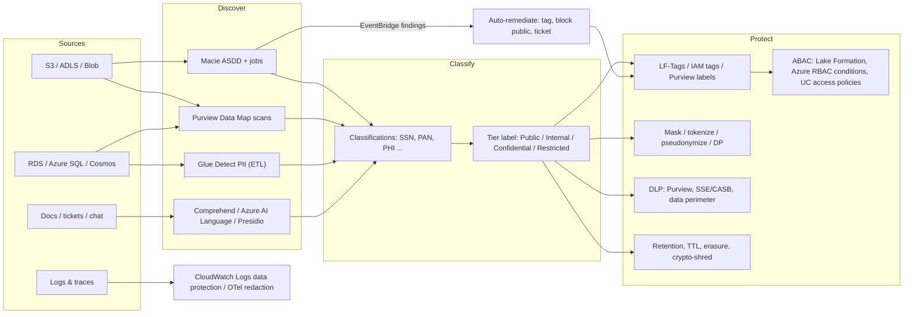
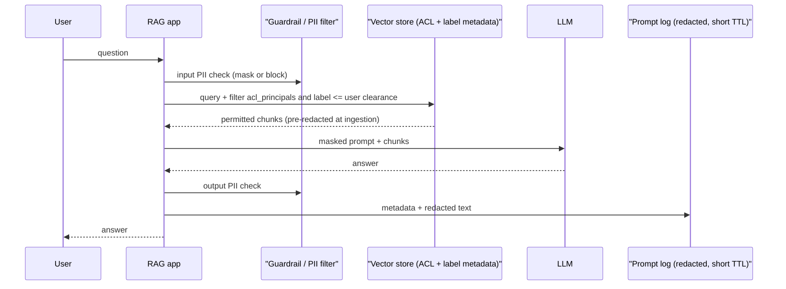

# L1 Data classification & PII protection
> Last verified: 2026-10 · Audience: senior/staff DevOps, SRE, AI eng, NetEng, DevSecOps, architects

## TL;DR
- **Classify first, then protect.** Use a 4-tier scheme (Public / Internal / Confidential / Restricted) and map regulated data types (**PII, SPI, PHI, PCI**) onto it. Every control downstream (encryption, access, DLP, retention) keys off the label.
- **You can't protect what you haven't found.** Automated discovery: **Amazon Macie** (S3), **Glue sensitive data detection** (ETL), **Microsoft Purview Data Map** scans (Azure, on-prem, multicloud including S3/RDS). These tools sample. They give you a risk heat map, not a guarantee.
- **De-identification is a spectrum.** Masking < hashing < tokenization/pseudonymization (reversible, **still personal data under GDPR**) < anonymization (k-anonymity, differential privacy, synthetic data). Quasi-identifiers re-identify people. "We hashed the email" is not anonymization.
- **Logs are the biggest PII leak in most companies.** Redact at source (structured logging, allow-listed fields), then scrub again in the collector. CloudWatch Logs data protection **masks at egress, but the raw data is still stored**, and anyone with `logs:Unmask` can see it.
- **AI pipelines multiply copies of PII:** training sets, RAG chunks, embeddings (which can be inverted), prompt/response logs, semantic caches, eval sets. Redact before ingestion. Store `subject_id` on every chunk so you can erase it. Decide the logging policy for prompts on purpose.
- **Right to erasure** has to reach backups, caches, replicas, search indexes, vector stores and derived datasets. The standard design is a deletion pipeline, a TTL everywhere, and backups "put beyond use" plus re-deletion on restore (or crypto-shredding).
- **DLP** covers SaaS and endpoints (Purview DLP, Edge or network for GenAI sites) and egress (SSE/CASB). AWS has no first-party SaaS or endpoint DLP. Macie is at-rest only.
- **ABAC via tags/labels** scales as N+M, not N×M: Lake Formation LF-Tags, IAM `aws:ResourceTag`, Azure RBAC conditions, Purview sensitivity labels plus Unified Catalog access policies.

## L1.1 Data classification schemes
- **How it works:**
  - **Typical 4 tiers.** **Public** (no harm if disclosed). **Internal** (default for business data). **Confidential** (customer data, contracts, most PII). **Restricted / Highly Confidential** (SPI, PHI, PCI cardholder data, secrets, keys, M&A). Some organizations add **Personal** or **Secret** tiers.
  - Microsoft's default label taxonomy is Personal, Public, General, Confidential, Highly Confidential, with sublabels (for example `Confidential \ All Employees`). Purview recommends **≤5 top-level labels and ≤5 sublabels** per label. A tenant can hold 1,000+ labels, but only **500 labels that use admin-defined encryption permissions**.
  - A label is a **property of the data**, stored in **clear-text metadata** so it persists with the file and third-party tools can read it. Label priority (order) decides which label "wins" and when a downgrade needs a justification.
- **Regulated data types:**

| Term | Regime | Definition / examples | Notes |
|---|---|---|---|
| **PII** | NIST SP 800-122 (US federal) | Info that can **distinguish or trace** an individual, alone or **linked/linkable** with other info: name, SSN, email, IP plus timestamp | 800-122 assigns a **PII confidentiality impact level** (low/moderate/high) based on identifiability, quantity, field sensitivity, context, obligations and access location |
| **Personal data** | GDPR Art. 4(1) | Any info relating to an identified or identifiable natural person. Broader than PII: includes cookie IDs and device IDs | **Special categories** (Art. 9): health, biometrics, genetics, race, religion, sexual orientation, union membership, politics |
| **SPI** | CCPA/CPRA "sensitive personal information" (also used generically) | SSN, driver's license, passport, account login plus password, precise geolocation, health, biometrics, message contents | Users get a "limit use of my SPI" right. Treat as Restricted |
| **PHI** | HIPAA | Individually identifiable health info held by covered entities and business associates | De-identify by **Safe Harbor** (remove 18 identifiers) or **Expert Determination**. Requires a BAA with the cloud provider |
| **PCI / CHD** | PCI DSS v4.x | **PAN** plus cardholder name and expiry. **SAD** (CVV2, full track, PIN) | SAD **must not be stored after authorization**. Tokenization/truncation reduces the **CDE scope** |
- **Trade-offs / when to use:**
  - More tiers means more precision but less user accuracy. Auto-labeling beats manual labeling at scale but produces false positives.
  - Classify by **highest-sensitivity element** ("high-water mark"). Joins and derived datasets inherit the max label, which is how Copilot picks the highest-priority label among cited sources.
  - Classification is distinct from **sensitivity labels** in Purview. Classifications are content types (for example "Credit Card Number"). Labels are the security/privacy tier ("Highly Confidential"). Map one to the other with auto-labeling rules.
- **Interview angles:**
  - If asked "how do you start a data protection program?", say: inventory → classify (scheme + data owners) → map controls per tier (encryption/CMK, access, DLP, retention, logging) → enforce via tags/labels → monitor.
  - Pitfall: treating an IP address or device ID as "not PII". Under GDPR it is personal data when it is linkable.
  - Follow-up: "Who owns classification?" The data owner/steward per domain, with central policy (federated governance).

## L1.2 Data inventory & discovery
- **How it works:**
  - **Amazon Macie** covers S3 general purpose buckets only.
    - It keeps a bucket inventory and raises **policy findings** for public, shared or unencrypted buckets.
    - **Automated sensitive data discovery (ASDD)** samples representative objects every day across all buckets, org-wide through the delegated admin.
    - **Sensitive data discovery jobs** are targeted, one-time or scheduled scans with chosen buckets, sampling depth and object criteria.
    - Detection uses **managed data identifiers** (ML plus patterns, many countries), **custom data identifiers** (regex plus keywords plus proximity) and **allow lists** to suppress known values.
    - Findings go to **EventBridge** (near real time) and **Security Hub CSPM**.
    - **Bucket sensitivity score** runs −1 to 100: −1 = classification error, 1–49 = not sensitive, **50 = not yet analyzed** (also when a restrictive bucket policy blocks Macie), 51–99 = sensitive, 100 = manual override. Results appear within about 48 h.
    - Pricing has three dimensions: bucket evaluation, objects monitored for ASDD, and bytes inspected. There is a 30-day free trial, which **excludes jobs**. KMS-encrypted objects need key-policy access for Macie.
  - **AWS Glue sensitive data detection** (Detect PII transform) works inside ETL.
    - Modes: "detect PII in each cell" (full scan) or "detect fields containing PII" (**sample %** plus **detection threshold %** of rows before a column is flagged).
    - Detection sensitivity: High (default for jobs after Nov 2023) or Low.
    - Actions: enrich (detection column), **redact**, **partial redact**, **SHA-256 hash**, with per-column/entity overrides. You can't use both redact and hash on one column.
  - **Amazon Comprehend** detects PII in free text. Use it when the PII is in documents and tickets, not columns.
  - **Microsoft Purview Data Map** scans sources with scan rule sets.
    - It has **200+ system classifications** plus custom ones (regex or dictionary).
    - Sources include Azure Storage/SQL/Synapse/Cosmos, on-prem, **AWS S3 and RDS**.
    - Sensitivity labels can extend to Data Map assets (preview). This needs an M365 license in the same Entra tenant.
    - **Unified Catalog** (the new governance experience) sits on top: governance domains, data products, critical data elements, data quality, and self-service access policies.
  - **Microsoft Defender for Cloud (Defender CSPM) sensitive data discovery** is the CSPM-side Macie analogue for Azure Storage, S3 and GCS (feature details unverified).
- **Trade-offs / when to use:**
  - Sampling gives cost-efficient breadth, not completeness. Use ASDD for the heat map and jobs for proof (audit, incident scoping).
  - Discovery at rest (Macie/Purview) vs. in-flow (Glue, log policies, API gateways): you need both, because data at rest is only found *after* it has landed.
  - Structured columns: use column-level classification with thresholds. Unstructured text: use NER-based detectors (Comprehend, Azure AI Language, Presidio), which are more expensive and probabilistic.
- **Interview angles:**
  - "Design org-wide PII discovery on AWS". Answer: Macie delegated admin via Organizations, ASDD on with log buckets excluded, custom identifiers for internal IDs, findings → EventBridge → Lambda/Step Functions (tag object, block public access, ticket) and Security Hub. Glue Detect PII in ETL. Lake Formation tags downstream.
  - Pitfall: a score of 50 on an important bucket often means **Macie can't read it** (bucket policy or KMS), not that the bucket is "medium sensitive".
  - Follow-up: false positives. Use allow lists, keyword proximity and thresholds. Tune before you automate remediation.

## L1.3 De-identification techniques
- **Spectrum** (NIST SP 800-188, Sept 2023):

| Technique | Reversible? | Keeps format / joinability | Still personal data (GDPR)? | Use |
|---|---|---|---|---|
| **Masking / redaction** (`***-**-1234`, `<EMAIL>`) | No (static) | Partial / no | Usually, if other fields remain | Display, logs, support UIs |
| **Dynamic masking** (DB/view level) | Data is unchanged underneath | Yes | Yes | Least-privilege reads |
| **Hashing** (unsalted SHA-256) | No, but **dictionary-attackable** for low-entropy values (phone, SSN) | Deterministic join key | Yes (pseudonymous) | Avoid. Use **keyed HMAC** instead |
| **Keyed hash (HMAC-SHA-256)** | No | Deterministic join key | Yes | Analytics join keys |
| **Tokenization, vaulted** | Yes, via vault lookup | Can preserve format | Yes | PCI PAN, SSN |
| **Tokenization, vaultless / FPE** (AES-FF1) | Yes, with key | Format and length preserved | Yes | Legacy schemas, partner feeds |
| **Deterministic encryption** (AES-SIV) | Yes, with key | Joinable, not format-preserving | Yes | Pseudonymous join keys |
| **Generalization / suppression** (age → band, ZIP → 3 digits) | No | Reduced precision | Maybe not, if risk is low | Publishing datasets |
| **k-anonymity / l-diversity / t-closeness** | No | Aggregated | Aims for anonymous | Microdata release |
| **Differential privacy** | No | Noisy aggregates | Anonymous (formal guarantee) | Stats, telemetry, ML |
| **Synthetic data** | No | Statistical fidelity | Depends on generator leakage | Dev/test, model training |
- **How it works:**
  - **Pseudonymization (GDPR Art. 4(5))** replaces identifiers but keeps "additional information" (keys, vault) separately. The data stays **personal data**, but the risk goes down, which counts toward Art. 25 and 32 credit. **Anonymization** means no reasonably likely re-identification (Recital 26). Only then does the data fall outside GDPR.
  - **Vaulted tokenization:** a random token is stored in a token→value table.
    - Pros: the token has no mathematical relation to the value, and the vault can be the only PCI-scoped system.
    - Cons: the vault is a **hot, stateful, HA- and latency-critical dependency** that needs multi-region replication and becomes a high-value target.
  - **Vaultless:** tokens are derived from a key, using FPE (NIST SP 800-38G **FF1**; FF3/FF3-1 was weakened by published attacks, and current NIST draft revisions drop FF3-1 (unverified status)) or deterministic AEAD.
    - Pros: stateless and horizontally scalable.
    - Cons: **key compromise reveals everything**, rotation means re-tokenizing, and a small domain (for example 4-digit values) weakens FPE.
    - Google Sensitive Data Protection (formerly Cloud DLP) offers AES-SIV, FPE-FFX (it notes this has "fewer security guarantees") and HMAC-SHA-256, all with **KMS-wrapped keys** and optional **context tweaks** to break cross-table joinability.
  - **k-anonymity:** each record is indistinguishable from at least k−1 others on **quasi-identifiers** (ZIP, DOB, sex. Sweeney's classic result is that ~87% of the US population is unique on ZIP5 + DOB + sex).
    - It fails against **homogeneity** (everyone in the class has the same disease) and **background knowledge** attacks. **l-diversity** and **t-closeness** were added to address these.
  - **Differential privacy (ε, δ):** the output distribution changes by at most a factor of e^ε whether or not any one person is in the data.
    - Implemented with calibrated **Laplace/Gaussian noise**.
    - **Privacy budget composes**: ε adds up across queries, so you must track spend.
    - Smaller ε means more privacy and less accuracy. ε ≈ 0.1–1 is strong. Production deployments often use higher values.
- **Trade-offs / when to use:**
  - Need re-identification (customer support, fraud, payments)? Use **tokenization/pseudonymization** with keys in KMS/Key Vault/HSM. See [L2](./L2-encryption-key-management.md).
  - Analytics joins without re-identification: use **HMAC with a secret key**, rotated per dataset or purpose to prevent cross-dataset linkage.
  - Publishing or sharing externally: use generalization, DP or synthetic data, plus a **re-identification risk assessment** and a disclosure review board (800-188).
- **Interview angles:**
  - "Is a SHA-256 of the email anonymous?" No. It is deterministic, low-entropy and linkable. It is pseudonymous at best and still personal data.
  - "Vaulted vs vaultless?" Vaulted gives strongest unlinkability and a smaller PCI scope, but you take on an HA/latency bottleneck. Vaultless scales and is simpler to operate, but key management becomes the whole security story.
  - Pitfall: de-identifying direct identifiers but leaving free-text fields (notes, comments) that contain names.

## L1.4 PII in logs & telemetry
- **How it works:**
  - **Layer 1, at source (best).**
    - Structured logging with an **allow-list of fields**, not a deny-list.
    - Typed wrappers (`Sensitive<String>` whose `toString()` prints `***`).
    - Never log request/response bodies, auth headers or query strings with tokens.
    - Log a **stable pseudonymous user ID** (HMAC), not the email.
  - **Layer 2, in the collector/pipeline.** Use OpenTelemetry Collector processors (`attributes`/`transform`/`redaction` processors), Fluent Bit/Fluentd filters, or Vector `remap` to drop or hash attributes and regex-scrub before export. This is centralized and catches what developers miss.
  - **Layer 3, at the destination: CloudWatch Logs data protection policies.**
    - Policy scope: **account-level policy** (all current and future log groups) and/or **one policy per log group**. Both apply, as a union.
    - Policy size limit is 30,720 characters.
    - Operations: **Audit**, with findings sent to CloudWatch Logs, Firehose or S3 plus the free `LogEventsWithFindings` metric in `AWS/Logs`, and **De-identify** (mask).
    - Detection is **at ingestion**. Events ingested before the policy are not masked.
    - **Masked at all egress points** (console, Logs Insights, metric filters, subscription filters). Users with **`logs:Unmask`** see the raw values.
    - Supported in Standard and Infrequent Access log classes.
    - Identifier categories: credentials (private keys, AWS secret keys), financial, PII, PHI, device IDs (IP, MAC), plus custom regex identifiers.
  - **Azure:** no direct equivalent of CloudWatch's mask-at-ingest on Log Analytics. Common patterns are **DCR ingestion-time transformations** (KQL `project-away`/`replace_regex` in Data Collection Rules) and Purview/Defender scanning of exported logs (treat as the pattern; validate per table support).
  - **Traces and metrics** leak too: span attributes (`http.url` with query strings, `db.statement` with literals), and metric labels holding user IDs, which is also a cardinality bomb. Error trackers (Sentry etc.) capture locals and breadcrumbs, so configure their scrubbing.
- **Trade-offs / when to use:**
  - Source redaction has zero blast radius but depends on discipline. Collector scrubbing is central but uses CPU and regex, can miss things, and costs latency. Destination masking is easy to switch on but the **raw data still exists** in storage and is reachable through `logs:Unmask`. Subscription filters emit masked data.
  - Over-redaction kills debuggability. Keep correlation IDs and pseudonymous user IDs, and offer break-glass access to raw data with audit.
  - Retention: debug logs 7–30 days, audit logs per regulation (often 1–7 years) in a separate, access-controlled store.
- **Interview angles:**
  - "We found SSNs in logs. What now?" Treat it as an incident ([J4](../J-sre/J4-incident-response-postmortems.md)): stop the source (deploy a fix), add a collector rule, enable a CloudWatch policy to mask going forward, **purge or expire** existing log streams and downstream copies (S3 exports, SIEM, Firehose targets), rotate any leaked credentials, assess notification obligations, and add a CI lint/test.
  - Pitfall: Bedrock **model invocation logs keep the raw prompt** even when Guardrails masked it. Use CloudWatch data protection on that log group.

## L1.5 PII in AI pipelines
- **How it works:**
  - **Training/fine-tuning data:**
    - Filter before training: run NER/regex detectors (Comprehend, Azure AI Language, Presidio, Google SDP), dedupe, and drop or replace PII with surrogates.
    - Models **memorize** rare sequences. Training-data extraction and membership-inference attacks are proven.
    - You **can't delete from model weights** cheaply (machine unlearning is immature), so erasure means retraining or never including the data. Keep data lineage per training run. See [L5](./L5-model-data-governance.md) and [K5](../K-ai-infra-llm/K5-training-fine-tuning.md).
  - **RAG ingestion** ([K3](../K-ai-infra-llm/K3-rag-pipelines.md)):
    - Classify → redact or pseudonymize → chunk → embed.
    - Attach metadata to every chunk: `source_doc_id`, `data_subject_ids`, `sensitivity_label`, `acl_principals`, `retention_until`.
    - Enforce **ACL/label filtering at retrieval time** (security trimming) so the LLM never sees chunks the user couldn't open. Purview/Copilot do this with the EXTRACT usage right on encrypted labeled content.
  - **Embeddings leak PII.** Embedding inversion (for example Vec2Text, 2023) reconstructs much of the short input text from the vectors (exact rates unverified here). So treat **vector stores at the same sensitivity as the source text**: encryption, private endpoints, tenant isolation, no "embeddings are anonymous" claims. See [K2](../K-ai-infra-llm/K2-embeddings-vector-databases.md).
  - **Prompt/response logging policy.** Decide per use case:
    - (a) no content logging, metadata only
    - (b) redacted content
    - (c) full content in a restricted, short-retention store for evals and abuse monitoring
  - Logging tools on each cloud:
    - **Bedrock Guardrails** sensitive information filters BLOCK or ANONYMIZE (mask as `{NAME}`) PII in **inputs and/or outputs**, with custom regex (no lookaround). They **don't** cover tool-use arguments or results, the trace `match` field, or invocation logs.
    - **Purview** captures Copilot/AI prompts and responses in the unified audit log, eDiscovery and retention policies. Endpoint/Edge DLP blocks pasting SSNs into ChatGPT/Gemini.
  - **Other copies to govern:** semantic caches ([K7](../K-ai-infra-llm/K7-ai-gateways-caching-cost.md)), eval/golden datasets, agent memory/scratchpads, tool outputs ([K8](../K-ai-infra-llm/K8-agents-tool-use-mcp.md)), and human-feedback queues.
- **Trade-offs / when to use:**
  - Redact before embedding: safer, but it hurts retrieval for name-centric queries. Alternative: **pseudonymize with reversible tokens**, retrieve, and re-hydrate post-generation only for authorized users.
  - Masking with an entity type (`<PERSON_1>`) keeps semantics for the LLM better than `****`. Azure AI Language offers `entityMask`, `characterMask`, `noMask`, and a preview `syntheticReplacement` (realistic fake values).
  - NER detectors are probabilistic. Presidio says outright there's "no guarantee" it finds all PII. Layer them with allow-listed schemas and access control.
- **Interview angles:**
  - "Design a HIPAA-compliant RAG assistant." Answer: BAA-eligible services; PHI redaction/pseudonymization in ingestion; per-chunk ACL plus label metadata with retrieval-time filtering; CMK encryption on the vector DB; private networking; Guardrails/Content Safety on I/O; prompt logs either disabled or redacted with short retention; a deletion API keyed on `data_subject_id`; evals that probe for PII leakage. See [K9](../K-ai-infra-llm/K9-llmops-evals-guardrails.md) and [L4](./L4-ai-security-threats.md).
  - Pitfall: sending raw prompts to a third-party LLM API without checking the provider's data retention/training terms or the region ([L3](./L3-residency-compliance.md)).

## L1.6 Data minimization, retention & deletion
- **How it works:**
  - **Minimization (GDPR Art. 5(1)(c)):** collect only what the purpose needs. Drop columns at ingestion. Aggregate early. Keep short TTLs on raw data.
  - **Retention schedule** per class: S3 Lifecycle expiration, Azure Blob lifecycle management, DynamoDB/Cosmos TTL, Kafka `retention.ms`, CloudWatch/Log Analytics retention, Purview retention labels and policies (including for Copilot/AI interactions).
  - **Right to erasure (Art. 17):** respond within **1 month**, extendable by 2 more for complex requests (Art. 12(3)). Erasure has to cover:
    - Primary DB rows, read replicas, caches (Redis, CDN, semantic caches), search indexes (OpenSearch, Azure AI Search), **vector stores** (delete by `data_subject_id` metadata filter, then compaction/re-index because HNSW deletes are often tombstones), data lake tables (Iceberg/Delta `DELETE` plus **`VACUUM`/snapshot expiry**, otherwise time travel keeps the data), Kafka (compacted-topic tombstones, or wait for retention), analytics extracts, ML features and training sets.
    - **Backups:** immutable backups (S3 Object Lock, Backup Vault Lock, Azure immutable vaults) can't be edited. Accepted practice is to **put them "beyond use"**: document it, let them expire on schedule, and **re-apply deletions on restore** from a deletion ledger.
    - **Crypto-shredding:** encrypt per-subject or per-tenant with a distinct data key, and delete the key to make every copy, backups included, unreadable ([L2](./L2-encryption-key-management.md)).
- **Trade-offs / when to use:**
  - Legal hold / eDiscovery hold **overrides** deletion. Purview retention principles: retention wins over deletion, and the longest retention wins.
  - Per-subject keys give clean erasure but add key-management scale and cost (KMS request rates). Use them per tenant for B2B and per user only for high-sensitivity data.
- **Interview angles:**
  - "How do you implement GDPR delete across 40 microservices?" Answer: an event-driven **deletion orchestrator** (DSR request → `subject.deleted` event on a bus), each service owns its own erasure plus an ack, a central ledger with SLA tracking, reconciliation scans (Macie/Purview) to prove completeness, and backups handled with beyond-use plus restore re-apply.
  - Pitfall: forgetting **derived data**: logs, exports, BI extracts, embeddings and fine-tuned models.

## L1.7 Data loss prevention (DLP) for egress & SaaS
- **How it works:**
  - **Microsoft Purview DLP** covers:
    - Locations: Exchange, SharePoint, OneDrive, Teams, Office apps, **endpoints** (Windows 10/11, the three latest macOS versions), on-prem file shares/SharePoint (through the Information Protection scanner), Defender for Cloud Apps instances, Fabric/Power BI, **Microsoft 365 Copilot (preview)**, and non-Microsoft connected apps (Box, Dropbox, Google Workspace, Salesforce, in preview).
    - **Inline web traffic:** Edge for Business and **network data security** via SASE partners, covering ChatGPT, Gemini, DeepSeek and Copilot. The Network option extends to 35,000+ Defender for Cloud Apps catalog apps.
    - Detection uses **sensitive information types** (regex, keywords, checksum, proximity), **trainable classifiers**, EDM, and sensitivity/retention labels as conditions.
    - Actions: policy tip, **block with override** (justification captured), block, quarantine at rest, hide in Teams.
    - Roll out in **simulation mode** first. Policies take effect about 1 h after being turned on.
    - Alerts stay 30 days in the Purview dashboard and 6 months in Defender XDR. Exchange DLP doesn't rescan existing mailbox items.
  - **AWS** has no first-party content-aware egress or SaaS DLP. Build it from:
    - Macie (at rest)
    - **VPC endpoint policies** plus `aws:ResourceOrgID`/`aws:PrincipalOrgID` data-perimeter SCP/RCPs to stop copying data to foreign accounts
    - Network Firewall/egress proxies with domain allow-lists (content inspection needs TLS inspection)
    - Bedrock Guardrails for LLM I/O
    - third-party SSE/CASB (Netskope, Zscaler, Palo Alto Prisma Access) or Google Sensitive Data Protection
  - **Egress DLP patterns:** default-deny outbound with FQDN allow-lists, private endpoints to PaaS ([G7](../G-cloud-network-architecture/G7-service-endpoints-private-link.md)), presigned-URL guardrails, and S3 Block Public Access at org level.
- **Trade-offs / when to use:**
  - Content inspection breaks on E2E encryption and costs TLS-interception complexity. Identity- and perimeter-based controls (data perimeters) are cheaper and block whole classes of exfiltration.
  - High false positives lead to user override fatigue. Tune with simulation, proximity and thresholds (for example "≥10 SSNs to external").
- **Interview angles:**
  - "Stop employees pasting customer data into ChatGPT." Answer: an approved enterprise AI with no-training terms, Endpoint/Edge DLP or SSE inline DLP blocking SITs to unsanctioned GenAI categories, a CASB to discover shadow AI, and Insider Risk "risky AI usage" signals.
  - On AWS, a "data perimeter" (SCPs, RCPs, VPC endpoint policies) is often the right answer instead of content DLP.

## L1.8 Tags/labels driving access policies (ABAC)
- **How it works:**
  - **Lake Formation LF-TBAC:**
    - LF-Tags are key/values (for example `classification=restricted`) on catalogs, databases, tables and **columns**, inherited downward and overridable.
    - You grant permissions on **LF-Tag expressions** to principals.
    - Grants scale as **n(P)+n(R) instead of n(P)×n(R)**.
    - Supports federated catalogs (S3 Tables, Redshift, DynamoDB, Snowflake…).
    - **LF-Tags ≠ IAM tags.**
    - Combine with **data filters** (row/cell-level) and Glue Detect PII or Macie outputs to auto-tag.
  - **IAM ABAC:** conditions such as `aws:ResourceTag/classification` vs `aws:PrincipalTag/clearance`, plus session tags from the IdP. Protect the tags themselves with SCPs (`aws:TagKeys`, deny `TagResource` except to automation).
  - **Azure:** Azure RBAC **role assignment conditions** (ABAC) on Blob index tags and other attributes. **Purview sensitivity labels** drive encryption (usage rights travel with the file), container settings, DLP conditions and Copilot behavior. **Purview Unified Catalog access policies** offer self-service access requests on data products, glossary terms and critical data elements. Classic Purview Data Map "data owner"/DevOps policies on Azure Storage/SQL exist but their current status is unverified.
  - **Pipeline:** discovery → classification → **tag/label written automatically** → policy engine enforces → audit.
- **Trade-offs / when to use:**
  - ABAC scales and lets data owners self-serve, but it is **only as good as tag hygiene**. A mis-tagged table is silently exposed. Use automated tagging plus drift detection, and lock down who can change tags.
  - RBAC is simpler to audit ("who can access X?" is harder to answer with ABAC, so build a query/report).
- **Interview angles:**
  - "Thousands of tables, hundreds of teams: how do you manage access?" Answer: LF-TBAC (or Purview/Unity Catalog tags) with tags for domain, classification and PII; grants on expressions; column tags hiding PII columns from analysts; row filters by region; automated tagging from discovery.
  - Pitfall: letting the same principals who need access also edit tags (privilege escalation via retagging).

## Diagrams




## Cloud mapping: AWS vs Azure
| Capability | AWS | Azure / Microsoft | Role it plays | Key differences | Alternatives |
|---|---|---|---|---|---|
| Data-at-rest discovery | **Amazon Macie** (S3 only) | **Purview Data Map** scans (+ Defender CSPM sensitive data discovery) | Find and classify sensitive data in stores | Macie is S3-only, sampling, with bucket sensitivity scores. Purview is multicloud/on-prem (incl. S3, RDS) with 200+ classifications and catalog lineage | Google Sensitive Data Protection, BigID, Cyera, Varonis |
| Catalog & governance | Glue Data Catalog + **Lake Formation** (+ SageMaker Catalog/DataZone) | **Purview Unified Catalog** | Inventory, ownership, data products | Unified Catalog adds governance domains, CDEs, DQ and self-service access | Databricks Unity Catalog, Collibra, Atlan |
| Classification / labeling | Macie findings, Glue detection, LF-Tags | **Purview Information Protection sensitivity labels** + SITs/trainable classifiers | Assign tier and drive controls | MS labels persist in file metadata and can **encrypt** (RMS usage rights). AWS tags live on resources, not content | MIP SDK in 3rd-party apps |
| ETL-time PII detection | **Glue sensitive data detection** (redact / partial / SHA-256) | Purview + Fabric/Synapse with Azure AI Language in pipelines (no single equivalent transform) | Clean data in flow | Glue is a built-in transform. Azure needs custom pipeline steps | Presidio in Spark, Databricks |
| Text PII NER API | **Amazon Comprehend** PII (EN/ES; sync ≤100 KB; redaction async only) | **Azure AI Language PII** (Foundry Tools; text, conversation and document PII; masks incl. synthetic replacement in preview; containers) | Detect/redact PII in free text | Azure has broader languages, sync redaction, native docs and containers. Comprehend sync is detect-only | **Presidio** (OSS), Google SDP |
| Log PII masking | **CloudWatch Logs data protection** (audit + mask at egress, `logs:Unmask`) | Log Analytics **DCR ingestion-time transformations** (drop/replace before storage) | Prevent PII exposure in logs | AWS keeps raw values and masks on read. Azure DCR removes before storage (irreversible) | OTel Collector redaction, Fluent Bit, Vector, Cribl |
| LLM I/O PII filter | **Bedrock Guardrails** sensitive information filters | Azure AI Content Safety / Foundry guardrails + AI Language PII, Purview DSPM for AI | Mask/block PII in prompts and responses | Bedrock masks with `{TYPE}` and skips tool I/O and invocation logs | Presidio in AI gateway, NeMo Guardrails, Cloudflare AI Gateway DLP |
| Tag-based access | **Lake Formation LF-TBAC**, IAM ABAC | **Azure RBAC conditions (ABAC)**, Purview sensitivity labels + **Unified Catalog access policies** | Scale least-privilege by attribute | LF-Tags work at column level on the catalog. Azure ABAC works at storage/blob tag level, with labels on content | Unity Catalog tags/ABAC, OPA |
| DLP (SaaS/endpoint/egress) | None first-party. Data perimeter (SCP/RCP/VPC endpoint policies), Network Firewall | **Purview DLP** (M365, endpoints, Edge/network for GenAI, Defender for Cloud Apps) | Stop exfiltration | Microsoft is far ahead on user-facing DLP. AWS focuses on identity and network perimeters | Netskope, Zscaler, Palo Alto SSE, Google Workspace DLP |
| De-identification / tokenization | Build with KMS + Lambda / Payment Cryptography (FPE details unverified) | Build with Key Vault/Managed HSM, SQL Always Encrypted, dynamic data masking | Reversible pseudonyms | Neither offers a turnkey vault. Google SDP offers AES-SIV/FPE/HMAC as a service | Google SDP, Protegrity, Skyflow, VGS |

- **Macie** is regional (enable per region, aggregate via Security Hub). Org rollout uses a delegated admin. It costs per bucket, per monitored object and per GB inspected, so exclude log and backup buckets. Restrictive bucket policies or KMS keys cause score 50 or −1.
- **Comprehend PII:** `DetectPiiEntities` returns type, offsets and score. `ContainsPiiEntities` returns labels only. Redaction (`MASK` or replace with entity type) needs an **async job**. S3 Object Lambda PII access points existed, but S3 Object Lambda's availability to new customers is restricted (unverified).
- **CloudWatch Logs data protection** applies **forward-only** from policy creation. Account plus log-group policies union. Masking is presentation-time, so control `logs:Unmask` tightly and remember the bytes still exist (exports to S3 via subscription are masked, but CreateExportTask behavior is unverified).
- **Glue** sensitive data detection: sample % plus threshold for column detection. The `actionUsed` key in Glue 3.0+ records DETECT/REDACT/PARTIAL_REDACT/SHA256_HASH. SHA-256 here is **unkeyed**, so it is dictionary-attackable for low-entropy fields.
- **Purview:**
  - Sensitivity labels are clear-text metadata, so they persist. Encryption labels enforce usage rights (Copilot needs **EXTRACT** plus VIEW).
  - Label policy changes take up to 24 h to replicate. DLP policies take about 1 h after being turned on.
  - Licensing is per user (M365 E3/E5 tiers). Data Map/Unified Catalog is a separate pay-as-you-go governance meter.
  - Azure AI Language is now branded "**Azure Language in Foundry Tools**". Async results are kept 24 h. The sync path is stateless.
- **Alternatives:**
  - **Presidio** (moved from Microsoft to the community **Data Privacy Stack** org; images are now on `ghcr.io/data-privacy-stack/`, and the old `mcr.microsoft.com/presidio-*` images are no longer updated) for self-hosted detection and anonymization in gateways and Spark.
  - **Google Sensitive Data Protection** (formerly Cloud DLP) for inspection plus de-identification as a service.
  - **Databricks Unity Catalog** for tag-based governance on the lakehouse ([M3](../M-data-platforms/M3-databricks-platform.md)).
  - **Cloudflare** (Zero Trust DLP / AI Gateway) for inline egress.
  - When sending prompts to **Claude or Gemini** APIs, apply pre-call redaction and check the provider's retention terms.

## Hands-on (optional)
Self-hosted PII detection and anonymization with Presidio:
```bash
docker run -d --name presidio-analyzer   -p 5002:3000 ghcr.io/data-privacy-stack/presidio-analyzer:latest
docker run -d --name presidio-anonymizer -p 5001:3000 ghcr.io/data-privacy-stack/presidio-anonymizer:latest

TEXT='My name is Jane Doe, call me at 212-555-0199 or jane@example.com'

# 1) detect
RESULTS=$(curl -s -X POST localhost:5002/analyze -H 'Content-Type: application/json' \
  -d "{\"text\": \"$TEXT\", \"language\": \"en\"}")
echo "$RESULTS" | jq '.[] | {entity_type, start, end, score}'

# 2) anonymize: entity-type placeholder by default, partial mask for phone
curl -s -X POST localhost:5001/anonymize -H 'Content-Type: application/json' -d @- <<EOF | jq -r .text
{
  "text": "$TEXT",
  "analyzer_results": $RESULTS,
  "anonymizers": {
    "DEFAULT":      {"type": "replace", "new_value": "<REDACTED>"},
    "PERSON":       {"type": "replace", "new_value": "<PERSON>"},
    "PHONE_NUMBER": {"type": "mask", "masking_char": "*", "chars_to_mask": 8, "from_end": false}
  }
}
EOF
```

Turn on CloudWatch Logs masking for one log group (it applies forward-only):
```bash
cat > dp-policy.json <<'EOF'
{
  "Name": "pii-mask", "Version": "2021-06-01",
  "Statement": [
    { "Sid": "audit",
      "DataIdentifier": ["arn:aws:dataprotection::aws:data-identifier/EmailAddress",
                         "arn:aws:dataprotection::aws:data-identifier/Ssn-US"],
      "Operation": { "Audit": { "FindingsDestination": {} } } },
    { "Sid": "mask",
      "DataIdentifier": ["arn:aws:dataprotection::aws:data-identifier/EmailAddress",
                         "arn:aws:dataprotection::aws:data-identifier/Ssn-US"],
      "Operation": { "Deidentify": { "MaskConfig": {} } } }
  ]
}
EOF
aws logs put-data-protection-policy --log-group-identifier /app/api \
  --policy-document file://dp-policy.json
# Org-wide alternative: aws logs put-account-policy --policy-type DATA_PROTECTION_POLICY ...
aws comprehend detect-pii-entities --language-code en \
  --text "Card 4111-1111-1111-1111 for John Smith"
```

## Cross-links
- [L2 Encryption & key management](./L2-encryption-key-management.md): CMK, crypto-shredding, tokenization keys
- [L3 Data residency & compliance](./L3-residency-compliance.md): GDPR/HIPAA/PCI scope, cross-border transfer of prompts
- [L4 AI security threats](./L4-ai-security-threats.md): prompt injection that exfiltrates PII, training-data extraction
- [L5 Model & data governance](./L5-model-data-governance.md): dataset lineage, unlearning
- [K3 RAG pipelines](../K-ai-infra-llm/K3-rag-pipelines.md): ingestion redaction, retrieval-time ACL filtering
- [K2 Embeddings & vector databases](../K-ai-infra-llm/K2-embeddings-vector-databases.md): deletion and tombstones in ANN indexes
- [K9 LLMOps, evals & guardrails](../K-ai-infra-llm/K9-llmops-evals-guardrails.md)
- [J3 Observability](../J-sre/J3-observability.md): telemetry pipelines and redaction processors
- [B12 Database security](../B-database-engineering/B12-database-security.md): dynamic data masking, column encryption
- [M1 Lakehouse table formats](../M-data-platforms/M1-lakehouse-table-formats.md): DELETE + VACUUM for erasure

## Sources
- https://docs.aws.amazon.com/macie/latest/user/what-is-macie.html
- https://docs.aws.amazon.com/macie/latest/user/discovery-asdd.html
- https://docs.aws.amazon.com/macie/latest/user/discovery-scoring-s3.html
- https://docs.aws.amazon.com/comprehend/latest/dg/pii.html
- https://docs.aws.amazon.com/comprehend/latest/dg/how-pii.html
- https://docs.aws.amazon.com/AmazonCloudWatch/latest/logs/mask-sensitive-log-data.html
- https://docs.aws.amazon.com/AmazonCloudWatch/latest/logs/cloudwatch-logs-data-protection-policies.html
- https://docs.aws.amazon.com/glue/latest/dg/detect-PII.html
- https://docs.aws.amazon.com/lake-formation/latest/dg/tag-based-access-control.html
- https://docs.aws.amazon.com/bedrock/latest/userguide/guardrails-sensitive-filters.html
- https://learn.microsoft.com/en-us/purview/sensitivity-labels
- https://learn.microsoft.com/en-us/purview/dlp-learn-about-dlp
- https://learn.microsoft.com/en-us/purview/data-map-classification
- https://learn.microsoft.com/en-us/purview/unified-catalog
- https://learn.microsoft.com/en-us/purview/ai-microsoft-purview
- https://learn.microsoft.com/en-us/azure/ai-services/language-service/personally-identifiable-information/overview
- https://learn.microsoft.com/en-us/azure/ai-services/language-service/personally-identifiable-information/how-to/redact-text-pii
- https://presidio.dataprivacystack.org/
- https://presidio.dataprivacystack.org/installation/
- https://presidio.dataprivacystack.org/anonymizer/
- https://docs.cloud.google.com/sensitive-data-protection/docs/pseudonymization
- https://csrc.nist.gov/pubs/sp/800/122/final
- https://csrc.nist.gov/pubs/sp/800/188/final
