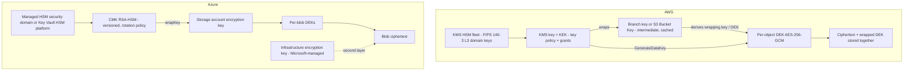
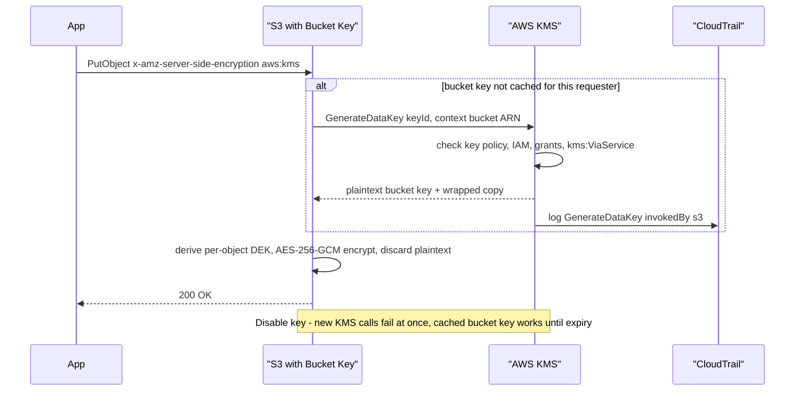
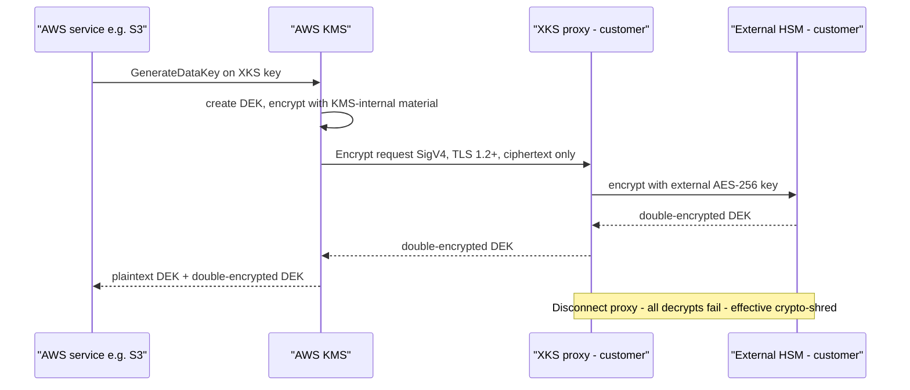

# L2 Encryption & Key Management
> Last verified: 2026-10 · Audience: senior/staff DevOps, SRE, AI eng, NetEng, DevSecOps, architects

## TL;DR
- **Key hierarchy:** root key (inside an HSM) → **KEK** (the KMS key or Key Vault key) → **DEK** (per object, file or tenant). Only DEKs touch bulk data, and the wrapped DEK is stored next to the ciphertext. Basics are in [D2.10](../D-system-design/D2-reusable-parts-of-system-design.md#d210-security-encryption-at-rest--clientserver-side-encryption-envelope-encryption-data-keys-vs-master-keys). This file covers **operating keys at scale**.
- **AWS KMS:** authorization is **key policy first**. IAM policies only work when the key policy delegates to the account. **Grants** give temporary or service-scoped access. Automatic rotation runs every **90–2,560 days (default 365)**, on symmetric `AWS_KMS`-origin keys only. Rotation **never re-encrypts data or DEKs**. Deletion has a **7–30 day** waiting period. Symmetric crypto quotas are **10k/20k/100k rps per account per Region**, shared across every caller, including AWS services acting for you.
- **Azure:** **Key Vault Standard** (software keys, FIPS 140-2 L1) < **Premium** (HSM keys; HSM Platform 2 = **FIPS 140-3 L3**) < **Managed HSM** (single-tenant, FIPS 140-3 L3, local RBAC, security domain). Soft delete is mandatory (7–90 days). **Purge protection** is opt-in but required for CMK. **RBAC** is the default permission model from API **2026-02-01**. Rotation policies create new **key versions**, and services that use **versionless** URIs pick them up within about 24 h.
- **Dedicated HSMs:** **CloudHSM** (hsm2m.medium, FIPS 140-3 L3, PKCS#11/JCE/KSP) ↔ **Azure Cloud HSM** (GA, the successor to **Dedicated HSM**). Dedicated HSM is retiring: no new customers, supported until **2028-07-31**. Choose these only for lift-and-shift PKCS#11, Oracle TDE or TLS offload. They do **not** integrate natively with PaaS CMK on Azure.
- **Ownership spectrum:** provider-owned → provider-managed → **CMK** → **BYOK** (import) → **HYOK**. AWS HYOK is the **External Key Store (XKS)**, which is GA and double-encrypts. Azure HYOK is **Managed HSM external key management**: preview, wrap/unwrap only, no SLA, gated access. With HYOK, **you own availability**.
- **S3:** SSE-S3 is the default. SSE-KMS plus **Bucket Keys** cuts KMS calls by up to 99%. **DSSE-KMS** gives two layers but no Bucket Keys. **SSE-C has been blocked by default** since **April 2026** for new buckets and for accounts with no SSE-C objects. **Azure Storage:** always-on AES-256, optional CMK (an RSA key wraps the account encryption key), and optional **infrastructure encryption** for a second layer, which can only be set at account creation.
- **Crypto-shredding:** per-tenant or per-subject keys turn erasure (GDPR Art. 17, including backups) into deleting a key. Design for it upfront.
- **Post-quantum (PQ):** AES-256 is already quantum-resistant. **KMS supports ML-DSA (FIPS 204) signing keys** (ML_DSA_44/65/87). Harvest-now-decrypt-later risk sits in **key exchange (TLS)**, not in AES-256 at rest. Build crypto-agility and an inventory now.

## L2.1 Key hierarchy & envelope encryption at scale
- **How it works:**
  - **Typical layers:**

    | Layer | Lives in | Example | Rotation |
    |---|---|---|---|
    | **Root / domain key** | Provider HSM fleet, never exported | KMS HSM domain keys; Managed HSM **security domain** | Provider-managed |
    | **KEK / wrapping key** | KMS / Key Vault / HSM | KMS key, Key Vault RSA-HSM key | Yearly or by policy (new *material/version*, same ID) |
    | **Intermediate (optional)** | Your datastore, wrapped by the KEK | **Branch key** (AWS Hierarchical keyring), S3 **Bucket Key**, Azure Storage **account encryption key** | Minutes to days |
    | **DEK** | Next to the ciphertext, wrapped | Per object / row / file / tenant AES-256-GCM key | Per message or per N bytes |

  - **Why three tiers at scale:** a flat KEK→DEK scheme costs one KMS call per object. At 50k objects/s that hits the **shared** symmetric quota (see L2.2). An intermediate key cached in memory turns millions of operations into one KMS call per cache TTL.
  - **AWS options to reduce KMS calls:**
    - **S3 Bucket Keys:** S3 caches a short-lived bucket-level key and derives per-object DEKs from it. This cuts S3→KMS traffic and cost by up to **99%**. The encryption context becomes the **bucket ARN**, not the object ARN, so policies keyed on object ARN break. You also see fewer CloudTrail `Decrypt` events: at least one per requester per bucket key. Not supported with **DSSE-KMS**.
    - **AWS Encryption SDK, Hierarchical keyring (recommended):**
      - **Branch keys** are stored in a DynamoDB key store, wrapped by a KMS key.
      - The SDK makes one `Decrypt` per branch-key version per **cache TTL**, then derives a unique wrapping key per message using HKDF with a 16-byte salt.
      - The default cache holds **1,000 entries**. A refresh starts 10 s before expiry so concurrent threads don't all call KMS at once.
      - Use a **branch-key-ID supplier** for multi-tenant isolation: one branch key per tenant.
      - Rotating a branch key creates a new active version. Old versions stay available for decrypt.
    - **Legacy data-key caching CMM:** reuses plaintext DEKs. You must set security thresholds: max age (required), max messages and max bytes. It is weaker because one DEK covers many messages. Prefer the Hierarchical keyring.
  - **Azure equivalents:**
    - Services wrap an **account/root DEK** with the CMK and cache the unwrapped key. Azure Storage unwraps through Key Vault for reads and writes using the account encryption key.
    - For app-level encryption you generate the DEK yourself and call `wrapKey`/`unwrapKey`. Key Vault has no GenerateDataKey API.
  - **Encryption context / AAD:** KMS binds non-secret key-value pairs (for example `tenant=acme`) into the ciphertext as AAD. They are logged in CloudTrail and can be required in key policies (`kms:EncryptionContext:tenant`). This is your **confused-deputy defense**: a ciphertext for tenant A won't decrypt under tenant B's context.
- **Trade-offs / when to use:**
  - Longer cache TTL means fewer KMS calls and lower cost, but **slower revocation**. Disabling the KMS key doesn't stop decrypts until cached keys expire. The same applies to AWS services that cache data keys (see "How unusable KMS keys affect data keys").
  - Per-tenant DEK/KEK enables crypto-shredding and per-tenant audit, at the cost of more keys and more KMS objects ($1/key-month).
- **Interview angles:**
  - "You're hitting `ThrottlingException` from KMS" → check the **Service Quotas** console and CloudWatch request metrics. Fixes: enable S3 Bucket Keys, move to the Hierarchical keyring, use a per-tenant intermediate key, back off with jitter, or request a quota increase. Also note that quotas are counted **per calling account**, so cross-account callers consume their own quota.
  - "How do you revoke access fast if keys are cached?" → keep TTLs short (minutes), disable the KEK, and for services recycle the resource (for example stop/start the RDS instance). Admit the window exists.

## L2.2 AWS KMS deep dive
### Key types & ownership
- **Ownership:**
  - **AWS owned keys:** invisible to you, no charge, no CloudTrail entries in your account.
  - **AWS managed keys** (`aws/s3`, `aws/ebs`, …): visible, rotated every year automatically (changed from every 3 years in May 2022), and you **cannot** edit their key policy. They **can't be used cross-account**.
  - **Customer managed keys (CMK):** you own the policy, rotation and deletion.
- **Key specs:**

  | Spec | Usage | Notes |
  |---|---|---|
  | `SYMMETRIC_DEFAULT` | Encrypt/decrypt, GenerateDataKey | AES-256-GCM (SM4-128 in China Regions). Direct `Encrypt` ≤ **4,096 bytes**. Only spec that supports imported material + auto rotation, multi-Region, custom key stores |
  | `RSA_2048/3072/4096` | Encrypt (OAEP SHA-1/256) **or** sign (PSS/PKCS1v1.5) | Max plaintext e.g. 190 B for RSA-2048/OAEP-SHA256. Public key downloadable |
  | `ECC_NIST_P256/384/521`, `ECC_SECG_P256K1`, `ECC_NIST_EDWARDS25519` | Sign/verify, or ECDH `DeriveSharedSecret` (NIST curves) | secp256k1 is for crypto-currency. Ed25519 is signing only |
  | `HMAC_224/256/384/512` | `GenerateMac`/`VerifyMac` | Tokenization, deterministic IDs, JWT HS*. Counts against the symmetric quota |
  | `ML_DSA_44/65/87` | Sign/verify (`ML_DSA_SHAKE_256`) | Post-quantum, FIPS 204 |
  | `SM2` | China Regions only | |

- **Key usage is immutable.** Picking the wrong spec or usage means creating a new key.
- **Origins:**
  - `AWS_KMS`: the default.
  - `EXTERNAL`: **BYOK** import. You can set an expiry. `DeleteImportedKeyMaterial` is **reversible** by re-importing.
  - `AWS_CLOUDHSM`: CloudHSM key store.
  - `EXTERNAL_KEY_STORE`: **XKS**.
- KMS HSMs are **FIPS 140-3 Security Level 3** validated.

### Authorization: key policy vs IAM vs grants
- **Key policy:** every KMS key has exactly one. It is the **primary** control. A principal has access only if the key policy allows it **directly**, or the key policy contains the `"Principal": {"AWS": "arn:aws:iam::<acct>:root"}` statement that **delegates to IAM**, and an IAM policy then allows it.
  - The **default key policy** includes that root statement. If you remove it without another admin, the key becomes **unmanageable**, and only AWS Support can recover it.
  - **Cross-account** access needs **both** the key policy in the owning account and an IAM policy in the caller's account.
- **IAM policies:** convenient for many keys (`Resource: arn:...:key/*` plus tag conditions, i.e. ABAC). They **cannot grant access** unless the key policy delegates to IAM.
- **Grants:**
  - Programmatic, per-key, **allow-only** delegations. Limit: **50,000 grants per key**.
  - Grantee is an IAM principal, or a service principal with a mandatory `SourceArn` constraint.
  - Constraints: **encryption-context** (symmetric keys only) and **SourceArn**.
  - **Eventually consistent**, usually seconds and up to about 5 min. Use the **grant token** returned by `CreateGrant` to use a grant immediately.
  - The **retiring principal** retires a grant. A key admin **revokes** it.
  - Services such as **EBS, RDS and Redshift** create grants for long-running resources. That's why detaching a volume and then disabling the key behaves differently from "S3 reads".
- **Useful condition keys:**
  - `kms:ViaService` (only via `s3.us-east-1.amazonaws.com`)
  - `kms:CallerAccount`
  - `kms:EncryptionContext:*` and `kms:EncryptionContextKeys`
  - `kms:GrantIsForAWSResource`
  - `kms:KeySpec`
  - `kms:RotationPeriodInDays`
  - `aws:PrincipalOrgID`
- **Separation of duties:**
  - **Key administrators** (`kms:Create*`, `Put*`, `ScheduleKeyDeletion`, …) must not hold `kms:Decrypt`.
  - **Key users** have crypto operations only.
  - Use an **SCP** to deny `kms:ScheduleKeyDeletion` and `kms:PutKeyPolicy` outside the break-glass role.

### Multi-Region keys (MRK)
- Related keys share the **same key ID** (`mrk-` prefix) and the same key material and rotation state, so ciphertext from Region A decrypts in Region B **without a cross-Region call**.
- **Not shared** between replicas: key policy, grants, aliases, tags and enabled state. Each replica is an independent resource.
- **Rotation** is enabled and triggered only on the **primary** and propagates to replicas. New material isn't used until it is present in every replica.
- **Deletion:** to delete a primary you must first delete all replicas, or demote the primary with `UpdatePrimaryRegion`.
- **Use for:** DynamoDB global tables with client-side encryption, active-active, and DR of client-side-encrypted data. **Don't** use them by default: data sovereignty teams often want keys pinned to one Region (see [L3](../L-data-privacy-ai-security/L3-residency-compliance.md)).

### Rotation (what it does and doesn't do)
- **Automatic rotation:**
  - Symmetric, `AWS_KMS` origin, customer managed keys only.
  - Period is **90–2,560 days, default 365** (`RotationPeriodInDays`).
  - Creates new *backing material* under the **same key ID/ARN**. **All old material is retained** so old ciphertext decrypts transparently, and you can't choose which material to use.
- **On-demand rotation** (`RotateKeyOnDemand`):
  - Max **25 per key**. Doesn't reset the automatic schedule.
  - Also works for `EXTERNAL`-origin keys after you import new material.
  - Use it for unplanned rotation or to prove the automation works.
- **Manual rotation** (new key + alias swap) is the only option for asymmetric, HMAC and custom-key-store keys. You must keep the old key for decrypt.
- **What rotation does not do:**
  - It does **not** re-encrypt data.
  - It does **not** rotate DEKs.
  - It does **not** mitigate a **compromised data key**. That requires re-encrypting the data.
  - It does **not** help if the *key policy* was the problem.
  - **Rotation mitigates key-exhaustion and compliance requirements, not breaches.**
- **Pricing:** the first and second rotations each add one key-month charge, capped at the 2nd. A rotated key counts as **1 key** for quotas.
- **Audit:** `RotateKey` CloudTrail event, `KMS CMK Rotation` EventBridge event, and `ListKeyRotations`.

### Deletion & disabling
- `ScheduleKeyDeletion` waiting period is **7–30 days (default 30)**, and actual deletion can be up to 24 h later.
- While **Pending deletion**, all crypto operations fail and the key isn't rotated. `CancelKeyDeletion` restores it.
- **Alarm** on the CloudTrail/CloudWatch "use of a key pending deletion" pattern: it means something still needs the key.
- **Asymmetric encrypt keys:** the downloaded public key keeps encrypting outside KMS with no warning. Those ciphertexts become undecryptable. Prefer **disable**.
- **Symmetric keys can't be recreated**, even with the same imported material, because each ciphertext binds key-unique metadata.
- **CloudHSM key store:** KMS deletes the key but **not cluster backups**. Delete those yourself for true destruction.
- **Prefer `DisableKey`**, which is instantly reversible, for incident response, and keep deletion for end of lifecycle or crypto-shredding.

### Quotas & throttling (defaults, per account per Region, adjustable unless noted)

| Quota | Default |
|---|---|
| Symmetric crypto ops (Encrypt, Decrypt, GenerateDataKey*, ReEncrypt, GenerateRandom, GenerateMac/VerifyMac) | **10,000 rps** shared; **20,000** in us-east-2, ap-southeast-1/2, ap-northeast-1, eu-central-1, eu-west-2, eu-south-2; **100,000** in us-east-1, us-west-2, eu-west-1 |
| RSA crypto ops | 1,000 rps shared |
| ECC/SM2 crypto ops | 1,000 rps shared |
| ML-DSA Sign/Verify | 1,000 rps shared |
| CloudHSM key store / external key store | **1,800 rps per store, not adjustable**, counted **in addition** to the account symmetric quota |
| GenerateDataKeyPair RSA_4096 | 1 rps |
| CreateKey / CreateAlias | 5 rps |
| CreateGrant | 50 rps |
| Custom key stores per account per Region | 10 |
| Grants per key | 50,000 |

- AWS-service calls on your behalf count against **your** quota. For example, every SSE-KMS PUT/GET without Bucket Keys costs one KMS call. **AWS-owned keys don't count.**
- **Cross-account:** throttling is charged to the **caller** account, not the key owner.

### Interview angles
- "IAM policy allows `kms:Decrypt` but the call gets AccessDenied" → the key policy lacks the root/IAM-delegation statement, the request has the wrong encryption context, the `kms:ViaService` condition doesn't match, an SCP or permission boundary blocks it, or the key is disabled or pending deletion.
- "Rotate because of a breach?" → rotation doesn't help. Disable the key or revoke grants, find which DEKs or ciphertexts were exposed, and **re-encrypt** with a new key. `ReEncrypt` re-wraps DEKs server-side without exposing plaintext to you.
- "Share an encrypted AMI or snapshot cross-account?" → you can't with an AWS managed key. Re-encrypt with a CMK whose key policy allows the target account, which then creates a grant or copies with its own key.

## L2.3 Azure Key Vault (Standard/Premium) vs Managed HSM
- **How it works:**

  | | Key Vault Standard | Key Vault Premium | Managed HSM |
  |---|---|---|---|
  | Tenancy | Multi-tenant | Multi-tenant | **Single-tenant** HSM pool (≥3 partitions) |
  | Protection | Software (FIPS 140-2 **L1**) | HSM keys: Platform 1 = 140-2 **L2**; **Platform 2 = 140-3 L3** (all new keys; check `hsmPlatform`) | **FIPS 140-3 L3** (Marvell LiquidSecurity) |
  | Objects | Keys (RSA/EC), secrets, certs | + RSA-HSM/EC-HSM, **oct-HSM AES (preview)** | **Keys only** (RSA-HSM, EC-HSM, oct-HSM AES) |
  | Authz | Azure RBAC (default from API 2026-02-01) or legacy access policies | same | **Local RBAC** (data plane) + Azure RBAC (management plane) |
  | Root of trust | Microsoft | Microsoft | **Customer security domain** (quorum of RSA keys, e.g. 2-of-3) |
  | DR | Automatic paired-region | Automatic | **Manual** (multi-region replication / backup-restore) |
  | Price shape | Per op | Per op + per HSM key-version/month | **Per pool-hour** (expensive, always on) |

- **RBAC vs access policies:**
  - With **access policies** (legacy, data plane only), anyone with `Microsoft.KeyVault/vaults/write`, i.e. **Contributor** or Key Vault Contributor, can **grant themselves** data-plane access. That is privilege escalation.
  - With **Azure RBAC**, only **Owner** or **User Access Administrator** can grant roles. It also gives you PIM, deny assignments and per-key scope.
  - Built-in roles: Key Vault Administrator, **Crypto Officer** (manage keys and rotation policy), **Crypto User**, **Crypto Service Encryption User** (wrap/unwrap/get, for CMK managed identities), Secrets User, Reader, **Purge Operator**.
  - **API 2026-02-01 makes RBAC the default** for new vaults. Pin `rbac_authorization_enabled` in IaC.
- **Managed HSM local RBAC:**
  - Subscription and RG owners **cannot** override it. Roles: Managed HSM Administrator, Crypto Officer, Crypto User, Policy Administrator.
  - Limits: 5 instances per subscription per Region, 5,000 keys per HSM, 100 versions per key, 50 role assignments at HSM scope, 10 per key.
  - **Security domain:** downloaded at activation and encrypted to N customer RSA public keys (quorum). It is needed to restore after a disaster. **Lose the quorum and you lose the HSM.**
- **Soft delete & purge protection:**
  - **Soft delete** is on by default and **cannot be disabled**. Retention is **7–90 days (default 90)**, set at creation and **immutable**.
  - Vault names can't be reused during retention. Recovering a soft-deleted vault does **not** restore its RBAC assignments or Event Grid subscriptions.
  - **Purge protection** is **off by default**. Once on it is **irreversible**: nobody, not even Microsoft, can purge until retention expires.
  - **Storage, SQL TDE, Disk Encryption Sets and most CMK integrations require purge protection.**
  - Purge needs the **Key Vault Purge Operator** role or subscription Owner.
- **Key rotation policy:**
  - Per key, `lifetimeActions`:
    - `Rotate` triggered by `timeAfterCreate` (default type) or `timeBeforeExpiry`
    - `Notify` (Event Grid `KeyNearExpiry`), which needs `expiryTime`
  - `expiryTime` applies to the **new** version. ISO-8601 durations (`P18M`, `P2Y`). Minimum rotation is **7 days** after creation and 7 days before expiry.
  - Each scheduled rotation costs extra. Azure guidance: rotate **at least every 2 years**.
  - Rotation creates a **new key version**. Services must use the **versionless key URI** to auto-adopt it. Azure Storage polls **daily**, so **wait 24 h before disabling the old version**.
  - Old versions must stay **enabled** because existing DEKs are wrapped under them. Rotation re-wraps DEKs and **does not re-encrypt data**.
- **Throttling (per vault per Region per 10 s):**
  - RSA-2048 HSM: **2,000** ops. Software: 4,000.
  - RSA-4096 HSM: **250**. Limits are weighted: 4096 costs 8× a 2048 operation.
  - HSM key CREATE or RELEASE: 10.
  - The subscription-wide limit is **5× the per-vault limit**. Exceeding limits returns HTTP **429**.
  - Mitigation: cache keys and secrets, shard across vaults, or move to Managed HSM.
- **Secure Key Release (SKR):** an **exportable** HSM key is released only to a workload that presents a **Microsoft Azure Attestation** token matching the release policy (confidential VMs/containers, Trusted Launch). This is Azure's answer to "decrypt only inside a TEE". KMS's equivalent is a key policy condition on **Nitro Enclaves attestation** (`kms:RecipientAttestation:PCR*` / ImageSha384).
- **Trade-offs / when to use:**
  - Use Standard for dev and secrets.
  - Premium is the **recommended minimum for CMK**.
  - Use Managed HSM when you need single tenancy, key sovereignty, customer control of the root of trust, PCI, symmetric AES keys GA, or higher SKR throughput.
  - Managed HSM costs pool-hours 24×7 and you must deploy ≥2 Regions yourself for DR.
- **Interview angles:**
  - "Storage account went 403 everywhere overnight" → the CMK was disabled or expired, the managed identity lost `wrapKey`/`unwrapKey`/`get`, the vault firewall blocks the trusted service, or someone pinned a key **version** and then disabled it.
  - "Why purge protection?" → it stops a malicious or compromised admin from turning delete into permanent data loss (ransomware). The cost is that you can't reuse the name or clean up for up to 90 days.

## L2.4 HSMs & FIPS 140-3
- **How it works:**
  - **FIPS 140-3** (effective 2019, based on ISO/IEC 19790) replaced 140-2. **All FIPS 140-2 certificates move to the Historical List on 2026-09-22.** Existing deployments may continue, but new procurement should ask for **140-3** certificates.
  - **Security levels (summary):**

    | Level | Adds |
    |---|---|
    | 1 | Production-grade algorithms, no physical security (software modules) |
    | 2 | Tamper-**evidence** (seals/coatings), role-based authentication |
    | 3 | Tamper-**resistance/response** (zeroize on intrusion), **identity-based** auth, physical/logical separation of key entry/exit. **Cloud HSM baseline** |
    | 4 | Full envelope protection, environmental failure protection (voltage/temp). Rare in cloud |

  - **FIPS endpoints:** AWS `kms-fips.<region>.amazonaws.com`. A validated **module** is not the same as a FIPS-mode **service**: check the certificate scope.
- **Dedicated / single-tenant HSMs:**

  | | AWS CloudHSM | Azure Cloud HSM | Azure Dedicated HSM | Azure Payment HSM / AWS Payment Cryptography |
  |---|---|---|---|---|
  | Status (2026-10) | GA. **hsm2m.medium** (FIPS 140-3 L3; FIPS or **non-FIPS mode**, immutable per cluster); hsm1.medium = legacy, 140-2 L3 | **GA, successor to Dedicated HSM**, FIPS 140-3 L3 | **Retiring**: no new customers, support until **2028-07-31** (Thales Luna 7, 140-2 L3) | PCI PIN/PTS HSM |
  | Model | Cluster of HSMs in your VPC subnets (ENIs), multi-AZ, auto backups to S3 | Cluster in your VNet, Microsoft-patched, manual cross-region DR | Physical appliances in your VNet | Payments |
  | Auth | HSM users (CO/CU), **not IAM** for data plane | HSM password auth, not Entra | HSM auth | |
  | APIs | PKCS#11, JCE, OpenSSL, KSP/CNG (Client SDK 5) | PKCS#11, JCE, CNG/KSP | Thales Luna | Payment APIs |
  | PaaS CMK integration | Via **KMS CloudHSM key store** (symmetric only, 1,800 rps, no auto-rotation) | **None**: use Managed HSM for PaaS CMK | None | n/a |

- **Trade-offs / when to use:**
  - Use a dedicated HSM for lift-and-shift PKCS#11 apps (Oracle TDE, ADCS/PKI CA keys, code signing, TLS offload on NGINX/F5) and for contracts requiring "exclusive HSM control".
  - Otherwise use KMS or Managed HSM: no capacity planning, IAM/Entra integration, native service CMK.
  - CloudHSM: **you** handle HA (≥2 HSMs across AZs), user and quorum management, and capacity. AWS cannot recover keys if you lose the crypto-officer credentials.
- **Interview angles:**
  - "Is KMS FIPS 140-3 L3?" → yes, its HSMs are validated at 140-3 L3. A **CloudHSM key store** gives *single-tenant* HSMs that you control, and the KMS API on top.
  - "Migrate off Azure Dedicated HSM" → move to **Azure Cloud HSM** for PKCS#11/IaaS workloads, and to **Managed HSM** if you need PaaS CMK integration.

## L2.5 Key ownership models: provider-managed, CMK, BYOK, HYOK
- **How it works:**

  | Model | Who generates | Where it lives | Who can revoke | AWS | Azure |
  |---|---|---|---|---|---|
  | **Provider-owned/managed** | Provider | Provider HSM | Nobody (you) | AWS owned / AWS managed (`aws/*`) | Microsoft-managed keys (default SSE) |
  | **CMK** | Provider HSM, on your request | Provider HSM | You (policy, disable, delete) | KMS customer managed key | Key Vault / Managed HSM key |
  | **BYOK (import)** | **You**, in your HSM | Copy in provider HSM | You + you hold the original | `Origin=EXTERNAL`: wrap with `GetParametersForImport` public key (RSA-OAEP / RSA-AES), optional expiry | BYOK via KEK (RSA-HSM) generated in vault; vendor tool wraps; `.byok` file. Managed HSM BYOK too |
  | **Dedicated-HSM-backed** | Your HSM cluster in cloud | Single-tenant HSM | You (+ HSM users) | **KMS CloudHSM key store** | **Managed HSM** (its security domain) |
  | **HYOK / external** | You, outside the cloud | **Outside provider** | You, by pulling the plug | **XKS (GA)** | **Managed HSM external key management (preview)** |

- **AWS XKS details:**
  - KMS talks only to your **XKS proxy**, which follows an open API spec over HTTP/1.1 and TLS 1.2+ (AES-256-GCM or ChaCha20 suites). KMS authenticates to the proxy with a **SigV4 credential that is separate from IAM**. Rotate it, and the proxy should accept two credentials at once.
  - Connectivity: **public endpoint**, or a **VPC endpoint service** (NLB in your VPC, then Direct Connect or VPN to on-prem).
  - **Double encryption:** the DEK is first encrypted with KMS-internal material unique to the key, then by your external AES-256 key. Neither side alone can decrypt. Recreating a deleted XKS key is impossible even with the external material.
  - Only **symmetric** keys. Not supported: imported material, auto-rotation, multi-Region keys. Quota is **1,800 rps per key store**.
  - Aim for **≤35 ms RTT** to the external manager.
  - **Revocation:** disconnect the store and all crypto stops. Services that cached DEKs keep working until their cache expires.
- **Azure Managed HSM external key management (preview):**
  - A customer-run **EKM Proxy** (vendors: Thales, Entrust, Fortanix, Futurex, Securosys, Utimaco, Eviden), connected over **mTLS**.
  - Supports only **wrapKey/unwrapKey**: no sign, SKR or confidential VM. **No SLA**. No backup/restore of external key references.
  - **Gated:** requires an assigned account manager and **≥ USD 10M/yr committed Azure spend**. Sovereign clouds are out of scope.
  - Before this, Azure's "HYOK" options were app-level (client-side encryption with on-prem keys), **Double Key Encryption (DKE)** for Purview/M365 labelled content, or confidential computing plus SKR.
- **Trade-offs / when to use:**
  - CMK is the sensible default for regulated data: audit, separation of duties and crypto-shred ability.
  - BYOK adds proof of key provenance and escrow, but the key still lives in the cloud HSM, and you own the backup of the original.
  - With HYOK you **own availability, latency and durability**: your HSM outage means every S3 GET, EBS attach or Storage read fails. AWS itself states that "for most workloads, the operational burden exceeds the perceived security benefits". Reserve HYOK for **legal or sovereignty mandates** (e.g. EU public sector, Schrems II-driven) and see [L3](../L-data-privacy-ai-security/L3-residency-compliance.md).
- **Interview angles:**
  - "CMK vs HYOK: what threat does each address?" → CMK addresses insiders who lack key permission, accidental exposure, and crypto-shred and audit needs. HYOK addresses a **compelled-access or legal-jurisdiction** threat against the provider. Neither protects against your own over-privileged IAM principals.
  - "BYOK means AWS can't see the key?" → no. The key material is inside the provider HSM and used by the provider service. BYOK proves *origin* and lets you **delete material instantly** (re-importable). It is not about exclusivity.

## L2.6 Encryption at rest per service
- **AWS S3:**

  | Option | Key | KMS calls | Notes |
  |---|---|---|---|
  | **SSE-S3** (default since Jan 2023) | S3-owned | None | AES-256, no per-key audit, no policy control |
  | **SSE-KMS** | KMS (AWS managed `aws/s3` or CMK) | Per object, or per bucket-key period with **Bucket Keys** | Key policy controls who can read. CloudTrail `Decrypt` per requester |
  | **DSSE-KMS** | KMS DEK + separate S3-managed layer | Higher, **no Bucket Keys** | Two independent AES-256 layers for "multilayer" mandates (e.g. CNSSP-15). Header `aws:kms:dsse`. Key must be in the bucket's Region. Costs more |
  | **SSE-C** | You send the key per request | None | **Blocked by default since April 2026** for new buckets and accounts with no SSE-C objects. Enable with `BlockedEncryptionTypes=NONE` via `PutBucketEncryption`; blocked writes get **403**. HTTPS required. S3 stores only a salted HMAC of the key. Not usable by most AWS services; no console |

  - **Enforce** with a bucket policy that denies `s3:PutObject` unless `s3:x-amz-server-side-encryption` = `aws:kms`, plus a specific `s3:x-amz-server-side-encryption-aws-kms-key-id`.
  - **Replication** of SSE-KMS objects needs `kms:Decrypt` on the source key and `kms:Encrypt` on the destination key, and the replication rule must opt in.
- **Other AWS services:**
  - **EBS:** "encryption by default" is an account and Region setting. Uses grants.
  - **RDS/Aurora:** encryption must be enabled at creation. To encrypt an existing instance: snapshot → copy with a key → restore.
  - **DynamoDB:** always encrypted, with AWS-owned, AWS-managed or CMK keys.
  - **Bedrock, SageMaker, OpenSearch:** accept CMKs. See [K6](../K-ai-infra-llm/K6-managed-model-platforms.md) for model and prompt-log encryption.
- **Azure Storage:**
  - **Storage Service Encryption** is **always on** (AES-256) with Microsoft-managed keys by default.
  - **CMK** (Key Vault or Managed HSM):
    - The RSA key (2048/3072/4096) **wraps the account encryption key**. The vault needs **soft delete + purge protection**.
    - Access is through a **user-assigned MI**, which is required at account creation, or a system-assigned MI on an existing account. Cross-tenant CMK is supported.
    - A **versionless** key URI means the account auto-updates daily.
    - **Revocation** (disable the key) → reads and writes return **403**.
    - Queues and Tables are covered only if the account was **created** with that option.
  - **Encryption scopes:** per-container or per-blob keys inside one account, useful for multi-tenant isolation.
  - **Infrastructure encryption:** a second AES-256 layer with a separate **Microsoft-managed** key and a different algorithm/implementation. Must be chosen **at account (or scope) creation** and can't be toggled. Recommend it only for compliance mandates.
- **Other Azure services:**
  - **Managed disks:** SSE with a CMK through a **Disk Encryption Set**, plus **encryption at host** for temp disks and caches. Azure Disk Encryption (BitLocker/dm-crypt) is legacy; check its retirement status.
  - **Azure SQL:** **TDE** is on by default, with a CMK "TDE protector" option.
  - **Cosmos DB:** CMK option.
- **Trade-offs / when to use:**
  - Server-side encryption (SSE) only addresses stolen media and provider-side physical access. A principal that can read the data **and** use the key sees plaintext.
  - **The real control is the key policy:** data access needs `s3:GetObject` **and** `kms:Decrypt`, which gives you two independent gates and a separate audit trail.
- **Interview angles:**
  - "Default S3 encryption is on, why add SSE-KMS?" → you get an access gate independent of the bucket policy, per-access audit in CloudTrail, and crypto-shred and cross-account control. The costs are KMS request charges and throttling risk, which Bucket Keys mitigate.
  - "Double encryption: DSSE-KMS vs Azure infrastructure encryption" → both add a second AES-256 layer. On AWS the KMS layer is yours and the second layer is S3's. On Azure the service layer can be CMK and the infrastructure layer is always Microsoft-managed.

## L2.7 Client-side encryption (CSE)
- **How it works:**
  - **AWS Encryption SDK** (Java, Python, JS, C, .NET, Go, Rust, CLI):
    - Produces a portable **message format**: header with encrypted DEKs (one per wrapping key, which supports **multi-keyring**, e.g. KMS keys in two Regions), AES-256-GCM with HKDF and **key commitment** by default in v2+, and optional ECDSA signing.
    - **Keyrings:** KMS, KMS-MRK, **Hierarchical**, Raw AES/RSA, ECDH.
  - **AWS Database Encryption SDK** (formerly DynamoDB Encryption Client):
    - **Attribute-level** encryption plus **signing** of the whole item, so attributes can't be swapped.
    - **Searchable encryption** via **beacons**: truncated HMACs of plaintext stored alongside the item. Beacon length trades false positives against leakage of frequency patterns.
    - Supports DynamoDB. Use the Hierarchical keyring for scale.
  - **Amazon S3 Encryption Client:** CSE for S3 objects. v3 adds key commitment. Don't mix it with SSE-C.
  - **Azure options:**
    - **Storage client-side encryption v2** (AES-GCM), using a Key Vault key resolver. **v1 (AES-CBC) is vulnerable; migrate.**
    - **Always Encrypted** for SQL. **Deterministic** encryption supports equality and leaks equality; **randomized** encryption plus **secure enclaves** allows rich queries.
    - **Purview DKE** for Office documents.
- **Trade-offs / when to use:**
  - CSE protects against the storage service, DBAs, backups, SQL-injection dumps and mis-set bucket policies.
  - Costs:
    - **No server-side search, sort or analytics** (see [B13](../B-database-engineering/B13-homomorphic-encryption.md) for HE and searchable encryption).
    - You manage SDK versions and key distribution.
    - Lose the key and you lose the data.
    - Data lakes ([M1](../M-data-platforms/M1-lakehouse-table-formats.md)) mostly rely on SSE plus column masking instead. Parquet modular encryption is the column-level CSE option.
- **Interview angles:**
  - "Protect PII in DynamoDB from your own ops team but still look up by email" → use the Database Encryption SDK: encrypt the `email` attribute and add a **standard beacon** on it, with a per-tenant branch key, and a key policy that denies `kms:Decrypt` to the ops roles.
  - "What's key commitment?" → it guarantees a ciphertext decrypts to exactly one plaintext under one key. It prevents "invisible salamander" attacks with multi-key messages. ESDK v2+ enforces it by default.

## L2.8 Crypto-shredding for erasure
- **How it works:**
  - Encrypt each **data subject or tenant** with its own DEK or KEK. To erase, **destroy the key**: data in primary stores, replicas, logs, caches and **immutable backups** becomes unreadable without touching those copies.
  - **Granularity options:**
    - **Per-tenant KMS key:** simple. Watch the $1/key-month cost and key quotas (100k keys per Region default (unverified)).
    - **Per-tenant branch key** (Hierarchical keyring): cheap, and deleted by removing the DynamoDB key-store item. Make sure the branch key isn't still in caches or DynamoDB **PITR/backups**.
    - **Per-subject DEK** in a key table, wrapped by a tenant key: delete the row, then the table backups must expire.
  - **Shred mechanics:**
    - **KMS:** `ScheduleKeyDeletion` with a 7–30 day delay, which is your "undo" window. Document it as the erasure SLA.
    - **Imported material:** `DeleteImportedKeyMaterial` is immediate, but you must also destroy your own copy.
    - **Azure:** delete, then **purge** (blocked by purge protection until retention ends, max 90 days).
    - **XKS / EKM:** delete in your HSM.
- **Trade-offs / when to use:**
  - Legal teams generally accept crypto-shredding as erasure when key destruction is verifiable. Document it in the DPIA ([L1](../L-data-privacy-ai-security/L1-data-classification-pii.md), [L5](../L-data-privacy-ai-security/L5-model-data-governance.md)).
  - **Pitfalls:**
    - Plaintext copies outside the scheme defeat it: search indexes, analytics extracts, **vector embeddings** ([K2](../K-ai-infra-llm/K2-embeddings-vector-databases.md)), fine-tuned model weights, logs.
    - Key backups (CloudHSM backups, Key Vault backup blobs) must also be destroyed.
    - Purge protection, or a 30-day pending-deletion window, delays shredding. Reconcile that with the GDPR "without undue delay" (≤1 month) requirement.
- **Interview angles:**
  - "Right to erasure with 7-year immutable backups (S3 Object Lock / immutable blob)" → crypto-shredding is the only practical answer. Note that Object Lock data is unaffected by key deletion except that it becomes unreadable, which is the point.
  - "LLM trained on the subject's data" → crypto-shredding doesn't reach model weights. You need data lineage and retrain or unlearning policies. See [L5](../L-data-privacy-ai-security/L5-model-data-governance.md).

## L2.9 Key access auditing & monitoring
- **How it works:**
  - **AWS:**
    - **CloudTrail** logs every KMS API call as a *management event*, **including** `Decrypt`, `GenerateDataKey` and `Encrypt`. You can exclude KMS events from a trail to cut cost, but don't do that on your security trail.
    - Each event includes the caller, `encryptionContext` (e.g. the S3 object/bucket ARN or `tenant`), the key ARN and `sourceIPAddress`/`vpcEndpointId`.
    - **AWS services act as the caller** via `invokedBy` (e.g. `s3.amazonaws.com`).
    - **CloudWatch:** `SecondsUntilKeyMaterialExpiration` (imported material); XKS metrics (`XksProxyHsmLatency`, `ExternalKeyStoreThrottle`, `XksProxyCredentialAge`). Alarm on use of a key pending deletion.
    - **EventBridge** emits rotation and deletion events.
    - **IAM Access Analyzer** flags KMS keys shared outside the account or org zone of trust.
    - **Security Hub/Config** rules: `kms-cmk-not-scheduled-for-deletion`, rotation enabled.
  - **Azure:**
    - **Key Vault diagnostic settings** → `AuditEvent` category to Log Analytics, Storage or Event Hub. Logs include the caller identity, `operationName` (e.g. `KeyUnwrap`), result, client IP and **not the payload**.
    - Managed HSM sends `AuditEvent` to Azure Monitor.
    - **Event Grid:** `KeyNearExpiry`, `KeyExpired`, `KeyNewVersionCreated`.
    - **Defender for Key Vault** detects anomalous access (TOR IPs, unusual volume or apps).
    - **Azure Policy:** keys must have an expiry or rotation policy, purge protection enabled, RBAC model, private link.
- **Trade-offs / when to use:**
  - KMS `Decrypt` events are high-volume. Bucket Keys and the Hierarchical keyring cut audit granularity, from per object to per requester or per cache period. That trade-off is acceptable but **must be documented** for auditors.
- **Interview angles:**
  - "Detect data exfiltration via KMS" → baseline `Decrypt` volume per principal and alert on spikes, new principals, decrypts from unexpected VPC endpoints or IPs, and cross-account `Decrypt`. Combine with S3 data events and GuardDuty S3 protection.
  - "Prove who read tenant X's data" → put `tenant` in the encryption context and query CloudTrail Lake or Athena with `requestParameters.encryptionContext.tenant='X'`.

## L2.10 Post-quantum readiness for key management
- **How it works:**
  - **Symmetric at rest is fine.** Grover's algorithm halves effective strength, leaving AES-256 at about 128-bit. KMS `SYMMETRIC_DEFAULT` and Azure AES-256 oct-HSM keys are labelled quantum-resistant.
  - **At risk:** RSA and ECC **key wrapping, key exchange and signatures**, through Shor's algorithm. That includes:
    - BYOK import wrapping (RSA-OAEP)
    - Azure CMK, which uses **RSA** keys to wrap Storage account keys
    - TLS to the KMS endpoints (harvest-now-decrypt-later)
    - Code and firmware signing
  - **AWS:**
    - KMS **ML-DSA** keys (`ML_DSA_44/65/87`, FIPS 204, algorithm `ML_DSA_SHAKE_256`, quota 1,000 rps) for **PQ signatures**, for long-lived roots of trust and firmware or artifact signing.
    - KMS, ACM and Secrets Manager endpoints support **hybrid PQ TLS key exchange** (ML-KEM hybrid) when the client SDK enables it (unverified for the exact SDK flag).
  - **Azure:**
    - Key Vault and Managed HSM: AES-256 symmetric keys documented as quantum-resistant.
    - **No GA ML-DSA or ML-KEM key types in Key Vault as of 2026-10** (unverified; watch the "what's new" page).
    - Windows/SymCrypt ship ML-KEM and ML-DSA at the OS level.
  - **Standards:** NIST **FIPS 203 (ML-KEM)**, **204 (ML-DSA)**, **205 (SLH-DSA)** (Aug 2024). NSA **CNSA 2.0** prefers PQ for new national-security-system signing and key establishment in the 2025–2030 window, and NIST IR 8547 (draft) proposes deprecating RSA/ECC-112-bit by 2030 and disallowing them by 2035.
- **Trade-offs / when to use:**
  - ML-DSA signatures and keys are much larger: ML-DSA-65 signatures are about 3.3 KB versus 64 B for ECDSA P-256. Check token, certificate and JWT size limits.
  - Hybrid modes (classical + PQ) are the transition norm.
- **Interview angles:**
  - "What's your PQC plan for KMS?" →
    1. **Inventory** keys by algorithm and data lifetime: CloudTrail `KeySpec`, Key Vault `kty`.
    2. Prioritize long-lived secrets **in transit**: enable hybrid PQ TLS.
    3. Move **signing roots** (firmware, artifacts) to ML-DSA.
    4. Keep AES-256 at rest.
    5. Ensure **crypto-agility**: key IDs and algorithms in metadata, envelope formats that carry algorithm suite IDs (ESDK does).

## Diagrams

Key hierarchy (AWS and Azure side by side):


Envelope encryption with SSE-KMS and a cached intermediate key:


HYOK with AWS XKS double encryption:


## Cloud mapping: AWS vs Azure

| Capability | AWS | Azure | Role it plays | Key differences | Alternatives |
|---|---|---|---|---|---|
| Multi-tenant managed KMS | **AWS KMS** | **Key Vault Standard / Premium** | KEK store, crypto API, service CMK | KMS: symmetric AES-GCM keys + `GenerateDataKey`, regional, key policy. KV: RSA/EC (AES oct-HSM preview in Premium), wrap/unwrap only, also stores secrets/certs, Entra RBAC | GCP Cloud KMS, HashiCorp Vault Transit |
| Single-tenant managed HSM | KMS **CloudHSM key store** (KMS API on your CloudHSM cluster) | **Key Vault Managed HSM** | Key sovereignty, customer root of trust | Managed HSM: fully managed, local RBAC, security domain, per pool-hour. CloudHSM key store: you run the cluster, 1,800 rps, no auto-rotation | Thales/Entrust cloud HSMaaS |
| Raw dedicated HSM (PKCS#11) | **AWS CloudHSM** (hsm2m.medium) | **Azure Cloud HSM** (Dedicated HSM retiring 2028-07-31) | Lift-and-shift crypto apps, PKI, TDE, TLS offload | CloudHSM integrates with KMS; Azure Cloud HSM has **no PaaS CMK integration** | On-prem Luna/nShield |
| HYOK / external keys | **KMS External Key Store (XKS)**, GA | **Managed HSM external key management** (preview, wrap/unwrap, no SLA, gated) | Keys outside provider | XKS double-encrypts, any symmetric CMK integration; Azure limited to CMK wrap/unwrap | Fortanix, Thales CipherTrust as proxy vendors |
| BYOK import | `Origin=EXTERNAL` + `ImportKeyMaterial` | BYOK `.byok` via KEK, Managed HSM BYOK | Key provenance | AWS: material can expire, deletion reversible; Azure: vendor HSM tooling, RSA-HSM KEK | |
| Object storage SSE | S3 SSE-S3 / SSE-KMS (+Bucket Keys) / DSSE-KMS / SSE-C (blocked by default 2026) | Storage SSE (MMK) / CMK / encryption scopes / customer-provided key per request | Data at rest | Azure always-on, CMK wraps **account** key; S3 picks per object; Azure customer-provided keys on Blob REST ≈ SSE-C | GCS CMEK/CSEK |
| Double encryption | **DSSE-KMS** | **Infrastructure encryption** (account/scope creation only) | Multilayer compliance | DSSE layer 1 is your KMS key; Azure infra layer always Microsoft key | |
| Client-side SDK | AWS Encryption SDK, Database Encryption SDK, S3 Encryption Client | Storage CSE v2, Always Encrypted, Purview DKE | Provider never sees plaintext | AWS has a portable message format + searchable beacons; Azure SQL has enclave queries | Google Tink, libsodium |
| Attested key release | KMS + **Nitro Enclaves** attestation conditions | **Secure Key Release** + Microsoft Azure Attestation | Decrypt only in a TEE | Azure releases an exportable key; AWS keeps the key in KMS and returns data encrypted to the enclave | See B13 / confidential computing |
| Key audit | CloudTrail (all crypto ops), CloudWatch, EventBridge, Access Analyzer | Key Vault `AuditEvent` diag logs, Event Grid, Defender for Key Vault, Azure Policy | Who used which key | CloudTrail on by default (90-day event history); KV logs require diagnostic settings | SIEM (Splunk, Sentinel) |
| Payment HSM | AWS Payment Cryptography | Azure Payment HSM (v2 preview) | PCI PIN | | |

- **Scope:**
  - KMS keys are **regional**. Use multi-Region keys for portable ciphertext.
  - Key Vault is regional with **automatic paired-region read-only failover** for Standard and Premium.
  - Managed HSM needs **manual** multi-region replication.
- **Authz model:**
  - KMS uses a **resource policy (key policy) as the root of authorization**, and an account can lock itself out.
  - Key Vault uses **Azure RBAC**. Prefer it over access policies, which let Contributors escalate.
  - Managed HSM uses **local RBAC** that subscription owners can't override.
- **Rotation semantics:**
  - KMS keeps the **same ARN** and hides versions.
  - Key Vault creates **explicit versions**. Services must use versionless URIs, and you must keep old versions enabled.
- **Deletion:**
  - KMS: 7–30 day pending deletion, then irreversible.
  - Key Vault: soft delete 7–90 days, plus purge protection to make deletion non-bypassable.
- **Throughput:**
  - KMS symmetric: 10k–100k rps per account per Region, adjustable.
  - Key Vault: about 200 HSM RSA-2048 ops/s per vault (2,000 per 10 s), so Azure designs **must** cache or unwrap once (as Storage does) or shard vaults.
- **Pricing shape:**
  - KMS: $1/key-month (+$1 for each of the first two rotations) plus per-10k requests.
  - Key Vault: per 10k operations, plus per HSM key-version per month for Premium.
  - Managed HSM and CloudHSM: **per HSM-hour**. Expect thousands of USD per month minimum for 2+ HSMs (unverified exact rates).
- **Alternatives:**
  - **HashiCorp Vault** (Transit engine for encryption-as-a-service, auto-unseal with KMS or Key Vault) for multi-cloud abstraction.
  - **GCP Cloud KMS + Cloud EKM** as the canonical third-cloud comparison.
  - Kubernetes **KMS v2 provider** for etcd Secret encryption (EKS with a KMS key, AKS KMS plugin with Key Vault). See [L6](../L-data-privacy-ai-security/L6-secrets-supply-chain.md).

## Hands-on (optional)

```bash
# Inspect a key: spec, origin, rotation, multi-Region
aws kms describe-key --key-id alias/app-data --query 'KeyMetadata.[KeySpec,Origin,KeyState,MultiRegion]'
aws kms get-key-rotation-status --key-id alias/app-data     # RotationPeriodInDays, NextRotationDate
aws kms list-key-rotations --key-id alias/app-data           # completed rotations
aws kms rotate-key-on-demand --key-id alias/app-data         # max 25 per key

# Encryption context is AAD: decrypt fails if it doesn't match
aws kms encrypt --key-id alias/app-data --plaintext fileb://secret.bin \
  --encryption-context tenant=acme --query CiphertextBlob --output text | base64 -d > secret.enc
aws kms decrypt --ciphertext-blob fileb://secret.enc --encryption-context tenant=other   # InvalidCiphertextException

# Who decrypted with this key in the last day?
aws cloudtrail lookup-events --lookup-attributes AttributeKey=EventName,AttributeValue=Decrypt \
  --start-time "$(date -u -d '-1 day' +%FT%TZ)" --max-results 50 \
  --query 'Events[].{t:EventTime,u:Username}'

# S3: SSE-KMS + Bucket Key default; check whether SSE-C is blocked
aws s3api put-bucket-encryption --bucket my-bkt --server-side-encryption-configuration \
  '{"Rules":[{"ApplyServerSideEncryptionByDefault":{"SSEAlgorithm":"aws:kms","KMSMasterKeyID":"alias/app-data"},"BucketKeyEnabled":true}]}'
aws s3api get-bucket-encryption --bucket my-bkt

# Azure: rotation policy + on-demand rotate + check HSM platform
az keyvault key rotation-policy show --vault-name kv-prod --name cmk-storage
az keyvault key rotate --vault-name kv-prod --name cmk-storage
az keyvault key show --vault-name kv-prod --name cmk-storage --query 'attributes.hsmPlatform'
az keyvault show --name kv-prod --query 'properties.[enablePurgeProtection,softDeleteRetentionInDays,enableRbacAuthorization]'
```

Terraform, AWS KMS key with rotation and a least-privilege key policy:
```hcl
data "aws_caller_identity" "me" {}

resource "aws_kms_key" "app" {
  description              = "app-data KEK"
  key_usage                = "ENCRYPT_DECRYPT"
  customer_master_key_spec = "SYMMETRIC_DEFAULT"
  enable_key_rotation      = true
  rotation_period_in_days  = 180            # 90-2560, default 365
  deletion_window_in_days  = 30             # 7-30
  multi_region             = false

  policy = jsonencode({
    Version = "2012-10-17"
    Statement = [
      { # keep IAM delegation, or the key can become unmanageable
        Sid = "EnableIAM", Effect = "Allow",
        Principal = { AWS = "arn:aws:iam::${data.aws_caller_identity.me.account_id}:root" },
        Action = "kms:*", Resource = "*"
      },
      { # admins manage but cannot decrypt
        Sid = "KeyAdmins", Effect = "Allow",
        Principal = { AWS = "arn:aws:iam::${data.aws_caller_identity.me.account_id}:role/kms-admin" },
        Action = ["kms:Create*", "kms:Describe*", "kms:Enable*", "kms:List*", "kms:Put*",
                  "kms:Update*", "kms:Revoke*", "kms:Disable*", "kms:Get*", "kms:TagResource",
                  "kms:UntagResource", "kms:ScheduleKeyDeletion", "kms:CancelKeyDeletion",
                  "kms:RotateKeyOnDemand"],
        Resource = "*"
      },
      { # app may use the key only through S3, only for its tenant context
        Sid = "AppUseViaS3", Effect = "Allow",
        Principal = { AWS = "arn:aws:iam::${data.aws_caller_identity.me.account_id}:role/app" },
        Action = ["kms:Decrypt", "kms:GenerateDataKey"], Resource = "*",
        Condition = {
          StringEquals = { "kms:ViaService" = "s3.eu-west-1.amazonaws.com" }
        }
      }
    ]
  })
}

resource "aws_kms_alias" "app" {
  name          = "alias/app-data"
  target_key_id = aws_kms_key.app.key_id
}
```

Terraform, Azure Key Vault (Premium, RBAC, purge protection) and an HSM key with a rotation policy:
```hcl
data "azurerm_client_config" "me" {}

resource "azurerm_key_vault" "kv" {
  name                          = "kv-prod-cmk-001"
  location                      = azurerm_resource_group.rg.location
  resource_group_name           = azurerm_resource_group.rg.name
  tenant_id                     = data.azurerm_client_config.me.tenant_id
  sku_name                      = "premium"   # HSM-protected keys
  rbac_authorization_enabled    = true        # azurerm 4.x name; older: enable_rbac_authorization
  purge_protection_enabled      = true        # irreversible; required for Storage/SQL CMK
  soft_delete_retention_days    = 90          # 7-90, immutable after creation
  public_network_access_enabled = false       # use a private endpoint
}

resource "azurerm_role_assignment" "tf_crypto_officer" {
  scope                = azurerm_key_vault.kv.id
  role_definition_name = "Key Vault Crypto Officer"
  principal_id         = data.azurerm_client_config.me.object_id
}

resource "azurerm_key_vault_key" "cmk" {
  name         = "cmk-storage"
  key_vault_id = azurerm_key_vault.kv.id
  key_type     = "RSA-HSM"
  key_size     = 3072
  key_opts     = ["wrapKey", "unwrapKey"]

  rotation_policy {
    automatic {
      time_after_creation = "P180D"   # rotate every ~6 months
    }
    expire_after         = "P1Y"      # expiry set on each new version
    notify_before_expiry = "P30D"     # Event Grid KeyNearExpiry
  }
  depends_on = [azurerm_role_assignment.tf_crypto_officer]
}

# Storage account managed identity needs wrap/unwrap/get
resource "azurerm_role_assignment" "storage_cmk" {
  scope                = azurerm_key_vault.kv.id
  role_definition_name = "Key Vault Crypto Service Encryption User"
  principal_id         = azurerm_user_assigned_identity.storage.principal_id
}
# In azurerm_storage_account_customer_managed_key use key_vault_key_id = versionless_id
# so the account auto-adopts new versions (polled daily).
```

## Cross-links
- [C4 Security: symmetric encryption](../C-large-scale-architecture/C4-security.md#c42-symmetric-key-encryption), [C4.30 Securing data at rest](../C-large-scale-architecture/C4-security.md#c430-securing-data-at-rest)
- [D2.10 Encryption at rest & envelope encryption basics](../D-system-design/D2-reusable-parts-of-system-design.md#d210-security-encryption-at-rest--clientserver-side-encryption-envelope-encryption-data-keys-vs-master-keys)
- [B13 Homomorphic & searchable encryption, confidential computing](../B-database-engineering/B13-homomorphic-encryption.md), [B12 Database security](../B-database-engineering/B12-database-security.md)
- [L1 Data classification & PII](../L-data-privacy-ai-security/L1-data-classification-pii.md), [L3 Residency & compliance](../L-data-privacy-ai-security/L3-residency-compliance.md), [L5 Model & data governance](../L-data-privacy-ai-security/L5-model-data-governance.md), [L6 Secrets & supply chain](../L-data-privacy-ai-security/L6-secrets-supply-chain.md), [L7 Zero trust & workload identity](../L-data-privacy-ai-security/L7-zero-trust-workload-identity.md)
- [I2 TLS & certificates (PQ hybrid TLS)](../I-dns-tls-acceleration-gaps/I2-tls-and-certificates.md)
- [K2 Vector databases (embeddings as PII copies)](../K-ai-infra-llm/K2-embeddings-vector-databases.md), [K6 Managed model platforms (CMK for Bedrock / Azure AI Foundry)](../K-ai-infra-llm/K6-managed-model-platforms.md)
- [M1 Lakehouse table formats](../M-data-platforms/M1-lakehouse-table-formats.md)

## Sources
- https://docs.aws.amazon.com/kms/latest/developerguide/rotate-keys.html
- https://docs.aws.amazon.com/kms/latest/developerguide/rotating-keys-on-demand.html
- https://docs.aws.amazon.com/kms/latest/developerguide/requests-per-second.html
- https://docs.aws.amazon.com/kms/latest/developerguide/deleting-keys.html
- https://docs.aws.amazon.com/kms/latest/developerguide/symm-asymm-choose-key-spec.html
- https://docs.aws.amazon.com/kms/latest/developerguide/keystore-external.html
- https://docs.aws.amazon.com/kms/latest/developerguide/grants.html
- https://docs.aws.amazon.com/encryption-sdk/latest/developer-guide/use-hierarchical-keyring.html
- https://docs.aws.amazon.com/AmazonS3/latest/userguide/ServerSideEncryptionCustomerKeys.html
- https://docs.aws.amazon.com/AmazonS3/latest/userguide/UsingDSSEncryption.html
- https://docs.aws.amazon.com/AmazonS3/latest/userguide/bucket-key.html
- https://docs.aws.amazon.com/cloudhsm/latest/userguide/introduction.html
- https://docs.aws.amazon.com/cloudhsm/latest/userguide/cluster-hsm-types.html
- https://learn.microsoft.com/en-us/azure/key-vault/managed-hsm/overview
- https://learn.microsoft.com/en-us/azure/key-vault/managed-hsm/external-key-management-overview
- https://learn.microsoft.com/en-us/azure/security/fundamentals/key-management-choose
- https://learn.microsoft.com/en-us/azure/key-vault/general/soft-delete-overview
- https://learn.microsoft.com/en-us/azure/key-vault/general/rbac-access-policy
- https://learn.microsoft.com/en-us/azure/key-vault/keys/how-to-configure-key-rotation
- https://learn.microsoft.com/en-us/azure/key-vault/keys/about-keys
- https://learn.microsoft.com/en-us/azure/key-vault/general/service-limits
- https://learn.microsoft.com/en-us/azure/dedicated-hsm/overview
- https://learn.microsoft.com/en-us/azure/storage/common/customer-managed-keys-overview
- https://learn.microsoft.com/en-us/azure/storage/common/infrastructure-encryption-enable
- https://csrc.nist.gov/projects/fips-140-3-transition-effort
