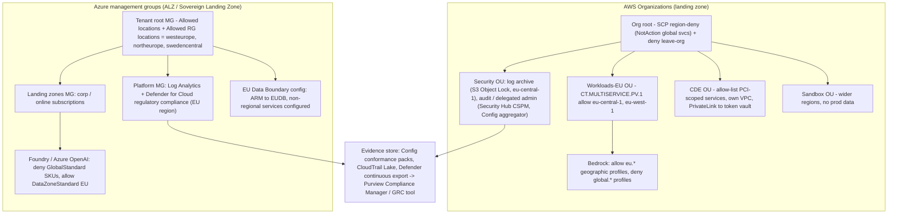
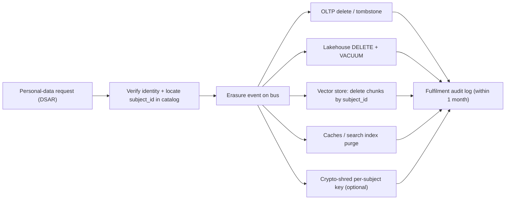

# L3 Data residency, sovereignty & compliance frameworks
> Last verified: 2026-10 · Audience: senior/staff DevOps, SRE, AI eng, NetEng, DevSecOps, architects

*Architect-level notes, not legal advice. Your DPO or counsel decides; you build controls that produce evidence.*

## TL;DR
- **Residency ≠ sovereignty ≠ localization.** Residency is *where bytes live*. Localization is a *legal mandate* to keep them in-country. Sovereignty is *who can be compelled to access them, and who operates the stack*. A US-owned provider in Frankfurt gives you residency. It does not by itself give you sovereignty, because of the **US CLOUD Act**.
- **Compliance is shared.** The provider's certificates (from **AWS Artifact** or the **Microsoft Service Trust Portal**) cover *their* layer. You still have to scope, configure and evidence your own layer. "AWS is PCI compliant" does **not** make your app PCI compliant.
- **GDPR, the engineering version:** every processing activity needs a **lawful basis** (Art. 6). Build pipelines for **access, erasure and portability** (1 month to respond). Run a **DPIA** for high-risk processing. Sign an **Art. 28 DPA** with every processor and sub-processor. Report breaches within **72 h**. Every transfer out of the EEA needs an Art. 45/46 mechanism: the **EU-US DPF** (adequacy since **10 Jul 2023**, upheld by the General Court in *Latombe*, **3 Sep 2025**) or **SCCs + TIA**.
- **Scope reduction is the main architecture lever:** **tokenize PAN** to shrink the PCI **CDE**, **segment** (and pen-test the segmentation), keep PHI only in **HIPAA-eligible services under a BAA**, and isolate regulated data into dedicated accounts or subscriptions.
- **Attestations differ:** SOC 2 **Type I** tests design at a point in time. **Type II** tests operating effectiveness over a period of 3–12 months. ISO **27001** certifies an ISMS, **27701** extends it to privacy (PIMS), **42001** covers an AI management system. FedRAMP is the US federal authorization, and in 2026 it is moving to **FedRAMP 20x** (no new Rev5 certifications after **11 Jun 2027**).
- **EU AI Act** (in force 1 Aug 2024): prohibitions from **2 Feb 2025**, GPAI obligations from **2 Aug 2025**, general application **2 Aug 2026**. The **AI Omnibus** (in force 27 Jul 2026) moved high-risk to **2 Dec 2027 (Annex III)** and **2 Aug 2028 (Annex I)**.
- **Enforce residency as code:** **SCP region-deny** or Control Tower `AWS-GR_REGION_DENY` / `CT.MULTISERVICE.PV.1`, and **Azure Policy "Allowed locations"** at management-group scope. Also pin **LLM processing geography**: Azure **Data Zone** deployments, Bedrock **geographic** (not global) cross-Region inference. Global LLM endpoints are the most common residency leak in 2026.
- **Evidence automation:** Config conformance packs, Security Hub CSPM standards and Control Tower controls on AWS. Defender for Cloud regulatory compliance plus Purview Compliance Manager on Azure. **AWS Audit Manager is in maintenance mode** and has been closed to new setups since **30 Apr 2026**.

## L3.1 Residency vs sovereignty vs localization
- **How it works:**

| Term | Question it answers | Typical driver | Engineering control |
|---|---|---|---|
| **Data residency** | Where is data stored and processed? | Customer contracts, policy, GDPR transfer avoidance | Region choice, region-deny guardrails, replica/backup/log location |
| **Data localization** | Must a copy (or all copies) stay in-country by law? | National laws (e.g. Russia, China PIPL/CSL critical data, India sectoral rules, some public-sector and finance regimes) | In-country region only, no cross-border replication, local key custody |
| **Data sovereignty** | Whose laws apply, and who can be compelled to grant access? | Foreign-government access risk (US **CLOUD Act**, FISA 702), public sector, critical infra | Customer-held keys (HYOK/EKM), sovereign or partner-operated cloud, EU-resident operations staff, legal-entity separation |
| **Operational sovereignty** | Who operates, supports and can access the control plane? | Government and regulated EU customers | AWS European Sovereign Cloud, Microsoft Sovereign Cloud / national partner clouds |

  - Residency must cover **every copy**: primary store, replicas, backups and snapshots, **logs and telemetry**, search/vector indexes, caches, CDN edges, support tickets, **LLM inference endpoints**, and DR regions.
  - **Metadata leaks:** resource names, tags and some global control planes (IAM, Route 53, CloudFront, Entra ID) are global. Never put personal data in tags or names. AWS Bedrock docs explicitly warn about this.
- **Trade-offs / when to use:**
  - Strict in-country residency costs you **DR distance**: you may get only one region per country, so you lean on multi-AZ and accept a regional-outage RTO. It also costs **service availability** (new services and models launch later in small regions) and **price** (global and LLM capacity is cheaper).
  - Encryption with customer-held keys helps with sovereignty (L2), but if the provider operates the KMS, compelled access to keys is still a risk scenario. HYOK and external key managers address that at an availability cost.
- **Interview angles:**
  - If asked "Is data in eu-central-1 GDPR-compliant?", say: residency is neither required nor sufficient for GDPR. GDPR regulates **transfers** (including *remote access* from a third country) and lawful processing, not storage location per se. The concern is the provider's parent company being subject to foreign law.
  - Follow-up "What leaks residency?" Global LLM endpoints, SaaS observability (log shipping to a US tenant), support access, CI artifacts, cross-region backup copy, and data copied to analysts' laptops.

## L3.2 Shared responsibility for compliance
- **How it works:**
  - The provider owns security **of** the cloud (facilities, hardware, hypervisor, managed-service internals). The customer owns security **in** the cloud (data, identity, configuration, network rules, app code, encryption choices). The split moves toward the provider from IaaS → PaaS → SaaS. **Data, identities and accounts are always the customer's.**
  - **Inherited controls** (physical security, media destruction) are evidenced with the provider's SOC 2, ISO and PCI AOC reports, downloaded from **AWS Artifact** or the **Microsoft Service Trust Portal** (also reachable from Defender for Cloud → Regulatory compliance → *Audit reports*).
  - Each compliance program has its own **in-scope service list**: "AWS Services in Scope by Compliance Program", Azure compliance offerings per service. Only use in-scope services for regulated data.
  - The AI layer follows the same model: the provider secures model hosting. You own prompts, grounding data, output handling, guardrail config and access.
- **Trade-offs / when to use:** managed services move more controls into "inherited", which simplifies audits. In return you get less control over location and processing (e.g. global services).
- **Interview angles:**
  - Pitfall: telling an auditor "AWS is PCI DSS Level 1, so we're compliant." The correct answer is that AWS's **AOC** covers their part. You need your own **ROC/SAQ** covering your CDE, and a **responsibility matrix** (PCI Req 12.8.5 requires a documented split with each TPSP).

## L3.3 GDPR for engineers
- **How it works:**
  - **Roles:** **Controller** decides purposes and means. **Processor** acts on documented instructions. A cloud or LLM provider is normally your processor, and its sub-processors are *your* sub-processors. **Art. 28 DPA** is mandatory: instructions, confidentiality, security (Art. 32), sub-processor authorization (general authorization with **notice and a right to object** is the norm), assistance with data subject rights and DPIAs, deletion or return at the end, audits.
  - **Lawful basis (Art. 6), six options:** consent, contract, legal obligation, vital interests, public task, legitimate interests (needs a **LIA** balancing test). **Special categories (Art. 9)** such as health and biometrics need an additional condition. Pick the basis *before* processing. It drives which rights apply.
  - **Data subject rights:** access (Art. 15), rectification (16), **erasure (17)**, restriction (18), **portability (20)**, which applies only to data *provided by* the subject and processed by **consent or contract**, by automated means, delivered in a **structured, commonly used, machine-readable** format. Objection (21). **Automated decision-making (22)**: right to human intervention, relevant for ML scoring. Response deadline is **1 month**, extendable by **2 months** for complex requests.
  - **Privacy by design and default (Art. 25)**, **RoPA (Art. 30)** record of processing, **security (Art. 32)** naming pseudonymization and encryption explicitly, **breach notification (Art. 33/34)**: to the supervisory authority within **72 h** of awareness, and to individuals "without undue delay" if high risk.
  - **DPIA (Art. 35)** is required for "likely high risk": large-scale special-category data, systematic monitoring, innovative tech (most regulators list **AI/ML profiling**). Prior consultation (Art. 36) applies if residual risk stays high.
  - **Fines:** up to **€20M or 4%** of global annual turnover (whichever is higher) for principles, rights and transfers. **€10M or 2%** for obligations such as Art. 28 and 32.
- **Trade-offs / when to use:**
  - **Erasure engineering:** use a `subject_id` on every record and chunk, a deletion workflow fanned out over an event bus, TTLs, backups "put beyond use", and re-deletion on restore. **Crypto-shredding** uses per-subject or per-tenant keys (see L2.8). Pseudonymized data is **still personal data**. Only truly anonymized data is out of scope.
  - **Portability:** expose an export job (JSON/CSV) per subject. Don't build it ad hoc per request.
  - Legitimate interest beats consent for operations such as security logging. Consent is fragile (it can be withdrawn), so avoid it for core processing.
- **Interview angles:**
  - "Design right-to-erasure for a system with a data lake and vector store." Answer: inventory (L1) → subject index → delete or tombstone in OLTP, propagate via CDC → lakehouse `DELETE` plus compaction/VACUUM so old files are physically gone → re-embed or delete vector chunks by metadata filter → purge caches → backups expire within the documented retention → audit log of fulfilment.
  - "Can we train a model on customer data?" Check purpose compatibility (Art. 5(1)(b)), the lawful basis, and the DPIA. Erasure requests against trained weights are an open problem, so prefer RAG over fine-tuning for personal data (L5).

## L3.4 International transfers: SCCs, adequacy, EU-US DPF
- **How it works:**
  - **Chapter V:** transfers outside the EEA need either **adequacy (Art. 45)** or **appropriate safeguards (Art. 46)**: **SCCs**, BCRs, codes or certifications. **Art. 49 derogations** (explicit consent, contract necessity) are narrow and occasional.
  - **Remote access counts as a transfer.** A US admin or support engineer viewing EU data is a transfer.
  - **SCCs (2021/914)** come in four modules: C2C, C2P, P2P, P2C. With SCCs you need a **Transfer Impact Assessment (TIA)** post-*Schrems II* (CJEU, 16 Jul 2020, which invalidated Privacy Shield) plus **supplementary measures** (encryption with EU-held keys, pseudonymization).
  - **EU-US Data Privacy Framework:** adequacy decision **10 Jul 2023**. It covers **only self-certified US organizations** (check the DPF list). It rests on **EO 14086** (necessity and proportionality for signals intelligence) and a **Data Protection Review Court** for redress. The US safeguards also benefit SCC transfers, which makes TIAs easier.
  - **Status (2026-10):** the EU General Court **dismissed** *Latombe v Commission* (T-553/23) on **3 Sep 2025**, so the DPF stands. An appeal to the CJEU is pending (unverified). A "Schrems III" challenge remains possible. **UK Extension ("data bridge")** has applied since 12 Oct 2023, and **Swiss-US DPF** since 15 Sep 2024.
- **Trade-offs / when to use:**
  - Belt and braces: providers such as AWS and Microsoft include **SCCs in their DPAs** and are DPF-certified, so the transfer survives if the DPF falls. Design so a DPF invalidation is a **config change** (EU-only region and data-zone processing), not a re-architecture.
- **Interview angles:**
  - "What happens if the DPF is struck down like Privacy Shield?" Fall back to SCCs + TIA + supplementary measures, which in practice means EU-held keys and minimizing what reaches US-controlled processing. Your residency guardrails become the mitigation.

## L3.5 HIPAA
- **How it works:**
  - Applies to **covered entities** (providers, plans, clearinghouses) and **business associates** (BAs). **PHI** is individually identifiable health info. The **Privacy Rule**, **Security Rule** (administrative, physical and technical safeguards, risk analysis) and **Breach Notification Rule** apply: notify individuals within **60 days** of discovery, and notify HHS and the media if 500+ are affected.
  - A **CSP storing or processing ePHI is a business associate even if it only holds encrypted data without the key** (HHS cloud guidance). The narrow "conduit" exception does not cover storage. A **BAA** is required.
  - **AWS:** accept the **AWS BAA in AWS Artifact (Agreements)** per account or org. Use only **HIPAA Eligible Services** for PHI. **Azure:** the BAA is included through the **Microsoft Product Terms / DPA** for in-scope services.
  - HIPAA has **no data-location requirement**. Offshore storage is not prohibited, but contracts and state law may restrict it.
  - De-identification: **Safe Harbor** (remove 18 identifiers) or **Expert Determination** (see L1.3).
  - The **Security Rule NPRM** (published Jan 2025) proposed mandatory encryption, MFA, asset inventory and 72-h restore. Final-rule status is **unverified**.
- **Trade-offs / when to use:** put PHI in a dedicated account or OU with an SCP that allow-lists eligible services. Pitfall: PHI in a non-eligible service, such as an analytics or AI preview feature.
- **Interview angles:**
  - "Can we send PHI to an LLM?" Yes, if the service is HIPAA-eligible under the BAA (Bedrock and Azure OpenAI/Foundry are in scope for their HIPAA programs; check the current list), logging is configured so PHI does not land in non-eligible sinks, and the minimum-necessary standard is applied.

## L3.6 PCI DSS v4.0.1
- **How it works:**
  - **v4.0.1** was published June 2024 as a limited revision (clarifications, no new requirements). **v4.0 retired 31 Dec 2024.** The **51 future-dated requirements became mandatory 31 Mar 2025**, among them 6.4.3 and 11.6.1 (payment-page script integrity and change detection), 8.4.2 (MFA for all CDE access), 5.4.1 (anti-phishing), 12.5.2.1 and targeted risk analyses (12.3.1). (Dates from the PCI SSC timeline; the page could not be fetched, so these come from memory.)
  - **12 requirements** in 6 goals. **Validation:** Level 1 merchants (>6M txns/yr) need a **ROC by a QSA**. Others file **SAQs** (A, A-EP, D, etc.). Service providers produce an **AOC**.
  - **CDE scope** = systems that store, process or transmit CHD/SAD, **plus anything connected to or able to affect their security** (connected-to / security-impacting systems: AD, CI/CD, jump hosts, logging).
  - **Segmentation** is not required, but it shrinks scope. It must be **validated by pen test** at least annually for merchants and every **6 months for service providers** (11.4.5/11.4.6).
  - **SAD (CVV2, track, PIN) must never be stored after authorization.** PAN must be unreadable when stored (3.5): truncation, tokenization, strong cryptography or keyed hashes.
- **Trade-offs / when to use:**
  - **Tokenization or a hosted payment page** (iframe or redirect to a PSP) can drop you from SAQ D to **SAQ A / A-EP**. The token vault becomes the CDE. Your apps handle only tokens, which are out of scope if they cannot be detokenized by those systems.
  - Cloud pattern: CDE in a **dedicated account or subscription**, its own VPC/VNet, PrivateLink to the token service, SCPs or policies, and a separate CI/CD identity. Shared services such as logging and identity are *connected-to* systems and therefore in scope.
- **Interview angles:**
  - "How do you shrink PCI scope?" Never touch PAN (iframe/PSP) → tokenize at the edge → isolate the vault account → segmentation pen tests → keep CDE logs out of general SIEM tenants or mask them.
  - Pitfall: card numbers leaking into logs or LLM prompts. Run DLP and log scrubbing (L1.4).

## L3.7 SOC 2
- **How it works:**
  - AICPA attestation (not a certification) issued by a **CPA firm** against the **Trust Services Criteria (TSC 2017, points of focus revised 2022)**. **Security** (Common Criteria CC1–CC9, mandatory) plus optional **Availability, Processing Integrity, Confidentiality, Privacy**.
  - **Type I** covers the design of controls at a *point in time*. **Type II** covers design **and operating effectiveness over a period** (typically 6–12 months, minimum around 3).
  - **SOC 1** covers ICFR (financial reporting). **SOC 3** is a public summary. A **bridge (gap) letter** covers the time between the period end and today.
  - Reports list **CUECs** (complementary user entity controls, which you must operate) and **subservice organizations** (carve-out vs inclusive method).
- **Trade-offs / when to use:** SOC 2 is the US B2B SaaS default. ISO 27001 is more common in EU and global procurement. Many companies hold both and map controls once (common control framework).
- **Interview angles:** "We got the vendor's SOC 2. Done?" Read the **exceptions**, the scope (which systems), the period, the CUECs you must implement, and the carved-out subservice orgs (e.g. their cloud provider).

## L3.8 ISO/IEC 27001, 27701, 42001
- **How it works:**

| Standard | What | Key facts |
|---|---|---|
| **ISO/IEC 27001:2022** | ISMS certification (accredited CB, 3-yr cycle, annual surveillance audits) | Annex A: **93 controls in 4 themes** (organizational, people, physical, technological) vs 114 in 2013. The **transition from 2013 ended 31 Oct 2025**. The **Statement of Applicability (SoA)** is the key artifact |
| **ISO/IEC 27017 / 27018** | Cloud security controls / PII protection in public cloud (processor) | Both AWS and Azure hold them |
| **ISO/IEC 27701** | Privacy Information Management System (PIMS), controller and processor controls, maps to GDPR | **2025 edition is standalone** (no longer only an extension of 27001) (unverified) |
| **ISO/IEC 42001:2023** | **AI Management System (AIMS)**: AI policy, AI risk and impact assessment, data and model lifecycle controls (Annex A) | Certifiable. AWS and Microsoft hold 42001 for AI services. Useful evidence toward EU AI Act QMS expectations, but not a legal presumption of conformity |

- **Trade-offs / when to use:** ISO 27001 certifies a *management system* (risk process, continual improvement), not that every control is perfect. Scope statements can be narrow, so read the certificate scope.
- **Interview angles:** "Building an AI governance program?" ISO 42001 AIMS + NIST AI RMF for risk vocabulary + EU AI Act obligations by tier (L3.10) + model and data governance (L5).

## L3.9 FedRAMP, GovCloud, Azure Government
- **How it works:**
  - **FedRAMP** authorizes cloud services for US federal use, based on **NIST SP 800-53 Rev 5** baselines **Low / Moderate / High** (+ LI-SaaS). Under Rev5 you get an agency ATO or a program authorization with a 3PAO assessment and continuous monitoring (monthly ConMon).
  - **FedRAMP 20x** status (fedramp.gov, 2026): the Phase 1 Low pilot (Apr–Sep 2025) and the Phase 2 Moderate pilot (Nov 2025–Mar 2026) are complete. Phase 3 is active (consolidated rules, open submissions from Jul 2026). The High pilot is planned for FY27. **New Rev5 certifications stop being accepted on 11 Jun 2027.** 20x replaces static annual audits with automated, near-real-time validation via **Key Security Indicators (KSIs)** and certification "classes". The JAB was replaced by the FedRAMP Board in 2024.
  - **AWS GovCloud (US-West, US-East):** an isolated partition (`aws-us-gov`) operated by **US citizens on US soil**, for ITAR/EAR, FedRAMP High, DoD SRG IL4/IL5 and CJIS workloads. It has separate accounts and IAM. AWS Secret and Top Secret regions exist for classified work.
  - **Azure Government:** separate cloud instance (US Gov Virginia/Arizona/Texas, DoD regions), screened US persons, own endpoints (`*.usgovcloudapi.net`), separate Entra ID. **Azure commercial** also holds FedRAMP High for many services, so Gov is needed mainly for **IL4/IL5, ITAR, CJIS and personnel screening**.
- **Trade-offs / when to use:** gov partitions lag on service and model availability, and IaC needs a different partition, endpoints and ARNs. Choose them only when contract or regulation requires.
- **Interview angles:** "FedRAMP Moderate SaaS on AWS commercial or GovCloud?" Commercial US regions carry FedRAMP Moderate/High for many services. GovCloud becomes necessary for ITAR, IL5 or US-person operations requirements.

## L3.10 EU AI Act (timeline by risk tier)
- **How it works:**

| Tier | Examples | Obligations | Applies from |
|---|---|---|---|
| **Unacceptable (prohibited, Art. 5)** | Social scoring, manipulative techniques, untargeted facial-image scraping, emotion recognition at work or school, most real-time remote biometric ID for policing | Banned | **2 Feb 2025** (with AI-literacy duty Art. 4). The AI Omnibus added a 9th prohibition (non-consensual intimate content / CSAM generation), applying **Dec 2026** |
| **GPAI models** | Foundation models; **systemic risk** if trained with >10^25 FLOP or designated | Technical docs, copyright policy, training-data summary. Systemic: evals, adversarial testing, incident reporting, cybersecurity. GPAI **Code of Practice** (Jul 2025) as a compliance route | **2 Aug 2025** (Commission enforcement powers from 2 Aug 2026. Models already on the market before Aug 2025 have until **2 Aug 2027**) |
| **High-risk, Annex III** | Employment/HR screening, credit scoring, education, essential services, biometrics, critical infra, migration, law enforcement | Risk management, data governance, logging, human oversight, accuracy and robustness, QMS, conformity assessment, EU database registration, FRIA for deployers | **2 Dec 2027** (postponed from 2 Aug 2026 by the **AI Omnibus**: proposed 19 Nov 2025, agreed 7 May 2026, in force 27 Jul 2026) |
| **High-risk, Annex I** | AI as a safety component of regulated products (medical devices, machinery, toys) | As above, via sectoral conformity | **2 Aug 2028** (was 2 Aug 2027) |
| **Limited risk (transparency, Art. 50)** | Chatbots, deepfakes, AI-generated content | Disclose AI interaction, label synthetic content (machine-readable marking) | **2 Aug 2026** (general application date. Omnibus grace periods for some marking duties are unverified) |
| **Minimal** | Spam filters, games | Voluntary codes | n/a |

  - **Roles:** provider, deployer, importer, distributor. Fine-tuning or substantially modifying a model, or putting your name on it, can make you a **provider**.
  - **Penalties:** prohibited practices up to **€35M or 7%** of turnover. Most other obligations up to **€15M or 3%**. Supplying incorrect info **€7.5M or 1%**.
- **Trade-offs / when to use:** most enterprise LLM apps (internal copilots, RAG over docs) are **limited or minimal risk**, so the duties are transparency, AI literacy and GPAI-provider flow-down. HR, credit and insurance use cases are Annex III.
- **Interview angles:**
  - "We're building a CV-screening assistant for EU customers. What changes?" That is **Annex III high-risk**: risk management system, data governance (bias), **logging and traceability**, human oversight, accuracy metrics, conformity assessment, and registration before placing on the market, by **2 Dec 2027**. Tie this to L5 (model governance) and K9 (evals).
  - Pitfall: quoting "high-risk from Aug 2026". That date was superseded by the Omnibus.

## L3.11 Sovereign cloud offerings
- **How it works:**
  - **AWS European Sovereign Cloud (ESC):** **GA 14 Jan 2026**. First region **`eusc-de-east-1` (Brandenburg, Germany)** in a **separate partition `aws-eusc`**, with its own **IAM, billing and control plane inside the EU**. Operated by EU-based legal entities under German law with EU managing directors. Moving to operation **exclusively by EU citizens located in the EU** (currently a blended EU-resident/EU-citizen team). Launch services include EC2, Lambda, S3, EBS, RDS/Aurora, DynamoDB, EKS/ECS, KMS, Private CA, SageMaker and Bedrock. **Sovereign Local Zones** are planned in Belgium, the Netherlands and Portugal. Control Tower offers **245+ digital sovereignty controls** (AWS figure).
  - **Microsoft EU Data Boundary (EUDB):** Microsoft commits to store and process **Customer Data and pseudonymized personal data** for Azure, M365, D365 and Power Platform in **EU + EFTA**, and to store Professional Services Data at rest there. Completed in phases, the final phase in **Feb 2025**. Documented limited transfers remain (e.g. security operations, some global services). Azure non-regional services need specific configuration, and **ARM must be configured to the EUDB** for professional-services data. **M365 Multi-Geo tenants are excluded.**
  - **Microsoft Sovereign Cloud** (2025+): **Sovereign Public Cloud** (EUDB + sovereign controls in public regions: Data Guardian (EU-staff approval/oversight of remote access), External Key Management with customer HSMs, confidential computing, the **Sovereign Landing Zone** with sovereignty policy baselines). **Sovereign Private Cloud** (Azure Local, Microsoft 365 Local, disconnected operations). **National partner clouds** (e.g. **Bleu** in France, **Delos Cloud** in Germany). In-country processing for M365 Copilot.
- **Trade-offs / when to use:** separate-partition clouds (ESC, GovCloud) bring separate identities and ARNs, lagging features and model catalogs, and separate pricing. Sovereign controls in public regions are easier, but the operator and parent remain under US jurisdiction. Pick based on the threat model (contractual residency vs foreign-compulsion risk).
- **Interview angles:** "German public-sector customer requires sovereignty." Tiers: EU region + region-deny + CMK (residency) → EKM/HYOK + EUDB/Data Guardian or ESC (operational sovereignty) → partner-operated or disconnected cloud (Delos/Bleu/Azure Local) for the highest assurance.

## L3.12 Residency guardrails (as code)
- **How it works:**
  - **AWS SCP region deny:** `Deny` with **`NotAction`** (an exemption list of global services: IAM, Organizations, STS, Route 53, CloudFront, support, billing, WAF, etc.) where `aws:RequestedRegion` is **not** in the approved list. Exempt break-glass and automation roles with `ArnNotLike aws:PrincipalARN`.
    - **Control Tower** offers the landing-zone-wide **`AWS-GR_REGION_DENY`** (applies to all OUs with the `AWSControlTowerBaseline`, can't deny the home region, exempts `AWSControlTowerExecution`) and the OU-level **`CT.MULTISERVICE.PV.1`**. Remove resources from denied regions **before** enabling.
    - SCPs are capped at **5,120 characters**, with up to 5 SCPs attached per target. Long NotAction lists eat into that budget.
  - **Bedrock cross-Region inference:** **geographic profiles** (`us.`, `eu.`, `apac.`) keep processing within the geography but require the SCP to allow **all destination regions** in the profile. **Global profiles** (`global.`, ~10% cheaper) route worldwide and need `aws:RequestedRegion = "unspecified"` allowed. CloudTrail logs in the **source region** with `additionalEventData.inferenceRegion`. CRIS can route to regions not enabled in your account. **Deny global profiles in regulated OUs.**
  - **Azure Policy "Allowed locations"** (built-in `e56962a6-4747-49cd-b67b-bf8b01975c4c`, param `listOfAllowedLocations`, default effect **Deny**). It **excludes resource groups, `global` resources and B2C directories**, so pair it with **"Allowed locations for resource groups"** (`e765b5de-1225-4ba3-bd56-1ac6695af988`). Assign at **management-group** scope and use exemptions sparingly. Policy evaluates ARM requests, so data-plane replication (e.g. GRS pairing, Cosmos DB multi-region writes) needs its own policies.
  - **Azure OpenAI / Foundry deployment types:** **Global** (any region), **Data Zone** (US, **EU = EU Data Boundary**, APAC), **Standard/Regional Provisioned** (within the Azure geography). **Data at rest stays in the resource's geography for all types**, while *processing* varies. Use Azure Policy to deny `Microsoft.CognitiveServices/accounts/deployments` where `sku.name` is `GlobalStandard`, `GlobalProvisionedManaged`, `GlobalBatch` or `DeveloperTier` (the developer tier has no residency guarantee).
  - Other leaks to guard: S3 Cross-Region Replication and backup copy destinations (Backup vault policies), Azure GRS paired regions (choose ZRS/LRS or check the pair is in-geo), log destinations (SIEM tenant region), and CDN caching of personal data.
- **Trade-offs / when to use:** preventive (SCP/Policy deny) beats detective, but it breaks global services and new features. Keep an exemption process and test in a sandbox OU first.
- **Interview angles:** "Why NotAction rather than Action?" You want default-deny outside approved regions for *all* regional services, including new ones, while allowing global control planes whose API calls resolve to `us-east-1`.

## L3.13 Audit evidence automation
- **How it works:**
  - **Provider evidence:** **AWS Artifact** (SOC 1/2/3, PCI AOC, ISO certs, C5, plus **agreements** such as the BAA and GDPR DPA, accepted per account or org). **Microsoft Service Trust Portal** (audit reports, pen-test summaries, Compliance Manager links).
  - **AWS customer evidence:**
    - **Config** rules + **conformance packs** (100+ templates: PCI DSS v4.0, HIPAA Security, NIST 800-53 r5, FedRAMP, CIS) with org-wide deployment, remediation and configuration history.
    - **Security Hub CSPM standards** (AWS FSBP, CIS, NIST 800-53 r5, NIST 800-171, PCI DSS) with central configuration across accounts and regions.
    - **Control Tower** controls keyed by framework (preventive SCP/RCP, proactive CloudFormation hooks, detective Config) per OU.
    - **CloudTrail** org trail + CloudTrail Lake.
    - **AWS Audit Manager** has been in **maintenance mode** since **30 Apr 2026**: no new accounts, regions or frameworks. AWS recommends Config conformance packs and partners (Vanta, Drata) for full control frameworks. **Gaps: there are no SOC 2 or GDPR conformance packs.**
  - **Azure customer evidence:** **Azure Policy regulatory-compliance initiatives** (built-in: NIST SP 800-53 r5, ISO 27001, PCI DSS v4, HIPAA HITRUST, FedRAMP High, SOC 2, etc.) surface in **Defender for Cloud → Regulatory compliance**. **MCSB** is the default. Adding other standards needs **at least one paid Defender plan**. It covers **AWS and GCP connectors** too. Assessments run about **every 12 h**, with manual attestation and evidence upload, PDF/CSV report download, and **continuous export** (Event Hubs or Log Analytics, stream or weekly snapshot). That data flows into **Purview Compliance Manager** (assessments, improvement actions, compliance score, Microsoft-actions vs your-actions, multicloud).
  - **Pattern:** a common control framework maps each control to automated checks (Config / Policy), preventive guardrails (SCP / Policy deny), logs (CloudTrail / Activity Log) and manual evidence (policies, training). Evidence goes to an immutable store (S3 Object Lock / immutable blob) under a retention policy.
- **Trade-offs / when to use:** technical checks cover perhaps 30–40% of a framework. Process controls (HR, vendor management, IR tests) need GRC tooling. Detective dashboards ≠ an audit opinion.
- **Interview angles:** "How do you make SOC 2 Type II painless?" Use controls as code plus continuous evidence over the whole period, a ticketed change management trail (PRs, approvals, deploy logs), quarterly access reviews exported automatically, and a GRC tool pulling from Config/Security Hub/Defender APIs.

## L3.14 LLM usage compliance
- **How it works:**
  - **Processing terms to check for any LLM API:** a DPA with the provider as **processor**, **no training on customer prompts or outputs** by default, retention period for prompts and outputs (abuse monitoring), **zero-data-retention** options, sub-processors, processing geography, BAA/HIPAA eligibility, and in-scope certifications (SOC 2, ISO 27001/27701/42001).
  - **Amazon Bedrock:** the provider runs per-region **model deployment accounts owned by the Bedrock team**. **Model providers have no access** to prompts, completions or logs. Prompts are not used to train base models. Invocation logging is opt-in, to *your* S3/CloudWatch.
  - **Azure OpenAI / Foundry:** prompts and completions are not used to train foundation models and are not shared with OpenAI. **Abuse monitoring** may store flagged data (30-day retention historically, unverified for 2026). Approved customers can apply for **modified abuse monitoring** (no storage). Pick a **Data Zone** or regional deployment for residency.
  - **Anthropic (Claude API / commercial):** commercial terms state customer content is not used for training by default. ZDR is available by agreement. Claude is also reachable via Bedrock, Vertex AI and Microsoft Foundry, where the *cloud provider's* terms and residency apply. Verify current retention in the commercial terms and the Trust Center.
  - Consumer chat apps (free/pro tiers) often have different defaults, such as training opt-outs. Block them for corporate data via SSE/CASB plus DLP (L1.7) and route usage through an **AI gateway** (K7) that enforces approved endpoints, redaction and logging.
- **Trade-offs / when to use:** global endpoints give the newest models, the most quota and the lowest price. Residency-pinned endpoints give compliance but models arrive later and quota is lower. Decide per data class: Restricted data → data-zone/regional only, Public → global allowed.
- **Interview angles:**
  - "Legal says no customer data may leave the EU. Can we use GPT/Claude?" Yes: Azure **Data Zone EU** or Bedrock **`eu.` geographic profile** (or ESC), Azure Policy / SCPs denying global SKUs and profiles, EU-region logging, a DPA plus EU SCCs, and a DPIA for the use case. Remember **embeddings and vector stores are personal data too**.

## Diagrams





## Cloud mapping: AWS vs Azure

| Capability | AWS | Azure | Role it plays | Key differences | Alternatives |
|---|---|---|---|---|---|
| Provider audit reports and agreements | **AWS Artifact** (reports + agreements: BAA, GDPR DPA) | **Service Trust Portal** (+ Defender "Audit reports") | Inherited-control evidence | AWS BAA accepted in Artifact. Azure BAA is in the Product Terms/DPA | Vendor trust centers (Drata/Vanta/SafeBase pages) |
| Continuous compliance (config checks) | **Config rules + conformance packs** | **Azure Policy** (audit effects) + **regulatory compliance initiatives** | Detective technical controls mapped to frameworks | Conformance packs are CloudFormation-like templates deployable org-wide. Policy initiatives are assigned at MG scope and also act preventively | Open Policy Agent, Cloud Custodian, Prowler |
| Posture against standards | **Security Hub CSPM standards** (FSBP, CIS, NIST, PCI) | **Defender for Cloud regulatory compliance** (MCSB default, extra standards need a paid plan) | Scored dashboard per standard | Defender also assesses AWS/GCP via connectors. Security Hub CSPM is AWS-only | Wiz, Prisma Cloud, Orca |
| Compliance program management | **Audit Manager** (maintenance mode since Apr 2026) → Config + partners | **Purview Compliance Manager** | Control mapping, evidence, improvement actions, scores | Compliance Manager is actively developed and takes Defender data. Audit Manager is closed to new setups | Vanta, Drata, ServiceNow IRM, OneTrust |
| Preventive guardrails | **SCPs** (+ RCPs), **Control Tower** controls (`AWS-GR_REGION_DENY`, `CT.MULTISERVICE.PV.1`) | **Azure Policy** deny (Allowed locations), **ALZ / Sovereign Landing Zone** policy sets | Block non-approved regions, services, SKUs | SCPs filter IAM permissions (no resource-property inspection except via conditions). Policy inspects ARM resource properties (e.g. LLM deployment SKU) | Terraform Sentinel/OPA in CI |
| Residency-pinned LLM processing | **Bedrock geographic CRIS** (`eu.`/`us.`/`apac.`) or in-region, **ESC** | **Data Zone** deployments (EU = EUDB), Standard regional | Keep inference in a geography | Bedrock global profile needs `unspecified` region in SCP. Azure data at rest always stays in geo, processing varies by SKU | Claude via Vertex regional endpoints, self-hosted models (K4) |
| Sovereign / isolated clouds | **European Sovereign Cloud** (`aws-eusc`), **GovCloud** (`aws-us-gov`) | **EU Data Boundary**, **Microsoft Sovereign Cloud** (public/private/partner: Bleu, Delos), **Azure Government** | Operational sovereignty, personnel screening | AWS uses separate partitions. Microsoft mixes boundary commitments in public regions with separate clouds | Google sovereign partners (S3NS, T-Systems), OVHcloud SecNumCloud |
| Org-wide audit log | CloudTrail org trail / Lake | Activity Log + Entra logs → Log Analytics (diagnostic settings via Policy) | Who-did-what evidence | CloudTrail is on by default (90-day Event history). Azure needs diagnostic settings for long retention | Splunk, Sentinel, Chronicle |

- **Artifact vs Service Trust Portal:** both distribute *provider* attestations under NDA-style terms. Neither proves *your* compliance.
- **Config conformance packs vs Azure Policy initiatives:** both map rules to framework controls. Azure Policy is both **preventive and detective** in one engine. On AWS, preventive (SCP/RCP), proactive (CFN hooks) and detective (Config) are separate mechanisms that Control Tower unifies by OU.
- **Security Hub CSPM vs Defender for Cloud:** Defender's regulatory compliance dashboard is multicloud and feeds Purview Compliance Manager. Security Hub CSPM supports fewer frameworks (no SOC 2 or ISO) and works per region with central configuration.
- **Audit Manager vs Compliance Manager:** the biggest 2026 divergence. AWS stepped back to Config plus partners, while Microsoft keeps a first-party GRC-lite product.
- **Gotchas:** SCP 5,120-char limit. Policy "Allowed locations" skips RGs and `global`. Control Tower region deny can't deny the home region. Bedrock CRIS works in regions you haven't enabled. Azure Data Zone EU may include EFTA countries (Norway, Switzerland), and Microsoft can add regions to a data zone without notice.

## Hands-on (optional)

```hcl
# --- AWS: SCP denying non-approved regions (attach to OU, exempt break-glass) ---
variable "approved_regions" { default = ["eu-central-1", "eu-west-1"] }
variable "workloads_eu_ou_id" { type = string }

data "aws_iam_policy_document" "region_deny" {
  statement {
    sid     = "DenyOutsideApprovedRegions"
    effect  = "Deny"
    # Global/control-plane services whose calls resolve to us-east-1 must stay allowed
    not_actions = [
      "iam:*", "organizations:*", "sts:*", "account:*", "route53:*", "route53domains:*",
      "cloudfront:*", "waf:*", "wafv2:*", "shield:*", "globalaccelerator:*",
      "support:*", "trustedadvisor:*", "health:*", "budgets:*", "ce:*", "cur:*",
      "billing:*", "aws-portal:*", "pricing:*", "artifact:*", "sso:*", "kms:*",
      "networkmanager:*", "directconnect:*", "s3:ListAllMyBuckets", "s3:GetBucketLocation",
      "tag:GetResources", "ec2:DescribeRegions"
    ]
    resources = ["*"]
    condition {
      test     = "StringNotEquals"
      variable = "aws:RequestedRegion"
      values   = var.approved_regions
    }
    condition {
      test     = "ArnNotLike"
      variable = "aws:PrincipalARN"
      values = [
        "arn:aws:iam::*:role/AWSControlTowerExecution",
        "arn:aws:iam::*:role/BreakGlassAdmin"
      ]
    }
  }
}

resource "aws_organizations_policy" "region_deny" {
  name    = "scp-region-deny-eu"
  type    = "SERVICE_CONTROL_POLICY"
  content = data.aws_iam_policy_document.region_deny.json # keep < 5,120 chars
}

resource "aws_organizations_policy_attachment" "eu_ou" {
  policy_id = aws_organizations_policy.region_deny.id
  target_id = var.workloads_eu_ou_id
}
# Note: if Bedrock eu.* profiles route to regions outside approved_regions, add those
# destination regions; never allow "unspecified" (global profiles) in regulated OUs.
```

```hcl
# --- Azure: Allowed locations (resources + resource groups) at management-group scope ---
variable "mg_id" { type = string } # e.g. /providers/Microsoft.Management/managementGroups/landingzones
locals { allowed = ["westeurope", "northeurope", "swedencentral"] }

resource "azurerm_management_group_policy_assignment" "allowed_locations" {
  name                 = "allowed-locations-eu"
  management_group_id  = var.mg_id
  policy_definition_id = "/providers/Microsoft.Authorization/policyDefinitions/e56962a6-4747-49cd-b67b-bf8b01975c4c"
  enforce              = true
  parameters = jsonencode({
    listOfAllowedLocations = { value = local.allowed }
  })
  non_compliance_message { content = "Only EU regions are permitted (data residency policy)." }
}

resource "azurerm_management_group_policy_assignment" "allowed_rg_locations" {
  name                 = "allowed-rg-loc-eu"
  management_group_id  = var.mg_id
  policy_definition_id = "/providers/Microsoft.Authorization/policyDefinitions/e765b5de-1225-4ba3-bd56-1ac6695af988"
  parameters = jsonencode({
    listOfAllowedLocations = { value = local.allowed }
  })
}

# Deny global (non-residency) Azure OpenAI / Foundry deployment SKUs
resource "azurerm_policy_definition" "deny_global_llm" {
  name                = "deny-global-llm-deployments"
  policy_type         = "Custom"
  mode                = "All"
  display_name        = "Deny Global/Developer Foundry model deployments"
  management_group_id = var.mg_id
  policy_rule = jsonencode({
    if = { allOf = [
      { field = "type", equals = "Microsoft.CognitiveServices/accounts/deployments" },
      { field = "Microsoft.CognitiveServices/accounts/deployments/sku.name",
        in = ["GlobalStandard", "GlobalProvisionedManaged", "GlobalBatch", "DeveloperTier"] }
    ] }
    then = { effect = "deny" }
  })
}

resource "azurerm_management_group_policy_assignment" "deny_global_llm" {
  name                 = "deny-global-llm"
  management_group_id  = var.mg_id
  policy_definition_id = azurerm_policy_definition.deny_global_llm.id
}
```

```bash
# Verify where Bedrock cross-Region inference actually ran (source-region CloudTrail)
aws cloudtrail lookup-events --region eu-central-1 \
  --lookup-attributes AttributeKey=EventName,AttributeValue=InvokeModel --max-results 20 \
  --query 'Events[].CloudTrailEvent' --output text | jq -r '.additionalEventData.inferenceRegion'

# Azure: list non-compliant resources for the allowed-locations assignment
az policy state list --management-group landingzones \
  --filter "policyAssignmentName eq 'allowed-locations-eu' and complianceState eq 'NonCompliant'" \
  --query '[].{res:resourceId,loc:resourceLocation}' -o table
```

## Cross-links
- [L1 Data classification & PII](./L1-data-classification-pii.md#l16-data-minimization-retention--deletion): erasure pipelines, DLP, PII in AI pipelines
- [L2 Encryption & key management](./L2-encryption-key-management.md#l25-key-ownership-models-provider-managed-cmk-byok-hyok): CMK/BYOK/HYOK for sovereignty; [crypto-shredding](./L2-encryption-key-management.md#l28-crypto-shredding-for-erasure)
- [L4 AI security threats](./L4-ai-security-threats.md), [L5 Model & data governance](./L5-model-data-governance.md), [L6 Secrets & supply chain](./L6-secrets-supply-chain.md), [L7 Zero trust & workload identity](./L7-zero-trust-workload-identity.md)
- [C4 Security](../C-large-scale-architecture/C4-security.md), [B12 Database security](../B-database-engineering/B12-database-security.md)
- [K6 Managed model platforms](../K-ai-infra-llm/K6-managed-model-platforms.md), [K7 AI gateways, caching & cost](../K-ai-infra-llm/K7-ai-gateways-caching-cost.md), [K9 LLMOps, evals & guardrails](../K-ai-infra-llm/K9-llmops-evals-guardrails.md)
- [G1 Virtual network fundamentals](../G-cloud-network-architecture/G1-virtual-network-fundamentals.md) (regions/AZs), [G7 Service endpoints & Private Link](../G-cloud-network-architecture/G7-service-endpoints-private-link.md) (CDE isolation)
- [J4 Incident response](../J-sre/J4-incident-response-postmortems.md) (72 h GDPR / 60-day HIPAA breach clocks)

## Sources
- https://digital-strategy.ec.europa.eu/en/policies/regulatory-framework-ai (AI Act timeline, AI Omnibus dates)
- https://commission.europa.eu/law/law-topic/data-protection/international-dimension-data-protection/eu-us-data-transfers_en (DPF adequacy 10 Jul 2023)
- https://curia.europa.eu/jcms/upload/docs/application/pdf/2025-09/cp250106en.pdf (General Court dismisses annulment action against DPF, Latombe T-553/23)
- https://aws.amazon.com/blogs/aws/opening-the-aws-european-sovereign-cloud/ and https://aws.amazon.com/compliance/europe-digital-sovereignty/
- https://learn.microsoft.com/en-us/privacy/eudb/eu-data-boundary-learn
- https://www.microsoft.com/en-us/sovereignty/
- https://learn.microsoft.com/en-us/azure/ai-foundry/openai/how-to/deployment-types (Foundry deployment types, data zones)
- https://docs.aws.amazon.com/controltower/latest/userguide/region-deny.html and https://docs.aws.amazon.com/controltower/latest/controlreference/primary-region-deny-policy.html
- https://docs.aws.amazon.com/bedrock/latest/userguide/cross-region-inference.html and https://docs.aws.amazon.com/bedrock/latest/userguide/data-protection.html
- https://docs.aws.amazon.com/audit-manager/latest/userguide/audit-manager-availability-change.html
- https://learn.microsoft.com/en-us/azure/defender-for-cloud/regulatory-compliance-dashboard
- https://github.com/Azure/azure-policy/blob/master/built-in-policies/policyDefinitions/General/AllowedLocations_Deny.json
- https://www.fedramp.gov/20x/
- https://www.hhs.gov/hipaa/for-professionals/special-topics/health-information-technology/cloud-computing/index.html (attempted; blocked 403. Content from prior knowledge)
- https://www.pcisecuritystandards.org/standards/pci-dss/ (no dates on the page. v4.0.1 dates from the PCI SSC timeline, from memory)
