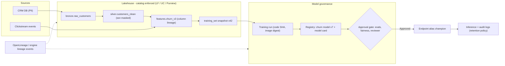
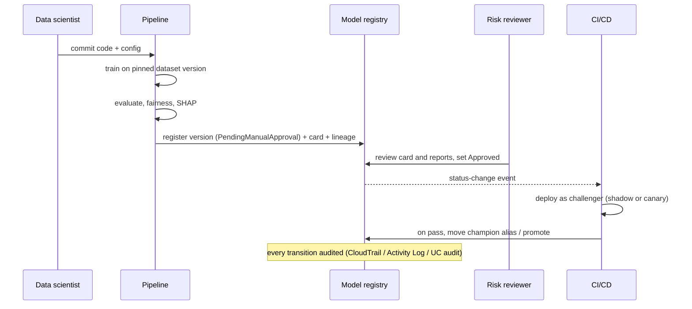

# L5 Model & data governance
> Last verified: 2026-10 · Audience: senior/staff DevOps, SRE, AI eng, NetEng, DevSecOps, architects

## TL;DR
- Governance = **who owns it, what it is, where it came from, who can touch it, and can you prove it to an auditor**. Engineering answer: a **central catalog** (Unity Catalog / Lake Formation + Glue + SageMaker Catalog / Purview Unified Catalog) that is the single **policy decision point**, fed by **automated lineage** and **audit logs**.
- Data side: **ownership + stewardship**, **data contracts** (schema + semantics + SLA enforced in CI), **quality SLAs** (freshness, completeness, validity) with alerting like any SLO.
- Lineage must be **column-level** and **automated** (OpenLineage events or engine-captured) — manual lineage rots. Its killer use cases: **impact analysis** before a schema change and **blast-radius** answers for "which models trained on the leaked/erased table?".
- Access: **tag-based / ABAC** (LF-Tags, UC governed tags + ABAC policies, Purview labels) scales as P+R instead of P×R grants; row filters + column masks enforce in the engine, not in the app.
- Model side: **registry** (immutable versions, approvals, aliases like `champion`), **model cards** (intended use, risk rating, eval results), lineage model→data/code/env, **champion/challenger** promotion gates, audit of every approval.
- Frameworks: **NIST AI RMF 1.0** (Govern/Map/Measure/Manage) + **GenAI Profile (NIST AI 600-1)**; **ISO/IEC 42001** = certifiable AI management system; **EU AI Act** = legal obligations (Annex IV tech docs, logging, human oversight) — map controls once, evidence many times.
- GenAI-era additions: **AI system inventory**, **shadow-AI discovery** (Purview DSPM for AI, Defender for Cloud Apps, egress/CASB), **approved-model lists enforced at the gateway / SCP / Azure Policy**, and **retention** of prompts, outputs and model artifacts that balances audit vs privacy.
- 2026 gotchas: **SageMaker Clarify is closed to new customers** (use SHAP/fairlearn + MLflow + Bedrock Evaluations); Databricks **stages are not supported for models in UC** (use aliases); **SageMaker Catalog is built on Amazon DataZone**.

## L5.1 Data governance foundations: ownership, stewardship, catalog, contracts, quality SLAs
- **How it works:**
  - **Roles:** *data owner* (accountable exec/domain lead; approves access, sets classification), *data steward* (curates metadata, glossary, quality rules), *data custodian/platform* (runs storage, backups, enforces controls), *consumer*. Map to RACI per **domain** (data-mesh style federated governance: central standards, domain ownership).
  - **Catalog layers:** *technical metadata* (schema, location, format — Glue Data Catalog, UC metastore, Purview Data Map) vs *business metadata* (glossary terms, descriptions, owners, data products — SageMaker Catalog, Purview Unified Catalog, UC tags/comments).
  - **SageMaker Catalog** (inside SageMaker Unified Studio; built on **Amazon DataZone**): assets are first **project inventory** (visible only to project members), curated with business names, glossary terms, **metadata forms**, then **published** to the discovery catalog; only the latest published version is discoverable — re-publish after edits. Consumers **subscribe**; approval fulfils grants automatically for Lake Formation-managed Glue tables and Redshift; other assets emit **EventBridge** events for custom fulfilment.
  - **Purview Unified Catalog**: **governance domains** (mini-catalogs per business area), **data products** (bundle of tables/files/Power BI reports with one access request), **critical data elements** (logical "Customer ID" mapping `CustID`, `CID` across tables, with quality rules + access policies), **glossary terms with attached policies**, **OKRs**, **health controls / health actions**, data quality scores at asset → product → domain level. Requires the enterprise version of the new Purview experience.
  - **Unity Catalog**: metastore → `catalog.schema.object` (tables, views, volumes, functions, models, services); managed vs external tables/volumes; built-in data classification, data quality monitoring (profiling + anomaly detection) and system-table audit.
  - **Data contracts:** versioned spec owned by the producer: schema (types, nullability), semantics (units, PII class), **SLAs** (freshness ≤ N min, completeness ≥ 99.x%, uniqueness of keys), change policy (additive only; breaking change → new major version + deprecation window). Enforced in **CI** (schema diff against consumers via lineage) and at **runtime** (expectations / DQ rules that quarantine or fail the pipeline).
  - **Quality SLAs as SLOs:** freshness, volume, schema drift, null-rate, distribution drift; alert on burn like [J1 SLOs](../J-sre/J1-slis-slos-error-budgets.md).
- **Trade-offs / when to use:**
  - Central catalog + federated ownership beats both "central data team owns everything" (bottleneck) and "every team its own catalog" (no global policy).
  - Contracts add producer friction; apply to **tier-1 datasets** (feeding revenue, regulators, models) first.
  - Business catalogs (SageMaker Catalog / Purview UC) give discovery + request workflows; enforcement still happens in LF / UC / storage RBAC.
- **Interview angles:**
  - "Who owns data quality?" → producer owns contract + SLA; platform owns the tooling; stewards own definitions; consumer-side checks are a backstop only.
  - "How do you stop a schema change breaking 40 dashboards and 3 models?" → contract + CI check that queries **column-level lineage** for downstream consumers, blocks breaking changes without a version bump.
  - Pitfall: catalog as a wiki — if metadata isn't harvested automatically (crawlers, scans, engine hooks) it's stale in weeks.

## L5.2 Lineage: column-level, OpenLineage, impact analysis
- **How it works:**
  - **Granularity:** dataset/table-level → **column-level** (which source columns feed `revenue_usd`) → job/run-level (which run produced partition X) → model-level (model version ← training tables ← sources).
  - **Capture methods:** (1) **engine-native** (query plans parsed by the platform — Unity Catalog, Purview scanners for ADF/Synapse/Power BI), (2) **emitted events** (**OpenLineage**), (3) **SQL parsing** of logs, (4) manual/API lineage (Purview Atlas API) — last resort.
  - **OpenLineage** (LF AI & Data open standard): **RunEvent** (runtime; `eventType` START/RUNNING/COMPLETE/FAIL/ABORT), **JobEvent** and **DatasetEvent** (design-time). Core entities **Job** (namespace + name), **Run** (UUID per execution), **Dataset** (namespace + name derived from physical location). Extensible **facets**: run (`nominalTime`, `parent`, `errorMessage`, `sql`), job (`sourceCodeLocation`, `sourceCode`), dataset (`schema`, `dataSource`, `version`, `dataQualityMetrics`, `outputStatistics`, `lifecycleStateChange`, `columnLineage`). Integrations: Spark, Airflow, dbt, Flink; reference backend **Marquez**. Amazon DataZone/SageMaker Catalog accepts OpenLineage-compatible events (`PostLineageEvent`) (unverified exact API name in SageMaker Catalog).
  - **Unity Catalog lineage:** automatic, down to **column level**, across notebooks, jobs, pipelines, dashboards, models; system tables `system.access.table_lineage` and `system.access.column_lineage` keep a **rolling 1-year window**; Catalog Explorer retains lineage **indefinitely for data captured after 2024-09-01**. Viewing requires at least **`BROWSE`** on the parent catalog. Limits: no column lineage when sources are referenced by **path** (`s3://…`) instead of table name; no column-level **UDF** lineage; not captured for RDDs, global temp views, renamed objects, `spark-submit` tasks; streaming lineage needs DBR ≥ 11.3 LTS, Lakeflow column lineage DBR ≥ 13.3 LTS. External systems (Salesforce, MySQL, Tableau, Power BI) can be registered as **external metadata** to appear in one graph.
  - **Model lineage:** UC models record training tables via `mlflow.log_input()`; SageMaker Model Registry shows lineage (ML Lineage Tracking entities: artifacts, actions, contexts) from data → training job → model package → endpoint.
  - **Purview Data Map lineage:** automatic from ADF/Synapse pipelines, Power BI, Azure SQL/Data Share and others; Azure Databricks via the Unity Catalog connector; custom lineage via Apache Atlas REST API (unverified: per-source column-level coverage varies — check each connector).
- **Trade-offs / when to use:**
  - Engine-native lineage is accurate but platform-bounded; OpenLineage gives cross-tool lineage but only as good as the integrations emitting it.
  - Path-based access (`spark.read.parquet("s3://…")`) silently breaks lineage *and* governance — a reason to force table-name access via the catalog.
- **Interview angles:**
  - "A GDPR erasure request lands — which models must be retrained?" → walk lineage: source table → feature tables → training datasets (logged inputs) → model versions → endpoints; this is why model registries must store **dataset version/snapshot IDs** (Delta/Iceberg version, S3 object versions).
  - "Table vs column lineage?" → table lineage answers *what breaks*; column lineage answers *does PII propagate* and *is this change actually breaking* (a dropped column nobody reads is safe).
  - Pitfall: lineage system tables retained 1 year — export to your own long-term store if regulators want 7–10 years.

## L5.3 Access governance: central catalog perms, row/column security, ABAC
- Full classification/ABAC tagging theory lives in [L1.8](L1-data-classification-pii.md#l18-tagslabels-driving-access-policies-abac); here the **enforcement plane**.
- **How it works:**
  - **Lake Formation:** permissions (`SELECT`, `INSERT`, `DELETE`, `DESCRIBE`, `ALTER`, `DROP`, `CREATE_TABLE`, `DATA_LOCATION_ACCESS`, …) on Glue Data Catalog resources; **LF-TBAC** with **LF-Tags** (key=value; tables inherit from databases, columns from tables, overrides allowed). Grants scale **n(P)+n(R)** vs **n(P)×n(R)** for named-resource grants. LF-Tags ≠ IAM tags. Supports federated catalogs (S3 Tables, Redshift, DynamoDB, Snowflake, SQL Server).
  - **LF data filters** = row-level (PartiQL `filter_expression`), column-level (include/exclude), **cell-level** (both). Enforced by integrated engines (Athena, Redshift Spectrum, EMR, Glue).
  - **Gotcha:** by default LF grants `Super` to **`IAMAllowedPrincipals`** on existing resources ("Use only IAM access control") — LF permissions aren't actually in effect until you remove that and register S3 locations (or use **hybrid access mode** for staged migration).
  - **Cross-account:** LF shares via AWS RAM; consumer creates resource links.
  - **Unity Catalog:** privileges (`USE CATALOG`, `USE SCHEMA`, `SELECT`, `MODIFY`, `EXECUTE`, `APPLY TAG`, `MANAGE`, `BROWSE`) inherit downward (grant at catalog → applies to current + future children). **ABAC** = **governed tags** + **policies** (row filter, column mask, GRANT policies; DENY policies in Beta) attached at catalog/schema/table (metastore-level in Beta), evaluated at query time — one policy covers every table tagged `pii=ssn`.
  - **Azure:** Purview Unified Catalog access policies (self-service requests on data products), Purview DevOps/data-owner policies (unverified current scope), storage RBAC + ABAC conditions on blob, Fabric/OneLake security roles, Synapse/SQL RLS + dynamic data masking; Databricks on Azure → UC.
- **Trade-offs / when to use:**
  - Tag-based for scale; named grants only for exceptions. Masks/filters in the engine beat views-per-audience (view sprawl).
  - Engine coverage is the limit: a principal with raw `s3:GetObject` bypasses LF — lock storage to the LF/UC service role.
- **Interview angles:**
  - "Analysts see all columns except SSN, only their region" → LF data cells filter (exclude `ssn`, row filter `region='EU'`) or UC column mask + row filter via ABAC policy on tag.
  - "How do you prevent bypass?" → no direct bucket access; only catalog-vended credentials (LF credential vending, UC external locations).

## L5.4 Model governance: registry, cards, approvals, versioning, reproducibility, audit, champion/challenger
- **How it works:**
  - **SageMaker Model Registry:** **Model (Package) Groups** contain immutable **model versions**; groups organized into **Collections**. `ModelApprovalStatus` = `PendingManualApproval` (typical at registration) → `Approved` / `Rejected`; with SageMaker project templates, `→Approved` triggers CI/CD deploy and `Approved→Rejected` redeploys the **latest Approved** version (rollback). Status changes emit EventBridge events; also a **lifecycle staging construct** (custom stages, e.g. dev/test/prod). Shows lineage and **Model Card** info per version; cross-account sharing via resource policies / RAM.
  - **SageMaker Model Cards:** intended uses (and not-intended), **risk rating** `High|Medium|Low|Unknown`, business details, training details (job ARN, datasets, image, metrics, hyperparameters), evaluation details (auto-parse Clarify/Model Monitor JSON from S3), ethical considerations, caveats. **Every edit except approval-status creates a new immutable card version**; export to PDF; cross-account sharing; Model Dashboard aggregates cards + monitors.
  - **Unity Catalog models (MLflow):** `catalog.schema.model`; **aliases** (mutable pointer, e.g. `@champion`, `@challenger`) — **stages are not supported** in UC; **signature mandatory**; privileges `CREATE MODEL`, `EXECUTE` (load/infer), `APPLY TAG`; MLflow 3 defaults to `databricks-uc` registry URI; cross-workspace same-region via metastore, cross-region via Databricks-to-Databricks sharing.
  - **Azure ML registries:** decouple **models, environments, components, data assets** from workspaces; promote dev→test→prod across subscriptions/regions; deploy from registry to endpoints in any workspace; assets versioned (version immutable).
  - **Reproducibility tuple:** code commit SHA + container image digest + environment lock + **data snapshot version** + hyperparameters + random seeds + hardware type. Store all in the registry entry; missing data version is the #1 reason "we can't reproduce the 2024 model".
  - **Champion/challenger:** challenger evaluated offline on frozen holdout + online via **shadow** or **canary/A-B** (see [J6](../J-sre/J6-toil-release-engineering.md)); promotion = alias flip / approval status change, gated by eval thresholds, fairness checks, and human sign-off for high-risk models. Rollback = flip alias back.
  - **Audit:** registry API calls → CloudTrail / Azure Activity Log / UC `system.access.audit`; record approver identity, timestamp, evidence links.
- **Trade-offs / when to use:**
  - Approval status (binary gate) vs aliases (flexible pointers) — aliases are better for multi-env and A/B; pair with policy (only CI role can move `@champion`).
  - Registry per account/workspace vs central registry: central gives one audit trail; per-env gives isolation — common pattern: central registry, per-env deploy accounts pulling by ARN.
- **Interview angles:**
  - "Design model promotion with segregation of duties" → data scientist registers (`PendingManualApproval`); automated eval step attaches metrics + card; risk reviewer (different IAM role) approves; EventBridge → pipeline deploys; endpoint only pulls `Approved`; all logged.
  - Pitfall: storing only the model artifact — without card + lineage + data version it's not governable or reproducible.

## L5.5 AI governance frameworks: NIST AI RMF + GenAI profile, ISO/IEC 42001, EU AI Act documentation
- Legal/residency side detailed in [L3](L3-residency-compliance.md); here what engineering must produce.
- **How it works:**
  - **NIST AI RMF 1.0 (NIST AI 100-1, 26 Jan 2023):** voluntary; four functions **GOVERN** (policies, roles, accountability — cross-cutting), **MAP** (context, intended use, risk identification), **MEASURE** (metrics, testing, TEVV), **MANAGE** (prioritize, treat, monitor, respond). Trustworthiness characteristics: valid & reliable, safe, secure & resilient, accountable & transparent, explainable & interpretable, privacy-enhanced, fair with harmful bias managed. Companion **Playbook**. As of 2026 NIST states AI RMF is **being revised** under the White House AI Action Plan; a Critical Infrastructure profile concept note was announced Apr 2026.
  - **NIST AI 600-1 Generative AI Profile (26 Jul 2024):** 12 GAI risks — CBRN information, confabulation, dangerous/violent/hateful content, data privacy, environmental impacts, harmful bias/homogenization, human-AI configuration, information integrity, information security, intellectual property, obscene/abusive content, value chain & component integration — with suggested actions mapped to RMF subcategories.
  - **ISO/IEC 42001:2023:** **AI management system (AIMS)**, Plan-Do-Check-Act, **certifiable** (like ISO 27001 for AI); Annex A controls (AI policy, roles, resources, impact assessment, lifecycle, data, information for interested parties, use, third-party relationships). Siblings: ISO/IEC 23894 (AI risk management guidance), 42005 (AI system impact assessment), 42006 (requirements for certification bodies).
  - **EU AI Act (Reg. 2024/1689):** high-risk providers need **Art. 10 data governance** (training/validation/test data relevance, representativeness, bias examination), **Art. 11 + Annex IV technical documentation**, **Art. 12 automatic logging** (record-keeping), **Art. 13 transparency/instructions**, **Art. 14 human oversight**, **Art. 15 accuracy/robustness/cybersecurity**, **Art. 17 QMS**; providers keep auto-generated logs **≥ 6 months** (Art. 19) and docs **10 years** (Art. 18); deployers keep logs ≥ 6 months (Art. 26). **GPAI providers** (from 2 Aug 2025): technical documentation, downstream info, **copyright policy**, and a **public summary of training content** (Commission template). High-risk obligations' application dates were subject to the 2025 "Digital Omnibus" postponement proposal — check current status (unverified as of 2026-10).
- **Trade-offs / when to use:**
  - NIST = vocabulary + risk process (US, voluntary); ISO 42001 = auditable management system (procurement/customer trust); EU AI Act = law with fines. Build one **control library** mapped to all three.
- **Interview angles:**
  - "What artifacts satisfy Annex IV?" → model card + dataset datasheets + lineage export + eval/fairness reports + risk assessment + human-oversight design + logging spec + change log from the registry — generate them from the pipeline, don't hand-write.
  - Pitfall: treating frameworks as a policy-doc exercise; auditors ask for **evidence** (logs, approvals, versions).

## L5.6 Responsible AI: fairness, explainability, human oversight
- **How it works:**
  - **Fairness:** pre-training data bias (class imbalance **CI**, difference in proportions of labels **DPL**) and post-training model bias (**DPPL**, **disparate impact DI**, equal opportunity/odds, accuracy difference). Pick metrics with legal/product input — they conflict (calibration vs equalized odds impossibility).
  - **Explainability:** global (feature importance) vs local (per-prediction **SHAP**, LIME), partial dependence plots, **counterfactuals** ("+$10k income → approved", DiCE). Adverse-action notices in lending need local reasons.
  - **SageMaker Clarify:** bias metrics, SHAP (kernel SHAP), PDPs, online explainability, bias/feature-attribution drift via Model Monitor, FMEval. **As of 2026 Clarify is no longer open to new customers** (no new features). AWS guidance: compute standardized bias metrics with pandas/scikit-learn, **SHAP** directly, log to **SageMaker AI MLflow**, monitor via aws-samples monitoring solutions; **fmeval** library or **Bedrock Evaluations** for LLMs; **Bedrock Guardrails** for runtime safety. (AWS migration guidance also references a Model Monitor migration path — verify status.)
  - **Azure ML Responsible AI dashboard:** error analysis, fairness (**Fairlearn**), interpretability (**InterpretML**), counterfactual what-if (**DiCE**), causal analysis (**EconML**), data analysis; PDF **RAI scorecard** for sign-off. Limits: tabular regression/classification only, MLflow **sklearn** models with `predict`/`predict_proba`, UI shows ≤ **5,000** rows, ≤ 10k columns, Parquet inputs, no AutoML MLflow models.
  - **GenAI equivalents:** Azure AI Foundry evaluations + content safety, Bedrock Evaluations/Guardrails, Databricks agent evaluation — see [K9](../K-ai-infra-llm/K9-llmops-evals-guardrails.md).
  - **Human oversight patterns:** human-in-the-loop (approve each decision), human-on-the-loop (monitor + override), confidence thresholds routing to review, kill switch / fallback to rules, reviewer UI showing explanation + model version; log overrides as labels.
- **Trade-offs / when to use:**
  - Fairness checks need sensitive attributes you may be minimizing (L1) — hold them in a restricted table used only for evaluation.
  - Explanations of black-box models are approximations; for high-risk decisions consider inherently interpretable models (EBMs, scorecards).
- **Interview angles:**
  - "Clarify is closed to new customers — what do you build on AWS?" → SHAP + fairlearn/sklearn metrics in a SageMaker Pipelines ProcessingStep, results logged to MLflow and attached to model card; Bedrock Evaluations for LLMs.
  - "Where does fairness gate?" → pre-training data check, pre-promotion eval gate in registry, post-deploy bias-drift monitor.

## L5.7 Dataset documentation, provenance, training-data licensing & consent
- **How it works:**
  - **Datasheets for Datasets / data cards:** motivation, composition, collection process, preprocessing, uses (and prohibited uses), distribution, maintenance; plus **license**, **consent basis** (GDPR lawful basis, purpose), PII classes, known biases, retention/expiry.
  - **Provenance:** immutable snapshots (Delta/Iceberg version or S3 Object Lock + versioning), content hashes/manifests, signed artifacts; **C2PA** content credentials for generated media; **SLSA/in-toto attestations** for training pipelines (see [L6](L6-secrets-supply-chain.md)).
  - **Licensing:** track per-source license (CC-BY needs attribution; CC-BY-NC bars commercial use; GPL code in training corpora debates; scraped web data + robots/TDM opt-outs — EU **text-and-data-mining opt-out** under DSM Directive Art. 4 is referenced by the AI Act GPAI copyright obligation). Model licenses (Llama community license, Apache-2.0, OpenRAIL) restrict use and derivatives.
  - **Consent & purpose limitation:** data collected for service delivery ≠ consent for model training; tag datasets with `allowed_purposes` and enforce via ABAC (training jobs' role can only read `purpose=training_ok`). Customer-data training opt-outs must propagate to feature/training tables.
  - **Erasure vs trained models:** deleting rows doesn't remove memorized info — options: retrain on schedule excluding erased subjects, machine unlearning (research-grade), or avoid raw PII in training (de-identify, [L1.5](L1-data-classification-pii.md#l15-pii-in-ai-pipelines)).
- **Trade-offs / when to use:**
  - Full provenance per row is expensive; do it per **dataset version** with manifests, plus per-source license metadata.
- **Interview angles:**
  - "Legal asks if model v7 trained on vendor X data whose contract ended" → registry entry → logged input dataset versions → lineage to source → source license metadata. Without it you retrain everything.
  - Pitfall: fine-tuning on support tickets without checking the privacy notice / DPA allows it.

## L5.8 AI system inventory & shadow-AI discovery
- **How it works:**
  - **Inventory record:** system name, owner, purpose, risk tier (EU AI Act category, internal tier), models used (vendor, version, hosting region), data categories processed, users/affected persons, human-oversight design, evaluation status, DPIA/AI impact assessment link, decommission date. Prerequisite for ISO 42001 and EU AI Act obligations.
  - **Sources to populate it:** model registries (SageMaker, Azure ML/Foundry, UC), cloud resource inventories (AWS Config/Resource Explorer for Bedrock/SageMaker resources; Azure Resource Graph for Foundry/OpenAI accounts), AI gateway logs (which apps call which models), IdP app registrations (Entra-registered AI apps), procurement/SaaS records.
  - **Shadow AI discovery:**
    - **Purview DSPM / DSPM for AI (classic)**: front door for AI usage — categories *Copilot experiences & agents*, *Enterprise AI apps* (Foundry, Entra-registered apps, ChatGPT Enterprise, **Anthropic Claude (Enterprise)**), *Other AI apps* detected via browser activity (categorized "Generative AI" in **Defender for Cloud Apps**, e.g. ChatGPT consumer, Gemini, DeepSeek). Endpoint DLP can **warn/block pasting sensitive info** into third-party AI sites; Insider Risk "Risky AI usage" template; prompts/responses land in the unified audit log and are eDiscovery-searchable.
    - **Microsoft Defender for Cloud** AI security posture management (AI-SPM) discovers AI workloads/SBOM across Azure/AWS (unverified current naming).
    - **AWS side:** Security Hub/GuardDuty don't inventory SaaS AI; use egress proxy/CASB/SWG logs (e.g. Cloudflare Gateway / Zscaler) + CloudTrail for Bedrock/SageMaker calls + SCPs to block unsanctioned regions/models.
    - Code scanning for SDK imports/API keys (openai, anthropic) in repos; secret scanning for leaked provider keys.
- **Trade-offs / when to use:**
  - Block-all drives users to personal devices; better: **sanctioned alternative** (enterprise tenant with no-training terms) + DLP on uploads + discovery for the rest.
- **Interview angles:**
  - "How do you find all LLM usage in a 5,000-person company?" → network (SWG/CASB category), identity (OAuth app consents), cloud (Config/Resource Graph for AI resources), code (dependency/secret scans), spend (card/expense data); feed one inventory with owners.

## L5.9 Governing third-party model usage: approved model lists, gateway enforcement
- Gateway mechanics in [K7.1](../K-ai-infra-llm/K7-ai-gateways-caching-cost.md#k71-ai-gateway-pattern); provider contract terms in [K6.8](../K-ai-infra-llm/K6-managed-model-platforms.md#k68-residency-privacy-and-contract-terms).
- **How it works:**
  - **Approved model list** = model ID + version + provider + allowed regions + allowed data classifications + allowed use cases + review/expiry date; owned by AI governance board; stored as code (policy repo).
  - **Enforcement layers (defense in depth):**
    - **Gateway**: single egress for LLM calls (LiteLLM, Kong/Apigee AI, Azure API Management AI gateway, Databricks **AI Gateway** — now with UC-governed *model services* that take `EXECUTE` grants); allow-list model names, inject guardrails, log prompts/metadata, attribute cost per team.
    - **Cloud control plane**: AWS **SCP / IAM** deny `bedrock:InvokeModel*` unless `Resource` ARN in approved foundation-model/inference-profile list; Bedrock model access per account; **Azure Policy** to restrict Foundry/Azure OpenAI model deployments to approved models/versions (built-in policy names change — unverified).
    - **Network**: egress firewall/SWG blocks direct calls to provider APIs except from the gateway; PrivateLink/Private Endpoints for sanctioned providers.
    - **Secrets**: provider API keys held only by the gateway; apps get gateway tokens (workload identity, [L7](L7-zero-trust-workload-identity.md)).
  - **Vendor review:** DPA, zero-data-retention / no-training terms, residency, sub-processors, SOC 2 / ISO 42001 / ISO 27001, model card/system card, incident notification; re-review on new model version.
  - **Model version pinning:** pin dated versions; providers retire models — track deprecation calendars and test challengers before forced migration.
- **Trade-offs / when to use:**
  - Gateway is a SPOF/latency hop — run it HA, regional; but without it you cannot prove what data went to which vendor.
- **Interview angles:**
  - "A team wants to use a brand-new model next week" → fast-track: sandbox tier allowed for public/internal data only via gateway; promotion to confidential data requires review — tiered approval, not a blanket no.
  - Pitfall: allow-listing at the gateway while devs still hold raw provider keys — enforce network + key custody too.

## L5.10 Retention of model artifacts & logs
- **How it works:**
  - **What to retain:** model artifacts + container digests, training/eval dataset **versions** (or manifests + hashes if data itself expires), model cards (versioned), approval records, eval/fairness reports, inference logs (inputs/outputs or hashes, model version, timestamp, decision, human override), lineage exports.
  - **Drivers:** EU AI Act (high-risk logs ≥ 6 months, technical docs 10 years after market placement), sector rules (e.g. SR 11-7 model risk management in US banking expects model inventory + validation documentation — unverified retention periods), litigation holds, vs **GDPR storage limitation** (prompts may contain personal data).
  - **Mechanics:** S3 Object Lock (Compliance/Governance mode) + lifecycle to Glacier; Azure Blob immutable storage (time-based retention / legal hold) + lifecycle tiers; Delta `VACUUM`/log retention settings mean old table versions vanish — snapshot or `DEEP CLONE` training data you must keep; UC system tables (audit/lineage) have their own retention — export to your bucket. Purview **retention policies** cover Copilot/AI app prompts & responses (stored in user mailbox; longest retention wins on conflict).
  - **Prompt/output logs:** separate **operational logs** (short, redacted, 30–90 days) from **audit records** (minimal fields, long, immutable); pseudonymize user IDs; encrypt with per-tenant keys to enable **crypto-shredding** ([L2.8](L2-encryption-key-management.md#l28-crypto-shredding-for-erasure)).
- **Trade-offs / when to use:**
  - Keeping raw training data for reproducibility conflicts with erasure; compromise: keep manifests + hashes + de-identified snapshots, re-derive when needed.
- **Interview angles:**
  - "How long do you keep LLM prompts?" → depends on classification and law: operational 30 days redacted, audit metadata per regulation, never longer than the purpose; legal hold overrides deletion.
  - Pitfall: Delta time travel ≠ archive — `VACUUM` defaults (7-day retention) delete files that old model versions trained on.

## Diagrams

Lineage from source to endpoint (what the governance graph must connect):


Model promotion with segregation of duties:


## Cloud mapping: AWS vs Azure
| Capability | AWS | Azure | Role it plays | Key differences | Alternatives |
|---|---|---|---|---|---|
| Technical metastore | **Glue Data Catalog** | Purview **Data Map** (scanned metadata) / OneLake catalog | Schemas, locations, partitions | Glue is the *runtime* metastore engines query; Data Map is a scanned *inventory*, not a query metastore | Unity Catalog, Hive Metastore, Iceberg REST catalogs (Polaris) |
| Fine-grained data access | **Lake Formation** (LF-Tags, data cells filters) | Storage RBAC/ABAC + SQL/Fabric RLS & masking; Purview access policies (request workflow) | Enforce table/column/row/cell access | LF is one engine-integrated policy plane; Azure enforcement is per engine | **Unity Catalog** ABAC (cross-cloud), Immuta, Privacera |
| Business catalog / data products | **SageMaker Catalog** (in Unified Studio, built on **DataZone**) | **Purview Unified Catalog** | Glossary, data products, subscriptions, DQ | SageMaker Catalog auto-fulfils grants via LF/Redshift; Purview adds CDEs, OKRs, health controls | Collibra, Alation, Atlan, DataHub, UC |
| Lineage | SageMaker Catalog / DataZone lineage (OpenLineage-compatible), SageMaker ML Lineage Tracking | Purview Data Map lineage (ADF, Synapse, Power BI, Databricks UC connector) | Impact analysis, provenance | Both accept custom events (OpenLineage vs Atlas API) | Unity Catalog lineage, Marquez, DataHub |
| Model registry | **SageMaker Model Registry** (groups, versions, approval status, collections) | **Azure ML registries** (cross-workspace models/envs/components/data) + workspace model registry | Versioned, approved model artifacts | SageMaker = approval-status gate + EventBridge; Azure ML registry = cross-subscription/region sharing | UC models (aliases), MLflow OSS, W&B |
| Model documentation | **SageMaker Model Cards** (immutable versions, risk rating, PDF) | Azure ML RAI **scorecard** (PDF) + model metadata/tags | Governance evidence | AWS card schema is first-class; Azure scorecard is generated from RAI dashboard | UC model descriptions/tags, Hugging Face model cards |
| Fairness / explainability | **SageMaker Clarify** (closed to new customers) → SHAP + MLflow, Bedrock Evaluations for LLMs | **Responsible AI dashboard** (Fairlearn, InterpretML, DiCE, EconML) | Bias + explanations | Azure RAI limited to tabular sklearn MLflow models | Fairlearn, SHAP, Databricks Lakehouse Monitoring |
| AI data security / shadow AI | Egress SWG/CASB + CloudTrail + SCPs (no native SaaS-AI discovery) | **Purview DSPM (for AI)** + Defender for Cloud Apps + Endpoint DLP | Discover/limit AI usage, audit prompts | Azure has a native M365-integrated story; AWS relies on partners | Cloudflare Gateway/CASB, Zscaler, Netskope |
| Model allow-listing | SCP/IAM on Bedrock model ARNs, Bedrock model access | Azure Policy on Foundry deployments, APIM AI gateway | Approved-model enforcement | Both best paired with a gateway | Databricks AI Gateway, LiteLLM, Kong |
| Immutable retention | S3 Object Lock, Glacier | Blob immutable storage, Purview retention | Audit/doc retention | Both support WORM compliance modes | Delta deep clone snapshots |

- **Unity Catalog cross-cloud:** one governance model (privileges, ABAC, lineage, models, audit system tables) on AWS, Azure and GCP; it is the canonical answer when the estate is Databricks-centric. On Azure, Purview can scan UC for estate-wide inventory; on AWS, UC and Glue can federate (catalog federation) — pick **one** enforcement plane per dataset to avoid dual policy drift.
- **AWS naming:** "SageMaker" now = SageMaker Unified Studio umbrella (data + AI); classic ML service = **SageMaker AI**; **SageMaker Catalog** sits on DataZone domains — DataZone console/API still exist.
- **Azure naming:** Purview "classic Data Catalog" experience → **Unified Catalog** (requires the enterprise version of the new Purview experience); Azure AI Studio → Azure AI Foundry → **Microsoft Foundry**.
- **Key gotchas:** Lake Formation's `IAMAllowedPrincipals` default; Glue Catalog is regional (cross-region requires replication/resource links); Azure RAI dashboard row/feature limits; Clarify closure.

## Hands-on (optional)

Lake Formation: tag-based grant + PII-excluding cell filter (Terraform)
```hcl
resource "aws_lakeformation_lf_tag" "classification" {
  key    = "classification"
  values = ["public", "internal", "confidential"]
}

resource "aws_lakeformation_resource_lf_tags" "customers_db" {
  database {
    name = aws_glue_catalog_database.customers.name
  }
  lf_tag {
    key   = aws_lakeformation_lf_tag.classification.key
    value = "confidential"
  }
}

# Analysts: SELECT on every table tagged internal (scales as P+R)
resource "aws_lakeformation_permissions" "analysts_internal" {
  principal   = aws_iam_role.analysts.arn
  permissions = ["SELECT", "DESCRIBE"]
  lf_tag_policy {
    resource_type = "TABLE"
    expression {
      key    = "classification"
      values = ["internal"]
    }
  }
}

# Cell-level: EU rows only, SSN/card columns excluded
resource "aws_lakeformation_data_cells_filter" "eu_no_pii" {
  table_data {
    database_name    = aws_glue_catalog_database.customers.name
    name             = "eu-no-pii"
    table_catalog_id = data.aws_caller_identity.current.account_id
    table_name       = "customers"
    column_wildcard {
      excluded_column_names = ["ssn", "credit_card"]
    }
    row_filter {
      filter_expression = "region = 'EU'"
    }
  }
}

resource "aws_lakeformation_permissions" "ml_training_eu" {
  principal   = aws_iam_role.sagemaker_training.arn
  permissions = ["SELECT"]
  data_cells_filter {
    database_name    = aws_glue_catalog_database.customers.name
    name             = aws_lakeformation_data_cells_filter.eu_no_pii.table_data[0].name
    table_catalog_id = data.aws_caller_identity.current.account_id
    table_name       = "customers"
  }
}
```

Unity Catalog: registered model with least-privilege grants (Terraform)
```hcl
resource "databricks_registered_model" "churn" {
  name         = "churn_classifier"
  catalog_name = "prod"
  schema_name  = "ml"
}

resource "databricks_grants" "churn_model" {
  model = databricks_registered_model.churn.id   # prod.ml.churn_classifier
  grant {
    principal  = "ml-serving-sp"        # can load for inference only
    privileges = ["EXECUTE"]
  }
  grant {
    principal  = "ml-platform-admins"   # can tag + manage
    privileges = ["APPLY_TAG", "MANAGE"]
  }
}

resource "databricks_grants" "features_schema" {
  schema = "prod.features"
  grant {
    principal  = "ml-training-sp"
    privileges = ["USE_SCHEMA", "SELECT"]
  }
}
```

SageMaker: approve a model version from CLI (approver role, audited in CloudTrail)
```bash
aws sagemaker list-model-packages --model-package-group-name churn \
  --model-approval-status PendingManualApproval --sort-by CreationTime --sort-order Descending
aws sagemaker update-model-package \
  --model-package-arn arn:aws:sagemaker:eu-west-1:111122223333:model-package/churn/7 \
  --model-approval-status Approved \
  --approval-description "Evals+fairness OK, ticket RISK-123"
```

## Cross-links
- [L1 Data classification & PII](L1-data-classification-pii.md) — classification, ABAC tags ([L1.8](L1-data-classification-pii.md#l18-tagslabels-driving-access-policies-abac)), PII in AI pipelines
- [L2 Encryption & key management](L2-encryption-key-management.md) — crypto-shredding for log/artifact erasure
- [L3 Residency & compliance](L3-residency-compliance.md) — EU AI Act / GDPR legal detail
- [L4 AI security threats](L4-ai-security-threats.md) — data poisoning, model theft, supply chain of models
- [L6 Secrets & supply chain](L6-secrets-supply-chain.md) — signing/attesting models and datasets
- [L7 Zero trust & workload identity](L7-zero-trust-workload-identity.md) — identities for training/serving roles
- [K5 Training & fine-tuning](../K-ai-infra-llm/K5-training-fine-tuning.md), [K6 Managed model platforms](../K-ai-infra-llm/K6-managed-model-platforms.md), [K7 AI gateways](../K-ai-infra-llm/K7-ai-gateways-caching-cost.md#k71-ai-gateway-pattern), [K9 LLMOps, evals, guardrails](../K-ai-infra-llm/K9-llmops-evals-guardrails.md)
- [M1 Lakehouse table formats](../M-data-platforms/M1-lakehouse-table-formats.md) (time travel/snapshots), [M3 Databricks platform](../M-data-platforms/M3-databricks-platform.md) (Unity Catalog), [M6 Orchestration & ETL](../M-data-platforms/M6-orchestration-etl.md) (OpenLineage emitters)
- [J1 SLIs/SLOs](../J-sre/J1-slis-slos-error-budgets.md) (data quality SLAs), [J6 Release engineering](../J-sre/J6-toil-release-engineering.md) (canary/shadow for challengers)

## Sources
- https://docs.aws.amazon.com/sagemaker-unified-studio/latest/userguide/working-with-business-catalog.html
- https://docs.aws.amazon.com/datazone/latest/userguide/what-is-datazone.html
- https://docs.aws.amazon.com/lake-formation/latest/dg/tag-based-access-control.html
- https://docs.aws.amazon.com/lake-formation/latest/dg/data-filters-about.html
- https://docs.aws.amazon.com/sagemaker/latest/dg/model-registry.html
- https://docs.aws.amazon.com/sagemaker/latest/dg/model-registry-approve.html
- https://docs.aws.amazon.com/sagemaker/latest/dg/model-cards.html
- https://docs.aws.amazon.com/sagemaker/latest/dg/clarify-configure-processing-jobs.html
- https://docs.aws.amazon.com/sagemaker/latest/dg/clarify-availability-change.html
- https://docs.databricks.com/aws/en/data-governance/unity-catalog/
- https://docs.databricks.com/aws/en/data-governance/unity-catalog/data-lineage
- https://docs.databricks.com/aws/en/data-governance/unity-catalog/abac/
- https://docs.databricks.com/aws/en/machine-learning/manage-model-lifecycle/
- https://openlineage.io/docs/spec/object-model
- https://learn.microsoft.com/en-us/purview/unified-catalog
- https://learn.microsoft.com/en-us/purview/ai-microsoft-purview
- https://learn.microsoft.com/en-us/azure/machine-learning/concept-machine-learning-registries-mlops
- https://learn.microsoft.com/en-us/azure/machine-learning/concept-responsible-ai-dashboard
- https://www.nist.gov/itl/ai-risk-management-framework
- https://github.com/hashicorp/terraform-provider-aws/tree/main/website/docs/r (lakeformation_permissions, lakeformation_lf_tag, lakeformation_resource_lf_tags, lakeformation_data_cells_filter)
- https://github.com/databricks/terraform-provider-databricks/blob/main/docs/resources/grants.md
