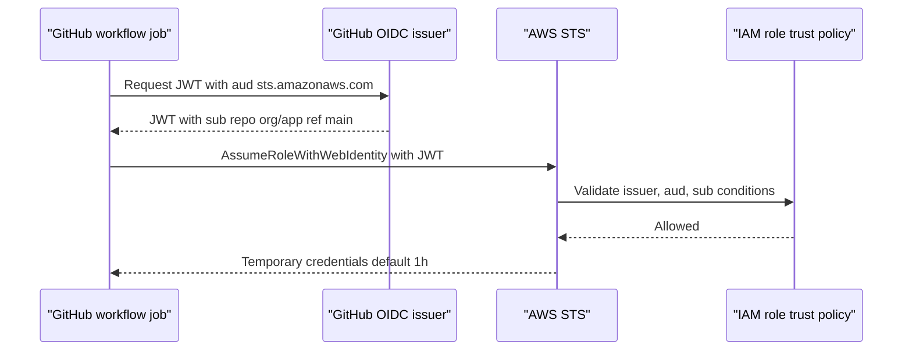

# L6 Secrets management & software supply chain security
> Last verified: 2026-10 · Audience: senior/staff DevOps, SRE, AI eng, NetEng, DevSecOps, architects

## TL;DR
- **Best secret = no secret.** Prefer workload identity (IAM roles, managed identity, OIDC federation) over stored credentials; where a secret is unavoidable, make it **dynamic, short-lived, scoped, audited, and auto-rotated**.
- Know the store trade-offs: **Secrets Manager** (rotation, cross-region replication, 64 KB, per-secret price) vs **Parameter Store** (config + SecureString, 4 KB/8 KB, free standard tier) vs **Key Vault** (secrets+keys+certs, 25 KB, no native secret auto-rotation, 10-second throttling windows) vs **Vault/OpenBao** (dynamic secrets, leases, multi-cloud).
- In Kubernetes: **External Secrets Operator** (sync to K8s Secret) vs **Secrets Store CSI Driver** (mount as files, optional sync) vs **SOPS / Sealed Secrets** (encrypted-in-Git for GitOps). Etcd encryption + RBAC still matter.
- CI/CD: **GitHub Actions OIDC → AWS `AssumeRoleWithWebIdentity` / Entra federated credential**; the security lives in the **`sub`/`aud` claim conditions**. No long-lived cloud keys in CI.
- Supply chain = **SLSA (v1.2: Build L0–L3 + Source L1–L4)** + **provenance (in-toto attestations)** + **SBOM (SPDX/CycloneDX)** + **VEX** + **signing (cosign keyless / Notation)** + **admission verification (Kyverno, Gatekeeper+Ratify, Azure Policy, ECR managed signing)**.
- Dependency attacks: typosquatting, dependency confusion, maintainer takeover / social engineering (**xz-utils CVE-2024-3094**), compromised CI actions (**tj-actions/changed-files, 2025**), npm worms (**Shai-Hulud, 2025**). Mitigate with pinned digests/SHAs, private proxies with upstream controls, scoped namespaces, minimal images.
- Scanning: **Trivy/Grype** in CI, **Inspector** (ECR enhanced, continuous rescan) / **Defender for Containers** (MDVM, agentless, gated deployment) in registry/runtime; **Checkov/Trivy config** for IaC. Patch cadence is an SLO, not a vibe.
- Leak response: **revoke/rotate first**, then purge history, then investigate usage via CloudTrail/Entra sign-in logs. Rewriting Git history does not un-leak a secret.

## L6.1 Secrets management principles: dynamic secrets, rotation, short-lived tokens
- **How it works:**
  - **Hierarchy of preference:** (1) no secret — platform identity (EC2/ECS/EKS roles, Azure managed identity, EKS Pod Identity / AKS Workload Identity); (2) federated short-lived token (OIDC, IAM Roles Anywhere, SPIFFE); (3) **dynamic secret** generated per consumer with a lease (Vault DB engine creates a DB user with TTL); (4) static secret in a vault with automated rotation; (5) static secret, manual rotation (avoid).
  - **Dynamic secrets:** unique credential per client + **lease/TTL** + revocation by lease ID → blast radius per-client, attributable audit, automatic expiry. Cost: backend load (creating users), DB connection-pool churn, dependency on the secret broker's availability.
  - **Rotation patterns:** **single-user** (change password in place — brief window where cached old creds fail) vs **alternating users** (two users, flip between them; zero downtime, needs a superuser to rotate the clone). AWS Secrets Manager models this with staging labels **`AWSCURRENT` / `AWSPENDING` / `AWSPREVIOUS`** and Lambda steps **`create_secret` → `set_secret` → `test_secret` → `finish_secret`**.
  - **Short-lived tokens:** STS sessions (15 min–12 h, default 1 h), Entra access tokens (~60–90 min), GitHub OIDC JWTs (minutes), Fulcio signing certs (10 min). Short TTL is a substitute for revocation, which is hard for bearer tokens.
  - **Secret zero problem:** something must bootstrap auth to the vault → solve with platform identity (Vault AWS/Azure/Kubernetes auth methods, K8s projected SA tokens), never a token baked into an image.
- **Trade-offs / when to use:**
  - Dynamic secrets are best for DBs, cloud creds, PKI certs; static+rotation is fine for third-party API keys that the provider can't mint on demand.
  - Caching secrets in-process reduces cost/latency (AWS caching clients, Key Vault throttling) but lengthens exposure after rotation → cache TTL < rotation overlap window.
  - Env vars are convenient but leak via `/proc/<pid>/environ`, crash dumps, child processes, debug endpoints; files on tmpfs (CSI) are safer and support hot reload.
- **Interview angles:**
  - "How do you rotate a DB password with zero downtime?" → alternating-users strategy or dual-credential overlap; app re-reads secret on auth failure; rotation tested in staging; monitor `test_secret` failures.
  - "Why not just encrypt the secret in the repo?" → key management moves, not disappears; no audit of reads; no per-consumer revocation. OK for GitOps only with KMS-backed SOPS (L6.4).
  - Pitfall: rotating a secret without restarting/reloading consumers → outages; rotation must include a consumer-refresh mechanism.

## L6.2 Cloud secret stores: Secrets Manager vs Parameter Store vs Key Vault
| Attribute | AWS Secrets Manager | AWS SSM Parameter Store | Azure Key Vault (secrets) |
|---|---|---|---|
| Max value size | 64 KB | 4 KB standard / 8 KB advanced | 25 KB |
| Count limits | 500k per region (soft) | 10,000 standard / 100,000 advanced per account-region | No object-count limit; throughput-limited |
| Native rotation | Yes: managed rotation (RDS, Redshift, etc., no Lambda) + Lambda rotation; schedule as often as every 4 h | No (use parameter policies for **expiration notification** on advanced tier) | No secret auto-rotation; keys have rotation policy, certs auto-renew; secrets use Event Grid `SecretNearExpiry` → Function |
| Encryption | KMS (AWS-managed or CMK) | KMS for `SecureString` | Software (Standard) / HSM (Premium) keys; Managed HSM is keys-only |
| Cross-region / account | Multi-region **replica secrets**; cross-account via resource policy + CMK | Advanced tier sharing via AWS RAM | Per-vault, region-paired DR (read-only during failover); cross-tenant via RBAC |
| Pricing shape | Per secret-month (~$0.40) + per 10k API calls | Standard free; advanced per parameter-month + higher-throughput charges | Per 10k operations; HSM keys extra |
| Throttling | Per-API TPS quotas | Standard throughput low (raise with "higher throughput") | **4,000 transactions / 10 s / vault / region** for most ops; 300 / 10 s for create secret+import cert+import key; subscription = 5× vault limit |
- **How it works:**
  - Secrets Manager: versions with staging labels, resource policies, VPC endpoint, CloudTrail data events for `GetSecretValue`. Managed rotation for service-linked secrets (e.g. RDS `ManageMasterUserPassword`) needs no Lambda.
  - Parameter Store: hierarchical paths (`/app/prod/db/url`), `GetParametersByPath`, can **reference Secrets Manager** via `/aws/reference/secretsmanager/<name>`. Advanced tier can't be downgraded.
  - Key Vault: one namespace for secrets, keys, certs; **soft delete** (7–90 days, default 90) is mandatory; enable **purge protection** for prod; use **Azure RBAC** data-plane roles (`Key Vault Secrets User`) over legacy access policies; Private Endpoint + firewall. Microsoft guidance: **one vault per app per environment per region** (blast radius + throttling isolation).
- **Trade-offs / when to use:**
  - Secrets Manager for credentials needing rotation/replication; Parameter Store for config and low-volume secrets where cost matters; Key Vault is the default Azure answer (plus App Configuration for non-secret config with Key Vault references).
  - Key Vault throttling bites at scale (e.g. 1,000 pods each fetching 10 secrets at start) → cache, use CSI with rotation polling interval, or spread across vaults.
- **Interview angles:**
  - "Secrets Manager or Parameter Store?" → rotation, replication, size >8 KB, cross-account resource policy → Secrets Manager; plain config, cost-sensitive → Parameter Store SecureString.
  - "Key Vault got deleted" → soft-delete recover; with purge protection on, even an admin can't purge during retention — that's the point for ransomware resilience.
  - See [L2.3 Key Vault vs Managed HSM](L2-encryption-key-management.md#l23-azure-key-vault-standardpremium-vs-managed-hsm) and [L2.2 AWS KMS](L2-encryption-key-management.md#l22-aws-kms-deep-dive).

## L6.3 HashiCorp Vault and OpenBao
- **How it works:**
  - **Secrets engines:** KV v2 (versioned static), **database** (dynamic DB users), **AWS/Azure/GCP** (dynamic cloud creds), **PKI** (short-lived X.509), **Transit** (encryption-as-a-service; app never holds the key), SSH (signed certs).
  - **Auth methods:** Kubernetes (SA token review), AWS IAM, Azure MSI, JWT/OIDC (GitHub Actions), AppRole (fallback for legacy). Policies are path-based HCL ACLs.
  - **Leases:** every dynamic secret has a TTL and max TTL; renew or let expire; `vault lease revoke -prefix` for incident kill-switch.
  - **Storage/HA:** integrated **Raft** storage, active/standby (performance standbys in Enterprise); **seal/unseal** with Shamir shares or **auto-unseal** via AWS KMS / Azure Key Vault / HSM.
  - **Licensing:** Vault moved to **BSL 1.1 (Aug 2023)**; IBM completed acquisition of HashiCorp in 2025. **OpenBao** is the MPL-2.0 community fork under the Linux Foundation — API-compatible with Vault OSS of that era; features diverge over time (e.g. namespaces landed in OpenBao OSS).
  - **Vault Agent / Vault Secrets Operator / agent injector** deliver secrets to pods as files or K8s Secrets.
- **Trade-offs / when to use:**
  - Choose Vault/OpenBao for multi-cloud/hybrid, dynamic secrets across many backends, PKI at scale, or Transit encryption. Cost: you operate a tier-0 service (HA, DR replication, unseal, upgrades, audit device storage).
  - HCP Vault Dedicated is the managed option; cloud-native stores are simpler if you're single-cloud.
- **Interview angles:**
  - "Vault is down — what happens?" → existing leases keep working until TTL; new pods can't start → cache/agent with persistent token, multi-AZ Raft, DR replica; this is why TTLs shouldn't be minutes for everything.
  - "BSL impact?" → can't offer Vault as a competing hosted service; most enterprises unaffected, but OSS-policy shops moved to OpenBao.
  - Pitfall: audit device blocked (disk full) → Vault **stops serving requests** by design if no audit device can log.

## L6.4 Kubernetes secret delivery: ESO, Secrets Store CSI, SOPS, Sealed Secrets
| Tool | Model | Secret ends up as | Git contains | Notes |
|---|---|---|---|---|
| **External Secrets Operator** | Controller pulls from provider on `refreshInterval` | Native K8s `Secret` | `ExternalSecret` CR (reference only) | `SecretStore` (namespaced) / `ClusterSecretStore`; `PushSecret` writes back to provider; 50+ providers incl. Secrets Manager, Parameter Store, Key Vault, Vault |
| **Secrets Store CSI Driver** | Pod-mount-time fetch via provider plugin | tmpfs file in pod (optional sync to `Secret`) | `SecretProviderClass` | AWS provider (ASCP), Azure Key Vault provider (AKS add-on); rotation via polling; pod can't start if store unreachable |
| **SOPS** | Encrypt values in YAML/JSON with KMS/Key Vault/age/PGP | Decrypted by Flux (native) or Argo plugin/helm-secrets | Ciphertext (keys visible, values encrypted) | CNCF project; diff-friendly; KMS IAM governs decrypt |
| **Sealed Secrets** | Encrypt to cluster's public key with `kubeseal` | Controller decrypts to `Secret` | `SealedSecret` ciphertext | Cluster-bound; back up controller key; key renewal ~30 days (old keys retained) |
- **How it works:** K8s `Secret` objects are base64, not encrypted → enable **etcd encryption at rest with KMS provider (KMS v2)**, restrict `get/list/watch secrets` RBAC (list = read all), avoid mounting into pods that don't need them.
- **Trade-offs / when to use:**
  - ESO: source of truth stays in the cloud store, plays well with GitOps, but secrets land in etcd. CSI: avoids etcd (unless syncing), but tight runtime coupling and per-pod API calls (throttling).
  - SOPS/Sealed Secrets: fully declarative, works offline/air-gapped; rotation and revocation are manual (re-encrypt + commit); history keeps old ciphertext forever → key compromise exposes history.
  - Note: ESO paused releases in 2025 over maintainer capacity and later resumed (unverified) — a reminder to assess project health for tier-0 controllers.
- **Interview angles:**
  - "GitOps with secrets?" → never plaintext; either references (ESO) or KMS-encrypted (SOPS); prefer references so rotation doesn't need a commit.
  - Pitfall: `env: valueFrom: secretKeyRef` doesn't update on rotation — pods need restart (Reloader) or file mounts + app reload.

## L6.5 Secret scanning and leak response
- **How it works:**
  - **Pre-commit/pre-receive:** gitleaks, trufflehog, detect-secrets; **GitHub push protection** blocks pushes containing detected secrets (user-level on by default for public repos; repo/org-level needs **GitHub Secret Protection**, standalone since 2025 split of GHAS into Secret Protection + Code Security).
  - **Post-hoc scanning:** GitHub secret scanning (partner program notifies providers, e.g. AWS auto-quarantines exposed keys via `AWSCompromisedKeyQuarantine` policy), **validity checks**, custom patterns; Azure DevOps = **GitHub Advanced Security for Azure DevOps**; Defender for Cloud also scans secrets in VMs/images/IaC.
  - Scan **images and artifacts** too (Trivy `--scanners secret`), plus logs, Slack, tickets, notebooks.
- **Leak response runbook:**
  1. **Revoke/rotate immediately** (assume compromised the moment it's pushed public — bots scrape within minutes).
  2. Investigate usage: CloudTrail by access key ID, Entra sign-in logs for SP, provider audit logs; look for persistence (new IAM users/keys, roles, Lambda, OIDC providers).
  3. Contain: SCP/deny policy, disable principal, block IPs.
  4. Purge from history (`git filter-repo`), invalidate forks/caches, contact GitHub support for cached views — **hygiene only, not remediation**.
  5. Postmortem: why was a long-lived secret needed at all? Replace with federation.
- **Interview angles:**
  - "Dev pushed AWS key to public repo" → rotate first, then audit; mention AWS quarantine policy and that deleting the commit is insufficient.
  - Metric angle: time-to-revoke (MTTR) for leaked secrets as a security SLO.

## L6.6 CI/CD OIDC federation (GitHub Actions → AWS / Azure)
- **How it works:**
  - Job requests JWT from `https://token.actions.githubusercontent.com` (needs `permissions: id-token: write`), exchanges via STS **`AssumeRoleWithWebIdentity`** (AWS, audience `sts.amazonaws.com`, action `aws-actions/configure-aws-credentials`) or Entra **federated identity credential** (audience `api://AzureADTokenExchange`, action `azure/login`).
  - **Claims to pin:** `sub` (e.g. `repo:org/repo:ref:refs/heads/main`, `repo:org/repo:environment:prod`, `repo:org/repo:pull_request`), `aud`, optionally `job_workflow_ref` (reusable workflow), `repository_owner_id`. Org can **customize the `sub` template** to include IDs/workflow refs.
  - AWS: IAM OIDC provider + role trust policy with `StringEquals`/`StringLike` on `token.actions.githubusercontent.com:sub` and `:aud`. AWS no longer relies on the thumbprint for GitHub's IdP (trusted root CAs used); Terraform still accepts `thumbprint_list` (optional in recent provider versions).
  - Azure: federated credential on an **app registration or user-assigned managed identity**; **issuer, subject, audience must match case-sensitively**; max **20 federated credentials per app/identity** (flexible/wildcard FIC in preview for GitHub) — so prefer environment-based subjects. Same mechanism powers Azure DevOps service connections, AKS workload identity, SPIFFE.
  - Other clouds/runtimes: GitLab CI, CircleCI, Terraform Cloud (dynamic provider credentials), Buildkite all issue OIDC tokens.
- **Trade-offs / when to use:** always over static keys in CI. Residual risk is **over-broad trust** (wildcards) and **what the workflow runs** (a compromised action inherits the role).
- **Interview angles:**
  - Classic misconfig: `"sub": "repo:org/*"` or missing `sub` condition → **any repo (or any GitHub user if `aud` only)** can assume your role. Always pin repo + branch/environment.
  - Use GitHub **environments with required reviewers** and bind prod role to `environment:prod` subject.
  - Pin third-party actions by **full commit SHA** (tj-actions/changed-files tag-retargeting, March 2025, CVE-2025-30066, dumped secrets into logs).
  - On-prem workloads (no OIDC issuer)? → **IAM Roles Anywhere** (X.509 from a trust anchor → STS creds) / Azure Arc-managed identity or certificate-backed federation. See [L7 Zero trust & workload identity](L7-zero-trust-workload-identity.md).

## L6.7 SLSA framework, provenance and in-toto attestations
- **How it works:**
  - **SLSA v1.2** (current; v1.0/v1.1 retired) defines **Build track** and **Source track**.
  - **Build L0** none; **L1 provenance exists** (consistent build process, platform generates provenance); **L2 hosted build platform** (provenance generated and **signed by the platform**, consumers verify authenticity); **L3 hardened builds** (runs isolated from each other, **signing material inaccessible to user-defined build steps**).
  - **Source L1** version controlled; **L2** history & provenance (continuous, immutable history; source provenance attestations); **L3** continuous technical controls (enforced branch protections on named refs); **L4** two-party review.
  - **in-toto attestation** = envelope (**DSSE**) + **Statement** (`subject`: artifact name + digest; `predicateType`) + **predicate** (e.g. `https://slsa.dev/provenance/v1` with `buildDefinition` and `runDetails`). Other predicates: SPDX/CycloneDX SBOM, vuln scan, VSA (verification summary attestation).
  - Generators: GitHub **artifact attestations** (`actions/attest-build-provenance`, verify with `gh attestation verify`; L2 by default, L3 with isolated reusable workflows), `slsa-github-generator`, Tekton Chains, Docker BuildKit (`--provenance=mode=max`).
- **Trade-offs / when to use:** L3 is the realistic target for most orgs; provenance only helps if **someone verifies** it (builder ID, source repo, ref) at deploy/admission.
- **Interview angles:**
  - "Signing vs provenance?" → signature says *who* vouches for a digest; provenance says *how/where/from what* it was built. Need both + policy.
  - "Would SLSA have stopped SolarWinds?" → L3 isolation/hardened builder raises the bar for build-system tampering; doesn't stop malicious source (that's Source track + review).
  - "Would SLSA have stopped xz?" → No: the malicious code came from a trusted maintainer and the release tarball; reproducible builds from VCS (tarball ≠ git) and Source-track review are the relevant controls.

## L6.8 SBOM (SPDX vs CycloneDX) and VEX
| | SPDX | CycloneDX |
|---|---|---|
| Steward | Linux Foundation; ISO/IEC 5962:2021 (2.2.1) | OWASP; ECMA-424 |
| Current | 3.0 (2024; profiles: software, security, AI, dataset) | 1.6 (2024; adds attestations/CBOM), 1.7 (2025) |
| Origin/strength | License compliance, rich relationships | Security use cases, VEX, services, ML-BOM, crypto BOM |
- **How it works:** generate from source/lockfiles (pre-build) or image (post-build) with **syft**, Trivy, `docker buildx --sbom`, Inspector `inspector-sbomgen`; attach as an OCI referrer/attestation to the image digest. Minimum elements (NTIA/CISA): supplier, name, version, unique ID (purl/CPE), dependency relationship, author, timestamp.
- **VEX** (Vulnerability Exploitability eXchange): machine-readable statement per (product, CVE): **`not_affected`** (with justification e.g. `vulnerable_code_not_in_execute_path`), `affected`, `fixed`, `under_investigation`. Formats: **OpenVEX**, CSAF VEX, CycloneDX VEX. Trivy/Grype consume VEX to suppress noise.
- **Trade-offs / when to use:** SBOMs are a precondition for "are we affected by CVE-X?" in minutes (log4shell lesson); value comes from **indexing SBOMs** (Dependency-Track, GUAC) not from producing files. Image SBOMs miss statically linked/vendored code unless build-time generated.
- **Interview angles:** "Scanner shows 400 CVEs" → minimal base image + VEX + reachability + EPSS/KEV prioritization; "SBOM vs provenance" → *what's inside* vs *how it was built*.

## L6.9 Signing and admission verification (cosign, Notation, Kyverno, Gatekeeper, Ratify)
- **How it works:**
  - **Sigstore cosign keyless:** ephemeral key pair → OIDC login (GitHub Actions token, Google, Microsoft) → **Fulcio** issues a short-lived (~10 min) cert binding key to identity → signature recorded in **Rekor** transparency log with timestamp → private key discarded. Verify by **identity + issuer**, not key: `--certificate-identity(-regexp)` + `--certificate-oidc-issuer`. Signatures/attestations stored as OCI artifacts (Sigstore **bundle** format is the newer default in cosign v3 (unverified)). Key-based (KMS/Key Vault-backed) signing also supported for air-gapped.
  - **Notary Project / Notation:** X.509 PKI model with trust stores and **trust policies**; signatures stored as OCI referrers (COSE/JWS). Plugins: **AWS Signer**, **Azure Key Vault** (and Azure Artifact Signing, formerly Trusted Signing). Supports timestamping (RFC 3161) so signatures outlive cert expiry.
  - **ECR:** **managed signing** (2025) — registry signing configuration with up to **10 rules**, each mapping a **Signer signing profile** to repo filters; ECR signs on push with the pusher's identity; signatures count against images-per-repo quota; profile must be same region (cross-account OK). Manual = Notation + AWS Signer plugin. Verification: Notation CLI, Kyverno/Ratify/Gatekeeper on EKS.
  - **ACR:** **Docker Content Trust is deprecated** — cannot be enabled on new registries from **May 31, 2026**, fully removed **March 31, 2028**; replacement is **Notation + Key Vault certs**, verified on AKS with **Ratify + Azure Policy** (or AKS Image Integrity).
  - **Admission:** **Kyverno** `verifyImages` (cosign & Notary, attestations with conditions, mutates tag → digest); **OPA Gatekeeper + Ratify** (external data provider verifying Notation/cosign/SBOM/vuln reports); Sigstore **policy-controller**; Defender for Containers **gated deployment** (vuln-based admission).
- **Trade-offs / when to use:**
  - cosign keyless: zero key management, public transparency (leaks identity/repo names to public Rekor — run private Sigstore if that matters). Notation: enterprise PKI, fits Key Vault/Signer, revocation via CRL/OCSP.
  - Admission webhooks are on the critical path: set failure policy deliberately (fail-closed for prod), exclude system namespaces, cache verification results, and plan for registry/Rekor outages.
- **Interview angles:**
  - "Signed image but still pwned?" → you verified *a* signature, not *the right signer*; must pin identity/issuer and ideally provenance predicates (builder, repo, ref).
  - "Tag mutated after verification?" → verify and deploy **by digest** (Kyverno `mutateDigest`).

## L6.10 Dependency attacks: typosquatting, dependency confusion, xz-utils
- **How it works:**
  - **Typosquatting/slopsquatting:** look-alike names (`reqeusts`), or packages matching names LLMs hallucinate. Install-time scripts (`postinstall`, `setup.py`) execute immediately.
  - **Dependency confusion** (Birsan, 2021): resolver prefers higher-version public package with the same name as your internal one. Fixes: **scoped namespaces** (`@corp/`), registry config pinned per scope, **single proxy** with upstream controls — **CodeArtifact package origin controls** (block upstream for internal names), **Azure Artifacts upstream behavior** (blocks public versions when a private one exists).
  - **Maintainer compromise / worms:** npm **Shai-Hulud (Sept 2025)** self-propagating worm stole npm/GitHub tokens and republished packages; account takeovers via phishing of maintainers.
  - **xz-utils (CVE-2024-3094, CVSS 10):** multi-year social engineering by "Jia Tan" to become co-maintainer; backdoor in **5.6.0/5.6.1 release tarballs** (malicious `build-to-host.m4`, not in git) + obfuscated test files; injected into **liblzma**, reaching **sshd** via distro patches linking libsystemd → RCE for holder of attacker's key. Caught **March 29, 2024** by Andres Freund noticing ~500 ms SSH login latency and valgrind errors; mostly hit Debian sid/Fedora rawhide/rolling distros, not stable releases.
- **Trade-offs / when to use:** lockfiles + hash pinning (`npm ci`, `pip --require-hashes`), **cooldown/minimum release age** before adopting new versions, disable install scripts where possible, Dependabot/Renovate with grouping, OpenSSF Scorecard for dependency health.
- **Interview angles:** xz lessons → tarball-vs-VCS diffing, reproducible builds, funding/maintainer health, defense in depth (sshd not needing liblzma), and that **slow-moving stable distros** were a mitigation. Dependency confusion → "how does your resolver choose?" is the key question.

## L6.11 Image hardening: pinned digests, distroless, minimal bases
- **How it works:** `FROM image@sha256:…` (immutable) with Renovate updating digests; tags are mutable pointers. **Distroless** (no shell/package manager), **Chainguard/Wolfi** images (daily rebuilds, near-zero CVEs, signed + SBOM), **Docker Hardened Images**, scratch for static Go/Rust. Multi-stage builds, non-root `USER`, read-only rootfs, drop capabilities. ECR/ACR **tag immutability** setting.
- **Trade-offs:** no shell → debug via ephemeral containers (`kubectl debug`); pinned digests go stale → need automated bump PRs or you freeze vulnerabilities in place.
- **Interview angles:** "Pin by digest — doesn't that stop patches?" → yes unless automation bumps them; pinning gives reproducibility and review, automation gives freshness.

## L6.12 Vulnerability scanning and patch cadence
- **How it works:**
  - **Trivy** (Aqua; OS + language packages, IaC, secrets, licenses, SBOM, K8s; Trivy Operator) and **Grype** (Anchore; pairs with syft SBOM) in CI as a gate on severity + fix-available.
  - **Amazon Inspector** ECR **enhanced scanning**: OS + language packages, registry-level, **continuous** rescans on new CVEs and on push; monitors images pushed or used within the re-scan duration (default **14 days** for accounts created after May 16, 2025; older default 90 days; configurable); maps images to running ECS/EKS containers (`ecrImageInUseCount`); findings to Security Hub/EventBridge; **basic scanning** (ECR-billed, on push/manual) is the legacy tier. Also Lambda + EC2 scanning and CI/CD SBOM scanning (`inspector-sbomgen`).
  - **Defender for Containers**: agentless VA powered by **Microsoft Defender Vulnerability Management** for ACR, **ECR, GAR/GCR** and external registries; daily rescans; running-container scanning; signed findings attached to image; **gated deployment** to audit/block on vuln policy; runtime sensor (binary drift detection/blocking, antimalware, DNS), MITRE ATT&CK-mapped alerts in Defender XDR.
  - **Patch cadence:** define SLAs by severity × exposure (e.g. KEV/critical internet-facing ≤ 7 days, high ≤ 30, medium ≤ 90 — org-defined), rebuild images on base updates, not just on app changes; node OS via managed node image upgrades (EKS AMI/Bottlerocket, AKS node image auto-upgrade channel).
- **Trade-offs:** scanners disagree (different DBs/matching) → pick one source of truth per stage; CVSS alone over-prioritizes → use **EPSS + CISA KEV + reachability + VEX**.
- **Interview angles:** "Vuln found in prod image — what now?" → find all running instances (SBOM index / Inspector mapping), assess exploitability, rebuild from patched base, redeploy by digest, add VEX if not affected.

## L6.13 IaC scanning (Checkov, Trivy config)
- **How it works:** static analysis of Terraform/CloudFormation/Bicep/ARM/K8s/Helm/Dockerfiles against policy (public buckets, unencrypted storage, `0.0.0.0/0` SG, wildcard IAM). **Checkov** (Prisma Cloud; graph-based cross-resource checks, can scan `terraform plan` JSON); **Trivy `config`** (absorbed **tfsec**); KICS; policy-as-code with OPA/Conftest or Sentinel; cloud-side guardrails = AWS Config / SCPs / Control Tower controls, Azure Policy (deny/modify).
- **Trade-offs:** scanning plan JSON catches computed values and module expansions that HCL scanning misses; inline suppressions need justification and expiry; pre-merge scanning ≠ drift detection — still need runtime posture (CSPM: Security Hub CSPM / Defender CSPM).
- **Interview angles:** shift-left + guardrails: IaC scan in PR (fast feedback) and preventive org policies (can't be bypassed by ClickOps). Also scan Terraform **state** for secrets — state stores secrets in plaintext; encrypt the backend and restrict access.

## Diagrams

```mermaid
flowchart LR
  Dev["Developer commit"] --> SCM["Git repo - branch protection, 2-party review, push protection"]
  SCM --> CI["Hosted CI runner - GitHub Actions"]
  CI -->|"OIDC JWT id-token write"| IdP["Cloud STS or Entra ID"]
  IdP -->|"short-lived creds"| CI
  CI --> Build["Build image - pinned base digest, deps via proxy"]
  Build --> Scan["Trivy or Grype scan + syft SBOM"]
  Scan --> Sign["cosign keyless via Fulcio + Rekor or Notation via Signer or Key Vault"]
  Sign --> Attest["Attach attestations - SLSA provenance, SBOM, VEX"]
  Attest --> Reg["Registry ECR or ACR - immutable tags, Inspector or Defender rescans"]
  Reg --> Adm{"Admission - Kyverno, Gatekeeper+Ratify, Azure Policy"}
  Adm -->|"signature, identity, provenance OK"| Deploy["Deploy by digest to EKS or AKS"]
  Adm -->|"fail"| Block["Reject + alert"]
  Deploy --> Runtime["Runtime - secrets via CSI or ESO, Defender sensor or GuardDuty"]
```




## Cloud mapping: AWS vs Azure
| Capability | AWS | Azure | Role it plays | Key differences | Alternatives |
|---|---|---|---|---|---|
| Secret store | Secrets Manager | Key Vault (secrets) | Store/rotate credentials | SM has native rotation + multi-region replicas; KV has no native secret rotation, 25 KB limit, per-vault throttling | Vault/OpenBao, GCP Secret Manager, 1Password, Doppler, Infisical |
| Config + light secrets | SSM Parameter Store | App Configuration (+ Key Vault references) | Hierarchical config | Parameter Store holds SecureStrings; App Config should reference KV for secrets | Consul KV, etcd |
| Non-cloud workload identity | IAM Roles Anywhere; IAM OIDC providers | Workload identity federation (app reg / UAMI federated credential); Arc managed identity | Exchange external identity for cloud creds | Roles Anywhere uses X.509; Entra FIC uses OIDC JWT (20 FIC limit) | SPIFFE/SPIRE |
| CI federation | IAM OIDC provider + role trust | Entra federated credential | Keyless CI deploys | AWS conditions in IAM policy language; Entra exact case-sensitive match | GitLab/CircleCI OIDC, TFC dynamic creds |
| Container registry | ECR | ACR | Store images + OCI referrers | ECR regional, replication rules; ACR Premium geo-replication | GHCR, Artifact Registry, Harbor, Docker Hub |
| Image signing | AWS Signer + ECR managed signing (Notation) | Notation + Key Vault / Artifact Signing (DCT deprecated) | Prove publisher + integrity | ECR signs on push centrally; ACR is client-side Notation | cosign/Sigstore, GitHub artifact attestations |
| Admission verification | Kyverno / Gatekeeper+Ratify on EKS | Ratify + Azure Policy / Image Integrity on AKS | Block unsigned/unverified images | Azure has first-party policy integration; AWS relies on OSS | Sigstore policy-controller, Connaisseur |
| Vuln scanning | Inspector (ECR enhanced, EC2, Lambda) | Defender for Containers (MDVM), Defender CSPM | Registry + runtime CVE detection | Inspector rescans within re-scan duration; Defender scans ACR+ECR+GAR, gated deployment | Trivy, Grype, Snyk, Wiz, Prisma |
| Package proxy | CodeArtifact (origin controls) | Azure Artifacts (upstream sources) | Curate/proxy dependencies, stop confusion | CodeArtifact per-package origin controls; Azure Artifacts upstream behavior blocks shadowing | JFrog Artifactory, Nexus, Cloudsmith |
| Secret scanning / code security | Inspector code security, CodeGuru (legacy) | GitHub Advanced Security for Azure DevOps, Defender for DevOps | Detect leaked secrets/vulns in code | Azure integrates GHAS natively in ADO | GitHub Secret Protection / Code Security, gitleaks, trufflehog |
| Minimal images | Bottlerocket (nodes), ECR public base images | Azure Linux (CBL-Mariner) + distroless | Reduce attack surface | Azure Linux is first-party distro for AKS | Chainguard/Wolfi, Docker Hardened Images, Google distroless |
- **Secrets Manager vs Key Vault:** Secrets Manager is purpose-built for secret lifecycle (rotation Lambdas, staging labels); Key Vault is a combined secrets/keys/certs vault where secret rotation is event-driven DIY, and throttling is per vault per 10 s — so isolate vaults per app/env.
- **Federation:** both rely on OIDC token exchange; AWS trust lives in the **role's trust policy** (flexible `StringLike`), Azure trust lives in **federated credentials** on the identity (exact match, capped at 20) — design subjects around environments, not branches.
- **Signing:** AWS went **managed** (registry signs on push via Signer); Azure went **Notary Project** with Key Vault certificates and is retiring DCT (no new enablement after 2026-05-31, removed 2028-03-31). Both are Notation-format, so Ratify verifies either.
- **Scanning:** Inspector is AWS-scoped and priced per image scan/rescan; Defender for Containers is multicloud (priced per vCore-hour of protected clusters) and adds runtime threat detection — the AWS runtime counterpart is **GuardDuty EKS/Runtime Monitoring**.
- **Alternatives:** GitHub Advanced Security (Secret Protection, Code Security, Dependabot, artifact attestations) covers the SCM side for both clouds; **Chainguard** supplies hardened, signed images + SBOMs and a curated library registry; Kubernetes-native stack = ESO + Kyverno + Trivy Operator + Sigstore.

## Hands-on (optional)
```bash
# --- cosign keyless sign/verify (in CI with id-token: write) ---
IMG=123456789012.dkr.ecr.eu-west-1.amazonaws.com/app@sha256:<digest>
cosign sign --yes "$IMG"
cosign verify "$IMG" \
  --certificate-identity-regexp '^https://github.com/acme/app/.github/workflows/release.yml@refs/heads/main$' \
  --certificate-oidc-issuer https://token.actions.githubusercontent.com

# SBOM with syft (in Docker), attach as attestation, verify it
docker run --rm -v "$PWD:/out" anchore/syft:latest "$IMG" -o cyclonedx-json=/out/sbom.cdx.json
cosign attest --yes --type cyclonedx --predicate sbom.cdx.json "$IMG"
cosign verify-attestation --type cyclonedx "$IMG" \
  --certificate-identity-regexp '^https://github.com/acme/' \
  --certificate-oidc-issuer https://token.actions.githubusercontent.com

# Trivy in Docker: image vulns (fail on fixable HIGH/CRITICAL), secrets, IaC
docker run --rm -v /var/run/docker.sock:/var/run/docker.sock aquasec/trivy:latest \
  image --severity HIGH,CRITICAL --ignore-unfixed --exit-code 1 --scanners vuln,secret "$IMG"
docker run --rm -v "$PWD:/src" aquasec/trivy:latest config --exit-code 1 /src/infra
docker run --rm -v "$PWD:/src" bridgecrew/checkov -d /src/infra --compact

# GitHub artifact attestation verification
gh attestation verify oci://"$IMG" --owner acme

# Notation verify (ECR managed signing / ACR)
notation verify "$IMG"
```

```dockerfile
# Pinned, minimal, non-root
FROM golang:1.23@sha256:<digest> AS build
WORKDIR /src
COPY go.mod go.sum ./
RUN go mod download
COPY . .
RUN CGO_ENABLED=0 go build -trimpath -ldflags="-s -w" -o /app ./cmd/app

FROM gcr.io/distroless/static-debian12:nonroot@sha256:<digest>
COPY --from=build /app /app
USER nonroot:nonroot
ENTRYPOINT ["/app"]
```

```hcl
# GitHub Actions OIDC provider + deploy role pinned to repo + environment
resource "aws_iam_openid_connect_provider" "github" {
  url            = "https://token.actions.githubusercontent.com"
  client_id_list = ["sts.amazonaws.com"]
  # thumbprint_list optional in recent AWS provider versions; AWS validates GitHub via trusted CAs
}

data "aws_iam_policy_document" "gha_trust" {
  statement {
    actions = ["sts:AssumeRoleWithWebIdentity"]
    principals {
      type        = "Federated"
      identifiers = [aws_iam_openid_connect_provider.github.arn]
    }
    condition {
      test     = "StringEquals"
      variable = "token.actions.githubusercontent.com:aud"
      values   = ["sts.amazonaws.com"]
    }
    condition {
      test     = "StringEquals"
      variable = "token.actions.githubusercontent.com:sub"
      values   = ["repo:acme/app:environment:prod"]
    }
  }
}

resource "aws_iam_role" "gha_deploy" {
  name                 = "gha-acme-app-prod"
  assume_role_policy   = data.aws_iam_policy_document.gha_trust.json
  max_session_duration = 3600
}

# Azure equivalent: federated credential on a user-assigned managed identity
resource "azurerm_federated_identity_credential" "gha_prod" {
  name                = "gha-acme-app-prod"
  resource_group_name = "rg-ci"
  parent_id           = azurerm_user_assigned_identity.deploy.id
  issuer              = "https://token.actions.githubusercontent.com"
  subject             = "repo:acme/app:environment:prod"
  audience            = ["api://AzureADTokenExchange"]
}
```

## Cross-links
- [L2 Encryption & key management](L2-encryption-key-management.md) — KMS/Key Vault/HSM, envelope encryption ([L2.2](L2-encryption-key-management.md#l22-aws-kms-deep-dive), [L2.3](L2-encryption-key-management.md#l23-azure-key-vault-standardpremium-vs-managed-hsm))
- [L7 Zero trust & workload identity](L7-zero-trust-workload-identity.md) — SPIFFE, managed identity, pod identity
- [L4 AI security threats](L4-ai-security-threats.md) — model supply chain (pickles, model signing), slopsquatting
- [L5 Model & data governance](L5-model-data-governance.md) — ML-BOM / AI-BOM, model provenance
- [C4 Security](../C-large-scale-architecture/C4-security.md), [C5 Deployment](../C-large-scale-architecture/C5-deployment.md)
- [J6 Toil & release engineering](../J-sre/J6-toil-release-engineering.md)
- [B12 Database security](../B-database-engineering/B12-database-security.md) — DB credential rotation

## Sources
- https://slsa.dev/spec/v1.1/levels
- https://slsa.dev/spec/v1.2/
- https://slsa.dev/spec/v1.2/source-requirements
- https://docs.sigstore.dev/cosign/signing/overview/
- https://docs.github.com/en/actions/security-for-github-actions/security-hardening-your-deployments/configuring-openid-connect-in-amazon-web-services
- https://docs.github.com/en/code-security/secret-scanning/introduction/about-push-protection
- https://docs.aws.amazon.com/AmazonECR/latest/userguide/image-signing.html
- https://docs.aws.amazon.com/AmazonECR/latest/userguide/managed-signing.html
- https://docs.aws.amazon.com/secretsmanager/latest/userguide/rotating-secrets.html
- https://docs.aws.amazon.com/secretsmanager/latest/userguide/rotate-secrets_lambda.html
- https://docs.aws.amazon.com/systems-manager/latest/userguide/parameter-store-advanced-parameters.html
- https://docs.aws.amazon.com/inspector/latest/user/scanning-ecr.html
- https://learn.microsoft.com/en-us/azure/container-registry/container-registry-content-trust
- https://learn.microsoft.com/en-us/azure/container-registry/container-registry-content-trust-deprecation
- https://learn.microsoft.com/en-us/azure/defender-for-cloud/defender-for-containers-introduction
- https://learn.microsoft.com/en-us/entra/workload-id/workload-identity-federation
- https://learn.microsoft.com/en-us/azure/key-vault/general/service-limits
- https://external-secrets.io/latest/introduction/overview/
