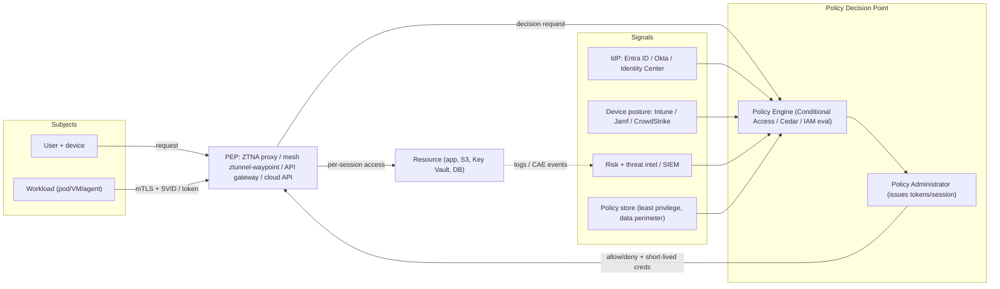
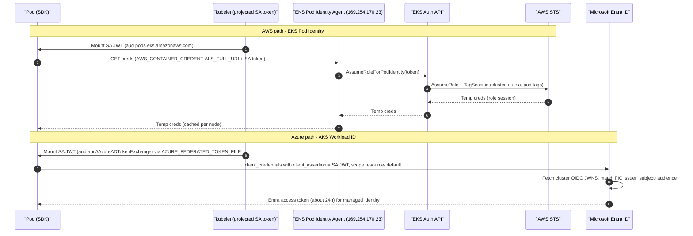

# L7 Zero trust & workload identity
> Last verified: 2026-10 · Audience: senior/staff DevOps, SRE, AI eng, NetEng, DevSecOps, architects

## TL;DR
- **Zero trust is not a product**. It is NIST SP 800-207's model: no implicit trust from network location. Every request is authenticated and authorized **per session** by a **Policy Decision Point (PDP)** and enforced by a **Policy Enforcement Point (PEP)**, using identity, device posture and risk signals.
- **Identity is the perimeter.** For humans that means SSO plus **phishing-resistant MFA** (FIDO2/passkeys, certificate-based auth), conditional access and **JIT** privilege. For workloads it means **short-lived, attested, federated credentials**: no static keys.
- **Workload identity pattern:** the platform issues a signed token (K8s projected SA token, IMDS, SPIFFE SVID). It is exchanged at a cloud STS for short-lived cloud credentials. Examples: **EKS Pod Identity** (successor to IRSA), **AKS Workload ID** (pod-managed identity is deprecated), **GCP WIF**, **IAM Roles Anywhere**.
- **East-west traffic:** use mesh **mTLS with SPIFFE identities** (Istio ambient, Linkerd, Cilium), then L4/L7 **authorization policies** keyed on identity, not IP. Micro-segmentation is the network-tier backstop.
- **Least privilege at scale is a guardrail stack.** Org guardrails (**SCP + RCP** on AWS; Azure Policy and management groups) bound everything. **Permission boundaries** bound delegated admins. **Access Analyzer** removes unused access, and **PIM/JIT** removes standing privilege.
- **Data perimeter (AWS):** allow access only if the **identity is trusted, the resource is trusted and the network is expected**. It is built from SCPs, RCPs and VPC endpoint policies using `aws:PrincipalOrgID`, `aws:ResourceOrgID` and `aws:SourceVpc`.
- **Verification is continuous.** **CAE** (Entra, based on OpenID CAEP) revokes sessions in near real time, so tokens can be long-lived (up to 28 h) yet still revocable.
- **ZTNA replaces flat VPN.** It gives per-app access through an identity-aware proxy (Verified Access, Entra Private Access, Cloudflare Access) instead of network-level reachability. **AI agents** are a new class of workload identity: delegate with scoped, short-lived tokens and on-behalf-of flows.

## L7.1 Zero trust principles (NIST SP 800-207, 800-207A, CISA ZTMM v2)
- **How it works:**
  - **NIST SP 800-207** (Aug 2020) has **7 tenets**:
    1. All data sources and compute are resources.
    2. All communication is secured regardless of network location.
    3. Access is granted **per session**.
    4. Access is decided by **dynamic policy** (identity, app, asset state, behavioural and environmental attributes).
    5. The enterprise monitors the **integrity and posture** of all assets.
    6. AuthN/AuthZ is **dynamic and strictly enforced** before access.
    7. The enterprise collects telemetry to improve posture.
  - **Logical components:**
    - **Policy Engine (PE)** makes the decision.
    - **Policy Administrator (PA)** establishes or tears down the session and issues tokens or credentials.
    - PE + PA together = **PDP**.
    - **PEP** sits in the data path (proxy, gateway, agent, sidecar).
  - **PDP inputs:** CDM/device posture, threat intel, activity logs/SIEM, ID management, PKI, data-access policy, compliance.
  - **Deployment approaches:**
    - **Enhanced identity governance** (identity-centric).
    - **Micro-segmentation** (gateways or host agents).
    - **Network infrastructure / SDP** (software-defined perimeter).
  - **Deployment models:** device agent/gateway, enclave gateway, resource portal, app sandboxing.
  - **SP 800-207A** applies ZT to cloud-native and multi-cloud environments:
    - **Identity-tier policies** use service identity (SPIFFE, mesh) plus **network-tier policies**. Both should be enforced.
    - The service mesh is called out as the PEP for service-to-service traffic.
  - **CISA ZTMM v2.0** (2023):
    - **5 pillars:** Identity, Devices, Networks, Applications & Workloads, Data.
    - **3 cross-cutting capabilities:** Visibility & Analytics, Automation & Orchestration, Governance.
    - **4 stages:** Traditional → Initial → Advanced → Optimal.
  - **OMB M-22-09** (Jan 2022) is the US federal mandate. It requires phishing-resistant MFA, device inventory, encrypted DNS/HTTP, treating apps as internet-connected, and data categorization.
- **Trade-offs / when to use:**
  - ZT is a migration: pillar by pillar and maturity stage by stage. Start with identity (SSO and phishing-resistant MFA) and privileged access. These give the biggest risk reduction for the effort.
  - Per-request PDP evaluation adds latency and a dependency. Mitigate with cached decisions, short-lived tokens plus revocation (CAE), and local PEP evaluation (mesh, Cedar).
- **Interview angles:**
  - If asked "what is zero trust?", say: "Never trust network location. Authenticate and authorize every request per session, from identity + device + context, via PDP/PEP, with least privilege, assume breach, and continuous monitoring."
  - Map products to the logical components. Entra Conditional Access is the PDP; the app/proxy and Global Secure Access are the PEPs. On AWS, Verified Access is the PDP+PEP for users, and IAM policy evaluation is the PDP for every API call.
  - Pitfall: "we bought ZTNA, so we're zero trust" while east-west traffic is flat, service accounts hold static keys, and admins have standing Owner/AdministratorAccess.

## L7.2 Human identity: SSO, phishing-resistant MFA, conditional access, device posture, JIT/JEA
- **How it works:**
  - **SSO** is centralized at one IdP (Entra ID, Okta, IAM Identity Center federating to it) over **SAML 2.0 / OIDC**, with **SCIM** provisioning and deprovisioning. Joiner/mover/leaver automation is the real control.
  - **Phishing-resistant MFA:**
    - Factors: **FIDO2/WebAuthn passkeys** (device-bound security keys, Windows Hello for Business, platform authenticators) and **certificate-based auth / PIV-CAC**. They are origin-bound, so an AiTM proxy cannot replay them.
    - **Not phishing-resistant:** SMS, voice, TOTP, push approval. Push number matching only mitigates **MFA fatigue**.
  - **Passkeys:**
    - **Synced passkeys** (iCloud Keychain, Google Password Manager) are convenient. Their recovery depends on the cloud account.
    - **Device-bound passkeys** give the highest assurance (AAL3-style).
    - Entra supports both via **Authentication strengths**. Built-in "Phishing-resistant MFA" strength = Windows Hello for Business / platform credential, FIDO2 passkey, certificate-based MFA.
  - **Conditional Access (Entra, needs P1; risk-based conditions need P2):**
    - If/then policies. Signals: user/group, app, location (named IP ranges), device platform, **device compliance** (Intune) or hybrid join, sign-in and user risk (ID Protection).
    - Grants: block, require MFA / authentication strength, require compliant device.
    - Session controls: sign-in frequency, CAE, token protection.
    - **Okta** equivalents: authentication policies, **Device Assurance**, **FastPass**.
    - **AWS** has no native user CA engine for console/API access. You federate from Entra/Okta into **IAM Identity Center**. For apps, **Verified Access** evaluates device trust (Jamf, CrowdStrike, JumpCloud).
  - **Device posture** = managed (MDM-enrolled) + compliant (disk encryption, OS patch level, EDR running). Enforce it at the IdP (CA) or at the ZTNA proxy.
  - **JIT / JEA:**
    - **Entra PIM** (Entra ID P2 / ID Governance) covers Entra roles, Azure resource roles and **PIM for Groups**.
    - Assignments are **eligible vs active**, permanent or time-bound. Activation can require MFA, justification, approval and a ticket number, with a max duration and **access reviews**.
    - AWS has no first-party PIM equivalent for Identity Center. Options are the AWS-samples **TEAM** (Temporary Elevated Access Management) solution or partners (Okta, CyberArk, Entitle). Alternatively, use break-glass roles plus session duration plus approval workflows.
    - **JEA** (Just Enough Administration) is the PowerShell constrained-endpoint concept. In general it means narrowly scoped admin roles instead of Owner/Global Admin.
- **Trade-offs / when to use:**
  - Synced passkeys give mass adoption with fewer helpdesk resets. Use device-bound keys for admins and break-glass accounts.
  - CA based on IP named locations is brittle (split tunnels, SNAT, IPv6). Prefer device compliance plus authentication strength.
  - Keep **2 break-glass accounts** excluded from CA but with FIDO2, and alert on every use.
- **Interview angles:**
  - Asked "how do you stop AiTM/Evilginx?": say phishing-resistant MFA (origin-bound WebAuthn) plus compliant-device CA plus **token protection** / CAE. TOTP and push do not stop it.
  - Asked "standing admin access?": say zero standing privilege. Use PIM eligible assignments with 1–8 h activation, approval for Tier-0, alerts on activation, and quarterly access reviews.

## L7.3 Workload identity on cloud compute (IMDSv2, IRSA → EKS Pod Identity, managed identities, AKS Workload ID)
### IMDSv2 (EC2 role credentials)
- **How it works:**
  - The client does a `PUT /latest/api/token` (TTL header), then sends `X-aws-ec2-metadata-token` on each GET. This defeats SSRF/open-proxy credential theft (Capital One-style).
  - **Hop limit:** `HttpPutResponseHopLimit=2` for containers. 1 blocks container access to IMDS through the bridge, which is often desirable on EKS when using Pod Identity.
  - The **account-level default** (`modify-instance-metadata-defaults --http-tokens required`) and **IMDSv2 enforcement** (`--http-tokens-enforced enabled`) make launches fail unless IMDSv2 is required. AMIs with `imds-support v2.0` default to v2-only with hop limit 2.
  - Can be centrally enforced with an **Organizations declarative policy**.
### IRSA vs EKS Pod Identity
- **How it works:**
  - **IRSA:**
    - Needs a per-cluster **IAM OIDC provider**. The SA annotation `eks.amazonaws.com/role-arn` makes the SDK call `sts:AssumeRoleWithWebIdentity` with the projected SA token.
    - The trust policy pins `oidc.eks.<region>.amazonaws.com/id/<X>:sub = system:serviceaccount:ns:sa`.
    - Scaling pain: every new cluster means a new OIDC provider and trust-policy edits on every role. Trust policies have a size limit, and there is a per-account OIDC-provider quota.
  - **EKS Pod Identity** (re:Invent 2023):
    - Trust principal is `pods.eks.amazonaws.com` with `sts:AssumeRole` + `sts:TagSession`. The role is reusable across clusters **without trust-policy edits**.
    - The mapping lives in EKS (`CreatePodIdentityAssociation`), not in SA annotations. Up to **5,000 associations per cluster**.
    - The **Pod Identity Agent DaemonSet** (hostNetwork, `169.254.170.23` / `[fd00:ec2::23]`, ports 80/2703) calls the **EKS Auth** API (`AssumeRoleForPodIdentity`) once per node and serves creds to the SDK through `AWS_CONTAINER_CREDENTIALS_FULL_URI`.
    - **Session tags** (cluster ARN/name, namespace, SA, pod name/UID) enable **ABAC** in resource policies.
    - Optional **`target_role_arn`** for cross-account role chaining. Optional **inline session policy** (only with `disable_session_tags = true`).
    - Limits: Linux EC2 nodes only (**no Fargate, no Windows**, no Outposts/EKS Anywhere). Auto Mode includes the agent. Associations are eventually consistent (seconds). Add `169.254.170.23` to `NO_PROXY`.
  - **ECS/Lambda** use task and execution roles via the container credentials endpoint (same family of mechanism).
- **Trade-offs:**
  - Pod Identity gives separation of duties: the cluster admin owns associations and the IAM admin owns the role.
  - Choose **IRSA** for Fargate, for clusters outside EKS (self-managed K8s can still federate OIDC), or when you need per-cluster trust pinning in IAM.
### Azure managed identities & AKS Workload ID
- **How it works:**
  - **Managed identities:** **system-assigned** (lifecycle tied to the resource, 1:1) vs **user-assigned** (standalone, shareable, survives redeploys; preferred at scale). Tokens come from IMDS `169.254.169.254/metadata/identity/oauth2/token` (no header token like IMDSv2, but the `Metadata: true` header is required).
  - **AKS Workload ID:**
    - The cluster **OIDC issuer** signs projected SA tokens. Entra fetches `/.well-known/openid-configuration` and the JWKS.
    - A **federated identity credential (FIC)** on a user-assigned MI or app registration matches `issuer` + `subject = system:serviceaccount:<ns>:<sa>` + `audience = api://AzureADTokenExchange`.
    - The pod label `azure.workload.identity/use: "true"` is **required** (fail-closed). The SA annotation `azure.workload.identity/client-id` is set.
    - The webhook injects `AZURE_CLIENT_ID`, `AZURE_TENANT_ID`, `AZURE_FEDERATED_TOKEN_FILE` and `AZURE_AUTHORITY_HOST`.
    - Limits: **max 20 FICs per identity**. Propagation takes a few seconds. Virtual nodes are not supported. SA token expiry 3600–86400 s (default 3600). The Entra access token lasts ~24 h. Read the token file path from the env var and re-read it on each exchange.
    - Use the v2 scope format `<resource>/.default`.
    - **AKS Automatic** preconfigures OIDC issuer and Workload ID.
    - **Identity bindings** (preview) remove the per-cluster FIC sprawl: one FIC is shared across many clusters, with audience `api://AKSIdentityBinding`.
  - **Pod-managed identity** (aad-pod-identity, NMI DaemonSet intercepting IMDS) was **deprecated Oct 2022**. Migrate to Workload ID, with a migration sidecar as a stopgap.
- **Interview angles:**
  - Asked "why not mount a service-principal secret?": answer that static secrets leak, need rotation and can't be bound to a workload. Federation gives short-lived tokens tied to cluster/ns/SA and nothing to rotate.
  - Pitfall: a node role or kubelet identity with broad rights. A pod escape or an IMDS reachable from pods then inherits it. Block pod→IMDS (hop limit 1, or a NetworkPolicy to 169.254.169.254) and keep the node role minimal.

## L7.4 SPIFFE/SPIRE and cross-cloud workload federation
- **How it works:**
  - **SPIFFE ID:** `spiffe://<trust-domain>/<path>` (e.g. `spiffe://prod.acme.io/ns/payments/sa/api`).
  - **SVID** is the identity document. **X509-SVID** (SPIFFE ID in the URI SAN) is used for mTLS. **JWT-SVID** is for L7/bearer use and is replay-prone, so use a narrow `aud`.
  - Delivered via the **Workload API** (local Unix socket, no bootstrap secret) with automatic rotation. **Trust bundles** per trust domain. **Federation** exchanges bundles between trust domains.
  - **SPIRE:** the server is the CA plus registration entries. Agents per node do **node attestation** (AWS IID, Azure MSI, GCP IIT, K8s PSAT, TPM) and **workload attestation** (k8s selectors such as ns/SA/image, unix uid, docker labels).
  - Istio, Linkerd, Consul and cert-manager (csi-driver-spiffe) issue SPIFFE-format identities. Istio's are `spiffe://cluster.local/ns/<ns>/sa/<sa>`.
  - SPIFFE/SPIRE are **CNCF graduated** (2022).
- **Cross-cloud federation (no static keys anywhere):**
  - **Into AWS from outside:**
    - **IAM Roles Anywhere:** X.509 certificate from a registered **trust anchor** (AWS Private CA or external CA), plus a **profile** (role list + one session policy), plus a role trusting `rolesanywhere.amazonaws.com` with an `aws:SourceArn` = trust-anchor condition. The `aws_signing_helper` credential process calls `CreateSession`. Regional; the trust boundary is the account.
    - Alternatively OIDC `AssumeRoleWithWebIdentity` (GitHub Actions, GKE, AKS issuers).
  - **Into Azure:** **federated identity credentials** on an app registration or user-assigned MI trusting any OIDC issuer (GitHub Actions `repo:org/repo:environment:prod`, EKS/GKE issuers, SPIRE OIDC discovery provider). Max 20 FICs per identity.
  - **Into GCP:** **Workload Identity Federation**. A **workload identity pool + provider** (OIDC/SAML/AWS/X.509) exchanges the token at Google STS, then either grants direct resource access to a `principal://` / `principalSet://` or impersonates a service account. GKE uses "Workload Identity Federation for GKE".
  - **SPIRE as a universal issuer:** publish SPIRE's OIDC discovery endpoint, then trust it from AWS (OIDC provider), Azure (FIC) and GCP (WIF pool). One identity plane spans all clouds.
- **Trade-offs:**
  - SPIRE gives uniform identity across K8s, VMs and bare metal, but you operate the CA and HA servers.
  - Cloud-native federation is zero-ops but per-cloud.
  - Roles Anywhere makes PKI hygiene (CRLs, short cert TTLs) your problem.
- **Interview angles:**
  - Asked "on-prem job needs S3 without access keys": answer IAM Roles Anywhere with an internal CA (or OIDC federation from your IdP), a scoped role, `aws:SourceArn` and subject CN conditions, plus a short session.
  - Asked "GitHub Actions to cloud": OIDC with `sub` pinned to repo + environment/branch. Never `repo:org/*`.
  - Pitfall: a wildcard `sub` in a trust policy or FIC lets any repo or namespace assume the role.

## L7.5 Service-to-service mTLS via service mesh & authorization policies
- **How it works:**
  - **Istio ambient (GA in 1.24, Nov 2024):**
    - The per-node Rust **ztunnel** does L4 mTLS over **HBONE** (HTTP CONNECT tunnel, port 15008), L4 authz and telemetry.
    - Optional per-namespace or per-service **waypoint** (Envoy) handles L7 authz, routing and retries.
    - No sidecar injection, so less per-pod overhead and no app restarts to upgrade the data plane. Sidecar and ambient can co-exist.
  - **Istio policies:**
    - `PeerAuthentication` mode **STRICT** (reject plaintext).
    - `AuthorizationPolicy` actions: **ALLOW / DENY / CUSTOM** (ext_authz, e.g. OPA) / AUDIT.
    - Match on `source.principals` (SPIFFE ID), namespaces, methods, paths, JWT claims (`RequestAuthentication`).
    - Evaluation order: CUSTOM → DENY → ALLOW. With any ALLOW present, default is deny. **L7 rules need a waypoint in ambient** (ztunnel only enforces L4 attributes).
  - **Linkerd:**
    - Rust micro-proxy sidecar. **mTLS on by default** for meshed TCP. Identity is derived from the K8s SA; certs are short-lived (~24 h).
    - Authorization uses `Server` + `AuthorizationPolicy` + `MeshTLSAuthentication` / `NetworkAuthentication`.
    - Note: open-source stable release artifacts moved to vendor distributions in 2024 (edge releases remain OSS) (verify for your support model).
  - **Cilium:**
    - eBPF CNI. **Identity-based** NetworkPolicy maps labels to a numeric security identity, so policy is not tied to IP churn.
    - L7 policy (HTTP, gRPC, Kafka, DNS) via an Envoy proxy. Transparent encryption with **WireGuard or IPsec** (node-to-node, not per-workload identity).
    - Mutual authentication using SPIRE is a **beta** feature (unverified for current release).
- **Trade-offs:**
  - **Mesh mTLS:** gives cryptographic per-workload identity, but costs a control plane and certificate rotation, plus latency (sidecar ~ms; ambient ztunnel lower).
  - **CNI encryption:** simpler, but it encrypts node-to-node, not workload identity.
  - **Defence in depth:** NetworkPolicy (L3/4 deny-by-default) + mesh AuthorizationPolicy (identity) + app-level authZ (user/tenant).
- **Interview angles:**
  - Asked "how do you enforce that only `checkout` can call `payments` POST /charge?": STRICT mTLS + AuthorizationPolicy with ALLOW `source.principals = cluster.local/ns/checkout/sa/checkout`, method POST, path `/charge`. In ambient, deploy a waypoint for payments.
  - Asked "why not IP allowlists?": pods churn IPs, NAT hides sources, and IPs are not identity (cf. 800-207A identity-tier vs network-tier).
  - Cross-ref service networking: [G14](../G-cloud-network-architecture/G14-service-to-service-networking.md); TLS/certs: [I2](../I-dns-tls-acceleration-gaps/I2-tls-and-certificates.md).

## L7.6 ZTNA vs VPN and micro-segmentation
- **How it works:**
  - A **client VPN** gives network-level reachability to a subnet once authenticated: broad lateral-movement surface, coarse logging, hairpinning. See [G11 Client VPN](../G-cloud-network-architecture/G11-client-vpn.md).
  - **ZTNA:**
    - An **identity-aware proxy** brokers access per application. Each request is checked against user + device + context. Apps are not reachable from the internet; there is an outbound-only connector or private endpoint.
    - **AWS Verified Access:**
      - Policies in **Cedar**. Trust providers: IAM Identity Center or OIDC for users; Jamf, CrowdStrike, JumpCloud for device.
      - Endpoints: ALB, ENI, plus non-HTTP (TCP: RDS, CIDR, network interface) support added 2024–2025 (verify GA per region).
      - Pricing is per app-hour plus GB processed.
    - **Microsoft Entra Private Access** (part of **Global Secure Access** SSE, with Entra Internet Access) uses connectors and the GSA client, Conditional Access per app segment, and Quick Access as a VPN-replacement starter.
    - **Cloudflare Zero Trust:** Access, Tunnel `cloudflared`, WARP client, Gateway.
    - Others: Zscaler ZPA, Okta (identity layer), Google BeyondCorp/IAP.
  - **Micro-segmentation:**
    - Deny-by-default between workloads at fine granularity. Tools:
      - **SGs** referencing SGs (AWS) or **NSG + ASGs** (Azure).
      - K8s NetworkPolicy / Cilium.
      - Host agents (Illumio, Guardicore).
      - Mesh authz (identity-based).
    - AWS **VPC Lattice** auth policies and Azure Firewall/NVA in hub-spoke are segment-level controls.
- **Trade-offs:**
  - ZTNA excels for web/SSH/RDP apps but struggles with legacy thick clients, server-initiated flows and UDP-heavy apps. Keep a narrow VPN for those.
  - Micro-segmentation is only as good as the flow map. Start in **monitor/audit mode** with flow logs, then enforce.
- **Interview angles:**
  - Asked "replace the corporate VPN": inventory apps → put web apps behind ZTNA (per-app policy, device posture) → migrate SSH/RDP to ZTNA TCP or SSM Session Manager / Azure Bastion → keep a residual VPN for exceptions → decommission.
  - Pitfall: ZTNA with a "*" app segment re-creates the VPN.

## L7.7 Least privilege at scale (Access Analyzer, permission boundaries, SCP/RCP vs Azure RBAC/Policy, PIM, CIEM)
- **How it works (AWS):**
  - **Policy evaluation:**
    - Explicit deny wins.
    - An allow must exist in identity- or resource-based policy, **and** within every applicable **SCP** (limits principals in member accounts), **RCP** (limits access to resources in member accounts, including by external principals), **permission boundary** and session policy.
    - SCPs and RCPs **never grant**. Neither affects the **management account**.
    - RCPs do not apply to **service-linked roles** or AWS-managed KMS keys.
    - RCP-supported services include S3, STS, KMS, SQS, Secrets Manager, DynamoDB, ECR, Logs and more (list growing).
    - Test on non-prod OUs before attaching at root.
  - **Permission boundaries:** a managed policy that caps an IAM role/user's max permissions. Classic use is **delegated admin**: devs may `iam:CreateRole` only if `iam:PermissionsBoundary` = the approved boundary.
  - **IAM Access Analyzer:**
    - **External access** analyzers: regional, zone of trust = account/org, re-analysis within ~30 min.
    - **Internal access** analyzers: which in-org principals can reach critical S3/DynamoDB/RDS snapshots.
    - **Unused access** analyzers: unused roles, keys, passwords, services/actions. Global, priced per role/user analyzed per month. Configurable tracking period (unverified default 90 days).
    - **Policy validation** (grammar and best-practice checks).
    - **Custom policy checks** (`CheckNoNewAccess`, `CheckAccessNotGranted`, `CheckNoPublicAccess`). Ideal as CI gates on Terraform plans.
    - **Policy generation** from CloudTrail activity.
  - Also use **last-accessed** data for SCP pruning, **Identity Center permission sets** plus ABAC (session tags), and short session durations.
- **How it works (Azure):**
  - **Azure RBAC** is additive allow at management group / subscription / RG / resource scope. **Deny assignments** only come via managed apps / deployment stacks (not user-authored).
  - **Azure Policy** `deny`/`modify`/`deployIfNotExists` at management groups is the closest analogue to SCP guardrails. It governs resource *configuration*, not data-plane calls by principals.
  - **Entra PIM** for JIT on both Entra and Azure RBAC roles. **ABAC conditions** on role assignments (e.g. storage blob tags).
  - **Entra Permissions Management** (CIEM) **ended sales Apr 1 2025 and retired Nov 1 2025.** Use **Microsoft Defender for Cloud CIEM** (Defender CSPM) or third-party CIEM (Wiz, Tenable, Delinea) for multi-cloud permission right-sizing.
- **Trade-offs:**
  - Guardrails (SCP/RCP/Policy) are coarse but tamper-proof by account admins. Fine-grained least privilege still lives in role policies. Do both.
  - Policy generation from logs under-grants rare paths (DR, quarterly jobs). Review the output; don't auto-apply blindly.
- **Interview angles:**
  - Asked "SCP vs RCP vs permission boundary": SCP = max for *my principals*. RCP = max for *my resources*, whoever calls. Boundary = max for *one principal*, used for safe delegation.
  - Asked "what's Azure's SCP?": no exact equivalent. Answer Azure Policy + management-group RBAC + PIM, and note RBAC has no user-authored deny.
  - Pitfall: "least privilege" with `*:*` in a CI role. Fix with Access Analyzer unused-access findings plus `CheckAccessNotGranted` in the pipeline.

## L7.8 Data perimeter pattern
- **How it works (AWS):**
  - Allow access only if **trusted identity + trusted resource + expected network**.
  - **Identity perimeter:** only my org's identities (or AWS services on my behalf) access my resources. Use **RCP** / resource policies with `aws:PrincipalOrgID` + exceptions `aws:PrincipalIsAWSService`, and VPC endpoint policies.
  - **Resource perimeter:** my identities only access my org's resources. Use **SCP** / endpoint policy with `aws:ResourceOrgID`. Exceptions for AWS-owned resources (e.g. public ECR, AWS-owned buckets).
  - **Network perimeter:** my identities and resources only from expected networks. Use SCP/RCP with `aws:SourceVpc`, `aws:SourceIp`, `aws:ViaAWSService` and `aws:PrincipalIsAWSService` exceptions.
  - **Confused deputy** protection: `aws:SourceOrgID` / `aws:SourceAccount` on service-principal access.
  - RCPs (Nov 2024) made the identity and network perimeters on resources enforceable centrally, instead of editing every bucket policy.
- **Azure analogue:**
  - Private Endpoints + `publicNetworkAccess=Disabled` (enforced by Azure Policy).
  - **Network Security Perimeter** for PaaS (Storage, Key Vault, SQL, etc.; GA rolled out from 2025 – verify per service).
  - Cross-tenant restrictions: Entra **tenant restrictions v2**, Storage `allowedCopyScope` / `allowCrossTenantReplication=false`.
  - Conditional Access for user-plane data.
- **Interview angles:**
  - Asked "stop exfil of S3 data with stolen creds": combine three things. A network perimeter (SourceVpc/SourceIp) makes creds useless off-network. A resource perimeter (ResourceOrgID) blocks `CopyObject` to an attacker's bucket. An identity perimeter (RCP PrincipalOrgID) blocks external principals even if a bucket policy is misconfigured.
  - Pitfall: forgetting AWS service exceptions (`aws:PrincipalIsAWSService`, `aws:ViaAWSService`) breaks CloudFormation, Athena and log delivery.
  - Cross-ref encryption/KMS key policies: [L2](L2-encryption-key-management.md); Private Link: [G7](../G-cloud-network-architecture/G7-service-endpoints-private-link.md).

## L7.9 Continuous verification (CAE, session revocation, workload CA)
- **How it works:**
  - **Entra CAE** is based on the **OpenID CAEP** standard (Shared Signals Framework).
  - **Critical events:** user disabled/deleted, password change/reset, MFA enabled, admin "revoke sessions", high user risk.
  - Supporting resource providers (Exchange, SharePoint, Teams, Graph) also enforce **IP named-location** CA instantly.
  - **Flow:** the RP rejects a still-valid token with **401 + claims challenge**, and the CAE-capable client re-auths.
  - **Timing and token life:**
    - Events propagate in **up to ~15 min**.
    - CAE tokens are long-lived, **up to 28 h**. Non-CAE tokens default to 1 h.
    - Location enforcement fails open to 1 h tokens if named IP ranges exceed **5,000**, or if country-based or MFA-trusted-IP locations are used.
  - **Strict location enforcement** is an option. Guests are not supported.
  - **Conditional Access for workload identities** (Workload Identities Premium) covers **single-tenant service principals** (location and risk-based block). It does **not** cover managed identities.
  - **AWS:**
    - No CAE equivalent for STS creds, which are valid until expiry. Revoke via the **"Revoke active sessions"** inline deny on `aws:TokenIssueTime`, plus short session durations.
    - **GuardDuty** detects instance-credential exfiltration (creds used from outside AWS).
    - Verified Access evaluates per request.
- **Interview angles:**
  - Asked "how fast can you kill a compromised session?": Entra CAE-aware apps in minutes (revoke sessions + disable user). Non-CAE apps at token expiry (≤1 h) or sign-in frequency. AWS STS: deny on `aws:TokenIssueTime` < now, then rotate.
  - Pitfall: long-lived refresh tokens on unmanaged devices. Mitigate with token protection (token binding) and compliant-device CA.

## L7.10 Agent identities (AI agents as workloads)
- **How it works:**
  - Treat each agent as a **workload principal** with its own identity, not a shared API key.
  - **Two modes:**
    - **Autonomous**: client-credentials or federated workload identity.
    - **Delegated**: acts **on behalf of a user** via OAuth on-behalf-of or **token exchange (RFC 8693)**, carrying both user and actor (`act` claim). Downstream audit then shows "agent X for user Y".
  - **MCP** remote servers use OAuth 2.1 authorization (protected-resource metadata, PKCE). See [K8 Agents, tool use & MCP](../K-ai-infra-llm/K8-agents-tool-use-mcp.md).
  - **Vendor primitives** (both preview/early, unverified for GA status as of 2026-10):
    - **Microsoft Entra Agent ID**: agent identities in the directory, governable by CA/PIM-style controls.
    - **Amazon Bedrock AgentCore Identity**: workload identity + token vault for outbound OAuth.
  - **Controls:**
    - Least-privilege scopes per tool.
    - Short-lived tokens and an approval step for high-risk actions.
    - Data-perimeter conditions on the agent's role.
    - Per-agent egress allowlists.
    - Prompt-injection-aware authorization: **never let model output choose the principal or scope**.
- **Interview angles:**
  - Asked "agent needs to read a user's mailbox and file tickets": answer delegated OBO token scoped to `Mail.Read` for that user, a separate workload identity for the ticket API with narrow scope, human approval for writes, and full audit with the actor chain. See [L4 AI security threats](L4-ai-security-threats.md) for the excessive-agency risk.
  - Pitfall: one god-mode service account behind every agent tool. A single prompt injection then gives everything.

## Diagrams




## Cloud mapping: AWS vs Azure
| Capability | AWS | Azure | Role it plays | Key differences | Alternatives |
|---|---|---|---|---|---|
| Workforce SSO / IdP | IAM Identity Center (often federated to external IdP) | Microsoft Entra ID | Central human identity, SAML/OIDC, SCIM | Entra is a full IdP with CA; Identity Center is mainly an AWS-access broker | Okta, Google Workspace, Ping |
| Context-aware access policy (PDP) | Verified Access (Cedar) for apps; IAM policy conditions for APIs | Conditional Access (P1/P2) | Per-sign-in/per-request decision on user, device, risk | Azure CA is tenant-wide for all Entra apps; AWS has no IdP-level CA engine | Okta auth policies + Device Assurance, Cloudflare Access |
| ZTNA (VPN replacement) | AWS Verified Access | Entra Private Access (Global Secure Access) | Identity-aware per-app access proxy | GSA bundles SSE (Internet Access); Verified Access is regional, per-app-hour billing | Cloudflare Zero Trust (Access/Tunnel/WARP), Zscaler ZPA, Google IAP |
| JIT privileged access | No native PIM; TEAM (aws-samples) / partners; session duration | Entra PIM (P2 / ID Governance) | Eliminate standing admin | PIM covers Entra roles, Azure RBAC, groups with approval/MFA/reviews | CyberArk, Okta Privileged Access, Teleport |
| VM/compute identity | EC2 instance profile via IMDSv2 | Managed identity (system/user-assigned) via IMDS | Keyless credentials for compute | IMDSv2 session token + hop limit; Azure IMDS needs `Metadata:true` header | GCP service accounts on metadata server |
| Kubernetes pod identity | EKS Pod Identity (IRSA legacy/Fargate) | AKS Workload ID (FIC on UAMI); pod-managed identity deprecated | Per-SA cloud credentials | Pod Identity: no OIDC provider, role reusable across clusters, 5,000 assoc/cluster; AKS: 20 FICs/identity, identity bindings preview | GKE Workload Identity Federation, SPIRE |
| External workload federation | IAM Roles Anywhere (X.509), OIDC `AssumeRoleWithWebIdentity` | Federated identity credentials (OIDC) on app/UAMI | Keyless access from on-prem/other clouds/CI | Roles Anywhere uses PKI certs; Azure uses OIDC issuer trust | GCP WIF pools, SPIRE OIDC discovery |
| Unused access / CIEM | IAM Access Analyzer (external, internal, unused, policy gen, custom checks) | Defender for Cloud CIEM (Entra Permissions Management retired Nov 2025); PIM access reviews | Right-size permissions | Access Analyzer is native and per-org; Azure CIEM lives in Defender CSPM | Wiz, Tenable, Sonrai |
| Org guardrails | SCP + RCP + declarative policies | Azure Policy + management groups (+ RBAC at MG scope) | Max-permission / config guardrails | SCP/RCP bound API authorization; Azure Policy bounds resource config, RBAC has no user-authored deny | OPA/Gatekeeper, Kyverno (K8s) |
| Delegated admin cap | Permission boundaries | RBAC conditions on role assignment (constrain which roles can be assigned) | Safe self-service IAM | Different mechanism, same intent | — |
| Data perimeter | SCP/RCP/VPCE policies with org/VPC condition keys | Private Endpoints + Network Security Perimeter + Azure Policy + tenant restrictions v2 | Block exfil and external access | AWS is condition-key driven; Azure is network/tenant-restriction driven | Cloudflare/Zscaler DLP |
| Service-to-service mTLS | VPC Lattice auth policies, App Mesh (retiring), Istio on EKS | Istio-based service mesh add-on for AKS, Cilium (Azure CNI powered by Cilium) | Workload identity + L4/L7 authz | Both lean on Istio/Cilium; check managed add-on versions | Linkerd, Consul, Cilium |
| Continuous evaluation | `aws:TokenIssueTime` revoke, GuardDuty credential exfil detection | CAE (CAEP), sign-in risk, token protection | Revoke mid-session | Entra revokes in near real time in CAE-aware apps; AWS creds valid until expiry | Okta ITDR / Shared Signals |

- **Identity Center vs Entra ID:** Identity Center assigns **permission sets** (provisioned as roles) into accounts. MFA and device controls usually come from the upstream IdP. Entra is both the IdP and the CA engine, and also secures Azure ARM and M365.
- **Verified Access vs Entra Private Access:** Verified Access is per-app, Cedar-based, regional and billed per app-hour + GB. Private Access is a client-based SSE with connectors, tied to CA, and licensed per user. Cloudflare Access is a global anycast edge with `cloudflared` outbound tunnels, so there are no inbound ports anywhere.
- **EKS Pod Identity vs AKS Workload ID:**
  - EKS: the exchange happens **server-side** (EKS Auth assumes the role, cached per node) and the mapping is kept outside the cluster.
  - AKS: the **SDK** performs the OIDC client-assertion exchange directly with Entra, and the mapping is FIC + SA annotation.
  - Both remove static secrets. AWS supports cross-account **target role** chaining. AKS FIC sprawl (20 per identity) is addressed by identity bindings (preview).
- **Org guardrails gotcha:** SCPs/RCPs don't apply to the **management account**. Azure Policy assigned at the root management group applies to all subscriptions, but RBAC Owners can still create exemptions if permitted. Restrict `Microsoft.Authorization/policyExemptions/write`.
- **Retired/renamed:** Entra Permissions Management (retired 2025-11-01). AKS pod-managed identity (deprecated 2022). Azure AD → Microsoft Entra ID (2023). AWS SSO → IAM Identity Center (2022). AWS App Mesh end of support announced for 2026 (verify).
- **Alternatives:** **Okta** (Workforce Identity, FastPass, Device Assurance, Okta Privileged Access, Identity Threat Protection). **Cloudflare Zero Trust** (Access, Gateway, WARP, Tunnel, CASB/DLP). **SPIRE** for cloud-agnostic workload identity. **Kubernetes** NetworkPolicy/Cilium for segmentation. **HashiCorp Vault** for dynamic DB/cloud creds where federation isn't possible (see [L6 Secrets & supply chain](L6-secrets-supply-chain.md)).

## Hands-on (optional)
```hcl
# EKS Pod Identity: role trusting pods.eks.amazonaws.com + association (+ optional cross-account target role)
data "aws_iam_policy_document" "pod_identity_trust" {
  statement {
    effect = "Allow"
    principals {
      type        = "Service"
      identifiers = ["pods.eks.amazonaws.com"]
    }
    actions = ["sts:AssumeRole", "sts:TagSession"]
    condition {                                   # restrict to one cluster via session tag (unverified key choice; aws:SourceArn=cluster ARN is an alternative)
      test     = "StringEquals"
      variable = "aws:RequestTag/eks-cluster-name"
      values   = [aws_eks_cluster.main.name]
    }
  }
}

resource "aws_iam_role" "payments" {
  name               = "payments-pod"
  assume_role_policy = data.aws_iam_policy_document.pod_identity_trust.json
}

resource "aws_eks_addon" "pod_identity_agent" {
  cluster_name = aws_eks_cluster.main.name
  addon_name   = "eks-pod-identity-agent"     # not needed on EKS Auto Mode
}

resource "aws_eks_pod_identity_association" "payments" {
  cluster_name    = aws_eks_cluster.main.name
  namespace       = "payments"
  service_account = "payments-api"
  role_arn        = aws_iam_role.payments.arn
  # target_role_arn = "arn:aws:iam::222233334444:role/shared-data-reader"  # optional cross-account chaining
}
```

```hcl
# AKS Workload ID: OIDC issuer + workload identity on cluster, UAMI, FIC, RBAC
resource "azurerm_kubernetes_cluster" "aks" {
  # ... name, location, rg, default_node_pool, identity ...
  oidc_issuer_enabled       = true
  workload_identity_enabled = true
}

resource "azurerm_user_assigned_identity" "payments" {
  name                = "uami-payments"
  location            = azurerm_resource_group.rg.location
  resource_group_name = azurerm_resource_group.rg.name
}

resource "azurerm_federated_identity_credential" "payments" {
  name                      = "fic-aks-payments"
  user_assigned_identity_id = azurerm_user_assigned_identity.payments.id
  issuer                    = azurerm_kubernetes_cluster.aks.oidc_issuer_url
  subject                   = "system:serviceaccount:payments:payments-api"
  audience                  = ["api://AzureADTokenExchange"]
}

resource "azurerm_role_assignment" "kv_secrets_user" {
  scope                = azurerm_key_vault.kv.id
  role_definition_name = "Key Vault Secrets User"
  principal_id         = azurerm_user_assigned_identity.payments.principal_id
}
# K8s side: SA annotated azure.workload.identity/client-id=<uami client_id>; pod label azure.workload.identity/use="true"
# Older azurerm (v3) used resource_group_name + parent_id on this resource — check your provider version.
```

```bash
# Enforce IMDSv2 for new launches in a region; verify from inside an instance
aws ec2 modify-instance-metadata-defaults --region us-east-1 \
  --http-tokens required --http-put-response-hop-limit 2 --http-tokens-enforced enabled
TOKEN=$(curl -sX PUT http://169.254.169.254/latest/api/token -H "X-aws-ec2-metadata-token-ttl-seconds: 300")
curl -s -H "X-aws-ec2-metadata-token: $TOKEN" http://169.254.169.254/latest/meta-data/iam/security-credentials/
```

## Cross-links
- [G11 Client VPN](../G-cloud-network-architecture/G11-client-vpn.md): VPN baseline vs ZTNA
- [G7 Service endpoints & Private Link](../G-cloud-network-architecture/G7-service-endpoints-private-link.md): network perimeter, VPC endpoint policies
- [G14 Service-to-service networking](../G-cloud-network-architecture/G14-service-to-service-networking.md): mesh, VPC Lattice
- [I2 TLS and certificates](../I-dns-tls-acceleration-gaps/I2-tls-and-certificates.md): mTLS, PKI for Roles Anywhere/SPIRE
- [C4 Security](../C-large-scale-architecture/C4-security.md): AuthN/AuthZ fundamentals
- [K8 Agents, tool use & MCP](../K-ai-infra-llm/K8-agents-tool-use-mcp.md): agent identity, MCP OAuth
- [L2 Encryption & key management](L2-encryption-key-management.md): KMS/Key Vault key policies within the perimeter
- [L4 AI security threats](L4-ai-security-threats.md): excessive agency, prompt injection
- [L6 Secrets & supply chain](L6-secrets-supply-chain.md): eliminating static secrets, CI OIDC

## Sources
- https://csrc.nist.gov/pubs/sp/800/207/final
- https://www.cisa.gov/zero-trust-maturity-model
- https://docs.aws.amazon.com/eks/latest/userguide/pod-identities.html
- https://docs.aws.amazon.com/eks/latest/userguide/pod-id-association.html
- https://docs.aws.amazon.com/IAM/latest/UserGuide/what-is-access-analyzer.html
- https://docs.aws.amazon.com/organizations/latest/userguide/orgs_manage_policies_rcps.html
- https://docs.aws.amazon.com/whitepapers/latest/building-a-data-perimeter-on-aws/building-a-data-perimeter-on-aws.html
- https://docs.aws.amazon.com/AWSEC2/latest/UserGuide/configuring-IMDS-new-instances.html
- https://docs.aws.amazon.com/rolesanywhere/latest/userguide/introduction.html
- https://docs.aws.amazon.com/verified-access/latest/ug/what-is-verified-access.html
- https://learn.microsoft.com/en-us/azure/aks/workload-identity-overview
- https://learn.microsoft.com/en-us/entra/identity/conditional-access/concept-continuous-access-evaluation
- https://learn.microsoft.com/en-us/entra/id-governance/privileged-identity-management/pim-configure
- https://learn.microsoft.com/en-us/previous-versions/entra/permissions-management/overview
- https://spiffe.io/docs/latest/spiffe-about/overview/
- https://istio.io/latest/docs/ambient/overview/
- https://istio.io/latest/news/releases/1.24.x/announcing-1.24/
- https://github.com/hashicorp/terraform-provider-aws/blob/main/website/docs/r/eks_pod_identity_association.html.markdown
- https://github.com/hashicorp/terraform-provider-azurerm/blob/main/website/docs/r/federated_identity_credential.html.markdown
