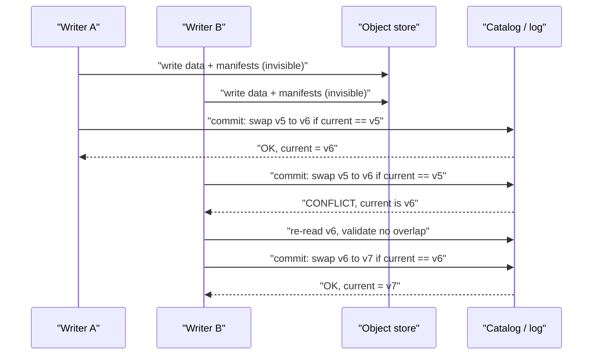
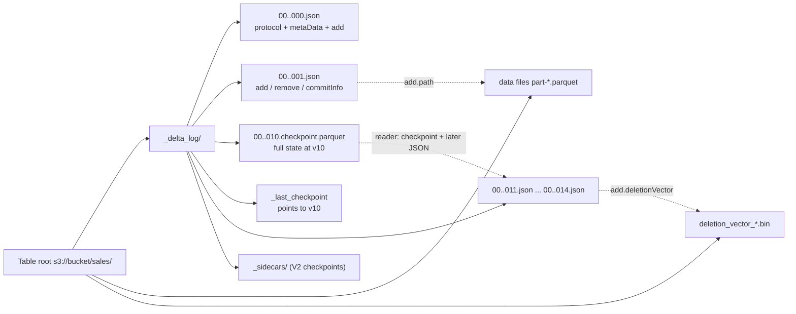
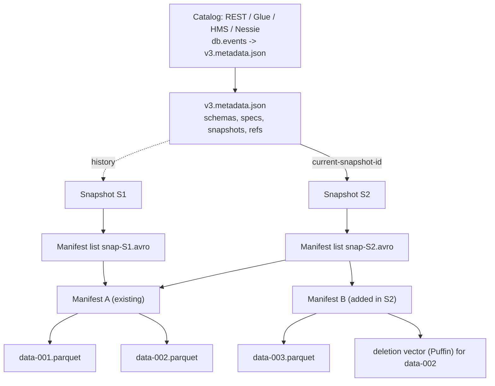

# M1 Lakehouse & Open Table Formats
> Last verified: 2026-10 · Audience: senior/staff DevOps, SRE, AI eng, NetEng, DevSecOps, architects

## TL;DR
- A **lakehouse** = cheap object storage + open columnar files (**Parquet**) + a **table format** (Delta / Iceberg / Hudi) that adds a **transaction log/metadata tree**, ACID, snapshots, schema evolution, and file-level stats on top + a **catalog** that holds the "current pointer" and access policy.
- Table formats get ACID on object storage via **optimistic concurrency control (OCC)**: write data files first (invisible), then make **one atomic metadata commit** (put-if-absent of `_delta_log/N.json` for Delta; catalog compare-and-swap of the `metadata.json` pointer for Iceberg). Losers re-validate and retry, or fail with a conflict.
- **Iceberg** = `metadata.json` → **manifest list** (one per snapshot) → **manifests** (Avro, with per-file stats) → data/delete files. Main ideas: **hidden partitioning**, **partition evolution**, branches/tags. **v3** (adopted) adds **deletion vectors** in Puffin files, **row lineage**, `variant`/`geometry`/`geography`/`timestamp_ns`, default values. v4 is still in development.
- **Delta** = ordered JSON commits plus Parquet **checkpoints**, with features enabled through **table features** (reader v3 / writer v7): deletion vectors, liquid clustering, row tracking, type widening, variant, catalog-managed commits, IcebergCompat/**UniForm**.
- **Hudi** = streaming/upsert-first: record keys + indexes, **CoW vs MoR**, a **timeline** of instants, built-in table services (compaction, clustering, cleaning). Its strongest use is high-rate CDC upserts.
- Operational problems repeat across all three formats: **small files** (compaction/OPTIMIZE), **metadata bloat** (checkpoints, expire snapshots, rewrite manifests), **orphan files** (VACUUM / remove_orphan_files), and **concurrent-writer conflicts** (partition-disjoint writes, row-level concurrency).
- Catalog choice matters more than format choice in 2026: **Iceberg REST** is the common protocol. Glue, S3 Tables, Unity Catalog, Polaris/Snowflake Open Catalog, Nessie and OneLake all expose it, and they add **credential vending** and governance on top.
- AWS: **S3 Tables** (managed Iceberg, built-in compaction and snapshot expiry) + Glue Data Catalog + Lake Formation + Athena/EMR/Redshift. Azure: **OneLake/Fabric** (Delta native, shortcuts, Delta↔Iceberg **metadata virtualization**) + Purview. Cross-cloud: Databricks Unity Catalog, Snowflake Iceberg tables.

## M1.1 Warehouse vs data lake vs lakehouse
- **How it works:**
  - **Warehouse** (Redshift, Synapse dedicated / Fabric Warehouse, Snowflake, BigQuery): proprietary storage plus engine, schema-on-write, full ACID, strong SQL/BI performance, and governance in one place. Storage and compute are coupled or tied to one vendor.
  - **Data lake** (S3 / ADLS Gen2 + Hive-style folders of Parquet/CSV/JSON): schema-on-read, cheap, any engine. But it has **no atomic multi-file commits**, no isolation, no row-level updates, and "partition = directory" listing. This is the "data swamp" problem.
  - **Lakehouse:** a lake plus an open **table format** plus a catalog. You get warehouse semantics (ACID, MERGE/UPDATE/DELETE, time travel, schema enforcement) on open files that many engines can read (Spark, Trino, Flink, Athena, Snowflake, DuckDB, Fabric).
- **Trade-offs / when to use:**
  - Warehouse: highest concurrency for BI and the least ops work. Costs are egress/lock-in and paying for compute even on ML/batch scans.
  - Lakehouse: one copy of data for BI + ML + streaming, with storage and compute separated. You (or a managed service) own compaction, metadata maintenance and catalog ops.
  - In 2026 the line has blurred: warehouses read/write Iceberg (Snowflake Iceberg tables, Redshift/Athena on S3 Tables, BigQuery tables for Apache Iceberg), and Fabric Warehouse stores Delta in OneLake.
- **Interview angles:**
  - "Why not just Parquet on S3?" → no atomic commit (readers see partial writes), no consistent snapshots, expensive LIST-based planning, no safe concurrent writers, and GDPR deletes force manual rewrites.
  - "When is a warehouse still right?" → high-concurrency dashboards, strict SLAs, small team. Many shops run **lakehouse for bronze/silver and warehouse (or a warehouse engine on Iceberg) for gold**.
  - Link the history: HDFS + MapReduce → Hive tables → Spark → table formats (see [C6.48 HDFS](../C-large-scale-architecture/C6-technology-stack.md#c648-hadoop-hdfs), [C6.49 MapReduce](../C-large-scale-architecture/C6-technology-stack.md#c649-map-reduce), [C6.50 Spark](../C-large-scale-architecture/C6-technology-stack.md#c650-apache-spark)).

## M1.2 Medallion architecture (bronze / silver / gold)
- **How it works:**
  - **Bronze:** raw, append-only, as landed (Kafka/CDC/files). Keep source fidelity plus ingestion metadata (`_ingest_ts`, source offset, file name) so you can replay.
  - **Silver:** cleaned, deduplicated, conformed, typed. CDC is applied with `MERGE` and keyed entities. This layer enforces schema and quality expectations.
  - **Gold:** business aggregates, star schemas, feature tables. Optimized (clustering, stats) for BI/ML consumers.
  - Usually incremental between layers: Structured Streaming / Delta CDF / Iceberg incremental reads / Hudi incremental queries.
- **Trade-offs / when to use:**
  - Pro: replayability, clear ownership/contracts per layer, and a natural spot for PII redaction (silver).
  - Con: storage multiplication and latency per hop. Do not create layers by ritual: a 3-hop pipeline for a small table is waste.
- **Interview angles:**
  - "Where do you dedupe / handle late data?" → silver, keyed MERGE with an event-time watermark. Gold is rebuilt or incrementally refreshed.
  - "Where does GDPR deletion happen?" → every layer that holds the subject's data. Deletion vectors make it cheap, but you still need **VACUUM/expire-snapshots** to physically remove the bytes (time travel retains them).
  - Worked case: [E3.2 silver and gold layers](../E-ai-system-design/E3-hubspot-user-clustering-case-study.md#e32-system-workflow-batch-vs-online-learning-etl-silver-and-gold-layers-nightly-retraining). Databricks-specific (DLT / Lakeflow) → [M3](./M3-databricks-platform.md).

## M1.3 File formats: Parquet internals, ORC, Avro
### Parquet layout
- **How it works:**
  - File = `PAR1` magic → **row groups** → per row group one **column chunk** per column → each chunk has **pages** (data pages + optional dictionary page) → **footer** (FileMetaData: schema, row-group/column-chunk offsets, stats) → 4-byte footer length → `PAR1`.
  - The footer is written last so the writer can produce the file in a **single pass**. Readers read the footer first (1 range GET for the tail), then range-read only the needed column chunks (**projection pushdown**).
  - Recommended sizes (parquet.apache.org): **row group 512 MB–1 GB**, **data page ~8 KB**. In practice engines default much smaller: parquet-mr/Spark 128 MB row groups, 1 MB pages. S3 Tables applies a 128 MB row group.
  - **Statistics:** min/max/null_count per column chunk (and per page via the **Page Index**: ColumnIndex + OffsetIndex). These enable **predicate pushdown / row-group skipping**. Optional **Bloom filters** per column chunk help equality predicates on high-cardinality columns.
  - **Encodings:** **dictionary** (PLAIN_DICTIONARY / RLE_DICTIONARY: dict page + RLE/bit-packed indices; falls back to plain when the dictionary grows too big, ~1 MB default), **RLE/bit-packing** (booleans, def/rep levels), **DELTA_BINARY_PACKED** (sorted ints/timestamps), DELTA_BYTE_ARRAY (strings with shared prefixes), BYTE_STREAM_SPLIT (floats).
  - **Compression** is per page: Snappy (old default), **ZSTD** (common modern default; UniForm writes ZSTD), GZIP, LZ4_RAW.
  - **Nested data:** Dremel-style **definition & repetition levels**.
  - Also: modular **encryption** (footer + column keys), logical types (DECIMAL, TIMESTAMP micros/nanos, **VARIANT** with shredding, which is new).
- **Trade-offs / when to use:**
  - Sorting/clustering before writing makes min/max stats selective. Unsorted data means every row group overlaps every predicate, so pushdown does nothing.
  - Too many tiny files or row groups means footer-read and request overhead dominate. Too large means less parallelism and more memory per task.
### ORC and Avro
- **ORC:** columnar, from Hive. **Stripes** (~64 MB default; 256 MB in some configs) + index streams (row index every 10k rows) + built-in bloom filters + ACID delta files in Hive 3. Still strong in Hive/Trino shops. Iceberg supports it as a data format, Delta does not.
- **Avro:** **row-oriented**, schema embedded in the file header (JSON schema), sync markers allow splitting. Best for write-heavy, record-at-a-time workloads (Kafka payloads with Schema Registry, landing zones). **Iceberg manifests and manifest lists are Avro.**
- **Interview angles:**
  - "Parquet vs Avro?" → analytics scans/aggregations → Parquet. Streaming records / schema-evolving messages → Avro (or Protobuf).
  - "Query reads 2 columns of 200 but is slow" → check for small files, missing stats (e.g. strings over the stats truncation length), no sort/clustering, and a CSV/JSON bronze layer read repeatedly.
  - "How does a reader skip data?" → partition pruning (catalog/metadata) → file pruning (manifest / Delta add-stats min/max) → row-group pruning (footer stats) → page pruning (page index) → bloom filter.

## M1.4 ACID on object storage & OCC commit conflicts
- **How it works:**
  - Object stores have no multi-object transactions and no atomic rename (S3). Table formats therefore turn the whole commit into **one atomic single-object operation**:
    - **Delta:** writer creates `_delta_log/<v>.json`. The protocol requires **mutual exclusion**: only one writer may create version *v* (put-if-absent / atomic rename-no-overwrite). On ADLS Gen2 (HNS) and HDFS, atomic rename provides this. On S3, Delta OSS multi-cluster writes historically needed **S3DynamoDBLogStore** (DynamoDB as the lock/commit table). **S3 conditional writes (`If-None-Match: *`)**, available since Aug 2024, now enable native put-if-absent. Check your connector version (unverified per connector). Databricks uses its own commit service, and with **catalog-managed tables** (Unity Catalog) the catalog ratifies commits.
    - **Iceberg:** writer writes new data → manifests → manifest list → new `vN.metadata.json`, then asks the **catalog** to atomically swap the table's current-metadata pointer **iff it still equals the base** (CAS). Hive Metastore uses a lock + `metadata_location` param, Glue uses optimistic version IDs, and REST catalogs do it server-side (`UpdateTable` with requirements such as `assert-ref-snapshot-id`).
    - **Hudi:** timeline instant transitions plus an optional **lock provider** (ZooKeeper, DynamoDB, Hive Metastore, file-system) for multi-writer OCC. Hudi 1.x adds **non-blocking concurrency control (NBCC)** for MoR, where writers append to logs and conflicts are resolved at merge.
  - **Conflict handling:** the loser re-reads the latest snapshot, checks whether the concurrent commits touched anything its transaction **read or wrote**, and then either rebases and retries or throws. Iceberg retries by default (`commit.retry.num-retries` default 4).
  - **Delta isolation levels:** **WriteSerializable** (default; blind INSERTs never conflict) vs **Serializable**. Typical exceptions: `ConcurrentAppendException` (files added to a partition you read), `ConcurrentDeleteReadException`, `ConcurrentDeleteDeleteException`, `MetadataChangedException`, `ProtocolChangedException`, `ConcurrentTransactionException` (same streaming `txn` appId/version). **Row-level concurrency** (Databricks, needs deletion vectors) detects conflicts per row instead of per file.
- **Trade-offs / when to use:**
  - OCC is cheap when writers touch disjoint files and pathological with many writers hitting the same partitions (retry storms, wasted compute).
  - Readers never block: snapshot isolation on immutable files.
- **Interview angles:**
  - "Two jobs MERGE into the same table and one fails randomly" → OCC conflict. Fixes: make predicates **partition/cluster-disjoint** (`WHERE date = ...` explicitly in the MERGE condition), serialize via the orchestrator, enable deletion vectors + row-level concurrency, or use a single writer with micro-batching.
  - "Is compaction safe concurrently with writes?" → yes for appends. With updates/deletes it can conflict. Iceberg `rewrite_data_files` has `partial-progress.enabled` and validates against concurrent deletes. Delta OPTIMIZE conflicts with concurrent UPDATE/DELETE/MERGE on the same files.
  - Streaming exactly-once: Delta `txn` action (`appId`, `version`) for idempotent writes; Iceberg/Flink commit snapshot properties keyed by checkpoint id. See [B7 Concurrency control](../B-database-engineering/B7-concurrency-control.md) and [B1 ACID](../B-database-engineering/B1-acid.md).



## M1.5 Delta Lake
- **How it works:**
  - **`_delta_log/`**: zero-padded 20-digit commits `00000000000000000000.json` (newline-delimited JSON actions). Version *v* = state *v-1* + actions.
  - **Actions:** `add` / `remove` (logical file ops; key = `(path, deletionVector.uniqueId)`; `dataChange` flag; per-file **stats** min/max/nullCount/numRecords on the first N columns, default 32 via `delta.dataSkippingNumIndexedCols`), `metaData` (schema, partition cols, config), `protocol` (minReader/WriterVersion + `readerFeatures`/`writerFeatures`), `commitInfo`, `txn` (streaming idempotency), `cdc`, `domainMetadata`, `sidecar`, `checkpointMetadata`.
  - **Snapshot reconstruction:** latest checkpoint + subsequent JSON commits. Last protocol/metaData wins, add/remove reconcile per key. `_last_checkpoint` points to the newest checkpoint so readers avoid LIST.
  - **Checkpoints:** classic `n.checkpoint.parquet`; **multi-part** `n.checkpoint.o.p.parquet` (deprecated); **V2 checkpoints** `n.checkpoint.<uuid>.json|parquet` that reference **sidecar** Parquet files in `_delta_log/_sidecars/` (scales to huge file counts). OSS default interval is every **10 commits** (`delta.checkpointInterval`; unverified for latest Databricks runtimes). **Log compaction** files `<x>.<y>.compacted.json` aggregate a commit range. Optional `<v>.crc` checksum files.
  - **Retention:** `delta.logRetentionDuration` default **30 days** (log cleanup at checkpoint). `delta.deletedFileRetentionDuration` default **7 days** (VACUUM threshold). Time travel only works within both windows. VACUUM **LITE** (log-based, fast) vs **FULL** (directory listing; also removes unreferenced orphans) on DBR 16.1+.
  - **Deletion vectors (DVs):** reader v3 / writer v7 feature. DELETE/UPDATE/MERGE mark rows deleted in a **RoaringBitmap** (stored inline `i`, in a UUID-named file `u`, or by absolute path `p`) instead of rewriting the Parquet file. Rewrites happen later in OPTIMIZE/REORG (`REORG TABLE ... APPLY (PURGE)` to physically purge).
  - **Other table features:** column mapping (`name`/`id`, enables rename/drop without rewrite), change data feed, row tracking, **liquid clustering** (`clusteringProvider = liquid`, stored in domainMetadata), type widening, variant, in-commit timestamps, **V2 checkpoints**, **catalog-managed tables** (commits ratified by the catalog; staged commits in `_delta_log/_staged_commits/`), vacuum protocol check, IcebergCompatV1/V2/V3.
  - **Versions:** Delta 4.x (Spark 4.x) brought variant, type widening, catalog-managed/coordinated commits, and liquid clustering in OSS.
- **Trade-offs / when to use:**
  - Best-in-class with Spark/Databricks/Fabric. The log design is simple: the file listing *is* the log.
  - Partitioning is single and table-wide (no hidden partitioning or partition evolution). Liquid clustering is the modern replacement.
  - **Enabling a table feature upgrades the protocol**, which can lock out older readers. `ALTER TABLE ... DROP FEATURE` exists for some features.
- **Interview angles:**
  - "Explain time travel" → `VERSION AS OF` / `TIMESTAMP AS OF` replays the log to that version. It fails if VACUUM deleted the files or log cleanup removed the JSON.
  - "Why are reads slow after many small streaming commits?" → huge log plus small files. Fixes: checkpoints/log compaction, `OPTIMIZE`, optimized writes / auto-compact, and a sensible trigger interval.
  - Pitfall: running VACUUM with retention < 7 days (and disabling `retentionDurationCheck`) can delete files that long-running readers/writers still need, which corrupts their results.



## M1.6 Apache Iceberg
- **How it works (metadata tree):**
  - **Catalog** holds a pointer: table → current `metadata.json` location.
  - **`vN.metadata.json`**: `format-version`, `table-uuid`, `location`, `last-sequence-number`, schemas (with **field IDs**), partition specs, sort orders, `current-snapshot-id`, `snapshots[]`, `snapshot-log`, `metadata-log`, **`refs`** (branches/tags), properties. v3 adds `next-row-id`.
  - **Snapshot** → one **manifest list** (`snap-*.avro`): one row per manifest with partition-range summaries and added/deleted counts, which allows pruning whole manifests.
  - **Manifest** (Avro): one row per data or delete file with partition tuple, record count, size, **per-column lower/upper bounds, null/NaN counts**, status (ADDED/EXISTING/DELETED), sequence numbers.
  - **Data files** (Parquet/ORC/Avro) + **delete files**: v2 **position deletes** (file + row pos) and **equality deletes** (rows matching column values). v3 adds **deletion vectors**.
  - **Sequence numbers** order data vs delete files: a delete applies only to data files with a lower or equal sequence number.
- **Hidden partitioning:** partition spec = transforms on source columns: `identity`, `bucket[N]`, `truncate[W]`, `year`, `month`, `day`, `hour`, `void`. Users filter on `event_ts`, and Iceberg derives `day(event_ts)` for pruning. No `dt` string column is needed and no wrong-partition queries happen.
- **Partition evolution:** changing the spec is **metadata-only**. Old files keep the old spec, new writes use the new one, and planning prunes each spec separately (e.g. month → day as volume grows). Sort-order evolution works the same way.
- **Schema evolution:** add/drop/rename/reorder/widen by **column ID** (not name or position), so no rewrite is needed and there is no "zombie column" resurrection.
- **Snapshots / time travel / branches:** `FOR VERSION AS OF <snapshot-id|branch|tag>`, `FOR TIMESTAMP AS OF`. **Branches** support WAP (write-audit-publish: write to `audit` branch, validate, `fast_forward` main). **Tags** support retention for audit/ML reproducibility.
- **Maintenance procedures (Spark `CALL catalog.system.*`):** `expire_snapshots` (table props `history.expire.max-snapshot-age-ms` default 5 days, `min-snapshots-to-keep` default 1), `remove_orphan_files` (default older-than 3 days), `rewrite_data_files` (binpack/sort/zorder), `rewrite_manifests`, `rewrite_position_delete_files`.
- **Spec versions (verified on iceberg.apache.org spec, Iceberg 1.12.0 latest):**
  - **v1** analytic tables; **v2** row-level deletes (position/equality), sequence numbers.
  - **v3:** **deletion vectors** as Puffin blobs (`deletion-vector-v1`, **at most one DV per data file per snapshot**; v3 writers must not add new position delete files and must merge existing ones into DVs), **row lineage** (`_row_id`, `_last_updated_sequence_number`), new types (`variant`, `geometry`, `geography`, `timestamp_ns`/`timestamptz_ns`, `unknown`), **column default values**, **multi-argument transforms**, **table encryption keys**.
  - **v4:** "under active development, not formally adopted". Direction includes relative locations in metadata and no longer allowing equality-delete writes.
- **Trade-offs / when to use:**
  - The most engine-neutral format (Spark, Flink, Trino, Athena, Redshift, Snowflake, BigQuery, Dremio, DuckDB, Databricks managed Iceberg). It is the AWS-native choice (S3 Tables).
  - It needs a catalog for atomic commits (no catalog-free safe multi-writer). Metadata is more files per commit than Delta, so streaming with frequent commits needs aggressive `rewrite_manifests` + `expire_snapshots`.
  - Equality deletes (Flink CDC) are cheap to write but expensive to read until compacted.
- **Interview angles:**
  - "Walk me through a query plan" → catalog → metadata.json → current snapshot → manifest list (prune by partition summary) → manifests (prune by column bounds) → data files minus deletes. **No directory LIST**, which is why it scales to millions of files.
  - "Partition by date, then traffic grows 50×?" → `ALTER TABLE ... REPLACE PARTITION FIELD days(ts) WITH hours(ts)`, with no rewrite of history.
  - "Absolute paths" gotcha: metadata references absolute URIs, so copying a table folder breaks it. Use `register_table` / `rewrite_table_path` instead.



## M1.7 Apache Hudi
- **How it works:**
  - Built for **upserts and incremental pulls** (from Uber). Every record has a **record key** (+ partition path). An **index** maps key → file group (bloom, simple, bucket, record-level index in the **metadata table**).
  - Layout: **file groups** (by fileId) → **file slices** (base file + log files per commit time).
  - **Copy-on-Write (CoW):** updates rewrite the affected base Parquet files. Reads are fast (pure columnar), writes are amplified.
  - **Merge-on-Read (MoR):** updates are appended to row/columnar **log files**, and periodic **compaction** merges them into new base files. Writes are low-latency, and snapshot reads merge on the fly.
  - **Query types:** snapshot, time travel, **read-optimized** (MoR base files only, which can be stale), **incremental** (changes since instant), and **CDC** incremental (before/after images).
  - **Timeline** (`.hoodie/timeline`): instants = action + requested time + completion time + state (**REQUESTED → INFLIGHT → COMPLETED**). Actions: COMMIT, DELTA_COMMIT, REPLACE_COMMIT, CLEAN, COMPACTION, LOGCOMPACTION, CLUSTERING, INDEXING, ROLLBACK, SAVEPOINT, RESTORE. Hudi 1.x archives old instants into an **LSM timeline** (Parquet, multi-level) and uses TrueTime-like monotonic instant generation.
  - **Table services:** cleaning (retain N commits/file versions), compaction, clustering, indexing. They run inline, async, or as a separate job.
  - Current release per docs: **Hudi 1.2.1**.
- **Trade-offs / when to use:**
  - Strongest for **high-volume keyed CDC/upserts** with near-real-time freshness and incremental downstream ETL.
  - More knobs and ops surface (index type, compaction scheduling, cleaner). Smaller engine ecosystem than Iceberg/Delta. Often consumed by others via XTable.
- **Interview angles:**
  - "CoW or MoR?" → read-heavy, infrequent updates → CoW. Write-heavy streaming upserts with a freshness SLA → MoR plus async compaction (and accept that read-optimized queries lag).
  - Delta/Iceberg equivalents of MoR: **deletion vectors** + appended files (merge-on-read for deletes). Iceberg v2 equality/position deletes are also MoR.

## M1.8 Small files, compaction, OPTIMIZE, Z-order & liquid clustering
- **How it works:**
  - Small files come from streaming micro-batches, high-cardinality partitioning, over-parallel writers, and frequent MERGE. Cost: per-file open/footer/GET overhead, huge metadata (manifests/log), slow planning, S3 request costs, and driver OOM.
  - **Target sizes:** ~128 MB–1 GB per file. Delta OPTIMIZE targets ~1 GB by default. **S3 Tables compaction default 512 MB** (configurable 64–512 MB).
  - **Delta:** `OPTIMIZE t [WHERE part-pred] [ZORDER BY (c1,c2)]`. Optimized writes and auto-compaction on write. **Liquid clustering:** `CLUSTER BY (c1..c4)` (max **4** keys), `CLUSTER BY AUTO` (keys chosen by predictive optimization), `OPTIMIZE` is **incremental**, `OPTIMIZE FULL` reclusters everything. It is **incompatible with partitioning and ZORDER**. Requires DBR 15.4 LTS+ (Delta) and 16.4 LTS+ (Iceberg managed tables). Databricks recommends it for **all new tables**.
  - **Iceberg:** `CALL sys.rewrite_data_files(table=>'db.t', strategy=>'sort', sort_order=>'zorder(c1,c2)')`, plus `rewrite_manifests`. Athena: `OPTIMIZE t REWRITE DATA USING BIN_PACK`, `VACUUM t`. Glue Data Catalog and S3 Tables provide **managed** compaction.
  - **S3 Tables strategies:** `auto` (default: sort if a sort order is defined, else binpack), `binpack`, `sort`, `z-order`. Sort and z-order cost more.
  - **Z-order** interleaves bits of several columns into one sort key, so min/max stays selective for multi-column filters. It degrades with more than ~3–4 columns and needs a full rewrite when data changes. Liquid clustering (Hilbert-curve based, incremental) is the successor.
- **Trade-offs / when to use:**
  - Compaction costs compute and rewrites bytes (storage churn until expiry). Schedule it per partition for recent data and avoid rewriting cold history.
  - **Over-partitioning** (e.g. by user_id or hour on small tables) is the #1 anti-pattern. Rule of thumb: partitions ≥ ~1 GB, or use clustering instead.
- **Interview angles:**
  - "Streaming job produces 10k files/hour" → raise the trigger interval, coalesce/repartition by partition before writing, optimized writes, scheduled compaction, expire snapshots/checkpoint the log.
  - "Z-order vs partitioning vs liquid?" → partition only on low-cardinality, commonly filtered columns (date). Cluster/Z-order on high-cardinality filter columns. Liquid when filter patterns change or there is skew.
  - Physical delete of data still needs **VACUUM / expire_snapshots + remove_orphan_files** after compaction.

## M1.9 Schema enforcement & evolution
- **How it works:**
  - **Enforcement (schema-on-write):** Delta rejects writes whose columns or types do not match (`AnalysisException`). Iceberg writers validate against the current schema. NOT NULL / CHECK constraints in Delta. Hudi validates against the Avro schema.
  - **Evolution:**
    - Delta: `mergeSchema` / `autoMerge` add columns; **column mapping** enables rename/drop without rewrite; **type widening** feature (e.g. byte→short→int→long, float→double, date→timestampNTZ, decimal precision increases) without rewrite.
    - Iceberg: ID-based add/drop/rename/reorder plus safe promotions (int→long, float→double, decimal precision widen; v3 adds more such as date→timestamp, unverified detail).
    - Hudi: Avro-compatible evolution, plus "schema on read" mode for drops/renames.
  - **Variant** (Delta and Iceberg v3) for semi-structured JSON without upfront schema. **Shredding** materializes hot fields into Parquet columns for stats and pushdown.
- **Trade-offs / when to use:**
  - Auto-merge in bronze is fine. In silver/gold it is dangerous: upstream typos become new columns. Gate it with data contracts and schema registry compatibility (BACKWARD/FULL).
- **Interview angles:**
  - "Producer renamed a field, now nulls appear downstream" → name-based resolution (Hive/plain Parquet) vs ID-based (Iceberg, Delta column mapping). Use the schema registry with compatibility rules at the Kafka boundary ([M4](./M4-kafka-at-scale.md)).
  - Schema-change commits (`MetadataChangedException`) fail concurrent writers and stop streaming readers, so plan schema changes as deployments.

## M1.10 Catalogs: Hive Metastore, Glue, Iceberg REST, Unity Catalog, Polaris, Nessie
- **How it works:**
  - A catalog maps `catalog.namespace.table` → table location / current metadata pointer, provides the **atomic commit** primitive (Iceberg), and increasingly enforces **access control + credential vending** (it returns short-lived, table-scoped storage credentials so engines never hold broad bucket keys).
  - **Hive Metastore (HMS):** Thrift service + RDBMS backend. It is the legacy standard: partition-level metadata, no multi-table transactions, and a scaling bottleneck with many partitions.
  - **AWS Glue Data Catalog:** HMS-compatible managed catalog. Has an **Iceberg REST endpoint** `https://glue.<region>.amazonaws.com/iceberg` (SigV4, signing-name `glue`, `warehouse` = account ID or catalog path; catalog prefix `/catalogs/{catalog}`; **single-level namespaces only**). Supports a multi-catalog hierarchy (e.g. `s3tablescatalog/<table-bucket>`). **Lake Formation** adds fine-grained (row/column/cell, LF-Tags) grants and credential vending.
  - **Iceberg REST Catalog spec:** an OpenAPI standard that decouples engines from catalog implementations. Server-side commit with requirements/updates, multi-table commits (optional), credential vending, remote signing, and scan planning (newer).
  - **Unity Catalog (Databricks; OSS version under LF AI & Data):** metastore → catalog → schema → table/volume/model/function. Lineage, ABAC/row filters/column masks, **managed Iceberg tables (GA, DBR 16.4 LTS+)**, Iceberg REST endpoint with credential vending (Iceberg client ≥1.9.2), Delta catalog-managed commits, and **Lakehouse Federation** to foreign catalogs (Glue, HMS, Snowflake Horizon), read-only.
  - **Apache Polaris:** open-source Iceberg REST catalog originally from Snowflake. Internal and external catalogs, RBAC (principal → principal role → catalog role → privileges), credential vending, "generic tables" for non-Iceberg formats. Latest release on site 1.8.0. ASF graduation status: unverified. **Snowflake Open Catalog** = managed Polaris.
  - **Project Nessie:** Git-like catalog with **multi-table branches, commits, tags and merges** (cross-table transactions, WAP across many tables). Exposes Iceberg REST. Used by Dremio.
  - **S3 Tables:** the table bucket itself is a catalog, with endpoint `s3tables.<region>.amazonaws.com/iceberg`, or access via Glue's `s3tablescatalog`.
- **Trade-offs / when to use:**
  - The catalog becomes the governance and lock-in point. "Open format, closed catalog" is the new lock-in. Prefer Iceberg REST compatibility and federation.
  - Single source of truth: never let two catalogs both think they own the commits for the same Iceberg table (split-brain metadata pointers lead to lost commits).
- **Interview angles:**
  - "How do Spark on EMR and Snowflake share one Iceberg table safely?" → one **owning catalog** (Glue/S3 Tables, Polaris, or UC) handles writes. The other engine reads through REST or a catalog integration, with vended credentials.
  - "Why move off HMS?" → scaling, no fine-grained ACLs, no credential vending, Thrift clients everywhere.

## M1.11 S3 Tables vs OneLake / Fabric Lakehouse
- **How it works:**
  - **Amazon S3 Tables:** a **table bucket** type (namespace `s3tables`, separate from `s3` IAM actions) storing **Iceberg** tables as subresources.
    - Higher TPS/throughput than self-managed Iceberg in general-purpose buckets.
    - **Automatic maintenance on by default:** compaction (target 512 MB, 64–512 MB; auto/binpack/sort/z-order), snapshot management (`minSnapshotsToKeep` **1**, `maxSnapshotAgeHours` **120**), and bucket-level unreferenced file removal (noncurrent objects deleted after `NoncurrentDays`; permanent).
    - Supports **Iceberg v3** (DVs, row lineage, default values, variant/geo/ns timestamps), record expiration, replication, Intelligent-Tiering, and Block Public Access (always on).
    - **Quotas:** 100 table buckets/region/account, 10,000 namespaces/bucket, 10,000 tables/bucket (adjustable).
    - Integrates with Glue Data Catalog → Athena, Redshift, EMR, Quick (QuickSight renamed), Firehose, SageMaker Unified Studio. Lake Formation for fine-grained access.
    - Gotcha: snapshot management **fails for the whole table** if user-defined branches/tags exist or if `history.expire.*` table properties are set.
  - **OneLake (Microsoft Fabric):** **one per tenant**, built on ADLS Gen2, exposing ADLS Gen2 APIs (workspace = container, item = folder).
    - Fabric engines (Spark, T-SQL Warehouse, Power BI **Direct Lake**, KQL) share **Delta Parquet**.
    - **Shortcuts** virtualize ADLS, Blob, S3/S3-compatible, GCS, Dataverse, on-prem and Iceberg sources without copying. **Mirroring** replicates operational DBs into Delta (database mirroring) or syncs external catalogs (metadata mirroring).
    - **OneLake security** roles enforce row/column/folder access across engines. Purview sensitivity labels and DLP apply. ZRS where available, else LRS, plus optional BCDR geo-replication and 7-day soft delete.
    - **Iceberg interop via metadata virtualization:** Iceberg tables written to or shortcut into `Tables/` get a virtual `_delta_log`, and Delta tables get virtual Iceberg `metadata/` (Iceberg **V2** output). Limits: Parquet only, source < **5,000 commits**, conversion latency 5 s–2 min (commit less often than every ~2 min), no partition evolution or equality deletes (Iceberg→Delta), bucket/truncate transforms dropped, Iceberg V3 types dropped, not supported with private links.
- **Trade-offs / when to use:**
  - S3 Tables: least-ops Iceberg on AWS. Trade-offs: maintenance pricing per object/byte processed and less control. Direct S3 object access is restricted (go through Iceberg/catalog APIs).
  - OneLake: least-ops if you are Power BI/Fabric-centric. Trade-offs: capacity-unit (CU) billing per workspace capacity/region, Fabric tenant coupling, and virtualization edge cases.
- **Interview angles:**
  - "Self-managed Iceberg on S3 vs S3 Tables?" → S3 Tables if you want managed compaction/expiry and per-table IAM. Self-managed (+ Glue optimizers) if you need custom maintenance, cross-account layouts, or non-AWS catalogs owning commits.
  - "Snowflake writes Iceberg, Power BI must read it" → Snowflake Iceberg table on ADLS/OneLake → OneLake shortcut → virtual Delta → Direct Lake.

## M1.12 Interoperability: UniForm, XTable, metadata virtualization
- **How it works:**
  - **Delta UniForm:** the Delta writer **asynchronously** generates Iceberg metadata over the **same Parquet files** (no data copy; ZSTD instead of Snappy). Properties: `delta.universalFormat.enabledFormats='iceberg'`, `delta.enableIcebergCompatV2='true'` + column mapping (`id`). Requires Unity Catalog, writer v7/reader v2, DBR 14.3 LTS+. Iceberg clients are **read-only**, via the UC Iceberg REST endpoint. The Databricks doc says **deletion vectors cannot be enabled** with Iceberg reads under IcebergCompatV2. Delta's IcebergCompatV3 targets Iceberg v3 DVs (verify per runtime).
  - **Apache XTable (incubating, ex-OneTable):** omni-directional metadata translation between Hudi, Delta and Iceberg (primary format writes, secondaries are synced). Limits: Hudi/Iceberg MoR not supported, Delta DVs not supported, commit timestamps do not match exactly.
  - **OneLake virtualization** (M1.11), **Databricks managed Iceberg**, and **Snowflake Iceberg tables** (Snowflake-managed or external catalog) are the other paths.
- **Trade-offs / when to use:**
  - Translation is **lagging and lossy**: features without an equivalent (bucket transforms, equality deletes, V3 types, DVs) are dropped or block conversion. Keep one **primary write format** and treat the others as read replicas.
- **Interview angles:**
  - "Format war: which one?" → "Pick the catalog and ecosystem first. Iceberg for multi-engine/AWS/Snowflake, Delta for Databricks/Fabric, Hudi for heavy upsert CDC. Use UniForm/virtualization for read interop, and never dual-write."

## M1.13 CDC into the lakehouse
- **How it works:**
  - Source DB log (Postgres WAL / MySQL binlog / SQL Server CDC) → **Debezium / AWS DMS / Fabric mirroring / Lakeflow Connect** → Kafka/Kinesis/Event Hubs → **bronze** append (op, before/after, LSN, ts) → **silver MERGE** by primary key with ordering on LSN/ts (keep the latest per key; deletes as `WHEN MATCHED AND op='d' THEN DELETE`).
  - Delta: `MERGE INTO` / `APPLY CHANGES` (Lakeflow Declarative Pipelines, SCD1/2). Downstream incremental via **Change Data Feed** (`delta.enableChangeDataFeed`, `_change_type` insert / update_preimage / update_postimage / delete).
  - Iceberg: Flink upsert sink (equality deletes) or Spark MERGE (copy-on-write or merge-on-read via `write.merge.mode`). Incremental read via `changes` view / snapshot ranges. v3 **row lineage** enables cheap row-level change tracking.
  - Hudi: `upsert` with precombine/ordering field. **Incremental/CDC queries** natively.
- **Trade-offs / when to use:**
  - Per-event MERGE causes small files and OCC conflicts. Batch micro-batches (1–5 min) and dedupe within the batch before MERGE.
  - Out-of-order and replayed events need **idempotent** MERGE keyed on (pk, LSN), plus Delta `txn` / Flink checkpoint-based exactly-once.
  - Equality-delete-heavy Iceberg tables degrade reads, so schedule compaction (`rewrite_data_files` with delete-file thresholds).
- **Interview angles:**
  - "Design MySQL → lakehouse with < 5 min freshness" → Debezium → Kafka (compacted topic per table) → Spark Structured Streaming foreachBatch MERGE into a silver Delta/Iceberg table (cluster by pk), hourly compaction, nightly expire/vacuum, CDF to gold. Cover schema drift (registry), deletes (tombstones), backfill (initial snapshot + switch to stream at an LSN watermark). See [M5 Stream processing](./M5-stream-processing.md), [M4 Kafka](./M4-kafka-at-scale.md), [M2 Spark at scale](./M2-spark-at-scale.md).
  - SCD2 history in gold vs time travel: time travel is **not** a substitute for SCD2 (it is bounded by retention and is per table version, not business time).

## Cloud mapping: AWS vs Azure
| Capability | AWS | Azure | Role it plays | Key differences | Alternatives |
|---|---|---|---|---|---|
| Object storage for lake | S3 general-purpose buckets | ADLS Gen2 (Blob + hierarchical namespace) | Durable file layer | ADLS HNS has atomic rename/dirs. S3 has conditional writes (put-if-absent) since 2024 but no rename | GCS, MinIO, Cloudflare R2 |
| Managed table storage | **S3 Tables** (Iceberg table buckets) | **OneLake** + Fabric Lakehouse (Delta native) | Table-aware storage with auto-maintenance | S3 Tables = Iceberg v3, per-table IAM, auto compaction. OneLake = one per tenant, Delta + virtual Iceberg, CU billing | Databricks managed tables (UC), Snowflake-managed Iceberg |
| Technical catalog | Glue Data Catalog (HMS-compatible + Iceberg REST) | OneLake catalog / Lakehouse metastore; Unity Catalog on Azure Databricks | Table → metadata pointer, atomic commit | Glue is a regional account-level service. Fabric catalog scoped to tenant/workspaces | Unity Catalog, Polaris / Snowflake Open Catalog, Nessie, HMS |
| Fine-grained access | **Lake Formation** (LF-Tags, row/column/cell, credential vending) | **OneLake security** roles + Purview policies | Central data permissions across engines | LF enforces via integrated engines (Athena/EMR/Redshift/Glue). OneLake security enforced across Fabric engines | UC grants/ABAC, Polaris RBAC, Ranger |
| Governance / discovery | SageMaker Catalog (DataZone) + Glue | **Microsoft Purview** (Unified Catalog, labels, DLP) | Business glossary, lineage, classification | Purview spans M365/Azure/multicloud. AWS splits across DataZone/Macie/LF | UC lineage, Collibra, Atlan |
| Serverless SQL on lake | Athena (Trino-based; Iceberg DML, OPTIMIZE, VACUUM) | Fabric SQL analytics endpoint / Warehouse; Synapse serverless (legacy) | Ad-hoc SQL over open tables | Athena per-TB scanned. Fabric per-capacity CU | Trino/Starburst, DuckDB, Databricks SQL |
| Spark / big data | EMR (EC2/EKS/Serverless), Glue ETL | Fabric Spark, Azure Databricks, (Synapse Spark, legacy) | Batch/stream compute for ingest/compaction | EMR = OSS Iceberg/Delta/Hudi. Fabric Spark = Delta-first (V-Order) | Databricks on AWS/Azure |
| Managed table optimization | Glue table optimizers; S3 Tables maintenance | Fabric table maintenance (OPTIMIZE/V-Order/VACUUM), Databricks predictive optimization | Compaction, expiry, orphan cleanup | S3 Tables on by default. Fabric is scheduled/manual unless Databricks PO | Self-run Spark procedures |
| CDC ingestion | DMS, MSK + Debezium, Firehose → S3 Tables/Iceberg | Fabric **Mirroring**, Event Hubs + Debezium, ADF/Data Factory | Get OLTP changes into bronze/silver | Fabric mirroring lands Delta directly. Firehose can deliver to Iceberg tables | Lakeflow Connect, Fivetran, Confluent connectors |
| Warehouse on lake | Redshift (reads/writes Iceberg via Glue/S3 Tables) | Fabric Warehouse (T-SQL, Delta in OneLake) | High-concurrency BI over same copy | Fabric Warehouse writes Delta natively. Redshift Iceberg via external/managed catalogs | Snowflake Iceberg tables, BigQuery Iceberg |

- **S3 Tables vs OneLake:** S3 Tables is *a storage + catalog primitive* (Iceberg only; you bring the engines). OneLake is *the storage layer of a SaaS analytics suite* (Delta first; engines included; billed through Fabric capacity). S3 Tables is regional with per-bucket quotas. OneLake is one tenant-wide namespace whose workspaces bind to regional capacities.
- **Lake Formation vs Purview:** LF is an *enforcement* layer for AWS engines (grants are checked at query time and temp credentials vended). Purview is mostly *governance/catalog/classification*, while enforcement in Fabric comes from OneLake security plus Purview-driven labels/DLP.
- **Glue vs Unity Catalog:** Glue = account/region technical catalog with Iceberg REST. UC = cross-workspace governance (lineage, ABAC, models, volumes) that is cloud-agnostic (runs on AWS/Azure/GCP) and federates to Glue/HMS/Snowflake.
- **Alternatives:** **Databricks** (Delta + UC, managed Iceberg, UniForm) on either cloud. **Snowflake** Iceberg tables with Snowflake catalog or external (Glue, Open Catalog/Polaris); Snowflake Open Catalog is managed Polaris. **Kafka/Confluent Tableflow** materializes topics as Iceberg/Delta tables (unverified current GA scope). **Spark** OSS on Kubernetes + Iceberg REST (Polaris/Nessie) + MinIO for a fully self-managed stack.

## Hands-on (optional)
Local **Spark + Iceberg REST catalog + MinIO** (adapted from the official Iceberg Spark quickstart; images: `tabulario/spark-iceberg`, `apache/iceberg-rest-fixture`, `minio/minio`, `minio/mc`).

```yaml
# docker-compose.yml
services:
  spark-iceberg:
    image: tabulario/spark-iceberg
    container_name: spark-iceberg
    depends_on: [rest, minio]
    networks: [iceberg_net]
    environment:
      - AWS_ACCESS_KEY_ID=admin
      - AWS_SECRET_ACCESS_KEY=password
      - AWS_REGION=us-east-1
    ports: ["8888:8888", "8080:8080", "10000:10000", "10001:10001"]
  rest:
    image: apache/iceberg-rest-fixture
    container_name: iceberg-rest
    networks: [iceberg_net]
    ports: ["8181:8181"]
    environment:
      - AWS_ACCESS_KEY_ID=admin
      - AWS_SECRET_ACCESS_KEY=password
      - AWS_REGION=us-east-1
      - CATALOG_WAREHOUSE=s3://warehouse/
      - CATALOG_IO__IMPL=org.apache.iceberg.aws.s3.S3FileIO
      - CATALOG_S3_ENDPOINT=http://minio:9000
  minio:
    image: minio/minio
    container_name: minio
    environment:
      - MINIO_ROOT_USER=admin
      - MINIO_ROOT_PASSWORD=password
      - MINIO_DOMAIN=minio
    networks:
      iceberg_net:
        aliases: [warehouse.minio]   # virtual-host style bucket addressing
    ports: ["9001:9001", "9000:9000"]
    command: ["server", "/data", "--console-address", ":9001"]
  mc:
    image: minio/mc
    container_name: mc
    depends_on: [minio]
    networks: [iceberg_net]
    environment:
      - AWS_ACCESS_KEY_ID=admin
      - AWS_SECRET_ACCESS_KEY=password
      - AWS_REGION=us-east-1
    entrypoint: >
      /bin/sh -c "
      until (/usr/bin/mc alias set minio http://minio:9000 admin password) do echo '...waiting...' && sleep 1; done;
      /usr/bin/mc mb --ignore-existing minio/warehouse;
      /usr/bin/mc anonymous set public minio/warehouse;
      tail -f /dev/null
      "
networks:
  iceberg_net:
```

```bash
docker compose up -d
# The tabulario image pre-configures catalog "demo" -> http://rest:8181 with S3FileIO -> MinIO
sq() { docker exec spark-iceberg spark-sql --conf spark.sql.defaultCatalog=demo -e "$1"; }

sq "CREATE NAMESPACE IF NOT EXISTS db"
sq "CREATE TABLE db.events (id BIGINT, ts TIMESTAMP, country STRING) USING iceberg PARTITIONED BY (days(ts)) TBLPROPERTIES ('format-version'='2')"
sq "INSERT INTO db.events VALUES (1, current_timestamp(), 'US'), (2, current_timestamp(), 'DE')"
sq "DELETE FROM db.events WHERE id = 2"

# Inspect the metadata tree: metadata.json -> snap-*.avro (manifest list) -> *-m0.avro (manifests)
docker exec mc mc ls --recursive minio/warehouse/db/events/metadata/
sq "SELECT snapshot_id, operation, summary['added-data-files'] FROM db.events.snapshots"
sq "SELECT file_path, record_count, partition FROM db.events.files"
sq "SELECT path, added_data_files_count FROM db.events.manifests"

# Partition evolution (metadata-only) and time travel
sq "ALTER TABLE db.events REPLACE PARTITION FIELD days(ts) WITH hours(ts)"
sq "SELECT * FROM db.events FOR VERSION AS OF $(sq 'SELECT min(snapshot_id) FROM db.events.snapshots' | tail -1)"

# Maintenance: compaction, snapshot expiry, orphan removal, manifest rewrite
sq "CALL demo.system.rewrite_data_files(table => 'db.events', options => map('min-input-files','1'))"
sq "CALL demo.system.expire_snapshots(table => 'db.events', retain_last => 1)"
sq "CALL demo.system.rewrite_manifests('db.events')"
sq "CALL demo.system.remove_orphan_files(table => 'db.events', dry_run => true)"
```

```bash
# AWS S3 Tables equivalents (CLI)
aws s3tables create-table-bucket --name analytics-tb --region us-east-1
aws s3tables create-namespace --table-bucket-arn "$TB_ARN" --namespace sales
aws s3tables get-table-maintenance-configuration --table-bucket-arn "$TB_ARN" --namespace sales --name orders
aws s3tables put-table-maintenance-configuration --table-bucket-arn "$TB_ARN" --namespace sales --name orders \
  --type icebergCompaction --value '{"status":"enabled","settings":{"icebergCompaction":{"targetFileSizeMB":256,"strategy":"auto"}}}'
aws s3tables get-table-maintenance-job-status --table-bucket-arn "$TB_ARN" --namespace sales --name orders
```

## Cross-links
- [C6.48 Hadoop HDFS](../C-large-scale-architecture/C6-technology-stack.md#c648-hadoop-hdfs) · [C6.49 Map-Reduce](../C-large-scale-architecture/C6-technology-stack.md#c649-map-reduce) · [C6.50 Apache Spark](../C-large-scale-architecture/C6-technology-stack.md#c650-apache-spark)
- [E3.2 Medallion silver/gold in a case study](../E-ai-system-design/E3-hubspot-user-clustering-case-study.md#e32-system-workflow-batch-vs-online-learning-etl-silver-and-gold-layers-nightly-retraining)
- [M2 Spark at scale](./M2-spark-at-scale.md) · [M3 Databricks platform](./M3-databricks-platform.md) · [M4 Kafka at scale](./M4-kafka-at-scale.md) · [M5 Stream processing](./M5-stream-processing.md) · [M6 Orchestration & ETL](./M6-orchestration-etl.md) · [M7 Data warehouses](./M7-data-warehouses.md)
- [B1 ACID](../B-database-engineering/B1-acid.md) · [B5 Partitioning](../B-database-engineering/B5-database-partitioning.md) · [B7 Concurrency control](../B-database-engineering/B7-concurrency-control.md)
- [L1 Data classification & PII](../L-data-privacy-ai-security/L1-data-classification-pii.md) · [L5 Model & data governance](../L-data-privacy-ai-security/L5-model-data-governance.md)

## Sources
- https://iceberg.apache.org/spec/ and https://raw.githubusercontent.com/apache/iceberg/main/format/spec.md (v3 features, DVs, row lineage, transforms, v4 status)
- https://iceberg.apache.org/docs/latest/evolution/
- https://raw.githubusercontent.com/delta-io/delta/master/PROTOCOL.md (Delta transaction protocol)
- https://docs.databricks.com/aws/en/delta/clustering
- https://docs.databricks.com/aws/en/delta/uniform
- https://docs.databricks.com/aws/en/sql/language-manual/delta-vacuum
- https://docs.databricks.com/aws/en/optimizations/isolation-level
- https://docs.databricks.com/aws/en/iceberg/
- https://parquet.apache.org/docs/file-format/ and https://parquet.apache.org/docs/file-format/configurations/
- https://hudi.apache.org/docs/table_types and https://hudi.apache.org/docs/timeline
- https://docs.aws.amazon.com/AmazonS3/latest/userguide/s3-tables.html
- https://docs.aws.amazon.com/AmazonS3/latest/userguide/s3-tables-maintenance.html
- https://docs.aws.amazon.com/AmazonS3/latest/userguide/s3-tables-regions-quotas.html
- https://docs.aws.amazon.com/glue/latest/dg/connect-glu-iceberg-rest.html
- https://learn.microsoft.com/en-us/fabric/onelake/onelake-overview
- https://learn.microsoft.com/en-us/fabric/onelake/onelake-iceberg-tables
- https://xtable.apache.org/
- https://polaris.apache.org/
- https://github.com/databricks/docker-spark-iceberg (quickstart compose)
