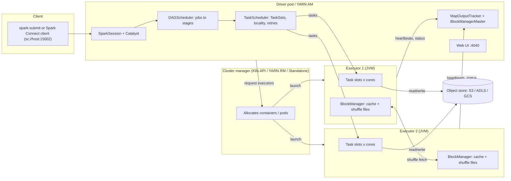
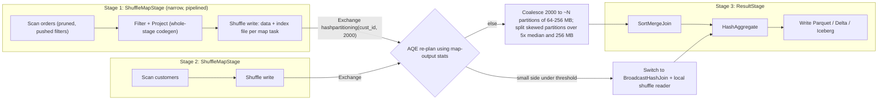
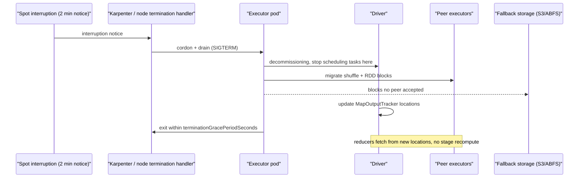

# M2 Spark at scale
> Last verified: 2026-10 · Audience: senior/staff DevOps, SRE, AI eng, NetEng, DevSecOps, architects

Builds on [C6.50 Apache Spark](../C-large-scale-architecture/C6-technology-stack.md#c650-apache-spark), which covers the basics. This file goes deeper on internals, tuning, Kubernetes, troubleshooting and managed services.

## TL;DR
- **Shape:** one **driver** (plans, schedules, tracks state) plus N **executors** (JVMs that run tasks and hold cache and shuffle files). Actions create **jobs**. Jobs split into **stages** at shuffle boundaries, and each stage runs one **task per partition**.
- **Most Spark performance problems come down to the shuffle:** too many or too few partitions, **skew**, spill and fetch failures. Fix them in this order: cut data early (pruning and pushdown), avoid shuffles (broadcast, storage-partitioned joins), size partitions to about **100–200 MB**, then let **AQE** handle the rest.
- **AQE** is on by default (`spark.sql.adaptive.enabled=true`). It coalesces small shuffle partitions toward a **64 MB** advisory size, splits **skewed** partitions (more than **5×** the median *and* more than **256 MB**), and switches sort-merge join to broadcast at runtime.
- **Memory:** unified region = `(heap − 300 MB) × 0.6`. Storage and execution borrow from each other, but execution can evict cache and not the other way round. **Overhead** is `max(384 MB, 10%)` (or **40%** for non-JVM work on K8s). The usual killers are container OOM from overhead or PySpark memory, driver OOM from `collect()` or big broadcasts, and executor OOM from skew.
- **Kubernetes:** no external shuffle service, so dynamic allocation needs **`shuffleTracking`**. Use **decommissioning** with block migration and **fallback storage (S3/ABFS)** to survive **spot** loss. Use YuniKorn or Volcano for gang scheduling. Two operators exist: Kubeflow `spark-operator` and the newer **Apache `spark-kubernetes-operator`**.
- **Versions (2026-10):** Spark **4.2.0** (2026-07-14), **4.1.x** and **4.0.x**; 3.5.x is still maintained (3.5.9). Spark 4.0 turned **ANSI mode on by default** and added **VARIANT**, the Python Data Source API and a thin Spark Connect client. 4.1 added **Declarative Pipelines**, **Real-Time Mode** streaming and VARIANT shredding. 4.2 added geospatial types, `CHANGES` CDC and Java 25.
- **Native vectorized engines** offload the physical plan to C++/Rust: **Photon** (Databricks), **Gluten+Velox** (Fabric Native Execution Engine, open source) and **DataFusion Comet**. They typically give 2–6× on scan/agg/join-heavy SQL. UDFs and unsupported ops **fall back** to the JVM.
- **Managed landscape:** AWS = EMR on EC2 / EKS / Serverless (EMR 7.14 still ships **Spark 3.5.8**) and **Glue 6.0 (Spark 4.1.1)**. Azure = **Fabric Spark (Runtime 2.0 = Spark 4.1)** and Azure Databricks. **Synapse Spark** is on its last runtime (3.5; LTS to Oct 2028, "migrate to Fabric"). **HDInsight 5.1** is stuck on Spark 3.3.

---

## M2.1 Architecture: driver, executors, cluster managers, Spark Connect
- **How it works:**
  - **Driver:** runs `main()` or the SparkSession. It hosts the **SparkContext**, the analyzer and optimizer (Catalyst), the **DAGScheduler**, the **TaskScheduler**, the BlockManagerMaster, the MapOutputTracker (which knows where shuffle outputs live) and the **Web UI on port 4040**. If the driver dies, the application dies. There is no driver HA in OSS; you rely on resubmission or the orchestrator.
  - **Executors:** long-lived JVMs with `spark.executor.cores` task slots. Each has a **BlockManager** (cache and shuffle blocks), stores shuffle files on local disk and sends heartbeats to the driver.
  - **Cluster manager** only allocates containers. Spark does all task scheduling itself.
    - **YARN:** the AM hosts the driver in `cluster` mode, has queues, and supports the **external shuffle service** (NodeManager aux service, port 7337).
    - **Kubernetes:** the driver pod creates executor pods through the API server (see M2.12).
    - **Standalone:** a simple master/worker setup.
    - **Mesos** was deprecated in 3.2 and removed in Spark 4.0 *(removal unverified in fetched docs)*.
  - **Deploy modes:** `cluster` puts the driver inside the cluster, which suits production. `client` keeps the driver on the submit host, which suits notebooks and REPLs. In client mode, executors must reach the driver host and port, so you need a headless Service on K8s.
  - **Spark Connect** (3.4+, central in 4.x): a client/server split.
    - The client sends **unresolved logical plans as protobuf over gRPC** to a server on port **15002** (`sc://host:15002`). Results stream back as **Arrow** batches.
    - Thin client: `pip install pyspark-client` (no JVM).
    - Limitations: **no RDD/SparkContext, no Py4J `_jdf` access**, and configs are session-scoped.
    - 4.1 added a JDBC driver for Connect and Spark ML on Connect GA. 4.2 added Connect in the History Server and a GetStatus API.
- **Trade-offs / when to use:**
  - Connect gives multi-tenant isolation: a client crash doesn't kill the server, and you can upgrade the server independently and debug from an IDE. Databricks serverless, Unity Catalog standard ("shared") access mode and Glue 6.0 interactive sessions are all Connect-based.
  - Client mode is convenient but makes the driver host a network and SPOF concern. Use cluster mode for scheduled jobs.
  - Fewer, fatter executors (4–5 cores, 16–32 GB) usually beat many 1-core executors (no shared broadcast or cache) and huge 30-core JVMs (GC pauses, HDFS/S3 client contention).
- **Interview angles:**
  - "Driver is a bottleneck?" Look for:
    - `collect()` / `toPandas()`
    - huge broadcasts, which are built on the driver
    - millions of tiny files, because file listing and planning happen on the driver
    - too many tasks: scheduler overhead plus the UI's in-memory state
    - `spark.driver.maxResultSize` (default **1g**) aborting the job
  - "Why Spark Connect?" Decouples client from server, gives language-agnostic clients, allows safe multi-tenancy, and is the base for serverless offerings.

## M2.2 Execution model: jobs → stages → tasks, DAG scheduler
- **How it works:**
  - **Lazy:** transformations build a plan, and each **action** (`count`, `write`, `collect`) submits a **job**.
  - The **DAGScheduler** cuts the lineage graph at **wide (shuffle) dependencies**.
    - Each **ShuffleMapStage** writes shuffle output.
    - The final **ResultStage** returns results or writes to the sink.
    - Stages are submitted when their parents finish.
  - **Narrow dependency:** each child partition depends on a bounded set of parent partitions (`map`, `filter`, `union`, co-partitioned join). These are **pipelined** inside one task, and with Tungsten they fuse into one generated function (whole-stage codegen).
  - **Wide dependency:** a child partition needs data from many parent partitions (`groupBy`, non-co-partitioned `join`, `distinct`, `repartition`, `orderBy`). This forces a **shuffle** and a new stage.
  - **TaskScheduler:** sends a TaskSet per stage, places tasks by **locality** (PROCESS_LOCAL → NODE_LOCAL → NO_PREF → RACK_LOCAL → ANY, waiting `spark.locality.wait`, default 3 s), and retries failed tasks up to `spark.task.maxFailures` = **4**.
  - **Fault tolerance:**
    - A lost executor's tasks rerun.
    - Lost **shuffle output** shows up as a **FetchFailedException**, so the scheduler **resubmits the parent map stage**, possibly recursively up the lineage.
    - Spark 4.1 added checksum-based shuffle retry. 4.2 enables **order-independent shuffle checksums** by default, which detect nondeterministic shuffle output and roll back or retry the stage.
  - **Speculation** (`spark.speculation=false` by default): relaunches tasks running slower than `speculation.multiplier` (**3**) × the median once `speculation.quantile` (**0.9**) of tasks are done. Older 3.x releases used 1.5 and 0.75. Only use it with idempotent outputs.
- **Trade-offs / when to use:**
  - Parallelism target: **2–3 tasks per core** (Spark tuning guide). Too few tasks means idle cores and huge partitions that spill. Too many means scheduler overhead (roughly 1–10 ms per task) and small files.
  - **Checkpointing** (`df.checkpoint()` / `localCheckpoint()`) truncates very long lineages, for example in iterative ML or loops. Without it, planning time and recovery cost grow every iteration.
- **Interview angles:**
  - "How many stages does `read → filter → groupBy → join(big) → write` produce?" Count the shuffles: groupBy shuffles, and the join adds one or two exchanges unless it's broadcast. Exchanges get reused where the partitioning already matches.
  - Pitfall: calling `count()` several times on the same uncached DataFrame recomputes the whole lineage each time.

## M2.3 Shuffle internals
- **How it works:**
  - **Sort-based shuffle** (`SortShuffleManager`) is the only built-in manager. Each map task writes **one data file plus one index file**, sorted or grouped by reduce partition. The number of shuffle files is M × 2, not M × R.
  - Three writers:
    - **BypassMergeSort:** used when there's no map-side aggregation and partitions ≤ `spark.shuffle.sort.bypassMergeThreshold` (**200**). It writes one file per reducer, then concatenates.
    - **Unsafe/serialized:** Tungsten binary records sorted by partition pointer.
    - **Sort:** the general path, with spills.
  - **Map side:** records are buffered in memory (`spark.shuffle.file.buffer` = 32k per file). When execution memory runs out, Spark **spills** sorted runs to local disk and merges them later. Watch "Spill (memory)" and "Spill (disk)" in the UI.
  - **Reduce side:** the reducer fetches blocks from every mapper (local disk or remote BlockManager or external shuffle service), keeping up to `spark.reducer.maxSizeInFlight` = **48m** in flight, then aggregates or sorts with possible spill.
  - **External Shuffle Service (ESS):** a NodeManager aux service on YARN (or a standalone worker daemon) serves shuffle files after the executor exits. This is required for classic dynamic allocation. It is **not available on K8s**.
  - **Push-based shuffle (Magnet, from LinkedIn):** `spark.shuffle.push.enabled=false` by default and **YARN only**. Mappers push blocks to merger nodes, so reducers read fewer, larger merged blocks, which helps with many small random reads on HDD.
  - **Remote or disaggregated shuffle:** Apache Celeborn and Apache Uniffle, the Glue/EMR **S3 Cloud Shuffle Storage plugin**, and (in Spark itself) decommission **fallback storage**. They decouple shuffle from executor lifetime, which helps with spot capacity and elastic scale-down.
- **Trade-offs / when to use:**
  - The shuffle costs serialization, compression (lz4 by default for shuffle), disk I/O, network and GC. It is the dominant cost in most jobs.
  - Remote shuffle services add a hop but make executors stateless. That's the big win on K8s with spot.
- **Interview angles:**
  - "`FetchFailedException` / `MetadataFetchFailedException` storms" usually mean:
    - executors lost, often from container OOM or spot reclamation
    - an overloaded ESS
    - local disk full on `spark.local.dir`
  - Fix: right-size memory, add decommissioning or remote shuffle, add disk (NVMe instance store or PVC), and reduce the shuffle volume itself.
  - "Shuffle write ≫ input size?" Look for an exploding join (many-to-many keys), `explode`, or a missing pre-aggregation.

## M2.4 Catalyst optimizer and Tungsten
- **How it works:**
  - **Catalyst pipeline:**
    - parsed (unresolved) logical plan
    - **Analyzer**, which resolves against the catalog
    - **Optimizer**, rule-based (predicate pushdown, column pruning, constant folding, filter/project collapse, subquery rewrite, join reordering with CBO)
    - **Physical planning**, which picks strategies such as the join algorithm
    - **code generation**
  - **CBO** (`spark.sql.cbo.enabled`) uses table and column stats from `ANALYZE TABLE ... COMPUTE STATISTICS FOR COLUMNS` for join reordering and size estimates. It is off by default in OSS. Stale stats lead to bad plans, and AQE corrects at runtime.
  - **Pushdown to sources:**
    - Parquet/ORC **predicate pushdown** using row-group min/max and bloom filters
    - **partition pruning**
    - **Dynamic Partition Pruning (DPP)**, where a filtered dimension prunes fact partitions at runtime
    - runtime bloom filters (4.1 made BloomFilter V2 the default)
  - **Tungsten:**
    - **UnsafeRow** binary format, on or off heap, which avoids Java object overhead and GC
    - cache-aware sorts
    - **whole-stage codegen**, which fuses operators into one Java function per stage, visible as `*(n)` in `EXPLAIN`
    - vectorized Parquet/ORC readers that produce columnar batches
  - Inspect with `df.explain("formatted")` or `EXPLAIN FORMATTED`, or the SQL tab DAG.
- **Trade-offs / when to use:**
  - **Python/Scala UDFs are opaque** to Catalyst: no pushdown through them, and per-row serialization for Python. Prefer built-in functions, then Arrow/pandas UDFs. Arrow-optimized Python UDFs are the default as of 4.2.
  - The RDD API bypasses Catalyst and Tungsten. Use it only for low-level control.
- **Interview angles:**
  - "Query got slower after adding a UDF on the filter column." Pushdown and partition pruning are lost. Rewrite the predicate with native expressions.
  - "How do you read a physical plan?" Read it bottom-up. Look for `Exchange` (a shuffle), `BroadcastExchange`, `SortMergeJoin` vs `BroadcastHashJoin`, `PushedFilters`, `PartitionFilters`, and the `AdaptiveSparkPlan isFinalPlan=true` node.

## M2.5 Adaptive Query Execution (AQE)
- **How it works:** after each shuffle stage (a "query stage") finishes, AQE re-optimizes the rest of the plan using **actual map-output statistics**. On by default since 3.2.

  | Feature | Config (default) | What it does |
  |---|---|---|
  | Master switch | `spark.sql.adaptive.enabled` (**true**) | Turns on runtime re-planning |
  | Coalesce partitions | `...coalescePartitions.enabled` (true); `advisoryPartitionSizeInBytes` (**64 MB**); `minPartitionSize` (1 MB); `parallelismFirst` (**true**) | Merges small contiguous shuffle partitions. With `parallelismFirst=true` it keeps default-parallelism worth of partitions and ignores the advisory size. **Set it to false on busy clusters** to honour 64 MB+ |
  | Initial partitions | `...coalescePartitions.initialPartitionNum` (none → `spark.sql.shuffle.partitions` = 200) | Set it high (e.g. 2000–10000) and let AQE coalesce down |
  | Skew join | `...skewJoin.enabled` (true); `skewedPartitionFactor` (**5.0**); `skewedPartitionThresholdInBytes` (**256 MB**) | Splits a skewed partition into sub-partitions and replicates the other side's matching partition. Applies to **sort-merge** and shuffled-hash joins |
  | Rebalance skew | `optimizeSkewsInRebalancePartitions.enabled` (true) | Splits skew in `REBALANCE` hints / writes |
  | Dynamic join switch | `spark.sql.adaptive.autoBroadcastJoinThreshold` (defaults to `autoBroadcastJoinThreshold`, 10 MB) | Converts SMJ → **broadcast hash join** when one side turns out small at runtime |
  | Shuffled hash join switch | `maxShuffledHashJoinLocalMapThreshold` (**0** = off) | Converts SMJ → **shuffled hash join** when every partition ≤ threshold, which avoids the sort |
  | Local shuffle reader | `localShuffleReader.enabled` (true) | After a BHJ conversion, reads shuffle files locally, so there's no network |

- **Trade-offs / when to use:**
  - AQE only acts at **shuffle boundaries**. It can't fix skew in a stage with no shuffle, such as a skewed **source** file layout or `mapPartitions`.
  - It also can't fix skew in **aggregations**. Skew join handling covers joins only, so use salting or two-phase aggregation there.
  - Converting SMJ to BHJ at runtime still pays for the shuffle that was already written. A static broadcast (stats or hint) avoids it entirely.
- **Interview angles:**
  - "Do you still tune `spark.sql.shuffle.partitions`?" Yes, but differently: set an **upper bound** (initialPartitionNum) and an **advisory size** (64–256 MB), and turn off `parallelismFirst` for throughput jobs.
  - "AQE skew didn't kick in?" Possible reasons:
    - the partition was under 256 MB, or under 5× the median
    - it was an aggregation, not a join
    - the join type can't split that side (e.g. the build side of a left outer join)
    - `isFinalPlan` wasn't reached because of caching or a non-AQE path

## M2.6 Join strategies
| Strategy | When chosen | Cost profile | Gotchas |
|---|---|---|---|
| **Broadcast hash join (BHJ)** | One side ≤ `spark.sql.autoBroadcastJoinThreshold` (**10 MB**, -1 = off), hint `BROADCAST`/`MAPJOIN`, or AQE at runtime | No shuffle of the big side. The small side is collected **to the driver**, then broadcast to each executor | Driver OOM, `spark.sql.broadcastTimeout` (**300 s**), size estimates are on *serialized/compressed* data and the in-memory hash table can be 5–10× bigger. Can't broadcast the preserved side of an outer join (e.g. the left side of a LEFT JOIN) |
| **Shuffle hash join (SHJ)** | Hint `SHUFFLE_HASH`, AQE local-map threshold, or `preferSortMergeJoin=false` | Shuffle both sides, build a hash table per partition, **no sort** | The build partition must fit in memory (spill support improved in 3.x). Risky with skew |
| **Sort-merge join (SMJ)** | Default for large equi-joins | Shuffle and **sort** both sides, then stream-merge. Scales, spills well | Sort cost. Skew causes stragglers, so AQE skew join targets SMJ |
| **Broadcast nested loop / Cartesian** | Non-equi joins, or no join keys | O(N×M) | Usually a bug, such as a missing join key |
| **Storage-partitioned join (SPJ) / bucketed join** | Both sides bucketed or partitioned identically on the join keys (Hive buckets or DSv2 tables such as Iceberg) | **No shuffle at all** | Needs matching bucket counts and transforms. `spark.sql.sources.v2.bucketing.*` relaxations exist |
- **Hint priority:** BROADCAST > MERGE > SHUFFLE_HASH > SHUFFLE_REPLICATE_NL.
- **Interview angles:**
  - "Join of 2 TB fact with a 50 MB dim is slow." Raise the broadcast threshold to about 100–200 MB or add a `BROADCAST` hint. Check driver memory. Confirm `BroadcastHashJoin` with `BroadcastExchange` in the plan.
  - "Repeated joins on the same key across jobs?" Bucket or cluster the tables (Iceberg bucket transforms, Delta liquid clustering) to get SPJ.

## M2.7 Partitioning and file sizing
- **How it works:**
  - **Input partitions:** file sources split by `spark.sql.files.maxPartitionBytes` = **128 MB** and pack small files using `openCostInBytes` = **4 MB**. Splittable formats (Parquet/ORC by row group, uncompressed or bzip2 text) split. **gzip CSV/JSON doesn't split**, so you get one task per file.
  - **Shuffle partitions:** `spark.sql.shuffle.partitions` = **200** (or AQE coalesced). In 4.0, `spark.sql.maxSinglePartitionBytes` changed to **128m**.
  - **`repartition(n[, cols])`:** a **full shuffle** that gives even partitions or hash partitioning by key. Use it to increase parallelism or co-locate keys before a write.
  - **`coalesce(n)`:** merges partitions **without a shuffle**, which is a narrow dependency.
    - Pitfall: `coalesce(1)` **collapses upstream parallelism**, because the whole preceding stage runs with n tasks. Use `repartition` if the upstream work is heavy.
  - **`REBALANCE` hint / `repartitionByRange`:** AQE-aware rebalancing for writes, and range partitioning for sorted output.
  - **Output files:** each write task writes ≥1 file per output partition value it sees. With `partitionBy(date, country)` and 2000 tasks, you can get **tasks × partition values** files: the **small-file explosion**.
    - Fix with `repartition(partitionCols)` before the write, `maxRecordsPerFile`, table-format **optimized writes / auto-compaction** (Delta, Iceberg), or post-write `OPTIMIZE` / `rewrite_data_files`.
- **Sizing targets:**
  - In-memory shuffle partition: about **100–200 MB**.
  - Output files: **128 MB–1 GB** of Parquet.
  - Table partitions (directories): **≥1 GB each**. Don't partition by high-cardinality columns. Prefer clustering or Z-order (see [M1](M1-lakehouse-table-formats.md)).
- **Interview angles:**
  - Formula: `shuffle partitions ≈ shuffle stage input bytes / 128 MB`, rounded up to a multiple of total cores.
  - "Job writes 500k tiny files." Rule it out in this order: the partitionBy cardinality, the shuffle partitions count, a missing repartition before the write, and whether streaming micro-batches are too frequent.
  - Ties to [B5 partitioning](../B-database-engineering/B5-database-partitioning.md) and [B6 sharding](../B-database-engineering/B6-database-sharding.md) (hot keys are the same problem).

## M2.8 Skew diagnosis and fixes
- **Diagnosis:**
  - The **Stages tab task summary** shows max ≫ 75th percentile for duration, shuffle read size or records. Typical: median 30 s, max 40 min.
  - One task spills heavily, and the stage sits at "199/200".
  - Find the key: `df.groupBy(key).count().orderBy(desc("count"))`. Usual suspects are NULL or empty keys, a default "unknown" ID, or one giant customer or tenant.
- **Fixes (cheapest first):**
  1. **Filter or route junk keys** (NULLs that won't match anyway). Handle NULL-key rows separately and union them back.
  2. **Broadcast** the smaller side if it fits, since BHJ is immune to skew on the big side.
  3. **AQE skew join**: on by default. Lower `skewedPartitionThresholdInBytes` or `skewedPartitionFactor` if the skew is moderate.
  4. **Salting:** append a random suffix 0..N-1 to the hot key on the big side, **explode** the small side N times, join on (key, salt). Only salt the hot keys (an isolated-key split) to limit the replication blow-up.
  5. **Two-phase aggregation** for skewed `groupBy`: aggregate on (key, salt) first, then on key. Only valid for associative aggregates. `count distinct` needs approximate sketches (HLL / Theta / KLL, built-in since 4.1).
  6. **Source-side skew:** repartition after the read, or fix the upstream layout (one 10 GB gzip file means one task).
- **Interview angles:** "AQE is on but one task still runs for an hour." The skew is in an aggregation or window (AQE doesn't split those), it's under the thresholds, or it's an exploding many-to-many join. Fix with salting or two-phase aggregation, or change the data model.

## M2.9 Memory model, spill and OOM causes
- **Executor container layout** (YARN container or K8s pod limit):

  | Region | Size | Used for |
  |---|---|---|
  | **Reserved** | 300 MB (fixed) | Spark internals |
  | **Unified (M)** | `(heap − 300 MB) × spark.memory.fraction` (**0.6**) | **Execution** (shuffle, join hash tables, sort, agg buffers) plus **Storage** (cache, broadcast). Protected storage R = M × `storageFraction` (**0.5**) |
  | **User memory** | the remaining 40% of (heap − 300 MB) | UDF objects, user data structures, RDD metadata |
  | **Overhead** | `spark.executor.memoryOverhead` = max(**384 MB**, **0.10** × heap; **0.40** for non-JVM jobs on K8s) | JVM metaspace, thread stacks, NIO/Netty direct buffers, native libraries |
  | **Off-heap** | `spark.memory.offHeap.size` (0; required by Gluten/Comet) | Tungsten off-heap pages. Added to the container request |
  | **PySpark** | `spark.executor.pyspark.memory` (unset means unbounded and counted inside overhead) | Python worker processes (pandas/Arrow UDFs) |
- **Borrowing rules:** execution can **evict cached blocks** down to R. Storage **can never evict execution**. Either side borrows free space from the other.
- **Worked example:** `spark.executor.memory=16g`
  - unified ≈ (16384 − 300) × 0.6 ≈ **9.6 GB**, of which ≈4.8 GB is protected storage
  - user ≈ 6.4 GB
  - overhead = max(384 MB, 1.6 GB) = **1.6 GB**, so the container or pod request is ≈ **17.6 GiB** plus any off-heap or PySpark memory
  - per-task execution memory ≈ unified / concurrent tasks. With 5 cores that's about 1.9 GB each.
- **Spill:** when a task can't acquire execution memory, sorters and aggregators write sorted runs to `spark.local.dir`. Spill is slow but survivable. **OOM** happens when a single record or structure can't spill: a huge row, a broadcast hash table, or a SHJ build side.
- **OOM taxonomy (say these in interviews):**

  | Symptom | Cause | Fix |
  |---|---|---|
  | `Container killed by YARN for exceeding memory limits` / K8s **OOMKilled (exit 137)** | Off-heap or native usage exceeded the overhead (Netty, Python workers, Arrow, native engines) | Raise `memoryOverhead` (or the factor), set `pyspark.memory`, cut executor cores |
  | `java.lang.OutOfMemoryError: Java heap space` on an **executor** | Skewed partition, oversized partitions, too many cores sharing the heap, explode or collect_list on hot keys | More partitions, fix skew, fewer cores per executor, more heap |
  | Driver OOM / `maxResultSize` exceeded | `collect`/`toPandas`, broadcast build, millions of tasks or files tracked, large accumulators | Write to storage instead, cap broadcasts, raise `spark.driver.memory`, compact files |
  | `GC overhead limit exceeded` / long GC in the UI | Object-heavy RDD/UDF code, deserialized cache | Use DataFrames, serialized cache, G1GC (the JDK 17/21 default), smaller heaps |
- **Interview angles:**
  - "Should I give executors 200 GB heaps?" No. Very large heaps mean long GC pauses. 32–64 GB heaps with 4–8 cores are a common upper range. Below 32 GB you also keep compressed oops.
  - "Pod OOMKilled but the Spark UI shows the heap fine?" It's native memory: overhead, Python, or off-heap. Linux cgroup kills don't show in JVM metrics. See [A3 memory management](../A-operating-systems/A3-memory-management.md).

## M2.10 Caching and persistence
- **How it works:**
  - `df.cache()` = `persist(MEMORY_AND_DISK)` for DataFrames, stored in the **columnar compressed in-memory format** (`spark.sql.inMemoryColumnarStorage.compressed=true`, batch size 10k rows). `rdd.cache()` = `MEMORY_ONLY`.
  - Caching is **lazy**: it's materialized by the first action. It's evicted LRU when storage space is exhausted and can be reclaimed by execution down to R.
  - Storage levels: MEMORY_ONLY, MEMORY_AND_DISK, *_SER, DISK_ONLY, the `_2` replicated variants, and OFF_HEAP.
  - Release with `unpersist()`. `spark.catalog.clearCache()` drops all cached data.
  - Platform caches are different from Spark cache:
    - **Databricks disk cache** (formerly Delta cache): automatic local SSD copies of remote Parquet.
    - **Fabric intelligent cache.**
    - Both are transparent and don't use executor heap.
- **Trade-offs / when to use:**
  - Cache only when a DataFrame is **reused ≥2 times** and is **expensive to recompute** (iterative ML, multi-output branching). Otherwise you just steal execution memory and cause spill.
  - Caching blocks executor removal under dynamic allocation, because `cachedExecutorIdleTimeout` defaults to infinity.
  - Prefer **checkpoint or a write to a table** for long lineages or cross-job reuse. A cache dies with the application.
- **Interview angles:** "Cached and the job got slower?" The cache displaced execution memory, causing spill. Or the cache was never used because the plan differed (cache matching is on the analyzed plan). Or the cache was only partially materialized.

## M2.11 Dynamic allocation and autoscaling
- **How it works:**
  - `spark.dynamicAllocation.enabled=false` in OSS by default. **EMR, Dataproc and Databricks turn it on.**
  - **Scale-up:** happens when tasks are backlogged for `schedulerBacklogTimeout` = **1 s**, with exponential ramp-up per round.
  - **Scale-down:** removes executors idle for `executorIdleTimeout` = **60 s**. Executors holding cache use `cachedExecutorIdleTimeout`, which defaults to **infinity**.
  - Bounds come from `minExecutors` (0), `maxExecutors` (unbounded, so always set it) and `initialExecutors`.
  - **Shuffle problem:** removing an executor loses its shuffle files. Three ways to handle it:
    - **ESS** on YARN or standalone (`spark.shuffle.service.enabled=true`)
    - **Shuffle tracking** (`spark.dynamicAllocation.shuffleTracking.enabled`, default false; set true on K8s), which keeps executors that hold live shuffle data until `shuffleTracking.timeout`
    - **Decommissioning with migration**, or remote shuffle
  - **Cluster-level autoscaling is separate.** EMR managed scaling, the K8s Cluster Autoscaler or Karpenter, and Databricks autoscaling add or remove *nodes*. Spark dynamic allocation adds or removes *executors*. You need both.
- **Trade-offs / when to use:**
  - Good for shared clusters, notebooks and spiky stages.
  - Bad for latency-sensitive streaming (scale churn) and jobs with a long shuffle-heavy tail. Shuffle tracking keeps nodes alive, so savings shrink.
  - EMR managed scaling **expects dynamic allocation ON**. Disabling it can make the cluster scale to max. EMR scale-down is **shuffle-aware** (5.34+/6.4+) and keeps nodes running the YARN AM.
- **Interview angles:** "Dynamic allocation on K8s isn't releasing executors." Shuffle tracking is holding them (lower `shuffleTracking.timeout`), cached data has an infinite timeout, or minExecutors is too high.

## M2.12 Spark on Kubernetes (operator, decommissioning, spot)
- **How it works:**
  - `spark-submit --master k8s://https://<api>:443 --deploy-mode cluster` creates a **driver pod**. The driver then creates executor pods with an **ownerReference**, so deleting the driver garbage-collects the executors.
  - Executor pods are allocated in batches: `spark.kubernetes.allocation.batch.size` = **5** by default *(the fetched K8s page example showed 20 — verify per version)*, with `batch.delay` = 1 s.
  - Images: build with `bin/docker-image-tool.sh`, or use the `apache/spark:<ver>` image. The **4.2 K8s image is based on Java 25 JRE.**
  - **RBAC:** the driver's ServiceAccount (`spark.kubernetes.authenticate.driver.serviceAccountName`) needs create/delete on pods, services and configmaps in its namespace. **Use a namespaced Role, not the docs' `clusterrole=edit` quick-start.**
  - **Pod templates** (`spark.kubernetes.{driver,executor}.podTemplateFile`) handle tolerations, nodeSelectors, sidecars and init containers. Spark overrides name, namespace, labels, container image and resources.
  - **Local storage:** shuffle and spill go to `emptyDir` by default (node disk, or tmpfs with `spark.kubernetes.local.dirs.tmpfs=true`). For big shuffles, use NVMe hostPath or **on-demand PVCs** (`claimName=OnDemand`) with driver-owned **PVC reuse** (`ownPersistentVolumeClaim`, `reusePersistentVolumeClaim`), so a replacement executor re-attaches the shuffle PVC.
  - **Batch schedulers:** **YuniKorn** (queues, gang scheduling, `spark.kubernetes.scheduler.name=yunikorn`) or **Volcano** (PodGroup). Gang scheduling avoids deadlocks where many drivers start and starve their own executors.
  - **Operators:**
    - **Kubeflow `spark-operator`** (formerly GCP's): the `SparkApplication` and `ScheduledSparkApplication` CRDs, the most widely deployed.
    - **Apache `spark-kubernetes-operator`** (an official Spark subproject): the `SparkApplication` and **`SparkCluster`** CRDs, Helm `spark/spark-kubernetes-operator`, Java 21+, YuniKorn integration.
    - **EMR on EKS** has its own `StartJobRun` API plus support for the Spark operator.
- **Decommissioning (spot or node drain):**
  - `spark.decommission.enabled=true` (default false). On SIGPWR or pod termination, the executor stops accepting tasks.
  - `spark.storage.decommission.enabled=true` with `shuffleBlocks.enabled` and `rddBlocks.enabled` (both default true once storage decommission is on) **migrates shuffle and cache blocks** to peers.
  - `spark.storage.decommission.fallbackStorage.path=s3a://bucket/fallback/` is used when no peer can take the blocks.
  - Spot 2-minute warning (AWS) or ~30 s eviction (Azure Spot) → node termination handler or Karpenter **cordons and drains** → pod `terminationGracePeriodSeconds` must cover the migration.
- **4.x K8s additions:**
  - `spark.kubernetes.allocation.maximum` (4.1)
  - ExecutorResizePlugin / ExecutorPVCResizePlugin, NetworkPolicy for executors, use of the `patch` API, and avoiding cluster-wide LIST calls (4.2)
  - Resource Manager API marked Stable (4.2)
- **Trade-offs / when to use:** compared with YARN:

  | | Kubernetes | YARN (EMR on EC2 / HDInsight / Dataproc) |
  |---|---|---|
  | Strengths | Container isolation, per-job images and dependencies, shared platform with services, GitOps, Karpenter bin-packing | Mature ESS, push shuffle, queue fairness, data locality with HDFS |
  | Weaknesses | No ESS, weaker built-in queueing (add YuniKorn), API-server pressure from thousands of pods, startup latency from image pulls | — |

- **Interview angles:**
  - "Run Spark on spot safely":
    - **driver on on-demand** (nodeSelector or a separate node pool)
    - executors on spot across **diversified instance types and AZs**
    - decommissioning with fallback storage, or a remote shuffle service (Celeborn)
    - shuffle tracking
    - idempotent sinks (table formats with atomic commits)
    - `spark.task.maxFailures` and stage retry budgets
  - "Many concurrent jobs thrash the cluster." Use YuniKorn queues with gang scheduling, ResourceQuotas per namespace, priority classes for drivers, and Karpenter consolidation tuned so it doesn't evict running executors (`do-not-disrupt` annotation).

## M2.13 Spark UI troubleshooting
- **Tabs and what to read:**
  - **Jobs:** job timeline and failed jobs. The 4.2 UI adds dark mode and a job timeline view.
  - **Stages:** the **task summary percentiles** (duration, GC time, shuffle read/write, spill memory/disk, input size). The skew signature is a max far above p75. The **Event Timeline** shows scheduler delay, deserialization and executor compute.
  - **SQL / DataFrame:** the physical plan graph with per-operator metrics (rows output, data size, spill, broadcast time, `number of partitions` before and after AQE). 4.2 adds searchable and zoomable plans with side-by-side comparison.
  - **Executors:** GC time (red if above 10% of task time), failed tasks, storage memory, shuffle totals and **thread or heap dumps**. Lost executors appear with exit reasons.
  - **Storage:** cached fraction and size per RDD or DataFrame.
  - **Environment:** the effective configs. Always check what the platform actually set.
- **History Server:** reads the event log (`spark.eventLog.enabled=true`, `spark.eventLog.dir=s3a://…`). Use rolling event logs (`spark.eventLog.rolling.enabled`) for long apps. 4.2 supports multiple log directories and on-demand loading. Managed UIs: EMR persistent app UI, Glue Spark UI, the Fabric monitoring hub with **Spark Advisor**, and the Databricks query profile.
- **Symptom → cause map:**

  | Symptom in UI | Likely cause |
  |---|---|
  | One task ≫ others in a stage | Skew (M2.8), or one non-splittable file |
  | High scheduler delay, thousands of 50 ms tasks | Too many partitions or small files |
  | Large Spill (disk) | Partitions too big, or too many cores per memory |
  | High GC time | Object-heavy code, cache pressure, heap too big |
  | Stage retried with FetchFailed | Executor loss (OOM or spot), disk full |
  | Long gaps with no tasks | Driver-side work: listing files, planning, broadcast build, Python driver code |
  | `BroadcastExchange` timeout | The broadcast side is bigger than estimated |
- **Interview angles:** "A walk-through of a slow job":
  1. Find the longest stage.
  2. Is it compute-bound, with even tasks? Then scale out or use a native engine.
  3. Is it skewed? See M2.8.
  4. Is it I/O-bound? Check pushdown and pruning in the SQL tab.
  5. Is there spill? Repartition or add memory.
  6. Are there gaps? It's driver-bound.

  Ties to [J3 observability](../J-sre/J3-observability.md).

## M2.14 Spark 4.x features (version-verified)
| Release | Date | Highlights |
|---|---|---|
| **4.0.0** | 2025-05-23 (4.0.4 2026-07-15) | **ANSI SQL mode ON by default** (`spark.sql.ansi.enabled=true`: overflow and invalid-cast raise errors instead of returning NULL). JDK **17** default, Scala **2.13** only. **VARIANT** type (semi-structured JSON-like, `parse_json`, `variant_get`). String **collations**. **SQL UDFs**, **pipe syntax** (`FROM t |> WHERE … |> AGGREGATE …`), session variables. **Python Data Source API** (custom batch and streaming sources in pure Python). Polymorphic Python UDTFs. Spark Connect parity plus the thin **`pyspark-client`**. **State API v2** (`transformWithState`) and the state data source reader. Structured JSON logging. ORC default codec → **zstd**. `CREATE TABLE` without `USING` → `spark.sql.sources.default` (not Hive) |
| **4.1.0** | 2025-12-16 (4.1.3 2026-07-15) | **Spark Declarative Pipelines (SDP)**: open-sourced DLT-style declarative datasets and flows. **Structured Streaming Real-Time Mode** (sub-second, ms-level for stateless). **SQL scripting GA**. **VARIANT GA with shredding** (Parquet logical type). Arrow-native Python UDF/UDTF decorators. Python data source filter pushdown. KLL/Theta sketches, `approx_top_k`. JDBC driver for Spark Connect. Python ≥ **3.10** |
| **4.2.0** | 2026-07-14 | **GEOMETRY/GEOGRAPHY** types with `ST_*` functions. SQL **`CHANGES`** clause (CDC reads) plus Auto CDC (SCD1) in SDP. `NEAREST BY` top-k join. **Metric views** (`CREATE VIEW … WITH METRICS`). `QUALIFY`. `INSERT … WITH SCHEMA EVOLUTION`. Arrow-optimized Python UDFs on by default. **Shuffle order-independent checksums on** by default. **Java 25** support (K8s image on 25-jre). UI modernization. History Server multi-dir |
| 3.5.x | 3.5.9 2026-07-16 | Still maintained; the LTS line most managed services still run (EMR 7.14, Glue 5.1, Synapse 3.5, Fabric RT 1.3) |
- **Migration gotchas (3.5 → 4.x):**
  - **ANSI on** breaks pipelines that relied on silent NULLs: bad casts, divide-by-zero, integer overflow. Use the `try_*` functions (`try_cast`, `try_divide`, `try_to_date`) or set `spark.sql.ansi.enabled=false` as a temporary escape hatch.
  - Scala 2.12 JARs won't load.
  - JDBC type mappings changed (MySQL, Postgres timestamps).
  - Hive-default table creation is gone.
  - **Fabric Runtime 2.0**, **Glue 6.0** and **Databricks** are the main managed paths to 4.x today. Glue 6.0 also **removes EMRFS (S3A only) and AWS SDK v1**.
- **Interview angles:** "What changed in Spark 4 that bites production?" Name ANSI mode, Scala 2.13 / JDK 17, and the end of Mesos. "Why does VARIANT matter?" It stores semi-structured data in a binary encoding with shredding, which avoids string JSON parsing on every read and keeps the schema flexible. It's also in the Iceberg v3 and Delta 4 specs.

## M2.15 Vectorized native engines (Photon, Velox/Gluten, Comet)
| Engine | Who / where | How it plugs in | Notes |
|---|---|---|---|
| **Photon** | Databricks (proprietary C++) | Replaces the physical operators. On by default for SQL warehouses and serverless, and toggleable on classic jobs and all-purpose compute | Supports scan/filter/project, hash agg/join/shuffle, sort, window, Delta/Parquet writes. **Not** UDFs, RDD or Dataset APIs, or stateful streaming. Queries under ~2 s see little gain. Photon compute bills DBUs at a **different (higher) rate**, so net savings depend on the speed-up |
| **Apache Gluten + Velox** | OSS (Apache TLP; Velox from Meta). Powers the **Fabric Native Execution Engine** | `spark.plugins=org.apache.gluten.GlutenPlugin`, **off-heap required** (`spark.memory.offHeap.enabled=true`, size), `ColumnarShuffleManager` | ClickHouse is an alternative backend. Fabric reports **up to 6× TPC-DS 1TB** and ~83% compute savings, and toggles it per app with `spark.native.enabled`. Falls back to the JVM per operator. Fabric Spark Advisor flags fallbacks |
| **Apache DataFusion Comet** | OSS (Apple-originated, Rust, Arrow DataFusion) | `spark.plugins=org.apache.spark.CometPlugin`, `CometShuffleManager`, off-heap | Aims for 100% Spark semantic compatibility. Unsupported expressions fall back |
| Others (vendor) | EMR runtime for Spark, Dataproc **Lightning Engine**, Cloudera / other | Built into the managed runtime | EMR's optimized runtime is JVM-level (AQE/DPP/bloom tweaks), not a full native engine *(unverified detail)* |
- **Trade-offs:**
  - **Row↔columnar transitions** at fallback boundaries can erase the gains. A Python UDF in the middle of a plan splits it into native-JVM-native.
  - Memory planning shifts to **off-heap**: size the pod and container to cover it.
  - Results must stay semantically identical. Engines have ANSI and float edge-case differences, so validate with shadow runs.
- **Interview angles:** "Would you turn on Photon or Gluten everywhere?" Turn it on for SQL/DataFrame-heavy ETL and BI. Measure the **cost per job** (DBU multiplier vs runtime). Turn it off for UDF-heavy, RDD or stateful streaming jobs. Check the fallback percentage in the plan.

## M2.16 Cost tuning
- **Levers, highest ROI first:**
  1. **Read less:** partition and file pruning, column pruning (Parquet/ORC, never CSV/JSON at scale), table-format stats, clustering/Z-order, DPP. Compact small files.
  2. **Shuffle less:** broadcast small dims, SPJ/bucketing, pre-aggregate, avoid `distinct` and `orderBy` unless needed, use `approx_count_distinct`.
  3. **Right-size partitions** (AQE advisory 128–256 MB, `parallelismFirst=false`) and **executors** (4–5 cores; memory per core about 4–8 GB; use Graviton/ARM or AMD where the engine supports it).
  4. **Elasticity:** dynamic allocation plus cluster autoscaling, auto-terminate idle clusters, **job clusters rather than all-purpose** (Databricks jobs compute is cheaper per DBU), EMR Serverless or Glue for spiky, infrequent jobs.
  5. **Spot / preemptible** for executors (60–90% off) with decommissioning or remote shuffle. Keep the driver and core/HDFS nodes on-demand. EMR **instance fleets** support up to 5 types per fleet (30 with allocation strategy) *(30 unverified)* and an on-demand cap (`MaximumOnDemandCapacityUnits`) in managed scaling.
  6. **Native engines** when the speed-up beats the price multiplier.
  7. **Kill bad patterns:** `collect`, Python row UDFs, unbounded caching, repeated recomputation, streaming triggers that are too frequent (small files plus constant compute).
- **Pricing shapes to know:**
  - **EMR on EC2:** EC2 price plus an EMR per-instance-second uplift.
  - **EMR on EKS:** an EMR vCPU/GB uplift on top of the EKS/EC2 cost.
  - **EMR Serverless:** per vCPU-second, GB-second and extra ephemeral storage, with optional **pre-initialized capacity** (a warm pool that's billed while up) and application-level max-capacity limits.
  - **Glue:** per **DPU-hour** (1 DPU = 4 vCPU / 16 GB), per-second billing with a 1-minute minimum, worker types G.1X/G.2X/G.4X/G.8X (G.025X for streaming), **Flex** execution for non-urgent jobs at a lower rate *(worker list and minimum from memory — verify on the Glue pricing page)*.
  - **Fabric:** capacity **CU** consumption from the F-SKU (Spark vCore ≈ 2 per CU *(unverified ratio)*), with bursting and smoothing.
  - **Databricks:** **DBU** × rate by compute type (jobs < all-purpose; serverless bundles the VM).
  - **Dataproc:** VM plus a Dataproc premium. Serverless is billed in **DCU**.
- **Interview angles:**
  - "Cut a nightly Spark bill by 50%." Profile the top 10 jobs by cost and identify the dominant stage. Then compact the inputs, broadcast dims, fix skew, move executors to spot with decommissioning, switch to job clusters or serverless, and trial the native engine.
  - Put guardrails in place: cluster policies, max executors, auto-termination, cost tags. Ties to [J5 capacity planning](../J-sre/J5-capacity-planning-load-testing.md).

---

## Diagrams

### Driver / executor architecture (K8s or YARN)


### Stages, shuffle and AQE


### Spot executor decommissioning on Kubernetes


---

## Cloud mapping: AWS vs Azure
| Capability | AWS | Azure | Role it plays | Key differences | Alternatives |
|---|---|---|---|---|---|
| Managed Spark on VMs (cluster) | **EMR on EC2** (7.14: Spark 3.5.8) | **HDInsight 5.1** (Spark **3.3**, standard support) / **Azure Databricks** classic compute | Long-running or transient YARN clusters with full control | EMR is current and versioned per release label. HDInsight lags (no Spark 3.5/4) and suits lift-and-shift only | Dataproc (GCP), Databricks |
| Spark on your Kubernetes | **EMR on EKS** (virtual clusters, `StartJobRun`, Spark operator) | No first-party managed equivalent (HDInsight on AKS was retired *(unverified date)*). Self-run Spark/Kubeflow/Apache operator on **AKS** | Share an EKS/AKS platform with services. Per-job images | EMR on EKS adds the EMR runtime plus a per-vCPU/GB uplift. On AKS you own the operator and images | Spark operator on any K8s, Dataproc on GKE |
| Serverless Spark jobs | **EMR Serverless** (apps, workers, pre-initialized capacity) | **Fabric Spark** (Spark Job Definitions, starter pools, capacity CU) / Azure Databricks **serverless** | No cluster ops. Pay per use | EMR Serverless bills per vCPU/GB-second. Fabric bills against a pre-purchased **capacity** (F-SKU) with smoothing | Dataproc Serverless (Managed Service for Apache Spark), Databricks serverless |
| Serverless ETL with catalog | **AWS Glue** (5.1 default = Spark 3.5.6; **6.0 = Spark 4.1.1**, DPU-hour) | **Fabric Data Engineering** (Runtime **2.0 = Spark 4.1**, Delta 4.2) / **Synapse Spark pools** (Runtime 3.5) | Catalog-integrated ETL, notebooks, jobs | Glue integrates with the Glue Data Catalog and Lake Formation FGAC. Fabric is OneLake/Delta-first with V-Order and the Native Execution Engine. **Synapse 3.5 goes LTS on 2027-11-01 and reaches EOS on 2028-10-31, and Microsoft recommends migrating to Fabric** | Databricks Lakeflow, dbt + warehouse |
| Lakehouse platform (Spark + governance) | **Databricks on AWS** / SageMaker Unified Studio + EMR/Glue | **Azure Databricks** (first-party Azure service) / Fabric | Unified notebooks, jobs, catalog (Unity Catalog), Photon | Azure Databricks is billed through Azure with Entra ID integration. On AWS it's a Marketplace or direct contract | Snowflake (Snowpark, not Spark), Dataproc + BigLake |
| Native acceleration | EMR runtime optimizations; Databricks Photon | **Fabric Native Execution Engine (Gluten+Velox)**; Azure Databricks Photon | Vectorized execution | Fabric's engine is OSS-based and has no separate meter. Photon carries a DBU multiplier | Gluten/Comet self-managed, Dataproc Lightning Engine |
| Shuffle durability / spot | EMR shuffle-aware managed scaling, node labels (ON_DEMAND/SPOT for AMs), Glue S3 shuffle plugin | Databricks spot with fallback; Fabric manages it internally | Survive scale-down and spot loss | EMR 7.x can label by market type. Azure Spot VMs give ~30 s eviction notice vs AWS's 2 min | Celeborn/Uniffle remote shuffle |

- **EMR on EC2:**
  - Primary, core (HDFS plus YARN) and task (compute-only) node types.
  - **Managed scaling** (min/max units, on-demand cap, core max) works with YARN apps only. It is **shuffle-aware** and keeps AM nodes.
  - Keep EBS below 90%. EMR 7.x supports node labels by market type, so the AM can stay on ON_DEMAND.
  - Spark 4 is **not** in the EMR 7.x release line as of 7.14 (an EMR 8.x / Spark 4 line is *unverified*).
- **EMR on EKS:** a namespace is registered as a **virtual cluster**. Jobs are submitted with `aws emr-containers start-job-run` using EMR images and pod templates. Works with Karpenter and Fargate (Fargate has no spot and no local NVMe).
- **EMR Serverless:**
  - Regional and multi-AZ. Each application pins a release label and engine.
  - **Workers** autoscale per stage. **Pre-initialized capacity** gives a warm start in seconds.
  - Per-job **runtime IAM role**. Application-level maximum capacity acts as a cost guardrail.
- **Glue:**
  - Glue 6.0 brings Spark 4.1.1, Python 3.13, Iceberg v3 (VARIANT, deletion vectors), SDP, Real-Time Mode, and Spark Connect for interactive sessions. It **drops EMRFS and SDK v1**.
  - Glue **0.9/1.0/2.0 reached end of life on 2026-04-01**.
  - Glue 5.0+ uses **Spark-native Lake Formation FGAC**. The old GlueContext/DynamicFrame table-level enforcement isn't supported there.
- **Fabric Spark:**
  - **Runtime 2.0 (Spark 4.1, Java 21, Delta 4.2) is GA. Runtime 1.3 (Spark 3.5) is EOSA**, but the docs say new workspaces still default to 1.3, so set the workspace runtime or Environment item explicitly.
  - Includes about 100 built-in optimizations, an intelligent cache, **V-Order** Delta writes and starter pools for fast session start.
- **Synapse Spark:** in maintenance. Runtime 3.4 was disabled on 2026-03-31, and 3.5 is the last runtime. For new work, choose Fabric or Azure Databricks.
- **HDInsight:** 4.0/5.0 retired 2025-03-31. **5.1 (Spark 3.3)** has no announced retirement date, but there's no newer Spark either. Treat it as legacy.
- **Alternatives:**
  - **Databricks** (both clouds and GCP): Photon, Unity Catalog, serverless, Lakeflow. See [M3](M3-databricks-platform.md).
  - **Google Dataproc / Managed Service for Apache Spark (serverless):** DCU billing, Lightning Engine.
  - **Self-managed on K8s:** the Apache or Kubeflow operator with YuniKorn and Celeborn.
  - For SQL-only analytics, a warehouse such as Snowflake, BigQuery, Redshift or Fabric Warehouse ([M7](M7-data-warehouses.md)) is often cheaper than Spark.

---

## Hands-on (optional)

### spark-submit to Kubernetes (cluster mode, spot-safe, dynamic allocation)
```bash
# One-time RBAC: namespaced, least privilege (not cluster-wide edit)
kubectl create namespace spark-jobs
kubectl -n spark-jobs create serviceaccount spark
kubectl -n spark-jobs create role spark-driver \
  --verb=get,list,watch,create,delete,deletecollection,patch \
  --resource=pods,services,configmaps,persistentvolumeclaims
kubectl -n spark-jobs create rolebinding spark-driver \
  --role=spark-driver --serviceaccount=spark-jobs:spark

API=$(kubectl config view --minify -o jsonpath='{.clusters[0].cluster.server}')

spark-submit \
  --master "k8s://${API}" \
  --deploy-mode cluster \
  --name nightly-orders-etl \
  --conf spark.kubernetes.namespace=spark-jobs \
  --conf spark.kubernetes.authenticate.driver.serviceAccountName=spark \
  --conf spark.kubernetes.container.image=apache/spark:4.0.1 \
  --conf spark.kubernetes.driver.podTemplateFile=driver-ondemand.yaml \
  --conf spark.kubernetes.executor.podTemplateFile=executor-spot.yaml \
  --conf spark.driver.memory=8g \
  --conf spark.executor.cores=4 \
  --conf spark.executor.memory=16g \
  --conf spark.executor.memoryOverheadFactor=0.15 \
  --conf spark.dynamicAllocation.enabled=true \
  --conf spark.dynamicAllocation.shuffleTracking.enabled=true \
  --conf spark.dynamicAllocation.shuffleTracking.timeout=30m \
  --conf spark.dynamicAllocation.minExecutors=2 \
  --conf spark.dynamicAllocation.maxExecutors=100 \
  --conf spark.decommission.enabled=true \
  --conf spark.storage.decommission.enabled=true \
  --conf spark.storage.decommission.fallbackStorage.path=s3a://my-bucket/spark-fallback/ \
  --conf spark.sql.adaptive.coalescePartitions.parallelismFirst=false \
  --conf spark.sql.adaptive.advisoryPartitionSizeInBytes=128m \
  --conf spark.sql.adaptive.coalescePartitions.initialPartitionNum=4000 \
  --conf spark.sql.autoBroadcastJoinThreshold=104857600 \
  --conf spark.eventLog.enabled=true \
  --conf spark.eventLog.dir=s3a://my-bucket/spark-events/ \
  local:///opt/spark/work-dir/etl_orders.py

# Inspect / debug
kubectl -n spark-jobs get pods -l spark-role=executor
kubectl -n spark-jobs logs -f "$(kubectl -n spark-jobs get pod -l spark-role=driver -o name | head -1)"
kubectl -n spark-jobs port-forward pod/<driver-pod> 4040:4040
```

### Spark in Docker: local shell and a Spark Connect server
```bash
# Local PySpark shell (local[*] mode) with the official image
docker run -it --rm apache/spark:4.0.1 /opt/spark/bin/pyspark --master 'local[*]'

# Spark Connect server in the foreground on 15002 (SPARK_NO_DAEMONIZE keeps the container alive)
docker run -d --name spark-connect -p 15002:15002 -p 4040:4040 \
  -e SPARK_NO_DAEMONIZE=true \
  apache/spark:4.0.1 /opt/spark/sbin/start-connect-server.sh

# Thin client from the host (no JVM needed with pyspark-client)
pip install "pyspark-client==4.0.1"
# Use the 4.0.x client to match the server image
pyspark --remote "sc://localhost:15002"
```

### EMR Serverless and EMR on EKS job submission
```bash
# EMR Serverless: run a Spark job on an existing application
aws emr-serverless start-job-run \
  --application-id "$APP_ID" \
  --execution-role-arn "$JOB_ROLE_ARN" \
  --job-driver '{"sparkSubmit":{"entryPoint":"s3://my-bucket/jobs/etl_orders.py",
     "sparkSubmitParameters":"--conf spark.executor.cores=4 --conf spark.executor.memory=16g --conf spark.dynamicAllocation.maxExecutors=50"}}' \
  --configuration-overrides '{"monitoringConfiguration":{"s3MonitoringConfiguration":{"logUri":"s3://my-bucket/logs/"}}}'

# EMR on EKS: submit to a virtual cluster (namespace registered with EMR)
aws emr-containers start-job-run \
  --virtual-cluster-id "$VC_ID" \
  --name etl-orders \
  --execution-role-arn "$JOB_ROLE_ARN" \
  --release-label emr-7.14.0-latest \
  --job-driver '{"sparkSubmitJobDriver":{"entryPoint":"s3://my-bucket/jobs/etl_orders.py",
     "sparkSubmitParameters":"--conf spark.executor.instances=10 --conf spark.executor.memory=16g"}}'
```

---

## Cross-links
- [C6.50 Apache Spark](../C-large-scale-architecture/C6-technology-stack.md#c650-apache-spark): basics this file extends. [C6.51 Stream processing](../C-large-scale-architecture/C6-technology-stack.md#c651-stream-processing).
- [M1 Lakehouse table formats](M1-lakehouse-table-formats.md): compaction, clustering, SPJ with Iceberg/Delta.
- [M3 Databricks platform](M3-databricks-platform.md): Photon, serverless, Unity Catalog.
- [M5 Stream processing](M5-stream-processing.md): Structured Streaming, Real-Time Mode, state stores.
- [M6 Orchestration & ETL](M6-orchestration-etl.md): Airflow/MWAA, Declarative Pipelines.
- [M7 Data warehouses](M7-data-warehouses.md): when SQL warehouses beat Spark.
- [B5 Database partitioning](../B-database-engineering/B5-database-partitioning.md) · [B6 Database sharding](../B-database-engineering/B6-database-sharding.md): hot keys and skew.
- [A3 Memory management](../A-operating-systems/A3-memory-management.md): cgroups, OOM killer, off-heap.
- [C2 Scalability](../C-large-scale-architecture/C2-scalability.md) · [J5 Capacity planning](../J-sre/J5-capacity-planning-load-testing.md) · [J3 Observability](../J-sre/J3-observability.md).
- [K5 Training & fine-tuning](../K-ai-infra-llm/K5-training-fine-tuning.md): Spark for feature and data prep at scale.

## Sources
- https://spark.apache.org/docs/latest/sql-performance-tuning.html (Spark 4.2.0: AQE, join hints, file partitioning, SPJ)
- https://spark.apache.org/docs/latest/tuning.html (memory management, parallelism, serialization, GC)
- https://spark.apache.org/docs/latest/configuration.html (memory, dynamic allocation, decommissioning, shuffle defaults)
- https://spark.apache.org/docs/latest/running-on-kubernetes.html
- https://spark.apache.org/docs/latest/spark-connect-overview.html
- https://spark.apache.org/docs/latest/sql-migration-guide.html (3.5→4.0→4.1→4.2 behaviour changes)
- https://spark.apache.org/news/index.html (release dates)
- https://spark.apache.org/releases/spark-release-4.1.0.html · https://spark.apache.org/releases/spark-release-4-2-0.html
- https://github.com/apache/spark-kubernetes-operator
- https://docs.aws.amazon.com/emr/latest/ReleaseGuide/emr-release-app-versions-7.x.html · https://docs.aws.amazon.com/emr/latest/ReleaseGuide/emr-release-components.html
- https://docs.aws.amazon.com/emr/latest/ManagementGuide/emr-managed-scaling.html
- https://docs.aws.amazon.com/emr/latest/EMR-Serverless-UserGuide/emr-serverless.html
- https://docs.aws.amazon.com/emr/latest/EMR-on-EKS-DevelopmentGuide/emr-eks.html
- https://docs.aws.amazon.com/glue/latest/dg/release-notes.html
- https://learn.microsoft.com/en-us/fabric/data-engineering/runtime
- https://learn.microsoft.com/en-us/azure/synapse-analytics/spark/apache-spark-version-support
- https://learn.microsoft.com/en-us/azure/hdinsight/hdinsight-component-versioning
- https://docs.databricks.com/aws/en/compute/photon
- https://gluten.apache.org/ · https://datafusion.apache.org/comet/
- https://docs.cloud.google.com/dataproc-serverless/docs/overview
